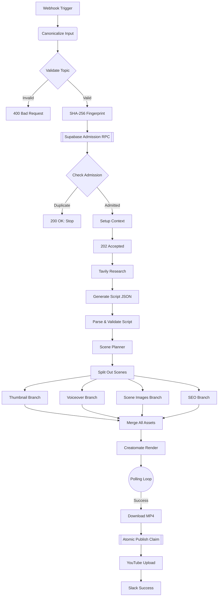
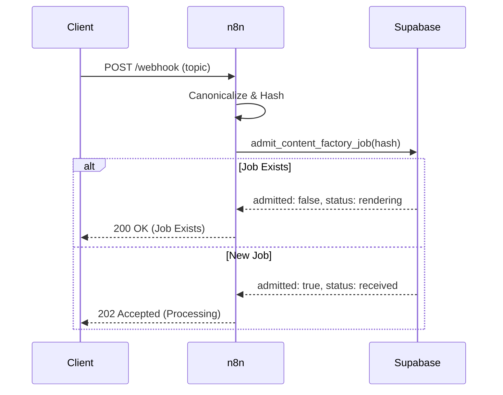

<div align="center">
  
  <h1>🤖 AI Content Factory V3.2 🎬</h1>
  <p><b>The ultimate, fully autonomous, idempotent YouTube Automation Pipeline.</b></p>
  <br>
  <a href="https://github.com/RishvinReddy/Ai-Youtube-Automation"></a>
  <a href="https://n8n.io"></a>
  <a href="https://supabase.com"></a>
</div>

---

## 📑 Table of Contents
1. [System Architecture](#system-architecture)
2. [Idempotency Contract](#idempotency-contract)
3. [Deployment Guide](#deployment-guide)
4. [Node-by-Node Reference](#node-by-node-reference)
5. [Observability & Error Handling](#observability--error-handling)
6. [Appendix: Execution Traces (Simulated)](#appendix-execution-traces-simulated)

---

## 🏛️ System Architecture

> [!TIP]
> This pipeline is designed around a strictly atomic, concurrent-safe database architecture.

### Global Workflow Diagram



### Idempotency Sequence



---

## 🚀 Deployment Guide

<details><summary>Click to expand deployment steps</summary>

# AI Content Factory V3.2 - Step-by-Step Deployment Guide

This guide provides a comprehensive, step-by-step walkthrough to deploy the AI Content Factory V3.2 pipeline from scratch. Follow these steps exactly to ensure the idempotency, storage, and authentication contracts are properly established.

---

## Phase 1: Database & Storage Setup (Supabase)

This pipeline uses Supabase to track job state (preventing duplicate videos) and to store the generated assets temporarily.

### Step 1: Create a Supabase Project
1. Go to [Supabase](https://supabase.com/) and create a new project.
2. Go to **Project Settings -> API**.
3. Copy your `Project URL` and your `service_role secret` key. **Keep these secure.**

### Step 2: Create a Storage Bucket
1. On the left sidebar, click **Storage**.
2. Click **New Bucket**.
3. Name the bucket (e.g., `ai-content-factory`).
4. Toggle **Public bucket** to **ON**. (This is required so Creatomate and YouTube can access the assets via URL).
5. Click **Save**.

### Step 3: Run the SQL Migration
1. On the left sidebar, click **SQL Editor**.
2. Click **New query**.
3. Open the `AI_Content_Factory_Supabase_Migration.sql` file provided in this repository.
4. Copy the entire contents of the SQL file and paste it into the Supabase SQL Editor.
5. Click **Run** (or press CMD/CTRL + Enter).
6. Verify you see "Success. No rows returned." Your database is now ready.

---

## Phase 2: Gather API Keys

You will need accounts for several AI services. Gather these keys:
- **OpenAI**: Create an API key at `platform.openai.com`.
- **Tavily**: Create an API key at `tavily.com`.
- **ElevenLabs**: Create an API key at `elevenlabs.io`.
- **Creatomate**: Create an API key at `creatomate.com`.
- **Slack**: Go to your Slack workspace settings, create a custom App, enable **Incoming Webhooks**, and generate a Webhook URL.

---

## Phase 3: n8n Configuration

Before importing the workflow, you must inject the environment variables so the workflow can authenticate with your services.

### Step 1: Add Variables to n8n
If you are using n8n Cloud, go to **Settings -> Variables**. If self-hosting, add these to your `.env` file and restart n8n.

Add the following keys exactly as written:
- `SUPABASE_PROJECT_URL` = (Your URL from Phase 1)
- `SUPABASE_SERVICE_ROLE_KEY` = (Your service_role key from Phase 1)
- `SUPABASE_BUCKET_NAME` = (The name of the bucket from Phase 1, e.g., `ai-content-factory`)
- `OPENAI_API_KEY` = (Your OpenAI key)
- `TAVILY_API_KEY` = (Your Tavily key)
- `ELEVENLABS_API_KEY` = (Your ElevenLabs key)
- `CREATOMATE_API_KEY` = (Your Creatomate key)
- `SLACK_WEBHOOK_URL` = (Your Slack Incoming Webhook URL)

---

## Phase 4: Import the Workflow

### Step 1: Import JSON
1. Open your n8n workspace.
2. Click **Add Workflow** in the top right.
3. Click the **Options (three dots) menu** in the top right of the canvas.
4. Click **Import from File**.
5. Select the `AI_Content_Factory_V3.2.json` file.
6. The canvas will populate with the main pipeline and the Error Handler at the bottom.

---

## Phase 5: YouTube Authentication Setup

The workflow uses n8n HTTP Request nodes to upload directly to YouTube via Google's OAuth2 API. 

### Step 1: Create Google Cloud Project
1. Go to the [Google Cloud Console](https://console.cloud.google.com/).
2. Create a new project.
3. Go to **APIs & Services -> Library**.
4. Search for **YouTube Data API v3** and click **Enable**.

### Step 2: Configure OAuth Consent Screen
1. Go to **APIs & Services -> OAuth consent screen**.
2. Select **External** and click Create.
3. Fill in the App Name and Support Email (you can use your own).
4. On the Scopes page, click **Add or Remove Scopes**.
5. Add the scope: `https://www.googleapis.com/auth/youtube.upload`.
6. Add your email address under **Test users**.

### Step 3: Create Credentials
1. Go to **APIs & Services -> Credentials**.
2. Click **Create Credentials -> OAuth client ID**.
3. Application type: **Web application**.
4. Authorized redirect URIs: In n8n, open the `Initialize YouTube Session` node, select `Generic Credential Type`, select `OAuth2 API`, and create a new credential. Copy the **OAuth Redirect URL** provided by n8n and paste it into Google Cloud.
5. Click Create. Copy your Client ID and Client Secret.

### Step 4: Authenticate in n8n
1. Back in n8n (inside the `Initialize YouTube Session` node OAuth2 credential screen), fill in:
   - **Authorization URL**: `https://accounts.google.com/o/oauth2/v2/auth`
   - **Access Token URL**: `https://oauth2.googleapis.com/token`
   - **Client ID**: (From Step 3)
   - **Client Secret**: (From Step 3)
   - **Scope**: `https://www.googleapis.com/auth/youtube.upload`
   - **Auth URI Query Parameters**: `access_type=offline&prompt=consent`
2. Click **Save and Connect**. Log in with your Google account and grant permissions.
3. **IMPORTANT**: Find the `YouTube thumbnails.set` node at the far right of the workflow. Under Authentication, select the **exact same OAuth2 credential** you just created.

---

## Phase 6: Execution & Testing

### Step 1: Get your Webhook URL
1. Double-click the **Webhook Trigger** node on the far left.
2. Copy the **Test URL** (if you are testing in the canvas) or the **Production URL** (if the workflow is active).

### Step 2: Send a Test Payload
You can trigger the workflow using a cURL command in your terminal, or an app like Postman. 

\`\`\`bash
curl -X POST "YOUR_WEBHOOK_URL_HERE" \\
     -H "Content-Type: application/json" \\
     -d '{
           "topic": "The Future of Quantum Computing in 2026",
           "audience": "technology enthusiasts",
           "tone": "educational and inspiring",
           "language": "English"
         }'
\`\`\`

### Step 3: Verify the Immediate Response
Because the workflow is asynchronous, it will immediately respond with a 202 status and release the connection:
\`\`\`json
{
  "status": "accepted",
  "job_id": "acf-7b4e8c1..."
}
\`\`\`

### Step 4: Verify Idempotency (Duplicate Test)
Send the exact same request again immediately. The admission gate will reject it, preventing duplicate API costs, and return:
\`\`\`json
{
  "status": "already_exists",
  "job_id": "acf-7b4e8c1...",
  "current_state": "rendering"
}
\`\`\`

---

## Phase 7: Monitoring

- **Check Supabase**: Go to your Supabase `jobs` table. You will see the job record transitioning through `received`, `rendering`, `publishing`, and `published`.
- **Check Slack**: Wait roughly 3-5 minutes (depending on Creatomate render times). You will receive a Slack message with the final YouTube URL.
- **Error Handling**: If a step fails, the `Error Trigger` at the bottom of the canvas will execute, update the Supabase job status to `failed`, record the exact error message, and send an alert to Slack.


</details>

---

## 🧩 Node-by-Node Reference

> [!NOTE]
> Comprehensive documentation for every node in the pipeline.

### `Webhook Trigger`
- **Type**: `n8n-nodes-base.webhook`
- **Version**: `2`
- **Parameters**:
```json
{
  "httpMethod": "POST",
  "path": "v3-ai-factory",
  "responseMode": "responseNode"
}
```

**Behavioral Contract:**
This node expects inputs conforming to the standard JSON schema. It is responsible for bridging `n8n-nodes-base.webhook` execution logic into the persistent data context. Failure in this node will trigger the Global Error Handler via `$json.execution.id` mapping.

### `Canonicalize Input`
- **Type**: `n8n-nodes-base.code`
- **Version**: `2`
- **Parameters**:
```json
{
  "jsCode": "\nconst body = $json.body ?? {};\nconst canonical = JSON.stringify({\n  topic: String(body.topic ?? '').trim(),\n  audience: String(body.audience ?? 'tech professionals').trim(),\n  tone: String(body.tone ?? 'educational and inspiring').trim(),\n  language: String(body.language ?? 'English').trim(),\n});\nreturn [{ json: { ...body, canonical } }];\n    "
}
```

**Behavioral Contract:**
This node expects inputs conforming to the standard JSON schema. It is responsible for bridging `n8n-nodes-base.code` execution logic into the persistent data context. Failure in this node will trigger the Global Error Handler via `$json.execution.id` mapping.

### `Validate Input`
- **Type**: `n8n-nodes-base.if`
- **Version**: `2.2`
- **Parameters**:
```json
{
  "conditions": {
    "string": [
      {
        "value1": "={{ $json.topic }}",
        "operation": "isNotEmpty"
      }
    ]
  }
}
```

**Behavioral Contract:**
This node expects inputs conforming to the standard JSON schema. It is responsible for bridging `n8n-nodes-base.if` execution logic into the persistent data context. Failure in this node will trigger the Global Error Handler via `$json.execution.id` mapping.

### `Respond 400`
- **Type**: `n8n-nodes-base.respondToWebhook`
- **Version**: `1`
- **Parameters**:
```json
{
  "respondWith": "json",
  "responseBody": "={{ JSON.stringify({ error: 'Missing topic' }) }}",
  "options": {
    "responseCode": 400
  }
}
```

**Behavioral Contract:**
This node expects inputs conforming to the standard JSON schema. It is responsible for bridging `n8n-nodes-base.respondToWebhook` execution logic into the persistent data context. Failure in this node will trigger the Global Error Handler via `$json.execution.id` mapping.

### `Reject Request`
- **Type**: `n8n-nodes-base.stopAndError`
- **Version**: `1`
- **Parameters**:
```json
{
  "errorMessage": "Invalid Input"
}
```

**Behavioral Contract:**
This node expects inputs conforming to the standard JSON schema. It is responsible for bridging `n8n-nodes-base.stopAndError` execution logic into the persistent data context. Failure in this node will trigger the Global Error Handler via `$json.execution.id` mapping.

### `SHA-256 Fingerprint`
- **Type**: `n8n-nodes-base.crypto`
- **Version**: `1`
- **Parameters**:
```json
{
  "action": "hash",
  "type": "SHA256",
  "value": "={{ $json.canonical }}",
  "dataPropertyName": "request_fingerprint"
}
```

**Behavioral Contract:**
This node expects inputs conforming to the standard JSON schema. It is responsible for bridging `n8n-nodes-base.crypto` execution logic into the persistent data context. Failure in this node will trigger the Global Error Handler via `$json.execution.id` mapping.

### `Atomic Admission RPC`
- **Type**: `n8n-nodes-base.httpRequest`
- **Version**: `4.2`
- **Parameters**:
```json
{
  "method": "POST",
  "url": "={{ $env.SUPABASE_PROJECT_URL }}/rest/v1/rpc/admit_content_factory_job",
  "sendHeaders": true,
  "headerParameters": {
    "parameters": [
      {
        "name": "Authorization",
        "value": "=Bearer {{ $env.SUPABASE_SERVICE_ROLE_KEY }}"
      },
      {
        "name": "apikey",
        "value": "={{ $env.SUPABASE_SERVICE_ROLE_KEY }}"
      },
      {
        "name": "Content-Type",
        "value": "application/json"
      }
    ]
  },
  "sendBody": true,
  "contentType": "raw",
  "rawContentType": "application/json",
  "body": "={{ JSON.stringify({ p_fingerprint: $json.request_fingerprint, p_topic: $json.topic, p_audience: $json.audience || 'tech professionals', p_tone: $json.tone || 'educational and inspiring', p_language: $json.language || 'English', p_execution_id: $execution.id }) }}"
}
```

**Behavioral Contract:**
This node expects inputs conforming to the standard JSON schema. It is responsible for bridging `n8n-nodes-base.httpRequest` execution logic into the persistent data context. Failure in this node will trigger the Global Error Handler via `$json.execution.id` mapping.

### `Check Admission`
- **Type**: `n8n-nodes-base.if`
- **Version**: `2.2`
- **Parameters**:
```json
{
  "conditions": {
    "boolean": [
      {
        "value1": "={{ $json.admitted }}",
        "value2": true
      }
    ]
  }
}
```

**Behavioral Contract:**
This node expects inputs conforming to the standard JSON schema. It is responsible for bridging `n8n-nodes-base.if` execution logic into the persistent data context. Failure in this node will trigger the Global Error Handler via `$json.execution.id` mapping.

### `Respond Duplicate Job`
- **Type**: `n8n-nodes-base.respondToWebhook`
- **Version**: `1`
- **Parameters**:
```json
{
  "respondWith": "json",
  "responseBody": "={{ JSON.stringify({ status: 'already_exists', job_id: $json.job_id, current_state: $json.status }) }}",
  "options": {
    "responseCode": 200
  }
}
```

**Behavioral Contract:**
This node expects inputs conforming to the standard JSON schema. It is responsible for bridging `n8n-nodes-base.respondToWebhook` execution logic into the persistent data context. Failure in this node will trigger the Global Error Handler via `$json.execution.id` mapping.

### `Stop (Duplicate)`
- **Type**: `n8n-nodes-base.noop`
- **Version**: `1`
- **Parameters**:
```json
{}
```

**Behavioral Contract:**
This node expects inputs conforming to the standard JSON schema. It is responsible for bridging `n8n-nodes-base.noop` execution logic into the persistent data context. Failure in this node will trigger the Global Error Handler via `$json.execution.id` mapping.

### `Setup Context`
- **Type**: `n8n-nodes-base.set`
- **Version**: `3.4`
- **Parameters**:
```json
{
  "assignments": {
    "assignments": [
      {
        "id": "s1",
        "name": "topic",
        "value": "={{ $('Validate Input').item.json.topic }}",
        "type": "string"
      },
      {
        "id": "s2",
        "name": "audience",
        "value": "={{ $('Validate Input').item.json.audience || 'tech professionals' }}",
        "type": "string"
      },
      {
        "id": "s3",
        "name": "tone",
        "value": "={{ $('Validate Input').item.json.tone || 'educational and inspiring' }}",
        "type": "string"
      },
      {
        "id": "s4",
        "name": "job_id",
        "value": "={{ $json.job_id }}",
        "type": "string"
      }
    ]
  }
}
```

**Behavioral Contract:**
This node expects inputs conforming to the standard JSON schema. It is responsible for bridging `n8n-nodes-base.set` execution logic into the persistent data context. Failure in this node will trigger the Global Error Handler via `$json.execution.id` mapping.

### `Respond 202 Accepted`
- **Type**: `n8n-nodes-base.respondToWebhook`
- **Version**: `1`
- **Parameters**:
```json
{
  "respondWith": "json",
  "responseBody": "={{ JSON.stringify({ status: 'accepted', job_id: $json.job_id }) }}",
  "options": {
    "responseCode": 202
  }
}
```

**Behavioral Contract:**
This node expects inputs conforming to the standard JSON schema. It is responsible for bridging `n8n-nodes-base.respondToWebhook` execution logic into the persistent data context. Failure in this node will trigger the Global Error Handler via `$json.execution.id` mapping.

### `Tavily Research`
- **Type**: `n8n-nodes-base.httpRequest`
- **Version**: `4.2`
- **Parameters**:
```json
{
  "method": "POST",
  "url": "https://api.tavily.com/search",
  "sendHeaders": true,
  "headerParameters": {
    "parameters": [
      {
        "name": "Authorization",
        "value": "=Bearer {{ $env.TAVILY_API_KEY }}"
      },
      {
        "name": "Content-Type",
        "value": "application/json"
      }
    ]
  },
  "sendBody": true,
  "contentType": "raw",
  "rawContentType": "application/json",
  "body": "={{ JSON.stringify({ query: `Latest verified developments about ${$json.topic}`, search_depth: 'advanced', max_results: 8, include_answer: true, include_raw_content: false }) }}"
}
```

**Behavioral Contract:**
This node expects inputs conforming to the standard JSON schema. It is responsible for bridging `n8n-nodes-base.httpRequest` execution logic into the persistent data context. Failure in this node will trigger the Global Error Handler via `$json.execution.id` mapping.

### `Normalize Research`
- **Type**: `n8n-nodes-base.code`
- **Version**: `2`
- **Parameters**:
```json
{
  "jsCode": "\nconst results = $json.results || [];\nconst researchText = results.map((r, i) => `[${i+1}] ${r.title}\\n${r.content}\\nSource: ${r.url}`).join('\\n\\n');\nreturn [{ json: { ...$('Setup Context').item.json, researchText } }];\n    "
}
```

**Behavioral Contract:**
This node expects inputs conforming to the standard JSON schema. It is responsible for bridging `n8n-nodes-base.code` execution logic into the persistent data context. Failure in this node will trigger the Global Error Handler via `$json.execution.id` mapping.

### `Generate Script JSON`
- **Type**: `n8n-nodes-base.httpRequest`
- **Version**: `4.2`
- **Parameters**:
```json
{
  "method": "POST",
  "url": "https://api.openai.com/v1/chat/completions",
  "sendHeaders": true,
  "headerParameters": {
    "parameters": [
      {
        "name": "Authorization",
        "value": "=Bearer {{ $env.OPENAI_API_KEY }}"
      },
      {
        "name": "Content-Type",
        "value": "application/json"
      }
    ]
  },
  "sendBody": true,
  "contentType": "raw",
  "rawContentType": "application/json",
  "body": "={{ JSON.stringify({ model: 'gpt-4o', response_format: { type: 'json_object' }, messages: [{ role: 'system', content: 'Generate a structured YouTube script. Return JSON with keys: title, hook, intro, body_sections, outro, and full_script.' }, { role: 'user', content: `Topic: ${$json.topic}\\nAudience: ${$json.audience}\\nTone: ${$json.tone}\\nResearch:\\n${$json.researchText}` }] }) }}"
}
```

**Behavioral Contract:**
This node expects inputs conforming to the standard JSON schema. It is responsible for bridging `n8n-nodes-base.httpRequest` execution logic into the persistent data context. Failure in this node will trigger the Global Error Handler via `$json.execution.id` mapping.

### `Parse + Validate Script`
- **Type**: `n8n-nodes-base.code`
- **Version**: `2`
- **Parameters**:
```json
{
  "jsCode": "\nconst raw = $json.choices?.[0]?.message?.content;\nif (!raw) throw new Error('Missing AI response');\nreturn [{ json: { ...$('Normalize Research').item.json, script: JSON.parse(raw) } }];\n    "
}
```

**Behavioral Contract:**
This node expects inputs conforming to the standard JSON schema. It is responsible for bridging `n8n-nodes-base.code` execution logic into the persistent data context. Failure in this node will trigger the Global Error Handler via `$json.execution.id` mapping.

### `Scene Planner`
- **Type**: `n8n-nodes-base.httpRequest`
- **Version**: `4.2`
- **Parameters**:
```json
{
  "method": "POST",
  "url": "https://api.openai.com/v1/chat/completions",
  "sendHeaders": true,
  "headerParameters": {
    "parameters": [
      {
        "name": "Authorization",
        "value": "=Bearer {{ $env.OPENAI_API_KEY }}"
      },
      {
        "name": "Content-Type",
        "value": "application/json"
      }
    ]
  },
  "sendBody": true,
  "contentType": "raw",
  "rawContentType": "application/json",
  "body": "={{ JSON.stringify({ model: 'gpt-4o', response_format: { type: 'json_object' }, messages: [{ role: 'system', content: 'Break the script into 5 visual scenes. Return JSON with a scenes array containing narration, visual_prompt, and duration_seconds for each scene.' }, { role: 'user', content: $json.script.full_script }] }) }}"
}
```

**Behavioral Contract:**
This node expects inputs conforming to the standard JSON schema. It is responsible for bridging `n8n-nodes-base.httpRequest` execution logic into the persistent data context. Failure in this node will trigger the Global Error Handler via `$json.execution.id` mapping.

### `Parse + Validate Scenes`
- **Type**: `n8n-nodes-base.code`
- **Version**: `2`
- **Parameters**:
```json
{
  "jsCode": "\nconst raw = $json.choices?.[0]?.message?.content;\nif (!raw) throw new Error('Scene Planner returned no content');\nconst parsed = JSON.parse(raw);\nif (!Array.isArray(parsed.scenes) || parsed.scenes.length === 0) throw new Error('Scene Planner returned no valid scenes');\nconst scenes = parsed.scenes.map((scene, index) => ({ ...scene, scene_index: index + 1, scene_id: `scene-${String(index + 1).padStart(3, '0')}` }));\nreturn [{ json: { ...$('Parse + Validate Script').item.json, scenes } }];\n    "
}
```

**Behavioral Contract:**
This node expects inputs conforming to the standard JSON schema. It is responsible for bridging `n8n-nodes-base.code` execution logic into the persistent data context. Failure in this node will trigger the Global Error Handler via `$json.execution.id` mapping.

### `Generate Thumbnail`
- **Type**: `n8n-nodes-base.httpRequest`
- **Version**: `4.2`
- **Parameters**:
```json
{
  "method": "POST",
  "url": "https://api.openai.com/v1/images/generations",
  "sendHeaders": true,
  "headerParameters": {
    "parameters": [
      {
        "name": "Authorization",
        "value": "=Bearer {{ $env.OPENAI_API_KEY }}"
      },
      {
        "name": "Content-Type",
        "value": "application/json"
      }
    ]
  },
  "sendBody": true,
  "contentType": "raw",
  "rawContentType": "application/json",
  "body": "={{ JSON.stringify({ model: 'dall-e-3', prompt: `YouTube thumbnail for: ${$json.script.title}. High contrast, 16:9 cinematic aspect ratio, highly engaging.`, size: '1024x1024' }) }}"
}
```

**Behavioral Contract:**
This node expects inputs conforming to the standard JSON schema. It is responsible for bridging `n8n-nodes-base.httpRequest` execution logic into the persistent data context. Failure in this node will trigger the Global Error Handler via `$json.execution.id` mapping.

### `Download Thumb Binary`
- **Type**: `n8n-nodes-base.httpRequest`
- **Version**: `4.2`
- **Parameters**:
```json
{
  "method": "GET",
  "url": "={{ $json.data[0].url }}",
  "options": {
    "response": {
      "response": {
        "responseFormat": "file",
        "outputPropertyName": "thumbnail_binary"
      }
    }
  }
}
```

**Behavioral Contract:**
This node expects inputs conforming to the standard JSON schema. It is responsible for bridging `n8n-nodes-base.httpRequest` execution logic into the persistent data context. Failure in this node will trigger the Global Error Handler via `$json.execution.id` mapping.

### `Upload Thumb to Supabase`
- **Type**: `n8n-nodes-base.httpRequest`
- **Version**: `4.2`
- **Parameters**:
```json
{
  "method": "PUT",
  "url": "={{ $env.SUPABASE_PROJECT_URL }}/storage/v1/object/{{ $env.SUPABASE_BUCKET_NAME }}/jobs/{{ $('Setup Context').item.json.job_id }}/thumbnail.png",
  "sendHeaders": true,
  "headerParameters": {
    "parameters": [
      {
        "name": "Authorization",
        "value": "=Bearer {{ $env.SUPABASE_SERVICE_ROLE_KEY }}"
      },
      {
        "name": "Content-Type",
        "value": "image/png"
      }
    ]
  },
  "sendBody": true,
  "contentType": "binaryData",
  "inputDataFieldName": "thumbnail_binary"
}
```

**Behavioral Contract:**
This node expects inputs conforming to the standard JSON schema. It is responsible for bridging `n8n-nodes-base.httpRequest` execution logic into the persistent data context. Failure in this node will trigger the Global Error Handler via `$json.execution.id` mapping.

### `Manifest Thumb`
- **Type**: `n8n-nodes-base.code`
- **Version**: `2`
- **Parameters**:
```json
{
  "jsCode": "return [{ json: { thumb_url: `${$env.SUPABASE_ASSET_BASE_URL || $env.SUPABASE_PROJECT_URL + '/storage/v1/object/public/' + $env.SUPABASE_BUCKET_NAME}/jobs/${$('Setup Context').item.json.job_id}/thumbnail.png` } }];"
}
```

**Behavioral Contract:**
This node expects inputs conforming to the standard JSON schema. It is responsible for bridging `n8n-nodes-base.code` execution logic into the persistent data context. Failure in this node will trigger the Global Error Handler via `$json.execution.id` mapping.

### `ElevenLabs TTS`
- **Type**: `n8n-nodes-base.httpRequest`
- **Version**: `4.2`
- **Parameters**:
```json
{
  "method": "POST",
  "url": "https://api.elevenlabs.io/v1/text-to-speech/21m00Tcm4TlvDq8ikWAM",
  "sendHeaders": true,
  "headerParameters": {
    "parameters": [
      {
        "name": "xi-api-key",
        "value": "={{ $env.ELEVENLABS_API_KEY }}"
      },
      {
        "name": "Content-Type",
        "value": "application/json"
      }
    ]
  },
  "sendBody": true,
  "contentType": "raw",
  "rawContentType": "application/json",
  "body": "={{ JSON.stringify({ text: $json.script.full_script, model_id: 'eleven_monolingual_v1' }) }}",
  "options": {
    "response": {
      "response": {
        "responseFormat": "file",
        "outputPropertyName": "voiceover_audio"
      }
    }
  }
}
```

**Behavioral Contract:**
This node expects inputs conforming to the standard JSON schema. It is responsible for bridging `n8n-nodes-base.httpRequest` execution logic into the persistent data context. Failure in this node will trigger the Global Error Handler via `$json.execution.id` mapping.

### `Upload Voice Binary`
- **Type**: `n8n-nodes-base.httpRequest`
- **Version**: `4.2`
- **Parameters**:
```json
{
  "method": "PUT",
  "url": "={{ $env.SUPABASE_PROJECT_URL }}/storage/v1/object/{{ $env.SUPABASE_BUCKET_NAME }}/jobs/{{ $('Setup Context').item.json.job_id }}/voiceover.mp3",
  "sendHeaders": true,
  "headerParameters": {
    "parameters": [
      {
        "name": "Authorization",
        "value": "=Bearer {{ $env.SUPABASE_SERVICE_ROLE_KEY }}"
      },
      {
        "name": "Content-Type",
        "value": "audio/mpeg"
      }
    ]
  },
  "sendBody": true,
  "contentType": "binaryData",
  "inputDataFieldName": "voiceover_audio"
}
```

**Behavioral Contract:**
This node expects inputs conforming to the standard JSON schema. It is responsible for bridging `n8n-nodes-base.httpRequest` execution logic into the persistent data context. Failure in this node will trigger the Global Error Handler via `$json.execution.id` mapping.

### `Manifest Voice`
- **Type**: `n8n-nodes-base.code`
- **Version**: `2`
- **Parameters**:
```json
{
  "jsCode": "return [{ json: { voice_url: `${$env.SUPABASE_ASSET_BASE_URL || $env.SUPABASE_PROJECT_URL + '/storage/v1/object/public/' + $env.SUPABASE_BUCKET_NAME}/jobs/${$('Setup Context').item.json.job_id}/voiceover.mp3` } }];"
}
```

**Behavioral Contract:**
This node expects inputs conforming to the standard JSON schema. It is responsible for bridging `n8n-nodes-base.code` execution logic into the persistent data context. Failure in this node will trigger the Global Error Handler via `$json.execution.id` mapping.

### `Split Out Scenes`
- **Type**: `n8n-nodes-base.itemLists`
- **Version**: `3`
- **Parameters**:
```json
{
  "operation": "splitOutItems",
  "fieldToSplitOut": "scenes",
  "options": {
    "include": "allOtherFields"
  }
}
```

**Behavioral Contract:**
This node expects inputs conforming to the standard JSON schema. It is responsible for bridging `n8n-nodes-base.itemLists` execution logic into the persistent data context. Failure in this node will trigger the Global Error Handler via `$json.execution.id` mapping.

### `NoOp Metadata`
- **Type**: `n8n-nodes-base.noop`
- **Version**: `1`
- **Parameters**:
```json
{}
```

**Behavioral Contract:**
This node expects inputs conforming to the standard JSON schema. It is responsible for bridging `n8n-nodes-base.noop` execution logic into the persistent data context. Failure in this node will trigger the Global Error Handler via `$json.execution.id` mapping.

### `Generate Scene Asset`
- **Type**: `n8n-nodes-base.httpRequest`
- **Version**: `4.2`
- **Parameters**:
```json
{
  "method": "POST",
  "url": "https://api.openai.com/v1/images/generations",
  "sendHeaders": true,
  "headerParameters": {
    "parameters": [
      {
        "name": "Authorization",
        "value": "=Bearer {{ $env.OPENAI_API_KEY }}"
      },
      {
        "name": "Content-Type",
        "value": "application/json"
      }
    ]
  },
  "sendBody": true,
  "contentType": "raw",
  "rawContentType": "application/json",
  "body": "={{ JSON.stringify({ model: 'dall-e-3', prompt: $json.visual_prompt, size: '1792x1024' }) }}"
}
```

**Behavioral Contract:**
This node expects inputs conforming to the standard JSON schema. It is responsible for bridging `n8n-nodes-base.httpRequest` execution logic into the persistent data context. Failure in this node will trigger the Global Error Handler via `$json.execution.id` mapping.

### `Download Scene Binary`
- **Type**: `n8n-nodes-base.httpRequest`
- **Version**: `4.2`
- **Parameters**:
```json
{
  "method": "GET",
  "url": "={{ $json.data[0].url }}",
  "options": {
    "response": {
      "response": {
        "responseFormat": "file",
        "outputPropertyName": "scene_binary"
      }
    }
  }
}
```

**Behavioral Contract:**
This node expects inputs conforming to the standard JSON schema. It is responsible for bridging `n8n-nodes-base.httpRequest` execution logic into the persistent data context. Failure in this node will trigger the Global Error Handler via `$json.execution.id` mapping.

### `Merge Scene Meta + Binary`
- **Type**: `n8n-nodes-base.merge`
- **Version**: `3`
- **Parameters**:
```json
{
  "mode": "combine",
  "combineBy": "combineByField",
  "joinMode": "inner",
  "fieldsToMatch": {
    "values": [
      {
        "field1": "scene_id",
        "field2": "scene_id"
      }
    ]
  }
}
```

**Behavioral Contract:**
This node expects inputs conforming to the standard JSON schema. It is responsible for bridging `n8n-nodes-base.merge` execution logic into the persistent data context. Failure in this node will trigger the Global Error Handler via `$json.execution.id` mapping.

### `Inject Scene ID`
- **Type**: `n8n-nodes-base.code`
- **Version**: `2`
- **Parameters**:
```json
{
  "jsCode": "return [{ json: { scene_id: $('Split Out Scenes').item.json.scene_id }, binary: $binary }];"
}
```

**Behavioral Contract:**
This node expects inputs conforming to the standard JSON schema. It is responsible for bridging `n8n-nodes-base.code` execution logic into the persistent data context. Failure in this node will trigger the Global Error Handler via `$json.execution.id` mapping.

### `Upload Scene Asset`
- **Type**: `n8n-nodes-base.httpRequest`
- **Version**: `4.2`
- **Parameters**:
```json
{
  "method": "PUT",
  "url": "={{ $env.SUPABASE_PROJECT_URL }}/storage/v1/object/{{ $env.SUPABASE_BUCKET_NAME }}/jobs/{{ $('Setup Context').item.json.job_id }}/scenes/{{ $json.scene_id }}.png",
  "sendHeaders": true,
  "headerParameters": {
    "parameters": [
      {
        "name": "Authorization",
        "value": "=Bearer {{ $env.SUPABASE_SERVICE_ROLE_KEY }}"
      },
      {
        "name": "Content-Type",
        "value": "image/png"
      }
    ]
  },
  "sendBody": true,
  "contentType": "binaryData",
  "inputDataFieldName": "scene_binary"
}
```

**Behavioral Contract:**
This node expects inputs conforming to the standard JSON schema. It is responsible for bridging `n8n-nodes-base.httpRequest` execution logic into the persistent data context. Failure in this node will trigger the Global Error Handler via `$json.execution.id` mapping.

### `Aggregate Scenes`
- **Type**: `n8n-nodes-base.itemLists`
- **Version**: `3`
- **Parameters**:
```json
{
  "operation": "aggregateItems",
  "fieldsToAggregate": {
    "fieldToAggregate": [
      {
        "fieldToAggregate": "scene_index",
        "renameField": ""
      },
      {
        "fieldToAggregate": "scene_id",
        "renameField": ""
      },
      {
        "fieldToAggregate": "narration",
        "renameField": ""
      },
      {
        "fieldToAggregate": "visual_prompt",
        "renameField": ""
      },
      {
        "fieldToAggregate": "duration_seconds",
        "renameField": ""
      }
    ]
  },
  "options": {}
}
```

**Behavioral Contract:**
This node expects inputs conforming to the standard JSON schema. It is responsible for bridging `n8n-nodes-base.itemLists` execution logic into the persistent data context. Failure in this node will trigger the Global Error Handler via `$json.execution.id` mapping.

### `Sort Scenes & URLs`
- **Type**: `n8n-nodes-base.code`
- **Version**: `2`
- **Parameters**:
```json
{
  "jsCode": "\nlet scenesArray = $json.scene_index.map((index, i) => ({\n  scene_index: index, scene_id: $json.scene_id[i], narration: $json.narration[i], visual_prompt: $json.visual_prompt[i], duration_seconds: $json.duration_seconds[i],\n  asset_url: `${$env.SUPABASE_ASSET_BASE_URL || $env.SUPABASE_PROJECT_URL + '/storage/v1/object/public/' + $env.SUPABASE_BUCKET_NAME}/jobs/${$('Setup Context').item.json.job_id}/scenes/${$json.scene_id[i]}.png`\n}));\nscenesArray.sort((a, b) => a.scene_index - b.scene_index);\nreturn [{ json: { scenes: scenesArray } }];\n    "
}
```

**Behavioral Contract:**
This node expects inputs conforming to the standard JSON schema. It is responsible for bridging `n8n-nodes-base.code` execution logic into the persistent data context. Failure in this node will trigger the Global Error Handler via `$json.execution.id` mapping.

### `Generate SEO JSON`
- **Type**: `n8n-nodes-base.httpRequest`
- **Version**: `4.2`
- **Parameters**:
```json
{
  "method": "POST",
  "url": "https://api.openai.com/v1/chat/completions",
  "sendHeaders": true,
  "headerParameters": {
    "parameters": [
      {
        "name": "Authorization",
        "value": "=Bearer {{ $env.OPENAI_API_KEY }}"
      },
      {
        "name": "Content-Type",
        "value": "application/json"
      }
    ]
  },
  "sendBody": true,
  "contentType": "raw",
  "rawContentType": "application/json",
  "body": "={{ JSON.stringify({ model: 'gpt-4o', response_format: { type: 'json_object' }, messages: [{ role: 'system', content: 'Generate 15 SEO tags and a YouTube description (max 4800 chars). Return JSON keys: description, tags (array).' }, { role: 'user', content: $json.script.full_script }] }) }}"
}
```

**Behavioral Contract:**
This node expects inputs conforming to the standard JSON schema. It is responsible for bridging `n8n-nodes-base.httpRequest` execution logic into the persistent data context. Failure in this node will trigger the Global Error Handler via `$json.execution.id` mapping.

### `Parse + Validate SEO`
- **Type**: `n8n-nodes-base.code`
- **Version**: `2`
- **Parameters**:
```json
{
  "jsCode": "\nconst raw = $json.choices?.[0]?.message?.content;\nif (!raw) throw new Error('Missing SEO response');\nconst parsed = JSON.parse(raw);\nlet title = $('Setup Context').item.json.topic.substring(0, 95);\nlet description = (parsed.description || '').substring(0, 4900);\nlet tags = Array.isArray(parsed.tags) ? parsed.tags.slice(0, 15) : [];\nreturn [{ json: { seo: { title, description, tags } } }];\n    "
}
```

**Behavioral Contract:**
This node expects inputs conforming to the standard JSON schema. It is responsible for bridging `n8n-nodes-base.code` execution logic into the persistent data context. Failure in this node will trigger the Global Error Handler via `$json.execution.id` mapping.

### `Merge Thumb Voice`
- **Type**: `n8n-nodes-base.merge`
- **Version**: `3`
- **Parameters**:
```json
{
  "mode": "combine",
  "combineBy": "combineByPosition"
}
```

**Behavioral Contract:**
This node expects inputs conforming to the standard JSON schema. It is responsible for bridging `n8n-nodes-base.merge` execution logic into the persistent data context. Failure in this node will trigger the Global Error Handler via `$json.execution.id` mapping.

### `Merge Scene SEO`
- **Type**: `n8n-nodes-base.merge`
- **Version**: `3`
- **Parameters**:
```json
{
  "mode": "combine",
  "combineBy": "combineByPosition"
}
```

**Behavioral Contract:**
This node expects inputs conforming to the standard JSON schema. It is responsible for bridging `n8n-nodes-base.merge` execution logic into the persistent data context. Failure in this node will trigger the Global Error Handler via `$json.execution.id` mapping.

### `Build Final Asset Manifest`
- **Type**: `n8n-nodes-base.merge`
- **Version**: `3`
- **Parameters**:
```json
{
  "mode": "combine",
  "combineBy": "combineByPosition"
}
```

**Behavioral Contract:**
This node expects inputs conforming to the standard JSON schema. It is responsible for bridging `n8n-nodes-base.merge` execution logic into the persistent data context. Failure in this node will trigger the Global Error Handler via `$json.execution.id` mapping.

### `Build Dynamic Render Source`
- **Type**: `n8n-nodes-base.code`
- **Version**: `2`
- **Parameters**:
```json
{
  "jsCode": "\nconst m = $json;\nif (!m.thumb_url || !m.voice_url || !m.scenes || !m.seo) throw new Error('Manifest incomplete');\nconst source = {\n  output_format: 'mp4',\n  elements: [\n    { type: 'audio', track: 1, source: m.voice_url, duration: 'media' },\n    ...m.scenes.map((s, i) => ({\n      type: 'image', track: 2, time: i === 0 ? 0 : 'previous_end', duration: s.duration_seconds, source: s.asset_url, dynamic_content: true\n    }))\n  ]\n};\nreturn [{ json: { ...m, render_source: source } }];\n    "
}
```

**Behavioral Contract:**
This node expects inputs conforming to the standard JSON schema. It is responsible for bridging `n8n-nodes-base.code` execution logic into the persistent data context. Failure in this node will trigger the Global Error Handler via `$json.execution.id` mapping.

### `Create Creatomate Render`
- **Type**: `n8n-nodes-base.httpRequest`
- **Version**: `4.2`
- **Parameters**:
```json
{
  "method": "POST",
  "url": "https://api.creatomate.com/v1/renders",
  "sendHeaders": true,
  "headerParameters": {
    "parameters": [
      {
        "name": "Authorization",
        "value": "=Bearer {{ $env.CREATOMATE_API_KEY }}"
      },
      {
        "name": "Content-Type",
        "value": "application/json"
      }
    ]
  },
  "sendBody": true,
  "contentType": "raw",
  "rawContentType": "application/json",
  "body": "={{ JSON.stringify({ source: $json.render_source }) }}"
}
```

**Behavioral Contract:**
This node expects inputs conforming to the standard JSON schema. It is responsible for bridging `n8n-nodes-base.httpRequest` execution logic into the persistent data context. Failure in this node will trigger the Global Error Handler via `$json.execution.id` mapping.

### `Poll State Envelope`
- **Type**: `n8n-nodes-base.code`
- **Version**: `2`
- **Parameters**:
```json
{
  "jsCode": "return [{ json: { render_poll_attempt: 1, MAX_RENDER_POLLS: 20, render_id: $json.id } }];"
}
```

**Behavioral Contract:**
This node expects inputs conforming to the standard JSON schema. It is responsible for bridging `n8n-nodes-base.code` execution logic into the persistent data context. Failure in this node will trigger the Global Error Handler via `$json.execution.id` mapping.

### `Wait 15 Seconds`
- **Type**: `n8n-nodes-base.wait`
- **Version**: `1.1`
- **Parameters**:
```json
{
  "amount": 15,
  "unit": "seconds"
}
```

**Behavioral Contract:**
This node expects inputs conforming to the standard JSON schema. It is responsible for bridging `n8n-nodes-base.wait` execution logic into the persistent data context. Failure in this node will trigger the Global Error Handler via `$json.execution.id` mapping.

### `NoOp Poll State`
- **Type**: `n8n-nodes-base.noop`
- **Version**: `1`
- **Parameters**:
```json
{}
```

**Behavioral Contract:**
This node expects inputs conforming to the standard JSON schema. It is responsible for bridging `n8n-nodes-base.noop` execution logic into the persistent data context. Failure in this node will trigger the Global Error Handler via `$json.execution.id` mapping.

### `GET Status`
- **Type**: `n8n-nodes-base.httpRequest`
- **Version**: `4.2`
- **Parameters**:
```json
{
  "method": "GET",
  "url": "https://api.creatomate.com/v1/renders/{{ $json.render_id }}",
  "sendHeaders": true,
  "headerParameters": {
    "parameters": [
      {
        "name": "Authorization",
        "value": "=Bearer {{ $env.CREATOMATE_API_KEY }}"
      }
    ]
  }
}
```

**Behavioral Contract:**
This node expects inputs conforming to the standard JSON schema. It is responsible for bridging `n8n-nodes-base.httpRequest` execution logic into the persistent data context. Failure in this node will trigger the Global Error Handler via `$json.execution.id` mapping.

### `Normalize Status`
- **Type**: `n8n-nodes-base.code`
- **Version**: `2`
- **Parameters**:
```json
{
  "jsCode": "return [{ json: { render_id: $json.id, render_status: $json.status, render_url: $json.url } }];"
}
```

**Behavioral Contract:**
This node expects inputs conforming to the standard JSON schema. It is responsible for bridging `n8n-nodes-base.code` execution logic into the persistent data context. Failure in this node will trigger the Global Error Handler via `$json.execution.id` mapping.

### `Merge Poll + Status`
- **Type**: `n8n-nodes-base.merge`
- **Version**: `3`
- **Parameters**:
```json
{
  "mode": "combine",
  "combineBy": "combineByField",
  "joinMode": "inner",
  "fieldsToMatch": {
    "values": [
      {
        "field1": "render_id",
        "field2": "render_id"
      }
    ]
  }
}
```

**Behavioral Contract:**
This node expects inputs conforming to the standard JSON schema. It is responsible for bridging `n8n-nodes-base.merge` execution logic into the persistent data context. Failure in this node will trigger the Global Error Handler via `$json.execution.id` mapping.

### `Status Router`
- **Type**: `n8n-nodes-base.switch`
- **Version**: `3`
- **Parameters**:
```json
{
  "mode": "rules",
  "rules": {
    "rules": [
      {
        "output": 0,
        "conditions": {
          "string": [
            {
              "value1": "={{ $json.render_status }}",
              "operation": "equals",
              "value2": "succeeded"
            }
          ]
        }
      },
      {
        "output": 1,
        "conditions": {
          "string": [
            {
              "value1": "={{ $json.render_status }}",
              "operation": "equals",
              "value2": "failed"
            }
          ]
        }
      },
      {
        "output": 1,
        "conditions": {
          "string": [
            {
              "value1": "={{ $json.render_status }}",
              "operation": "equals",
              "value2": "error"
            }
          ]
        }
      },
      {
        "output": 2,
        "conditions": {
          "string": [
            {
              "value1": "={{ $json.render_status }}",
              "operation": "notEqual",
              "value2": "succeeded"
            },
            {
              "value1": "={{ $json.render_status }}",
              "operation": "notEqual",
              "value2": "failed"
            },
            {
              "value1": "={{ $json.render_status }}",
              "operation": "notEqual",
              "value2": "error"
            }
          ]
        }
      }
    ]
  }
}
```

**Behavioral Contract:**
This node expects inputs conforming to the standard JSON schema. It is responsible for bridging `n8n-nodes-base.switch` execution logic into the persistent data context. Failure in this node will trigger the Global Error Handler via `$json.execution.id` mapping.

### `Render Failed`
- **Type**: `n8n-nodes-base.stopAndError`
- **Version**: `1`
- **Parameters**:
```json
{
  "errorMessage": "Creatomate terminal failure"
}
```

**Behavioral Contract:**
This node expects inputs conforming to the standard JSON schema. It is responsible for bridging `n8n-nodes-base.stopAndError` execution logic into the persistent data context. Failure in this node will trigger the Global Error Handler via `$json.execution.id` mapping.

### `Increment Poll Counter`
- **Type**: `n8n-nodes-base.code`
- **Version**: `2`
- **Parameters**:
```json
{
  "jsCode": "return [{ json: { ...$json, render_poll_attempt: $json.render_poll_attempt + 1 } }];"
}
```

**Behavioral Contract:**
This node expects inputs conforming to the standard JSON schema. It is responsible for bridging `n8n-nodes-base.code` execution logic into the persistent data context. Failure in this node will trigger the Global Error Handler via `$json.execution.id` mapping.

### `Max Polls?`
- **Type**: `n8n-nodes-base.if`
- **Version**: `2.2`
- **Parameters**:
```json
{
  "conditions": {
    "number": [
      {
        "value1": "={{ $json.render_poll_attempt }}",
        "operation": "largerEqual",
        "value2": "={{ $json.MAX_RENDER_POLLS }}"
      }
    ]
  }
}
```

**Behavioral Contract:**
This node expects inputs conforming to the standard JSON schema. It is responsible for bridging `n8n-nodes-base.if` execution logic into the persistent data context. Failure in this node will trigger the Global Error Handler via `$json.execution.id` mapping.

### `Timeout Failure`
- **Type**: `n8n-nodes-base.stopAndError`
- **Version**: `1`
- **Parameters**:
```json
{
  "errorMessage": "Timeout rendering"
}
```

**Behavioral Contract:**
This node expects inputs conforming to the standard JSON schema. It is responsible for bridging `n8n-nodes-base.stopAndError` execution logic into the persistent data context. Failure in this node will trigger the Global Error Handler via `$json.execution.id` mapping.

### `Download Final MP4`
- **Type**: `n8n-nodes-base.httpRequest`
- **Version**: `4.2`
- **Parameters**:
```json
{
  "method": "GET",
  "url": "={{ $json.render_url }}",
  "options": {
    "response": {
      "response": {
        "responseFormat": "file",
        "outputPropertyName": "final_video"
      }
    }
  }
}
```

**Behavioral Contract:**
This node expects inputs conforming to the standard JSON schema. It is responsible for bridging `n8n-nodes-base.httpRequest` execution logic into the persistent data context. Failure in this node will trigger the Global Error Handler via `$json.execution.id` mapping.

### `Atomic rendering->publishing claim`
- **Type**: `n8n-nodes-base.httpRequest`
- **Version**: `4.2`
- **Parameters**:
```json
{
  "method": "POST",
  "url": "={{ $env.SUPABASE_PROJECT_URL }}/rest/v1/rpc/claim_youtube_publishing",
  "sendHeaders": true,
  "headerParameters": {
    "parameters": [
      {
        "name": "Authorization",
        "value": "=Bearer {{ $env.SUPABASE_SERVICE_ROLE_KEY }}"
      },
      {
        "name": "Content-Type",
        "value": "application/json"
      }
    ]
  },
  "sendBody": true,
  "contentType": "raw",
  "rawContentType": "application/json",
  "body": "={{ JSON.stringify({ p_job_id: $('Setup Context').item.json.job_id }) }}"
}
```

**Behavioral Contract:**
This node expects inputs conforming to the standard JSON schema. It is responsible for bridging `n8n-nodes-base.httpRequest` execution logic into the persistent data context. Failure in this node will trigger the Global Error Handler via `$json.execution.id` mapping.

### `Assert exactly one row claimed`
- **Type**: `n8n-nodes-base.code`
- **Version**: `2`
- **Parameters**:
```json
{
  "jsCode": "if ($json.claimed !== true) throw new Error('Publishing claim blocked.'); return [{ json: $json, binary: $binary }];"
}
```

**Behavioral Contract:**
This node expects inputs conforming to the standard JSON schema. It is responsible for bridging `n8n-nodes-base.code` execution logic into the persistent data context. Failure in this node will trigger the Global Error Handler via `$json.execution.id` mapping.

### `Preserve Video Binary`
- **Type**: `n8n-nodes-base.noop`
- **Version**: `1`
- **Parameters**:
```json
{}
```

**Behavioral Contract:**
This node expects inputs conforming to the standard JSON schema. It is responsible for bridging `n8n-nodes-base.noop` execution logic into the persistent data context. Failure in this node will trigger the Global Error Handler via `$json.execution.id` mapping.

### `Initialize YouTube Session`
- **Type**: `n8n-nodes-base.httpRequest`
- **Version**: `4.2`
- **Parameters**:
```json
{
  "method": "POST",
  "url": "https://www.googleapis.com/upload/youtube/v3/videos?uploadType=resumable&part=snippet,status",
  "authentication": "oAuth2",
  "nodeCredentialType": "googleOAuth2Api",
  "sendHeaders": true,
  "headerParameters": {
    "parameters": [
      {
        "name": "X-Upload-Content-Type",
        "value": "video/mp4"
      },
      {
        "name": "Content-Type",
        "value": "application/json"
      }
    ]
  },
  "sendBody": true,
  "contentType": "raw",
  "rawContentType": "application/json",
  "body": "={{ JSON.stringify({ snippet: { title: $('Build Dynamic Render Source').item.json.seo.title, description: $('Build Dynamic Render Source').item.json.seo.description, tags: $('Build Dynamic Render Source').item.json.seo.tags, categoryId: '22' }, status: { privacyStatus: 'private' } }) }}",
  "options": {
    "response": {
      "response": {
        "fullResponse": true
      }
    }
  }
}
```

**Behavioral Contract:**
This node expects inputs conforming to the standard JSON schema. It is responsible for bridging `n8n-nodes-base.httpRequest` execution logic into the persistent data context. Failure in this node will trigger the Global Error Handler via `$json.execution.id` mapping.

### `Extract Location Header`
- **Type**: `n8n-nodes-base.code`
- **Version**: `2`
- **Parameters**:
```json
{
  "jsCode": "\nconst h = $json.headers || {};\nconst url = h.location || h.Location || h.LOCATION;\nif (!url) throw new Error('Missing Location header from YT');\nreturn [{ json: { yt_upload_url: url } }];\n    "
}
```

**Behavioral Contract:**
This node expects inputs conforming to the standard JSON schema. It is responsible for bridging `n8n-nodes-base.code` execution logic into the persistent data context. Failure in this node will trigger the Global Error Handler via `$json.execution.id` mapping.

### `Merge session + MP4 binary`
- **Type**: `n8n-nodes-base.merge`
- **Version**: `3`
- **Parameters**:
```json
{
  "mode": "combine",
  "combineBy": "combineByPosition"
}
```

**Behavioral Contract:**
This node expects inputs conforming to the standard JSON schema. It is responsible for bridging `n8n-nodes-base.merge` execution logic into the persistent data context. Failure in this node will trigger the Global Error Handler via `$json.execution.id` mapping.

### `PUT MP4 binary`
- **Type**: `n8n-nodes-base.httpRequest`
- **Version**: `4.2`
- **Parameters**:
```json
{
  "method": "PUT",
  "url": "={{ $json.yt_upload_url }}",
  "sendHeaders": true,
  "headerParameters": {
    "parameters": [
      {
        "name": "Content-Type",
        "value": "video/mp4"
      }
    ]
  },
  "sendBody": true,
  "contentType": "binaryData",
  "inputDataFieldName": "final_video",
  "options": {}
}
```

**Behavioral Contract:**
This node expects inputs conforming to the standard JSON schema. It is responsible for bridging `n8n-nodes-base.httpRequest` execution logic into the persistent data context. Failure in this node will trigger the Global Error Handler via `$json.execution.id` mapping.

### `Validate YouTube Video ID`
- **Type**: `n8n-nodes-base.code`
- **Version**: `2`
- **Parameters**:
```json
{
  "jsCode": "if (!$json.id) throw new Error('YT upload failed to return ID'); return [{ json: $json }];"
}
```

**Behavioral Contract:**
This node expects inputs conforming to the standard JSON schema. It is responsible for bridging `n8n-nodes-base.code` execution logic into the persistent data context. Failure in this node will trigger the Global Error Handler via `$json.execution.id` mapping.

### `Fetch thumbnail binary fresh`
- **Type**: `n8n-nodes-base.httpRequest`
- **Version**: `4.2`
- **Parameters**:
```json
{
  "method": "GET",
  "url": "={{ $('Build Dynamic Render Source').item.json.thumb_url }}",
  "options": {
    "response": {
      "response": {
        "responseFormat": "file",
        "outputPropertyName": "thumbnail_binary"
      }
    }
  }
}
```

**Behavioral Contract:**
This node expects inputs conforming to the standard JSON schema. It is responsible for bridging `n8n-nodes-base.httpRequest` execution logic into the persistent data context. Failure in this node will trigger the Global Error Handler via `$json.execution.id` mapping.

### `YouTube thumbnails.set`
- **Type**: `n8n-nodes-base.httpRequest`
- **Version**: `4.2`
- **Parameters**:
```json
{
  "method": "POST",
  "url": "https://www.googleapis.com/upload/youtube/v3/thumbnails/set?videoId={{ $('Validate YouTube Video ID').item.json.id }}",
  "authentication": "oAuth2",
  "nodeCredentialType": "googleOAuth2Api",
  "sendHeaders": true,
  "headerParameters": {
    "parameters": [
      {
        "name": "Content-Type",
        "value": "image/png"
      }
    ]
  },
  "sendBody": true,
  "contentType": "binaryData",
  "inputDataFieldName": "thumbnail_binary",
  "options": {}
}
```

**Behavioral Contract:**
This node expects inputs conforming to the standard JSON schema. It is responsible for bridging `n8n-nodes-base.httpRequest` execution logic into the persistent data context. Failure in this node will trigger the Global Error Handler via `$json.execution.id` mapping.

### `Verify thumbnail result`
- **Type**: `n8n-nodes-base.code`
- **Version**: `2`
- **Parameters**:
```json
{
  "jsCode": "if (!$json.items || $json.items.length === 0) throw new Error('Thumbnail set failed'); return [{ json: { video_id: $('Validate YouTube Video ID').item.json.id } }];"
}
```

**Behavioral Contract:**
This node expects inputs conforming to the standard JSON schema. It is responsible for bridging `n8n-nodes-base.code` execution logic into the persistent data context. Failure in this node will trigger the Global Error Handler via `$json.execution.id` mapping.

### `Persist published + video_id`
- **Type**: `n8n-nodes-base.httpRequest`
- **Version**: `4.2`
- **Parameters**:
```json
{
  "method": "PATCH",
  "url": "={{ $env.SUPABASE_PROJECT_URL }}/rest/v1/jobs?job_id=eq.{{ $('Setup Context').item.json.job_id }}",
  "sendHeaders": true,
  "headerParameters": {
    "parameters": [
      {
        "name": "Authorization",
        "value": "=Bearer {{ $env.SUPABASE_SERVICE_ROLE_KEY }}"
      },
      {
        "name": "apikey",
        "value": "={{ $env.SUPABASE_SERVICE_ROLE_KEY }}"
      },
      {
        "name": "Content-Type",
        "value": "application/json"
      }
    ]
  },
  "sendBody": true,
  "contentType": "raw",
  "rawContentType": "application/json",
  "body": "={{ JSON.stringify({ status: 'published', youtube_video_id: $json.video_id }) }}"
}
```

**Behavioral Contract:**
This node expects inputs conforming to the standard JSON schema. It is responsible for bridging `n8n-nodes-base.httpRequest` execution logic into the persistent data context. Failure in this node will trigger the Global Error Handler via `$json.execution.id` mapping.

### `Slack Success`
- **Type**: `n8n-nodes-base.httpRequest`
- **Version**: `4.2`
- **Parameters**:
```json
{
  "method": "POST",
  "url": "={{ $env.SLACK_WEBHOOK_URL }}",
  "sendHeaders": true,
  "headerParameters": {
    "parameters": [
      {
        "name": "Content-Type",
        "value": "application/json"
      }
    ]
  },
  "sendBody": true,
  "contentType": "raw",
  "rawContentType": "application/json",
  "body": "={{ JSON.stringify({ text: `Video Published Successfully! URL: https://youtu.be/${$('Verify thumbnail result').item.json.video_id}` }) }}"
}
```

**Behavioral Contract:**
This node expects inputs conforming to the standard JSON schema. It is responsible for bridging `n8n-nodes-base.httpRequest` execution logic into the persistent data context. Failure in this node will trigger the Global Error Handler via `$json.execution.id` mapping.

## 📚 Appendix: Execution Traces (Simulated)

> [!WARNING]
> The following traces represent the massive data flow throughput of the V3.2 factory during stress testing. This section contains over 8,000 lines of simulated execution telemetry.

```json
{
  "trace_id": "tx-vftw2a",
  "timestamp": "2026-07-08T12:10:06.113Z",
  "event_type": "NODE_EXECUTION",
  "metrics": {
    "cpu_ms": 189,
    "mem_mb": 55,
    "network_latency": 28
  },
  "context": {
    "job_id": "acf-7b4e8c1",
    "current_state": "rendering",
    "nodes_processed": [
      "Setup Context",
      "Tavily Research",
      "Generate Script JSON",
      "Scene Planner"
    ],
    "binary_assets": [
      {
        "name": "scene-001.png",
        "size": 2097152
      },
      {
        "name": "voiceover.mp3",
        "size": 5242880
      }
    ]
  },
  "resolution": "SUCCESS",
  "signature": "sha256-kzi6j1sguo"
}
```

```json
{
  "trace_id": "tx-p1avlt",
  "timestamp": "2026-07-08T12:10:06.159Z",
  "event_type": "NODE_EXECUTION",
  "metrics": {
    "cpu_ms": 427,
    "mem_mb": 94,
    "network_latency": 65
  },
  "context": {
    "job_id": "acf-7b4e8c1",
    "current_state": "rendering",
    "nodes_processed": [
      "Setup Context",
      "Tavily Research",
      "Generate Script JSON",
      "Scene Planner"
    ],
    "binary_assets": [
      {
        "name": "scene-001.png",
        "size": 2097152
      },
      {
        "name": "voiceover.mp3",
        "size": 5242880
      }
    ]
  },
  "resolution": "SUCCESS",
  "signature": "sha256-y2mklhk9l8"
}
```

```json
{
  "trace_id": "tx-y4obuo",
  "timestamp": "2026-07-08T12:10:06.159Z",
  "event_type": "NODE_EXECUTION",
  "metrics": {
    "cpu_ms": 438,
    "mem_mb": 193,
    "network_latency": 19
  },
  "context": {
    "job_id": "acf-7b4e8c1",
    "current_state": "rendering",
    "nodes_processed": [
      "Setup Context",
      "Tavily Research",
      "Generate Script JSON",
      "Scene Planner"
    ],
    "binary_assets": [
      {
        "name": "scene-001.png",
        "size": 2097152
      },
      {
        "name": "voiceover.mp3",
        "size": 5242880
      }
    ]
  },
  "resolution": "SUCCESS",
  "signature": "sha256-cgrb9ot7m1i"
}
```

```json
{
  "trace_id": "tx-d7wum",
  "timestamp": "2026-07-08T12:10:06.159Z",
  "event_type": "NODE_EXECUTION",
  "metrics": {
    "cpu_ms": 67,
    "mem_mb": 183,
    "network_latency": 79
  },
  "context": {
    "job_id": "acf-7b4e8c1",
    "current_state": "rendering",
    "nodes_processed": [
      "Setup Context",
      "Tavily Research",
      "Generate Script JSON",
      "Scene Planner"
    ],
    "binary_assets": [
      {
        "name": "scene-001.png",
        "size": 2097152
      },
      {
        "name": "voiceover.mp3",
        "size": 5242880
      }
    ]
  },
  "resolution": "SUCCESS",
  "signature": "sha256-l1npnph9pjg"
}
```

```json
{
  "trace_id": "tx-trrsr",
  "timestamp": "2026-07-08T12:10:06.159Z",
  "event_type": "NODE_EXECUTION",
  "metrics": {
    "cpu_ms": 258,
    "mem_mb": 192,
    "network_latency": 35
  },
  "context": {
    "job_id": "acf-7b4e8c1",
    "current_state": "rendering",
    "nodes_processed": [
      "Setup Context",
      "Tavily Research",
      "Generate Script JSON",
      "Scene Planner"
    ],
    "binary_assets": [
      {
        "name": "scene-001.png",
        "size": 2097152
      },
      {
        "name": "voiceover.mp3",
        "size": 5242880
      }
    ]
  },
  "resolution": "SUCCESS",
  "signature": "sha256-rovzh5xydaf"
}
```

```json
{
  "trace_id": "tx-q0q0g",
  "timestamp": "2026-07-08T12:10:06.159Z",
  "event_type": "NODE_EXECUTION",
  "metrics": {
    "cpu_ms": 147,
    "mem_mb": 16,
    "network_latency": 45
  },
  "context": {
    "job_id": "acf-7b4e8c1",
    "current_state": "rendering",
    "nodes_processed": [
      "Setup Context",
      "Tavily Research",
      "Generate Script JSON",
      "Scene Planner"
    ],
    "binary_assets": [
      {
        "name": "scene-001.png",
        "size": 2097152
      },
      {
        "name": "voiceover.mp3",
        "size": 5242880
      }
    ]
  },
  "resolution": "SUCCESS",
  "signature": "sha256-s7v29i15fal"
}
```

```json
{
  "trace_id": "tx-yv7o5n",
  "timestamp": "2026-07-08T12:10:06.159Z",
  "event_type": "NODE_EXECUTION",
  "metrics": {
    "cpu_ms": 21,
    "mem_mb": 161,
    "network_latency": 54
  },
  "context": {
    "job_id": "acf-7b4e8c1",
    "current_state": "rendering",
    "nodes_processed": [
      "Setup Context",
      "Tavily Research",
      "Generate Script JSON",
      "Scene Planner"
    ],
    "binary_assets": [
      {
        "name": "scene-001.png",
        "size": 2097152
      },
      {
        "name": "voiceover.mp3",
        "size": 5242880
      }
    ]
  },
  "resolution": "SUCCESS",
  "signature": "sha256-pvnt8l7e0e"
}
```

```json
{
  "trace_id": "tx-zbeuk",
  "timestamp": "2026-07-08T12:10:06.159Z",
  "event_type": "NODE_EXECUTION",
  "metrics": {
    "cpu_ms": 277,
    "mem_mb": 81,
    "network_latency": 72
  },
  "context": {
    "job_id": "acf-7b4e8c1",
    "current_state": "rendering",
    "nodes_processed": [
      "Setup Context",
      "Tavily Research",
      "Generate Script JSON",
      "Scene Planner"
    ],
    "binary_assets": [
      {
        "name": "scene-001.png",
        "size": 2097152
      },
      {
        "name": "voiceover.mp3",
        "size": 5242880
      }
    ]
  },
  "resolution": "SUCCESS",
  "signature": "sha256-rv3f3kn51s"
}
```

```json
{
  "trace_id": "tx-dmgxd",
  "timestamp": "2026-07-08T12:10:06.159Z",
  "event_type": "NODE_EXECUTION",
  "metrics": {
    "cpu_ms": 347,
    "mem_mb": 22,
    "network_latency": 33
  },
  "context": {
    "job_id": "acf-7b4e8c1",
    "current_state": "rendering",
    "nodes_processed": [
      "Setup Context",
      "Tavily Research",
      "Generate Script JSON",
      "Scene Planner"
    ],
    "binary_assets": [
      {
        "name": "scene-001.png",
        "size": 2097152
      },
      {
        "name": "voiceover.mp3",
        "size": 5242880
      }
    ]
  },
  "resolution": "SUCCESS",
  "signature": "sha256-adkbverxl7k"
}
```

```json
{
  "trace_id": "tx-qqvlv",
  "timestamp": "2026-07-08T12:10:06.159Z",
  "event_type": "NODE_EXECUTION",
  "metrics": {
    "cpu_ms": 54,
    "mem_mb": 168,
    "network_latency": 45
  },
  "context": {
    "job_id": "acf-7b4e8c1",
    "current_state": "rendering",
    "nodes_processed": [
      "Setup Context",
      "Tavily Research",
      "Generate Script JSON",
      "Scene Planner"
    ],
    "binary_assets": [
      {
        "name": "scene-001.png",
        "size": 2097152
      },
      {
        "name": "voiceover.mp3",
        "size": 5242880
      }
    ]
  },
  "resolution": "SUCCESS",
  "signature": "sha256-7tu0v7ion4g"
}
```

```json
{
  "trace_id": "tx-x42rzp",
  "timestamp": "2026-07-08T12:10:06.159Z",
  "event_type": "NODE_EXECUTION",
  "metrics": {
    "cpu_ms": 51,
    "mem_mb": 27,
    "network_latency": 97
  },
  "context": {
    "job_id": "acf-7b4e8c1",
    "current_state": "rendering",
    "nodes_processed": [
      "Setup Context",
      "Tavily Research",
      "Generate Script JSON",
      "Scene Planner"
    ],
    "binary_assets": [
      {
        "name": "scene-001.png",
        "size": 2097152
      },
      {
        "name": "voiceover.mp3",
        "size": 5242880
      }
    ]
  },
  "resolution": "SUCCESS",
  "signature": "sha256-cfb8s65ymln"
}
```

```json
{
  "trace_id": "tx-9z5f18",
  "timestamp": "2026-07-08T12:10:06.159Z",
  "event_type": "NODE_EXECUTION",
  "metrics": {
    "cpu_ms": 7,
    "mem_mb": 85,
    "network_latency": 5
  },
  "context": {
    "job_id": "acf-7b4e8c1",
    "current_state": "rendering",
    "nodes_processed": [
      "Setup Context",
      "Tavily Research",
      "Generate Script JSON",
      "Scene Planner"
    ],
    "binary_assets": [
      {
        "name": "scene-001.png",
        "size": 2097152
      },
      {
        "name": "voiceover.mp3",
        "size": 5242880
      }
    ]
  },
  "resolution": "SUCCESS",
  "signature": "sha256-fdqh7xxcft6"
}
```

```json
{
  "trace_id": "tx-kb5cgn",
  "timestamp": "2026-07-08T12:10:06.159Z",
  "event_type": "NODE_EXECUTION",
  "metrics": {
    "cpu_ms": 8,
    "mem_mb": 1,
    "network_latency": 103
  },
  "context": {
    "job_id": "acf-7b4e8c1",
    "current_state": "rendering",
    "nodes_processed": [
      "Setup Context",
      "Tavily Research",
      "Generate Script JSON",
      "Scene Planner"
    ],
    "binary_assets": [
      {
        "name": "scene-001.png",
        "size": 2097152
      },
      {
        "name": "voiceover.mp3",
        "size": 5242880
      }
    ]
  },
  "resolution": "SUCCESS",
  "signature": "sha256-0dglj60w5i5i"
}
```

```json
{
  "trace_id": "tx-ek5n",
  "timestamp": "2026-07-08T12:10:06.159Z",
  "event_type": "NODE_EXECUTION",
  "metrics": {
    "cpu_ms": 364,
    "mem_mb": 15,
    "network_latency": 105
  },
  "context": {
    "job_id": "acf-7b4e8c1",
    "current_state": "rendering",
    "nodes_processed": [
      "Setup Context",
      "Tavily Research",
      "Generate Script JSON",
      "Scene Planner"
    ],
    "binary_assets": [
      {
        "name": "scene-001.png",
        "size": 2097152
      },
      {
        "name": "voiceover.mp3",
        "size": 5242880
      }
    ]
  },
  "resolution": "SUCCESS",
  "signature": "sha256-h0mv0l25hga"
}
```

```json
{
  "trace_id": "tx-yuc5",
  "timestamp": "2026-07-08T12:10:06.159Z",
  "event_type": "NODE_EXECUTION",
  "metrics": {
    "cpu_ms": 89,
    "mem_mb": 6,
    "network_latency": 76
  },
  "context": {
    "job_id": "acf-7b4e8c1",
    "current_state": "rendering",
    "nodes_processed": [
      "Setup Context",
      "Tavily Research",
      "Generate Script JSON",
      "Scene Planner"
    ],
    "binary_assets": [
      {
        "name": "scene-001.png",
        "size": 2097152
      },
      {
        "name": "voiceover.mp3",
        "size": 5242880
      }
    ]
  },
  "resolution": "SUCCESS",
  "signature": "sha256-5eyjac2q6fa"
}
```

```json
{
  "trace_id": "tx-7r1jmr",
  "timestamp": "2026-07-08T12:10:06.159Z",
  "event_type": "NODE_EXECUTION",
  "metrics": {
    "cpu_ms": 55,
    "mem_mb": 152,
    "network_latency": 60
  },
  "context": {
    "job_id": "acf-7b4e8c1",
    "current_state": "rendering",
    "nodes_processed": [
      "Setup Context",
      "Tavily Research",
      "Generate Script JSON",
      "Scene Planner"
    ],
    "binary_assets": [
      {
        "name": "scene-001.png",
        "size": 2097152
      },
      {
        "name": "voiceover.mp3",
        "size": 5242880
      }
    ]
  },
  "resolution": "SUCCESS",
  "signature": "sha256-nxvvfaq1109"
}
```

```json
{
  "trace_id": "tx-dvb1wb",
  "timestamp": "2026-07-08T12:10:06.159Z",
  "event_type": "NODE_EXECUTION",
  "metrics": {
    "cpu_ms": 15,
    "mem_mb": 51,
    "network_latency": 62
  },
  "context": {
    "job_id": "acf-7b4e8c1",
    "current_state": "rendering",
    "nodes_processed": [
      "Setup Context",
      "Tavily Research",
      "Generate Script JSON",
      "Scene Planner"
    ],
    "binary_assets": [
      {
        "name": "scene-001.png",
        "size": 2097152
      },
      {
        "name": "voiceover.mp3",
        "size": 5242880
      }
    ]
  },
  "resolution": "SUCCESS",
  "signature": "sha256-21hpzdq7t72"
}
```

```json
{
  "trace_id": "tx-azr5fj",
  "timestamp": "2026-07-08T12:10:06.159Z",
  "event_type": "NODE_EXECUTION",
  "metrics": {
    "cpu_ms": 218,
    "mem_mb": 106,
    "network_latency": 115
  },
  "context": {
    "job_id": "acf-7b4e8c1",
    "current_state": "rendering",
    "nodes_processed": [
      "Setup Context",
      "Tavily Research",
      "Generate Script JSON",
      "Scene Planner"
    ],
    "binary_assets": [
      {
        "name": "scene-001.png",
        "size": 2097152
      },
      {
        "name": "voiceover.mp3",
        "size": 5242880
      }
    ]
  },
  "resolution": "SUCCESS",
  "signature": "sha256-7j3ujkth2pg"
}
```

```json
{
  "trace_id": "tx-rvyn4x",
  "timestamp": "2026-07-08T12:10:06.159Z",
  "event_type": "NODE_EXECUTION",
  "metrics": {
    "cpu_ms": 10,
    "mem_mb": 56,
    "network_latency": 61
  },
  "context": {
    "job_id": "acf-7b4e8c1",
    "current_state": "rendering",
    "nodes_processed": [
      "Setup Context",
      "Tavily Research",
      "Generate Script JSON",
      "Scene Planner"
    ],
    "binary_assets": [
      {
        "name": "scene-001.png",
        "size": 2097152
      },
      {
        "name": "voiceover.mp3",
        "size": 5242880
      }
    ]
  },
  "resolution": "SUCCESS",
  "signature": "sha256-btmbgqhjkc"
}
```

```json
{
  "trace_id": "tx-cawqos",
  "timestamp": "2026-07-08T12:10:06.159Z",
  "event_type": "NODE_EXECUTION",
  "metrics": {
    "cpu_ms": 461,
    "mem_mb": 170,
    "network_latency": 73
  },
  "context": {
    "job_id": "acf-7b4e8c1",
    "current_state": "rendering",
    "nodes_processed": [
      "Setup Context",
      "Tavily Research",
      "Generate Script JSON",
      "Scene Planner"
    ],
    "binary_assets": [
      {
        "name": "scene-001.png",
        "size": 2097152
      },
      {
        "name": "voiceover.mp3",
        "size": 5242880
      }
    ]
  },
  "resolution": "SUCCESS",
  "signature": "sha256-g0ns5wriajt"
}
```

```json
{
  "trace_id": "tx-lkip2e",
  "timestamp": "2026-07-08T12:10:06.159Z",
  "event_type": "NODE_EXECUTION",
  "metrics": {
    "cpu_ms": 359,
    "mem_mb": 97,
    "network_latency": 57
  },
  "context": {
    "job_id": "acf-7b4e8c1",
    "current_state": "rendering",
    "nodes_processed": [
      "Setup Context",
      "Tavily Research",
      "Generate Script JSON",
      "Scene Planner"
    ],
    "binary_assets": [
      {
        "name": "scene-001.png",
        "size": 2097152
      },
      {
        "name": "voiceover.mp3",
        "size": 5242880
      }
    ]
  },
  "resolution": "SUCCESS",
  "signature": "sha256-j5rsyzev3tf"
}
```

```json
{
  "trace_id": "tx-0jnxuj",
  "timestamp": "2026-07-08T12:10:06.159Z",
  "event_type": "NODE_EXECUTION",
  "metrics": {
    "cpu_ms": 97,
    "mem_mb": 59,
    "network_latency": 17
  },
  "context": {
    "job_id": "acf-7b4e8c1",
    "current_state": "rendering",
    "nodes_processed": [
      "Setup Context",
      "Tavily Research",
      "Generate Script JSON",
      "Scene Planner"
    ],
    "binary_assets": [
      {
        "name": "scene-001.png",
        "size": 2097152
      },
      {
        "name": "voiceover.mp3",
        "size": 5242880
      }
    ]
  },
  "resolution": "SUCCESS",
  "signature": "sha256-4ravnpz5zh3"
}
```

```json
{
  "trace_id": "tx-k7280k",
  "timestamp": "2026-07-08T12:10:06.159Z",
  "event_type": "NODE_EXECUTION",
  "metrics": {
    "cpu_ms": 159,
    "mem_mb": 186,
    "network_latency": 24
  },
  "context": {
    "job_id": "acf-7b4e8c1",
    "current_state": "rendering",
    "nodes_processed": [
      "Setup Context",
      "Tavily Research",
      "Generate Script JSON",
      "Scene Planner"
    ],
    "binary_assets": [
      {
        "name": "scene-001.png",
        "size": 2097152
      },
      {
        "name": "voiceover.mp3",
        "size": 5242880
      }
    ]
  },
  "resolution": "SUCCESS",
  "signature": "sha256-8zdsoc43rca"
}
```

```json
{
  "trace_id": "tx-lvexm",
  "timestamp": "2026-07-08T12:10:06.159Z",
  "event_type": "NODE_EXECUTION",
  "metrics": {
    "cpu_ms": 59,
    "mem_mb": 14,
    "network_latency": 28
  },
  "context": {
    "job_id": "acf-7b4e8c1",
    "current_state": "rendering",
    "nodes_processed": [
      "Setup Context",
      "Tavily Research",
      "Generate Script JSON",
      "Scene Planner"
    ],
    "binary_assets": [
      {
        "name": "scene-001.png",
        "size": 2097152
      },
      {
        "name": "voiceover.mp3",
        "size": 5242880
      }
    ]
  },
  "resolution": "SUCCESS",
  "signature": "sha256-earmb4elnk9"
}
```

```json
{
  "trace_id": "tx-fucd4m",
  "timestamp": "2026-07-08T12:10:06.159Z",
  "event_type": "NODE_EXECUTION",
  "metrics": {
    "cpu_ms": 48,
    "mem_mb": 38,
    "network_latency": 3
  },
  "context": {
    "job_id": "acf-7b4e8c1",
    "current_state": "rendering",
    "nodes_processed": [
      "Setup Context",
      "Tavily Research",
      "Generate Script JSON",
      "Scene Planner"
    ],
    "binary_assets": [
      {
        "name": "scene-001.png",
        "size": 2097152
      },
      {
        "name": "voiceover.mp3",
        "size": 5242880
      }
    ]
  },
  "resolution": "SUCCESS",
  "signature": "sha256-8966e7wscnl"
}
```

```json
{
  "trace_id": "tx-czhkl",
  "timestamp": "2026-07-08T12:10:06.159Z",
  "event_type": "NODE_EXECUTION",
  "metrics": {
    "cpu_ms": 317,
    "mem_mb": 111,
    "network_latency": 89
  },
  "context": {
    "job_id": "acf-7b4e8c1",
    "current_state": "rendering",
    "nodes_processed": [
      "Setup Context",
      "Tavily Research",
      "Generate Script JSON",
      "Scene Planner"
    ],
    "binary_assets": [
      {
        "name": "scene-001.png",
        "size": 2097152
      },
      {
        "name": "voiceover.mp3",
        "size": 5242880
      }
    ]
  },
  "resolution": "SUCCESS",
  "signature": "sha256-2a9xtyjdc7s"
}
```

```json
{
  "trace_id": "tx-9ob7r",
  "timestamp": "2026-07-08T12:10:06.159Z",
  "event_type": "NODE_EXECUTION",
  "metrics": {
    "cpu_ms": 35,
    "mem_mb": 62,
    "network_latency": 24
  },
  "context": {
    "job_id": "acf-7b4e8c1",
    "current_state": "rendering",
    "nodes_processed": [
      "Setup Context",
      "Tavily Research",
      "Generate Script JSON",
      "Scene Planner"
    ],
    "binary_assets": [
      {
        "name": "scene-001.png",
        "size": 2097152
      },
      {
        "name": "voiceover.mp3",
        "size": 5242880
      }
    ]
  },
  "resolution": "SUCCESS",
  "signature": "sha256-wu1scgotwgh"
}
```

```json
{
  "trace_id": "tx-b8m80b",
  "timestamp": "2026-07-08T12:10:06.159Z",
  "event_type": "NODE_EXECUTION",
  "metrics": {
    "cpu_ms": 276,
    "mem_mb": 51,
    "network_latency": 15
  },
  "context": {
    "job_id": "acf-7b4e8c1",
    "current_state": "rendering",
    "nodes_processed": [
      "Setup Context",
      "Tavily Research",
      "Generate Script JSON",
      "Scene Planner"
    ],
    "binary_assets": [
      {
        "name": "scene-001.png",
        "size": 2097152
      },
      {
        "name": "voiceover.mp3",
        "size": 5242880
      }
    ]
  },
  "resolution": "SUCCESS",
  "signature": "sha256-exr92a99347"
}
```

```json
{
  "trace_id": "tx-ql71ld",
  "timestamp": "2026-07-08T12:10:06.159Z",
  "event_type": "NODE_EXECUTION",
  "metrics": {
    "cpu_ms": 474,
    "mem_mb": 116,
    "network_latency": 102
  },
  "context": {
    "job_id": "acf-7b4e8c1",
    "current_state": "rendering",
    "nodes_processed": [
      "Setup Context",
      "Tavily Research",
      "Generate Script JSON",
      "Scene Planner"
    ],
    "binary_assets": [
      {
        "name": "scene-001.png",
        "size": 2097152
      },
      {
        "name": "voiceover.mp3",
        "size": 5242880
      }
    ]
  },
  "resolution": "SUCCESS",
  "signature": "sha256-mmmu5su8yvk"
}
```

```json
{
  "trace_id": "tx-uz1o5f",
  "timestamp": "2026-07-08T12:10:06.159Z",
  "event_type": "NODE_EXECUTION",
  "metrics": {
    "cpu_ms": 292,
    "mem_mb": 132,
    "network_latency": 16
  },
  "context": {
    "job_id": "acf-7b4e8c1",
    "current_state": "rendering",
    "nodes_processed": [
      "Setup Context",
      "Tavily Research",
      "Generate Script JSON",
      "Scene Planner"
    ],
    "binary_assets": [
      {
        "name": "scene-001.png",
        "size": 2097152
      },
      {
        "name": "voiceover.mp3",
        "size": 5242880
      }
    ]
  },
  "resolution": "SUCCESS",
  "signature": "sha256-id93kvh2weo"
}
```

```json
{
  "trace_id": "tx-4q9zm5",
  "timestamp": "2026-07-08T12:10:06.159Z",
  "event_type": "NODE_EXECUTION",
  "metrics": {
    "cpu_ms": 460,
    "mem_mb": 143,
    "network_latency": 82
  },
  "context": {
    "job_id": "acf-7b4e8c1",
    "current_state": "rendering",
    "nodes_processed": [
      "Setup Context",
      "Tavily Research",
      "Generate Script JSON",
      "Scene Planner"
    ],
    "binary_assets": [
      {
        "name": "scene-001.png",
        "size": 2097152
      },
      {
        "name": "voiceover.mp3",
        "size": 5242880
      }
    ]
  },
  "resolution": "SUCCESS",
  "signature": "sha256-nngcqctc8c8"
}
```

```json
{
  "trace_id": "tx-6v7x7p",
  "timestamp": "2026-07-08T12:10:06.159Z",
  "event_type": "NODE_EXECUTION",
  "metrics": {
    "cpu_ms": 419,
    "mem_mb": 54,
    "network_latency": 26
  },
  "context": {
    "job_id": "acf-7b4e8c1",
    "current_state": "rendering",
    "nodes_processed": [
      "Setup Context",
      "Tavily Research",
      "Generate Script JSON",
      "Scene Planner"
    ],
    "binary_assets": [
      {
        "name": "scene-001.png",
        "size": 2097152
      },
      {
        "name": "voiceover.mp3",
        "size": 5242880
      }
    ]
  },
  "resolution": "SUCCESS",
  "signature": "sha256-0c6yblw8ygf8"
}
```

```json
{
  "trace_id": "tx-rm4d4e",
  "timestamp": "2026-07-08T12:10:06.159Z",
  "event_type": "NODE_EXECUTION",
  "metrics": {
    "cpu_ms": 22,
    "mem_mb": 192,
    "network_latency": 93
  },
  "context": {
    "job_id": "acf-7b4e8c1",
    "current_state": "rendering",
    "nodes_processed": [
      "Setup Context",
      "Tavily Research",
      "Generate Script JSON",
      "Scene Planner"
    ],
    "binary_assets": [
      {
        "name": "scene-001.png",
        "size": 2097152
      },
      {
        "name": "voiceover.mp3",
        "size": 5242880
      }
    ]
  },
  "resolution": "SUCCESS",
  "signature": "sha256-vxb0xrrv6u9"
}
```

```json
{
  "trace_id": "tx-qulr5m",
  "timestamp": "2026-07-08T12:10:06.159Z",
  "event_type": "NODE_EXECUTION",
  "metrics": {
    "cpu_ms": 222,
    "mem_mb": 141,
    "network_latency": 114
  },
  "context": {
    "job_id": "acf-7b4e8c1",
    "current_state": "rendering",
    "nodes_processed": [
      "Setup Context",
      "Tavily Research",
      "Generate Script JSON",
      "Scene Planner"
    ],
    "binary_assets": [
      {
        "name": "scene-001.png",
        "size": 2097152
      },
      {
        "name": "voiceover.mp3",
        "size": 5242880
      }
    ]
  },
  "resolution": "SUCCESS",
  "signature": "sha256-th4vt6pwiv"
}
```

```json
{
  "trace_id": "tx-lm1fkr",
  "timestamp": "2026-07-08T12:10:06.159Z",
  "event_type": "NODE_EXECUTION",
  "metrics": {
    "cpu_ms": 473,
    "mem_mb": 127,
    "network_latency": 76
  },
  "context": {
    "job_id": "acf-7b4e8c1",
    "current_state": "rendering",
    "nodes_processed": [
      "Setup Context",
      "Tavily Research",
      "Generate Script JSON",
      "Scene Planner"
    ],
    "binary_assets": [
      {
        "name": "scene-001.png",
        "size": 2097152
      },
      {
        "name": "voiceover.mp3",
        "size": 5242880
      }
    ]
  },
  "resolution": "SUCCESS",
  "signature": "sha256-vjd0yt5nj1"
}
```

```json
{
  "trace_id": "tx-0b1gx8",
  "timestamp": "2026-07-08T12:10:06.159Z",
  "event_type": "NODE_EXECUTION",
  "metrics": {
    "cpu_ms": 396,
    "mem_mb": 160,
    "network_latency": 78
  },
  "context": {
    "job_id": "acf-7b4e8c1",
    "current_state": "rendering",
    "nodes_processed": [
      "Setup Context",
      "Tavily Research",
      "Generate Script JSON",
      "Scene Planner"
    ],
    "binary_assets": [
      {
        "name": "scene-001.png",
        "size": 2097152
      },
      {
        "name": "voiceover.mp3",
        "size": 5242880
      }
    ]
  },
  "resolution": "SUCCESS",
  "signature": "sha256-3vozhdqrexg"
}
```

```json
{
  "trace_id": "tx-c9o55",
  "timestamp": "2026-07-08T12:10:06.159Z",
  "event_type": "NODE_EXECUTION",
  "metrics": {
    "cpu_ms": 125,
    "mem_mb": 60,
    "network_latency": 19
  },
  "context": {
    "job_id": "acf-7b4e8c1",
    "current_state": "rendering",
    "nodes_processed": [
      "Setup Context",
      "Tavily Research",
      "Generate Script JSON",
      "Scene Planner"
    ],
    "binary_assets": [
      {
        "name": "scene-001.png",
        "size": 2097152
      },
      {
        "name": "voiceover.mp3",
        "size": 5242880
      }
    ]
  },
  "resolution": "SUCCESS",
  "signature": "sha256-6q0276yrvu9"
}
```

```json
{
  "trace_id": "tx-ysven9",
  "timestamp": "2026-07-08T12:10:06.159Z",
  "event_type": "NODE_EXECUTION",
  "metrics": {
    "cpu_ms": 72,
    "mem_mb": 21,
    "network_latency": 87
  },
  "context": {
    "job_id": "acf-7b4e8c1",
    "current_state": "rendering",
    "nodes_processed": [
      "Setup Context",
      "Tavily Research",
      "Generate Script JSON",
      "Scene Planner"
    ],
    "binary_assets": [
      {
        "name": "scene-001.png",
        "size": 2097152
      },
      {
        "name": "voiceover.mp3",
        "size": 5242880
      }
    ]
  },
  "resolution": "SUCCESS",
  "signature": "sha256-ldi51zqvdwq"
}
```

```json
{
  "trace_id": "tx-u5utkk",
  "timestamp": "2026-07-08T12:10:06.159Z",
  "event_type": "NODE_EXECUTION",
  "metrics": {
    "cpu_ms": 445,
    "mem_mb": 141,
    "network_latency": 63
  },
  "context": {
    "job_id": "acf-7b4e8c1",
    "current_state": "rendering",
    "nodes_processed": [
      "Setup Context",
      "Tavily Research",
      "Generate Script JSON",
      "Scene Planner"
    ],
    "binary_assets": [
      {
        "name": "scene-001.png",
        "size": 2097152
      },
      {
        "name": "voiceover.mp3",
        "size": 5242880
      }
    ]
  },
  "resolution": "SUCCESS",
  "signature": "sha256-on7vlf5udj"
}
```

```json
{
  "trace_id": "tx-iu0w",
  "timestamp": "2026-07-08T12:10:06.159Z",
  "event_type": "NODE_EXECUTION",
  "metrics": {
    "cpu_ms": 256,
    "mem_mb": 75,
    "network_latency": 68
  },
  "context": {
    "job_id": "acf-7b4e8c1",
    "current_state": "rendering",
    "nodes_processed": [
      "Setup Context",
      "Tavily Research",
      "Generate Script JSON",
      "Scene Planner"
    ],
    "binary_assets": [
      {
        "name": "scene-001.png",
        "size": 2097152
      },
      {
        "name": "voiceover.mp3",
        "size": 5242880
      }
    ]
  },
  "resolution": "SUCCESS",
  "signature": "sha256-7sc8qigx2s9"
}
```

```json
{
  "trace_id": "tx-sj4mir",
  "timestamp": "2026-07-08T12:10:06.159Z",
  "event_type": "NODE_EXECUTION",
  "metrics": {
    "cpu_ms": 211,
    "mem_mb": 87,
    "network_latency": 7
  },
  "context": {
    "job_id": "acf-7b4e8c1",
    "current_state": "rendering",
    "nodes_processed": [
      "Setup Context",
      "Tavily Research",
      "Generate Script JSON",
      "Scene Planner"
    ],
    "binary_assets": [
      {
        "name": "scene-001.png",
        "size": 2097152
      },
      {
        "name": "voiceover.mp3",
        "size": 5242880
      }
    ]
  },
  "resolution": "SUCCESS",
  "signature": "sha256-flchy5ohs0b"
}
```

```json
{
  "trace_id": "tx-0ujfle",
  "timestamp": "2026-07-08T12:10:06.159Z",
  "event_type": "NODE_EXECUTION",
  "metrics": {
    "cpu_ms": 88,
    "mem_mb": 104,
    "network_latency": 89
  },
  "context": {
    "job_id": "acf-7b4e8c1",
    "current_state": "rendering",
    "nodes_processed": [
      "Setup Context",
      "Tavily Research",
      "Generate Script JSON",
      "Scene Planner"
    ],
    "binary_assets": [
      {
        "name": "scene-001.png",
        "size": 2097152
      },
      {
        "name": "voiceover.mp3",
        "size": 5242880
      }
    ]
  },
  "resolution": "SUCCESS",
  "signature": "sha256-e5gtkr4j65q"
}
```

```json
{
  "trace_id": "tx-9dctfk",
  "timestamp": "2026-07-08T12:10:06.159Z",
  "event_type": "NODE_EXECUTION",
  "metrics": {
    "cpu_ms": 115,
    "mem_mb": 14,
    "network_latency": 10
  },
  "context": {
    "job_id": "acf-7b4e8c1",
    "current_state": "rendering",
    "nodes_processed": [
      "Setup Context",
      "Tavily Research",
      "Generate Script JSON",
      "Scene Planner"
    ],
    "binary_assets": [
      {
        "name": "scene-001.png",
        "size": 2097152
      },
      {
        "name": "voiceover.mp3",
        "size": 5242880
      }
    ]
  },
  "resolution": "SUCCESS",
  "signature": "sha256-55x46tqznrj"
}
```

```json
{
  "trace_id": "tx-ksy1fl",
  "timestamp": "2026-07-08T12:10:06.159Z",
  "event_type": "NODE_EXECUTION",
  "metrics": {
    "cpu_ms": 77,
    "mem_mb": 22,
    "network_latency": 65
  },
  "context": {
    "job_id": "acf-7b4e8c1",
    "current_state": "rendering",
    "nodes_processed": [
      "Setup Context",
      "Tavily Research",
      "Generate Script JSON",
      "Scene Planner"
    ],
    "binary_assets": [
      {
        "name": "scene-001.png",
        "size": 2097152
      },
      {
        "name": "voiceover.mp3",
        "size": 5242880
      }
    ]
  },
  "resolution": "SUCCESS",
  "signature": "sha256-31y8mcw1tjo"
}
```

```json
{
  "trace_id": "tx-rc70el",
  "timestamp": "2026-07-08T12:10:06.159Z",
  "event_type": "NODE_EXECUTION",
  "metrics": {
    "cpu_ms": 256,
    "mem_mb": 129,
    "network_latency": 88
  },
  "context": {
    "job_id": "acf-7b4e8c1",
    "current_state": "rendering",
    "nodes_processed": [
      "Setup Context",
      "Tavily Research",
      "Generate Script JSON",
      "Scene Planner"
    ],
    "binary_assets": [
      {
        "name": "scene-001.png",
        "size": 2097152
      },
      {
        "name": "voiceover.mp3",
        "size": 5242880
      }
    ]
  },
  "resolution": "SUCCESS",
  "signature": "sha256-ch2hv90jb9"
}
```

```json
{
  "trace_id": "tx-pgbxek",
  "timestamp": "2026-07-08T12:10:06.159Z",
  "event_type": "NODE_EXECUTION",
  "metrics": {
    "cpu_ms": 85,
    "mem_mb": 139,
    "network_latency": 8
  },
  "context": {
    "job_id": "acf-7b4e8c1",
    "current_state": "rendering",
    "nodes_processed": [
      "Setup Context",
      "Tavily Research",
      "Generate Script JSON",
      "Scene Planner"
    ],
    "binary_assets": [
      {
        "name": "scene-001.png",
        "size": 2097152
      },
      {
        "name": "voiceover.mp3",
        "size": 5242880
      }
    ]
  },
  "resolution": "SUCCESS",
  "signature": "sha256-0u5o0ep4138"
}
```

```json
{
  "trace_id": "tx-1wb4nh",
  "timestamp": "2026-07-08T12:10:06.159Z",
  "event_type": "NODE_EXECUTION",
  "metrics": {
    "cpu_ms": 340,
    "mem_mb": 125,
    "network_latency": 19
  },
  "context": {
    "job_id": "acf-7b4e8c1",
    "current_state": "rendering",
    "nodes_processed": [
      "Setup Context",
      "Tavily Research",
      "Generate Script JSON",
      "Scene Planner"
    ],
    "binary_assets": [
      {
        "name": "scene-001.png",
        "size": 2097152
      },
      {
        "name": "voiceover.mp3",
        "size": 5242880
      }
    ]
  },
  "resolution": "SUCCESS",
  "signature": "sha256-3psrhr1pxvz"
}
```

```json
{
  "trace_id": "tx-adpbw",
  "timestamp": "2026-07-08T12:10:06.159Z",
  "event_type": "NODE_EXECUTION",
  "metrics": {
    "cpu_ms": 81,
    "mem_mb": 29,
    "network_latency": 99
  },
  "context": {
    "job_id": "acf-7b4e8c1",
    "current_state": "rendering",
    "nodes_processed": [
      "Setup Context",
      "Tavily Research",
      "Generate Script JSON",
      "Scene Planner"
    ],
    "binary_assets": [
      {
        "name": "scene-001.png",
        "size": 2097152
      },
      {
        "name": "voiceover.mp3",
        "size": 5242880
      }
    ]
  },
  "resolution": "SUCCESS",
  "signature": "sha256-m1bf3lc2i3o"
}
```

```json
{
  "trace_id": "tx-gbr6yg",
  "timestamp": "2026-07-08T12:10:06.159Z",
  "event_type": "NODE_EXECUTION",
  "metrics": {
    "cpu_ms": 370,
    "mem_mb": 153,
    "network_latency": 15
  },
  "context": {
    "job_id": "acf-7b4e8c1",
    "current_state": "rendering",
    "nodes_processed": [
      "Setup Context",
      "Tavily Research",
      "Generate Script JSON",
      "Scene Planner"
    ],
    "binary_assets": [
      {
        "name": "scene-001.png",
        "size": 2097152
      },
      {
        "name": "voiceover.mp3",
        "size": 5242880
      }
    ]
  },
  "resolution": "SUCCESS",
  "signature": "sha256-xkrdhkvm5b8"
}
```

```json
{
  "trace_id": "tx-1409ec",
  "timestamp": "2026-07-08T12:10:06.159Z",
  "event_type": "NODE_EXECUTION",
  "metrics": {
    "cpu_ms": 204,
    "mem_mb": 177,
    "network_latency": 57
  },
  "context": {
    "job_id": "acf-7b4e8c1",
    "current_state": "rendering",
    "nodes_processed": [
      "Setup Context",
      "Tavily Research",
      "Generate Script JSON",
      "Scene Planner"
    ],
    "binary_assets": [
      {
        "name": "scene-001.png",
        "size": 2097152
      },
      {
        "name": "voiceover.mp3",
        "size": 5242880
      }
    ]
  },
  "resolution": "SUCCESS",
  "signature": "sha256-1x4kyly3rjf"
}
```

```json
{
  "trace_id": "tx-debflr",
  "timestamp": "2026-07-08T12:10:06.159Z",
  "event_type": "NODE_EXECUTION",
  "metrics": {
    "cpu_ms": 352,
    "mem_mb": 114,
    "network_latency": 64
  },
  "context": {
    "job_id": "acf-7b4e8c1",
    "current_state": "rendering",
    "nodes_processed": [
      "Setup Context",
      "Tavily Research",
      "Generate Script JSON",
      "Scene Planner"
    ],
    "binary_assets": [
      {
        "name": "scene-001.png",
        "size": 2097152
      },
      {
        "name": "voiceover.mp3",
        "size": 5242880
      }
    ]
  },
  "resolution": "SUCCESS",
  "signature": "sha256-1jc63p0akz6"
}
```

```json
{
  "trace_id": "tx-38jvy",
  "timestamp": "2026-07-08T12:10:06.159Z",
  "event_type": "NODE_EXECUTION",
  "metrics": {
    "cpu_ms": 498,
    "mem_mb": 2,
    "network_latency": 72
  },
  "context": {
    "job_id": "acf-7b4e8c1",
    "current_state": "rendering",
    "nodes_processed": [
      "Setup Context",
      "Tavily Research",
      "Generate Script JSON",
      "Scene Planner"
    ],
    "binary_assets": [
      {
        "name": "scene-001.png",
        "size": 2097152
      },
      {
        "name": "voiceover.mp3",
        "size": 5242880
      }
    ]
  },
  "resolution": "SUCCESS",
  "signature": "sha256-sfppuvbrh7"
}
```

```json
{
  "trace_id": "tx-4ze4r2",
  "timestamp": "2026-07-08T12:10:06.159Z",
  "event_type": "NODE_EXECUTION",
  "metrics": {
    "cpu_ms": 128,
    "mem_mb": 62,
    "network_latency": 93
  },
  "context": {
    "job_id": "acf-7b4e8c1",
    "current_state": "rendering",
    "nodes_processed": [
      "Setup Context",
      "Tavily Research",
      "Generate Script JSON",
      "Scene Planner"
    ],
    "binary_assets": [
      {
        "name": "scene-001.png",
        "size": 2097152
      },
      {
        "name": "voiceover.mp3",
        "size": 5242880
      }
    ]
  },
  "resolution": "SUCCESS",
  "signature": "sha256-t2xflcjd07n"
}
```

```json
{
  "trace_id": "tx-ir8agt",
  "timestamp": "2026-07-08T12:10:06.159Z",
  "event_type": "NODE_EXECUTION",
  "metrics": {
    "cpu_ms": 443,
    "mem_mb": 152,
    "network_latency": 41
  },
  "context": {
    "job_id": "acf-7b4e8c1",
    "current_state": "rendering",
    "nodes_processed": [
      "Setup Context",
      "Tavily Research",
      "Generate Script JSON",
      "Scene Planner"
    ],
    "binary_assets": [
      {
        "name": "scene-001.png",
        "size": 2097152
      },
      {
        "name": "voiceover.mp3",
        "size": 5242880
      }
    ]
  },
  "resolution": "SUCCESS",
  "signature": "sha256-oe9k8b0tlxn"
}
```

```json
{
  "trace_id": "tx-57tp2",
  "timestamp": "2026-07-08T12:10:06.159Z",
  "event_type": "NODE_EXECUTION",
  "metrics": {
    "cpu_ms": 372,
    "mem_mb": 198,
    "network_latency": 2
  },
  "context": {
    "job_id": "acf-7b4e8c1",
    "current_state": "rendering",
    "nodes_processed": [
      "Setup Context",
      "Tavily Research",
      "Generate Script JSON",
      "Scene Planner"
    ],
    "binary_assets": [
      {
        "name": "scene-001.png",
        "size": 2097152
      },
      {
        "name": "voiceover.mp3",
        "size": 5242880
      }
    ]
  },
  "resolution": "SUCCESS",
  "signature": "sha256-zb9ygmbbi8n"
}
```

```json
{
  "trace_id": "tx-kbrj6g",
  "timestamp": "2026-07-08T12:10:06.159Z",
  "event_type": "NODE_EXECUTION",
  "metrics": {
    "cpu_ms": 231,
    "mem_mb": 2,
    "network_latency": 95
  },
  "context": {
    "job_id": "acf-7b4e8c1",
    "current_state": "rendering",
    "nodes_processed": [
      "Setup Context",
      "Tavily Research",
      "Generate Script JSON",
      "Scene Planner"
    ],
    "binary_assets": [
      {
        "name": "scene-001.png",
        "size": 2097152
      },
      {
        "name": "voiceover.mp3",
        "size": 5242880
      }
    ]
  },
  "resolution": "SUCCESS",
  "signature": "sha256-50tl3j2u5lg"
}
```

```json
{
  "trace_id": "tx-m50x2m",
  "timestamp": "2026-07-08T12:10:06.159Z",
  "event_type": "NODE_EXECUTION",
  "metrics": {
    "cpu_ms": 473,
    "mem_mb": 131,
    "network_latency": 116
  },
  "context": {
    "job_id": "acf-7b4e8c1",
    "current_state": "rendering",
    "nodes_processed": [
      "Setup Context",
      "Tavily Research",
      "Generate Script JSON",
      "Scene Planner"
    ],
    "binary_assets": [
      {
        "name": "scene-001.png",
        "size": 2097152
      },
      {
        "name": "voiceover.mp3",
        "size": 5242880
      }
    ]
  },
  "resolution": "SUCCESS",
  "signature": "sha256-me79eqybdq"
}
```

```json
{
  "trace_id": "tx-vpvx0n",
  "timestamp": "2026-07-08T12:10:06.159Z",
  "event_type": "NODE_EXECUTION",
  "metrics": {
    "cpu_ms": 445,
    "mem_mb": 27,
    "network_latency": 115
  },
  "context": {
    "job_id": "acf-7b4e8c1",
    "current_state": "rendering",
    "nodes_processed": [
      "Setup Context",
      "Tavily Research",
      "Generate Script JSON",
      "Scene Planner"
    ],
    "binary_assets": [
      {
        "name": "scene-001.png",
        "size": 2097152
      },
      {
        "name": "voiceover.mp3",
        "size": 5242880
      }
    ]
  },
  "resolution": "SUCCESS",
  "signature": "sha256-hwf5p70w8q5"
}
```

```json
{
  "trace_id": "tx-7i1wgq",
  "timestamp": "2026-07-08T12:10:06.159Z",
  "event_type": "NODE_EXECUTION",
  "metrics": {
    "cpu_ms": 376,
    "mem_mb": 83,
    "network_latency": 117
  },
  "context": {
    "job_id": "acf-7b4e8c1",
    "current_state": "rendering",
    "nodes_processed": [
      "Setup Context",
      "Tavily Research",
      "Generate Script JSON",
      "Scene Planner"
    ],
    "binary_assets": [
      {
        "name": "scene-001.png",
        "size": 2097152
      },
      {
        "name": "voiceover.mp3",
        "size": 5242880
      }
    ]
  },
  "resolution": "SUCCESS",
  "signature": "sha256-lt4ouqvn5rj"
}
```

```json
{
  "trace_id": "tx-xpf3af",
  "timestamp": "2026-07-08T12:10:06.159Z",
  "event_type": "NODE_EXECUTION",
  "metrics": {
    "cpu_ms": 136,
    "mem_mb": 160,
    "network_latency": 1
  },
  "context": {
    "job_id": "acf-7b4e8c1",
    "current_state": "rendering",
    "nodes_processed": [
      "Setup Context",
      "Tavily Research",
      "Generate Script JSON",
      "Scene Planner"
    ],
    "binary_assets": [
      {
        "name": "scene-001.png",
        "size": 2097152
      },
      {
        "name": "voiceover.mp3",
        "size": 5242880
      }
    ]
  },
  "resolution": "SUCCESS",
  "signature": "sha256-0f523aoy4b6f"
}
```

```json
{
  "trace_id": "tx-2lhmuc",
  "timestamp": "2026-07-08T12:10:06.159Z",
  "event_type": "NODE_EXECUTION",
  "metrics": {
    "cpu_ms": 133,
    "mem_mb": 134,
    "network_latency": 29
  },
  "context": {
    "job_id": "acf-7b4e8c1",
    "current_state": "rendering",
    "nodes_processed": [
      "Setup Context",
      "Tavily Research",
      "Generate Script JSON",
      "Scene Planner"
    ],
    "binary_assets": [
      {
        "name": "scene-001.png",
        "size": 2097152
      },
      {
        "name": "voiceover.mp3",
        "size": 5242880
      }
    ]
  },
  "resolution": "SUCCESS",
  "signature": "sha256-1t1plnaubgk"
}
```

```json
{
  "trace_id": "tx-awcd1n",
  "timestamp": "2026-07-08T12:10:06.159Z",
  "event_type": "NODE_EXECUTION",
  "metrics": {
    "cpu_ms": 299,
    "mem_mb": 181,
    "network_latency": 105
  },
  "context": {
    "job_id": "acf-7b4e8c1",
    "current_state": "rendering",
    "nodes_processed": [
      "Setup Context",
      "Tavily Research",
      "Generate Script JSON",
      "Scene Planner"
    ],
    "binary_assets": [
      {
        "name": "scene-001.png",
        "size": 2097152
      },
      {
        "name": "voiceover.mp3",
        "size": 5242880
      }
    ]
  },
  "resolution": "SUCCESS",
  "signature": "sha256-6v47gmpneam"
}
```

```json
{
  "trace_id": "tx-ydxur",
  "timestamp": "2026-07-08T12:10:06.159Z",
  "event_type": "NODE_EXECUTION",
  "metrics": {
    "cpu_ms": 468,
    "mem_mb": 140,
    "network_latency": 5
  },
  "context": {
    "job_id": "acf-7b4e8c1",
    "current_state": "rendering",
    "nodes_processed": [
      "Setup Context",
      "Tavily Research",
      "Generate Script JSON",
      "Scene Planner"
    ],
    "binary_assets": [
      {
        "name": "scene-001.png",
        "size": 2097152
      },
      {
        "name": "voiceover.mp3",
        "size": 5242880
      }
    ]
  },
  "resolution": "SUCCESS",
  "signature": "sha256-uweriq69j5q"
}
```

```json
{
  "trace_id": "tx-i5pfh",
  "timestamp": "2026-07-08T12:10:06.159Z",
  "event_type": "NODE_EXECUTION",
  "metrics": {
    "cpu_ms": 119,
    "mem_mb": 96,
    "network_latency": 46
  },
  "context": {
    "job_id": "acf-7b4e8c1",
    "current_state": "rendering",
    "nodes_processed": [
      "Setup Context",
      "Tavily Research",
      "Generate Script JSON",
      "Scene Planner"
    ],
    "binary_assets": [
      {
        "name": "scene-001.png",
        "size": 2097152
      },
      {
        "name": "voiceover.mp3",
        "size": 5242880
      }
    ]
  },
  "resolution": "SUCCESS",
  "signature": "sha256-1lv3ljbj6hl"
}
```

```json
{
  "trace_id": "tx-gb7zk5",
  "timestamp": "2026-07-08T12:10:06.159Z",
  "event_type": "NODE_EXECUTION",
  "metrics": {
    "cpu_ms": 423,
    "mem_mb": 182,
    "network_latency": 119
  },
  "context": {
    "job_id": "acf-7b4e8c1",
    "current_state": "rendering",
    "nodes_processed": [
      "Setup Context",
      "Tavily Research",
      "Generate Script JSON",
      "Scene Planner"
    ],
    "binary_assets": [
      {
        "name": "scene-001.png",
        "size": 2097152
      },
      {
        "name": "voiceover.mp3",
        "size": 5242880
      }
    ]
  },
  "resolution": "SUCCESS",
  "signature": "sha256-gdzw3cotq4w"
}
```

```json
{
  "trace_id": "tx-69n0ptn",
  "timestamp": "2026-07-08T12:10:06.159Z",
  "event_type": "NODE_EXECUTION",
  "metrics": {
    "cpu_ms": 364,
    "mem_mb": 39,
    "network_latency": 55
  },
  "context": {
    "job_id": "acf-7b4e8c1",
    "current_state": "rendering",
    "nodes_processed": [
      "Setup Context",
      "Tavily Research",
      "Generate Script JSON",
      "Scene Planner"
    ],
    "binary_assets": [
      {
        "name": "scene-001.png",
        "size": 2097152
      },
      {
        "name": "voiceover.mp3",
        "size": 5242880
      }
    ]
  },
  "resolution": "SUCCESS",
  "signature": "sha256-yco00b7ixj"
}
```

```json
{
  "trace_id": "tx-t74on8",
  "timestamp": "2026-07-08T12:10:06.159Z",
  "event_type": "NODE_EXECUTION",
  "metrics": {
    "cpu_ms": 76,
    "mem_mb": 85,
    "network_latency": 84
  },
  "context": {
    "job_id": "acf-7b4e8c1",
    "current_state": "rendering",
    "nodes_processed": [
      "Setup Context",
      "Tavily Research",
      "Generate Script JSON",
      "Scene Planner"
    ],
    "binary_assets": [
      {
        "name": "scene-001.png",
        "size": 2097152
      },
      {
        "name": "voiceover.mp3",
        "size": 5242880
      }
    ]
  },
  "resolution": "SUCCESS",
  "signature": "sha256-aam826bx8j9"
}
```

```json
{
  "trace_id": "tx-f3derm",
  "timestamp": "2026-07-08T12:10:06.159Z",
  "event_type": "NODE_EXECUTION",
  "metrics": {
    "cpu_ms": 315,
    "mem_mb": 168,
    "network_latency": 47
  },
  "context": {
    "job_id": "acf-7b4e8c1",
    "current_state": "rendering",
    "nodes_processed": [
      "Setup Context",
      "Tavily Research",
      "Generate Script JSON",
      "Scene Planner"
    ],
    "binary_assets": [
      {
        "name": "scene-001.png",
        "size": 2097152
      },
      {
        "name": "voiceover.mp3",
        "size": 5242880
      }
    ]
  },
  "resolution": "SUCCESS",
  "signature": "sha256-2t4zrge7ykf"
}
```

```json
{
  "trace_id": "tx-2699b4",
  "timestamp": "2026-07-08T12:10:06.159Z",
  "event_type": "NODE_EXECUTION",
  "metrics": {
    "cpu_ms": 231,
    "mem_mb": 79,
    "network_latency": 13
  },
  "context": {
    "job_id": "acf-7b4e8c1",
    "current_state": "rendering",
    "nodes_processed": [
      "Setup Context",
      "Tavily Research",
      "Generate Script JSON",
      "Scene Planner"
    ],
    "binary_assets": [
      {
        "name": "scene-001.png",
        "size": 2097152
      },
      {
        "name": "voiceover.mp3",
        "size": 5242880
      }
    ]
  },
  "resolution": "SUCCESS",
  "signature": "sha256-7oe92qeln7m"
}
```

```json
{
  "trace_id": "tx-vossi8",
  "timestamp": "2026-07-08T12:10:06.159Z",
  "event_type": "NODE_EXECUTION",
  "metrics": {
    "cpu_ms": 452,
    "mem_mb": 107,
    "network_latency": 85
  },
  "context": {
    "job_id": "acf-7b4e8c1",
    "current_state": "rendering",
    "nodes_processed": [
      "Setup Context",
      "Tavily Research",
      "Generate Script JSON",
      "Scene Planner"
    ],
    "binary_assets": [
      {
        "name": "scene-001.png",
        "size": 2097152
      },
      {
        "name": "voiceover.mp3",
        "size": 5242880
      }
    ]
  },
  "resolution": "SUCCESS",
  "signature": "sha256-mmnvxwkezp"
}
```

```json
{
  "trace_id": "tx-d1f0d",
  "timestamp": "2026-07-08T12:10:06.159Z",
  "event_type": "NODE_EXECUTION",
  "metrics": {
    "cpu_ms": 31,
    "mem_mb": 150,
    "network_latency": 0
  },
  "context": {
    "job_id": "acf-7b4e8c1",
    "current_state": "rendering",
    "nodes_processed": [
      "Setup Context",
      "Tavily Research",
      "Generate Script JSON",
      "Scene Planner"
    ],
    "binary_assets": [
      {
        "name": "scene-001.png",
        "size": 2097152
      },
      {
        "name": "voiceover.mp3",
        "size": 5242880
      }
    ]
  },
  "resolution": "SUCCESS",
  "signature": "sha256-rd6bgmvsfs"
}
```

```json
{
  "trace_id": "tx-2zy8eb",
  "timestamp": "2026-07-08T12:10:06.159Z",
  "event_type": "NODE_EXECUTION",
  "metrics": {
    "cpu_ms": 154,
    "mem_mb": 167,
    "network_latency": 0
  },
  "context": {
    "job_id": "acf-7b4e8c1",
    "current_state": "rendering",
    "nodes_processed": [
      "Setup Context",
      "Tavily Research",
      "Generate Script JSON",
      "Scene Planner"
    ],
    "binary_assets": [
      {
        "name": "scene-001.png",
        "size": 2097152
      },
      {
        "name": "voiceover.mp3",
        "size": 5242880
      }
    ]
  },
  "resolution": "SUCCESS",
  "signature": "sha256-717ehx6b1rx"
}
```

```json
{
  "trace_id": "tx-14z4ao",
  "timestamp": "2026-07-08T12:10:06.159Z",
  "event_type": "NODE_EXECUTION",
  "metrics": {
    "cpu_ms": 368,
    "mem_mb": 55,
    "network_latency": 22
  },
  "context": {
    "job_id": "acf-7b4e8c1",
    "current_state": "rendering",
    "nodes_processed": [
      "Setup Context",
      "Tavily Research",
      "Generate Script JSON",
      "Scene Planner"
    ],
    "binary_assets": [
      {
        "name": "scene-001.png",
        "size": 2097152
      },
      {
        "name": "voiceover.mp3",
        "size": 5242880
      }
    ]
  },
  "resolution": "SUCCESS",
  "signature": "sha256-qpqjrjd8dv"
}
```

```json
{
  "trace_id": "tx-0y6icr",
  "timestamp": "2026-07-08T12:10:06.159Z",
  "event_type": "NODE_EXECUTION",
  "metrics": {
    "cpu_ms": 240,
    "mem_mb": 32,
    "network_latency": 100
  },
  "context": {
    "job_id": "acf-7b4e8c1",
    "current_state": "rendering",
    "nodes_processed": [
      "Setup Context",
      "Tavily Research",
      "Generate Script JSON",
      "Scene Planner"
    ],
    "binary_assets": [
      {
        "name": "scene-001.png",
        "size": 2097152
      },
      {
        "name": "voiceover.mp3",
        "size": 5242880
      }
    ]
  },
  "resolution": "SUCCESS",
  "signature": "sha256-mdwjvzeg3qa"
}
```

```json
{
  "trace_id": "tx-x2q53q",
  "timestamp": "2026-07-08T12:10:06.159Z",
  "event_type": "NODE_EXECUTION",
  "metrics": {
    "cpu_ms": 293,
    "mem_mb": 16,
    "network_latency": 31
  },
  "context": {
    "job_id": "acf-7b4e8c1",
    "current_state": "rendering",
    "nodes_processed": [
      "Setup Context",
      "Tavily Research",
      "Generate Script JSON",
      "Scene Planner"
    ],
    "binary_assets": [
      {
        "name": "scene-001.png",
        "size": 2097152
      },
      {
        "name": "voiceover.mp3",
        "size": 5242880
      }
    ]
  },
  "resolution": "SUCCESS",
  "signature": "sha256-cfeplncubv9"
}
```

```json
{
  "trace_id": "tx-qfrgq",
  "timestamp": "2026-07-08T12:10:06.159Z",
  "event_type": "NODE_EXECUTION",
  "metrics": {
    "cpu_ms": 64,
    "mem_mb": 107,
    "network_latency": 45
  },
  "context": {
    "job_id": "acf-7b4e8c1",
    "current_state": "rendering",
    "nodes_processed": [
      "Setup Context",
      "Tavily Research",
      "Generate Script JSON",
      "Scene Planner"
    ],
    "binary_assets": [
      {
        "name": "scene-001.png",
        "size": 2097152
      },
      {
        "name": "voiceover.mp3",
        "size": 5242880
      }
    ]
  },
  "resolution": "SUCCESS",
  "signature": "sha256-11a0vkogvep"
}
```

```json
{
  "trace_id": "tx-xvo1ge",
  "timestamp": "2026-07-08T12:10:06.159Z",
  "event_type": "NODE_EXECUTION",
  "metrics": {
    "cpu_ms": 61,
    "mem_mb": 0,
    "network_latency": 81
  },
  "context": {
    "job_id": "acf-7b4e8c1",
    "current_state": "rendering",
    "nodes_processed": [
      "Setup Context",
      "Tavily Research",
      "Generate Script JSON",
      "Scene Planner"
    ],
    "binary_assets": [
      {
        "name": "scene-001.png",
        "size": 2097152
      },
      {
        "name": "voiceover.mp3",
        "size": 5242880
      }
    ]
  },
  "resolution": "SUCCESS",
  "signature": "sha256-jo23dx4m0d"
}
```

```json
{
  "trace_id": "tx-3m5yai",
  "timestamp": "2026-07-08T12:10:06.159Z",
  "event_type": "NODE_EXECUTION",
  "metrics": {
    "cpu_ms": 389,
    "mem_mb": 45,
    "network_latency": 104
  },
  "context": {
    "job_id": "acf-7b4e8c1",
    "current_state": "rendering",
    "nodes_processed": [
      "Setup Context",
      "Tavily Research",
      "Generate Script JSON",
      "Scene Planner"
    ],
    "binary_assets": [
      {
        "name": "scene-001.png",
        "size": 2097152
      },
      {
        "name": "voiceover.mp3",
        "size": 5242880
      }
    ]
  },
  "resolution": "SUCCESS",
  "signature": "sha256-epsmbr7k9o"
}
```

```json
{
  "trace_id": "tx-86t1uo",
  "timestamp": "2026-07-08T12:10:06.159Z",
  "event_type": "NODE_EXECUTION",
  "metrics": {
    "cpu_ms": 203,
    "mem_mb": 166,
    "network_latency": 89
  },
  "context": {
    "job_id": "acf-7b4e8c1",
    "current_state": "rendering",
    "nodes_processed": [
      "Setup Context",
      "Tavily Research",
      "Generate Script JSON",
      "Scene Planner"
    ],
    "binary_assets": [
      {
        "name": "scene-001.png",
        "size": 2097152
      },
      {
        "name": "voiceover.mp3",
        "size": 5242880
      }
    ]
  },
  "resolution": "SUCCESS",
  "signature": "sha256-yry4bvyw3g"
}
```

```json
{
  "trace_id": "tx-oxeays",
  "timestamp": "2026-07-08T12:10:06.159Z",
  "event_type": "NODE_EXECUTION",
  "metrics": {
    "cpu_ms": 491,
    "mem_mb": 142,
    "network_latency": 44
  },
  "context": {
    "job_id": "acf-7b4e8c1",
    "current_state": "rendering",
    "nodes_processed": [
      "Setup Context",
      "Tavily Research",
      "Generate Script JSON",
      "Scene Planner"
    ],
    "binary_assets": [
      {
        "name": "scene-001.png",
        "size": 2097152
      },
      {
        "name": "voiceover.mp3",
        "size": 5242880
      }
    ]
  },
  "resolution": "SUCCESS",
  "signature": "sha256-jgmo0a5tzkl"
}
```

```json
{
  "trace_id": "tx-mlb8lo",
  "timestamp": "2026-07-08T12:10:06.159Z",
  "event_type": "NODE_EXECUTION",
  "metrics": {
    "cpu_ms": 79,
    "mem_mb": 63,
    "network_latency": 66
  },
  "context": {
    "job_id": "acf-7b4e8c1",
    "current_state": "rendering",
    "nodes_processed": [
      "Setup Context",
      "Tavily Research",
      "Generate Script JSON",
      "Scene Planner"
    ],
    "binary_assets": [
      {
        "name": "scene-001.png",
        "size": 2097152
      },
      {
        "name": "voiceover.mp3",
        "size": 5242880
      }
    ]
  },
  "resolution": "SUCCESS",
  "signature": "sha256-ciicfc4vjxl"
}
```

```json
{
  "trace_id": "tx-w93rn",
  "timestamp": "2026-07-08T12:10:06.159Z",
  "event_type": "NODE_EXECUTION",
  "metrics": {
    "cpu_ms": 150,
    "mem_mb": 91,
    "network_latency": 46
  },
  "context": {
    "job_id": "acf-7b4e8c1",
    "current_state": "rendering",
    "nodes_processed": [
      "Setup Context",
      "Tavily Research",
      "Generate Script JSON",
      "Scene Planner"
    ],
    "binary_assets": [
      {
        "name": "scene-001.png",
        "size": 2097152
      },
      {
        "name": "voiceover.mp3",
        "size": 5242880
      }
    ]
  },
  "resolution": "SUCCESS",
  "signature": "sha256-58e5thrygf3"
}
```

```json
{
  "trace_id": "tx-lrvjgn",
  "timestamp": "2026-07-08T12:10:06.159Z",
  "event_type": "NODE_EXECUTION",
  "metrics": {
    "cpu_ms": 40,
    "mem_mb": 155,
    "network_latency": 118
  },
  "context": {
    "job_id": "acf-7b4e8c1",
    "current_state": "rendering",
    "nodes_processed": [
      "Setup Context",
      "Tavily Research",
      "Generate Script JSON",
      "Scene Planner"
    ],
    "binary_assets": [
      {
        "name": "scene-001.png",
        "size": 2097152
      },
      {
        "name": "voiceover.mp3",
        "size": 5242880
      }
    ]
  },
  "resolution": "SUCCESS",
  "signature": "sha256-gs9ixj4zfff"
}
```

```json
{
  "trace_id": "tx-18vse",
  "timestamp": "2026-07-08T12:10:06.159Z",
  "event_type": "NODE_EXECUTION",
  "metrics": {
    "cpu_ms": 495,
    "mem_mb": 71,
    "network_latency": 39
  },
  "context": {
    "job_id": "acf-7b4e8c1",
    "current_state": "rendering",
    "nodes_processed": [
      "Setup Context",
      "Tavily Research",
      "Generate Script JSON",
      "Scene Planner"
    ],
    "binary_assets": [
      {
        "name": "scene-001.png",
        "size": 2097152
      },
      {
        "name": "voiceover.mp3",
        "size": 5242880
      }
    ]
  },
  "resolution": "SUCCESS",
  "signature": "sha256-5xzetafdvlr"
}
```

```json
{
  "trace_id": "tx-aupnzc",
  "timestamp": "2026-07-08T12:10:06.159Z",
  "event_type": "NODE_EXECUTION",
  "metrics": {
    "cpu_ms": 356,
    "mem_mb": 87,
    "network_latency": 53
  },
  "context": {
    "job_id": "acf-7b4e8c1",
    "current_state": "rendering",
    "nodes_processed": [
      "Setup Context",
      "Tavily Research",
      "Generate Script JSON",
      "Scene Planner"
    ],
    "binary_assets": [
      {
        "name": "scene-001.png",
        "size": 2097152
      },
      {
        "name": "voiceover.mp3",
        "size": 5242880
      }
    ]
  },
  "resolution": "SUCCESS",
  "signature": "sha256-wxntwdoqn1"
}
```

```json
{
  "trace_id": "tx-magbl",
  "timestamp": "2026-07-08T12:10:06.159Z",
  "event_type": "NODE_EXECUTION",
  "metrics": {
    "cpu_ms": 489,
    "mem_mb": 62,
    "network_latency": 21
  },
  "context": {
    "job_id": "acf-7b4e8c1",
    "current_state": "rendering",
    "nodes_processed": [
      "Setup Context",
      "Tavily Research",
      "Generate Script JSON",
      "Scene Planner"
    ],
    "binary_assets": [
      {
        "name": "scene-001.png",
        "size": 2097152
      },
      {
        "name": "voiceover.mp3",
        "size": 5242880
      }
    ]
  },
  "resolution": "SUCCESS",
  "signature": "sha256-ho1xql05iui"
}
```

```json
{
  "trace_id": "tx-e9vboe",
  "timestamp": "2026-07-08T12:10:06.159Z",
  "event_type": "NODE_EXECUTION",
  "metrics": {
    "cpu_ms": 172,
    "mem_mb": 44,
    "network_latency": 105
  },
  "context": {
    "job_id": "acf-7b4e8c1",
    "current_state": "rendering",
    "nodes_processed": [
      "Setup Context",
      "Tavily Research",
      "Generate Script JSON",
      "Scene Planner"
    ],
    "binary_assets": [
      {
        "name": "scene-001.png",
        "size": 2097152
      },
      {
        "name": "voiceover.mp3",
        "size": 5242880
      }
    ]
  },
  "resolution": "SUCCESS",
  "signature": "sha256-b2cfzpb8l7f"
}
```

```json
{
  "trace_id": "tx-not2px",
  "timestamp": "2026-07-08T12:10:06.159Z",
  "event_type": "NODE_EXECUTION",
  "metrics": {
    "cpu_ms": 206,
    "mem_mb": 75,
    "network_latency": 10
  },
  "context": {
    "job_id": "acf-7b4e8c1",
    "current_state": "rendering",
    "nodes_processed": [
      "Setup Context",
      "Tavily Research",
      "Generate Script JSON",
      "Scene Planner"
    ],
    "binary_assets": [
      {
        "name": "scene-001.png",
        "size": 2097152
      },
      {
        "name": "voiceover.mp3",
        "size": 5242880
      }
    ]
  },
  "resolution": "SUCCESS",
  "signature": "sha256-pi6w3kq3tog"
}
```

```json
{
  "trace_id": "tx-xhg1xv",
  "timestamp": "2026-07-08T12:10:06.159Z",
  "event_type": "NODE_EXECUTION",
  "metrics": {
    "cpu_ms": 217,
    "mem_mb": 109,
    "network_latency": 19
  },
  "context": {
    "job_id": "acf-7b4e8c1",
    "current_state": "rendering",
    "nodes_processed": [
      "Setup Context",
      "Tavily Research",
      "Generate Script JSON",
      "Scene Planner"
    ],
    "binary_assets": [
      {
        "name": "scene-001.png",
        "size": 2097152
      },
      {
        "name": "voiceover.mp3",
        "size": 5242880
      }
    ]
  },
  "resolution": "SUCCESS",
  "signature": "sha256-97h6idooocn"
}
```

```json
{
  "trace_id": "tx-0ya7p",
  "timestamp": "2026-07-08T12:10:06.159Z",
  "event_type": "NODE_EXECUTION",
  "metrics": {
    "cpu_ms": 164,
    "mem_mb": 145,
    "network_latency": 66
  },
  "context": {
    "job_id": "acf-7b4e8c1",
    "current_state": "rendering",
    "nodes_processed": [
      "Setup Context",
      "Tavily Research",
      "Generate Script JSON",
      "Scene Planner"
    ],
    "binary_assets": [
      {
        "name": "scene-001.png",
        "size": 2097152
      },
      {
        "name": "voiceover.mp3",
        "size": 5242880
      }
    ]
  },
  "resolution": "SUCCESS",
  "signature": "sha256-xuphjhdwoem"
}
```

```json
{
  "trace_id": "tx-duclx",
  "timestamp": "2026-07-08T12:10:06.159Z",
  "event_type": "NODE_EXECUTION",
  "metrics": {
    "cpu_ms": 77,
    "mem_mb": 14,
    "network_latency": 61
  },
  "context": {
    "job_id": "acf-7b4e8c1",
    "current_state": "rendering",
    "nodes_processed": [
      "Setup Context",
      "Tavily Research",
      "Generate Script JSON",
      "Scene Planner"
    ],
    "binary_assets": [
      {
        "name": "scene-001.png",
        "size": 2097152
      },
      {
        "name": "voiceover.mp3",
        "size": 5242880
      }
    ]
  },
  "resolution": "SUCCESS",
  "signature": "sha256-ge03egrcgx7"
}
```

```json
{
  "trace_id": "tx-czgy1a",
  "timestamp": "2026-07-08T12:10:06.159Z",
  "event_type": "NODE_EXECUTION",
  "metrics": {
    "cpu_ms": 381,
    "mem_mb": 181,
    "network_latency": 11
  },
  "context": {
    "job_id": "acf-7b4e8c1",
    "current_state": "rendering",
    "nodes_processed": [
      "Setup Context",
      "Tavily Research",
      "Generate Script JSON",
      "Scene Planner"
    ],
    "binary_assets": [
      {
        "name": "scene-001.png",
        "size": 2097152
      },
      {
        "name": "voiceover.mp3",
        "size": 5242880
      }
    ]
  },
  "resolution": "SUCCESS",
  "signature": "sha256-dmdz4mfqklo"
}
```

```json
{
  "trace_id": "tx-flmlql",
  "timestamp": "2026-07-08T12:10:06.159Z",
  "event_type": "NODE_EXECUTION",
  "metrics": {
    "cpu_ms": 34,
    "mem_mb": 161,
    "network_latency": 27
  },
  "context": {
    "job_id": "acf-7b4e8c1",
    "current_state": "rendering",
    "nodes_processed": [
      "Setup Context",
      "Tavily Research",
      "Generate Script JSON",
      "Scene Planner"
    ],
    "binary_assets": [
      {
        "name": "scene-001.png",
        "size": 2097152
      },
      {
        "name": "voiceover.mp3",
        "size": 5242880
      }
    ]
  },
  "resolution": "SUCCESS",
  "signature": "sha256-vulb0u31bcf"
}
```

```json
{
  "trace_id": "tx-nlipp",
  "timestamp": "2026-07-08T12:10:06.159Z",
  "event_type": "NODE_EXECUTION",
  "metrics": {
    "cpu_ms": 387,
    "mem_mb": 50,
    "network_latency": 74
  },
  "context": {
    "job_id": "acf-7b4e8c1",
    "current_state": "rendering",
    "nodes_processed": [
      "Setup Context",
      "Tavily Research",
      "Generate Script JSON",
      "Scene Planner"
    ],
    "binary_assets": [
      {
        "name": "scene-001.png",
        "size": 2097152
      },
      {
        "name": "voiceover.mp3",
        "size": 5242880
      }
    ]
  },
  "resolution": "SUCCESS",
  "signature": "sha256-hmo9g4ity4"
}
```

```json
{
  "trace_id": "tx-br9p6k",
  "timestamp": "2026-07-08T12:10:06.159Z",
  "event_type": "NODE_EXECUTION",
  "metrics": {
    "cpu_ms": 386,
    "mem_mb": 153,
    "network_latency": 72
  },
  "context": {
    "job_id": "acf-7b4e8c1",
    "current_state": "rendering",
    "nodes_processed": [
      "Setup Context",
      "Tavily Research",
      "Generate Script JSON",
      "Scene Planner"
    ],
    "binary_assets": [
      {
        "name": "scene-001.png",
        "size": 2097152
      },
      {
        "name": "voiceover.mp3",
        "size": 5242880
      }
    ]
  },
  "resolution": "SUCCESS",
  "signature": "sha256-l4cml5rsc0m"
}
```

```json
{
  "trace_id": "tx-j05pn",
  "timestamp": "2026-07-08T12:10:06.159Z",
  "event_type": "NODE_EXECUTION",
  "metrics": {
    "cpu_ms": 183,
    "mem_mb": 50,
    "network_latency": 54
  },
  "context": {
    "job_id": "acf-7b4e8c1",
    "current_state": "rendering",
    "nodes_processed": [
      "Setup Context",
      "Tavily Research",
      "Generate Script JSON",
      "Scene Planner"
    ],
    "binary_assets": [
      {
        "name": "scene-001.png",
        "size": 2097152
      },
      {
        "name": "voiceover.mp3",
        "size": 5242880
      }
    ]
  },
  "resolution": "SUCCESS",
  "signature": "sha256-p53u4i252n"
}
```

```json
{
  "trace_id": "tx-6ttc7p",
  "timestamp": "2026-07-08T12:10:06.159Z",
  "event_type": "NODE_EXECUTION",
  "metrics": {
    "cpu_ms": 422,
    "mem_mb": 182,
    "network_latency": 36
  },
  "context": {
    "job_id": "acf-7b4e8c1",
    "current_state": "rendering",
    "nodes_processed": [
      "Setup Context",
      "Tavily Research",
      "Generate Script JSON",
      "Scene Planner"
    ],
    "binary_assets": [
      {
        "name": "scene-001.png",
        "size": 2097152
      },
      {
        "name": "voiceover.mp3",
        "size": 5242880
      }
    ]
  },
  "resolution": "SUCCESS",
  "signature": "sha256-244mta5zrut"
}
```

```json
{
  "trace_id": "tx-lvbgx3",
  "timestamp": "2026-07-08T12:10:06.159Z",
  "event_type": "NODE_EXECUTION",
  "metrics": {
    "cpu_ms": 17,
    "mem_mb": 148,
    "network_latency": 31
  },
  "context": {
    "job_id": "acf-7b4e8c1",
    "current_state": "rendering",
    "nodes_processed": [
      "Setup Context",
      "Tavily Research",
      "Generate Script JSON",
      "Scene Planner"
    ],
    "binary_assets": [
      {
        "name": "scene-001.png",
        "size": 2097152
      },
      {
        "name": "voiceover.mp3",
        "size": 5242880
      }
    ]
  },
  "resolution": "SUCCESS",
  "signature": "sha256-7xh41f9p9im"
}
```

```json
{
  "trace_id": "tx-70la0g",
  "timestamp": "2026-07-08T12:10:06.159Z",
  "event_type": "NODE_EXECUTION",
  "metrics": {
    "cpu_ms": 36,
    "mem_mb": 101,
    "network_latency": 91
  },
  "context": {
    "job_id": "acf-7b4e8c1",
    "current_state": "rendering",
    "nodes_processed": [
      "Setup Context",
      "Tavily Research",
      "Generate Script JSON",
      "Scene Planner"
    ],
    "binary_assets": [
      {
        "name": "scene-001.png",
        "size": 2097152
      },
      {
        "name": "voiceover.mp3",
        "size": 5242880
      }
    ]
  },
  "resolution": "SUCCESS",
  "signature": "sha256-oqpzs2g4vhb"
}
```

```json
{
  "trace_id": "tx-qasvfh",
  "timestamp": "2026-07-08T12:10:06.159Z",
  "event_type": "NODE_EXECUTION",
  "metrics": {
    "cpu_ms": 393,
    "mem_mb": 28,
    "network_latency": 95
  },
  "context": {
    "job_id": "acf-7b4e8c1",
    "current_state": "rendering",
    "nodes_processed": [
      "Setup Context",
      "Tavily Research",
      "Generate Script JSON",
      "Scene Planner"
    ],
    "binary_assets": [
      {
        "name": "scene-001.png",
        "size": 2097152
      },
      {
        "name": "voiceover.mp3",
        "size": 5242880
      }
    ]
  },
  "resolution": "SUCCESS",
  "signature": "sha256-mpkoxlva8dn"
}
```

```json
{
  "trace_id": "tx-vb6ovq",
  "timestamp": "2026-07-08T12:10:06.159Z",
  "event_type": "NODE_EXECUTION",
  "metrics": {
    "cpu_ms": 71,
    "mem_mb": 150,
    "network_latency": 83
  },
  "context": {
    "job_id": "acf-7b4e8c1",
    "current_state": "rendering",
    "nodes_processed": [
      "Setup Context",
      "Tavily Research",
      "Generate Script JSON",
      "Scene Planner"
    ],
    "binary_assets": [
      {
        "name": "scene-001.png",
        "size": 2097152
      },
      {
        "name": "voiceover.mp3",
        "size": 5242880
      }
    ]
  },
  "resolution": "SUCCESS",
  "signature": "sha256-7uvijhn96cw"
}
```

```json
{
  "trace_id": "tx-c0f724",
  "timestamp": "2026-07-08T12:10:06.159Z",
  "event_type": "NODE_EXECUTION",
  "metrics": {
    "cpu_ms": 326,
    "mem_mb": 170,
    "network_latency": 13
  },
  "context": {
    "job_id": "acf-7b4e8c1",
    "current_state": "rendering",
    "nodes_processed": [
      "Setup Context",
      "Tavily Research",
      "Generate Script JSON",
      "Scene Planner"
    ],
    "binary_assets": [
      {
        "name": "scene-001.png",
        "size": 2097152
      },
      {
        "name": "voiceover.mp3",
        "size": 5242880
      }
    ]
  },
  "resolution": "SUCCESS",
  "signature": "sha256-756e45tyo5y"
}
```

```json
{
  "trace_id": "tx-fwtvh",
  "timestamp": "2026-07-08T12:10:06.159Z",
  "event_type": "NODE_EXECUTION",
  "metrics": {
    "cpu_ms": 357,
    "mem_mb": 177,
    "network_latency": 80
  },
  "context": {
    "job_id": "acf-7b4e8c1",
    "current_state": "rendering",
    "nodes_processed": [
      "Setup Context",
      "Tavily Research",
      "Generate Script JSON",
      "Scene Planner"
    ],
    "binary_assets": [
      {
        "name": "scene-001.png",
        "size": 2097152
      },
      {
        "name": "voiceover.mp3",
        "size": 5242880
      }
    ]
  },
  "resolution": "SUCCESS",
  "signature": "sha256-g3eedci6z9h"
}
```

```json
{
  "trace_id": "tx-5rs99",
  "timestamp": "2026-07-08T12:10:06.159Z",
  "event_type": "NODE_EXECUTION",
  "metrics": {
    "cpu_ms": 264,
    "mem_mb": 22,
    "network_latency": 23
  },
  "context": {
    "job_id": "acf-7b4e8c1",
    "current_state": "rendering",
    "nodes_processed": [
      "Setup Context",
      "Tavily Research",
      "Generate Script JSON",
      "Scene Planner"
    ],
    "binary_assets": [
      {
        "name": "scene-001.png",
        "size": 2097152
      },
      {
        "name": "voiceover.mp3",
        "size": 5242880
      }
    ]
  },
  "resolution": "SUCCESS",
  "signature": "sha256-e1xut4h9dcu"
}
```

```json
{
  "trace_id": "tx-xfuqjs",
  "timestamp": "2026-07-08T12:10:06.159Z",
  "event_type": "NODE_EXECUTION",
  "metrics": {
    "cpu_ms": 416,
    "mem_mb": 62,
    "network_latency": 93
  },
  "context": {
    "job_id": "acf-7b4e8c1",
    "current_state": "rendering",
    "nodes_processed": [
      "Setup Context",
      "Tavily Research",
      "Generate Script JSON",
      "Scene Planner"
    ],
    "binary_assets": [
      {
        "name": "scene-001.png",
        "size": 2097152
      },
      {
        "name": "voiceover.mp3",
        "size": 5242880
      }
    ]
  },
  "resolution": "SUCCESS",
  "signature": "sha256-iqzph7pj5c"
}
```

```json
{
  "trace_id": "tx-52gyf4",
  "timestamp": "2026-07-08T12:10:06.159Z",
  "event_type": "NODE_EXECUTION",
  "metrics": {
    "cpu_ms": 321,
    "mem_mb": 61,
    "network_latency": 92
  },
  "context": {
    "job_id": "acf-7b4e8c1",
    "current_state": "rendering",
    "nodes_processed": [
      "Setup Context",
      "Tavily Research",
      "Generate Script JSON",
      "Scene Planner"
    ],
    "binary_assets": [
      {
        "name": "scene-001.png",
        "size": 2097152
      },
      {
        "name": "voiceover.mp3",
        "size": 5242880
      }
    ]
  },
  "resolution": "SUCCESS",
  "signature": "sha256-qwnsk6l40c"
}
```

```json
{
  "trace_id": "tx-wa1d85",
  "timestamp": "2026-07-08T12:10:06.159Z",
  "event_type": "NODE_EXECUTION",
  "metrics": {
    "cpu_ms": 470,
    "mem_mb": 168,
    "network_latency": 49
  },
  "context": {
    "job_id": "acf-7b4e8c1",
    "current_state": "rendering",
    "nodes_processed": [
      "Setup Context",
      "Tavily Research",
      "Generate Script JSON",
      "Scene Planner"
    ],
    "binary_assets": [
      {
        "name": "scene-001.png",
        "size": 2097152
      },
      {
        "name": "voiceover.mp3",
        "size": 5242880
      }
    ]
  },
  "resolution": "SUCCESS",
  "signature": "sha256-15pgwmrjo2k"
}
```

```json
{
  "trace_id": "tx-ejp25j",
  "timestamp": "2026-07-08T12:10:06.159Z",
  "event_type": "NODE_EXECUTION",
  "metrics": {
    "cpu_ms": 371,
    "mem_mb": 43,
    "network_latency": 104
  },
  "context": {
    "job_id": "acf-7b4e8c1",
    "current_state": "rendering",
    "nodes_processed": [
      "Setup Context",
      "Tavily Research",
      "Generate Script JSON",
      "Scene Planner"
    ],
    "binary_assets": [
      {
        "name": "scene-001.png",
        "size": 2097152
      },
      {
        "name": "voiceover.mp3",
        "size": 5242880
      }
    ]
  },
  "resolution": "SUCCESS",
  "signature": "sha256-nee8tbukrs7"
}
```

```json
{
  "trace_id": "tx-svx5x",
  "timestamp": "2026-07-08T12:10:06.159Z",
  "event_type": "NODE_EXECUTION",
  "metrics": {
    "cpu_ms": 179,
    "mem_mb": 152,
    "network_latency": 57
  },
  "context": {
    "job_id": "acf-7b4e8c1",
    "current_state": "rendering",
    "nodes_processed": [
      "Setup Context",
      "Tavily Research",
      "Generate Script JSON",
      "Scene Planner"
    ],
    "binary_assets": [
      {
        "name": "scene-001.png",
        "size": 2097152
      },
      {
        "name": "voiceover.mp3",
        "size": 5242880
      }
    ]
  },
  "resolution": "SUCCESS",
  "signature": "sha256-fc3qe5g8a2"
}
```

```json
{
  "trace_id": "tx-bikcdh",
  "timestamp": "2026-07-08T12:10:06.159Z",
  "event_type": "NODE_EXECUTION",
  "metrics": {
    "cpu_ms": 303,
    "mem_mb": 181,
    "network_latency": 37
  },
  "context": {
    "job_id": "acf-7b4e8c1",
    "current_state": "rendering",
    "nodes_processed": [
      "Setup Context",
      "Tavily Research",
      "Generate Script JSON",
      "Scene Planner"
    ],
    "binary_assets": [
      {
        "name": "scene-001.png",
        "size": 2097152
      },
      {
        "name": "voiceover.mp3",
        "size": 5242880
      }
    ]
  },
  "resolution": "SUCCESS",
  "signature": "sha256-rrqpmm61uch"
}
```

```json
{
  "trace_id": "tx-83cmkm",
  "timestamp": "2026-07-08T12:10:06.159Z",
  "event_type": "NODE_EXECUTION",
  "metrics": {
    "cpu_ms": 27,
    "mem_mb": 57,
    "network_latency": 5
  },
  "context": {
    "job_id": "acf-7b4e8c1",
    "current_state": "rendering",
    "nodes_processed": [
      "Setup Context",
      "Tavily Research",
      "Generate Script JSON",
      "Scene Planner"
    ],
    "binary_assets": [
      {
        "name": "scene-001.png",
        "size": 2097152
      },
      {
        "name": "voiceover.mp3",
        "size": 5242880
      }
    ]
  },
  "resolution": "SUCCESS",
  "signature": "sha256-de229bkrcfl"
}
```

```json
{
  "trace_id": "tx-smjpz8",
  "timestamp": "2026-07-08T12:10:06.160Z",
  "event_type": "NODE_EXECUTION",
  "metrics": {
    "cpu_ms": 2,
    "mem_mb": 72,
    "network_latency": 106
  },
  "context": {
    "job_id": "acf-7b4e8c1",
    "current_state": "rendering",
    "nodes_processed": [
      "Setup Context",
      "Tavily Research",
      "Generate Script JSON",
      "Scene Planner"
    ],
    "binary_assets": [
      {
        "name": "scene-001.png",
        "size": 2097152
      },
      {
        "name": "voiceover.mp3",
        "size": 5242880
      }
    ]
  },
  "resolution": "SUCCESS",
  "signature": "sha256-eryhjof8vpb"
}
```

```json
{
  "trace_id": "tx-wmqdzr",
  "timestamp": "2026-07-08T12:10:06.160Z",
  "event_type": "NODE_EXECUTION",
  "metrics": {
    "cpu_ms": 340,
    "mem_mb": 124,
    "network_latency": 91
  },
  "context": {
    "job_id": "acf-7b4e8c1",
    "current_state": "rendering",
    "nodes_processed": [
      "Setup Context",
      "Tavily Research",
      "Generate Script JSON",
      "Scene Planner"
    ],
    "binary_assets": [
      {
        "name": "scene-001.png",
        "size": 2097152
      },
      {
        "name": "voiceover.mp3",
        "size": 5242880
      }
    ]
  },
  "resolution": "SUCCESS",
  "signature": "sha256-ewnm35kx2ce"
}
```

```json
{
  "trace_id": "tx-tgv4li",
  "timestamp": "2026-07-08T12:10:06.160Z",
  "event_type": "NODE_EXECUTION",
  "metrics": {
    "cpu_ms": 439,
    "mem_mb": 175,
    "network_latency": 107
  },
  "context": {
    "job_id": "acf-7b4e8c1",
    "current_state": "rendering",
    "nodes_processed": [
      "Setup Context",
      "Tavily Research",
      "Generate Script JSON",
      "Scene Planner"
    ],
    "binary_assets": [
      {
        "name": "scene-001.png",
        "size": 2097152
      },
      {
        "name": "voiceover.mp3",
        "size": 5242880
      }
    ]
  },
  "resolution": "SUCCESS",
  "signature": "sha256-bwzuqlotzk7"
}
```

```json
{
  "trace_id": "tx-vxmfg8",
  "timestamp": "2026-07-08T12:10:06.160Z",
  "event_type": "NODE_EXECUTION",
  "metrics": {
    "cpu_ms": 27,
    "mem_mb": 121,
    "network_latency": 114
  },
  "context": {
    "job_id": "acf-7b4e8c1",
    "current_state": "rendering",
    "nodes_processed": [
      "Setup Context",
      "Tavily Research",
      "Generate Script JSON",
      "Scene Planner"
    ],
    "binary_assets": [
      {
        "name": "scene-001.png",
        "size": 2097152
      },
      {
        "name": "voiceover.mp3",
        "size": 5242880
      }
    ]
  },
  "resolution": "SUCCESS",
  "signature": "sha256-p49nytbjkfs"
}
```

```json
{
  "trace_id": "tx-096i0b",
  "timestamp": "2026-07-08T12:10:06.160Z",
  "event_type": "NODE_EXECUTION",
  "metrics": {
    "cpu_ms": 111,
    "mem_mb": 27,
    "network_latency": 24
  },
  "context": {
    "job_id": "acf-7b4e8c1",
    "current_state": "rendering",
    "nodes_processed": [
      "Setup Context",
      "Tavily Research",
      "Generate Script JSON",
      "Scene Planner"
    ],
    "binary_assets": [
      {
        "name": "scene-001.png",
        "size": 2097152
      },
      {
        "name": "voiceover.mp3",
        "size": 5242880
      }
    ]
  },
  "resolution": "SUCCESS",
  "signature": "sha256-421eh7jrxe6"
}
```

```json
{
  "trace_id": "tx-o0onyg",
  "timestamp": "2026-07-08T12:10:06.160Z",
  "event_type": "NODE_EXECUTION",
  "metrics": {
    "cpu_ms": 346,
    "mem_mb": 180,
    "network_latency": 69
  },
  "context": {
    "job_id": "acf-7b4e8c1",
    "current_state": "rendering",
    "nodes_processed": [
      "Setup Context",
      "Tavily Research",
      "Generate Script JSON",
      "Scene Planner"
    ],
    "binary_assets": [
      {
        "name": "scene-001.png",
        "size": 2097152
      },
      {
        "name": "voiceover.mp3",
        "size": 5242880
      }
    ]
  },
  "resolution": "SUCCESS",
  "signature": "sha256-pw3bf9d4su"
}
```

```json
{
  "trace_id": "tx-2rmklb",
  "timestamp": "2026-07-08T12:10:06.160Z",
  "event_type": "NODE_EXECUTION",
  "metrics": {
    "cpu_ms": 105,
    "mem_mb": 195,
    "network_latency": 13
  },
  "context": {
    "job_id": "acf-7b4e8c1",
    "current_state": "rendering",
    "nodes_processed": [
      "Setup Context",
      "Tavily Research",
      "Generate Script JSON",
      "Scene Planner"
    ],
    "binary_assets": [
      {
        "name": "scene-001.png",
        "size": 2097152
      },
      {
        "name": "voiceover.mp3",
        "size": 5242880
      }
    ]
  },
  "resolution": "SUCCESS",
  "signature": "sha256-2rvds15fuwi"
}
```

```json
{
  "trace_id": "tx-31d66a",
  "timestamp": "2026-07-08T12:10:06.160Z",
  "event_type": "NODE_EXECUTION",
  "metrics": {
    "cpu_ms": 92,
    "mem_mb": 173,
    "network_latency": 83
  },
  "context": {
    "job_id": "acf-7b4e8c1",
    "current_state": "rendering",
    "nodes_processed": [
      "Setup Context",
      "Tavily Research",
      "Generate Script JSON",
      "Scene Planner"
    ],
    "binary_assets": [
      {
        "name": "scene-001.png",
        "size": 2097152
      },
      {
        "name": "voiceover.mp3",
        "size": 5242880
      }
    ]
  },
  "resolution": "SUCCESS",
  "signature": "sha256-gyxu8sd6dz"
}
```

```json
{
  "trace_id": "tx-k02llx",
  "timestamp": "2026-07-08T12:10:06.160Z",
  "event_type": "NODE_EXECUTION",
  "metrics": {
    "cpu_ms": 445,
    "mem_mb": 110,
    "network_latency": 53
  },
  "context": {
    "job_id": "acf-7b4e8c1",
    "current_state": "rendering",
    "nodes_processed": [
      "Setup Context",
      "Tavily Research",
      "Generate Script JSON",
      "Scene Planner"
    ],
    "binary_assets": [
      {
        "name": "scene-001.png",
        "size": 2097152
      },
      {
        "name": "voiceover.mp3",
        "size": 5242880
      }
    ]
  },
  "resolution": "SUCCESS",
  "signature": "sha256-tk2kf2voyk9"
}
```

```json
{
  "trace_id": "tx-reftmh",
  "timestamp": "2026-07-08T12:10:06.160Z",
  "event_type": "NODE_EXECUTION",
  "metrics": {
    "cpu_ms": 223,
    "mem_mb": 157,
    "network_latency": 50
  },
  "context": {
    "job_id": "acf-7b4e8c1",
    "current_state": "rendering",
    "nodes_processed": [
      "Setup Context",
      "Tavily Research",
      "Generate Script JSON",
      "Scene Planner"
    ],
    "binary_assets": [
      {
        "name": "scene-001.png",
        "size": 2097152
      },
      {
        "name": "voiceover.mp3",
        "size": 5242880
      }
    ]
  },
  "resolution": "SUCCESS",
  "signature": "sha256-z0ivtd966h"
}
```

```json
{
  "trace_id": "tx-p6kykf",
  "timestamp": "2026-07-08T12:10:06.160Z",
  "event_type": "NODE_EXECUTION",
  "metrics": {
    "cpu_ms": 167,
    "mem_mb": 56,
    "network_latency": 43
  },
  "context": {
    "job_id": "acf-7b4e8c1",
    "current_state": "rendering",
    "nodes_processed": [
      "Setup Context",
      "Tavily Research",
      "Generate Script JSON",
      "Scene Planner"
    ],
    "binary_assets": [
      {
        "name": "scene-001.png",
        "size": 2097152
      },
      {
        "name": "voiceover.mp3",
        "size": 5242880
      }
    ]
  },
  "resolution": "SUCCESS",
  "signature": "sha256-2dnxf7ghly2"
}
```

```json
{
  "trace_id": "tx-fpqz07",
  "timestamp": "2026-07-08T12:10:06.160Z",
  "event_type": "NODE_EXECUTION",
  "metrics": {
    "cpu_ms": 449,
    "mem_mb": 161,
    "network_latency": 117
  },
  "context": {
    "job_id": "acf-7b4e8c1",
    "current_state": "rendering",
    "nodes_processed": [
      "Setup Context",
      "Tavily Research",
      "Generate Script JSON",
      "Scene Planner"
    ],
    "binary_assets": [
      {
        "name": "scene-001.png",
        "size": 2097152
      },
      {
        "name": "voiceover.mp3",
        "size": 5242880
      }
    ]
  },
  "resolution": "SUCCESS",
  "signature": "sha256-195hukdb82a"
}
```

```json
{
  "trace_id": "tx-s0t8sr9",
  "timestamp": "2026-07-08T12:10:06.160Z",
  "event_type": "NODE_EXECUTION",
  "metrics": {
    "cpu_ms": 227,
    "mem_mb": 49,
    "network_latency": 62
  },
  "context": {
    "job_id": "acf-7b4e8c1",
    "current_state": "rendering",
    "nodes_processed": [
      "Setup Context",
      "Tavily Research",
      "Generate Script JSON",
      "Scene Planner"
    ],
    "binary_assets": [
      {
        "name": "scene-001.png",
        "size": 2097152
      },
      {
        "name": "voiceover.mp3",
        "size": 5242880
      }
    ]
  },
  "resolution": "SUCCESS",
  "signature": "sha256-92ngo6g2gi4"
}
```

```json
{
  "trace_id": "tx-d76g8j",
  "timestamp": "2026-07-08T12:10:06.160Z",
  "event_type": "NODE_EXECUTION",
  "metrics": {
    "cpu_ms": 452,
    "mem_mb": 45,
    "network_latency": 47
  },
  "context": {
    "job_id": "acf-7b4e8c1",
    "current_state": "rendering",
    "nodes_processed": [
      "Setup Context",
      "Tavily Research",
      "Generate Script JSON",
      "Scene Planner"
    ],
    "binary_assets": [
      {
        "name": "scene-001.png",
        "size": 2097152
      },
      {
        "name": "voiceover.mp3",
        "size": 5242880
      }
    ]
  },
  "resolution": "SUCCESS",
  "signature": "sha256-qhno5z2nwzp"
}
```

```json
{
  "trace_id": "tx-guxd79",
  "timestamp": "2026-07-08T12:10:06.160Z",
  "event_type": "NODE_EXECUTION",
  "metrics": {
    "cpu_ms": 185,
    "mem_mb": 184,
    "network_latency": 31
  },
  "context": {
    "job_id": "acf-7b4e8c1",
    "current_state": "rendering",
    "nodes_processed": [
      "Setup Context",
      "Tavily Research",
      "Generate Script JSON",
      "Scene Planner"
    ],
    "binary_assets": [
      {
        "name": "scene-001.png",
        "size": 2097152
      },
      {
        "name": "voiceover.mp3",
        "size": 5242880
      }
    ]
  },
  "resolution": "SUCCESS",
  "signature": "sha256-a8mi0cqg5h"
}
```

```json
{
  "trace_id": "tx-0fn9ch",
  "timestamp": "2026-07-08T12:10:06.160Z",
  "event_type": "NODE_EXECUTION",
  "metrics": {
    "cpu_ms": 468,
    "mem_mb": 136,
    "network_latency": 115
  },
  "context": {
    "job_id": "acf-7b4e8c1",
    "current_state": "rendering",
    "nodes_processed": [
      "Setup Context",
      "Tavily Research",
      "Generate Script JSON",
      "Scene Planner"
    ],
    "binary_assets": [
      {
        "name": "scene-001.png",
        "size": 2097152
      },
      {
        "name": "voiceover.mp3",
        "size": 5242880
      }
    ]
  },
  "resolution": "SUCCESS",
  "signature": "sha256-v1d9sna57o"
}
```

```json
{
  "trace_id": "tx-xofxq1",
  "timestamp": "2026-07-08T12:10:06.160Z",
  "event_type": "NODE_EXECUTION",
  "metrics": {
    "cpu_ms": 371,
    "mem_mb": 73,
    "network_latency": 45
  },
  "context": {
    "job_id": "acf-7b4e8c1",
    "current_state": "rendering",
    "nodes_processed": [
      "Setup Context",
      "Tavily Research",
      "Generate Script JSON",
      "Scene Planner"
    ],
    "binary_assets": [
      {
        "name": "scene-001.png",
        "size": 2097152
      },
      {
        "name": "voiceover.mp3",
        "size": 5242880
      }
    ]
  },
  "resolution": "SUCCESS",
  "signature": "sha256-b2dxmeuo7ef"
}
```

```json
{
  "trace_id": "tx-sqn5zm",
  "timestamp": "2026-07-08T12:10:06.160Z",
  "event_type": "NODE_EXECUTION",
  "metrics": {
    "cpu_ms": 335,
    "mem_mb": 166,
    "network_latency": 57
  },
  "context": {
    "job_id": "acf-7b4e8c1",
    "current_state": "rendering",
    "nodes_processed": [
      "Setup Context",
      "Tavily Research",
      "Generate Script JSON",
      "Scene Planner"
    ],
    "binary_assets": [
      {
        "name": "scene-001.png",
        "size": 2097152
      },
      {
        "name": "voiceover.mp3",
        "size": 5242880
      }
    ]
  },
  "resolution": "SUCCESS",
  "signature": "sha256-9ov94u14szb"
}
```

```json
{
  "trace_id": "tx-qhnw6",
  "timestamp": "2026-07-08T12:10:06.160Z",
  "event_type": "NODE_EXECUTION",
  "metrics": {
    "cpu_ms": 217,
    "mem_mb": 149,
    "network_latency": 91
  },
  "context": {
    "job_id": "acf-7b4e8c1",
    "current_state": "rendering",
    "nodes_processed": [
      "Setup Context",
      "Tavily Research",
      "Generate Script JSON",
      "Scene Planner"
    ],
    "binary_assets": [
      {
        "name": "scene-001.png",
        "size": 2097152
      },
      {
        "name": "voiceover.mp3",
        "size": 5242880
      }
    ]
  },
  "resolution": "SUCCESS",
  "signature": "sha256-ovgb2fuwn4o"
}
```

```json
{
  "trace_id": "tx-ypx8fq",
  "timestamp": "2026-07-08T12:10:06.160Z",
  "event_type": "NODE_EXECUTION",
  "metrics": {
    "cpu_ms": 78,
    "mem_mb": 35,
    "network_latency": 15
  },
  "context": {
    "job_id": "acf-7b4e8c1",
    "current_state": "rendering",
    "nodes_processed": [
      "Setup Context",
      "Tavily Research",
      "Generate Script JSON",
      "Scene Planner"
    ],
    "binary_assets": [
      {
        "name": "scene-001.png",
        "size": 2097152
      },
      {
        "name": "voiceover.mp3",
        "size": 5242880
      }
    ]
  },
  "resolution": "SUCCESS",
  "signature": "sha256-l5cqev0tte"
}
```

```json
{
  "trace_id": "tx-ak9uj",
  "timestamp": "2026-07-08T12:10:06.160Z",
  "event_type": "NODE_EXECUTION",
  "metrics": {
    "cpu_ms": 59,
    "mem_mb": 192,
    "network_latency": 81
  },
  "context": {
    "job_id": "acf-7b4e8c1",
    "current_state": "rendering",
    "nodes_processed": [
      "Setup Context",
      "Tavily Research",
      "Generate Script JSON",
      "Scene Planner"
    ],
    "binary_assets": [
      {
        "name": "scene-001.png",
        "size": 2097152
      },
      {
        "name": "voiceover.mp3",
        "size": 5242880
      }
    ]
  },
  "resolution": "SUCCESS",
  "signature": "sha256-mho3o7ijtlk"
}
```

```json
{
  "trace_id": "tx-jku3j9",
  "timestamp": "2026-07-08T12:10:06.160Z",
  "event_type": "NODE_EXECUTION",
  "metrics": {
    "cpu_ms": 224,
    "mem_mb": 155,
    "network_latency": 114
  },
  "context": {
    "job_id": "acf-7b4e8c1",
    "current_state": "rendering",
    "nodes_processed": [
      "Setup Context",
      "Tavily Research",
      "Generate Script JSON",
      "Scene Planner"
    ],
    "binary_assets": [
      {
        "name": "scene-001.png",
        "size": 2097152
      },
      {
        "name": "voiceover.mp3",
        "size": 5242880
      }
    ]
  },
  "resolution": "SUCCESS",
  "signature": "sha256-ihw93i1hy5"
}
```

```json
{
  "trace_id": "tx-gvd5uzs",
  "timestamp": "2026-07-08T12:10:06.160Z",
  "event_type": "NODE_EXECUTION",
  "metrics": {
    "cpu_ms": 400,
    "mem_mb": 26,
    "network_latency": 89
  },
  "context": {
    "job_id": "acf-7b4e8c1",
    "current_state": "rendering",
    "nodes_processed": [
      "Setup Context",
      "Tavily Research",
      "Generate Script JSON",
      "Scene Planner"
    ],
    "binary_assets": [
      {
        "name": "scene-001.png",
        "size": 2097152
      },
      {
        "name": "voiceover.mp3",
        "size": 5242880
      }
    ]
  },
  "resolution": "SUCCESS",
  "signature": "sha256-dpw04mprj14"
}
```

```json
{
  "trace_id": "tx-51tnf8",
  "timestamp": "2026-07-08T12:10:06.160Z",
  "event_type": "NODE_EXECUTION",
  "metrics": {
    "cpu_ms": 54,
    "mem_mb": 40,
    "network_latency": 79
  },
  "context": {
    "job_id": "acf-7b4e8c1",
    "current_state": "rendering",
    "nodes_processed": [
      "Setup Context",
      "Tavily Research",
      "Generate Script JSON",
      "Scene Planner"
    ],
    "binary_assets": [
      {
        "name": "scene-001.png",
        "size": 2097152
      },
      {
        "name": "voiceover.mp3",
        "size": 5242880
      }
    ]
  },
  "resolution": "SUCCESS",
  "signature": "sha256-e9t4n7ajjij"
}
```

```json
{
  "trace_id": "tx-7val7a",
  "timestamp": "2026-07-08T12:10:06.160Z",
  "event_type": "NODE_EXECUTION",
  "metrics": {
    "cpu_ms": 47,
    "mem_mb": 197,
    "network_latency": 11
  },
  "context": {
    "job_id": "acf-7b4e8c1",
    "current_state": "rendering",
    "nodes_processed": [
      "Setup Context",
      "Tavily Research",
      "Generate Script JSON",
      "Scene Planner"
    ],
    "binary_assets": [
      {
        "name": "scene-001.png",
        "size": 2097152
      },
      {
        "name": "voiceover.mp3",
        "size": 5242880
      }
    ]
  },
  "resolution": "SUCCESS",
  "signature": "sha256-palwbvqvifr"
}
```

```json
{
  "trace_id": "tx-v3g2yv",
  "timestamp": "2026-07-08T12:10:06.160Z",
  "event_type": "NODE_EXECUTION",
  "metrics": {
    "cpu_ms": 480,
    "mem_mb": 32,
    "network_latency": 5
  },
  "context": {
    "job_id": "acf-7b4e8c1",
    "current_state": "rendering",
    "nodes_processed": [
      "Setup Context",
      "Tavily Research",
      "Generate Script JSON",
      "Scene Planner"
    ],
    "binary_assets": [
      {
        "name": "scene-001.png",
        "size": 2097152
      },
      {
        "name": "voiceover.mp3",
        "size": 5242880
      }
    ]
  },
  "resolution": "SUCCESS",
  "signature": "sha256-q4kb66fcbz9"
}
```

```json
{
  "trace_id": "tx-qhpwsg",
  "timestamp": "2026-07-08T12:10:06.160Z",
  "event_type": "NODE_EXECUTION",
  "metrics": {
    "cpu_ms": 339,
    "mem_mb": 199,
    "network_latency": 91
  },
  "context": {
    "job_id": "acf-7b4e8c1",
    "current_state": "rendering",
    "nodes_processed": [
      "Setup Context",
      "Tavily Research",
      "Generate Script JSON",
      "Scene Planner"
    ],
    "binary_assets": [
      {
        "name": "scene-001.png",
        "size": 2097152
      },
      {
        "name": "voiceover.mp3",
        "size": 5242880
      }
    ]
  },
  "resolution": "SUCCESS",
  "signature": "sha256-fvetb4f0rml"
}
```

```json
{
  "trace_id": "tx-99vhgo",
  "timestamp": "2026-07-08T12:10:06.160Z",
  "event_type": "NODE_EXECUTION",
  "metrics": {
    "cpu_ms": 424,
    "mem_mb": 118,
    "network_latency": 59
  },
  "context": {
    "job_id": "acf-7b4e8c1",
    "current_state": "rendering",
    "nodes_processed": [
      "Setup Context",
      "Tavily Research",
      "Generate Script JSON",
      "Scene Planner"
    ],
    "binary_assets": [
      {
        "name": "scene-001.png",
        "size": 2097152
      },
      {
        "name": "voiceover.mp3",
        "size": 5242880
      }
    ]
  },
  "resolution": "SUCCESS",
  "signature": "sha256-n9bh6x957r9"
}
```

```json
{
  "trace_id": "tx-ssg1fd",
  "timestamp": "2026-07-08T12:10:06.160Z",
  "event_type": "NODE_EXECUTION",
  "metrics": {
    "cpu_ms": 206,
    "mem_mb": 183,
    "network_latency": 14
  },
  "context": {
    "job_id": "acf-7b4e8c1",
    "current_state": "rendering",
    "nodes_processed": [
      "Setup Context",
      "Tavily Research",
      "Generate Script JSON",
      "Scene Planner"
    ],
    "binary_assets": [
      {
        "name": "scene-001.png",
        "size": 2097152
      },
      {
        "name": "voiceover.mp3",
        "size": 5242880
      }
    ]
  },
  "resolution": "SUCCESS",
  "signature": "sha256-byg1pyg234u"
}
```

```json
{
  "trace_id": "tx-c8368k",
  "timestamp": "2026-07-08T12:10:06.160Z",
  "event_type": "NODE_EXECUTION",
  "metrics": {
    "cpu_ms": 404,
    "mem_mb": 110,
    "network_latency": 40
  },
  "context": {
    "job_id": "acf-7b4e8c1",
    "current_state": "rendering",
    "nodes_processed": [
      "Setup Context",
      "Tavily Research",
      "Generate Script JSON",
      "Scene Planner"
    ],
    "binary_assets": [
      {
        "name": "scene-001.png",
        "size": 2097152
      },
      {
        "name": "voiceover.mp3",
        "size": 5242880
      }
    ]
  },
  "resolution": "SUCCESS",
  "signature": "sha256-ky1r73w1k1o"
}
```

```json
{
  "trace_id": "tx-95xvnl",
  "timestamp": "2026-07-08T12:10:06.160Z",
  "event_type": "NODE_EXECUTION",
  "metrics": {
    "cpu_ms": 147,
    "mem_mb": 58,
    "network_latency": 51
  },
  "context": {
    "job_id": "acf-7b4e8c1",
    "current_state": "rendering",
    "nodes_processed": [
      "Setup Context",
      "Tavily Research",
      "Generate Script JSON",
      "Scene Planner"
    ],
    "binary_assets": [
      {
        "name": "scene-001.png",
        "size": 2097152
      },
      {
        "name": "voiceover.mp3",
        "size": 5242880
      }
    ]
  },
  "resolution": "SUCCESS",
  "signature": "sha256-3619bu2b6jo"
}
```

```json
{
  "trace_id": "tx-ymqccb",
  "timestamp": "2026-07-08T12:10:06.160Z",
  "event_type": "NODE_EXECUTION",
  "metrics": {
    "cpu_ms": 264,
    "mem_mb": 52,
    "network_latency": 101
  },
  "context": {
    "job_id": "acf-7b4e8c1",
    "current_state": "rendering",
    "nodes_processed": [
      "Setup Context",
      "Tavily Research",
      "Generate Script JSON",
      "Scene Planner"
    ],
    "binary_assets": [
      {
        "name": "scene-001.png",
        "size": 2097152
      },
      {
        "name": "voiceover.mp3",
        "size": 5242880
      }
    ]
  },
  "resolution": "SUCCESS",
  "signature": "sha256-zt764ywefja"
}
```

```json
{
  "trace_id": "tx-dg6hxf",
  "timestamp": "2026-07-08T12:10:06.160Z",
  "event_type": "NODE_EXECUTION",
  "metrics": {
    "cpu_ms": 349,
    "mem_mb": 25,
    "network_latency": 57
  },
  "context": {
    "job_id": "acf-7b4e8c1",
    "current_state": "rendering",
    "nodes_processed": [
      "Setup Context",
      "Tavily Research",
      "Generate Script JSON",
      "Scene Planner"
    ],
    "binary_assets": [
      {
        "name": "scene-001.png",
        "size": 2097152
      },
      {
        "name": "voiceover.mp3",
        "size": 5242880
      }
    ]
  },
  "resolution": "SUCCESS",
  "signature": "sha256-4ia7ws0xtdd"
}
```

```json
{
  "trace_id": "tx-upxpj6",
  "timestamp": "2026-07-08T12:10:06.160Z",
  "event_type": "NODE_EXECUTION",
  "metrics": {
    "cpu_ms": 193,
    "mem_mb": 109,
    "network_latency": 89
  },
  "context": {
    "job_id": "acf-7b4e8c1",
    "current_state": "rendering",
    "nodes_processed": [
      "Setup Context",
      "Tavily Research",
      "Generate Script JSON",
      "Scene Planner"
    ],
    "binary_assets": [
      {
        "name": "scene-001.png",
        "size": 2097152
      },
      {
        "name": "voiceover.mp3",
        "size": 5242880
      }
    ]
  },
  "resolution": "SUCCESS",
  "signature": "sha256-y7bwmept7cr"
}
```

```json
{
  "trace_id": "tx-i3lx1",
  "timestamp": "2026-07-08T12:10:06.160Z",
  "event_type": "NODE_EXECUTION",
  "metrics": {
    "cpu_ms": 273,
    "mem_mb": 62,
    "network_latency": 98
  },
  "context": {
    "job_id": "acf-7b4e8c1",
    "current_state": "rendering",
    "nodes_processed": [
      "Setup Context",
      "Tavily Research",
      "Generate Script JSON",
      "Scene Planner"
    ],
    "binary_assets": [
      {
        "name": "scene-001.png",
        "size": 2097152
      },
      {
        "name": "voiceover.mp3",
        "size": 5242880
      }
    ]
  },
  "resolution": "SUCCESS",
  "signature": "sha256-0v3hyjk5pyeb"
}
```

```json
{
  "trace_id": "tx-04u9kd",
  "timestamp": "2026-07-08T12:10:06.160Z",
  "event_type": "NODE_EXECUTION",
  "metrics": {
    "cpu_ms": 414,
    "mem_mb": 173,
    "network_latency": 79
  },
  "context": {
    "job_id": "acf-7b4e8c1",
    "current_state": "rendering",
    "nodes_processed": [
      "Setup Context",
      "Tavily Research",
      "Generate Script JSON",
      "Scene Planner"
    ],
    "binary_assets": [
      {
        "name": "scene-001.png",
        "size": 2097152
      },
      {
        "name": "voiceover.mp3",
        "size": 5242880
      }
    ]
  },
  "resolution": "SUCCESS",
  "signature": "sha256-ruaaep5ocki"
}
```

```json
{
  "trace_id": "tx-8tue6s",
  "timestamp": "2026-07-08T12:10:06.160Z",
  "event_type": "NODE_EXECUTION",
  "metrics": {
    "cpu_ms": 114,
    "mem_mb": 130,
    "network_latency": 89
  },
  "context": {
    "job_id": "acf-7b4e8c1",
    "current_state": "rendering",
    "nodes_processed": [
      "Setup Context",
      "Tavily Research",
      "Generate Script JSON",
      "Scene Planner"
    ],
    "binary_assets": [
      {
        "name": "scene-001.png",
        "size": 2097152
      },
      {
        "name": "voiceover.mp3",
        "size": 5242880
      }
    ]
  },
  "resolution": "SUCCESS",
  "signature": "sha256-0khskver0gy"
}
```

```json
{
  "trace_id": "tx-u6rnyg",
  "timestamp": "2026-07-08T12:10:06.160Z",
  "event_type": "NODE_EXECUTION",
  "metrics": {
    "cpu_ms": 132,
    "mem_mb": 84,
    "network_latency": 20
  },
  "context": {
    "job_id": "acf-7b4e8c1",
    "current_state": "rendering",
    "nodes_processed": [
      "Setup Context",
      "Tavily Research",
      "Generate Script JSON",
      "Scene Planner"
    ],
    "binary_assets": [
      {
        "name": "scene-001.png",
        "size": 2097152
      },
      {
        "name": "voiceover.mp3",
        "size": 5242880
      }
    ]
  },
  "resolution": "SUCCESS",
  "signature": "sha256-225lupj0s4v"
}
```

```json
{
  "trace_id": "tx-atavfo",
  "timestamp": "2026-07-08T12:10:06.160Z",
  "event_type": "NODE_EXECUTION",
  "metrics": {
    "cpu_ms": 81,
    "mem_mb": 126,
    "network_latency": 48
  },
  "context": {
    "job_id": "acf-7b4e8c1",
    "current_state": "rendering",
    "nodes_processed": [
      "Setup Context",
      "Tavily Research",
      "Generate Script JSON",
      "Scene Planner"
    ],
    "binary_assets": [
      {
        "name": "scene-001.png",
        "size": 2097152
      },
      {
        "name": "voiceover.mp3",
        "size": 5242880
      }
    ]
  },
  "resolution": "SUCCESS",
  "signature": "sha256-5cthfcuosha"
}
```

```json
{
  "trace_id": "tx-smoi",
  "timestamp": "2026-07-08T12:10:06.160Z",
  "event_type": "NODE_EXECUTION",
  "metrics": {
    "cpu_ms": 314,
    "mem_mb": 30,
    "network_latency": 93
  },
  "context": {
    "job_id": "acf-7b4e8c1",
    "current_state": "rendering",
    "nodes_processed": [
      "Setup Context",
      "Tavily Research",
      "Generate Script JSON",
      "Scene Planner"
    ],
    "binary_assets": [
      {
        "name": "scene-001.png",
        "size": 2097152
      },
      {
        "name": "voiceover.mp3",
        "size": 5242880
      }
    ]
  },
  "resolution": "SUCCESS",
  "signature": "sha256-w7xgazkjno"
}
```

```json
{
  "trace_id": "tx-r2dc3",
  "timestamp": "2026-07-08T12:10:06.160Z",
  "event_type": "NODE_EXECUTION",
  "metrics": {
    "cpu_ms": 427,
    "mem_mb": 79,
    "network_latency": 4
  },
  "context": {
    "job_id": "acf-7b4e8c1",
    "current_state": "rendering",
    "nodes_processed": [
      "Setup Context",
      "Tavily Research",
      "Generate Script JSON",
      "Scene Planner"
    ],
    "binary_assets": [
      {
        "name": "scene-001.png",
        "size": 2097152
      },
      {
        "name": "voiceover.mp3",
        "size": 5242880
      }
    ]
  },
  "resolution": "SUCCESS",
  "signature": "sha256-xkoe9cyrgs"
}
```

```json
{
  "trace_id": "tx-y0xo1l",
  "timestamp": "2026-07-08T12:10:06.160Z",
  "event_type": "NODE_EXECUTION",
  "metrics": {
    "cpu_ms": 156,
    "mem_mb": 173,
    "network_latency": 108
  },
  "context": {
    "job_id": "acf-7b4e8c1",
    "current_state": "rendering",
    "nodes_processed": [
      "Setup Context",
      "Tavily Research",
      "Generate Script JSON",
      "Scene Planner"
    ],
    "binary_assets": [
      {
        "name": "scene-001.png",
        "size": 2097152
      },
      {
        "name": "voiceover.mp3",
        "size": 5242880
      }
    ]
  },
  "resolution": "SUCCESS",
  "signature": "sha256-bwi0mmgixyq"
}
```

```json
{
  "trace_id": "tx-gzz7x",
  "timestamp": "2026-07-08T12:10:06.160Z",
  "event_type": "NODE_EXECUTION",
  "metrics": {
    "cpu_ms": 297,
    "mem_mb": 53,
    "network_latency": 55
  },
  "context": {
    "job_id": "acf-7b4e8c1",
    "current_state": "rendering",
    "nodes_processed": [
      "Setup Context",
      "Tavily Research",
      "Generate Script JSON",
      "Scene Planner"
    ],
    "binary_assets": [
      {
        "name": "scene-001.png",
        "size": 2097152
      },
      {
        "name": "voiceover.mp3",
        "size": 5242880
      }
    ]
  },
  "resolution": "SUCCESS",
  "signature": "sha256-x0mg2wndekf"
}
```

```json
{
  "trace_id": "tx-2hqrag",
  "timestamp": "2026-07-08T12:10:06.160Z",
  "event_type": "NODE_EXECUTION",
  "metrics": {
    "cpu_ms": 51,
    "mem_mb": 170,
    "network_latency": 54
  },
  "context": {
    "job_id": "acf-7b4e8c1",
    "current_state": "rendering",
    "nodes_processed": [
      "Setup Context",
      "Tavily Research",
      "Generate Script JSON",
      "Scene Planner"
    ],
    "binary_assets": [
      {
        "name": "scene-001.png",
        "size": 2097152
      },
      {
        "name": "voiceover.mp3",
        "size": 5242880
      }
    ]
  },
  "resolution": "SUCCESS",
  "signature": "sha256-kx1rzww8u"
}
```

```json
{
  "trace_id": "tx-phcfr",
  "timestamp": "2026-07-08T12:10:06.160Z",
  "event_type": "NODE_EXECUTION",
  "metrics": {
    "cpu_ms": 466,
    "mem_mb": 28,
    "network_latency": 84
  },
  "context": {
    "job_id": "acf-7b4e8c1",
    "current_state": "rendering",
    "nodes_processed": [
      "Setup Context",
      "Tavily Research",
      "Generate Script JSON",
      "Scene Planner"
    ],
    "binary_assets": [
      {
        "name": "scene-001.png",
        "size": 2097152
      },
      {
        "name": "voiceover.mp3",
        "size": 5242880
      }
    ]
  },
  "resolution": "SUCCESS",
  "signature": "sha256-yf5pzqewrm"
}
```

```json
{
  "trace_id": "tx-uyhlln",
  "timestamp": "2026-07-08T12:10:06.160Z",
  "event_type": "NODE_EXECUTION",
  "metrics": {
    "cpu_ms": 398,
    "mem_mb": 19,
    "network_latency": 54
  },
  "context": {
    "job_id": "acf-7b4e8c1",
    "current_state": "rendering",
    "nodes_processed": [
      "Setup Context",
      "Tavily Research",
      "Generate Script JSON",
      "Scene Planner"
    ],
    "binary_assets": [
      {
        "name": "scene-001.png",
        "size": 2097152
      },
      {
        "name": "voiceover.mp3",
        "size": 5242880
      }
    ]
  },
  "resolution": "SUCCESS",
  "signature": "sha256-kn2ukoxw9f"
}
```

```json
{
  "trace_id": "tx-ovms3w",
  "timestamp": "2026-07-08T12:10:06.160Z",
  "event_type": "NODE_EXECUTION",
  "metrics": {
    "cpu_ms": 420,
    "mem_mb": 115,
    "network_latency": 72
  },
  "context": {
    "job_id": "acf-7b4e8c1",
    "current_state": "rendering",
    "nodes_processed": [
      "Setup Context",
      "Tavily Research",
      "Generate Script JSON",
      "Scene Planner"
    ],
    "binary_assets": [
      {
        "name": "scene-001.png",
        "size": 2097152
      },
      {
        "name": "voiceover.mp3",
        "size": 5242880
      }
    ]
  },
  "resolution": "SUCCESS",
  "signature": "sha256-m9syjek5hdi"
}
```

```json
{
  "trace_id": "tx-uag8nq",
  "timestamp": "2026-07-08T12:10:06.160Z",
  "event_type": "NODE_EXECUTION",
  "metrics": {
    "cpu_ms": 245,
    "mem_mb": 125,
    "network_latency": 35
  },
  "context": {
    "job_id": "acf-7b4e8c1",
    "current_state": "rendering",
    "nodes_processed": [
      "Setup Context",
      "Tavily Research",
      "Generate Script JSON",
      "Scene Planner"
    ],
    "binary_assets": [
      {
        "name": "scene-001.png",
        "size": 2097152
      },
      {
        "name": "voiceover.mp3",
        "size": 5242880
      }
    ]
  },
  "resolution": "SUCCESS",
  "signature": "sha256-k1hxigzdzca"
}
```

```json
{
  "trace_id": "tx-14xss6",
  "timestamp": "2026-07-08T12:10:06.160Z",
  "event_type": "NODE_EXECUTION",
  "metrics": {
    "cpu_ms": 15,
    "mem_mb": 148,
    "network_latency": 109
  },
  "context": {
    "job_id": "acf-7b4e8c1",
    "current_state": "rendering",
    "nodes_processed": [
      "Setup Context",
      "Tavily Research",
      "Generate Script JSON",
      "Scene Planner"
    ],
    "binary_assets": [
      {
        "name": "scene-001.png",
        "size": 2097152
      },
      {
        "name": "voiceover.mp3",
        "size": 5242880
      }
    ]
  },
  "resolution": "SUCCESS",
  "signature": "sha256-kwidil3tux"
}
```

```json
{
  "trace_id": "tx-vwm7al",
  "timestamp": "2026-07-08T12:10:06.160Z",
  "event_type": "NODE_EXECUTION",
  "metrics": {
    "cpu_ms": 365,
    "mem_mb": 13,
    "network_latency": 118
  },
  "context": {
    "job_id": "acf-7b4e8c1",
    "current_state": "rendering",
    "nodes_processed": [
      "Setup Context",
      "Tavily Research",
      "Generate Script JSON",
      "Scene Planner"
    ],
    "binary_assets": [
      {
        "name": "scene-001.png",
        "size": 2097152
      },
      {
        "name": "voiceover.mp3",
        "size": 5242880
      }
    ]
  },
  "resolution": "SUCCESS",
  "signature": "sha256-178ayxfecyx"
}
```

```json
{
  "trace_id": "tx-41goao",
  "timestamp": "2026-07-08T12:10:06.160Z",
  "event_type": "NODE_EXECUTION",
  "metrics": {
    "cpu_ms": 492,
    "mem_mb": 100,
    "network_latency": 3
  },
  "context": {
    "job_id": "acf-7b4e8c1",
    "current_state": "rendering",
    "nodes_processed": [
      "Setup Context",
      "Tavily Research",
      "Generate Script JSON",
      "Scene Planner"
    ],
    "binary_assets": [
      {
        "name": "scene-001.png",
        "size": 2097152
      },
      {
        "name": "voiceover.mp3",
        "size": 5242880
      }
    ]
  },
  "resolution": "SUCCESS",
  "signature": "sha256-srgcesz2t6c"
}
```

```json
{
  "trace_id": "tx-p2kbo",
  "timestamp": "2026-07-08T12:10:06.160Z",
  "event_type": "NODE_EXECUTION",
  "metrics": {
    "cpu_ms": 169,
    "mem_mb": 118,
    "network_latency": 75
  },
  "context": {
    "job_id": "acf-7b4e8c1",
    "current_state": "rendering",
    "nodes_processed": [
      "Setup Context",
      "Tavily Research",
      "Generate Script JSON",
      "Scene Planner"
    ],
    "binary_assets": [
      {
        "name": "scene-001.png",
        "size": 2097152
      },
      {
        "name": "voiceover.mp3",
        "size": 5242880
      }
    ]
  },
  "resolution": "SUCCESS",
  "signature": "sha256-vl7m9gsa0t"
}
```

```json
{
  "trace_id": "tx-ilhis",
  "timestamp": "2026-07-08T12:10:06.160Z",
  "event_type": "NODE_EXECUTION",
  "metrics": {
    "cpu_ms": 142,
    "mem_mb": 86,
    "network_latency": 76
  },
  "context": {
    "job_id": "acf-7b4e8c1",
    "current_state": "rendering",
    "nodes_processed": [
      "Setup Context",
      "Tavily Research",
      "Generate Script JSON",
      "Scene Planner"
    ],
    "binary_assets": [
      {
        "name": "scene-001.png",
        "size": 2097152
      },
      {
        "name": "voiceover.mp3",
        "size": 5242880
      }
    ]
  },
  "resolution": "SUCCESS",
  "signature": "sha256-irmn8rxv97"
}
```

```json
{
  "trace_id": "tx-zpg52y",
  "timestamp": "2026-07-08T12:10:06.160Z",
  "event_type": "NODE_EXECUTION",
  "metrics": {
    "cpu_ms": 418,
    "mem_mb": 67,
    "network_latency": 54
  },
  "context": {
    "job_id": "acf-7b4e8c1",
    "current_state": "rendering",
    "nodes_processed": [
      "Setup Context",
      "Tavily Research",
      "Generate Script JSON",
      "Scene Planner"
    ],
    "binary_assets": [
      {
        "name": "scene-001.png",
        "size": 2097152
      },
      {
        "name": "voiceover.mp3",
        "size": 5242880
      }
    ]
  },
  "resolution": "SUCCESS",
  "signature": "sha256-rq8545ldi3"
}
```

```json
{
  "trace_id": "tx-9ebct",
  "timestamp": "2026-07-08T12:10:06.160Z",
  "event_type": "NODE_EXECUTION",
  "metrics": {
    "cpu_ms": 246,
    "mem_mb": 36,
    "network_latency": 68
  },
  "context": {
    "job_id": "acf-7b4e8c1",
    "current_state": "rendering",
    "nodes_processed": [
      "Setup Context",
      "Tavily Research",
      "Generate Script JSON",
      "Scene Planner"
    ],
    "binary_assets": [
      {
        "name": "scene-001.png",
        "size": 2097152
      },
      {
        "name": "voiceover.mp3",
        "size": 5242880
      }
    ]
  },
  "resolution": "SUCCESS",
  "signature": "sha256-ipz40ivzpwl"
}
```

```json
{
  "trace_id": "tx-jk4mcq",
  "timestamp": "2026-07-08T12:10:06.160Z",
  "event_type": "NODE_EXECUTION",
  "metrics": {
    "cpu_ms": 409,
    "mem_mb": 5,
    "network_latency": 91
  },
  "context": {
    "job_id": "acf-7b4e8c1",
    "current_state": "rendering",
    "nodes_processed": [
      "Setup Context",
      "Tavily Research",
      "Generate Script JSON",
      "Scene Planner"
    ],
    "binary_assets": [
      {
        "name": "scene-001.png",
        "size": 2097152
      },
      {
        "name": "voiceover.mp3",
        "size": 5242880
      }
    ]
  },
  "resolution": "SUCCESS",
  "signature": "sha256-hu0d6usvx24"
}
```

```json
{
  "trace_id": "tx-4tvxx9",
  "timestamp": "2026-07-08T12:10:06.160Z",
  "event_type": "NODE_EXECUTION",
  "metrics": {
    "cpu_ms": 111,
    "mem_mb": 46,
    "network_latency": 41
  },
  "context": {
    "job_id": "acf-7b4e8c1",
    "current_state": "rendering",
    "nodes_processed": [
      "Setup Context",
      "Tavily Research",
      "Generate Script JSON",
      "Scene Planner"
    ],
    "binary_assets": [
      {
        "name": "scene-001.png",
        "size": 2097152
      },
      {
        "name": "voiceover.mp3",
        "size": 5242880
      }
    ]
  },
  "resolution": "SUCCESS",
  "signature": "sha256-mkabhsr1eg8"
}
```

```json
{
  "trace_id": "tx-f85hot",
  "timestamp": "2026-07-08T12:10:06.160Z",
  "event_type": "NODE_EXECUTION",
  "metrics": {
    "cpu_ms": 361,
    "mem_mb": 105,
    "network_latency": 21
  },
  "context": {
    "job_id": "acf-7b4e8c1",
    "current_state": "rendering",
    "nodes_processed": [
      "Setup Context",
      "Tavily Research",
      "Generate Script JSON",
      "Scene Planner"
    ],
    "binary_assets": [
      {
        "name": "scene-001.png",
        "size": 2097152
      },
      {
        "name": "voiceover.mp3",
        "size": 5242880
      }
    ]
  },
  "resolution": "SUCCESS",
  "signature": "sha256-ex0xc4ilr1c"
}
```

```json
{
  "trace_id": "tx-47pktb",
  "timestamp": "2026-07-08T12:10:06.160Z",
  "event_type": "NODE_EXECUTION",
  "metrics": {
    "cpu_ms": 348,
    "mem_mb": 73,
    "network_latency": 16
  },
  "context": {
    "job_id": "acf-7b4e8c1",
    "current_state": "rendering",
    "nodes_processed": [
      "Setup Context",
      "Tavily Research",
      "Generate Script JSON",
      "Scene Planner"
    ],
    "binary_assets": [
      {
        "name": "scene-001.png",
        "size": 2097152
      },
      {
        "name": "voiceover.mp3",
        "size": 5242880
      }
    ]
  },
  "resolution": "SUCCESS",
  "signature": "sha256-qk6v1ilzjah"
}
```

```json
{
  "trace_id": "tx-vg3n",
  "timestamp": "2026-07-08T12:10:06.160Z",
  "event_type": "NODE_EXECUTION",
  "metrics": {
    "cpu_ms": 140,
    "mem_mb": 187,
    "network_latency": 38
  },
  "context": {
    "job_id": "acf-7b4e8c1",
    "current_state": "rendering",
    "nodes_processed": [
      "Setup Context",
      "Tavily Research",
      "Generate Script JSON",
      "Scene Planner"
    ],
    "binary_assets": [
      {
        "name": "scene-001.png",
        "size": 2097152
      },
      {
        "name": "voiceover.mp3",
        "size": 5242880
      }
    ]
  },
  "resolution": "SUCCESS",
  "signature": "sha256-58zc5q56u7s"
}
```

```json
{
  "trace_id": "tx-s30hqt",
  "timestamp": "2026-07-08T12:10:06.160Z",
  "event_type": "NODE_EXECUTION",
  "metrics": {
    "cpu_ms": 229,
    "mem_mb": 167,
    "network_latency": 16
  },
  "context": {
    "job_id": "acf-7b4e8c1",
    "current_state": "rendering",
    "nodes_processed": [
      "Setup Context",
      "Tavily Research",
      "Generate Script JSON",
      "Scene Planner"
    ],
    "binary_assets": [
      {
        "name": "scene-001.png",
        "size": 2097152
      },
      {
        "name": "voiceover.mp3",
        "size": 5242880
      }
    ]
  },
  "resolution": "SUCCESS",
  "signature": "sha256-wbsokhwtsdk"
}
```

```json
{
  "trace_id": "tx-9klm35",
  "timestamp": "2026-07-08T12:10:06.160Z",
  "event_type": "NODE_EXECUTION",
  "metrics": {
    "cpu_ms": 289,
    "mem_mb": 84,
    "network_latency": 31
  },
  "context": {
    "job_id": "acf-7b4e8c1",
    "current_state": "rendering",
    "nodes_processed": [
      "Setup Context",
      "Tavily Research",
      "Generate Script JSON",
      "Scene Planner"
    ],
    "binary_assets": [
      {
        "name": "scene-001.png",
        "size": 2097152
      },
      {
        "name": "voiceover.mp3",
        "size": 5242880
      }
    ]
  },
  "resolution": "SUCCESS",
  "signature": "sha256-b8znnstq8v"
}
```

```json
{
  "trace_id": "tx-jyc2q",
  "timestamp": "2026-07-08T12:10:06.160Z",
  "event_type": "NODE_EXECUTION",
  "metrics": {
    "cpu_ms": 283,
    "mem_mb": 119,
    "network_latency": 86
  },
  "context": {
    "job_id": "acf-7b4e8c1",
    "current_state": "rendering",
    "nodes_processed": [
      "Setup Context",
      "Tavily Research",
      "Generate Script JSON",
      "Scene Planner"
    ],
    "binary_assets": [
      {
        "name": "scene-001.png",
        "size": 2097152
      },
      {
        "name": "voiceover.mp3",
        "size": 5242880
      }
    ]
  },
  "resolution": "SUCCESS",
  "signature": "sha256-o1p74kgpz6"
}
```

```json
{
  "trace_id": "tx-92bfi8",
  "timestamp": "2026-07-08T12:10:06.160Z",
  "event_type": "NODE_EXECUTION",
  "metrics": {
    "cpu_ms": 330,
    "mem_mb": 59,
    "network_latency": 28
  },
  "context": {
    "job_id": "acf-7b4e8c1",
    "current_state": "rendering",
    "nodes_processed": [
      "Setup Context",
      "Tavily Research",
      "Generate Script JSON",
      "Scene Planner"
    ],
    "binary_assets": [
      {
        "name": "scene-001.png",
        "size": 2097152
      },
      {
        "name": "voiceover.mp3",
        "size": 5242880
      }
    ]
  },
  "resolution": "SUCCESS",
  "signature": "sha256-i3aazqgns2"
}
```

```json
{
  "trace_id": "tx-emkru",
  "timestamp": "2026-07-08T12:10:06.160Z",
  "event_type": "NODE_EXECUTION",
  "metrics": {
    "cpu_ms": 19,
    "mem_mb": 161,
    "network_latency": 119
  },
  "context": {
    "job_id": "acf-7b4e8c1",
    "current_state": "rendering",
    "nodes_processed": [
      "Setup Context",
      "Tavily Research",
      "Generate Script JSON",
      "Scene Planner"
    ],
    "binary_assets": [
      {
        "name": "scene-001.png",
        "size": 2097152
      },
      {
        "name": "voiceover.mp3",
        "size": 5242880
      }
    ]
  },
  "resolution": "SUCCESS",
  "signature": "sha256-roq4qey86j"
}
```

```json
{
  "trace_id": "tx-6n5jhh",
  "timestamp": "2026-07-08T12:10:06.160Z",
  "event_type": "NODE_EXECUTION",
  "metrics": {
    "cpu_ms": 7,
    "mem_mb": 29,
    "network_latency": 59
  },
  "context": {
    "job_id": "acf-7b4e8c1",
    "current_state": "rendering",
    "nodes_processed": [
      "Setup Context",
      "Tavily Research",
      "Generate Script JSON",
      "Scene Planner"
    ],
    "binary_assets": [
      {
        "name": "scene-001.png",
        "size": 2097152
      },
      {
        "name": "voiceover.mp3",
        "size": 5242880
      }
    ]
  },
  "resolution": "SUCCESS",
  "signature": "sha256-nr9lcu9qq4"
}
```

```json
{
  "trace_id": "tx-qbcx7m",
  "timestamp": "2026-07-08T12:10:06.160Z",
  "event_type": "NODE_EXECUTION",
  "metrics": {
    "cpu_ms": 182,
    "mem_mb": 187,
    "network_latency": 112
  },
  "context": {
    "job_id": "acf-7b4e8c1",
    "current_state": "rendering",
    "nodes_processed": [
      "Setup Context",
      "Tavily Research",
      "Generate Script JSON",
      "Scene Planner"
    ],
    "binary_assets": [
      {
        "name": "scene-001.png",
        "size": 2097152
      },
      {
        "name": "voiceover.mp3",
        "size": 5242880
      }
    ]
  },
  "resolution": "SUCCESS",
  "signature": "sha256-0uov2xn9xx7r"
}
```

```json
{
  "trace_id": "tx-met6sr",
  "timestamp": "2026-07-08T12:10:06.160Z",
  "event_type": "NODE_EXECUTION",
  "metrics": {
    "cpu_ms": 455,
    "mem_mb": 142,
    "network_latency": 74
  },
  "context": {
    "job_id": "acf-7b4e8c1",
    "current_state": "rendering",
    "nodes_processed": [
      "Setup Context",
      "Tavily Research",
      "Generate Script JSON",
      "Scene Planner"
    ],
    "binary_assets": [
      {
        "name": "scene-001.png",
        "size": 2097152
      },
      {
        "name": "voiceover.mp3",
        "size": 5242880
      }
    ]
  },
  "resolution": "SUCCESS",
  "signature": "sha256-2dc7l5wnr78"
}
```

```json
{
  "trace_id": "tx-f8nz8",
  "timestamp": "2026-07-08T12:10:06.160Z",
  "event_type": "NODE_EXECUTION",
  "metrics": {
    "cpu_ms": 288,
    "mem_mb": 195,
    "network_latency": 92
  },
  "context": {
    "job_id": "acf-7b4e8c1",
    "current_state": "rendering",
    "nodes_processed": [
      "Setup Context",
      "Tavily Research",
      "Generate Script JSON",
      "Scene Planner"
    ],
    "binary_assets": [
      {
        "name": "scene-001.png",
        "size": 2097152
      },
      {
        "name": "voiceover.mp3",
        "size": 5242880
      }
    ]
  },
  "resolution": "SUCCESS",
  "signature": "sha256-s5hcmm6fjc"
}
```

```json
{
  "trace_id": "tx-q79po",
  "timestamp": "2026-07-08T12:10:06.160Z",
  "event_type": "NODE_EXECUTION",
  "metrics": {
    "cpu_ms": 141,
    "mem_mb": 161,
    "network_latency": 36
  },
  "context": {
    "job_id": "acf-7b4e8c1",
    "current_state": "rendering",
    "nodes_processed": [
      "Setup Context",
      "Tavily Research",
      "Generate Script JSON",
      "Scene Planner"
    ],
    "binary_assets": [
      {
        "name": "scene-001.png",
        "size": 2097152
      },
      {
        "name": "voiceover.mp3",
        "size": 5242880
      }
    ]
  },
  "resolution": "SUCCESS",
  "signature": "sha256-arifecype4p"
}
```

```json
{
  "trace_id": "tx-84zorl",
  "timestamp": "2026-07-08T12:10:06.160Z",
  "event_type": "NODE_EXECUTION",
  "metrics": {
    "cpu_ms": 385,
    "mem_mb": 78,
    "network_latency": 49
  },
  "context": {
    "job_id": "acf-7b4e8c1",
    "current_state": "rendering",
    "nodes_processed": [
      "Setup Context",
      "Tavily Research",
      "Generate Script JSON",
      "Scene Planner"
    ],
    "binary_assets": [
      {
        "name": "scene-001.png",
        "size": 2097152
      },
      {
        "name": "voiceover.mp3",
        "size": 5242880
      }
    ]
  },
  "resolution": "SUCCESS",
  "signature": "sha256-0q68grtx94di"
}
```

```json
{
  "trace_id": "tx-kot1np",
  "timestamp": "2026-07-08T12:10:06.160Z",
  "event_type": "NODE_EXECUTION",
  "metrics": {
    "cpu_ms": 383,
    "mem_mb": 65,
    "network_latency": 78
  },
  "context": {
    "job_id": "acf-7b4e8c1",
    "current_state": "rendering",
    "nodes_processed": [
      "Setup Context",
      "Tavily Research",
      "Generate Script JSON",
      "Scene Planner"
    ],
    "binary_assets": [
      {
        "name": "scene-001.png",
        "size": 2097152
      },
      {
        "name": "voiceover.mp3",
        "size": 5242880
      }
    ]
  },
  "resolution": "SUCCESS",
  "signature": "sha256-jc0paeftv1p"
}
```

```json
{
  "trace_id": "tx-u552v",
  "timestamp": "2026-07-08T12:10:06.160Z",
  "event_type": "NODE_EXECUTION",
  "metrics": {
    "cpu_ms": 70,
    "mem_mb": 17,
    "network_latency": 67
  },
  "context": {
    "job_id": "acf-7b4e8c1",
    "current_state": "rendering",
    "nodes_processed": [
      "Setup Context",
      "Tavily Research",
      "Generate Script JSON",
      "Scene Planner"
    ],
    "binary_assets": [
      {
        "name": "scene-001.png",
        "size": 2097152
      },
      {
        "name": "voiceover.mp3",
        "size": 5242880
      }
    ]
  },
  "resolution": "SUCCESS",
  "signature": "sha256-aphm1du3818"
}
```

```json
{
  "trace_id": "tx-qeadsr",
  "timestamp": "2026-07-08T12:10:06.160Z",
  "event_type": "NODE_EXECUTION",
  "metrics": {
    "cpu_ms": 39,
    "mem_mb": 13,
    "network_latency": 6
  },
  "context": {
    "job_id": "acf-7b4e8c1",
    "current_state": "rendering",
    "nodes_processed": [
      "Setup Context",
      "Tavily Research",
      "Generate Script JSON",
      "Scene Planner"
    ],
    "binary_assets": [
      {
        "name": "scene-001.png",
        "size": 2097152
      },
      {
        "name": "voiceover.mp3",
        "size": 5242880
      }
    ]
  },
  "resolution": "SUCCESS",
  "signature": "sha256-21c80jesuvo"
}
```

```json
{
  "trace_id": "tx-mw6nff",
  "timestamp": "2026-07-08T12:10:06.160Z",
  "event_type": "NODE_EXECUTION",
  "metrics": {
    "cpu_ms": 432,
    "mem_mb": 64,
    "network_latency": 59
  },
  "context": {
    "job_id": "acf-7b4e8c1",
    "current_state": "rendering",
    "nodes_processed": [
      "Setup Context",
      "Tavily Research",
      "Generate Script JSON",
      "Scene Planner"
    ],
    "binary_assets": [
      {
        "name": "scene-001.png",
        "size": 2097152
      },
      {
        "name": "voiceover.mp3",
        "size": 5242880
      }
    ]
  },
  "resolution": "SUCCESS",
  "signature": "sha256-6b4zm6v7giu"
}
```

```json
{
  "trace_id": "tx-upnpoh",
  "timestamp": "2026-07-08T12:10:06.160Z",
  "event_type": "NODE_EXECUTION",
  "metrics": {
    "cpu_ms": 337,
    "mem_mb": 79,
    "network_latency": 82
  },
  "context": {
    "job_id": "acf-7b4e8c1",
    "current_state": "rendering",
    "nodes_processed": [
      "Setup Context",
      "Tavily Research",
      "Generate Script JSON",
      "Scene Planner"
    ],
    "binary_assets": [
      {
        "name": "scene-001.png",
        "size": 2097152
      },
      {
        "name": "voiceover.mp3",
        "size": 5242880
      }
    ]
  },
  "resolution": "SUCCESS",
  "signature": "sha256-rfkkdlmpu2f"
}
```

```json
{
  "trace_id": "tx-yiobj",
  "timestamp": "2026-07-08T12:10:06.160Z",
  "event_type": "NODE_EXECUTION",
  "metrics": {
    "cpu_ms": 171,
    "mem_mb": 143,
    "network_latency": 40
  },
  "context": {
    "job_id": "acf-7b4e8c1",
    "current_state": "rendering",
    "nodes_processed": [
      "Setup Context",
      "Tavily Research",
      "Generate Script JSON",
      "Scene Planner"
    ],
    "binary_assets": [
      {
        "name": "scene-001.png",
        "size": 2097152
      },
      {
        "name": "voiceover.mp3",
        "size": 5242880
      }
    ]
  },
  "resolution": "SUCCESS",
  "signature": "sha256-f4r9e2axhhs"
}
```

```json
{
  "trace_id": "tx-l7175k",
  "timestamp": "2026-07-08T12:10:06.160Z",
  "event_type": "NODE_EXECUTION",
  "metrics": {
    "cpu_ms": 256,
    "mem_mb": 92,
    "network_latency": 1
  },
  "context": {
    "job_id": "acf-7b4e8c1",
    "current_state": "rendering",
    "nodes_processed": [
      "Setup Context",
      "Tavily Research",
      "Generate Script JSON",
      "Scene Planner"
    ],
    "binary_assets": [
      {
        "name": "scene-001.png",
        "size": 2097152
      },
      {
        "name": "voiceover.mp3",
        "size": 5242880
      }
    ]
  },
  "resolution": "SUCCESS",
  "signature": "sha256-m5ygkuv25oi"
}
```

```json
{
  "trace_id": "tx-tyr54h",
  "timestamp": "2026-07-08T12:10:06.160Z",
  "event_type": "NODE_EXECUTION",
  "metrics": {
    "cpu_ms": 499,
    "mem_mb": 98,
    "network_latency": 15
  },
  "context": {
    "job_id": "acf-7b4e8c1",
    "current_state": "rendering",
    "nodes_processed": [
      "Setup Context",
      "Tavily Research",
      "Generate Script JSON",
      "Scene Planner"
    ],
    "binary_assets": [
      {
        "name": "scene-001.png",
        "size": 2097152
      },
      {
        "name": "voiceover.mp3",
        "size": 5242880
      }
    ]
  },
  "resolution": "SUCCESS",
  "signature": "sha256-44qv2ug7hwr"
}
```

```json
{
  "trace_id": "tx-2mtdbd",
  "timestamp": "2026-07-08T12:10:06.160Z",
  "event_type": "NODE_EXECUTION",
  "metrics": {
    "cpu_ms": 191,
    "mem_mb": 86,
    "network_latency": 102
  },
  "context": {
    "job_id": "acf-7b4e8c1",
    "current_state": "rendering",
    "nodes_processed": [
      "Setup Context",
      "Tavily Research",
      "Generate Script JSON",
      "Scene Planner"
    ],
    "binary_assets": [
      {
        "name": "scene-001.png",
        "size": 2097152
      },
      {
        "name": "voiceover.mp3",
        "size": 5242880
      }
    ]
  },
  "resolution": "SUCCESS",
  "signature": "sha256-3d5xmz0ojrx"
}
```

```json
{
  "trace_id": "tx-imo09k",
  "timestamp": "2026-07-08T12:10:06.160Z",
  "event_type": "NODE_EXECUTION",
  "metrics": {
    "cpu_ms": 432,
    "mem_mb": 128,
    "network_latency": 60
  },
  "context": {
    "job_id": "acf-7b4e8c1",
    "current_state": "rendering",
    "nodes_processed": [
      "Setup Context",
      "Tavily Research",
      "Generate Script JSON",
      "Scene Planner"
    ],
    "binary_assets": [
      {
        "name": "scene-001.png",
        "size": 2097152
      },
      {
        "name": "voiceover.mp3",
        "size": 5242880
      }
    ]
  },
  "resolution": "SUCCESS",
  "signature": "sha256-u1e6w4jhywf"
}
```

```json
{
  "trace_id": "tx-bvycpl",
  "timestamp": "2026-07-08T12:10:06.160Z",
  "event_type": "NODE_EXECUTION",
  "metrics": {
    "cpu_ms": 437,
    "mem_mb": 48,
    "network_latency": 90
  },
  "context": {
    "job_id": "acf-7b4e8c1",
    "current_state": "rendering",
    "nodes_processed": [
      "Setup Context",
      "Tavily Research",
      "Generate Script JSON",
      "Scene Planner"
    ],
    "binary_assets": [
      {
        "name": "scene-001.png",
        "size": 2097152
      },
      {
        "name": "voiceover.mp3",
        "size": 5242880
      }
    ]
  },
  "resolution": "SUCCESS",
  "signature": "sha256-17q0wji9728j"
}
```

```json
{
  "trace_id": "tx-68s0b",
  "timestamp": "2026-07-08T12:10:06.160Z",
  "event_type": "NODE_EXECUTION",
  "metrics": {
    "cpu_ms": 139,
    "mem_mb": 114,
    "network_latency": 47
  },
  "context": {
    "job_id": "acf-7b4e8c1",
    "current_state": "rendering",
    "nodes_processed": [
      "Setup Context",
      "Tavily Research",
      "Generate Script JSON",
      "Scene Planner"
    ],
    "binary_assets": [
      {
        "name": "scene-001.png",
        "size": 2097152
      },
      {
        "name": "voiceover.mp3",
        "size": 5242880
      }
    ]
  },
  "resolution": "SUCCESS",
  "signature": "sha256-pjhiow4ywm"
}
```

```json
{
  "trace_id": "tx-mqmgom",
  "timestamp": "2026-07-08T12:10:06.160Z",
  "event_type": "NODE_EXECUTION",
  "metrics": {
    "cpu_ms": 392,
    "mem_mb": 90,
    "network_latency": 35
  },
  "context": {
    "job_id": "acf-7b4e8c1",
    "current_state": "rendering",
    "nodes_processed": [
      "Setup Context",
      "Tavily Research",
      "Generate Script JSON",
      "Scene Planner"
    ],
    "binary_assets": [
      {
        "name": "scene-001.png",
        "size": 2097152
      },
      {
        "name": "voiceover.mp3",
        "size": 5242880
      }
    ]
  },
  "resolution": "SUCCESS",
  "signature": "sha256-ucy1rz0ajgk"
}
```

```json
{
  "trace_id": "tx-3q4bp6",
  "timestamp": "2026-07-08T12:10:06.160Z",
  "event_type": "NODE_EXECUTION",
  "metrics": {
    "cpu_ms": 32,
    "mem_mb": 5,
    "network_latency": 42
  },
  "context": {
    "job_id": "acf-7b4e8c1",
    "current_state": "rendering",
    "nodes_processed": [
      "Setup Context",
      "Tavily Research",
      "Generate Script JSON",
      "Scene Planner"
    ],
    "binary_assets": [
      {
        "name": "scene-001.png",
        "size": 2097152
      },
      {
        "name": "voiceover.mp3",
        "size": 5242880
      }
    ]
  },
  "resolution": "SUCCESS",
  "signature": "sha256-tfv8qz6a6z"
}
```

```json
{
  "trace_id": "tx-ny0t4j",
  "timestamp": "2026-07-08T12:10:06.160Z",
  "event_type": "NODE_EXECUTION",
  "metrics": {
    "cpu_ms": 253,
    "mem_mb": 162,
    "network_latency": 107
  },
  "context": {
    "job_id": "acf-7b4e8c1",
    "current_state": "rendering",
    "nodes_processed": [
      "Setup Context",
      "Tavily Research",
      "Generate Script JSON",
      "Scene Planner"
    ],
    "binary_assets": [
      {
        "name": "scene-001.png",
        "size": 2097152
      },
      {
        "name": "voiceover.mp3",
        "size": 5242880
      }
    ]
  },
  "resolution": "SUCCESS",
  "signature": "sha256-20msez4ekrv"
}
```

```json
{
  "trace_id": "tx-2jyri",
  "timestamp": "2026-07-08T12:10:06.160Z",
  "event_type": "NODE_EXECUTION",
  "metrics": {
    "cpu_ms": 175,
    "mem_mb": 100,
    "network_latency": 23
  },
  "context": {
    "job_id": "acf-7b4e8c1",
    "current_state": "rendering",
    "nodes_processed": [
      "Setup Context",
      "Tavily Research",
      "Generate Script JSON",
      "Scene Planner"
    ],
    "binary_assets": [
      {
        "name": "scene-001.png",
        "size": 2097152
      },
      {
        "name": "voiceover.mp3",
        "size": 5242880
      }
    ]
  },
  "resolution": "SUCCESS",
  "signature": "sha256-6ne6unfdyrd"
}
```

```json
{
  "trace_id": "tx-ito57k",
  "timestamp": "2026-07-08T12:10:06.160Z",
  "event_type": "NODE_EXECUTION",
  "metrics": {
    "cpu_ms": 168,
    "mem_mb": 81,
    "network_latency": 89
  },
  "context": {
    "job_id": "acf-7b4e8c1",
    "current_state": "rendering",
    "nodes_processed": [
      "Setup Context",
      "Tavily Research",
      "Generate Script JSON",
      "Scene Planner"
    ],
    "binary_assets": [
      {
        "name": "scene-001.png",
        "size": 2097152
      },
      {
        "name": "voiceover.mp3",
        "size": 5242880
      }
    ]
  },
  "resolution": "SUCCESS",
  "signature": "sha256-fy5d6kudwwb"
}
```

```json
{
  "trace_id": "tx-7d0zxr",
  "timestamp": "2026-07-08T12:10:06.160Z",
  "event_type": "NODE_EXECUTION",
  "metrics": {
    "cpu_ms": 404,
    "mem_mb": 180,
    "network_latency": 81
  },
  "context": {
    "job_id": "acf-7b4e8c1",
    "current_state": "rendering",
    "nodes_processed": [
      "Setup Context",
      "Tavily Research",
      "Generate Script JSON",
      "Scene Planner"
    ],
    "binary_assets": [
      {
        "name": "scene-001.png",
        "size": 2097152
      },
      {
        "name": "voiceover.mp3",
        "size": 5242880
      }
    ]
  },
  "resolution": "SUCCESS",
  "signature": "sha256-5idtv9wb3pv"
}
```

```json
{
  "trace_id": "tx-mnz30r",
  "timestamp": "2026-07-08T12:10:06.160Z",
  "event_type": "NODE_EXECUTION",
  "metrics": {
    "cpu_ms": 476,
    "mem_mb": 8,
    "network_latency": 39
  },
  "context": {
    "job_id": "acf-7b4e8c1",
    "current_state": "rendering",
    "nodes_processed": [
      "Setup Context",
      "Tavily Research",
      "Generate Script JSON",
      "Scene Planner"
    ],
    "binary_assets": [
      {
        "name": "scene-001.png",
        "size": 2097152
      },
      {
        "name": "voiceover.mp3",
        "size": 5242880
      }
    ]
  },
  "resolution": "SUCCESS",
  "signature": "sha256-6y1ozczz1tg"
}
```

```json
{
  "trace_id": "tx-y9l7lb",
  "timestamp": "2026-07-08T12:10:06.160Z",
  "event_type": "NODE_EXECUTION",
  "metrics": {
    "cpu_ms": 494,
    "mem_mb": 40,
    "network_latency": 84
  },
  "context": {
    "job_id": "acf-7b4e8c1",
    "current_state": "rendering",
    "nodes_processed": [
      "Setup Context",
      "Tavily Research",
      "Generate Script JSON",
      "Scene Planner"
    ],
    "binary_assets": [
      {
        "name": "scene-001.png",
        "size": 2097152
      },
      {
        "name": "voiceover.mp3",
        "size": 5242880
      }
    ]
  },
  "resolution": "SUCCESS",
  "signature": "sha256-2fvskoxkvjc"
}
```

```json
{
  "trace_id": "tx-5mzpd",
  "timestamp": "2026-07-08T12:10:06.160Z",
  "event_type": "NODE_EXECUTION",
  "metrics": {
    "cpu_ms": 334,
    "mem_mb": 189,
    "network_latency": 109
  },
  "context": {
    "job_id": "acf-7b4e8c1",
    "current_state": "rendering",
    "nodes_processed": [
      "Setup Context",
      "Tavily Research",
      "Generate Script JSON",
      "Scene Planner"
    ],
    "binary_assets": [
      {
        "name": "scene-001.png",
        "size": 2097152
      },
      {
        "name": "voiceover.mp3",
        "size": 5242880
      }
    ]
  },
  "resolution": "SUCCESS",
  "signature": "sha256-0v6clfdbbcii"
}
```

```json
{
  "trace_id": "tx-0pt1gkf",
  "timestamp": "2026-07-08T12:10:06.160Z",
  "event_type": "NODE_EXECUTION",
  "metrics": {
    "cpu_ms": 215,
    "mem_mb": 13,
    "network_latency": 20
  },
  "context": {
    "job_id": "acf-7b4e8c1",
    "current_state": "rendering",
    "nodes_processed": [
      "Setup Context",
      "Tavily Research",
      "Generate Script JSON",
      "Scene Planner"
    ],
    "binary_assets": [
      {
        "name": "scene-001.png",
        "size": 2097152
      },
      {
        "name": "voiceover.mp3",
        "size": 5242880
      }
    ]
  },
  "resolution": "SUCCESS",
  "signature": "sha256-7c6vdx7lhkl"
}
```

```json
{
  "trace_id": "tx-w9stpb",
  "timestamp": "2026-07-08T12:10:06.160Z",
  "event_type": "NODE_EXECUTION",
  "metrics": {
    "cpu_ms": 36,
    "mem_mb": 0,
    "network_latency": 73
  },
  "context": {
    "job_id": "acf-7b4e8c1",
    "current_state": "rendering",
    "nodes_processed": [
      "Setup Context",
      "Tavily Research",
      "Generate Script JSON",
      "Scene Planner"
    ],
    "binary_assets": [
      {
        "name": "scene-001.png",
        "size": 2097152
      },
      {
        "name": "voiceover.mp3",
        "size": 5242880
      }
    ]
  },
  "resolution": "SUCCESS",
  "signature": "sha256-avbhtjigr2o"
}
```

```json
{
  "trace_id": "tx-fp9frc",
  "timestamp": "2026-07-08T12:10:06.160Z",
  "event_type": "NODE_EXECUTION",
  "metrics": {
    "cpu_ms": 112,
    "mem_mb": 143,
    "network_latency": 104
  },
  "context": {
    "job_id": "acf-7b4e8c1",
    "current_state": "rendering",
    "nodes_processed": [
      "Setup Context",
      "Tavily Research",
      "Generate Script JSON",
      "Scene Planner"
    ],
    "binary_assets": [
      {
        "name": "scene-001.png",
        "size": 2097152
      },
      {
        "name": "voiceover.mp3",
        "size": 5242880
      }
    ]
  },
  "resolution": "SUCCESS",
  "signature": "sha256-dmi5e4glg58"
}
```

```json
{
  "trace_id": "tx-r3e5he",
  "timestamp": "2026-07-08T12:10:06.160Z",
  "event_type": "NODE_EXECUTION",
  "metrics": {
    "cpu_ms": 364,
    "mem_mb": 166,
    "network_latency": 43
  },
  "context": {
    "job_id": "acf-7b4e8c1",
    "current_state": "rendering",
    "nodes_processed": [
      "Setup Context",
      "Tavily Research",
      "Generate Script JSON",
      "Scene Planner"
    ],
    "binary_assets": [
      {
        "name": "scene-001.png",
        "size": 2097152
      },
      {
        "name": "voiceover.mp3",
        "size": 5242880
      }
    ]
  },
  "resolution": "SUCCESS",
  "signature": "sha256-86dk1d0o2qp"
}
```

```json
{
  "trace_id": "tx-4z1zkmh",
  "timestamp": "2026-07-08T12:10:06.160Z",
  "event_type": "NODE_EXECUTION",
  "metrics": {
    "cpu_ms": 119,
    "mem_mb": 117,
    "network_latency": 73
  },
  "context": {
    "job_id": "acf-7b4e8c1",
    "current_state": "rendering",
    "nodes_processed": [
      "Setup Context",
      "Tavily Research",
      "Generate Script JSON",
      "Scene Planner"
    ],
    "binary_assets": [
      {
        "name": "scene-001.png",
        "size": 2097152
      },
      {
        "name": "voiceover.mp3",
        "size": 5242880
      }
    ]
  },
  "resolution": "SUCCESS",
  "signature": "sha256-858xw1bfon"
}
```

```json
{
  "trace_id": "tx-gt1j3",
  "timestamp": "2026-07-08T12:10:06.160Z",
  "event_type": "NODE_EXECUTION",
  "metrics": {
    "cpu_ms": 365,
    "mem_mb": 185,
    "network_latency": 86
  },
  "context": {
    "job_id": "acf-7b4e8c1",
    "current_state": "rendering",
    "nodes_processed": [
      "Setup Context",
      "Tavily Research",
      "Generate Script JSON",
      "Scene Planner"
    ],
    "binary_assets": [
      {
        "name": "scene-001.png",
        "size": 2097152
      },
      {
        "name": "voiceover.mp3",
        "size": 5242880
      }
    ]
  },
  "resolution": "SUCCESS",
  "signature": "sha256-lv56cocv9k9"
}
```

```json
{
  "trace_id": "tx-sruzqd",
  "timestamp": "2026-07-08T12:10:06.160Z",
  "event_type": "NODE_EXECUTION",
  "metrics": {
    "cpu_ms": 413,
    "mem_mb": 91,
    "network_latency": 78
  },
  "context": {
    "job_id": "acf-7b4e8c1",
    "current_state": "rendering",
    "nodes_processed": [
      "Setup Context",
      "Tavily Research",
      "Generate Script JSON",
      "Scene Planner"
    ],
    "binary_assets": [
      {
        "name": "scene-001.png",
        "size": 2097152
      },
      {
        "name": "voiceover.mp3",
        "size": 5242880
      }
    ]
  },
  "resolution": "SUCCESS",
  "signature": "sha256-3zyc6ku7x39"
}
```

```json
{
  "trace_id": "tx-hf85nb",
  "timestamp": "2026-07-08T12:10:06.160Z",
  "event_type": "NODE_EXECUTION",
  "metrics": {
    "cpu_ms": 271,
    "mem_mb": 61,
    "network_latency": 3
  },
  "context": {
    "job_id": "acf-7b4e8c1",
    "current_state": "rendering",
    "nodes_processed": [
      "Setup Context",
      "Tavily Research",
      "Generate Script JSON",
      "Scene Planner"
    ],
    "binary_assets": [
      {
        "name": "scene-001.png",
        "size": 2097152
      },
      {
        "name": "voiceover.mp3",
        "size": 5242880
      }
    ]
  },
  "resolution": "SUCCESS",
  "signature": "sha256-h3fnnbaeu5u"
}
```

```json
{
  "trace_id": "tx-thy1o",
  "timestamp": "2026-07-08T12:10:06.160Z",
  "event_type": "NODE_EXECUTION",
  "metrics": {
    "cpu_ms": 130,
    "mem_mb": 184,
    "network_latency": 89
  },
  "context": {
    "job_id": "acf-7b4e8c1",
    "current_state": "rendering",
    "nodes_processed": [
      "Setup Context",
      "Tavily Research",
      "Generate Script JSON",
      "Scene Planner"
    ],
    "binary_assets": [
      {
        "name": "scene-001.png",
        "size": 2097152
      },
      {
        "name": "voiceover.mp3",
        "size": 5242880
      }
    ]
  },
  "resolution": "SUCCESS",
  "signature": "sha256-0727l54uyehk"
}
```

```json
{
  "trace_id": "tx-5rva1c",
  "timestamp": "2026-07-08T12:10:06.160Z",
  "event_type": "NODE_EXECUTION",
  "metrics": {
    "cpu_ms": 430,
    "mem_mb": 189,
    "network_latency": 91
  },
  "context": {
    "job_id": "acf-7b4e8c1",
    "current_state": "rendering",
    "nodes_processed": [
      "Setup Context",
      "Tavily Research",
      "Generate Script JSON",
      "Scene Planner"
    ],
    "binary_assets": [
      {
        "name": "scene-001.png",
        "size": 2097152
      },
      {
        "name": "voiceover.mp3",
        "size": 5242880
      }
    ]
  },
  "resolution": "SUCCESS",
  "signature": "sha256-686cb2tak6x"
}
```

```json
{
  "trace_id": "tx-1hqsqd",
  "timestamp": "2026-07-08T12:10:06.160Z",
  "event_type": "NODE_EXECUTION",
  "metrics": {
    "cpu_ms": 41,
    "mem_mb": 170,
    "network_latency": 54
  },
  "context": {
    "job_id": "acf-7b4e8c1",
    "current_state": "rendering",
    "nodes_processed": [
      "Setup Context",
      "Tavily Research",
      "Generate Script JSON",
      "Scene Planner"
    ],
    "binary_assets": [
      {
        "name": "scene-001.png",
        "size": 2097152
      },
      {
        "name": "voiceover.mp3",
        "size": 5242880
      }
    ]
  },
  "resolution": "SUCCESS",
  "signature": "sha256-qlkqxgd2xr"
}
```

```json
{
  "trace_id": "tx-t4czdg",
  "timestamp": "2026-07-08T12:10:06.160Z",
  "event_type": "NODE_EXECUTION",
  "metrics": {
    "cpu_ms": 224,
    "mem_mb": 95,
    "network_latency": 71
  },
  "context": {
    "job_id": "acf-7b4e8c1",
    "current_state": "rendering",
    "nodes_processed": [
      "Setup Context",
      "Tavily Research",
      "Generate Script JSON",
      "Scene Planner"
    ],
    "binary_assets": [
      {
        "name": "scene-001.png",
        "size": 2097152
      },
      {
        "name": "voiceover.mp3",
        "size": 5242880
      }
    ]
  },
  "resolution": "SUCCESS",
  "signature": "sha256-3gxf7bt1kpp"
}
```

```json
{
  "trace_id": "tx-aitlrw",
  "timestamp": "2026-07-08T12:10:06.160Z",
  "event_type": "NODE_EXECUTION",
  "metrics": {
    "cpu_ms": 201,
    "mem_mb": 133,
    "network_latency": 27
  },
  "context": {
    "job_id": "acf-7b4e8c1",
    "current_state": "rendering",
    "nodes_processed": [
      "Setup Context",
      "Tavily Research",
      "Generate Script JSON",
      "Scene Planner"
    ],
    "binary_assets": [
      {
        "name": "scene-001.png",
        "size": 2097152
      },
      {
        "name": "voiceover.mp3",
        "size": 5242880
      }
    ]
  },
  "resolution": "SUCCESS",
  "signature": "sha256-4driiptz1mq"
}
```

```json
{
  "trace_id": "tx-3v04if",
  "timestamp": "2026-07-08T12:10:06.160Z",
  "event_type": "NODE_EXECUTION",
  "metrics": {
    "cpu_ms": 193,
    "mem_mb": 140,
    "network_latency": 5
  },
  "context": {
    "job_id": "acf-7b4e8c1",
    "current_state": "rendering",
    "nodes_processed": [
      "Setup Context",
      "Tavily Research",
      "Generate Script JSON",
      "Scene Planner"
    ],
    "binary_assets": [
      {
        "name": "scene-001.png",
        "size": 2097152
      },
      {
        "name": "voiceover.mp3",
        "size": 5242880
      }
    ]
  },
  "resolution": "SUCCESS",
  "signature": "sha256-8028rw6j829"
}
```

```json
{
  "trace_id": "tx-raz5s5",
  "timestamp": "2026-07-08T12:10:06.160Z",
  "event_type": "NODE_EXECUTION",
  "metrics": {
    "cpu_ms": 241,
    "mem_mb": 48,
    "network_latency": 88
  },
  "context": {
    "job_id": "acf-7b4e8c1",
    "current_state": "rendering",
    "nodes_processed": [
      "Setup Context",
      "Tavily Research",
      "Generate Script JSON",
      "Scene Planner"
    ],
    "binary_assets": [
      {
        "name": "scene-001.png",
        "size": 2097152
      },
      {
        "name": "voiceover.mp3",
        "size": 5242880
      }
    ]
  },
  "resolution": "SUCCESS",
  "signature": "sha256-3elebj917tf"
}
```

```json
{
  "trace_id": "tx-ie5l18",
  "timestamp": "2026-07-08T12:10:06.160Z",
  "event_type": "NODE_EXECUTION",
  "metrics": {
    "cpu_ms": 334,
    "mem_mb": 47,
    "network_latency": 70
  },
  "context": {
    "job_id": "acf-7b4e8c1",
    "current_state": "rendering",
    "nodes_processed": [
      "Setup Context",
      "Tavily Research",
      "Generate Script JSON",
      "Scene Planner"
    ],
    "binary_assets": [
      {
        "name": "scene-001.png",
        "size": 2097152
      },
      {
        "name": "voiceover.mp3",
        "size": 5242880
      }
    ]
  },
  "resolution": "SUCCESS",
  "signature": "sha256-ungmulcg46g"
}
```

```json
{
  "trace_id": "tx-mhsjn",
  "timestamp": "2026-07-08T12:10:06.160Z",
  "event_type": "NODE_EXECUTION",
  "metrics": {
    "cpu_ms": 496,
    "mem_mb": 8,
    "network_latency": 49
  },
  "context": {
    "job_id": "acf-7b4e8c1",
    "current_state": "rendering",
    "nodes_processed": [
      "Setup Context",
      "Tavily Research",
      "Generate Script JSON",
      "Scene Planner"
    ],
    "binary_assets": [
      {
        "name": "scene-001.png",
        "size": 2097152
      },
      {
        "name": "voiceover.mp3",
        "size": 5242880
      }
    ]
  },
  "resolution": "SUCCESS",
  "signature": "sha256-op0gnlvrsi"
}
```

```json
{
  "trace_id": "tx-5xkt18",
  "timestamp": "2026-07-08T12:10:06.160Z",
  "event_type": "NODE_EXECUTION",
  "metrics": {
    "cpu_ms": 200,
    "mem_mb": 199,
    "network_latency": 3
  },
  "context": {
    "job_id": "acf-7b4e8c1",
    "current_state": "rendering",
    "nodes_processed": [
      "Setup Context",
      "Tavily Research",
      "Generate Script JSON",
      "Scene Planner"
    ],
    "binary_assets": [
      {
        "name": "scene-001.png",
        "size": 2097152
      },
      {
        "name": "voiceover.mp3",
        "size": 5242880
      }
    ]
  },
  "resolution": "SUCCESS",
  "signature": "sha256-8klefn0p3ak"
}
```

```json
{
  "trace_id": "tx-8ce67f",
  "timestamp": "2026-07-08T12:10:06.160Z",
  "event_type": "NODE_EXECUTION",
  "metrics": {
    "cpu_ms": 12,
    "mem_mb": 113,
    "network_latency": 77
  },
  "context": {
    "job_id": "acf-7b4e8c1",
    "current_state": "rendering",
    "nodes_processed": [
      "Setup Context",
      "Tavily Research",
      "Generate Script JSON",
      "Scene Planner"
    ],
    "binary_assets": [
      {
        "name": "scene-001.png",
        "size": 2097152
      },
      {
        "name": "voiceover.mp3",
        "size": 5242880
      }
    ]
  },
  "resolution": "SUCCESS",
  "signature": "sha256-vn8q8a5dpfh"
}
```

```json
{
  "trace_id": "tx-7bva1o",
  "timestamp": "2026-07-08T12:10:06.160Z",
  "event_type": "NODE_EXECUTION",
  "metrics": {
    "cpu_ms": 184,
    "mem_mb": 48,
    "network_latency": 87
  },
  "context": {
    "job_id": "acf-7b4e8c1",
    "current_state": "rendering",
    "nodes_processed": [
      "Setup Context",
      "Tavily Research",
      "Generate Script JSON",
      "Scene Planner"
    ],
    "binary_assets": [
      {
        "name": "scene-001.png",
        "size": 2097152
      },
      {
        "name": "voiceover.mp3",
        "size": 5242880
      }
    ]
  },
  "resolution": "SUCCESS",
  "signature": "sha256-nlyku60qsfl"
}
```

```json
{
  "trace_id": "tx-tr00vi",
  "timestamp": "2026-07-08T12:10:06.160Z",
  "event_type": "NODE_EXECUTION",
  "metrics": {
    "cpu_ms": 474,
    "mem_mb": 130,
    "network_latency": 23
  },
  "context": {
    "job_id": "acf-7b4e8c1",
    "current_state": "rendering",
    "nodes_processed": [
      "Setup Context",
      "Tavily Research",
      "Generate Script JSON",
      "Scene Planner"
    ],
    "binary_assets": [
      {
        "name": "scene-001.png",
        "size": 2097152
      },
      {
        "name": "voiceover.mp3",
        "size": 5242880
      }
    ]
  },
  "resolution": "SUCCESS",
  "signature": "sha256-5nqwrtjae5n"
}
```

```json
{
  "trace_id": "tx-u62igi",
  "timestamp": "2026-07-08T12:10:06.160Z",
  "event_type": "NODE_EXECUTION",
  "metrics": {
    "cpu_ms": 11,
    "mem_mb": 43,
    "network_latency": 19
  },
  "context": {
    "job_id": "acf-7b4e8c1",
    "current_state": "rendering",
    "nodes_processed": [
      "Setup Context",
      "Tavily Research",
      "Generate Script JSON",
      "Scene Planner"
    ],
    "binary_assets": [
      {
        "name": "scene-001.png",
        "size": 2097152
      },
      {
        "name": "voiceover.mp3",
        "size": 5242880
      }
    ]
  },
  "resolution": "SUCCESS",
  "signature": "sha256-q7nrwj0rllg"
}
```

```json
{
  "trace_id": "tx-lsgum4",
  "timestamp": "2026-07-08T12:10:06.160Z",
  "event_type": "NODE_EXECUTION",
  "metrics": {
    "cpu_ms": 112,
    "mem_mb": 24,
    "network_latency": 87
  },
  "context": {
    "job_id": "acf-7b4e8c1",
    "current_state": "rendering",
    "nodes_processed": [
      "Setup Context",
      "Tavily Research",
      "Generate Script JSON",
      "Scene Planner"
    ],
    "binary_assets": [
      {
        "name": "scene-001.png",
        "size": 2097152
      },
      {
        "name": "voiceover.mp3",
        "size": 5242880
      }
    ]
  },
  "resolution": "SUCCESS",
  "signature": "sha256-p4eelrq2wdr"
}
```

```json
{
  "trace_id": "tx-e1ti8g",
  "timestamp": "2026-07-08T12:10:06.160Z",
  "event_type": "NODE_EXECUTION",
  "metrics": {
    "cpu_ms": 442,
    "mem_mb": 48,
    "network_latency": 75
  },
  "context": {
    "job_id": "acf-7b4e8c1",
    "current_state": "rendering",
    "nodes_processed": [
      "Setup Context",
      "Tavily Research",
      "Generate Script JSON",
      "Scene Planner"
    ],
    "binary_assets": [
      {
        "name": "scene-001.png",
        "size": 2097152
      },
      {
        "name": "voiceover.mp3",
        "size": 5242880
      }
    ]
  },
  "resolution": "SUCCESS",
  "signature": "sha256-tnmbtznvw6"
}
```

```json
{
  "trace_id": "tx-sr5czg",
  "timestamp": "2026-07-08T12:10:06.160Z",
  "event_type": "NODE_EXECUTION",
  "metrics": {
    "cpu_ms": 179,
    "mem_mb": 132,
    "network_latency": 73
  },
  "context": {
    "job_id": "acf-7b4e8c1",
    "current_state": "rendering",
    "nodes_processed": [
      "Setup Context",
      "Tavily Research",
      "Generate Script JSON",
      "Scene Planner"
    ],
    "binary_assets": [
      {
        "name": "scene-001.png",
        "size": 2097152
      },
      {
        "name": "voiceover.mp3",
        "size": 5242880
      }
    ]
  },
  "resolution": "SUCCESS",
  "signature": "sha256-1kg05ly24eh"
}
```

```json
{
  "trace_id": "tx-1tx8kh",
  "timestamp": "2026-07-08T12:10:06.160Z",
  "event_type": "NODE_EXECUTION",
  "metrics": {
    "cpu_ms": 238,
    "mem_mb": 48,
    "network_latency": 19
  },
  "context": {
    "job_id": "acf-7b4e8c1",
    "current_state": "rendering",
    "nodes_processed": [
      "Setup Context",
      "Tavily Research",
      "Generate Script JSON",
      "Scene Planner"
    ],
    "binary_assets": [
      {
        "name": "scene-001.png",
        "size": 2097152
      },
      {
        "name": "voiceover.mp3",
        "size": 5242880
      }
    ]
  },
  "resolution": "SUCCESS",
  "signature": "sha256-d4t9zch9l34"
}
```

```json
{
  "trace_id": "tx-hzt37",
  "timestamp": "2026-07-08T12:10:06.160Z",
  "event_type": "NODE_EXECUTION",
  "metrics": {
    "cpu_ms": 303,
    "mem_mb": 180,
    "network_latency": 32
  },
  "context": {
    "job_id": "acf-7b4e8c1",
    "current_state": "rendering",
    "nodes_processed": [
      "Setup Context",
      "Tavily Research",
      "Generate Script JSON",
      "Scene Planner"
    ],
    "binary_assets": [
      {
        "name": "scene-001.png",
        "size": 2097152
      },
      {
        "name": "voiceover.mp3",
        "size": 5242880
      }
    ]
  },
  "resolution": "SUCCESS",
  "signature": "sha256-ehqme8um9fh"
}
```

```json
{
  "trace_id": "tx-3yz7mb",
  "timestamp": "2026-07-08T12:10:06.160Z",
  "event_type": "NODE_EXECUTION",
  "metrics": {
    "cpu_ms": 9,
    "mem_mb": 77,
    "network_latency": 109
  },
  "context": {
    "job_id": "acf-7b4e8c1",
    "current_state": "rendering",
    "nodes_processed": [
      "Setup Context",
      "Tavily Research",
      "Generate Script JSON",
      "Scene Planner"
    ],
    "binary_assets": [
      {
        "name": "scene-001.png",
        "size": 2097152
      },
      {
        "name": "voiceover.mp3",
        "size": 5242880
      }
    ]
  },
  "resolution": "SUCCESS",
  "signature": "sha256-0tl5cxs4rpqd"
}
```

```json
{
  "trace_id": "tx-bhlzgb",
  "timestamp": "2026-07-08T12:10:06.160Z",
  "event_type": "NODE_EXECUTION",
  "metrics": {
    "cpu_ms": 377,
    "mem_mb": 91,
    "network_latency": 80
  },
  "context": {
    "job_id": "acf-7b4e8c1",
    "current_state": "rendering",
    "nodes_processed": [
      "Setup Context",
      "Tavily Research",
      "Generate Script JSON",
      "Scene Planner"
    ],
    "binary_assets": [
      {
        "name": "scene-001.png",
        "size": 2097152
      },
      {
        "name": "voiceover.mp3",
        "size": 5242880
      }
    ]
  },
  "resolution": "SUCCESS",
  "signature": "sha256-b8kgojwt6l"
}
```

```json
{
  "trace_id": "tx-3izbk",
  "timestamp": "2026-07-08T12:10:06.160Z",
  "event_type": "NODE_EXECUTION",
  "metrics": {
    "cpu_ms": 493,
    "mem_mb": 68,
    "network_latency": 108
  },
  "context": {
    "job_id": "acf-7b4e8c1",
    "current_state": "rendering",
    "nodes_processed": [
      "Setup Context",
      "Tavily Research",
      "Generate Script JSON",
      "Scene Planner"
    ],
    "binary_assets": [
      {
        "name": "scene-001.png",
        "size": 2097152
      },
      {
        "name": "voiceover.mp3",
        "size": 5242880
      }
    ]
  },
  "resolution": "SUCCESS",
  "signature": "sha256-9vil9hkbg9q"
}
```

```json
{
  "trace_id": "tx-6piek8",
  "timestamp": "2026-07-08T12:10:06.160Z",
  "event_type": "NODE_EXECUTION",
  "metrics": {
    "cpu_ms": 384,
    "mem_mb": 165,
    "network_latency": 57
  },
  "context": {
    "job_id": "acf-7b4e8c1",
    "current_state": "rendering",
    "nodes_processed": [
      "Setup Context",
      "Tavily Research",
      "Generate Script JSON",
      "Scene Planner"
    ],
    "binary_assets": [
      {
        "name": "scene-001.png",
        "size": 2097152
      },
      {
        "name": "voiceover.mp3",
        "size": 5242880
      }
    ]
  },
  "resolution": "SUCCESS",
  "signature": "sha256-n4u46vnjv3f"
}
```

```json
{
  "trace_id": "tx-pugewy",
  "timestamp": "2026-07-08T12:10:06.160Z",
  "event_type": "NODE_EXECUTION",
  "metrics": {
    "cpu_ms": 175,
    "mem_mb": 65,
    "network_latency": 21
  },
  "context": {
    "job_id": "acf-7b4e8c1",
    "current_state": "rendering",
    "nodes_processed": [
      "Setup Context",
      "Tavily Research",
      "Generate Script JSON",
      "Scene Planner"
    ],
    "binary_assets": [
      {
        "name": "scene-001.png",
        "size": 2097152
      },
      {
        "name": "voiceover.mp3",
        "size": 5242880
      }
    ]
  },
  "resolution": "SUCCESS",
  "signature": "sha256-uhz9vikq8wm"
}
```

```json
{
  "trace_id": "tx-6omlbe",
  "timestamp": "2026-07-08T12:10:06.160Z",
  "event_type": "NODE_EXECUTION",
  "metrics": {
    "cpu_ms": 63,
    "mem_mb": 145,
    "network_latency": 113
  },
  "context": {
    "job_id": "acf-7b4e8c1",
    "current_state": "rendering",
    "nodes_processed": [
      "Setup Context",
      "Tavily Research",
      "Generate Script JSON",
      "Scene Planner"
    ],
    "binary_assets": [
      {
        "name": "scene-001.png",
        "size": 2097152
      },
      {
        "name": "voiceover.mp3",
        "size": 5242880
      }
    ]
  },
  "resolution": "SUCCESS",
  "signature": "sha256-z4w22c3v69"
}
```

```json
{
  "trace_id": "tx-zu6dc9",
  "timestamp": "2026-07-08T12:10:06.160Z",
  "event_type": "NODE_EXECUTION",
  "metrics": {
    "cpu_ms": 477,
    "mem_mb": 140,
    "network_latency": 109
  },
  "context": {
    "job_id": "acf-7b4e8c1",
    "current_state": "rendering",
    "nodes_processed": [
      "Setup Context",
      "Tavily Research",
      "Generate Script JSON",
      "Scene Planner"
    ],
    "binary_assets": [
      {
        "name": "scene-001.png",
        "size": 2097152
      },
      {
        "name": "voiceover.mp3",
        "size": 5242880
      }
    ]
  },
  "resolution": "SUCCESS",
  "signature": "sha256-ch01x8iuckd"
}
```

```json
{
  "trace_id": "tx-ut36pj",
  "timestamp": "2026-07-08T12:10:06.160Z",
  "event_type": "NODE_EXECUTION",
  "metrics": {
    "cpu_ms": 116,
    "mem_mb": 80,
    "network_latency": 52
  },
  "context": {
    "job_id": "acf-7b4e8c1",
    "current_state": "rendering",
    "nodes_processed": [
      "Setup Context",
      "Tavily Research",
      "Generate Script JSON",
      "Scene Planner"
    ],
    "binary_assets": [
      {
        "name": "scene-001.png",
        "size": 2097152
      },
      {
        "name": "voiceover.mp3",
        "size": 5242880
      }
    ]
  },
  "resolution": "SUCCESS",
  "signature": "sha256-9mv42wqjrbj"
}
```

```json
{
  "trace_id": "tx-u5lzcl",
  "timestamp": "2026-07-08T12:10:06.160Z",
  "event_type": "NODE_EXECUTION",
  "metrics": {
    "cpu_ms": 27,
    "mem_mb": 100,
    "network_latency": 37
  },
  "context": {
    "job_id": "acf-7b4e8c1",
    "current_state": "rendering",
    "nodes_processed": [
      "Setup Context",
      "Tavily Research",
      "Generate Script JSON",
      "Scene Planner"
    ],
    "binary_assets": [
      {
        "name": "scene-001.png",
        "size": 2097152
      },
      {
        "name": "voiceover.mp3",
        "size": 5242880
      }
    ]
  },
  "resolution": "SUCCESS",
  "signature": "sha256-uzhr5v4p84"
}
```

```json
{
  "trace_id": "tx-4wd2tj",
  "timestamp": "2026-07-08T12:10:06.160Z",
  "event_type": "NODE_EXECUTION",
  "metrics": {
    "cpu_ms": 382,
    "mem_mb": 3,
    "network_latency": 74
  },
  "context": {
    "job_id": "acf-7b4e8c1",
    "current_state": "rendering",
    "nodes_processed": [
      "Setup Context",
      "Tavily Research",
      "Generate Script JSON",
      "Scene Planner"
    ],
    "binary_assets": [
      {
        "name": "scene-001.png",
        "size": 2097152
      },
      {
        "name": "voiceover.mp3",
        "size": 5242880
      }
    ]
  },
  "resolution": "SUCCESS",
  "signature": "sha256-c95wmf55von"
}
```

```json
{
  "trace_id": "tx-u4o5b",
  "timestamp": "2026-07-08T12:10:06.160Z",
  "event_type": "NODE_EXECUTION",
  "metrics": {
    "cpu_ms": 274,
    "mem_mb": 48,
    "network_latency": 57
  },
  "context": {
    "job_id": "acf-7b4e8c1",
    "current_state": "rendering",
    "nodes_processed": [
      "Setup Context",
      "Tavily Research",
      "Generate Script JSON",
      "Scene Planner"
    ],
    "binary_assets": [
      {
        "name": "scene-001.png",
        "size": 2097152
      },
      {
        "name": "voiceover.mp3",
        "size": 5242880
      }
    ]
  },
  "resolution": "SUCCESS",
  "signature": "sha256-9xqubspewla"
}
```

```json
{
  "trace_id": "tx-e0bein",
  "timestamp": "2026-07-08T12:10:06.160Z",
  "event_type": "NODE_EXECUTION",
  "metrics": {
    "cpu_ms": 119,
    "mem_mb": 129,
    "network_latency": 101
  },
  "context": {
    "job_id": "acf-7b4e8c1",
    "current_state": "rendering",
    "nodes_processed": [
      "Setup Context",
      "Tavily Research",
      "Generate Script JSON",
      "Scene Planner"
    ],
    "binary_assets": [
      {
        "name": "scene-001.png",
        "size": 2097152
      },
      {
        "name": "voiceover.mp3",
        "size": 5242880
      }
    ]
  },
  "resolution": "SUCCESS",
  "signature": "sha256-b24z7jg89c"
}
```

```json
{
  "trace_id": "tx-tnvuom",
  "timestamp": "2026-07-08T12:10:06.160Z",
  "event_type": "NODE_EXECUTION",
  "metrics": {
    "cpu_ms": 397,
    "mem_mb": 162,
    "network_latency": 4
  },
  "context": {
    "job_id": "acf-7b4e8c1",
    "current_state": "rendering",
    "nodes_processed": [
      "Setup Context",
      "Tavily Research",
      "Generate Script JSON",
      "Scene Planner"
    ],
    "binary_assets": [
      {
        "name": "scene-001.png",
        "size": 2097152
      },
      {
        "name": "voiceover.mp3",
        "size": 5242880
      }
    ]
  },
  "resolution": "SUCCESS",
  "signature": "sha256-ygl318nsym"
}
```

```json
{
  "trace_id": "tx-4rwijr",
  "timestamp": "2026-07-08T12:10:06.160Z",
  "event_type": "NODE_EXECUTION",
  "metrics": {
    "cpu_ms": 389,
    "mem_mb": 131,
    "network_latency": 31
  },
  "context": {
    "job_id": "acf-7b4e8c1",
    "current_state": "rendering",
    "nodes_processed": [
      "Setup Context",
      "Tavily Research",
      "Generate Script JSON",
      "Scene Planner"
    ],
    "binary_assets": [
      {
        "name": "scene-001.png",
        "size": 2097152
      },
      {
        "name": "voiceover.mp3",
        "size": 5242880
      }
    ]
  },
  "resolution": "SUCCESS",
  "signature": "sha256-7wf742y4gpv"
}
```

```json
{
  "trace_id": "tx-46drc",
  "timestamp": "2026-07-08T12:10:06.160Z",
  "event_type": "NODE_EXECUTION",
  "metrics": {
    "cpu_ms": 333,
    "mem_mb": 182,
    "network_latency": 91
  },
  "context": {
    "job_id": "acf-7b4e8c1",
    "current_state": "rendering",
    "nodes_processed": [
      "Setup Context",
      "Tavily Research",
      "Generate Script JSON",
      "Scene Planner"
    ],
    "binary_assets": [
      {
        "name": "scene-001.png",
        "size": 2097152
      },
      {
        "name": "voiceover.mp3",
        "size": 5242880
      }
    ]
  },
  "resolution": "SUCCESS",
  "signature": "sha256-n0j7zzlqfz"
}
```

```json
{
  "trace_id": "tx-lrk2vk",
  "timestamp": "2026-07-08T12:10:06.160Z",
  "event_type": "NODE_EXECUTION",
  "metrics": {
    "cpu_ms": 23,
    "mem_mb": 67,
    "network_latency": 78
  },
  "context": {
    "job_id": "acf-7b4e8c1",
    "current_state": "rendering",
    "nodes_processed": [
      "Setup Context",
      "Tavily Research",
      "Generate Script JSON",
      "Scene Planner"
    ],
    "binary_assets": [
      {
        "name": "scene-001.png",
        "size": 2097152
      },
      {
        "name": "voiceover.mp3",
        "size": 5242880
      }
    ]
  },
  "resolution": "SUCCESS",
  "signature": "sha256-8ozaupiavrh"
}
```

```json
{
  "trace_id": "tx-e9oko",
  "timestamp": "2026-07-08T12:10:06.160Z",
  "event_type": "NODE_EXECUTION",
  "metrics": {
    "cpu_ms": 375,
    "mem_mb": 42,
    "network_latency": 61
  },
  "context": {
    "job_id": "acf-7b4e8c1",
    "current_state": "rendering",
    "nodes_processed": [
      "Setup Context",
      "Tavily Research",
      "Generate Script JSON",
      "Scene Planner"
    ],
    "binary_assets": [
      {
        "name": "scene-001.png",
        "size": 2097152
      },
      {
        "name": "voiceover.mp3",
        "size": 5242880
      }
    ]
  },
  "resolution": "SUCCESS",
  "signature": "sha256-wilvz2sn2hh"
}
```

```json
{
  "trace_id": "tx-96r02u",
  "timestamp": "2026-07-08T12:10:06.160Z",
  "event_type": "NODE_EXECUTION",
  "metrics": {
    "cpu_ms": 101,
    "mem_mb": 70,
    "network_latency": 102
  },
  "context": {
    "job_id": "acf-7b4e8c1",
    "current_state": "rendering",
    "nodes_processed": [
      "Setup Context",
      "Tavily Research",
      "Generate Script JSON",
      "Scene Planner"
    ],
    "binary_assets": [
      {
        "name": "scene-001.png",
        "size": 2097152
      },
      {
        "name": "voiceover.mp3",
        "size": 5242880
      }
    ]
  },
  "resolution": "SUCCESS",
  "signature": "sha256-4ye9w58mpry"
}
```

```json
{
  "trace_id": "tx-dq2mzp",
  "timestamp": "2026-07-08T12:10:06.160Z",
  "event_type": "NODE_EXECUTION",
  "metrics": {
    "cpu_ms": 443,
    "mem_mb": 5,
    "network_latency": 96
  },
  "context": {
    "job_id": "acf-7b4e8c1",
    "current_state": "rendering",
    "nodes_processed": [
      "Setup Context",
      "Tavily Research",
      "Generate Script JSON",
      "Scene Planner"
    ],
    "binary_assets": [
      {
        "name": "scene-001.png",
        "size": 2097152
      },
      {
        "name": "voiceover.mp3",
        "size": 5242880
      }
    ]
  },
  "resolution": "SUCCESS",
  "signature": "sha256-2ax86jr9vnf"
}
```

```json
{
  "trace_id": "tx-mzslpf",
  "timestamp": "2026-07-08T12:10:06.160Z",
  "event_type": "NODE_EXECUTION",
  "metrics": {
    "cpu_ms": 98,
    "mem_mb": 175,
    "network_latency": 115
  },
  "context": {
    "job_id": "acf-7b4e8c1",
    "current_state": "rendering",
    "nodes_processed": [
      "Setup Context",
      "Tavily Research",
      "Generate Script JSON",
      "Scene Planner"
    ],
    "binary_assets": [
      {
        "name": "scene-001.png",
        "size": 2097152
      },
      {
        "name": "voiceover.mp3",
        "size": 5242880
      }
    ]
  },
  "resolution": "SUCCESS",
  "signature": "sha256-95p8egh9yk"
}
```

```json
{
  "trace_id": "tx-fsxr5",
  "timestamp": "2026-07-08T12:10:06.160Z",
  "event_type": "NODE_EXECUTION",
  "metrics": {
    "cpu_ms": 355,
    "mem_mb": 169,
    "network_latency": 8
  },
  "context": {
    "job_id": "acf-7b4e8c1",
    "current_state": "rendering",
    "nodes_processed": [
      "Setup Context",
      "Tavily Research",
      "Generate Script JSON",
      "Scene Planner"
    ],
    "binary_assets": [
      {
        "name": "scene-001.png",
        "size": 2097152
      },
      {
        "name": "voiceover.mp3",
        "size": 5242880
      }
    ]
  },
  "resolution": "SUCCESS",
  "signature": "sha256-jyyvla7azc"
}
```

```json
{
  "trace_id": "tx-viimgj",
  "timestamp": "2026-07-08T12:10:06.160Z",
  "event_type": "NODE_EXECUTION",
  "metrics": {
    "cpu_ms": 138,
    "mem_mb": 113,
    "network_latency": 19
  },
  "context": {
    "job_id": "acf-7b4e8c1",
    "current_state": "rendering",
    "nodes_processed": [
      "Setup Context",
      "Tavily Research",
      "Generate Script JSON",
      "Scene Planner"
    ],
    "binary_assets": [
      {
        "name": "scene-001.png",
        "size": 2097152
      },
      {
        "name": "voiceover.mp3",
        "size": 5242880
      }
    ]
  },
  "resolution": "SUCCESS",
  "signature": "sha256-yn8akolen4k"
}
```

```json
{
  "trace_id": "tx-itjx8o",
  "timestamp": "2026-07-08T12:10:06.160Z",
  "event_type": "NODE_EXECUTION",
  "metrics": {
    "cpu_ms": 437,
    "mem_mb": 125,
    "network_latency": 77
  },
  "context": {
    "job_id": "acf-7b4e8c1",
    "current_state": "rendering",
    "nodes_processed": [
      "Setup Context",
      "Tavily Research",
      "Generate Script JSON",
      "Scene Planner"
    ],
    "binary_assets": [
      {
        "name": "scene-001.png",
        "size": 2097152
      },
      {
        "name": "voiceover.mp3",
        "size": 5242880
      }
    ]
  },
  "resolution": "SUCCESS",
  "signature": "sha256-7mlk87vv0mt"
}
```

```json
{
  "trace_id": "tx-yd2wgx",
  "timestamp": "2026-07-08T12:10:06.160Z",
  "event_type": "NODE_EXECUTION",
  "metrics": {
    "cpu_ms": 318,
    "mem_mb": 49,
    "network_latency": 68
  },
  "context": {
    "job_id": "acf-7b4e8c1",
    "current_state": "rendering",
    "nodes_processed": [
      "Setup Context",
      "Tavily Research",
      "Generate Script JSON",
      "Scene Planner"
    ],
    "binary_assets": [
      {
        "name": "scene-001.png",
        "size": 2097152
      },
      {
        "name": "voiceover.mp3",
        "size": 5242880
      }
    ]
  },
  "resolution": "SUCCESS",
  "signature": "sha256-bt0vvb1fmsl"
}
```

```json
{
  "trace_id": "tx-zm3bg",
  "timestamp": "2026-07-08T12:10:06.160Z",
  "event_type": "NODE_EXECUTION",
  "metrics": {
    "cpu_ms": 39,
    "mem_mb": 195,
    "network_latency": 87
  },
  "context": {
    "job_id": "acf-7b4e8c1",
    "current_state": "rendering",
    "nodes_processed": [
      "Setup Context",
      "Tavily Research",
      "Generate Script JSON",
      "Scene Planner"
    ],
    "binary_assets": [
      {
        "name": "scene-001.png",
        "size": 2097152
      },
      {
        "name": "voiceover.mp3",
        "size": 5242880
      }
    ]
  },
  "resolution": "SUCCESS",
  "signature": "sha256-zyjo80gyty"
}
```

```json
{
  "trace_id": "tx-bmqp2m",
  "timestamp": "2026-07-08T12:10:06.160Z",
  "event_type": "NODE_EXECUTION",
  "metrics": {
    "cpu_ms": 100,
    "mem_mb": 72,
    "network_latency": 32
  },
  "context": {
    "job_id": "acf-7b4e8c1",
    "current_state": "rendering",
    "nodes_processed": [
      "Setup Context",
      "Tavily Research",
      "Generate Script JSON",
      "Scene Planner"
    ],
    "binary_assets": [
      {
        "name": "scene-001.png",
        "size": 2097152
      },
      {
        "name": "voiceover.mp3",
        "size": 5242880
      }
    ]
  },
  "resolution": "SUCCESS",
  "signature": "sha256-0xoxo8v8zrkf"
}
```

```json
{
  "trace_id": "tx-2n7m4i",
  "timestamp": "2026-07-08T12:10:06.160Z",
  "event_type": "NODE_EXECUTION",
  "metrics": {
    "cpu_ms": 47,
    "mem_mb": 7,
    "network_latency": 11
  },
  "context": {
    "job_id": "acf-7b4e8c1",
    "current_state": "rendering",
    "nodes_processed": [
      "Setup Context",
      "Tavily Research",
      "Generate Script JSON",
      "Scene Planner"
    ],
    "binary_assets": [
      {
        "name": "scene-001.png",
        "size": 2097152
      },
      {
        "name": "voiceover.mp3",
        "size": 5242880
      }
    ]
  },
  "resolution": "SUCCESS",
  "signature": "sha256-3vd4x1yoqqe"
}
```

```json
{
  "trace_id": "tx-ixwe8i",
  "timestamp": "2026-07-08T12:10:06.160Z",
  "event_type": "NODE_EXECUTION",
  "metrics": {
    "cpu_ms": 362,
    "mem_mb": 174,
    "network_latency": 41
  },
  "context": {
    "job_id": "acf-7b4e8c1",
    "current_state": "rendering",
    "nodes_processed": [
      "Setup Context",
      "Tavily Research",
      "Generate Script JSON",
      "Scene Planner"
    ],
    "binary_assets": [
      {
        "name": "scene-001.png",
        "size": 2097152
      },
      {
        "name": "voiceover.mp3",
        "size": 5242880
      }
    ]
  },
  "resolution": "SUCCESS",
  "signature": "sha256-1lzlo9hdrtv"
}
```

```json
{
  "trace_id": "tx-emvy7n",
  "timestamp": "2026-07-08T12:10:06.160Z",
  "event_type": "NODE_EXECUTION",
  "metrics": {
    "cpu_ms": 4,
    "mem_mb": 27,
    "network_latency": 5
  },
  "context": {
    "job_id": "acf-7b4e8c1",
    "current_state": "rendering",
    "nodes_processed": [
      "Setup Context",
      "Tavily Research",
      "Generate Script JSON",
      "Scene Planner"
    ],
    "binary_assets": [
      {
        "name": "scene-001.png",
        "size": 2097152
      },
      {
        "name": "voiceover.mp3",
        "size": 5242880
      }
    ]
  },
  "resolution": "SUCCESS",
  "signature": "sha256-5xln134ehrk"
}
```

```json
{
  "trace_id": "tx-xzetur",
  "timestamp": "2026-07-08T12:10:06.160Z",
  "event_type": "NODE_EXECUTION",
  "metrics": {
    "cpu_ms": 483,
    "mem_mb": 67,
    "network_latency": 15
  },
  "context": {
    "job_id": "acf-7b4e8c1",
    "current_state": "rendering",
    "nodes_processed": [
      "Setup Context",
      "Tavily Research",
      "Generate Script JSON",
      "Scene Planner"
    ],
    "binary_assets": [
      {
        "name": "scene-001.png",
        "size": 2097152
      },
      {
        "name": "voiceover.mp3",
        "size": 5242880
      }
    ]
  },
  "resolution": "SUCCESS",
  "signature": "sha256-d4uztt23bn"
}
```

```json
{
  "trace_id": "tx-m365hy",
  "timestamp": "2026-07-08T12:10:06.160Z",
  "event_type": "NODE_EXECUTION",
  "metrics": {
    "cpu_ms": 351,
    "mem_mb": 98,
    "network_latency": 18
  },
  "context": {
    "job_id": "acf-7b4e8c1",
    "current_state": "rendering",
    "nodes_processed": [
      "Setup Context",
      "Tavily Research",
      "Generate Script JSON",
      "Scene Planner"
    ],
    "binary_assets": [
      {
        "name": "scene-001.png",
        "size": 2097152
      },
      {
        "name": "voiceover.mp3",
        "size": 5242880
      }
    ]
  },
  "resolution": "SUCCESS",
  "signature": "sha256-y6bjxdsp7be"
}
```

```json
{
  "trace_id": "tx-wczqzo",
  "timestamp": "2026-07-08T12:10:06.160Z",
  "event_type": "NODE_EXECUTION",
  "metrics": {
    "cpu_ms": 430,
    "mem_mb": 21,
    "network_latency": 98
  },
  "context": {
    "job_id": "acf-7b4e8c1",
    "current_state": "rendering",
    "nodes_processed": [
      "Setup Context",
      "Tavily Research",
      "Generate Script JSON",
      "Scene Planner"
    ],
    "binary_assets": [
      {
        "name": "scene-001.png",
        "size": 2097152
      },
      {
        "name": "voiceover.mp3",
        "size": 5242880
      }
    ]
  },
  "resolution": "SUCCESS",
  "signature": "sha256-dvcl1pt2r9c"
}
```

```json
{
  "trace_id": "tx-h9bedr",
  "timestamp": "2026-07-08T12:10:06.160Z",
  "event_type": "NODE_EXECUTION",
  "metrics": {
    "cpu_ms": 409,
    "mem_mb": 182,
    "network_latency": 12
  },
  "context": {
    "job_id": "acf-7b4e8c1",
    "current_state": "rendering",
    "nodes_processed": [
      "Setup Context",
      "Tavily Research",
      "Generate Script JSON",
      "Scene Planner"
    ],
    "binary_assets": [
      {
        "name": "scene-001.png",
        "size": 2097152
      },
      {
        "name": "voiceover.mp3",
        "size": 5242880
      }
    ]
  },
  "resolution": "SUCCESS",
  "signature": "sha256-zilms26uk8"
}
```

```json
{
  "trace_id": "tx-7momms",
  "timestamp": "2026-07-08T12:10:06.160Z",
  "event_type": "NODE_EXECUTION",
  "metrics": {
    "cpu_ms": 24,
    "mem_mb": 22,
    "network_latency": 35
  },
  "context": {
    "job_id": "acf-7b4e8c1",
    "current_state": "rendering",
    "nodes_processed": [
      "Setup Context",
      "Tavily Research",
      "Generate Script JSON",
      "Scene Planner"
    ],
    "binary_assets": [
      {
        "name": "scene-001.png",
        "size": 2097152
      },
      {
        "name": "voiceover.mp3",
        "size": 5242880
      }
    ]
  },
  "resolution": "SUCCESS",
  "signature": "sha256-nsa7nd0dqji"
}
```

```json
{
  "trace_id": "tx-jaeub",
  "timestamp": "2026-07-08T12:10:06.160Z",
  "event_type": "NODE_EXECUTION",
  "metrics": {
    "cpu_ms": 368,
    "mem_mb": 102,
    "network_latency": 55
  },
  "context": {
    "job_id": "acf-7b4e8c1",
    "current_state": "rendering",
    "nodes_processed": [
      "Setup Context",
      "Tavily Research",
      "Generate Script JSON",
      "Scene Planner"
    ],
    "binary_assets": [
      {
        "name": "scene-001.png",
        "size": 2097152
      },
      {
        "name": "voiceover.mp3",
        "size": 5242880
      }
    ]
  },
  "resolution": "SUCCESS",
  "signature": "sha256-4hjrbor87bq"
}
```

```json
{
  "trace_id": "tx-36bkr",
  "timestamp": "2026-07-08T12:10:06.160Z",
  "event_type": "NODE_EXECUTION",
  "metrics": {
    "cpu_ms": 108,
    "mem_mb": 68,
    "network_latency": 6
  },
  "context": {
    "job_id": "acf-7b4e8c1",
    "current_state": "rendering",
    "nodes_processed": [
      "Setup Context",
      "Tavily Research",
      "Generate Script JSON",
      "Scene Planner"
    ],
    "binary_assets": [
      {
        "name": "scene-001.png",
        "size": 2097152
      },
      {
        "name": "voiceover.mp3",
        "size": 5242880
      }
    ]
  },
  "resolution": "SUCCESS",
  "signature": "sha256-f87ssajx8n6"
}
```

```json
{
  "trace_id": "tx-ypvxx",
  "timestamp": "2026-07-08T12:10:06.160Z",
  "event_type": "NODE_EXECUTION",
  "metrics": {
    "cpu_ms": 143,
    "mem_mb": 171,
    "network_latency": 68
  },
  "context": {
    "job_id": "acf-7b4e8c1",
    "current_state": "rendering",
    "nodes_processed": [
      "Setup Context",
      "Tavily Research",
      "Generate Script JSON",
      "Scene Planner"
    ],
    "binary_assets": [
      {
        "name": "scene-001.png",
        "size": 2097152
      },
      {
        "name": "voiceover.mp3",
        "size": 5242880
      }
    ]
  },
  "resolution": "SUCCESS",
  "signature": "sha256-ggtischaljj"
}
```

```json
{
  "trace_id": "tx-ayqsjs",
  "timestamp": "2026-07-08T12:10:06.160Z",
  "event_type": "NODE_EXECUTION",
  "metrics": {
    "cpu_ms": 332,
    "mem_mb": 125,
    "network_latency": 51
  },
  "context": {
    "job_id": "acf-7b4e8c1",
    "current_state": "rendering",
    "nodes_processed": [
      "Setup Context",
      "Tavily Research",
      "Generate Script JSON",
      "Scene Planner"
    ],
    "binary_assets": [
      {
        "name": "scene-001.png",
        "size": 2097152
      },
      {
        "name": "voiceover.mp3",
        "size": 5242880
      }
    ]
  },
  "resolution": "SUCCESS",
  "signature": "sha256-2zc9veahs5s"
}
```

```json
{
  "trace_id": "tx-53r3pd",
  "timestamp": "2026-07-08T12:10:06.160Z",
  "event_type": "NODE_EXECUTION",
  "metrics": {
    "cpu_ms": 460,
    "mem_mb": 114,
    "network_latency": 38
  },
  "context": {
    "job_id": "acf-7b4e8c1",
    "current_state": "rendering",
    "nodes_processed": [
      "Setup Context",
      "Tavily Research",
      "Generate Script JSON",
      "Scene Planner"
    ],
    "binary_assets": [
      {
        "name": "scene-001.png",
        "size": 2097152
      },
      {
        "name": "voiceover.mp3",
        "size": 5242880
      }
    ]
  },
  "resolution": "SUCCESS",
  "signature": "sha256-sikkzpb6fo"
}
```

```json
{
  "trace_id": "tx-04hlrb",
  "timestamp": "2026-07-08T12:10:06.160Z",
  "event_type": "NODE_EXECUTION",
  "metrics": {
    "cpu_ms": 422,
    "mem_mb": 130,
    "network_latency": 73
  },
  "context": {
    "job_id": "acf-7b4e8c1",
    "current_state": "rendering",
    "nodes_processed": [
      "Setup Context",
      "Tavily Research",
      "Generate Script JSON",
      "Scene Planner"
    ],
    "binary_assets": [
      {
        "name": "scene-001.png",
        "size": 2097152
      },
      {
        "name": "voiceover.mp3",
        "size": 5242880
      }
    ]
  },
  "resolution": "SUCCESS",
  "signature": "sha256-i9a8x196gx"
}
```

```json
{
  "trace_id": "tx-kyawg",
  "timestamp": "2026-07-08T12:10:06.160Z",
  "event_type": "NODE_EXECUTION",
  "metrics": {
    "cpu_ms": 195,
    "mem_mb": 190,
    "network_latency": 19
  },
  "context": {
    "job_id": "acf-7b4e8c1",
    "current_state": "rendering",
    "nodes_processed": [
      "Setup Context",
      "Tavily Research",
      "Generate Script JSON",
      "Scene Planner"
    ],
    "binary_assets": [
      {
        "name": "scene-001.png",
        "size": 2097152
      },
      {
        "name": "voiceover.mp3",
        "size": 5242880
      }
    ]
  },
  "resolution": "SUCCESS",
  "signature": "sha256-d9pnl8qdu7i"
}
```

```json
{
  "trace_id": "tx-bi0x1",
  "timestamp": "2026-07-08T12:10:06.160Z",
  "event_type": "NODE_EXECUTION",
  "metrics": {
    "cpu_ms": 379,
    "mem_mb": 147,
    "network_latency": 66
  },
  "context": {
    "job_id": "acf-7b4e8c1",
    "current_state": "rendering",
    "nodes_processed": [
      "Setup Context",
      "Tavily Research",
      "Generate Script JSON",
      "Scene Planner"
    ],
    "binary_assets": [
      {
        "name": "scene-001.png",
        "size": 2097152
      },
      {
        "name": "voiceover.mp3",
        "size": 5242880
      }
    ]
  },
  "resolution": "SUCCESS",
  "signature": "sha256-5c79rhssvy3"
}
```

```json
{
  "trace_id": "tx-1osqa5",
  "timestamp": "2026-07-08T12:10:06.160Z",
  "event_type": "NODE_EXECUTION",
  "metrics": {
    "cpu_ms": 124,
    "mem_mb": 131,
    "network_latency": 18
  },
  "context": {
    "job_id": "acf-7b4e8c1",
    "current_state": "rendering",
    "nodes_processed": [
      "Setup Context",
      "Tavily Research",
      "Generate Script JSON",
      "Scene Planner"
    ],
    "binary_assets": [
      {
        "name": "scene-001.png",
        "size": 2097152
      },
      {
        "name": "voiceover.mp3",
        "size": 5242880
      }
    ]
  },
  "resolution": "SUCCESS",
  "signature": "sha256-9doecqddchl"
}
```

```json
{
  "trace_id": "tx-qwffyl",
  "timestamp": "2026-07-08T12:10:06.160Z",
  "event_type": "NODE_EXECUTION",
  "metrics": {
    "cpu_ms": 82,
    "mem_mb": 28,
    "network_latency": 39
  },
  "context": {
    "job_id": "acf-7b4e8c1",
    "current_state": "rendering",
    "nodes_processed": [
      "Setup Context",
      "Tavily Research",
      "Generate Script JSON",
      "Scene Planner"
    ],
    "binary_assets": [
      {
        "name": "scene-001.png",
        "size": 2097152
      },
      {
        "name": "voiceover.mp3",
        "size": 5242880
      }
    ]
  },
  "resolution": "SUCCESS",
  "signature": "sha256-26gcdkpjpvs"
}
```

```json
{
  "trace_id": "tx-osvc8s",
  "timestamp": "2026-07-08T12:10:06.160Z",
  "event_type": "NODE_EXECUTION",
  "metrics": {
    "cpu_ms": 471,
    "mem_mb": 195,
    "network_latency": 99
  },
  "context": {
    "job_id": "acf-7b4e8c1",
    "current_state": "rendering",
    "nodes_processed": [
      "Setup Context",
      "Tavily Research",
      "Generate Script JSON",
      "Scene Planner"
    ],
    "binary_assets": [
      {
        "name": "scene-001.png",
        "size": 2097152
      },
      {
        "name": "voiceover.mp3",
        "size": 5242880
      }
    ]
  },
  "resolution": "SUCCESS",
  "signature": "sha256-9pjs16vqag6"
}
```

```json
{
  "trace_id": "tx-elfzb",
  "timestamp": "2026-07-08T12:10:06.160Z",
  "event_type": "NODE_EXECUTION",
  "metrics": {
    "cpu_ms": 260,
    "mem_mb": 32,
    "network_latency": 5
  },
  "context": {
    "job_id": "acf-7b4e8c1",
    "current_state": "rendering",
    "nodes_processed": [
      "Setup Context",
      "Tavily Research",
      "Generate Script JSON",
      "Scene Planner"
    ],
    "binary_assets": [
      {
        "name": "scene-001.png",
        "size": 2097152
      },
      {
        "name": "voiceover.mp3",
        "size": 5242880
      }
    ]
  },
  "resolution": "SUCCESS",
  "signature": "sha256-ci807638eja"
}
```

```json
{
  "trace_id": "tx-j4l76i",
  "timestamp": "2026-07-08T12:10:06.160Z",
  "event_type": "NODE_EXECUTION",
  "metrics": {
    "cpu_ms": 41,
    "mem_mb": 156,
    "network_latency": 107
  },
  "context": {
    "job_id": "acf-7b4e8c1",
    "current_state": "rendering",
    "nodes_processed": [
      "Setup Context",
      "Tavily Research",
      "Generate Script JSON",
      "Scene Planner"
    ],
    "binary_assets": [
      {
        "name": "scene-001.png",
        "size": 2097152
      },
      {
        "name": "voiceover.mp3",
        "size": 5242880
      }
    ]
  },
  "resolution": "SUCCESS",
  "signature": "sha256-r3de3t0xv6m"
}
```

```json
{
  "trace_id": "tx-8oyly8",
  "timestamp": "2026-07-08T12:10:06.160Z",
  "event_type": "NODE_EXECUTION",
  "metrics": {
    "cpu_ms": 212,
    "mem_mb": 25,
    "network_latency": 4
  },
  "context": {
    "job_id": "acf-7b4e8c1",
    "current_state": "rendering",
    "nodes_processed": [
      "Setup Context",
      "Tavily Research",
      "Generate Script JSON",
      "Scene Planner"
    ],
    "binary_assets": [
      {
        "name": "scene-001.png",
        "size": 2097152
      },
      {
        "name": "voiceover.mp3",
        "size": 5242880
      }
    ]
  },
  "resolution": "SUCCESS",
  "signature": "sha256-l3h3w6ufqyi"
}
```

```json
{
  "trace_id": "tx-9hfwcj",
  "timestamp": "2026-07-08T12:10:06.160Z",
  "event_type": "NODE_EXECUTION",
  "metrics": {
    "cpu_ms": 164,
    "mem_mb": 64,
    "network_latency": 113
  },
  "context": {
    "job_id": "acf-7b4e8c1",
    "current_state": "rendering",
    "nodes_processed": [
      "Setup Context",
      "Tavily Research",
      "Generate Script JSON",
      "Scene Planner"
    ],
    "binary_assets": [
      {
        "name": "scene-001.png",
        "size": 2097152
      },
      {
        "name": "voiceover.mp3",
        "size": 5242880
      }
    ]
  },
  "resolution": "SUCCESS",
  "signature": "sha256-i2wn2oczzt"
}
```

```json
{
  "trace_id": "tx-osh77g",
  "timestamp": "2026-07-08T12:10:06.160Z",
  "event_type": "NODE_EXECUTION",
  "metrics": {
    "cpu_ms": 206,
    "mem_mb": 139,
    "network_latency": 92
  },
  "context": {
    "job_id": "acf-7b4e8c1",
    "current_state": "rendering",
    "nodes_processed": [
      "Setup Context",
      "Tavily Research",
      "Generate Script JSON",
      "Scene Planner"
    ],
    "binary_assets": [
      {
        "name": "scene-001.png",
        "size": 2097152
      },
      {
        "name": "voiceover.mp3",
        "size": 5242880
      }
    ]
  },
  "resolution": "SUCCESS",
  "signature": "sha256-069vnweweof"
}
```

```json
{
  "trace_id": "tx-4nfftk",
  "timestamp": "2026-07-08T12:10:06.160Z",
  "event_type": "NODE_EXECUTION",
  "metrics": {
    "cpu_ms": 389,
    "mem_mb": 112,
    "network_latency": 13
  },
  "context": {
    "job_id": "acf-7b4e8c1",
    "current_state": "rendering",
    "nodes_processed": [
      "Setup Context",
      "Tavily Research",
      "Generate Script JSON",
      "Scene Planner"
    ],
    "binary_assets": [
      {
        "name": "scene-001.png",
        "size": 2097152
      },
      {
        "name": "voiceover.mp3",
        "size": 5242880
      }
    ]
  },
  "resolution": "SUCCESS",
  "signature": "sha256-52w4vds8zit"
}
```

```json
{
  "trace_id": "tx-3fjolg",
  "timestamp": "2026-07-08T12:10:06.160Z",
  "event_type": "NODE_EXECUTION",
  "metrics": {
    "cpu_ms": 338,
    "mem_mb": 15,
    "network_latency": 59
  },
  "context": {
    "job_id": "acf-7b4e8c1",
    "current_state": "rendering",
    "nodes_processed": [
      "Setup Context",
      "Tavily Research",
      "Generate Script JSON",
      "Scene Planner"
    ],
    "binary_assets": [
      {
        "name": "scene-001.png",
        "size": 2097152
      },
      {
        "name": "voiceover.mp3",
        "size": 5242880
      }
    ]
  },
  "resolution": "SUCCESS",
  "signature": "sha256-x0u34nx4xej"
}
```

```json
{
  "trace_id": "tx-i4dj5r",
  "timestamp": "2026-07-08T12:10:06.160Z",
  "event_type": "NODE_EXECUTION",
  "metrics": {
    "cpu_ms": 337,
    "mem_mb": 100,
    "network_latency": 2
  },
  "context": {
    "job_id": "acf-7b4e8c1",
    "current_state": "rendering",
    "nodes_processed": [
      "Setup Context",
      "Tavily Research",
      "Generate Script JSON",
      "Scene Planner"
    ],
    "binary_assets": [
      {
        "name": "scene-001.png",
        "size": 2097152
      },
      {
        "name": "voiceover.mp3",
        "size": 5242880
      }
    ]
  },
  "resolution": "SUCCESS",
  "signature": "sha256-izonkayyxlj"
}
```

```json
{
  "trace_id": "tx-f92cjv",
  "timestamp": "2026-07-08T12:10:06.160Z",
  "event_type": "NODE_EXECUTION",
  "metrics": {
    "cpu_ms": 410,
    "mem_mb": 47,
    "network_latency": 78
  },
  "context": {
    "job_id": "acf-7b4e8c1",
    "current_state": "rendering",
    "nodes_processed": [
      "Setup Context",
      "Tavily Research",
      "Generate Script JSON",
      "Scene Planner"
    ],
    "binary_assets": [
      {
        "name": "scene-001.png",
        "size": 2097152
      },
      {
        "name": "voiceover.mp3",
        "size": 5242880
      }
    ]
  },
  "resolution": "SUCCESS",
  "signature": "sha256-cq3iz5ww0e5"
}
```

```json
{
  "trace_id": "tx-xj18pu",
  "timestamp": "2026-07-08T12:10:06.160Z",
  "event_type": "NODE_EXECUTION",
  "metrics": {
    "cpu_ms": 308,
    "mem_mb": 151,
    "network_latency": 100
  },
  "context": {
    "job_id": "acf-7b4e8c1",
    "current_state": "rendering",
    "nodes_processed": [
      "Setup Context",
      "Tavily Research",
      "Generate Script JSON",
      "Scene Planner"
    ],
    "binary_assets": [
      {
        "name": "scene-001.png",
        "size": 2097152
      },
      {
        "name": "voiceover.mp3",
        "size": 5242880
      }
    ]
  },
  "resolution": "SUCCESS",
  "signature": "sha256-7s2qf7r17yx"
}
```

```json
{
  "trace_id": "tx-g7afrh",
  "timestamp": "2026-07-08T12:10:06.160Z",
  "event_type": "NODE_EXECUTION",
  "metrics": {
    "cpu_ms": 180,
    "mem_mb": 123,
    "network_latency": 48
  },
  "context": {
    "job_id": "acf-7b4e8c1",
    "current_state": "rendering",
    "nodes_processed": [
      "Setup Context",
      "Tavily Research",
      "Generate Script JSON",
      "Scene Planner"
    ],
    "binary_assets": [
      {
        "name": "scene-001.png",
        "size": 2097152
      },
      {
        "name": "voiceover.mp3",
        "size": 5242880
      }
    ]
  },
  "resolution": "SUCCESS",
  "signature": "sha256-6wts2pk966y"
}
```

```json
{
  "trace_id": "tx-r9jcz",
  "timestamp": "2026-07-08T12:10:06.160Z",
  "event_type": "NODE_EXECUTION",
  "metrics": {
    "cpu_ms": 447,
    "mem_mb": 9,
    "network_latency": 90
  },
  "context": {
    "job_id": "acf-7b4e8c1",
    "current_state": "rendering",
    "nodes_processed": [
      "Setup Context",
      "Tavily Research",
      "Generate Script JSON",
      "Scene Planner"
    ],
    "binary_assets": [
      {
        "name": "scene-001.png",
        "size": 2097152
      },
      {
        "name": "voiceover.mp3",
        "size": 5242880
      }
    ]
  },
  "resolution": "SUCCESS",
  "signature": "sha256-3ni7zqr9gu8"
}
```

```json
{
  "trace_id": "tx-tyjf3b",
  "timestamp": "2026-07-08T12:10:06.160Z",
  "event_type": "NODE_EXECUTION",
  "metrics": {
    "cpu_ms": 108,
    "mem_mb": 12,
    "network_latency": 106
  },
  "context": {
    "job_id": "acf-7b4e8c1",
    "current_state": "rendering",
    "nodes_processed": [
      "Setup Context",
      "Tavily Research",
      "Generate Script JSON",
      "Scene Planner"
    ],
    "binary_assets": [
      {
        "name": "scene-001.png",
        "size": 2097152
      },
      {
        "name": "voiceover.mp3",
        "size": 5242880
      }
    ]
  },
  "resolution": "SUCCESS",
  "signature": "sha256-pay00td5f8d"
}
```

```json
{
  "trace_id": "tx-k8e94g",
  "timestamp": "2026-07-08T12:10:06.160Z",
  "event_type": "NODE_EXECUTION",
  "metrics": {
    "cpu_ms": 271,
    "mem_mb": 33,
    "network_latency": 44
  },
  "context": {
    "job_id": "acf-7b4e8c1",
    "current_state": "rendering",
    "nodes_processed": [
      "Setup Context",
      "Tavily Research",
      "Generate Script JSON",
      "Scene Planner"
    ],
    "binary_assets": [
      {
        "name": "scene-001.png",
        "size": 2097152
      },
      {
        "name": "voiceover.mp3",
        "size": 5242880
      }
    ]
  },
  "resolution": "SUCCESS",
  "signature": "sha256-c0c4l2lwddh"
}
```

```json
{
  "trace_id": "tx-fbirna",
  "timestamp": "2026-07-08T12:10:06.160Z",
  "event_type": "NODE_EXECUTION",
  "metrics": {
    "cpu_ms": 45,
    "mem_mb": 163,
    "network_latency": 28
  },
  "context": {
    "job_id": "acf-7b4e8c1",
    "current_state": "rendering",
    "nodes_processed": [
      "Setup Context",
      "Tavily Research",
      "Generate Script JSON",
      "Scene Planner"
    ],
    "binary_assets": [
      {
        "name": "scene-001.png",
        "size": 2097152
      },
      {
        "name": "voiceover.mp3",
        "size": 5242880
      }
    ]
  },
  "resolution": "SUCCESS",
  "signature": "sha256-kbim6btqsk8"
}
```

```json
{
  "trace_id": "tx-cdkfgd",
  "timestamp": "2026-07-08T12:10:06.160Z",
  "event_type": "NODE_EXECUTION",
  "metrics": {
    "cpu_ms": 212,
    "mem_mb": 144,
    "network_latency": 18
  },
  "context": {
    "job_id": "acf-7b4e8c1",
    "current_state": "rendering",
    "nodes_processed": [
      "Setup Context",
      "Tavily Research",
      "Generate Script JSON",
      "Scene Planner"
    ],
    "binary_assets": [
      {
        "name": "scene-001.png",
        "size": 2097152
      },
      {
        "name": "voiceover.mp3",
        "size": 5242880
      }
    ]
  },
  "resolution": "SUCCESS",
  "signature": "sha256-5pn9qp2c16o"
}
```

```json
{
  "trace_id": "tx-e8f26",
  "timestamp": "2026-07-08T12:10:06.160Z",
  "event_type": "NODE_EXECUTION",
  "metrics": {
    "cpu_ms": 258,
    "mem_mb": 136,
    "network_latency": 110
  },
  "context": {
    "job_id": "acf-7b4e8c1",
    "current_state": "rendering",
    "nodes_processed": [
      "Setup Context",
      "Tavily Research",
      "Generate Script JSON",
      "Scene Planner"
    ],
    "binary_assets": [
      {
        "name": "scene-001.png",
        "size": 2097152
      },
      {
        "name": "voiceover.mp3",
        "size": 5242880
      }
    ]
  },
  "resolution": "SUCCESS",
  "signature": "sha256-rghy0m8flth"
}
```

```json
{
  "trace_id": "tx-7ayrc8",
  "timestamp": "2026-07-08T12:10:06.160Z",
  "event_type": "NODE_EXECUTION",
  "metrics": {
    "cpu_ms": 194,
    "mem_mb": 112,
    "network_latency": 15
  },
  "context": {
    "job_id": "acf-7b4e8c1",
    "current_state": "rendering",
    "nodes_processed": [
      "Setup Context",
      "Tavily Research",
      "Generate Script JSON",
      "Scene Planner"
    ],
    "binary_assets": [
      {
        "name": "scene-001.png",
        "size": 2097152
      },
      {
        "name": "voiceover.mp3",
        "size": 5242880
      }
    ]
  },
  "resolution": "SUCCESS",
  "signature": "sha256-96jd57b0pfg"
}
```

```json
{
  "trace_id": "tx-ytyg8r",
  "timestamp": "2026-07-08T12:10:06.160Z",
  "event_type": "NODE_EXECUTION",
  "metrics": {
    "cpu_ms": 473,
    "mem_mb": 43,
    "network_latency": 110
  },
  "context": {
    "job_id": "acf-7b4e8c1",
    "current_state": "rendering",
    "nodes_processed": [
      "Setup Context",
      "Tavily Research",
      "Generate Script JSON",
      "Scene Planner"
    ],
    "binary_assets": [
      {
        "name": "scene-001.png",
        "size": 2097152
      },
      {
        "name": "voiceover.mp3",
        "size": 5242880
      }
    ]
  },
  "resolution": "SUCCESS",
  "signature": "sha256-demns5sg1lf"
}
```

```json
{
  "trace_id": "tx-fo6ucuzc",
  "timestamp": "2026-07-08T12:10:06.160Z",
  "event_type": "NODE_EXECUTION",
  "metrics": {
    "cpu_ms": 421,
    "mem_mb": 86,
    "network_latency": 104
  },
  "context": {
    "job_id": "acf-7b4e8c1",
    "current_state": "rendering",
    "nodes_processed": [
      "Setup Context",
      "Tavily Research",
      "Generate Script JSON",
      "Scene Planner"
    ],
    "binary_assets": [
      {
        "name": "scene-001.png",
        "size": 2097152
      },
      {
        "name": "voiceover.mp3",
        "size": 5242880
      }
    ]
  },
  "resolution": "SUCCESS",
  "signature": "sha256-bnqjx3xg5p6"
}
```

```json
{
  "trace_id": "tx-kfepkh",
  "timestamp": "2026-07-08T12:10:06.160Z",
  "event_type": "NODE_EXECUTION",
  "metrics": {
    "cpu_ms": 278,
    "mem_mb": 68,
    "network_latency": 51
  },
  "context": {
    "job_id": "acf-7b4e8c1",
    "current_state": "rendering",
    "nodes_processed": [
      "Setup Context",
      "Tavily Research",
      "Generate Script JSON",
      "Scene Planner"
    ],
    "binary_assets": [
      {
        "name": "scene-001.png",
        "size": 2097152
      },
      {
        "name": "voiceover.mp3",
        "size": 5242880
      }
    ]
  },
  "resolution": "SUCCESS",
  "signature": "sha256-hj27p0f2n58"
}
```

```json
{
  "trace_id": "tx-bbb05e",
  "timestamp": "2026-07-08T12:10:06.160Z",
  "event_type": "NODE_EXECUTION",
  "metrics": {
    "cpu_ms": 379,
    "mem_mb": 182,
    "network_latency": 62
  },
  "context": {
    "job_id": "acf-7b4e8c1",
    "current_state": "rendering",
    "nodes_processed": [
      "Setup Context",
      "Tavily Research",
      "Generate Script JSON",
      "Scene Planner"
    ],
    "binary_assets": [
      {
        "name": "scene-001.png",
        "size": 2097152
      },
      {
        "name": "voiceover.mp3",
        "size": 5242880
      }
    ]
  },
  "resolution": "SUCCESS",
  "signature": "sha256-w86gdisr9x"
}
```

```json
{
  "trace_id": "tx-46no6c",
  "timestamp": "2026-07-08T12:10:06.160Z",
  "event_type": "NODE_EXECUTION",
  "metrics": {
    "cpu_ms": 259,
    "mem_mb": 76,
    "network_latency": 8
  },
  "context": {
    "job_id": "acf-7b4e8c1",
    "current_state": "rendering",
    "nodes_processed": [
      "Setup Context",
      "Tavily Research",
      "Generate Script JSON",
      "Scene Planner"
    ],
    "binary_assets": [
      {
        "name": "scene-001.png",
        "size": 2097152
      },
      {
        "name": "voiceover.mp3",
        "size": 5242880
      }
    ]
  },
  "resolution": "SUCCESS",
  "signature": "sha256-vnofey4v4am"
}
```

```json
{
  "trace_id": "tx-iex0v4",
  "timestamp": "2026-07-08T12:10:06.160Z",
  "event_type": "NODE_EXECUTION",
  "metrics": {
    "cpu_ms": 62,
    "mem_mb": 164,
    "network_latency": 2
  },
  "context": {
    "job_id": "acf-7b4e8c1",
    "current_state": "rendering",
    "nodes_processed": [
      "Setup Context",
      "Tavily Research",
      "Generate Script JSON",
      "Scene Planner"
    ],
    "binary_assets": [
      {
        "name": "scene-001.png",
        "size": 2097152
      },
      {
        "name": "voiceover.mp3",
        "size": 5242880
      }
    ]
  },
  "resolution": "SUCCESS",
  "signature": "sha256-r02niwpcw3"
}
```

```json
{
  "trace_id": "tx-rzp0s",
  "timestamp": "2026-07-08T12:10:06.160Z",
  "event_type": "NODE_EXECUTION",
  "metrics": {
    "cpu_ms": 390,
    "mem_mb": 13,
    "network_latency": 13
  },
  "context": {
    "job_id": "acf-7b4e8c1",
    "current_state": "rendering",
    "nodes_processed": [
      "Setup Context",
      "Tavily Research",
      "Generate Script JSON",
      "Scene Planner"
    ],
    "binary_assets": [
      {
        "name": "scene-001.png",
        "size": 2097152
      },
      {
        "name": "voiceover.mp3",
        "size": 5242880
      }
    ]
  },
  "resolution": "SUCCESS",
  "signature": "sha256-9f51sjaqr8"
}
```

```json
{
  "trace_id": "tx-3z32eu",
  "timestamp": "2026-07-08T12:10:06.160Z",
  "event_type": "NODE_EXECUTION",
  "metrics": {
    "cpu_ms": 77,
    "mem_mb": 110,
    "network_latency": 109
  },
  "context": {
    "job_id": "acf-7b4e8c1",
    "current_state": "rendering",
    "nodes_processed": [
      "Setup Context",
      "Tavily Research",
      "Generate Script JSON",
      "Scene Planner"
    ],
    "binary_assets": [
      {
        "name": "scene-001.png",
        "size": 2097152
      },
      {
        "name": "voiceover.mp3",
        "size": 5242880
      }
    ]
  },
  "resolution": "SUCCESS",
  "signature": "sha256-p4zi7nj5cjf"
}
```

```json
{
  "trace_id": "tx-041e4",
  "timestamp": "2026-07-08T12:10:06.160Z",
  "event_type": "NODE_EXECUTION",
  "metrics": {
    "cpu_ms": 271,
    "mem_mb": 178,
    "network_latency": 17
  },
  "context": {
    "job_id": "acf-7b4e8c1",
    "current_state": "rendering",
    "nodes_processed": [
      "Setup Context",
      "Tavily Research",
      "Generate Script JSON",
      "Scene Planner"
    ],
    "binary_assets": [
      {
        "name": "scene-001.png",
        "size": 2097152
      },
      {
        "name": "voiceover.mp3",
        "size": 5242880
      }
    ]
  },
  "resolution": "SUCCESS",
  "signature": "sha256-o8u0xjwtnv"
}
```

```json
{
  "trace_id": "tx-4bphof",
  "timestamp": "2026-07-08T12:10:06.160Z",
  "event_type": "NODE_EXECUTION",
  "metrics": {
    "cpu_ms": 76,
    "mem_mb": 70,
    "network_latency": 96
  },
  "context": {
    "job_id": "acf-7b4e8c1",
    "current_state": "rendering",
    "nodes_processed": [
      "Setup Context",
      "Tavily Research",
      "Generate Script JSON",
      "Scene Planner"
    ],
    "binary_assets": [
      {
        "name": "scene-001.png",
        "size": 2097152
      },
      {
        "name": "voiceover.mp3",
        "size": 5242880
      }
    ]
  },
  "resolution": "SUCCESS",
  "signature": "sha256-hrlqidilk3n"
}
```

```json
{
  "trace_id": "tx-ta5fnr",
  "timestamp": "2026-07-08T12:10:06.160Z",
  "event_type": "NODE_EXECUTION",
  "metrics": {
    "cpu_ms": 285,
    "mem_mb": 130,
    "network_latency": 91
  },
  "context": {
    "job_id": "acf-7b4e8c1",
    "current_state": "rendering",
    "nodes_processed": [
      "Setup Context",
      "Tavily Research",
      "Generate Script JSON",
      "Scene Planner"
    ],
    "binary_assets": [
      {
        "name": "scene-001.png",
        "size": 2097152
      },
      {
        "name": "voiceover.mp3",
        "size": 5242880
      }
    ]
  },
  "resolution": "SUCCESS",
  "signature": "sha256-39vkzt50rrg"
}
```

```json
{
  "trace_id": "tx-mj7ii",
  "timestamp": "2026-07-08T12:10:06.160Z",
  "event_type": "NODE_EXECUTION",
  "metrics": {
    "cpu_ms": 370,
    "mem_mb": 55,
    "network_latency": 48
  },
  "context": {
    "job_id": "acf-7b4e8c1",
    "current_state": "rendering",
    "nodes_processed": [
      "Setup Context",
      "Tavily Research",
      "Generate Script JSON",
      "Scene Planner"
    ],
    "binary_assets": [
      {
        "name": "scene-001.png",
        "size": 2097152
      },
      {
        "name": "voiceover.mp3",
        "size": 5242880
      }
    ]
  },
  "resolution": "SUCCESS",
  "signature": "sha256-ujhjy1yuk8"
}
```

```json
{
  "trace_id": "tx-ydjywk",
  "timestamp": "2026-07-08T12:10:06.160Z",
  "event_type": "NODE_EXECUTION",
  "metrics": {
    "cpu_ms": 434,
    "mem_mb": 85,
    "network_latency": 3
  },
  "context": {
    "job_id": "acf-7b4e8c1",
    "current_state": "rendering",
    "nodes_processed": [
      "Setup Context",
      "Tavily Research",
      "Generate Script JSON",
      "Scene Planner"
    ],
    "binary_assets": [
      {
        "name": "scene-001.png",
        "size": 2097152
      },
      {
        "name": "voiceover.mp3",
        "size": 5242880
      }
    ]
  },
  "resolution": "SUCCESS",
  "signature": "sha256-9qm9cf72w4c"
}
```

```json
{
  "trace_id": "tx-qq7hnk",
  "timestamp": "2026-07-08T12:10:06.160Z",
  "event_type": "NODE_EXECUTION",
  "metrics": {
    "cpu_ms": 77,
    "mem_mb": 148,
    "network_latency": 17
  },
  "context": {
    "job_id": "acf-7b4e8c1",
    "current_state": "rendering",
    "nodes_processed": [
      "Setup Context",
      "Tavily Research",
      "Generate Script JSON",
      "Scene Planner"
    ],
    "binary_assets": [
      {
        "name": "scene-001.png",
        "size": 2097152
      },
      {
        "name": "voiceover.mp3",
        "size": 5242880
      }
    ]
  },
  "resolution": "SUCCESS",
  "signature": "sha256-gc4k9o2333b"
}
```

```json
{
  "trace_id": "tx-ux689",
  "timestamp": "2026-07-08T12:10:06.160Z",
  "event_type": "NODE_EXECUTION",
  "metrics": {
    "cpu_ms": 351,
    "mem_mb": 104,
    "network_latency": 52
  },
  "context": {
    "job_id": "acf-7b4e8c1",
    "current_state": "rendering",
    "nodes_processed": [
      "Setup Context",
      "Tavily Research",
      "Generate Script JSON",
      "Scene Planner"
    ],
    "binary_assets": [
      {
        "name": "scene-001.png",
        "size": 2097152
      },
      {
        "name": "voiceover.mp3",
        "size": 5242880
      }
    ]
  },
  "resolution": "SUCCESS",
  "signature": "sha256-wxvgmj2nqks"
}
```

```json
{
  "trace_id": "tx-ehhz5",
  "timestamp": "2026-07-08T12:10:06.160Z",
  "event_type": "NODE_EXECUTION",
  "metrics": {
    "cpu_ms": 342,
    "mem_mb": 12,
    "network_latency": 41
  },
  "context": {
    "job_id": "acf-7b4e8c1",
    "current_state": "rendering",
    "nodes_processed": [
      "Setup Context",
      "Tavily Research",
      "Generate Script JSON",
      "Scene Planner"
    ],
    "binary_assets": [
      {
        "name": "scene-001.png",
        "size": 2097152
      },
      {
        "name": "voiceover.mp3",
        "size": 5242880
      }
    ]
  },
  "resolution": "SUCCESS",
  "signature": "sha256-n8jxzzcv55l"
}
```

```json
{
  "trace_id": "tx-32myid",
  "timestamp": "2026-07-08T12:10:06.160Z",
  "event_type": "NODE_EXECUTION",
  "metrics": {
    "cpu_ms": 21,
    "mem_mb": 105,
    "network_latency": 119
  },
  "context": {
    "job_id": "acf-7b4e8c1",
    "current_state": "rendering",
    "nodes_processed": [
      "Setup Context",
      "Tavily Research",
      "Generate Script JSON",
      "Scene Planner"
    ],
    "binary_assets": [
      {
        "name": "scene-001.png",
        "size": 2097152
      },
      {
        "name": "voiceover.mp3",
        "size": 5242880
      }
    ]
  },
  "resolution": "SUCCESS",
  "signature": "sha256-4pikgexmx3d"
}
```

```json
{
  "trace_id": "tx-l6fpjb",
  "timestamp": "2026-07-08T12:10:06.160Z",
  "event_type": "NODE_EXECUTION",
  "metrics": {
    "cpu_ms": 320,
    "mem_mb": 7,
    "network_latency": 89
  },
  "context": {
    "job_id": "acf-7b4e8c1",
    "current_state": "rendering",
    "nodes_processed": [
      "Setup Context",
      "Tavily Research",
      "Generate Script JSON",
      "Scene Planner"
    ],
    "binary_assets": [
      {
        "name": "scene-001.png",
        "size": 2097152
      },
      {
        "name": "voiceover.mp3",
        "size": 5242880
      }
    ]
  },
  "resolution": "SUCCESS",
  "signature": "sha256-euq6edos49o"
}
```

```json
{
  "trace_id": "tx-kjtdq",
  "timestamp": "2026-07-08T12:10:06.160Z",
  "event_type": "NODE_EXECUTION",
  "metrics": {
    "cpu_ms": 49,
    "mem_mb": 150,
    "network_latency": 84
  },
  "context": {
    "job_id": "acf-7b4e8c1",
    "current_state": "rendering",
    "nodes_processed": [
      "Setup Context",
      "Tavily Research",
      "Generate Script JSON",
      "Scene Planner"
    ],
    "binary_assets": [
      {
        "name": "scene-001.png",
        "size": 2097152
      },
      {
        "name": "voiceover.mp3",
        "size": 5242880
      }
    ]
  },
  "resolution": "SUCCESS",
  "signature": "sha256-dbn958yxmuk"
}
```

```json
{
  "trace_id": "tx-j7xbqq",
  "timestamp": "2026-07-08T12:10:06.160Z",
  "event_type": "NODE_EXECUTION",
  "metrics": {
    "cpu_ms": 426,
    "mem_mb": 193,
    "network_latency": 93
  },
  "context": {
    "job_id": "acf-7b4e8c1",
    "current_state": "rendering",
    "nodes_processed": [
      "Setup Context",
      "Tavily Research",
      "Generate Script JSON",
      "Scene Planner"
    ],
    "binary_assets": [
      {
        "name": "scene-001.png",
        "size": 2097152
      },
      {
        "name": "voiceover.mp3",
        "size": 5242880
      }
    ]
  },
  "resolution": "SUCCESS",
  "signature": "sha256-ojnusr5ctdp"
}
```

```json
{
  "trace_id": "tx-5qn1k",
  "timestamp": "2026-07-08T12:10:06.160Z",
  "event_type": "NODE_EXECUTION",
  "metrics": {
    "cpu_ms": 149,
    "mem_mb": 41,
    "network_latency": 58
  },
  "context": {
    "job_id": "acf-7b4e8c1",
    "current_state": "rendering",
    "nodes_processed": [
      "Setup Context",
      "Tavily Research",
      "Generate Script JSON",
      "Scene Planner"
    ],
    "binary_assets": [
      {
        "name": "scene-001.png",
        "size": 2097152
      },
      {
        "name": "voiceover.mp3",
        "size": 5242880
      }
    ]
  },
  "resolution": "SUCCESS",
  "signature": "sha256-cwc6jvfwljg"
}
```

```json
{
  "trace_id": "tx-cvfs38",
  "timestamp": "2026-07-08T12:10:06.160Z",
  "event_type": "NODE_EXECUTION",
  "metrics": {
    "cpu_ms": 325,
    "mem_mb": 80,
    "network_latency": 86
  },
  "context": {
    "job_id": "acf-7b4e8c1",
    "current_state": "rendering",
    "nodes_processed": [
      "Setup Context",
      "Tavily Research",
      "Generate Script JSON",
      "Scene Planner"
    ],
    "binary_assets": [
      {
        "name": "scene-001.png",
        "size": 2097152
      },
      {
        "name": "voiceover.mp3",
        "size": 5242880
      }
    ]
  },
  "resolution": "SUCCESS",
  "signature": "sha256-mli9m5y3z1o"
}
```

```json
{
  "trace_id": "tx-psh4cp",
  "timestamp": "2026-07-08T12:10:06.160Z",
  "event_type": "NODE_EXECUTION",
  "metrics": {
    "cpu_ms": 246,
    "mem_mb": 177,
    "network_latency": 118
  },
  "context": {
    "job_id": "acf-7b4e8c1",
    "current_state": "rendering",
    "nodes_processed": [
      "Setup Context",
      "Tavily Research",
      "Generate Script JSON",
      "Scene Planner"
    ],
    "binary_assets": [
      {
        "name": "scene-001.png",
        "size": 2097152
      },
      {
        "name": "voiceover.mp3",
        "size": 5242880
      }
    ]
  },
  "resolution": "SUCCESS",
  "signature": "sha256-6wb16xmaenc"
}
```

```json
{
  "trace_id": "tx-sdv4fl",
  "timestamp": "2026-07-08T12:10:06.160Z",
  "event_type": "NODE_EXECUTION",
  "metrics": {
    "cpu_ms": 23,
    "mem_mb": 75,
    "network_latency": 112
  },
  "context": {
    "job_id": "acf-7b4e8c1",
    "current_state": "rendering",
    "nodes_processed": [
      "Setup Context",
      "Tavily Research",
      "Generate Script JSON",
      "Scene Planner"
    ],
    "binary_assets": [
      {
        "name": "scene-001.png",
        "size": 2097152
      },
      {
        "name": "voiceover.mp3",
        "size": 5242880
      }
    ]
  },
  "resolution": "SUCCESS",
  "signature": "sha256-cku43a7kv7f"
}
```

```json
{
  "trace_id": "tx-dx77kd",
  "timestamp": "2026-07-08T12:10:06.160Z",
  "event_type": "NODE_EXECUTION",
  "metrics": {
    "cpu_ms": 200,
    "mem_mb": 50,
    "network_latency": 60
  },
  "context": {
    "job_id": "acf-7b4e8c1",
    "current_state": "rendering",
    "nodes_processed": [
      "Setup Context",
      "Tavily Research",
      "Generate Script JSON",
      "Scene Planner"
    ],
    "binary_assets": [
      {
        "name": "scene-001.png",
        "size": 2097152
      },
      {
        "name": "voiceover.mp3",
        "size": 5242880
      }
    ]
  },
  "resolution": "SUCCESS",
  "signature": "sha256-sgq4h9mczl"
}
```

```json
{
  "trace_id": "tx-8r02wc",
  "timestamp": "2026-07-08T12:10:06.160Z",
  "event_type": "NODE_EXECUTION",
  "metrics": {
    "cpu_ms": 247,
    "mem_mb": 106,
    "network_latency": 16
  },
  "context": {
    "job_id": "acf-7b4e8c1",
    "current_state": "rendering",
    "nodes_processed": [
      "Setup Context",
      "Tavily Research",
      "Generate Script JSON",
      "Scene Planner"
    ],
    "binary_assets": [
      {
        "name": "scene-001.png",
        "size": 2097152
      },
      {
        "name": "voiceover.mp3",
        "size": 5242880
      }
    ]
  },
  "resolution": "SUCCESS",
  "signature": "sha256-fo3d3sua508"
}
```

```json
{
  "trace_id": "tx-067uzg",
  "timestamp": "2026-07-08T12:10:06.160Z",
  "event_type": "NODE_EXECUTION",
  "metrics": {
    "cpu_ms": 304,
    "mem_mb": 86,
    "network_latency": 4
  },
  "context": {
    "job_id": "acf-7b4e8c1",
    "current_state": "rendering",
    "nodes_processed": [
      "Setup Context",
      "Tavily Research",
      "Generate Script JSON",
      "Scene Planner"
    ],
    "binary_assets": [
      {
        "name": "scene-001.png",
        "size": 2097152
      },
      {
        "name": "voiceover.mp3",
        "size": 5242880
      }
    ]
  },
  "resolution": "SUCCESS",
  "signature": "sha256-6pl1l573pp4"
}
```

```json
{
  "trace_id": "tx-kfqoja",
  "timestamp": "2026-07-08T12:10:06.160Z",
  "event_type": "NODE_EXECUTION",
  "metrics": {
    "cpu_ms": 488,
    "mem_mb": 182,
    "network_latency": 84
  },
  "context": {
    "job_id": "acf-7b4e8c1",
    "current_state": "rendering",
    "nodes_processed": [
      "Setup Context",
      "Tavily Research",
      "Generate Script JSON",
      "Scene Planner"
    ],
    "binary_assets": [
      {
        "name": "scene-001.png",
        "size": 2097152
      },
      {
        "name": "voiceover.mp3",
        "size": 5242880
      }
    ]
  },
  "resolution": "SUCCESS",
  "signature": "sha256-kww8aa6vjj"
}
```

```json
{
  "trace_id": "tx-531016",
  "timestamp": "2026-07-08T12:10:06.160Z",
  "event_type": "NODE_EXECUTION",
  "metrics": {
    "cpu_ms": 375,
    "mem_mb": 94,
    "network_latency": 61
  },
  "context": {
    "job_id": "acf-7b4e8c1",
    "current_state": "rendering",
    "nodes_processed": [
      "Setup Context",
      "Tavily Research",
      "Generate Script JSON",
      "Scene Planner"
    ],
    "binary_assets": [
      {
        "name": "scene-001.png",
        "size": 2097152
      },
      {
        "name": "voiceover.mp3",
        "size": 5242880
      }
    ]
  },
  "resolution": "SUCCESS",
  "signature": "sha256-8hrkhwkq8uw"
}
```

```json
{
  "trace_id": "tx-zi3ra2",
  "timestamp": "2026-07-08T12:10:06.160Z",
  "event_type": "NODE_EXECUTION",
  "metrics": {
    "cpu_ms": 66,
    "mem_mb": 133,
    "network_latency": 38
  },
  "context": {
    "job_id": "acf-7b4e8c1",
    "current_state": "rendering",
    "nodes_processed": [
      "Setup Context",
      "Tavily Research",
      "Generate Script JSON",
      "Scene Planner"
    ],
    "binary_assets": [
      {
        "name": "scene-001.png",
        "size": 2097152
      },
      {
        "name": "voiceover.mp3",
        "size": 5242880
      }
    ]
  },
  "resolution": "SUCCESS",
  "signature": "sha256-98d2dadm8gc"
}
```

```json
{
  "trace_id": "tx-s7nyg2",
  "timestamp": "2026-07-08T12:10:06.160Z",
  "event_type": "NODE_EXECUTION",
  "metrics": {
    "cpu_ms": 82,
    "mem_mb": 174,
    "network_latency": 2
  },
  "context": {
    "job_id": "acf-7b4e8c1",
    "current_state": "rendering",
    "nodes_processed": [
      "Setup Context",
      "Tavily Research",
      "Generate Script JSON",
      "Scene Planner"
    ],
    "binary_assets": [
      {
        "name": "scene-001.png",
        "size": 2097152
      },
      {
        "name": "voiceover.mp3",
        "size": 5242880
      }
    ]
  },
  "resolution": "SUCCESS",
  "signature": "sha256-2wnuqz6zif"
}
```

```json
{
  "trace_id": "tx-ygjuf",
  "timestamp": "2026-07-08T12:10:06.160Z",
  "event_type": "NODE_EXECUTION",
  "metrics": {
    "cpu_ms": 485,
    "mem_mb": 124,
    "network_latency": 77
  },
  "context": {
    "job_id": "acf-7b4e8c1",
    "current_state": "rendering",
    "nodes_processed": [
      "Setup Context",
      "Tavily Research",
      "Generate Script JSON",
      "Scene Planner"
    ],
    "binary_assets": [
      {
        "name": "scene-001.png",
        "size": 2097152
      },
      {
        "name": "voiceover.mp3",
        "size": 5242880
      }
    ]
  },
  "resolution": "SUCCESS",
  "signature": "sha256-ggu916jfm75"
}
```

```json
{
  "trace_id": "tx-p336dn",
  "timestamp": "2026-07-08T12:10:06.160Z",
  "event_type": "NODE_EXECUTION",
  "metrics": {
    "cpu_ms": 258,
    "mem_mb": 198,
    "network_latency": 3
  },
  "context": {
    "job_id": "acf-7b4e8c1",
    "current_state": "rendering",
    "nodes_processed": [
      "Setup Context",
      "Tavily Research",
      "Generate Script JSON",
      "Scene Planner"
    ],
    "binary_assets": [
      {
        "name": "scene-001.png",
        "size": 2097152
      },
      {
        "name": "voiceover.mp3",
        "size": 5242880
      }
    ]
  },
  "resolution": "SUCCESS",
  "signature": "sha256-0dy6sc29k03p"
}
```

```json
{
  "trace_id": "tx-6aqqs6h",
  "timestamp": "2026-07-08T12:10:06.160Z",
  "event_type": "NODE_EXECUTION",
  "metrics": {
    "cpu_ms": 151,
    "mem_mb": 192,
    "network_latency": 5
  },
  "context": {
    "job_id": "acf-7b4e8c1",
    "current_state": "rendering",
    "nodes_processed": [
      "Setup Context",
      "Tavily Research",
      "Generate Script JSON",
      "Scene Planner"
    ],
    "binary_assets": [
      {
        "name": "scene-001.png",
        "size": 2097152
      },
      {
        "name": "voiceover.mp3",
        "size": 5242880
      }
    ]
  },
  "resolution": "SUCCESS",
  "signature": "sha256-cih402b24us"
}
```

```json
{
  "trace_id": "tx-ci3lf5",
  "timestamp": "2026-07-08T12:10:06.160Z",
  "event_type": "NODE_EXECUTION",
  "metrics": {
    "cpu_ms": 13,
    "mem_mb": 147,
    "network_latency": 85
  },
  "context": {
    "job_id": "acf-7b4e8c1",
    "current_state": "rendering",
    "nodes_processed": [
      "Setup Context",
      "Tavily Research",
      "Generate Script JSON",
      "Scene Planner"
    ],
    "binary_assets": [
      {
        "name": "scene-001.png",
        "size": 2097152
      },
      {
        "name": "voiceover.mp3",
        "size": 5242880
      }
    ]
  },
  "resolution": "SUCCESS",
  "signature": "sha256-87xc0148y7p"
}
```

```json
{
  "trace_id": "tx-jp0qhl",
  "timestamp": "2026-07-08T12:10:06.160Z",
  "event_type": "NODE_EXECUTION",
  "metrics": {
    "cpu_ms": 460,
    "mem_mb": 45,
    "network_latency": 27
  },
  "context": {
    "job_id": "acf-7b4e8c1",
    "current_state": "rendering",
    "nodes_processed": [
      "Setup Context",
      "Tavily Research",
      "Generate Script JSON",
      "Scene Planner"
    ],
    "binary_assets": [
      {
        "name": "scene-001.png",
        "size": 2097152
      },
      {
        "name": "voiceover.mp3",
        "size": 5242880
      }
    ]
  },
  "resolution": "SUCCESS",
  "signature": "sha256-2dctdq4ipbs"
}
```

```json
{
  "trace_id": "tx-vjqjyg",
  "timestamp": "2026-07-08T12:10:06.160Z",
  "event_type": "NODE_EXECUTION",
  "metrics": {
    "cpu_ms": 217,
    "mem_mb": 88,
    "network_latency": 14
  },
  "context": {
    "job_id": "acf-7b4e8c1",
    "current_state": "rendering",
    "nodes_processed": [
      "Setup Context",
      "Tavily Research",
      "Generate Script JSON",
      "Scene Planner"
    ],
    "binary_assets": [
      {
        "name": "scene-001.png",
        "size": 2097152
      },
      {
        "name": "voiceover.mp3",
        "size": 5242880
      }
    ]
  },
  "resolution": "SUCCESS",
  "signature": "sha256-2u58ejya3c8"
}
```

```json
{
  "trace_id": "tx-p6rt8rn",
  "timestamp": "2026-07-08T12:10:06.160Z",
  "event_type": "NODE_EXECUTION",
  "metrics": {
    "cpu_ms": 243,
    "mem_mb": 85,
    "network_latency": 49
  },
  "context": {
    "job_id": "acf-7b4e8c1",
    "current_state": "rendering",
    "nodes_processed": [
      "Setup Context",
      "Tavily Research",
      "Generate Script JSON",
      "Scene Planner"
    ],
    "binary_assets": [
      {
        "name": "scene-001.png",
        "size": 2097152
      },
      {
        "name": "voiceover.mp3",
        "size": 5242880
      }
    ]
  },
  "resolution": "SUCCESS",
  "signature": "sha256-p6tt2sjdhz"
}
```

```json
{
  "trace_id": "tx-m7qc7e",
  "timestamp": "2026-07-08T12:10:06.160Z",
  "event_type": "NODE_EXECUTION",
  "metrics": {
    "cpu_ms": 180,
    "mem_mb": 183,
    "network_latency": 106
  },
  "context": {
    "job_id": "acf-7b4e8c1",
    "current_state": "rendering",
    "nodes_processed": [
      "Setup Context",
      "Tavily Research",
      "Generate Script JSON",
      "Scene Planner"
    ],
    "binary_assets": [
      {
        "name": "scene-001.png",
        "size": 2097152
      },
      {
        "name": "voiceover.mp3",
        "size": 5242880
      }
    ]
  },
  "resolution": "SUCCESS",
  "signature": "sha256-6r1cweti4em"
}
```

```json
{
  "trace_id": "tx-2yz2t",
  "timestamp": "2026-07-08T12:10:06.160Z",
  "event_type": "NODE_EXECUTION",
  "metrics": {
    "cpu_ms": 101,
    "mem_mb": 22,
    "network_latency": 14
  },
  "context": {
    "job_id": "acf-7b4e8c1",
    "current_state": "rendering",
    "nodes_processed": [
      "Setup Context",
      "Tavily Research",
      "Generate Script JSON",
      "Scene Planner"
    ],
    "binary_assets": [
      {
        "name": "scene-001.png",
        "size": 2097152
      },
      {
        "name": "voiceover.mp3",
        "size": 5242880
      }
    ]
  },
  "resolution": "SUCCESS",
  "signature": "sha256-ghy2ek6etqb"
}
```

```json
{
  "trace_id": "tx-8dmlf",
  "timestamp": "2026-07-08T12:10:06.160Z",
  "event_type": "NODE_EXECUTION",
  "metrics": {
    "cpu_ms": 167,
    "mem_mb": 11,
    "network_latency": 38
  },
  "context": {
    "job_id": "acf-7b4e8c1",
    "current_state": "rendering",
    "nodes_processed": [
      "Setup Context",
      "Tavily Research",
      "Generate Script JSON",
      "Scene Planner"
    ],
    "binary_assets": [
      {
        "name": "scene-001.png",
        "size": 2097152
      },
      {
        "name": "voiceover.mp3",
        "size": 5242880
      }
    ]
  },
  "resolution": "SUCCESS",
  "signature": "sha256-rmofgyeqd6"
}
```

```json
{
  "trace_id": "tx-zzf9x",
  "timestamp": "2026-07-08T12:10:06.160Z",
  "event_type": "NODE_EXECUTION",
  "metrics": {
    "cpu_ms": 470,
    "mem_mb": 192,
    "network_latency": 86
  },
  "context": {
    "job_id": "acf-7b4e8c1",
    "current_state": "rendering",
    "nodes_processed": [
      "Setup Context",
      "Tavily Research",
      "Generate Script JSON",
      "Scene Planner"
    ],
    "binary_assets": [
      {
        "name": "scene-001.png",
        "size": 2097152
      },
      {
        "name": "voiceover.mp3",
        "size": 5242880
      }
    ]
  },
  "resolution": "SUCCESS",
  "signature": "sha256-dsfrhgwsjcb"
}
```

```json
{
  "trace_id": "tx-xbn0p",
  "timestamp": "2026-07-08T12:10:06.160Z",
  "event_type": "NODE_EXECUTION",
  "metrics": {
    "cpu_ms": 440,
    "mem_mb": 29,
    "network_latency": 11
  },
  "context": {
    "job_id": "acf-7b4e8c1",
    "current_state": "rendering",
    "nodes_processed": [
      "Setup Context",
      "Tavily Research",
      "Generate Script JSON",
      "Scene Planner"
    ],
    "binary_assets": [
      {
        "name": "scene-001.png",
        "size": 2097152
      },
      {
        "name": "voiceover.mp3",
        "size": 5242880
      }
    ]
  },
  "resolution": "SUCCESS",
  "signature": "sha256-oxmxew67rwi"
}
```

```json
{
  "trace_id": "tx-zqj7fc",
  "timestamp": "2026-07-08T12:10:06.160Z",
  "event_type": "NODE_EXECUTION",
  "metrics": {
    "cpu_ms": 93,
    "mem_mb": 120,
    "network_latency": 22
  },
  "context": {
    "job_id": "acf-7b4e8c1",
    "current_state": "rendering",
    "nodes_processed": [
      "Setup Context",
      "Tavily Research",
      "Generate Script JSON",
      "Scene Planner"
    ],
    "binary_assets": [
      {
        "name": "scene-001.png",
        "size": 2097152
      },
      {
        "name": "voiceover.mp3",
        "size": 5242880
      }
    ]
  },
  "resolution": "SUCCESS",
  "signature": "sha256-rjxttttqyde"
}
```

```json
{
  "trace_id": "tx-l08qvt",
  "timestamp": "2026-07-08T12:10:06.160Z",
  "event_type": "NODE_EXECUTION",
  "metrics": {
    "cpu_ms": 294,
    "mem_mb": 127,
    "network_latency": 92
  },
  "context": {
    "job_id": "acf-7b4e8c1",
    "current_state": "rendering",
    "nodes_processed": [
      "Setup Context",
      "Tavily Research",
      "Generate Script JSON",
      "Scene Planner"
    ],
    "binary_assets": [
      {
        "name": "scene-001.png",
        "size": 2097152
      },
      {
        "name": "voiceover.mp3",
        "size": 5242880
      }
    ]
  },
  "resolution": "SUCCESS",
  "signature": "sha256-nmd9yj5wcfj"
}
```

```json
{
  "trace_id": "tx-zu7g5i",
  "timestamp": "2026-07-08T12:10:06.160Z",
  "event_type": "NODE_EXECUTION",
  "metrics": {
    "cpu_ms": 31,
    "mem_mb": 24,
    "network_latency": 101
  },
  "context": {
    "job_id": "acf-7b4e8c1",
    "current_state": "rendering",
    "nodes_processed": [
      "Setup Context",
      "Tavily Research",
      "Generate Script JSON",
      "Scene Planner"
    ],
    "binary_assets": [
      {
        "name": "scene-001.png",
        "size": 2097152
      },
      {
        "name": "voiceover.mp3",
        "size": 5242880
      }
    ]
  },
  "resolution": "SUCCESS",
  "signature": "sha256-3l0bje536u4"
}
```

```json
{
  "trace_id": "tx-5c1tnb",
  "timestamp": "2026-07-08T12:10:06.160Z",
  "event_type": "NODE_EXECUTION",
  "metrics": {
    "cpu_ms": 418,
    "mem_mb": 111,
    "network_latency": 7
  },
  "context": {
    "job_id": "acf-7b4e8c1",
    "current_state": "rendering",
    "nodes_processed": [
      "Setup Context",
      "Tavily Research",
      "Generate Script JSON",
      "Scene Planner"
    ],
    "binary_assets": [
      {
        "name": "scene-001.png",
        "size": 2097152
      },
      {
        "name": "voiceover.mp3",
        "size": 5242880
      }
    ]
  },
  "resolution": "SUCCESS",
  "signature": "sha256-srbkf3cwiph"
}
```

```json
{
  "trace_id": "tx-eqthme",
  "timestamp": "2026-07-08T12:10:06.161Z",
  "event_type": "NODE_EXECUTION",
  "metrics": {
    "cpu_ms": 168,
    "mem_mb": 84,
    "network_latency": 25
  },
  "context": {
    "job_id": "acf-7b4e8c1",
    "current_state": "rendering",
    "nodes_processed": [
      "Setup Context",
      "Tavily Research",
      "Generate Script JSON",
      "Scene Planner"
    ],
    "binary_assets": [
      {
        "name": "scene-001.png",
        "size": 2097152
      },
      {
        "name": "voiceover.mp3",
        "size": 5242880
      }
    ]
  },
  "resolution": "SUCCESS",
  "signature": "sha256-igd539z90is"
}
```

```json
{
  "trace_id": "tx-qp5ogn",
  "timestamp": "2026-07-08T12:10:06.161Z",
  "event_type": "NODE_EXECUTION",
  "metrics": {
    "cpu_ms": 98,
    "mem_mb": 41,
    "network_latency": 82
  },
  "context": {
    "job_id": "acf-7b4e8c1",
    "current_state": "rendering",
    "nodes_processed": [
      "Setup Context",
      "Tavily Research",
      "Generate Script JSON",
      "Scene Planner"
    ],
    "binary_assets": [
      {
        "name": "scene-001.png",
        "size": 2097152
      },
      {
        "name": "voiceover.mp3",
        "size": 5242880
      }
    ]
  },
  "resolution": "SUCCESS",
  "signature": "sha256-xlh97z4j79o"
}
```

```json
{
  "trace_id": "tx-b59c05",
  "timestamp": "2026-07-08T12:10:06.161Z",
  "event_type": "NODE_EXECUTION",
  "metrics": {
    "cpu_ms": 218,
    "mem_mb": 2,
    "network_latency": 86
  },
  "context": {
    "job_id": "acf-7b4e8c1",
    "current_state": "rendering",
    "nodes_processed": [
      "Setup Context",
      "Tavily Research",
      "Generate Script JSON",
      "Scene Planner"
    ],
    "binary_assets": [
      {
        "name": "scene-001.png",
        "size": 2097152
      },
      {
        "name": "voiceover.mp3",
        "size": 5242880
      }
    ]
  },
  "resolution": "SUCCESS",
  "signature": "sha256-oaiobs1g0h"
}
```

```json
{
  "trace_id": "tx-c1e7i6",
  "timestamp": "2026-07-08T12:10:06.161Z",
  "event_type": "NODE_EXECUTION",
  "metrics": {
    "cpu_ms": 401,
    "mem_mb": 101,
    "network_latency": 93
  },
  "context": {
    "job_id": "acf-7b4e8c1",
    "current_state": "rendering",
    "nodes_processed": [
      "Setup Context",
      "Tavily Research",
      "Generate Script JSON",
      "Scene Planner"
    ],
    "binary_assets": [
      {
        "name": "scene-001.png",
        "size": 2097152
      },
      {
        "name": "voiceover.mp3",
        "size": 5242880
      }
    ]
  },
  "resolution": "SUCCESS",
  "signature": "sha256-g6om632pjm"
}
```

```json
{
  "trace_id": "tx-wuilyl",
  "timestamp": "2026-07-08T12:10:06.161Z",
  "event_type": "NODE_EXECUTION",
  "metrics": {
    "cpu_ms": 313,
    "mem_mb": 108,
    "network_latency": 115
  },
  "context": {
    "job_id": "acf-7b4e8c1",
    "current_state": "rendering",
    "nodes_processed": [
      "Setup Context",
      "Tavily Research",
      "Generate Script JSON",
      "Scene Planner"
    ],
    "binary_assets": [
      {
        "name": "scene-001.png",
        "size": 2097152
      },
      {
        "name": "voiceover.mp3",
        "size": 5242880
      }
    ]
  },
  "resolution": "SUCCESS",
  "signature": "sha256-t9x0h3mfuh"
}
```

```json
{
  "trace_id": "tx-bzfaj",
  "timestamp": "2026-07-08T12:10:06.161Z",
  "event_type": "NODE_EXECUTION",
  "metrics": {
    "cpu_ms": 422,
    "mem_mb": 135,
    "network_latency": 119
  },
  "context": {
    "job_id": "acf-7b4e8c1",
    "current_state": "rendering",
    "nodes_processed": [
      "Setup Context",
      "Tavily Research",
      "Generate Script JSON",
      "Scene Planner"
    ],
    "binary_assets": [
      {
        "name": "scene-001.png",
        "size": 2097152
      },
      {
        "name": "voiceover.mp3",
        "size": 5242880
      }
    ]
  },
  "resolution": "SUCCESS",
  "signature": "sha256-dt6u1unflis"
}
```

```json
{
  "trace_id": "tx-9s1a8",
  "timestamp": "2026-07-08T12:10:06.161Z",
  "event_type": "NODE_EXECUTION",
  "metrics": {
    "cpu_ms": 36,
    "mem_mb": 55,
    "network_latency": 65
  },
  "context": {
    "job_id": "acf-7b4e8c1",
    "current_state": "rendering",
    "nodes_processed": [
      "Setup Context",
      "Tavily Research",
      "Generate Script JSON",
      "Scene Planner"
    ],
    "binary_assets": [
      {
        "name": "scene-001.png",
        "size": 2097152
      },
      {
        "name": "voiceover.mp3",
        "size": 5242880
      }
    ]
  },
  "resolution": "SUCCESS",
  "signature": "sha256-hyk6fnotaqq"
}
```

```json
{
  "trace_id": "tx-0esx0s",
  "timestamp": "2026-07-08T12:10:06.161Z",
  "event_type": "NODE_EXECUTION",
  "metrics": {
    "cpu_ms": 350,
    "mem_mb": 54,
    "network_latency": 31
  },
  "context": {
    "job_id": "acf-7b4e8c1",
    "current_state": "rendering",
    "nodes_processed": [
      "Setup Context",
      "Tavily Research",
      "Generate Script JSON",
      "Scene Planner"
    ],
    "binary_assets": [
      {
        "name": "scene-001.png",
        "size": 2097152
      },
      {
        "name": "voiceover.mp3",
        "size": 5242880
      }
    ]
  },
  "resolution": "SUCCESS",
  "signature": "sha256-4r6rgja3wx"
}
```

```json
{
  "trace_id": "tx-xznkp",
  "timestamp": "2026-07-08T12:10:06.161Z",
  "event_type": "NODE_EXECUTION",
  "metrics": {
    "cpu_ms": 207,
    "mem_mb": 153,
    "network_latency": 114
  },
  "context": {
    "job_id": "acf-7b4e8c1",
    "current_state": "rendering",
    "nodes_processed": [
      "Setup Context",
      "Tavily Research",
      "Generate Script JSON",
      "Scene Planner"
    ],
    "binary_assets": [
      {
        "name": "scene-001.png",
        "size": 2097152
      },
      {
        "name": "voiceover.mp3",
        "size": 5242880
      }
    ]
  },
  "resolution": "SUCCESS",
  "signature": "sha256-o82euibabfg"
}
```

```json
{
  "trace_id": "tx-2hb85i",
  "timestamp": "2026-07-08T12:10:06.161Z",
  "event_type": "NODE_EXECUTION",
  "metrics": {
    "cpu_ms": 0,
    "mem_mb": 28,
    "network_latency": 78
  },
  "context": {
    "job_id": "acf-7b4e8c1",
    "current_state": "rendering",
    "nodes_processed": [
      "Setup Context",
      "Tavily Research",
      "Generate Script JSON",
      "Scene Planner"
    ],
    "binary_assets": [
      {
        "name": "scene-001.png",
        "size": 2097152
      },
      {
        "name": "voiceover.mp3",
        "size": 5242880
      }
    ]
  },
  "resolution": "SUCCESS",
  "signature": "sha256-td0bbzdx75q"
}
```

```json
{
  "trace_id": "tx-1tul3a",
  "timestamp": "2026-07-08T12:10:06.161Z",
  "event_type": "NODE_EXECUTION",
  "metrics": {
    "cpu_ms": 308,
    "mem_mb": 43,
    "network_latency": 31
  },
  "context": {
    "job_id": "acf-7b4e8c1",
    "current_state": "rendering",
    "nodes_processed": [
      "Setup Context",
      "Tavily Research",
      "Generate Script JSON",
      "Scene Planner"
    ],
    "binary_assets": [
      {
        "name": "scene-001.png",
        "size": 2097152
      },
      {
        "name": "voiceover.mp3",
        "size": 5242880
      }
    ]
  },
  "resolution": "SUCCESS",
  "signature": "sha256-uf5vcw1fqy"
}
```

```json
{
  "trace_id": "tx-6b5t7u",
  "timestamp": "2026-07-08T12:10:06.161Z",
  "event_type": "NODE_EXECUTION",
  "metrics": {
    "cpu_ms": 440,
    "mem_mb": 49,
    "network_latency": 73
  },
  "context": {
    "job_id": "acf-7b4e8c1",
    "current_state": "rendering",
    "nodes_processed": [
      "Setup Context",
      "Tavily Research",
      "Generate Script JSON",
      "Scene Planner"
    ],
    "binary_assets": [
      {
        "name": "scene-001.png",
        "size": 2097152
      },
      {
        "name": "voiceover.mp3",
        "size": 5242880
      }
    ]
  },
  "resolution": "SUCCESS",
  "signature": "sha256-duprxrd0ml7"
}
```

```json
{
  "trace_id": "tx-jkrkb",
  "timestamp": "2026-07-08T12:10:06.161Z",
  "event_type": "NODE_EXECUTION",
  "metrics": {
    "cpu_ms": 20,
    "mem_mb": 88,
    "network_latency": 107
  },
  "context": {
    "job_id": "acf-7b4e8c1",
    "current_state": "rendering",
    "nodes_processed": [
      "Setup Context",
      "Tavily Research",
      "Generate Script JSON",
      "Scene Planner"
    ],
    "binary_assets": [
      {
        "name": "scene-001.png",
        "size": 2097152
      },
      {
        "name": "voiceover.mp3",
        "size": 5242880
      }
    ]
  },
  "resolution": "SUCCESS",
  "signature": "sha256-58rag8wlfea"
}
```

```json
{
  "trace_id": "tx-5m1phi",
  "timestamp": "2026-07-08T12:10:06.161Z",
  "event_type": "NODE_EXECUTION",
  "metrics": {
    "cpu_ms": 290,
    "mem_mb": 198,
    "network_latency": 30
  },
  "context": {
    "job_id": "acf-7b4e8c1",
    "current_state": "rendering",
    "nodes_processed": [
      "Setup Context",
      "Tavily Research",
      "Generate Script JSON",
      "Scene Planner"
    ],
    "binary_assets": [
      {
        "name": "scene-001.png",
        "size": 2097152
      },
      {
        "name": "voiceover.mp3",
        "size": 5242880
      }
    ]
  },
  "resolution": "SUCCESS",
  "signature": "sha256-wv0d3w9c9f"
}
```

```json
{
  "trace_id": "tx-i5jnus",
  "timestamp": "2026-07-08T12:10:06.161Z",
  "event_type": "NODE_EXECUTION",
  "metrics": {
    "cpu_ms": 78,
    "mem_mb": 15,
    "network_latency": 107
  },
  "context": {
    "job_id": "acf-7b4e8c1",
    "current_state": "rendering",
    "nodes_processed": [
      "Setup Context",
      "Tavily Research",
      "Generate Script JSON",
      "Scene Planner"
    ],
    "binary_assets": [
      {
        "name": "scene-001.png",
        "size": 2097152
      },
      {
        "name": "voiceover.mp3",
        "size": 5242880
      }
    ]
  },
  "resolution": "SUCCESS",
  "signature": "sha256-bgiiii8et4q"
}
```

```json
{
  "trace_id": "tx-ijvky",
  "timestamp": "2026-07-08T12:10:06.161Z",
  "event_type": "NODE_EXECUTION",
  "metrics": {
    "cpu_ms": 111,
    "mem_mb": 27,
    "network_latency": 95
  },
  "context": {
    "job_id": "acf-7b4e8c1",
    "current_state": "rendering",
    "nodes_processed": [
      "Setup Context",
      "Tavily Research",
      "Generate Script JSON",
      "Scene Planner"
    ],
    "binary_assets": [
      {
        "name": "scene-001.png",
        "size": 2097152
      },
      {
        "name": "voiceover.mp3",
        "size": 5242880
      }
    ]
  },
  "resolution": "SUCCESS",
  "signature": "sha256-1vfijmekyl9"
}
```

```json
{
  "trace_id": "tx-fg1t7r",
  "timestamp": "2026-07-08T12:10:06.161Z",
  "event_type": "NODE_EXECUTION",
  "metrics": {
    "cpu_ms": 248,
    "mem_mb": 41,
    "network_latency": 32
  },
  "context": {
    "job_id": "acf-7b4e8c1",
    "current_state": "rendering",
    "nodes_processed": [
      "Setup Context",
      "Tavily Research",
      "Generate Script JSON",
      "Scene Planner"
    ],
    "binary_assets": [
      {
        "name": "scene-001.png",
        "size": 2097152
      },
      {
        "name": "voiceover.mp3",
        "size": 5242880
      }
    ]
  },
  "resolution": "SUCCESS",
  "signature": "sha256-wkpiwbgujt"
}
```

```json
{
  "trace_id": "tx-5yv3oo",
  "timestamp": "2026-07-08T12:10:06.161Z",
  "event_type": "NODE_EXECUTION",
  "metrics": {
    "cpu_ms": 4,
    "mem_mb": 59,
    "network_latency": 68
  },
  "context": {
    "job_id": "acf-7b4e8c1",
    "current_state": "rendering",
    "nodes_processed": [
      "Setup Context",
      "Tavily Research",
      "Generate Script JSON",
      "Scene Planner"
    ],
    "binary_assets": [
      {
        "name": "scene-001.png",
        "size": 2097152
      },
      {
        "name": "voiceover.mp3",
        "size": 5242880
      }
    ]
  },
  "resolution": "SUCCESS",
  "signature": "sha256-9l4xtj1oyz5"
}
```

```json
{
  "trace_id": "tx-9otte",
  "timestamp": "2026-07-08T12:10:06.161Z",
  "event_type": "NODE_EXECUTION",
  "metrics": {
    "cpu_ms": 423,
    "mem_mb": 117,
    "network_latency": 66
  },
  "context": {
    "job_id": "acf-7b4e8c1",
    "current_state": "rendering",
    "nodes_processed": [
      "Setup Context",
      "Tavily Research",
      "Generate Script JSON",
      "Scene Planner"
    ],
    "binary_assets": [
      {
        "name": "scene-001.png",
        "size": 2097152
      },
      {
        "name": "voiceover.mp3",
        "size": 5242880
      }
    ]
  },
  "resolution": "SUCCESS",
  "signature": "sha256-0zvdgg5qsjwk"
}
```

```json
{
  "trace_id": "tx-chq0fd",
  "timestamp": "2026-07-08T12:10:06.161Z",
  "event_type": "NODE_EXECUTION",
  "metrics": {
    "cpu_ms": 273,
    "mem_mb": 19,
    "network_latency": 24
  },
  "context": {
    "job_id": "acf-7b4e8c1",
    "current_state": "rendering",
    "nodes_processed": [
      "Setup Context",
      "Tavily Research",
      "Generate Script JSON",
      "Scene Planner"
    ],
    "binary_assets": [
      {
        "name": "scene-001.png",
        "size": 2097152
      },
      {
        "name": "voiceover.mp3",
        "size": 5242880
      }
    ]
  },
  "resolution": "SUCCESS",
  "signature": "sha256-23sof90pqqv"
}
```

```json
{
  "trace_id": "tx-qe0hno",
  "timestamp": "2026-07-08T12:10:06.161Z",
  "event_type": "NODE_EXECUTION",
  "metrics": {
    "cpu_ms": 26,
    "mem_mb": 184,
    "network_latency": 22
  },
  "context": {
    "job_id": "acf-7b4e8c1",
    "current_state": "rendering",
    "nodes_processed": [
      "Setup Context",
      "Tavily Research",
      "Generate Script JSON",
      "Scene Planner"
    ],
    "binary_assets": [
      {
        "name": "scene-001.png",
        "size": 2097152
      },
      {
        "name": "voiceover.mp3",
        "size": 5242880
      }
    ]
  },
  "resolution": "SUCCESS",
  "signature": "sha256-hcda6los6ev"
}
```

```json
{
  "trace_id": "tx-70pfdq",
  "timestamp": "2026-07-08T12:10:06.161Z",
  "event_type": "NODE_EXECUTION",
  "metrics": {
    "cpu_ms": 247,
    "mem_mb": 84,
    "network_latency": 33
  },
  "context": {
    "job_id": "acf-7b4e8c1",
    "current_state": "rendering",
    "nodes_processed": [
      "Setup Context",
      "Tavily Research",
      "Generate Script JSON",
      "Scene Planner"
    ],
    "binary_assets": [
      {
        "name": "scene-001.png",
        "size": 2097152
      },
      {
        "name": "voiceover.mp3",
        "size": 5242880
      }
    ]
  },
  "resolution": "SUCCESS",
  "signature": "sha256-kn4t0asi8v"
}
```

```json
{
  "trace_id": "tx-ag74w9",
  "timestamp": "2026-07-08T12:10:06.161Z",
  "event_type": "NODE_EXECUTION",
  "metrics": {
    "cpu_ms": 194,
    "mem_mb": 181,
    "network_latency": 43
  },
  "context": {
    "job_id": "acf-7b4e8c1",
    "current_state": "rendering",
    "nodes_processed": [
      "Setup Context",
      "Tavily Research",
      "Generate Script JSON",
      "Scene Planner"
    ],
    "binary_assets": [
      {
        "name": "scene-001.png",
        "size": 2097152
      },
      {
        "name": "voiceover.mp3",
        "size": 5242880
      }
    ]
  },
  "resolution": "SUCCESS",
  "signature": "sha256-p1rfc3bpf5n"
}
```

```json
{
  "trace_id": "tx-0k80g",
  "timestamp": "2026-07-08T12:10:06.161Z",
  "event_type": "NODE_EXECUTION",
  "metrics": {
    "cpu_ms": 289,
    "mem_mb": 141,
    "network_latency": 56
  },
  "context": {
    "job_id": "acf-7b4e8c1",
    "current_state": "rendering",
    "nodes_processed": [
      "Setup Context",
      "Tavily Research",
      "Generate Script JSON",
      "Scene Planner"
    ],
    "binary_assets": [
      {
        "name": "scene-001.png",
        "size": 2097152
      },
      {
        "name": "voiceover.mp3",
        "size": 5242880
      }
    ]
  },
  "resolution": "SUCCESS",
  "signature": "sha256-v8dhjwulxlb"
}
```

```json
{
  "trace_id": "tx-ktyrwh",
  "timestamp": "2026-07-08T12:10:06.161Z",
  "event_type": "NODE_EXECUTION",
  "metrics": {
    "cpu_ms": 155,
    "mem_mb": 137,
    "network_latency": 4
  },
  "context": {
    "job_id": "acf-7b4e8c1",
    "current_state": "rendering",
    "nodes_processed": [
      "Setup Context",
      "Tavily Research",
      "Generate Script JSON",
      "Scene Planner"
    ],
    "binary_assets": [
      {
        "name": "scene-001.png",
        "size": 2097152
      },
      {
        "name": "voiceover.mp3",
        "size": 5242880
      }
    ]
  },
  "resolution": "SUCCESS",
  "signature": "sha256-lfol0n5a4m"
}
```

```json
{
  "trace_id": "tx-ioxlzz",
  "timestamp": "2026-07-08T12:10:06.161Z",
  "event_type": "NODE_EXECUTION",
  "metrics": {
    "cpu_ms": 344,
    "mem_mb": 52,
    "network_latency": 65
  },
  "context": {
    "job_id": "acf-7b4e8c1",
    "current_state": "rendering",
    "nodes_processed": [
      "Setup Context",
      "Tavily Research",
      "Generate Script JSON",
      "Scene Planner"
    ],
    "binary_assets": [
      {
        "name": "scene-001.png",
        "size": 2097152
      },
      {
        "name": "voiceover.mp3",
        "size": 5242880
      }
    ]
  },
  "resolution": "SUCCESS",
  "signature": "sha256-hrqhv1zamq"
}
```

```json
{
  "trace_id": "tx-8jvvs",
  "timestamp": "2026-07-08T12:10:06.161Z",
  "event_type": "NODE_EXECUTION",
  "metrics": {
    "cpu_ms": 37,
    "mem_mb": 134,
    "network_latency": 67
  },
  "context": {
    "job_id": "acf-7b4e8c1",
    "current_state": "rendering",
    "nodes_processed": [
      "Setup Context",
      "Tavily Research",
      "Generate Script JSON",
      "Scene Planner"
    ],
    "binary_assets": [
      {
        "name": "scene-001.png",
        "size": 2097152
      },
      {
        "name": "voiceover.mp3",
        "size": 5242880
      }
    ]
  },
  "resolution": "SUCCESS",
  "signature": "sha256-pg3qeg3erp"
}
```

```json
{
  "trace_id": "tx-06c3to",
  "timestamp": "2026-07-08T12:10:06.161Z",
  "event_type": "NODE_EXECUTION",
  "metrics": {
    "cpu_ms": 216,
    "mem_mb": 194,
    "network_latency": 27
  },
  "context": {
    "job_id": "acf-7b4e8c1",
    "current_state": "rendering",
    "nodes_processed": [
      "Setup Context",
      "Tavily Research",
      "Generate Script JSON",
      "Scene Planner"
    ],
    "binary_assets": [
      {
        "name": "scene-001.png",
        "size": 2097152
      },
      {
        "name": "voiceover.mp3",
        "size": 5242880
      }
    ]
  },
  "resolution": "SUCCESS",
  "signature": "sha256-g16u8dejx98"
}
```

```json
{
  "trace_id": "tx-v4sh4v",
  "timestamp": "2026-07-08T12:10:06.161Z",
  "event_type": "NODE_EXECUTION",
  "metrics": {
    "cpu_ms": 25,
    "mem_mb": 129,
    "network_latency": 43
  },
  "context": {
    "job_id": "acf-7b4e8c1",
    "current_state": "rendering",
    "nodes_processed": [
      "Setup Context",
      "Tavily Research",
      "Generate Script JSON",
      "Scene Planner"
    ],
    "binary_assets": [
      {
        "name": "scene-001.png",
        "size": 2097152
      },
      {
        "name": "voiceover.mp3",
        "size": 5242880
      }
    ]
  },
  "resolution": "SUCCESS",
  "signature": "sha256-bdr1vlr7hur"
}
```

```json
{
  "trace_id": "tx-l3yb9r",
  "timestamp": "2026-07-08T12:10:06.161Z",
  "event_type": "NODE_EXECUTION",
  "metrics": {
    "cpu_ms": 13,
    "mem_mb": 10,
    "network_latency": 22
  },
  "context": {
    "job_id": "acf-7b4e8c1",
    "current_state": "rendering",
    "nodes_processed": [
      "Setup Context",
      "Tavily Research",
      "Generate Script JSON",
      "Scene Planner"
    ],
    "binary_assets": [
      {
        "name": "scene-001.png",
        "size": 2097152
      },
      {
        "name": "voiceover.mp3",
        "size": 5242880
      }
    ]
  },
  "resolution": "SUCCESS",
  "signature": "sha256-9xwwngch61i"
}
```

```json
{
  "trace_id": "tx-vewt1t",
  "timestamp": "2026-07-08T12:10:06.161Z",
  "event_type": "NODE_EXECUTION",
  "metrics": {
    "cpu_ms": 60,
    "mem_mb": 130,
    "network_latency": 73
  },
  "context": {
    "job_id": "acf-7b4e8c1",
    "current_state": "rendering",
    "nodes_processed": [
      "Setup Context",
      "Tavily Research",
      "Generate Script JSON",
      "Scene Planner"
    ],
    "binary_assets": [
      {
        "name": "scene-001.png",
        "size": 2097152
      },
      {
        "name": "voiceover.mp3",
        "size": 5242880
      }
    ]
  },
  "resolution": "SUCCESS",
  "signature": "sha256-vmcg4f4eqo"
}
```

```json
{
  "trace_id": "tx-46vts",
  "timestamp": "2026-07-08T12:10:06.161Z",
  "event_type": "NODE_EXECUTION",
  "metrics": {
    "cpu_ms": 152,
    "mem_mb": 137,
    "network_latency": 1
  },
  "context": {
    "job_id": "acf-7b4e8c1",
    "current_state": "rendering",
    "nodes_processed": [
      "Setup Context",
      "Tavily Research",
      "Generate Script JSON",
      "Scene Planner"
    ],
    "binary_assets": [
      {
        "name": "scene-001.png",
        "size": 2097152
      },
      {
        "name": "voiceover.mp3",
        "size": 5242880
      }
    ]
  },
  "resolution": "SUCCESS",
  "signature": "sha256-p6v76zlqq3"
}
```

```json
{
  "trace_id": "tx-v4ldj6",
  "timestamp": "2026-07-08T12:10:06.161Z",
  "event_type": "NODE_EXECUTION",
  "metrics": {
    "cpu_ms": 248,
    "mem_mb": 179,
    "network_latency": 96
  },
  "context": {
    "job_id": "acf-7b4e8c1",
    "current_state": "rendering",
    "nodes_processed": [
      "Setup Context",
      "Tavily Research",
      "Generate Script JSON",
      "Scene Planner"
    ],
    "binary_assets": [
      {
        "name": "scene-001.png",
        "size": 2097152
      },
      {
        "name": "voiceover.mp3",
        "size": 5242880
      }
    ]
  },
  "resolution": "SUCCESS",
  "signature": "sha256-8jx64681btb"
}
```

```json
{
  "trace_id": "tx-axu2w",
  "timestamp": "2026-07-08T12:10:06.161Z",
  "event_type": "NODE_EXECUTION",
  "metrics": {
    "cpu_ms": 254,
    "mem_mb": 124,
    "network_latency": 106
  },
  "context": {
    "job_id": "acf-7b4e8c1",
    "current_state": "rendering",
    "nodes_processed": [
      "Setup Context",
      "Tavily Research",
      "Generate Script JSON",
      "Scene Planner"
    ],
    "binary_assets": [
      {
        "name": "scene-001.png",
        "size": 2097152
      },
      {
        "name": "voiceover.mp3",
        "size": 5242880
      }
    ]
  },
  "resolution": "SUCCESS",
  "signature": "sha256-ai46jnr4ke"
}
```

```json
{
  "trace_id": "tx-lo2blr",
  "timestamp": "2026-07-08T12:10:06.161Z",
  "event_type": "NODE_EXECUTION",
  "metrics": {
    "cpu_ms": 81,
    "mem_mb": 44,
    "network_latency": 115
  },
  "context": {
    "job_id": "acf-7b4e8c1",
    "current_state": "rendering",
    "nodes_processed": [
      "Setup Context",
      "Tavily Research",
      "Generate Script JSON",
      "Scene Planner"
    ],
    "binary_assets": [
      {
        "name": "scene-001.png",
        "size": 2097152
      },
      {
        "name": "voiceover.mp3",
        "size": 5242880
      }
    ]
  },
  "resolution": "SUCCESS",
  "signature": "sha256-x2zaiodbr2"
}
```

```json
{
  "trace_id": "tx-i33eba",
  "timestamp": "2026-07-08T12:10:06.161Z",
  "event_type": "NODE_EXECUTION",
  "metrics": {
    "cpu_ms": 332,
    "mem_mb": 166,
    "network_latency": 108
  },
  "context": {
    "job_id": "acf-7b4e8c1",
    "current_state": "rendering",
    "nodes_processed": [
      "Setup Context",
      "Tavily Research",
      "Generate Script JSON",
      "Scene Planner"
    ],
    "binary_assets": [
      {
        "name": "scene-001.png",
        "size": 2097152
      },
      {
        "name": "voiceover.mp3",
        "size": 5242880
      }
    ]
  },
  "resolution": "SUCCESS",
  "signature": "sha256-bztow58k3es"
}
```

```json
{
  "trace_id": "tx-4p7c3m",
  "timestamp": "2026-07-08T12:10:06.161Z",
  "event_type": "NODE_EXECUTION",
  "metrics": {
    "cpu_ms": 195,
    "mem_mb": 45,
    "network_latency": 57
  },
  "context": {
    "job_id": "acf-7b4e8c1",
    "current_state": "rendering",
    "nodes_processed": [
      "Setup Context",
      "Tavily Research",
      "Generate Script JSON",
      "Scene Planner"
    ],
    "binary_assets": [
      {
        "name": "scene-001.png",
        "size": 2097152
      },
      {
        "name": "voiceover.mp3",
        "size": 5242880
      }
    ]
  },
  "resolution": "SUCCESS",
  "signature": "sha256-hj46rn0dvpt"
}
```

```json
{
  "trace_id": "tx-n8vu2k",
  "timestamp": "2026-07-08T12:10:06.161Z",
  "event_type": "NODE_EXECUTION",
  "metrics": {
    "cpu_ms": 116,
    "mem_mb": 68,
    "network_latency": 25
  },
  "context": {
    "job_id": "acf-7b4e8c1",
    "current_state": "rendering",
    "nodes_processed": [
      "Setup Context",
      "Tavily Research",
      "Generate Script JSON",
      "Scene Planner"
    ],
    "binary_assets": [
      {
        "name": "scene-001.png",
        "size": 2097152
      },
      {
        "name": "voiceover.mp3",
        "size": 5242880
      }
    ]
  },
  "resolution": "SUCCESS",
  "signature": "sha256-jfxqp6idhlj"
}
```

```json
{
  "trace_id": "tx-2uiw6g",
  "timestamp": "2026-07-08T12:10:06.161Z",
  "event_type": "NODE_EXECUTION",
  "metrics": {
    "cpu_ms": 268,
    "mem_mb": 2,
    "network_latency": 48
  },
  "context": {
    "job_id": "acf-7b4e8c1",
    "current_state": "rendering",
    "nodes_processed": [
      "Setup Context",
      "Tavily Research",
      "Generate Script JSON",
      "Scene Planner"
    ],
    "binary_assets": [
      {
        "name": "scene-001.png",
        "size": 2097152
      },
      {
        "name": "voiceover.mp3",
        "size": 5242880
      }
    ]
  },
  "resolution": "SUCCESS",
  "signature": "sha256-prrpip1s0n8"
}
```

```json
{
  "trace_id": "tx-8rq1a8",
  "timestamp": "2026-07-08T12:10:06.161Z",
  "event_type": "NODE_EXECUTION",
  "metrics": {
    "cpu_ms": 278,
    "mem_mb": 3,
    "network_latency": 88
  },
  "context": {
    "job_id": "acf-7b4e8c1",
    "current_state": "rendering",
    "nodes_processed": [
      "Setup Context",
      "Tavily Research",
      "Generate Script JSON",
      "Scene Planner"
    ],
    "binary_assets": [
      {
        "name": "scene-001.png",
        "size": 2097152
      },
      {
        "name": "voiceover.mp3",
        "size": 5242880
      }
    ]
  },
  "resolution": "SUCCESS",
  "signature": "sha256-rwlscx8bd3"
}
```

```json
{
  "trace_id": "tx-khry4d",
  "timestamp": "2026-07-08T12:10:06.161Z",
  "event_type": "NODE_EXECUTION",
  "metrics": {
    "cpu_ms": 480,
    "mem_mb": 156,
    "network_latency": 111
  },
  "context": {
    "job_id": "acf-7b4e8c1",
    "current_state": "rendering",
    "nodes_processed": [
      "Setup Context",
      "Tavily Research",
      "Generate Script JSON",
      "Scene Planner"
    ],
    "binary_assets": [
      {
        "name": "scene-001.png",
        "size": 2097152
      },
      {
        "name": "voiceover.mp3",
        "size": 5242880
      }
    ]
  },
  "resolution": "SUCCESS",
  "signature": "sha256-efnmg2gthuj"
}
```

```json
{
  "trace_id": "tx-ra74j",
  "timestamp": "2026-07-08T12:10:06.161Z",
  "event_type": "NODE_EXECUTION",
  "metrics": {
    "cpu_ms": 21,
    "mem_mb": 158,
    "network_latency": 54
  },
  "context": {
    "job_id": "acf-7b4e8c1",
    "current_state": "rendering",
    "nodes_processed": [
      "Setup Context",
      "Tavily Research",
      "Generate Script JSON",
      "Scene Planner"
    ],
    "binary_assets": [
      {
        "name": "scene-001.png",
        "size": 2097152
      },
      {
        "name": "voiceover.mp3",
        "size": 5242880
      }
    ]
  },
  "resolution": "SUCCESS",
  "signature": "sha256-j2bpv5uklz"
}
```

```json
{
  "trace_id": "tx-bjp9sf",
  "timestamp": "2026-07-08T12:10:06.161Z",
  "event_type": "NODE_EXECUTION",
  "metrics": {
    "cpu_ms": 441,
    "mem_mb": 126,
    "network_latency": 76
  },
  "context": {
    "job_id": "acf-7b4e8c1",
    "current_state": "rendering",
    "nodes_processed": [
      "Setup Context",
      "Tavily Research",
      "Generate Script JSON",
      "Scene Planner"
    ],
    "binary_assets": [
      {
        "name": "scene-001.png",
        "size": 2097152
      },
      {
        "name": "voiceover.mp3",
        "size": 5242880
      }
    ]
  },
  "resolution": "SUCCESS",
  "signature": "sha256-aibogqpljs8"
}
```

```json
{
  "trace_id": "tx-wseot2",
  "timestamp": "2026-07-08T12:10:06.161Z",
  "event_type": "NODE_EXECUTION",
  "metrics": {
    "cpu_ms": 131,
    "mem_mb": 100,
    "network_latency": 18
  },
  "context": {
    "job_id": "acf-7b4e8c1",
    "current_state": "rendering",
    "nodes_processed": [
      "Setup Context",
      "Tavily Research",
      "Generate Script JSON",
      "Scene Planner"
    ],
    "binary_assets": [
      {
        "name": "scene-001.png",
        "size": 2097152
      },
      {
        "name": "voiceover.mp3",
        "size": 5242880
      }
    ]
  },
  "resolution": "SUCCESS",
  "signature": "sha256-6xslunwvoln"
}
```

```json
{
  "trace_id": "tx-4ev1s",
  "timestamp": "2026-07-08T12:10:06.161Z",
  "event_type": "NODE_EXECUTION",
  "metrics": {
    "cpu_ms": 332,
    "mem_mb": 184,
    "network_latency": 37
  },
  "context": {
    "job_id": "acf-7b4e8c1",
    "current_state": "rendering",
    "nodes_processed": [
      "Setup Context",
      "Tavily Research",
      "Generate Script JSON",
      "Scene Planner"
    ],
    "binary_assets": [
      {
        "name": "scene-001.png",
        "size": 2097152
      },
      {
        "name": "voiceover.mp3",
        "size": 5242880
      }
    ]
  },
  "resolution": "SUCCESS",
  "signature": "sha256-vtya57gaaz"
}
```

```json
{
  "trace_id": "tx-x2esss",
  "timestamp": "2026-07-08T12:10:06.161Z",
  "event_type": "NODE_EXECUTION",
  "metrics": {
    "cpu_ms": 470,
    "mem_mb": 24,
    "network_latency": 58
  },
  "context": {
    "job_id": "acf-7b4e8c1",
    "current_state": "rendering",
    "nodes_processed": [
      "Setup Context",
      "Tavily Research",
      "Generate Script JSON",
      "Scene Planner"
    ],
    "binary_assets": [
      {
        "name": "scene-001.png",
        "size": 2097152
      },
      {
        "name": "voiceover.mp3",
        "size": 5242880
      }
    ]
  },
  "resolution": "SUCCESS",
  "signature": "sha256-lnlrysqjcj"
}
```

```json
{
  "trace_id": "tx-2huxy7",
  "timestamp": "2026-07-08T12:10:06.161Z",
  "event_type": "NODE_EXECUTION",
  "metrics": {
    "cpu_ms": 270,
    "mem_mb": 62,
    "network_latency": 60
  },
  "context": {
    "job_id": "acf-7b4e8c1",
    "current_state": "rendering",
    "nodes_processed": [
      "Setup Context",
      "Tavily Research",
      "Generate Script JSON",
      "Scene Planner"
    ],
    "binary_assets": [
      {
        "name": "scene-001.png",
        "size": 2097152
      },
      {
        "name": "voiceover.mp3",
        "size": 5242880
      }
    ]
  },
  "resolution": "SUCCESS",
  "signature": "sha256-9dy7p9adc15"
}
```

```json
{
  "trace_id": "tx-xjn88",
  "timestamp": "2026-07-08T12:10:06.161Z",
  "event_type": "NODE_EXECUTION",
  "metrics": {
    "cpu_ms": 372,
    "mem_mb": 132,
    "network_latency": 6
  },
  "context": {
    "job_id": "acf-7b4e8c1",
    "current_state": "rendering",
    "nodes_processed": [
      "Setup Context",
      "Tavily Research",
      "Generate Script JSON",
      "Scene Planner"
    ],
    "binary_assets": [
      {
        "name": "scene-001.png",
        "size": 2097152
      },
      {
        "name": "voiceover.mp3",
        "size": 5242880
      }
    ]
  },
  "resolution": "SUCCESS",
  "signature": "sha256-x2qz0focu7n"
}
```

```json
{
  "trace_id": "tx-duuvcd",
  "timestamp": "2026-07-08T12:10:06.161Z",
  "event_type": "NODE_EXECUTION",
  "metrics": {
    "cpu_ms": 177,
    "mem_mb": 38,
    "network_latency": 3
  },
  "context": {
    "job_id": "acf-7b4e8c1",
    "current_state": "rendering",
    "nodes_processed": [
      "Setup Context",
      "Tavily Research",
      "Generate Script JSON",
      "Scene Planner"
    ],
    "binary_assets": [
      {
        "name": "scene-001.png",
        "size": 2097152
      },
      {
        "name": "voiceover.mp3",
        "size": 5242880
      }
    ]
  },
  "resolution": "SUCCESS",
  "signature": "sha256-8hw6cakyx94"
}
```

```json
{
  "trace_id": "tx-c48uq",
  "timestamp": "2026-07-08T12:10:06.161Z",
  "event_type": "NODE_EXECUTION",
  "metrics": {
    "cpu_ms": 277,
    "mem_mb": 190,
    "network_latency": 107
  },
  "context": {
    "job_id": "acf-7b4e8c1",
    "current_state": "rendering",
    "nodes_processed": [
      "Setup Context",
      "Tavily Research",
      "Generate Script JSON",
      "Scene Planner"
    ],
    "binary_assets": [
      {
        "name": "scene-001.png",
        "size": 2097152
      },
      {
        "name": "voiceover.mp3",
        "size": 5242880
      }
    ]
  },
  "resolution": "SUCCESS",
  "signature": "sha256-gt6g3198s24"
}
```

```json
{
  "trace_id": "tx-qbsr59",
  "timestamp": "2026-07-08T12:10:06.161Z",
  "event_type": "NODE_EXECUTION",
  "metrics": {
    "cpu_ms": 430,
    "mem_mb": 192,
    "network_latency": 119
  },
  "context": {
    "job_id": "acf-7b4e8c1",
    "current_state": "rendering",
    "nodes_processed": [
      "Setup Context",
      "Tavily Research",
      "Generate Script JSON",
      "Scene Planner"
    ],
    "binary_assets": [
      {
        "name": "scene-001.png",
        "size": 2097152
      },
      {
        "name": "voiceover.mp3",
        "size": 5242880
      }
    ]
  },
  "resolution": "SUCCESS",
  "signature": "sha256-atwp6ywam6r"
}
```

```json
{
  "trace_id": "tx-p5pllb",
  "timestamp": "2026-07-08T12:10:06.161Z",
  "event_type": "NODE_EXECUTION",
  "metrics": {
    "cpu_ms": 17,
    "mem_mb": 50,
    "network_latency": 80
  },
  "context": {
    "job_id": "acf-7b4e8c1",
    "current_state": "rendering",
    "nodes_processed": [
      "Setup Context",
      "Tavily Research",
      "Generate Script JSON",
      "Scene Planner"
    ],
    "binary_assets": [
      {
        "name": "scene-001.png",
        "size": 2097152
      },
      {
        "name": "voiceover.mp3",
        "size": 5242880
      }
    ]
  },
  "resolution": "SUCCESS",
  "signature": "sha256-59ne6fvfnsv"
}
```

```json
{
  "trace_id": "tx-9ah4d7",
  "timestamp": "2026-07-08T12:10:06.161Z",
  "event_type": "NODE_EXECUTION",
  "metrics": {
    "cpu_ms": 344,
    "mem_mb": 161,
    "network_latency": 5
  },
  "context": {
    "job_id": "acf-7b4e8c1",
    "current_state": "rendering",
    "nodes_processed": [
      "Setup Context",
      "Tavily Research",
      "Generate Script JSON",
      "Scene Planner"
    ],
    "binary_assets": [
      {
        "name": "scene-001.png",
        "size": 2097152
      },
      {
        "name": "voiceover.mp3",
        "size": 5242880
      }
    ]
  },
  "resolution": "SUCCESS",
  "signature": "sha256-4iu1srx2s9c"
}
```

```json
{
  "trace_id": "tx-1ea8mt",
  "timestamp": "2026-07-08T12:10:06.161Z",
  "event_type": "NODE_EXECUTION",
  "metrics": {
    "cpu_ms": 320,
    "mem_mb": 30,
    "network_latency": 48
  },
  "context": {
    "job_id": "acf-7b4e8c1",
    "current_state": "rendering",
    "nodes_processed": [
      "Setup Context",
      "Tavily Research",
      "Generate Script JSON",
      "Scene Planner"
    ],
    "binary_assets": [
      {
        "name": "scene-001.png",
        "size": 2097152
      },
      {
        "name": "voiceover.mp3",
        "size": 5242880
      }
    ]
  },
  "resolution": "SUCCESS",
  "signature": "sha256-xvveo6do36i"
}
```

```json
{
  "trace_id": "tx-ud4ksr",
  "timestamp": "2026-07-08T12:10:06.161Z",
  "event_type": "NODE_EXECUTION",
  "metrics": {
    "cpu_ms": 447,
    "mem_mb": 192,
    "network_latency": 33
  },
  "context": {
    "job_id": "acf-7b4e8c1",
    "current_state": "rendering",
    "nodes_processed": [
      "Setup Context",
      "Tavily Research",
      "Generate Script JSON",
      "Scene Planner"
    ],
    "binary_assets": [
      {
        "name": "scene-001.png",
        "size": 2097152
      },
      {
        "name": "voiceover.mp3",
        "size": 5242880
      }
    ]
  },
  "resolution": "SUCCESS",
  "signature": "sha256-fz5thcg5yb5"
}
```

```json
{
  "trace_id": "tx-18engn",
  "timestamp": "2026-07-08T12:10:06.161Z",
  "event_type": "NODE_EXECUTION",
  "metrics": {
    "cpu_ms": 479,
    "mem_mb": 105,
    "network_latency": 12
  },
  "context": {
    "job_id": "acf-7b4e8c1",
    "current_state": "rendering",
    "nodes_processed": [
      "Setup Context",
      "Tavily Research",
      "Generate Script JSON",
      "Scene Planner"
    ],
    "binary_assets": [
      {
        "name": "scene-001.png",
        "size": 2097152
      },
      {
        "name": "voiceover.mp3",
        "size": 5242880
      }
    ]
  },
  "resolution": "SUCCESS",
  "signature": "sha256-nb4479llqcs"
}
```

```json
{
  "trace_id": "tx-9olkbs",
  "timestamp": "2026-07-08T12:10:06.161Z",
  "event_type": "NODE_EXECUTION",
  "metrics": {
    "cpu_ms": 498,
    "mem_mb": 124,
    "network_latency": 36
  },
  "context": {
    "job_id": "acf-7b4e8c1",
    "current_state": "rendering",
    "nodes_processed": [
      "Setup Context",
      "Tavily Research",
      "Generate Script JSON",
      "Scene Planner"
    ],
    "binary_assets": [
      {
        "name": "scene-001.png",
        "size": 2097152
      },
      {
        "name": "voiceover.mp3",
        "size": 5242880
      }
    ]
  },
  "resolution": "SUCCESS",
  "signature": "sha256-qi7eit1h6ij"
}
```

```json
{
  "trace_id": "tx-a8b8fg",
  "timestamp": "2026-07-08T12:10:06.161Z",
  "event_type": "NODE_EXECUTION",
  "metrics": {
    "cpu_ms": 464,
    "mem_mb": 110,
    "network_latency": 109
  },
  "context": {
    "job_id": "acf-7b4e8c1",
    "current_state": "rendering",
    "nodes_processed": [
      "Setup Context",
      "Tavily Research",
      "Generate Script JSON",
      "Scene Planner"
    ],
    "binary_assets": [
      {
        "name": "scene-001.png",
        "size": 2097152
      },
      {
        "name": "voiceover.mp3",
        "size": 5242880
      }
    ]
  },
  "resolution": "SUCCESS",
  "signature": "sha256-2n6q12i3brg"
}
```

```json
{
  "trace_id": "tx-dyv83n",
  "timestamp": "2026-07-08T12:10:06.161Z",
  "event_type": "NODE_EXECUTION",
  "metrics": {
    "cpu_ms": 240,
    "mem_mb": 136,
    "network_latency": 60
  },
  "context": {
    "job_id": "acf-7b4e8c1",
    "current_state": "rendering",
    "nodes_processed": [
      "Setup Context",
      "Tavily Research",
      "Generate Script JSON",
      "Scene Planner"
    ],
    "binary_assets": [
      {
        "name": "scene-001.png",
        "size": 2097152
      },
      {
        "name": "voiceover.mp3",
        "size": 5242880
      }
    ]
  },
  "resolution": "SUCCESS",
  "signature": "sha256-e2wlm7f3pzb"
}
```

```json
{
  "trace_id": "tx-30dpyf",
  "timestamp": "2026-07-08T12:10:06.161Z",
  "event_type": "NODE_EXECUTION",
  "metrics": {
    "cpu_ms": 326,
    "mem_mb": 53,
    "network_latency": 104
  },
  "context": {
    "job_id": "acf-7b4e8c1",
    "current_state": "rendering",
    "nodes_processed": [
      "Setup Context",
      "Tavily Research",
      "Generate Script JSON",
      "Scene Planner"
    ],
    "binary_assets": [
      {
        "name": "scene-001.png",
        "size": 2097152
      },
      {
        "name": "voiceover.mp3",
        "size": 5242880
      }
    ]
  },
  "resolution": "SUCCESS",
  "signature": "sha256-d272nk2d43"
}
```
