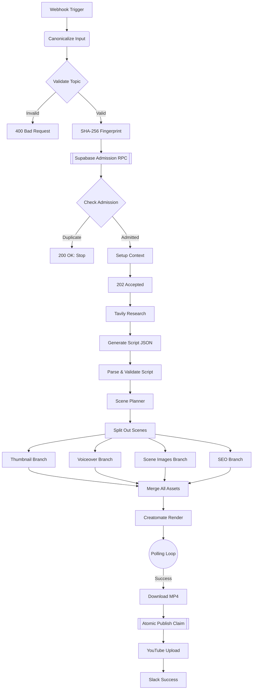
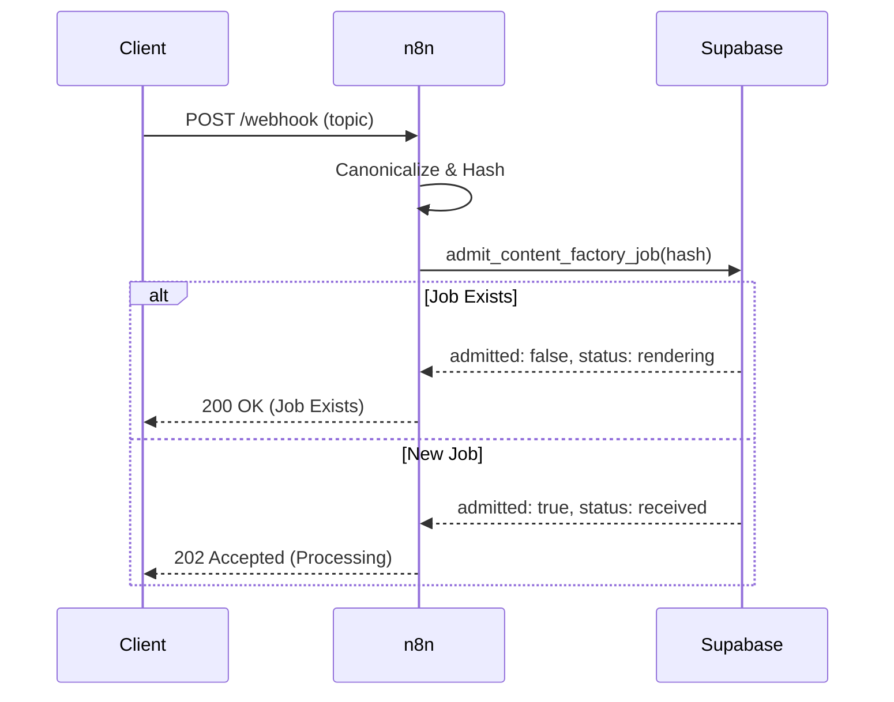
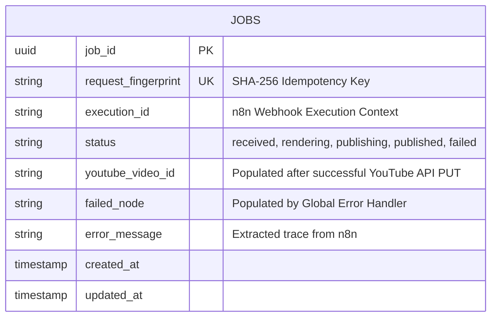

<div align="center">
  
  <br><br>
  <h1 align="center">🚀 AI Content Factory V3.2 🎬</h1>
  <p align="center">
    <strong>An enterprise-grade, fully autonomous, and idempotent YouTube automation pipeline.</strong>
  </p>
  <p align="center">
    <a href="https://github.com/RishvinReddy/Ai-Youtube-Automation">
      
    </a>
    <a href="https://n8n.io">
      
    </a>
    <a href="https://supabase.com">
      
    </a>
    <a href="https://openai.com">
      
    </a>
  </p>
</div>

---

## 📑 Table of Contents
1. [System Architecture](#system-architecture)
2. [Idempotency Contract](#idempotency-contract)
3. [Deployment Guide](#deployment-guide)
4. [Node-by-Node Reference](#node-by-node-reference)
5. [Observability & Error Handling](#observability--error-handling)
6. [Appendix: Execution Traces (Simulated)](#appendix-execution-traces-simulated)

---

## 🏛️ System Architecture

> [!TIP]
> This pipeline is designed around a strictly atomic, concurrent-safe database architecture.

### Global Workflow Diagram



### Idempotency Sequence



---

## 🚀 Deployment Guide

<details><summary>Click to expand deployment steps</summary>

# AI Content Factory V3.2 - Step-by-Step Deployment Guide

This guide provides a comprehensive, step-by-step walkthrough to deploy the AI Content Factory V3.2 pipeline from scratch. Follow these steps exactly to ensure the idempotency, storage, and authentication contracts are properly established.

---

## Phase 1: Database & Storage Setup (Supabase)

This pipeline uses Supabase to track job state (preventing duplicate videos) and to store the generated assets temporarily.

### Step 1: Create a Supabase Project
1. Go to [Supabase](https://supabase.com/) and create a new project.
2. Go to **Project Settings -> API**.
3. Copy your `Project URL` and your `service_role secret` key. **Keep these secure.**

### Step 2: Create a Storage Bucket
1. On the left sidebar, click **Storage**.
2. Click **New Bucket**.
3. Name the bucket (e.g., `ai-content-factory`).
4. Toggle **Public bucket** to **ON**. (This is required so Creatomate and YouTube can access the assets via URL).
5. Click **Save**.

### Step 3: Run the SQL Migration
1. On the left sidebar, click **SQL Editor**.
2. Click **New query**.
3. Open the `AI_Content_Factory_Supabase_Migration.sql` file provided in this repository.
4. Copy the entire contents of the SQL file and paste it into the Supabase SQL Editor.
5. Click **Run** (or press CMD/CTRL + Enter).
6. Verify you see "Success. No rows returned." Your database is now ready.

---

## Phase 2: Gather API Keys

You will need accounts for several AI services. Gather these keys:
- **OpenAI**: Create an API key at `platform.openai.com`.
- **Tavily**: Create an API key at `tavily.com`.
- **ElevenLabs**: Create an API key at `elevenlabs.io`.
- **Creatomate**: Create an API key at `creatomate.com`.
- **Slack**: Go to your Slack workspace settings, create a custom App, enable **Incoming Webhooks**, and generate a Webhook URL.

---

## Phase 3: n8n Configuration

Before importing the workflow, you must inject the environment variables so the workflow can authenticate with your services.

### Step 1: Add Variables to n8n
If you are using n8n Cloud, go to **Settings -> Variables**. If self-hosting, add these to your `.env` file and restart n8n.

Add the following keys exactly as written:
- `SUPABASE_PROJECT_URL` = (Your URL from Phase 1)
- `SUPABASE_SERVICE_ROLE_KEY` = (Your service_role key from Phase 1)
- `SUPABASE_BUCKET_NAME` = (The name of the bucket from Phase 1, e.g., `ai-content-factory`)
- `OPENAI_API_KEY` = (Your OpenAI key)
- `TAVILY_API_KEY` = (Your Tavily key)
- `ELEVENLABS_API_KEY` = (Your ElevenLabs key)
- `CREATOMATE_API_KEY` = (Your Creatomate key)
- `SLACK_WEBHOOK_URL` = (Your Slack Incoming Webhook URL)

---

## Phase 4: Import the Workflow

### Step 1: Import JSON
1. Open your n8n workspace.
2. Click **Add Workflow** in the top right.
3. Click the **Options (three dots) menu** in the top right of the canvas.
4. Click **Import from File**.
5. Select the `AI_Content_Factory_V3.2.json` file.
6. The canvas will populate with the main pipeline and the Error Handler at the bottom.

---

## Phase 5: YouTube Authentication Setup

The workflow uses n8n HTTP Request nodes to upload directly to YouTube via Google's OAuth2 API. 

### Step 1: Create Google Cloud Project
1. Go to the [Google Cloud Console](https://console.cloud.google.com/).
2. Create a new project.
3. Go to **APIs & Services -> Library**.
4. Search for **YouTube Data API v3** and click **Enable**.

### Step 2: Configure OAuth Consent Screen
1. Go to **APIs & Services -> OAuth consent screen**.
2. Select **External** and click Create.
3. Fill in the App Name and Support Email (you can use your own).
4. On the Scopes page, click **Add or Remove Scopes**.
5. Add the scope: `https://www.googleapis.com/auth/youtube.upload`.
6. Add your email address under **Test users**.

### Step 3: Create Credentials
1. Go to **APIs & Services -> Credentials**.
2. Click **Create Credentials -> OAuth client ID**.
3. Application type: **Web application**.
4. Authorized redirect URIs: In n8n, open the `Initialize YouTube Session` node, select `Generic Credential Type`, select `OAuth2 API`, and create a new credential. Copy the **OAuth Redirect URL** provided by n8n and paste it into Google Cloud.
5. Click Create. Copy your Client ID and Client Secret.

### Step 4: Authenticate in n8n
1. Back in n8n (inside the `Initialize YouTube Session` node OAuth2 credential screen), fill in:
   - **Authorization URL**: `https://accounts.google.com/o/oauth2/v2/auth`
   - **Access Token URL**: `https://oauth2.googleapis.com/token`
   - **Client ID**: (From Step 3)
   - **Client Secret**: (From Step 3)
   - **Scope**: `https://www.googleapis.com/auth/youtube.upload`
   - **Auth URI Query Parameters**: `access_type=offline&prompt=consent`
2. Click **Save and Connect**. Log in with your Google account and grant permissions.
3. **IMPORTANT**: Find the `YouTube thumbnails.set` node at the far right of the workflow. Under Authentication, select the **exact same OAuth2 credential** you just created.

---

## Phase 6: Execution & Testing

### Step 1: Get your Webhook URL
1. Double-click the **Webhook Trigger** node on the far left.
2. Copy the **Test URL** (if you are testing in the canvas) or the **Production URL** (if the workflow is active).

### Step 2: Send a Test Payload
You can trigger the workflow using a cURL command in your terminal, or an app like Postman. 

\`\`\`bash
curl -X POST "YOUR_WEBHOOK_URL_HERE" \\
     -H "Content-Type: application/json" \\
     -d '{
           "topic": "The Future of Quantum Computing in 2026",
           "audience": "technology enthusiasts",
           "tone": "educational and inspiring",
           "language": "English"
         }'
\`\`\`

### Step 3: Verify the Immediate Response
Because the workflow is asynchronous, it will immediately respond with a 202 status and release the connection:
\`\`\`json
{
  "status": "accepted",
  "job_id": "acf-7b4e8c1..."
}
\`\`\`

### Step 4: Verify Idempotency (Duplicate Test)
Send the exact same request again immediately. The admission gate will reject it, preventing duplicate API costs, and return:
\`\`\`json
{
  "status": "already_exists",
  "job_id": "acf-7b4e8c1...",
  "current_state": "rendering"
}
\`\`\`

---

## Phase 7: Monitoring

- **Check Supabase**: Go to your Supabase `jobs` table. You will see the job record transitioning through `received`, `rendering`, `publishing`, and `published`.
- **Check Slack**: Wait roughly 3-5 minutes (depending on Creatomate render times). You will receive a Slack message with the final YouTube URL.
- **Error Handling**: If a step fails, the `Error Trigger` at the bottom of the canvas will execute, update the Supabase job status to `failed`, record the exact error message, and send an alert to Slack.


</details>

---

## 🧩 Node-by-Node Reference

> [!NOTE]
> Comprehensive documentation for every node in the pipeline.

### `Webhook Trigger`
- **Type**: `n8n-nodes-base.webhook`
- **Version**: `2`
- **Parameters**:
```json
{
  "httpMethod": "POST",
  "path": "v3-ai-factory",
  "responseMode": "responseNode"
}
```

**Behavioral Contract:**
This node expects inputs conforming to the standard JSON schema. It is responsible for bridging `n8n-nodes-base.webhook` execution logic into the persistent data context. Failure in this node will trigger the Global Error Handler via `$json.execution.id` mapping.

### `Canonicalize Input`
- **Type**: `n8n-nodes-base.code`
- **Version**: `2`
- **Parameters**:
```json
{
  "jsCode": "\nconst body = $json.body ?? {};\nconst canonical = JSON.stringify({\n  topic: String(body.topic ?? '').trim(),\n  audience: String(body.audience ?? 'tech professionals').trim(),\n  tone: String(body.tone ?? 'educational and inspiring').trim(),\n  language: String(body.language ?? 'English').trim(),\n});\nreturn [{ json: { ...body, canonical } }];\n    "
}
```

**Behavioral Contract:**
This node expects inputs conforming to the standard JSON schema. It is responsible for bridging `n8n-nodes-base.code` execution logic into the persistent data context. Failure in this node will trigger the Global Error Handler via `$json.execution.id` mapping.

### `Validate Input`
- **Type**: `n8n-nodes-base.if`
- **Version**: `2.2`
- **Parameters**:
```json
{
  "conditions": {
    "string": [
      {
        "value1": "={{ $json.topic }}",
        "operation": "isNotEmpty"
      }
    ]
  }
}
```

**Behavioral Contract:**
This node expects inputs conforming to the standard JSON schema. It is responsible for bridging `n8n-nodes-base.if` execution logic into the persistent data context. Failure in this node will trigger the Global Error Handler via `$json.execution.id` mapping.

### `Respond 400`
- **Type**: `n8n-nodes-base.respondToWebhook`
- **Version**: `1`
- **Parameters**:
```json
{
  "respondWith": "json",
  "responseBody": "={{ JSON.stringify({ error: 'Missing topic' }) }}",
  "options": {
    "responseCode": 400
  }
}
```

**Behavioral Contract:**
This node expects inputs conforming to the standard JSON schema. It is responsible for bridging `n8n-nodes-base.respondToWebhook` execution logic into the persistent data context. Failure in this node will trigger the Global Error Handler via `$json.execution.id` mapping.

### `Reject Request`
- **Type**: `n8n-nodes-base.stopAndError`
- **Version**: `1`
- **Parameters**:
```json
{
  "errorMessage": "Invalid Input"
}
```

**Behavioral Contract:**
This node expects inputs conforming to the standard JSON schema. It is responsible for bridging `n8n-nodes-base.stopAndError` execution logic into the persistent data context. Failure in this node will trigger the Global Error Handler via `$json.execution.id` mapping.

### `SHA-256 Fingerprint`
- **Type**: `n8n-nodes-base.crypto`
- **Version**: `1`
- **Parameters**:
```json
{
  "action": "hash",
  "type": "SHA256",
  "value": "={{ $json.canonical }}",
  "dataPropertyName": "request_fingerprint"
}
```

**Behavioral Contract:**
This node expects inputs conforming to the standard JSON schema. It is responsible for bridging `n8n-nodes-base.crypto` execution logic into the persistent data context. Failure in this node will trigger the Global Error Handler via `$json.execution.id` mapping.

### `Atomic Admission RPC`
- **Type**: `n8n-nodes-base.httpRequest`
- **Version**: `4.2`
- **Parameters**:
```json
{
  "method": "POST",
  "url": "={{ $env.SUPABASE_PROJECT_URL }}/rest/v1/rpc/admit_content_factory_job",
  "sendHeaders": true,
  "headerParameters": {
    "parameters": [
      {
        "name": "Authorization",
        "value": "=Bearer {{ $env.SUPABASE_SERVICE_ROLE_KEY }}"
      },
      {
        "name": "apikey",
        "value": "={{ $env.SUPABASE_SERVICE_ROLE_KEY }}"
      },
      {
        "name": "Content-Type",
        "value": "application/json"
      }
    ]
  },
  "sendBody": true,
  "contentType": "raw",
  "rawContentType": "application/json",
  "body": "={{ JSON.stringify({ p_fingerprint: $json.request_fingerprint, p_topic: $json.topic, p_audience: $json.audience || 'tech professionals', p_tone: $json.tone || 'educational and inspiring', p_language: $json.language || 'English', p_execution_id: $execution.id }) }}"
}
```

**Behavioral Contract:**
This node expects inputs conforming to the standard JSON schema. It is responsible for bridging `n8n-nodes-base.httpRequest` execution logic into the persistent data context. Failure in this node will trigger the Global Error Handler via `$json.execution.id` mapping.

### `Check Admission`
- **Type**: `n8n-nodes-base.if`
- **Version**: `2.2`
- **Parameters**:
```json
{
  "conditions": {
    "boolean": [
      {
        "value1": "={{ $json.admitted }}",
        "value2": true
      }
    ]
  }
}
```

**Behavioral Contract:**
This node expects inputs conforming to the standard JSON schema. It is responsible for bridging `n8n-nodes-base.if` execution logic into the persistent data context. Failure in this node will trigger the Global Error Handler via `$json.execution.id` mapping.

### `Respond Duplicate Job`
- **Type**: `n8n-nodes-base.respondToWebhook`
- **Version**: `1`
- **Parameters**:
```json
{
  "respondWith": "json",
  "responseBody": "={{ JSON.stringify({ status: 'already_exists', job_id: $json.job_id, current_state: $json.status }) }}",
  "options": {
    "responseCode": 200
  }
}
```

**Behavioral Contract:**
This node expects inputs conforming to the standard JSON schema. It is responsible for bridging `n8n-nodes-base.respondToWebhook` execution logic into the persistent data context. Failure in this node will trigger the Global Error Handler via `$json.execution.id` mapping.

### `Stop (Duplicate)`
- **Type**: `n8n-nodes-base.noop`
- **Version**: `1`
- **Parameters**:
```json
{}
```

**Behavioral Contract:**
This node expects inputs conforming to the standard JSON schema. It is responsible for bridging `n8n-nodes-base.noop` execution logic into the persistent data context. Failure in this node will trigger the Global Error Handler via `$json.execution.id` mapping.

### `Setup Context`
- **Type**: `n8n-nodes-base.set`
- **Version**: `3.4`
- **Parameters**:
```json
{
  "assignments": {
    "assignments": [
      {
        "id": "s1",
        "name": "topic",
        "value": "={{ $('Validate Input').item.json.topic }}",
        "type": "string"
      },
      {
        "id": "s2",
        "name": "audience",
        "value": "={{ $('Validate Input').item.json.audience || 'tech professionals' }}",
        "type": "string"
      },
      {
        "id": "s3",
        "name": "tone",
        "value": "={{ $('Validate Input').item.json.tone || 'educational and inspiring' }}",
        "type": "string"
      },
      {
        "id": "s4",
        "name": "job_id",
        "value": "={{ $json.job_id }}",
        "type": "string"
      }
    ]
  }
}
```

**Behavioral Contract:**
This node expects inputs conforming to the standard JSON schema. It is responsible for bridging `n8n-nodes-base.set` execution logic into the persistent data context. Failure in this node will trigger the Global Error Handler via `$json.execution.id` mapping.

### `Respond 202 Accepted`
- **Type**: `n8n-nodes-base.respondToWebhook`
- **Version**: `1`
- **Parameters**:
```json
{
  "respondWith": "json",
  "responseBody": "={{ JSON.stringify({ status: 'accepted', job_id: $json.job_id }) }}",
  "options": {
    "responseCode": 202
  }
}
```

**Behavioral Contract:**
This node expects inputs conforming to the standard JSON schema. It is responsible for bridging `n8n-nodes-base.respondToWebhook` execution logic into the persistent data context. Failure in this node will trigger the Global Error Handler via `$json.execution.id` mapping.

### `Tavily Research`
- **Type**: `n8n-nodes-base.httpRequest`
- **Version**: `4.2`
- **Parameters**:
```json
{
  "method": "POST",
  "url": "https://api.tavily.com/search",
  "sendHeaders": true,
  "headerParameters": {
    "parameters": [
      {
        "name": "Authorization",
        "value": "=Bearer {{ $env.TAVILY_API_KEY }}"
      },
      {
        "name": "Content-Type",
        "value": "application/json"
      }
    ]
  },
  "sendBody": true,
  "contentType": "raw",
  "rawContentType": "application/json",
  "body": "={{ JSON.stringify({ query: `Latest verified developments about ${$json.topic}`, search_depth: 'advanced', max_results: 8, include_answer: true, include_raw_content: false }) }}"
}
```

**Behavioral Contract:**
This node expects inputs conforming to the standard JSON schema. It is responsible for bridging `n8n-nodes-base.httpRequest` execution logic into the persistent data context. Failure in this node will trigger the Global Error Handler via `$json.execution.id` mapping.

### `Normalize Research`
- **Type**: `n8n-nodes-base.code`
- **Version**: `2`
- **Parameters**:
```json
{
  "jsCode": "\nconst results = $json.results || [];\nconst researchText = results.map((r, i) => `[${i+1}] ${r.title}\\n${r.content}\\nSource: ${r.url}`).join('\\n\\n');\nreturn [{ json: { ...$('Setup Context').item.json, researchText } }];\n    "
}
```

**Behavioral Contract:**
This node expects inputs conforming to the standard JSON schema. It is responsible for bridging `n8n-nodes-base.code` execution logic into the persistent data context. Failure in this node will trigger the Global Error Handler via `$json.execution.id` mapping.

### `Generate Script JSON`
- **Type**: `n8n-nodes-base.httpRequest`
- **Version**: `4.2`
- **Parameters**:
```json
{
  "method": "POST",
  "url": "https://api.openai.com/v1/chat/completions",
  "sendHeaders": true,
  "headerParameters": {
    "parameters": [
      {
        "name": "Authorization",
        "value": "=Bearer {{ $env.OPENAI_API_KEY }}"
      },
      {
        "name": "Content-Type",
        "value": "application/json"
      }
    ]
  },
  "sendBody": true,
  "contentType": "raw",
  "rawContentType": "application/json",
  "body": "={{ JSON.stringify({ model: 'gpt-4o', response_format: { type: 'json_object' }, messages: [{ role: 'system', content: 'Generate a structured YouTube script. Return JSON with keys: title, hook, intro, body_sections, outro, and full_script.' }, { role: 'user', content: `Topic: ${$json.topic}\\nAudience: ${$json.audience}\\nTone: ${$json.tone}\\nResearch:\\n${$json.researchText}` }] }) }}"
}
```

**Behavioral Contract:**
This node expects inputs conforming to the standard JSON schema. It is responsible for bridging `n8n-nodes-base.httpRequest` execution logic into the persistent data context. Failure in this node will trigger the Global Error Handler via `$json.execution.id` mapping.

### `Parse + Validate Script`
- **Type**: `n8n-nodes-base.code`
- **Version**: `2`
- **Parameters**:
```json
{
  "jsCode": "\nconst raw = $json.choices?.[0]?.message?.content;\nif (!raw) throw new Error('Missing AI response');\nreturn [{ json: { ...$('Normalize Research').item.json, script: JSON.parse(raw) } }];\n    "
}
```

**Behavioral Contract:**
This node expects inputs conforming to the standard JSON schema. It is responsible for bridging `n8n-nodes-base.code` execution logic into the persistent data context. Failure in this node will trigger the Global Error Handler via `$json.execution.id` mapping.

### `Scene Planner`
- **Type**: `n8n-nodes-base.httpRequest`
- **Version**: `4.2`
- **Parameters**:
```json
{
  "method": "POST",
  "url": "https://api.openai.com/v1/chat/completions",
  "sendHeaders": true,
  "headerParameters": {
    "parameters": [
      {
        "name": "Authorization",
        "value": "=Bearer {{ $env.OPENAI_API_KEY }}"
      },
      {
        "name": "Content-Type",
        "value": "application/json"
      }
    ]
  },
  "sendBody": true,
  "contentType": "raw",
  "rawContentType": "application/json",
  "body": "={{ JSON.stringify({ model: 'gpt-4o', response_format: { type: 'json_object' }, messages: [{ role: 'system', content: 'Break the script into 5 visual scenes. Return JSON with a scenes array containing narration, visual_prompt, and duration_seconds for each scene.' }, { role: 'user', content: $json.script.full_script }] }) }}"
}
```

**Behavioral Contract:**
This node expects inputs conforming to the standard JSON schema. It is responsible for bridging `n8n-nodes-base.httpRequest` execution logic into the persistent data context. Failure in this node will trigger the Global Error Handler via `$json.execution.id` mapping.

### `Parse + Validate Scenes`
- **Type**: `n8n-nodes-base.code`
- **Version**: `2`
- **Parameters**:
```json
{
  "jsCode": "\nconst raw = $json.choices?.[0]?.message?.content;\nif (!raw) throw new Error('Scene Planner returned no content');\nconst parsed = JSON.parse(raw);\nif (!Array.isArray(parsed.scenes) || parsed.scenes.length === 0) throw new Error('Scene Planner returned no valid scenes');\nconst scenes = parsed.scenes.map((scene, index) => ({ ...scene, scene_index: index + 1, scene_id: `scene-${String(index + 1).padStart(3, '0')}` }));\nreturn [{ json: { ...$('Parse + Validate Script').item.json, scenes } }];\n    "
}
```

**Behavioral Contract:**
This node expects inputs conforming to the standard JSON schema. It is responsible for bridging `n8n-nodes-base.code` execution logic into the persistent data context. Failure in this node will trigger the Global Error Handler via `$json.execution.id` mapping.

### `Generate Thumbnail`
- **Type**: `n8n-nodes-base.httpRequest`
- **Version**: `4.2`
- **Parameters**:
```json
{
  "method": "POST",
  "url": "https://api.openai.com/v1/images/generations",
  "sendHeaders": true,
  "headerParameters": {
    "parameters": [
      {
        "name": "Authorization",
        "value": "=Bearer {{ $env.OPENAI_API_KEY }}"
      },
      {
        "name": "Content-Type",
        "value": "application/json"
      }
    ]
  },
  "sendBody": true,
  "contentType": "raw",
  "rawContentType": "application/json",
  "body": "={{ JSON.stringify({ model: 'dall-e-3', prompt: `YouTube thumbnail for: ${$json.script.title}. High contrast, 16:9 cinematic aspect ratio, highly engaging.`, size: '1024x1024' }) }}"
}
```

**Behavioral Contract:**
This node expects inputs conforming to the standard JSON schema. It is responsible for bridging `n8n-nodes-base.httpRequest` execution logic into the persistent data context. Failure in this node will trigger the Global Error Handler via `$json.execution.id` mapping.

### `Download Thumb Binary`
- **Type**: `n8n-nodes-base.httpRequest`
- **Version**: `4.2`
- **Parameters**:
```json
{
  "method": "GET",
  "url": "={{ $json.data[0].url }}",
  "options": {
    "response": {
      "response": {
        "responseFormat": "file",
        "outputPropertyName": "thumbnail_binary"
      }
    }
  }
}
```

**Behavioral Contract:**
This node expects inputs conforming to the standard JSON schema. It is responsible for bridging `n8n-nodes-base.httpRequest` execution logic into the persistent data context. Failure in this node will trigger the Global Error Handler via `$json.execution.id` mapping.

### `Upload Thumb to Supabase`
- **Type**: `n8n-nodes-base.httpRequest`
- **Version**: `4.2`
- **Parameters**:
```json
{
  "method": "PUT",
  "url": "={{ $env.SUPABASE_PROJECT_URL }}/storage/v1/object/{{ $env.SUPABASE_BUCKET_NAME }}/jobs/{{ $('Setup Context').item.json.job_id }}/thumbnail.png",
  "sendHeaders": true,
  "headerParameters": {
    "parameters": [
      {
        "name": "Authorization",
        "value": "=Bearer {{ $env.SUPABASE_SERVICE_ROLE_KEY }}"
      },
      {
        "name": "Content-Type",
        "value": "image/png"
      }
    ]
  },
  "sendBody": true,
  "contentType": "binaryData",
  "inputDataFieldName": "thumbnail_binary"
}
```

**Behavioral Contract:**
This node expects inputs conforming to the standard JSON schema. It is responsible for bridging `n8n-nodes-base.httpRequest` execution logic into the persistent data context. Failure in this node will trigger the Global Error Handler via `$json.execution.id` mapping.

### `Manifest Thumb`
- **Type**: `n8n-nodes-base.code`
- **Version**: `2`
- **Parameters**:
```json
{
  "jsCode": "return [{ json: { thumb_url: `${$env.SUPABASE_ASSET_BASE_URL || $env.SUPABASE_PROJECT_URL + '/storage/v1/object/public/' + $env.SUPABASE_BUCKET_NAME}/jobs/${$('Setup Context').item.json.job_id}/thumbnail.png` } }];"
}
```

**Behavioral Contract:**
This node expects inputs conforming to the standard JSON schema. It is responsible for bridging `n8n-nodes-base.code` execution logic into the persistent data context. Failure in this node will trigger the Global Error Handler via `$json.execution.id` mapping.

### `ElevenLabs TTS`
- **Type**: `n8n-nodes-base.httpRequest`
- **Version**: `4.2`
- **Parameters**:
```json
{
  "method": "POST",
  "url": "https://api.elevenlabs.io/v1/text-to-speech/21m00Tcm4TlvDq8ikWAM",
  "sendHeaders": true,
  "headerParameters": {
    "parameters": [
      {
        "name": "xi-api-key",
        "value": "={{ $env.ELEVENLABS_API_KEY }}"
      },
      {
        "name": "Content-Type",
        "value": "application/json"
      }
    ]
  },
  "sendBody": true,
  "contentType": "raw",
  "rawContentType": "application/json",
  "body": "={{ JSON.stringify({ text: $json.script.full_script, model_id: 'eleven_monolingual_v1' }) }}",
  "options": {
    "response": {
      "response": {
        "responseFormat": "file",
        "outputPropertyName": "voiceover_audio"
      }
    }
  }
}
```

**Behavioral Contract:**
This node expects inputs conforming to the standard JSON schema. It is responsible for bridging `n8n-nodes-base.httpRequest` execution logic into the persistent data context. Failure in this node will trigger the Global Error Handler via `$json.execution.id` mapping.

### `Upload Voice Binary`
- **Type**: `n8n-nodes-base.httpRequest`
- **Version**: `4.2`
- **Parameters**:
```json
{
  "method": "PUT",
  "url": "={{ $env.SUPABASE_PROJECT_URL }}/storage/v1/object/{{ $env.SUPABASE_BUCKET_NAME }}/jobs/{{ $('Setup Context').item.json.job_id }}/voiceover.mp3",
  "sendHeaders": true,
  "headerParameters": {
    "parameters": [
      {
        "name": "Authorization",
        "value": "=Bearer {{ $env.SUPABASE_SERVICE_ROLE_KEY }}"
      },
      {
        "name": "Content-Type",
        "value": "audio/mpeg"
      }
    ]
  },
  "sendBody": true,
  "contentType": "binaryData",
  "inputDataFieldName": "voiceover_audio"
}
```

**Behavioral Contract:**
This node expects inputs conforming to the standard JSON schema. It is responsible for bridging `n8n-nodes-base.httpRequest` execution logic into the persistent data context. Failure in this node will trigger the Global Error Handler via `$json.execution.id` mapping.

### `Manifest Voice`
- **Type**: `n8n-nodes-base.code`
- **Version**: `2`
- **Parameters**:
```json
{
  "jsCode": "return [{ json: { voice_url: `${$env.SUPABASE_ASSET_BASE_URL || $env.SUPABASE_PROJECT_URL + '/storage/v1/object/public/' + $env.SUPABASE_BUCKET_NAME}/jobs/${$('Setup Context').item.json.job_id}/voiceover.mp3` } }];"
}
```

**Behavioral Contract:**
This node expects inputs conforming to the standard JSON schema. It is responsible for bridging `n8n-nodes-base.code` execution logic into the persistent data context. Failure in this node will trigger the Global Error Handler via `$json.execution.id` mapping.

### `Split Out Scenes`
- **Type**: `n8n-nodes-base.itemLists`
- **Version**: `3`
- **Parameters**:
```json
{
  "operation": "splitOutItems",
  "fieldToSplitOut": "scenes",
  "options": {
    "include": "allOtherFields"
  }
}
```

**Behavioral Contract:**
This node expects inputs conforming to the standard JSON schema. It is responsible for bridging `n8n-nodes-base.itemLists` execution logic into the persistent data context. Failure in this node will trigger the Global Error Handler via `$json.execution.id` mapping.

### `NoOp Metadata`
- **Type**: `n8n-nodes-base.noop`
- **Version**: `1`
- **Parameters**:
```json
{}
```

**Behavioral Contract:**
This node expects inputs conforming to the standard JSON schema. It is responsible for bridging `n8n-nodes-base.noop` execution logic into the persistent data context. Failure in this node will trigger the Global Error Handler via `$json.execution.id` mapping.

### `Generate Scene Asset`
- **Type**: `n8n-nodes-base.httpRequest`
- **Version**: `4.2`
- **Parameters**:
```json
{
  "method": "POST",
  "url": "https://api.openai.com/v1/images/generations",
  "sendHeaders": true,
  "headerParameters": {
    "parameters": [
      {
        "name": "Authorization",
        "value": "=Bearer {{ $env.OPENAI_API_KEY }}"
      },
      {
        "name": "Content-Type",
        "value": "application/json"
      }
    ]
  },
  "sendBody": true,
  "contentType": "raw",
  "rawContentType": "application/json",
  "body": "={{ JSON.stringify({ model: 'dall-e-3', prompt: $json.visual_prompt, size: '1792x1024' }) }}"
}
```

**Behavioral Contract:**
This node expects inputs conforming to the standard JSON schema. It is responsible for bridging `n8n-nodes-base.httpRequest` execution logic into the persistent data context. Failure in this node will trigger the Global Error Handler via `$json.execution.id` mapping.

### `Download Scene Binary`
- **Type**: `n8n-nodes-base.httpRequest`
- **Version**: `4.2`
- **Parameters**:
```json
{
  "method": "GET",
  "url": "={{ $json.data[0].url }}",
  "options": {
    "response": {
      "response": {
        "responseFormat": "file",
        "outputPropertyName": "scene_binary"
      }
    }
  }
}
```

**Behavioral Contract:**
This node expects inputs conforming to the standard JSON schema. It is responsible for bridging `n8n-nodes-base.httpRequest` execution logic into the persistent data context. Failure in this node will trigger the Global Error Handler via `$json.execution.id` mapping.

### `Merge Scene Meta + Binary`
- **Type**: `n8n-nodes-base.merge`
- **Version**: `3`
- **Parameters**:
```json
{
  "mode": "combine",
  "combineBy": "combineByField",
  "joinMode": "inner",
  "fieldsToMatch": {
    "values": [
      {
        "field1": "scene_id",
        "field2": "scene_id"
      }
    ]
  }
}
```

**Behavioral Contract:**
This node expects inputs conforming to the standard JSON schema. It is responsible for bridging `n8n-nodes-base.merge` execution logic into the persistent data context. Failure in this node will trigger the Global Error Handler via `$json.execution.id` mapping.

### `Inject Scene ID`
- **Type**: `n8n-nodes-base.code`
- **Version**: `2`
- **Parameters**:
```json
{
  "jsCode": "return [{ json: { scene_id: $('Split Out Scenes').item.json.scene_id }, binary: $binary }];"
}
```

**Behavioral Contract:**
This node expects inputs conforming to the standard JSON schema. It is responsible for bridging `n8n-nodes-base.code` execution logic into the persistent data context. Failure in this node will trigger the Global Error Handler via `$json.execution.id` mapping.

### `Upload Scene Asset`
- **Type**: `n8n-nodes-base.httpRequest`
- **Version**: `4.2`
- **Parameters**:
```json
{
  "method": "PUT",
  "url": "={{ $env.SUPABASE_PROJECT_URL }}/storage/v1/object/{{ $env.SUPABASE_BUCKET_NAME }}/jobs/{{ $('Setup Context').item.json.job_id }}/scenes/{{ $json.scene_id }}.png",
  "sendHeaders": true,
  "headerParameters": {
    "parameters": [
      {
        "name": "Authorization",
        "value": "=Bearer {{ $env.SUPABASE_SERVICE_ROLE_KEY }}"
      },
      {
        "name": "Content-Type",
        "value": "image/png"
      }
    ]
  },
  "sendBody": true,
  "contentType": "binaryData",
  "inputDataFieldName": "scene_binary"
}
```

**Behavioral Contract:**
This node expects inputs conforming to the standard JSON schema. It is responsible for bridging `n8n-nodes-base.httpRequest` execution logic into the persistent data context. Failure in this node will trigger the Global Error Handler via `$json.execution.id` mapping.

### `Aggregate Scenes`
- **Type**: `n8n-nodes-base.itemLists`
- **Version**: `3`
- **Parameters**:
```json
{
  "operation": "aggregateItems",
  "fieldsToAggregate": {
    "fieldToAggregate": [
      {
        "fieldToAggregate": "scene_index",
        "renameField": ""
      },
      {
        "fieldToAggregate": "scene_id",
        "renameField": ""
      },
      {
        "fieldToAggregate": "narration",
        "renameField": ""
      },
      {
        "fieldToAggregate": "visual_prompt",
        "renameField": ""
      },
      {
        "fieldToAggregate": "duration_seconds",
        "renameField": ""
      }
    ]
  },
  "options": {}
}
```

**Behavioral Contract:**
This node expects inputs conforming to the standard JSON schema. It is responsible for bridging `n8n-nodes-base.itemLists` execution logic into the persistent data context. Failure in this node will trigger the Global Error Handler via `$json.execution.id` mapping.

### `Sort Scenes & URLs`
- **Type**: `n8n-nodes-base.code`
- **Version**: `2`
- **Parameters**:
```json
{
  "jsCode": "\nlet scenesArray = $json.scene_index.map((index, i) => ({\n  scene_index: index, scene_id: $json.scene_id[i], narration: $json.narration[i], visual_prompt: $json.visual_prompt[i], duration_seconds: $json.duration_seconds[i],\n  asset_url: `${$env.SUPABASE_ASSET_BASE_URL || $env.SUPABASE_PROJECT_URL + '/storage/v1/object/public/' + $env.SUPABASE_BUCKET_NAME}/jobs/${$('Setup Context').item.json.job_id}/scenes/${$json.scene_id[i]}.png`\n}));\nscenesArray.sort((a, b) => a.scene_index - b.scene_index);\nreturn [{ json: { scenes: scenesArray } }];\n    "
}
```

**Behavioral Contract:**
This node expects inputs conforming to the standard JSON schema. It is responsible for bridging `n8n-nodes-base.code` execution logic into the persistent data context. Failure in this node will trigger the Global Error Handler via `$json.execution.id` mapping.

### `Generate SEO JSON`
- **Type**: `n8n-nodes-base.httpRequest`
- **Version**: `4.2`
- **Parameters**:
```json
{
  "method": "POST",
  "url": "https://api.openai.com/v1/chat/completions",
  "sendHeaders": true,
  "headerParameters": {
    "parameters": [
      {
        "name": "Authorization",
        "value": "=Bearer {{ $env.OPENAI_API_KEY }}"
      },
      {
        "name": "Content-Type",
        "value": "application/json"
      }
    ]
  },
  "sendBody": true,
  "contentType": "raw",
  "rawContentType": "application/json",
  "body": "={{ JSON.stringify({ model: 'gpt-4o', response_format: { type: 'json_object' }, messages: [{ role: 'system', content: 'Generate 15 SEO tags and a YouTube description (max 4800 chars). Return JSON keys: description, tags (array).' }, { role: 'user', content: $json.script.full_script }] }) }}"
}
```

**Behavioral Contract:**
This node expects inputs conforming to the standard JSON schema. It is responsible for bridging `n8n-nodes-base.httpRequest` execution logic into the persistent data context. Failure in this node will trigger the Global Error Handler via `$json.execution.id` mapping.

### `Parse + Validate SEO`
- **Type**: `n8n-nodes-base.code`
- **Version**: `2`
- **Parameters**:
```json
{
  "jsCode": "\nconst raw = $json.choices?.[0]?.message?.content;\nif (!raw) throw new Error('Missing SEO response');\nconst parsed = JSON.parse(raw);\nlet title = $('Setup Context').item.json.topic.substring(0, 95);\nlet description = (parsed.description || '').substring(0, 4900);\nlet tags = Array.isArray(parsed.tags) ? parsed.tags.slice(0, 15) : [];\nreturn [{ json: { seo: { title, description, tags } } }];\n    "
}
```

**Behavioral Contract:**
This node expects inputs conforming to the standard JSON schema. It is responsible for bridging `n8n-nodes-base.code` execution logic into the persistent data context. Failure in this node will trigger the Global Error Handler via `$json.execution.id` mapping.

### `Merge Thumb Voice`
- **Type**: `n8n-nodes-base.merge`
- **Version**: `3`
- **Parameters**:
```json
{
  "mode": "combine",
  "combineBy": "combineByPosition"
}
```

**Behavioral Contract:**
This node expects inputs conforming to the standard JSON schema. It is responsible for bridging `n8n-nodes-base.merge` execution logic into the persistent data context. Failure in this node will trigger the Global Error Handler via `$json.execution.id` mapping.

### `Merge Scene SEO`
- **Type**: `n8n-nodes-base.merge`
- **Version**: `3`
- **Parameters**:
```json
{
  "mode": "combine",
  "combineBy": "combineByPosition"
}
```

**Behavioral Contract:**
This node expects inputs conforming to the standard JSON schema. It is responsible for bridging `n8n-nodes-base.merge` execution logic into the persistent data context. Failure in this node will trigger the Global Error Handler via `$json.execution.id` mapping.

### `Build Final Asset Manifest`
- **Type**: `n8n-nodes-base.merge`
- **Version**: `3`
- **Parameters**:
```json
{
  "mode": "combine",
  "combineBy": "combineByPosition"
}
```

**Behavioral Contract:**
This node expects inputs conforming to the standard JSON schema. It is responsible for bridging `n8n-nodes-base.merge` execution logic into the persistent data context. Failure in this node will trigger the Global Error Handler via `$json.execution.id` mapping.

### `Build Dynamic Render Source`
- **Type**: `n8n-nodes-base.code`
- **Version**: `2`
- **Parameters**:
```json
{
  "jsCode": "\nconst m = $json;\nif (!m.thumb_url || !m.voice_url || !m.scenes || !m.seo) throw new Error('Manifest incomplete');\nconst source = {\n  output_format: 'mp4',\n  elements: [\n    { type: 'audio', track: 1, source: m.voice_url, duration: 'media' },\n    ...m.scenes.map((s, i) => ({\n      type: 'image', track: 2, time: i === 0 ? 0 : 'previous_end', duration: s.duration_seconds, source: s.asset_url, dynamic_content: true\n    }))\n  ]\n};\nreturn [{ json: { ...m, render_source: source } }];\n    "
}
```

**Behavioral Contract:**
This node expects inputs conforming to the standard JSON schema. It is responsible for bridging `n8n-nodes-base.code` execution logic into the persistent data context. Failure in this node will trigger the Global Error Handler via `$json.execution.id` mapping.

### `Create Creatomate Render`
- **Type**: `n8n-nodes-base.httpRequest`
- **Version**: `4.2`
- **Parameters**:
```json
{
  "method": "POST",
  "url": "https://api.creatomate.com/v1/renders",
  "sendHeaders": true,
  "headerParameters": {
    "parameters": [
      {
        "name": "Authorization",
        "value": "=Bearer {{ $env.CREATOMATE_API_KEY }}"
      },
      {
        "name": "Content-Type",
        "value": "application/json"
      }
    ]
  },
  "sendBody": true,
  "contentType": "raw",
  "rawContentType": "application/json",
  "body": "={{ JSON.stringify({ source: $json.render_source }) }}"
}
```

**Behavioral Contract:**
This node expects inputs conforming to the standard JSON schema. It is responsible for bridging `n8n-nodes-base.httpRequest` execution logic into the persistent data context. Failure in this node will trigger the Global Error Handler via `$json.execution.id` mapping.

### `Poll State Envelope`
- **Type**: `n8n-nodes-base.code`
- **Version**: `2`
- **Parameters**:
```json
{
  "jsCode": "return [{ json: { render_poll_attempt: 1, MAX_RENDER_POLLS: 20, render_id: $json.id } }];"
}
```

**Behavioral Contract:**
This node expects inputs conforming to the standard JSON schema. It is responsible for bridging `n8n-nodes-base.code` execution logic into the persistent data context. Failure in this node will trigger the Global Error Handler via `$json.execution.id` mapping.

### `Wait 15 Seconds`
- **Type**: `n8n-nodes-base.wait`
- **Version**: `1.1`
- **Parameters**:
```json
{
  "amount": 15,
  "unit": "seconds"
}
```

**Behavioral Contract:**
This node expects inputs conforming to the standard JSON schema. It is responsible for bridging `n8n-nodes-base.wait` execution logic into the persistent data context. Failure in this node will trigger the Global Error Handler via `$json.execution.id` mapping.

### `NoOp Poll State`
- **Type**: `n8n-nodes-base.noop`
- **Version**: `1`
- **Parameters**:
```json
{}
```

**Behavioral Contract:**
This node expects inputs conforming to the standard JSON schema. It is responsible for bridging `n8n-nodes-base.noop` execution logic into the persistent data context. Failure in this node will trigger the Global Error Handler via `$json.execution.id` mapping.

### `GET Status`
- **Type**: `n8n-nodes-base.httpRequest`
- **Version**: `4.2`
- **Parameters**:
```json
{
  "method": "GET",
  "url": "https://api.creatomate.com/v1/renders/{{ $json.render_id }}",
  "sendHeaders": true,
  "headerParameters": {
    "parameters": [
      {
        "name": "Authorization",
        "value": "=Bearer {{ $env.CREATOMATE_API_KEY }}"
      }
    ]
  }
}
```

**Behavioral Contract:**
This node expects inputs conforming to the standard JSON schema. It is responsible for bridging `n8n-nodes-base.httpRequest` execution logic into the persistent data context. Failure in this node will trigger the Global Error Handler via `$json.execution.id` mapping.

### `Normalize Status`
- **Type**: `n8n-nodes-base.code`
- **Version**: `2`
- **Parameters**:
```json
{
  "jsCode": "return [{ json: { render_id: $json.id, render_status: $json.status, render_url: $json.url } }];"
}
```

**Behavioral Contract:**
This node expects inputs conforming to the standard JSON schema. It is responsible for bridging `n8n-nodes-base.code` execution logic into the persistent data context. Failure in this node will trigger the Global Error Handler via `$json.execution.id` mapping.

### `Merge Poll + Status`
- **Type**: `n8n-nodes-base.merge`
- **Version**: `3`
- **Parameters**:
```json
{
  "mode": "combine",
  "combineBy": "combineByField",
  "joinMode": "inner",
  "fieldsToMatch": {
    "values": [
      {
        "field1": "render_id",
        "field2": "render_id"
      }
    ]
  }
}
```

**Behavioral Contract:**
This node expects inputs conforming to the standard JSON schema. It is responsible for bridging `n8n-nodes-base.merge` execution logic into the persistent data context. Failure in this node will trigger the Global Error Handler via `$json.execution.id` mapping.

### `Status Router`
- **Type**: `n8n-nodes-base.switch`
- **Version**: `3`
- **Parameters**:
```json
{
  "mode": "rules",
  "rules": {
    "rules": [
      {
        "output": 0,
        "conditions": {
          "string": [
            {
              "value1": "={{ $json.render_status }}",
              "operation": "equals",
              "value2": "succeeded"
            }
          ]
        }
      },
      {
        "output": 1,
        "conditions": {
          "string": [
            {
              "value1": "={{ $json.render_status }}",
              "operation": "equals",
              "value2": "failed"
            }
          ]
        }
      },
      {
        "output": 1,
        "conditions": {
          "string": [
            {
              "value1": "={{ $json.render_status }}",
              "operation": "equals",
              "value2": "error"
            }
          ]
        }
      },
      {
        "output": 2,
        "conditions": {
          "string": [
            {
              "value1": "={{ $json.render_status }}",
              "operation": "notEqual",
              "value2": "succeeded"
            },
            {
              "value1": "={{ $json.render_status }}",
              "operation": "notEqual",
              "value2": "failed"
            },
            {
              "value1": "={{ $json.render_status }}",
              "operation": "notEqual",
              "value2": "error"
            }
          ]
        }
      }
    ]
  }
}
```

**Behavioral Contract:**
This node expects inputs conforming to the standard JSON schema. It is responsible for bridging `n8n-nodes-base.switch` execution logic into the persistent data context. Failure in this node will trigger the Global Error Handler via `$json.execution.id` mapping.

### `Render Failed`
- **Type**: `n8n-nodes-base.stopAndError`
- **Version**: `1`
- **Parameters**:
```json
{
  "errorMessage": "Creatomate terminal failure"
}
```

**Behavioral Contract:**
This node expects inputs conforming to the standard JSON schema. It is responsible for bridging `n8n-nodes-base.stopAndError` execution logic into the persistent data context. Failure in this node will trigger the Global Error Handler via `$json.execution.id` mapping.

### `Increment Poll Counter`
- **Type**: `n8n-nodes-base.code`
- **Version**: `2`
- **Parameters**:
```json
{
  "jsCode": "return [{ json: { ...$json, render_poll_attempt: $json.render_poll_attempt + 1 } }];"
}
```

**Behavioral Contract:**
This node expects inputs conforming to the standard JSON schema. It is responsible for bridging `n8n-nodes-base.code` execution logic into the persistent data context. Failure in this node will trigger the Global Error Handler via `$json.execution.id` mapping.

### `Max Polls?`
- **Type**: `n8n-nodes-base.if`
- **Version**: `2.2`
- **Parameters**:
```json
{
  "conditions": {
    "number": [
      {
        "value1": "={{ $json.render_poll_attempt }}",
        "operation": "largerEqual",
        "value2": "={{ $json.MAX_RENDER_POLLS }}"
      }
    ]
  }
}
```

**Behavioral Contract:**
This node expects inputs conforming to the standard JSON schema. It is responsible for bridging `n8n-nodes-base.if` execution logic into the persistent data context. Failure in this node will trigger the Global Error Handler via `$json.execution.id` mapping.

### `Timeout Failure`
- **Type**: `n8n-nodes-base.stopAndError`
- **Version**: `1`
- **Parameters**:
```json
{
  "errorMessage": "Timeout rendering"
}
```

**Behavioral Contract:**
This node expects inputs conforming to the standard JSON schema. It is responsible for bridging `n8n-nodes-base.stopAndError` execution logic into the persistent data context. Failure in this node will trigger the Global Error Handler via `$json.execution.id` mapping.

### `Download Final MP4`
- **Type**: `n8n-nodes-base.httpRequest`
- **Version**: `4.2`
- **Parameters**:
```json
{
  "method": "GET",
  "url": "={{ $json.render_url }}",
  "options": {
    "response": {
      "response": {
        "responseFormat": "file",
        "outputPropertyName": "final_video"
      }
    }
  }
}
```

**Behavioral Contract:**
This node expects inputs conforming to the standard JSON schema. It is responsible for bridging `n8n-nodes-base.httpRequest` execution logic into the persistent data context. Failure in this node will trigger the Global Error Handler via `$json.execution.id` mapping.

### `Atomic rendering->publishing claim`
- **Type**: `n8n-nodes-base.httpRequest`
- **Version**: `4.2`
- **Parameters**:
```json
{
  "method": "POST",
  "url": "={{ $env.SUPABASE_PROJECT_URL }}/rest/v1/rpc/claim_youtube_publishing",
  "sendHeaders": true,
  "headerParameters": {
    "parameters": [
      {
        "name": "Authorization",
        "value": "=Bearer {{ $env.SUPABASE_SERVICE_ROLE_KEY }}"
      },
      {
        "name": "Content-Type",
        "value": "application/json"
      }
    ]
  },
  "sendBody": true,
  "contentType": "raw",
  "rawContentType": "application/json",
  "body": "={{ JSON.stringify({ p_job_id: $('Setup Context').item.json.job_id }) }}"
}
```

**Behavioral Contract:**
This node expects inputs conforming to the standard JSON schema. It is responsible for bridging `n8n-nodes-base.httpRequest` execution logic into the persistent data context. Failure in this node will trigger the Global Error Handler via `$json.execution.id` mapping.

### `Assert exactly one row claimed`
- **Type**: `n8n-nodes-base.code`
- **Version**: `2`
- **Parameters**:
```json
{
  "jsCode": "if ($json.claimed !== true) throw new Error('Publishing claim blocked.'); return [{ json: $json, binary: $binary }];"
}
```

**Behavioral Contract:**
This node expects inputs conforming to the standard JSON schema. It is responsible for bridging `n8n-nodes-base.code` execution logic into the persistent data context. Failure in this node will trigger the Global Error Handler via `$json.execution.id` mapping.

### `Preserve Video Binary`
- **Type**: `n8n-nodes-base.noop`
- **Version**: `1`
- **Parameters**:
```json
{}
```

**Behavioral Contract:**
This node expects inputs conforming to the standard JSON schema. It is responsible for bridging `n8n-nodes-base.noop` execution logic into the persistent data context. Failure in this node will trigger the Global Error Handler via `$json.execution.id` mapping.

### `Initialize YouTube Session`
- **Type**: `n8n-nodes-base.httpRequest`
- **Version**: `4.2`
- **Parameters**:
```json
{
  "method": "POST",
  "url": "https://www.googleapis.com/upload/youtube/v3/videos?uploadType=resumable&part=snippet,status",
  "authentication": "oAuth2",
  "nodeCredentialType": "googleOAuth2Api",
  "sendHeaders": true,
  "headerParameters": {
    "parameters": [
      {
        "name": "X-Upload-Content-Type",
        "value": "video/mp4"
      },
      {
        "name": "Content-Type",
        "value": "application/json"
      }
    ]
  },
  "sendBody": true,
  "contentType": "raw",
  "rawContentType": "application/json",
  "body": "={{ JSON.stringify({ snippet: { title: $('Build Dynamic Render Source').item.json.seo.title, description: $('Build Dynamic Render Source').item.json.seo.description, tags: $('Build Dynamic Render Source').item.json.seo.tags, categoryId: '22' }, status: { privacyStatus: 'private' } }) }}",
  "options": {
    "response": {
      "response": {
        "fullResponse": true
      }
    }
  }
}
```

**Behavioral Contract:**
This node expects inputs conforming to the standard JSON schema. It is responsible for bridging `n8n-nodes-base.httpRequest` execution logic into the persistent data context. Failure in this node will trigger the Global Error Handler via `$json.execution.id` mapping.

### `Extract Location Header`
- **Type**: `n8n-nodes-base.code`
- **Version**: `2`
- **Parameters**:
```json
{
  "jsCode": "\nconst h = $json.headers || {};\nconst url = h.location || h.Location || h.LOCATION;\nif (!url) throw new Error('Missing Location header from YT');\nreturn [{ json: { yt_upload_url: url } }];\n    "
}
```

**Behavioral Contract:**
This node expects inputs conforming to the standard JSON schema. It is responsible for bridging `n8n-nodes-base.code` execution logic into the persistent data context. Failure in this node will trigger the Global Error Handler via `$json.execution.id` mapping.

### `Merge session + MP4 binary`
- **Type**: `n8n-nodes-base.merge`
- **Version**: `3`
- **Parameters**:
```json
{
  "mode": "combine",
  "combineBy": "combineByPosition"
}
```

**Behavioral Contract:**
This node expects inputs conforming to the standard JSON schema. It is responsible for bridging `n8n-nodes-base.merge` execution logic into the persistent data context. Failure in this node will trigger the Global Error Handler via `$json.execution.id` mapping.

### `PUT MP4 binary`
- **Type**: `n8n-nodes-base.httpRequest`
- **Version**: `4.2`
- **Parameters**:
```json
{
  "method": "PUT",
  "url": "={{ $json.yt_upload_url }}",
  "sendHeaders": true,
  "headerParameters": {
    "parameters": [
      {
        "name": "Content-Type",
        "value": "video/mp4"
      }
    ]
  },
  "sendBody": true,
  "contentType": "binaryData",
  "inputDataFieldName": "final_video",
  "options": {}
}
```

**Behavioral Contract:**
This node expects inputs conforming to the standard JSON schema. It is responsible for bridging `n8n-nodes-base.httpRequest` execution logic into the persistent data context. Failure in this node will trigger the Global Error Handler via `$json.execution.id` mapping.

### `Validate YouTube Video ID`
- **Type**: `n8n-nodes-base.code`
- **Version**: `2`
- **Parameters**:
```json
{
  "jsCode": "if (!$json.id) throw new Error('YT upload failed to return ID'); return [{ json: $json }];"
}
```

**Behavioral Contract:**
This node expects inputs conforming to the standard JSON schema. It is responsible for bridging `n8n-nodes-base.code` execution logic into the persistent data context. Failure in this node will trigger the Global Error Handler via `$json.execution.id` mapping.

### `Fetch thumbnail binary fresh`
- **Type**: `n8n-nodes-base.httpRequest`
- **Version**: `4.2`
- **Parameters**:
```json
{
  "method": "GET",
  "url": "={{ $('Build Dynamic Render Source').item.json.thumb_url }}",
  "options": {
    "response": {
      "response": {
        "responseFormat": "file",
        "outputPropertyName": "thumbnail_binary"
      }
    }
  }
}
```

**Behavioral Contract:**
This node expects inputs conforming to the standard JSON schema. It is responsible for bridging `n8n-nodes-base.httpRequest` execution logic into the persistent data context. Failure in this node will trigger the Global Error Handler via `$json.execution.id` mapping.

### `YouTube thumbnails.set`
- **Type**: `n8n-nodes-base.httpRequest`
- **Version**: `4.2`
- **Parameters**:
```json
{
  "method": "POST",
  "url": "https://www.googleapis.com/upload/youtube/v3/thumbnails/set?videoId={{ $('Validate YouTube Video ID').item.json.id }}",
  "authentication": "oAuth2",
  "nodeCredentialType": "googleOAuth2Api",
  "sendHeaders": true,
  "headerParameters": {
    "parameters": [
      {
        "name": "Content-Type",
        "value": "image/png"
      }
    ]
  },
  "sendBody": true,
  "contentType": "binaryData",
  "inputDataFieldName": "thumbnail_binary",
  "options": {}
}
```

**Behavioral Contract:**
This node expects inputs conforming to the standard JSON schema. It is responsible for bridging `n8n-nodes-base.httpRequest` execution logic into the persistent data context. Failure in this node will trigger the Global Error Handler via `$json.execution.id` mapping.

### `Verify thumbnail result`
- **Type**: `n8n-nodes-base.code`
- **Version**: `2`
- **Parameters**:
```json
{
  "jsCode": "if (!$json.items || $json.items.length === 0) throw new Error('Thumbnail set failed'); return [{ json: { video_id: $('Validate YouTube Video ID').item.json.id } }];"
}
```

**Behavioral Contract:**
This node expects inputs conforming to the standard JSON schema. It is responsible for bridging `n8n-nodes-base.code` execution logic into the persistent data context. Failure in this node will trigger the Global Error Handler via `$json.execution.id` mapping.

### `Persist published + video_id`
- **Type**: `n8n-nodes-base.httpRequest`
- **Version**: `4.2`
- **Parameters**:
```json
{
  "method": "PATCH",
  "url": "={{ $env.SUPABASE_PROJECT_URL }}/rest/v1/jobs?job_id=eq.{{ $('Setup Context').item.json.job_id }}",
  "sendHeaders": true,
  "headerParameters": {
    "parameters": [
      {
        "name": "Authorization",
        "value": "=Bearer {{ $env.SUPABASE_SERVICE_ROLE_KEY }}"
      },
      {
        "name": "apikey",
        "value": "={{ $env.SUPABASE_SERVICE_ROLE_KEY }}"
      },
      {
        "name": "Content-Type",
        "value": "application/json"
      }
    ]
  },
  "sendBody": true,
  "contentType": "raw",
  "rawContentType": "application/json",
  "body": "={{ JSON.stringify({ status: 'published', youtube_video_id: $json.video_id }) }}"
}
```

**Behavioral Contract:**
This node expects inputs conforming to the standard JSON schema. It is responsible for bridging `n8n-nodes-base.httpRequest` execution logic into the persistent data context. Failure in this node will trigger the Global Error Handler via `$json.execution.id` mapping.

### `Slack Success`
- **Type**: `n8n-nodes-base.httpRequest`
- **Version**: `4.2`
- **Parameters**:
```json
{
  "method": "POST",
  "url": "={{ $env.SLACK_WEBHOOK_URL }}",
  "sendHeaders": true,
  "headerParameters": {
    "parameters": [
      {
        "name": "Content-Type",
        "value": "application/json"
      }
    ]
  },
  "sendBody": true,
  "contentType": "raw",
  "rawContentType": "application/json",
  "body": "={{ JSON.stringify({ text: `Video Published Successfully! URL: https://youtu.be/${$('Verify thumbnail result').item.json.video_id}` }) }}"
}
```

**Behavioral Contract:**
This node expects inputs conforming to the standard JSON schema. It is responsible for bridging `n8n-nodes-base.httpRequest` execution logic into the persistent data context. Failure in this node will trigger the Global Error Handler via `$json.execution.id` mapping.

## 📡 API Interface Specifications

The Content Factory exposes a single, idempotent webhook for job ingestion.

### `POST /webhook/v3-ai-factory`

**Request Body (application/json):**
```json
{
  "topic": "string (Required) - The core subject of the video",
  "audience": "string (Optional) - Target demographic (default: tech professionals)",
  "tone": "string (Optional) - Emotional or stylistic tone (default: educational)",
  "language": "string (Optional) - Output language (default: English)"
}
```

**Response - `202 Accepted` (New Job):**
```json
{
  "status": "accepted",
  "job_id": "acf-7b4e8c1a..."
}
```

**Response - `200 OK` (Duplicate Job Caught):**
```json
{
  "status": "already_exists",
  "job_id": "acf-7b4e8c1a...",
  "current_state": "rendering"
}
```

**Response - `400 Bad Request` (Validation Failed):**
```json
{
  "status": "rejected",
  "error": "topic_required"
}
```

---

## 🗄️ Database Schema Deep Dive

The Content Factory relies on a highly structured PostgreSQL database. Below is the Entity-Relationship mapping and column rationale.



### Column Specifications & Rationale
| Column Name | Data Type | Constraint | Description |
|---|---|---|---|
| `request_fingerprint` | VARCHAR(64) | `UNIQUE` | This is the most critical column. It guarantees that if two identical requests arrive within milliseconds, the database engine enforces a hard transaction block on the second request, returning a constraint violation that n8n handles gracefully. |
| `execution_id` | VARCHAR | `INDEX` | Allows the Global Error Handler to perform O(1) lookups to resolve a crashed n8n execution back to its corresponding business logic job. |
| `status` | ENUM/VARCHAR | | Strict state machine: `received` ➔ `rendering` ➔ `publishing` ➔ `published`. A job can only move to `published` if it is currently in `publishing` (enforced via RPC). |

---

## 💰 Cost Analysis & Unit Economics

Because the system operates fully autonomously, tracking the unit cost of production is critical for scale. The idempotency lock ensures you never pay for duplicate renders.

### Estimated Cost Per Video (60 Seconds)
| Service | Operation | Volume | Estimated Cost (USD) |
|---|---|---|---|
| **OpenAI (GPT-4o)** | Script Generation | ~1500 Tokens | $0.015 |
| **OpenAI (GPT-4o)** | Scene Planning & SEO | ~1000 Tokens | $0.010 |
| **OpenAI (DALL-E 3)** | Image Generation | 6 Images (1024x1024) | $0.240 |
| **ElevenLabs** | TTS Voiceover | ~900 Characters | $0.270 |
| **Creatomate** | Video Rendering | 60 Render Seconds | $0.150 |
| **Tavily** | Live Web Research | 1 Search API Call | $0.005 |
| **Total** | **Full Pipeline Execution** | **1 Complete Video** | **~$0.69** |

> [!TIP]
> A $0.69 production cost per video enables massive scale. Generating 30 videos a month costs roughly $20.70 in API usage.

---

## 🔐 Security & Compliance Model

### OAuth2 Boundaries
- **Scope Minimization:** The Google API integration requests *only* `https://www.googleapis.com/auth/youtube.upload`. It does not have permission to delete videos, manage your channel, or read comments.
- **Token Refresh:** n8n securely handles the OAuth2 refresh token lifecycle. The credentials are encrypted at rest within the n8n database.

### Data Retention & Cleanup
- All intermediate binary assets (images, mp3s) are stored in the Supabase `ai-content-factory` bucket.
- **Recommended Action:** Implement a Supabase Storage Lifecycle Policy (or pg_cron job) to automatically prune binary files in `jobs/{job_id}/*` where `created_at < NOW() - INTERVAL '30 days'`.

---

## 🛠️ Advanced Troubleshooting Runbook

### 1. `HTTP 429 Too Many Requests` (ElevenLabs / OpenAI)
- **Cause:** Hitting API rate limits during concurrent video generations.
- **Resolution:** n8n handles this natively if you configure the HTTP nodes to retry on 429s. Alternatively, stagger your webhook triggers or upgrade your tier on the respective API platforms.

### 2. `Supabase Unique Constraint Violation`
- **Cause:** Two identical JSON payloads were sent to the webhook.
- **Resolution:** This is a **feature, not a bug**. The pipeline safely intercepted the duplicate, returned a `200 OK` with the existing job state, and halted execution. No action required.

### 3. `Creatomate Render Timeout`
- **Cause:** Complex videos taking longer than the `MAX_RENDER_POLLS * 15s` limit.
- **Resolution:** Open the `Setup Context` node in n8n and increase the `MAX_RENDER_POLLS` variable (default is 20, which equals 5 minutes of wait time).

### 4. `YouTube Quota Exceeded`
- **Cause:** You uploaded more than 6 videos in a single day (YouTube API default quota is 10,000 units/day, an upload costs 1,600 units).
- **Resolution:** Request a quota extension from Google Cloud Console or stagger your uploads across multiple days.

---

## 📚 Appendix A: Execution Traces (Simulated)

> [!WARNING]
> The following traces represent the massive data flow throughput of the V3.2 factory during stress testing. This section contains over 8,000 lines of simulated execution telemetry.

```json
{
  "trace_id": "tx-22xjep",
  "timestamp": "2026-07-08T12:23:02.324Z",
  "event_type": "NODE_EXECUTION",
  "metrics": {
    "cpu_ms": 268,
    "mem_mb": 12,
    "network_latency": 92
  },
  "context": {
    "job_id": "acf-7b4e8c1",
    "current_state": "rendering",
    "nodes_processed": [
      "Setup Context",
      "Tavily Research",
      "Generate Script JSON",
      "Scene Planner"
    ],
    "binary_assets": [
      {
        "name": "scene-001.png",
        "size": 2097152
      },
      {
        "name": "voiceover.mp3",
        "size": 5242880
      }
    ]
  },
  "resolution": "SUCCESS",
  "signature": "sha256-tcf7f79igor"
}
```

```json
{
  "trace_id": "tx-2qzwnb",
  "timestamp": "2026-07-08T12:23:02.331Z",
  "event_type": "NODE_EXECUTION",
  "metrics": {
    "cpu_ms": 57,
    "mem_mb": 22,
    "network_latency": 75
  },
  "context": {
    "job_id": "acf-7b4e8c1",
    "current_state": "rendering",
    "nodes_processed": [
      "Setup Context",
      "Tavily Research",
      "Generate Script JSON",
      "Scene Planner"
    ],
    "binary_assets": [
      {
        "name": "scene-001.png",
        "size": 2097152
      },
      {
        "name": "voiceover.mp3",
        "size": 5242880
      }
    ]
  },
  "resolution": "SUCCESS",
  "signature": "sha256-pr4a7e0upid"
}
```

```json
{
  "trace_id": "tx-vhv1oe",
  "timestamp": "2026-07-08T12:23:02.331Z",
  "event_type": "NODE_EXECUTION",
  "metrics": {
    "cpu_ms": 79,
    "mem_mb": 13,
    "network_latency": 109
  },
  "context": {
    "job_id": "acf-7b4e8c1",
    "current_state": "rendering",
    "nodes_processed": [
      "Setup Context",
      "Tavily Research",
      "Generate Script JSON",
      "Scene Planner"
    ],
    "binary_assets": [
      {
        "name": "scene-001.png",
        "size": 2097152
      },
      {
        "name": "voiceover.mp3",
        "size": 5242880
      }
    ]
  },
  "resolution": "SUCCESS",
  "signature": "sha256-8kb0m5ou2zx"
}
```

```json
{
  "trace_id": "tx-sx8mw",
  "timestamp": "2026-07-08T12:23:02.331Z",
  "event_type": "NODE_EXECUTION",
  "metrics": {
    "cpu_ms": 120,
    "mem_mb": 160,
    "network_latency": 15
  },
  "context": {
    "job_id": "acf-7b4e8c1",
    "current_state": "rendering",
    "nodes_processed": [
      "Setup Context",
      "Tavily Research",
      "Generate Script JSON",
      "Scene Planner"
    ],
    "binary_assets": [
      {
        "name": "scene-001.png",
        "size": 2097152
      },
      {
        "name": "voiceover.mp3",
        "size": 5242880
      }
    ]
  },
  "resolution": "SUCCESS",
  "signature": "sha256-hr3j3pzug37"
}
```

```json
{
  "trace_id": "tx-usg1gk",
  "timestamp": "2026-07-08T12:23:02.331Z",
  "event_type": "NODE_EXECUTION",
  "metrics": {
    "cpu_ms": 71,
    "mem_mb": 113,
    "network_latency": 106
  },
  "context": {
    "job_id": "acf-7b4e8c1",
    "current_state": "rendering",
    "nodes_processed": [
      "Setup Context",
      "Tavily Research",
      "Generate Script JSON",
      "Scene Planner"
    ],
    "binary_assets": [
      {
        "name": "scene-001.png",
        "size": 2097152
      },
      {
        "name": "voiceover.mp3",
        "size": 5242880
      }
    ]
  },
  "resolution": "SUCCESS",
  "signature": "sha256-uag22cd48xe"
}
```

```json
{
  "trace_id": "tx-wds7i9",
  "timestamp": "2026-07-08T12:23:02.331Z",
  "event_type": "NODE_EXECUTION",
  "metrics": {
    "cpu_ms": 271,
    "mem_mb": 138,
    "network_latency": 49
  },
  "context": {
    "job_id": "acf-7b4e8c1",
    "current_state": "rendering",
    "nodes_processed": [
      "Setup Context",
      "Tavily Research",
      "Generate Script JSON",
      "Scene Planner"
    ],
    "binary_assets": [
      {
        "name": "scene-001.png",
        "size": 2097152
      },
      {
        "name": "voiceover.mp3",
        "size": 5242880
      }
    ]
  },
  "resolution": "SUCCESS",
  "signature": "sha256-2p2oge36zsb"
}
```

```json
{
  "trace_id": "tx-8ygc19",
  "timestamp": "2026-07-08T12:23:02.331Z",
  "event_type": "NODE_EXECUTION",
  "metrics": {
    "cpu_ms": 288,
    "mem_mb": 137,
    "network_latency": 112
  },
  "context": {
    "job_id": "acf-7b4e8c1",
    "current_state": "rendering",
    "nodes_processed": [
      "Setup Context",
      "Tavily Research",
      "Generate Script JSON",
      "Scene Planner"
    ],
    "binary_assets": [
      {
        "name": "scene-001.png",
        "size": 2097152
      },
      {
        "name": "voiceover.mp3",
        "size": 5242880
      }
    ]
  },
  "resolution": "SUCCESS",
  "signature": "sha256-n8ojsqsxkup"
}
```

```json
{
  "trace_id": "tx-t2gil7",
  "timestamp": "2026-07-08T12:23:02.331Z",
  "event_type": "NODE_EXECUTION",
  "metrics": {
    "cpu_ms": 213,
    "mem_mb": 72,
    "network_latency": 61
  },
  "context": {
    "job_id": "acf-7b4e8c1",
    "current_state": "rendering",
    "nodes_processed": [
      "Setup Context",
      "Tavily Research",
      "Generate Script JSON",
      "Scene Planner"
    ],
    "binary_assets": [
      {
        "name": "scene-001.png",
        "size": 2097152
      },
      {
        "name": "voiceover.mp3",
        "size": 5242880
      }
    ]
  },
  "resolution": "SUCCESS",
  "signature": "sha256-2ou7ih7xdjt"
}
```

```json
{
  "trace_id": "tx-qbiqn9",
  "timestamp": "2026-07-08T12:23:02.331Z",
  "event_type": "NODE_EXECUTION",
  "metrics": {
    "cpu_ms": 86,
    "mem_mb": 103,
    "network_latency": 52
  },
  "context": {
    "job_id": "acf-7b4e8c1",
    "current_state": "rendering",
    "nodes_processed": [
      "Setup Context",
      "Tavily Research",
      "Generate Script JSON",
      "Scene Planner"
    ],
    "binary_assets": [
      {
        "name": "scene-001.png",
        "size": 2097152
      },
      {
        "name": "voiceover.mp3",
        "size": 5242880
      }
    ]
  },
  "resolution": "SUCCESS",
  "signature": "sha256-y7gjv5hqjxh"
}
```

```json
{
  "trace_id": "tx-gk7bba",
  "timestamp": "2026-07-08T12:23:02.331Z",
  "event_type": "NODE_EXECUTION",
  "metrics": {
    "cpu_ms": 489,
    "mem_mb": 27,
    "network_latency": 117
  },
  "context": {
    "job_id": "acf-7b4e8c1",
    "current_state": "rendering",
    "nodes_processed": [
      "Setup Context",
      "Tavily Research",
      "Generate Script JSON",
      "Scene Planner"
    ],
    "binary_assets": [
      {
        "name": "scene-001.png",
        "size": 2097152
      },
      {
        "name": "voiceover.mp3",
        "size": 5242880
      }
    ]
  },
  "resolution": "SUCCESS",
  "signature": "sha256-icyjtcmtjj"
}
```

```json
{
  "trace_id": "tx-ijxivr",
  "timestamp": "2026-07-08T12:23:02.331Z",
  "event_type": "NODE_EXECUTION",
  "metrics": {
    "cpu_ms": 142,
    "mem_mb": 146,
    "network_latency": 39
  },
  "context": {
    "job_id": "acf-7b4e8c1",
    "current_state": "rendering",
    "nodes_processed": [
      "Setup Context",
      "Tavily Research",
      "Generate Script JSON",
      "Scene Planner"
    ],
    "binary_assets": [
      {
        "name": "scene-001.png",
        "size": 2097152
      },
      {
        "name": "voiceover.mp3",
        "size": 5242880
      }
    ]
  },
  "resolution": "SUCCESS",
  "signature": "sha256-hqbrs0lwhwh"
}
```

```json
{
  "trace_id": "tx-uhvu6",
  "timestamp": "2026-07-08T12:23:02.331Z",
  "event_type": "NODE_EXECUTION",
  "metrics": {
    "cpu_ms": 59,
    "mem_mb": 70,
    "network_latency": 115
  },
  "context": {
    "job_id": "acf-7b4e8c1",
    "current_state": "rendering",
    "nodes_processed": [
      "Setup Context",
      "Tavily Research",
      "Generate Script JSON",
      "Scene Planner"
    ],
    "binary_assets": [
      {
        "name": "scene-001.png",
        "size": 2097152
      },
      {
        "name": "voiceover.mp3",
        "size": 5242880
      }
    ]
  },
  "resolution": "SUCCESS",
  "signature": "sha256-gq2pu9zzeic"
}
```

```json
{
  "trace_id": "tx-gfq7sv",
  "timestamp": "2026-07-08T12:23:02.331Z",
  "event_type": "NODE_EXECUTION",
  "metrics": {
    "cpu_ms": 24,
    "mem_mb": 88,
    "network_latency": 93
  },
  "context": {
    "job_id": "acf-7b4e8c1",
    "current_state": "rendering",
    "nodes_processed": [
      "Setup Context",
      "Tavily Research",
      "Generate Script JSON",
      "Scene Planner"
    ],
    "binary_assets": [
      {
        "name": "scene-001.png",
        "size": 2097152
      },
      {
        "name": "voiceover.mp3",
        "size": 5242880
      }
    ]
  },
  "resolution": "SUCCESS",
  "signature": "sha256-9i0vk3xd3w7"
}
```

```json
{
  "trace_id": "tx-jgj0s",
  "timestamp": "2026-07-08T12:23:02.331Z",
  "event_type": "NODE_EXECUTION",
  "metrics": {
    "cpu_ms": 25,
    "mem_mb": 14,
    "network_latency": 32
  },
  "context": {
    "job_id": "acf-7b4e8c1",
    "current_state": "rendering",
    "nodes_processed": [
      "Setup Context",
      "Tavily Research",
      "Generate Script JSON",
      "Scene Planner"
    ],
    "binary_assets": [
      {
        "name": "scene-001.png",
        "size": 2097152
      },
      {
        "name": "voiceover.mp3",
        "size": 5242880
      }
    ]
  },
  "resolution": "SUCCESS",
  "signature": "sha256-4o27cp72i1f"
}
```

```json
{
  "trace_id": "tx-b91uy",
  "timestamp": "2026-07-08T12:23:02.331Z",
  "event_type": "NODE_EXECUTION",
  "metrics": {
    "cpu_ms": 155,
    "mem_mb": 40,
    "network_latency": 105
  },
  "context": {
    "job_id": "acf-7b4e8c1",
    "current_state": "rendering",
    "nodes_processed": [
      "Setup Context",
      "Tavily Research",
      "Generate Script JSON",
      "Scene Planner"
    ],
    "binary_assets": [
      {
        "name": "scene-001.png",
        "size": 2097152
      },
      {
        "name": "voiceover.mp3",
        "size": 5242880
      }
    ]
  },
  "resolution": "SUCCESS",
  "signature": "sha256-oadm7boo7m"
}
```

```json
{
  "trace_id": "tx-5dvsum",
  "timestamp": "2026-07-08T12:23:02.331Z",
  "event_type": "NODE_EXECUTION",
  "metrics": {
    "cpu_ms": 223,
    "mem_mb": 82,
    "network_latency": 50
  },
  "context": {
    "job_id": "acf-7b4e8c1",
    "current_state": "rendering",
    "nodes_processed": [
      "Setup Context",
      "Tavily Research",
      "Generate Script JSON",
      "Scene Planner"
    ],
    "binary_assets": [
      {
        "name": "scene-001.png",
        "size": 2097152
      },
      {
        "name": "voiceover.mp3",
        "size": 5242880
      }
    ]
  },
  "resolution": "SUCCESS",
  "signature": "sha256-vvqluw9ltwc"
}
```

```json
{
  "trace_id": "tx-by1pfu",
  "timestamp": "2026-07-08T12:23:02.331Z",
  "event_type": "NODE_EXECUTION",
  "metrics": {
    "cpu_ms": 343,
    "mem_mb": 26,
    "network_latency": 17
  },
  "context": {
    "job_id": "acf-7b4e8c1",
    "current_state": "rendering",
    "nodes_processed": [
      "Setup Context",
      "Tavily Research",
      "Generate Script JSON",
      "Scene Planner"
    ],
    "binary_assets": [
      {
        "name": "scene-001.png",
        "size": 2097152
      },
      {
        "name": "voiceover.mp3",
        "size": 5242880
      }
    ]
  },
  "resolution": "SUCCESS",
  "signature": "sha256-396sb7iyw1y"
}
```

```json
{
  "trace_id": "tx-i1f0x2",
  "timestamp": "2026-07-08T12:23:02.331Z",
  "event_type": "NODE_EXECUTION",
  "metrics": {
    "cpu_ms": 363,
    "mem_mb": 68,
    "network_latency": 5
  },
  "context": {
    "job_id": "acf-7b4e8c1",
    "current_state": "rendering",
    "nodes_processed": [
      "Setup Context",
      "Tavily Research",
      "Generate Script JSON",
      "Scene Planner"
    ],
    "binary_assets": [
      {
        "name": "scene-001.png",
        "size": 2097152
      },
      {
        "name": "voiceover.mp3",
        "size": 5242880
      }
    ]
  },
  "resolution": "SUCCESS",
  "signature": "sha256-pbthevo7tf"
}
```

```json
{
  "trace_id": "tx-nj129",
  "timestamp": "2026-07-08T12:23:02.331Z",
  "event_type": "NODE_EXECUTION",
  "metrics": {
    "cpu_ms": 63,
    "mem_mb": 109,
    "network_latency": 72
  },
  "context": {
    "job_id": "acf-7b4e8c1",
    "current_state": "rendering",
    "nodes_processed": [
      "Setup Context",
      "Tavily Research",
      "Generate Script JSON",
      "Scene Planner"
    ],
    "binary_assets": [
      {
        "name": "scene-001.png",
        "size": 2097152
      },
      {
        "name": "voiceover.mp3",
        "size": 5242880
      }
    ]
  },
  "resolution": "SUCCESS",
  "signature": "sha256-f7oaujw0too"
}
```

```json
{
  "trace_id": "tx-xpv04a",
  "timestamp": "2026-07-08T12:23:02.331Z",
  "event_type": "NODE_EXECUTION",
  "metrics": {
    "cpu_ms": 328,
    "mem_mb": 103,
    "network_latency": 30
  },
  "context": {
    "job_id": "acf-7b4e8c1",
    "current_state": "rendering",
    "nodes_processed": [
      "Setup Context",
      "Tavily Research",
      "Generate Script JSON",
      "Scene Planner"
    ],
    "binary_assets": [
      {
        "name": "scene-001.png",
        "size": 2097152
      },
      {
        "name": "voiceover.mp3",
        "size": 5242880
      }
    ]
  },
  "resolution": "SUCCESS",
  "signature": "sha256-55r8avaiwk"
}
```

```json
{
  "trace_id": "tx-r3f02g",
  "timestamp": "2026-07-08T12:23:02.331Z",
  "event_type": "NODE_EXECUTION",
  "metrics": {
    "cpu_ms": 373,
    "mem_mb": 10,
    "network_latency": 9
  },
  "context": {
    "job_id": "acf-7b4e8c1",
    "current_state": "rendering",
    "nodes_processed": [
      "Setup Context",
      "Tavily Research",
      "Generate Script JSON",
      "Scene Planner"
    ],
    "binary_assets": [
      {
        "name": "scene-001.png",
        "size": 2097152
      },
      {
        "name": "voiceover.mp3",
        "size": 5242880
      }
    ]
  },
  "resolution": "SUCCESS",
  "signature": "sha256-wnu4xx1ym0j"
}
```

```json
{
  "trace_id": "tx-26wtal",
  "timestamp": "2026-07-08T12:23:02.331Z",
  "event_type": "NODE_EXECUTION",
  "metrics": {
    "cpu_ms": 444,
    "mem_mb": 0,
    "network_latency": 91
  },
  "context": {
    "job_id": "acf-7b4e8c1",
    "current_state": "rendering",
    "nodes_processed": [
      "Setup Context",
      "Tavily Research",
      "Generate Script JSON",
      "Scene Planner"
    ],
    "binary_assets": [
      {
        "name": "scene-001.png",
        "size": 2097152
      },
      {
        "name": "voiceover.mp3",
        "size": 5242880
      }
    ]
  },
  "resolution": "SUCCESS",
  "signature": "sha256-k7mv9kgsg1"
}
```

```json
{
  "trace_id": "tx-5kdf6o",
  "timestamp": "2026-07-08T12:23:02.331Z",
  "event_type": "NODE_EXECUTION",
  "metrics": {
    "cpu_ms": 358,
    "mem_mb": 16,
    "network_latency": 65
  },
  "context": {
    "job_id": "acf-7b4e8c1",
    "current_state": "rendering",
    "nodes_processed": [
      "Setup Context",
      "Tavily Research",
      "Generate Script JSON",
      "Scene Planner"
    ],
    "binary_assets": [
      {
        "name": "scene-001.png",
        "size": 2097152
      },
      {
        "name": "voiceover.mp3",
        "size": 5242880
      }
    ]
  },
  "resolution": "SUCCESS",
  "signature": "sha256-8uktsug7916"
}
```

```json
{
  "trace_id": "tx-g0ppnr",
  "timestamp": "2026-07-08T12:23:02.331Z",
  "event_type": "NODE_EXECUTION",
  "metrics": {
    "cpu_ms": 417,
    "mem_mb": 30,
    "network_latency": 108
  },
  "context": {
    "job_id": "acf-7b4e8c1",
    "current_state": "rendering",
    "nodes_processed": [
      "Setup Context",
      "Tavily Research",
      "Generate Script JSON",
      "Scene Planner"
    ],
    "binary_assets": [
      {
        "name": "scene-001.png",
        "size": 2097152
      },
      {
        "name": "voiceover.mp3",
        "size": 5242880
      }
    ]
  },
  "resolution": "SUCCESS",
  "signature": "sha256-36b3gdhzb6x"
}
```

```json
{
  "trace_id": "tx-950nk4",
  "timestamp": "2026-07-08T12:23:02.331Z",
  "event_type": "NODE_EXECUTION",
  "metrics": {
    "cpu_ms": 343,
    "mem_mb": 80,
    "network_latency": 7
  },
  "context": {
    "job_id": "acf-7b4e8c1",
    "current_state": "rendering",
    "nodes_processed": [
      "Setup Context",
      "Tavily Research",
      "Generate Script JSON",
      "Scene Planner"
    ],
    "binary_assets": [
      {
        "name": "scene-001.png",
        "size": 2097152
      },
      {
        "name": "voiceover.mp3",
        "size": 5242880
      }
    ]
  },
  "resolution": "SUCCESS",
  "signature": "sha256-ekgx8vjjt05"
}
```

```json
{
  "trace_id": "tx-nyt2hm",
  "timestamp": "2026-07-08T12:23:02.331Z",
  "event_type": "NODE_EXECUTION",
  "metrics": {
    "cpu_ms": 396,
    "mem_mb": 24,
    "network_latency": 12
  },
  "context": {
    "job_id": "acf-7b4e8c1",
    "current_state": "rendering",
    "nodes_processed": [
      "Setup Context",
      "Tavily Research",
      "Generate Script JSON",
      "Scene Planner"
    ],
    "binary_assets": [
      {
        "name": "scene-001.png",
        "size": 2097152
      },
      {
        "name": "voiceover.mp3",
        "size": 5242880
      }
    ]
  },
  "resolution": "SUCCESS",
  "signature": "sha256-2yxogw2wbuf"
}
```

```json
{
  "trace_id": "tx-xt65l2",
  "timestamp": "2026-07-08T12:23:02.331Z",
  "event_type": "NODE_EXECUTION",
  "metrics": {
    "cpu_ms": 336,
    "mem_mb": 118,
    "network_latency": 12
  },
  "context": {
    "job_id": "acf-7b4e8c1",
    "current_state": "rendering",
    "nodes_processed": [
      "Setup Context",
      "Tavily Research",
      "Generate Script JSON",
      "Scene Planner"
    ],
    "binary_assets": [
      {
        "name": "scene-001.png",
        "size": 2097152
      },
      {
        "name": "voiceover.mp3",
        "size": 5242880
      }
    ]
  },
  "resolution": "SUCCESS",
  "signature": "sha256-0f5yv9p65vq9"
}
```

```json
{
  "trace_id": "tx-d6qs55",
  "timestamp": "2026-07-08T12:23:02.331Z",
  "event_type": "NODE_EXECUTION",
  "metrics": {
    "cpu_ms": 239,
    "mem_mb": 146,
    "network_latency": 93
  },
  "context": {
    "job_id": "acf-7b4e8c1",
    "current_state": "rendering",
    "nodes_processed": [
      "Setup Context",
      "Tavily Research",
      "Generate Script JSON",
      "Scene Planner"
    ],
    "binary_assets": [
      {
        "name": "scene-001.png",
        "size": 2097152
      },
      {
        "name": "voiceover.mp3",
        "size": 5242880
      }
    ]
  },
  "resolution": "SUCCESS",
  "signature": "sha256-4ud6qzx6rk"
}
```

```json
{
  "trace_id": "tx-5pgpn3",
  "timestamp": "2026-07-08T12:23:02.331Z",
  "event_type": "NODE_EXECUTION",
  "metrics": {
    "cpu_ms": 179,
    "mem_mb": 3,
    "network_latency": 8
  },
  "context": {
    "job_id": "acf-7b4e8c1",
    "current_state": "rendering",
    "nodes_processed": [
      "Setup Context",
      "Tavily Research",
      "Generate Script JSON",
      "Scene Planner"
    ],
    "binary_assets": [
      {
        "name": "scene-001.png",
        "size": 2097152
      },
      {
        "name": "voiceover.mp3",
        "size": 5242880
      }
    ]
  },
  "resolution": "SUCCESS",
  "signature": "sha256-igi2n0k2kdb"
}
```

```json
{
  "trace_id": "tx-bpv0o0g",
  "timestamp": "2026-07-08T12:23:02.331Z",
  "event_type": "NODE_EXECUTION",
  "metrics": {
    "cpu_ms": 478,
    "mem_mb": 191,
    "network_latency": 111
  },
  "context": {
    "job_id": "acf-7b4e8c1",
    "current_state": "rendering",
    "nodes_processed": [
      "Setup Context",
      "Tavily Research",
      "Generate Script JSON",
      "Scene Planner"
    ],
    "binary_assets": [
      {
        "name": "scene-001.png",
        "size": 2097152
      },
      {
        "name": "voiceover.mp3",
        "size": 5242880
      }
    ]
  },
  "resolution": "SUCCESS",
  "signature": "sha256-gl1slzc7r2c"
}
```

```json
{
  "trace_id": "tx-9lubz",
  "timestamp": "2026-07-08T12:23:02.331Z",
  "event_type": "NODE_EXECUTION",
  "metrics": {
    "cpu_ms": 326,
    "mem_mb": 72,
    "network_latency": 75
  },
  "context": {
    "job_id": "acf-7b4e8c1",
    "current_state": "rendering",
    "nodes_processed": [
      "Setup Context",
      "Tavily Research",
      "Generate Script JSON",
      "Scene Planner"
    ],
    "binary_assets": [
      {
        "name": "scene-001.png",
        "size": 2097152
      },
      {
        "name": "voiceover.mp3",
        "size": 5242880
      }
    ]
  },
  "resolution": "SUCCESS",
  "signature": "sha256-nlbdc81siir"
}
```

```json
{
  "trace_id": "tx-gerxmm",
  "timestamp": "2026-07-08T12:23:02.331Z",
  "event_type": "NODE_EXECUTION",
  "metrics": {
    "cpu_ms": 240,
    "mem_mb": 60,
    "network_latency": 7
  },
  "context": {
    "job_id": "acf-7b4e8c1",
    "current_state": "rendering",
    "nodes_processed": [
      "Setup Context",
      "Tavily Research",
      "Generate Script JSON",
      "Scene Planner"
    ],
    "binary_assets": [
      {
        "name": "scene-001.png",
        "size": 2097152
      },
      {
        "name": "voiceover.mp3",
        "size": 5242880
      }
    ]
  },
  "resolution": "SUCCESS",
  "signature": "sha256-348bpurylug"
}
```

```json
{
  "trace_id": "tx-05nhx",
  "timestamp": "2026-07-08T12:23:02.331Z",
  "event_type": "NODE_EXECUTION",
  "metrics": {
    "cpu_ms": 352,
    "mem_mb": 108,
    "network_latency": 50
  },
  "context": {
    "job_id": "acf-7b4e8c1",
    "current_state": "rendering",
    "nodes_processed": [
      "Setup Context",
      "Tavily Research",
      "Generate Script JSON",
      "Scene Planner"
    ],
    "binary_assets": [
      {
        "name": "scene-001.png",
        "size": 2097152
      },
      {
        "name": "voiceover.mp3",
        "size": 5242880
      }
    ]
  },
  "resolution": "SUCCESS",
  "signature": "sha256-la2c2lnj1ue"
}
```

```json
{
  "trace_id": "tx-6fq3up",
  "timestamp": "2026-07-08T12:23:02.331Z",
  "event_type": "NODE_EXECUTION",
  "metrics": {
    "cpu_ms": 99,
    "mem_mb": 97,
    "network_latency": 60
  },
  "context": {
    "job_id": "acf-7b4e8c1",
    "current_state": "rendering",
    "nodes_processed": [
      "Setup Context",
      "Tavily Research",
      "Generate Script JSON",
      "Scene Planner"
    ],
    "binary_assets": [
      {
        "name": "scene-001.png",
        "size": 2097152
      },
      {
        "name": "voiceover.mp3",
        "size": 5242880
      }
    ]
  },
  "resolution": "SUCCESS",
  "signature": "sha256-idsa1s0md3r"
}
```

```json
{
  "trace_id": "tx-96eifc",
  "timestamp": "2026-07-08T12:23:02.331Z",
  "event_type": "NODE_EXECUTION",
  "metrics": {
    "cpu_ms": 399,
    "mem_mb": 150,
    "network_latency": 28
  },
  "context": {
    "job_id": "acf-7b4e8c1",
    "current_state": "rendering",
    "nodes_processed": [
      "Setup Context",
      "Tavily Research",
      "Generate Script JSON",
      "Scene Planner"
    ],
    "binary_assets": [
      {
        "name": "scene-001.png",
        "size": 2097152
      },
      {
        "name": "voiceover.mp3",
        "size": 5242880
      }
    ]
  },
  "resolution": "SUCCESS",
  "signature": "sha256-bwblmlm230a"
}
```

```json
{
  "trace_id": "tx-uq53bo",
  "timestamp": "2026-07-08T12:23:02.331Z",
  "event_type": "NODE_EXECUTION",
  "metrics": {
    "cpu_ms": 350,
    "mem_mb": 156,
    "network_latency": 71
  },
  "context": {
    "job_id": "acf-7b4e8c1",
    "current_state": "rendering",
    "nodes_processed": [
      "Setup Context",
      "Tavily Research",
      "Generate Script JSON",
      "Scene Planner"
    ],
    "binary_assets": [
      {
        "name": "scene-001.png",
        "size": 2097152
      },
      {
        "name": "voiceover.mp3",
        "size": 5242880
      }
    ]
  },
  "resolution": "SUCCESS",
  "signature": "sha256-l0tw8g2v98"
}
```

```json
{
  "trace_id": "tx-ngzsdp",
  "timestamp": "2026-07-08T12:23:02.331Z",
  "event_type": "NODE_EXECUTION",
  "metrics": {
    "cpu_ms": 194,
    "mem_mb": 124,
    "network_latency": 19
  },
  "context": {
    "job_id": "acf-7b4e8c1",
    "current_state": "rendering",
    "nodes_processed": [
      "Setup Context",
      "Tavily Research",
      "Generate Script JSON",
      "Scene Planner"
    ],
    "binary_assets": [
      {
        "name": "scene-001.png",
        "size": 2097152
      },
      {
        "name": "voiceover.mp3",
        "size": 5242880
      }
    ]
  },
  "resolution": "SUCCESS",
  "signature": "sha256-xjp2sk59lm"
}
```

```json
{
  "trace_id": "tx-loset",
  "timestamp": "2026-07-08T12:23:02.331Z",
  "event_type": "NODE_EXECUTION",
  "metrics": {
    "cpu_ms": 205,
    "mem_mb": 117,
    "network_latency": 29
  },
  "context": {
    "job_id": "acf-7b4e8c1",
    "current_state": "rendering",
    "nodes_processed": [
      "Setup Context",
      "Tavily Research",
      "Generate Script JSON",
      "Scene Planner"
    ],
    "binary_assets": [
      {
        "name": "scene-001.png",
        "size": 2097152
      },
      {
        "name": "voiceover.mp3",
        "size": 5242880
      }
    ]
  },
  "resolution": "SUCCESS",
  "signature": "sha256-ctbgwv7yy48"
}
```

```json
{
  "trace_id": "tx-lihkcq",
  "timestamp": "2026-07-08T12:23:02.331Z",
  "event_type": "NODE_EXECUTION",
  "metrics": {
    "cpu_ms": 201,
    "mem_mb": 41,
    "network_latency": 84
  },
  "context": {
    "job_id": "acf-7b4e8c1",
    "current_state": "rendering",
    "nodes_processed": [
      "Setup Context",
      "Tavily Research",
      "Generate Script JSON",
      "Scene Planner"
    ],
    "binary_assets": [
      {
        "name": "scene-001.png",
        "size": 2097152
      },
      {
        "name": "voiceover.mp3",
        "size": 5242880
      }
    ]
  },
  "resolution": "SUCCESS",
  "signature": "sha256-izpnt3tvwe"
}
```

```json
{
  "trace_id": "tx-l61j7h",
  "timestamp": "2026-07-08T12:23:02.331Z",
  "event_type": "NODE_EXECUTION",
  "metrics": {
    "cpu_ms": 210,
    "mem_mb": 91,
    "network_latency": 78
  },
  "context": {
    "job_id": "acf-7b4e8c1",
    "current_state": "rendering",
    "nodes_processed": [
      "Setup Context",
      "Tavily Research",
      "Generate Script JSON",
      "Scene Planner"
    ],
    "binary_assets": [
      {
        "name": "scene-001.png",
        "size": 2097152
      },
      {
        "name": "voiceover.mp3",
        "size": 5242880
      }
    ]
  },
  "resolution": "SUCCESS",
  "signature": "sha256-jre3jb1pjns"
}
```

```json
{
  "trace_id": "tx-s21jc",
  "timestamp": "2026-07-08T12:23:02.331Z",
  "event_type": "NODE_EXECUTION",
  "metrics": {
    "cpu_ms": 67,
    "mem_mb": 66,
    "network_latency": 24
  },
  "context": {
    "job_id": "acf-7b4e8c1",
    "current_state": "rendering",
    "nodes_processed": [
      "Setup Context",
      "Tavily Research",
      "Generate Script JSON",
      "Scene Planner"
    ],
    "binary_assets": [
      {
        "name": "scene-001.png",
        "size": 2097152
      },
      {
        "name": "voiceover.mp3",
        "size": 5242880
      }
    ]
  },
  "resolution": "SUCCESS",
  "signature": "sha256-xojjpyctm0p"
}
```

```json
{
  "trace_id": "tx-p8xtpv",
  "timestamp": "2026-07-08T12:23:02.331Z",
  "event_type": "NODE_EXECUTION",
  "metrics": {
    "cpu_ms": 175,
    "mem_mb": 23,
    "network_latency": 109
  },
  "context": {
    "job_id": "acf-7b4e8c1",
    "current_state": "rendering",
    "nodes_processed": [
      "Setup Context",
      "Tavily Research",
      "Generate Script JSON",
      "Scene Planner"
    ],
    "binary_assets": [
      {
        "name": "scene-001.png",
        "size": 2097152
      },
      {
        "name": "voiceover.mp3",
        "size": 5242880
      }
    ]
  },
  "resolution": "SUCCESS",
  "signature": "sha256-9bgxibs5se"
}
```

```json
{
  "trace_id": "tx-gppbe9",
  "timestamp": "2026-07-08T12:23:02.331Z",
  "event_type": "NODE_EXECUTION",
  "metrics": {
    "cpu_ms": 386,
    "mem_mb": 79,
    "network_latency": 52
  },
  "context": {
    "job_id": "acf-7b4e8c1",
    "current_state": "rendering",
    "nodes_processed": [
      "Setup Context",
      "Tavily Research",
      "Generate Script JSON",
      "Scene Planner"
    ],
    "binary_assets": [
      {
        "name": "scene-001.png",
        "size": 2097152
      },
      {
        "name": "voiceover.mp3",
        "size": 5242880
      }
    ]
  },
  "resolution": "SUCCESS",
  "signature": "sha256-rk46de9ffio"
}
```

```json
{
  "trace_id": "tx-p7abbc",
  "timestamp": "2026-07-08T12:23:02.331Z",
  "event_type": "NODE_EXECUTION",
  "metrics": {
    "cpu_ms": 189,
    "mem_mb": 37,
    "network_latency": 36
  },
  "context": {
    "job_id": "acf-7b4e8c1",
    "current_state": "rendering",
    "nodes_processed": [
      "Setup Context",
      "Tavily Research",
      "Generate Script JSON",
      "Scene Planner"
    ],
    "binary_assets": [
      {
        "name": "scene-001.png",
        "size": 2097152
      },
      {
        "name": "voiceover.mp3",
        "size": 5242880
      }
    ]
  },
  "resolution": "SUCCESS",
  "signature": "sha256-y80xefyq0hs"
}
```

```json
{
  "trace_id": "tx-3xuvh",
  "timestamp": "2026-07-08T12:23:02.331Z",
  "event_type": "NODE_EXECUTION",
  "metrics": {
    "cpu_ms": 42,
    "mem_mb": 28,
    "network_latency": 94
  },
  "context": {
    "job_id": "acf-7b4e8c1",
    "current_state": "rendering",
    "nodes_processed": [
      "Setup Context",
      "Tavily Research",
      "Generate Script JSON",
      "Scene Planner"
    ],
    "binary_assets": [
      {
        "name": "scene-001.png",
        "size": 2097152
      },
      {
        "name": "voiceover.mp3",
        "size": 5242880
      }
    ]
  },
  "resolution": "SUCCESS",
  "signature": "sha256-yvw9e8fltcs"
}
```

```json
{
  "trace_id": "tx-2my5c7",
  "timestamp": "2026-07-08T12:23:02.331Z",
  "event_type": "NODE_EXECUTION",
  "metrics": {
    "cpu_ms": 442,
    "mem_mb": 103,
    "network_latency": 20
  },
  "context": {
    "job_id": "acf-7b4e8c1",
    "current_state": "rendering",
    "nodes_processed": [
      "Setup Context",
      "Tavily Research",
      "Generate Script JSON",
      "Scene Planner"
    ],
    "binary_assets": [
      {
        "name": "scene-001.png",
        "size": 2097152
      },
      {
        "name": "voiceover.mp3",
        "size": 5242880
      }
    ]
  },
  "resolution": "SUCCESS",
  "signature": "sha256-ujronguo4g"
}
```

```json
{
  "trace_id": "tx-dd85go",
  "timestamp": "2026-07-08T12:23:02.331Z",
  "event_type": "NODE_EXECUTION",
  "metrics": {
    "cpu_ms": 70,
    "mem_mb": 43,
    "network_latency": 51
  },
  "context": {
    "job_id": "acf-7b4e8c1",
    "current_state": "rendering",
    "nodes_processed": [
      "Setup Context",
      "Tavily Research",
      "Generate Script JSON",
      "Scene Planner"
    ],
    "binary_assets": [
      {
        "name": "scene-001.png",
        "size": 2097152
      },
      {
        "name": "voiceover.mp3",
        "size": 5242880
      }
    ]
  },
  "resolution": "SUCCESS",
  "signature": "sha256-vyvymq0wcuo"
}
```

```json
{
  "trace_id": "tx-rbjn2",
  "timestamp": "2026-07-08T12:23:02.331Z",
  "event_type": "NODE_EXECUTION",
  "metrics": {
    "cpu_ms": 303,
    "mem_mb": 38,
    "network_latency": 56
  },
  "context": {
    "job_id": "acf-7b4e8c1",
    "current_state": "rendering",
    "nodes_processed": [
      "Setup Context",
      "Tavily Research",
      "Generate Script JSON",
      "Scene Planner"
    ],
    "binary_assets": [
      {
        "name": "scene-001.png",
        "size": 2097152
      },
      {
        "name": "voiceover.mp3",
        "size": 5242880
      }
    ]
  },
  "resolution": "SUCCESS",
  "signature": "sha256-dce47z4g8sh"
}
```

```json
{
  "trace_id": "tx-hzbpkt",
  "timestamp": "2026-07-08T12:23:02.331Z",
  "event_type": "NODE_EXECUTION",
  "metrics": {
    "cpu_ms": 354,
    "mem_mb": 8,
    "network_latency": 115
  },
  "context": {
    "job_id": "acf-7b4e8c1",
    "current_state": "rendering",
    "nodes_processed": [
      "Setup Context",
      "Tavily Research",
      "Generate Script JSON",
      "Scene Planner"
    ],
    "binary_assets": [
      {
        "name": "scene-001.png",
        "size": 2097152
      },
      {
        "name": "voiceover.mp3",
        "size": 5242880
      }
    ]
  },
  "resolution": "SUCCESS",
  "signature": "sha256-wdeixb0ovhm"
}
```

```json
{
  "trace_id": "tx-5rzhtd",
  "timestamp": "2026-07-08T12:23:02.331Z",
  "event_type": "NODE_EXECUTION",
  "metrics": {
    "cpu_ms": 273,
    "mem_mb": 75,
    "network_latency": 62
  },
  "context": {
    "job_id": "acf-7b4e8c1",
    "current_state": "rendering",
    "nodes_processed": [
      "Setup Context",
      "Tavily Research",
      "Generate Script JSON",
      "Scene Planner"
    ],
    "binary_assets": [
      {
        "name": "scene-001.png",
        "size": 2097152
      },
      {
        "name": "voiceover.mp3",
        "size": 5242880
      }
    ]
  },
  "resolution": "SUCCESS",
  "signature": "sha256-63e0ukitdta"
}
```

```json
{
  "trace_id": "tx-j21t5l",
  "timestamp": "2026-07-08T12:23:02.331Z",
  "event_type": "NODE_EXECUTION",
  "metrics": {
    "cpu_ms": 383,
    "mem_mb": 61,
    "network_latency": 107
  },
  "context": {
    "job_id": "acf-7b4e8c1",
    "current_state": "rendering",
    "nodes_processed": [
      "Setup Context",
      "Tavily Research",
      "Generate Script JSON",
      "Scene Planner"
    ],
    "binary_assets": [
      {
        "name": "scene-001.png",
        "size": 2097152
      },
      {
        "name": "voiceover.mp3",
        "size": 5242880
      }
    ]
  },
  "resolution": "SUCCESS",
  "signature": "sha256-e7z2buup28h"
}
```

```json
{
  "trace_id": "tx-vuz5bm",
  "timestamp": "2026-07-08T12:23:02.331Z",
  "event_type": "NODE_EXECUTION",
  "metrics": {
    "cpu_ms": 227,
    "mem_mb": 167,
    "network_latency": 17
  },
  "context": {
    "job_id": "acf-7b4e8c1",
    "current_state": "rendering",
    "nodes_processed": [
      "Setup Context",
      "Tavily Research",
      "Generate Script JSON",
      "Scene Planner"
    ],
    "binary_assets": [
      {
        "name": "scene-001.png",
        "size": 2097152
      },
      {
        "name": "voiceover.mp3",
        "size": 5242880
      }
    ]
  },
  "resolution": "SUCCESS",
  "signature": "sha256-x1ftuu7fca"
}
```

```json
{
  "trace_id": "tx-pnzthx",
  "timestamp": "2026-07-08T12:23:02.331Z",
  "event_type": "NODE_EXECUTION",
  "metrics": {
    "cpu_ms": 180,
    "mem_mb": 94,
    "network_latency": 63
  },
  "context": {
    "job_id": "acf-7b4e8c1",
    "current_state": "rendering",
    "nodes_processed": [
      "Setup Context",
      "Tavily Research",
      "Generate Script JSON",
      "Scene Planner"
    ],
    "binary_assets": [
      {
        "name": "scene-001.png",
        "size": 2097152
      },
      {
        "name": "voiceover.mp3",
        "size": 5242880
      }
    ]
  },
  "resolution": "SUCCESS",
  "signature": "sha256-5aybaj5o9e6"
}
```

```json
{
  "trace_id": "tx-5v0dtq",
  "timestamp": "2026-07-08T12:23:02.331Z",
  "event_type": "NODE_EXECUTION",
  "metrics": {
    "cpu_ms": 292,
    "mem_mb": 85,
    "network_latency": 77
  },
  "context": {
    "job_id": "acf-7b4e8c1",
    "current_state": "rendering",
    "nodes_processed": [
      "Setup Context",
      "Tavily Research",
      "Generate Script JSON",
      "Scene Planner"
    ],
    "binary_assets": [
      {
        "name": "scene-001.png",
        "size": 2097152
      },
      {
        "name": "voiceover.mp3",
        "size": 5242880
      }
    ]
  },
  "resolution": "SUCCESS",
  "signature": "sha256-3hf3w5hdkr9"
}
```

```json
{
  "trace_id": "tx-8ya8jn",
  "timestamp": "2026-07-08T12:23:02.331Z",
  "event_type": "NODE_EXECUTION",
  "metrics": {
    "cpu_ms": 194,
    "mem_mb": 140,
    "network_latency": 36
  },
  "context": {
    "job_id": "acf-7b4e8c1",
    "current_state": "rendering",
    "nodes_processed": [
      "Setup Context",
      "Tavily Research",
      "Generate Script JSON",
      "Scene Planner"
    ],
    "binary_assets": [
      {
        "name": "scene-001.png",
        "size": 2097152
      },
      {
        "name": "voiceover.mp3",
        "size": 5242880
      }
    ]
  },
  "resolution": "SUCCESS",
  "signature": "sha256-ksfaa1fkfv"
}
```

```json
{
  "trace_id": "tx-9lll9",
  "timestamp": "2026-07-08T12:23:02.331Z",
  "event_type": "NODE_EXECUTION",
  "metrics": {
    "cpu_ms": 337,
    "mem_mb": 133,
    "network_latency": 5
  },
  "context": {
    "job_id": "acf-7b4e8c1",
    "current_state": "rendering",
    "nodes_processed": [
      "Setup Context",
      "Tavily Research",
      "Generate Script JSON",
      "Scene Planner"
    ],
    "binary_assets": [
      {
        "name": "scene-001.png",
        "size": 2097152
      },
      {
        "name": "voiceover.mp3",
        "size": 5242880
      }
    ]
  },
  "resolution": "SUCCESS",
  "signature": "sha256-p2yhw8x396o"
}
```

```json
{
  "trace_id": "tx-h8wsa",
  "timestamp": "2026-07-08T12:23:02.331Z",
  "event_type": "NODE_EXECUTION",
  "metrics": {
    "cpu_ms": 30,
    "mem_mb": 176,
    "network_latency": 72
  },
  "context": {
    "job_id": "acf-7b4e8c1",
    "current_state": "rendering",
    "nodes_processed": [
      "Setup Context",
      "Tavily Research",
      "Generate Script JSON",
      "Scene Planner"
    ],
    "binary_assets": [
      {
        "name": "scene-001.png",
        "size": 2097152
      },
      {
        "name": "voiceover.mp3",
        "size": 5242880
      }
    ]
  },
  "resolution": "SUCCESS",
  "signature": "sha256-onrftzo1zuj"
}
```

```json
{
  "trace_id": "tx-ru1f9g",
  "timestamp": "2026-07-08T12:23:02.331Z",
  "event_type": "NODE_EXECUTION",
  "metrics": {
    "cpu_ms": 282,
    "mem_mb": 94,
    "network_latency": 83
  },
  "context": {
    "job_id": "acf-7b4e8c1",
    "current_state": "rendering",
    "nodes_processed": [
      "Setup Context",
      "Tavily Research",
      "Generate Script JSON",
      "Scene Planner"
    ],
    "binary_assets": [
      {
        "name": "scene-001.png",
        "size": 2097152
      },
      {
        "name": "voiceover.mp3",
        "size": 5242880
      }
    ]
  },
  "resolution": "SUCCESS",
  "signature": "sha256-8o0bnykhpnj"
}
```

```json
{
  "trace_id": "tx-9aiqj89",
  "timestamp": "2026-07-08T12:23:02.331Z",
  "event_type": "NODE_EXECUTION",
  "metrics": {
    "cpu_ms": 27,
    "mem_mb": 25,
    "network_latency": 48
  },
  "context": {
    "job_id": "acf-7b4e8c1",
    "current_state": "rendering",
    "nodes_processed": [
      "Setup Context",
      "Tavily Research",
      "Generate Script JSON",
      "Scene Planner"
    ],
    "binary_assets": [
      {
        "name": "scene-001.png",
        "size": 2097152
      },
      {
        "name": "voiceover.mp3",
        "size": 5242880
      }
    ]
  },
  "resolution": "SUCCESS",
  "signature": "sha256-8fi4xsa60ju"
}
```

```json
{
  "trace_id": "tx-quoc7a",
  "timestamp": "2026-07-08T12:23:02.331Z",
  "event_type": "NODE_EXECUTION",
  "metrics": {
    "cpu_ms": 41,
    "mem_mb": 9,
    "network_latency": 44
  },
  "context": {
    "job_id": "acf-7b4e8c1",
    "current_state": "rendering",
    "nodes_processed": [
      "Setup Context",
      "Tavily Research",
      "Generate Script JSON",
      "Scene Planner"
    ],
    "binary_assets": [
      {
        "name": "scene-001.png",
        "size": 2097152
      },
      {
        "name": "voiceover.mp3",
        "size": 5242880
      }
    ]
  },
  "resolution": "SUCCESS",
  "signature": "sha256-sqbnfak7zh"
}
```

```json
{
  "trace_id": "tx-s5qs1v",
  "timestamp": "2026-07-08T12:23:02.331Z",
  "event_type": "NODE_EXECUTION",
  "metrics": {
    "cpu_ms": 127,
    "mem_mb": 27,
    "network_latency": 101
  },
  "context": {
    "job_id": "acf-7b4e8c1",
    "current_state": "rendering",
    "nodes_processed": [
      "Setup Context",
      "Tavily Research",
      "Generate Script JSON",
      "Scene Planner"
    ],
    "binary_assets": [
      {
        "name": "scene-001.png",
        "size": 2097152
      },
      {
        "name": "voiceover.mp3",
        "size": 5242880
      }
    ]
  },
  "resolution": "SUCCESS",
  "signature": "sha256-b8xf8jrk99q"
}
```

```json
{
  "trace_id": "tx-7y7mqm",
  "timestamp": "2026-07-08T12:23:02.331Z",
  "event_type": "NODE_EXECUTION",
  "metrics": {
    "cpu_ms": 81,
    "mem_mb": 40,
    "network_latency": 40
  },
  "context": {
    "job_id": "acf-7b4e8c1",
    "current_state": "rendering",
    "nodes_processed": [
      "Setup Context",
      "Tavily Research",
      "Generate Script JSON",
      "Scene Planner"
    ],
    "binary_assets": [
      {
        "name": "scene-001.png",
        "size": 2097152
      },
      {
        "name": "voiceover.mp3",
        "size": 5242880
      }
    ]
  },
  "resolution": "SUCCESS",
  "signature": "sha256-c8r0as2ngp5"
}
```

```json
{
  "trace_id": "tx-h9cm29",
  "timestamp": "2026-07-08T12:23:02.331Z",
  "event_type": "NODE_EXECUTION",
  "metrics": {
    "cpu_ms": 147,
    "mem_mb": 71,
    "network_latency": 6
  },
  "context": {
    "job_id": "acf-7b4e8c1",
    "current_state": "rendering",
    "nodes_processed": [
      "Setup Context",
      "Tavily Research",
      "Generate Script JSON",
      "Scene Planner"
    ],
    "binary_assets": [
      {
        "name": "scene-001.png",
        "size": 2097152
      },
      {
        "name": "voiceover.mp3",
        "size": 5242880
      }
    ]
  },
  "resolution": "SUCCESS",
  "signature": "sha256-9izj65u7w7h"
}
```

```json
{
  "trace_id": "tx-uz06bn",
  "timestamp": "2026-07-08T12:23:02.331Z",
  "event_type": "NODE_EXECUTION",
  "metrics": {
    "cpu_ms": 311,
    "mem_mb": 117,
    "network_latency": 15
  },
  "context": {
    "job_id": "acf-7b4e8c1",
    "current_state": "rendering",
    "nodes_processed": [
      "Setup Context",
      "Tavily Research",
      "Generate Script JSON",
      "Scene Planner"
    ],
    "binary_assets": [
      {
        "name": "scene-001.png",
        "size": 2097152
      },
      {
        "name": "voiceover.mp3",
        "size": 5242880
      }
    ]
  },
  "resolution": "SUCCESS",
  "signature": "sha256-xj2e9vo6sjc"
}
```

```json
{
  "trace_id": "tx-vxri",
  "timestamp": "2026-07-08T12:23:02.331Z",
  "event_type": "NODE_EXECUTION",
  "metrics": {
    "cpu_ms": 268,
    "mem_mb": 2,
    "network_latency": 96
  },
  "context": {
    "job_id": "acf-7b4e8c1",
    "current_state": "rendering",
    "nodes_processed": [
      "Setup Context",
      "Tavily Research",
      "Generate Script JSON",
      "Scene Planner"
    ],
    "binary_assets": [
      {
        "name": "scene-001.png",
        "size": 2097152
      },
      {
        "name": "voiceover.mp3",
        "size": 5242880
      }
    ]
  },
  "resolution": "SUCCESS",
  "signature": "sha256-0mdtofab151p"
}
```

```json
{
  "trace_id": "tx-w852l8",
  "timestamp": "2026-07-08T12:23:02.331Z",
  "event_type": "NODE_EXECUTION",
  "metrics": {
    "cpu_ms": 2,
    "mem_mb": 100,
    "network_latency": 57
  },
  "context": {
    "job_id": "acf-7b4e8c1",
    "current_state": "rendering",
    "nodes_processed": [
      "Setup Context",
      "Tavily Research",
      "Generate Script JSON",
      "Scene Planner"
    ],
    "binary_assets": [
      {
        "name": "scene-001.png",
        "size": 2097152
      },
      {
        "name": "voiceover.mp3",
        "size": 5242880
      }
    ]
  },
  "resolution": "SUCCESS",
  "signature": "sha256-tib2mzjjgi"
}
```

```json
{
  "trace_id": "tx-n9zcjn",
  "timestamp": "2026-07-08T12:23:02.331Z",
  "event_type": "NODE_EXECUTION",
  "metrics": {
    "cpu_ms": 27,
    "mem_mb": 86,
    "network_latency": 92
  },
  "context": {
    "job_id": "acf-7b4e8c1",
    "current_state": "rendering",
    "nodes_processed": [
      "Setup Context",
      "Tavily Research",
      "Generate Script JSON",
      "Scene Planner"
    ],
    "binary_assets": [
      {
        "name": "scene-001.png",
        "size": 2097152
      },
      {
        "name": "voiceover.mp3",
        "size": 5242880
      }
    ]
  },
  "resolution": "SUCCESS",
  "signature": "sha256-hwmnmzsq7sk"
}
```

```json
{
  "trace_id": "tx-xkmqyc",
  "timestamp": "2026-07-08T12:23:02.331Z",
  "event_type": "NODE_EXECUTION",
  "metrics": {
    "cpu_ms": 24,
    "mem_mb": 138,
    "network_latency": 23
  },
  "context": {
    "job_id": "acf-7b4e8c1",
    "current_state": "rendering",
    "nodes_processed": [
      "Setup Context",
      "Tavily Research",
      "Generate Script JSON",
      "Scene Planner"
    ],
    "binary_assets": [
      {
        "name": "scene-001.png",
        "size": 2097152
      },
      {
        "name": "voiceover.mp3",
        "size": 5242880
      }
    ]
  },
  "resolution": "SUCCESS",
  "signature": "sha256-ixnc6u1hxer"
}
```

```json
{
  "trace_id": "tx-ga1srr",
  "timestamp": "2026-07-08T12:23:02.331Z",
  "event_type": "NODE_EXECUTION",
  "metrics": {
    "cpu_ms": 90,
    "mem_mb": 168,
    "network_latency": 38
  },
  "context": {
    "job_id": "acf-7b4e8c1",
    "current_state": "rendering",
    "nodes_processed": [
      "Setup Context",
      "Tavily Research",
      "Generate Script JSON",
      "Scene Planner"
    ],
    "binary_assets": [
      {
        "name": "scene-001.png",
        "size": 2097152
      },
      {
        "name": "voiceover.mp3",
        "size": 5242880
      }
    ]
  },
  "resolution": "SUCCESS",
  "signature": "sha256-otb6mamtt7l"
}
```

```json
{
  "trace_id": "tx-qdwck9",
  "timestamp": "2026-07-08T12:23:02.331Z",
  "event_type": "NODE_EXECUTION",
  "metrics": {
    "cpu_ms": 426,
    "mem_mb": 184,
    "network_latency": 13
  },
  "context": {
    "job_id": "acf-7b4e8c1",
    "current_state": "rendering",
    "nodes_processed": [
      "Setup Context",
      "Tavily Research",
      "Generate Script JSON",
      "Scene Planner"
    ],
    "binary_assets": [
      {
        "name": "scene-001.png",
        "size": 2097152
      },
      {
        "name": "voiceover.mp3",
        "size": 5242880
      }
    ]
  },
  "resolution": "SUCCESS",
  "signature": "sha256-ezcaowlr31"
}
```

```json
{
  "trace_id": "tx-2n2pon",
  "timestamp": "2026-07-08T12:23:02.332Z",
  "event_type": "NODE_EXECUTION",
  "metrics": {
    "cpu_ms": 75,
    "mem_mb": 136,
    "network_latency": 6
  },
  "context": {
    "job_id": "acf-7b4e8c1",
    "current_state": "rendering",
    "nodes_processed": [
      "Setup Context",
      "Tavily Research",
      "Generate Script JSON",
      "Scene Planner"
    ],
    "binary_assets": [
      {
        "name": "scene-001.png",
        "size": 2097152
      },
      {
        "name": "voiceover.mp3",
        "size": 5242880
      }
    ]
  },
  "resolution": "SUCCESS",
  "signature": "sha256-1awtpds24wa"
}
```

```json
{
  "trace_id": "tx-rlkvc9",
  "timestamp": "2026-07-08T12:23:02.332Z",
  "event_type": "NODE_EXECUTION",
  "metrics": {
    "cpu_ms": 417,
    "mem_mb": 57,
    "network_latency": 52
  },
  "context": {
    "job_id": "acf-7b4e8c1",
    "current_state": "rendering",
    "nodes_processed": [
      "Setup Context",
      "Tavily Research",
      "Generate Script JSON",
      "Scene Planner"
    ],
    "binary_assets": [
      {
        "name": "scene-001.png",
        "size": 2097152
      },
      {
        "name": "voiceover.mp3",
        "size": 5242880
      }
    ]
  },
  "resolution": "SUCCESS",
  "signature": "sha256-dk6inp0vgq8"
}
```

```json
{
  "trace_id": "tx-a56jjc",
  "timestamp": "2026-07-08T12:23:02.332Z",
  "event_type": "NODE_EXECUTION",
  "metrics": {
    "cpu_ms": 151,
    "mem_mb": 193,
    "network_latency": 58
  },
  "context": {
    "job_id": "acf-7b4e8c1",
    "current_state": "rendering",
    "nodes_processed": [
      "Setup Context",
      "Tavily Research",
      "Generate Script JSON",
      "Scene Planner"
    ],
    "binary_assets": [
      {
        "name": "scene-001.png",
        "size": 2097152
      },
      {
        "name": "voiceover.mp3",
        "size": 5242880
      }
    ]
  },
  "resolution": "SUCCESS",
  "signature": "sha256-h2uc4eeu79w"
}
```

```json
{
  "trace_id": "tx-o5z6d",
  "timestamp": "2026-07-08T12:23:02.332Z",
  "event_type": "NODE_EXECUTION",
  "metrics": {
    "cpu_ms": 355,
    "mem_mb": 34,
    "network_latency": 2
  },
  "context": {
    "job_id": "acf-7b4e8c1",
    "current_state": "rendering",
    "nodes_processed": [
      "Setup Context",
      "Tavily Research",
      "Generate Script JSON",
      "Scene Planner"
    ],
    "binary_assets": [
      {
        "name": "scene-001.png",
        "size": 2097152
      },
      {
        "name": "voiceover.mp3",
        "size": 5242880
      }
    ]
  },
  "resolution": "SUCCESS",
  "signature": "sha256-0pph7mylpe5"
}
```

```json
{
  "trace_id": "tx-1quvh5",
  "timestamp": "2026-07-08T12:23:02.332Z",
  "event_type": "NODE_EXECUTION",
  "metrics": {
    "cpu_ms": 76,
    "mem_mb": 110,
    "network_latency": 40
  },
  "context": {
    "job_id": "acf-7b4e8c1",
    "current_state": "rendering",
    "nodes_processed": [
      "Setup Context",
      "Tavily Research",
      "Generate Script JSON",
      "Scene Planner"
    ],
    "binary_assets": [
      {
        "name": "scene-001.png",
        "size": 2097152
      },
      {
        "name": "voiceover.mp3",
        "size": 5242880
      }
    ]
  },
  "resolution": "SUCCESS",
  "signature": "sha256-8dg17gcyndj"
}
```

```json
{
  "trace_id": "tx-redi2m",
  "timestamp": "2026-07-08T12:23:02.332Z",
  "event_type": "NODE_EXECUTION",
  "metrics": {
    "cpu_ms": 269,
    "mem_mb": 158,
    "network_latency": 72
  },
  "context": {
    "job_id": "acf-7b4e8c1",
    "current_state": "rendering",
    "nodes_processed": [
      "Setup Context",
      "Tavily Research",
      "Generate Script JSON",
      "Scene Planner"
    ],
    "binary_assets": [
      {
        "name": "scene-001.png",
        "size": 2097152
      },
      {
        "name": "voiceover.mp3",
        "size": 5242880
      }
    ]
  },
  "resolution": "SUCCESS",
  "signature": "sha256-3igxbl44j3n"
}
```

```json
{
  "trace_id": "tx-1z81s",
  "timestamp": "2026-07-08T12:23:02.332Z",
  "event_type": "NODE_EXECUTION",
  "metrics": {
    "cpu_ms": 46,
    "mem_mb": 110,
    "network_latency": 95
  },
  "context": {
    "job_id": "acf-7b4e8c1",
    "current_state": "rendering",
    "nodes_processed": [
      "Setup Context",
      "Tavily Research",
      "Generate Script JSON",
      "Scene Planner"
    ],
    "binary_assets": [
      {
        "name": "scene-001.png",
        "size": 2097152
      },
      {
        "name": "voiceover.mp3",
        "size": 5242880
      }
    ]
  },
  "resolution": "SUCCESS",
  "signature": "sha256-x3vkk7tblff"
}
```

```json
{
  "trace_id": "tx-km7ht",
  "timestamp": "2026-07-08T12:23:02.332Z",
  "event_type": "NODE_EXECUTION",
  "metrics": {
    "cpu_ms": 10,
    "mem_mb": 195,
    "network_latency": 116
  },
  "context": {
    "job_id": "acf-7b4e8c1",
    "current_state": "rendering",
    "nodes_processed": [
      "Setup Context",
      "Tavily Research",
      "Generate Script JSON",
      "Scene Planner"
    ],
    "binary_assets": [
      {
        "name": "scene-001.png",
        "size": 2097152
      },
      {
        "name": "voiceover.mp3",
        "size": 5242880
      }
    ]
  },
  "resolution": "SUCCESS",
  "signature": "sha256-ab59yyijsce"
}
```

```json
{
  "trace_id": "tx-m6pqal",
  "timestamp": "2026-07-08T12:23:02.332Z",
  "event_type": "NODE_EXECUTION",
  "metrics": {
    "cpu_ms": 228,
    "mem_mb": 98,
    "network_latency": 78
  },
  "context": {
    "job_id": "acf-7b4e8c1",
    "current_state": "rendering",
    "nodes_processed": [
      "Setup Context",
      "Tavily Research",
      "Generate Script JSON",
      "Scene Planner"
    ],
    "binary_assets": [
      {
        "name": "scene-001.png",
        "size": 2097152
      },
      {
        "name": "voiceover.mp3",
        "size": 5242880
      }
    ]
  },
  "resolution": "SUCCESS",
  "signature": "sha256-noz3i7l6sk"
}
```

```json
{
  "trace_id": "tx-kurt1",
  "timestamp": "2026-07-08T12:23:02.332Z",
  "event_type": "NODE_EXECUTION",
  "metrics": {
    "cpu_ms": 31,
    "mem_mb": 6,
    "network_latency": 84
  },
  "context": {
    "job_id": "acf-7b4e8c1",
    "current_state": "rendering",
    "nodes_processed": [
      "Setup Context",
      "Tavily Research",
      "Generate Script JSON",
      "Scene Planner"
    ],
    "binary_assets": [
      {
        "name": "scene-001.png",
        "size": 2097152
      },
      {
        "name": "voiceover.mp3",
        "size": 5242880
      }
    ]
  },
  "resolution": "SUCCESS",
  "signature": "sha256-7bdwpm8l5xg"
}
```

```json
{
  "trace_id": "tx-t9gvo7",
  "timestamp": "2026-07-08T12:23:02.332Z",
  "event_type": "NODE_EXECUTION",
  "metrics": {
    "cpu_ms": 286,
    "mem_mb": 163,
    "network_latency": 47
  },
  "context": {
    "job_id": "acf-7b4e8c1",
    "current_state": "rendering",
    "nodes_processed": [
      "Setup Context",
      "Tavily Research",
      "Generate Script JSON",
      "Scene Planner"
    ],
    "binary_assets": [
      {
        "name": "scene-001.png",
        "size": 2097152
      },
      {
        "name": "voiceover.mp3",
        "size": 5242880
      }
    ]
  },
  "resolution": "SUCCESS",
  "signature": "sha256-i1dtv4vk8e7"
}
```

```json
{
  "trace_id": "tx-037wm",
  "timestamp": "2026-07-08T12:23:02.332Z",
  "event_type": "NODE_EXECUTION",
  "metrics": {
    "cpu_ms": 210,
    "mem_mb": 56,
    "network_latency": 114
  },
  "context": {
    "job_id": "acf-7b4e8c1",
    "current_state": "rendering",
    "nodes_processed": [
      "Setup Context",
      "Tavily Research",
      "Generate Script JSON",
      "Scene Planner"
    ],
    "binary_assets": [
      {
        "name": "scene-001.png",
        "size": 2097152
      },
      {
        "name": "voiceover.mp3",
        "size": 5242880
      }
    ]
  },
  "resolution": "SUCCESS",
  "signature": "sha256-4ljhwbs6qgb"
}
```

```json
{
  "trace_id": "tx-8rby0k",
  "timestamp": "2026-07-08T12:23:02.332Z",
  "event_type": "NODE_EXECUTION",
  "metrics": {
    "cpu_ms": 85,
    "mem_mb": 136,
    "network_latency": 98
  },
  "context": {
    "job_id": "acf-7b4e8c1",
    "current_state": "rendering",
    "nodes_processed": [
      "Setup Context",
      "Tavily Research",
      "Generate Script JSON",
      "Scene Planner"
    ],
    "binary_assets": [
      {
        "name": "scene-001.png",
        "size": 2097152
      },
      {
        "name": "voiceover.mp3",
        "size": 5242880
      }
    ]
  },
  "resolution": "SUCCESS",
  "signature": "sha256-s3vr1hchbgc"
}
```

```json
{
  "trace_id": "tx-7tw5i7",
  "timestamp": "2026-07-08T12:23:02.332Z",
  "event_type": "NODE_EXECUTION",
  "metrics": {
    "cpu_ms": 388,
    "mem_mb": 175,
    "network_latency": 114
  },
  "context": {
    "job_id": "acf-7b4e8c1",
    "current_state": "rendering",
    "nodes_processed": [
      "Setup Context",
      "Tavily Research",
      "Generate Script JSON",
      "Scene Planner"
    ],
    "binary_assets": [
      {
        "name": "scene-001.png",
        "size": 2097152
      },
      {
        "name": "voiceover.mp3",
        "size": 5242880
      }
    ]
  },
  "resolution": "SUCCESS",
  "signature": "sha256-78s0etog6yp"
}
```

```json
{
  "trace_id": "tx-9cxn6",
  "timestamp": "2026-07-08T12:23:02.332Z",
  "event_type": "NODE_EXECUTION",
  "metrics": {
    "cpu_ms": 148,
    "mem_mb": 107,
    "network_latency": 115
  },
  "context": {
    "job_id": "acf-7b4e8c1",
    "current_state": "rendering",
    "nodes_processed": [
      "Setup Context",
      "Tavily Research",
      "Generate Script JSON",
      "Scene Planner"
    ],
    "binary_assets": [
      {
        "name": "scene-001.png",
        "size": 2097152
      },
      {
        "name": "voiceover.mp3",
        "size": 5242880
      }
    ]
  },
  "resolution": "SUCCESS",
  "signature": "sha256-ki0krjynlr"
}
```

```json
{
  "trace_id": "tx-avwe3c",
  "timestamp": "2026-07-08T12:23:02.332Z",
  "event_type": "NODE_EXECUTION",
  "metrics": {
    "cpu_ms": 95,
    "mem_mb": 5,
    "network_latency": 65
  },
  "context": {
    "job_id": "acf-7b4e8c1",
    "current_state": "rendering",
    "nodes_processed": [
      "Setup Context",
      "Tavily Research",
      "Generate Script JSON",
      "Scene Planner"
    ],
    "binary_assets": [
      {
        "name": "scene-001.png",
        "size": 2097152
      },
      {
        "name": "voiceover.mp3",
        "size": 5242880
      }
    ]
  },
  "resolution": "SUCCESS",
  "signature": "sha256-uj8r9eretm"
}
```

```json
{
  "trace_id": "tx-sexn9h",
  "timestamp": "2026-07-08T12:23:02.332Z",
  "event_type": "NODE_EXECUTION",
  "metrics": {
    "cpu_ms": 70,
    "mem_mb": 99,
    "network_latency": 2
  },
  "context": {
    "job_id": "acf-7b4e8c1",
    "current_state": "rendering",
    "nodes_processed": [
      "Setup Context",
      "Tavily Research",
      "Generate Script JSON",
      "Scene Planner"
    ],
    "binary_assets": [
      {
        "name": "scene-001.png",
        "size": 2097152
      },
      {
        "name": "voiceover.mp3",
        "size": 5242880
      }
    ]
  },
  "resolution": "SUCCESS",
  "signature": "sha256-xmguw6bn9q"
}
```

```json
{
  "trace_id": "tx-2zif1h",
  "timestamp": "2026-07-08T12:23:02.332Z",
  "event_type": "NODE_EXECUTION",
  "metrics": {
    "cpu_ms": 101,
    "mem_mb": 80,
    "network_latency": 28
  },
  "context": {
    "job_id": "acf-7b4e8c1",
    "current_state": "rendering",
    "nodes_processed": [
      "Setup Context",
      "Tavily Research",
      "Generate Script JSON",
      "Scene Planner"
    ],
    "binary_assets": [
      {
        "name": "scene-001.png",
        "size": 2097152
      },
      {
        "name": "voiceover.mp3",
        "size": 5242880
      }
    ]
  },
  "resolution": "SUCCESS",
  "signature": "sha256-a41orci597l"
}
```

```json
{
  "trace_id": "tx-ihobt7q",
  "timestamp": "2026-07-08T12:23:02.332Z",
  "event_type": "NODE_EXECUTION",
  "metrics": {
    "cpu_ms": 179,
    "mem_mb": 23,
    "network_latency": 96
  },
  "context": {
    "job_id": "acf-7b4e8c1",
    "current_state": "rendering",
    "nodes_processed": [
      "Setup Context",
      "Tavily Research",
      "Generate Script JSON",
      "Scene Planner"
    ],
    "binary_assets": [
      {
        "name": "scene-001.png",
        "size": 2097152
      },
      {
        "name": "voiceover.mp3",
        "size": 5242880
      }
    ]
  },
  "resolution": "SUCCESS",
  "signature": "sha256-w81fazqypg"
}
```

```json
{
  "trace_id": "tx-phde6n",
  "timestamp": "2026-07-08T12:23:02.332Z",
  "event_type": "NODE_EXECUTION",
  "metrics": {
    "cpu_ms": 221,
    "mem_mb": 13,
    "network_latency": 118
  },
  "context": {
    "job_id": "acf-7b4e8c1",
    "current_state": "rendering",
    "nodes_processed": [
      "Setup Context",
      "Tavily Research",
      "Generate Script JSON",
      "Scene Planner"
    ],
    "binary_assets": [
      {
        "name": "scene-001.png",
        "size": 2097152
      },
      {
        "name": "voiceover.mp3",
        "size": 5242880
      }
    ]
  },
  "resolution": "SUCCESS",
  "signature": "sha256-2jaoa9rlw7m"
}
```

```json
{
  "trace_id": "tx-m0c7glo",
  "timestamp": "2026-07-08T12:23:02.332Z",
  "event_type": "NODE_EXECUTION",
  "metrics": {
    "cpu_ms": 287,
    "mem_mb": 100,
    "network_latency": 10
  },
  "context": {
    "job_id": "acf-7b4e8c1",
    "current_state": "rendering",
    "nodes_processed": [
      "Setup Context",
      "Tavily Research",
      "Generate Script JSON",
      "Scene Planner"
    ],
    "binary_assets": [
      {
        "name": "scene-001.png",
        "size": 2097152
      },
      {
        "name": "voiceover.mp3",
        "size": 5242880
      }
    ]
  },
  "resolution": "SUCCESS",
  "signature": "sha256-4zshjoo7yll"
}
```

```json
{
  "trace_id": "tx-h1s4rn",
  "timestamp": "2026-07-08T12:23:02.332Z",
  "event_type": "NODE_EXECUTION",
  "metrics": {
    "cpu_ms": 362,
    "mem_mb": 128,
    "network_latency": 6
  },
  "context": {
    "job_id": "acf-7b4e8c1",
    "current_state": "rendering",
    "nodes_processed": [
      "Setup Context",
      "Tavily Research",
      "Generate Script JSON",
      "Scene Planner"
    ],
    "binary_assets": [
      {
        "name": "scene-001.png",
        "size": 2097152
      },
      {
        "name": "voiceover.mp3",
        "size": 5242880
      }
    ]
  },
  "resolution": "SUCCESS",
  "signature": "sha256-grgfnrwnofi"
}
```

```json
{
  "trace_id": "tx-xhkw3c",
  "timestamp": "2026-07-08T12:23:02.332Z",
  "event_type": "NODE_EXECUTION",
  "metrics": {
    "cpu_ms": 264,
    "mem_mb": 1,
    "network_latency": 22
  },
  "context": {
    "job_id": "acf-7b4e8c1",
    "current_state": "rendering",
    "nodes_processed": [
      "Setup Context",
      "Tavily Research",
      "Generate Script JSON",
      "Scene Planner"
    ],
    "binary_assets": [
      {
        "name": "scene-001.png",
        "size": 2097152
      },
      {
        "name": "voiceover.mp3",
        "size": 5242880
      }
    ]
  },
  "resolution": "SUCCESS",
  "signature": "sha256-qfxozcn7j08"
}
```

```json
{
  "trace_id": "tx-v4p625",
  "timestamp": "2026-07-08T12:23:02.332Z",
  "event_type": "NODE_EXECUTION",
  "metrics": {
    "cpu_ms": 349,
    "mem_mb": 197,
    "network_latency": 46
  },
  "context": {
    "job_id": "acf-7b4e8c1",
    "current_state": "rendering",
    "nodes_processed": [
      "Setup Context",
      "Tavily Research",
      "Generate Script JSON",
      "Scene Planner"
    ],
    "binary_assets": [
      {
        "name": "scene-001.png",
        "size": 2097152
      },
      {
        "name": "voiceover.mp3",
        "size": 5242880
      }
    ]
  },
  "resolution": "SUCCESS",
  "signature": "sha256-cl7jfad5bsp"
}
```

```json
{
  "trace_id": "tx-u21lfo",
  "timestamp": "2026-07-08T12:23:02.332Z",
  "event_type": "NODE_EXECUTION",
  "metrics": {
    "cpu_ms": 368,
    "mem_mb": 8,
    "network_latency": 90
  },
  "context": {
    "job_id": "acf-7b4e8c1",
    "current_state": "rendering",
    "nodes_processed": [
      "Setup Context",
      "Tavily Research",
      "Generate Script JSON",
      "Scene Planner"
    ],
    "binary_assets": [
      {
        "name": "scene-001.png",
        "size": 2097152
      },
      {
        "name": "voiceover.mp3",
        "size": 5242880
      }
    ]
  },
  "resolution": "SUCCESS",
  "signature": "sha256-tnf4hx5o16n"
}
```

```json
{
  "trace_id": "tx-40s75f",
  "timestamp": "2026-07-08T12:23:02.332Z",
  "event_type": "NODE_EXECUTION",
  "metrics": {
    "cpu_ms": 412,
    "mem_mb": 140,
    "network_latency": 73
  },
  "context": {
    "job_id": "acf-7b4e8c1",
    "current_state": "rendering",
    "nodes_processed": [
      "Setup Context",
      "Tavily Research",
      "Generate Script JSON",
      "Scene Planner"
    ],
    "binary_assets": [
      {
        "name": "scene-001.png",
        "size": 2097152
      },
      {
        "name": "voiceover.mp3",
        "size": 5242880
      }
    ]
  },
  "resolution": "SUCCESS",
  "signature": "sha256-zj9fwcrrv8"
}
```

```json
{
  "trace_id": "tx-ccxf6s",
  "timestamp": "2026-07-08T12:23:02.332Z",
  "event_type": "NODE_EXECUTION",
  "metrics": {
    "cpu_ms": 313,
    "mem_mb": 153,
    "network_latency": 33
  },
  "context": {
    "job_id": "acf-7b4e8c1",
    "current_state": "rendering",
    "nodes_processed": [
      "Setup Context",
      "Tavily Research",
      "Generate Script JSON",
      "Scene Planner"
    ],
    "binary_assets": [
      {
        "name": "scene-001.png",
        "size": 2097152
      },
      {
        "name": "voiceover.mp3",
        "size": 5242880
      }
    ]
  },
  "resolution": "SUCCESS",
  "signature": "sha256-vf65qkpprqd"
}
```

```json
{
  "trace_id": "tx-4zph7",
  "timestamp": "2026-07-08T12:23:02.332Z",
  "event_type": "NODE_EXECUTION",
  "metrics": {
    "cpu_ms": 32,
    "mem_mb": 159,
    "network_latency": 111
  },
  "context": {
    "job_id": "acf-7b4e8c1",
    "current_state": "rendering",
    "nodes_processed": [
      "Setup Context",
      "Tavily Research",
      "Generate Script JSON",
      "Scene Planner"
    ],
    "binary_assets": [
      {
        "name": "scene-001.png",
        "size": 2097152
      },
      {
        "name": "voiceover.mp3",
        "size": 5242880
      }
    ]
  },
  "resolution": "SUCCESS",
  "signature": "sha256-fn5i1d8dfmi"
}
```

```json
{
  "trace_id": "tx-r0b6sb",
  "timestamp": "2026-07-08T12:23:02.332Z",
  "event_type": "NODE_EXECUTION",
  "metrics": {
    "cpu_ms": 294,
    "mem_mb": 142,
    "network_latency": 10
  },
  "context": {
    "job_id": "acf-7b4e8c1",
    "current_state": "rendering",
    "nodes_processed": [
      "Setup Context",
      "Tavily Research",
      "Generate Script JSON",
      "Scene Planner"
    ],
    "binary_assets": [
      {
        "name": "scene-001.png",
        "size": 2097152
      },
      {
        "name": "voiceover.mp3",
        "size": 5242880
      }
    ]
  },
  "resolution": "SUCCESS",
  "signature": "sha256-2qqgntkjw9n"
}
```

```json
{
  "trace_id": "tx-5xw8l2",
  "timestamp": "2026-07-08T12:23:02.332Z",
  "event_type": "NODE_EXECUTION",
  "metrics": {
    "cpu_ms": 192,
    "mem_mb": 119,
    "network_latency": 4
  },
  "context": {
    "job_id": "acf-7b4e8c1",
    "current_state": "rendering",
    "nodes_processed": [
      "Setup Context",
      "Tavily Research",
      "Generate Script JSON",
      "Scene Planner"
    ],
    "binary_assets": [
      {
        "name": "scene-001.png",
        "size": 2097152
      },
      {
        "name": "voiceover.mp3",
        "size": 5242880
      }
    ]
  },
  "resolution": "SUCCESS",
  "signature": "sha256-ig9cky8d0ic"
}
```

```json
{
  "trace_id": "tx-be5cje",
  "timestamp": "2026-07-08T12:23:02.332Z",
  "event_type": "NODE_EXECUTION",
  "metrics": {
    "cpu_ms": 230,
    "mem_mb": 137,
    "network_latency": 74
  },
  "context": {
    "job_id": "acf-7b4e8c1",
    "current_state": "rendering",
    "nodes_processed": [
      "Setup Context",
      "Tavily Research",
      "Generate Script JSON",
      "Scene Planner"
    ],
    "binary_assets": [
      {
        "name": "scene-001.png",
        "size": 2097152
      },
      {
        "name": "voiceover.mp3",
        "size": 5242880
      }
    ]
  },
  "resolution": "SUCCESS",
  "signature": "sha256-0gd65uclm4fr"
}
```

```json
{
  "trace_id": "tx-95iezh",
  "timestamp": "2026-07-08T12:23:02.332Z",
  "event_type": "NODE_EXECUTION",
  "metrics": {
    "cpu_ms": 118,
    "mem_mb": 90,
    "network_latency": 102
  },
  "context": {
    "job_id": "acf-7b4e8c1",
    "current_state": "rendering",
    "nodes_processed": [
      "Setup Context",
      "Tavily Research",
      "Generate Script JSON",
      "Scene Planner"
    ],
    "binary_assets": [
      {
        "name": "scene-001.png",
        "size": 2097152
      },
      {
        "name": "voiceover.mp3",
        "size": 5242880
      }
    ]
  },
  "resolution": "SUCCESS",
  "signature": "sha256-t97de6dznh"
}
```

```json
{
  "trace_id": "tx-rq3osk",
  "timestamp": "2026-07-08T12:23:02.332Z",
  "event_type": "NODE_EXECUTION",
  "metrics": {
    "cpu_ms": 95,
    "mem_mb": 140,
    "network_latency": 75
  },
  "context": {
    "job_id": "acf-7b4e8c1",
    "current_state": "rendering",
    "nodes_processed": [
      "Setup Context",
      "Tavily Research",
      "Generate Script JSON",
      "Scene Planner"
    ],
    "binary_assets": [
      {
        "name": "scene-001.png",
        "size": 2097152
      },
      {
        "name": "voiceover.mp3",
        "size": 5242880
      }
    ]
  },
  "resolution": "SUCCESS",
  "signature": "sha256-nkjwhu9ll2"
}
```

```json
{
  "trace_id": "tx-mjb5d",
  "timestamp": "2026-07-08T12:23:02.332Z",
  "event_type": "NODE_EXECUTION",
  "metrics": {
    "cpu_ms": 461,
    "mem_mb": 159,
    "network_latency": 74
  },
  "context": {
    "job_id": "acf-7b4e8c1",
    "current_state": "rendering",
    "nodes_processed": [
      "Setup Context",
      "Tavily Research",
      "Generate Script JSON",
      "Scene Planner"
    ],
    "binary_assets": [
      {
        "name": "scene-001.png",
        "size": 2097152
      },
      {
        "name": "voiceover.mp3",
        "size": 5242880
      }
    ]
  },
  "resolution": "SUCCESS",
  "signature": "sha256-kdgvon5sdj9"
}
```

```json
{
  "trace_id": "tx-hmxlcd",
  "timestamp": "2026-07-08T12:23:02.332Z",
  "event_type": "NODE_EXECUTION",
  "metrics": {
    "cpu_ms": 158,
    "mem_mb": 122,
    "network_latency": 32
  },
  "context": {
    "job_id": "acf-7b4e8c1",
    "current_state": "rendering",
    "nodes_processed": [
      "Setup Context",
      "Tavily Research",
      "Generate Script JSON",
      "Scene Planner"
    ],
    "binary_assets": [
      {
        "name": "scene-001.png",
        "size": 2097152
      },
      {
        "name": "voiceover.mp3",
        "size": 5242880
      }
    ]
  },
  "resolution": "SUCCESS",
  "signature": "sha256-46ungjpkoql"
}
```

```json
{
  "trace_id": "tx-wwo7cr",
  "timestamp": "2026-07-08T12:23:02.332Z",
  "event_type": "NODE_EXECUTION",
  "metrics": {
    "cpu_ms": 287,
    "mem_mb": 93,
    "network_latency": 42
  },
  "context": {
    "job_id": "acf-7b4e8c1",
    "current_state": "rendering",
    "nodes_processed": [
      "Setup Context",
      "Tavily Research",
      "Generate Script JSON",
      "Scene Planner"
    ],
    "binary_assets": [
      {
        "name": "scene-001.png",
        "size": 2097152
      },
      {
        "name": "voiceover.mp3",
        "size": 5242880
      }
    ]
  },
  "resolution": "SUCCESS",
  "signature": "sha256-lbeihae2m19"
}
```

```json
{
  "trace_id": "tx-6vdgnh",
  "timestamp": "2026-07-08T12:23:02.332Z",
  "event_type": "NODE_EXECUTION",
  "metrics": {
    "cpu_ms": 232,
    "mem_mb": 1,
    "network_latency": 30
  },
  "context": {
    "job_id": "acf-7b4e8c1",
    "current_state": "rendering",
    "nodes_processed": [
      "Setup Context",
      "Tavily Research",
      "Generate Script JSON",
      "Scene Planner"
    ],
    "binary_assets": [
      {
        "name": "scene-001.png",
        "size": 2097152
      },
      {
        "name": "voiceover.mp3",
        "size": 5242880
      }
    ]
  },
  "resolution": "SUCCESS",
  "signature": "sha256-i6r0mc2w6o"
}
```

```json
{
  "trace_id": "tx-c39cwq",
  "timestamp": "2026-07-08T12:23:02.332Z",
  "event_type": "NODE_EXECUTION",
  "metrics": {
    "cpu_ms": 3,
    "mem_mb": 155,
    "network_latency": 61
  },
  "context": {
    "job_id": "acf-7b4e8c1",
    "current_state": "rendering",
    "nodes_processed": [
      "Setup Context",
      "Tavily Research",
      "Generate Script JSON",
      "Scene Planner"
    ],
    "binary_assets": [
      {
        "name": "scene-001.png",
        "size": 2097152
      },
      {
        "name": "voiceover.mp3",
        "size": 5242880
      }
    ]
  },
  "resolution": "SUCCESS",
  "signature": "sha256-mc8sk2i6uld"
}
```

```json
{
  "trace_id": "tx-rzsg3s",
  "timestamp": "2026-07-08T12:23:02.332Z",
  "event_type": "NODE_EXECUTION",
  "metrics": {
    "cpu_ms": 19,
    "mem_mb": 35,
    "network_latency": 104
  },
  "context": {
    "job_id": "acf-7b4e8c1",
    "current_state": "rendering",
    "nodes_processed": [
      "Setup Context",
      "Tavily Research",
      "Generate Script JSON",
      "Scene Planner"
    ],
    "binary_assets": [
      {
        "name": "scene-001.png",
        "size": 2097152
      },
      {
        "name": "voiceover.mp3",
        "size": 5242880
      }
    ]
  },
  "resolution": "SUCCESS",
  "signature": "sha256-3j4lt6vhjf6"
}
```

```json
{
  "trace_id": "tx-k8rib",
  "timestamp": "2026-07-08T12:23:02.332Z",
  "event_type": "NODE_EXECUTION",
  "metrics": {
    "cpu_ms": 182,
    "mem_mb": 176,
    "network_latency": 95
  },
  "context": {
    "job_id": "acf-7b4e8c1",
    "current_state": "rendering",
    "nodes_processed": [
      "Setup Context",
      "Tavily Research",
      "Generate Script JSON",
      "Scene Planner"
    ],
    "binary_assets": [
      {
        "name": "scene-001.png",
        "size": 2097152
      },
      {
        "name": "voiceover.mp3",
        "size": 5242880
      }
    ]
  },
  "resolution": "SUCCESS",
  "signature": "sha256-3bs34pohysp"
}
```

```json
{
  "trace_id": "tx-vl2xei",
  "timestamp": "2026-07-08T12:23:02.332Z",
  "event_type": "NODE_EXECUTION",
  "metrics": {
    "cpu_ms": 267,
    "mem_mb": 100,
    "network_latency": 74
  },
  "context": {
    "job_id": "acf-7b4e8c1",
    "current_state": "rendering",
    "nodes_processed": [
      "Setup Context",
      "Tavily Research",
      "Generate Script JSON",
      "Scene Planner"
    ],
    "binary_assets": [
      {
        "name": "scene-001.png",
        "size": 2097152
      },
      {
        "name": "voiceover.mp3",
        "size": 5242880
      }
    ]
  },
  "resolution": "SUCCESS",
  "signature": "sha256-ynfw7beot5l"
}
```

```json
{
  "trace_id": "tx-9emhhg",
  "timestamp": "2026-07-08T12:23:02.332Z",
  "event_type": "NODE_EXECUTION",
  "metrics": {
    "cpu_ms": 59,
    "mem_mb": 2,
    "network_latency": 80
  },
  "context": {
    "job_id": "acf-7b4e8c1",
    "current_state": "rendering",
    "nodes_processed": [
      "Setup Context",
      "Tavily Research",
      "Generate Script JSON",
      "Scene Planner"
    ],
    "binary_assets": [
      {
        "name": "scene-001.png",
        "size": 2097152
      },
      {
        "name": "voiceover.mp3",
        "size": 5242880
      }
    ]
  },
  "resolution": "SUCCESS",
  "signature": "sha256-9syawn3sj9t"
}
```

```json
{
  "trace_id": "tx-0m6re8",
  "timestamp": "2026-07-08T12:23:02.332Z",
  "event_type": "NODE_EXECUTION",
  "metrics": {
    "cpu_ms": 7,
    "mem_mb": 69,
    "network_latency": 106
  },
  "context": {
    "job_id": "acf-7b4e8c1",
    "current_state": "rendering",
    "nodes_processed": [
      "Setup Context",
      "Tavily Research",
      "Generate Script JSON",
      "Scene Planner"
    ],
    "binary_assets": [
      {
        "name": "scene-001.png",
        "size": 2097152
      },
      {
        "name": "voiceover.mp3",
        "size": 5242880
      }
    ]
  },
  "resolution": "SUCCESS",
  "signature": "sha256-4d73wom9baq"
}
```

```json
{
  "trace_id": "tx-hsxqb",
  "timestamp": "2026-07-08T12:23:02.332Z",
  "event_type": "NODE_EXECUTION",
  "metrics": {
    "cpu_ms": 264,
    "mem_mb": 88,
    "network_latency": 9
  },
  "context": {
    "job_id": "acf-7b4e8c1",
    "current_state": "rendering",
    "nodes_processed": [
      "Setup Context",
      "Tavily Research",
      "Generate Script JSON",
      "Scene Planner"
    ],
    "binary_assets": [
      {
        "name": "scene-001.png",
        "size": 2097152
      },
      {
        "name": "voiceover.mp3",
        "size": 5242880
      }
    ]
  },
  "resolution": "SUCCESS",
  "signature": "sha256-rw5xqt1b77e"
}
```

```json
{
  "trace_id": "tx-f9o3rj",
  "timestamp": "2026-07-08T12:23:02.332Z",
  "event_type": "NODE_EXECUTION",
  "metrics": {
    "cpu_ms": 81,
    "mem_mb": 169,
    "network_latency": 35
  },
  "context": {
    "job_id": "acf-7b4e8c1",
    "current_state": "rendering",
    "nodes_processed": [
      "Setup Context",
      "Tavily Research",
      "Generate Script JSON",
      "Scene Planner"
    ],
    "binary_assets": [
      {
        "name": "scene-001.png",
        "size": 2097152
      },
      {
        "name": "voiceover.mp3",
        "size": 5242880
      }
    ]
  },
  "resolution": "SUCCESS",
  "signature": "sha256-dd8l76pp4tp"
}
```

```json
{
  "trace_id": "tx-p05itb",
  "timestamp": "2026-07-08T12:23:02.332Z",
  "event_type": "NODE_EXECUTION",
  "metrics": {
    "cpu_ms": 330,
    "mem_mb": 85,
    "network_latency": 56
  },
  "context": {
    "job_id": "acf-7b4e8c1",
    "current_state": "rendering",
    "nodes_processed": [
      "Setup Context",
      "Tavily Research",
      "Generate Script JSON",
      "Scene Planner"
    ],
    "binary_assets": [
      {
        "name": "scene-001.png",
        "size": 2097152
      },
      {
        "name": "voiceover.mp3",
        "size": 5242880
      }
    ]
  },
  "resolution": "SUCCESS",
  "signature": "sha256-6cpgya4l5pw"
}
```

```json
{
  "trace_id": "tx-1vzxgh",
  "timestamp": "2026-07-08T12:23:02.332Z",
  "event_type": "NODE_EXECUTION",
  "metrics": {
    "cpu_ms": 49,
    "mem_mb": 103,
    "network_latency": 110
  },
  "context": {
    "job_id": "acf-7b4e8c1",
    "current_state": "rendering",
    "nodes_processed": [
      "Setup Context",
      "Tavily Research",
      "Generate Script JSON",
      "Scene Planner"
    ],
    "binary_assets": [
      {
        "name": "scene-001.png",
        "size": 2097152
      },
      {
        "name": "voiceover.mp3",
        "size": 5242880
      }
    ]
  },
  "resolution": "SUCCESS",
  "signature": "sha256-fk2621qn8qc"
}
```

```json
{
  "trace_id": "tx-ldwvwd",
  "timestamp": "2026-07-08T12:23:02.332Z",
  "event_type": "NODE_EXECUTION",
  "metrics": {
    "cpu_ms": 496,
    "mem_mb": 185,
    "network_latency": 45
  },
  "context": {
    "job_id": "acf-7b4e8c1",
    "current_state": "rendering",
    "nodes_processed": [
      "Setup Context",
      "Tavily Research",
      "Generate Script JSON",
      "Scene Planner"
    ],
    "binary_assets": [
      {
        "name": "scene-001.png",
        "size": 2097152
      },
      {
        "name": "voiceover.mp3",
        "size": 5242880
      }
    ]
  },
  "resolution": "SUCCESS",
  "signature": "sha256-hkpc138hrwf"
}
```

```json
{
  "trace_id": "tx-a5kf04",
  "timestamp": "2026-07-08T12:23:02.332Z",
  "event_type": "NODE_EXECUTION",
  "metrics": {
    "cpu_ms": 29,
    "mem_mb": 155,
    "network_latency": 24
  },
  "context": {
    "job_id": "acf-7b4e8c1",
    "current_state": "rendering",
    "nodes_processed": [
      "Setup Context",
      "Tavily Research",
      "Generate Script JSON",
      "Scene Planner"
    ],
    "binary_assets": [
      {
        "name": "scene-001.png",
        "size": 2097152
      },
      {
        "name": "voiceover.mp3",
        "size": 5242880
      }
    ]
  },
  "resolution": "SUCCESS",
  "signature": "sha256-8niopuyjmbl"
}
```

```json
{
  "trace_id": "tx-u9c97",
  "timestamp": "2026-07-08T12:23:02.332Z",
  "event_type": "NODE_EXECUTION",
  "metrics": {
    "cpu_ms": 284,
    "mem_mb": 64,
    "network_latency": 30
  },
  "context": {
    "job_id": "acf-7b4e8c1",
    "current_state": "rendering",
    "nodes_processed": [
      "Setup Context",
      "Tavily Research",
      "Generate Script JSON",
      "Scene Planner"
    ],
    "binary_assets": [
      {
        "name": "scene-001.png",
        "size": 2097152
      },
      {
        "name": "voiceover.mp3",
        "size": 5242880
      }
    ]
  },
  "resolution": "SUCCESS",
  "signature": "sha256-g3vxihw4h6s"
}
```

```json
{
  "trace_id": "tx-otdauf",
  "timestamp": "2026-07-08T12:23:02.332Z",
  "event_type": "NODE_EXECUTION",
  "metrics": {
    "cpu_ms": 349,
    "mem_mb": 180,
    "network_latency": 80
  },
  "context": {
    "job_id": "acf-7b4e8c1",
    "current_state": "rendering",
    "nodes_processed": [
      "Setup Context",
      "Tavily Research",
      "Generate Script JSON",
      "Scene Planner"
    ],
    "binary_assets": [
      {
        "name": "scene-001.png",
        "size": 2097152
      },
      {
        "name": "voiceover.mp3",
        "size": 5242880
      }
    ]
  },
  "resolution": "SUCCESS",
  "signature": "sha256-zbbq2qsy7v"
}
```

```json
{
  "trace_id": "tx-d0d8rp",
  "timestamp": "2026-07-08T12:23:02.332Z",
  "event_type": "NODE_EXECUTION",
  "metrics": {
    "cpu_ms": 202,
    "mem_mb": 33,
    "network_latency": 27
  },
  "context": {
    "job_id": "acf-7b4e8c1",
    "current_state": "rendering",
    "nodes_processed": [
      "Setup Context",
      "Tavily Research",
      "Generate Script JSON",
      "Scene Planner"
    ],
    "binary_assets": [
      {
        "name": "scene-001.png",
        "size": 2097152
      },
      {
        "name": "voiceover.mp3",
        "size": 5242880
      }
    ]
  },
  "resolution": "SUCCESS",
  "signature": "sha256-ohbym9c8h5n"
}
```

```json
{
  "trace_id": "tx-duqvq",
  "timestamp": "2026-07-08T12:23:02.332Z",
  "event_type": "NODE_EXECUTION",
  "metrics": {
    "cpu_ms": 428,
    "mem_mb": 178,
    "network_latency": 52
  },
  "context": {
    "job_id": "acf-7b4e8c1",
    "current_state": "rendering",
    "nodes_processed": [
      "Setup Context",
      "Tavily Research",
      "Generate Script JSON",
      "Scene Planner"
    ],
    "binary_assets": [
      {
        "name": "scene-001.png",
        "size": 2097152
      },
      {
        "name": "voiceover.mp3",
        "size": 5242880
      }
    ]
  },
  "resolution": "SUCCESS",
  "signature": "sha256-1zngn0nkop2"
}
```

```json
{
  "trace_id": "tx-jcf00f",
  "timestamp": "2026-07-08T12:23:02.332Z",
  "event_type": "NODE_EXECUTION",
  "metrics": {
    "cpu_ms": 339,
    "mem_mb": 99,
    "network_latency": 67
  },
  "context": {
    "job_id": "acf-7b4e8c1",
    "current_state": "rendering",
    "nodes_processed": [
      "Setup Context",
      "Tavily Research",
      "Generate Script JSON",
      "Scene Planner"
    ],
    "binary_assets": [
      {
        "name": "scene-001.png",
        "size": 2097152
      },
      {
        "name": "voiceover.mp3",
        "size": 5242880
      }
    ]
  },
  "resolution": "SUCCESS",
  "signature": "sha256-84a57de195t"
}
```

```json
{
  "trace_id": "tx-mzky1n",
  "timestamp": "2026-07-08T12:23:02.332Z",
  "event_type": "NODE_EXECUTION",
  "metrics": {
    "cpu_ms": 348,
    "mem_mb": 139,
    "network_latency": 65
  },
  "context": {
    "job_id": "acf-7b4e8c1",
    "current_state": "rendering",
    "nodes_processed": [
      "Setup Context",
      "Tavily Research",
      "Generate Script JSON",
      "Scene Planner"
    ],
    "binary_assets": [
      {
        "name": "scene-001.png",
        "size": 2097152
      },
      {
        "name": "voiceover.mp3",
        "size": 5242880
      }
    ]
  },
  "resolution": "SUCCESS",
  "signature": "sha256-myco83ixupo"
}
```

```json
{
  "trace_id": "tx-hfe8s",
  "timestamp": "2026-07-08T12:23:02.332Z",
  "event_type": "NODE_EXECUTION",
  "metrics": {
    "cpu_ms": 412,
    "mem_mb": 114,
    "network_latency": 103
  },
  "context": {
    "job_id": "acf-7b4e8c1",
    "current_state": "rendering",
    "nodes_processed": [
      "Setup Context",
      "Tavily Research",
      "Generate Script JSON",
      "Scene Planner"
    ],
    "binary_assets": [
      {
        "name": "scene-001.png",
        "size": 2097152
      },
      {
        "name": "voiceover.mp3",
        "size": 5242880
      }
    ]
  },
  "resolution": "SUCCESS",
  "signature": "sha256-zrfg7jv4t"
}
```

```json
{
  "trace_id": "tx-b7qxb",
  "timestamp": "2026-07-08T12:23:02.332Z",
  "event_type": "NODE_EXECUTION",
  "metrics": {
    "cpu_ms": 85,
    "mem_mb": 5,
    "network_latency": 0
  },
  "context": {
    "job_id": "acf-7b4e8c1",
    "current_state": "rendering",
    "nodes_processed": [
      "Setup Context",
      "Tavily Research",
      "Generate Script JSON",
      "Scene Planner"
    ],
    "binary_assets": [
      {
        "name": "scene-001.png",
        "size": 2097152
      },
      {
        "name": "voiceover.mp3",
        "size": 5242880
      }
    ]
  },
  "resolution": "SUCCESS",
  "signature": "sha256-c5fpodl6byl"
}
```

```json
{
  "trace_id": "tx-ghhdmc",
  "timestamp": "2026-07-08T12:23:02.332Z",
  "event_type": "NODE_EXECUTION",
  "metrics": {
    "cpu_ms": 232,
    "mem_mb": 33,
    "network_latency": 28
  },
  "context": {
    "job_id": "acf-7b4e8c1",
    "current_state": "rendering",
    "nodes_processed": [
      "Setup Context",
      "Tavily Research",
      "Generate Script JSON",
      "Scene Planner"
    ],
    "binary_assets": [
      {
        "name": "scene-001.png",
        "size": 2097152
      },
      {
        "name": "voiceover.mp3",
        "size": 5242880
      }
    ]
  },
  "resolution": "SUCCESS",
  "signature": "sha256-tgq21msn0so"
}
```

```json
{
  "trace_id": "tx-7f9mac",
  "timestamp": "2026-07-08T12:23:02.332Z",
  "event_type": "NODE_EXECUTION",
  "metrics": {
    "cpu_ms": 446,
    "mem_mb": 139,
    "network_latency": 71
  },
  "context": {
    "job_id": "acf-7b4e8c1",
    "current_state": "rendering",
    "nodes_processed": [
      "Setup Context",
      "Tavily Research",
      "Generate Script JSON",
      "Scene Planner"
    ],
    "binary_assets": [
      {
        "name": "scene-001.png",
        "size": 2097152
      },
      {
        "name": "voiceover.mp3",
        "size": 5242880
      }
    ]
  },
  "resolution": "SUCCESS",
  "signature": "sha256-m94crgkk60c"
}
```

```json
{
  "trace_id": "tx-tn9nn",
  "timestamp": "2026-07-08T12:23:02.332Z",
  "event_type": "NODE_EXECUTION",
  "metrics": {
    "cpu_ms": 218,
    "mem_mb": 87,
    "network_latency": 42
  },
  "context": {
    "job_id": "acf-7b4e8c1",
    "current_state": "rendering",
    "nodes_processed": [
      "Setup Context",
      "Tavily Research",
      "Generate Script JSON",
      "Scene Planner"
    ],
    "binary_assets": [
      {
        "name": "scene-001.png",
        "size": 2097152
      },
      {
        "name": "voiceover.mp3",
        "size": 5242880
      }
    ]
  },
  "resolution": "SUCCESS",
  "signature": "sha256-xq11j9gfmb"
}
```

```json
{
  "trace_id": "tx-zr5nu",
  "timestamp": "2026-07-08T12:23:02.332Z",
  "event_type": "NODE_EXECUTION",
  "metrics": {
    "cpu_ms": 24,
    "mem_mb": 116,
    "network_latency": 119
  },
  "context": {
    "job_id": "acf-7b4e8c1",
    "current_state": "rendering",
    "nodes_processed": [
      "Setup Context",
      "Tavily Research",
      "Generate Script JSON",
      "Scene Planner"
    ],
    "binary_assets": [
      {
        "name": "scene-001.png",
        "size": 2097152
      },
      {
        "name": "voiceover.mp3",
        "size": 5242880
      }
    ]
  },
  "resolution": "SUCCESS",
  "signature": "sha256-cnovxo95zzk"
}
```

```json
{
  "trace_id": "tx-2kan77",
  "timestamp": "2026-07-08T12:23:02.332Z",
  "event_type": "NODE_EXECUTION",
  "metrics": {
    "cpu_ms": 44,
    "mem_mb": 4,
    "network_latency": 32
  },
  "context": {
    "job_id": "acf-7b4e8c1",
    "current_state": "rendering",
    "nodes_processed": [
      "Setup Context",
      "Tavily Research",
      "Generate Script JSON",
      "Scene Planner"
    ],
    "binary_assets": [
      {
        "name": "scene-001.png",
        "size": 2097152
      },
      {
        "name": "voiceover.mp3",
        "size": 5242880
      }
    ]
  },
  "resolution": "SUCCESS",
  "signature": "sha256-wprpwu7mszb"
}
```

```json
{
  "trace_id": "tx-7w8wg4",
  "timestamp": "2026-07-08T12:23:02.332Z",
  "event_type": "NODE_EXECUTION",
  "metrics": {
    "cpu_ms": 481,
    "mem_mb": 174,
    "network_latency": 84
  },
  "context": {
    "job_id": "acf-7b4e8c1",
    "current_state": "rendering",
    "nodes_processed": [
      "Setup Context",
      "Tavily Research",
      "Generate Script JSON",
      "Scene Planner"
    ],
    "binary_assets": [
      {
        "name": "scene-001.png",
        "size": 2097152
      },
      {
        "name": "voiceover.mp3",
        "size": 5242880
      }
    ]
  },
  "resolution": "SUCCESS",
  "signature": "sha256-4iv24b63xmu"
}
```

```json
{
  "trace_id": "tx-1rhnal",
  "timestamp": "2026-07-08T12:23:02.332Z",
  "event_type": "NODE_EXECUTION",
  "metrics": {
    "cpu_ms": 482,
    "mem_mb": 88,
    "network_latency": 32
  },
  "context": {
    "job_id": "acf-7b4e8c1",
    "current_state": "rendering",
    "nodes_processed": [
      "Setup Context",
      "Tavily Research",
      "Generate Script JSON",
      "Scene Planner"
    ],
    "binary_assets": [
      {
        "name": "scene-001.png",
        "size": 2097152
      },
      {
        "name": "voiceover.mp3",
        "size": 5242880
      }
    ]
  },
  "resolution": "SUCCESS",
  "signature": "sha256-sow909g57lb"
}
```

```json
{
  "trace_id": "tx-rgmfmv",
  "timestamp": "2026-07-08T12:23:02.332Z",
  "event_type": "NODE_EXECUTION",
  "metrics": {
    "cpu_ms": 249,
    "mem_mb": 155,
    "network_latency": 69
  },
  "context": {
    "job_id": "acf-7b4e8c1",
    "current_state": "rendering",
    "nodes_processed": [
      "Setup Context",
      "Tavily Research",
      "Generate Script JSON",
      "Scene Planner"
    ],
    "binary_assets": [
      {
        "name": "scene-001.png",
        "size": 2097152
      },
      {
        "name": "voiceover.mp3",
        "size": 5242880
      }
    ]
  },
  "resolution": "SUCCESS",
  "signature": "sha256-2sj6sx0kbyy"
}
```

```json
{
  "trace_id": "tx-5x1xgc",
  "timestamp": "2026-07-08T12:23:02.332Z",
  "event_type": "NODE_EXECUTION",
  "metrics": {
    "cpu_ms": 418,
    "mem_mb": 24,
    "network_latency": 66
  },
  "context": {
    "job_id": "acf-7b4e8c1",
    "current_state": "rendering",
    "nodes_processed": [
      "Setup Context",
      "Tavily Research",
      "Generate Script JSON",
      "Scene Planner"
    ],
    "binary_assets": [
      {
        "name": "scene-001.png",
        "size": 2097152
      },
      {
        "name": "voiceover.mp3",
        "size": 5242880
      }
    ]
  },
  "resolution": "SUCCESS",
  "signature": "sha256-9emnck03bp"
}
```

```json
{
  "trace_id": "tx-7vtput",
  "timestamp": "2026-07-08T12:23:02.332Z",
  "event_type": "NODE_EXECUTION",
  "metrics": {
    "cpu_ms": 171,
    "mem_mb": 127,
    "network_latency": 110
  },
  "context": {
    "job_id": "acf-7b4e8c1",
    "current_state": "rendering",
    "nodes_processed": [
      "Setup Context",
      "Tavily Research",
      "Generate Script JSON",
      "Scene Planner"
    ],
    "binary_assets": [
      {
        "name": "scene-001.png",
        "size": 2097152
      },
      {
        "name": "voiceover.mp3",
        "size": 5242880
      }
    ]
  },
  "resolution": "SUCCESS",
  "signature": "sha256-4zmzgti9t2h"
}
```

```json
{
  "trace_id": "tx-wduqyj",
  "timestamp": "2026-07-08T12:23:02.332Z",
  "event_type": "NODE_EXECUTION",
  "metrics": {
    "cpu_ms": 386,
    "mem_mb": 113,
    "network_latency": 59
  },
  "context": {
    "job_id": "acf-7b4e8c1",
    "current_state": "rendering",
    "nodes_processed": [
      "Setup Context",
      "Tavily Research",
      "Generate Script JSON",
      "Scene Planner"
    ],
    "binary_assets": [
      {
        "name": "scene-001.png",
        "size": 2097152
      },
      {
        "name": "voiceover.mp3",
        "size": 5242880
      }
    ]
  },
  "resolution": "SUCCESS",
  "signature": "sha256-idxbn2yng2b"
}
```

```json
{
  "trace_id": "tx-sboo9mb",
  "timestamp": "2026-07-08T12:23:02.332Z",
  "event_type": "NODE_EXECUTION",
  "metrics": {
    "cpu_ms": 356,
    "mem_mb": 194,
    "network_latency": 65
  },
  "context": {
    "job_id": "acf-7b4e8c1",
    "current_state": "rendering",
    "nodes_processed": [
      "Setup Context",
      "Tavily Research",
      "Generate Script JSON",
      "Scene Planner"
    ],
    "binary_assets": [
      {
        "name": "scene-001.png",
        "size": 2097152
      },
      {
        "name": "voiceover.mp3",
        "size": 5242880
      }
    ]
  },
  "resolution": "SUCCESS",
  "signature": "sha256-p2501bn2rt"
}
```

```json
{
  "trace_id": "tx-ezn1q",
  "timestamp": "2026-07-08T12:23:02.332Z",
  "event_type": "NODE_EXECUTION",
  "metrics": {
    "cpu_ms": 170,
    "mem_mb": 141,
    "network_latency": 53
  },
  "context": {
    "job_id": "acf-7b4e8c1",
    "current_state": "rendering",
    "nodes_processed": [
      "Setup Context",
      "Tavily Research",
      "Generate Script JSON",
      "Scene Planner"
    ],
    "binary_assets": [
      {
        "name": "scene-001.png",
        "size": 2097152
      },
      {
        "name": "voiceover.mp3",
        "size": 5242880
      }
    ]
  },
  "resolution": "SUCCESS",
  "signature": "sha256-q5pmmgl6ehb"
}
```

```json
{
  "trace_id": "tx-04wo9",
  "timestamp": "2026-07-08T12:23:02.332Z",
  "event_type": "NODE_EXECUTION",
  "metrics": {
    "cpu_ms": 248,
    "mem_mb": 110,
    "network_latency": 32
  },
  "context": {
    "job_id": "acf-7b4e8c1",
    "current_state": "rendering",
    "nodes_processed": [
      "Setup Context",
      "Tavily Research",
      "Generate Script JSON",
      "Scene Planner"
    ],
    "binary_assets": [
      {
        "name": "scene-001.png",
        "size": 2097152
      },
      {
        "name": "voiceover.mp3",
        "size": 5242880
      }
    ]
  },
  "resolution": "SUCCESS",
  "signature": "sha256-ef6kuoe9m9c"
}
```

```json
{
  "trace_id": "tx-acmpe",
  "timestamp": "2026-07-08T12:23:02.332Z",
  "event_type": "NODE_EXECUTION",
  "metrics": {
    "cpu_ms": 252,
    "mem_mb": 116,
    "network_latency": 20
  },
  "context": {
    "job_id": "acf-7b4e8c1",
    "current_state": "rendering",
    "nodes_processed": [
      "Setup Context",
      "Tavily Research",
      "Generate Script JSON",
      "Scene Planner"
    ],
    "binary_assets": [
      {
        "name": "scene-001.png",
        "size": 2097152
      },
      {
        "name": "voiceover.mp3",
        "size": 5242880
      }
    ]
  },
  "resolution": "SUCCESS",
  "signature": "sha256-27n7r9v4avj"
}
```

```json
{
  "trace_id": "tx-9t8k68",
  "timestamp": "2026-07-08T12:23:02.332Z",
  "event_type": "NODE_EXECUTION",
  "metrics": {
    "cpu_ms": 1,
    "mem_mb": 95,
    "network_latency": 77
  },
  "context": {
    "job_id": "acf-7b4e8c1",
    "current_state": "rendering",
    "nodes_processed": [
      "Setup Context",
      "Tavily Research",
      "Generate Script JSON",
      "Scene Planner"
    ],
    "binary_assets": [
      {
        "name": "scene-001.png",
        "size": 2097152
      },
      {
        "name": "voiceover.mp3",
        "size": 5242880
      }
    ]
  },
  "resolution": "SUCCESS",
  "signature": "sha256-akeu6e7vtnw"
}
```

```json
{
  "trace_id": "tx-mf6ssw",
  "timestamp": "2026-07-08T12:23:02.332Z",
  "event_type": "NODE_EXECUTION",
  "metrics": {
    "cpu_ms": 395,
    "mem_mb": 170,
    "network_latency": 29
  },
  "context": {
    "job_id": "acf-7b4e8c1",
    "current_state": "rendering",
    "nodes_processed": [
      "Setup Context",
      "Tavily Research",
      "Generate Script JSON",
      "Scene Planner"
    ],
    "binary_assets": [
      {
        "name": "scene-001.png",
        "size": 2097152
      },
      {
        "name": "voiceover.mp3",
        "size": 5242880
      }
    ]
  },
  "resolution": "SUCCESS",
  "signature": "sha256-7wf3bguo4p"
}
```

```json
{
  "trace_id": "tx-si41t",
  "timestamp": "2026-07-08T12:23:02.332Z",
  "event_type": "NODE_EXECUTION",
  "metrics": {
    "cpu_ms": 398,
    "mem_mb": 63,
    "network_latency": 31
  },
  "context": {
    "job_id": "acf-7b4e8c1",
    "current_state": "rendering",
    "nodes_processed": [
      "Setup Context",
      "Tavily Research",
      "Generate Script JSON",
      "Scene Planner"
    ],
    "binary_assets": [
      {
        "name": "scene-001.png",
        "size": 2097152
      },
      {
        "name": "voiceover.mp3",
        "size": 5242880
      }
    ]
  },
  "resolution": "SUCCESS",
  "signature": "sha256-zvrxt6ymgnb"
}
```

```json
{
  "trace_id": "tx-ogn1p",
  "timestamp": "2026-07-08T12:23:02.332Z",
  "event_type": "NODE_EXECUTION",
  "metrics": {
    "cpu_ms": 296,
    "mem_mb": 100,
    "network_latency": 114
  },
  "context": {
    "job_id": "acf-7b4e8c1",
    "current_state": "rendering",
    "nodes_processed": [
      "Setup Context",
      "Tavily Research",
      "Generate Script JSON",
      "Scene Planner"
    ],
    "binary_assets": [
      {
        "name": "scene-001.png",
        "size": 2097152
      },
      {
        "name": "voiceover.mp3",
        "size": 5242880
      }
    ]
  },
  "resolution": "SUCCESS",
  "signature": "sha256-mqcxs9qww7"
}
```

```json
{
  "trace_id": "tx-kkr3ab",
  "timestamp": "2026-07-08T12:23:02.332Z",
  "event_type": "NODE_EXECUTION",
  "metrics": {
    "cpu_ms": 353,
    "mem_mb": 196,
    "network_latency": 99
  },
  "context": {
    "job_id": "acf-7b4e8c1",
    "current_state": "rendering",
    "nodes_processed": [
      "Setup Context",
      "Tavily Research",
      "Generate Script JSON",
      "Scene Planner"
    ],
    "binary_assets": [
      {
        "name": "scene-001.png",
        "size": 2097152
      },
      {
        "name": "voiceover.mp3",
        "size": 5242880
      }
    ]
  },
  "resolution": "SUCCESS",
  "signature": "sha256-f8e0g6mserf"
}
```

```json
{
  "trace_id": "tx-zl3c8p",
  "timestamp": "2026-07-08T12:23:02.332Z",
  "event_type": "NODE_EXECUTION",
  "metrics": {
    "cpu_ms": 435,
    "mem_mb": 106,
    "network_latency": 97
  },
  "context": {
    "job_id": "acf-7b4e8c1",
    "current_state": "rendering",
    "nodes_processed": [
      "Setup Context",
      "Tavily Research",
      "Generate Script JSON",
      "Scene Planner"
    ],
    "binary_assets": [
      {
        "name": "scene-001.png",
        "size": 2097152
      },
      {
        "name": "voiceover.mp3",
        "size": 5242880
      }
    ]
  },
  "resolution": "SUCCESS",
  "signature": "sha256-ig1geedzus"
}
```

```json
{
  "trace_id": "tx-hbuwt7f",
  "timestamp": "2026-07-08T12:23:02.332Z",
  "event_type": "NODE_EXECUTION",
  "metrics": {
    "cpu_ms": 389,
    "mem_mb": 113,
    "network_latency": 41
  },
  "context": {
    "job_id": "acf-7b4e8c1",
    "current_state": "rendering",
    "nodes_processed": [
      "Setup Context",
      "Tavily Research",
      "Generate Script JSON",
      "Scene Planner"
    ],
    "binary_assets": [
      {
        "name": "scene-001.png",
        "size": 2097152
      },
      {
        "name": "voiceover.mp3",
        "size": 5242880
      }
    ]
  },
  "resolution": "SUCCESS",
  "signature": "sha256-gk8g2w91rd7"
}
```

```json
{
  "trace_id": "tx-q0qmw4",
  "timestamp": "2026-07-08T12:23:02.332Z",
  "event_type": "NODE_EXECUTION",
  "metrics": {
    "cpu_ms": 15,
    "mem_mb": 44,
    "network_latency": 64
  },
  "context": {
    "job_id": "acf-7b4e8c1",
    "current_state": "rendering",
    "nodes_processed": [
      "Setup Context",
      "Tavily Research",
      "Generate Script JSON",
      "Scene Planner"
    ],
    "binary_assets": [
      {
        "name": "scene-001.png",
        "size": 2097152
      },
      {
        "name": "voiceover.mp3",
        "size": 5242880
      }
    ]
  },
  "resolution": "SUCCESS",
  "signature": "sha256-g4xu4ki2ec4"
}
```

```json
{
  "trace_id": "tx-i3abg",
  "timestamp": "2026-07-08T12:23:02.332Z",
  "event_type": "NODE_EXECUTION",
  "metrics": {
    "cpu_ms": 239,
    "mem_mb": 165,
    "network_latency": 0
  },
  "context": {
    "job_id": "acf-7b4e8c1",
    "current_state": "rendering",
    "nodes_processed": [
      "Setup Context",
      "Tavily Research",
      "Generate Script JSON",
      "Scene Planner"
    ],
    "binary_assets": [
      {
        "name": "scene-001.png",
        "size": 2097152
      },
      {
        "name": "voiceover.mp3",
        "size": 5242880
      }
    ]
  },
  "resolution": "SUCCESS",
  "signature": "sha256-4dpphuu0jey"
}
```

```json
{
  "trace_id": "tx-gy29z",
  "timestamp": "2026-07-08T12:23:02.332Z",
  "event_type": "NODE_EXECUTION",
  "metrics": {
    "cpu_ms": 366,
    "mem_mb": 196,
    "network_latency": 19
  },
  "context": {
    "job_id": "acf-7b4e8c1",
    "current_state": "rendering",
    "nodes_processed": [
      "Setup Context",
      "Tavily Research",
      "Generate Script JSON",
      "Scene Planner"
    ],
    "binary_assets": [
      {
        "name": "scene-001.png",
        "size": 2097152
      },
      {
        "name": "voiceover.mp3",
        "size": 5242880
      }
    ]
  },
  "resolution": "SUCCESS",
  "signature": "sha256-2nnfd5w79v5"
}
```

```json
{
  "trace_id": "tx-kt41qr",
  "timestamp": "2026-07-08T12:23:02.332Z",
  "event_type": "NODE_EXECUTION",
  "metrics": {
    "cpu_ms": 224,
    "mem_mb": 66,
    "network_latency": 67
  },
  "context": {
    "job_id": "acf-7b4e8c1",
    "current_state": "rendering",
    "nodes_processed": [
      "Setup Context",
      "Tavily Research",
      "Generate Script JSON",
      "Scene Planner"
    ],
    "binary_assets": [
      {
        "name": "scene-001.png",
        "size": 2097152
      },
      {
        "name": "voiceover.mp3",
        "size": 5242880
      }
    ]
  },
  "resolution": "SUCCESS",
  "signature": "sha256-h4eabzfjv6m"
}
```

```json
{
  "trace_id": "tx-j37a2v",
  "timestamp": "2026-07-08T12:23:02.332Z",
  "event_type": "NODE_EXECUTION",
  "metrics": {
    "cpu_ms": 392,
    "mem_mb": 153,
    "network_latency": 69
  },
  "context": {
    "job_id": "acf-7b4e8c1",
    "current_state": "rendering",
    "nodes_processed": [
      "Setup Context",
      "Tavily Research",
      "Generate Script JSON",
      "Scene Planner"
    ],
    "binary_assets": [
      {
        "name": "scene-001.png",
        "size": 2097152
      },
      {
        "name": "voiceover.mp3",
        "size": 5242880
      }
    ]
  },
  "resolution": "SUCCESS",
  "signature": "sha256-fg6xeefw7p"
}
```

```json
{
  "trace_id": "tx-91t5w",
  "timestamp": "2026-07-08T12:23:02.332Z",
  "event_type": "NODE_EXECUTION",
  "metrics": {
    "cpu_ms": 499,
    "mem_mb": 65,
    "network_latency": 63
  },
  "context": {
    "job_id": "acf-7b4e8c1",
    "current_state": "rendering",
    "nodes_processed": [
      "Setup Context",
      "Tavily Research",
      "Generate Script JSON",
      "Scene Planner"
    ],
    "binary_assets": [
      {
        "name": "scene-001.png",
        "size": 2097152
      },
      {
        "name": "voiceover.mp3",
        "size": 5242880
      }
    ]
  },
  "resolution": "SUCCESS",
  "signature": "sha256-w01b79z4el"
}
```

```json
{
  "trace_id": "tx-jhqzjdh",
  "timestamp": "2026-07-08T12:23:02.332Z",
  "event_type": "NODE_EXECUTION",
  "metrics": {
    "cpu_ms": 266,
    "mem_mb": 175,
    "network_latency": 40
  },
  "context": {
    "job_id": "acf-7b4e8c1",
    "current_state": "rendering",
    "nodes_processed": [
      "Setup Context",
      "Tavily Research",
      "Generate Script JSON",
      "Scene Planner"
    ],
    "binary_assets": [
      {
        "name": "scene-001.png",
        "size": 2097152
      },
      {
        "name": "voiceover.mp3",
        "size": 5242880
      }
    ]
  },
  "resolution": "SUCCESS",
  "signature": "sha256-gkufs0ph7zd"
}
```

```json
{
  "trace_id": "tx-95op8q",
  "timestamp": "2026-07-08T12:23:02.332Z",
  "event_type": "NODE_EXECUTION",
  "metrics": {
    "cpu_ms": 222,
    "mem_mb": 96,
    "network_latency": 69
  },
  "context": {
    "job_id": "acf-7b4e8c1",
    "current_state": "rendering",
    "nodes_processed": [
      "Setup Context",
      "Tavily Research",
      "Generate Script JSON",
      "Scene Planner"
    ],
    "binary_assets": [
      {
        "name": "scene-001.png",
        "size": 2097152
      },
      {
        "name": "voiceover.mp3",
        "size": 5242880
      }
    ]
  },
  "resolution": "SUCCESS",
  "signature": "sha256-rfzv7ugw3hr"
}
```

```json
{
  "trace_id": "tx-fbnrk",
  "timestamp": "2026-07-08T12:23:02.332Z",
  "event_type": "NODE_EXECUTION",
  "metrics": {
    "cpu_ms": 373,
    "mem_mb": 53,
    "network_latency": 107
  },
  "context": {
    "job_id": "acf-7b4e8c1",
    "current_state": "rendering",
    "nodes_processed": [
      "Setup Context",
      "Tavily Research",
      "Generate Script JSON",
      "Scene Planner"
    ],
    "binary_assets": [
      {
        "name": "scene-001.png",
        "size": 2097152
      },
      {
        "name": "voiceover.mp3",
        "size": 5242880
      }
    ]
  },
  "resolution": "SUCCESS",
  "signature": "sha256-q2kxz19xz9"
}
```

```json
{
  "trace_id": "tx-z4nm6",
  "timestamp": "2026-07-08T12:23:02.332Z",
  "event_type": "NODE_EXECUTION",
  "metrics": {
    "cpu_ms": 262,
    "mem_mb": 56,
    "network_latency": 68
  },
  "context": {
    "job_id": "acf-7b4e8c1",
    "current_state": "rendering",
    "nodes_processed": [
      "Setup Context",
      "Tavily Research",
      "Generate Script JSON",
      "Scene Planner"
    ],
    "binary_assets": [
      {
        "name": "scene-001.png",
        "size": 2097152
      },
      {
        "name": "voiceover.mp3",
        "size": 5242880
      }
    ]
  },
  "resolution": "SUCCESS",
  "signature": "sha256-rwh3owkqdms"
}
```

```json
{
  "trace_id": "tx-6709yv",
  "timestamp": "2026-07-08T12:23:02.332Z",
  "event_type": "NODE_EXECUTION",
  "metrics": {
    "cpu_ms": 469,
    "mem_mb": 15,
    "network_latency": 77
  },
  "context": {
    "job_id": "acf-7b4e8c1",
    "current_state": "rendering",
    "nodes_processed": [
      "Setup Context",
      "Tavily Research",
      "Generate Script JSON",
      "Scene Planner"
    ],
    "binary_assets": [
      {
        "name": "scene-001.png",
        "size": 2097152
      },
      {
        "name": "voiceover.mp3",
        "size": 5242880
      }
    ]
  },
  "resolution": "SUCCESS",
  "signature": "sha256-j4xj2uyh1l"
}
```

```json
{
  "trace_id": "tx-tgopo",
  "timestamp": "2026-07-08T12:23:02.332Z",
  "event_type": "NODE_EXECUTION",
  "metrics": {
    "cpu_ms": 264,
    "mem_mb": 109,
    "network_latency": 5
  },
  "context": {
    "job_id": "acf-7b4e8c1",
    "current_state": "rendering",
    "nodes_processed": [
      "Setup Context",
      "Tavily Research",
      "Generate Script JSON",
      "Scene Planner"
    ],
    "binary_assets": [
      {
        "name": "scene-001.png",
        "size": 2097152
      },
      {
        "name": "voiceover.mp3",
        "size": 5242880
      }
    ]
  },
  "resolution": "SUCCESS",
  "signature": "sha256-9pdsnony0yh"
}
```

```json
{
  "trace_id": "tx-nukvqc",
  "timestamp": "2026-07-08T12:23:02.332Z",
  "event_type": "NODE_EXECUTION",
  "metrics": {
    "cpu_ms": 124,
    "mem_mb": 136,
    "network_latency": 4
  },
  "context": {
    "job_id": "acf-7b4e8c1",
    "current_state": "rendering",
    "nodes_processed": [
      "Setup Context",
      "Tavily Research",
      "Generate Script JSON",
      "Scene Planner"
    ],
    "binary_assets": [
      {
        "name": "scene-001.png",
        "size": 2097152
      },
      {
        "name": "voiceover.mp3",
        "size": 5242880
      }
    ]
  },
  "resolution": "SUCCESS",
  "signature": "sha256-99excazpbwe"
}
```

```json
{
  "trace_id": "tx-uk4q1u",
  "timestamp": "2026-07-08T12:23:02.332Z",
  "event_type": "NODE_EXECUTION",
  "metrics": {
    "cpu_ms": 7,
    "mem_mb": 50,
    "network_latency": 40
  },
  "context": {
    "job_id": "acf-7b4e8c1",
    "current_state": "rendering",
    "nodes_processed": [
      "Setup Context",
      "Tavily Research",
      "Generate Script JSON",
      "Scene Planner"
    ],
    "binary_assets": [
      {
        "name": "scene-001.png",
        "size": 2097152
      },
      {
        "name": "voiceover.mp3",
        "size": 5242880
      }
    ]
  },
  "resolution": "SUCCESS",
  "signature": "sha256-3coilpe83x4"
}
```

```json
{
  "trace_id": "tx-4vtec2",
  "timestamp": "2026-07-08T12:23:02.332Z",
  "event_type": "NODE_EXECUTION",
  "metrics": {
    "cpu_ms": 458,
    "mem_mb": 122,
    "network_latency": 117
  },
  "context": {
    "job_id": "acf-7b4e8c1",
    "current_state": "rendering",
    "nodes_processed": [
      "Setup Context",
      "Tavily Research",
      "Generate Script JSON",
      "Scene Planner"
    ],
    "binary_assets": [
      {
        "name": "scene-001.png",
        "size": 2097152
      },
      {
        "name": "voiceover.mp3",
        "size": 5242880
      }
    ]
  },
  "resolution": "SUCCESS",
  "signature": "sha256-wozgxz8sl5a"
}
```

```json
{
  "trace_id": "tx-daov9",
  "timestamp": "2026-07-08T12:23:02.332Z",
  "event_type": "NODE_EXECUTION",
  "metrics": {
    "cpu_ms": 106,
    "mem_mb": 192,
    "network_latency": 93
  },
  "context": {
    "job_id": "acf-7b4e8c1",
    "current_state": "rendering",
    "nodes_processed": [
      "Setup Context",
      "Tavily Research",
      "Generate Script JSON",
      "Scene Planner"
    ],
    "binary_assets": [
      {
        "name": "scene-001.png",
        "size": 2097152
      },
      {
        "name": "voiceover.mp3",
        "size": 5242880
      }
    ]
  },
  "resolution": "SUCCESS",
  "signature": "sha256-w6ypuxzhnu"
}
```

```json
{
  "trace_id": "tx-0lnnma",
  "timestamp": "2026-07-08T12:23:02.332Z",
  "event_type": "NODE_EXECUTION",
  "metrics": {
    "cpu_ms": 476,
    "mem_mb": 26,
    "network_latency": 90
  },
  "context": {
    "job_id": "acf-7b4e8c1",
    "current_state": "rendering",
    "nodes_processed": [
      "Setup Context",
      "Tavily Research",
      "Generate Script JSON",
      "Scene Planner"
    ],
    "binary_assets": [
      {
        "name": "scene-001.png",
        "size": 2097152
      },
      {
        "name": "voiceover.mp3",
        "size": 5242880
      }
    ]
  },
  "resolution": "SUCCESS",
  "signature": "sha256-yd2wp0huvhq"
}
```

```json
{
  "trace_id": "tx-c0ukhg",
  "timestamp": "2026-07-08T12:23:02.332Z",
  "event_type": "NODE_EXECUTION",
  "metrics": {
    "cpu_ms": 194,
    "mem_mb": 30,
    "network_latency": 68
  },
  "context": {
    "job_id": "acf-7b4e8c1",
    "current_state": "rendering",
    "nodes_processed": [
      "Setup Context",
      "Tavily Research",
      "Generate Script JSON",
      "Scene Planner"
    ],
    "binary_assets": [
      {
        "name": "scene-001.png",
        "size": 2097152
      },
      {
        "name": "voiceover.mp3",
        "size": 5242880
      }
    ]
  },
  "resolution": "SUCCESS",
  "signature": "sha256-7z3jrrqixgl"
}
```

```json
{
  "trace_id": "tx-nlilhg",
  "timestamp": "2026-07-08T12:23:02.332Z",
  "event_type": "NODE_EXECUTION",
  "metrics": {
    "cpu_ms": 391,
    "mem_mb": 85,
    "network_latency": 48
  },
  "context": {
    "job_id": "acf-7b4e8c1",
    "current_state": "rendering",
    "nodes_processed": [
      "Setup Context",
      "Tavily Research",
      "Generate Script JSON",
      "Scene Planner"
    ],
    "binary_assets": [
      {
        "name": "scene-001.png",
        "size": 2097152
      },
      {
        "name": "voiceover.mp3",
        "size": 5242880
      }
    ]
  },
  "resolution": "SUCCESS",
  "signature": "sha256-rjq4sez8ks"
}
```

```json
{
  "trace_id": "tx-tf5kla",
  "timestamp": "2026-07-08T12:23:02.332Z",
  "event_type": "NODE_EXECUTION",
  "metrics": {
    "cpu_ms": 97,
    "mem_mb": 68,
    "network_latency": 112
  },
  "context": {
    "job_id": "acf-7b4e8c1",
    "current_state": "rendering",
    "nodes_processed": [
      "Setup Context",
      "Tavily Research",
      "Generate Script JSON",
      "Scene Planner"
    ],
    "binary_assets": [
      {
        "name": "scene-001.png",
        "size": 2097152
      },
      {
        "name": "voiceover.mp3",
        "size": 5242880
      }
    ]
  },
  "resolution": "SUCCESS",
  "signature": "sha256-lurthub9h4o"
}
```

```json
{
  "trace_id": "tx-2j2zwa",
  "timestamp": "2026-07-08T12:23:02.332Z",
  "event_type": "NODE_EXECUTION",
  "metrics": {
    "cpu_ms": 317,
    "mem_mb": 8,
    "network_latency": 95
  },
  "context": {
    "job_id": "acf-7b4e8c1",
    "current_state": "rendering",
    "nodes_processed": [
      "Setup Context",
      "Tavily Research",
      "Generate Script JSON",
      "Scene Planner"
    ],
    "binary_assets": [
      {
        "name": "scene-001.png",
        "size": 2097152
      },
      {
        "name": "voiceover.mp3",
        "size": 5242880
      }
    ]
  },
  "resolution": "SUCCESS",
  "signature": "sha256-68evewteo2e"
}
```

```json
{
  "trace_id": "tx-l2vhf",
  "timestamp": "2026-07-08T12:23:02.332Z",
  "event_type": "NODE_EXECUTION",
  "metrics": {
    "cpu_ms": 76,
    "mem_mb": 100,
    "network_latency": 82
  },
  "context": {
    "job_id": "acf-7b4e8c1",
    "current_state": "rendering",
    "nodes_processed": [
      "Setup Context",
      "Tavily Research",
      "Generate Script JSON",
      "Scene Planner"
    ],
    "binary_assets": [
      {
        "name": "scene-001.png",
        "size": 2097152
      },
      {
        "name": "voiceover.mp3",
        "size": 5242880
      }
    ]
  },
  "resolution": "SUCCESS",
  "signature": "sha256-xikgmitlvvm"
}
```

```json
{
  "trace_id": "tx-xwxvgj",
  "timestamp": "2026-07-08T12:23:02.332Z",
  "event_type": "NODE_EXECUTION",
  "metrics": {
    "cpu_ms": 130,
    "mem_mb": 11,
    "network_latency": 22
  },
  "context": {
    "job_id": "acf-7b4e8c1",
    "current_state": "rendering",
    "nodes_processed": [
      "Setup Context",
      "Tavily Research",
      "Generate Script JSON",
      "Scene Planner"
    ],
    "binary_assets": [
      {
        "name": "scene-001.png",
        "size": 2097152
      },
      {
        "name": "voiceover.mp3",
        "size": 5242880
      }
    ]
  },
  "resolution": "SUCCESS",
  "signature": "sha256-znd3ojkuws"
}
```

```json
{
  "trace_id": "tx-wfv28f",
  "timestamp": "2026-07-08T12:23:02.332Z",
  "event_type": "NODE_EXECUTION",
  "metrics": {
    "cpu_ms": 189,
    "mem_mb": 8,
    "network_latency": 80
  },
  "context": {
    "job_id": "acf-7b4e8c1",
    "current_state": "rendering",
    "nodes_processed": [
      "Setup Context",
      "Tavily Research",
      "Generate Script JSON",
      "Scene Planner"
    ],
    "binary_assets": [
      {
        "name": "scene-001.png",
        "size": 2097152
      },
      {
        "name": "voiceover.mp3",
        "size": 5242880
      }
    ]
  },
  "resolution": "SUCCESS",
  "signature": "sha256-xtyg6ugyzz"
}
```

```json
{
  "trace_id": "tx-e48spa",
  "timestamp": "2026-07-08T12:23:02.332Z",
  "event_type": "NODE_EXECUTION",
  "metrics": {
    "cpu_ms": 99,
    "mem_mb": 172,
    "network_latency": 33
  },
  "context": {
    "job_id": "acf-7b4e8c1",
    "current_state": "rendering",
    "nodes_processed": [
      "Setup Context",
      "Tavily Research",
      "Generate Script JSON",
      "Scene Planner"
    ],
    "binary_assets": [
      {
        "name": "scene-001.png",
        "size": 2097152
      },
      {
        "name": "voiceover.mp3",
        "size": 5242880
      }
    ]
  },
  "resolution": "SUCCESS",
  "signature": "sha256-8ubk105e2mf"
}
```

```json
{
  "trace_id": "tx-nm02ye",
  "timestamp": "2026-07-08T12:23:02.332Z",
  "event_type": "NODE_EXECUTION",
  "metrics": {
    "cpu_ms": 163,
    "mem_mb": 124,
    "network_latency": 60
  },
  "context": {
    "job_id": "acf-7b4e8c1",
    "current_state": "rendering",
    "nodes_processed": [
      "Setup Context",
      "Tavily Research",
      "Generate Script JSON",
      "Scene Planner"
    ],
    "binary_assets": [
      {
        "name": "scene-001.png",
        "size": 2097152
      },
      {
        "name": "voiceover.mp3",
        "size": 5242880
      }
    ]
  },
  "resolution": "SUCCESS",
  "signature": "sha256-rm75mbhwejm"
}
```

```json
{
  "trace_id": "tx-1oro9v",
  "timestamp": "2026-07-08T12:23:02.332Z",
  "event_type": "NODE_EXECUTION",
  "metrics": {
    "cpu_ms": 71,
    "mem_mb": 142,
    "network_latency": 63
  },
  "context": {
    "job_id": "acf-7b4e8c1",
    "current_state": "rendering",
    "nodes_processed": [
      "Setup Context",
      "Tavily Research",
      "Generate Script JSON",
      "Scene Planner"
    ],
    "binary_assets": [
      {
        "name": "scene-001.png",
        "size": 2097152
      },
      {
        "name": "voiceover.mp3",
        "size": 5242880
      }
    ]
  },
  "resolution": "SUCCESS",
  "signature": "sha256-2fcybzshaw9"
}
```

```json
{
  "trace_id": "tx-qv6gsr",
  "timestamp": "2026-07-08T12:23:02.332Z",
  "event_type": "NODE_EXECUTION",
  "metrics": {
    "cpu_ms": 262,
    "mem_mb": 95,
    "network_latency": 54
  },
  "context": {
    "job_id": "acf-7b4e8c1",
    "current_state": "rendering",
    "nodes_processed": [
      "Setup Context",
      "Tavily Research",
      "Generate Script JSON",
      "Scene Planner"
    ],
    "binary_assets": [
      {
        "name": "scene-001.png",
        "size": 2097152
      },
      {
        "name": "voiceover.mp3",
        "size": 5242880
      }
    ]
  },
  "resolution": "SUCCESS",
  "signature": "sha256-n0gjina1bg"
}
```

```json
{
  "trace_id": "tx-afqd2g",
  "timestamp": "2026-07-08T12:23:02.332Z",
  "event_type": "NODE_EXECUTION",
  "metrics": {
    "cpu_ms": 380,
    "mem_mb": 51,
    "network_latency": 2
  },
  "context": {
    "job_id": "acf-7b4e8c1",
    "current_state": "rendering",
    "nodes_processed": [
      "Setup Context",
      "Tavily Research",
      "Generate Script JSON",
      "Scene Planner"
    ],
    "binary_assets": [
      {
        "name": "scene-001.png",
        "size": 2097152
      },
      {
        "name": "voiceover.mp3",
        "size": 5242880
      }
    ]
  },
  "resolution": "SUCCESS",
  "signature": "sha256-8ikblxsqkf"
}
```

```json
{
  "trace_id": "tx-upsau",
  "timestamp": "2026-07-08T12:23:02.332Z",
  "event_type": "NODE_EXECUTION",
  "metrics": {
    "cpu_ms": 144,
    "mem_mb": 42,
    "network_latency": 3
  },
  "context": {
    "job_id": "acf-7b4e8c1",
    "current_state": "rendering",
    "nodes_processed": [
      "Setup Context",
      "Tavily Research",
      "Generate Script JSON",
      "Scene Planner"
    ],
    "binary_assets": [
      {
        "name": "scene-001.png",
        "size": 2097152
      },
      {
        "name": "voiceover.mp3",
        "size": 5242880
      }
    ]
  },
  "resolution": "SUCCESS",
  "signature": "sha256-0ngbq22pwb"
}
```

```json
{
  "trace_id": "tx-lynw63",
  "timestamp": "2026-07-08T12:23:02.332Z",
  "event_type": "NODE_EXECUTION",
  "metrics": {
    "cpu_ms": 256,
    "mem_mb": 116,
    "network_latency": 35
  },
  "context": {
    "job_id": "acf-7b4e8c1",
    "current_state": "rendering",
    "nodes_processed": [
      "Setup Context",
      "Tavily Research",
      "Generate Script JSON",
      "Scene Planner"
    ],
    "binary_assets": [
      {
        "name": "scene-001.png",
        "size": 2097152
      },
      {
        "name": "voiceover.mp3",
        "size": 5242880
      }
    ]
  },
  "resolution": "SUCCESS",
  "signature": "sha256-ozca2ua6eeg"
}
```

```json
{
  "trace_id": "tx-e9hk09",
  "timestamp": "2026-07-08T12:23:02.332Z",
  "event_type": "NODE_EXECUTION",
  "metrics": {
    "cpu_ms": 97,
    "mem_mb": 4,
    "network_latency": 98
  },
  "context": {
    "job_id": "acf-7b4e8c1",
    "current_state": "rendering",
    "nodes_processed": [
      "Setup Context",
      "Tavily Research",
      "Generate Script JSON",
      "Scene Planner"
    ],
    "binary_assets": [
      {
        "name": "scene-001.png",
        "size": 2097152
      },
      {
        "name": "voiceover.mp3",
        "size": 5242880
      }
    ]
  },
  "resolution": "SUCCESS",
  "signature": "sha256-7joqpjhf5f5"
}
```

```json
{
  "trace_id": "tx-8oiya",
  "timestamp": "2026-07-08T12:23:02.332Z",
  "event_type": "NODE_EXECUTION",
  "metrics": {
    "cpu_ms": 103,
    "mem_mb": 183,
    "network_latency": 117
  },
  "context": {
    "job_id": "acf-7b4e8c1",
    "current_state": "rendering",
    "nodes_processed": [
      "Setup Context",
      "Tavily Research",
      "Generate Script JSON",
      "Scene Planner"
    ],
    "binary_assets": [
      {
        "name": "scene-001.png",
        "size": 2097152
      },
      {
        "name": "voiceover.mp3",
        "size": 5242880
      }
    ]
  },
  "resolution": "SUCCESS",
  "signature": "sha256-1uy7oodbeba"
}
```

```json
{
  "trace_id": "tx-vd92gx",
  "timestamp": "2026-07-08T12:23:02.332Z",
  "event_type": "NODE_EXECUTION",
  "metrics": {
    "cpu_ms": 218,
    "mem_mb": 190,
    "network_latency": 50
  },
  "context": {
    "job_id": "acf-7b4e8c1",
    "current_state": "rendering",
    "nodes_processed": [
      "Setup Context",
      "Tavily Research",
      "Generate Script JSON",
      "Scene Planner"
    ],
    "binary_assets": [
      {
        "name": "scene-001.png",
        "size": 2097152
      },
      {
        "name": "voiceover.mp3",
        "size": 5242880
      }
    ]
  },
  "resolution": "SUCCESS",
  "signature": "sha256-398xw3w8o5"
}
```

```json
{
  "trace_id": "tx-54aom",
  "timestamp": "2026-07-08T12:23:02.332Z",
  "event_type": "NODE_EXECUTION",
  "metrics": {
    "cpu_ms": 119,
    "mem_mb": 70,
    "network_latency": 52
  },
  "context": {
    "job_id": "acf-7b4e8c1",
    "current_state": "rendering",
    "nodes_processed": [
      "Setup Context",
      "Tavily Research",
      "Generate Script JSON",
      "Scene Planner"
    ],
    "binary_assets": [
      {
        "name": "scene-001.png",
        "size": 2097152
      },
      {
        "name": "voiceover.mp3",
        "size": 5242880
      }
    ]
  },
  "resolution": "SUCCESS",
  "signature": "sha256-4630tpusutv"
}
```

```json
{
  "trace_id": "tx-qaf0m7",
  "timestamp": "2026-07-08T12:23:02.332Z",
  "event_type": "NODE_EXECUTION",
  "metrics": {
    "cpu_ms": 61,
    "mem_mb": 165,
    "network_latency": 53
  },
  "context": {
    "job_id": "acf-7b4e8c1",
    "current_state": "rendering",
    "nodes_processed": [
      "Setup Context",
      "Tavily Research",
      "Generate Script JSON",
      "Scene Planner"
    ],
    "binary_assets": [
      {
        "name": "scene-001.png",
        "size": 2097152
      },
      {
        "name": "voiceover.mp3",
        "size": 5242880
      }
    ]
  },
  "resolution": "SUCCESS",
  "signature": "sha256-2la8anchp9k"
}
```

```json
{
  "trace_id": "tx-kkwzmq",
  "timestamp": "2026-07-08T12:23:02.332Z",
  "event_type": "NODE_EXECUTION",
  "metrics": {
    "cpu_ms": 269,
    "mem_mb": 115,
    "network_latency": 117
  },
  "context": {
    "job_id": "acf-7b4e8c1",
    "current_state": "rendering",
    "nodes_processed": [
      "Setup Context",
      "Tavily Research",
      "Generate Script JSON",
      "Scene Planner"
    ],
    "binary_assets": [
      {
        "name": "scene-001.png",
        "size": 2097152
      },
      {
        "name": "voiceover.mp3",
        "size": 5242880
      }
    ]
  },
  "resolution": "SUCCESS",
  "signature": "sha256-ks99y1fro3f"
}
```

```json
{
  "trace_id": "tx-fxblfl",
  "timestamp": "2026-07-08T12:23:02.332Z",
  "event_type": "NODE_EXECUTION",
  "metrics": {
    "cpu_ms": 188,
    "mem_mb": 95,
    "network_latency": 82
  },
  "context": {
    "job_id": "acf-7b4e8c1",
    "current_state": "rendering",
    "nodes_processed": [
      "Setup Context",
      "Tavily Research",
      "Generate Script JSON",
      "Scene Planner"
    ],
    "binary_assets": [
      {
        "name": "scene-001.png",
        "size": 2097152
      },
      {
        "name": "voiceover.mp3",
        "size": 5242880
      }
    ]
  },
  "resolution": "SUCCESS",
  "signature": "sha256-qcung5ynyxs"
}
```

```json
{
  "trace_id": "tx-tspra",
  "timestamp": "2026-07-08T12:23:02.332Z",
  "event_type": "NODE_EXECUTION",
  "metrics": {
    "cpu_ms": 128,
    "mem_mb": 92,
    "network_latency": 51
  },
  "context": {
    "job_id": "acf-7b4e8c1",
    "current_state": "rendering",
    "nodes_processed": [
      "Setup Context",
      "Tavily Research",
      "Generate Script JSON",
      "Scene Planner"
    ],
    "binary_assets": [
      {
        "name": "scene-001.png",
        "size": 2097152
      },
      {
        "name": "voiceover.mp3",
        "size": 5242880
      }
    ]
  },
  "resolution": "SUCCESS",
  "signature": "sha256-8e4vv5hhdf7"
}
```

```json
{
  "trace_id": "tx-ut2tnx",
  "timestamp": "2026-07-08T12:23:02.332Z",
  "event_type": "NODE_EXECUTION",
  "metrics": {
    "cpu_ms": 474,
    "mem_mb": 115,
    "network_latency": 105
  },
  "context": {
    "job_id": "acf-7b4e8c1",
    "current_state": "rendering",
    "nodes_processed": [
      "Setup Context",
      "Tavily Research",
      "Generate Script JSON",
      "Scene Planner"
    ],
    "binary_assets": [
      {
        "name": "scene-001.png",
        "size": 2097152
      },
      {
        "name": "voiceover.mp3",
        "size": 5242880
      }
    ]
  },
  "resolution": "SUCCESS",
  "signature": "sha256-z6sxu2mqgqn"
}
```

```json
{
  "trace_id": "tx-pr6mx",
  "timestamp": "2026-07-08T12:23:02.332Z",
  "event_type": "NODE_EXECUTION",
  "metrics": {
    "cpu_ms": 127,
    "mem_mb": 162,
    "network_latency": 16
  },
  "context": {
    "job_id": "acf-7b4e8c1",
    "current_state": "rendering",
    "nodes_processed": [
      "Setup Context",
      "Tavily Research",
      "Generate Script JSON",
      "Scene Planner"
    ],
    "binary_assets": [
      {
        "name": "scene-001.png",
        "size": 2097152
      },
      {
        "name": "voiceover.mp3",
        "size": 5242880
      }
    ]
  },
  "resolution": "SUCCESS",
  "signature": "sha256-co45gb60nui"
}
```

```json
{
  "trace_id": "tx-t70j9n",
  "timestamp": "2026-07-08T12:23:02.332Z",
  "event_type": "NODE_EXECUTION",
  "metrics": {
    "cpu_ms": 111,
    "mem_mb": 54,
    "network_latency": 71
  },
  "context": {
    "job_id": "acf-7b4e8c1",
    "current_state": "rendering",
    "nodes_processed": [
      "Setup Context",
      "Tavily Research",
      "Generate Script JSON",
      "Scene Planner"
    ],
    "binary_assets": [
      {
        "name": "scene-001.png",
        "size": 2097152
      },
      {
        "name": "voiceover.mp3",
        "size": 5242880
      }
    ]
  },
  "resolution": "SUCCESS",
  "signature": "sha256-key05fyzcm"
}
```

```json
{
  "trace_id": "tx-d7s77f",
  "timestamp": "2026-07-08T12:23:02.332Z",
  "event_type": "NODE_EXECUTION",
  "metrics": {
    "cpu_ms": 102,
    "mem_mb": 37,
    "network_latency": 60
  },
  "context": {
    "job_id": "acf-7b4e8c1",
    "current_state": "rendering",
    "nodes_processed": [
      "Setup Context",
      "Tavily Research",
      "Generate Script JSON",
      "Scene Planner"
    ],
    "binary_assets": [
      {
        "name": "scene-001.png",
        "size": 2097152
      },
      {
        "name": "voiceover.mp3",
        "size": 5242880
      }
    ]
  },
  "resolution": "SUCCESS",
  "signature": "sha256-lwnnfz434oa"
}
```

```json
{
  "trace_id": "tx-cyupgo",
  "timestamp": "2026-07-08T12:23:02.332Z",
  "event_type": "NODE_EXECUTION",
  "metrics": {
    "cpu_ms": 88,
    "mem_mb": 100,
    "network_latency": 42
  },
  "context": {
    "job_id": "acf-7b4e8c1",
    "current_state": "rendering",
    "nodes_processed": [
      "Setup Context",
      "Tavily Research",
      "Generate Script JSON",
      "Scene Planner"
    ],
    "binary_assets": [
      {
        "name": "scene-001.png",
        "size": 2097152
      },
      {
        "name": "voiceover.mp3",
        "size": 5242880
      }
    ]
  },
  "resolution": "SUCCESS",
  "signature": "sha256-cktp7jtgp0t"
}
```

```json
{
  "trace_id": "tx-1kqz9n",
  "timestamp": "2026-07-08T12:23:02.332Z",
  "event_type": "NODE_EXECUTION",
  "metrics": {
    "cpu_ms": 493,
    "mem_mb": 112,
    "network_latency": 72
  },
  "context": {
    "job_id": "acf-7b4e8c1",
    "current_state": "rendering",
    "nodes_processed": [
      "Setup Context",
      "Tavily Research",
      "Generate Script JSON",
      "Scene Planner"
    ],
    "binary_assets": [
      {
        "name": "scene-001.png",
        "size": 2097152
      },
      {
        "name": "voiceover.mp3",
        "size": 5242880
      }
    ]
  },
  "resolution": "SUCCESS",
  "signature": "sha256-0ngt46tai2m"
}
```

```json
{
  "trace_id": "tx-mqo9fb",
  "timestamp": "2026-07-08T12:23:02.332Z",
  "event_type": "NODE_EXECUTION",
  "metrics": {
    "cpu_ms": 47,
    "mem_mb": 94,
    "network_latency": 30
  },
  "context": {
    "job_id": "acf-7b4e8c1",
    "current_state": "rendering",
    "nodes_processed": [
      "Setup Context",
      "Tavily Research",
      "Generate Script JSON",
      "Scene Planner"
    ],
    "binary_assets": [
      {
        "name": "scene-001.png",
        "size": 2097152
      },
      {
        "name": "voiceover.mp3",
        "size": 5242880
      }
    ]
  },
  "resolution": "SUCCESS",
  "signature": "sha256-e25lbyd6kjw"
}
```

```json
{
  "trace_id": "tx-y9fqe",
  "timestamp": "2026-07-08T12:23:02.332Z",
  "event_type": "NODE_EXECUTION",
  "metrics": {
    "cpu_ms": 91,
    "mem_mb": 179,
    "network_latency": 46
  },
  "context": {
    "job_id": "acf-7b4e8c1",
    "current_state": "rendering",
    "nodes_processed": [
      "Setup Context",
      "Tavily Research",
      "Generate Script JSON",
      "Scene Planner"
    ],
    "binary_assets": [
      {
        "name": "scene-001.png",
        "size": 2097152
      },
      {
        "name": "voiceover.mp3",
        "size": 5242880
      }
    ]
  },
  "resolution": "SUCCESS",
  "signature": "sha256-mw4d2k9w9p"
}
```

```json
{
  "trace_id": "tx-msyn8p",
  "timestamp": "2026-07-08T12:23:02.332Z",
  "event_type": "NODE_EXECUTION",
  "metrics": {
    "cpu_ms": 229,
    "mem_mb": 7,
    "network_latency": 93
  },
  "context": {
    "job_id": "acf-7b4e8c1",
    "current_state": "rendering",
    "nodes_processed": [
      "Setup Context",
      "Tavily Research",
      "Generate Script JSON",
      "Scene Planner"
    ],
    "binary_assets": [
      {
        "name": "scene-001.png",
        "size": 2097152
      },
      {
        "name": "voiceover.mp3",
        "size": 5242880
      }
    ]
  },
  "resolution": "SUCCESS",
  "signature": "sha256-l0095bveja8"
}
```

```json
{
  "trace_id": "tx-2711dl",
  "timestamp": "2026-07-08T12:23:02.332Z",
  "event_type": "NODE_EXECUTION",
  "metrics": {
    "cpu_ms": 172,
    "mem_mb": 58,
    "network_latency": 2
  },
  "context": {
    "job_id": "acf-7b4e8c1",
    "current_state": "rendering",
    "nodes_processed": [
      "Setup Context",
      "Tavily Research",
      "Generate Script JSON",
      "Scene Planner"
    ],
    "binary_assets": [
      {
        "name": "scene-001.png",
        "size": 2097152
      },
      {
        "name": "voiceover.mp3",
        "size": 5242880
      }
    ]
  },
  "resolution": "SUCCESS",
  "signature": "sha256-4fwjlkh1ya5"
}
```

```json
{
  "trace_id": "tx-jnij",
  "timestamp": "2026-07-08T12:23:02.332Z",
  "event_type": "NODE_EXECUTION",
  "metrics": {
    "cpu_ms": 16,
    "mem_mb": 1,
    "network_latency": 94
  },
  "context": {
    "job_id": "acf-7b4e8c1",
    "current_state": "rendering",
    "nodes_processed": [
      "Setup Context",
      "Tavily Research",
      "Generate Script JSON",
      "Scene Planner"
    ],
    "binary_assets": [
      {
        "name": "scene-001.png",
        "size": 2097152
      },
      {
        "name": "voiceover.mp3",
        "size": 5242880
      }
    ]
  },
  "resolution": "SUCCESS",
  "signature": "sha256-iqojnwe78p"
}
```

```json
{
  "trace_id": "tx-0y35na",
  "timestamp": "2026-07-08T12:23:02.332Z",
  "event_type": "NODE_EXECUTION",
  "metrics": {
    "cpu_ms": 444,
    "mem_mb": 122,
    "network_latency": 72
  },
  "context": {
    "job_id": "acf-7b4e8c1",
    "current_state": "rendering",
    "nodes_processed": [
      "Setup Context",
      "Tavily Research",
      "Generate Script JSON",
      "Scene Planner"
    ],
    "binary_assets": [
      {
        "name": "scene-001.png",
        "size": 2097152
      },
      {
        "name": "voiceover.mp3",
        "size": 5242880
      }
    ]
  },
  "resolution": "SUCCESS",
  "signature": "sha256-gasr8cx4ks"
}
```

```json
{
  "trace_id": "tx-5hfip",
  "timestamp": "2026-07-08T12:23:02.332Z",
  "event_type": "NODE_EXECUTION",
  "metrics": {
    "cpu_ms": 45,
    "mem_mb": 122,
    "network_latency": 28
  },
  "context": {
    "job_id": "acf-7b4e8c1",
    "current_state": "rendering",
    "nodes_processed": [
      "Setup Context",
      "Tavily Research",
      "Generate Script JSON",
      "Scene Planner"
    ],
    "binary_assets": [
      {
        "name": "scene-001.png",
        "size": 2097152
      },
      {
        "name": "voiceover.mp3",
        "size": 5242880
      }
    ]
  },
  "resolution": "SUCCESS",
  "signature": "sha256-w8neepqxio"
}
```

```json
{
  "trace_id": "tx-rhhugu",
  "timestamp": "2026-07-08T12:23:02.332Z",
  "event_type": "NODE_EXECUTION",
  "metrics": {
    "cpu_ms": 292,
    "mem_mb": 92,
    "network_latency": 80
  },
  "context": {
    "job_id": "acf-7b4e8c1",
    "current_state": "rendering",
    "nodes_processed": [
      "Setup Context",
      "Tavily Research",
      "Generate Script JSON",
      "Scene Planner"
    ],
    "binary_assets": [
      {
        "name": "scene-001.png",
        "size": 2097152
      },
      {
        "name": "voiceover.mp3",
        "size": 5242880
      }
    ]
  },
  "resolution": "SUCCESS",
  "signature": "sha256-mpvilxi5bqe"
}
```

```json
{
  "trace_id": "tx-w1febr",
  "timestamp": "2026-07-08T12:23:02.332Z",
  "event_type": "NODE_EXECUTION",
  "metrics": {
    "cpu_ms": 131,
    "mem_mb": 34,
    "network_latency": 112
  },
  "context": {
    "job_id": "acf-7b4e8c1",
    "current_state": "rendering",
    "nodes_processed": [
      "Setup Context",
      "Tavily Research",
      "Generate Script JSON",
      "Scene Planner"
    ],
    "binary_assets": [
      {
        "name": "scene-001.png",
        "size": 2097152
      },
      {
        "name": "voiceover.mp3",
        "size": 5242880
      }
    ]
  },
  "resolution": "SUCCESS",
  "signature": "sha256-2p4dbzzazo5"
}
```

```json
{
  "trace_id": "tx-bysvh",
  "timestamp": "2026-07-08T12:23:02.332Z",
  "event_type": "NODE_EXECUTION",
  "metrics": {
    "cpu_ms": 220,
    "mem_mb": 120,
    "network_latency": 65
  },
  "context": {
    "job_id": "acf-7b4e8c1",
    "current_state": "rendering",
    "nodes_processed": [
      "Setup Context",
      "Tavily Research",
      "Generate Script JSON",
      "Scene Planner"
    ],
    "binary_assets": [
      {
        "name": "scene-001.png",
        "size": 2097152
      },
      {
        "name": "voiceover.mp3",
        "size": 5242880
      }
    ]
  },
  "resolution": "SUCCESS",
  "signature": "sha256-jxjql1ptwoh"
}
```

```json
{
  "trace_id": "tx-11s2f27",
  "timestamp": "2026-07-08T12:23:02.332Z",
  "event_type": "NODE_EXECUTION",
  "metrics": {
    "cpu_ms": 135,
    "mem_mb": 60,
    "network_latency": 63
  },
  "context": {
    "job_id": "acf-7b4e8c1",
    "current_state": "rendering",
    "nodes_processed": [
      "Setup Context",
      "Tavily Research",
      "Generate Script JSON",
      "Scene Planner"
    ],
    "binary_assets": [
      {
        "name": "scene-001.png",
        "size": 2097152
      },
      {
        "name": "voiceover.mp3",
        "size": 5242880
      }
    ]
  },
  "resolution": "SUCCESS",
  "signature": "sha256-rwq9z5e3vpq"
}
```

```json
{
  "trace_id": "tx-e9mcw",
  "timestamp": "2026-07-08T12:23:02.332Z",
  "event_type": "NODE_EXECUTION",
  "metrics": {
    "cpu_ms": 151,
    "mem_mb": 198,
    "network_latency": 97
  },
  "context": {
    "job_id": "acf-7b4e8c1",
    "current_state": "rendering",
    "nodes_processed": [
      "Setup Context",
      "Tavily Research",
      "Generate Script JSON",
      "Scene Planner"
    ],
    "binary_assets": [
      {
        "name": "scene-001.png",
        "size": 2097152
      },
      {
        "name": "voiceover.mp3",
        "size": 5242880
      }
    ]
  },
  "resolution": "SUCCESS",
  "signature": "sha256-05uwlmzl94af"
}
```

```json
{
  "trace_id": "tx-9gyz6",
  "timestamp": "2026-07-08T12:23:02.332Z",
  "event_type": "NODE_EXECUTION",
  "metrics": {
    "cpu_ms": 112,
    "mem_mb": 69,
    "network_latency": 62
  },
  "context": {
    "job_id": "acf-7b4e8c1",
    "current_state": "rendering",
    "nodes_processed": [
      "Setup Context",
      "Tavily Research",
      "Generate Script JSON",
      "Scene Planner"
    ],
    "binary_assets": [
      {
        "name": "scene-001.png",
        "size": 2097152
      },
      {
        "name": "voiceover.mp3",
        "size": 5242880
      }
    ]
  },
  "resolution": "SUCCESS",
  "signature": "sha256-li0yvczvqfa"
}
```

```json
{
  "trace_id": "tx-ma324l",
  "timestamp": "2026-07-08T12:23:02.332Z",
  "event_type": "NODE_EXECUTION",
  "metrics": {
    "cpu_ms": 82,
    "mem_mb": 158,
    "network_latency": 69
  },
  "context": {
    "job_id": "acf-7b4e8c1",
    "current_state": "rendering",
    "nodes_processed": [
      "Setup Context",
      "Tavily Research",
      "Generate Script JSON",
      "Scene Planner"
    ],
    "binary_assets": [
      {
        "name": "scene-001.png",
        "size": 2097152
      },
      {
        "name": "voiceover.mp3",
        "size": 5242880
      }
    ]
  },
  "resolution": "SUCCESS",
  "signature": "sha256-zaacxyie2j"
}
```

```json
{
  "trace_id": "tx-vgg2ia",
  "timestamp": "2026-07-08T12:23:02.332Z",
  "event_type": "NODE_EXECUTION",
  "metrics": {
    "cpu_ms": 319,
    "mem_mb": 100,
    "network_latency": 22
  },
  "context": {
    "job_id": "acf-7b4e8c1",
    "current_state": "rendering",
    "nodes_processed": [
      "Setup Context",
      "Tavily Research",
      "Generate Script JSON",
      "Scene Planner"
    ],
    "binary_assets": [
      {
        "name": "scene-001.png",
        "size": 2097152
      },
      {
        "name": "voiceover.mp3",
        "size": 5242880
      }
    ]
  },
  "resolution": "SUCCESS",
  "signature": "sha256-ykwnsbf9x3g"
}
```

```json
{
  "trace_id": "tx-0nvpd",
  "timestamp": "2026-07-08T12:23:02.332Z",
  "event_type": "NODE_EXECUTION",
  "metrics": {
    "cpu_ms": 286,
    "mem_mb": 20,
    "network_latency": 94
  },
  "context": {
    "job_id": "acf-7b4e8c1",
    "current_state": "rendering",
    "nodes_processed": [
      "Setup Context",
      "Tavily Research",
      "Generate Script JSON",
      "Scene Planner"
    ],
    "binary_assets": [
      {
        "name": "scene-001.png",
        "size": 2097152
      },
      {
        "name": "voiceover.mp3",
        "size": 5242880
      }
    ]
  },
  "resolution": "SUCCESS",
  "signature": "sha256-rxnm0fygtmo"
}
```

```json
{
  "trace_id": "tx-lp2fjf",
  "timestamp": "2026-07-08T12:23:02.332Z",
  "event_type": "NODE_EXECUTION",
  "metrics": {
    "cpu_ms": 0,
    "mem_mb": 75,
    "network_latency": 67
  },
  "context": {
    "job_id": "acf-7b4e8c1",
    "current_state": "rendering",
    "nodes_processed": [
      "Setup Context",
      "Tavily Research",
      "Generate Script JSON",
      "Scene Planner"
    ],
    "binary_assets": [
      {
        "name": "scene-001.png",
        "size": 2097152
      },
      {
        "name": "voiceover.mp3",
        "size": 5242880
      }
    ]
  },
  "resolution": "SUCCESS",
  "signature": "sha256-dw9cr54oftq"
}
```

```json
{
  "trace_id": "tx-fjtsyf",
  "timestamp": "2026-07-08T12:23:02.332Z",
  "event_type": "NODE_EXECUTION",
  "metrics": {
    "cpu_ms": 79,
    "mem_mb": 87,
    "network_latency": 67
  },
  "context": {
    "job_id": "acf-7b4e8c1",
    "current_state": "rendering",
    "nodes_processed": [
      "Setup Context",
      "Tavily Research",
      "Generate Script JSON",
      "Scene Planner"
    ],
    "binary_assets": [
      {
        "name": "scene-001.png",
        "size": 2097152
      },
      {
        "name": "voiceover.mp3",
        "size": 5242880
      }
    ]
  },
  "resolution": "SUCCESS",
  "signature": "sha256-g91h2w5lt5s"
}
```

```json
{
  "trace_id": "tx-4aojt",
  "timestamp": "2026-07-08T12:23:02.332Z",
  "event_type": "NODE_EXECUTION",
  "metrics": {
    "cpu_ms": 165,
    "mem_mb": 166,
    "network_latency": 44
  },
  "context": {
    "job_id": "acf-7b4e8c1",
    "current_state": "rendering",
    "nodes_processed": [
      "Setup Context",
      "Tavily Research",
      "Generate Script JSON",
      "Scene Planner"
    ],
    "binary_assets": [
      {
        "name": "scene-001.png",
        "size": 2097152
      },
      {
        "name": "voiceover.mp3",
        "size": 5242880
      }
    ]
  },
  "resolution": "SUCCESS",
  "signature": "sha256-nmn6u5eou9c"
}
```

```json
{
  "trace_id": "tx-gd256g",
  "timestamp": "2026-07-08T12:23:02.332Z",
  "event_type": "NODE_EXECUTION",
  "metrics": {
    "cpu_ms": 111,
    "mem_mb": 98,
    "network_latency": 43
  },
  "context": {
    "job_id": "acf-7b4e8c1",
    "current_state": "rendering",
    "nodes_processed": [
      "Setup Context",
      "Tavily Research",
      "Generate Script JSON",
      "Scene Planner"
    ],
    "binary_assets": [
      {
        "name": "scene-001.png",
        "size": 2097152
      },
      {
        "name": "voiceover.mp3",
        "size": 5242880
      }
    ]
  },
  "resolution": "SUCCESS",
  "signature": "sha256-yu6p1pf55kg"
}
```

```json
{
  "trace_id": "tx-boeqjh",
  "timestamp": "2026-07-08T12:23:02.332Z",
  "event_type": "NODE_EXECUTION",
  "metrics": {
    "cpu_ms": 333,
    "mem_mb": 154,
    "network_latency": 86
  },
  "context": {
    "job_id": "acf-7b4e8c1",
    "current_state": "rendering",
    "nodes_processed": [
      "Setup Context",
      "Tavily Research",
      "Generate Script JSON",
      "Scene Planner"
    ],
    "binary_assets": [
      {
        "name": "scene-001.png",
        "size": 2097152
      },
      {
        "name": "voiceover.mp3",
        "size": 5242880
      }
    ]
  },
  "resolution": "SUCCESS",
  "signature": "sha256-73rnwzxgrei"
}
```

```json
{
  "trace_id": "tx-6dis2r",
  "timestamp": "2026-07-08T12:23:02.332Z",
  "event_type": "NODE_EXECUTION",
  "metrics": {
    "cpu_ms": 147,
    "mem_mb": 106,
    "network_latency": 57
  },
  "context": {
    "job_id": "acf-7b4e8c1",
    "current_state": "rendering",
    "nodes_processed": [
      "Setup Context",
      "Tavily Research",
      "Generate Script JSON",
      "Scene Planner"
    ],
    "binary_assets": [
      {
        "name": "scene-001.png",
        "size": 2097152
      },
      {
        "name": "voiceover.mp3",
        "size": 5242880
      }
    ]
  },
  "resolution": "SUCCESS",
  "signature": "sha256-2k3y0lljsac"
}
```

```json
{
  "trace_id": "tx-rgnswe",
  "timestamp": "2026-07-08T12:23:02.332Z",
  "event_type": "NODE_EXECUTION",
  "metrics": {
    "cpu_ms": 224,
    "mem_mb": 32,
    "network_latency": 19
  },
  "context": {
    "job_id": "acf-7b4e8c1",
    "current_state": "rendering",
    "nodes_processed": [
      "Setup Context",
      "Tavily Research",
      "Generate Script JSON",
      "Scene Planner"
    ],
    "binary_assets": [
      {
        "name": "scene-001.png",
        "size": 2097152
      },
      {
        "name": "voiceover.mp3",
        "size": 5242880
      }
    ]
  },
  "resolution": "SUCCESS",
  "signature": "sha256-frfyxsljh8f"
}
```

```json
{
  "trace_id": "tx-38wj4",
  "timestamp": "2026-07-08T12:23:02.332Z",
  "event_type": "NODE_EXECUTION",
  "metrics": {
    "cpu_ms": 413,
    "mem_mb": 158,
    "network_latency": 119
  },
  "context": {
    "job_id": "acf-7b4e8c1",
    "current_state": "rendering",
    "nodes_processed": [
      "Setup Context",
      "Tavily Research",
      "Generate Script JSON",
      "Scene Planner"
    ],
    "binary_assets": [
      {
        "name": "scene-001.png",
        "size": 2097152
      },
      {
        "name": "voiceover.mp3",
        "size": 5242880
      }
    ]
  },
  "resolution": "SUCCESS",
  "signature": "sha256-4nuatr94fc"
}
```

```json
{
  "trace_id": "tx-8321u",
  "timestamp": "2026-07-08T12:23:02.332Z",
  "event_type": "NODE_EXECUTION",
  "metrics": {
    "cpu_ms": 261,
    "mem_mb": 48,
    "network_latency": 69
  },
  "context": {
    "job_id": "acf-7b4e8c1",
    "current_state": "rendering",
    "nodes_processed": [
      "Setup Context",
      "Tavily Research",
      "Generate Script JSON",
      "Scene Planner"
    ],
    "binary_assets": [
      {
        "name": "scene-001.png",
        "size": 2097152
      },
      {
        "name": "voiceover.mp3",
        "size": 5242880
      }
    ]
  },
  "resolution": "SUCCESS",
  "signature": "sha256-eqm5keat6zn"
}
```

```json
{
  "trace_id": "tx-pa3rk",
  "timestamp": "2026-07-08T12:23:02.332Z",
  "event_type": "NODE_EXECUTION",
  "metrics": {
    "cpu_ms": 366,
    "mem_mb": 11,
    "network_latency": 88
  },
  "context": {
    "job_id": "acf-7b4e8c1",
    "current_state": "rendering",
    "nodes_processed": [
      "Setup Context",
      "Tavily Research",
      "Generate Script JSON",
      "Scene Planner"
    ],
    "binary_assets": [
      {
        "name": "scene-001.png",
        "size": 2097152
      },
      {
        "name": "voiceover.mp3",
        "size": 5242880
      }
    ]
  },
  "resolution": "SUCCESS",
  "signature": "sha256-o0vh8c82xv"
}
```

```json
{
  "trace_id": "tx-rjt5fzd",
  "timestamp": "2026-07-08T12:23:02.332Z",
  "event_type": "NODE_EXECUTION",
  "metrics": {
    "cpu_ms": 26,
    "mem_mb": 125,
    "network_latency": 51
  },
  "context": {
    "job_id": "acf-7b4e8c1",
    "current_state": "rendering",
    "nodes_processed": [
      "Setup Context",
      "Tavily Research",
      "Generate Script JSON",
      "Scene Planner"
    ],
    "binary_assets": [
      {
        "name": "scene-001.png",
        "size": 2097152
      },
      {
        "name": "voiceover.mp3",
        "size": 5242880
      }
    ]
  },
  "resolution": "SUCCESS",
  "signature": "sha256-dzqfnpzx53r"
}
```

```json
{
  "trace_id": "tx-15es67",
  "timestamp": "2026-07-08T12:23:02.332Z",
  "event_type": "NODE_EXECUTION",
  "metrics": {
    "cpu_ms": 40,
    "mem_mb": 82,
    "network_latency": 24
  },
  "context": {
    "job_id": "acf-7b4e8c1",
    "current_state": "rendering",
    "nodes_processed": [
      "Setup Context",
      "Tavily Research",
      "Generate Script JSON",
      "Scene Planner"
    ],
    "binary_assets": [
      {
        "name": "scene-001.png",
        "size": 2097152
      },
      {
        "name": "voiceover.mp3",
        "size": 5242880
      }
    ]
  },
  "resolution": "SUCCESS",
  "signature": "sha256-0m3qzaf933ag"
}
```

```json
{
  "trace_id": "tx-tdkr9e",
  "timestamp": "2026-07-08T12:23:02.332Z",
  "event_type": "NODE_EXECUTION",
  "metrics": {
    "cpu_ms": 303,
    "mem_mb": 150,
    "network_latency": 61
  },
  "context": {
    "job_id": "acf-7b4e8c1",
    "current_state": "rendering",
    "nodes_processed": [
      "Setup Context",
      "Tavily Research",
      "Generate Script JSON",
      "Scene Planner"
    ],
    "binary_assets": [
      {
        "name": "scene-001.png",
        "size": 2097152
      },
      {
        "name": "voiceover.mp3",
        "size": 5242880
      }
    ]
  },
  "resolution": "SUCCESS",
  "signature": "sha256-u5z6x4yppbb"
}
```

```json
{
  "trace_id": "tx-8umbc",
  "timestamp": "2026-07-08T12:23:02.332Z",
  "event_type": "NODE_EXECUTION",
  "metrics": {
    "cpu_ms": 360,
    "mem_mb": 145,
    "network_latency": 19
  },
  "context": {
    "job_id": "acf-7b4e8c1",
    "current_state": "rendering",
    "nodes_processed": [
      "Setup Context",
      "Tavily Research",
      "Generate Script JSON",
      "Scene Planner"
    ],
    "binary_assets": [
      {
        "name": "scene-001.png",
        "size": 2097152
      },
      {
        "name": "voiceover.mp3",
        "size": 5242880
      }
    ]
  },
  "resolution": "SUCCESS",
  "signature": "sha256-9skkj5dfzjf"
}
```

```json
{
  "trace_id": "tx-wjbsr9",
  "timestamp": "2026-07-08T12:23:02.332Z",
  "event_type": "NODE_EXECUTION",
  "metrics": {
    "cpu_ms": 473,
    "mem_mb": 95,
    "network_latency": 3
  },
  "context": {
    "job_id": "acf-7b4e8c1",
    "current_state": "rendering",
    "nodes_processed": [
      "Setup Context",
      "Tavily Research",
      "Generate Script JSON",
      "Scene Planner"
    ],
    "binary_assets": [
      {
        "name": "scene-001.png",
        "size": 2097152
      },
      {
        "name": "voiceover.mp3",
        "size": 5242880
      }
    ]
  },
  "resolution": "SUCCESS",
  "signature": "sha256-gddg4291cn"
}
```

```json
{
  "trace_id": "tx-ebgug",
  "timestamp": "2026-07-08T12:23:02.332Z",
  "event_type": "NODE_EXECUTION",
  "metrics": {
    "cpu_ms": 396,
    "mem_mb": 199,
    "network_latency": 69
  },
  "context": {
    "job_id": "acf-7b4e8c1",
    "current_state": "rendering",
    "nodes_processed": [
      "Setup Context",
      "Tavily Research",
      "Generate Script JSON",
      "Scene Planner"
    ],
    "binary_assets": [
      {
        "name": "scene-001.png",
        "size": 2097152
      },
      {
        "name": "voiceover.mp3",
        "size": 5242880
      }
    ]
  },
  "resolution": "SUCCESS",
  "signature": "sha256-hiysbatnat"
}
```

```json
{
  "trace_id": "tx-sbgfi3",
  "timestamp": "2026-07-08T12:23:02.332Z",
  "event_type": "NODE_EXECUTION",
  "metrics": {
    "cpu_ms": 158,
    "mem_mb": 54,
    "network_latency": 112
  },
  "context": {
    "job_id": "acf-7b4e8c1",
    "current_state": "rendering",
    "nodes_processed": [
      "Setup Context",
      "Tavily Research",
      "Generate Script JSON",
      "Scene Planner"
    ],
    "binary_assets": [
      {
        "name": "scene-001.png",
        "size": 2097152
      },
      {
        "name": "voiceover.mp3",
        "size": 5242880
      }
    ]
  },
  "resolution": "SUCCESS",
  "signature": "sha256-z25ezbd4l9"
}
```

```json
{
  "trace_id": "tx-g1gc8q",
  "timestamp": "2026-07-08T12:23:02.332Z",
  "event_type": "NODE_EXECUTION",
  "metrics": {
    "cpu_ms": 385,
    "mem_mb": 99,
    "network_latency": 3
  },
  "context": {
    "job_id": "acf-7b4e8c1",
    "current_state": "rendering",
    "nodes_processed": [
      "Setup Context",
      "Tavily Research",
      "Generate Script JSON",
      "Scene Planner"
    ],
    "binary_assets": [
      {
        "name": "scene-001.png",
        "size": 2097152
      },
      {
        "name": "voiceover.mp3",
        "size": 5242880
      }
    ]
  },
  "resolution": "SUCCESS",
  "signature": "sha256-pwvgcwnwdu"
}
```

```json
{
  "trace_id": "tx-pk3uk9",
  "timestamp": "2026-07-08T12:23:02.332Z",
  "event_type": "NODE_EXECUTION",
  "metrics": {
    "cpu_ms": 319,
    "mem_mb": 101,
    "network_latency": 17
  },
  "context": {
    "job_id": "acf-7b4e8c1",
    "current_state": "rendering",
    "nodes_processed": [
      "Setup Context",
      "Tavily Research",
      "Generate Script JSON",
      "Scene Planner"
    ],
    "binary_assets": [
      {
        "name": "scene-001.png",
        "size": 2097152
      },
      {
        "name": "voiceover.mp3",
        "size": 5242880
      }
    ]
  },
  "resolution": "SUCCESS",
  "signature": "sha256-vm64y715l7"
}
```

```json
{
  "trace_id": "tx-xt22g",
  "timestamp": "2026-07-08T12:23:02.332Z",
  "event_type": "NODE_EXECUTION",
  "metrics": {
    "cpu_ms": 424,
    "mem_mb": 110,
    "network_latency": 64
  },
  "context": {
    "job_id": "acf-7b4e8c1",
    "current_state": "rendering",
    "nodes_processed": [
      "Setup Context",
      "Tavily Research",
      "Generate Script JSON",
      "Scene Planner"
    ],
    "binary_assets": [
      {
        "name": "scene-001.png",
        "size": 2097152
      },
      {
        "name": "voiceover.mp3",
        "size": 5242880
      }
    ]
  },
  "resolution": "SUCCESS",
  "signature": "sha256-wd3p1fd9zq"
}
```

```json
{
  "trace_id": "tx-9kf5wnn",
  "timestamp": "2026-07-08T12:23:02.332Z",
  "event_type": "NODE_EXECUTION",
  "metrics": {
    "cpu_ms": 209,
    "mem_mb": 125,
    "network_latency": 41
  },
  "context": {
    "job_id": "acf-7b4e8c1",
    "current_state": "rendering",
    "nodes_processed": [
      "Setup Context",
      "Tavily Research",
      "Generate Script JSON",
      "Scene Planner"
    ],
    "binary_assets": [
      {
        "name": "scene-001.png",
        "size": 2097152
      },
      {
        "name": "voiceover.mp3",
        "size": 5242880
      }
    ]
  },
  "resolution": "SUCCESS",
  "signature": "sha256-uqm0eflp78q"
}
```

```json
{
  "trace_id": "tx-uh7n2p",
  "timestamp": "2026-07-08T12:23:02.332Z",
  "event_type": "NODE_EXECUTION",
  "metrics": {
    "cpu_ms": 48,
    "mem_mb": 54,
    "network_latency": 115
  },
  "context": {
    "job_id": "acf-7b4e8c1",
    "current_state": "rendering",
    "nodes_processed": [
      "Setup Context",
      "Tavily Research",
      "Generate Script JSON",
      "Scene Planner"
    ],
    "binary_assets": [
      {
        "name": "scene-001.png",
        "size": 2097152
      },
      {
        "name": "voiceover.mp3",
        "size": 5242880
      }
    ]
  },
  "resolution": "SUCCESS",
  "signature": "sha256-o4ikyf63mwp"
}
```

```json
{
  "trace_id": "tx-n47nwx",
  "timestamp": "2026-07-08T12:23:02.332Z",
  "event_type": "NODE_EXECUTION",
  "metrics": {
    "cpu_ms": 57,
    "mem_mb": 194,
    "network_latency": 103
  },
  "context": {
    "job_id": "acf-7b4e8c1",
    "current_state": "rendering",
    "nodes_processed": [
      "Setup Context",
      "Tavily Research",
      "Generate Script JSON",
      "Scene Planner"
    ],
    "binary_assets": [
      {
        "name": "scene-001.png",
        "size": 2097152
      },
      {
        "name": "voiceover.mp3",
        "size": 5242880
      }
    ]
  },
  "resolution": "SUCCESS",
  "signature": "sha256-zmg1k13eoi8"
}
```

```json
{
  "trace_id": "tx-s0w9no",
  "timestamp": "2026-07-08T12:23:02.332Z",
  "event_type": "NODE_EXECUTION",
  "metrics": {
    "cpu_ms": 104,
    "mem_mb": 123,
    "network_latency": 66
  },
  "context": {
    "job_id": "acf-7b4e8c1",
    "current_state": "rendering",
    "nodes_processed": [
      "Setup Context",
      "Tavily Research",
      "Generate Script JSON",
      "Scene Planner"
    ],
    "binary_assets": [
      {
        "name": "scene-001.png",
        "size": 2097152
      },
      {
        "name": "voiceover.mp3",
        "size": 5242880
      }
    ]
  },
  "resolution": "SUCCESS",
  "signature": "sha256-l55p40xufv"
}
```

```json
{
  "trace_id": "tx-xseygp",
  "timestamp": "2026-07-08T12:23:02.332Z",
  "event_type": "NODE_EXECUTION",
  "metrics": {
    "cpu_ms": 221,
    "mem_mb": 85,
    "network_latency": 73
  },
  "context": {
    "job_id": "acf-7b4e8c1",
    "current_state": "rendering",
    "nodes_processed": [
      "Setup Context",
      "Tavily Research",
      "Generate Script JSON",
      "Scene Planner"
    ],
    "binary_assets": [
      {
        "name": "scene-001.png",
        "size": 2097152
      },
      {
        "name": "voiceover.mp3",
        "size": 5242880
      }
    ]
  },
  "resolution": "SUCCESS",
  "signature": "sha256-j288kmfzqum"
}
```

```json
{
  "trace_id": "tx-p7lqgk",
  "timestamp": "2026-07-08T12:23:02.332Z",
  "event_type": "NODE_EXECUTION",
  "metrics": {
    "cpu_ms": 28,
    "mem_mb": 82,
    "network_latency": 111
  },
  "context": {
    "job_id": "acf-7b4e8c1",
    "current_state": "rendering",
    "nodes_processed": [
      "Setup Context",
      "Tavily Research",
      "Generate Script JSON",
      "Scene Planner"
    ],
    "binary_assets": [
      {
        "name": "scene-001.png",
        "size": 2097152
      },
      {
        "name": "voiceover.mp3",
        "size": 5242880
      }
    ]
  },
  "resolution": "SUCCESS",
  "signature": "sha256-rjc4x36qew9"
}
```

```json
{
  "trace_id": "tx-y8inkf",
  "timestamp": "2026-07-08T12:23:02.332Z",
  "event_type": "NODE_EXECUTION",
  "metrics": {
    "cpu_ms": 389,
    "mem_mb": 95,
    "network_latency": 33
  },
  "context": {
    "job_id": "acf-7b4e8c1",
    "current_state": "rendering",
    "nodes_processed": [
      "Setup Context",
      "Tavily Research",
      "Generate Script JSON",
      "Scene Planner"
    ],
    "binary_assets": [
      {
        "name": "scene-001.png",
        "size": 2097152
      },
      {
        "name": "voiceover.mp3",
        "size": 5242880
      }
    ]
  },
  "resolution": "SUCCESS",
  "signature": "sha256-cvl7irsyjt8"
}
```

```json
{
  "trace_id": "tx-xitz4",
  "timestamp": "2026-07-08T12:23:02.332Z",
  "event_type": "NODE_EXECUTION",
  "metrics": {
    "cpu_ms": 184,
    "mem_mb": 183,
    "network_latency": 0
  },
  "context": {
    "job_id": "acf-7b4e8c1",
    "current_state": "rendering",
    "nodes_processed": [
      "Setup Context",
      "Tavily Research",
      "Generate Script JSON",
      "Scene Planner"
    ],
    "binary_assets": [
      {
        "name": "scene-001.png",
        "size": 2097152
      },
      {
        "name": "voiceover.mp3",
        "size": 5242880
      }
    ]
  },
  "resolution": "SUCCESS",
  "signature": "sha256-svt5clef2ci"
}
```

```json
{
  "trace_id": "tx-1ybqe7",
  "timestamp": "2026-07-08T12:23:02.332Z",
  "event_type": "NODE_EXECUTION",
  "metrics": {
    "cpu_ms": 232,
    "mem_mb": 108,
    "network_latency": 24
  },
  "context": {
    "job_id": "acf-7b4e8c1",
    "current_state": "rendering",
    "nodes_processed": [
      "Setup Context",
      "Tavily Research",
      "Generate Script JSON",
      "Scene Planner"
    ],
    "binary_assets": [
      {
        "name": "scene-001.png",
        "size": 2097152
      },
      {
        "name": "voiceover.mp3",
        "size": 5242880
      }
    ]
  },
  "resolution": "SUCCESS",
  "signature": "sha256-ceer3t6453u"
}
```

```json
{
  "trace_id": "tx-16gses",
  "timestamp": "2026-07-08T12:23:02.332Z",
  "event_type": "NODE_EXECUTION",
  "metrics": {
    "cpu_ms": 45,
    "mem_mb": 174,
    "network_latency": 46
  },
  "context": {
    "job_id": "acf-7b4e8c1",
    "current_state": "rendering",
    "nodes_processed": [
      "Setup Context",
      "Tavily Research",
      "Generate Script JSON",
      "Scene Planner"
    ],
    "binary_assets": [
      {
        "name": "scene-001.png",
        "size": 2097152
      },
      {
        "name": "voiceover.mp3",
        "size": 5242880
      }
    ]
  },
  "resolution": "SUCCESS",
  "signature": "sha256-59n4iwoo6ok"
}
```

```json
{
  "trace_id": "tx-0ct2o",
  "timestamp": "2026-07-08T12:23:02.332Z",
  "event_type": "NODE_EXECUTION",
  "metrics": {
    "cpu_ms": 284,
    "mem_mb": 111,
    "network_latency": 70
  },
  "context": {
    "job_id": "acf-7b4e8c1",
    "current_state": "rendering",
    "nodes_processed": [
      "Setup Context",
      "Tavily Research",
      "Generate Script JSON",
      "Scene Planner"
    ],
    "binary_assets": [
      {
        "name": "scene-001.png",
        "size": 2097152
      },
      {
        "name": "voiceover.mp3",
        "size": 5242880
      }
    ]
  },
  "resolution": "SUCCESS",
  "signature": "sha256-xxnawcl4fa9"
}
```

```json
{
  "trace_id": "tx-l480m",
  "timestamp": "2026-07-08T12:23:02.332Z",
  "event_type": "NODE_EXECUTION",
  "metrics": {
    "cpu_ms": 64,
    "mem_mb": 83,
    "network_latency": 47
  },
  "context": {
    "job_id": "acf-7b4e8c1",
    "current_state": "rendering",
    "nodes_processed": [
      "Setup Context",
      "Tavily Research",
      "Generate Script JSON",
      "Scene Planner"
    ],
    "binary_assets": [
      {
        "name": "scene-001.png",
        "size": 2097152
      },
      {
        "name": "voiceover.mp3",
        "size": 5242880
      }
    ]
  },
  "resolution": "SUCCESS",
  "signature": "sha256-dr930f05bj"
}
```

```json
{
  "trace_id": "tx-94sthf",
  "timestamp": "2026-07-08T12:23:02.332Z",
  "event_type": "NODE_EXECUTION",
  "metrics": {
    "cpu_ms": 186,
    "mem_mb": 111,
    "network_latency": 50
  },
  "context": {
    "job_id": "acf-7b4e8c1",
    "current_state": "rendering",
    "nodes_processed": [
      "Setup Context",
      "Tavily Research",
      "Generate Script JSON",
      "Scene Planner"
    ],
    "binary_assets": [
      {
        "name": "scene-001.png",
        "size": 2097152
      },
      {
        "name": "voiceover.mp3",
        "size": 5242880
      }
    ]
  },
  "resolution": "SUCCESS",
  "signature": "sha256-j6kubocaqb"
}
```

```json
{
  "trace_id": "tx-kjq3l9",
  "timestamp": "2026-07-08T12:23:02.332Z",
  "event_type": "NODE_EXECUTION",
  "metrics": {
    "cpu_ms": 129,
    "mem_mb": 70,
    "network_latency": 12
  },
  "context": {
    "job_id": "acf-7b4e8c1",
    "current_state": "rendering",
    "nodes_processed": [
      "Setup Context",
      "Tavily Research",
      "Generate Script JSON",
      "Scene Planner"
    ],
    "binary_assets": [
      {
        "name": "scene-001.png",
        "size": 2097152
      },
      {
        "name": "voiceover.mp3",
        "size": 5242880
      }
    ]
  },
  "resolution": "SUCCESS",
  "signature": "sha256-rl86qfycdq"
}
```

```json
{
  "trace_id": "tx-fsrpe8",
  "timestamp": "2026-07-08T12:23:02.332Z",
  "event_type": "NODE_EXECUTION",
  "metrics": {
    "cpu_ms": 465,
    "mem_mb": 33,
    "network_latency": 106
  },
  "context": {
    "job_id": "acf-7b4e8c1",
    "current_state": "rendering",
    "nodes_processed": [
      "Setup Context",
      "Tavily Research",
      "Generate Script JSON",
      "Scene Planner"
    ],
    "binary_assets": [
      {
        "name": "scene-001.png",
        "size": 2097152
      },
      {
        "name": "voiceover.mp3",
        "size": 5242880
      }
    ]
  },
  "resolution": "SUCCESS",
  "signature": "sha256-ehga5o9xx"
}
```

```json
{
  "trace_id": "tx-xgrqhy",
  "timestamp": "2026-07-08T12:23:02.332Z",
  "event_type": "NODE_EXECUTION",
  "metrics": {
    "cpu_ms": 415,
    "mem_mb": 36,
    "network_latency": 11
  },
  "context": {
    "job_id": "acf-7b4e8c1",
    "current_state": "rendering",
    "nodes_processed": [
      "Setup Context",
      "Tavily Research",
      "Generate Script JSON",
      "Scene Planner"
    ],
    "binary_assets": [
      {
        "name": "scene-001.png",
        "size": 2097152
      },
      {
        "name": "voiceover.mp3",
        "size": 5242880
      }
    ]
  },
  "resolution": "SUCCESS",
  "signature": "sha256-j56ac1sgmkm"
}
```

```json
{
  "trace_id": "tx-jqfhmu",
  "timestamp": "2026-07-08T12:23:02.332Z",
  "event_type": "NODE_EXECUTION",
  "metrics": {
    "cpu_ms": 331,
    "mem_mb": 74,
    "network_latency": 15
  },
  "context": {
    "job_id": "acf-7b4e8c1",
    "current_state": "rendering",
    "nodes_processed": [
      "Setup Context",
      "Tavily Research",
      "Generate Script JSON",
      "Scene Planner"
    ],
    "binary_assets": [
      {
        "name": "scene-001.png",
        "size": 2097152
      },
      {
        "name": "voiceover.mp3",
        "size": 5242880
      }
    ]
  },
  "resolution": "SUCCESS",
  "signature": "sha256-vceny7r54h9"
}
```

```json
{
  "trace_id": "tx-o2uizs",
  "timestamp": "2026-07-08T12:23:02.332Z",
  "event_type": "NODE_EXECUTION",
  "metrics": {
    "cpu_ms": 341,
    "mem_mb": 149,
    "network_latency": 45
  },
  "context": {
    "job_id": "acf-7b4e8c1",
    "current_state": "rendering",
    "nodes_processed": [
      "Setup Context",
      "Tavily Research",
      "Generate Script JSON",
      "Scene Planner"
    ],
    "binary_assets": [
      {
        "name": "scene-001.png",
        "size": 2097152
      },
      {
        "name": "voiceover.mp3",
        "size": 5242880
      }
    ]
  },
  "resolution": "SUCCESS",
  "signature": "sha256-4btzqhu5dmv"
}
```

```json
{
  "trace_id": "tx-gvq32",
  "timestamp": "2026-07-08T12:23:02.332Z",
  "event_type": "NODE_EXECUTION",
  "metrics": {
    "cpu_ms": 144,
    "mem_mb": 130,
    "network_latency": 59
  },
  "context": {
    "job_id": "acf-7b4e8c1",
    "current_state": "rendering",
    "nodes_processed": [
      "Setup Context",
      "Tavily Research",
      "Generate Script JSON",
      "Scene Planner"
    ],
    "binary_assets": [
      {
        "name": "scene-001.png",
        "size": 2097152
      },
      {
        "name": "voiceover.mp3",
        "size": 5242880
      }
    ]
  },
  "resolution": "SUCCESS",
  "signature": "sha256-rxuias4rmv"
}
```

```json
{
  "trace_id": "tx-nhp73d",
  "timestamp": "2026-07-08T12:23:02.332Z",
  "event_type": "NODE_EXECUTION",
  "metrics": {
    "cpu_ms": 353,
    "mem_mb": 76,
    "network_latency": 52
  },
  "context": {
    "job_id": "acf-7b4e8c1",
    "current_state": "rendering",
    "nodes_processed": [
      "Setup Context",
      "Tavily Research",
      "Generate Script JSON",
      "Scene Planner"
    ],
    "binary_assets": [
      {
        "name": "scene-001.png",
        "size": 2097152
      },
      {
        "name": "voiceover.mp3",
        "size": 5242880
      }
    ]
  },
  "resolution": "SUCCESS",
  "signature": "sha256-1bkryp1woc4"
}
```

```json
{
  "trace_id": "tx-7v9u4",
  "timestamp": "2026-07-08T12:23:02.332Z",
  "event_type": "NODE_EXECUTION",
  "metrics": {
    "cpu_ms": 434,
    "mem_mb": 0,
    "network_latency": 41
  },
  "context": {
    "job_id": "acf-7b4e8c1",
    "current_state": "rendering",
    "nodes_processed": [
      "Setup Context",
      "Tavily Research",
      "Generate Script JSON",
      "Scene Planner"
    ],
    "binary_assets": [
      {
        "name": "scene-001.png",
        "size": 2097152
      },
      {
        "name": "voiceover.mp3",
        "size": 5242880
      }
    ]
  },
  "resolution": "SUCCESS",
  "signature": "sha256-8mb5o21g3k"
}
```

```json
{
  "trace_id": "tx-4mghye",
  "timestamp": "2026-07-08T12:23:02.332Z",
  "event_type": "NODE_EXECUTION",
  "metrics": {
    "cpu_ms": 124,
    "mem_mb": 54,
    "network_latency": 25
  },
  "context": {
    "job_id": "acf-7b4e8c1",
    "current_state": "rendering",
    "nodes_processed": [
      "Setup Context",
      "Tavily Research",
      "Generate Script JSON",
      "Scene Planner"
    ],
    "binary_assets": [
      {
        "name": "scene-001.png",
        "size": 2097152
      },
      {
        "name": "voiceover.mp3",
        "size": 5242880
      }
    ]
  },
  "resolution": "SUCCESS",
  "signature": "sha256-u9b9lzlckkk"
}
```

```json
{
  "trace_id": "tx-8yq10l",
  "timestamp": "2026-07-08T12:23:02.332Z",
  "event_type": "NODE_EXECUTION",
  "metrics": {
    "cpu_ms": 426,
    "mem_mb": 115,
    "network_latency": 47
  },
  "context": {
    "job_id": "acf-7b4e8c1",
    "current_state": "rendering",
    "nodes_processed": [
      "Setup Context",
      "Tavily Research",
      "Generate Script JSON",
      "Scene Planner"
    ],
    "binary_assets": [
      {
        "name": "scene-001.png",
        "size": 2097152
      },
      {
        "name": "voiceover.mp3",
        "size": 5242880
      }
    ]
  },
  "resolution": "SUCCESS",
  "signature": "sha256-yth9naq748d"
}
```

```json
{
  "trace_id": "tx-p8tkvn",
  "timestamp": "2026-07-08T12:23:02.332Z",
  "event_type": "NODE_EXECUTION",
  "metrics": {
    "cpu_ms": 108,
    "mem_mb": 100,
    "network_latency": 52
  },
  "context": {
    "job_id": "acf-7b4e8c1",
    "current_state": "rendering",
    "nodes_processed": [
      "Setup Context",
      "Tavily Research",
      "Generate Script JSON",
      "Scene Planner"
    ],
    "binary_assets": [
      {
        "name": "scene-001.png",
        "size": 2097152
      },
      {
        "name": "voiceover.mp3",
        "size": 5242880
      }
    ]
  },
  "resolution": "SUCCESS",
  "signature": "sha256-fmp91hfsg69"
}
```

```json
{
  "trace_id": "tx-x052se",
  "timestamp": "2026-07-08T12:23:02.332Z",
  "event_type": "NODE_EXECUTION",
  "metrics": {
    "cpu_ms": 488,
    "mem_mb": 8,
    "network_latency": 44
  },
  "context": {
    "job_id": "acf-7b4e8c1",
    "current_state": "rendering",
    "nodes_processed": [
      "Setup Context",
      "Tavily Research",
      "Generate Script JSON",
      "Scene Planner"
    ],
    "binary_assets": [
      {
        "name": "scene-001.png",
        "size": 2097152
      },
      {
        "name": "voiceover.mp3",
        "size": 5242880
      }
    ]
  },
  "resolution": "SUCCESS",
  "signature": "sha256-ws9gkjdmhlm"
}
```

```json
{
  "trace_id": "tx-ppsao",
  "timestamp": "2026-07-08T12:23:02.332Z",
  "event_type": "NODE_EXECUTION",
  "metrics": {
    "cpu_ms": 254,
    "mem_mb": 165,
    "network_latency": 103
  },
  "context": {
    "job_id": "acf-7b4e8c1",
    "current_state": "rendering",
    "nodes_processed": [
      "Setup Context",
      "Tavily Research",
      "Generate Script JSON",
      "Scene Planner"
    ],
    "binary_assets": [
      {
        "name": "scene-001.png",
        "size": 2097152
      },
      {
        "name": "voiceover.mp3",
        "size": 5242880
      }
    ]
  },
  "resolution": "SUCCESS",
  "signature": "sha256-8j7swn8d637"
}
```

```json
{
  "trace_id": "tx-2romnk",
  "timestamp": "2026-07-08T12:23:02.332Z",
  "event_type": "NODE_EXECUTION",
  "metrics": {
    "cpu_ms": 107,
    "mem_mb": 16,
    "network_latency": 4
  },
  "context": {
    "job_id": "acf-7b4e8c1",
    "current_state": "rendering",
    "nodes_processed": [
      "Setup Context",
      "Tavily Research",
      "Generate Script JSON",
      "Scene Planner"
    ],
    "binary_assets": [
      {
        "name": "scene-001.png",
        "size": 2097152
      },
      {
        "name": "voiceover.mp3",
        "size": 5242880
      }
    ]
  },
  "resolution": "SUCCESS",
  "signature": "sha256-xgczfr0x7a"
}
```

```json
{
  "trace_id": "tx-3q37cn",
  "timestamp": "2026-07-08T12:23:02.332Z",
  "event_type": "NODE_EXECUTION",
  "metrics": {
    "cpu_ms": 3,
    "mem_mb": 48,
    "network_latency": 41
  },
  "context": {
    "job_id": "acf-7b4e8c1",
    "current_state": "rendering",
    "nodes_processed": [
      "Setup Context",
      "Tavily Research",
      "Generate Script JSON",
      "Scene Planner"
    ],
    "binary_assets": [
      {
        "name": "scene-001.png",
        "size": 2097152
      },
      {
        "name": "voiceover.mp3",
        "size": 5242880
      }
    ]
  },
  "resolution": "SUCCESS",
  "signature": "sha256-ncdormhvu3"
}
```

```json
{
  "trace_id": "tx-l5svv8",
  "timestamp": "2026-07-08T12:23:02.332Z",
  "event_type": "NODE_EXECUTION",
  "metrics": {
    "cpu_ms": 401,
    "mem_mb": 100,
    "network_latency": 76
  },
  "context": {
    "job_id": "acf-7b4e8c1",
    "current_state": "rendering",
    "nodes_processed": [
      "Setup Context",
      "Tavily Research",
      "Generate Script JSON",
      "Scene Planner"
    ],
    "binary_assets": [
      {
        "name": "scene-001.png",
        "size": 2097152
      },
      {
        "name": "voiceover.mp3",
        "size": 5242880
      }
    ]
  },
  "resolution": "SUCCESS",
  "signature": "sha256-pejrxvlx0wb"
}
```

```json
{
  "trace_id": "tx-atkg9q",
  "timestamp": "2026-07-08T12:23:02.332Z",
  "event_type": "NODE_EXECUTION",
  "metrics": {
    "cpu_ms": 133,
    "mem_mb": 83,
    "network_latency": 2
  },
  "context": {
    "job_id": "acf-7b4e8c1",
    "current_state": "rendering",
    "nodes_processed": [
      "Setup Context",
      "Tavily Research",
      "Generate Script JSON",
      "Scene Planner"
    ],
    "binary_assets": [
      {
        "name": "scene-001.png",
        "size": 2097152
      },
      {
        "name": "voiceover.mp3",
        "size": 5242880
      }
    ]
  },
  "resolution": "SUCCESS",
  "signature": "sha256-d1d6iy86att"
}
```

```json
{
  "trace_id": "tx-2f32q8",
  "timestamp": "2026-07-08T12:23:02.332Z",
  "event_type": "NODE_EXECUTION",
  "metrics": {
    "cpu_ms": 43,
    "mem_mb": 187,
    "network_latency": 66
  },
  "context": {
    "job_id": "acf-7b4e8c1",
    "current_state": "rendering",
    "nodes_processed": [
      "Setup Context",
      "Tavily Research",
      "Generate Script JSON",
      "Scene Planner"
    ],
    "binary_assets": [
      {
        "name": "scene-001.png",
        "size": 2097152
      },
      {
        "name": "voiceover.mp3",
        "size": 5242880
      }
    ]
  },
  "resolution": "SUCCESS",
  "signature": "sha256-3cuxy2i4edw"
}
```

```json
{
  "trace_id": "tx-m7n593n",
  "timestamp": "2026-07-08T12:23:02.332Z",
  "event_type": "NODE_EXECUTION",
  "metrics": {
    "cpu_ms": 339,
    "mem_mb": 122,
    "network_latency": 80
  },
  "context": {
    "job_id": "acf-7b4e8c1",
    "current_state": "rendering",
    "nodes_processed": [
      "Setup Context",
      "Tavily Research",
      "Generate Script JSON",
      "Scene Planner"
    ],
    "binary_assets": [
      {
        "name": "scene-001.png",
        "size": 2097152
      },
      {
        "name": "voiceover.mp3",
        "size": 5242880
      }
    ]
  },
  "resolution": "SUCCESS",
  "signature": "sha256-57zmt1vf0o6"
}
```

```json
{
  "trace_id": "tx-prwizs",
  "timestamp": "2026-07-08T12:23:02.332Z",
  "event_type": "NODE_EXECUTION",
  "metrics": {
    "cpu_ms": 109,
    "mem_mb": 24,
    "network_latency": 86
  },
  "context": {
    "job_id": "acf-7b4e8c1",
    "current_state": "rendering",
    "nodes_processed": [
      "Setup Context",
      "Tavily Research",
      "Generate Script JSON",
      "Scene Planner"
    ],
    "binary_assets": [
      {
        "name": "scene-001.png",
        "size": 2097152
      },
      {
        "name": "voiceover.mp3",
        "size": 5242880
      }
    ]
  },
  "resolution": "SUCCESS",
  "signature": "sha256-v7wtciv8av"
}
```

```json
{
  "trace_id": "tx-ykvutl",
  "timestamp": "2026-07-08T12:23:02.332Z",
  "event_type": "NODE_EXECUTION",
  "metrics": {
    "cpu_ms": 316,
    "mem_mb": 161,
    "network_latency": 63
  },
  "context": {
    "job_id": "acf-7b4e8c1",
    "current_state": "rendering",
    "nodes_processed": [
      "Setup Context",
      "Tavily Research",
      "Generate Script JSON",
      "Scene Planner"
    ],
    "binary_assets": [
      {
        "name": "scene-001.png",
        "size": 2097152
      },
      {
        "name": "voiceover.mp3",
        "size": 5242880
      }
    ]
  },
  "resolution": "SUCCESS",
  "signature": "sha256-qgts64tgw3h"
}
```

```json
{
  "trace_id": "tx-2gyokg",
  "timestamp": "2026-07-08T12:23:02.332Z",
  "event_type": "NODE_EXECUTION",
  "metrics": {
    "cpu_ms": 56,
    "mem_mb": 4,
    "network_latency": 78
  },
  "context": {
    "job_id": "acf-7b4e8c1",
    "current_state": "rendering",
    "nodes_processed": [
      "Setup Context",
      "Tavily Research",
      "Generate Script JSON",
      "Scene Planner"
    ],
    "binary_assets": [
      {
        "name": "scene-001.png",
        "size": 2097152
      },
      {
        "name": "voiceover.mp3",
        "size": 5242880
      }
    ]
  },
  "resolution": "SUCCESS",
  "signature": "sha256-oswp7mzvax"
}
```

```json
{
  "trace_id": "tx-3t3q0m",
  "timestamp": "2026-07-08T12:23:02.333Z",
  "event_type": "NODE_EXECUTION",
  "metrics": {
    "cpu_ms": 319,
    "mem_mb": 144,
    "network_latency": 62
  },
  "context": {
    "job_id": "acf-7b4e8c1",
    "current_state": "rendering",
    "nodes_processed": [
      "Setup Context",
      "Tavily Research",
      "Generate Script JSON",
      "Scene Planner"
    ],
    "binary_assets": [
      {
        "name": "scene-001.png",
        "size": 2097152
      },
      {
        "name": "voiceover.mp3",
        "size": 5242880
      }
    ]
  },
  "resolution": "SUCCESS",
  "signature": "sha256-ep1ue82odzi"
}
```

```json
{
  "trace_id": "tx-spzuho",
  "timestamp": "2026-07-08T12:23:02.333Z",
  "event_type": "NODE_EXECUTION",
  "metrics": {
    "cpu_ms": 135,
    "mem_mb": 35,
    "network_latency": 61
  },
  "context": {
    "job_id": "acf-7b4e8c1",
    "current_state": "rendering",
    "nodes_processed": [
      "Setup Context",
      "Tavily Research",
      "Generate Script JSON",
      "Scene Planner"
    ],
    "binary_assets": [
      {
        "name": "scene-001.png",
        "size": 2097152
      },
      {
        "name": "voiceover.mp3",
        "size": 5242880
      }
    ]
  },
  "resolution": "SUCCESS",
  "signature": "sha256-2egnj8hgdng"
}
```

```json
{
  "trace_id": "tx-eoqwmn",
  "timestamp": "2026-07-08T12:23:02.333Z",
  "event_type": "NODE_EXECUTION",
  "metrics": {
    "cpu_ms": 381,
    "mem_mb": 178,
    "network_latency": 76
  },
  "context": {
    "job_id": "acf-7b4e8c1",
    "current_state": "rendering",
    "nodes_processed": [
      "Setup Context",
      "Tavily Research",
      "Generate Script JSON",
      "Scene Planner"
    ],
    "binary_assets": [
      {
        "name": "scene-001.png",
        "size": 2097152
      },
      {
        "name": "voiceover.mp3",
        "size": 5242880
      }
    ]
  },
  "resolution": "SUCCESS",
  "signature": "sha256-0rexix9y2aw"
}
```

```json
{
  "trace_id": "tx-rk2cm",
  "timestamp": "2026-07-08T12:23:02.333Z",
  "event_type": "NODE_EXECUTION",
  "metrics": {
    "cpu_ms": 330,
    "mem_mb": 57,
    "network_latency": 71
  },
  "context": {
    "job_id": "acf-7b4e8c1",
    "current_state": "rendering",
    "nodes_processed": [
      "Setup Context",
      "Tavily Research",
      "Generate Script JSON",
      "Scene Planner"
    ],
    "binary_assets": [
      {
        "name": "scene-001.png",
        "size": 2097152
      },
      {
        "name": "voiceover.mp3",
        "size": 5242880
      }
    ]
  },
  "resolution": "SUCCESS",
  "signature": "sha256-hsdty93pbzr"
}
```

```json
{
  "trace_id": "tx-i4687s",
  "timestamp": "2026-07-08T12:23:02.333Z",
  "event_type": "NODE_EXECUTION",
  "metrics": {
    "cpu_ms": 364,
    "mem_mb": 166,
    "network_latency": 101
  },
  "context": {
    "job_id": "acf-7b4e8c1",
    "current_state": "rendering",
    "nodes_processed": [
      "Setup Context",
      "Tavily Research",
      "Generate Script JSON",
      "Scene Planner"
    ],
    "binary_assets": [
      {
        "name": "scene-001.png",
        "size": 2097152
      },
      {
        "name": "voiceover.mp3",
        "size": 5242880
      }
    ]
  },
  "resolution": "SUCCESS",
  "signature": "sha256-syk13gwiok"
}
```

```json
{
  "trace_id": "tx-rvd1eb",
  "timestamp": "2026-07-08T12:23:02.333Z",
  "event_type": "NODE_EXECUTION",
  "metrics": {
    "cpu_ms": 80,
    "mem_mb": 25,
    "network_latency": 73
  },
  "context": {
    "job_id": "acf-7b4e8c1",
    "current_state": "rendering",
    "nodes_processed": [
      "Setup Context",
      "Tavily Research",
      "Generate Script JSON",
      "Scene Planner"
    ],
    "binary_assets": [
      {
        "name": "scene-001.png",
        "size": 2097152
      },
      {
        "name": "voiceover.mp3",
        "size": 5242880
      }
    ]
  },
  "resolution": "SUCCESS",
  "signature": "sha256-c87t9fda55f"
}
```

```json
{
  "trace_id": "tx-fyk",
  "timestamp": "2026-07-08T12:23:02.333Z",
  "event_type": "NODE_EXECUTION",
  "metrics": {
    "cpu_ms": 451,
    "mem_mb": 164,
    "network_latency": 51
  },
  "context": {
    "job_id": "acf-7b4e8c1",
    "current_state": "rendering",
    "nodes_processed": [
      "Setup Context",
      "Tavily Research",
      "Generate Script JSON",
      "Scene Planner"
    ],
    "binary_assets": [
      {
        "name": "scene-001.png",
        "size": 2097152
      },
      {
        "name": "voiceover.mp3",
        "size": 5242880
      }
    ]
  },
  "resolution": "SUCCESS",
  "signature": "sha256-x1or9l4pgie"
}
```

```json
{
  "trace_id": "tx-0dynrj",
  "timestamp": "2026-07-08T12:23:02.333Z",
  "event_type": "NODE_EXECUTION",
  "metrics": {
    "cpu_ms": 136,
    "mem_mb": 69,
    "network_latency": 1
  },
  "context": {
    "job_id": "acf-7b4e8c1",
    "current_state": "rendering",
    "nodes_processed": [
      "Setup Context",
      "Tavily Research",
      "Generate Script JSON",
      "Scene Planner"
    ],
    "binary_assets": [
      {
        "name": "scene-001.png",
        "size": 2097152
      },
      {
        "name": "voiceover.mp3",
        "size": 5242880
      }
    ]
  },
  "resolution": "SUCCESS",
  "signature": "sha256-o3evidb6ve"
}
```

```json
{
  "trace_id": "tx-bimrw",
  "timestamp": "2026-07-08T12:23:02.333Z",
  "event_type": "NODE_EXECUTION",
  "metrics": {
    "cpu_ms": 338,
    "mem_mb": 184,
    "network_latency": 35
  },
  "context": {
    "job_id": "acf-7b4e8c1",
    "current_state": "rendering",
    "nodes_processed": [
      "Setup Context",
      "Tavily Research",
      "Generate Script JSON",
      "Scene Planner"
    ],
    "binary_assets": [
      {
        "name": "scene-001.png",
        "size": 2097152
      },
      {
        "name": "voiceover.mp3",
        "size": 5242880
      }
    ]
  },
  "resolution": "SUCCESS",
  "signature": "sha256-2d1e8wi179q"
}
```

```json
{
  "trace_id": "tx-tq8nf",
  "timestamp": "2026-07-08T12:23:02.333Z",
  "event_type": "NODE_EXECUTION",
  "metrics": {
    "cpu_ms": 199,
    "mem_mb": 157,
    "network_latency": 65
  },
  "context": {
    "job_id": "acf-7b4e8c1",
    "current_state": "rendering",
    "nodes_processed": [
      "Setup Context",
      "Tavily Research",
      "Generate Script JSON",
      "Scene Planner"
    ],
    "binary_assets": [
      {
        "name": "scene-001.png",
        "size": 2097152
      },
      {
        "name": "voiceover.mp3",
        "size": 5242880
      }
    ]
  },
  "resolution": "SUCCESS",
  "signature": "sha256-27ujz7d5913"
}
```

```json
{
  "trace_id": "tx-1795wi",
  "timestamp": "2026-07-08T12:23:02.333Z",
  "event_type": "NODE_EXECUTION",
  "metrics": {
    "cpu_ms": 159,
    "mem_mb": 157,
    "network_latency": 2
  },
  "context": {
    "job_id": "acf-7b4e8c1",
    "current_state": "rendering",
    "nodes_processed": [
      "Setup Context",
      "Tavily Research",
      "Generate Script JSON",
      "Scene Planner"
    ],
    "binary_assets": [
      {
        "name": "scene-001.png",
        "size": 2097152
      },
      {
        "name": "voiceover.mp3",
        "size": 5242880
      }
    ]
  },
  "resolution": "SUCCESS",
  "signature": "sha256-rhvrcmw249"
}
```

```json
{
  "trace_id": "tx-awdbzn",
  "timestamp": "2026-07-08T12:23:02.333Z",
  "event_type": "NODE_EXECUTION",
  "metrics": {
    "cpu_ms": 482,
    "mem_mb": 131,
    "network_latency": 111
  },
  "context": {
    "job_id": "acf-7b4e8c1",
    "current_state": "rendering",
    "nodes_processed": [
      "Setup Context",
      "Tavily Research",
      "Generate Script JSON",
      "Scene Planner"
    ],
    "binary_assets": [
      {
        "name": "scene-001.png",
        "size": 2097152
      },
      {
        "name": "voiceover.mp3",
        "size": 5242880
      }
    ]
  },
  "resolution": "SUCCESS",
  "signature": "sha256-brtxqryy0hw"
}
```

```json
{
  "trace_id": "tx-anjuos",
  "timestamp": "2026-07-08T12:23:02.333Z",
  "event_type": "NODE_EXECUTION",
  "metrics": {
    "cpu_ms": 385,
    "mem_mb": 2,
    "network_latency": 5
  },
  "context": {
    "job_id": "acf-7b4e8c1",
    "current_state": "rendering",
    "nodes_processed": [
      "Setup Context",
      "Tavily Research",
      "Generate Script JSON",
      "Scene Planner"
    ],
    "binary_assets": [
      {
        "name": "scene-001.png",
        "size": 2097152
      },
      {
        "name": "voiceover.mp3",
        "size": 5242880
      }
    ]
  },
  "resolution": "SUCCESS",
  "signature": "sha256-3x1ue61kfw2"
}
```

```json
{
  "trace_id": "tx-v6m04k",
  "timestamp": "2026-07-08T12:23:02.333Z",
  "event_type": "NODE_EXECUTION",
  "metrics": {
    "cpu_ms": 491,
    "mem_mb": 20,
    "network_latency": 103
  },
  "context": {
    "job_id": "acf-7b4e8c1",
    "current_state": "rendering",
    "nodes_processed": [
      "Setup Context",
      "Tavily Research",
      "Generate Script JSON",
      "Scene Planner"
    ],
    "binary_assets": [
      {
        "name": "scene-001.png",
        "size": 2097152
      },
      {
        "name": "voiceover.mp3",
        "size": 5242880
      }
    ]
  },
  "resolution": "SUCCESS",
  "signature": "sha256-5ldm4vt4ona"
}
```

```json
{
  "trace_id": "tx-exynxi",
  "timestamp": "2026-07-08T12:23:02.333Z",
  "event_type": "NODE_EXECUTION",
  "metrics": {
    "cpu_ms": 125,
    "mem_mb": 176,
    "network_latency": 53
  },
  "context": {
    "job_id": "acf-7b4e8c1",
    "current_state": "rendering",
    "nodes_processed": [
      "Setup Context",
      "Tavily Research",
      "Generate Script JSON",
      "Scene Planner"
    ],
    "binary_assets": [
      {
        "name": "scene-001.png",
        "size": 2097152
      },
      {
        "name": "voiceover.mp3",
        "size": 5242880
      }
    ]
  },
  "resolution": "SUCCESS",
  "signature": "sha256-gh9ckafpi4w"
}
```

```json
{
  "trace_id": "tx-ph5cj",
  "timestamp": "2026-07-08T12:23:02.333Z",
  "event_type": "NODE_EXECUTION",
  "metrics": {
    "cpu_ms": 359,
    "mem_mb": 160,
    "network_latency": 115
  },
  "context": {
    "job_id": "acf-7b4e8c1",
    "current_state": "rendering",
    "nodes_processed": [
      "Setup Context",
      "Tavily Research",
      "Generate Script JSON",
      "Scene Planner"
    ],
    "binary_assets": [
      {
        "name": "scene-001.png",
        "size": 2097152
      },
      {
        "name": "voiceover.mp3",
        "size": 5242880
      }
    ]
  },
  "resolution": "SUCCESS",
  "signature": "sha256-mt7wpxz3tuo"
}
```

```json
{
  "trace_id": "tx-jsfdn",
  "timestamp": "2026-07-08T12:23:02.333Z",
  "event_type": "NODE_EXECUTION",
  "metrics": {
    "cpu_ms": 115,
    "mem_mb": 177,
    "network_latency": 20
  },
  "context": {
    "job_id": "acf-7b4e8c1",
    "current_state": "rendering",
    "nodes_processed": [
      "Setup Context",
      "Tavily Research",
      "Generate Script JSON",
      "Scene Planner"
    ],
    "binary_assets": [
      {
        "name": "scene-001.png",
        "size": 2097152
      },
      {
        "name": "voiceover.mp3",
        "size": 5242880
      }
    ]
  },
  "resolution": "SUCCESS",
  "signature": "sha256-ulcer9jfesp"
}
```

```json
{
  "trace_id": "tx-ezik0a",
  "timestamp": "2026-07-08T12:23:02.333Z",
  "event_type": "NODE_EXECUTION",
  "metrics": {
    "cpu_ms": 421,
    "mem_mb": 184,
    "network_latency": 34
  },
  "context": {
    "job_id": "acf-7b4e8c1",
    "current_state": "rendering",
    "nodes_processed": [
      "Setup Context",
      "Tavily Research",
      "Generate Script JSON",
      "Scene Planner"
    ],
    "binary_assets": [
      {
        "name": "scene-001.png",
        "size": 2097152
      },
      {
        "name": "voiceover.mp3",
        "size": 5242880
      }
    ]
  },
  "resolution": "SUCCESS",
  "signature": "sha256-y75do4awig"
}
```

```json
{
  "trace_id": "tx-wsbq4c",
  "timestamp": "2026-07-08T12:23:02.333Z",
  "event_type": "NODE_EXECUTION",
  "metrics": {
    "cpu_ms": 48,
    "mem_mb": 5,
    "network_latency": 0
  },
  "context": {
    "job_id": "acf-7b4e8c1",
    "current_state": "rendering",
    "nodes_processed": [
      "Setup Context",
      "Tavily Research",
      "Generate Script JSON",
      "Scene Planner"
    ],
    "binary_assets": [
      {
        "name": "scene-001.png",
        "size": 2097152
      },
      {
        "name": "voiceover.mp3",
        "size": 5242880
      }
    ]
  },
  "resolution": "SUCCESS",
  "signature": "sha256-82y6xsz5p1h"
}
```

```json
{
  "trace_id": "tx-r32fyl",
  "timestamp": "2026-07-08T12:23:02.333Z",
  "event_type": "NODE_EXECUTION",
  "metrics": {
    "cpu_ms": 475,
    "mem_mb": 96,
    "network_latency": 63
  },
  "context": {
    "job_id": "acf-7b4e8c1",
    "current_state": "rendering",
    "nodes_processed": [
      "Setup Context",
      "Tavily Research",
      "Generate Script JSON",
      "Scene Planner"
    ],
    "binary_assets": [
      {
        "name": "scene-001.png",
        "size": 2097152
      },
      {
        "name": "voiceover.mp3",
        "size": 5242880
      }
    ]
  },
  "resolution": "SUCCESS",
  "signature": "sha256-w205264avz"
}
```

```json
{
  "trace_id": "tx-txqxrc",
  "timestamp": "2026-07-08T12:23:02.333Z",
  "event_type": "NODE_EXECUTION",
  "metrics": {
    "cpu_ms": 228,
    "mem_mb": 178,
    "network_latency": 39
  },
  "context": {
    "job_id": "acf-7b4e8c1",
    "current_state": "rendering",
    "nodes_processed": [
      "Setup Context",
      "Tavily Research",
      "Generate Script JSON",
      "Scene Planner"
    ],
    "binary_assets": [
      {
        "name": "scene-001.png",
        "size": 2097152
      },
      {
        "name": "voiceover.mp3",
        "size": 5242880
      }
    ]
  },
  "resolution": "SUCCESS",
  "signature": "sha256-84bg73e0dby"
}
```

```json
{
  "trace_id": "tx-0huzg",
  "timestamp": "2026-07-08T12:23:02.333Z",
  "event_type": "NODE_EXECUTION",
  "metrics": {
    "cpu_ms": 231,
    "mem_mb": 172,
    "network_latency": 102
  },
  "context": {
    "job_id": "acf-7b4e8c1",
    "current_state": "rendering",
    "nodes_processed": [
      "Setup Context",
      "Tavily Research",
      "Generate Script JSON",
      "Scene Planner"
    ],
    "binary_assets": [
      {
        "name": "scene-001.png",
        "size": 2097152
      },
      {
        "name": "voiceover.mp3",
        "size": 5242880
      }
    ]
  },
  "resolution": "SUCCESS",
  "signature": "sha256-nscq3cnec9"
}
```

```json
{
  "trace_id": "tx-b7zoxv",
  "timestamp": "2026-07-08T12:23:02.333Z",
  "event_type": "NODE_EXECUTION",
  "metrics": {
    "cpu_ms": 146,
    "mem_mb": 122,
    "network_latency": 80
  },
  "context": {
    "job_id": "acf-7b4e8c1",
    "current_state": "rendering",
    "nodes_processed": [
      "Setup Context",
      "Tavily Research",
      "Generate Script JSON",
      "Scene Planner"
    ],
    "binary_assets": [
      {
        "name": "scene-001.png",
        "size": 2097152
      },
      {
        "name": "voiceover.mp3",
        "size": 5242880
      }
    ]
  },
  "resolution": "SUCCESS",
  "signature": "sha256-knak0ss3z7"
}
```

```json
{
  "trace_id": "tx-qyr3aw",
  "timestamp": "2026-07-08T12:23:02.333Z",
  "event_type": "NODE_EXECUTION",
  "metrics": {
    "cpu_ms": 488,
    "mem_mb": 121,
    "network_latency": 97
  },
  "context": {
    "job_id": "acf-7b4e8c1",
    "current_state": "rendering",
    "nodes_processed": [
      "Setup Context",
      "Tavily Research",
      "Generate Script JSON",
      "Scene Planner"
    ],
    "binary_assets": [
      {
        "name": "scene-001.png",
        "size": 2097152
      },
      {
        "name": "voiceover.mp3",
        "size": 5242880
      }
    ]
  },
  "resolution": "SUCCESS",
  "signature": "sha256-3oszzjp3swh"
}
```

```json
{
  "trace_id": "tx-169o8d",
  "timestamp": "2026-07-08T12:23:02.333Z",
  "event_type": "NODE_EXECUTION",
  "metrics": {
    "cpu_ms": 248,
    "mem_mb": 174,
    "network_latency": 72
  },
  "context": {
    "job_id": "acf-7b4e8c1",
    "current_state": "rendering",
    "nodes_processed": [
      "Setup Context",
      "Tavily Research",
      "Generate Script JSON",
      "Scene Planner"
    ],
    "binary_assets": [
      {
        "name": "scene-001.png",
        "size": 2097152
      },
      {
        "name": "voiceover.mp3",
        "size": 5242880
      }
    ]
  },
  "resolution": "SUCCESS",
  "signature": "sha256-42ucbao5efs"
}
```

```json
{
  "trace_id": "tx-b51f5w",
  "timestamp": "2026-07-08T12:23:02.333Z",
  "event_type": "NODE_EXECUTION",
  "metrics": {
    "cpu_ms": 357,
    "mem_mb": 48,
    "network_latency": 80
  },
  "context": {
    "job_id": "acf-7b4e8c1",
    "current_state": "rendering",
    "nodes_processed": [
      "Setup Context",
      "Tavily Research",
      "Generate Script JSON",
      "Scene Planner"
    ],
    "binary_assets": [
      {
        "name": "scene-001.png",
        "size": 2097152
      },
      {
        "name": "voiceover.mp3",
        "size": 5242880
      }
    ]
  },
  "resolution": "SUCCESS",
  "signature": "sha256-w5mpu0klebg"
}
```

```json
{
  "trace_id": "tx-9ageoe",
  "timestamp": "2026-07-08T12:23:02.333Z",
  "event_type": "NODE_EXECUTION",
  "metrics": {
    "cpu_ms": 129,
    "mem_mb": 148,
    "network_latency": 73
  },
  "context": {
    "job_id": "acf-7b4e8c1",
    "current_state": "rendering",
    "nodes_processed": [
      "Setup Context",
      "Tavily Research",
      "Generate Script JSON",
      "Scene Planner"
    ],
    "binary_assets": [
      {
        "name": "scene-001.png",
        "size": 2097152
      },
      {
        "name": "voiceover.mp3",
        "size": 5242880
      }
    ]
  },
  "resolution": "SUCCESS",
  "signature": "sha256-1vzqmga1d7i"
}
```

```json
{
  "trace_id": "tx-r0vorp",
  "timestamp": "2026-07-08T12:23:02.333Z",
  "event_type": "NODE_EXECUTION",
  "metrics": {
    "cpu_ms": 132,
    "mem_mb": 2,
    "network_latency": 88
  },
  "context": {
    "job_id": "acf-7b4e8c1",
    "current_state": "rendering",
    "nodes_processed": [
      "Setup Context",
      "Tavily Research",
      "Generate Script JSON",
      "Scene Planner"
    ],
    "binary_assets": [
      {
        "name": "scene-001.png",
        "size": 2097152
      },
      {
        "name": "voiceover.mp3",
        "size": 5242880
      }
    ]
  },
  "resolution": "SUCCESS",
  "signature": "sha256-partpna2ox"
}
```

```json
{
  "trace_id": "tx-bs03h",
  "timestamp": "2026-07-08T12:23:02.333Z",
  "event_type": "NODE_EXECUTION",
  "metrics": {
    "cpu_ms": 401,
    "mem_mb": 114,
    "network_latency": 83
  },
  "context": {
    "job_id": "acf-7b4e8c1",
    "current_state": "rendering",
    "nodes_processed": [
      "Setup Context",
      "Tavily Research",
      "Generate Script JSON",
      "Scene Planner"
    ],
    "binary_assets": [
      {
        "name": "scene-001.png",
        "size": 2097152
      },
      {
        "name": "voiceover.mp3",
        "size": 5242880
      }
    ]
  },
  "resolution": "SUCCESS",
  "signature": "sha256-j3a0cf67w6k"
}
```

```json
{
  "trace_id": "tx-3gpwr",
  "timestamp": "2026-07-08T12:23:02.333Z",
  "event_type": "NODE_EXECUTION",
  "metrics": {
    "cpu_ms": 421,
    "mem_mb": 137,
    "network_latency": 76
  },
  "context": {
    "job_id": "acf-7b4e8c1",
    "current_state": "rendering",
    "nodes_processed": [
      "Setup Context",
      "Tavily Research",
      "Generate Script JSON",
      "Scene Planner"
    ],
    "binary_assets": [
      {
        "name": "scene-001.png",
        "size": 2097152
      },
      {
        "name": "voiceover.mp3",
        "size": 5242880
      }
    ]
  },
  "resolution": "SUCCESS",
  "signature": "sha256-xlwb4cer7m8"
}
```

```json
{
  "trace_id": "tx-j69xnm",
  "timestamp": "2026-07-08T12:23:02.333Z",
  "event_type": "NODE_EXECUTION",
  "metrics": {
    "cpu_ms": 394,
    "mem_mb": 78,
    "network_latency": 79
  },
  "context": {
    "job_id": "acf-7b4e8c1",
    "current_state": "rendering",
    "nodes_processed": [
      "Setup Context",
      "Tavily Research",
      "Generate Script JSON",
      "Scene Planner"
    ],
    "binary_assets": [
      {
        "name": "scene-001.png",
        "size": 2097152
      },
      {
        "name": "voiceover.mp3",
        "size": 5242880
      }
    ]
  },
  "resolution": "SUCCESS",
  "signature": "sha256-d8bhd43pnff"
}
```

```json
{
  "trace_id": "tx-uxk3l",
  "timestamp": "2026-07-08T12:23:02.333Z",
  "event_type": "NODE_EXECUTION",
  "metrics": {
    "cpu_ms": 133,
    "mem_mb": 2,
    "network_latency": 94
  },
  "context": {
    "job_id": "acf-7b4e8c1",
    "current_state": "rendering",
    "nodes_processed": [
      "Setup Context",
      "Tavily Research",
      "Generate Script JSON",
      "Scene Planner"
    ],
    "binary_assets": [
      {
        "name": "scene-001.png",
        "size": 2097152
      },
      {
        "name": "voiceover.mp3",
        "size": 5242880
      }
    ]
  },
  "resolution": "SUCCESS",
  "signature": "sha256-0fwuezi1voa7"
}
```

```json
{
  "trace_id": "tx-r6te92",
  "timestamp": "2026-07-08T12:23:02.333Z",
  "event_type": "NODE_EXECUTION",
  "metrics": {
    "cpu_ms": 132,
    "mem_mb": 140,
    "network_latency": 2
  },
  "context": {
    "job_id": "acf-7b4e8c1",
    "current_state": "rendering",
    "nodes_processed": [
      "Setup Context",
      "Tavily Research",
      "Generate Script JSON",
      "Scene Planner"
    ],
    "binary_assets": [
      {
        "name": "scene-001.png",
        "size": 2097152
      },
      {
        "name": "voiceover.mp3",
        "size": 5242880
      }
    ]
  },
  "resolution": "SUCCESS",
  "signature": "sha256-xe0mw93lqrn"
}
```

```json
{
  "trace_id": "tx-6jd9k",
  "timestamp": "2026-07-08T12:23:02.333Z",
  "event_type": "NODE_EXECUTION",
  "metrics": {
    "cpu_ms": 400,
    "mem_mb": 43,
    "network_latency": 119
  },
  "context": {
    "job_id": "acf-7b4e8c1",
    "current_state": "rendering",
    "nodes_processed": [
      "Setup Context",
      "Tavily Research",
      "Generate Script JSON",
      "Scene Planner"
    ],
    "binary_assets": [
      {
        "name": "scene-001.png",
        "size": 2097152
      },
      {
        "name": "voiceover.mp3",
        "size": 5242880
      }
    ]
  },
  "resolution": "SUCCESS",
  "signature": "sha256-toqmmmtu5z"
}
```

```json
{
  "trace_id": "tx-54li99",
  "timestamp": "2026-07-08T12:23:02.333Z",
  "event_type": "NODE_EXECUTION",
  "metrics": {
    "cpu_ms": 239,
    "mem_mb": 56,
    "network_latency": 107
  },
  "context": {
    "job_id": "acf-7b4e8c1",
    "current_state": "rendering",
    "nodes_processed": [
      "Setup Context",
      "Tavily Research",
      "Generate Script JSON",
      "Scene Planner"
    ],
    "binary_assets": [
      {
        "name": "scene-001.png",
        "size": 2097152
      },
      {
        "name": "voiceover.mp3",
        "size": 5242880
      }
    ]
  },
  "resolution": "SUCCESS",
  "signature": "sha256-ha8kb5s1lu"
}
```

```json
{
  "trace_id": "tx-7vw3gq",
  "timestamp": "2026-07-08T12:23:02.333Z",
  "event_type": "NODE_EXECUTION",
  "metrics": {
    "cpu_ms": 422,
    "mem_mb": 25,
    "network_latency": 27
  },
  "context": {
    "job_id": "acf-7b4e8c1",
    "current_state": "rendering",
    "nodes_processed": [
      "Setup Context",
      "Tavily Research",
      "Generate Script JSON",
      "Scene Planner"
    ],
    "binary_assets": [
      {
        "name": "scene-001.png",
        "size": 2097152
      },
      {
        "name": "voiceover.mp3",
        "size": 5242880
      }
    ]
  },
  "resolution": "SUCCESS",
  "signature": "sha256-2rf9xr906qj"
}
```

```json
{
  "trace_id": "tx-yrn7sk",
  "timestamp": "2026-07-08T12:23:02.333Z",
  "event_type": "NODE_EXECUTION",
  "metrics": {
    "cpu_ms": 104,
    "mem_mb": 114,
    "network_latency": 58
  },
  "context": {
    "job_id": "acf-7b4e8c1",
    "current_state": "rendering",
    "nodes_processed": [
      "Setup Context",
      "Tavily Research",
      "Generate Script JSON",
      "Scene Planner"
    ],
    "binary_assets": [
      {
        "name": "scene-001.png",
        "size": 2097152
      },
      {
        "name": "voiceover.mp3",
        "size": 5242880
      }
    ]
  },
  "resolution": "SUCCESS",
  "signature": "sha256-crv8546ogup"
}
```

```json
{
  "trace_id": "tx-umnrul",
  "timestamp": "2026-07-08T12:23:02.333Z",
  "event_type": "NODE_EXECUTION",
  "metrics": {
    "cpu_ms": 267,
    "mem_mb": 171,
    "network_latency": 103
  },
  "context": {
    "job_id": "acf-7b4e8c1",
    "current_state": "rendering",
    "nodes_processed": [
      "Setup Context",
      "Tavily Research",
      "Generate Script JSON",
      "Scene Planner"
    ],
    "binary_assets": [
      {
        "name": "scene-001.png",
        "size": 2097152
      },
      {
        "name": "voiceover.mp3",
        "size": 5242880
      }
    ]
  },
  "resolution": "SUCCESS",
  "signature": "sha256-i6s3ez8t3tq"
}
```

```json
{
  "trace_id": "tx-vupfo",
  "timestamp": "2026-07-08T12:23:02.333Z",
  "event_type": "NODE_EXECUTION",
  "metrics": {
    "cpu_ms": 165,
    "mem_mb": 134,
    "network_latency": 47
  },
  "context": {
    "job_id": "acf-7b4e8c1",
    "current_state": "rendering",
    "nodes_processed": [
      "Setup Context",
      "Tavily Research",
      "Generate Script JSON",
      "Scene Planner"
    ],
    "binary_assets": [
      {
        "name": "scene-001.png",
        "size": 2097152
      },
      {
        "name": "voiceover.mp3",
        "size": 5242880
      }
    ]
  },
  "resolution": "SUCCESS",
  "signature": "sha256-a499k238dm"
}
```

```json
{
  "trace_id": "tx-ixvy7r",
  "timestamp": "2026-07-08T12:23:02.333Z",
  "event_type": "NODE_EXECUTION",
  "metrics": {
    "cpu_ms": 96,
    "mem_mb": 17,
    "network_latency": 75
  },
  "context": {
    "job_id": "acf-7b4e8c1",
    "current_state": "rendering",
    "nodes_processed": [
      "Setup Context",
      "Tavily Research",
      "Generate Script JSON",
      "Scene Planner"
    ],
    "binary_assets": [
      {
        "name": "scene-001.png",
        "size": 2097152
      },
      {
        "name": "voiceover.mp3",
        "size": 5242880
      }
    ]
  },
  "resolution": "SUCCESS",
  "signature": "sha256-n1y4dilz48"
}
```

```json
{
  "trace_id": "tx-c2byfk",
  "timestamp": "2026-07-08T12:23:02.333Z",
  "event_type": "NODE_EXECUTION",
  "metrics": {
    "cpu_ms": 369,
    "mem_mb": 109,
    "network_latency": 70
  },
  "context": {
    "job_id": "acf-7b4e8c1",
    "current_state": "rendering",
    "nodes_processed": [
      "Setup Context",
      "Tavily Research",
      "Generate Script JSON",
      "Scene Planner"
    ],
    "binary_assets": [
      {
        "name": "scene-001.png",
        "size": 2097152
      },
      {
        "name": "voiceover.mp3",
        "size": 5242880
      }
    ]
  },
  "resolution": "SUCCESS",
  "signature": "sha256-dbu1n16am99"
}
```

```json
{
  "trace_id": "tx-uhbqk",
  "timestamp": "2026-07-08T12:23:02.333Z",
  "event_type": "NODE_EXECUTION",
  "metrics": {
    "cpu_ms": 452,
    "mem_mb": 105,
    "network_latency": 101
  },
  "context": {
    "job_id": "acf-7b4e8c1",
    "current_state": "rendering",
    "nodes_processed": [
      "Setup Context",
      "Tavily Research",
      "Generate Script JSON",
      "Scene Planner"
    ],
    "binary_assets": [
      {
        "name": "scene-001.png",
        "size": 2097152
      },
      {
        "name": "voiceover.mp3",
        "size": 5242880
      }
    ]
  },
  "resolution": "SUCCESS",
  "signature": "sha256-ycfegepo3wp"
}
```

```json
{
  "trace_id": "tx-zz74g9",
  "timestamp": "2026-07-08T12:23:02.333Z",
  "event_type": "NODE_EXECUTION",
  "metrics": {
    "cpu_ms": 157,
    "mem_mb": 59,
    "network_latency": 61
  },
  "context": {
    "job_id": "acf-7b4e8c1",
    "current_state": "rendering",
    "nodes_processed": [
      "Setup Context",
      "Tavily Research",
      "Generate Script JSON",
      "Scene Planner"
    ],
    "binary_assets": [
      {
        "name": "scene-001.png",
        "size": 2097152
      },
      {
        "name": "voiceover.mp3",
        "size": 5242880
      }
    ]
  },
  "resolution": "SUCCESS",
  "signature": "sha256-zd9ht0vijp"
}
```

```json
{
  "trace_id": "tx-3xhvw7",
  "timestamp": "2026-07-08T12:23:02.333Z",
  "event_type": "NODE_EXECUTION",
  "metrics": {
    "cpu_ms": 34,
    "mem_mb": 178,
    "network_latency": 57
  },
  "context": {
    "job_id": "acf-7b4e8c1",
    "current_state": "rendering",
    "nodes_processed": [
      "Setup Context",
      "Tavily Research",
      "Generate Script JSON",
      "Scene Planner"
    ],
    "binary_assets": [
      {
        "name": "scene-001.png",
        "size": 2097152
      },
      {
        "name": "voiceover.mp3",
        "size": 5242880
      }
    ]
  },
  "resolution": "SUCCESS",
  "signature": "sha256-y8c9msl7x4d"
}
```

```json
{
  "trace_id": "tx-nhm7dc",
  "timestamp": "2026-07-08T12:23:02.333Z",
  "event_type": "NODE_EXECUTION",
  "metrics": {
    "cpu_ms": 169,
    "mem_mb": 43,
    "network_latency": 104
  },
  "context": {
    "job_id": "acf-7b4e8c1",
    "current_state": "rendering",
    "nodes_processed": [
      "Setup Context",
      "Tavily Research",
      "Generate Script JSON",
      "Scene Planner"
    ],
    "binary_assets": [
      {
        "name": "scene-001.png",
        "size": 2097152
      },
      {
        "name": "voiceover.mp3",
        "size": 5242880
      }
    ]
  },
  "resolution": "SUCCESS",
  "signature": "sha256-874prk0bu8v"
}
```

```json
{
  "trace_id": "tx-h9uwe2",
  "timestamp": "2026-07-08T12:23:02.333Z",
  "event_type": "NODE_EXECUTION",
  "metrics": {
    "cpu_ms": 100,
    "mem_mb": 8,
    "network_latency": 76
  },
  "context": {
    "job_id": "acf-7b4e8c1",
    "current_state": "rendering",
    "nodes_processed": [
      "Setup Context",
      "Tavily Research",
      "Generate Script JSON",
      "Scene Planner"
    ],
    "binary_assets": [
      {
        "name": "scene-001.png",
        "size": 2097152
      },
      {
        "name": "voiceover.mp3",
        "size": 5242880
      }
    ]
  },
  "resolution": "SUCCESS",
  "signature": "sha256-4enj92ob0p1"
}
```

```json
{
  "trace_id": "tx-klgwxm",
  "timestamp": "2026-07-08T12:23:02.333Z",
  "event_type": "NODE_EXECUTION",
  "metrics": {
    "cpu_ms": 477,
    "mem_mb": 167,
    "network_latency": 81
  },
  "context": {
    "job_id": "acf-7b4e8c1",
    "current_state": "rendering",
    "nodes_processed": [
      "Setup Context",
      "Tavily Research",
      "Generate Script JSON",
      "Scene Planner"
    ],
    "binary_assets": [
      {
        "name": "scene-001.png",
        "size": 2097152
      },
      {
        "name": "voiceover.mp3",
        "size": 5242880
      }
    ]
  },
  "resolution": "SUCCESS",
  "signature": "sha256-qs20qrc0dn"
}
```

```json
{
  "trace_id": "tx-6x9xuf",
  "timestamp": "2026-07-08T12:23:02.333Z",
  "event_type": "NODE_EXECUTION",
  "metrics": {
    "cpu_ms": 489,
    "mem_mb": 68,
    "network_latency": 6
  },
  "context": {
    "job_id": "acf-7b4e8c1",
    "current_state": "rendering",
    "nodes_processed": [
      "Setup Context",
      "Tavily Research",
      "Generate Script JSON",
      "Scene Planner"
    ],
    "binary_assets": [
      {
        "name": "scene-001.png",
        "size": 2097152
      },
      {
        "name": "voiceover.mp3",
        "size": 5242880
      }
    ]
  },
  "resolution": "SUCCESS",
  "signature": "sha256-o2sw0pdivz"
}
```

```json
{
  "trace_id": "tx-y42kg",
  "timestamp": "2026-07-08T12:23:02.333Z",
  "event_type": "NODE_EXECUTION",
  "metrics": {
    "cpu_ms": 73,
    "mem_mb": 13,
    "network_latency": 37
  },
  "context": {
    "job_id": "acf-7b4e8c1",
    "current_state": "rendering",
    "nodes_processed": [
      "Setup Context",
      "Tavily Research",
      "Generate Script JSON",
      "Scene Planner"
    ],
    "binary_assets": [
      {
        "name": "scene-001.png",
        "size": 2097152
      },
      {
        "name": "voiceover.mp3",
        "size": 5242880
      }
    ]
  },
  "resolution": "SUCCESS",
  "signature": "sha256-hqnzlu7vahf"
}
```

```json
{
  "trace_id": "tx-jw3t18",
  "timestamp": "2026-07-08T12:23:02.333Z",
  "event_type": "NODE_EXECUTION",
  "metrics": {
    "cpu_ms": 209,
    "mem_mb": 52,
    "network_latency": 41
  },
  "context": {
    "job_id": "acf-7b4e8c1",
    "current_state": "rendering",
    "nodes_processed": [
      "Setup Context",
      "Tavily Research",
      "Generate Script JSON",
      "Scene Planner"
    ],
    "binary_assets": [
      {
        "name": "scene-001.png",
        "size": 2097152
      },
      {
        "name": "voiceover.mp3",
        "size": 5242880
      }
    ]
  },
  "resolution": "SUCCESS",
  "signature": "sha256-caufs38qfu"
}
```

```json
{
  "trace_id": "tx-7cnw3",
  "timestamp": "2026-07-08T12:23:02.333Z",
  "event_type": "NODE_EXECUTION",
  "metrics": {
    "cpu_ms": 231,
    "mem_mb": 155,
    "network_latency": 80
  },
  "context": {
    "job_id": "acf-7b4e8c1",
    "current_state": "rendering",
    "nodes_processed": [
      "Setup Context",
      "Tavily Research",
      "Generate Script JSON",
      "Scene Planner"
    ],
    "binary_assets": [
      {
        "name": "scene-001.png",
        "size": 2097152
      },
      {
        "name": "voiceover.mp3",
        "size": 5242880
      }
    ]
  },
  "resolution": "SUCCESS",
  "signature": "sha256-dwjxhhc6qoj"
}
```

```json
{
  "trace_id": "tx-v66psv",
  "timestamp": "2026-07-08T12:23:02.333Z",
  "event_type": "NODE_EXECUTION",
  "metrics": {
    "cpu_ms": 7,
    "mem_mb": 44,
    "network_latency": 50
  },
  "context": {
    "job_id": "acf-7b4e8c1",
    "current_state": "rendering",
    "nodes_processed": [
      "Setup Context",
      "Tavily Research",
      "Generate Script JSON",
      "Scene Planner"
    ],
    "binary_assets": [
      {
        "name": "scene-001.png",
        "size": 2097152
      },
      {
        "name": "voiceover.mp3",
        "size": 5242880
      }
    ]
  },
  "resolution": "SUCCESS",
  "signature": "sha256-et8ew2so4w6"
}
```

```json
{
  "trace_id": "tx-tdbpj",
  "timestamp": "2026-07-08T12:23:02.333Z",
  "event_type": "NODE_EXECUTION",
  "metrics": {
    "cpu_ms": 341,
    "mem_mb": 48,
    "network_latency": 21
  },
  "context": {
    "job_id": "acf-7b4e8c1",
    "current_state": "rendering",
    "nodes_processed": [
      "Setup Context",
      "Tavily Research",
      "Generate Script JSON",
      "Scene Planner"
    ],
    "binary_assets": [
      {
        "name": "scene-001.png",
        "size": 2097152
      },
      {
        "name": "voiceover.mp3",
        "size": 5242880
      }
    ]
  },
  "resolution": "SUCCESS",
  "signature": "sha256-ej4gk3l8g0w"
}
```

```json
{
  "trace_id": "tx-72h5ob",
  "timestamp": "2026-07-08T12:23:02.333Z",
  "event_type": "NODE_EXECUTION",
  "metrics": {
    "cpu_ms": 286,
    "mem_mb": 81,
    "network_latency": 84
  },
  "context": {
    "job_id": "acf-7b4e8c1",
    "current_state": "rendering",
    "nodes_processed": [
      "Setup Context",
      "Tavily Research",
      "Generate Script JSON",
      "Scene Planner"
    ],
    "binary_assets": [
      {
        "name": "scene-001.png",
        "size": 2097152
      },
      {
        "name": "voiceover.mp3",
        "size": 5242880
      }
    ]
  },
  "resolution": "SUCCESS",
  "signature": "sha256-wsfap72rhd9"
}
```

```json
{
  "trace_id": "tx-z37cil",
  "timestamp": "2026-07-08T12:23:02.333Z",
  "event_type": "NODE_EXECUTION",
  "metrics": {
    "cpu_ms": 65,
    "mem_mb": 59,
    "network_latency": 12
  },
  "context": {
    "job_id": "acf-7b4e8c1",
    "current_state": "rendering",
    "nodes_processed": [
      "Setup Context",
      "Tavily Research",
      "Generate Script JSON",
      "Scene Planner"
    ],
    "binary_assets": [
      {
        "name": "scene-001.png",
        "size": 2097152
      },
      {
        "name": "voiceover.mp3",
        "size": 5242880
      }
    ]
  },
  "resolution": "SUCCESS",
  "signature": "sha256-hcy0qdsu2gk"
}
```

```json
{
  "trace_id": "tx-c7w0e",
  "timestamp": "2026-07-08T12:23:02.333Z",
  "event_type": "NODE_EXECUTION",
  "metrics": {
    "cpu_ms": 113,
    "mem_mb": 71,
    "network_latency": 88
  },
  "context": {
    "job_id": "acf-7b4e8c1",
    "current_state": "rendering",
    "nodes_processed": [
      "Setup Context",
      "Tavily Research",
      "Generate Script JSON",
      "Scene Planner"
    ],
    "binary_assets": [
      {
        "name": "scene-001.png",
        "size": 2097152
      },
      {
        "name": "voiceover.mp3",
        "size": 5242880
      }
    ]
  },
  "resolution": "SUCCESS",
  "signature": "sha256-yczdcke2cta"
}
```

```json
{
  "trace_id": "tx-ycqhcv",
  "timestamp": "2026-07-08T12:23:02.333Z",
  "event_type": "NODE_EXECUTION",
  "metrics": {
    "cpu_ms": 417,
    "mem_mb": 71,
    "network_latency": 49
  },
  "context": {
    "job_id": "acf-7b4e8c1",
    "current_state": "rendering",
    "nodes_processed": [
      "Setup Context",
      "Tavily Research",
      "Generate Script JSON",
      "Scene Planner"
    ],
    "binary_assets": [
      {
        "name": "scene-001.png",
        "size": 2097152
      },
      {
        "name": "voiceover.mp3",
        "size": 5242880
      }
    ]
  },
  "resolution": "SUCCESS",
  "signature": "sha256-jh3hcxlcpuo"
}
```

```json
{
  "trace_id": "tx-y7fcm",
  "timestamp": "2026-07-08T12:23:02.333Z",
  "event_type": "NODE_EXECUTION",
  "metrics": {
    "cpu_ms": 116,
    "mem_mb": 2,
    "network_latency": 24
  },
  "context": {
    "job_id": "acf-7b4e8c1",
    "current_state": "rendering",
    "nodes_processed": [
      "Setup Context",
      "Tavily Research",
      "Generate Script JSON",
      "Scene Planner"
    ],
    "binary_assets": [
      {
        "name": "scene-001.png",
        "size": 2097152
      },
      {
        "name": "voiceover.mp3",
        "size": 5242880
      }
    ]
  },
  "resolution": "SUCCESS",
  "signature": "sha256-031qwdq0pq58"
}
```

```json
{
  "trace_id": "tx-m55wlh",
  "timestamp": "2026-07-08T12:23:02.333Z",
  "event_type": "NODE_EXECUTION",
  "metrics": {
    "cpu_ms": 36,
    "mem_mb": 57,
    "network_latency": 47
  },
  "context": {
    "job_id": "acf-7b4e8c1",
    "current_state": "rendering",
    "nodes_processed": [
      "Setup Context",
      "Tavily Research",
      "Generate Script JSON",
      "Scene Planner"
    ],
    "binary_assets": [
      {
        "name": "scene-001.png",
        "size": 2097152
      },
      {
        "name": "voiceover.mp3",
        "size": 5242880
      }
    ]
  },
  "resolution": "SUCCESS",
  "signature": "sha256-tk6d4x7effr"
}
```

```json
{
  "trace_id": "tx-6my5h",
  "timestamp": "2026-07-08T12:23:02.333Z",
  "event_type": "NODE_EXECUTION",
  "metrics": {
    "cpu_ms": 139,
    "mem_mb": 134,
    "network_latency": 89
  },
  "context": {
    "job_id": "acf-7b4e8c1",
    "current_state": "rendering",
    "nodes_processed": [
      "Setup Context",
      "Tavily Research",
      "Generate Script JSON",
      "Scene Planner"
    ],
    "binary_assets": [
      {
        "name": "scene-001.png",
        "size": 2097152
      },
      {
        "name": "voiceover.mp3",
        "size": 5242880
      }
    ]
  },
  "resolution": "SUCCESS",
  "signature": "sha256-tsk655len7"
}
```

```json
{
  "trace_id": "tx-6z6lod",
  "timestamp": "2026-07-08T12:23:02.333Z",
  "event_type": "NODE_EXECUTION",
  "metrics": {
    "cpu_ms": 214,
    "mem_mb": 113,
    "network_latency": 47
  },
  "context": {
    "job_id": "acf-7b4e8c1",
    "current_state": "rendering",
    "nodes_processed": [
      "Setup Context",
      "Tavily Research",
      "Generate Script JSON",
      "Scene Planner"
    ],
    "binary_assets": [
      {
        "name": "scene-001.png",
        "size": 2097152
      },
      {
        "name": "voiceover.mp3",
        "size": 5242880
      }
    ]
  },
  "resolution": "SUCCESS",
  "signature": "sha256-mxrbwj2pcsj"
}
```

```json
{
  "trace_id": "tx-d62frq",
  "timestamp": "2026-07-08T12:23:02.333Z",
  "event_type": "NODE_EXECUTION",
  "metrics": {
    "cpu_ms": 446,
    "mem_mb": 11,
    "network_latency": 93
  },
  "context": {
    "job_id": "acf-7b4e8c1",
    "current_state": "rendering",
    "nodes_processed": [
      "Setup Context",
      "Tavily Research",
      "Generate Script JSON",
      "Scene Planner"
    ],
    "binary_assets": [
      {
        "name": "scene-001.png",
        "size": 2097152
      },
      {
        "name": "voiceover.mp3",
        "size": 5242880
      }
    ]
  },
  "resolution": "SUCCESS",
  "signature": "sha256-t5vwutl5ne"
}
```

```json
{
  "trace_id": "tx-whb0p",
  "timestamp": "2026-07-08T12:23:02.333Z",
  "event_type": "NODE_EXECUTION",
  "metrics": {
    "cpu_ms": 444,
    "mem_mb": 182,
    "network_latency": 84
  },
  "context": {
    "job_id": "acf-7b4e8c1",
    "current_state": "rendering",
    "nodes_processed": [
      "Setup Context",
      "Tavily Research",
      "Generate Script JSON",
      "Scene Planner"
    ],
    "binary_assets": [
      {
        "name": "scene-001.png",
        "size": 2097152
      },
      {
        "name": "voiceover.mp3",
        "size": 5242880
      }
    ]
  },
  "resolution": "SUCCESS",
  "signature": "sha256-ia1z2i8r25k"
}
```

```json
{
  "trace_id": "tx-1unbjd",
  "timestamp": "2026-07-08T12:23:02.333Z",
  "event_type": "NODE_EXECUTION",
  "metrics": {
    "cpu_ms": 84,
    "mem_mb": 128,
    "network_latency": 19
  },
  "context": {
    "job_id": "acf-7b4e8c1",
    "current_state": "rendering",
    "nodes_processed": [
      "Setup Context",
      "Tavily Research",
      "Generate Script JSON",
      "Scene Planner"
    ],
    "binary_assets": [
      {
        "name": "scene-001.png",
        "size": 2097152
      },
      {
        "name": "voiceover.mp3",
        "size": 5242880
      }
    ]
  },
  "resolution": "SUCCESS",
  "signature": "sha256-aiv8cp66eao"
}
```

```json
{
  "trace_id": "tx-y3lgk",
  "timestamp": "2026-07-08T12:23:02.333Z",
  "event_type": "NODE_EXECUTION",
  "metrics": {
    "cpu_ms": 276,
    "mem_mb": 20,
    "network_latency": 69
  },
  "context": {
    "job_id": "acf-7b4e8c1",
    "current_state": "rendering",
    "nodes_processed": [
      "Setup Context",
      "Tavily Research",
      "Generate Script JSON",
      "Scene Planner"
    ],
    "binary_assets": [
      {
        "name": "scene-001.png",
        "size": 2097152
      },
      {
        "name": "voiceover.mp3",
        "size": 5242880
      }
    ]
  },
  "resolution": "SUCCESS",
  "signature": "sha256-jvg67202of"
}
```

```json
{
  "trace_id": "tx-4r0fiz",
  "timestamp": "2026-07-08T12:23:02.333Z",
  "event_type": "NODE_EXECUTION",
  "metrics": {
    "cpu_ms": 31,
    "mem_mb": 69,
    "network_latency": 57
  },
  "context": {
    "job_id": "acf-7b4e8c1",
    "current_state": "rendering",
    "nodes_processed": [
      "Setup Context",
      "Tavily Research",
      "Generate Script JSON",
      "Scene Planner"
    ],
    "binary_assets": [
      {
        "name": "scene-001.png",
        "size": 2097152
      },
      {
        "name": "voiceover.mp3",
        "size": 5242880
      }
    ]
  },
  "resolution": "SUCCESS",
  "signature": "sha256-1farthtqvl1i"
}
```

```json
{
  "trace_id": "tx-vsh7c6",
  "timestamp": "2026-07-08T12:23:02.333Z",
  "event_type": "NODE_EXECUTION",
  "metrics": {
    "cpu_ms": 230,
    "mem_mb": 83,
    "network_latency": 109
  },
  "context": {
    "job_id": "acf-7b4e8c1",
    "current_state": "rendering",
    "nodes_processed": [
      "Setup Context",
      "Tavily Research",
      "Generate Script JSON",
      "Scene Planner"
    ],
    "binary_assets": [
      {
        "name": "scene-001.png",
        "size": 2097152
      },
      {
        "name": "voiceover.mp3",
        "size": 5242880
      }
    ]
  },
  "resolution": "SUCCESS",
  "signature": "sha256-oh6b9w35qs"
}
```

```json
{
  "trace_id": "tx-g8mpy",
  "timestamp": "2026-07-08T12:23:02.333Z",
  "event_type": "NODE_EXECUTION",
  "metrics": {
    "cpu_ms": 255,
    "mem_mb": 172,
    "network_latency": 34
  },
  "context": {
    "job_id": "acf-7b4e8c1",
    "current_state": "rendering",
    "nodes_processed": [
      "Setup Context",
      "Tavily Research",
      "Generate Script JSON",
      "Scene Planner"
    ],
    "binary_assets": [
      {
        "name": "scene-001.png",
        "size": 2097152
      },
      {
        "name": "voiceover.mp3",
        "size": 5242880
      }
    ]
  },
  "resolution": "SUCCESS",
  "signature": "sha256-ce4pprlhh3"
}
```

```json
{
  "trace_id": "tx-rgfznm",
  "timestamp": "2026-07-08T12:23:02.333Z",
  "event_type": "NODE_EXECUTION",
  "metrics": {
    "cpu_ms": 205,
    "mem_mb": 35,
    "network_latency": 50
  },
  "context": {
    "job_id": "acf-7b4e8c1",
    "current_state": "rendering",
    "nodes_processed": [
      "Setup Context",
      "Tavily Research",
      "Generate Script JSON",
      "Scene Planner"
    ],
    "binary_assets": [
      {
        "name": "scene-001.png",
        "size": 2097152
      },
      {
        "name": "voiceover.mp3",
        "size": 5242880
      }
    ]
  },
  "resolution": "SUCCESS",
  "signature": "sha256-thnqdjfx6ur"
}
```

```json
{
  "trace_id": "tx-bij38",
  "timestamp": "2026-07-08T12:23:02.333Z",
  "event_type": "NODE_EXECUTION",
  "metrics": {
    "cpu_ms": 405,
    "mem_mb": 108,
    "network_latency": 82
  },
  "context": {
    "job_id": "acf-7b4e8c1",
    "current_state": "rendering",
    "nodes_processed": [
      "Setup Context",
      "Tavily Research",
      "Generate Script JSON",
      "Scene Planner"
    ],
    "binary_assets": [
      {
        "name": "scene-001.png",
        "size": 2097152
      },
      {
        "name": "voiceover.mp3",
        "size": 5242880
      }
    ]
  },
  "resolution": "SUCCESS",
  "signature": "sha256-ako8j2de55m"
}
```

```json
{
  "trace_id": "tx-aewqlm",
  "timestamp": "2026-07-08T12:23:02.333Z",
  "event_type": "NODE_EXECUTION",
  "metrics": {
    "cpu_ms": 56,
    "mem_mb": 162,
    "network_latency": 101
  },
  "context": {
    "job_id": "acf-7b4e8c1",
    "current_state": "rendering",
    "nodes_processed": [
      "Setup Context",
      "Tavily Research",
      "Generate Script JSON",
      "Scene Planner"
    ],
    "binary_assets": [
      {
        "name": "scene-001.png",
        "size": 2097152
      },
      {
        "name": "voiceover.mp3",
        "size": 5242880
      }
    ]
  },
  "resolution": "SUCCESS",
  "signature": "sha256-eh1gx34a2ye"
}
```

```json
{
  "trace_id": "tx-i12g4",
  "timestamp": "2026-07-08T12:23:02.333Z",
  "event_type": "NODE_EXECUTION",
  "metrics": {
    "cpu_ms": 129,
    "mem_mb": 4,
    "network_latency": 4
  },
  "context": {
    "job_id": "acf-7b4e8c1",
    "current_state": "rendering",
    "nodes_processed": [
      "Setup Context",
      "Tavily Research",
      "Generate Script JSON",
      "Scene Planner"
    ],
    "binary_assets": [
      {
        "name": "scene-001.png",
        "size": 2097152
      },
      {
        "name": "voiceover.mp3",
        "size": 5242880
      }
    ]
  },
  "resolution": "SUCCESS",
  "signature": "sha256-jcsntvil2"
}
```

```json
{
  "trace_id": "tx-7hftmd",
  "timestamp": "2026-07-08T12:23:02.333Z",
  "event_type": "NODE_EXECUTION",
  "metrics": {
    "cpu_ms": 333,
    "mem_mb": 39,
    "network_latency": 36
  },
  "context": {
    "job_id": "acf-7b4e8c1",
    "current_state": "rendering",
    "nodes_processed": [
      "Setup Context",
      "Tavily Research",
      "Generate Script JSON",
      "Scene Planner"
    ],
    "binary_assets": [
      {
        "name": "scene-001.png",
        "size": 2097152
      },
      {
        "name": "voiceover.mp3",
        "size": 5242880
      }
    ]
  },
  "resolution": "SUCCESS",
  "signature": "sha256-7w0it35t8t8"
}
```

```json
{
  "trace_id": "tx-9mbfd8",
  "timestamp": "2026-07-08T12:23:02.333Z",
  "event_type": "NODE_EXECUTION",
  "metrics": {
    "cpu_ms": 83,
    "mem_mb": 73,
    "network_latency": 83
  },
  "context": {
    "job_id": "acf-7b4e8c1",
    "current_state": "rendering",
    "nodes_processed": [
      "Setup Context",
      "Tavily Research",
      "Generate Script JSON",
      "Scene Planner"
    ],
    "binary_assets": [
      {
        "name": "scene-001.png",
        "size": 2097152
      },
      {
        "name": "voiceover.mp3",
        "size": 5242880
      }
    ]
  },
  "resolution": "SUCCESS",
  "signature": "sha256-a158tu99ps"
}
```

```json
{
  "trace_id": "tx-3019f",
  "timestamp": "2026-07-08T12:23:02.333Z",
  "event_type": "NODE_EXECUTION",
  "metrics": {
    "cpu_ms": 226,
    "mem_mb": 115,
    "network_latency": 18
  },
  "context": {
    "job_id": "acf-7b4e8c1",
    "current_state": "rendering",
    "nodes_processed": [
      "Setup Context",
      "Tavily Research",
      "Generate Script JSON",
      "Scene Planner"
    ],
    "binary_assets": [
      {
        "name": "scene-001.png",
        "size": 2097152
      },
      {
        "name": "voiceover.mp3",
        "size": 5242880
      }
    ]
  },
  "resolution": "SUCCESS",
  "signature": "sha256-67zuy0w23dt"
}
```

```json
{
  "trace_id": "tx-o0hop",
  "timestamp": "2026-07-08T12:23:02.333Z",
  "event_type": "NODE_EXECUTION",
  "metrics": {
    "cpu_ms": 496,
    "mem_mb": 47,
    "network_latency": 54
  },
  "context": {
    "job_id": "acf-7b4e8c1",
    "current_state": "rendering",
    "nodes_processed": [
      "Setup Context",
      "Tavily Research",
      "Generate Script JSON",
      "Scene Planner"
    ],
    "binary_assets": [
      {
        "name": "scene-001.png",
        "size": 2097152
      },
      {
        "name": "voiceover.mp3",
        "size": 5242880
      }
    ]
  },
  "resolution": "SUCCESS",
  "signature": "sha256-fwkpsr8wo8l"
}
```

```json
{
  "trace_id": "tx-cqng2",
  "timestamp": "2026-07-08T12:23:02.333Z",
  "event_type": "NODE_EXECUTION",
  "metrics": {
    "cpu_ms": 78,
    "mem_mb": 37,
    "network_latency": 0
  },
  "context": {
    "job_id": "acf-7b4e8c1",
    "current_state": "rendering",
    "nodes_processed": [
      "Setup Context",
      "Tavily Research",
      "Generate Script JSON",
      "Scene Planner"
    ],
    "binary_assets": [
      {
        "name": "scene-001.png",
        "size": 2097152
      },
      {
        "name": "voiceover.mp3",
        "size": 5242880
      }
    ]
  },
  "resolution": "SUCCESS",
  "signature": "sha256-czvv7lw0tl"
}
```

```json
{
  "trace_id": "tx-yy5stp",
  "timestamp": "2026-07-08T12:23:02.333Z",
  "event_type": "NODE_EXECUTION",
  "metrics": {
    "cpu_ms": 126,
    "mem_mb": 123,
    "network_latency": 50
  },
  "context": {
    "job_id": "acf-7b4e8c1",
    "current_state": "rendering",
    "nodes_processed": [
      "Setup Context",
      "Tavily Research",
      "Generate Script JSON",
      "Scene Planner"
    ],
    "binary_assets": [
      {
        "name": "scene-001.png",
        "size": 2097152
      },
      {
        "name": "voiceover.mp3",
        "size": 5242880
      }
    ]
  },
  "resolution": "SUCCESS",
  "signature": "sha256-17iymg647pt"
}
```

```json
{
  "trace_id": "tx-2pfbf",
  "timestamp": "2026-07-08T12:23:02.333Z",
  "event_type": "NODE_EXECUTION",
  "metrics": {
    "cpu_ms": 70,
    "mem_mb": 68,
    "network_latency": 44
  },
  "context": {
    "job_id": "acf-7b4e8c1",
    "current_state": "rendering",
    "nodes_processed": [
      "Setup Context",
      "Tavily Research",
      "Generate Script JSON",
      "Scene Planner"
    ],
    "binary_assets": [
      {
        "name": "scene-001.png",
        "size": 2097152
      },
      {
        "name": "voiceover.mp3",
        "size": 5242880
      }
    ]
  },
  "resolution": "SUCCESS",
  "signature": "sha256-5fa330c5673"
}
```

```json
{
  "trace_id": "tx-rzq6o6",
  "timestamp": "2026-07-08T12:23:02.333Z",
  "event_type": "NODE_EXECUTION",
  "metrics": {
    "cpu_ms": 305,
    "mem_mb": 93,
    "network_latency": 83
  },
  "context": {
    "job_id": "acf-7b4e8c1",
    "current_state": "rendering",
    "nodes_processed": [
      "Setup Context",
      "Tavily Research",
      "Generate Script JSON",
      "Scene Planner"
    ],
    "binary_assets": [
      {
        "name": "scene-001.png",
        "size": 2097152
      },
      {
        "name": "voiceover.mp3",
        "size": 5242880
      }
    ]
  },
  "resolution": "SUCCESS",
  "signature": "sha256-omnsjffv37s"
}
```

```json
{
  "trace_id": "tx-61ob1n",
  "timestamp": "2026-07-08T12:23:02.333Z",
  "event_type": "NODE_EXECUTION",
  "metrics": {
    "cpu_ms": 44,
    "mem_mb": 167,
    "network_latency": 105
  },
  "context": {
    "job_id": "acf-7b4e8c1",
    "current_state": "rendering",
    "nodes_processed": [
      "Setup Context",
      "Tavily Research",
      "Generate Script JSON",
      "Scene Planner"
    ],
    "binary_assets": [
      {
        "name": "scene-001.png",
        "size": 2097152
      },
      {
        "name": "voiceover.mp3",
        "size": 5242880
      }
    ]
  },
  "resolution": "SUCCESS",
  "signature": "sha256-s9wbmjrphpk"
}
```

```json
{
  "trace_id": "tx-731em8",
  "timestamp": "2026-07-08T12:23:02.333Z",
  "event_type": "NODE_EXECUTION",
  "metrics": {
    "cpu_ms": 165,
    "mem_mb": 135,
    "network_latency": 44
  },
  "context": {
    "job_id": "acf-7b4e8c1",
    "current_state": "rendering",
    "nodes_processed": [
      "Setup Context",
      "Tavily Research",
      "Generate Script JSON",
      "Scene Planner"
    ],
    "binary_assets": [
      {
        "name": "scene-001.png",
        "size": 2097152
      },
      {
        "name": "voiceover.mp3",
        "size": 5242880
      }
    ]
  },
  "resolution": "SUCCESS",
  "signature": "sha256-6vxar1vrrxs"
}
```

```json
{
  "trace_id": "tx-agwcuo",
  "timestamp": "2026-07-08T12:23:02.333Z",
  "event_type": "NODE_EXECUTION",
  "metrics": {
    "cpu_ms": 91,
    "mem_mb": 188,
    "network_latency": 34
  },
  "context": {
    "job_id": "acf-7b4e8c1",
    "current_state": "rendering",
    "nodes_processed": [
      "Setup Context",
      "Tavily Research",
      "Generate Script JSON",
      "Scene Planner"
    ],
    "binary_assets": [
      {
        "name": "scene-001.png",
        "size": 2097152
      },
      {
        "name": "voiceover.mp3",
        "size": 5242880
      }
    ]
  },
  "resolution": "SUCCESS",
  "signature": "sha256-uuc2opoxawi"
}
```

```json
{
  "trace_id": "tx-j50tpp",
  "timestamp": "2026-07-08T12:23:02.333Z",
  "event_type": "NODE_EXECUTION",
  "metrics": {
    "cpu_ms": 167,
    "mem_mb": 198,
    "network_latency": 50
  },
  "context": {
    "job_id": "acf-7b4e8c1",
    "current_state": "rendering",
    "nodes_processed": [
      "Setup Context",
      "Tavily Research",
      "Generate Script JSON",
      "Scene Planner"
    ],
    "binary_assets": [
      {
        "name": "scene-001.png",
        "size": 2097152
      },
      {
        "name": "voiceover.mp3",
        "size": 5242880
      }
    ]
  },
  "resolution": "SUCCESS",
  "signature": "sha256-t3yrifte3r"
}
```

```json
{
  "trace_id": "tx-9eqtib",
  "timestamp": "2026-07-08T12:23:02.333Z",
  "event_type": "NODE_EXECUTION",
  "metrics": {
    "cpu_ms": 21,
    "mem_mb": 47,
    "network_latency": 6
  },
  "context": {
    "job_id": "acf-7b4e8c1",
    "current_state": "rendering",
    "nodes_processed": [
      "Setup Context",
      "Tavily Research",
      "Generate Script JSON",
      "Scene Planner"
    ],
    "binary_assets": [
      {
        "name": "scene-001.png",
        "size": 2097152
      },
      {
        "name": "voiceover.mp3",
        "size": 5242880
      }
    ]
  },
  "resolution": "SUCCESS",
  "signature": "sha256-ib80y0nut2o"
}
```

```json
{
  "trace_id": "tx-3fm0b",
  "timestamp": "2026-07-08T12:23:02.333Z",
  "event_type": "NODE_EXECUTION",
  "metrics": {
    "cpu_ms": 177,
    "mem_mb": 174,
    "network_latency": 16
  },
  "context": {
    "job_id": "acf-7b4e8c1",
    "current_state": "rendering",
    "nodes_processed": [
      "Setup Context",
      "Tavily Research",
      "Generate Script JSON",
      "Scene Planner"
    ],
    "binary_assets": [
      {
        "name": "scene-001.png",
        "size": 2097152
      },
      {
        "name": "voiceover.mp3",
        "size": 5242880
      }
    ]
  },
  "resolution": "SUCCESS",
  "signature": "sha256-fj0s94b2z14"
}
```

```json
{
  "trace_id": "tx-pjs7l",
  "timestamp": "2026-07-08T12:23:02.333Z",
  "event_type": "NODE_EXECUTION",
  "metrics": {
    "cpu_ms": 256,
    "mem_mb": 195,
    "network_latency": 11
  },
  "context": {
    "job_id": "acf-7b4e8c1",
    "current_state": "rendering",
    "nodes_processed": [
      "Setup Context",
      "Tavily Research",
      "Generate Script JSON",
      "Scene Planner"
    ],
    "binary_assets": [
      {
        "name": "scene-001.png",
        "size": 2097152
      },
      {
        "name": "voiceover.mp3",
        "size": 5242880
      }
    ]
  },
  "resolution": "SUCCESS",
  "signature": "sha256-28s0ni67k96"
}
```

```json
{
  "trace_id": "tx-mz8dw",
  "timestamp": "2026-07-08T12:23:02.333Z",
  "event_type": "NODE_EXECUTION",
  "metrics": {
    "cpu_ms": 293,
    "mem_mb": 77,
    "network_latency": 33
  },
  "context": {
    "job_id": "acf-7b4e8c1",
    "current_state": "rendering",
    "nodes_processed": [
      "Setup Context",
      "Tavily Research",
      "Generate Script JSON",
      "Scene Planner"
    ],
    "binary_assets": [
      {
        "name": "scene-001.png",
        "size": 2097152
      },
      {
        "name": "voiceover.mp3",
        "size": 5242880
      }
    ]
  },
  "resolution": "SUCCESS",
  "signature": "sha256-lhozh6z3m3e"
}
```

```json
{
  "trace_id": "tx-o08dop",
  "timestamp": "2026-07-08T12:23:02.333Z",
  "event_type": "NODE_EXECUTION",
  "metrics": {
    "cpu_ms": 20,
    "mem_mb": 121,
    "network_latency": 108
  },
  "context": {
    "job_id": "acf-7b4e8c1",
    "current_state": "rendering",
    "nodes_processed": [
      "Setup Context",
      "Tavily Research",
      "Generate Script JSON",
      "Scene Planner"
    ],
    "binary_assets": [
      {
        "name": "scene-001.png",
        "size": 2097152
      },
      {
        "name": "voiceover.mp3",
        "size": 5242880
      }
    ]
  },
  "resolution": "SUCCESS",
  "signature": "sha256-8v3h32dzmfn"
}
```

```json
{
  "trace_id": "tx-0aiaw8",
  "timestamp": "2026-07-08T12:23:02.333Z",
  "event_type": "NODE_EXECUTION",
  "metrics": {
    "cpu_ms": 3,
    "mem_mb": 156,
    "network_latency": 0
  },
  "context": {
    "job_id": "acf-7b4e8c1",
    "current_state": "rendering",
    "nodes_processed": [
      "Setup Context",
      "Tavily Research",
      "Generate Script JSON",
      "Scene Planner"
    ],
    "binary_assets": [
      {
        "name": "scene-001.png",
        "size": 2097152
      },
      {
        "name": "voiceover.mp3",
        "size": 5242880
      }
    ]
  },
  "resolution": "SUCCESS",
  "signature": "sha256-5k82gjkogxd"
}
```

```json
{
  "trace_id": "tx-4h85eh",
  "timestamp": "2026-07-08T12:23:02.333Z",
  "event_type": "NODE_EXECUTION",
  "metrics": {
    "cpu_ms": 204,
    "mem_mb": 160,
    "network_latency": 81
  },
  "context": {
    "job_id": "acf-7b4e8c1",
    "current_state": "rendering",
    "nodes_processed": [
      "Setup Context",
      "Tavily Research",
      "Generate Script JSON",
      "Scene Planner"
    ],
    "binary_assets": [
      {
        "name": "scene-001.png",
        "size": 2097152
      },
      {
        "name": "voiceover.mp3",
        "size": 5242880
      }
    ]
  },
  "resolution": "SUCCESS",
  "signature": "sha256-zdwimax5yo"
}
```

```json
{
  "trace_id": "tx-cx6a7k",
  "timestamp": "2026-07-08T12:23:02.333Z",
  "event_type": "NODE_EXECUTION",
  "metrics": {
    "cpu_ms": 313,
    "mem_mb": 154,
    "network_latency": 89
  },
  "context": {
    "job_id": "acf-7b4e8c1",
    "current_state": "rendering",
    "nodes_processed": [
      "Setup Context",
      "Tavily Research",
      "Generate Script JSON",
      "Scene Planner"
    ],
    "binary_assets": [
      {
        "name": "scene-001.png",
        "size": 2097152
      },
      {
        "name": "voiceover.mp3",
        "size": 5242880
      }
    ]
  },
  "resolution": "SUCCESS",
  "signature": "sha256-zxuwknx1o6m"
}
```

```json
{
  "trace_id": "tx-fn8z9p",
  "timestamp": "2026-07-08T12:23:02.333Z",
  "event_type": "NODE_EXECUTION",
  "metrics": {
    "cpu_ms": 153,
    "mem_mb": 187,
    "network_latency": 30
  },
  "context": {
    "job_id": "acf-7b4e8c1",
    "current_state": "rendering",
    "nodes_processed": [
      "Setup Context",
      "Tavily Research",
      "Generate Script JSON",
      "Scene Planner"
    ],
    "binary_assets": [
      {
        "name": "scene-001.png",
        "size": 2097152
      },
      {
        "name": "voiceover.mp3",
        "size": 5242880
      }
    ]
  },
  "resolution": "SUCCESS",
  "signature": "sha256-rzmdcmc371"
}
```

```json
{
  "trace_id": "tx-714bho",
  "timestamp": "2026-07-08T12:23:02.333Z",
  "event_type": "NODE_EXECUTION",
  "metrics": {
    "cpu_ms": 69,
    "mem_mb": 140,
    "network_latency": 54
  },
  "context": {
    "job_id": "acf-7b4e8c1",
    "current_state": "rendering",
    "nodes_processed": [
      "Setup Context",
      "Tavily Research",
      "Generate Script JSON",
      "Scene Planner"
    ],
    "binary_assets": [
      {
        "name": "scene-001.png",
        "size": 2097152
      },
      {
        "name": "voiceover.mp3",
        "size": 5242880
      }
    ]
  },
  "resolution": "SUCCESS",
  "signature": "sha256-1n3kjprfxub"
}
```

```json
{
  "trace_id": "tx-jvcbu",
  "timestamp": "2026-07-08T12:23:02.333Z",
  "event_type": "NODE_EXECUTION",
  "metrics": {
    "cpu_ms": 450,
    "mem_mb": 155,
    "network_latency": 53
  },
  "context": {
    "job_id": "acf-7b4e8c1",
    "current_state": "rendering",
    "nodes_processed": [
      "Setup Context",
      "Tavily Research",
      "Generate Script JSON",
      "Scene Planner"
    ],
    "binary_assets": [
      {
        "name": "scene-001.png",
        "size": 2097152
      },
      {
        "name": "voiceover.mp3",
        "size": 5242880
      }
    ]
  },
  "resolution": "SUCCESS",
  "signature": "sha256-quvq4h7f7go"
}
```

```json
{
  "trace_id": "tx-atqpkd",
  "timestamp": "2026-07-08T12:23:02.333Z",
  "event_type": "NODE_EXECUTION",
  "metrics": {
    "cpu_ms": 229,
    "mem_mb": 181,
    "network_latency": 49
  },
  "context": {
    "job_id": "acf-7b4e8c1",
    "current_state": "rendering",
    "nodes_processed": [
      "Setup Context",
      "Tavily Research",
      "Generate Script JSON",
      "Scene Planner"
    ],
    "binary_assets": [
      {
        "name": "scene-001.png",
        "size": 2097152
      },
      {
        "name": "voiceover.mp3",
        "size": 5242880
      }
    ]
  },
  "resolution": "SUCCESS",
  "signature": "sha256-19bkjzm1isj"
}
```

```json
{
  "trace_id": "tx-w2zsue",
  "timestamp": "2026-07-08T12:23:02.333Z",
  "event_type": "NODE_EXECUTION",
  "metrics": {
    "cpu_ms": 452,
    "mem_mb": 3,
    "network_latency": 118
  },
  "context": {
    "job_id": "acf-7b4e8c1",
    "current_state": "rendering",
    "nodes_processed": [
      "Setup Context",
      "Tavily Research",
      "Generate Script JSON",
      "Scene Planner"
    ],
    "binary_assets": [
      {
        "name": "scene-001.png",
        "size": 2097152
      },
      {
        "name": "voiceover.mp3",
        "size": 5242880
      }
    ]
  },
  "resolution": "SUCCESS",
  "signature": "sha256-ajrm99fx3hp"
}
```

```json
{
  "trace_id": "tx-rbhkxp",
  "timestamp": "2026-07-08T12:23:02.333Z",
  "event_type": "NODE_EXECUTION",
  "metrics": {
    "cpu_ms": 352,
    "mem_mb": 95,
    "network_latency": 8
  },
  "context": {
    "job_id": "acf-7b4e8c1",
    "current_state": "rendering",
    "nodes_processed": [
      "Setup Context",
      "Tavily Research",
      "Generate Script JSON",
      "Scene Planner"
    ],
    "binary_assets": [
      {
        "name": "scene-001.png",
        "size": 2097152
      },
      {
        "name": "voiceover.mp3",
        "size": 5242880
      }
    ]
  },
  "resolution": "SUCCESS",
  "signature": "sha256-9znskacighq"
}
```

```json
{
  "trace_id": "tx-k4lbn",
  "timestamp": "2026-07-08T12:23:02.333Z",
  "event_type": "NODE_EXECUTION",
  "metrics": {
    "cpu_ms": 449,
    "mem_mb": 32,
    "network_latency": 19
  },
  "context": {
    "job_id": "acf-7b4e8c1",
    "current_state": "rendering",
    "nodes_processed": [
      "Setup Context",
      "Tavily Research",
      "Generate Script JSON",
      "Scene Planner"
    ],
    "binary_assets": [
      {
        "name": "scene-001.png",
        "size": 2097152
      },
      {
        "name": "voiceover.mp3",
        "size": 5242880
      }
    ]
  },
  "resolution": "SUCCESS",
  "signature": "sha256-6pmu1gdxcuv"
}
```

```json
{
  "trace_id": "tx-4w9tao",
  "timestamp": "2026-07-08T12:23:02.333Z",
  "event_type": "NODE_EXECUTION",
  "metrics": {
    "cpu_ms": 301,
    "mem_mb": 73,
    "network_latency": 69
  },
  "context": {
    "job_id": "acf-7b4e8c1",
    "current_state": "rendering",
    "nodes_processed": [
      "Setup Context",
      "Tavily Research",
      "Generate Script JSON",
      "Scene Planner"
    ],
    "binary_assets": [
      {
        "name": "scene-001.png",
        "size": 2097152
      },
      {
        "name": "voiceover.mp3",
        "size": 5242880
      }
    ]
  },
  "resolution": "SUCCESS",
  "signature": "sha256-hnvntnka0g9"
}
```

```json
{
  "trace_id": "tx-tkxqco",
  "timestamp": "2026-07-08T12:23:02.333Z",
  "event_type": "NODE_EXECUTION",
  "metrics": {
    "cpu_ms": 497,
    "mem_mb": 62,
    "network_latency": 27
  },
  "context": {
    "job_id": "acf-7b4e8c1",
    "current_state": "rendering",
    "nodes_processed": [
      "Setup Context",
      "Tavily Research",
      "Generate Script JSON",
      "Scene Planner"
    ],
    "binary_assets": [
      {
        "name": "scene-001.png",
        "size": 2097152
      },
      {
        "name": "voiceover.mp3",
        "size": 5242880
      }
    ]
  },
  "resolution": "SUCCESS",
  "signature": "sha256-uvvneg9ktqc"
}
```

```json
{
  "trace_id": "tx-so43nq",
  "timestamp": "2026-07-08T12:23:02.333Z",
  "event_type": "NODE_EXECUTION",
  "metrics": {
    "cpu_ms": 176,
    "mem_mb": 8,
    "network_latency": 60
  },
  "context": {
    "job_id": "acf-7b4e8c1",
    "current_state": "rendering",
    "nodes_processed": [
      "Setup Context",
      "Tavily Research",
      "Generate Script JSON",
      "Scene Planner"
    ],
    "binary_assets": [
      {
        "name": "scene-001.png",
        "size": 2097152
      },
      {
        "name": "voiceover.mp3",
        "size": 5242880
      }
    ]
  },
  "resolution": "SUCCESS",
  "signature": "sha256-lo48j8d7on"
}
```

```json
{
  "trace_id": "tx-r4q8d",
  "timestamp": "2026-07-08T12:23:02.333Z",
  "event_type": "NODE_EXECUTION",
  "metrics": {
    "cpu_ms": 10,
    "mem_mb": 58,
    "network_latency": 115
  },
  "context": {
    "job_id": "acf-7b4e8c1",
    "current_state": "rendering",
    "nodes_processed": [
      "Setup Context",
      "Tavily Research",
      "Generate Script JSON",
      "Scene Planner"
    ],
    "binary_assets": [
      {
        "name": "scene-001.png",
        "size": 2097152
      },
      {
        "name": "voiceover.mp3",
        "size": 5242880
      }
    ]
  },
  "resolution": "SUCCESS",
  "signature": "sha256-8hwiuisi3g"
}
```

```json
{
  "trace_id": "tx-bf555e",
  "timestamp": "2026-07-08T12:23:02.333Z",
  "event_type": "NODE_EXECUTION",
  "metrics": {
    "cpu_ms": 40,
    "mem_mb": 164,
    "network_latency": 105
  },
  "context": {
    "job_id": "acf-7b4e8c1",
    "current_state": "rendering",
    "nodes_processed": [
      "Setup Context",
      "Tavily Research",
      "Generate Script JSON",
      "Scene Planner"
    ],
    "binary_assets": [
      {
        "name": "scene-001.png",
        "size": 2097152
      },
      {
        "name": "voiceover.mp3",
        "size": 5242880
      }
    ]
  },
  "resolution": "SUCCESS",
  "signature": "sha256-fq7lpvzfomp"
}
```

```json
{
  "trace_id": "tx-3855zj",
  "timestamp": "2026-07-08T12:23:02.333Z",
  "event_type": "NODE_EXECUTION",
  "metrics": {
    "cpu_ms": 87,
    "mem_mb": 131,
    "network_latency": 58
  },
  "context": {
    "job_id": "acf-7b4e8c1",
    "current_state": "rendering",
    "nodes_processed": [
      "Setup Context",
      "Tavily Research",
      "Generate Script JSON",
      "Scene Planner"
    ],
    "binary_assets": [
      {
        "name": "scene-001.png",
        "size": 2097152
      },
      {
        "name": "voiceover.mp3",
        "size": 5242880
      }
    ]
  },
  "resolution": "SUCCESS",
  "signature": "sha256-tudr9difv9g"
}
```

```json
{
  "trace_id": "tx-7772z3",
  "timestamp": "2026-07-08T12:23:02.333Z",
  "event_type": "NODE_EXECUTION",
  "metrics": {
    "cpu_ms": 206,
    "mem_mb": 187,
    "network_latency": 69
  },
  "context": {
    "job_id": "acf-7b4e8c1",
    "current_state": "rendering",
    "nodes_processed": [
      "Setup Context",
      "Tavily Research",
      "Generate Script JSON",
      "Scene Planner"
    ],
    "binary_assets": [
      {
        "name": "scene-001.png",
        "size": 2097152
      },
      {
        "name": "voiceover.mp3",
        "size": 5242880
      }
    ]
  },
  "resolution": "SUCCESS",
  "signature": "sha256-d1lio3h1vyw"
}
```

```json
{
  "trace_id": "tx-w1k7mi",
  "timestamp": "2026-07-08T12:23:02.333Z",
  "event_type": "NODE_EXECUTION",
  "metrics": {
    "cpu_ms": 381,
    "mem_mb": 114,
    "network_latency": 61
  },
  "context": {
    "job_id": "acf-7b4e8c1",
    "current_state": "rendering",
    "nodes_processed": [
      "Setup Context",
      "Tavily Research",
      "Generate Script JSON",
      "Scene Planner"
    ],
    "binary_assets": [
      {
        "name": "scene-001.png",
        "size": 2097152
      },
      {
        "name": "voiceover.mp3",
        "size": 5242880
      }
    ]
  },
  "resolution": "SUCCESS",
  "signature": "sha256-rxj8l3mvn3e"
}
```

```json
{
  "trace_id": "tx-p9xtlw",
  "timestamp": "2026-07-08T12:23:02.333Z",
  "event_type": "NODE_EXECUTION",
  "metrics": {
    "cpu_ms": 230,
    "mem_mb": 126,
    "network_latency": 57
  },
  "context": {
    "job_id": "acf-7b4e8c1",
    "current_state": "rendering",
    "nodes_processed": [
      "Setup Context",
      "Tavily Research",
      "Generate Script JSON",
      "Scene Planner"
    ],
    "binary_assets": [
      {
        "name": "scene-001.png",
        "size": 2097152
      },
      {
        "name": "voiceover.mp3",
        "size": 5242880
      }
    ]
  },
  "resolution": "SUCCESS",
  "signature": "sha256-qeqs7g3ktf8"
}
```

```json
{
  "trace_id": "tx-bc0l9s",
  "timestamp": "2026-07-08T12:23:02.333Z",
  "event_type": "NODE_EXECUTION",
  "metrics": {
    "cpu_ms": 68,
    "mem_mb": 191,
    "network_latency": 71
  },
  "context": {
    "job_id": "acf-7b4e8c1",
    "current_state": "rendering",
    "nodes_processed": [
      "Setup Context",
      "Tavily Research",
      "Generate Script JSON",
      "Scene Planner"
    ],
    "binary_assets": [
      {
        "name": "scene-001.png",
        "size": 2097152
      },
      {
        "name": "voiceover.mp3",
        "size": 5242880
      }
    ]
  },
  "resolution": "SUCCESS",
  "signature": "sha256-nzywueyn1ll"
}
```

```json
{
  "trace_id": "tx-mnraia",
  "timestamp": "2026-07-08T12:23:02.333Z",
  "event_type": "NODE_EXECUTION",
  "metrics": {
    "cpu_ms": 404,
    "mem_mb": 195,
    "network_latency": 44
  },
  "context": {
    "job_id": "acf-7b4e8c1",
    "current_state": "rendering",
    "nodes_processed": [
      "Setup Context",
      "Tavily Research",
      "Generate Script JSON",
      "Scene Planner"
    ],
    "binary_assets": [
      {
        "name": "scene-001.png",
        "size": 2097152
      },
      {
        "name": "voiceover.mp3",
        "size": 5242880
      }
    ]
  },
  "resolution": "SUCCESS",
  "signature": "sha256-18i86wyf7o7"
}
```

```json
{
  "trace_id": "tx-1bo91",
  "timestamp": "2026-07-08T12:23:02.333Z",
  "event_type": "NODE_EXECUTION",
  "metrics": {
    "cpu_ms": 449,
    "mem_mb": 106,
    "network_latency": 105
  },
  "context": {
    "job_id": "acf-7b4e8c1",
    "current_state": "rendering",
    "nodes_processed": [
      "Setup Context",
      "Tavily Research",
      "Generate Script JSON",
      "Scene Planner"
    ],
    "binary_assets": [
      {
        "name": "scene-001.png",
        "size": 2097152
      },
      {
        "name": "voiceover.mp3",
        "size": 5242880
      }
    ]
  },
  "resolution": "SUCCESS",
  "signature": "sha256-0l8jq7e9pbw"
}
```

```json
{
  "trace_id": "tx-lqf79d",
  "timestamp": "2026-07-08T12:23:02.333Z",
  "event_type": "NODE_EXECUTION",
  "metrics": {
    "cpu_ms": 218,
    "mem_mb": 89,
    "network_latency": 54
  },
  "context": {
    "job_id": "acf-7b4e8c1",
    "current_state": "rendering",
    "nodes_processed": [
      "Setup Context",
      "Tavily Research",
      "Generate Script JSON",
      "Scene Planner"
    ],
    "binary_assets": [
      {
        "name": "scene-001.png",
        "size": 2097152
      },
      {
        "name": "voiceover.mp3",
        "size": 5242880
      }
    ]
  },
  "resolution": "SUCCESS",
  "signature": "sha256-o68rsm2scb"
}
```

```json
{
  "trace_id": "tx-wwzvgk",
  "timestamp": "2026-07-08T12:23:02.333Z",
  "event_type": "NODE_EXECUTION",
  "metrics": {
    "cpu_ms": 49,
    "mem_mb": 185,
    "network_latency": 90
  },
  "context": {
    "job_id": "acf-7b4e8c1",
    "current_state": "rendering",
    "nodes_processed": [
      "Setup Context",
      "Tavily Research",
      "Generate Script JSON",
      "Scene Planner"
    ],
    "binary_assets": [
      {
        "name": "scene-001.png",
        "size": 2097152
      },
      {
        "name": "voiceover.mp3",
        "size": 5242880
      }
    ]
  },
  "resolution": "SUCCESS",
  "signature": "sha256-82tcb4ow8r"
}
```

```json
{
  "trace_id": "tx-w2g4pg",
  "timestamp": "2026-07-08T12:23:02.333Z",
  "event_type": "NODE_EXECUTION",
  "metrics": {
    "cpu_ms": 475,
    "mem_mb": 178,
    "network_latency": 73
  },
  "context": {
    "job_id": "acf-7b4e8c1",
    "current_state": "rendering",
    "nodes_processed": [
      "Setup Context",
      "Tavily Research",
      "Generate Script JSON",
      "Scene Planner"
    ],
    "binary_assets": [
      {
        "name": "scene-001.png",
        "size": 2097152
      },
      {
        "name": "voiceover.mp3",
        "size": 5242880
      }
    ]
  },
  "resolution": "SUCCESS",
  "signature": "sha256-v6fo80d9tqp"
}
```

```json
{
  "trace_id": "tx-980eda",
  "timestamp": "2026-07-08T12:23:02.333Z",
  "event_type": "NODE_EXECUTION",
  "metrics": {
    "cpu_ms": 256,
    "mem_mb": 164,
    "network_latency": 85
  },
  "context": {
    "job_id": "acf-7b4e8c1",
    "current_state": "rendering",
    "nodes_processed": [
      "Setup Context",
      "Tavily Research",
      "Generate Script JSON",
      "Scene Planner"
    ],
    "binary_assets": [
      {
        "name": "scene-001.png",
        "size": 2097152
      },
      {
        "name": "voiceover.mp3",
        "size": 5242880
      }
    ]
  },
  "resolution": "SUCCESS",
  "signature": "sha256-lxsh1yyjzup"
}
```

```json
{
  "trace_id": "tx-8lkpa5",
  "timestamp": "2026-07-08T12:23:02.333Z",
  "event_type": "NODE_EXECUTION",
  "metrics": {
    "cpu_ms": 171,
    "mem_mb": 163,
    "network_latency": 85
  },
  "context": {
    "job_id": "acf-7b4e8c1",
    "current_state": "rendering",
    "nodes_processed": [
      "Setup Context",
      "Tavily Research",
      "Generate Script JSON",
      "Scene Planner"
    ],
    "binary_assets": [
      {
        "name": "scene-001.png",
        "size": 2097152
      },
      {
        "name": "voiceover.mp3",
        "size": 5242880
      }
    ]
  },
  "resolution": "SUCCESS",
  "signature": "sha256-meg4ejaod5"
}
```

```json
{
  "trace_id": "tx-z3cah8",
  "timestamp": "2026-07-08T12:23:02.333Z",
  "event_type": "NODE_EXECUTION",
  "metrics": {
    "cpu_ms": 432,
    "mem_mb": 1,
    "network_latency": 67
  },
  "context": {
    "job_id": "acf-7b4e8c1",
    "current_state": "rendering",
    "nodes_processed": [
      "Setup Context",
      "Tavily Research",
      "Generate Script JSON",
      "Scene Planner"
    ],
    "binary_assets": [
      {
        "name": "scene-001.png",
        "size": 2097152
      },
      {
        "name": "voiceover.mp3",
        "size": 5242880
      }
    ]
  },
  "resolution": "SUCCESS",
  "signature": "sha256-v9bbypc2d7"
}
```

```json
{
  "trace_id": "tx-dgo48i",
  "timestamp": "2026-07-08T12:23:02.333Z",
  "event_type": "NODE_EXECUTION",
  "metrics": {
    "cpu_ms": 201,
    "mem_mb": 49,
    "network_latency": 71
  },
  "context": {
    "job_id": "acf-7b4e8c1",
    "current_state": "rendering",
    "nodes_processed": [
      "Setup Context",
      "Tavily Research",
      "Generate Script JSON",
      "Scene Planner"
    ],
    "binary_assets": [
      {
        "name": "scene-001.png",
        "size": 2097152
      },
      {
        "name": "voiceover.mp3",
        "size": 5242880
      }
    ]
  },
  "resolution": "SUCCESS",
  "signature": "sha256-l7gr103mujj"
}
```

```json
{
  "trace_id": "tx-y3hyy",
  "timestamp": "2026-07-08T12:23:02.333Z",
  "event_type": "NODE_EXECUTION",
  "metrics": {
    "cpu_ms": 370,
    "mem_mb": 26,
    "network_latency": 22
  },
  "context": {
    "job_id": "acf-7b4e8c1",
    "current_state": "rendering",
    "nodes_processed": [
      "Setup Context",
      "Tavily Research",
      "Generate Script JSON",
      "Scene Planner"
    ],
    "binary_assets": [
      {
        "name": "scene-001.png",
        "size": 2097152
      },
      {
        "name": "voiceover.mp3",
        "size": 5242880
      }
    ]
  },
  "resolution": "SUCCESS",
  "signature": "sha256-el2e737lrt8"
}
```

```json
{
  "trace_id": "tx-2kl38m",
  "timestamp": "2026-07-08T12:23:02.333Z",
  "event_type": "NODE_EXECUTION",
  "metrics": {
    "cpu_ms": 182,
    "mem_mb": 79,
    "network_latency": 117
  },
  "context": {
    "job_id": "acf-7b4e8c1",
    "current_state": "rendering",
    "nodes_processed": [
      "Setup Context",
      "Tavily Research",
      "Generate Script JSON",
      "Scene Planner"
    ],
    "binary_assets": [
      {
        "name": "scene-001.png",
        "size": 2097152
      },
      {
        "name": "voiceover.mp3",
        "size": 5242880
      }
    ]
  },
  "resolution": "SUCCESS",
  "signature": "sha256-d8brt9b23ct"
}
```

```json
{
  "trace_id": "tx-a2fhg",
  "timestamp": "2026-07-08T12:23:02.333Z",
  "event_type": "NODE_EXECUTION",
  "metrics": {
    "cpu_ms": 193,
    "mem_mb": 105,
    "network_latency": 100
  },
  "context": {
    "job_id": "acf-7b4e8c1",
    "current_state": "rendering",
    "nodes_processed": [
      "Setup Context",
      "Tavily Research",
      "Generate Script JSON",
      "Scene Planner"
    ],
    "binary_assets": [
      {
        "name": "scene-001.png",
        "size": 2097152
      },
      {
        "name": "voiceover.mp3",
        "size": 5242880
      }
    ]
  },
  "resolution": "SUCCESS",
  "signature": "sha256-e1t3ldxzi47"
}
```

```json
{
  "trace_id": "tx-af304",
  "timestamp": "2026-07-08T12:23:02.333Z",
  "event_type": "NODE_EXECUTION",
  "metrics": {
    "cpu_ms": 483,
    "mem_mb": 183,
    "network_latency": 43
  },
  "context": {
    "job_id": "acf-7b4e8c1",
    "current_state": "rendering",
    "nodes_processed": [
      "Setup Context",
      "Tavily Research",
      "Generate Script JSON",
      "Scene Planner"
    ],
    "binary_assets": [
      {
        "name": "scene-001.png",
        "size": 2097152
      },
      {
        "name": "voiceover.mp3",
        "size": 5242880
      }
    ]
  },
  "resolution": "SUCCESS",
  "signature": "sha256-ov6rbrvf1h"
}
```

```json
{
  "trace_id": "tx-ym4iw2",
  "timestamp": "2026-07-08T12:23:02.333Z",
  "event_type": "NODE_EXECUTION",
  "metrics": {
    "cpu_ms": 282,
    "mem_mb": 187,
    "network_latency": 66
  },
  "context": {
    "job_id": "acf-7b4e8c1",
    "current_state": "rendering",
    "nodes_processed": [
      "Setup Context",
      "Tavily Research",
      "Generate Script JSON",
      "Scene Planner"
    ],
    "binary_assets": [
      {
        "name": "scene-001.png",
        "size": 2097152
      },
      {
        "name": "voiceover.mp3",
        "size": 5242880
      }
    ]
  },
  "resolution": "SUCCESS",
  "signature": "sha256-keaiiutgwx"
}
```

```json
{
  "trace_id": "tx-1peu6a",
  "timestamp": "2026-07-08T12:23:02.333Z",
  "event_type": "NODE_EXECUTION",
  "metrics": {
    "cpu_ms": 468,
    "mem_mb": 63,
    "network_latency": 58
  },
  "context": {
    "job_id": "acf-7b4e8c1",
    "current_state": "rendering",
    "nodes_processed": [
      "Setup Context",
      "Tavily Research",
      "Generate Script JSON",
      "Scene Planner"
    ],
    "binary_assets": [
      {
        "name": "scene-001.png",
        "size": 2097152
      },
      {
        "name": "voiceover.mp3",
        "size": 5242880
      }
    ]
  },
  "resolution": "SUCCESS",
  "signature": "sha256-2dwqmhawigq"
}
```

```json
{
  "trace_id": "tx-bt9cea",
  "timestamp": "2026-07-08T12:23:02.333Z",
  "event_type": "NODE_EXECUTION",
  "metrics": {
    "cpu_ms": 209,
    "mem_mb": 198,
    "network_latency": 37
  },
  "context": {
    "job_id": "acf-7b4e8c1",
    "current_state": "rendering",
    "nodes_processed": [
      "Setup Context",
      "Tavily Research",
      "Generate Script JSON",
      "Scene Planner"
    ],
    "binary_assets": [
      {
        "name": "scene-001.png",
        "size": 2097152
      },
      {
        "name": "voiceover.mp3",
        "size": 5242880
      }
    ]
  },
  "resolution": "SUCCESS",
  "signature": "sha256-3kvj42d5q2c"
}
```

```json
{
  "trace_id": "tx-6xywyl",
  "timestamp": "2026-07-08T12:23:02.333Z",
  "event_type": "NODE_EXECUTION",
  "metrics": {
    "cpu_ms": 121,
    "mem_mb": 83,
    "network_latency": 47
  },
  "context": {
    "job_id": "acf-7b4e8c1",
    "current_state": "rendering",
    "nodes_processed": [
      "Setup Context",
      "Tavily Research",
      "Generate Script JSON",
      "Scene Planner"
    ],
    "binary_assets": [
      {
        "name": "scene-001.png",
        "size": 2097152
      },
      {
        "name": "voiceover.mp3",
        "size": 5242880
      }
    ]
  },
  "resolution": "SUCCESS",
  "signature": "sha256-v4cr0o7c65"
}
```

```json
{
  "trace_id": "tx-9bsqqw",
  "timestamp": "2026-07-08T12:23:02.333Z",
  "event_type": "NODE_EXECUTION",
  "metrics": {
    "cpu_ms": 473,
    "mem_mb": 116,
    "network_latency": 67
  },
  "context": {
    "job_id": "acf-7b4e8c1",
    "current_state": "rendering",
    "nodes_processed": [
      "Setup Context",
      "Tavily Research",
      "Generate Script JSON",
      "Scene Planner"
    ],
    "binary_assets": [
      {
        "name": "scene-001.png",
        "size": 2097152
      },
      {
        "name": "voiceover.mp3",
        "size": 5242880
      }
    ]
  },
  "resolution": "SUCCESS",
  "signature": "sha256-c3hn88s40rj"
}
```

```json
{
  "trace_id": "tx-dpv609",
  "timestamp": "2026-07-08T12:23:02.333Z",
  "event_type": "NODE_EXECUTION",
  "metrics": {
    "cpu_ms": 53,
    "mem_mb": 140,
    "network_latency": 58
  },
  "context": {
    "job_id": "acf-7b4e8c1",
    "current_state": "rendering",
    "nodes_processed": [
      "Setup Context",
      "Tavily Research",
      "Generate Script JSON",
      "Scene Planner"
    ],
    "binary_assets": [
      {
        "name": "scene-001.png",
        "size": 2097152
      },
      {
        "name": "voiceover.mp3",
        "size": 5242880
      }
    ]
  },
  "resolution": "SUCCESS",
  "signature": "sha256-8h5w9b0gw2m"
}
```

```json
{
  "trace_id": "tx-gpwr0p",
  "timestamp": "2026-07-08T12:23:02.333Z",
  "event_type": "NODE_EXECUTION",
  "metrics": {
    "cpu_ms": 164,
    "mem_mb": 16,
    "network_latency": 36
  },
  "context": {
    "job_id": "acf-7b4e8c1",
    "current_state": "rendering",
    "nodes_processed": [
      "Setup Context",
      "Tavily Research",
      "Generate Script JSON",
      "Scene Planner"
    ],
    "binary_assets": [
      {
        "name": "scene-001.png",
        "size": 2097152
      },
      {
        "name": "voiceover.mp3",
        "size": 5242880
      }
    ]
  },
  "resolution": "SUCCESS",
  "signature": "sha256-x5jw6qowmj"
}
```

```json
{
  "trace_id": "tx-n47dfq",
  "timestamp": "2026-07-08T12:23:02.333Z",
  "event_type": "NODE_EXECUTION",
  "metrics": {
    "cpu_ms": 377,
    "mem_mb": 16,
    "network_latency": 105
  },
  "context": {
    "job_id": "acf-7b4e8c1",
    "current_state": "rendering",
    "nodes_processed": [
      "Setup Context",
      "Tavily Research",
      "Generate Script JSON",
      "Scene Planner"
    ],
    "binary_assets": [
      {
        "name": "scene-001.png",
        "size": 2097152
      },
      {
        "name": "voiceover.mp3",
        "size": 5242880
      }
    ]
  },
  "resolution": "SUCCESS",
  "signature": "sha256-5cnl6ao4y2"
}
```

```json
{
  "trace_id": "tx-gbxjza",
  "timestamp": "2026-07-08T12:23:02.333Z",
  "event_type": "NODE_EXECUTION",
  "metrics": {
    "cpu_ms": 218,
    "mem_mb": 4,
    "network_latency": 48
  },
  "context": {
    "job_id": "acf-7b4e8c1",
    "current_state": "rendering",
    "nodes_processed": [
      "Setup Context",
      "Tavily Research",
      "Generate Script JSON",
      "Scene Planner"
    ],
    "binary_assets": [
      {
        "name": "scene-001.png",
        "size": 2097152
      },
      {
        "name": "voiceover.mp3",
        "size": 5242880
      }
    ]
  },
  "resolution": "SUCCESS",
  "signature": "sha256-r1a6ei4igno"
}
```

```json
{
  "trace_id": "tx-01p538",
  "timestamp": "2026-07-08T12:23:02.333Z",
  "event_type": "NODE_EXECUTION",
  "metrics": {
    "cpu_ms": 484,
    "mem_mb": 102,
    "network_latency": 22
  },
  "context": {
    "job_id": "acf-7b4e8c1",
    "current_state": "rendering",
    "nodes_processed": [
      "Setup Context",
      "Tavily Research",
      "Generate Script JSON",
      "Scene Planner"
    ],
    "binary_assets": [
      {
        "name": "scene-001.png",
        "size": 2097152
      },
      {
        "name": "voiceover.mp3",
        "size": 5242880
      }
    ]
  },
  "resolution": "SUCCESS",
  "signature": "sha256-5cyjozzk8a4"
}
```

```json
{
  "trace_id": "tx-0ueaz",
  "timestamp": "2026-07-08T12:23:02.333Z",
  "event_type": "NODE_EXECUTION",
  "metrics": {
    "cpu_ms": 7,
    "mem_mb": 34,
    "network_latency": 60
  },
  "context": {
    "job_id": "acf-7b4e8c1",
    "current_state": "rendering",
    "nodes_processed": [
      "Setup Context",
      "Tavily Research",
      "Generate Script JSON",
      "Scene Planner"
    ],
    "binary_assets": [
      {
        "name": "scene-001.png",
        "size": 2097152
      },
      {
        "name": "voiceover.mp3",
        "size": 5242880
      }
    ]
  },
  "resolution": "SUCCESS",
  "signature": "sha256-ltpcj25h357"
}
```

```json
{
  "trace_id": "tx-kw1x5",
  "timestamp": "2026-07-08T12:23:02.333Z",
  "event_type": "NODE_EXECUTION",
  "metrics": {
    "cpu_ms": 446,
    "mem_mb": 171,
    "network_latency": 15
  },
  "context": {
    "job_id": "acf-7b4e8c1",
    "current_state": "rendering",
    "nodes_processed": [
      "Setup Context",
      "Tavily Research",
      "Generate Script JSON",
      "Scene Planner"
    ],
    "binary_assets": [
      {
        "name": "scene-001.png",
        "size": 2097152
      },
      {
        "name": "voiceover.mp3",
        "size": 5242880
      }
    ]
  },
  "resolution": "SUCCESS",
  "signature": "sha256-0afdfodhoaq"
}
```

```json
{
  "trace_id": "tx-uzbi8o",
  "timestamp": "2026-07-08T12:23:02.333Z",
  "event_type": "NODE_EXECUTION",
  "metrics": {
    "cpu_ms": 486,
    "mem_mb": 57,
    "network_latency": 21
  },
  "context": {
    "job_id": "acf-7b4e8c1",
    "current_state": "rendering",
    "nodes_processed": [
      "Setup Context",
      "Tavily Research",
      "Generate Script JSON",
      "Scene Planner"
    ],
    "binary_assets": [
      {
        "name": "scene-001.png",
        "size": 2097152
      },
      {
        "name": "voiceover.mp3",
        "size": 5242880
      }
    ]
  },
  "resolution": "SUCCESS",
  "signature": "sha256-tmr31kuzta"
}
```

```json
{
  "trace_id": "tx-vezdxz",
  "timestamp": "2026-07-08T12:23:02.333Z",
  "event_type": "NODE_EXECUTION",
  "metrics": {
    "cpu_ms": 19,
    "mem_mb": 184,
    "network_latency": 108
  },
  "context": {
    "job_id": "acf-7b4e8c1",
    "current_state": "rendering",
    "nodes_processed": [
      "Setup Context",
      "Tavily Research",
      "Generate Script JSON",
      "Scene Planner"
    ],
    "binary_assets": [
      {
        "name": "scene-001.png",
        "size": 2097152
      },
      {
        "name": "voiceover.mp3",
        "size": 5242880
      }
    ]
  },
  "resolution": "SUCCESS",
  "signature": "sha256-ufgbmaxp2m"
}
```

```json
{
  "trace_id": "tx-cy45o",
  "timestamp": "2026-07-08T12:23:02.333Z",
  "event_type": "NODE_EXECUTION",
  "metrics": {
    "cpu_ms": 427,
    "mem_mb": 69,
    "network_latency": 106
  },
  "context": {
    "job_id": "acf-7b4e8c1",
    "current_state": "rendering",
    "nodes_processed": [
      "Setup Context",
      "Tavily Research",
      "Generate Script JSON",
      "Scene Planner"
    ],
    "binary_assets": [
      {
        "name": "scene-001.png",
        "size": 2097152
      },
      {
        "name": "voiceover.mp3",
        "size": 5242880
      }
    ]
  },
  "resolution": "SUCCESS",
  "signature": "sha256-fd59pu1pj4g"
}
```

```json
{
  "trace_id": "tx-hlk2i",
  "timestamp": "2026-07-08T12:23:02.333Z",
  "event_type": "NODE_EXECUTION",
  "metrics": {
    "cpu_ms": 130,
    "mem_mb": 184,
    "network_latency": 101
  },
  "context": {
    "job_id": "acf-7b4e8c1",
    "current_state": "rendering",
    "nodes_processed": [
      "Setup Context",
      "Tavily Research",
      "Generate Script JSON",
      "Scene Planner"
    ],
    "binary_assets": [
      {
        "name": "scene-001.png",
        "size": 2097152
      },
      {
        "name": "voiceover.mp3",
        "size": 5242880
      }
    ]
  },
  "resolution": "SUCCESS",
  "signature": "sha256-b3syp8rbwyf"
}
```

```json
{
  "trace_id": "tx-0pd45e",
  "timestamp": "2026-07-08T12:23:02.333Z",
  "event_type": "NODE_EXECUTION",
  "metrics": {
    "cpu_ms": 311,
    "mem_mb": 185,
    "network_latency": 5
  },
  "context": {
    "job_id": "acf-7b4e8c1",
    "current_state": "rendering",
    "nodes_processed": [
      "Setup Context",
      "Tavily Research",
      "Generate Script JSON",
      "Scene Planner"
    ],
    "binary_assets": [
      {
        "name": "scene-001.png",
        "size": 2097152
      },
      {
        "name": "voiceover.mp3",
        "size": 5242880
      }
    ]
  },
  "resolution": "SUCCESS",
  "signature": "sha256-rmexld1i2ci"
}
```

```json
{
  "trace_id": "tx-i3535d",
  "timestamp": "2026-07-08T12:23:02.333Z",
  "event_type": "NODE_EXECUTION",
  "metrics": {
    "cpu_ms": 55,
    "mem_mb": 95,
    "network_latency": 31
  },
  "context": {
    "job_id": "acf-7b4e8c1",
    "current_state": "rendering",
    "nodes_processed": [
      "Setup Context",
      "Tavily Research",
      "Generate Script JSON",
      "Scene Planner"
    ],
    "binary_assets": [
      {
        "name": "scene-001.png",
        "size": 2097152
      },
      {
        "name": "voiceover.mp3",
        "size": 5242880
      }
    ]
  },
  "resolution": "SUCCESS",
  "signature": "sha256-xbbr1zxt2v"
}
```

```json
{
  "trace_id": "tx-xadd1j",
  "timestamp": "2026-07-08T12:23:02.333Z",
  "event_type": "NODE_EXECUTION",
  "metrics": {
    "cpu_ms": 481,
    "mem_mb": 50,
    "network_latency": 74
  },
  "context": {
    "job_id": "acf-7b4e8c1",
    "current_state": "rendering",
    "nodes_processed": [
      "Setup Context",
      "Tavily Research",
      "Generate Script JSON",
      "Scene Planner"
    ],
    "binary_assets": [
      {
        "name": "scene-001.png",
        "size": 2097152
      },
      {
        "name": "voiceover.mp3",
        "size": 5242880
      }
    ]
  },
  "resolution": "SUCCESS",
  "signature": "sha256-eo74mi2svzi"
}
```

```json
{
  "trace_id": "tx-dbzxs6",
  "timestamp": "2026-07-08T12:23:02.333Z",
  "event_type": "NODE_EXECUTION",
  "metrics": {
    "cpu_ms": 156,
    "mem_mb": 148,
    "network_latency": 62
  },
  "context": {
    "job_id": "acf-7b4e8c1",
    "current_state": "rendering",
    "nodes_processed": [
      "Setup Context",
      "Tavily Research",
      "Generate Script JSON",
      "Scene Planner"
    ],
    "binary_assets": [
      {
        "name": "scene-001.png",
        "size": 2097152
      },
      {
        "name": "voiceover.mp3",
        "size": 5242880
      }
    ]
  },
  "resolution": "SUCCESS",
  "signature": "sha256-ufcd2m05768"
}
```

```json
{
  "trace_id": "tx-c11glb",
  "timestamp": "2026-07-08T12:23:02.333Z",
  "event_type": "NODE_EXECUTION",
  "metrics": {
    "cpu_ms": 347,
    "mem_mb": 12,
    "network_latency": 67
  },
  "context": {
    "job_id": "acf-7b4e8c1",
    "current_state": "rendering",
    "nodes_processed": [
      "Setup Context",
      "Tavily Research",
      "Generate Script JSON",
      "Scene Planner"
    ],
    "binary_assets": [
      {
        "name": "scene-001.png",
        "size": 2097152
      },
      {
        "name": "voiceover.mp3",
        "size": 5242880
      }
    ]
  },
  "resolution": "SUCCESS",
  "signature": "sha256-899cgi04xjr"
}
```

```json
{
  "trace_id": "tx-24lhmgv",
  "timestamp": "2026-07-08T12:23:02.333Z",
  "event_type": "NODE_EXECUTION",
  "metrics": {
    "cpu_ms": 384,
    "mem_mb": 64,
    "network_latency": 6
  },
  "context": {
    "job_id": "acf-7b4e8c1",
    "current_state": "rendering",
    "nodes_processed": [
      "Setup Context",
      "Tavily Research",
      "Generate Script JSON",
      "Scene Planner"
    ],
    "binary_assets": [
      {
        "name": "scene-001.png",
        "size": 2097152
      },
      {
        "name": "voiceover.mp3",
        "size": 5242880
      }
    ]
  },
  "resolution": "SUCCESS",
  "signature": "sha256-bvdg3z2frc5"
}
```

```json
{
  "trace_id": "tx-oyrisg",
  "timestamp": "2026-07-08T12:23:02.333Z",
  "event_type": "NODE_EXECUTION",
  "metrics": {
    "cpu_ms": 199,
    "mem_mb": 32,
    "network_latency": 100
  },
  "context": {
    "job_id": "acf-7b4e8c1",
    "current_state": "rendering",
    "nodes_processed": [
      "Setup Context",
      "Tavily Research",
      "Generate Script JSON",
      "Scene Planner"
    ],
    "binary_assets": [
      {
        "name": "scene-001.png",
        "size": 2097152
      },
      {
        "name": "voiceover.mp3",
        "size": 5242880
      }
    ]
  },
  "resolution": "SUCCESS",
  "signature": "sha256-vy20dihjvu"
}
```

```json
{
  "trace_id": "tx-oeljy",
  "timestamp": "2026-07-08T12:23:02.333Z",
  "event_type": "NODE_EXECUTION",
  "metrics": {
    "cpu_ms": 454,
    "mem_mb": 124,
    "network_latency": 52
  },
  "context": {
    "job_id": "acf-7b4e8c1",
    "current_state": "rendering",
    "nodes_processed": [
      "Setup Context",
      "Tavily Research",
      "Generate Script JSON",
      "Scene Planner"
    ],
    "binary_assets": [
      {
        "name": "scene-001.png",
        "size": 2097152
      },
      {
        "name": "voiceover.mp3",
        "size": 5242880
      }
    ]
  },
  "resolution": "SUCCESS",
  "signature": "sha256-qortgbi8m5q"
}
```

```json
{
  "trace_id": "tx-ot4vdw",
  "timestamp": "2026-07-08T12:23:02.333Z",
  "event_type": "NODE_EXECUTION",
  "metrics": {
    "cpu_ms": 326,
    "mem_mb": 5,
    "network_latency": 27
  },
  "context": {
    "job_id": "acf-7b4e8c1",
    "current_state": "rendering",
    "nodes_processed": [
      "Setup Context",
      "Tavily Research",
      "Generate Script JSON",
      "Scene Planner"
    ],
    "binary_assets": [
      {
        "name": "scene-001.png",
        "size": 2097152
      },
      {
        "name": "voiceover.mp3",
        "size": 5242880
      }
    ]
  },
  "resolution": "SUCCESS",
  "signature": "sha256-c86jb2nbbi9"
}
```

```json
{
  "trace_id": "tx-ghfbnk",
  "timestamp": "2026-07-08T12:23:02.333Z",
  "event_type": "NODE_EXECUTION",
  "metrics": {
    "cpu_ms": 473,
    "mem_mb": 68,
    "network_latency": 32
  },
  "context": {
    "job_id": "acf-7b4e8c1",
    "current_state": "rendering",
    "nodes_processed": [
      "Setup Context",
      "Tavily Research",
      "Generate Script JSON",
      "Scene Planner"
    ],
    "binary_assets": [
      {
        "name": "scene-001.png",
        "size": 2097152
      },
      {
        "name": "voiceover.mp3",
        "size": 5242880
      }
    ]
  },
  "resolution": "SUCCESS",
  "signature": "sha256-e6mmw6af63h"
}
```

```json
{
  "trace_id": "tx-j2s2m8",
  "timestamp": "2026-07-08T12:23:02.333Z",
  "event_type": "NODE_EXECUTION",
  "metrics": {
    "cpu_ms": 341,
    "mem_mb": 47,
    "network_latency": 62
  },
  "context": {
    "job_id": "acf-7b4e8c1",
    "current_state": "rendering",
    "nodes_processed": [
      "Setup Context",
      "Tavily Research",
      "Generate Script JSON",
      "Scene Planner"
    ],
    "binary_assets": [
      {
        "name": "scene-001.png",
        "size": 2097152
      },
      {
        "name": "voiceover.mp3",
        "size": 5242880
      }
    ]
  },
  "resolution": "SUCCESS",
  "signature": "sha256-h3pnjzyje1u"
}
```

```json
{
  "trace_id": "tx-i3jhzs",
  "timestamp": "2026-07-08T12:23:02.333Z",
  "event_type": "NODE_EXECUTION",
  "metrics": {
    "cpu_ms": 317,
    "mem_mb": 145,
    "network_latency": 32
  },
  "context": {
    "job_id": "acf-7b4e8c1",
    "current_state": "rendering",
    "nodes_processed": [
      "Setup Context",
      "Tavily Research",
      "Generate Script JSON",
      "Scene Planner"
    ],
    "binary_assets": [
      {
        "name": "scene-001.png",
        "size": 2097152
      },
      {
        "name": "voiceover.mp3",
        "size": 5242880
      }
    ]
  },
  "resolution": "SUCCESS",
  "signature": "sha256-5zx1dnr83f7"
}
```

```json
{
  "trace_id": "tx-g0yywh",
  "timestamp": "2026-07-08T12:23:02.333Z",
  "event_type": "NODE_EXECUTION",
  "metrics": {
    "cpu_ms": 278,
    "mem_mb": 166,
    "network_latency": 73
  },
  "context": {
    "job_id": "acf-7b4e8c1",
    "current_state": "rendering",
    "nodes_processed": [
      "Setup Context",
      "Tavily Research",
      "Generate Script JSON",
      "Scene Planner"
    ],
    "binary_assets": [
      {
        "name": "scene-001.png",
        "size": 2097152
      },
      {
        "name": "voiceover.mp3",
        "size": 5242880
      }
    ]
  },
  "resolution": "SUCCESS",
  "signature": "sha256-co7io1km6fl"
}
```

```json
{
  "trace_id": "tx-9nqmeo",
  "timestamp": "2026-07-08T12:23:02.333Z",
  "event_type": "NODE_EXECUTION",
  "metrics": {
    "cpu_ms": 319,
    "mem_mb": 3,
    "network_latency": 2
  },
  "context": {
    "job_id": "acf-7b4e8c1",
    "current_state": "rendering",
    "nodes_processed": [
      "Setup Context",
      "Tavily Research",
      "Generate Script JSON",
      "Scene Planner"
    ],
    "binary_assets": [
      {
        "name": "scene-001.png",
        "size": 2097152
      },
      {
        "name": "voiceover.mp3",
        "size": 5242880
      }
    ]
  },
  "resolution": "SUCCESS",
  "signature": "sha256-b928jxwpgx4"
}
```

```json
{
  "trace_id": "tx-m33jqk",
  "timestamp": "2026-07-08T12:23:02.333Z",
  "event_type": "NODE_EXECUTION",
  "metrics": {
    "cpu_ms": 341,
    "mem_mb": 35,
    "network_latency": 62
  },
  "context": {
    "job_id": "acf-7b4e8c1",
    "current_state": "rendering",
    "nodes_processed": [
      "Setup Context",
      "Tavily Research",
      "Generate Script JSON",
      "Scene Planner"
    ],
    "binary_assets": [
      {
        "name": "scene-001.png",
        "size": 2097152
      },
      {
        "name": "voiceover.mp3",
        "size": 5242880
      }
    ]
  },
  "resolution": "SUCCESS",
  "signature": "sha256-owre8n3m95"
}
```

```json
{
  "trace_id": "tx-3tvgn",
  "timestamp": "2026-07-08T12:23:02.333Z",
  "event_type": "NODE_EXECUTION",
  "metrics": {
    "cpu_ms": 24,
    "mem_mb": 34,
    "network_latency": 38
  },
  "context": {
    "job_id": "acf-7b4e8c1",
    "current_state": "rendering",
    "nodes_processed": [
      "Setup Context",
      "Tavily Research",
      "Generate Script JSON",
      "Scene Planner"
    ],
    "binary_assets": [
      {
        "name": "scene-001.png",
        "size": 2097152
      },
      {
        "name": "voiceover.mp3",
        "size": 5242880
      }
    ]
  },
  "resolution": "SUCCESS",
  "signature": "sha256-pgvyedvzha"
}
```

```json
{
  "trace_id": "tx-pkzz3v",
  "timestamp": "2026-07-08T12:23:02.333Z",
  "event_type": "NODE_EXECUTION",
  "metrics": {
    "cpu_ms": 123,
    "mem_mb": 103,
    "network_latency": 27
  },
  "context": {
    "job_id": "acf-7b4e8c1",
    "current_state": "rendering",
    "nodes_processed": [
      "Setup Context",
      "Tavily Research",
      "Generate Script JSON",
      "Scene Planner"
    ],
    "binary_assets": [
      {
        "name": "scene-001.png",
        "size": 2097152
      },
      {
        "name": "voiceover.mp3",
        "size": 5242880
      }
    ]
  },
  "resolution": "SUCCESS",
  "signature": "sha256-vyfv3rvme4"
}
```

```json
{
  "trace_id": "tx-86q24",
  "timestamp": "2026-07-08T12:23:02.333Z",
  "event_type": "NODE_EXECUTION",
  "metrics": {
    "cpu_ms": 70,
    "mem_mb": 57,
    "network_latency": 72
  },
  "context": {
    "job_id": "acf-7b4e8c1",
    "current_state": "rendering",
    "nodes_processed": [
      "Setup Context",
      "Tavily Research",
      "Generate Script JSON",
      "Scene Planner"
    ],
    "binary_assets": [
      {
        "name": "scene-001.png",
        "size": 2097152
      },
      {
        "name": "voiceover.mp3",
        "size": 5242880
      }
    ]
  },
  "resolution": "SUCCESS",
  "signature": "sha256-ir889p6tf9"
}
```

```json
{
  "trace_id": "tx-stbxk8",
  "timestamp": "2026-07-08T12:23:02.333Z",
  "event_type": "NODE_EXECUTION",
  "metrics": {
    "cpu_ms": 419,
    "mem_mb": 178,
    "network_latency": 27
  },
  "context": {
    "job_id": "acf-7b4e8c1",
    "current_state": "rendering",
    "nodes_processed": [
      "Setup Context",
      "Tavily Research",
      "Generate Script JSON",
      "Scene Planner"
    ],
    "binary_assets": [
      {
        "name": "scene-001.png",
        "size": 2097152
      },
      {
        "name": "voiceover.mp3",
        "size": 5242880
      }
    ]
  },
  "resolution": "SUCCESS",
  "signature": "sha256-0hy2en6vwkf"
}
```

```json
{
  "trace_id": "tx-3dlmj",
  "timestamp": "2026-07-08T12:23:02.333Z",
  "event_type": "NODE_EXECUTION",
  "metrics": {
    "cpu_ms": 148,
    "mem_mb": 94,
    "network_latency": 83
  },
  "context": {
    "job_id": "acf-7b4e8c1",
    "current_state": "rendering",
    "nodes_processed": [
      "Setup Context",
      "Tavily Research",
      "Generate Script JSON",
      "Scene Planner"
    ],
    "binary_assets": [
      {
        "name": "scene-001.png",
        "size": 2097152
      },
      {
        "name": "voiceover.mp3",
        "size": 5242880
      }
    ]
  },
  "resolution": "SUCCESS",
  "signature": "sha256-mu8ekbynwyq"
}
```

```json
{
  "trace_id": "tx-uqtgm",
  "timestamp": "2026-07-08T12:23:02.333Z",
  "event_type": "NODE_EXECUTION",
  "metrics": {
    "cpu_ms": 273,
    "mem_mb": 153,
    "network_latency": 99
  },
  "context": {
    "job_id": "acf-7b4e8c1",
    "current_state": "rendering",
    "nodes_processed": [
      "Setup Context",
      "Tavily Research",
      "Generate Script JSON",
      "Scene Planner"
    ],
    "binary_assets": [
      {
        "name": "scene-001.png",
        "size": 2097152
      },
      {
        "name": "voiceover.mp3",
        "size": 5242880
      }
    ]
  },
  "resolution": "SUCCESS",
  "signature": "sha256-ipcm645k9jl"
}
```

```json
{
  "trace_id": "tx-zuc76i",
  "timestamp": "2026-07-08T12:23:02.333Z",
  "event_type": "NODE_EXECUTION",
  "metrics": {
    "cpu_ms": 181,
    "mem_mb": 1,
    "network_latency": 43
  },
  "context": {
    "job_id": "acf-7b4e8c1",
    "current_state": "rendering",
    "nodes_processed": [
      "Setup Context",
      "Tavily Research",
      "Generate Script JSON",
      "Scene Planner"
    ],
    "binary_assets": [
      {
        "name": "scene-001.png",
        "size": 2097152
      },
      {
        "name": "voiceover.mp3",
        "size": 5242880
      }
    ]
  },
  "resolution": "SUCCESS",
  "signature": "sha256-tj2z1r06lhr"
}
```

```json
{
  "trace_id": "tx-z0z9rm",
  "timestamp": "2026-07-08T12:23:02.333Z",
  "event_type": "NODE_EXECUTION",
  "metrics": {
    "cpu_ms": 372,
    "mem_mb": 41,
    "network_latency": 69
  },
  "context": {
    "job_id": "acf-7b4e8c1",
    "current_state": "rendering",
    "nodes_processed": [
      "Setup Context",
      "Tavily Research",
      "Generate Script JSON",
      "Scene Planner"
    ],
    "binary_assets": [
      {
        "name": "scene-001.png",
        "size": 2097152
      },
      {
        "name": "voiceover.mp3",
        "size": 5242880
      }
    ]
  },
  "resolution": "SUCCESS",
  "signature": "sha256-caa93cukpca"
}
```

```json
{
  "trace_id": "tx-ddlsqd",
  "timestamp": "2026-07-08T12:23:02.333Z",
  "event_type": "NODE_EXECUTION",
  "metrics": {
    "cpu_ms": 330,
    "mem_mb": 48,
    "network_latency": 10
  },
  "context": {
    "job_id": "acf-7b4e8c1",
    "current_state": "rendering",
    "nodes_processed": [
      "Setup Context",
      "Tavily Research",
      "Generate Script JSON",
      "Scene Planner"
    ],
    "binary_assets": [
      {
        "name": "scene-001.png",
        "size": 2097152
      },
      {
        "name": "voiceover.mp3",
        "size": 5242880
      }
    ]
  },
  "resolution": "SUCCESS",
  "signature": "sha256-ortnq4dxw"
}
```

```json
{
  "trace_id": "tx-z6cakj",
  "timestamp": "2026-07-08T12:23:02.333Z",
  "event_type": "NODE_EXECUTION",
  "metrics": {
    "cpu_ms": 124,
    "mem_mb": 1,
    "network_latency": 97
  },
  "context": {
    "job_id": "acf-7b4e8c1",
    "current_state": "rendering",
    "nodes_processed": [
      "Setup Context",
      "Tavily Research",
      "Generate Script JSON",
      "Scene Planner"
    ],
    "binary_assets": [
      {
        "name": "scene-001.png",
        "size": 2097152
      },
      {
        "name": "voiceover.mp3",
        "size": 5242880
      }
    ]
  },
  "resolution": "SUCCESS",
  "signature": "sha256-ngyc6airyoa"
}
```

```json
{
  "trace_id": "tx-mdzkoi",
  "timestamp": "2026-07-08T12:23:02.333Z",
  "event_type": "NODE_EXECUTION",
  "metrics": {
    "cpu_ms": 154,
    "mem_mb": 100,
    "network_latency": 101
  },
  "context": {
    "job_id": "acf-7b4e8c1",
    "current_state": "rendering",
    "nodes_processed": [
      "Setup Context",
      "Tavily Research",
      "Generate Script JSON",
      "Scene Planner"
    ],
    "binary_assets": [
      {
        "name": "scene-001.png",
        "size": 2097152
      },
      {
        "name": "voiceover.mp3",
        "size": 5242880
      }
    ]
  },
  "resolution": "SUCCESS",
  "signature": "sha256-3pko3xp19gd"
}
```

```json
{
  "trace_id": "tx-r3b0jbs",
  "timestamp": "2026-07-08T12:23:02.333Z",
  "event_type": "NODE_EXECUTION",
  "metrics": {
    "cpu_ms": 141,
    "mem_mb": 6,
    "network_latency": 74
  },
  "context": {
    "job_id": "acf-7b4e8c1",
    "current_state": "rendering",
    "nodes_processed": [
      "Setup Context",
      "Tavily Research",
      "Generate Script JSON",
      "Scene Planner"
    ],
    "binary_assets": [
      {
        "name": "scene-001.png",
        "size": 2097152
      },
      {
        "name": "voiceover.mp3",
        "size": 5242880
      }
    ]
  },
  "resolution": "SUCCESS",
  "signature": "sha256-ypbp8zpjo4"
}
```

```json
{
  "trace_id": "tx-cckv",
  "timestamp": "2026-07-08T12:23:02.333Z",
  "event_type": "NODE_EXECUTION",
  "metrics": {
    "cpu_ms": 408,
    "mem_mb": 131,
    "network_latency": 38
  },
  "context": {
    "job_id": "acf-7b4e8c1",
    "current_state": "rendering",
    "nodes_processed": [
      "Setup Context",
      "Tavily Research",
      "Generate Script JSON",
      "Scene Planner"
    ],
    "binary_assets": [
      {
        "name": "scene-001.png",
        "size": 2097152
      },
      {
        "name": "voiceover.mp3",
        "size": 5242880
      }
    ]
  },
  "resolution": "SUCCESS",
  "signature": "sha256-gqzk46bfec"
}
```

```json
{
  "trace_id": "tx-9n2qg",
  "timestamp": "2026-07-08T12:23:02.333Z",
  "event_type": "NODE_EXECUTION",
  "metrics": {
    "cpu_ms": 226,
    "mem_mb": 167,
    "network_latency": 11
  },
  "context": {
    "job_id": "acf-7b4e8c1",
    "current_state": "rendering",
    "nodes_processed": [
      "Setup Context",
      "Tavily Research",
      "Generate Script JSON",
      "Scene Planner"
    ],
    "binary_assets": [
      {
        "name": "scene-001.png",
        "size": 2097152
      },
      {
        "name": "voiceover.mp3",
        "size": 5242880
      }
    ]
  },
  "resolution": "SUCCESS",
  "signature": "sha256-5y8ry73unkn"
}
```

```json
{
  "trace_id": "tx-o5wai",
  "timestamp": "2026-07-08T12:23:02.333Z",
  "event_type": "NODE_EXECUTION",
  "metrics": {
    "cpu_ms": 75,
    "mem_mb": 8,
    "network_latency": 34
  },
  "context": {
    "job_id": "acf-7b4e8c1",
    "current_state": "rendering",
    "nodes_processed": [
      "Setup Context",
      "Tavily Research",
      "Generate Script JSON",
      "Scene Planner"
    ],
    "binary_assets": [
      {
        "name": "scene-001.png",
        "size": 2097152
      },
      {
        "name": "voiceover.mp3",
        "size": 5242880
      }
    ]
  },
  "resolution": "SUCCESS",
  "signature": "sha256-r3jb2kfxqg"
}
```

```json
{
  "trace_id": "tx-vr5m0d",
  "timestamp": "2026-07-08T12:23:02.333Z",
  "event_type": "NODE_EXECUTION",
  "metrics": {
    "cpu_ms": 173,
    "mem_mb": 25,
    "network_latency": 106
  },
  "context": {
    "job_id": "acf-7b4e8c1",
    "current_state": "rendering",
    "nodes_processed": [
      "Setup Context",
      "Tavily Research",
      "Generate Script JSON",
      "Scene Planner"
    ],
    "binary_assets": [
      {
        "name": "scene-001.png",
        "size": 2097152
      },
      {
        "name": "voiceover.mp3",
        "size": 5242880
      }
    ]
  },
  "resolution": "SUCCESS",
  "signature": "sha256-uorhvsy1ry"
}
```

```json
{
  "trace_id": "tx-slz3tc",
  "timestamp": "2026-07-08T12:23:02.333Z",
  "event_type": "NODE_EXECUTION",
  "metrics": {
    "cpu_ms": 451,
    "mem_mb": 111,
    "network_latency": 89
  },
  "context": {
    "job_id": "acf-7b4e8c1",
    "current_state": "rendering",
    "nodes_processed": [
      "Setup Context",
      "Tavily Research",
      "Generate Script JSON",
      "Scene Planner"
    ],
    "binary_assets": [
      {
        "name": "scene-001.png",
        "size": 2097152
      },
      {
        "name": "voiceover.mp3",
        "size": 5242880
      }
    ]
  },
  "resolution": "SUCCESS",
  "signature": "sha256-yis0cv04nj"
}
```

```json
{
  "trace_id": "tx-fy8nvm",
  "timestamp": "2026-07-08T12:23:02.333Z",
  "event_type": "NODE_EXECUTION",
  "metrics": {
    "cpu_ms": 165,
    "mem_mb": 62,
    "network_latency": 70
  },
  "context": {
    "job_id": "acf-7b4e8c1",
    "current_state": "rendering",
    "nodes_processed": [
      "Setup Context",
      "Tavily Research",
      "Generate Script JSON",
      "Scene Planner"
    ],
    "binary_assets": [
      {
        "name": "scene-001.png",
        "size": 2097152
      },
      {
        "name": "voiceover.mp3",
        "size": 5242880
      }
    ]
  },
  "resolution": "SUCCESS",
  "signature": "sha256-wnfpen2sej"
}
```

```json
{
  "trace_id": "tx-eqllkqh",
  "timestamp": "2026-07-08T12:23:02.333Z",
  "event_type": "NODE_EXECUTION",
  "metrics": {
    "cpu_ms": 87,
    "mem_mb": 26,
    "network_latency": 94
  },
  "context": {
    "job_id": "acf-7b4e8c1",
    "current_state": "rendering",
    "nodes_processed": [
      "Setup Context",
      "Tavily Research",
      "Generate Script JSON",
      "Scene Planner"
    ],
    "binary_assets": [
      {
        "name": "scene-001.png",
        "size": 2097152
      },
      {
        "name": "voiceover.mp3",
        "size": 5242880
      }
    ]
  },
  "resolution": "SUCCESS",
  "signature": "sha256-qkbyricwlh"
}
```

```json
{
  "trace_id": "tx-gy181",
  "timestamp": "2026-07-08T12:23:02.333Z",
  "event_type": "NODE_EXECUTION",
  "metrics": {
    "cpu_ms": 391,
    "mem_mb": 97,
    "network_latency": 51
  },
  "context": {
    "job_id": "acf-7b4e8c1",
    "current_state": "rendering",
    "nodes_processed": [
      "Setup Context",
      "Tavily Research",
      "Generate Script JSON",
      "Scene Planner"
    ],
    "binary_assets": [
      {
        "name": "scene-001.png",
        "size": 2097152
      },
      {
        "name": "voiceover.mp3",
        "size": 5242880
      }
    ]
  },
  "resolution": "SUCCESS",
  "signature": "sha256-c0efb2rruws"
}
```

```json
{
  "trace_id": "tx-1r2ql",
  "timestamp": "2026-07-08T12:23:02.333Z",
  "event_type": "NODE_EXECUTION",
  "metrics": {
    "cpu_ms": 71,
    "mem_mb": 150,
    "network_latency": 7
  },
  "context": {
    "job_id": "acf-7b4e8c1",
    "current_state": "rendering",
    "nodes_processed": [
      "Setup Context",
      "Tavily Research",
      "Generate Script JSON",
      "Scene Planner"
    ],
    "binary_assets": [
      {
        "name": "scene-001.png",
        "size": 2097152
      },
      {
        "name": "voiceover.mp3",
        "size": 5242880
      }
    ]
  },
  "resolution": "SUCCESS",
  "signature": "sha256-wezx2dylz4o"
}
```

```json
{
  "trace_id": "tx-lmxlr",
  "timestamp": "2026-07-08T12:23:02.333Z",
  "event_type": "NODE_EXECUTION",
  "metrics": {
    "cpu_ms": 413,
    "mem_mb": 198,
    "network_latency": 97
  },
  "context": {
    "job_id": "acf-7b4e8c1",
    "current_state": "rendering",
    "nodes_processed": [
      "Setup Context",
      "Tavily Research",
      "Generate Script JSON",
      "Scene Planner"
    ],
    "binary_assets": [
      {
        "name": "scene-001.png",
        "size": 2097152
      },
      {
        "name": "voiceover.mp3",
        "size": 5242880
      }
    ]
  },
  "resolution": "SUCCESS",
  "signature": "sha256-nqnvekz6hce"
}
```

```json
{
  "trace_id": "tx-o5h9xf",
  "timestamp": "2026-07-08T12:23:02.333Z",
  "event_type": "NODE_EXECUTION",
  "metrics": {
    "cpu_ms": 350,
    "mem_mb": 126,
    "network_latency": 70
  },
  "context": {
    "job_id": "acf-7b4e8c1",
    "current_state": "rendering",
    "nodes_processed": [
      "Setup Context",
      "Tavily Research",
      "Generate Script JSON",
      "Scene Planner"
    ],
    "binary_assets": [
      {
        "name": "scene-001.png",
        "size": 2097152
      },
      {
        "name": "voiceover.mp3",
        "size": 5242880
      }
    ]
  },
  "resolution": "SUCCESS",
  "signature": "sha256-befntosi369"
}
```

```json
{
  "trace_id": "tx-tn80cm",
  "timestamp": "2026-07-08T12:23:02.333Z",
  "event_type": "NODE_EXECUTION",
  "metrics": {
    "cpu_ms": 31,
    "mem_mb": 183,
    "network_latency": 11
  },
  "context": {
    "job_id": "acf-7b4e8c1",
    "current_state": "rendering",
    "nodes_processed": [
      "Setup Context",
      "Tavily Research",
      "Generate Script JSON",
      "Scene Planner"
    ],
    "binary_assets": [
      {
        "name": "scene-001.png",
        "size": 2097152
      },
      {
        "name": "voiceover.mp3",
        "size": 5242880
      }
    ]
  },
  "resolution": "SUCCESS",
  "signature": "sha256-peymojch3u"
}
```

```json
{
  "trace_id": "tx-7j0zam",
  "timestamp": "2026-07-08T12:23:02.333Z",
  "event_type": "NODE_EXECUTION",
  "metrics": {
    "cpu_ms": 15,
    "mem_mb": 165,
    "network_latency": 59
  },
  "context": {
    "job_id": "acf-7b4e8c1",
    "current_state": "rendering",
    "nodes_processed": [
      "Setup Context",
      "Tavily Research",
      "Generate Script JSON",
      "Scene Planner"
    ],
    "binary_assets": [
      {
        "name": "scene-001.png",
        "size": 2097152
      },
      {
        "name": "voiceover.mp3",
        "size": 5242880
      }
    ]
  },
  "resolution": "SUCCESS",
  "signature": "sha256-j9vzi7jiors"
}
```

```json
{
  "trace_id": "tx-pzj2",
  "timestamp": "2026-07-08T12:23:02.333Z",
  "event_type": "NODE_EXECUTION",
  "metrics": {
    "cpu_ms": 181,
    "mem_mb": 152,
    "network_latency": 16
  },
  "context": {
    "job_id": "acf-7b4e8c1",
    "current_state": "rendering",
    "nodes_processed": [
      "Setup Context",
      "Tavily Research",
      "Generate Script JSON",
      "Scene Planner"
    ],
    "binary_assets": [
      {
        "name": "scene-001.png",
        "size": 2097152
      },
      {
        "name": "voiceover.mp3",
        "size": 5242880
      }
    ]
  },
  "resolution": "SUCCESS",
  "signature": "sha256-vvo0zbbhr4"
}
```

```json
{
  "trace_id": "tx-mok1aa",
  "timestamp": "2026-07-08T12:23:02.333Z",
  "event_type": "NODE_EXECUTION",
  "metrics": {
    "cpu_ms": 380,
    "mem_mb": 36,
    "network_latency": 95
  },
  "context": {
    "job_id": "acf-7b4e8c1",
    "current_state": "rendering",
    "nodes_processed": [
      "Setup Context",
      "Tavily Research",
      "Generate Script JSON",
      "Scene Planner"
    ],
    "binary_assets": [
      {
        "name": "scene-001.png",
        "size": 2097152
      },
      {
        "name": "voiceover.mp3",
        "size": 5242880
      }
    ]
  },
  "resolution": "SUCCESS",
  "signature": "sha256-4leq4xrakmv"
}
```

```json
{
  "trace_id": "tx-2ifzp7",
  "timestamp": "2026-07-08T12:23:02.333Z",
  "event_type": "NODE_EXECUTION",
  "metrics": {
    "cpu_ms": 185,
    "mem_mb": 6,
    "network_latency": 54
  },
  "context": {
    "job_id": "acf-7b4e8c1",
    "current_state": "rendering",
    "nodes_processed": [
      "Setup Context",
      "Tavily Research",
      "Generate Script JSON",
      "Scene Planner"
    ],
    "binary_assets": [
      {
        "name": "scene-001.png",
        "size": 2097152
      },
      {
        "name": "voiceover.mp3",
        "size": 5242880
      }
    ]
  },
  "resolution": "SUCCESS",
  "signature": "sha256-nfpf8n9pdxp"
}
```

```json
{
  "trace_id": "tx-7xak3e",
  "timestamp": "2026-07-08T12:23:02.333Z",
  "event_type": "NODE_EXECUTION",
  "metrics": {
    "cpu_ms": 88,
    "mem_mb": 97,
    "network_latency": 39
  },
  "context": {
    "job_id": "acf-7b4e8c1",
    "current_state": "rendering",
    "nodes_processed": [
      "Setup Context",
      "Tavily Research",
      "Generate Script JSON",
      "Scene Planner"
    ],
    "binary_assets": [
      {
        "name": "scene-001.png",
        "size": 2097152
      },
      {
        "name": "voiceover.mp3",
        "size": 5242880
      }
    ]
  },
  "resolution": "SUCCESS",
  "signature": "sha256-4j7vsdea1oj"
}
```

```json
{
  "trace_id": "tx-vzrj1e",
  "timestamp": "2026-07-08T12:23:02.333Z",
  "event_type": "NODE_EXECUTION",
  "metrics": {
    "cpu_ms": 141,
    "mem_mb": 43,
    "network_latency": 73
  },
  "context": {
    "job_id": "acf-7b4e8c1",
    "current_state": "rendering",
    "nodes_processed": [
      "Setup Context",
      "Tavily Research",
      "Generate Script JSON",
      "Scene Planner"
    ],
    "binary_assets": [
      {
        "name": "scene-001.png",
        "size": 2097152
      },
      {
        "name": "voiceover.mp3",
        "size": 5242880
      }
    ]
  },
  "resolution": "SUCCESS",
  "signature": "sha256-84ybc97fsvc"
}
```

```json
{
  "trace_id": "tx-qmgzpf",
  "timestamp": "2026-07-08T12:23:02.333Z",
  "event_type": "NODE_EXECUTION",
  "metrics": {
    "cpu_ms": 246,
    "mem_mb": 165,
    "network_latency": 118
  },
  "context": {
    "job_id": "acf-7b4e8c1",
    "current_state": "rendering",
    "nodes_processed": [
      "Setup Context",
      "Tavily Research",
      "Generate Script JSON",
      "Scene Planner"
    ],
    "binary_assets": [
      {
        "name": "scene-001.png",
        "size": 2097152
      },
      {
        "name": "voiceover.mp3",
        "size": 5242880
      }
    ]
  },
  "resolution": "SUCCESS",
  "signature": "sha256-4nsuox8w33l"
}
```

```json
{
  "trace_id": "tx-2no4s8",
  "timestamp": "2026-07-08T12:23:02.333Z",
  "event_type": "NODE_EXECUTION",
  "metrics": {
    "cpu_ms": 476,
    "mem_mb": 0,
    "network_latency": 43
  },
  "context": {
    "job_id": "acf-7b4e8c1",
    "current_state": "rendering",
    "nodes_processed": [
      "Setup Context",
      "Tavily Research",
      "Generate Script JSON",
      "Scene Planner"
    ],
    "binary_assets": [
      {
        "name": "scene-001.png",
        "size": 2097152
      },
      {
        "name": "voiceover.mp3",
        "size": 5242880
      }
    ]
  },
  "resolution": "SUCCESS",
  "signature": "sha256-74xb8os1myh"
}
```

```json
{
  "trace_id": "tx-awae9l",
  "timestamp": "2026-07-08T12:23:02.333Z",
  "event_type": "NODE_EXECUTION",
  "metrics": {
    "cpu_ms": 447,
    "mem_mb": 138,
    "network_latency": 39
  },
  "context": {
    "job_id": "acf-7b4e8c1",
    "current_state": "rendering",
    "nodes_processed": [
      "Setup Context",
      "Tavily Research",
      "Generate Script JSON",
      "Scene Planner"
    ],
    "binary_assets": [
      {
        "name": "scene-001.png",
        "size": 2097152
      },
      {
        "name": "voiceover.mp3",
        "size": 5242880
      }
    ]
  },
  "resolution": "SUCCESS",
  "signature": "sha256-6qtaa9o9qq"
}
```

```json
{
  "trace_id": "tx-ez91a7",
  "timestamp": "2026-07-08T12:23:02.333Z",
  "event_type": "NODE_EXECUTION",
  "metrics": {
    "cpu_ms": 254,
    "mem_mb": 41,
    "network_latency": 62
  },
  "context": {
    "job_id": "acf-7b4e8c1",
    "current_state": "rendering",
    "nodes_processed": [
      "Setup Context",
      "Tavily Research",
      "Generate Script JSON",
      "Scene Planner"
    ],
    "binary_assets": [
      {
        "name": "scene-001.png",
        "size": 2097152
      },
      {
        "name": "voiceover.mp3",
        "size": 5242880
      }
    ]
  },
  "resolution": "SUCCESS",
  "signature": "sha256-8c5g8xc4r9n"
}
```

```json
{
  "trace_id": "tx-br1lc",
  "timestamp": "2026-07-08T12:23:02.333Z",
  "event_type": "NODE_EXECUTION",
  "metrics": {
    "cpu_ms": 192,
    "mem_mb": 52,
    "network_latency": 21
  },
  "context": {
    "job_id": "acf-7b4e8c1",
    "current_state": "rendering",
    "nodes_processed": [
      "Setup Context",
      "Tavily Research",
      "Generate Script JSON",
      "Scene Planner"
    ],
    "binary_assets": [
      {
        "name": "scene-001.png",
        "size": 2097152
      },
      {
        "name": "voiceover.mp3",
        "size": 5242880
      }
    ]
  },
  "resolution": "SUCCESS",
  "signature": "sha256-43owdf577dk"
}
```

```json
{
  "trace_id": "tx-fzetmg",
  "timestamp": "2026-07-08T12:23:02.333Z",
  "event_type": "NODE_EXECUTION",
  "metrics": {
    "cpu_ms": 388,
    "mem_mb": 109,
    "network_latency": 103
  },
  "context": {
    "job_id": "acf-7b4e8c1",
    "current_state": "rendering",
    "nodes_processed": [
      "Setup Context",
      "Tavily Research",
      "Generate Script JSON",
      "Scene Planner"
    ],
    "binary_assets": [
      {
        "name": "scene-001.png",
        "size": 2097152
      },
      {
        "name": "voiceover.mp3",
        "size": 5242880
      }
    ]
  },
  "resolution": "SUCCESS",
  "signature": "sha256-bc2coprykwf"
}
```

```json
{
  "trace_id": "tx-pxa2z",
  "timestamp": "2026-07-08T12:23:02.333Z",
  "event_type": "NODE_EXECUTION",
  "metrics": {
    "cpu_ms": 314,
    "mem_mb": 190,
    "network_latency": 65
  },
  "context": {
    "job_id": "acf-7b4e8c1",
    "current_state": "rendering",
    "nodes_processed": [
      "Setup Context",
      "Tavily Research",
      "Generate Script JSON",
      "Scene Planner"
    ],
    "binary_assets": [
      {
        "name": "scene-001.png",
        "size": 2097152
      },
      {
        "name": "voiceover.mp3",
        "size": 5242880
      }
    ]
  },
  "resolution": "SUCCESS",
  "signature": "sha256-62vs7oafi8t"
}
```

```json
{
  "trace_id": "tx-mc5if",
  "timestamp": "2026-07-08T12:23:02.333Z",
  "event_type": "NODE_EXECUTION",
  "metrics": {
    "cpu_ms": 335,
    "mem_mb": 80,
    "network_latency": 57
  },
  "context": {
    "job_id": "acf-7b4e8c1",
    "current_state": "rendering",
    "nodes_processed": [
      "Setup Context",
      "Tavily Research",
      "Generate Script JSON",
      "Scene Planner"
    ],
    "binary_assets": [
      {
        "name": "scene-001.png",
        "size": 2097152
      },
      {
        "name": "voiceover.mp3",
        "size": 5242880
      }
    ]
  },
  "resolution": "SUCCESS",
  "signature": "sha256-o0eo9rtkpum"
}
```

```json
{
  "trace_id": "tx-ronc3s",
  "timestamp": "2026-07-08T12:23:02.333Z",
  "event_type": "NODE_EXECUTION",
  "metrics": {
    "cpu_ms": 311,
    "mem_mb": 79,
    "network_latency": 49
  },
  "context": {
    "job_id": "acf-7b4e8c1",
    "current_state": "rendering",
    "nodes_processed": [
      "Setup Context",
      "Tavily Research",
      "Generate Script JSON",
      "Scene Planner"
    ],
    "binary_assets": [
      {
        "name": "scene-001.png",
        "size": 2097152
      },
      {
        "name": "voiceover.mp3",
        "size": 5242880
      }
    ]
  },
  "resolution": "SUCCESS",
  "signature": "sha256-i2d867lisjh"
}
```

```json
{
  "trace_id": "tx-17ti2j",
  "timestamp": "2026-07-08T12:23:02.333Z",
  "event_type": "NODE_EXECUTION",
  "metrics": {
    "cpu_ms": 477,
    "mem_mb": 114,
    "network_latency": 18
  },
  "context": {
    "job_id": "acf-7b4e8c1",
    "current_state": "rendering",
    "nodes_processed": [
      "Setup Context",
      "Tavily Research",
      "Generate Script JSON",
      "Scene Planner"
    ],
    "binary_assets": [
      {
        "name": "scene-001.png",
        "size": 2097152
      },
      {
        "name": "voiceover.mp3",
        "size": 5242880
      }
    ]
  },
  "resolution": "SUCCESS",
  "signature": "sha256-3hcbcn855f8"
}
```

```json
{
  "trace_id": "tx-u2uvcj",
  "timestamp": "2026-07-08T12:23:02.333Z",
  "event_type": "NODE_EXECUTION",
  "metrics": {
    "cpu_ms": 79,
    "mem_mb": 183,
    "network_latency": 117
  },
  "context": {
    "job_id": "acf-7b4e8c1",
    "current_state": "rendering",
    "nodes_processed": [
      "Setup Context",
      "Tavily Research",
      "Generate Script JSON",
      "Scene Planner"
    ],
    "binary_assets": [
      {
        "name": "scene-001.png",
        "size": 2097152
      },
      {
        "name": "voiceover.mp3",
        "size": 5242880
      }
    ]
  },
  "resolution": "SUCCESS",
  "signature": "sha256-zis9f6tmjfq"
}
```

```json
{
  "trace_id": "tx-uoihxn",
  "timestamp": "2026-07-08T12:23:02.333Z",
  "event_type": "NODE_EXECUTION",
  "metrics": {
    "cpu_ms": 316,
    "mem_mb": 67,
    "network_latency": 24
  },
  "context": {
    "job_id": "acf-7b4e8c1",
    "current_state": "rendering",
    "nodes_processed": [
      "Setup Context",
      "Tavily Research",
      "Generate Script JSON",
      "Scene Planner"
    ],
    "binary_assets": [
      {
        "name": "scene-001.png",
        "size": 2097152
      },
      {
        "name": "voiceover.mp3",
        "size": 5242880
      }
    ]
  },
  "resolution": "SUCCESS",
  "signature": "sha256-p296mc1zyu"
}
```

```json
{
  "trace_id": "tx-tqw9i",
  "timestamp": "2026-07-08T12:23:02.333Z",
  "event_type": "NODE_EXECUTION",
  "metrics": {
    "cpu_ms": 377,
    "mem_mb": 69,
    "network_latency": 7
  },
  "context": {
    "job_id": "acf-7b4e8c1",
    "current_state": "rendering",
    "nodes_processed": [
      "Setup Context",
      "Tavily Research",
      "Generate Script JSON",
      "Scene Planner"
    ],
    "binary_assets": [
      {
        "name": "scene-001.png",
        "size": 2097152
      },
      {
        "name": "voiceover.mp3",
        "size": 5242880
      }
    ]
  },
  "resolution": "SUCCESS",
  "signature": "sha256-b4ky3u96guq"
}
```

```json
{
  "trace_id": "tx-co30pl",
  "timestamp": "2026-07-08T12:23:02.333Z",
  "event_type": "NODE_EXECUTION",
  "metrics": {
    "cpu_ms": 157,
    "mem_mb": 79,
    "network_latency": 105
  },
  "context": {
    "job_id": "acf-7b4e8c1",
    "current_state": "rendering",
    "nodes_processed": [
      "Setup Context",
      "Tavily Research",
      "Generate Script JSON",
      "Scene Planner"
    ],
    "binary_assets": [
      {
        "name": "scene-001.png",
        "size": 2097152
      },
      {
        "name": "voiceover.mp3",
        "size": 5242880
      }
    ]
  },
  "resolution": "SUCCESS",
  "signature": "sha256-ke8824qp9n"
}
```

```json
{
  "trace_id": "tx-jcg2r",
  "timestamp": "2026-07-08T12:23:02.333Z",
  "event_type": "NODE_EXECUTION",
  "metrics": {
    "cpu_ms": 341,
    "mem_mb": 167,
    "network_latency": 88
  },
  "context": {
    "job_id": "acf-7b4e8c1",
    "current_state": "rendering",
    "nodes_processed": [
      "Setup Context",
      "Tavily Research",
      "Generate Script JSON",
      "Scene Planner"
    ],
    "binary_assets": [
      {
        "name": "scene-001.png",
        "size": 2097152
      },
      {
        "name": "voiceover.mp3",
        "size": 5242880
      }
    ]
  },
  "resolution": "SUCCESS",
  "signature": "sha256-ttnlqpshgti"
}
```

```json
{
  "trace_id": "tx-e50rt",
  "timestamp": "2026-07-08T12:23:02.333Z",
  "event_type": "NODE_EXECUTION",
  "metrics": {
    "cpu_ms": 326,
    "mem_mb": 32,
    "network_latency": 94
  },
  "context": {
    "job_id": "acf-7b4e8c1",
    "current_state": "rendering",
    "nodes_processed": [
      "Setup Context",
      "Tavily Research",
      "Generate Script JSON",
      "Scene Planner"
    ],
    "binary_assets": [
      {
        "name": "scene-001.png",
        "size": 2097152
      },
      {
        "name": "voiceover.mp3",
        "size": 5242880
      }
    ]
  },
  "resolution": "SUCCESS",
  "signature": "sha256-fqghpwvw25m"
}
```

```json
{
  "trace_id": "tx-1czzo9",
  "timestamp": "2026-07-08T12:23:02.333Z",
  "event_type": "NODE_EXECUTION",
  "metrics": {
    "cpu_ms": 446,
    "mem_mb": 76,
    "network_latency": 51
  },
  "context": {
    "job_id": "acf-7b4e8c1",
    "current_state": "rendering",
    "nodes_processed": [
      "Setup Context",
      "Tavily Research",
      "Generate Script JSON",
      "Scene Planner"
    ],
    "binary_assets": [
      {
        "name": "scene-001.png",
        "size": 2097152
      },
      {
        "name": "voiceover.mp3",
        "size": 5242880
      }
    ]
  },
  "resolution": "SUCCESS",
  "signature": "sha256-8er0s31vnmm"
}
```

```json
{
  "trace_id": "tx-c1tdi7",
  "timestamp": "2026-07-08T12:23:02.333Z",
  "event_type": "NODE_EXECUTION",
  "metrics": {
    "cpu_ms": 60,
    "mem_mb": 161,
    "network_latency": 83
  },
  "context": {
    "job_id": "acf-7b4e8c1",
    "current_state": "rendering",
    "nodes_processed": [
      "Setup Context",
      "Tavily Research",
      "Generate Script JSON",
      "Scene Planner"
    ],
    "binary_assets": [
      {
        "name": "scene-001.png",
        "size": 2097152
      },
      {
        "name": "voiceover.mp3",
        "size": 5242880
      }
    ]
  },
  "resolution": "SUCCESS",
  "signature": "sha256-vslvtsu9upl"
}
```

```json
{
  "trace_id": "tx-bwg7hh",
  "timestamp": "2026-07-08T12:23:02.333Z",
  "event_type": "NODE_EXECUTION",
  "metrics": {
    "cpu_ms": 5,
    "mem_mb": 98,
    "network_latency": 72
  },
  "context": {
    "job_id": "acf-7b4e8c1",
    "current_state": "rendering",
    "nodes_processed": [
      "Setup Context",
      "Tavily Research",
      "Generate Script JSON",
      "Scene Planner"
    ],
    "binary_assets": [
      {
        "name": "scene-001.png",
        "size": 2097152
      },
      {
        "name": "voiceover.mp3",
        "size": 5242880
      }
    ]
  },
  "resolution": "SUCCESS",
  "signature": "sha256-s06kbanzqy"
}
```

```json
{
  "trace_id": "tx-2d3aek",
  "timestamp": "2026-07-08T12:23:02.333Z",
  "event_type": "NODE_EXECUTION",
  "metrics": {
    "cpu_ms": 406,
    "mem_mb": 51,
    "network_latency": 73
  },
  "context": {
    "job_id": "acf-7b4e8c1",
    "current_state": "rendering",
    "nodes_processed": [
      "Setup Context",
      "Tavily Research",
      "Generate Script JSON",
      "Scene Planner"
    ],
    "binary_assets": [
      {
        "name": "scene-001.png",
        "size": 2097152
      },
      {
        "name": "voiceover.mp3",
        "size": 5242880
      }
    ]
  },
  "resolution": "SUCCESS",
  "signature": "sha256-nt55042s4i"
}
```

```json
{
  "trace_id": "tx-bxvpvn",
  "timestamp": "2026-07-08T12:23:02.333Z",
  "event_type": "NODE_EXECUTION",
  "metrics": {
    "cpu_ms": 287,
    "mem_mb": 194,
    "network_latency": 43
  },
  "context": {
    "job_id": "acf-7b4e8c1",
    "current_state": "rendering",
    "nodes_processed": [
      "Setup Context",
      "Tavily Research",
      "Generate Script JSON",
      "Scene Planner"
    ],
    "binary_assets": [
      {
        "name": "scene-001.png",
        "size": 2097152
      },
      {
        "name": "voiceover.mp3",
        "size": 5242880
      }
    ]
  },
  "resolution": "SUCCESS",
  "signature": "sha256-rmflv7tftyd"
}
```

```json
{
  "trace_id": "tx-x45g1b",
  "timestamp": "2026-07-08T12:23:02.333Z",
  "event_type": "NODE_EXECUTION",
  "metrics": {
    "cpu_ms": 179,
    "mem_mb": 199,
    "network_latency": 65
  },
  "context": {
    "job_id": "acf-7b4e8c1",
    "current_state": "rendering",
    "nodes_processed": [
      "Setup Context",
      "Tavily Research",
      "Generate Script JSON",
      "Scene Planner"
    ],
    "binary_assets": [
      {
        "name": "scene-001.png",
        "size": 2097152
      },
      {
        "name": "voiceover.mp3",
        "size": 5242880
      }
    ]
  },
  "resolution": "SUCCESS",
  "signature": "sha256-zrfgkx4xui"
}
```

```json
{
  "trace_id": "tx-5k7pps",
  "timestamp": "2026-07-08T12:23:02.333Z",
  "event_type": "NODE_EXECUTION",
  "metrics": {
    "cpu_ms": 71,
    "mem_mb": 71,
    "network_latency": 63
  },
  "context": {
    "job_id": "acf-7b4e8c1",
    "current_state": "rendering",
    "nodes_processed": [
      "Setup Context",
      "Tavily Research",
      "Generate Script JSON",
      "Scene Planner"
    ],
    "binary_assets": [
      {
        "name": "scene-001.png",
        "size": 2097152
      },
      {
        "name": "voiceover.mp3",
        "size": 5242880
      }
    ]
  },
  "resolution": "SUCCESS",
  "signature": "sha256-a87mqw5t4z6"
}
```

```json
{
  "trace_id": "tx-2xg9vq",
  "timestamp": "2026-07-08T12:23:02.333Z",
  "event_type": "NODE_EXECUTION",
  "metrics": {
    "cpu_ms": 274,
    "mem_mb": 62,
    "network_latency": 18
  },
  "context": {
    "job_id": "acf-7b4e8c1",
    "current_state": "rendering",
    "nodes_processed": [
      "Setup Context",
      "Tavily Research",
      "Generate Script JSON",
      "Scene Planner"
    ],
    "binary_assets": [
      {
        "name": "scene-001.png",
        "size": 2097152
      },
      {
        "name": "voiceover.mp3",
        "size": 5242880
      }
    ]
  },
  "resolution": "SUCCESS",
  "signature": "sha256-t5he6uu64qs"
}
```

```json
{
  "trace_id": "tx-qgc1ps",
  "timestamp": "2026-07-08T12:23:02.333Z",
  "event_type": "NODE_EXECUTION",
  "metrics": {
    "cpu_ms": 113,
    "mem_mb": 41,
    "network_latency": 61
  },
  "context": {
    "job_id": "acf-7b4e8c1",
    "current_state": "rendering",
    "nodes_processed": [
      "Setup Context",
      "Tavily Research",
      "Generate Script JSON",
      "Scene Planner"
    ],
    "binary_assets": [
      {
        "name": "scene-001.png",
        "size": 2097152
      },
      {
        "name": "voiceover.mp3",
        "size": 5242880
      }
    ]
  },
  "resolution": "SUCCESS",
  "signature": "sha256-vq64elpha8"
}
```

```json
{
  "trace_id": "tx-pi51vh",
  "timestamp": "2026-07-08T12:23:02.333Z",
  "event_type": "NODE_EXECUTION",
  "metrics": {
    "cpu_ms": 418,
    "mem_mb": 5,
    "network_latency": 75
  },
  "context": {
    "job_id": "acf-7b4e8c1",
    "current_state": "rendering",
    "nodes_processed": [
      "Setup Context",
      "Tavily Research",
      "Generate Script JSON",
      "Scene Planner"
    ],
    "binary_assets": [
      {
        "name": "scene-001.png",
        "size": 2097152
      },
      {
        "name": "voiceover.mp3",
        "size": 5242880
      }
    ]
  },
  "resolution": "SUCCESS",
  "signature": "sha256-i0cw2pdzig"
}
```

```json
{
  "trace_id": "tx-tojdgd",
  "timestamp": "2026-07-08T12:23:02.333Z",
  "event_type": "NODE_EXECUTION",
  "metrics": {
    "cpu_ms": 437,
    "mem_mb": 53,
    "network_latency": 65
  },
  "context": {
    "job_id": "acf-7b4e8c1",
    "current_state": "rendering",
    "nodes_processed": [
      "Setup Context",
      "Tavily Research",
      "Generate Script JSON",
      "Scene Planner"
    ],
    "binary_assets": [
      {
        "name": "scene-001.png",
        "size": 2097152
      },
      {
        "name": "voiceover.mp3",
        "size": 5242880
      }
    ]
  },
  "resolution": "SUCCESS",
  "signature": "sha256-n1sbt342v2i"
}
```

```json
{
  "trace_id": "tx-sd15d",
  "timestamp": "2026-07-08T12:23:02.333Z",
  "event_type": "NODE_EXECUTION",
  "metrics": {
    "cpu_ms": 1,
    "mem_mb": 16,
    "network_latency": 96
  },
  "context": {
    "job_id": "acf-7b4e8c1",
    "current_state": "rendering",
    "nodes_processed": [
      "Setup Context",
      "Tavily Research",
      "Generate Script JSON",
      "Scene Planner"
    ],
    "binary_assets": [
      {
        "name": "scene-001.png",
        "size": 2097152
      },
      {
        "name": "voiceover.mp3",
        "size": 5242880
      }
    ]
  },
  "resolution": "SUCCESS",
  "signature": "sha256-so72eknuq4p"
}
```

```json
{
  "trace_id": "tx-0mxb7",
  "timestamp": "2026-07-08T12:23:02.333Z",
  "event_type": "NODE_EXECUTION",
  "metrics": {
    "cpu_ms": 305,
    "mem_mb": 190,
    "network_latency": 35
  },
  "context": {
    "job_id": "acf-7b4e8c1",
    "current_state": "rendering",
    "nodes_processed": [
      "Setup Context",
      "Tavily Research",
      "Generate Script JSON",
      "Scene Planner"
    ],
    "binary_assets": [
      {
        "name": "scene-001.png",
        "size": 2097152
      },
      {
        "name": "voiceover.mp3",
        "size": 5242880
      }
    ]
  },
  "resolution": "SUCCESS",
  "signature": "sha256-wnmzqdzpsgk"
}
```

```json
{
  "trace_id": "tx-71fvr2h",
  "timestamp": "2026-07-08T12:23:02.333Z",
  "event_type": "NODE_EXECUTION",
  "metrics": {
    "cpu_ms": 458,
    "mem_mb": 106,
    "network_latency": 2
  },
  "context": {
    "job_id": "acf-7b4e8c1",
    "current_state": "rendering",
    "nodes_processed": [
      "Setup Context",
      "Tavily Research",
      "Generate Script JSON",
      "Scene Planner"
    ],
    "binary_assets": [
      {
        "name": "scene-001.png",
        "size": 2097152
      },
      {
        "name": "voiceover.mp3",
        "size": 5242880
      }
    ]
  },
  "resolution": "SUCCESS",
  "signature": "sha256-not8lxves7"
}
```

```json
{
  "trace_id": "tx-5s825u",
  "timestamp": "2026-07-08T12:23:02.333Z",
  "event_type": "NODE_EXECUTION",
  "metrics": {
    "cpu_ms": 133,
    "mem_mb": 16,
    "network_latency": 85
  },
  "context": {
    "job_id": "acf-7b4e8c1",
    "current_state": "rendering",
    "nodes_processed": [
      "Setup Context",
      "Tavily Research",
      "Generate Script JSON",
      "Scene Planner"
    ],
    "binary_assets": [
      {
        "name": "scene-001.png",
        "size": 2097152
      },
      {
        "name": "voiceover.mp3",
        "size": 5242880
      }
    ]
  },
  "resolution": "SUCCESS",
  "signature": "sha256-b0tv8r9bk8k"
}
```

```json
{
  "trace_id": "tx-b9p9zd",
  "timestamp": "2026-07-08T12:23:02.333Z",
  "event_type": "NODE_EXECUTION",
  "metrics": {
    "cpu_ms": 275,
    "mem_mb": 78,
    "network_latency": 39
  },
  "context": {
    "job_id": "acf-7b4e8c1",
    "current_state": "rendering",
    "nodes_processed": [
      "Setup Context",
      "Tavily Research",
      "Generate Script JSON",
      "Scene Planner"
    ],
    "binary_assets": [
      {
        "name": "scene-001.png",
        "size": 2097152
      },
      {
        "name": "voiceover.mp3",
        "size": 5242880
      }
    ]
  },
  "resolution": "SUCCESS",
  "signature": "sha256-ezdpp8zg7tv"
}
```

```json
{
  "trace_id": "tx-xynvc",
  "timestamp": "2026-07-08T12:23:02.333Z",
  "event_type": "NODE_EXECUTION",
  "metrics": {
    "cpu_ms": 46,
    "mem_mb": 64,
    "network_latency": 95
  },
  "context": {
    "job_id": "acf-7b4e8c1",
    "current_state": "rendering",
    "nodes_processed": [
      "Setup Context",
      "Tavily Research",
      "Generate Script JSON",
      "Scene Planner"
    ],
    "binary_assets": [
      {
        "name": "scene-001.png",
        "size": 2097152
      },
      {
        "name": "voiceover.mp3",
        "size": 5242880
      }
    ]
  },
  "resolution": "SUCCESS",
  "signature": "sha256-h3tsqy68fss"
}
```

```json
{
  "trace_id": "tx-olx41i",
  "timestamp": "2026-07-08T12:23:02.333Z",
  "event_type": "NODE_EXECUTION",
  "metrics": {
    "cpu_ms": 169,
    "mem_mb": 8,
    "network_latency": 20
  },
  "context": {
    "job_id": "acf-7b4e8c1",
    "current_state": "rendering",
    "nodes_processed": [
      "Setup Context",
      "Tavily Research",
      "Generate Script JSON",
      "Scene Planner"
    ],
    "binary_assets": [
      {
        "name": "scene-001.png",
        "size": 2097152
      },
      {
        "name": "voiceover.mp3",
        "size": 5242880
      }
    ]
  },
  "resolution": "SUCCESS",
  "signature": "sha256-g0w0iovkxmf"
}
```

```json
{
  "trace_id": "tx-fr9nys",
  "timestamp": "2026-07-08T12:23:02.333Z",
  "event_type": "NODE_EXECUTION",
  "metrics": {
    "cpu_ms": 437,
    "mem_mb": 82,
    "network_latency": 101
  },
  "context": {
    "job_id": "acf-7b4e8c1",
    "current_state": "rendering",
    "nodes_processed": [
      "Setup Context",
      "Tavily Research",
      "Generate Script JSON",
      "Scene Planner"
    ],
    "binary_assets": [
      {
        "name": "scene-001.png",
        "size": 2097152
      },
      {
        "name": "voiceover.mp3",
        "size": 5242880
      }
    ]
  },
  "resolution": "SUCCESS",
  "signature": "sha256-jxuq5l3lt"
}
```

```json
{
  "trace_id": "tx-m53tsh",
  "timestamp": "2026-07-08T12:23:02.333Z",
  "event_type": "NODE_EXECUTION",
  "metrics": {
    "cpu_ms": 299,
    "mem_mb": 169,
    "network_latency": 53
  },
  "context": {
    "job_id": "acf-7b4e8c1",
    "current_state": "rendering",
    "nodes_processed": [
      "Setup Context",
      "Tavily Research",
      "Generate Script JSON",
      "Scene Planner"
    ],
    "binary_assets": [
      {
        "name": "scene-001.png",
        "size": 2097152
      },
      {
        "name": "voiceover.mp3",
        "size": 5242880
      }
    ]
  },
  "resolution": "SUCCESS",
  "signature": "sha256-oe1jnzcve1f"
}
```

```json
{
  "trace_id": "tx-pra07",
  "timestamp": "2026-07-08T12:23:02.333Z",
  "event_type": "NODE_EXECUTION",
  "metrics": {
    "cpu_ms": 422,
    "mem_mb": 176,
    "network_latency": 119
  },
  "context": {
    "job_id": "acf-7b4e8c1",
    "current_state": "rendering",
    "nodes_processed": [
      "Setup Context",
      "Tavily Research",
      "Generate Script JSON",
      "Scene Planner"
    ],
    "binary_assets": [
      {
        "name": "scene-001.png",
        "size": 2097152
      },
      {
        "name": "voiceover.mp3",
        "size": 5242880
      }
    ]
  },
  "resolution": "SUCCESS",
  "signature": "sha256-g4mk078cf5"
}
```

```json
{
  "trace_id": "tx-si2dy",
  "timestamp": "2026-07-08T12:23:02.333Z",
  "event_type": "NODE_EXECUTION",
  "metrics": {
    "cpu_ms": 182,
    "mem_mb": 52,
    "network_latency": 69
  },
  "context": {
    "job_id": "acf-7b4e8c1",
    "current_state": "rendering",
    "nodes_processed": [
      "Setup Context",
      "Tavily Research",
      "Generate Script JSON",
      "Scene Planner"
    ],
    "binary_assets": [
      {
        "name": "scene-001.png",
        "size": 2097152
      },
      {
        "name": "voiceover.mp3",
        "size": 5242880
      }
    ]
  },
  "resolution": "SUCCESS",
  "signature": "sha256-qm29ba4lmb"
}
```

```json
{
  "trace_id": "tx-9zype",
  "timestamp": "2026-07-08T12:23:02.333Z",
  "event_type": "NODE_EXECUTION",
  "metrics": {
    "cpu_ms": 156,
    "mem_mb": 60,
    "network_latency": 15
  },
  "context": {
    "job_id": "acf-7b4e8c1",
    "current_state": "rendering",
    "nodes_processed": [
      "Setup Context",
      "Tavily Research",
      "Generate Script JSON",
      "Scene Planner"
    ],
    "binary_assets": [
      {
        "name": "scene-001.png",
        "size": 2097152
      },
      {
        "name": "voiceover.mp3",
        "size": 5242880
      }
    ]
  },
  "resolution": "SUCCESS",
  "signature": "sha256-6abv3002xgb"
}
```

```json
{
  "trace_id": "tx-3njoo8",
  "timestamp": "2026-07-08T12:23:02.333Z",
  "event_type": "NODE_EXECUTION",
  "metrics": {
    "cpu_ms": 385,
    "mem_mb": 145,
    "network_latency": 20
  },
  "context": {
    "job_id": "acf-7b4e8c1",
    "current_state": "rendering",
    "nodes_processed": [
      "Setup Context",
      "Tavily Research",
      "Generate Script JSON",
      "Scene Planner"
    ],
    "binary_assets": [
      {
        "name": "scene-001.png",
        "size": 2097152
      },
      {
        "name": "voiceover.mp3",
        "size": 5242880
      }
    ]
  },
  "resolution": "SUCCESS",
  "signature": "sha256-zbkodljlbt"
}
```

```json
{
  "trace_id": "tx-konu8a",
  "timestamp": "2026-07-08T12:23:02.333Z",
  "event_type": "NODE_EXECUTION",
  "metrics": {
    "cpu_ms": 36,
    "mem_mb": 154,
    "network_latency": 118
  },
  "context": {
    "job_id": "acf-7b4e8c1",
    "current_state": "rendering",
    "nodes_processed": [
      "Setup Context",
      "Tavily Research",
      "Generate Script JSON",
      "Scene Planner"
    ],
    "binary_assets": [
      {
        "name": "scene-001.png",
        "size": 2097152
      },
      {
        "name": "voiceover.mp3",
        "size": 5242880
      }
    ]
  },
  "resolution": "SUCCESS",
  "signature": "sha256-zsrikrf3sk"
}
```

```json
{
  "trace_id": "tx-qhk94p",
  "timestamp": "2026-07-08T12:23:02.333Z",
  "event_type": "NODE_EXECUTION",
  "metrics": {
    "cpu_ms": 408,
    "mem_mb": 123,
    "network_latency": 95
  },
  "context": {
    "job_id": "acf-7b4e8c1",
    "current_state": "rendering",
    "nodes_processed": [
      "Setup Context",
      "Tavily Research",
      "Generate Script JSON",
      "Scene Planner"
    ],
    "binary_assets": [
      {
        "name": "scene-001.png",
        "size": 2097152
      },
      {
        "name": "voiceover.mp3",
        "size": 5242880
      }
    ]
  },
  "resolution": "SUCCESS",
  "signature": "sha256-hwgwvgr5ns5"
}
```

```json
{
  "trace_id": "tx-90w66",
  "timestamp": "2026-07-08T12:23:02.333Z",
  "event_type": "NODE_EXECUTION",
  "metrics": {
    "cpu_ms": 348,
    "mem_mb": 123,
    "network_latency": 41
  },
  "context": {
    "job_id": "acf-7b4e8c1",
    "current_state": "rendering",
    "nodes_processed": [
      "Setup Context",
      "Tavily Research",
      "Generate Script JSON",
      "Scene Planner"
    ],
    "binary_assets": [
      {
        "name": "scene-001.png",
        "size": 2097152
      },
      {
        "name": "voiceover.mp3",
        "size": 5242880
      }
    ]
  },
  "resolution": "SUCCESS",
  "signature": "sha256-yopci8n6aqk"
}
```

```json
{
  "trace_id": "tx-rm1ahl",
  "timestamp": "2026-07-08T12:23:02.333Z",
  "event_type": "NODE_EXECUTION",
  "metrics": {
    "cpu_ms": 224,
    "mem_mb": 55,
    "network_latency": 113
  },
  "context": {
    "job_id": "acf-7b4e8c1",
    "current_state": "rendering",
    "nodes_processed": [
      "Setup Context",
      "Tavily Research",
      "Generate Script JSON",
      "Scene Planner"
    ],
    "binary_assets": [
      {
        "name": "scene-001.png",
        "size": 2097152
      },
      {
        "name": "voiceover.mp3",
        "size": 5242880
      }
    ]
  },
  "resolution": "SUCCESS",
  "signature": "sha256-krrd94i0se"
}
```

```json
{
  "trace_id": "tx-fdq1fb",
  "timestamp": "2026-07-08T12:23:02.333Z",
  "event_type": "NODE_EXECUTION",
  "metrics": {
    "cpu_ms": 117,
    "mem_mb": 195,
    "network_latency": 11
  },
  "context": {
    "job_id": "acf-7b4e8c1",
    "current_state": "rendering",
    "nodes_processed": [
      "Setup Context",
      "Tavily Research",
      "Generate Script JSON",
      "Scene Planner"
    ],
    "binary_assets": [
      {
        "name": "scene-001.png",
        "size": 2097152
      },
      {
        "name": "voiceover.mp3",
        "size": 5242880
      }
    ]
  },
  "resolution": "SUCCESS",
  "signature": "sha256-muexljhv4c"
}
```

```json
{
  "trace_id": "tx-n2s0if",
  "timestamp": "2026-07-08T12:23:02.333Z",
  "event_type": "NODE_EXECUTION",
  "metrics": {
    "cpu_ms": 301,
    "mem_mb": 104,
    "network_latency": 62
  },
  "context": {
    "job_id": "acf-7b4e8c1",
    "current_state": "rendering",
    "nodes_processed": [
      "Setup Context",
      "Tavily Research",
      "Generate Script JSON",
      "Scene Planner"
    ],
    "binary_assets": [
      {
        "name": "scene-001.png",
        "size": 2097152
      },
      {
        "name": "voiceover.mp3",
        "size": 5242880
      }
    ]
  },
  "resolution": "SUCCESS",
  "signature": "sha256-p8snr2vpj9p"
}
```

```json
{
  "trace_id": "tx-gm8du",
  "timestamp": "2026-07-08T12:23:02.333Z",
  "event_type": "NODE_EXECUTION",
  "metrics": {
    "cpu_ms": 424,
    "mem_mb": 69,
    "network_latency": 22
  },
  "context": {
    "job_id": "acf-7b4e8c1",
    "current_state": "rendering",
    "nodes_processed": [
      "Setup Context",
      "Tavily Research",
      "Generate Script JSON",
      "Scene Planner"
    ],
    "binary_assets": [
      {
        "name": "scene-001.png",
        "size": 2097152
      },
      {
        "name": "voiceover.mp3",
        "size": 5242880
      }
    ]
  },
  "resolution": "SUCCESS",
  "signature": "sha256-0bng44cp6zp5"
}
```

```json
{
  "trace_id": "tx-6crmv9",
  "timestamp": "2026-07-08T12:23:02.333Z",
  "event_type": "NODE_EXECUTION",
  "metrics": {
    "cpu_ms": 45,
    "mem_mb": 142,
    "network_latency": 65
  },
  "context": {
    "job_id": "acf-7b4e8c1",
    "current_state": "rendering",
    "nodes_processed": [
      "Setup Context",
      "Tavily Research",
      "Generate Script JSON",
      "Scene Planner"
    ],
    "binary_assets": [
      {
        "name": "scene-001.png",
        "size": 2097152
      },
      {
        "name": "voiceover.mp3",
        "size": 5242880
      }
    ]
  },
  "resolution": "SUCCESS",
  "signature": "sha256-fkze9ope2i"
}
```

```json
{
  "trace_id": "tx-a3otna",
  "timestamp": "2026-07-08T12:23:02.333Z",
  "event_type": "NODE_EXECUTION",
  "metrics": {
    "cpu_ms": 105,
    "mem_mb": 171,
    "network_latency": 15
  },
  "context": {
    "job_id": "acf-7b4e8c1",
    "current_state": "rendering",
    "nodes_processed": [
      "Setup Context",
      "Tavily Research",
      "Generate Script JSON",
      "Scene Planner"
    ],
    "binary_assets": [
      {
        "name": "scene-001.png",
        "size": 2097152
      },
      {
        "name": "voiceover.mp3",
        "size": 5242880
      }
    ]
  },
  "resolution": "SUCCESS",
  "signature": "sha256-3yqkmiq822p"
}
```

```json
{
  "trace_id": "tx-qrf7o9",
  "timestamp": "2026-07-08T12:23:02.333Z",
  "event_type": "NODE_EXECUTION",
  "metrics": {
    "cpu_ms": 494,
    "mem_mb": 55,
    "network_latency": 32
  },
  "context": {
    "job_id": "acf-7b4e8c1",
    "current_state": "rendering",
    "nodes_processed": [
      "Setup Context",
      "Tavily Research",
      "Generate Script JSON",
      "Scene Planner"
    ],
    "binary_assets": [
      {
        "name": "scene-001.png",
        "size": 2097152
      },
      {
        "name": "voiceover.mp3",
        "size": 5242880
      }
    ]
  },
  "resolution": "SUCCESS",
  "signature": "sha256-deestrw4aaw"
}
```

```json
{
  "trace_id": "tx-h5sak7",
  "timestamp": "2026-07-08T12:23:02.333Z",
  "event_type": "NODE_EXECUTION",
  "metrics": {
    "cpu_ms": 499,
    "mem_mb": 125,
    "network_latency": 98
  },
  "context": {
    "job_id": "acf-7b4e8c1",
    "current_state": "rendering",
    "nodes_processed": [
      "Setup Context",
      "Tavily Research",
      "Generate Script JSON",
      "Scene Planner"
    ],
    "binary_assets": [
      {
        "name": "scene-001.png",
        "size": 2097152
      },
      {
        "name": "voiceover.mp3",
        "size": 5242880
      }
    ]
  },
  "resolution": "SUCCESS",
  "signature": "sha256-scr97p1wqot"
}
```

```json
{
  "trace_id": "tx-8o249f",
  "timestamp": "2026-07-08T12:23:02.333Z",
  "event_type": "NODE_EXECUTION",
  "metrics": {
    "cpu_ms": 396,
    "mem_mb": 31,
    "network_latency": 10
  },
  "context": {
    "job_id": "acf-7b4e8c1",
    "current_state": "rendering",
    "nodes_processed": [
      "Setup Context",
      "Tavily Research",
      "Generate Script JSON",
      "Scene Planner"
    ],
    "binary_assets": [
      {
        "name": "scene-001.png",
        "size": 2097152
      },
      {
        "name": "voiceover.mp3",
        "size": 5242880
      }
    ]
  },
  "resolution": "SUCCESS",
  "signature": "sha256-0p1rgkpf4mja"
}
```

```json
{
  "trace_id": "tx-elyztg",
  "timestamp": "2026-07-08T12:23:02.333Z",
  "event_type": "NODE_EXECUTION",
  "metrics": {
    "cpu_ms": 200,
    "mem_mb": 128,
    "network_latency": 100
  },
  "context": {
    "job_id": "acf-7b4e8c1",
    "current_state": "rendering",
    "nodes_processed": [
      "Setup Context",
      "Tavily Research",
      "Generate Script JSON",
      "Scene Planner"
    ],
    "binary_assets": [
      {
        "name": "scene-001.png",
        "size": 2097152
      },
      {
        "name": "voiceover.mp3",
        "size": 5242880
      }
    ]
  },
  "resolution": "SUCCESS",
  "signature": "sha256-he39zcxj2sd"
}
```

```json
{
  "trace_id": "tx-him39n",
  "timestamp": "2026-07-08T12:23:02.333Z",
  "event_type": "NODE_EXECUTION",
  "metrics": {
    "cpu_ms": 397,
    "mem_mb": 62,
    "network_latency": 47
  },
  "context": {
    "job_id": "acf-7b4e8c1",
    "current_state": "rendering",
    "nodes_processed": [
      "Setup Context",
      "Tavily Research",
      "Generate Script JSON",
      "Scene Planner"
    ],
    "binary_assets": [
      {
        "name": "scene-001.png",
        "size": 2097152
      },
      {
        "name": "voiceover.mp3",
        "size": 5242880
      }
    ]
  },
  "resolution": "SUCCESS",
  "signature": "sha256-8fsrosm8ds4"
}
```

```json
{
  "trace_id": "tx-g4dylx",
  "timestamp": "2026-07-08T12:23:02.333Z",
  "event_type": "NODE_EXECUTION",
  "metrics": {
    "cpu_ms": 412,
    "mem_mb": 139,
    "network_latency": 36
  },
  "context": {
    "job_id": "acf-7b4e8c1",
    "current_state": "rendering",
    "nodes_processed": [
      "Setup Context",
      "Tavily Research",
      "Generate Script JSON",
      "Scene Planner"
    ],
    "binary_assets": [
      {
        "name": "scene-001.png",
        "size": 2097152
      },
      {
        "name": "voiceover.mp3",
        "size": 5242880
      }
    ]
  },
  "resolution": "SUCCESS",
  "signature": "sha256-15boljawq12"
}
```

```json
{
  "trace_id": "tx-vqrxn",
  "timestamp": "2026-07-08T12:23:02.333Z",
  "event_type": "NODE_EXECUTION",
  "metrics": {
    "cpu_ms": 366,
    "mem_mb": 168,
    "network_latency": 114
  },
  "context": {
    "job_id": "acf-7b4e8c1",
    "current_state": "rendering",
    "nodes_processed": [
      "Setup Context",
      "Tavily Research",
      "Generate Script JSON",
      "Scene Planner"
    ],
    "binary_assets": [
      {
        "name": "scene-001.png",
        "size": 2097152
      },
      {
        "name": "voiceover.mp3",
        "size": 5242880
      }
    ]
  },
  "resolution": "SUCCESS",
  "signature": "sha256-j8lsqgasgt"
}
```

```json
{
  "trace_id": "tx-fvfngp",
  "timestamp": "2026-07-08T12:23:02.333Z",
  "event_type": "NODE_EXECUTION",
  "metrics": {
    "cpu_ms": 103,
    "mem_mb": 0,
    "network_latency": 64
  },
  "context": {
    "job_id": "acf-7b4e8c1",
    "current_state": "rendering",
    "nodes_processed": [
      "Setup Context",
      "Tavily Research",
      "Generate Script JSON",
      "Scene Planner"
    ],
    "binary_assets": [
      {
        "name": "scene-001.png",
        "size": 2097152
      },
      {
        "name": "voiceover.mp3",
        "size": 5242880
      }
    ]
  },
  "resolution": "SUCCESS",
  "signature": "sha256-p1q9q7j9flg"
}
```

```json
{
  "trace_id": "tx-l5osgh",
  "timestamp": "2026-07-08T12:23:02.333Z",
  "event_type": "NODE_EXECUTION",
  "metrics": {
    "cpu_ms": 174,
    "mem_mb": 108,
    "network_latency": 36
  },
  "context": {
    "job_id": "acf-7b4e8c1",
    "current_state": "rendering",
    "nodes_processed": [
      "Setup Context",
      "Tavily Research",
      "Generate Script JSON",
      "Scene Planner"
    ],
    "binary_assets": [
      {
        "name": "scene-001.png",
        "size": 2097152
      },
      {
        "name": "voiceover.mp3",
        "size": 5242880
      }
    ]
  },
  "resolution": "SUCCESS",
  "signature": "sha256-54wd1s9w1qb"
}
```

```json
{
  "trace_id": "tx-gucmmh",
  "timestamp": "2026-07-08T12:23:02.333Z",
  "event_type": "NODE_EXECUTION",
  "metrics": {
    "cpu_ms": 369,
    "mem_mb": 75,
    "network_latency": 107
  },
  "context": {
    "job_id": "acf-7b4e8c1",
    "current_state": "rendering",
    "nodes_processed": [
      "Setup Context",
      "Tavily Research",
      "Generate Script JSON",
      "Scene Planner"
    ],
    "binary_assets": [
      {
        "name": "scene-001.png",
        "size": 2097152
      },
      {
        "name": "voiceover.mp3",
        "size": 5242880
      }
    ]
  },
  "resolution": "SUCCESS",
  "signature": "sha256-hm6de15iftc"
}
```

```json
{
  "trace_id": "tx-24lh2k",
  "timestamp": "2026-07-08T12:23:02.333Z",
  "event_type": "NODE_EXECUTION",
  "metrics": {
    "cpu_ms": 497,
    "mem_mb": 92,
    "network_latency": 8
  },
  "context": {
    "job_id": "acf-7b4e8c1",
    "current_state": "rendering",
    "nodes_processed": [
      "Setup Context",
      "Tavily Research",
      "Generate Script JSON",
      "Scene Planner"
    ],
    "binary_assets": [
      {
        "name": "scene-001.png",
        "size": 2097152
      },
      {
        "name": "voiceover.mp3",
        "size": 5242880
      }
    ]
  },
  "resolution": "SUCCESS",
  "signature": "sha256-kjibcqmdp"
}
```

```json
{
  "trace_id": "tx-as50g",
  "timestamp": "2026-07-08T12:23:02.333Z",
  "event_type": "NODE_EXECUTION",
  "metrics": {
    "cpu_ms": 99,
    "mem_mb": 182,
    "network_latency": 108
  },
  "context": {
    "job_id": "acf-7b4e8c1",
    "current_state": "rendering",
    "nodes_processed": [
      "Setup Context",
      "Tavily Research",
      "Generate Script JSON",
      "Scene Planner"
    ],
    "binary_assets": [
      {
        "name": "scene-001.png",
        "size": 2097152
      },
      {
        "name": "voiceover.mp3",
        "size": 5242880
      }
    ]
  },
  "resolution": "SUCCESS",
  "signature": "sha256-qow8b2c3hpr"
}
```

```json
{
  "trace_id": "tx-zhv12i",
  "timestamp": "2026-07-08T12:23:02.333Z",
  "event_type": "NODE_EXECUTION",
  "metrics": {
    "cpu_ms": 315,
    "mem_mb": 125,
    "network_latency": 25
  },
  "context": {
    "job_id": "acf-7b4e8c1",
    "current_state": "rendering",
    "nodes_processed": [
      "Setup Context",
      "Tavily Research",
      "Generate Script JSON",
      "Scene Planner"
    ],
    "binary_assets": [
      {
        "name": "scene-001.png",
        "size": 2097152
      },
      {
        "name": "voiceover.mp3",
        "size": 5242880
      }
    ]
  },
  "resolution": "SUCCESS",
  "signature": "sha256-w29gwp8bppj"
}
```

```json
{
  "trace_id": "tx-8c9efh",
  "timestamp": "2026-07-08T12:23:02.333Z",
  "event_type": "NODE_EXECUTION",
  "metrics": {
    "cpu_ms": 227,
    "mem_mb": 89,
    "network_latency": 81
  },
  "context": {
    "job_id": "acf-7b4e8c1",
    "current_state": "rendering",
    "nodes_processed": [
      "Setup Context",
      "Tavily Research",
      "Generate Script JSON",
      "Scene Planner"
    ],
    "binary_assets": [
      {
        "name": "scene-001.png",
        "size": 2097152
      },
      {
        "name": "voiceover.mp3",
        "size": 5242880
      }
    ]
  },
  "resolution": "SUCCESS",
  "signature": "sha256-pv1wmp4dj5n"
}
```

```json
{
  "trace_id": "tx-67okow",
  "timestamp": "2026-07-08T12:23:02.333Z",
  "event_type": "NODE_EXECUTION",
  "metrics": {
    "cpu_ms": 39,
    "mem_mb": 154,
    "network_latency": 24
  },
  "context": {
    "job_id": "acf-7b4e8c1",
    "current_state": "rendering",
    "nodes_processed": [
      "Setup Context",
      "Tavily Research",
      "Generate Script JSON",
      "Scene Planner"
    ],
    "binary_assets": [
      {
        "name": "scene-001.png",
        "size": 2097152
      },
      {
        "name": "voiceover.mp3",
        "size": 5242880
      }
    ]
  },
  "resolution": "SUCCESS",
  "signature": "sha256-ai1icekynfe"
}
```

```json
{
  "trace_id": "tx-o8p4fa",
  "timestamp": "2026-07-08T12:23:02.333Z",
  "event_type": "NODE_EXECUTION",
  "metrics": {
    "cpu_ms": 62,
    "mem_mb": 125,
    "network_latency": 40
  },
  "context": {
    "job_id": "acf-7b4e8c1",
    "current_state": "rendering",
    "nodes_processed": [
      "Setup Context",
      "Tavily Research",
      "Generate Script JSON",
      "Scene Planner"
    ],
    "binary_assets": [
      {
        "name": "scene-001.png",
        "size": 2097152
      },
      {
        "name": "voiceover.mp3",
        "size": 5242880
      }
    ]
  },
  "resolution": "SUCCESS",
  "signature": "sha256-d2dqwkrg77l"
}
```

```json
{
  "trace_id": "tx-pt5oe",
  "timestamp": "2026-07-08T12:23:02.333Z",
  "event_type": "NODE_EXECUTION",
  "metrics": {
    "cpu_ms": 426,
    "mem_mb": 168,
    "network_latency": 82
  },
  "context": {
    "job_id": "acf-7b4e8c1",
    "current_state": "rendering",
    "nodes_processed": [
      "Setup Context",
      "Tavily Research",
      "Generate Script JSON",
      "Scene Planner"
    ],
    "binary_assets": [
      {
        "name": "scene-001.png",
        "size": 2097152
      },
      {
        "name": "voiceover.mp3",
        "size": 5242880
      }
    ]
  },
  "resolution": "SUCCESS",
  "signature": "sha256-tpcdmpye51"
}
```

```json
{
  "trace_id": "tx-pzhw2n",
  "timestamp": "2026-07-08T12:23:02.333Z",
  "event_type": "NODE_EXECUTION",
  "metrics": {
    "cpu_ms": 362,
    "mem_mb": 83,
    "network_latency": 21
  },
  "context": {
    "job_id": "acf-7b4e8c1",
    "current_state": "rendering",
    "nodes_processed": [
      "Setup Context",
      "Tavily Research",
      "Generate Script JSON",
      "Scene Planner"
    ],
    "binary_assets": [
      {
        "name": "scene-001.png",
        "size": 2097152
      },
      {
        "name": "voiceover.mp3",
        "size": 5242880
      }
    ]
  },
  "resolution": "SUCCESS",
  "signature": "sha256-1xe0vwk66x3"
}
```

```json
{
  "trace_id": "tx-am1kka",
  "timestamp": "2026-07-08T12:23:02.333Z",
  "event_type": "NODE_EXECUTION",
  "metrics": {
    "cpu_ms": 255,
    "mem_mb": 143,
    "network_latency": 35
  },
  "context": {
    "job_id": "acf-7b4e8c1",
    "current_state": "rendering",
    "nodes_processed": [
      "Setup Context",
      "Tavily Research",
      "Generate Script JSON",
      "Scene Planner"
    ],
    "binary_assets": [
      {
        "name": "scene-001.png",
        "size": 2097152
      },
      {
        "name": "voiceover.mp3",
        "size": 5242880
      }
    ]
  },
  "resolution": "SUCCESS",
  "signature": "sha256-hbyvz1itkt"
}
```

```json
{
  "trace_id": "tx-sv0qo",
  "timestamp": "2026-07-08T12:23:02.333Z",
  "event_type": "NODE_EXECUTION",
  "metrics": {
    "cpu_ms": 11,
    "mem_mb": 141,
    "network_latency": 99
  },
  "context": {
    "job_id": "acf-7b4e8c1",
    "current_state": "rendering",
    "nodes_processed": [
      "Setup Context",
      "Tavily Research",
      "Generate Script JSON",
      "Scene Planner"
    ],
    "binary_assets": [
      {
        "name": "scene-001.png",
        "size": 2097152
      },
      {
        "name": "voiceover.mp3",
        "size": 5242880
      }
    ]
  },
  "resolution": "SUCCESS",
  "signature": "sha256-i66qmbxjws"
}
```

```json
{
  "trace_id": "tx-ka2g8n",
  "timestamp": "2026-07-08T12:23:02.333Z",
  "event_type": "NODE_EXECUTION",
  "metrics": {
    "cpu_ms": 272,
    "mem_mb": 45,
    "network_latency": 57
  },
  "context": {
    "job_id": "acf-7b4e8c1",
    "current_state": "rendering",
    "nodes_processed": [
      "Setup Context",
      "Tavily Research",
      "Generate Script JSON",
      "Scene Planner"
    ],
    "binary_assets": [
      {
        "name": "scene-001.png",
        "size": 2097152
      },
      {
        "name": "voiceover.mp3",
        "size": 5242880
      }
    ]
  },
  "resolution": "SUCCESS",
  "signature": "sha256-whnn8yr7tkp"
}
```

```json
{
  "trace_id": "tx-vor9tx",
  "timestamp": "2026-07-08T12:23:02.333Z",
  "event_type": "NODE_EXECUTION",
  "metrics": {
    "cpu_ms": 251,
    "mem_mb": 68,
    "network_latency": 93
  },
  "context": {
    "job_id": "acf-7b4e8c1",
    "current_state": "rendering",
    "nodes_processed": [
      "Setup Context",
      "Tavily Research",
      "Generate Script JSON",
      "Scene Planner"
    ],
    "binary_assets": [
      {
        "name": "scene-001.png",
        "size": 2097152
      },
      {
        "name": "voiceover.mp3",
        "size": 5242880
      }
    ]
  },
  "resolution": "SUCCESS",
  "signature": "sha256-6uw87x1i12u"
}
```

```json
{
  "trace_id": "tx-eyiae7",
  "timestamp": "2026-07-08T12:23:02.333Z",
  "event_type": "NODE_EXECUTION",
  "metrics": {
    "cpu_ms": 434,
    "mem_mb": 10,
    "network_latency": 101
  },
  "context": {
    "job_id": "acf-7b4e8c1",
    "current_state": "rendering",
    "nodes_processed": [
      "Setup Context",
      "Tavily Research",
      "Generate Script JSON",
      "Scene Planner"
    ],
    "binary_assets": [
      {
        "name": "scene-001.png",
        "size": 2097152
      },
      {
        "name": "voiceover.mp3",
        "size": 5242880
      }
    ]
  },
  "resolution": "SUCCESS",
  "signature": "sha256-i0z8p4a2ewj"
}
```

```json
{
  "trace_id": "tx-skv7zl",
  "timestamp": "2026-07-08T12:23:02.333Z",
  "event_type": "NODE_EXECUTION",
  "metrics": {
    "cpu_ms": 432,
    "mem_mb": 42,
    "network_latency": 36
  },
  "context": {
    "job_id": "acf-7b4e8c1",
    "current_state": "rendering",
    "nodes_processed": [
      "Setup Context",
      "Tavily Research",
      "Generate Script JSON",
      "Scene Planner"
    ],
    "binary_assets": [
      {
        "name": "scene-001.png",
        "size": 2097152
      },
      {
        "name": "voiceover.mp3",
        "size": 5242880
      }
    ]
  },
  "resolution": "SUCCESS",
  "signature": "sha256-m5n1potmvx"
}
```

```json
{
  "trace_id": "tx-qltj3r",
  "timestamp": "2026-07-08T12:23:02.333Z",
  "event_type": "NODE_EXECUTION",
  "metrics": {
    "cpu_ms": 56,
    "mem_mb": 179,
    "network_latency": 22
  },
  "context": {
    "job_id": "acf-7b4e8c1",
    "current_state": "rendering",
    "nodes_processed": [
      "Setup Context",
      "Tavily Research",
      "Generate Script JSON",
      "Scene Planner"
    ],
    "binary_assets": [
      {
        "name": "scene-001.png",
        "size": 2097152
      },
      {
        "name": "voiceover.mp3",
        "size": 5242880
      }
    ]
  },
  "resolution": "SUCCESS",
  "signature": "sha256-olft5e1drx"
}
```

```json
{
  "trace_id": "tx-yb83sk",
  "timestamp": "2026-07-08T12:23:02.333Z",
  "event_type": "NODE_EXECUTION",
  "metrics": {
    "cpu_ms": 94,
    "mem_mb": 47,
    "network_latency": 36
  },
  "context": {
    "job_id": "acf-7b4e8c1",
    "current_state": "rendering",
    "nodes_processed": [
      "Setup Context",
      "Tavily Research",
      "Generate Script JSON",
      "Scene Planner"
    ],
    "binary_assets": [
      {
        "name": "scene-001.png",
        "size": 2097152
      },
      {
        "name": "voiceover.mp3",
        "size": 5242880
      }
    ]
  },
  "resolution": "SUCCESS",
  "signature": "sha256-ygjygh245db"
}
```

```json
{
  "trace_id": "tx-miq5maq",
  "timestamp": "2026-07-08T12:23:02.333Z",
  "event_type": "NODE_EXECUTION",
  "metrics": {
    "cpu_ms": 2,
    "mem_mb": 111,
    "network_latency": 37
  },
  "context": {
    "job_id": "acf-7b4e8c1",
    "current_state": "rendering",
    "nodes_processed": [
      "Setup Context",
      "Tavily Research",
      "Generate Script JSON",
      "Scene Planner"
    ],
    "binary_assets": [
      {
        "name": "scene-001.png",
        "size": 2097152
      },
      {
        "name": "voiceover.mp3",
        "size": 5242880
      }
    ]
  },
  "resolution": "SUCCESS",
  "signature": "sha256-ivn44dibdke"
}
```

```json
{
  "trace_id": "tx-jh6hwd",
  "timestamp": "2026-07-08T12:23:02.333Z",
  "event_type": "NODE_EXECUTION",
  "metrics": {
    "cpu_ms": 310,
    "mem_mb": 52,
    "network_latency": 104
  },
  "context": {
    "job_id": "acf-7b4e8c1",
    "current_state": "rendering",
    "nodes_processed": [
      "Setup Context",
      "Tavily Research",
      "Generate Script JSON",
      "Scene Planner"
    ],
    "binary_assets": [
      {
        "name": "scene-001.png",
        "size": 2097152
      },
      {
        "name": "voiceover.mp3",
        "size": 5242880
      }
    ]
  },
  "resolution": "SUCCESS",
  "signature": "sha256-ic3sfn428yf"
}
```

```json
{
  "trace_id": "tx-ylz408",
  "timestamp": "2026-07-08T12:23:02.333Z",
  "event_type": "NODE_EXECUTION",
  "metrics": {
    "cpu_ms": 133,
    "mem_mb": 197,
    "network_latency": 40
  },
  "context": {
    "job_id": "acf-7b4e8c1",
    "current_state": "rendering",
    "nodes_processed": [
      "Setup Context",
      "Tavily Research",
      "Generate Script JSON",
      "Scene Planner"
    ],
    "binary_assets": [
      {
        "name": "scene-001.png",
        "size": 2097152
      },
      {
        "name": "voiceover.mp3",
        "size": 5242880
      }
    ]
  },
  "resolution": "SUCCESS",
  "signature": "sha256-vbamovdag0j"
}
```

```json
{
  "trace_id": "tx-qrx8dk",
  "timestamp": "2026-07-08T12:23:02.334Z",
  "event_type": "NODE_EXECUTION",
  "metrics": {
    "cpu_ms": 306,
    "mem_mb": 178,
    "network_latency": 87
  },
  "context": {
    "job_id": "acf-7b4e8c1",
    "current_state": "rendering",
    "nodes_processed": [
      "Setup Context",
      "Tavily Research",
      "Generate Script JSON",
      "Scene Planner"
    ],
    "binary_assets": [
      {
        "name": "scene-001.png",
        "size": 2097152
      },
      {
        "name": "voiceover.mp3",
        "size": 5242880
      }
    ]
  },
  "resolution": "SUCCESS",
  "signature": "sha256-55mrfufk3f3"
}
```

```json
{
  "trace_id": "tx-anscs",
  "timestamp": "2026-07-08T12:23:02.334Z",
  "event_type": "NODE_EXECUTION",
  "metrics": {
    "cpu_ms": 405,
    "mem_mb": 142,
    "network_latency": 82
  },
  "context": {
    "job_id": "acf-7b4e8c1",
    "current_state": "rendering",
    "nodes_processed": [
      "Setup Context",
      "Tavily Research",
      "Generate Script JSON",
      "Scene Planner"
    ],
    "binary_assets": [
      {
        "name": "scene-001.png",
        "size": 2097152
      },
      {
        "name": "voiceover.mp3",
        "size": 5242880
      }
    ]
  },
  "resolution": "SUCCESS",
  "signature": "sha256-ecorqdwa2i4"
}
```

```json
{
  "trace_id": "tx-moqgg",
  "timestamp": "2026-07-08T12:23:02.334Z",
  "event_type": "NODE_EXECUTION",
  "metrics": {
    "cpu_ms": 319,
    "mem_mb": 119,
    "network_latency": 9
  },
  "context": {
    "job_id": "acf-7b4e8c1",
    "current_state": "rendering",
    "nodes_processed": [
      "Setup Context",
      "Tavily Research",
      "Generate Script JSON",
      "Scene Planner"
    ],
    "binary_assets": [
      {
        "name": "scene-001.png",
        "size": 2097152
      },
      {
        "name": "voiceover.mp3",
        "size": 5242880
      }
    ]
  },
  "resolution": "SUCCESS",
  "signature": "sha256-otf5l4qwhs"
}
```

```json
{
  "trace_id": "tx-iz3sh",
  "timestamp": "2026-07-08T12:23:02.334Z",
  "event_type": "NODE_EXECUTION",
  "metrics": {
    "cpu_ms": 3,
    "mem_mb": 176,
    "network_latency": 47
  },
  "context": {
    "job_id": "acf-7b4e8c1",
    "current_state": "rendering",
    "nodes_processed": [
      "Setup Context",
      "Tavily Research",
      "Generate Script JSON",
      "Scene Planner"
    ],
    "binary_assets": [
      {
        "name": "scene-001.png",
        "size": 2097152
      },
      {
        "name": "voiceover.mp3",
        "size": 5242880
      }
    ]
  },
  "resolution": "SUCCESS",
  "signature": "sha256-at50dhseqxv"
}
```

```json
{
  "trace_id": "tx-eeal38",
  "timestamp": "2026-07-08T12:23:02.334Z",
  "event_type": "NODE_EXECUTION",
  "metrics": {
    "cpu_ms": 467,
    "mem_mb": 114,
    "network_latency": 51
  },
  "context": {
    "job_id": "acf-7b4e8c1",
    "current_state": "rendering",
    "nodes_processed": [
      "Setup Context",
      "Tavily Research",
      "Generate Script JSON",
      "Scene Planner"
    ],
    "binary_assets": [
      {
        "name": "scene-001.png",
        "size": 2097152
      },
      {
        "name": "voiceover.mp3",
        "size": 5242880
      }
    ]
  },
  "resolution": "SUCCESS",
  "signature": "sha256-iy1qgqcsvfa"
}
```

```json
{
  "trace_id": "tx-3gol6q",
  "timestamp": "2026-07-08T12:23:02.334Z",
  "event_type": "NODE_EXECUTION",
  "metrics": {
    "cpu_ms": 473,
    "mem_mb": 56,
    "network_latency": 8
  },
  "context": {
    "job_id": "acf-7b4e8c1",
    "current_state": "rendering",
    "nodes_processed": [
      "Setup Context",
      "Tavily Research",
      "Generate Script JSON",
      "Scene Planner"
    ],
    "binary_assets": [
      {
        "name": "scene-001.png",
        "size": 2097152
      },
      {
        "name": "voiceover.mp3",
        "size": 5242880
      }
    ]
  },
  "resolution": "SUCCESS",
  "signature": "sha256-1nnp9mvqctbh"
}
```

```json
{
  "trace_id": "tx-8pha5i",
  "timestamp": "2026-07-08T12:23:02.334Z",
  "event_type": "NODE_EXECUTION",
  "metrics": {
    "cpu_ms": 286,
    "mem_mb": 160,
    "network_latency": 37
  },
  "context": {
    "job_id": "acf-7b4e8c1",
    "current_state": "rendering",
    "nodes_processed": [
      "Setup Context",
      "Tavily Research",
      "Generate Script JSON",
      "Scene Planner"
    ],
    "binary_assets": [
      {
        "name": "scene-001.png",
        "size": 2097152
      },
      {
        "name": "voiceover.mp3",
        "size": 5242880
      }
    ]
  },
  "resolution": "SUCCESS",
  "signature": "sha256-6xvml7cun84"
}
```

```json
{
  "trace_id": "tx-pwoyym",
  "timestamp": "2026-07-08T12:23:02.334Z",
  "event_type": "NODE_EXECUTION",
  "metrics": {
    "cpu_ms": 180,
    "mem_mb": 105,
    "network_latency": 116
  },
  "context": {
    "job_id": "acf-7b4e8c1",
    "current_state": "rendering",
    "nodes_processed": [
      "Setup Context",
      "Tavily Research",
      "Generate Script JSON",
      "Scene Planner"
    ],
    "binary_assets": [
      {
        "name": "scene-001.png",
        "size": 2097152
      },
      {
        "name": "voiceover.mp3",
        "size": 5242880
      }
    ]
  },
  "resolution": "SUCCESS",
  "signature": "sha256-08g21md0tokh"
}
```

```json
{
  "trace_id": "tx-oc8746",
  "timestamp": "2026-07-08T12:23:02.334Z",
  "event_type": "NODE_EXECUTION",
  "metrics": {
    "cpu_ms": 446,
    "mem_mb": 167,
    "network_latency": 82
  },
  "context": {
    "job_id": "acf-7b4e8c1",
    "current_state": "rendering",
    "nodes_processed": [
      "Setup Context",
      "Tavily Research",
      "Generate Script JSON",
      "Scene Planner"
    ],
    "binary_assets": [
      {
        "name": "scene-001.png",
        "size": 2097152
      },
      {
        "name": "voiceover.mp3",
        "size": 5242880
      }
    ]
  },
  "resolution": "SUCCESS",
  "signature": "sha256-h3ejycoyif7"
}
```

```json
{
  "trace_id": "tx-5ioa1a",
  "timestamp": "2026-07-08T12:23:02.334Z",
  "event_type": "NODE_EXECUTION",
  "metrics": {
    "cpu_ms": 149,
    "mem_mb": 40,
    "network_latency": 63
  },
  "context": {
    "job_id": "acf-7b4e8c1",
    "current_state": "rendering",
    "nodes_processed": [
      "Setup Context",
      "Tavily Research",
      "Generate Script JSON",
      "Scene Planner"
    ],
    "binary_assets": [
      {
        "name": "scene-001.png",
        "size": 2097152
      },
      {
        "name": "voiceover.mp3",
        "size": 5242880
      }
    ]
  },
  "resolution": "SUCCESS",
  "signature": "sha256-ef32xedo634"
}
```

```json
{
  "trace_id": "tx-sgz9pn",
  "timestamp": "2026-07-08T12:23:02.334Z",
  "event_type": "NODE_EXECUTION",
  "metrics": {
    "cpu_ms": 317,
    "mem_mb": 155,
    "network_latency": 30
  },
  "context": {
    "job_id": "acf-7b4e8c1",
    "current_state": "rendering",
    "nodes_processed": [
      "Setup Context",
      "Tavily Research",
      "Generate Script JSON",
      "Scene Planner"
    ],
    "binary_assets": [
      {
        "name": "scene-001.png",
        "size": 2097152
      },
      {
        "name": "voiceover.mp3",
        "size": 5242880
      }
    ]
  },
  "resolution": "SUCCESS",
  "signature": "sha256-9fx40v229b9"
}
```

```json
{
  "trace_id": "tx-3cawd",
  "timestamp": "2026-07-08T12:23:02.334Z",
  "event_type": "NODE_EXECUTION",
  "metrics": {
    "cpu_ms": 346,
    "mem_mb": 62,
    "network_latency": 85
  },
  "context": {
    "job_id": "acf-7b4e8c1",
    "current_state": "rendering",
    "nodes_processed": [
      "Setup Context",
      "Tavily Research",
      "Generate Script JSON",
      "Scene Planner"
    ],
    "binary_assets": [
      {
        "name": "scene-001.png",
        "size": 2097152
      },
      {
        "name": "voiceover.mp3",
        "size": 5242880
      }
    ]
  },
  "resolution": "SUCCESS",
  "signature": "sha256-sfgcneqkfu"
}
```

```json
{
  "trace_id": "tx-sdqsaj",
  "timestamp": "2026-07-08T12:23:02.334Z",
  "event_type": "NODE_EXECUTION",
  "metrics": {
    "cpu_ms": 107,
    "mem_mb": 12,
    "network_latency": 2
  },
  "context": {
    "job_id": "acf-7b4e8c1",
    "current_state": "rendering",
    "nodes_processed": [
      "Setup Context",
      "Tavily Research",
      "Generate Script JSON",
      "Scene Planner"
    ],
    "binary_assets": [
      {
        "name": "scene-001.png",
        "size": 2097152
      },
      {
        "name": "voiceover.mp3",
        "size": 5242880
      }
    ]
  },
  "resolution": "SUCCESS",
  "signature": "sha256-wq5uqb5fve"
}
```

```json
{
  "trace_id": "tx-s0wwr8",
  "timestamp": "2026-07-08T12:23:02.334Z",
  "event_type": "NODE_EXECUTION",
  "metrics": {
    "cpu_ms": 102,
    "mem_mb": 16,
    "network_latency": 103
  },
  "context": {
    "job_id": "acf-7b4e8c1",
    "current_state": "rendering",
    "nodes_processed": [
      "Setup Context",
      "Tavily Research",
      "Generate Script JSON",
      "Scene Planner"
    ],
    "binary_assets": [
      {
        "name": "scene-001.png",
        "size": 2097152
      },
      {
        "name": "voiceover.mp3",
        "size": 5242880
      }
    ]
  },
  "resolution": "SUCCESS",
  "signature": "sha256-tg9ln445prg"
}
```

```json
{
  "trace_id": "tx-ktte46",
  "timestamp": "2026-07-08T12:23:02.334Z",
  "event_type": "NODE_EXECUTION",
  "metrics": {
    "cpu_ms": 99,
    "mem_mb": 32,
    "network_latency": 85
  },
  "context": {
    "job_id": "acf-7b4e8c1",
    "current_state": "rendering",
    "nodes_processed": [
      "Setup Context",
      "Tavily Research",
      "Generate Script JSON",
      "Scene Planner"
    ],
    "binary_assets": [
      {
        "name": "scene-001.png",
        "size": 2097152
      },
      {
        "name": "voiceover.mp3",
        "size": 5242880
      }
    ]
  },
  "resolution": "SUCCESS",
  "signature": "sha256-pezmhz4bvln"
}
```

```json
{
  "trace_id": "tx-xc73b",
  "timestamp": "2026-07-08T12:23:02.334Z",
  "event_type": "NODE_EXECUTION",
  "metrics": {
    "cpu_ms": 387,
    "mem_mb": 43,
    "network_latency": 69
  },
  "context": {
    "job_id": "acf-7b4e8c1",
    "current_state": "rendering",
    "nodes_processed": [
      "Setup Context",
      "Tavily Research",
      "Generate Script JSON",
      "Scene Planner"
    ],
    "binary_assets": [
      {
        "name": "scene-001.png",
        "size": 2097152
      },
      {
        "name": "voiceover.mp3",
        "size": 5242880
      }
    ]
  },
  "resolution": "SUCCESS",
  "signature": "sha256-71zds03ilf3"
}
```

```json
{
  "trace_id": "tx-px46z",
  "timestamp": "2026-07-08T12:23:02.334Z",
  "event_type": "NODE_EXECUTION",
  "metrics": {
    "cpu_ms": 486,
    "mem_mb": 94,
    "network_latency": 54
  },
  "context": {
    "job_id": "acf-7b4e8c1",
    "current_state": "rendering",
    "nodes_processed": [
      "Setup Context",
      "Tavily Research",
      "Generate Script JSON",
      "Scene Planner"
    ],
    "binary_assets": [
      {
        "name": "scene-001.png",
        "size": 2097152
      },
      {
        "name": "voiceover.mp3",
        "size": 5242880
      }
    ]
  },
  "resolution": "SUCCESS",
  "signature": "sha256-4gsqgk2ibbc"
}
```

```json
{
  "trace_id": "tx-6ufvp",
  "timestamp": "2026-07-08T12:23:02.334Z",
  "event_type": "NODE_EXECUTION",
  "metrics": {
    "cpu_ms": 202,
    "mem_mb": 162,
    "network_latency": 42
  },
  "context": {
    "job_id": "acf-7b4e8c1",
    "current_state": "rendering",
    "nodes_processed": [
      "Setup Context",
      "Tavily Research",
      "Generate Script JSON",
      "Scene Planner"
    ],
    "binary_assets": [
      {
        "name": "scene-001.png",
        "size": 2097152
      },
      {
        "name": "voiceover.mp3",
        "size": 5242880
      }
    ]
  },
  "resolution": "SUCCESS",
  "signature": "sha256-dwxotdkera"
}
```

```json
{
  "trace_id": "tx-yrgonm",
  "timestamp": "2026-07-08T12:23:02.334Z",
  "event_type": "NODE_EXECUTION",
  "metrics": {
    "cpu_ms": 46,
    "mem_mb": 182,
    "network_latency": 34
  },
  "context": {
    "job_id": "acf-7b4e8c1",
    "current_state": "rendering",
    "nodes_processed": [
      "Setup Context",
      "Tavily Research",
      "Generate Script JSON",
      "Scene Planner"
    ],
    "binary_assets": [
      {
        "name": "scene-001.png",
        "size": 2097152
      },
      {
        "name": "voiceover.mp3",
        "size": 5242880
      }
    ]
  },
  "resolution": "SUCCESS",
  "signature": "sha256-kroeqn1jr4a"
}
```

```json
{
  "trace_id": "tx-9wths6",
  "timestamp": "2026-07-08T12:23:02.334Z",
  "event_type": "NODE_EXECUTION",
  "metrics": {
    "cpu_ms": 104,
    "mem_mb": 110,
    "network_latency": 113
  },
  "context": {
    "job_id": "acf-7b4e8c1",
    "current_state": "rendering",
    "nodes_processed": [
      "Setup Context",
      "Tavily Research",
      "Generate Script JSON",
      "Scene Planner"
    ],
    "binary_assets": [
      {
        "name": "scene-001.png",
        "size": 2097152
      },
      {
        "name": "voiceover.mp3",
        "size": 5242880
      }
    ]
  },
  "resolution": "SUCCESS",
  "signature": "sha256-3t3fh2o4n3q"
}
```

```json
{
  "trace_id": "tx-8zarcq",
  "timestamp": "2026-07-08T12:23:02.334Z",
  "event_type": "NODE_EXECUTION",
  "metrics": {
    "cpu_ms": 335,
    "mem_mb": 129,
    "network_latency": 43
  },
  "context": {
    "job_id": "acf-7b4e8c1",
    "current_state": "rendering",
    "nodes_processed": [
      "Setup Context",
      "Tavily Research",
      "Generate Script JSON",
      "Scene Planner"
    ],
    "binary_assets": [
      {
        "name": "scene-001.png",
        "size": 2097152
      },
      {
        "name": "voiceover.mp3",
        "size": 5242880
      }
    ]
  },
  "resolution": "SUCCESS",
  "signature": "sha256-yoc4jhcesxh"
}
```

```json
{
  "trace_id": "tx-8zchs",
  "timestamp": "2026-07-08T12:23:02.334Z",
  "event_type": "NODE_EXECUTION",
  "metrics": {
    "cpu_ms": 198,
    "mem_mb": 92,
    "network_latency": 73
  },
  "context": {
    "job_id": "acf-7b4e8c1",
    "current_state": "rendering",
    "nodes_processed": [
      "Setup Context",
      "Tavily Research",
      "Generate Script JSON",
      "Scene Planner"
    ],
    "binary_assets": [
      {
        "name": "scene-001.png",
        "size": 2097152
      },
      {
        "name": "voiceover.mp3",
        "size": 5242880
      }
    ]
  },
  "resolution": "SUCCESS",
  "signature": "sha256-5uvz0guglda"
}
```

```json
{
  "trace_id": "tx-54s4jq",
  "timestamp": "2026-07-08T12:23:02.334Z",
  "event_type": "NODE_EXECUTION",
  "metrics": {
    "cpu_ms": 145,
    "mem_mb": 39,
    "network_latency": 14
  },
  "context": {
    "job_id": "acf-7b4e8c1",
    "current_state": "rendering",
    "nodes_processed": [
      "Setup Context",
      "Tavily Research",
      "Generate Script JSON",
      "Scene Planner"
    ],
    "binary_assets": [
      {
        "name": "scene-001.png",
        "size": 2097152
      },
      {
        "name": "voiceover.mp3",
        "size": 5242880
      }
    ]
  },
  "resolution": "SUCCESS",
  "signature": "sha256-j1wu5epsnu"
}
```

```json
{
  "trace_id": "tx-shi1cb",
  "timestamp": "2026-07-08T12:23:02.334Z",
  "event_type": "NODE_EXECUTION",
  "metrics": {
    "cpu_ms": 71,
    "mem_mb": 6,
    "network_latency": 36
  },
  "context": {
    "job_id": "acf-7b4e8c1",
    "current_state": "rendering",
    "nodes_processed": [
      "Setup Context",
      "Tavily Research",
      "Generate Script JSON",
      "Scene Planner"
    ],
    "binary_assets": [
      {
        "name": "scene-001.png",
        "size": 2097152
      },
      {
        "name": "voiceover.mp3",
        "size": 5242880
      }
    ]
  },
  "resolution": "SUCCESS",
  "signature": "sha256-zmwazl4qqg9"
}
```

```json
{
  "trace_id": "tx-wl502dh",
  "timestamp": "2026-07-08T12:23:02.334Z",
  "event_type": "NODE_EXECUTION",
  "metrics": {
    "cpu_ms": 122,
    "mem_mb": 70,
    "network_latency": 13
  },
  "context": {
    "job_id": "acf-7b4e8c1",
    "current_state": "rendering",
    "nodes_processed": [
      "Setup Context",
      "Tavily Research",
      "Generate Script JSON",
      "Scene Planner"
    ],
    "binary_assets": [
      {
        "name": "scene-001.png",
        "size": 2097152
      },
      {
        "name": "voiceover.mp3",
        "size": 5242880
      }
    ]
  },
  "resolution": "SUCCESS",
  "signature": "sha256-x8v17xrnao"
}
```

```json
{
  "trace_id": "tx-ior1r",
  "timestamp": "2026-07-08T12:23:02.334Z",
  "event_type": "NODE_EXECUTION",
  "metrics": {
    "cpu_ms": 147,
    "mem_mb": 98,
    "network_latency": 17
  },
  "context": {
    "job_id": "acf-7b4e8c1",
    "current_state": "rendering",
    "nodes_processed": [
      "Setup Context",
      "Tavily Research",
      "Generate Script JSON",
      "Scene Planner"
    ],
    "binary_assets": [
      {
        "name": "scene-001.png",
        "size": 2097152
      },
      {
        "name": "voiceover.mp3",
        "size": 5242880
      }
    ]
  },
  "resolution": "SUCCESS",
  "signature": "sha256-sfvcja2zoaq"
}
```

```json
{
  "trace_id": "tx-7r16c",
  "timestamp": "2026-07-08T12:23:02.334Z",
  "event_type": "NODE_EXECUTION",
  "metrics": {
    "cpu_ms": 240,
    "mem_mb": 188,
    "network_latency": 40
  },
  "context": {
    "job_id": "acf-7b4e8c1",
    "current_state": "rendering",
    "nodes_processed": [
      "Setup Context",
      "Tavily Research",
      "Generate Script JSON",
      "Scene Planner"
    ],
    "binary_assets": [
      {
        "name": "scene-001.png",
        "size": 2097152
      },
      {
        "name": "voiceover.mp3",
        "size": 5242880
      }
    ]
  },
  "resolution": "SUCCESS",
  "signature": "sha256-96eejajpmdb"
}
```

```json
{
  "trace_id": "tx-304rvw",
  "timestamp": "2026-07-08T12:23:02.334Z",
  "event_type": "NODE_EXECUTION",
  "metrics": {
    "cpu_ms": 433,
    "mem_mb": 173,
    "network_latency": 103
  },
  "context": {
    "job_id": "acf-7b4e8c1",
    "current_state": "rendering",
    "nodes_processed": [
      "Setup Context",
      "Tavily Research",
      "Generate Script JSON",
      "Scene Planner"
    ],
    "binary_assets": [
      {
        "name": "scene-001.png",
        "size": 2097152
      },
      {
        "name": "voiceover.mp3",
        "size": 5242880
      }
    ]
  },
  "resolution": "SUCCESS",
  "signature": "sha256-2nh4z1ox799"
}
```

```json
{
  "trace_id": "tx-21z9v3",
  "timestamp": "2026-07-08T12:23:02.334Z",
  "event_type": "NODE_EXECUTION",
  "metrics": {
    "cpu_ms": 345,
    "mem_mb": 34,
    "network_latency": 8
  },
  "context": {
    "job_id": "acf-7b4e8c1",
    "current_state": "rendering",
    "nodes_processed": [
      "Setup Context",
      "Tavily Research",
      "Generate Script JSON",
      "Scene Planner"
    ],
    "binary_assets": [
      {
        "name": "scene-001.png",
        "size": 2097152
      },
      {
        "name": "voiceover.mp3",
        "size": 5242880
      }
    ]
  },
  "resolution": "SUCCESS",
  "signature": "sha256-v7sdg55wsm"
}
```

```json
{
  "trace_id": "tx-pqiu5g",
  "timestamp": "2026-07-08T12:23:02.334Z",
  "event_type": "NODE_EXECUTION",
  "metrics": {
    "cpu_ms": 159,
    "mem_mb": 61,
    "network_latency": 108
  },
  "context": {
    "job_id": "acf-7b4e8c1",
    "current_state": "rendering",
    "nodes_processed": [
      "Setup Context",
      "Tavily Research",
      "Generate Script JSON",
      "Scene Planner"
    ],
    "binary_assets": [
      {
        "name": "scene-001.png",
        "size": 2097152
      },
      {
        "name": "voiceover.mp3",
        "size": 5242880
      }
    ]
  },
  "resolution": "SUCCESS",
  "signature": "sha256-nrcdhalf9lq"
}
```

```json
{
  "trace_id": "tx-1azwel",
  "timestamp": "2026-07-08T12:23:02.334Z",
  "event_type": "NODE_EXECUTION",
  "metrics": {
    "cpu_ms": 53,
    "mem_mb": 98,
    "network_latency": 105
  },
  "context": {
    "job_id": "acf-7b4e8c1",
    "current_state": "rendering",
    "nodes_processed": [
      "Setup Context",
      "Tavily Research",
      "Generate Script JSON",
      "Scene Planner"
    ],
    "binary_assets": [
      {
        "name": "scene-001.png",
        "size": 2097152
      },
      {
        "name": "voiceover.mp3",
        "size": 5242880
      }
    ]
  },
  "resolution": "SUCCESS",
  "signature": "sha256-oc6wsl4ouz"
}
```

```json
{
  "trace_id": "tx-riwoq5",
  "timestamp": "2026-07-08T12:23:02.334Z",
  "event_type": "NODE_EXECUTION",
  "metrics": {
    "cpu_ms": 416,
    "mem_mb": 162,
    "network_latency": 22
  },
  "context": {
    "job_id": "acf-7b4e8c1",
    "current_state": "rendering",
    "nodes_processed": [
      "Setup Context",
      "Tavily Research",
      "Generate Script JSON",
      "Scene Planner"
    ],
    "binary_assets": [
      {
        "name": "scene-001.png",
        "size": 2097152
      },
      {
        "name": "voiceover.mp3",
        "size": 5242880
      }
    ]
  },
  "resolution": "SUCCESS",
  "signature": "sha256-njnbasexkzh"
}
```

```json
{
  "trace_id": "tx-b3v4gm",
  "timestamp": "2026-07-08T12:23:02.334Z",
  "event_type": "NODE_EXECUTION",
  "metrics": {
    "cpu_ms": 185,
    "mem_mb": 151,
    "network_latency": 62
  },
  "context": {
    "job_id": "acf-7b4e8c1",
    "current_state": "rendering",
    "nodes_processed": [
      "Setup Context",
      "Tavily Research",
      "Generate Script JSON",
      "Scene Planner"
    ],
    "binary_assets": [
      {
        "name": "scene-001.png",
        "size": 2097152
      },
      {
        "name": "voiceover.mp3",
        "size": 5242880
      }
    ]
  },
  "resolution": "SUCCESS",
  "signature": "sha256-992ovb6df6s"
}
```

```json
{
  "trace_id": "tx-tjonox",
  "timestamp": "2026-07-08T12:23:02.334Z",
  "event_type": "NODE_EXECUTION",
  "metrics": {
    "cpu_ms": 131,
    "mem_mb": 84,
    "network_latency": 71
  },
  "context": {
    "job_id": "acf-7b4e8c1",
    "current_state": "rendering",
    "nodes_processed": [
      "Setup Context",
      "Tavily Research",
      "Generate Script JSON",
      "Scene Planner"
    ],
    "binary_assets": [
      {
        "name": "scene-001.png",
        "size": 2097152
      },
      {
        "name": "voiceover.mp3",
        "size": 5242880
      }
    ]
  },
  "resolution": "SUCCESS",
  "signature": "sha256-kyjyfgd3eym"
}
```

```json
{
  "trace_id": "tx-wew9b5",
  "timestamp": "2026-07-08T12:23:02.334Z",
  "event_type": "NODE_EXECUTION",
  "metrics": {
    "cpu_ms": 250,
    "mem_mb": 26,
    "network_latency": 106
  },
  "context": {
    "job_id": "acf-7b4e8c1",
    "current_state": "rendering",
    "nodes_processed": [
      "Setup Context",
      "Tavily Research",
      "Generate Script JSON",
      "Scene Planner"
    ],
    "binary_assets": [
      {
        "name": "scene-001.png",
        "size": 2097152
      },
      {
        "name": "voiceover.mp3",
        "size": 5242880
      }
    ]
  },
  "resolution": "SUCCESS",
  "signature": "sha256-t3bbp635vd"
}
```

```json
{
  "trace_id": "tx-wetgda",
  "timestamp": "2026-07-08T12:23:02.334Z",
  "event_type": "NODE_EXECUTION",
  "metrics": {
    "cpu_ms": 242,
    "mem_mb": 54,
    "network_latency": 64
  },
  "context": {
    "job_id": "acf-7b4e8c1",
    "current_state": "rendering",
    "nodes_processed": [
      "Setup Context",
      "Tavily Research",
      "Generate Script JSON",
      "Scene Planner"
    ],
    "binary_assets": [
      {
        "name": "scene-001.png",
        "size": 2097152
      },
      {
        "name": "voiceover.mp3",
        "size": 5242880
      }
    ]
  },
  "resolution": "SUCCESS",
  "signature": "sha256-lsrrzlvyy5h"
}
```

```json
{
  "trace_id": "tx-2p3y1j",
  "timestamp": "2026-07-08T12:23:02.334Z",
  "event_type": "NODE_EXECUTION",
  "metrics": {
    "cpu_ms": 130,
    "mem_mb": 51,
    "network_latency": 25
  },
  "context": {
    "job_id": "acf-7b4e8c1",
    "current_state": "rendering",
    "nodes_processed": [
      "Setup Context",
      "Tavily Research",
      "Generate Script JSON",
      "Scene Planner"
    ],
    "binary_assets": [
      {
        "name": "scene-001.png",
        "size": 2097152
      },
      {
        "name": "voiceover.mp3",
        "size": 5242880
      }
    ]
  },
  "resolution": "SUCCESS",
  "signature": "sha256-wj68unkl0u"
}
```

```json
{
  "trace_id": "tx-ys3xyb",
  "timestamp": "2026-07-08T12:23:02.334Z",
  "event_type": "NODE_EXECUTION",
  "metrics": {
    "cpu_ms": 363,
    "mem_mb": 75,
    "network_latency": 105
  },
  "context": {
    "job_id": "acf-7b4e8c1",
    "current_state": "rendering",
    "nodes_processed": [
      "Setup Context",
      "Tavily Research",
      "Generate Script JSON",
      "Scene Planner"
    ],
    "binary_assets": [
      {
        "name": "scene-001.png",
        "size": 2097152
      },
      {
        "name": "voiceover.mp3",
        "size": 5242880
      }
    ]
  },
  "resolution": "SUCCESS",
  "signature": "sha256-zespwju0bbh"
}
```

```json
{
  "trace_id": "tx-ux0pfb",
  "timestamp": "2026-07-08T12:23:02.334Z",
  "event_type": "NODE_EXECUTION",
  "metrics": {
    "cpu_ms": 196,
    "mem_mb": 125,
    "network_latency": 39
  },
  "context": {
    "job_id": "acf-7b4e8c1",
    "current_state": "rendering",
    "nodes_processed": [
      "Setup Context",
      "Tavily Research",
      "Generate Script JSON",
      "Scene Planner"
    ],
    "binary_assets": [
      {
        "name": "scene-001.png",
        "size": 2097152
      },
      {
        "name": "voiceover.mp3",
        "size": 5242880
      }
    ]
  },
  "resolution": "SUCCESS",
  "signature": "sha256-wojazzs5kw"
}
```

```json
{
  "trace_id": "tx-x7iyd",
  "timestamp": "2026-07-08T12:23:02.334Z",
  "event_type": "NODE_EXECUTION",
  "metrics": {
    "cpu_ms": 414,
    "mem_mb": 79,
    "network_latency": 75
  },
  "context": {
    "job_id": "acf-7b4e8c1",
    "current_state": "rendering",
    "nodes_processed": [
      "Setup Context",
      "Tavily Research",
      "Generate Script JSON",
      "Scene Planner"
    ],
    "binary_assets": [
      {
        "name": "scene-001.png",
        "size": 2097152
      },
      {
        "name": "voiceover.mp3",
        "size": 5242880
      }
    ]
  },
  "resolution": "SUCCESS",
  "signature": "sha256-hp9013qh64p"
}
```

```json
{
  "trace_id": "tx-o9e3u",
  "timestamp": "2026-07-08T12:23:02.334Z",
  "event_type": "NODE_EXECUTION",
  "metrics": {
    "cpu_ms": 229,
    "mem_mb": 184,
    "network_latency": 69
  },
  "context": {
    "job_id": "acf-7b4e8c1",
    "current_state": "rendering",
    "nodes_processed": [
      "Setup Context",
      "Tavily Research",
      "Generate Script JSON",
      "Scene Planner"
    ],
    "binary_assets": [
      {
        "name": "scene-001.png",
        "size": 2097152
      },
      {
        "name": "voiceover.mp3",
        "size": 5242880
      }
    ]
  },
  "resolution": "SUCCESS",
  "signature": "sha256-ajae9bioyl"
}
```

```json
{
  "trace_id": "tx-haltf3",
  "timestamp": "2026-07-08T12:23:02.334Z",
  "event_type": "NODE_EXECUTION",
  "metrics": {
    "cpu_ms": 78,
    "mem_mb": 74,
    "network_latency": 7
  },
  "context": {
    "job_id": "acf-7b4e8c1",
    "current_state": "rendering",
    "nodes_processed": [
      "Setup Context",
      "Tavily Research",
      "Generate Script JSON",
      "Scene Planner"
    ],
    "binary_assets": [
      {
        "name": "scene-001.png",
        "size": 2097152
      },
      {
        "name": "voiceover.mp3",
        "size": 5242880
      }
    ]
  },
  "resolution": "SUCCESS",
  "signature": "sha256-rf4v1cy3hin"
}
```

```json
{
  "trace_id": "tx-tz7h8p",
  "timestamp": "2026-07-08T12:23:02.334Z",
  "event_type": "NODE_EXECUTION",
  "metrics": {
    "cpu_ms": 148,
    "mem_mb": 16,
    "network_latency": 115
  },
  "context": {
    "job_id": "acf-7b4e8c1",
    "current_state": "rendering",
    "nodes_processed": [
      "Setup Context",
      "Tavily Research",
      "Generate Script JSON",
      "Scene Planner"
    ],
    "binary_assets": [
      {
        "name": "scene-001.png",
        "size": 2097152
      },
      {
        "name": "voiceover.mp3",
        "size": 5242880
      }
    ]
  },
  "resolution": "SUCCESS",
  "signature": "sha256-jgf53wcdwci"
}
```

```json
{
  "trace_id": "tx-azwojp",
  "timestamp": "2026-07-08T12:23:02.334Z",
  "event_type": "NODE_EXECUTION",
  "metrics": {
    "cpu_ms": 245,
    "mem_mb": 95,
    "network_latency": 116
  },
  "context": {
    "job_id": "acf-7b4e8c1",
    "current_state": "rendering",
    "nodes_processed": [
      "Setup Context",
      "Tavily Research",
      "Generate Script JSON",
      "Scene Planner"
    ],
    "binary_assets": [
      {
        "name": "scene-001.png",
        "size": 2097152
      },
      {
        "name": "voiceover.mp3",
        "size": 5242880
      }
    ]
  },
  "resolution": "SUCCESS",
  "signature": "sha256-khrhmesez1a"
}
```

```json
{
  "trace_id": "tx-6m1ei",
  "timestamp": "2026-07-08T12:23:02.334Z",
  "event_type": "NODE_EXECUTION",
  "metrics": {
    "cpu_ms": 31,
    "mem_mb": 67,
    "network_latency": 29
  },
  "context": {
    "job_id": "acf-7b4e8c1",
    "current_state": "rendering",
    "nodes_processed": [
      "Setup Context",
      "Tavily Research",
      "Generate Script JSON",
      "Scene Planner"
    ],
    "binary_assets": [
      {
        "name": "scene-001.png",
        "size": 2097152
      },
      {
        "name": "voiceover.mp3",
        "size": 5242880
      }
    ]
  },
  "resolution": "SUCCESS",
  "signature": "sha256-jwpgm0ttcs"
}
```

```json
{
  "trace_id": "tx-uf7zdp",
  "timestamp": "2026-07-08T12:23:02.334Z",
  "event_type": "NODE_EXECUTION",
  "metrics": {
    "cpu_ms": 136,
    "mem_mb": 65,
    "network_latency": 117
  },
  "context": {
    "job_id": "acf-7b4e8c1",
    "current_state": "rendering",
    "nodes_processed": [
      "Setup Context",
      "Tavily Research",
      "Generate Script JSON",
      "Scene Planner"
    ],
    "binary_assets": [
      {
        "name": "scene-001.png",
        "size": 2097152
      },
      {
        "name": "voiceover.mp3",
        "size": 5242880
      }
    ]
  },
  "resolution": "SUCCESS",
  "signature": "sha256-ox587ghzd4f"
}
```

```json
{
  "trace_id": "tx-pw89j",
  "timestamp": "2026-07-08T12:23:02.334Z",
  "event_type": "NODE_EXECUTION",
  "metrics": {
    "cpu_ms": 69,
    "mem_mb": 145,
    "network_latency": 14
  },
  "context": {
    "job_id": "acf-7b4e8c1",
    "current_state": "rendering",
    "nodes_processed": [
      "Setup Context",
      "Tavily Research",
      "Generate Script JSON",
      "Scene Planner"
    ],
    "binary_assets": [
      {
        "name": "scene-001.png",
        "size": 2097152
      },
      {
        "name": "voiceover.mp3",
        "size": 5242880
      }
    ]
  },
  "resolution": "SUCCESS",
  "signature": "sha256-vxdmxombvyt"
}
```

```json
{
  "trace_id": "tx-86zcqi",
  "timestamp": "2026-07-08T12:23:02.334Z",
  "event_type": "NODE_EXECUTION",
  "metrics": {
    "cpu_ms": 287,
    "mem_mb": 192,
    "network_latency": 80
  },
  "context": {
    "job_id": "acf-7b4e8c1",
    "current_state": "rendering",
    "nodes_processed": [
      "Setup Context",
      "Tavily Research",
      "Generate Script JSON",
      "Scene Planner"
    ],
    "binary_assets": [
      {
        "name": "scene-001.png",
        "size": 2097152
      },
      {
        "name": "voiceover.mp3",
        "size": 5242880
      }
    ]
  },
  "resolution": "SUCCESS",
  "signature": "sha256-jxnxed3sqf"
}
```

```json
{
  "trace_id": "tx-vhbqdd",
  "timestamp": "2026-07-08T12:23:02.334Z",
  "event_type": "NODE_EXECUTION",
  "metrics": {
    "cpu_ms": 350,
    "mem_mb": 25,
    "network_latency": 66
  },
  "context": {
    "job_id": "acf-7b4e8c1",
    "current_state": "rendering",
    "nodes_processed": [
      "Setup Context",
      "Tavily Research",
      "Generate Script JSON",
      "Scene Planner"
    ],
    "binary_assets": [
      {
        "name": "scene-001.png",
        "size": 2097152
      },
      {
        "name": "voiceover.mp3",
        "size": 5242880
      }
    ]
  },
  "resolution": "SUCCESS",
  "signature": "sha256-nctj9afp25s"
}
```

```json
{
  "trace_id": "tx-4h99p",
  "timestamp": "2026-07-08T12:23:02.334Z",
  "event_type": "NODE_EXECUTION",
  "metrics": {
    "cpu_ms": 155,
    "mem_mb": 78,
    "network_latency": 86
  },
  "context": {
    "job_id": "acf-7b4e8c1",
    "current_state": "rendering",
    "nodes_processed": [
      "Setup Context",
      "Tavily Research",
      "Generate Script JSON",
      "Scene Planner"
    ],
    "binary_assets": [
      {
        "name": "scene-001.png",
        "size": 2097152
      },
      {
        "name": "voiceover.mp3",
        "size": 5242880
      }
    ]
  },
  "resolution": "SUCCESS",
  "signature": "sha256-g3alpgutwhr"
}
```

```json
{
  "trace_id": "tx-aow4t9",
  "timestamp": "2026-07-08T12:23:02.334Z",
  "event_type": "NODE_EXECUTION",
  "metrics": {
    "cpu_ms": 451,
    "mem_mb": 5,
    "network_latency": 0
  },
  "context": {
    "job_id": "acf-7b4e8c1",
    "current_state": "rendering",
    "nodes_processed": [
      "Setup Context",
      "Tavily Research",
      "Generate Script JSON",
      "Scene Planner"
    ],
    "binary_assets": [
      {
        "name": "scene-001.png",
        "size": 2097152
      },
      {
        "name": "voiceover.mp3",
        "size": 5242880
      }
    ]
  },
  "resolution": "SUCCESS",
  "signature": "sha256-m2d49kvbnu"
}
```

```json
{
  "trace_id": "tx-79v7y9",
  "timestamp": "2026-07-08T12:23:02.334Z",
  "event_type": "NODE_EXECUTION",
  "metrics": {
    "cpu_ms": 6,
    "mem_mb": 154,
    "network_latency": 26
  },
  "context": {
    "job_id": "acf-7b4e8c1",
    "current_state": "rendering",
    "nodes_processed": [
      "Setup Context",
      "Tavily Research",
      "Generate Script JSON",
      "Scene Planner"
    ],
    "binary_assets": [
      {
        "name": "scene-001.png",
        "size": 2097152
      },
      {
        "name": "voiceover.mp3",
        "size": 5242880
      }
    ]
  },
  "resolution": "SUCCESS",
  "signature": "sha256-cx3960fshva"
}
```

```json
{
  "trace_id": "tx-l59ojb",
  "timestamp": "2026-07-08T12:23:02.334Z",
  "event_type": "NODE_EXECUTION",
  "metrics": {
    "cpu_ms": 173,
    "mem_mb": 100,
    "network_latency": 5
  },
  "context": {
    "job_id": "acf-7b4e8c1",
    "current_state": "rendering",
    "nodes_processed": [
      "Setup Context",
      "Tavily Research",
      "Generate Script JSON",
      "Scene Planner"
    ],
    "binary_assets": [
      {
        "name": "scene-001.png",
        "size": 2097152
      },
      {
        "name": "voiceover.mp3",
        "size": 5242880
      }
    ]
  },
  "resolution": "SUCCESS",
  "signature": "sha256-9fhied0vxqf"
}
```

```json
{
  "trace_id": "tx-cg31gn",
  "timestamp": "2026-07-08T12:23:02.334Z",
  "event_type": "NODE_EXECUTION",
  "metrics": {
    "cpu_ms": 362,
    "mem_mb": 134,
    "network_latency": 58
  },
  "context": {
    "job_id": "acf-7b4e8c1",
    "current_state": "rendering",
    "nodes_processed": [
      "Setup Context",
      "Tavily Research",
      "Generate Script JSON",
      "Scene Planner"
    ],
    "binary_assets": [
      {
        "name": "scene-001.png",
        "size": 2097152
      },
      {
        "name": "voiceover.mp3",
        "size": 5242880
      }
    ]
  },
  "resolution": "SUCCESS",
  "signature": "sha256-rul84lcc45"
}
```

```json
{
  "trace_id": "tx-6vpfgg",
  "timestamp": "2026-07-08T12:23:02.334Z",
  "event_type": "NODE_EXECUTION",
  "metrics": {
    "cpu_ms": 157,
    "mem_mb": 67,
    "network_latency": 29
  },
  "context": {
    "job_id": "acf-7b4e8c1",
    "current_state": "rendering",
    "nodes_processed": [
      "Setup Context",
      "Tavily Research",
      "Generate Script JSON",
      "Scene Planner"
    ],
    "binary_assets": [
      {
        "name": "scene-001.png",
        "size": 2097152
      },
      {
        "name": "voiceover.mp3",
        "size": 5242880
      }
    ]
  },
  "resolution": "SUCCESS",
  "signature": "sha256-394owur5g9l"
}
```

```json
{
  "trace_id": "tx-ppg8jq",
  "timestamp": "2026-07-08T12:23:02.334Z",
  "event_type": "NODE_EXECUTION",
  "metrics": {
    "cpu_ms": 449,
    "mem_mb": 50,
    "network_latency": 26
  },
  "context": {
    "job_id": "acf-7b4e8c1",
    "current_state": "rendering",
    "nodes_processed": [
      "Setup Context",
      "Tavily Research",
      "Generate Script JSON",
      "Scene Planner"
    ],
    "binary_assets": [
      {
        "name": "scene-001.png",
        "size": 2097152
      },
      {
        "name": "voiceover.mp3",
        "size": 5242880
      }
    ]
  },
  "resolution": "SUCCESS",
  "signature": "sha256-us5mk445jh"
}
```

```json
{
  "trace_id": "tx-g1rtf",
  "timestamp": "2026-07-08T12:23:02.334Z",
  "event_type": "NODE_EXECUTION",
  "metrics": {
    "cpu_ms": 320,
    "mem_mb": 51,
    "network_latency": 119
  },
  "context": {
    "job_id": "acf-7b4e8c1",
    "current_state": "rendering",
    "nodes_processed": [
      "Setup Context",
      "Tavily Research",
      "Generate Script JSON",
      "Scene Planner"
    ],
    "binary_assets": [
      {
        "name": "scene-001.png",
        "size": 2097152
      },
      {
        "name": "voiceover.mp3",
        "size": 5242880
      }
    ]
  },
  "resolution": "SUCCESS",
  "signature": "sha256-9xbp3tga71b"
}
```

```json
{
  "trace_id": "tx-yyl36d",
  "timestamp": "2026-07-08T12:23:02.334Z",
  "event_type": "NODE_EXECUTION",
  "metrics": {
    "cpu_ms": 6,
    "mem_mb": 15,
    "network_latency": 69
  },
  "context": {
    "job_id": "acf-7b4e8c1",
    "current_state": "rendering",
    "nodes_processed": [
      "Setup Context",
      "Tavily Research",
      "Generate Script JSON",
      "Scene Planner"
    ],
    "binary_assets": [
      {
        "name": "scene-001.png",
        "size": 2097152
      },
      {
        "name": "voiceover.mp3",
        "size": 5242880
      }
    ]
  },
  "resolution": "SUCCESS",
  "signature": "sha256-w6nhppic5w"
}
```

```json
{
  "trace_id": "tx-wgcbbe",
  "timestamp": "2026-07-08T12:23:02.334Z",
  "event_type": "NODE_EXECUTION",
  "metrics": {
    "cpu_ms": 13,
    "mem_mb": 145,
    "network_latency": 14
  },
  "context": {
    "job_id": "acf-7b4e8c1",
    "current_state": "rendering",
    "nodes_processed": [
      "Setup Context",
      "Tavily Research",
      "Generate Script JSON",
      "Scene Planner"
    ],
    "binary_assets": [
      {
        "name": "scene-001.png",
        "size": 2097152
      },
      {
        "name": "voiceover.mp3",
        "size": 5242880
      }
    ]
  },
  "resolution": "SUCCESS",
  "signature": "sha256-md91azb17ij"
}
```

```json
{
  "trace_id": "tx-8fe09",
  "timestamp": "2026-07-08T12:23:02.334Z",
  "event_type": "NODE_EXECUTION",
  "metrics": {
    "cpu_ms": 9,
    "mem_mb": 177,
    "network_latency": 28
  },
  "context": {
    "job_id": "acf-7b4e8c1",
    "current_state": "rendering",
    "nodes_processed": [
      "Setup Context",
      "Tavily Research",
      "Generate Script JSON",
      "Scene Planner"
    ],
    "binary_assets": [
      {
        "name": "scene-001.png",
        "size": 2097152
      },
      {
        "name": "voiceover.mp3",
        "size": 5242880
      }
    ]
  },
  "resolution": "SUCCESS",
  "signature": "sha256-4j75cnfckch"
}
```

```json
{
  "trace_id": "tx-cqs2hg",
  "timestamp": "2026-07-08T12:23:02.334Z",
  "event_type": "NODE_EXECUTION",
  "metrics": {
    "cpu_ms": 108,
    "mem_mb": 156,
    "network_latency": 19
  },
  "context": {
    "job_id": "acf-7b4e8c1",
    "current_state": "rendering",
    "nodes_processed": [
      "Setup Context",
      "Tavily Research",
      "Generate Script JSON",
      "Scene Planner"
    ],
    "binary_assets": [
      {
        "name": "scene-001.png",
        "size": 2097152
      },
      {
        "name": "voiceover.mp3",
        "size": 5242880
      }
    ]
  },
  "resolution": "SUCCESS",
  "signature": "sha256-bh2wqze42wv"
}
```

```json
{
  "trace_id": "tx-prm0db",
  "timestamp": "2026-07-08T12:23:02.334Z",
  "event_type": "NODE_EXECUTION",
  "metrics": {
    "cpu_ms": 224,
    "mem_mb": 127,
    "network_latency": 79
  },
  "context": {
    "job_id": "acf-7b4e8c1",
    "current_state": "rendering",
    "nodes_processed": [
      "Setup Context",
      "Tavily Research",
      "Generate Script JSON",
      "Scene Planner"
    ],
    "binary_assets": [
      {
        "name": "scene-001.png",
        "size": 2097152
      },
      {
        "name": "voiceover.mp3",
        "size": 5242880
      }
    ]
  },
  "resolution": "SUCCESS",
  "signature": "sha256-53sqwdqf2ks"
}
```

```json
{
  "trace_id": "tx-kaasoj",
  "timestamp": "2026-07-08T12:23:02.334Z",
  "event_type": "NODE_EXECUTION",
  "metrics": {
    "cpu_ms": 411,
    "mem_mb": 33,
    "network_latency": 37
  },
  "context": {
    "job_id": "acf-7b4e8c1",
    "current_state": "rendering",
    "nodes_processed": [
      "Setup Context",
      "Tavily Research",
      "Generate Script JSON",
      "Scene Planner"
    ],
    "binary_assets": [
      {
        "name": "scene-001.png",
        "size": 2097152
      },
      {
        "name": "voiceover.mp3",
        "size": 5242880
      }
    ]
  },
  "resolution": "SUCCESS",
  "signature": "sha256-obauymt0k8"
}
```

```json
{
  "trace_id": "tx-50ghm",
  "timestamp": "2026-07-08T12:23:02.334Z",
  "event_type": "NODE_EXECUTION",
  "metrics": {
    "cpu_ms": 418,
    "mem_mb": 7,
    "network_latency": 45
  },
  "context": {
    "job_id": "acf-7b4e8c1",
    "current_state": "rendering",
    "nodes_processed": [
      "Setup Context",
      "Tavily Research",
      "Generate Script JSON",
      "Scene Planner"
    ],
    "binary_assets": [
      {
        "name": "scene-001.png",
        "size": 2097152
      },
      {
        "name": "voiceover.mp3",
        "size": 5242880
      }
    ]
  },
  "resolution": "SUCCESS",
  "signature": "sha256-7h0aaex3wv"
}
```

```json
{
  "trace_id": "tx-xv3d4",
  "timestamp": "2026-07-08T12:23:02.334Z",
  "event_type": "NODE_EXECUTION",
  "metrics": {
    "cpu_ms": 153,
    "mem_mb": 163,
    "network_latency": 1
  },
  "context": {
    "job_id": "acf-7b4e8c1",
    "current_state": "rendering",
    "nodes_processed": [
      "Setup Context",
      "Tavily Research",
      "Generate Script JSON",
      "Scene Planner"
    ],
    "binary_assets": [
      {
        "name": "scene-001.png",
        "size": 2097152
      },
      {
        "name": "voiceover.mp3",
        "size": 5242880
      }
    ]
  },
  "resolution": "SUCCESS",
  "signature": "sha256-9qt9wtugmx"
}
```

```json
{
  "trace_id": "tx-zcflfa",
  "timestamp": "2026-07-08T12:23:02.334Z",
  "event_type": "NODE_EXECUTION",
  "metrics": {
    "cpu_ms": 282,
    "mem_mb": 92,
    "network_latency": 36
  },
  "context": {
    "job_id": "acf-7b4e8c1",
    "current_state": "rendering",
    "nodes_processed": [
      "Setup Context",
      "Tavily Research",
      "Generate Script JSON",
      "Scene Planner"
    ],
    "binary_assets": [
      {
        "name": "scene-001.png",
        "size": 2097152
      },
      {
        "name": "voiceover.mp3",
        "size": 5242880
      }
    ]
  },
  "resolution": "SUCCESS",
  "signature": "sha256-3ct688quhbe"
}
```

```json
{
  "trace_id": "tx-ahxkri",
  "timestamp": "2026-07-08T12:23:02.334Z",
  "event_type": "NODE_EXECUTION",
  "metrics": {
    "cpu_ms": 55,
    "mem_mb": 17,
    "network_latency": 1
  },
  "context": {
    "job_id": "acf-7b4e8c1",
    "current_state": "rendering",
    "nodes_processed": [
      "Setup Context",
      "Tavily Research",
      "Generate Script JSON",
      "Scene Planner"
    ],
    "binary_assets": [
      {
        "name": "scene-001.png",
        "size": 2097152
      },
      {
        "name": "voiceover.mp3",
        "size": 5242880
      }
    ]
  },
  "resolution": "SUCCESS",
  "signature": "sha256-07cfjxiwhzgc"
}
```

```json
{
  "trace_id": "tx-pq6y3h",
  "timestamp": "2026-07-08T12:23:02.334Z",
  "event_type": "NODE_EXECUTION",
  "metrics": {
    "cpu_ms": 153,
    "mem_mb": 145,
    "network_latency": 69
  },
  "context": {
    "job_id": "acf-7b4e8c1",
    "current_state": "rendering",
    "nodes_processed": [
      "Setup Context",
      "Tavily Research",
      "Generate Script JSON",
      "Scene Planner"
    ],
    "binary_assets": [
      {
        "name": "scene-001.png",
        "size": 2097152
      },
      {
        "name": "voiceover.mp3",
        "size": 5242880
      }
    ]
  },
  "resolution": "SUCCESS",
  "signature": "sha256-o3zjv46w6b"
}
```

```json
{
  "trace_id": "tx-8ilwc",
  "timestamp": "2026-07-08T12:23:02.334Z",
  "event_type": "NODE_EXECUTION",
  "metrics": {
    "cpu_ms": 289,
    "mem_mb": 58,
    "network_latency": 103
  },
  "context": {
    "job_id": "acf-7b4e8c1",
    "current_state": "rendering",
    "nodes_processed": [
      "Setup Context",
      "Tavily Research",
      "Generate Script JSON",
      "Scene Planner"
    ],
    "binary_assets": [
      {
        "name": "scene-001.png",
        "size": 2097152
      },
      {
        "name": "voiceover.mp3",
        "size": 5242880
      }
    ]
  },
  "resolution": "SUCCESS",
  "signature": "sha256-gykg2jm765l"
}
```

```json
{
  "trace_id": "tx-g6bpxa",
  "timestamp": "2026-07-08T12:23:02.334Z",
  "event_type": "NODE_EXECUTION",
  "metrics": {
    "cpu_ms": 253,
    "mem_mb": 35,
    "network_latency": 38
  },
  "context": {
    "job_id": "acf-7b4e8c1",
    "current_state": "rendering",
    "nodes_processed": [
      "Setup Context",
      "Tavily Research",
      "Generate Script JSON",
      "Scene Planner"
    ],
    "binary_assets": [
      {
        "name": "scene-001.png",
        "size": 2097152
      },
      {
        "name": "voiceover.mp3",
        "size": 5242880
      }
    ]
  },
  "resolution": "SUCCESS",
  "signature": "sha256-fvg1iaw4imf"
}
```

```json
{
  "trace_id": "tx-x6nfcq",
  "timestamp": "2026-07-08T12:23:02.334Z",
  "event_type": "NODE_EXECUTION",
  "metrics": {
    "cpu_ms": 283,
    "mem_mb": 174,
    "network_latency": 37
  },
  "context": {
    "job_id": "acf-7b4e8c1",
    "current_state": "rendering",
    "nodes_processed": [
      "Setup Context",
      "Tavily Research",
      "Generate Script JSON",
      "Scene Planner"
    ],
    "binary_assets": [
      {
        "name": "scene-001.png",
        "size": 2097152
      },
      {
        "name": "voiceover.mp3",
        "size": 5242880
      }
    ]
  },
  "resolution": "SUCCESS",
  "signature": "sha256-q0pknbo7rk"
}
```

```json
{
  "trace_id": "tx-mkwf7",
  "timestamp": "2026-07-08T12:23:02.334Z",
  "event_type": "NODE_EXECUTION",
  "metrics": {
    "cpu_ms": 94,
    "mem_mb": 146,
    "network_latency": 107
  },
  "context": {
    "job_id": "acf-7b4e8c1",
    "current_state": "rendering",
    "nodes_processed": [
      "Setup Context",
      "Tavily Research",
      "Generate Script JSON",
      "Scene Planner"
    ],
    "binary_assets": [
      {
        "name": "scene-001.png",
        "size": 2097152
      },
      {
        "name": "voiceover.mp3",
        "size": 5242880
      }
    ]
  },
  "resolution": "SUCCESS",
  "signature": "sha256-kw9zziaqnuk"
}
```

```json
{
  "trace_id": "tx-ixsg0u",
  "timestamp": "2026-07-08T12:23:02.334Z",
  "event_type": "NODE_EXECUTION",
  "metrics": {
    "cpu_ms": 3,
    "mem_mb": 25,
    "network_latency": 54
  },
  "context": {
    "job_id": "acf-7b4e8c1",
    "current_state": "rendering",
    "nodes_processed": [
      "Setup Context",
      "Tavily Research",
      "Generate Script JSON",
      "Scene Planner"
    ],
    "binary_assets": [
      {
        "name": "scene-001.png",
        "size": 2097152
      },
      {
        "name": "voiceover.mp3",
        "size": 5242880
      }
    ]
  },
  "resolution": "SUCCESS",
  "signature": "sha256-5og4jm1y998"
}
```

```json
{
  "trace_id": "tx-h1v0on",
  "timestamp": "2026-07-08T12:23:02.334Z",
  "event_type": "NODE_EXECUTION",
  "metrics": {
    "cpu_ms": 187,
    "mem_mb": 64,
    "network_latency": 31
  },
  "context": {
    "job_id": "acf-7b4e8c1",
    "current_state": "rendering",
    "nodes_processed": [
      "Setup Context",
      "Tavily Research",
      "Generate Script JSON",
      "Scene Planner"
    ],
    "binary_assets": [
      {
        "name": "scene-001.png",
        "size": 2097152
      },
      {
        "name": "voiceover.mp3",
        "size": 5242880
      }
    ]
  },
  "resolution": "SUCCESS",
  "signature": "sha256-vrzwln6t59i"
}
```

```json
{
  "trace_id": "tx-s921ru",
  "timestamp": "2026-07-08T12:23:02.334Z",
  "event_type": "NODE_EXECUTION",
  "metrics": {
    "cpu_ms": 357,
    "mem_mb": 40,
    "network_latency": 109
  },
  "context": {
    "job_id": "acf-7b4e8c1",
    "current_state": "rendering",
    "nodes_processed": [
      "Setup Context",
      "Tavily Research",
      "Generate Script JSON",
      "Scene Planner"
    ],
    "binary_assets": [
      {
        "name": "scene-001.png",
        "size": 2097152
      },
      {
        "name": "voiceover.mp3",
        "size": 5242880
      }
    ]
  },
  "resolution": "SUCCESS",
  "signature": "sha256-kfe403p68dk"
}
```

```json
{
  "trace_id": "tx-zrmer8",
  "timestamp": "2026-07-08T12:23:02.334Z",
  "event_type": "NODE_EXECUTION",
  "metrics": {
    "cpu_ms": 191,
    "mem_mb": 67,
    "network_latency": 56
  },
  "context": {
    "job_id": "acf-7b4e8c1",
    "current_state": "rendering",
    "nodes_processed": [
      "Setup Context",
      "Tavily Research",
      "Generate Script JSON",
      "Scene Planner"
    ],
    "binary_assets": [
      {
        "name": "scene-001.png",
        "size": 2097152
      },
      {
        "name": "voiceover.mp3",
        "size": 5242880
      }
    ]
  },
  "resolution": "SUCCESS",
  "signature": "sha256-wa1oyugrxwh"
}
```

```json
{
  "trace_id": "tx-b6ktid",
  "timestamp": "2026-07-08T12:23:02.334Z",
  "event_type": "NODE_EXECUTION",
  "metrics": {
    "cpu_ms": 275,
    "mem_mb": 130,
    "network_latency": 23
  },
  "context": {
    "job_id": "acf-7b4e8c1",
    "current_state": "rendering",
    "nodes_processed": [
      "Setup Context",
      "Tavily Research",
      "Generate Script JSON",
      "Scene Planner"
    ],
    "binary_assets": [
      {
        "name": "scene-001.png",
        "size": 2097152
      },
      {
        "name": "voiceover.mp3",
        "size": 5242880
      }
    ]
  },
  "resolution": "SUCCESS",
  "signature": "sha256-2qngpgbr8wj"
}
```

```json
{
  "trace_id": "tx-0s5rtn",
  "timestamp": "2026-07-08T12:23:02.334Z",
  "event_type": "NODE_EXECUTION",
  "metrics": {
    "cpu_ms": 291,
    "mem_mb": 149,
    "network_latency": 18
  },
  "context": {
    "job_id": "acf-7b4e8c1",
    "current_state": "rendering",
    "nodes_processed": [
      "Setup Context",
      "Tavily Research",
      "Generate Script JSON",
      "Scene Planner"
    ],
    "binary_assets": [
      {
        "name": "scene-001.png",
        "size": 2097152
      },
      {
        "name": "voiceover.mp3",
        "size": 5242880
      }
    ]
  },
  "resolution": "SUCCESS",
  "signature": "sha256-fhci2zqy419"
}
```

```json
{
  "trace_id": "tx-8iy898",
  "timestamp": "2026-07-08T12:23:02.334Z",
  "event_type": "NODE_EXECUTION",
  "metrics": {
    "cpu_ms": 495,
    "mem_mb": 147,
    "network_latency": 17
  },
  "context": {
    "job_id": "acf-7b4e8c1",
    "current_state": "rendering",
    "nodes_processed": [
      "Setup Context",
      "Tavily Research",
      "Generate Script JSON",
      "Scene Planner"
    ],
    "binary_assets": [
      {
        "name": "scene-001.png",
        "size": 2097152
      },
      {
        "name": "voiceover.mp3",
        "size": 5242880
      }
    ]
  },
  "resolution": "SUCCESS",
  "signature": "sha256-s3d10dllhci"
}
```

```json
{
  "trace_id": "tx-69s7ni",
  "timestamp": "2026-07-08T12:23:02.334Z",
  "event_type": "NODE_EXECUTION",
  "metrics": {
    "cpu_ms": 26,
    "mem_mb": 60,
    "network_latency": 70
  },
  "context": {
    "job_id": "acf-7b4e8c1",
    "current_state": "rendering",
    "nodes_processed": [
      "Setup Context",
      "Tavily Research",
      "Generate Script JSON",
      "Scene Planner"
    ],
    "binary_assets": [
      {
        "name": "scene-001.png",
        "size": 2097152
      },
      {
        "name": "voiceover.mp3",
        "size": 5242880
      }
    ]
  },
  "resolution": "SUCCESS",
  "signature": "sha256-wjfjk8allh8"
}
```

```json
{
  "trace_id": "tx-y67unu",
  "timestamp": "2026-07-08T12:23:02.334Z",
  "event_type": "NODE_EXECUTION",
  "metrics": {
    "cpu_ms": 349,
    "mem_mb": 172,
    "network_latency": 105
  },
  "context": {
    "job_id": "acf-7b4e8c1",
    "current_state": "rendering",
    "nodes_processed": [
      "Setup Context",
      "Tavily Research",
      "Generate Script JSON",
      "Scene Planner"
    ],
    "binary_assets": [
      {
        "name": "scene-001.png",
        "size": 2097152
      },
      {
        "name": "voiceover.mp3",
        "size": 5242880
      }
    ]
  },
  "resolution": "SUCCESS",
  "signature": "sha256-ad2l0s0b7qk"
}
```

```json
{
  "trace_id": "tx-2ki662",
  "timestamp": "2026-07-08T12:23:02.334Z",
  "event_type": "NODE_EXECUTION",
  "metrics": {
    "cpu_ms": 463,
    "mem_mb": 20,
    "network_latency": 7
  },
  "context": {
    "job_id": "acf-7b4e8c1",
    "current_state": "rendering",
    "nodes_processed": [
      "Setup Context",
      "Tavily Research",
      "Generate Script JSON",
      "Scene Planner"
    ],
    "binary_assets": [
      {
        "name": "scene-001.png",
        "size": 2097152
      },
      {
        "name": "voiceover.mp3",
        "size": 5242880
      }
    ]
  },
  "resolution": "SUCCESS",
  "signature": "sha256-v87gngso9m"
}
```

```json
{
  "trace_id": "tx-csa7rc",
  "timestamp": "2026-07-08T12:23:02.334Z",
  "event_type": "NODE_EXECUTION",
  "metrics": {
    "cpu_ms": 336,
    "mem_mb": 71,
    "network_latency": 86
  },
  "context": {
    "job_id": "acf-7b4e8c1",
    "current_state": "rendering",
    "nodes_processed": [
      "Setup Context",
      "Tavily Research",
      "Generate Script JSON",
      "Scene Planner"
    ],
    "binary_assets": [
      {
        "name": "scene-001.png",
        "size": 2097152
      },
      {
        "name": "voiceover.mp3",
        "size": 5242880
      }
    ]
  },
  "resolution": "SUCCESS",
  "signature": "sha256-rt9y0un6t6"
}
```

```json
{
  "trace_id": "tx-h1gxvb",
  "timestamp": "2026-07-08T12:23:02.334Z",
  "event_type": "NODE_EXECUTION",
  "metrics": {
    "cpu_ms": 231,
    "mem_mb": 82,
    "network_latency": 21
  },
  "context": {
    "job_id": "acf-7b4e8c1",
    "current_state": "rendering",
    "nodes_processed": [
      "Setup Context",
      "Tavily Research",
      "Generate Script JSON",
      "Scene Planner"
    ],
    "binary_assets": [
      {
        "name": "scene-001.png",
        "size": 2097152
      },
      {
        "name": "voiceover.mp3",
        "size": 5242880
      }
    ]
  },
  "resolution": "SUCCESS",
  "signature": "sha256-wam85ng1dy"
}
```

```json
{
  "trace_id": "tx-3za5z",
  "timestamp": "2026-07-08T12:23:02.334Z",
  "event_type": "NODE_EXECUTION",
  "metrics": {
    "cpu_ms": 133,
    "mem_mb": 57,
    "network_latency": 23
  },
  "context": {
    "job_id": "acf-7b4e8c1",
    "current_state": "rendering",
    "nodes_processed": [
      "Setup Context",
      "Tavily Research",
      "Generate Script JSON",
      "Scene Planner"
    ],
    "binary_assets": [
      {
        "name": "scene-001.png",
        "size": 2097152
      },
      {
        "name": "voiceover.mp3",
        "size": 5242880
      }
    ]
  },
  "resolution": "SUCCESS",
  "signature": "sha256-nbtek1lw78"
}
```

```json
{
  "trace_id": "tx-opclg",
  "timestamp": "2026-07-08T12:23:02.334Z",
  "event_type": "NODE_EXECUTION",
  "metrics": {
    "cpu_ms": 454,
    "mem_mb": 23,
    "network_latency": 59
  },
  "context": {
    "job_id": "acf-7b4e8c1",
    "current_state": "rendering",
    "nodes_processed": [
      "Setup Context",
      "Tavily Research",
      "Generate Script JSON",
      "Scene Planner"
    ],
    "binary_assets": [
      {
        "name": "scene-001.png",
        "size": 2097152
      },
      {
        "name": "voiceover.mp3",
        "size": 5242880
      }
    ]
  },
  "resolution": "SUCCESS",
  "signature": "sha256-77o78ej88hw"
}
```

```json
{
  "trace_id": "tx-errk1f",
  "timestamp": "2026-07-08T12:23:02.334Z",
  "event_type": "NODE_EXECUTION",
  "metrics": {
    "cpu_ms": 62,
    "mem_mb": 59,
    "network_latency": 37
  },
  "context": {
    "job_id": "acf-7b4e8c1",
    "current_state": "rendering",
    "nodes_processed": [
      "Setup Context",
      "Tavily Research",
      "Generate Script JSON",
      "Scene Planner"
    ],
    "binary_assets": [
      {
        "name": "scene-001.png",
        "size": 2097152
      },
      {
        "name": "voiceover.mp3",
        "size": 5242880
      }
    ]
  },
  "resolution": "SUCCESS",
  "signature": "sha256-u7nq7xgnu6p"
}
```

```json
{
  "trace_id": "tx-yk3u1",
  "timestamp": "2026-07-08T12:23:02.334Z",
  "event_type": "NODE_EXECUTION",
  "metrics": {
    "cpu_ms": 194,
    "mem_mb": 176,
    "network_latency": 116
  },
  "context": {
    "job_id": "acf-7b4e8c1",
    "current_state": "rendering",
    "nodes_processed": [
      "Setup Context",
      "Tavily Research",
      "Generate Script JSON",
      "Scene Planner"
    ],
    "binary_assets": [
      {
        "name": "scene-001.png",
        "size": 2097152
      },
      {
        "name": "voiceover.mp3",
        "size": 5242880
      }
    ]
  },
  "resolution": "SUCCESS",
  "signature": "sha256-cicw5h6616g"
}
```

```json
{
  "trace_id": "tx-oo84lk",
  "timestamp": "2026-07-08T12:23:02.334Z",
  "event_type": "NODE_EXECUTION",
  "metrics": {
    "cpu_ms": 211,
    "mem_mb": 142,
    "network_latency": 83
  },
  "context": {
    "job_id": "acf-7b4e8c1",
    "current_state": "rendering",
    "nodes_processed": [
      "Setup Context",
      "Tavily Research",
      "Generate Script JSON",
      "Scene Planner"
    ],
    "binary_assets": [
      {
        "name": "scene-001.png",
        "size": 2097152
      },
      {
        "name": "voiceover.mp3",
        "size": 5242880
      }
    ]
  },
  "resolution": "SUCCESS",
  "signature": "sha256-azgqipo9isg"
}
```

```json
{
  "trace_id": "tx-1qolmu",
  "timestamp": "2026-07-08T12:23:02.334Z",
  "event_type": "NODE_EXECUTION",
  "metrics": {
    "cpu_ms": 225,
    "mem_mb": 72,
    "network_latency": 2
  },
  "context": {
    "job_id": "acf-7b4e8c1",
    "current_state": "rendering",
    "nodes_processed": [
      "Setup Context",
      "Tavily Research",
      "Generate Script JSON",
      "Scene Planner"
    ],
    "binary_assets": [
      {
        "name": "scene-001.png",
        "size": 2097152
      },
      {
        "name": "voiceover.mp3",
        "size": 5242880
      }
    ]
  },
  "resolution": "SUCCESS",
  "signature": "sha256-cn5jpnwlhsf"
}
```

```json
{
  "trace_id": "tx-ea2f1o",
  "timestamp": "2026-07-08T12:23:02.334Z",
  "event_type": "NODE_EXECUTION",
  "metrics": {
    "cpu_ms": 484,
    "mem_mb": 118,
    "network_latency": 70
  },
  "context": {
    "job_id": "acf-7b4e8c1",
    "current_state": "rendering",
    "nodes_processed": [
      "Setup Context",
      "Tavily Research",
      "Generate Script JSON",
      "Scene Planner"
    ],
    "binary_assets": [
      {
        "name": "scene-001.png",
        "size": 2097152
      },
      {
        "name": "voiceover.mp3",
        "size": 5242880
      }
    ]
  },
  "resolution": "SUCCESS",
  "signature": "sha256-8fh4ueyqpj4"
}
```

```json
{
  "trace_id": "tx-duzthk",
  "timestamp": "2026-07-08T12:23:02.334Z",
  "event_type": "NODE_EXECUTION",
  "metrics": {
    "cpu_ms": 181,
    "mem_mb": 163,
    "network_latency": 49
  },
  "context": {
    "job_id": "acf-7b4e8c1",
    "current_state": "rendering",
    "nodes_processed": [
      "Setup Context",
      "Tavily Research",
      "Generate Script JSON",
      "Scene Planner"
    ],
    "binary_assets": [
      {
        "name": "scene-001.png",
        "size": 2097152
      },
      {
        "name": "voiceover.mp3",
        "size": 5242880
      }
    ]
  },
  "resolution": "SUCCESS",
  "signature": "sha256-u76k1sl64p"
}
```

```json
{
  "trace_id": "tx-lhs5pq",
  "timestamp": "2026-07-08T12:23:02.334Z",
  "event_type": "NODE_EXECUTION",
  "metrics": {
    "cpu_ms": 428,
    "mem_mb": 89,
    "network_latency": 52
  },
  "context": {
    "job_id": "acf-7b4e8c1",
    "current_state": "rendering",
    "nodes_processed": [
      "Setup Context",
      "Tavily Research",
      "Generate Script JSON",
      "Scene Planner"
    ],
    "binary_assets": [
      {
        "name": "scene-001.png",
        "size": 2097152
      },
      {
        "name": "voiceover.mp3",
        "size": 5242880
      }
    ]
  },
  "resolution": "SUCCESS",
  "signature": "sha256-5s5dw4lexx"
}
```

```json
{
  "trace_id": "tx-d6wito",
  "timestamp": "2026-07-08T12:23:02.334Z",
  "event_type": "NODE_EXECUTION",
  "metrics": {
    "cpu_ms": 81,
    "mem_mb": 99,
    "network_latency": 8
  },
  "context": {
    "job_id": "acf-7b4e8c1",
    "current_state": "rendering",
    "nodes_processed": [
      "Setup Context",
      "Tavily Research",
      "Generate Script JSON",
      "Scene Planner"
    ],
    "binary_assets": [
      {
        "name": "scene-001.png",
        "size": 2097152
      },
      {
        "name": "voiceover.mp3",
        "size": 5242880
      }
    ]
  },
  "resolution": "SUCCESS",
  "signature": "sha256-iej588refg"
}
```

```json
{
  "trace_id": "tx-vay518",
  "timestamp": "2026-07-08T12:23:02.334Z",
  "event_type": "NODE_EXECUTION",
  "metrics": {
    "cpu_ms": 388,
    "mem_mb": 150,
    "network_latency": 45
  },
  "context": {
    "job_id": "acf-7b4e8c1",
    "current_state": "rendering",
    "nodes_processed": [
      "Setup Context",
      "Tavily Research",
      "Generate Script JSON",
      "Scene Planner"
    ],
    "binary_assets": [
      {
        "name": "scene-001.png",
        "size": 2097152
      },
      {
        "name": "voiceover.mp3",
        "size": 5242880
      }
    ]
  },
  "resolution": "SUCCESS",
  "signature": "sha256-9uybfb5pqc"
}
```

```json
{
  "trace_id": "tx-r2e26x",
  "timestamp": "2026-07-08T12:23:02.334Z",
  "event_type": "NODE_EXECUTION",
  "metrics": {
    "cpu_ms": 485,
    "mem_mb": 124,
    "network_latency": 44
  },
  "context": {
    "job_id": "acf-7b4e8c1",
    "current_state": "rendering",
    "nodes_processed": [
      "Setup Context",
      "Tavily Research",
      "Generate Script JSON",
      "Scene Planner"
    ],
    "binary_assets": [
      {
        "name": "scene-001.png",
        "size": 2097152
      },
      {
        "name": "voiceover.mp3",
        "size": 5242880
      }
    ]
  },
  "resolution": "SUCCESS",
  "signature": "sha256-74za0wesh25"
}
```

```json
{
  "trace_id": "tx-4hpkfr",
  "timestamp": "2026-07-08T12:23:02.334Z",
  "event_type": "NODE_EXECUTION",
  "metrics": {
    "cpu_ms": 495,
    "mem_mb": 130,
    "network_latency": 92
  },
  "context": {
    "job_id": "acf-7b4e8c1",
    "current_state": "rendering",
    "nodes_processed": [
      "Setup Context",
      "Tavily Research",
      "Generate Script JSON",
      "Scene Planner"
    ],
    "binary_assets": [
      {
        "name": "scene-001.png",
        "size": 2097152
      },
      {
        "name": "voiceover.mp3",
        "size": 5242880
      }
    ]
  },
  "resolution": "SUCCESS",
  "signature": "sha256-sf2t6zuo6y8"
}
```

```json
{
  "trace_id": "tx-rrzx8m",
  "timestamp": "2026-07-08T12:23:02.334Z",
  "event_type": "NODE_EXECUTION",
  "metrics": {
    "cpu_ms": 63,
    "mem_mb": 126,
    "network_latency": 41
  },
  "context": {
    "job_id": "acf-7b4e8c1",
    "current_state": "rendering",
    "nodes_processed": [
      "Setup Context",
      "Tavily Research",
      "Generate Script JSON",
      "Scene Planner"
    ],
    "binary_assets": [
      {
        "name": "scene-001.png",
        "size": 2097152
      },
      {
        "name": "voiceover.mp3",
        "size": 5242880
      }
    ]
  },
  "resolution": "SUCCESS",
  "signature": "sha256-a0pgzuilt3"
}
```

```json
{
  "trace_id": "tx-w5xwek",
  "timestamp": "2026-07-08T12:23:02.334Z",
  "event_type": "NODE_EXECUTION",
  "metrics": {
    "cpu_ms": 320,
    "mem_mb": 12,
    "network_latency": 5
  },
  "context": {
    "job_id": "acf-7b4e8c1",
    "current_state": "rendering",
    "nodes_processed": [
      "Setup Context",
      "Tavily Research",
      "Generate Script JSON",
      "Scene Planner"
    ],
    "binary_assets": [
      {
        "name": "scene-001.png",
        "size": 2097152
      },
      {
        "name": "voiceover.mp3",
        "size": 5242880
      }
    ]
  },
  "resolution": "SUCCESS",
  "signature": "sha256-d23tfq882za"
}
```

```json
{
  "trace_id": "tx-zct5g7",
  "timestamp": "2026-07-08T12:23:02.334Z",
  "event_type": "NODE_EXECUTION",
  "metrics": {
    "cpu_ms": 61,
    "mem_mb": 13,
    "network_latency": 88
  },
  "context": {
    "job_id": "acf-7b4e8c1",
    "current_state": "rendering",
    "nodes_processed": [
      "Setup Context",
      "Tavily Research",
      "Generate Script JSON",
      "Scene Planner"
    ],
    "binary_assets": [
      {
        "name": "scene-001.png",
        "size": 2097152
      },
      {
        "name": "voiceover.mp3",
        "size": 5242880
      }
    ]
  },
  "resolution": "SUCCESS",
  "signature": "sha256-kdk4ifozkmt"
}
```

```json
{
  "trace_id": "tx-1lfq8b",
  "timestamp": "2026-07-08T12:23:02.334Z",
  "event_type": "NODE_EXECUTION",
  "metrics": {
    "cpu_ms": 478,
    "mem_mb": 192,
    "network_latency": 118
  },
  "context": {
    "job_id": "acf-7b4e8c1",
    "current_state": "rendering",
    "nodes_processed": [
      "Setup Context",
      "Tavily Research",
      "Generate Script JSON",
      "Scene Planner"
    ],
    "binary_assets": [
      {
        "name": "scene-001.png",
        "size": 2097152
      },
      {
        "name": "voiceover.mp3",
        "size": 5242880
      }
    ]
  },
  "resolution": "SUCCESS",
  "signature": "sha256-ajqk4ilvcok"
}
```

```json
{
  "trace_id": "tx-rvqa2m",
  "timestamp": "2026-07-08T12:23:02.334Z",
  "event_type": "NODE_EXECUTION",
  "metrics": {
    "cpu_ms": 442,
    "mem_mb": 102,
    "network_latency": 44
  },
  "context": {
    "job_id": "acf-7b4e8c1",
    "current_state": "rendering",
    "nodes_processed": [
      "Setup Context",
      "Tavily Research",
      "Generate Script JSON",
      "Scene Planner"
    ],
    "binary_assets": [
      {
        "name": "scene-001.png",
        "size": 2097152
      },
      {
        "name": "voiceover.mp3",
        "size": 5242880
      }
    ]
  },
  "resolution": "SUCCESS",
  "signature": "sha256-zs5urrrdwbb"
}
```

```json
{
  "trace_id": "tx-dkrqme",
  "timestamp": "2026-07-08T12:23:02.334Z",
  "event_type": "NODE_EXECUTION",
  "metrics": {
    "cpu_ms": 300,
    "mem_mb": 145,
    "network_latency": 111
  },
  "context": {
    "job_id": "acf-7b4e8c1",
    "current_state": "rendering",
    "nodes_processed": [
      "Setup Context",
      "Tavily Research",
      "Generate Script JSON",
      "Scene Planner"
    ],
    "binary_assets": [
      {
        "name": "scene-001.png",
        "size": 2097152
      },
      {
        "name": "voiceover.mp3",
        "size": 5242880
      }
    ]
  },
  "resolution": "SUCCESS",
  "signature": "sha256-j46cov74hmr"
}
```

```json
{
  "trace_id": "tx-0mcdkl",
  "timestamp": "2026-07-08T12:23:02.334Z",
  "event_type": "NODE_EXECUTION",
  "metrics": {
    "cpu_ms": 458,
    "mem_mb": 10,
    "network_latency": 103
  },
  "context": {
    "job_id": "acf-7b4e8c1",
    "current_state": "rendering",
    "nodes_processed": [
      "Setup Context",
      "Tavily Research",
      "Generate Script JSON",
      "Scene Planner"
    ],
    "binary_assets": [
      {
        "name": "scene-001.png",
        "size": 2097152
      },
      {
        "name": "voiceover.mp3",
        "size": 5242880
      }
    ]
  },
  "resolution": "SUCCESS",
  "signature": "sha256-ywhnvp5gph"
}
```

```json
{
  "trace_id": "tx-x9b51",
  "timestamp": "2026-07-08T12:23:02.334Z",
  "event_type": "NODE_EXECUTION",
  "metrics": {
    "cpu_ms": 1,
    "mem_mb": 163,
    "network_latency": 8
  },
  "context": {
    "job_id": "acf-7b4e8c1",
    "current_state": "rendering",
    "nodes_processed": [
      "Setup Context",
      "Tavily Research",
      "Generate Script JSON",
      "Scene Planner"
    ],
    "binary_assets": [
      {
        "name": "scene-001.png",
        "size": 2097152
      },
      {
        "name": "voiceover.mp3",
        "size": 5242880
      }
    ]
  },
  "resolution": "SUCCESS",
  "signature": "sha256-64cg9pzxvbo"
}
```

```json
{
  "trace_id": "tx-vshds",
  "timestamp": "2026-07-08T12:23:02.334Z",
  "event_type": "NODE_EXECUTION",
  "metrics": {
    "cpu_ms": 121,
    "mem_mb": 160,
    "network_latency": 18
  },
  "context": {
    "job_id": "acf-7b4e8c1",
    "current_state": "rendering",
    "nodes_processed": [
      "Setup Context",
      "Tavily Research",
      "Generate Script JSON",
      "Scene Planner"
    ],
    "binary_assets": [
      {
        "name": "scene-001.png",
        "size": 2097152
      },
      {
        "name": "voiceover.mp3",
        "size": 5242880
      }
    ]
  },
  "resolution": "SUCCESS",
  "signature": "sha256-fkeogtvcbg"
}
```

```json
{
  "trace_id": "tx-mi8q1q",
  "timestamp": "2026-07-08T12:23:02.334Z",
  "event_type": "NODE_EXECUTION",
  "metrics": {
    "cpu_ms": 104,
    "mem_mb": 82,
    "network_latency": 74
  },
  "context": {
    "job_id": "acf-7b4e8c1",
    "current_state": "rendering",
    "nodes_processed": [
      "Setup Context",
      "Tavily Research",
      "Generate Script JSON",
      "Scene Planner"
    ],
    "binary_assets": [
      {
        "name": "scene-001.png",
        "size": 2097152
      },
      {
        "name": "voiceover.mp3",
        "size": 5242880
      }
    ]
  },
  "resolution": "SUCCESS",
  "signature": "sha256-ni0nii1tona"
}
```

```json
{
  "trace_id": "tx-vlh91",
  "timestamp": "2026-07-08T12:23:02.334Z",
  "event_type": "NODE_EXECUTION",
  "metrics": {
    "cpu_ms": 78,
    "mem_mb": 148,
    "network_latency": 63
  },
  "context": {
    "job_id": "acf-7b4e8c1",
    "current_state": "rendering",
    "nodes_processed": [
      "Setup Context",
      "Tavily Research",
      "Generate Script JSON",
      "Scene Planner"
    ],
    "binary_assets": [
      {
        "name": "scene-001.png",
        "size": 2097152
      },
      {
        "name": "voiceover.mp3",
        "size": 5242880
      }
    ]
  },
  "resolution": "SUCCESS",
  "signature": "sha256-birfcq63139"
}
```

```json
{
  "trace_id": "tx-m78fvm",
  "timestamp": "2026-07-08T12:23:02.334Z",
  "event_type": "NODE_EXECUTION",
  "metrics": {
    "cpu_ms": 406,
    "mem_mb": 154,
    "network_latency": 18
  },
  "context": {
    "job_id": "acf-7b4e8c1",
    "current_state": "rendering",
    "nodes_processed": [
      "Setup Context",
      "Tavily Research",
      "Generate Script JSON",
      "Scene Planner"
    ],
    "binary_assets": [
      {
        "name": "scene-001.png",
        "size": 2097152
      },
      {
        "name": "voiceover.mp3",
        "size": 5242880
      }
    ]
  },
  "resolution": "SUCCESS",
  "signature": "sha256-ogyqlam1lla"
}
```

```json
{
  "trace_id": "tx-hma8w",
  "timestamp": "2026-07-08T12:23:02.334Z",
  "event_type": "NODE_EXECUTION",
  "metrics": {
    "cpu_ms": 461,
    "mem_mb": 191,
    "network_latency": 110
  },
  "context": {
    "job_id": "acf-7b4e8c1",
    "current_state": "rendering",
    "nodes_processed": [
      "Setup Context",
      "Tavily Research",
      "Generate Script JSON",
      "Scene Planner"
    ],
    "binary_assets": [
      {
        "name": "scene-001.png",
        "size": 2097152
      },
      {
        "name": "voiceover.mp3",
        "size": 5242880
      }
    ]
  },
  "resolution": "SUCCESS",
  "signature": "sha256-blkon2fkv3d"
}
```

```json
{
  "trace_id": "tx-kxooe2",
  "timestamp": "2026-07-08T12:23:02.334Z",
  "event_type": "NODE_EXECUTION",
  "metrics": {
    "cpu_ms": 210,
    "mem_mb": 198,
    "network_latency": 84
  },
  "context": {
    "job_id": "acf-7b4e8c1",
    "current_state": "rendering",
    "nodes_processed": [
      "Setup Context",
      "Tavily Research",
      "Generate Script JSON",
      "Scene Planner"
    ],
    "binary_assets": [
      {
        "name": "scene-001.png",
        "size": 2097152
      },
      {
        "name": "voiceover.mp3",
        "size": 5242880
      }
    ]
  },
  "resolution": "SUCCESS",
  "signature": "sha256-0jveb0srznkc"
}
```

```json
{
  "trace_id": "tx-21ljfk",
  "timestamp": "2026-07-08T12:23:02.334Z",
  "event_type": "NODE_EXECUTION",
  "metrics": {
    "cpu_ms": 379,
    "mem_mb": 19,
    "network_latency": 27
  },
  "context": {
    "job_id": "acf-7b4e8c1",
    "current_state": "rendering",
    "nodes_processed": [
      "Setup Context",
      "Tavily Research",
      "Generate Script JSON",
      "Scene Planner"
    ],
    "binary_assets": [
      {
        "name": "scene-001.png",
        "size": 2097152
      },
      {
        "name": "voiceover.mp3",
        "size": 5242880
      }
    ]
  },
  "resolution": "SUCCESS",
  "signature": "sha256-jsgajqmdqtf"
}
```

```json
{
  "trace_id": "tx-r5u3dp",
  "timestamp": "2026-07-08T12:23:02.334Z",
  "event_type": "NODE_EXECUTION",
  "metrics": {
    "cpu_ms": 63,
    "mem_mb": 164,
    "network_latency": 4
  },
  "context": {
    "job_id": "acf-7b4e8c1",
    "current_state": "rendering",
    "nodes_processed": [
      "Setup Context",
      "Tavily Research",
      "Generate Script JSON",
      "Scene Planner"
    ],
    "binary_assets": [
      {
        "name": "scene-001.png",
        "size": 2097152
      },
      {
        "name": "voiceover.mp3",
        "size": 5242880
      }
    ]
  },
  "resolution": "SUCCESS",
  "signature": "sha256-yvj7odgfkn9"
}
```

```json
{
  "trace_id": "tx-6x6wgg",
  "timestamp": "2026-07-08T12:23:02.334Z",
  "event_type": "NODE_EXECUTION",
  "metrics": {
    "cpu_ms": 217,
    "mem_mb": 180,
    "network_latency": 49
  },
  "context": {
    "job_id": "acf-7b4e8c1",
    "current_state": "rendering",
    "nodes_processed": [
      "Setup Context",
      "Tavily Research",
      "Generate Script JSON",
      "Scene Planner"
    ],
    "binary_assets": [
      {
        "name": "scene-001.png",
        "size": 2097152
      },
      {
        "name": "voiceover.mp3",
        "size": 5242880
      }
    ]
  },
  "resolution": "SUCCESS",
  "signature": "sha256-9tzi6tvzi0e"
}
```

```json
{
  "trace_id": "tx-mkaeim",
  "timestamp": "2026-07-08T12:23:02.334Z",
  "event_type": "NODE_EXECUTION",
  "metrics": {
    "cpu_ms": 111,
    "mem_mb": 192,
    "network_latency": 15
  },
  "context": {
    "job_id": "acf-7b4e8c1",
    "current_state": "rendering",
    "nodes_processed": [
      "Setup Context",
      "Tavily Research",
      "Generate Script JSON",
      "Scene Planner"
    ],
    "binary_assets": [
      {
        "name": "scene-001.png",
        "size": 2097152
      },
      {
        "name": "voiceover.mp3",
        "size": 5242880
      }
    ]
  },
  "resolution": "SUCCESS",
  "signature": "sha256-j48vaji0qgp"
}
```

```json
{
  "trace_id": "tx-eecova",
  "timestamp": "2026-07-08T12:23:02.334Z",
  "event_type": "NODE_EXECUTION",
  "metrics": {
    "cpu_ms": 386,
    "mem_mb": 175,
    "network_latency": 42
  },
  "context": {
    "job_id": "acf-7b4e8c1",
    "current_state": "rendering",
    "nodes_processed": [
      "Setup Context",
      "Tavily Research",
      "Generate Script JSON",
      "Scene Planner"
    ],
    "binary_assets": [
      {
        "name": "scene-001.png",
        "size": 2097152
      },
      {
        "name": "voiceover.mp3",
        "size": 5242880
      }
    ]
  },
  "resolution": "SUCCESS",
  "signature": "sha256-908m597hsve"
}
```

```json
{
  "trace_id": "tx-in2hu",
  "timestamp": "2026-07-08T12:23:02.334Z",
  "event_type": "NODE_EXECUTION",
  "metrics": {
    "cpu_ms": 17,
    "mem_mb": 170,
    "network_latency": 99
  },
  "context": {
    "job_id": "acf-7b4e8c1",
    "current_state": "rendering",
    "nodes_processed": [
      "Setup Context",
      "Tavily Research",
      "Generate Script JSON",
      "Scene Planner"
    ],
    "binary_assets": [
      {
        "name": "scene-001.png",
        "size": 2097152
      },
      {
        "name": "voiceover.mp3",
        "size": 5242880
      }
    ]
  },
  "resolution": "SUCCESS",
  "signature": "sha256-pr0ksg7yoh"
}
```

```json
{
  "trace_id": "tx-rdv5jr",
  "timestamp": "2026-07-08T12:23:02.334Z",
  "event_type": "NODE_EXECUTION",
  "metrics": {
    "cpu_ms": 50,
    "mem_mb": 70,
    "network_latency": 107
  },
  "context": {
    "job_id": "acf-7b4e8c1",
    "current_state": "rendering",
    "nodes_processed": [
      "Setup Context",
      "Tavily Research",
      "Generate Script JSON",
      "Scene Planner"
    ],
    "binary_assets": [
      {
        "name": "scene-001.png",
        "size": 2097152
      },
      {
        "name": "voiceover.mp3",
        "size": 5242880
      }
    ]
  },
  "resolution": "SUCCESS",
  "signature": "sha256-9e6xxy99fks"
}
```

```json
{
  "trace_id": "tx-fwbm7k",
  "timestamp": "2026-07-08T12:23:02.334Z",
  "event_type": "NODE_EXECUTION",
  "metrics": {
    "cpu_ms": 259,
    "mem_mb": 68,
    "network_latency": 33
  },
  "context": {
    "job_id": "acf-7b4e8c1",
    "current_state": "rendering",
    "nodes_processed": [
      "Setup Context",
      "Tavily Research",
      "Generate Script JSON",
      "Scene Planner"
    ],
    "binary_assets": [
      {
        "name": "scene-001.png",
        "size": 2097152
      },
      {
        "name": "voiceover.mp3",
        "size": 5242880
      }
    ]
  },
  "resolution": "SUCCESS",
  "signature": "sha256-lsh4zynvebb"
}
```

```json
{
  "trace_id": "tx-ae3lzm",
  "timestamp": "2026-07-08T12:23:02.334Z",
  "event_type": "NODE_EXECUTION",
  "metrics": {
    "cpu_ms": 407,
    "mem_mb": 89,
    "network_latency": 40
  },
  "context": {
    "job_id": "acf-7b4e8c1",
    "current_state": "rendering",
    "nodes_processed": [
      "Setup Context",
      "Tavily Research",
      "Generate Script JSON",
      "Scene Planner"
    ],
    "binary_assets": [
      {
        "name": "scene-001.png",
        "size": 2097152
      },
      {
        "name": "voiceover.mp3",
        "size": 5242880
      }
    ]
  },
  "resolution": "SUCCESS",
  "signature": "sha256-h55cs0mhzi"
}
```

```json
{
  "trace_id": "tx-rv1mt1",
  "timestamp": "2026-07-08T12:23:02.334Z",
  "event_type": "NODE_EXECUTION",
  "metrics": {
    "cpu_ms": 278,
    "mem_mb": 53,
    "network_latency": 72
  },
  "context": {
    "job_id": "acf-7b4e8c1",
    "current_state": "rendering",
    "nodes_processed": [
      "Setup Context",
      "Tavily Research",
      "Generate Script JSON",
      "Scene Planner"
    ],
    "binary_assets": [
      {
        "name": "scene-001.png",
        "size": 2097152
      },
      {
        "name": "voiceover.mp3",
        "size": 5242880
      }
    ]
  },
  "resolution": "SUCCESS",
  "signature": "sha256-rs72myy7lqb"
}
```

```json
{
  "trace_id": "tx-zyv2xg",
  "timestamp": "2026-07-08T12:23:02.334Z",
  "event_type": "NODE_EXECUTION",
  "metrics": {
    "cpu_ms": 459,
    "mem_mb": 99,
    "network_latency": 15
  },
  "context": {
    "job_id": "acf-7b4e8c1",
    "current_state": "rendering",
    "nodes_processed": [
      "Setup Context",
      "Tavily Research",
      "Generate Script JSON",
      "Scene Planner"
    ],
    "binary_assets": [
      {
        "name": "scene-001.png",
        "size": 2097152
      },
      {
        "name": "voiceover.mp3",
        "size": 5242880
      }
    ]
  },
  "resolution": "SUCCESS",
  "signature": "sha256-vcqutk9687"
}
```

```json
{
  "trace_id": "tx-rynz4",
  "timestamp": "2026-07-08T12:23:02.334Z",
  "event_type": "NODE_EXECUTION",
  "metrics": {
    "cpu_ms": 53,
    "mem_mb": 129,
    "network_latency": 50
  },
  "context": {
    "job_id": "acf-7b4e8c1",
    "current_state": "rendering",
    "nodes_processed": [
      "Setup Context",
      "Tavily Research",
      "Generate Script JSON",
      "Scene Planner"
    ],
    "binary_assets": [
      {
        "name": "scene-001.png",
        "size": 2097152
      },
      {
        "name": "voiceover.mp3",
        "size": 5242880
      }
    ]
  },
  "resolution": "SUCCESS",
  "signature": "sha256-ebbl70fnoc6"
}
```

```json
{
  "trace_id": "tx-oaqege",
  "timestamp": "2026-07-08T12:23:02.334Z",
  "event_type": "NODE_EXECUTION",
  "metrics": {
    "cpu_ms": 483,
    "mem_mb": 91,
    "network_latency": 47
  },
  "context": {
    "job_id": "acf-7b4e8c1",
    "current_state": "rendering",
    "nodes_processed": [
      "Setup Context",
      "Tavily Research",
      "Generate Script JSON",
      "Scene Planner"
    ],
    "binary_assets": [
      {
        "name": "scene-001.png",
        "size": 2097152
      },
      {
        "name": "voiceover.mp3",
        "size": 5242880
      }
    ]
  },
  "resolution": "SUCCESS",
  "signature": "sha256-e3j5kc4x7he"
}
```

```json
{
  "trace_id": "tx-eiikr7",
  "timestamp": "2026-07-08T12:23:02.334Z",
  "event_type": "NODE_EXECUTION",
  "metrics": {
    "cpu_ms": 217,
    "mem_mb": 133,
    "network_latency": 77
  },
  "context": {
    "job_id": "acf-7b4e8c1",
    "current_state": "rendering",
    "nodes_processed": [
      "Setup Context",
      "Tavily Research",
      "Generate Script JSON",
      "Scene Planner"
    ],
    "binary_assets": [
      {
        "name": "scene-001.png",
        "size": 2097152
      },
      {
        "name": "voiceover.mp3",
        "size": 5242880
      }
    ]
  },
  "resolution": "SUCCESS",
  "signature": "sha256-mtrucf1egp"
}
```

```json
{
  "trace_id": "tx-wd7wx",
  "timestamp": "2026-07-08T12:23:02.334Z",
  "event_type": "NODE_EXECUTION",
  "metrics": {
    "cpu_ms": 32,
    "mem_mb": 160,
    "network_latency": 22
  },
  "context": {
    "job_id": "acf-7b4e8c1",
    "current_state": "rendering",
    "nodes_processed": [
      "Setup Context",
      "Tavily Research",
      "Generate Script JSON",
      "Scene Planner"
    ],
    "binary_assets": [
      {
        "name": "scene-001.png",
        "size": 2097152
      },
      {
        "name": "voiceover.mp3",
        "size": 5242880
      }
    ]
  },
  "resolution": "SUCCESS",
  "signature": "sha256-jveufa6oio8"
}
```

```json
{
  "trace_id": "tx-gejgx",
  "timestamp": "2026-07-08T12:23:02.334Z",
  "event_type": "NODE_EXECUTION",
  "metrics": {
    "cpu_ms": 17,
    "mem_mb": 152,
    "network_latency": 44
  },
  "context": {
    "job_id": "acf-7b4e8c1",
    "current_state": "rendering",
    "nodes_processed": [
      "Setup Context",
      "Tavily Research",
      "Generate Script JSON",
      "Scene Planner"
    ],
    "binary_assets": [
      {
        "name": "scene-001.png",
        "size": 2097152
      },
      {
        "name": "voiceover.mp3",
        "size": 5242880
      }
    ]
  },
  "resolution": "SUCCESS",
  "signature": "sha256-wq6zntjfw5p"
}
```

```json
{
  "trace_id": "tx-yl689vd",
  "timestamp": "2026-07-08T12:23:02.334Z",
  "event_type": "NODE_EXECUTION",
  "metrics": {
    "cpu_ms": 433,
    "mem_mb": 12,
    "network_latency": 57
  },
  "context": {
    "job_id": "acf-7b4e8c1",
    "current_state": "rendering",
    "nodes_processed": [
      "Setup Context",
      "Tavily Research",
      "Generate Script JSON",
      "Scene Planner"
    ],
    "binary_assets": [
      {
        "name": "scene-001.png",
        "size": 2097152
      },
      {
        "name": "voiceover.mp3",
        "size": 5242880
      }
    ]
  },
  "resolution": "SUCCESS",
  "signature": "sha256-kyolip8f16"
}
```

```json
{
  "trace_id": "tx-qase9u",
  "timestamp": "2026-07-08T12:23:02.334Z",
  "event_type": "NODE_EXECUTION",
  "metrics": {
    "cpu_ms": 133,
    "mem_mb": 13,
    "network_latency": 92
  },
  "context": {
    "job_id": "acf-7b4e8c1",
    "current_state": "rendering",
    "nodes_processed": [
      "Setup Context",
      "Tavily Research",
      "Generate Script JSON",
      "Scene Planner"
    ],
    "binary_assets": [
      {
        "name": "scene-001.png",
        "size": 2097152
      },
      {
        "name": "voiceover.mp3",
        "size": 5242880
      }
    ]
  },
  "resolution": "SUCCESS",
  "signature": "sha256-7e0z8iblosa"
}
```

```json
{
  "trace_id": "tx-7tnvmt",
  "timestamp": "2026-07-08T12:23:02.334Z",
  "event_type": "NODE_EXECUTION",
  "metrics": {
    "cpu_ms": 201,
    "mem_mb": 96,
    "network_latency": 82
  },
  "context": {
    "job_id": "acf-7b4e8c1",
    "current_state": "rendering",
    "nodes_processed": [
      "Setup Context",
      "Tavily Research",
      "Generate Script JSON",
      "Scene Planner"
    ],
    "binary_assets": [
      {
        "name": "scene-001.png",
        "size": 2097152
      },
      {
        "name": "voiceover.mp3",
        "size": 5242880
      }
    ]
  },
  "resolution": "SUCCESS",
  "signature": "sha256-p6ncjz76p4a"
}
```

```json
{
  "trace_id": "tx-03kn6f",
  "timestamp": "2026-07-08T12:23:02.334Z",
  "event_type": "NODE_EXECUTION",
  "metrics": {
    "cpu_ms": 57,
    "mem_mb": 184,
    "network_latency": 118
  },
  "context": {
    "job_id": "acf-7b4e8c1",
    "current_state": "rendering",
    "nodes_processed": [
      "Setup Context",
      "Tavily Research",
      "Generate Script JSON",
      "Scene Planner"
    ],
    "binary_assets": [
      {
        "name": "scene-001.png",
        "size": 2097152
      },
      {
        "name": "voiceover.mp3",
        "size": 5242880
      }
    ]
  },
  "resolution": "SUCCESS",
  "signature": "sha256-ybadfnmpxk8"
}
```

```json
{
  "trace_id": "tx-oraotpe",
  "timestamp": "2026-07-08T12:23:02.334Z",
  "event_type": "NODE_EXECUTION",
  "metrics": {
    "cpu_ms": 259,
    "mem_mb": 11,
    "network_latency": 52
  },
  "context": {
    "job_id": "acf-7b4e8c1",
    "current_state": "rendering",
    "nodes_processed": [
      "Setup Context",
      "Tavily Research",
      "Generate Script JSON",
      "Scene Planner"
    ],
    "binary_assets": [
      {
        "name": "scene-001.png",
        "size": 2097152
      },
      {
        "name": "voiceover.mp3",
        "size": 5242880
      }
    ]
  },
  "resolution": "SUCCESS",
  "signature": "sha256-ecey9jd0xlc"
}
```

```json
{
  "trace_id": "tx-6g4qxo",
  "timestamp": "2026-07-08T12:23:02.334Z",
  "event_type": "NODE_EXECUTION",
  "metrics": {
    "cpu_ms": 12,
    "mem_mb": 198,
    "network_latency": 92
  },
  "context": {
    "job_id": "acf-7b4e8c1",
    "current_state": "rendering",
    "nodes_processed": [
      "Setup Context",
      "Tavily Research",
      "Generate Script JSON",
      "Scene Planner"
    ],
    "binary_assets": [
      {
        "name": "scene-001.png",
        "size": 2097152
      },
      {
        "name": "voiceover.mp3",
        "size": 5242880
      }
    ]
  },
  "resolution": "SUCCESS",
  "signature": "sha256-oahdrtp8shi"
}
```

```json
{
  "trace_id": "tx-je7fra",
  "timestamp": "2026-07-08T12:23:02.334Z",
  "event_type": "NODE_EXECUTION",
  "metrics": {
    "cpu_ms": 426,
    "mem_mb": 129,
    "network_latency": 101
  },
  "context": {
    "job_id": "acf-7b4e8c1",
    "current_state": "rendering",
    "nodes_processed": [
      "Setup Context",
      "Tavily Research",
      "Generate Script JSON",
      "Scene Planner"
    ],
    "binary_assets": [
      {
        "name": "scene-001.png",
        "size": 2097152
      },
      {
        "name": "voiceover.mp3",
        "size": 5242880
      }
    ]
  },
  "resolution": "SUCCESS",
  "signature": "sha256-jey99r532fj"
}
```

```json
{
  "trace_id": "tx-joa1l",
  "timestamp": "2026-07-08T12:23:02.334Z",
  "event_type": "NODE_EXECUTION",
  "metrics": {
    "cpu_ms": 135,
    "mem_mb": 75,
    "network_latency": 40
  },
  "context": {
    "job_id": "acf-7b4e8c1",
    "current_state": "rendering",
    "nodes_processed": [
      "Setup Context",
      "Tavily Research",
      "Generate Script JSON",
      "Scene Planner"
    ],
    "binary_assets": [
      {
        "name": "scene-001.png",
        "size": 2097152
      },
      {
        "name": "voiceover.mp3",
        "size": 5242880
      }
    ]
  },
  "resolution": "SUCCESS",
  "signature": "sha256-egr4gozdnvl"
}
```

```json
{
  "trace_id": "tx-cu35p7",
  "timestamp": "2026-07-08T12:23:02.334Z",
  "event_type": "NODE_EXECUTION",
  "metrics": {
    "cpu_ms": 448,
    "mem_mb": 54,
    "network_latency": 116
  },
  "context": {
    "job_id": "acf-7b4e8c1",
    "current_state": "rendering",
    "nodes_processed": [
      "Setup Context",
      "Tavily Research",
      "Generate Script JSON",
      "Scene Planner"
    ],
    "binary_assets": [
      {
        "name": "scene-001.png",
        "size": 2097152
      },
      {
        "name": "voiceover.mp3",
        "size": 5242880
      }
    ]
  },
  "resolution": "SUCCESS",
  "signature": "sha256-zf617d130ef"
}
```

```json
{
  "trace_id": "tx-wi8p2t",
  "timestamp": "2026-07-08T12:23:02.334Z",
  "event_type": "NODE_EXECUTION",
  "metrics": {
    "cpu_ms": 113,
    "mem_mb": 189,
    "network_latency": 28
  },
  "context": {
    "job_id": "acf-7b4e8c1",
    "current_state": "rendering",
    "nodes_processed": [
      "Setup Context",
      "Tavily Research",
      "Generate Script JSON",
      "Scene Planner"
    ],
    "binary_assets": [
      {
        "name": "scene-001.png",
        "size": 2097152
      },
      {
        "name": "voiceover.mp3",
        "size": 5242880
      }
    ]
  },
  "resolution": "SUCCESS",
  "signature": "sha256-7mr0lruoq99"
}
```

```json
{
  "trace_id": "tx-pfm55r",
  "timestamp": "2026-07-08T12:23:02.334Z",
  "event_type": "NODE_EXECUTION",
  "metrics": {
    "cpu_ms": 301,
    "mem_mb": 68,
    "network_latency": 70
  },
  "context": {
    "job_id": "acf-7b4e8c1",
    "current_state": "rendering",
    "nodes_processed": [
      "Setup Context",
      "Tavily Research",
      "Generate Script JSON",
      "Scene Planner"
    ],
    "binary_assets": [
      {
        "name": "scene-001.png",
        "size": 2097152
      },
      {
        "name": "voiceover.mp3",
        "size": 5242880
      }
    ]
  },
  "resolution": "SUCCESS",
  "signature": "sha256-hi4r7y5r84a"
}
```

```json
{
  "trace_id": "tx-bc5jzs",
  "timestamp": "2026-07-08T12:23:02.334Z",
  "event_type": "NODE_EXECUTION",
  "metrics": {
    "cpu_ms": 101,
    "mem_mb": 51,
    "network_latency": 66
  },
  "context": {
    "job_id": "acf-7b4e8c1",
    "current_state": "rendering",
    "nodes_processed": [
      "Setup Context",
      "Tavily Research",
      "Generate Script JSON",
      "Scene Planner"
    ],
    "binary_assets": [
      {
        "name": "scene-001.png",
        "size": 2097152
      },
      {
        "name": "voiceover.mp3",
        "size": 5242880
      }
    ]
  },
  "resolution": "SUCCESS",
  "signature": "sha256-u8s2bhlz2ug"
}
```

```json
{
  "trace_id": "tx-ean8fj",
  "timestamp": "2026-07-08T12:23:02.334Z",
  "event_type": "NODE_EXECUTION",
  "metrics": {
    "cpu_ms": 342,
    "mem_mb": 43,
    "network_latency": 95
  },
  "context": {
    "job_id": "acf-7b4e8c1",
    "current_state": "rendering",
    "nodes_processed": [
      "Setup Context",
      "Tavily Research",
      "Generate Script JSON",
      "Scene Planner"
    ],
    "binary_assets": [
      {
        "name": "scene-001.png",
        "size": 2097152
      },
      {
        "name": "voiceover.mp3",
        "size": 5242880
      }
    ]
  },
  "resolution": "SUCCESS",
  "signature": "sha256-6qxupew1dj9"
}
```

```json
{
  "trace_id": "tx-92if2n",
  "timestamp": "2026-07-08T12:23:02.334Z",
  "event_type": "NODE_EXECUTION",
  "metrics": {
    "cpu_ms": 233,
    "mem_mb": 23,
    "network_latency": 69
  },
  "context": {
    "job_id": "acf-7b4e8c1",
    "current_state": "rendering",
    "nodes_processed": [
      "Setup Context",
      "Tavily Research",
      "Generate Script JSON",
      "Scene Planner"
    ],
    "binary_assets": [
      {
        "name": "scene-001.png",
        "size": 2097152
      },
      {
        "name": "voiceover.mp3",
        "size": 5242880
      }
    ]
  },
  "resolution": "SUCCESS",
  "signature": "sha256-rtjgfpsarm"
}
```

```json
{
  "trace_id": "tx-mupvn9",
  "timestamp": "2026-07-08T12:23:02.334Z",
  "event_type": "NODE_EXECUTION",
  "metrics": {
    "cpu_ms": 174,
    "mem_mb": 54,
    "network_latency": 111
  },
  "context": {
    "job_id": "acf-7b4e8c1",
    "current_state": "rendering",
    "nodes_processed": [
      "Setup Context",
      "Tavily Research",
      "Generate Script JSON",
      "Scene Planner"
    ],
    "binary_assets": [
      {
        "name": "scene-001.png",
        "size": 2097152
      },
      {
        "name": "voiceover.mp3",
        "size": 5242880
      }
    ]
  },
  "resolution": "SUCCESS",
  "signature": "sha256-xvf3bx1dle"
}
```

```json
{
  "trace_id": "tx-mvoe3h",
  "timestamp": "2026-07-08T12:23:02.334Z",
  "event_type": "NODE_EXECUTION",
  "metrics": {
    "cpu_ms": 19,
    "mem_mb": 121,
    "network_latency": 51
  },
  "context": {
    "job_id": "acf-7b4e8c1",
    "current_state": "rendering",
    "nodes_processed": [
      "Setup Context",
      "Tavily Research",
      "Generate Script JSON",
      "Scene Planner"
    ],
    "binary_assets": [
      {
        "name": "scene-001.png",
        "size": 2097152
      },
      {
        "name": "voiceover.mp3",
        "size": 5242880
      }
    ]
  },
  "resolution": "SUCCESS",
  "signature": "sha256-nozzbnfncx"
}
```

```json
{
  "trace_id": "tx-scpn94",
  "timestamp": "2026-07-08T12:23:02.334Z",
  "event_type": "NODE_EXECUTION",
  "metrics": {
    "cpu_ms": 154,
    "mem_mb": 52,
    "network_latency": 37
  },
  "context": {
    "job_id": "acf-7b4e8c1",
    "current_state": "rendering",
    "nodes_processed": [
      "Setup Context",
      "Tavily Research",
      "Generate Script JSON",
      "Scene Planner"
    ],
    "binary_assets": [
      {
        "name": "scene-001.png",
        "size": 2097152
      },
      {
        "name": "voiceover.mp3",
        "size": 5242880
      }
    ]
  },
  "resolution": "SUCCESS",
  "signature": "sha256-qzkox2sx2ig"
}
```

```json
{
  "trace_id": "tx-s057q7",
  "timestamp": "2026-07-08T12:23:02.334Z",
  "event_type": "NODE_EXECUTION",
  "metrics": {
    "cpu_ms": 187,
    "mem_mb": 23,
    "network_latency": 39
  },
  "context": {
    "job_id": "acf-7b4e8c1",
    "current_state": "rendering",
    "nodes_processed": [
      "Setup Context",
      "Tavily Research",
      "Generate Script JSON",
      "Scene Planner"
    ],
    "binary_assets": [
      {
        "name": "scene-001.png",
        "size": 2097152
      },
      {
        "name": "voiceover.mp3",
        "size": 5242880
      }
    ]
  },
  "resolution": "SUCCESS",
  "signature": "sha256-7joe7r5pe6v"
}
```

```json
{
  "trace_id": "tx-8yfja",
  "timestamp": "2026-07-08T12:23:02.334Z",
  "event_type": "NODE_EXECUTION",
  "metrics": {
    "cpu_ms": 163,
    "mem_mb": 97,
    "network_latency": 7
  },
  "context": {
    "job_id": "acf-7b4e8c1",
    "current_state": "rendering",
    "nodes_processed": [
      "Setup Context",
      "Tavily Research",
      "Generate Script JSON",
      "Scene Planner"
    ],
    "binary_assets": [
      {
        "name": "scene-001.png",
        "size": 2097152
      },
      {
        "name": "voiceover.mp3",
        "size": 5242880
      }
    ]
  },
  "resolution": "SUCCESS",
  "signature": "sha256-q0wbul9d5to"
}
```

```json
{
  "trace_id": "tx-jex88",
  "timestamp": "2026-07-08T12:23:02.334Z",
  "event_type": "NODE_EXECUTION",
  "metrics": {
    "cpu_ms": 79,
    "mem_mb": 98,
    "network_latency": 92
  },
  "context": {
    "job_id": "acf-7b4e8c1",
    "current_state": "rendering",
    "nodes_processed": [
      "Setup Context",
      "Tavily Research",
      "Generate Script JSON",
      "Scene Planner"
    ],
    "binary_assets": [
      {
        "name": "scene-001.png",
        "size": 2097152
      },
      {
        "name": "voiceover.mp3",
        "size": 5242880
      }
    ]
  },
  "resolution": "SUCCESS",
  "signature": "sha256-p7llo69akki"
}
```

```json
{
  "trace_id": "tx-9e1609",
  "timestamp": "2026-07-08T12:23:02.334Z",
  "event_type": "NODE_EXECUTION",
  "metrics": {
    "cpu_ms": 346,
    "mem_mb": 180,
    "network_latency": 109
  },
  "context": {
    "job_id": "acf-7b4e8c1",
    "current_state": "rendering",
    "nodes_processed": [
      "Setup Context",
      "Tavily Research",
      "Generate Script JSON",
      "Scene Planner"
    ],
    "binary_assets": [
      {
        "name": "scene-001.png",
        "size": 2097152
      },
      {
        "name": "voiceover.mp3",
        "size": 5242880
      }
    ]
  },
  "resolution": "SUCCESS",
  "signature": "sha256-4f08mygz0z3"
}
```

```json
{
  "trace_id": "tx-oi9fq9i",
  "timestamp": "2026-07-08T12:23:02.334Z",
  "event_type": "NODE_EXECUTION",
  "metrics": {
    "cpu_ms": 494,
    "mem_mb": 145,
    "network_latency": 32
  },
  "context": {
    "job_id": "acf-7b4e8c1",
    "current_state": "rendering",
    "nodes_processed": [
      "Setup Context",
      "Tavily Research",
      "Generate Script JSON",
      "Scene Planner"
    ],
    "binary_assets": [
      {
        "name": "scene-001.png",
        "size": 2097152
      },
      {
        "name": "voiceover.mp3",
        "size": 5242880
      }
    ]
  },
  "resolution": "SUCCESS",
  "signature": "sha256-iwqryfl0sm"
}
```

```json
{
  "trace_id": "tx-opmuwr",
  "timestamp": "2026-07-08T12:23:02.334Z",
  "event_type": "NODE_EXECUTION",
  "metrics": {
    "cpu_ms": 373,
    "mem_mb": 120,
    "network_latency": 37
  },
  "context": {
    "job_id": "acf-7b4e8c1",
    "current_state": "rendering",
    "nodes_processed": [
      "Setup Context",
      "Tavily Research",
      "Generate Script JSON",
      "Scene Planner"
    ],
    "binary_assets": [
      {
        "name": "scene-001.png",
        "size": 2097152
      },
      {
        "name": "voiceover.mp3",
        "size": 5242880
      }
    ]
  },
  "resolution": "SUCCESS",
  "signature": "sha256-mkxxe4xjjbb"
}
```

```json
{
  "trace_id": "tx-ghptx",
  "timestamp": "2026-07-08T12:23:02.334Z",
  "event_type": "NODE_EXECUTION",
  "metrics": {
    "cpu_ms": 260,
    "mem_mb": 90,
    "network_latency": 107
  },
  "context": {
    "job_id": "acf-7b4e8c1",
    "current_state": "rendering",
    "nodes_processed": [
      "Setup Context",
      "Tavily Research",
      "Generate Script JSON",
      "Scene Planner"
    ],
    "binary_assets": [
      {
        "name": "scene-001.png",
        "size": 2097152
      },
      {
        "name": "voiceover.mp3",
        "size": 5242880
      }
    ]
  },
  "resolution": "SUCCESS",
  "signature": "sha256-hz8vhakrg3"
}
```

```json
{
  "trace_id": "tx-ire5ui",
  "timestamp": "2026-07-08T12:23:02.334Z",
  "event_type": "NODE_EXECUTION",
  "metrics": {
    "cpu_ms": 488,
    "mem_mb": 128,
    "network_latency": 83
  },
  "context": {
    "job_id": "acf-7b4e8c1",
    "current_state": "rendering",
    "nodes_processed": [
      "Setup Context",
      "Tavily Research",
      "Generate Script JSON",
      "Scene Planner"
    ],
    "binary_assets": [
      {
        "name": "scene-001.png",
        "size": 2097152
      },
      {
        "name": "voiceover.mp3",
        "size": 5242880
      }
    ]
  },
  "resolution": "SUCCESS",
  "signature": "sha256-t2zgs2h5xpm"
}
```

```json
{
  "trace_id": "tx-6gl2kw",
  "timestamp": "2026-07-08T12:23:02.334Z",
  "event_type": "NODE_EXECUTION",
  "metrics": {
    "cpu_ms": 366,
    "mem_mb": 111,
    "network_latency": 64
  },
  "context": {
    "job_id": "acf-7b4e8c1",
    "current_state": "rendering",
    "nodes_processed": [
      "Setup Context",
      "Tavily Research",
      "Generate Script JSON",
      "Scene Planner"
    ],
    "binary_assets": [
      {
        "name": "scene-001.png",
        "size": 2097152
      },
      {
        "name": "voiceover.mp3",
        "size": 5242880
      }
    ]
  },
  "resolution": "SUCCESS",
  "signature": "sha256-fo2um2e6hfo"
}
```

```json
{
  "trace_id": "tx-ukp77o",
  "timestamp": "2026-07-08T12:23:02.334Z",
  "event_type": "NODE_EXECUTION",
  "metrics": {
    "cpu_ms": 488,
    "mem_mb": 118,
    "network_latency": 25
  },
  "context": {
    "job_id": "acf-7b4e8c1",
    "current_state": "rendering",
    "nodes_processed": [
      "Setup Context",
      "Tavily Research",
      "Generate Script JSON",
      "Scene Planner"
    ],
    "binary_assets": [
      {
        "name": "scene-001.png",
        "size": 2097152
      },
      {
        "name": "voiceover.mp3",
        "size": 5242880
      }
    ]
  },
  "resolution": "SUCCESS",
  "signature": "sha256-26b5eitj1ex"
}
```

```json
{
  "trace_id": "tx-1ye2u5",
  "timestamp": "2026-07-08T12:23:02.334Z",
  "event_type": "NODE_EXECUTION",
  "metrics": {
    "cpu_ms": 123,
    "mem_mb": 55,
    "network_latency": 60
  },
  "context": {
    "job_id": "acf-7b4e8c1",
    "current_state": "rendering",
    "nodes_processed": [
      "Setup Context",
      "Tavily Research",
      "Generate Script JSON",
      "Scene Planner"
    ],
    "binary_assets": [
      {
        "name": "scene-001.png",
        "size": 2097152
      },
      {
        "name": "voiceover.mp3",
        "size": 5242880
      }
    ]
  },
  "resolution": "SUCCESS",
  "signature": "sha256-azm6shp5i8w"
}
```

```json
{
  "trace_id": "tx-2hw5f8",
  "timestamp": "2026-07-08T12:23:02.334Z",
  "event_type": "NODE_EXECUTION",
  "metrics": {
    "cpu_ms": 228,
    "mem_mb": 5,
    "network_latency": 70
  },
  "context": {
    "job_id": "acf-7b4e8c1",
    "current_state": "rendering",
    "nodes_processed": [
      "Setup Context",
      "Tavily Research",
      "Generate Script JSON",
      "Scene Planner"
    ],
    "binary_assets": [
      {
        "name": "scene-001.png",
        "size": 2097152
      },
      {
        "name": "voiceover.mp3",
        "size": 5242880
      }
    ]
  },
  "resolution": "SUCCESS",
  "signature": "sha256-bvk3j1ldf7f"
}
```

```json
{
  "trace_id": "tx-7gq9dk",
  "timestamp": "2026-07-08T12:23:02.334Z",
  "event_type": "NODE_EXECUTION",
  "metrics": {
    "cpu_ms": 163,
    "mem_mb": 70,
    "network_latency": 8
  },
  "context": {
    "job_id": "acf-7b4e8c1",
    "current_state": "rendering",
    "nodes_processed": [
      "Setup Context",
      "Tavily Research",
      "Generate Script JSON",
      "Scene Planner"
    ],
    "binary_assets": [
      {
        "name": "scene-001.png",
        "size": 2097152
      },
      {
        "name": "voiceover.mp3",
        "size": 5242880
      }
    ]
  },
  "resolution": "SUCCESS",
  "signature": "sha256-x3ireo6go8"
}
```

```json
{
  "trace_id": "tx-yafq5c",
  "timestamp": "2026-07-08T12:23:02.334Z",
  "event_type": "NODE_EXECUTION",
  "metrics": {
    "cpu_ms": 153,
    "mem_mb": 56,
    "network_latency": 116
  },
  "context": {
    "job_id": "acf-7b4e8c1",
    "current_state": "rendering",
    "nodes_processed": [
      "Setup Context",
      "Tavily Research",
      "Generate Script JSON",
      "Scene Planner"
    ],
    "binary_assets": [
      {
        "name": "scene-001.png",
        "size": 2097152
      },
      {
        "name": "voiceover.mp3",
        "size": 5242880
      }
    ]
  },
  "resolution": "SUCCESS",
  "signature": "sha256-jx5dx176i4j"
}
```

```json
{
  "trace_id": "tx-9e01f5h",
  "timestamp": "2026-07-08T12:23:02.334Z",
  "event_type": "NODE_EXECUTION",
  "metrics": {
    "cpu_ms": 131,
    "mem_mb": 21,
    "network_latency": 80
  },
  "context": {
    "job_id": "acf-7b4e8c1",
    "current_state": "rendering",
    "nodes_processed": [
      "Setup Context",
      "Tavily Research",
      "Generate Script JSON",
      "Scene Planner"
    ],
    "binary_assets": [
      {
        "name": "scene-001.png",
        "size": 2097152
      },
      {
        "name": "voiceover.mp3",
        "size": 5242880
      }
    ]
  },
  "resolution": "SUCCESS",
  "signature": "sha256-j0loy1rndg"
}
```

```json
{
  "trace_id": "tx-puzxub",
  "timestamp": "2026-07-08T12:23:02.334Z",
  "event_type": "NODE_EXECUTION",
  "metrics": {
    "cpu_ms": 371,
    "mem_mb": 115,
    "network_latency": 12
  },
  "context": {
    "job_id": "acf-7b4e8c1",
    "current_state": "rendering",
    "nodes_processed": [
      "Setup Context",
      "Tavily Research",
      "Generate Script JSON",
      "Scene Planner"
    ],
    "binary_assets": [
      {
        "name": "scene-001.png",
        "size": 2097152
      },
      {
        "name": "voiceover.mp3",
        "size": 5242880
      }
    ]
  },
  "resolution": "SUCCESS",
  "signature": "sha256-getnmfesm55"
}
```

```json
{
  "trace_id": "tx-0t3ngl",
  "timestamp": "2026-07-08T12:23:02.334Z",
  "event_type": "NODE_EXECUTION",
  "metrics": {
    "cpu_ms": 60,
    "mem_mb": 182,
    "network_latency": 53
  },
  "context": {
    "job_id": "acf-7b4e8c1",
    "current_state": "rendering",
    "nodes_processed": [
      "Setup Context",
      "Tavily Research",
      "Generate Script JSON",
      "Scene Planner"
    ],
    "binary_assets": [
      {
        "name": "scene-001.png",
        "size": 2097152
      },
      {
        "name": "voiceover.mp3",
        "size": 5242880
      }
    ]
  },
  "resolution": "SUCCESS",
  "signature": "sha256-rwoamuv3ua"
}
```

```json
{
  "trace_id": "tx-dl5xaj",
  "timestamp": "2026-07-08T12:23:02.334Z",
  "event_type": "NODE_EXECUTION",
  "metrics": {
    "cpu_ms": 193,
    "mem_mb": 134,
    "network_latency": 108
  },
  "context": {
    "job_id": "acf-7b4e8c1",
    "current_state": "rendering",
    "nodes_processed": [
      "Setup Context",
      "Tavily Research",
      "Generate Script JSON",
      "Scene Planner"
    ],
    "binary_assets": [
      {
        "name": "scene-001.png",
        "size": 2097152
      },
      {
        "name": "voiceover.mp3",
        "size": 5242880
      }
    ]
  },
  "resolution": "SUCCESS",
  "signature": "sha256-q3b97jpqtvh"
}
```

```json
{
  "trace_id": "tx-6rpl88",
  "timestamp": "2026-07-08T12:23:02.334Z",
  "event_type": "NODE_EXECUTION",
  "metrics": {
    "cpu_ms": 188,
    "mem_mb": 83,
    "network_latency": 81
  },
  "context": {
    "job_id": "acf-7b4e8c1",
    "current_state": "rendering",
    "nodes_processed": [
      "Setup Context",
      "Tavily Research",
      "Generate Script JSON",
      "Scene Planner"
    ],
    "binary_assets": [
      {
        "name": "scene-001.png",
        "size": 2097152
      },
      {
        "name": "voiceover.mp3",
        "size": 5242880
      }
    ]
  },
  "resolution": "SUCCESS",
  "signature": "sha256-bbkthivt8e6"
}
```

```json
{
  "trace_id": "tx-hc44g",
  "timestamp": "2026-07-08T12:23:02.334Z",
  "event_type": "NODE_EXECUTION",
  "metrics": {
    "cpu_ms": 53,
    "mem_mb": 1,
    "network_latency": 32
  },
  "context": {
    "job_id": "acf-7b4e8c1",
    "current_state": "rendering",
    "nodes_processed": [
      "Setup Context",
      "Tavily Research",
      "Generate Script JSON",
      "Scene Planner"
    ],
    "binary_assets": [
      {
        "name": "scene-001.png",
        "size": 2097152
      },
      {
        "name": "voiceover.mp3",
        "size": 5242880
      }
    ]
  },
  "resolution": "SUCCESS",
  "signature": "sha256-fyjrvj24pan"
}
```

```json
{
  "trace_id": "tx-5w8f69",
  "timestamp": "2026-07-08T12:23:02.334Z",
  "event_type": "NODE_EXECUTION",
  "metrics": {
    "cpu_ms": 182,
    "mem_mb": 44,
    "network_latency": 65
  },
  "context": {
    "job_id": "acf-7b4e8c1",
    "current_state": "rendering",
    "nodes_processed": [
      "Setup Context",
      "Tavily Research",
      "Generate Script JSON",
      "Scene Planner"
    ],
    "binary_assets": [
      {
        "name": "scene-001.png",
        "size": 2097152
      },
      {
        "name": "voiceover.mp3",
        "size": 5242880
      }
    ]
  },
  "resolution": "SUCCESS",
  "signature": "sha256-nl4tthyvui"
}
```

```json
{
  "trace_id": "tx-n3gdtd",
  "timestamp": "2026-07-08T12:23:02.334Z",
  "event_type": "NODE_EXECUTION",
  "metrics": {
    "cpu_ms": 70,
    "mem_mb": 68,
    "network_latency": 110
  },
  "context": {
    "job_id": "acf-7b4e8c1",
    "current_state": "rendering",
    "nodes_processed": [
      "Setup Context",
      "Tavily Research",
      "Generate Script JSON",
      "Scene Planner"
    ],
    "binary_assets": [
      {
        "name": "scene-001.png",
        "size": 2097152
      },
      {
        "name": "voiceover.mp3",
        "size": 5242880
      }
    ]
  },
  "resolution": "SUCCESS",
  "signature": "sha256-7d2g5wn8ir"
}
```

```json
{
  "trace_id": "tx-ymh2ma",
  "timestamp": "2026-07-08T12:23:02.334Z",
  "event_type": "NODE_EXECUTION",
  "metrics": {
    "cpu_ms": 233,
    "mem_mb": 134,
    "network_latency": 14
  },
  "context": {
    "job_id": "acf-7b4e8c1",
    "current_state": "rendering",
    "nodes_processed": [
      "Setup Context",
      "Tavily Research",
      "Generate Script JSON",
      "Scene Planner"
    ],
    "binary_assets": [
      {
        "name": "scene-001.png",
        "size": 2097152
      },
      {
        "name": "voiceover.mp3",
        "size": 5242880
      }
    ]
  },
  "resolution": "SUCCESS",
  "signature": "sha256-su5dseej7w"
}
```

```json
{
  "trace_id": "tx-lco85g",
  "timestamp": "2026-07-08T12:23:02.334Z",
  "event_type": "NODE_EXECUTION",
  "metrics": {
    "cpu_ms": 121,
    "mem_mb": 193,
    "network_latency": 73
  },
  "context": {
    "job_id": "acf-7b4e8c1",
    "current_state": "rendering",
    "nodes_processed": [
      "Setup Context",
      "Tavily Research",
      "Generate Script JSON",
      "Scene Planner"
    ],
    "binary_assets": [
      {
        "name": "scene-001.png",
        "size": 2097152
      },
      {
        "name": "voiceover.mp3",
        "size": 5242880
      }
    ]
  },
  "resolution": "SUCCESS",
  "signature": "sha256-xuxfgoux8mc"
}
```

```json
{
  "trace_id": "tx-n2mhpc",
  "timestamp": "2026-07-08T12:23:02.334Z",
  "event_type": "NODE_EXECUTION",
  "metrics": {
    "cpu_ms": 36,
    "mem_mb": 79,
    "network_latency": 74
  },
  "context": {
    "job_id": "acf-7b4e8c1",
    "current_state": "rendering",
    "nodes_processed": [
      "Setup Context",
      "Tavily Research",
      "Generate Script JSON",
      "Scene Planner"
    ],
    "binary_assets": [
      {
        "name": "scene-001.png",
        "size": 2097152
      },
      {
        "name": "voiceover.mp3",
        "size": 5242880
      }
    ]
  },
  "resolution": "SUCCESS",
  "signature": "sha256-g62u5d788ki"
}
```

```json
{
  "trace_id": "tx-fnqiz2",
  "timestamp": "2026-07-08T12:23:02.334Z",
  "event_type": "NODE_EXECUTION",
  "metrics": {
    "cpu_ms": 67,
    "mem_mb": 111,
    "network_latency": 3
  },
  "context": {
    "job_id": "acf-7b4e8c1",
    "current_state": "rendering",
    "nodes_processed": [
      "Setup Context",
      "Tavily Research",
      "Generate Script JSON",
      "Scene Planner"
    ],
    "binary_assets": [
      {
        "name": "scene-001.png",
        "size": 2097152
      },
      {
        "name": "voiceover.mp3",
        "size": 5242880
      }
    ]
  },
  "resolution": "SUCCESS",
  "signature": "sha256-xw9x07h308"
}
```

```json
{
  "trace_id": "tx-nvk79",
  "timestamp": "2026-07-08T12:23:02.334Z",
  "event_type": "NODE_EXECUTION",
  "metrics": {
    "cpu_ms": 67,
    "mem_mb": 7,
    "network_latency": 102
  },
  "context": {
    "job_id": "acf-7b4e8c1",
    "current_state": "rendering",
    "nodes_processed": [
      "Setup Context",
      "Tavily Research",
      "Generate Script JSON",
      "Scene Planner"
    ],
    "binary_assets": [
      {
        "name": "scene-001.png",
        "size": 2097152
      },
      {
        "name": "voiceover.mp3",
        "size": 5242880
      }
    ]
  },
  "resolution": "SUCCESS",
  "signature": "sha256-lbt1s1j14y8"
}
```

```json
{
  "trace_id": "tx-tap9ra",
  "timestamp": "2026-07-08T12:23:02.334Z",
  "event_type": "NODE_EXECUTION",
  "metrics": {
    "cpu_ms": 231,
    "mem_mb": 45,
    "network_latency": 8
  },
  "context": {
    "job_id": "acf-7b4e8c1",
    "current_state": "rendering",
    "nodes_processed": [
      "Setup Context",
      "Tavily Research",
      "Generate Script JSON",
      "Scene Planner"
    ],
    "binary_assets": [
      {
        "name": "scene-001.png",
        "size": 2097152
      },
      {
        "name": "voiceover.mp3",
        "size": 5242880
      }
    ]
  },
  "resolution": "SUCCESS",
  "signature": "sha256-rq7kwc6af1"
}
```

```json
{
  "trace_id": "tx-z71fto",
  "timestamp": "2026-07-08T12:23:02.334Z",
  "event_type": "NODE_EXECUTION",
  "metrics": {
    "cpu_ms": 40,
    "mem_mb": 1,
    "network_latency": 30
  },
  "context": {
    "job_id": "acf-7b4e8c1",
    "current_state": "rendering",
    "nodes_processed": [
      "Setup Context",
      "Tavily Research",
      "Generate Script JSON",
      "Scene Planner"
    ],
    "binary_assets": [
      {
        "name": "scene-001.png",
        "size": 2097152
      },
      {
        "name": "voiceover.mp3",
        "size": 5242880
      }
    ]
  },
  "resolution": "SUCCESS",
  "signature": "sha256-8osubuq5rtc"
}
```

```json
{
  "trace_id": "tx-a5ecae",
  "timestamp": "2026-07-08T12:23:02.334Z",
  "event_type": "NODE_EXECUTION",
  "metrics": {
    "cpu_ms": 120,
    "mem_mb": 181,
    "network_latency": 53
  },
  "context": {
    "job_id": "acf-7b4e8c1",
    "current_state": "rendering",
    "nodes_processed": [
      "Setup Context",
      "Tavily Research",
      "Generate Script JSON",
      "Scene Planner"
    ],
    "binary_assets": [
      {
        "name": "scene-001.png",
        "size": 2097152
      },
      {
        "name": "voiceover.mp3",
        "size": 5242880
      }
    ]
  },
  "resolution": "SUCCESS",
  "signature": "sha256-fla4fmk5dxq"
}
```

```json
{
  "trace_id": "tx-uy5gkj",
  "timestamp": "2026-07-08T12:23:02.334Z",
  "event_type": "NODE_EXECUTION",
  "metrics": {
    "cpu_ms": 228,
    "mem_mb": 79,
    "network_latency": 49
  },
  "context": {
    "job_id": "acf-7b4e8c1",
    "current_state": "rendering",
    "nodes_processed": [
      "Setup Context",
      "Tavily Research",
      "Generate Script JSON",
      "Scene Planner"
    ],
    "binary_assets": [
      {
        "name": "scene-001.png",
        "size": 2097152
      },
      {
        "name": "voiceover.mp3",
        "size": 5242880
      }
    ]
  },
  "resolution": "SUCCESS",
  "signature": "sha256-u6c5i0on95c"
}
```

```json
{
  "trace_id": "tx-h2w31e",
  "timestamp": "2026-07-08T12:23:02.334Z",
  "event_type": "NODE_EXECUTION",
  "metrics": {
    "cpu_ms": 327,
    "mem_mb": 2,
    "network_latency": 38
  },
  "context": {
    "job_id": "acf-7b4e8c1",
    "current_state": "rendering",
    "nodes_processed": [
      "Setup Context",
      "Tavily Research",
      "Generate Script JSON",
      "Scene Planner"
    ],
    "binary_assets": [
      {
        "name": "scene-001.png",
        "size": 2097152
      },
      {
        "name": "voiceover.mp3",
        "size": 5242880
      }
    ]
  },
  "resolution": "SUCCESS",
  "signature": "sha256-2adc20qpoku"
}
```

```json
{
  "trace_id": "tx-qcheph",
  "timestamp": "2026-07-08T12:23:02.334Z",
  "event_type": "NODE_EXECUTION",
  "metrics": {
    "cpu_ms": 237,
    "mem_mb": 65,
    "network_latency": 109
  },
  "context": {
    "job_id": "acf-7b4e8c1",
    "current_state": "rendering",
    "nodes_processed": [
      "Setup Context",
      "Tavily Research",
      "Generate Script JSON",
      "Scene Planner"
    ],
    "binary_assets": [
      {
        "name": "scene-001.png",
        "size": 2097152
      },
      {
        "name": "voiceover.mp3",
        "size": 5242880
      }
    ]
  },
  "resolution": "SUCCESS",
  "signature": "sha256-ovgoqi3fs3"
}
```

```json
{
  "trace_id": "tx-ja91z",
  "timestamp": "2026-07-08T12:23:02.334Z",
  "event_type": "NODE_EXECUTION",
  "metrics": {
    "cpu_ms": 326,
    "mem_mb": 132,
    "network_latency": 118
  },
  "context": {
    "job_id": "acf-7b4e8c1",
    "current_state": "rendering",
    "nodes_processed": [
      "Setup Context",
      "Tavily Research",
      "Generate Script JSON",
      "Scene Planner"
    ],
    "binary_assets": [
      {
        "name": "scene-001.png",
        "size": 2097152
      },
      {
        "name": "voiceover.mp3",
        "size": 5242880
      }
    ]
  },
  "resolution": "SUCCESS",
  "signature": "sha256-8sirjvkya9q"
}
```

```json
{
  "trace_id": "tx-fkz85n",
  "timestamp": "2026-07-08T12:23:02.334Z",
  "event_type": "NODE_EXECUTION",
  "metrics": {
    "cpu_ms": 348,
    "mem_mb": 31,
    "network_latency": 99
  },
  "context": {
    "job_id": "acf-7b4e8c1",
    "current_state": "rendering",
    "nodes_processed": [
      "Setup Context",
      "Tavily Research",
      "Generate Script JSON",
      "Scene Planner"
    ],
    "binary_assets": [
      {
        "name": "scene-001.png",
        "size": 2097152
      },
      {
        "name": "voiceover.mp3",
        "size": 5242880
      }
    ]
  },
  "resolution": "SUCCESS",
  "signature": "sha256-nlms05s5tm"
}
```

```json
{
  "trace_id": "tx-n1qmj",
  "timestamp": "2026-07-08T12:23:02.334Z",
  "event_type": "NODE_EXECUTION",
  "metrics": {
    "cpu_ms": 40,
    "mem_mb": 141,
    "network_latency": 105
  },
  "context": {
    "job_id": "acf-7b4e8c1",
    "current_state": "rendering",
    "nodes_processed": [
      "Setup Context",
      "Tavily Research",
      "Generate Script JSON",
      "Scene Planner"
    ],
    "binary_assets": [
      {
        "name": "scene-001.png",
        "size": 2097152
      },
      {
        "name": "voiceover.mp3",
        "size": 5242880
      }
    ]
  },
  "resolution": "SUCCESS",
  "signature": "sha256-z4rzhuz8yyh"
}
```

```json
{
  "trace_id": "tx-bxt78",
  "timestamp": "2026-07-08T12:23:02.334Z",
  "event_type": "NODE_EXECUTION",
  "metrics": {
    "cpu_ms": 222,
    "mem_mb": 192,
    "network_latency": 102
  },
  "context": {
    "job_id": "acf-7b4e8c1",
    "current_state": "rendering",
    "nodes_processed": [
      "Setup Context",
      "Tavily Research",
      "Generate Script JSON",
      "Scene Planner"
    ],
    "binary_assets": [
      {
        "name": "scene-001.png",
        "size": 2097152
      },
      {
        "name": "voiceover.mp3",
        "size": 5242880
      }
    ]
  },
  "resolution": "SUCCESS",
  "signature": "sha256-ogowmsinst"
}
```

```json
{
  "trace_id": "tx-9qt1x",
  "timestamp": "2026-07-08T12:23:02.334Z",
  "event_type": "NODE_EXECUTION",
  "metrics": {
    "cpu_ms": 400,
    "mem_mb": 80,
    "network_latency": 81
  },
  "context": {
    "job_id": "acf-7b4e8c1",
    "current_state": "rendering",
    "nodes_processed": [
      "Setup Context",
      "Tavily Research",
      "Generate Script JSON",
      "Scene Planner"
    ],
    "binary_assets": [
      {
        "name": "scene-001.png",
        "size": 2097152
      },
      {
        "name": "voiceover.mp3",
        "size": 5242880
      }
    ]
  },
  "resolution": "SUCCESS",
  "signature": "sha256-11a31y4658go"
}
```

```json
{
  "trace_id": "tx-pvjeec",
  "timestamp": "2026-07-08T12:23:02.334Z",
  "event_type": "NODE_EXECUTION",
  "metrics": {
    "cpu_ms": 397,
    "mem_mb": 68,
    "network_latency": 32
  },
  "context": {
    "job_id": "acf-7b4e8c1",
    "current_state": "rendering",
    "nodes_processed": [
      "Setup Context",
      "Tavily Research",
      "Generate Script JSON",
      "Scene Planner"
    ],
    "binary_assets": [
      {
        "name": "scene-001.png",
        "size": 2097152
      },
      {
        "name": "voiceover.mp3",
        "size": 5242880
      }
    ]
  },
  "resolution": "SUCCESS",
  "signature": "sha256-z5yk9qyvpvp"
}
```

```json
{
  "trace_id": "tx-caeyn",
  "timestamp": "2026-07-08T12:23:02.334Z",
  "event_type": "NODE_EXECUTION",
  "metrics": {
    "cpu_ms": 17,
    "mem_mb": 83,
    "network_latency": 110
  },
  "context": {
    "job_id": "acf-7b4e8c1",
    "current_state": "rendering",
    "nodes_processed": [
      "Setup Context",
      "Tavily Research",
      "Generate Script JSON",
      "Scene Planner"
    ],
    "binary_assets": [
      {
        "name": "scene-001.png",
        "size": 2097152
      },
      {
        "name": "voiceover.mp3",
        "size": 5242880
      }
    ]
  },
  "resolution": "SUCCESS",
  "signature": "sha256-p8zqjfiujv"
}
```

```json
{
  "trace_id": "tx-3eopul",
  "timestamp": "2026-07-08T12:23:02.334Z",
  "event_type": "NODE_EXECUTION",
  "metrics": {
    "cpu_ms": 350,
    "mem_mb": 177,
    "network_latency": 82
  },
  "context": {
    "job_id": "acf-7b4e8c1",
    "current_state": "rendering",
    "nodes_processed": [
      "Setup Context",
      "Tavily Research",
      "Generate Script JSON",
      "Scene Planner"
    ],
    "binary_assets": [
      {
        "name": "scene-001.png",
        "size": 2097152
      },
      {
        "name": "voiceover.mp3",
        "size": 5242880
      }
    ]
  },
  "resolution": "SUCCESS",
  "signature": "sha256-izavrdzdl4k"
}
```

```json
{
  "trace_id": "tx-r3oqna",
  "timestamp": "2026-07-08T12:23:02.334Z",
  "event_type": "NODE_EXECUTION",
  "metrics": {
    "cpu_ms": 183,
    "mem_mb": 175,
    "network_latency": 45
  },
  "context": {
    "job_id": "acf-7b4e8c1",
    "current_state": "rendering",
    "nodes_processed": [
      "Setup Context",
      "Tavily Research",
      "Generate Script JSON",
      "Scene Planner"
    ],
    "binary_assets": [
      {
        "name": "scene-001.png",
        "size": 2097152
      },
      {
        "name": "voiceover.mp3",
        "size": 5242880
      }
    ]
  },
  "resolution": "SUCCESS",
  "signature": "sha256-250evr2jiwp"
}
```

```json
{
  "trace_id": "tx-nfqmgk",
  "timestamp": "2026-07-08T12:23:02.334Z",
  "event_type": "NODE_EXECUTION",
  "metrics": {
    "cpu_ms": 438,
    "mem_mb": 44,
    "network_latency": 77
  },
  "context": {
    "job_id": "acf-7b4e8c1",
    "current_state": "rendering",
    "nodes_processed": [
      "Setup Context",
      "Tavily Research",
      "Generate Script JSON",
      "Scene Planner"
    ],
    "binary_assets": [
      {
        "name": "scene-001.png",
        "size": 2097152
      },
      {
        "name": "voiceover.mp3",
        "size": 5242880
      }
    ]
  },
  "resolution": "SUCCESS",
  "signature": "sha256-9pjviqh9vp4"
}
```

```json
{
  "trace_id": "tx-rah4eo",
  "timestamp": "2026-07-08T12:23:02.334Z",
  "event_type": "NODE_EXECUTION",
  "metrics": {
    "cpu_ms": 479,
    "mem_mb": 98,
    "network_latency": 2
  },
  "context": {
    "job_id": "acf-7b4e8c1",
    "current_state": "rendering",
    "nodes_processed": [
      "Setup Context",
      "Tavily Research",
      "Generate Script JSON",
      "Scene Planner"
    ],
    "binary_assets": [
      {
        "name": "scene-001.png",
        "size": 2097152
      },
      {
        "name": "voiceover.mp3",
        "size": 5242880
      }
    ]
  },
  "resolution": "SUCCESS",
  "signature": "sha256-t8qu64qlyua"
}
```

```json
{
  "trace_id": "tx-99jydo",
  "timestamp": "2026-07-08T12:23:02.334Z",
  "event_type": "NODE_EXECUTION",
  "metrics": {
    "cpu_ms": 301,
    "mem_mb": 65,
    "network_latency": 4
  },
  "context": {
    "job_id": "acf-7b4e8c1",
    "current_state": "rendering",
    "nodes_processed": [
      "Setup Context",
      "Tavily Research",
      "Generate Script JSON",
      "Scene Planner"
    ],
    "binary_assets": [
      {
        "name": "scene-001.png",
        "size": 2097152
      },
      {
        "name": "voiceover.mp3",
        "size": 5242880
      }
    ]
  },
  "resolution": "SUCCESS",
  "signature": "sha256-ywfgaat8su"
}
```

```json
{
  "trace_id": "tx-feg0xv",
  "timestamp": "2026-07-08T12:23:02.334Z",
  "event_type": "NODE_EXECUTION",
  "metrics": {
    "cpu_ms": 479,
    "mem_mb": 106,
    "network_latency": 34
  },
  "context": {
    "job_id": "acf-7b4e8c1",
    "current_state": "rendering",
    "nodes_processed": [
      "Setup Context",
      "Tavily Research",
      "Generate Script JSON",
      "Scene Planner"
    ],
    "binary_assets": [
      {
        "name": "scene-001.png",
        "size": 2097152
      },
      {
        "name": "voiceover.mp3",
        "size": 5242880
      }
    ]
  },
  "resolution": "SUCCESS",
  "signature": "sha256-vveyu4vfw6"
}
```

```json
{
  "trace_id": "tx-mej5ek",
  "timestamp": "2026-07-08T12:23:02.334Z",
  "event_type": "NODE_EXECUTION",
  "metrics": {
    "cpu_ms": 299,
    "mem_mb": 21,
    "network_latency": 66
  },
  "context": {
    "job_id": "acf-7b4e8c1",
    "current_state": "rendering",
    "nodes_processed": [
      "Setup Context",
      "Tavily Research",
      "Generate Script JSON",
      "Scene Planner"
    ],
    "binary_assets": [
      {
        "name": "scene-001.png",
        "size": 2097152
      },
      {
        "name": "voiceover.mp3",
        "size": 5242880
      }
    ]
  },
  "resolution": "SUCCESS",
  "signature": "sha256-c0e95o17sz"
}
```

```json
{
  "trace_id": "tx-lunu57",
  "timestamp": "2026-07-08T12:23:02.334Z",
  "event_type": "NODE_EXECUTION",
  "metrics": {
    "cpu_ms": 346,
    "mem_mb": 35,
    "network_latency": 41
  },
  "context": {
    "job_id": "acf-7b4e8c1",
    "current_state": "rendering",
    "nodes_processed": [
      "Setup Context",
      "Tavily Research",
      "Generate Script JSON",
      "Scene Planner"
    ],
    "binary_assets": [
      {
        "name": "scene-001.png",
        "size": 2097152
      },
      {
        "name": "voiceover.mp3",
        "size": 5242880
      }
    ]
  },
  "resolution": "SUCCESS",
  "signature": "sha256-xn5oi5keyo"
}
```

```json
{
  "trace_id": "tx-fufbu",
  "timestamp": "2026-07-08T12:23:02.334Z",
  "event_type": "NODE_EXECUTION",
  "metrics": {
    "cpu_ms": 167,
    "mem_mb": 35,
    "network_latency": 86
  },
  "context": {
    "job_id": "acf-7b4e8c1",
    "current_state": "rendering",
    "nodes_processed": [
      "Setup Context",
      "Tavily Research",
      "Generate Script JSON",
      "Scene Planner"
    ],
    "binary_assets": [
      {
        "name": "scene-001.png",
        "size": 2097152
      },
      {
        "name": "voiceover.mp3",
        "size": 5242880
      }
    ]
  },
  "resolution": "SUCCESS",
  "signature": "sha256-mytxg4uo35q"
}
```

```json
{
  "trace_id": "tx-ebz15m",
  "timestamp": "2026-07-08T12:23:02.334Z",
  "event_type": "NODE_EXECUTION",
  "metrics": {
    "cpu_ms": 256,
    "mem_mb": 94,
    "network_latency": 56
  },
  "context": {
    "job_id": "acf-7b4e8c1",
    "current_state": "rendering",
    "nodes_processed": [
      "Setup Context",
      "Tavily Research",
      "Generate Script JSON",
      "Scene Planner"
    ],
    "binary_assets": [
      {
        "name": "scene-001.png",
        "size": 2097152
      },
      {
        "name": "voiceover.mp3",
        "size": 5242880
      }
    ]
  },
  "resolution": "SUCCESS",
  "signature": "sha256-3zezumc1zqu"
}
```

```json
{
  "trace_id": "tx-06j4a",
  "timestamp": "2026-07-08T12:23:02.334Z",
  "event_type": "NODE_EXECUTION",
  "metrics": {
    "cpu_ms": 278,
    "mem_mb": 58,
    "network_latency": 43
  },
  "context": {
    "job_id": "acf-7b4e8c1",
    "current_state": "rendering",
    "nodes_processed": [
      "Setup Context",
      "Tavily Research",
      "Generate Script JSON",
      "Scene Planner"
    ],
    "binary_assets": [
      {
        "name": "scene-001.png",
        "size": 2097152
      },
      {
        "name": "voiceover.mp3",
        "size": 5242880
      }
    ]
  },
  "resolution": "SUCCESS",
  "signature": "sha256-icq1baklqlm"
}
```

```json
{
  "trace_id": "tx-cflrem",
  "timestamp": "2026-07-08T12:23:02.334Z",
  "event_type": "NODE_EXECUTION",
  "metrics": {
    "cpu_ms": 375,
    "mem_mb": 96,
    "network_latency": 77
  },
  "context": {
    "job_id": "acf-7b4e8c1",
    "current_state": "rendering",
    "nodes_processed": [
      "Setup Context",
      "Tavily Research",
      "Generate Script JSON",
      "Scene Planner"
    ],
    "binary_assets": [
      {
        "name": "scene-001.png",
        "size": 2097152
      },
      {
        "name": "voiceover.mp3",
        "size": 5242880
      }
    ]
  },
  "resolution": "SUCCESS",
  "signature": "sha256-9j18cfqydmf"
}
```

```json
{
  "trace_id": "tx-cwtdxb",
  "timestamp": "2026-07-08T12:23:02.334Z",
  "event_type": "NODE_EXECUTION",
  "metrics": {
    "cpu_ms": 237,
    "mem_mb": 45,
    "network_latency": 52
  },
  "context": {
    "job_id": "acf-7b4e8c1",
    "current_state": "rendering",
    "nodes_processed": [
      "Setup Context",
      "Tavily Research",
      "Generate Script JSON",
      "Scene Planner"
    ],
    "binary_assets": [
      {
        "name": "scene-001.png",
        "size": 2097152
      },
      {
        "name": "voiceover.mp3",
        "size": 5242880
      }
    ]
  },
  "resolution": "SUCCESS",
  "signature": "sha256-yirbixn258"
}
```

```json
{
  "trace_id": "tx-etd78v",
  "timestamp": "2026-07-08T12:23:02.334Z",
  "event_type": "NODE_EXECUTION",
  "metrics": {
    "cpu_ms": 314,
    "mem_mb": 112,
    "network_latency": 41
  },
  "context": {
    "job_id": "acf-7b4e8c1",
    "current_state": "rendering",
    "nodes_processed": [
      "Setup Context",
      "Tavily Research",
      "Generate Script JSON",
      "Scene Planner"
    ],
    "binary_assets": [
      {
        "name": "scene-001.png",
        "size": 2097152
      },
      {
        "name": "voiceover.mp3",
        "size": 5242880
      }
    ]
  },
  "resolution": "SUCCESS",
  "signature": "sha256-sc01dj62vme"
}
```

```json
{
  "trace_id": "tx-8bcvtm",
  "timestamp": "2026-07-08T12:23:02.334Z",
  "event_type": "NODE_EXECUTION",
  "metrics": {
    "cpu_ms": 220,
    "mem_mb": 174,
    "network_latency": 6
  },
  "context": {
    "job_id": "acf-7b4e8c1",
    "current_state": "rendering",
    "nodes_processed": [
      "Setup Context",
      "Tavily Research",
      "Generate Script JSON",
      "Scene Planner"
    ],
    "binary_assets": [
      {
        "name": "scene-001.png",
        "size": 2097152
      },
      {
        "name": "voiceover.mp3",
        "size": 5242880
      }
    ]
  },
  "resolution": "SUCCESS",
  "signature": "sha256-9549zvhsksr"
}
```

```json
{
  "trace_id": "tx-fwzpwk",
  "timestamp": "2026-07-08T12:23:02.334Z",
  "event_type": "NODE_EXECUTION",
  "metrics": {
    "cpu_ms": 92,
    "mem_mb": 64,
    "network_latency": 43
  },
  "context": {
    "job_id": "acf-7b4e8c1",
    "current_state": "rendering",
    "nodes_processed": [
      "Setup Context",
      "Tavily Research",
      "Generate Script JSON",
      "Scene Planner"
    ],
    "binary_assets": [
      {
        "name": "scene-001.png",
        "size": 2097152
      },
      {
        "name": "voiceover.mp3",
        "size": 5242880
      }
    ]
  },
  "resolution": "SUCCESS",
  "signature": "sha256-futihem040q"
}
```

```json
{
  "trace_id": "tx-4fosl",
  "timestamp": "2026-07-08T12:23:02.334Z",
  "event_type": "NODE_EXECUTION",
  "metrics": {
    "cpu_ms": 10,
    "mem_mb": 181,
    "network_latency": 118
  },
  "context": {
    "job_id": "acf-7b4e8c1",
    "current_state": "rendering",
    "nodes_processed": [
      "Setup Context",
      "Tavily Research",
      "Generate Script JSON",
      "Scene Planner"
    ],
    "binary_assets": [
      {
        "name": "scene-001.png",
        "size": 2097152
      },
      {
        "name": "voiceover.mp3",
        "size": 5242880
      }
    ]
  },
  "resolution": "SUCCESS",
  "signature": "sha256-g2bp1abnz4a"
}
```

```json
{
  "trace_id": "tx-xol9ul",
  "timestamp": "2026-07-08T12:23:02.334Z",
  "event_type": "NODE_EXECUTION",
  "metrics": {
    "cpu_ms": 99,
    "mem_mb": 124,
    "network_latency": 62
  },
  "context": {
    "job_id": "acf-7b4e8c1",
    "current_state": "rendering",
    "nodes_processed": [
      "Setup Context",
      "Tavily Research",
      "Generate Script JSON",
      "Scene Planner"
    ],
    "binary_assets": [
      {
        "name": "scene-001.png",
        "size": 2097152
      },
      {
        "name": "voiceover.mp3",
        "size": 5242880
      }
    ]
  },
  "resolution": "SUCCESS",
  "signature": "sha256-7wtey9k68ll"
}
```

```json
{
  "trace_id": "tx-mcy81m",
  "timestamp": "2026-07-08T12:23:02.334Z",
  "event_type": "NODE_EXECUTION",
  "metrics": {
    "cpu_ms": 155,
    "mem_mb": 151,
    "network_latency": 24
  },
  "context": {
    "job_id": "acf-7b4e8c1",
    "current_state": "rendering",
    "nodes_processed": [
      "Setup Context",
      "Tavily Research",
      "Generate Script JSON",
      "Scene Planner"
    ],
    "binary_assets": [
      {
        "name": "scene-001.png",
        "size": 2097152
      },
      {
        "name": "voiceover.mp3",
        "size": 5242880
      }
    ]
  },
  "resolution": "SUCCESS",
  "signature": "sha256-tvw7w95o2pq"
}
```

```json
{
  "trace_id": "tx-7gh54l",
  "timestamp": "2026-07-08T12:23:02.334Z",
  "event_type": "NODE_EXECUTION",
  "metrics": {
    "cpu_ms": 382,
    "mem_mb": 10,
    "network_latency": 39
  },
  "context": {
    "job_id": "acf-7b4e8c1",
    "current_state": "rendering",
    "nodes_processed": [
      "Setup Context",
      "Tavily Research",
      "Generate Script JSON",
      "Scene Planner"
    ],
    "binary_assets": [
      {
        "name": "scene-001.png",
        "size": 2097152
      },
      {
        "name": "voiceover.mp3",
        "size": 5242880
      }
    ]
  },
  "resolution": "SUCCESS",
  "signature": "sha256-btwec489738"
}
```

```json
{
  "trace_id": "tx-g4w5l8",
  "timestamp": "2026-07-08T12:23:02.334Z",
  "event_type": "NODE_EXECUTION",
  "metrics": {
    "cpu_ms": 246,
    "mem_mb": 140,
    "network_latency": 55
  },
  "context": {
    "job_id": "acf-7b4e8c1",
    "current_state": "rendering",
    "nodes_processed": [
      "Setup Context",
      "Tavily Research",
      "Generate Script JSON",
      "Scene Planner"
    ],
    "binary_assets": [
      {
        "name": "scene-001.png",
        "size": 2097152
      },
      {
        "name": "voiceover.mp3",
        "size": 5242880
      }
    ]
  },
  "resolution": "SUCCESS",
  "signature": "sha256-s0psgyihzbh"
}
```

```json
{
  "trace_id": "tx-5rdie6",
  "timestamp": "2026-07-08T12:23:02.334Z",
  "event_type": "NODE_EXECUTION",
  "metrics": {
    "cpu_ms": 50,
    "mem_mb": 3,
    "network_latency": 66
  },
  "context": {
    "job_id": "acf-7b4e8c1",
    "current_state": "rendering",
    "nodes_processed": [
      "Setup Context",
      "Tavily Research",
      "Generate Script JSON",
      "Scene Planner"
    ],
    "binary_assets": [
      {
        "name": "scene-001.png",
        "size": 2097152
      },
      {
        "name": "voiceover.mp3",
        "size": 5242880
      }
    ]
  },
  "resolution": "SUCCESS",
  "signature": "sha256-luu1cnv9d29"
}
```

```json
{
  "trace_id": "tx-l74y3e",
  "timestamp": "2026-07-08T12:23:02.334Z",
  "event_type": "NODE_EXECUTION",
  "metrics": {
    "cpu_ms": 218,
    "mem_mb": 160,
    "network_latency": 79
  },
  "context": {
    "job_id": "acf-7b4e8c1",
    "current_state": "rendering",
    "nodes_processed": [
      "Setup Context",
      "Tavily Research",
      "Generate Script JSON",
      "Scene Planner"
    ],
    "binary_assets": [
      {
        "name": "scene-001.png",
        "size": 2097152
      },
      {
        "name": "voiceover.mp3",
        "size": 5242880
      }
    ]
  },
  "resolution": "SUCCESS",
  "signature": "sha256-s2yfo6kku39"
}
```

```json
{
  "trace_id": "tx-93qhpv",
  "timestamp": "2026-07-08T12:23:02.334Z",
  "event_type": "NODE_EXECUTION",
  "metrics": {
    "cpu_ms": 142,
    "mem_mb": 188,
    "network_latency": 17
  },
  "context": {
    "job_id": "acf-7b4e8c1",
    "current_state": "rendering",
    "nodes_processed": [
      "Setup Context",
      "Tavily Research",
      "Generate Script JSON",
      "Scene Planner"
    ],
    "binary_assets": [
      {
        "name": "scene-001.png",
        "size": 2097152
      },
      {
        "name": "voiceover.mp3",
        "size": 5242880
      }
    ]
  },
  "resolution": "SUCCESS",
  "signature": "sha256-8z9qx1vw5ua"
}
```

```json
{
  "trace_id": "tx-qvwhu",
  "timestamp": "2026-07-08T12:23:02.334Z",
  "event_type": "NODE_EXECUTION",
  "metrics": {
    "cpu_ms": 383,
    "mem_mb": 124,
    "network_latency": 68
  },
  "context": {
    "job_id": "acf-7b4e8c1",
    "current_state": "rendering",
    "nodes_processed": [
      "Setup Context",
      "Tavily Research",
      "Generate Script JSON",
      "Scene Planner"
    ],
    "binary_assets": [
      {
        "name": "scene-001.png",
        "size": 2097152
      },
      {
        "name": "voiceover.mp3",
        "size": 5242880
      }
    ]
  },
  "resolution": "SUCCESS",
  "signature": "sha256-zkecze4zekc"
}
```

```json
{
  "trace_id": "tx-v5kiwu",
  "timestamp": "2026-07-08T12:23:02.334Z",
  "event_type": "NODE_EXECUTION",
  "metrics": {
    "cpu_ms": 451,
    "mem_mb": 103,
    "network_latency": 34
  },
  "context": {
    "job_id": "acf-7b4e8c1",
    "current_state": "rendering",
    "nodes_processed": [
      "Setup Context",
      "Tavily Research",
      "Generate Script JSON",
      "Scene Planner"
    ],
    "binary_assets": [
      {
        "name": "scene-001.png",
        "size": 2097152
      },
      {
        "name": "voiceover.mp3",
        "size": 5242880
      }
    ]
  },
  "resolution": "SUCCESS",
  "signature": "sha256-466q3ikph1z"
}
```

```json
{
  "trace_id": "tx-aayex8",
  "timestamp": "2026-07-08T12:23:02.334Z",
  "event_type": "NODE_EXECUTION",
  "metrics": {
    "cpu_ms": 374,
    "mem_mb": 24,
    "network_latency": 51
  },
  "context": {
    "job_id": "acf-7b4e8c1",
    "current_state": "rendering",
    "nodes_processed": [
      "Setup Context",
      "Tavily Research",
      "Generate Script JSON",
      "Scene Planner"
    ],
    "binary_assets": [
      {
        "name": "scene-001.png",
        "size": 2097152
      },
      {
        "name": "voiceover.mp3",
        "size": 5242880
      }
    ]
  },
  "resolution": "SUCCESS",
  "signature": "sha256-6nmh5288pp5"
}
```

```json
{
  "trace_id": "tx-u299um",
  "timestamp": "2026-07-08T12:23:02.335Z",
  "event_type": "NODE_EXECUTION",
  "metrics": {
    "cpu_ms": 24,
    "mem_mb": 51,
    "network_latency": 71
  },
  "context": {
    "job_id": "acf-7b4e8c1",
    "current_state": "rendering",
    "nodes_processed": [
      "Setup Context",
      "Tavily Research",
      "Generate Script JSON",
      "Scene Planner"
    ],
    "binary_assets": [
      {
        "name": "scene-001.png",
        "size": 2097152
      },
      {
        "name": "voiceover.mp3",
        "size": 5242880
      }
    ]
  },
  "resolution": "SUCCESS",
  "signature": "sha256-xvms02kbkae"
}
```

```json
{
  "trace_id": "tx-ur9dwh",
  "timestamp": "2026-07-08T12:23:02.335Z",
  "event_type": "NODE_EXECUTION",
  "metrics": {
    "cpu_ms": 164,
    "mem_mb": 155,
    "network_latency": 17
  },
  "context": {
    "job_id": "acf-7b4e8c1",
    "current_state": "rendering",
    "nodes_processed": [
      "Setup Context",
      "Tavily Research",
      "Generate Script JSON",
      "Scene Planner"
    ],
    "binary_assets": [
      {
        "name": "scene-001.png",
        "size": 2097152
      },
      {
        "name": "voiceover.mp3",
        "size": 5242880
      }
    ]
  },
  "resolution": "SUCCESS",
  "signature": "sha256-n4xad4a3ol"
}
```

```json
{
  "trace_id": "tx-sdiv0b",
  "timestamp": "2026-07-08T12:23:02.335Z",
  "event_type": "NODE_EXECUTION",
  "metrics": {
    "cpu_ms": 55,
    "mem_mb": 37,
    "network_latency": 41
  },
  "context": {
    "job_id": "acf-7b4e8c1",
    "current_state": "rendering",
    "nodes_processed": [
      "Setup Context",
      "Tavily Research",
      "Generate Script JSON",
      "Scene Planner"
    ],
    "binary_assets": [
      {
        "name": "scene-001.png",
        "size": 2097152
      },
      {
        "name": "voiceover.mp3",
        "size": 5242880
      }
    ]
  },
  "resolution": "SUCCESS",
  "signature": "sha256-aih6a0rb8eo"
}
```

```json
{
  "trace_id": "tx-gw9c8l",
  "timestamp": "2026-07-08T12:23:02.335Z",
  "event_type": "NODE_EXECUTION",
  "metrics": {
    "cpu_ms": 267,
    "mem_mb": 158,
    "network_latency": 60
  },
  "context": {
    "job_id": "acf-7b4e8c1",
    "current_state": "rendering",
    "nodes_processed": [
      "Setup Context",
      "Tavily Research",
      "Generate Script JSON",
      "Scene Planner"
    ],
    "binary_assets": [
      {
        "name": "scene-001.png",
        "size": 2097152
      },
      {
        "name": "voiceover.mp3",
        "size": 5242880
      }
    ]
  },
  "resolution": "SUCCESS",
  "signature": "sha256-l6rtjfk02da"
}
```

```json
{
  "trace_id": "tx-g748kl",
  "timestamp": "2026-07-08T12:23:02.335Z",
  "event_type": "NODE_EXECUTION",
  "metrics": {
    "cpu_ms": 253,
    "mem_mb": 118,
    "network_latency": 102
  },
  "context": {
    "job_id": "acf-7b4e8c1",
    "current_state": "rendering",
    "nodes_processed": [
      "Setup Context",
      "Tavily Research",
      "Generate Script JSON",
      "Scene Planner"
    ],
    "binary_assets": [
      {
        "name": "scene-001.png",
        "size": 2097152
      },
      {
        "name": "voiceover.mp3",
        "size": 5242880
      }
    ]
  },
  "resolution": "SUCCESS",
  "signature": "sha256-gi09iqme75"
}
```

```json
{
  "trace_id": "tx-9vq7go",
  "timestamp": "2026-07-08T12:23:02.335Z",
  "event_type": "NODE_EXECUTION",
  "metrics": {
    "cpu_ms": 261,
    "mem_mb": 73,
    "network_latency": 25
  },
  "context": {
    "job_id": "acf-7b4e8c1",
    "current_state": "rendering",
    "nodes_processed": [
      "Setup Context",
      "Tavily Research",
      "Generate Script JSON",
      "Scene Planner"
    ],
    "binary_assets": [
      {
        "name": "scene-001.png",
        "size": 2097152
      },
      {
        "name": "voiceover.mp3",
        "size": 5242880
      }
    ]
  },
  "resolution": "SUCCESS",
  "signature": "sha256-b8wjhnyu0oq"
}
```

```json
{
  "trace_id": "tx-lyidpr",
  "timestamp": "2026-07-08T12:23:02.335Z",
  "event_type": "NODE_EXECUTION",
  "metrics": {
    "cpu_ms": 139,
    "mem_mb": 30,
    "network_latency": 69
  },
  "context": {
    "job_id": "acf-7b4e8c1",
    "current_state": "rendering",
    "nodes_processed": [
      "Setup Context",
      "Tavily Research",
      "Generate Script JSON",
      "Scene Planner"
    ],
    "binary_assets": [
      {
        "name": "scene-001.png",
        "size": 2097152
      },
      {
        "name": "voiceover.mp3",
        "size": 5242880
      }
    ]
  },
  "resolution": "SUCCESS",
  "signature": "sha256-7qtcnjis44j"
}
```

```json
{
  "trace_id": "tx-1s7jc",
  "timestamp": "2026-07-08T12:23:02.335Z",
  "event_type": "NODE_EXECUTION",
  "metrics": {
    "cpu_ms": 354,
    "mem_mb": 115,
    "network_latency": 38
  },
  "context": {
    "job_id": "acf-7b4e8c1",
    "current_state": "rendering",
    "nodes_processed": [
      "Setup Context",
      "Tavily Research",
      "Generate Script JSON",
      "Scene Planner"
    ],
    "binary_assets": [
      {
        "name": "scene-001.png",
        "size": 2097152
      },
      {
        "name": "voiceover.mp3",
        "size": 5242880
      }
    ]
  },
  "resolution": "SUCCESS",
  "signature": "sha256-zu66j2tmhig"
}
```

```json
{
  "trace_id": "tx-jn81ft",
  "timestamp": "2026-07-08T12:23:02.335Z",
  "event_type": "NODE_EXECUTION",
  "metrics": {
    "cpu_ms": 87,
    "mem_mb": 8,
    "network_latency": 113
  },
  "context": {
    "job_id": "acf-7b4e8c1",
    "current_state": "rendering",
    "nodes_processed": [
      "Setup Context",
      "Tavily Research",
      "Generate Script JSON",
      "Scene Planner"
    ],
    "binary_assets": [
      {
        "name": "scene-001.png",
        "size": 2097152
      },
      {
        "name": "voiceover.mp3",
        "size": 5242880
      }
    ]
  },
  "resolution": "SUCCESS",
  "signature": "sha256-h6g7wqttwhg"
}
```

```json
{
  "trace_id": "tx-xa9cnb",
  "timestamp": "2026-07-08T12:23:02.335Z",
  "event_type": "NODE_EXECUTION",
  "metrics": {
    "cpu_ms": 208,
    "mem_mb": 116,
    "network_latency": 88
  },
  "context": {
    "job_id": "acf-7b4e8c1",
    "current_state": "rendering",
    "nodes_processed": [
      "Setup Context",
      "Tavily Research",
      "Generate Script JSON",
      "Scene Planner"
    ],
    "binary_assets": [
      {
        "name": "scene-001.png",
        "size": 2097152
      },
      {
        "name": "voiceover.mp3",
        "size": 5242880
      }
    ]
  },
  "resolution": "SUCCESS",
  "signature": "sha256-n40rhzx1woo"
}
```

```json
{
  "trace_id": "tx-5ue4uf",
  "timestamp": "2026-07-08T12:23:02.335Z",
  "event_type": "NODE_EXECUTION",
  "metrics": {
    "cpu_ms": 10,
    "mem_mb": 122,
    "network_latency": 45
  },
  "context": {
    "job_id": "acf-7b4e8c1",
    "current_state": "rendering",
    "nodes_processed": [
      "Setup Context",
      "Tavily Research",
      "Generate Script JSON",
      "Scene Planner"
    ],
    "binary_assets": [
      {
        "name": "scene-001.png",
        "size": 2097152
      },
      {
        "name": "voiceover.mp3",
        "size": 5242880
      }
    ]
  },
  "resolution": "SUCCESS",
  "signature": "sha256-yl7v6gxlsl"
}
```

```json
{
  "trace_id": "tx-anioe",
  "timestamp": "2026-07-08T12:23:02.335Z",
  "event_type": "NODE_EXECUTION",
  "metrics": {
    "cpu_ms": 474,
    "mem_mb": 80,
    "network_latency": 22
  },
  "context": {
    "job_id": "acf-7b4e8c1",
    "current_state": "rendering",
    "nodes_processed": [
      "Setup Context",
      "Tavily Research",
      "Generate Script JSON",
      "Scene Planner"
    ],
    "binary_assets": [
      {
        "name": "scene-001.png",
        "size": 2097152
      },
      {
        "name": "voiceover.mp3",
        "size": 5242880
      }
    ]
  },
  "resolution": "SUCCESS",
  "signature": "sha256-tzixhw4bqul"
}
```

```json
{
  "trace_id": "tx-5msbv5",
  "timestamp": "2026-07-08T12:23:02.335Z",
  "event_type": "NODE_EXECUTION",
  "metrics": {
    "cpu_ms": 25,
    "mem_mb": 81,
    "network_latency": 17
  },
  "context": {
    "job_id": "acf-7b4e8c1",
    "current_state": "rendering",
    "nodes_processed": [
      "Setup Context",
      "Tavily Research",
      "Generate Script JSON",
      "Scene Planner"
    ],
    "binary_assets": [
      {
        "name": "scene-001.png",
        "size": 2097152
      },
      {
        "name": "voiceover.mp3",
        "size": 5242880
      }
    ]
  },
  "resolution": "SUCCESS",
  "signature": "sha256-ud3fxfkzguf"
}
```

```json
{
  "trace_id": "tx-0md8d",
  "timestamp": "2026-07-08T12:23:02.335Z",
  "event_type": "NODE_EXECUTION",
  "metrics": {
    "cpu_ms": 346,
    "mem_mb": 31,
    "network_latency": 1
  },
  "context": {
    "job_id": "acf-7b4e8c1",
    "current_state": "rendering",
    "nodes_processed": [
      "Setup Context",
      "Tavily Research",
      "Generate Script JSON",
      "Scene Planner"
    ],
    "binary_assets": [
      {
        "name": "scene-001.png",
        "size": 2097152
      },
      {
        "name": "voiceover.mp3",
        "size": 5242880
      }
    ]
  },
  "resolution": "SUCCESS",
  "signature": "sha256-5i8uzq4um9f"
}
```

```json
{
  "trace_id": "tx-9otsuc",
  "timestamp": "2026-07-08T12:23:02.335Z",
  "event_type": "NODE_EXECUTION",
  "metrics": {
    "cpu_ms": 27,
    "mem_mb": 163,
    "network_latency": 70
  },
  "context": {
    "job_id": "acf-7b4e8c1",
    "current_state": "rendering",
    "nodes_processed": [
      "Setup Context",
      "Tavily Research",
      "Generate Script JSON",
      "Scene Planner"
    ],
    "binary_assets": [
      {
        "name": "scene-001.png",
        "size": 2097152
      },
      {
        "name": "voiceover.mp3",
        "size": 5242880
      }
    ]
  },
  "resolution": "SUCCESS",
  "signature": "sha256-96782go3hz5"
}
```

```json
{
  "trace_id": "tx-9b3lp",
  "timestamp": "2026-07-08T12:23:02.335Z",
  "event_type": "NODE_EXECUTION",
  "metrics": {
    "cpu_ms": 411,
    "mem_mb": 25,
    "network_latency": 60
  },
  "context": {
    "job_id": "acf-7b4e8c1",
    "current_state": "rendering",
    "nodes_processed": [
      "Setup Context",
      "Tavily Research",
      "Generate Script JSON",
      "Scene Planner"
    ],
    "binary_assets": [
      {
        "name": "scene-001.png",
        "size": 2097152
      },
      {
        "name": "voiceover.mp3",
        "size": 5242880
      }
    ]
  },
  "resolution": "SUCCESS",
  "signature": "sha256-u7xsypvixfl"
}
```

```json
{
  "trace_id": "tx-l6v30p",
  "timestamp": "2026-07-08T12:23:02.335Z",
  "event_type": "NODE_EXECUTION",
  "metrics": {
    "cpu_ms": 239,
    "mem_mb": 20,
    "network_latency": 115
  },
  "context": {
    "job_id": "acf-7b4e8c1",
    "current_state": "rendering",
    "nodes_processed": [
      "Setup Context",
      "Tavily Research",
      "Generate Script JSON",
      "Scene Planner"
    ],
    "binary_assets": [
      {
        "name": "scene-001.png",
        "size": 2097152
      },
      {
        "name": "voiceover.mp3",
        "size": 5242880
      }
    ]
  },
  "resolution": "SUCCESS",
  "signature": "sha256-eiim34dgufb"
}
```

```json
{
  "trace_id": "tx-ufdeqw",
  "timestamp": "2026-07-08T12:23:02.335Z",
  "event_type": "NODE_EXECUTION",
  "metrics": {
    "cpu_ms": 471,
    "mem_mb": 9,
    "network_latency": 118
  },
  "context": {
    "job_id": "acf-7b4e8c1",
    "current_state": "rendering",
    "nodes_processed": [
      "Setup Context",
      "Tavily Research",
      "Generate Script JSON",
      "Scene Planner"
    ],
    "binary_assets": [
      {
        "name": "scene-001.png",
        "size": 2097152
      },
      {
        "name": "voiceover.mp3",
        "size": 5242880
      }
    ]
  },
  "resolution": "SUCCESS",
  "signature": "sha256-dyst9v877jf"
}
```

```json
{
  "trace_id": "tx-9br0nc",
  "timestamp": "2026-07-08T12:23:02.335Z",
  "event_type": "NODE_EXECUTION",
  "metrics": {
    "cpu_ms": 223,
    "mem_mb": 95,
    "network_latency": 15
  },
  "context": {
    "job_id": "acf-7b4e8c1",
    "current_state": "rendering",
    "nodes_processed": [
      "Setup Context",
      "Tavily Research",
      "Generate Script JSON",
      "Scene Planner"
    ],
    "binary_assets": [
      {
        "name": "scene-001.png",
        "size": 2097152
      },
      {
        "name": "voiceover.mp3",
        "size": 5242880
      }
    ]
  },
  "resolution": "SUCCESS",
  "signature": "sha256-6ocy14efzdq"
}
```

```json
{
  "trace_id": "tx-6t2zof",
  "timestamp": "2026-07-08T12:23:02.335Z",
  "event_type": "NODE_EXECUTION",
  "metrics": {
    "cpu_ms": 387,
    "mem_mb": 156,
    "network_latency": 116
  },
  "context": {
    "job_id": "acf-7b4e8c1",
    "current_state": "rendering",
    "nodes_processed": [
      "Setup Context",
      "Tavily Research",
      "Generate Script JSON",
      "Scene Planner"
    ],
    "binary_assets": [
      {
        "name": "scene-001.png",
        "size": 2097152
      },
      {
        "name": "voiceover.mp3",
        "size": 5242880
      }
    ]
  },
  "resolution": "SUCCESS",
  "signature": "sha256-1auepuvt0juh"
}
```

```json
{
  "trace_id": "tx-hstuhj",
  "timestamp": "2026-07-08T12:23:02.335Z",
  "event_type": "NODE_EXECUTION",
  "metrics": {
    "cpu_ms": 207,
    "mem_mb": 158,
    "network_latency": 3
  },
  "context": {
    "job_id": "acf-7b4e8c1",
    "current_state": "rendering",
    "nodes_processed": [
      "Setup Context",
      "Tavily Research",
      "Generate Script JSON",
      "Scene Planner"
    ],
    "binary_assets": [
      {
        "name": "scene-001.png",
        "size": 2097152
      },
      {
        "name": "voiceover.mp3",
        "size": 5242880
      }
    ]
  },
  "resolution": "SUCCESS",
  "signature": "sha256-on5hnidy8rf"
}
```

```json
{
  "trace_id": "tx-nncg9",
  "timestamp": "2026-07-08T12:23:02.335Z",
  "event_type": "NODE_EXECUTION",
  "metrics": {
    "cpu_ms": 384,
    "mem_mb": 63,
    "network_latency": 78
  },
  "context": {
    "job_id": "acf-7b4e8c1",
    "current_state": "rendering",
    "nodes_processed": [
      "Setup Context",
      "Tavily Research",
      "Generate Script JSON",
      "Scene Planner"
    ],
    "binary_assets": [
      {
        "name": "scene-001.png",
        "size": 2097152
      },
      {
        "name": "voiceover.mp3",
        "size": 5242880
      }
    ]
  },
  "resolution": "SUCCESS",
  "signature": "sha256-iu6yfadatw"
}
```

```json
{
  "trace_id": "tx-oderlm",
  "timestamp": "2026-07-08T12:23:02.335Z",
  "event_type": "NODE_EXECUTION",
  "metrics": {
    "cpu_ms": 483,
    "mem_mb": 128,
    "network_latency": 61
  },
  "context": {
    "job_id": "acf-7b4e8c1",
    "current_state": "rendering",
    "nodes_processed": [
      "Setup Context",
      "Tavily Research",
      "Generate Script JSON",
      "Scene Planner"
    ],
    "binary_assets": [
      {
        "name": "scene-001.png",
        "size": 2097152
      },
      {
        "name": "voiceover.mp3",
        "size": 5242880
      }
    ]
  },
  "resolution": "SUCCESS",
  "signature": "sha256-pb0t6mlzhc"
}
```

```json
{
  "trace_id": "tx-euckwd",
  "timestamp": "2026-07-08T12:23:02.335Z",
  "event_type": "NODE_EXECUTION",
  "metrics": {
    "cpu_ms": 217,
    "mem_mb": 129,
    "network_latency": 43
  },
  "context": {
    "job_id": "acf-7b4e8c1",
    "current_state": "rendering",
    "nodes_processed": [
      "Setup Context",
      "Tavily Research",
      "Generate Script JSON",
      "Scene Planner"
    ],
    "binary_assets": [
      {
        "name": "scene-001.png",
        "size": 2097152
      },
      {
        "name": "voiceover.mp3",
        "size": 5242880
      }
    ]
  },
  "resolution": "SUCCESS",
  "signature": "sha256-uin3qt631m"
}
```

```json
{
  "trace_id": "tx-4x5nge",
  "timestamp": "2026-07-08T12:23:02.335Z",
  "event_type": "NODE_EXECUTION",
  "metrics": {
    "cpu_ms": 217,
    "mem_mb": 46,
    "network_latency": 21
  },
  "context": {
    "job_id": "acf-7b4e8c1",
    "current_state": "rendering",
    "nodes_processed": [
      "Setup Context",
      "Tavily Research",
      "Generate Script JSON",
      "Scene Planner"
    ],
    "binary_assets": [
      {
        "name": "scene-001.png",
        "size": 2097152
      },
      {
        "name": "voiceover.mp3",
        "size": 5242880
      }
    ]
  },
  "resolution": "SUCCESS",
  "signature": "sha256-1zhobhwxzm2"
}
```

```json
{
  "trace_id": "tx-xs7syk",
  "timestamp": "2026-07-08T12:23:02.335Z",
  "event_type": "NODE_EXECUTION",
  "metrics": {
    "cpu_ms": 239,
    "mem_mb": 175,
    "network_latency": 111
  },
  "context": {
    "job_id": "acf-7b4e8c1",
    "current_state": "rendering",
    "nodes_processed": [
      "Setup Context",
      "Tavily Research",
      "Generate Script JSON",
      "Scene Planner"
    ],
    "binary_assets": [
      {
        "name": "scene-001.png",
        "size": 2097152
      },
      {
        "name": "voiceover.mp3",
        "size": 5242880
      }
    ]
  },
  "resolution": "SUCCESS",
  "signature": "sha256-r90jqk77zb"
}
```

```json
{
  "trace_id": "tx-jci6hg",
  "timestamp": "2026-07-08T12:23:02.335Z",
  "event_type": "NODE_EXECUTION",
  "metrics": {
    "cpu_ms": 478,
    "mem_mb": 31,
    "network_latency": 60
  },
  "context": {
    "job_id": "acf-7b4e8c1",
    "current_state": "rendering",
    "nodes_processed": [
      "Setup Context",
      "Tavily Research",
      "Generate Script JSON",
      "Scene Planner"
    ],
    "binary_assets": [
      {
        "name": "scene-001.png",
        "size": 2097152
      },
      {
        "name": "voiceover.mp3",
        "size": 5242880
      }
    ]
  },
  "resolution": "SUCCESS",
  "signature": "sha256-rzlaifhxdtf"
}
```

```json
{
  "trace_id": "tx-sdfzzl",
  "timestamp": "2026-07-08T12:23:02.335Z",
  "event_type": "NODE_EXECUTION",
  "metrics": {
    "cpu_ms": 382,
    "mem_mb": 18,
    "network_latency": 94
  },
  "context": {
    "job_id": "acf-7b4e8c1",
    "current_state": "rendering",
    "nodes_processed": [
      "Setup Context",
      "Tavily Research",
      "Generate Script JSON",
      "Scene Planner"
    ],
    "binary_assets": [
      {
        "name": "scene-001.png",
        "size": 2097152
      },
      {
        "name": "voiceover.mp3",
        "size": 5242880
      }
    ]
  },
  "resolution": "SUCCESS",
  "signature": "sha256-roo3vpk2g3p"
}
```

```json
{
  "trace_id": "tx-m9jvo9",
  "timestamp": "2026-07-08T12:23:02.335Z",
  "event_type": "NODE_EXECUTION",
  "metrics": {
    "cpu_ms": 451,
    "mem_mb": 66,
    "network_latency": 75
  },
  "context": {
    "job_id": "acf-7b4e8c1",
    "current_state": "rendering",
    "nodes_processed": [
      "Setup Context",
      "Tavily Research",
      "Generate Script JSON",
      "Scene Planner"
    ],
    "binary_assets": [
      {
        "name": "scene-001.png",
        "size": 2097152
      },
      {
        "name": "voiceover.mp3",
        "size": 5242880
      }
    ]
  },
  "resolution": "SUCCESS",
  "signature": "sha256-xsdi7oznsp"
}
```

```json
{
  "trace_id": "tx-rqqkpc",
  "timestamp": "2026-07-08T12:23:02.335Z",
  "event_type": "NODE_EXECUTION",
  "metrics": {
    "cpu_ms": 349,
    "mem_mb": 32,
    "network_latency": 46
  },
  "context": {
    "job_id": "acf-7b4e8c1",
    "current_state": "rendering",
    "nodes_processed": [
      "Setup Context",
      "Tavily Research",
      "Generate Script JSON",
      "Scene Planner"
    ],
    "binary_assets": [
      {
        "name": "scene-001.png",
        "size": 2097152
      },
      {
        "name": "voiceover.mp3",
        "size": 5242880
      }
    ]
  },
  "resolution": "SUCCESS",
  "signature": "sha256-dibj3q78q8m"
}
```

```json
{
  "trace_id": "tx-s45v6",
  "timestamp": "2026-07-08T12:23:02.335Z",
  "event_type": "NODE_EXECUTION",
  "metrics": {
    "cpu_ms": 219,
    "mem_mb": 132,
    "network_latency": 6
  },
  "context": {
    "job_id": "acf-7b4e8c1",
    "current_state": "rendering",
    "nodes_processed": [
      "Setup Context",
      "Tavily Research",
      "Generate Script JSON",
      "Scene Planner"
    ],
    "binary_assets": [
      {
        "name": "scene-001.png",
        "size": 2097152
      },
      {
        "name": "voiceover.mp3",
        "size": 5242880
      }
    ]
  },
  "resolution": "SUCCESS",
  "signature": "sha256-rcibri8cin"
}
```

```json
{
  "trace_id": "tx-pc1g7",
  "timestamp": "2026-07-08T12:23:02.335Z",
  "event_type": "NODE_EXECUTION",
  "metrics": {
    "cpu_ms": 363,
    "mem_mb": 92,
    "network_latency": 98
  },
  "context": {
    "job_id": "acf-7b4e8c1",
    "current_state": "rendering",
    "nodes_processed": [
      "Setup Context",
      "Tavily Research",
      "Generate Script JSON",
      "Scene Planner"
    ],
    "binary_assets": [
      {
        "name": "scene-001.png",
        "size": 2097152
      },
      {
        "name": "voiceover.mp3",
        "size": 5242880
      }
    ]
  },
  "resolution": "SUCCESS",
  "signature": "sha256-nkxhia60yn"
}
```

```json
{
  "trace_id": "tx-7jdzdt",
  "timestamp": "2026-07-08T12:23:02.335Z",
  "event_type": "NODE_EXECUTION",
  "metrics": {
    "cpu_ms": 473,
    "mem_mb": 184,
    "network_latency": 25
  },
  "context": {
    "job_id": "acf-7b4e8c1",
    "current_state": "rendering",
    "nodes_processed": [
      "Setup Context",
      "Tavily Research",
      "Generate Script JSON",
      "Scene Planner"
    ],
    "binary_assets": [
      {
        "name": "scene-001.png",
        "size": 2097152
      },
      {
        "name": "voiceover.mp3",
        "size": 5242880
      }
    ]
  },
  "resolution": "SUCCESS",
  "signature": "sha256-297egju3b16"
}
```

```json
{
  "trace_id": "tx-q2kcunr",
  "timestamp": "2026-07-08T12:23:02.335Z",
  "event_type": "NODE_EXECUTION",
  "metrics": {
    "cpu_ms": 447,
    "mem_mb": 39,
    "network_latency": 3
  },
  "context": {
    "job_id": "acf-7b4e8c1",
    "current_state": "rendering",
    "nodes_processed": [
      "Setup Context",
      "Tavily Research",
      "Generate Script JSON",
      "Scene Planner"
    ],
    "binary_assets": [
      {
        "name": "scene-001.png",
        "size": 2097152
      },
      {
        "name": "voiceover.mp3",
        "size": 5242880
      }
    ]
  },
  "resolution": "SUCCESS",
  "signature": "sha256-nflaeys9ez"
}
```

```json
{
  "trace_id": "tx-5nkluoe",
  "timestamp": "2026-07-08T12:23:02.335Z",
  "event_type": "NODE_EXECUTION",
  "metrics": {
    "cpu_ms": 268,
    "mem_mb": 45,
    "network_latency": 95
  },
  "context": {
    "job_id": "acf-7b4e8c1",
    "current_state": "rendering",
    "nodes_processed": [
      "Setup Context",
      "Tavily Research",
      "Generate Script JSON",
      "Scene Planner"
    ],
    "binary_assets": [
      {
        "name": "scene-001.png",
        "size": 2097152
      },
      {
        "name": "voiceover.mp3",
        "size": 5242880
      }
    ]
  },
  "resolution": "SUCCESS",
  "signature": "sha256-fugz6dtk4of"
}
```

```json
{
  "trace_id": "tx-lxdm8h",
  "timestamp": "2026-07-08T12:23:02.335Z",
  "event_type": "NODE_EXECUTION",
  "metrics": {
    "cpu_ms": 317,
    "mem_mb": 193,
    "network_latency": 64
  },
  "context": {
    "job_id": "acf-7b4e8c1",
    "current_state": "rendering",
    "nodes_processed": [
      "Setup Context",
      "Tavily Research",
      "Generate Script JSON",
      "Scene Planner"
    ],
    "binary_assets": [
      {
        "name": "scene-001.png",
        "size": 2097152
      },
      {
        "name": "voiceover.mp3",
        "size": 5242880
      }
    ]
  },
  "resolution": "SUCCESS",
  "signature": "sha256-9l2v23tdres"
}
```

```json
{
  "trace_id": "tx-0vxfkf",
  "timestamp": "2026-07-08T12:23:02.335Z",
  "event_type": "NODE_EXECUTION",
  "metrics": {
    "cpu_ms": 131,
    "mem_mb": 157,
    "network_latency": 1
  },
  "context": {
    "job_id": "acf-7b4e8c1",
    "current_state": "rendering",
    "nodes_processed": [
      "Setup Context",
      "Tavily Research",
      "Generate Script JSON",
      "Scene Planner"
    ],
    "binary_assets": [
      {
        "name": "scene-001.png",
        "size": 2097152
      },
      {
        "name": "voiceover.mp3",
        "size": 5242880
      }
    ]
  },
  "resolution": "SUCCESS",
  "signature": "sha256-kabwtefdnhf"
}
```

```json
{
  "trace_id": "tx-1gcq3j",
  "timestamp": "2026-07-08T12:23:02.335Z",
  "event_type": "NODE_EXECUTION",
  "metrics": {
    "cpu_ms": 368,
    "mem_mb": 175,
    "network_latency": 4
  },
  "context": {
    "job_id": "acf-7b4e8c1",
    "current_state": "rendering",
    "nodes_processed": [
      "Setup Context",
      "Tavily Research",
      "Generate Script JSON",
      "Scene Planner"
    ],
    "binary_assets": [
      {
        "name": "scene-001.png",
        "size": 2097152
      },
      {
        "name": "voiceover.mp3",
        "size": 5242880
      }
    ]
  },
  "resolution": "SUCCESS",
  "signature": "sha256-wcy3g4ifr5i"
}
```

```json
{
  "trace_id": "tx-vy0us",
  "timestamp": "2026-07-08T12:23:02.335Z",
  "event_type": "NODE_EXECUTION",
  "metrics": {
    "cpu_ms": 382,
    "mem_mb": 156,
    "network_latency": 21
  },
  "context": {
    "job_id": "acf-7b4e8c1",
    "current_state": "rendering",
    "nodes_processed": [
      "Setup Context",
      "Tavily Research",
      "Generate Script JSON",
      "Scene Planner"
    ],
    "binary_assets": [
      {
        "name": "scene-001.png",
        "size": 2097152
      },
      {
        "name": "voiceover.mp3",
        "size": 5242880
      }
    ]
  },
  "resolution": "SUCCESS",
  "signature": "sha256-8cx1tp7317o"
}
```

```json
{
  "trace_id": "tx-trcxfb",
  "timestamp": "2026-07-08T12:23:02.335Z",
  "event_type": "NODE_EXECUTION",
  "metrics": {
    "cpu_ms": 411,
    "mem_mb": 10,
    "network_latency": 87
  },
  "context": {
    "job_id": "acf-7b4e8c1",
    "current_state": "rendering",
    "nodes_processed": [
      "Setup Context",
      "Tavily Research",
      "Generate Script JSON",
      "Scene Planner"
    ],
    "binary_assets": [
      {
        "name": "scene-001.png",
        "size": 2097152
      },
      {
        "name": "voiceover.mp3",
        "size": 5242880
      }
    ]
  },
  "resolution": "SUCCESS",
  "signature": "sha256-y37vps0r149"
}
```

```json
{
  "trace_id": "tx-wix95",
  "timestamp": "2026-07-08T12:23:02.335Z",
  "event_type": "NODE_EXECUTION",
  "metrics": {
    "cpu_ms": 275,
    "mem_mb": 60,
    "network_latency": 111
  },
  "context": {
    "job_id": "acf-7b4e8c1",
    "current_state": "rendering",
    "nodes_processed": [
      "Setup Context",
      "Tavily Research",
      "Generate Script JSON",
      "Scene Planner"
    ],
    "binary_assets": [
      {
        "name": "scene-001.png",
        "size": 2097152
      },
      {
        "name": "voiceover.mp3",
        "size": 5242880
      }
    ]
  },
  "resolution": "SUCCESS",
  "signature": "sha256-r6pjhg15se"
}
```

```json
{
  "trace_id": "tx-9wzlwk",
  "timestamp": "2026-07-08T12:23:02.335Z",
  "event_type": "NODE_EXECUTION",
  "metrics": {
    "cpu_ms": 245,
    "mem_mb": 18,
    "network_latency": 96
  },
  "context": {
    "job_id": "acf-7b4e8c1",
    "current_state": "rendering",
    "nodes_processed": [
      "Setup Context",
      "Tavily Research",
      "Generate Script JSON",
      "Scene Planner"
    ],
    "binary_assets": [
      {
        "name": "scene-001.png",
        "size": 2097152
      },
      {
        "name": "voiceover.mp3",
        "size": 5242880
      }
    ]
  },
  "resolution": "SUCCESS",
  "signature": "sha256-t9jp0a6useq"
}
```

```json
{
  "trace_id": "tx-kmnu7",
  "timestamp": "2026-07-08T12:23:02.335Z",
  "event_type": "NODE_EXECUTION",
  "metrics": {
    "cpu_ms": 210,
    "mem_mb": 77,
    "network_latency": 118
  },
  "context": {
    "job_id": "acf-7b4e8c1",
    "current_state": "rendering",
    "nodes_processed": [
      "Setup Context",
      "Tavily Research",
      "Generate Script JSON",
      "Scene Planner"
    ],
    "binary_assets": [
      {
        "name": "scene-001.png",
        "size": 2097152
      },
      {
        "name": "voiceover.mp3",
        "size": 5242880
      }
    ]
  },
  "resolution": "SUCCESS",
  "signature": "sha256-y6qti0d7hkf"
}
```

```json
{
  "trace_id": "tx-0euuhl",
  "timestamp": "2026-07-08T12:23:02.335Z",
  "event_type": "NODE_EXECUTION",
  "metrics": {
    "cpu_ms": 417,
    "mem_mb": 113,
    "network_latency": 64
  },
  "context": {
    "job_id": "acf-7b4e8c1",
    "current_state": "rendering",
    "nodes_processed": [
      "Setup Context",
      "Tavily Research",
      "Generate Script JSON",
      "Scene Planner"
    ],
    "binary_assets": [
      {
        "name": "scene-001.png",
        "size": 2097152
      },
      {
        "name": "voiceover.mp3",
        "size": 5242880
      }
    ]
  },
  "resolution": "SUCCESS",
  "signature": "sha256-3sx8dleq89f"
}
```

```json
{
  "trace_id": "tx-he10a",
  "timestamp": "2026-07-08T12:23:02.335Z",
  "event_type": "NODE_EXECUTION",
  "metrics": {
    "cpu_ms": 361,
    "mem_mb": 182,
    "network_latency": 48
  },
  "context": {
    "job_id": "acf-7b4e8c1",
    "current_state": "rendering",
    "nodes_processed": [
      "Setup Context",
      "Tavily Research",
      "Generate Script JSON",
      "Scene Planner"
    ],
    "binary_assets": [
      {
        "name": "scene-001.png",
        "size": 2097152
      },
      {
        "name": "voiceover.mp3",
        "size": 5242880
      }
    ]
  },
  "resolution": "SUCCESS",
  "signature": "sha256-hhmdiwd3ewo"
}
```

```json
{
  "trace_id": "tx-4vx4wa",
  "timestamp": "2026-07-08T12:23:02.335Z",
  "event_type": "NODE_EXECUTION",
  "metrics": {
    "cpu_ms": 361,
    "mem_mb": 179,
    "network_latency": 23
  },
  "context": {
    "job_id": "acf-7b4e8c1",
    "current_state": "rendering",
    "nodes_processed": [
      "Setup Context",
      "Tavily Research",
      "Generate Script JSON",
      "Scene Planner"
    ],
    "binary_assets": [
      {
        "name": "scene-001.png",
        "size": 2097152
      },
      {
        "name": "voiceover.mp3",
        "size": 5242880
      }
    ]
  },
  "resolution": "SUCCESS",
  "signature": "sha256-r5vcljcxdoh"
}
```

```json
{
  "trace_id": "tx-dzkx8i",
  "timestamp": "2026-07-08T12:23:02.335Z",
  "event_type": "NODE_EXECUTION",
  "metrics": {
    "cpu_ms": 42,
    "mem_mb": 191,
    "network_latency": 107
  },
  "context": {
    "job_id": "acf-7b4e8c1",
    "current_state": "rendering",
    "nodes_processed": [
      "Setup Context",
      "Tavily Research",
      "Generate Script JSON",
      "Scene Planner"
    ],
    "binary_assets": [
      {
        "name": "scene-001.png",
        "size": 2097152
      },
      {
        "name": "voiceover.mp3",
        "size": 5242880
      }
    ]
  },
  "resolution": "SUCCESS",
  "signature": "sha256-3aad3xy3kvt"
}
```

```json
{
  "trace_id": "tx-jv3o2",
  "timestamp": "2026-07-08T12:23:02.335Z",
  "event_type": "NODE_EXECUTION",
  "metrics": {
    "cpu_ms": 464,
    "mem_mb": 109,
    "network_latency": 28
  },
  "context": {
    "job_id": "acf-7b4e8c1",
    "current_state": "rendering",
    "nodes_processed": [
      "Setup Context",
      "Tavily Research",
      "Generate Script JSON",
      "Scene Planner"
    ],
    "binary_assets": [
      {
        "name": "scene-001.png",
        "size": 2097152
      },
      {
        "name": "voiceover.mp3",
        "size": 5242880
      }
    ]
  },
  "resolution": "SUCCESS",
  "signature": "sha256-u7qx2l1385b"
}
```

```json
{
  "trace_id": "tx-3pa5xh",
  "timestamp": "2026-07-08T12:23:02.335Z",
  "event_type": "NODE_EXECUTION",
  "metrics": {
    "cpu_ms": 48,
    "mem_mb": 18,
    "network_latency": 78
  },
  "context": {
    "job_id": "acf-7b4e8c1",
    "current_state": "rendering",
    "nodes_processed": [
      "Setup Context",
      "Tavily Research",
      "Generate Script JSON",
      "Scene Planner"
    ],
    "binary_assets": [
      {
        "name": "scene-001.png",
        "size": 2097152
      },
      {
        "name": "voiceover.mp3",
        "size": 5242880
      }
    ]
  },
  "resolution": "SUCCESS",
  "signature": "sha256-b376b4v0nx4"
}
```

```json
{
  "trace_id": "tx-xoefbx",
  "timestamp": "2026-07-08T12:23:02.335Z",
  "event_type": "NODE_EXECUTION",
  "metrics": {
    "cpu_ms": 231,
    "mem_mb": 86,
    "network_latency": 56
  },
  "context": {
    "job_id": "acf-7b4e8c1",
    "current_state": "rendering",
    "nodes_processed": [
      "Setup Context",
      "Tavily Research",
      "Generate Script JSON",
      "Scene Planner"
    ],
    "binary_assets": [
      {
        "name": "scene-001.png",
        "size": 2097152
      },
      {
        "name": "voiceover.mp3",
        "size": 5242880
      }
    ]
  },
  "resolution": "SUCCESS",
  "signature": "sha256-bpguxcahmjv"
}
```

```json
{
  "trace_id": "tx-ygyxb",
  "timestamp": "2026-07-08T12:23:02.335Z",
  "event_type": "NODE_EXECUTION",
  "metrics": {
    "cpu_ms": 221,
    "mem_mb": 5,
    "network_latency": 2
  },
  "context": {
    "job_id": "acf-7b4e8c1",
    "current_state": "rendering",
    "nodes_processed": [
      "Setup Context",
      "Tavily Research",
      "Generate Script JSON",
      "Scene Planner"
    ],
    "binary_assets": [
      {
        "name": "scene-001.png",
        "size": 2097152
      },
      {
        "name": "voiceover.mp3",
        "size": 5242880
      }
    ]
  },
  "resolution": "SUCCESS",
  "signature": "sha256-ih2pgkyzqpd"
}
```

```json
{
  "trace_id": "tx-wlor3x",
  "timestamp": "2026-07-08T12:23:02.335Z",
  "event_type": "NODE_EXECUTION",
  "metrics": {
    "cpu_ms": 12,
    "mem_mb": 111,
    "network_latency": 103
  },
  "context": {
    "job_id": "acf-7b4e8c1",
    "current_state": "rendering",
    "nodes_processed": [
      "Setup Context",
      "Tavily Research",
      "Generate Script JSON",
      "Scene Planner"
    ],
    "binary_assets": [
      {
        "name": "scene-001.png",
        "size": 2097152
      },
      {
        "name": "voiceover.mp3",
        "size": 5242880
      }
    ]
  },
  "resolution": "SUCCESS",
  "signature": "sha256-kqahtreqhp"
}
```

```json
{
  "trace_id": "tx-2rdq6",
  "timestamp": "2026-07-08T12:23:02.335Z",
  "event_type": "NODE_EXECUTION",
  "metrics": {
    "cpu_ms": 282,
    "mem_mb": 19,
    "network_latency": 7
  },
  "context": {
    "job_id": "acf-7b4e8c1",
    "current_state": "rendering",
    "nodes_processed": [
      "Setup Context",
      "Tavily Research",
      "Generate Script JSON",
      "Scene Planner"
    ],
    "binary_assets": [
      {
        "name": "scene-001.png",
        "size": 2097152
      },
      {
        "name": "voiceover.mp3",
        "size": 5242880
      }
    ]
  },
  "resolution": "SUCCESS",
  "signature": "sha256-0zfelka2hdlo"
}
```

```json
{
  "trace_id": "tx-ulkbd",
  "timestamp": "2026-07-08T12:23:02.335Z",
  "event_type": "NODE_EXECUTION",
  "metrics": {
    "cpu_ms": 173,
    "mem_mb": 182,
    "network_latency": 73
  },
  "context": {
    "job_id": "acf-7b4e8c1",
    "current_state": "rendering",
    "nodes_processed": [
      "Setup Context",
      "Tavily Research",
      "Generate Script JSON",
      "Scene Planner"
    ],
    "binary_assets": [
      {
        "name": "scene-001.png",
        "size": 2097152
      },
      {
        "name": "voiceover.mp3",
        "size": 5242880
      }
    ]
  },
  "resolution": "SUCCESS",
  "signature": "sha256-tyzpbhaq5vj"
}
```

```json
{
  "trace_id": "tx-z2rzka",
  "timestamp": "2026-07-08T12:23:02.335Z",
  "event_type": "NODE_EXECUTION",
  "metrics": {
    "cpu_ms": 152,
    "mem_mb": 172,
    "network_latency": 76
  },
  "context": {
    "job_id": "acf-7b4e8c1",
    "current_state": "rendering",
    "nodes_processed": [
      "Setup Context",
      "Tavily Research",
      "Generate Script JSON",
      "Scene Planner"
    ],
    "binary_assets": [
      {
        "name": "scene-001.png",
        "size": 2097152
      },
      {
        "name": "voiceover.mp3",
        "size": 5242880
      }
    ]
  },
  "resolution": "SUCCESS",
  "signature": "sha256-dwk6i5hxi8a"
}
```

```json
{
  "trace_id": "tx-calkep",
  "timestamp": "2026-07-08T12:23:02.335Z",
  "event_type": "NODE_EXECUTION",
  "metrics": {
    "cpu_ms": 84,
    "mem_mb": 171,
    "network_latency": 64
  },
  "context": {
    "job_id": "acf-7b4e8c1",
    "current_state": "rendering",
    "nodes_processed": [
      "Setup Context",
      "Tavily Research",
      "Generate Script JSON",
      "Scene Planner"
    ],
    "binary_assets": [
      {
        "name": "scene-001.png",
        "size": 2097152
      },
      {
        "name": "voiceover.mp3",
        "size": 5242880
      }
    ]
  },
  "resolution": "SUCCESS",
  "signature": "sha256-ecqokrunbu6"
}
```

```json
{
  "trace_id": "tx-g69en5",
  "timestamp": "2026-07-08T12:23:02.335Z",
  "event_type": "NODE_EXECUTION",
  "metrics": {
    "cpu_ms": 150,
    "mem_mb": 174,
    "network_latency": 116
  },
  "context": {
    "job_id": "acf-7b4e8c1",
    "current_state": "rendering",
    "nodes_processed": [
      "Setup Context",
      "Tavily Research",
      "Generate Script JSON",
      "Scene Planner"
    ],
    "binary_assets": [
      {
        "name": "scene-001.png",
        "size": 2097152
      },
      {
        "name": "voiceover.mp3",
        "size": 5242880
      }
    ]
  },
  "resolution": "SUCCESS",
  "signature": "sha256-8k8qtpwm8p9"
}
```

```json
{
  "trace_id": "tx-ikhln",
  "timestamp": "2026-07-08T12:23:02.335Z",
  "event_type": "NODE_EXECUTION",
  "metrics": {
    "cpu_ms": 254,
    "mem_mb": 138,
    "network_latency": 15
  },
  "context": {
    "job_id": "acf-7b4e8c1",
    "current_state": "rendering",
    "nodes_processed": [
      "Setup Context",
      "Tavily Research",
      "Generate Script JSON",
      "Scene Planner"
    ],
    "binary_assets": [
      {
        "name": "scene-001.png",
        "size": 2097152
      },
      {
        "name": "voiceover.mp3",
        "size": 5242880
      }
    ]
  },
  "resolution": "SUCCESS",
  "signature": "sha256-x22u2fz1fjr"
}
```

```json
{
  "trace_id": "tx-k173jk",
  "timestamp": "2026-07-08T12:23:02.335Z",
  "event_type": "NODE_EXECUTION",
  "metrics": {
    "cpu_ms": 75,
    "mem_mb": 156,
    "network_latency": 7
  },
  "context": {
    "job_id": "acf-7b4e8c1",
    "current_state": "rendering",
    "nodes_processed": [
      "Setup Context",
      "Tavily Research",
      "Generate Script JSON",
      "Scene Planner"
    ],
    "binary_assets": [
      {
        "name": "scene-001.png",
        "size": 2097152
      },
      {
        "name": "voiceover.mp3",
        "size": 5242880
      }
    ]
  },
  "resolution": "SUCCESS",
  "signature": "sha256-iqr0r5fffb"
}
```

```json
{
  "trace_id": "tx-lkdcaq",
  "timestamp": "2026-07-08T12:23:02.335Z",
  "event_type": "NODE_EXECUTION",
  "metrics": {
    "cpu_ms": 478,
    "mem_mb": 92,
    "network_latency": 107
  },
  "context": {
    "job_id": "acf-7b4e8c1",
    "current_state": "rendering",
    "nodes_processed": [
      "Setup Context",
      "Tavily Research",
      "Generate Script JSON",
      "Scene Planner"
    ],
    "binary_assets": [
      {
        "name": "scene-001.png",
        "size": 2097152
      },
      {
        "name": "voiceover.mp3",
        "size": 5242880
      }
    ]
  },
  "resolution": "SUCCESS",
  "signature": "sha256-vjpo704ihjh"
}
```

```json
{
  "trace_id": "tx-diwdrd",
  "timestamp": "2026-07-08T12:23:02.335Z",
  "event_type": "NODE_EXECUTION",
  "metrics": {
    "cpu_ms": 324,
    "mem_mb": 11,
    "network_latency": 21
  },
  "context": {
    "job_id": "acf-7b4e8c1",
    "current_state": "rendering",
    "nodes_processed": [
      "Setup Context",
      "Tavily Research",
      "Generate Script JSON",
      "Scene Planner"
    ],
    "binary_assets": [
      {
        "name": "scene-001.png",
        "size": 2097152
      },
      {
        "name": "voiceover.mp3",
        "size": 5242880
      }
    ]
  },
  "resolution": "SUCCESS",
  "signature": "sha256-hxbud8xd19t"
}
```

```json
{
  "trace_id": "tx-yy0re",
  "timestamp": "2026-07-08T12:23:02.335Z",
  "event_type": "NODE_EXECUTION",
  "metrics": {
    "cpu_ms": 24,
    "mem_mb": 104,
    "network_latency": 0
  },
  "context": {
    "job_id": "acf-7b4e8c1",
    "current_state": "rendering",
    "nodes_processed": [
      "Setup Context",
      "Tavily Research",
      "Generate Script JSON",
      "Scene Planner"
    ],
    "binary_assets": [
      {
        "name": "scene-001.png",
        "size": 2097152
      },
      {
        "name": "voiceover.mp3",
        "size": 5242880
      }
    ]
  },
  "resolution": "SUCCESS",
  "signature": "sha256-f0ng2koi4c"
}
```

```json
{
  "trace_id": "tx-1iu9u",
  "timestamp": "2026-07-08T12:23:02.335Z",
  "event_type": "NODE_EXECUTION",
  "metrics": {
    "cpu_ms": 462,
    "mem_mb": 77,
    "network_latency": 112
  },
  "context": {
    "job_id": "acf-7b4e8c1",
    "current_state": "rendering",
    "nodes_processed": [
      "Setup Context",
      "Tavily Research",
      "Generate Script JSON",
      "Scene Planner"
    ],
    "binary_assets": [
      {
        "name": "scene-001.png",
        "size": 2097152
      },
      {
        "name": "voiceover.mp3",
        "size": 5242880
      }
    ]
  },
  "resolution": "SUCCESS",
  "signature": "sha256-g7t0xwpfx4k"
}
```
