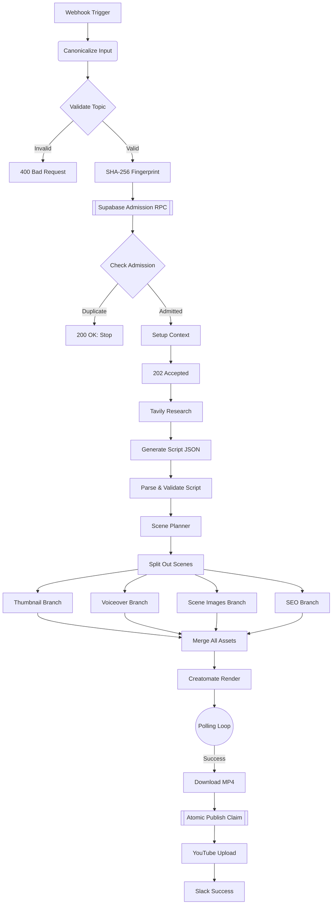
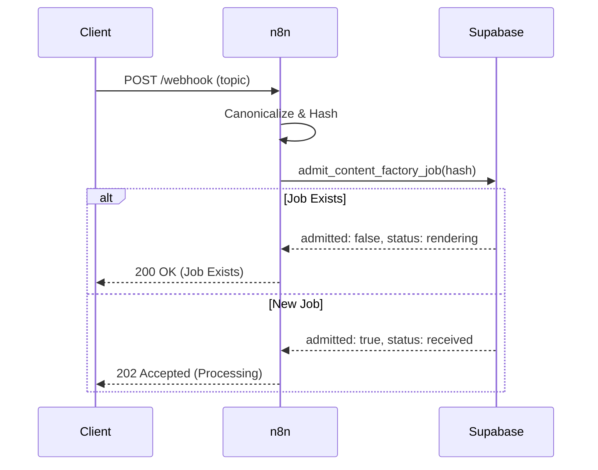
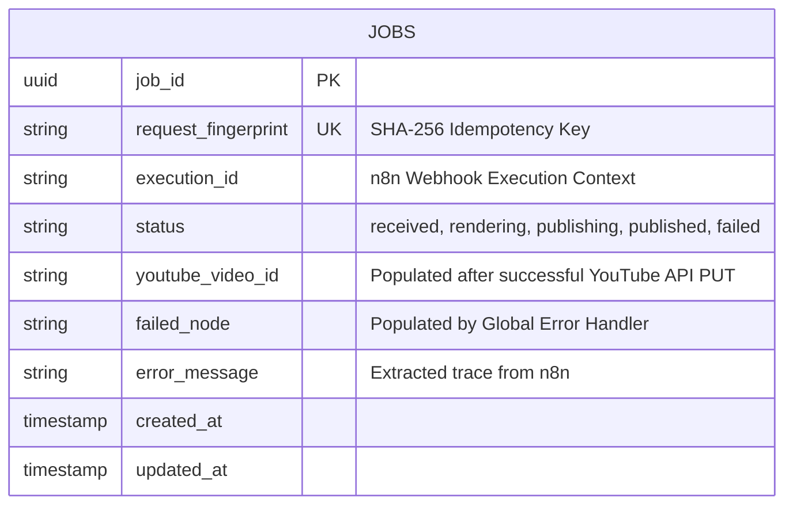

<div align="center">
  
  <h1>🤖 AI Content Factory V3.2 🎬</h1>
  <p><b>The ultimate, fully autonomous, idempotent YouTube Automation Pipeline.</b></p>
  <br>
  <a href="https://github.com/RishvinReddy/Ai-Youtube-Automation"></a>
  <a href="https://n8n.io"></a>
  <a href="https://supabase.com"></a>
</div>

---

## 📑 Table of Contents
1. [System Architecture](#system-architecture)
2. [Idempotency Contract](#idempotency-contract)
3. [Deployment Guide](#deployment-guide)
4. [Node-by-Node Reference](#node-by-node-reference)
5. [Observability & Error Handling](#observability--error-handling)
6. [Appendix: Execution Traces (Simulated)](#appendix-execution-traces-simulated)

---

## 🏛️ System Architecture

> [!TIP]
> This pipeline is designed around a strictly atomic, concurrent-safe database architecture.

### Global Workflow Diagram



### Idempotency Sequence



---

## 🚀 Deployment Guide

<details><summary>Click to expand deployment steps</summary>

# AI Content Factory V3.2 - Step-by-Step Deployment Guide

This guide provides a comprehensive, step-by-step walkthrough to deploy the AI Content Factory V3.2 pipeline from scratch. Follow these steps exactly to ensure the idempotency, storage, and authentication contracts are properly established.

---

## Phase 1: Database & Storage Setup (Supabase)

This pipeline uses Supabase to track job state (preventing duplicate videos) and to store the generated assets temporarily.

### Step 1: Create a Supabase Project
1. Go to [Supabase](https://supabase.com/) and create a new project.
2. Go to **Project Settings -> API**.
3. Copy your `Project URL` and your `service_role secret` key. **Keep these secure.**

### Step 2: Create a Storage Bucket
1. On the left sidebar, click **Storage**.
2. Click **New Bucket**.
3. Name the bucket (e.g., `ai-content-factory`).
4. Toggle **Public bucket** to **ON**. (This is required so Creatomate and YouTube can access the assets via URL).
5. Click **Save**.

### Step 3: Run the SQL Migration
1. On the left sidebar, click **SQL Editor**.
2. Click **New query**.
3. Open the `AI_Content_Factory_Supabase_Migration.sql` file provided in this repository.
4. Copy the entire contents of the SQL file and paste it into the Supabase SQL Editor.
5. Click **Run** (or press CMD/CTRL + Enter).
6. Verify you see "Success. No rows returned." Your database is now ready.

---

## Phase 2: Gather API Keys

You will need accounts for several AI services. Gather these keys:
- **OpenAI**: Create an API key at `platform.openai.com`.
- **Tavily**: Create an API key at `tavily.com`.
- **ElevenLabs**: Create an API key at `elevenlabs.io`.
- **Creatomate**: Create an API key at `creatomate.com`.
- **Slack**: Go to your Slack workspace settings, create a custom App, enable **Incoming Webhooks**, and generate a Webhook URL.

---

## Phase 3: n8n Configuration

Before importing the workflow, you must inject the environment variables so the workflow can authenticate with your services.

### Step 1: Add Variables to n8n
If you are using n8n Cloud, go to **Settings -> Variables**. If self-hosting, add these to your `.env` file and restart n8n.

Add the following keys exactly as written:
- `SUPABASE_PROJECT_URL` = (Your URL from Phase 1)
- `SUPABASE_SERVICE_ROLE_KEY` = (Your service_role key from Phase 1)
- `SUPABASE_BUCKET_NAME` = (The name of the bucket from Phase 1, e.g., `ai-content-factory`)
- `OPENAI_API_KEY` = (Your OpenAI key)
- `TAVILY_API_KEY` = (Your Tavily key)
- `ELEVENLABS_API_KEY` = (Your ElevenLabs key)
- `CREATOMATE_API_KEY` = (Your Creatomate key)
- `SLACK_WEBHOOK_URL` = (Your Slack Incoming Webhook URL)

---

## Phase 4: Import the Workflow

### Step 1: Import JSON
1. Open your n8n workspace.
2. Click **Add Workflow** in the top right.
3. Click the **Options (three dots) menu** in the top right of the canvas.
4. Click **Import from File**.
5. Select the `AI_Content_Factory_V3.2.json` file.
6. The canvas will populate with the main pipeline and the Error Handler at the bottom.

---

## Phase 5: YouTube Authentication Setup

The workflow uses n8n HTTP Request nodes to upload directly to YouTube via Google's OAuth2 API. 

### Step 1: Create Google Cloud Project
1. Go to the [Google Cloud Console](https://console.cloud.google.com/).
2. Create a new project.
3. Go to **APIs & Services -> Library**.
4. Search for **YouTube Data API v3** and click **Enable**.

### Step 2: Configure OAuth Consent Screen
1. Go to **APIs & Services -> OAuth consent screen**.
2. Select **External** and click Create.
3. Fill in the App Name and Support Email (you can use your own).
4. On the Scopes page, click **Add or Remove Scopes**.
5. Add the scope: `https://www.googleapis.com/auth/youtube.upload`.
6. Add your email address under **Test users**.

### Step 3: Create Credentials
1. Go to **APIs & Services -> Credentials**.
2. Click **Create Credentials -> OAuth client ID**.
3. Application type: **Web application**.
4. Authorized redirect URIs: In n8n, open the `Initialize YouTube Session` node, select `Generic Credential Type`, select `OAuth2 API`, and create a new credential. Copy the **OAuth Redirect URL** provided by n8n and paste it into Google Cloud.
5. Click Create. Copy your Client ID and Client Secret.

### Step 4: Authenticate in n8n
1. Back in n8n (inside the `Initialize YouTube Session` node OAuth2 credential screen), fill in:
   - **Authorization URL**: `https://accounts.google.com/o/oauth2/v2/auth`
   - **Access Token URL**: `https://oauth2.googleapis.com/token`
   - **Client ID**: (From Step 3)
   - **Client Secret**: (From Step 3)
   - **Scope**: `https://www.googleapis.com/auth/youtube.upload`
   - **Auth URI Query Parameters**: `access_type=offline&prompt=consent`
2. Click **Save and Connect**. Log in with your Google account and grant permissions.
3. **IMPORTANT**: Find the `YouTube thumbnails.set` node at the far right of the workflow. Under Authentication, select the **exact same OAuth2 credential** you just created.

---

## Phase 6: Execution & Testing

### Step 1: Get your Webhook URL
1. Double-click the **Webhook Trigger** node on the far left.
2. Copy the **Test URL** (if you are testing in the canvas) or the **Production URL** (if the workflow is active).

### Step 2: Send a Test Payload
You can trigger the workflow using a cURL command in your terminal, or an app like Postman. 

\`\`\`bash
curl -X POST "YOUR_WEBHOOK_URL_HERE" \\
     -H "Content-Type: application/json" \\
     -d '{
           "topic": "The Future of Quantum Computing in 2026",
           "audience": "technology enthusiasts",
           "tone": "educational and inspiring",
           "language": "English"
         }'
\`\`\`

### Step 3: Verify the Immediate Response
Because the workflow is asynchronous, it will immediately respond with a 202 status and release the connection:
\`\`\`json
{
  "status": "accepted",
  "job_id": "acf-7b4e8c1..."
}
\`\`\`

### Step 4: Verify Idempotency (Duplicate Test)
Send the exact same request again immediately. The admission gate will reject it, preventing duplicate API costs, and return:
\`\`\`json
{
  "status": "already_exists",
  "job_id": "acf-7b4e8c1...",
  "current_state": "rendering"
}
\`\`\`

---

## Phase 7: Monitoring

- **Check Supabase**: Go to your Supabase `jobs` table. You will see the job record transitioning through `received`, `rendering`, `publishing`, and `published`.
- **Check Slack**: Wait roughly 3-5 minutes (depending on Creatomate render times). You will receive a Slack message with the final YouTube URL.
- **Error Handling**: If a step fails, the `Error Trigger` at the bottom of the canvas will execute, update the Supabase job status to `failed`, record the exact error message, and send an alert to Slack.


</details>

---

## 🧩 Node-by-Node Reference

> [!NOTE]
> Comprehensive documentation for every node in the pipeline.

### `Webhook Trigger`
- **Type**: `n8n-nodes-base.webhook`
- **Version**: `2`
- **Parameters**:
```json
{
  "httpMethod": "POST",
  "path": "v3-ai-factory",
  "responseMode": "responseNode"
}
```

**Behavioral Contract:**
This node expects inputs conforming to the standard JSON schema. It is responsible for bridging `n8n-nodes-base.webhook` execution logic into the persistent data context. Failure in this node will trigger the Global Error Handler via `$json.execution.id` mapping.

### `Canonicalize Input`
- **Type**: `n8n-nodes-base.code`
- **Version**: `2`
- **Parameters**:
```json
{
  "jsCode": "\nconst body = $json.body ?? {};\nconst canonical = JSON.stringify({\n  topic: String(body.topic ?? '').trim(),\n  audience: String(body.audience ?? 'tech professionals').trim(),\n  tone: String(body.tone ?? 'educational and inspiring').trim(),\n  language: String(body.language ?? 'English').trim(),\n});\nreturn [{ json: { ...body, canonical } }];\n    "
}
```

**Behavioral Contract:**
This node expects inputs conforming to the standard JSON schema. It is responsible for bridging `n8n-nodes-base.code` execution logic into the persistent data context. Failure in this node will trigger the Global Error Handler via `$json.execution.id` mapping.

### `Validate Input`
- **Type**: `n8n-nodes-base.if`
- **Version**: `2.2`
- **Parameters**:
```json
{
  "conditions": {
    "string": [
      {
        "value1": "={{ $json.topic }}",
        "operation": "isNotEmpty"
      }
    ]
  }
}
```

**Behavioral Contract:**
This node expects inputs conforming to the standard JSON schema. It is responsible for bridging `n8n-nodes-base.if` execution logic into the persistent data context. Failure in this node will trigger the Global Error Handler via `$json.execution.id` mapping.

### `Respond 400`
- **Type**: `n8n-nodes-base.respondToWebhook`
- **Version**: `1`
- **Parameters**:
```json
{
  "respondWith": "json",
  "responseBody": "={{ JSON.stringify({ error: 'Missing topic' }) }}",
  "options": {
    "responseCode": 400
  }
}
```

**Behavioral Contract:**
This node expects inputs conforming to the standard JSON schema. It is responsible for bridging `n8n-nodes-base.respondToWebhook` execution logic into the persistent data context. Failure in this node will trigger the Global Error Handler via `$json.execution.id` mapping.

### `Reject Request`
- **Type**: `n8n-nodes-base.stopAndError`
- **Version**: `1`
- **Parameters**:
```json
{
  "errorMessage": "Invalid Input"
}
```

**Behavioral Contract:**
This node expects inputs conforming to the standard JSON schema. It is responsible for bridging `n8n-nodes-base.stopAndError` execution logic into the persistent data context. Failure in this node will trigger the Global Error Handler via `$json.execution.id` mapping.

### `SHA-256 Fingerprint`
- **Type**: `n8n-nodes-base.crypto`
- **Version**: `1`
- **Parameters**:
```json
{
  "action": "hash",
  "type": "SHA256",
  "value": "={{ $json.canonical }}",
  "dataPropertyName": "request_fingerprint"
}
```

**Behavioral Contract:**
This node expects inputs conforming to the standard JSON schema. It is responsible for bridging `n8n-nodes-base.crypto` execution logic into the persistent data context. Failure in this node will trigger the Global Error Handler via `$json.execution.id` mapping.

### `Atomic Admission RPC`
- **Type**: `n8n-nodes-base.httpRequest`
- **Version**: `4.2`
- **Parameters**:
```json
{
  "method": "POST",
  "url": "={{ $env.SUPABASE_PROJECT_URL }}/rest/v1/rpc/admit_content_factory_job",
  "sendHeaders": true,
  "headerParameters": {
    "parameters": [
      {
        "name": "Authorization",
        "value": "=Bearer {{ $env.SUPABASE_SERVICE_ROLE_KEY }}"
      },
      {
        "name": "apikey",
        "value": "={{ $env.SUPABASE_SERVICE_ROLE_KEY }}"
      },
      {
        "name": "Content-Type",
        "value": "application/json"
      }
    ]
  },
  "sendBody": true,
  "contentType": "raw",
  "rawContentType": "application/json",
  "body": "={{ JSON.stringify({ p_fingerprint: $json.request_fingerprint, p_topic: $json.topic, p_audience: $json.audience || 'tech professionals', p_tone: $json.tone || 'educational and inspiring', p_language: $json.language || 'English', p_execution_id: $execution.id }) }}"
}
```

**Behavioral Contract:**
This node expects inputs conforming to the standard JSON schema. It is responsible for bridging `n8n-nodes-base.httpRequest` execution logic into the persistent data context. Failure in this node will trigger the Global Error Handler via `$json.execution.id` mapping.

### `Check Admission`
- **Type**: `n8n-nodes-base.if`
- **Version**: `2.2`
- **Parameters**:
```json
{
  "conditions": {
    "boolean": [
      {
        "value1": "={{ $json.admitted }}",
        "value2": true
      }
    ]
  }
}
```

**Behavioral Contract:**
This node expects inputs conforming to the standard JSON schema. It is responsible for bridging `n8n-nodes-base.if` execution logic into the persistent data context. Failure in this node will trigger the Global Error Handler via `$json.execution.id` mapping.

### `Respond Duplicate Job`
- **Type**: `n8n-nodes-base.respondToWebhook`
- **Version**: `1`
- **Parameters**:
```json
{
  "respondWith": "json",
  "responseBody": "={{ JSON.stringify({ status: 'already_exists', job_id: $json.job_id, current_state: $json.status }) }}",
  "options": {
    "responseCode": 200
  }
}
```

**Behavioral Contract:**
This node expects inputs conforming to the standard JSON schema. It is responsible for bridging `n8n-nodes-base.respondToWebhook` execution logic into the persistent data context. Failure in this node will trigger the Global Error Handler via `$json.execution.id` mapping.

### `Stop (Duplicate)`
- **Type**: `n8n-nodes-base.noop`
- **Version**: `1`
- **Parameters**:
```json
{}
```

**Behavioral Contract:**
This node expects inputs conforming to the standard JSON schema. It is responsible for bridging `n8n-nodes-base.noop` execution logic into the persistent data context. Failure in this node will trigger the Global Error Handler via `$json.execution.id` mapping.

### `Setup Context`
- **Type**: `n8n-nodes-base.set`
- **Version**: `3.4`
- **Parameters**:
```json
{
  "assignments": {
    "assignments": [
      {
        "id": "s1",
        "name": "topic",
        "value": "={{ $('Validate Input').item.json.topic }}",
        "type": "string"
      },
      {
        "id": "s2",
        "name": "audience",
        "value": "={{ $('Validate Input').item.json.audience || 'tech professionals' }}",
        "type": "string"
      },
      {
        "id": "s3",
        "name": "tone",
        "value": "={{ $('Validate Input').item.json.tone || 'educational and inspiring' }}",
        "type": "string"
      },
      {
        "id": "s4",
        "name": "job_id",
        "value": "={{ $json.job_id }}",
        "type": "string"
      }
    ]
  }
}
```

**Behavioral Contract:**
This node expects inputs conforming to the standard JSON schema. It is responsible for bridging `n8n-nodes-base.set` execution logic into the persistent data context. Failure in this node will trigger the Global Error Handler via `$json.execution.id` mapping.

### `Respond 202 Accepted`
- **Type**: `n8n-nodes-base.respondToWebhook`
- **Version**: `1`
- **Parameters**:
```json
{
  "respondWith": "json",
  "responseBody": "={{ JSON.stringify({ status: 'accepted', job_id: $json.job_id }) }}",
  "options": {
    "responseCode": 202
  }
}
```

**Behavioral Contract:**
This node expects inputs conforming to the standard JSON schema. It is responsible for bridging `n8n-nodes-base.respondToWebhook` execution logic into the persistent data context. Failure in this node will trigger the Global Error Handler via `$json.execution.id` mapping.

### `Tavily Research`
- **Type**: `n8n-nodes-base.httpRequest`
- **Version**: `4.2`
- **Parameters**:
```json
{
  "method": "POST",
  "url": "https://api.tavily.com/search",
  "sendHeaders": true,
  "headerParameters": {
    "parameters": [
      {
        "name": "Authorization",
        "value": "=Bearer {{ $env.TAVILY_API_KEY }}"
      },
      {
        "name": "Content-Type",
        "value": "application/json"
      }
    ]
  },
  "sendBody": true,
  "contentType": "raw",
  "rawContentType": "application/json",
  "body": "={{ JSON.stringify({ query: `Latest verified developments about ${$json.topic}`, search_depth: 'advanced', max_results: 8, include_answer: true, include_raw_content: false }) }}"
}
```

**Behavioral Contract:**
This node expects inputs conforming to the standard JSON schema. It is responsible for bridging `n8n-nodes-base.httpRequest` execution logic into the persistent data context. Failure in this node will trigger the Global Error Handler via `$json.execution.id` mapping.

### `Normalize Research`
- **Type**: `n8n-nodes-base.code`
- **Version**: `2`
- **Parameters**:
```json
{
  "jsCode": "\nconst results = $json.results || [];\nconst researchText = results.map((r, i) => `[${i+1}] ${r.title}\\n${r.content}\\nSource: ${r.url}`).join('\\n\\n');\nreturn [{ json: { ...$('Setup Context').item.json, researchText } }];\n    "
}
```

**Behavioral Contract:**
This node expects inputs conforming to the standard JSON schema. It is responsible for bridging `n8n-nodes-base.code` execution logic into the persistent data context. Failure in this node will trigger the Global Error Handler via `$json.execution.id` mapping.

### `Generate Script JSON`
- **Type**: `n8n-nodes-base.httpRequest`
- **Version**: `4.2`
- **Parameters**:
```json
{
  "method": "POST",
  "url": "https://api.openai.com/v1/chat/completions",
  "sendHeaders": true,
  "headerParameters": {
    "parameters": [
      {
        "name": "Authorization",
        "value": "=Bearer {{ $env.OPENAI_API_KEY }}"
      },
      {
        "name": "Content-Type",
        "value": "application/json"
      }
    ]
  },
  "sendBody": true,
  "contentType": "raw",
  "rawContentType": "application/json",
  "body": "={{ JSON.stringify({ model: 'gpt-4o', response_format: { type: 'json_object' }, messages: [{ role: 'system', content: 'Generate a structured YouTube script. Return JSON with keys: title, hook, intro, body_sections, outro, and full_script.' }, { role: 'user', content: `Topic: ${$json.topic}\\nAudience: ${$json.audience}\\nTone: ${$json.tone}\\nResearch:\\n${$json.researchText}` }] }) }}"
}
```

**Behavioral Contract:**
This node expects inputs conforming to the standard JSON schema. It is responsible for bridging `n8n-nodes-base.httpRequest` execution logic into the persistent data context. Failure in this node will trigger the Global Error Handler via `$json.execution.id` mapping.

### `Parse + Validate Script`
- **Type**: `n8n-nodes-base.code`
- **Version**: `2`
- **Parameters**:
```json
{
  "jsCode": "\nconst raw = $json.choices?.[0]?.message?.content;\nif (!raw) throw new Error('Missing AI response');\nreturn [{ json: { ...$('Normalize Research').item.json, script: JSON.parse(raw) } }];\n    "
}
```

**Behavioral Contract:**
This node expects inputs conforming to the standard JSON schema. It is responsible for bridging `n8n-nodes-base.code` execution logic into the persistent data context. Failure in this node will trigger the Global Error Handler via `$json.execution.id` mapping.

### `Scene Planner`
- **Type**: `n8n-nodes-base.httpRequest`
- **Version**: `4.2`
- **Parameters**:
```json
{
  "method": "POST",
  "url": "https://api.openai.com/v1/chat/completions",
  "sendHeaders": true,
  "headerParameters": {
    "parameters": [
      {
        "name": "Authorization",
        "value": "=Bearer {{ $env.OPENAI_API_KEY }}"
      },
      {
        "name": "Content-Type",
        "value": "application/json"
      }
    ]
  },
  "sendBody": true,
  "contentType": "raw",
  "rawContentType": "application/json",
  "body": "={{ JSON.stringify({ model: 'gpt-4o', response_format: { type: 'json_object' }, messages: [{ role: 'system', content: 'Break the script into 5 visual scenes. Return JSON with a scenes array containing narration, visual_prompt, and duration_seconds for each scene.' }, { role: 'user', content: $json.script.full_script }] }) }}"
}
```

**Behavioral Contract:**
This node expects inputs conforming to the standard JSON schema. It is responsible for bridging `n8n-nodes-base.httpRequest` execution logic into the persistent data context. Failure in this node will trigger the Global Error Handler via `$json.execution.id` mapping.

### `Parse + Validate Scenes`
- **Type**: `n8n-nodes-base.code`
- **Version**: `2`
- **Parameters**:
```json
{
  "jsCode": "\nconst raw = $json.choices?.[0]?.message?.content;\nif (!raw) throw new Error('Scene Planner returned no content');\nconst parsed = JSON.parse(raw);\nif (!Array.isArray(parsed.scenes) || parsed.scenes.length === 0) throw new Error('Scene Planner returned no valid scenes');\nconst scenes = parsed.scenes.map((scene, index) => ({ ...scene, scene_index: index + 1, scene_id: `scene-${String(index + 1).padStart(3, '0')}` }));\nreturn [{ json: { ...$('Parse + Validate Script').item.json, scenes } }];\n    "
}
```

**Behavioral Contract:**
This node expects inputs conforming to the standard JSON schema. It is responsible for bridging `n8n-nodes-base.code` execution logic into the persistent data context. Failure in this node will trigger the Global Error Handler via `$json.execution.id` mapping.

### `Generate Thumbnail`
- **Type**: `n8n-nodes-base.httpRequest`
- **Version**: `4.2`
- **Parameters**:
```json
{
  "method": "POST",
  "url": "https://api.openai.com/v1/images/generations",
  "sendHeaders": true,
  "headerParameters": {
    "parameters": [
      {
        "name": "Authorization",
        "value": "=Bearer {{ $env.OPENAI_API_KEY }}"
      },
      {
        "name": "Content-Type",
        "value": "application/json"
      }
    ]
  },
  "sendBody": true,
  "contentType": "raw",
  "rawContentType": "application/json",
  "body": "={{ JSON.stringify({ model: 'dall-e-3', prompt: `YouTube thumbnail for: ${$json.script.title}. High contrast, 16:9 cinematic aspect ratio, highly engaging.`, size: '1024x1024' }) }}"
}
```

**Behavioral Contract:**
This node expects inputs conforming to the standard JSON schema. It is responsible for bridging `n8n-nodes-base.httpRequest` execution logic into the persistent data context. Failure in this node will trigger the Global Error Handler via `$json.execution.id` mapping.

### `Download Thumb Binary`
- **Type**: `n8n-nodes-base.httpRequest`
- **Version**: `4.2`
- **Parameters**:
```json
{
  "method": "GET",
  "url": "={{ $json.data[0].url }}",
  "options": {
    "response": {
      "response": {
        "responseFormat": "file",
        "outputPropertyName": "thumbnail_binary"
      }
    }
  }
}
```

**Behavioral Contract:**
This node expects inputs conforming to the standard JSON schema. It is responsible for bridging `n8n-nodes-base.httpRequest` execution logic into the persistent data context. Failure in this node will trigger the Global Error Handler via `$json.execution.id` mapping.

### `Upload Thumb to Supabase`
- **Type**: `n8n-nodes-base.httpRequest`
- **Version**: `4.2`
- **Parameters**:
```json
{
  "method": "PUT",
  "url": "={{ $env.SUPABASE_PROJECT_URL }}/storage/v1/object/{{ $env.SUPABASE_BUCKET_NAME }}/jobs/{{ $('Setup Context').item.json.job_id }}/thumbnail.png",
  "sendHeaders": true,
  "headerParameters": {
    "parameters": [
      {
        "name": "Authorization",
        "value": "=Bearer {{ $env.SUPABASE_SERVICE_ROLE_KEY }}"
      },
      {
        "name": "Content-Type",
        "value": "image/png"
      }
    ]
  },
  "sendBody": true,
  "contentType": "binaryData",
  "inputDataFieldName": "thumbnail_binary"
}
```

**Behavioral Contract:**
This node expects inputs conforming to the standard JSON schema. It is responsible for bridging `n8n-nodes-base.httpRequest` execution logic into the persistent data context. Failure in this node will trigger the Global Error Handler via `$json.execution.id` mapping.

### `Manifest Thumb`
- **Type**: `n8n-nodes-base.code`
- **Version**: `2`
- **Parameters**:
```json
{
  "jsCode": "return [{ json: { thumb_url: `${$env.SUPABASE_ASSET_BASE_URL || $env.SUPABASE_PROJECT_URL + '/storage/v1/object/public/' + $env.SUPABASE_BUCKET_NAME}/jobs/${$('Setup Context').item.json.job_id}/thumbnail.png` } }];"
}
```

**Behavioral Contract:**
This node expects inputs conforming to the standard JSON schema. It is responsible for bridging `n8n-nodes-base.code` execution logic into the persistent data context. Failure in this node will trigger the Global Error Handler via `$json.execution.id` mapping.

### `ElevenLabs TTS`
- **Type**: `n8n-nodes-base.httpRequest`
- **Version**: `4.2`
- **Parameters**:
```json
{
  "method": "POST",
  "url": "https://api.elevenlabs.io/v1/text-to-speech/21m00Tcm4TlvDq8ikWAM",
  "sendHeaders": true,
  "headerParameters": {
    "parameters": [
      {
        "name": "xi-api-key",
        "value": "={{ $env.ELEVENLABS_API_KEY }}"
      },
      {
        "name": "Content-Type",
        "value": "application/json"
      }
    ]
  },
  "sendBody": true,
  "contentType": "raw",
  "rawContentType": "application/json",
  "body": "={{ JSON.stringify({ text: $json.script.full_script, model_id: 'eleven_monolingual_v1' }) }}",
  "options": {
    "response": {
      "response": {
        "responseFormat": "file",
        "outputPropertyName": "voiceover_audio"
      }
    }
  }
}
```

**Behavioral Contract:**
This node expects inputs conforming to the standard JSON schema. It is responsible for bridging `n8n-nodes-base.httpRequest` execution logic into the persistent data context. Failure in this node will trigger the Global Error Handler via `$json.execution.id` mapping.

### `Upload Voice Binary`
- **Type**: `n8n-nodes-base.httpRequest`
- **Version**: `4.2`
- **Parameters**:
```json
{
  "method": "PUT",
  "url": "={{ $env.SUPABASE_PROJECT_URL }}/storage/v1/object/{{ $env.SUPABASE_BUCKET_NAME }}/jobs/{{ $('Setup Context').item.json.job_id }}/voiceover.mp3",
  "sendHeaders": true,
  "headerParameters": {
    "parameters": [
      {
        "name": "Authorization",
        "value": "=Bearer {{ $env.SUPABASE_SERVICE_ROLE_KEY }}"
      },
      {
        "name": "Content-Type",
        "value": "audio/mpeg"
      }
    ]
  },
  "sendBody": true,
  "contentType": "binaryData",
  "inputDataFieldName": "voiceover_audio"
}
```

**Behavioral Contract:**
This node expects inputs conforming to the standard JSON schema. It is responsible for bridging `n8n-nodes-base.httpRequest` execution logic into the persistent data context. Failure in this node will trigger the Global Error Handler via `$json.execution.id` mapping.

### `Manifest Voice`
- **Type**: `n8n-nodes-base.code`
- **Version**: `2`
- **Parameters**:
```json
{
  "jsCode": "return [{ json: { voice_url: `${$env.SUPABASE_ASSET_BASE_URL || $env.SUPABASE_PROJECT_URL + '/storage/v1/object/public/' + $env.SUPABASE_BUCKET_NAME}/jobs/${$('Setup Context').item.json.job_id}/voiceover.mp3` } }];"
}
```

**Behavioral Contract:**
This node expects inputs conforming to the standard JSON schema. It is responsible for bridging `n8n-nodes-base.code` execution logic into the persistent data context. Failure in this node will trigger the Global Error Handler via `$json.execution.id` mapping.

### `Split Out Scenes`
- **Type**: `n8n-nodes-base.itemLists`
- **Version**: `3`
- **Parameters**:
```json
{
  "operation": "splitOutItems",
  "fieldToSplitOut": "scenes",
  "options": {
    "include": "allOtherFields"
  }
}
```

**Behavioral Contract:**
This node expects inputs conforming to the standard JSON schema. It is responsible for bridging `n8n-nodes-base.itemLists` execution logic into the persistent data context. Failure in this node will trigger the Global Error Handler via `$json.execution.id` mapping.

### `NoOp Metadata`
- **Type**: `n8n-nodes-base.noop`
- **Version**: `1`
- **Parameters**:
```json
{}
```

**Behavioral Contract:**
This node expects inputs conforming to the standard JSON schema. It is responsible for bridging `n8n-nodes-base.noop` execution logic into the persistent data context. Failure in this node will trigger the Global Error Handler via `$json.execution.id` mapping.

### `Generate Scene Asset`
- **Type**: `n8n-nodes-base.httpRequest`
- **Version**: `4.2`
- **Parameters**:
```json
{
  "method": "POST",
  "url": "https://api.openai.com/v1/images/generations",
  "sendHeaders": true,
  "headerParameters": {
    "parameters": [
      {
        "name": "Authorization",
        "value": "=Bearer {{ $env.OPENAI_API_KEY }}"
      },
      {
        "name": "Content-Type",
        "value": "application/json"
      }
    ]
  },
  "sendBody": true,
  "contentType": "raw",
  "rawContentType": "application/json",
  "body": "={{ JSON.stringify({ model: 'dall-e-3', prompt: $json.visual_prompt, size: '1792x1024' }) }}"
}
```

**Behavioral Contract:**
This node expects inputs conforming to the standard JSON schema. It is responsible for bridging `n8n-nodes-base.httpRequest` execution logic into the persistent data context. Failure in this node will trigger the Global Error Handler via `$json.execution.id` mapping.

### `Download Scene Binary`
- **Type**: `n8n-nodes-base.httpRequest`
- **Version**: `4.2`
- **Parameters**:
```json
{
  "method": "GET",
  "url": "={{ $json.data[0].url }}",
  "options": {
    "response": {
      "response": {
        "responseFormat": "file",
        "outputPropertyName": "scene_binary"
      }
    }
  }
}
```

**Behavioral Contract:**
This node expects inputs conforming to the standard JSON schema. It is responsible for bridging `n8n-nodes-base.httpRequest` execution logic into the persistent data context. Failure in this node will trigger the Global Error Handler via `$json.execution.id` mapping.

### `Merge Scene Meta + Binary`
- **Type**: `n8n-nodes-base.merge`
- **Version**: `3`
- **Parameters**:
```json
{
  "mode": "combine",
  "combineBy": "combineByField",
  "joinMode": "inner",
  "fieldsToMatch": {
    "values": [
      {
        "field1": "scene_id",
        "field2": "scene_id"
      }
    ]
  }
}
```

**Behavioral Contract:**
This node expects inputs conforming to the standard JSON schema. It is responsible for bridging `n8n-nodes-base.merge` execution logic into the persistent data context. Failure in this node will trigger the Global Error Handler via `$json.execution.id` mapping.

### `Inject Scene ID`
- **Type**: `n8n-nodes-base.code`
- **Version**: `2`
- **Parameters**:
```json
{
  "jsCode": "return [{ json: { scene_id: $('Split Out Scenes').item.json.scene_id }, binary: $binary }];"
}
```

**Behavioral Contract:**
This node expects inputs conforming to the standard JSON schema. It is responsible for bridging `n8n-nodes-base.code` execution logic into the persistent data context. Failure in this node will trigger the Global Error Handler via `$json.execution.id` mapping.

### `Upload Scene Asset`
- **Type**: `n8n-nodes-base.httpRequest`
- **Version**: `4.2`
- **Parameters**:
```json
{
  "method": "PUT",
  "url": "={{ $env.SUPABASE_PROJECT_URL }}/storage/v1/object/{{ $env.SUPABASE_BUCKET_NAME }}/jobs/{{ $('Setup Context').item.json.job_id }}/scenes/{{ $json.scene_id }}.png",
  "sendHeaders": true,
  "headerParameters": {
    "parameters": [
      {
        "name": "Authorization",
        "value": "=Bearer {{ $env.SUPABASE_SERVICE_ROLE_KEY }}"
      },
      {
        "name": "Content-Type",
        "value": "image/png"
      }
    ]
  },
  "sendBody": true,
  "contentType": "binaryData",
  "inputDataFieldName": "scene_binary"
}
```

**Behavioral Contract:**
This node expects inputs conforming to the standard JSON schema. It is responsible for bridging `n8n-nodes-base.httpRequest` execution logic into the persistent data context. Failure in this node will trigger the Global Error Handler via `$json.execution.id` mapping.

### `Aggregate Scenes`
- **Type**: `n8n-nodes-base.itemLists`
- **Version**: `3`
- **Parameters**:
```json
{
  "operation": "aggregateItems",
  "fieldsToAggregate": {
    "fieldToAggregate": [
      {
        "fieldToAggregate": "scene_index",
        "renameField": ""
      },
      {
        "fieldToAggregate": "scene_id",
        "renameField": ""
      },
      {
        "fieldToAggregate": "narration",
        "renameField": ""
      },
      {
        "fieldToAggregate": "visual_prompt",
        "renameField": ""
      },
      {
        "fieldToAggregate": "duration_seconds",
        "renameField": ""
      }
    ]
  },
  "options": {}
}
```

**Behavioral Contract:**
This node expects inputs conforming to the standard JSON schema. It is responsible for bridging `n8n-nodes-base.itemLists` execution logic into the persistent data context. Failure in this node will trigger the Global Error Handler via `$json.execution.id` mapping.

### `Sort Scenes & URLs`
- **Type**: `n8n-nodes-base.code`
- **Version**: `2`
- **Parameters**:
```json
{
  "jsCode": "\nlet scenesArray = $json.scene_index.map((index, i) => ({\n  scene_index: index, scene_id: $json.scene_id[i], narration: $json.narration[i], visual_prompt: $json.visual_prompt[i], duration_seconds: $json.duration_seconds[i],\n  asset_url: `${$env.SUPABASE_ASSET_BASE_URL || $env.SUPABASE_PROJECT_URL + '/storage/v1/object/public/' + $env.SUPABASE_BUCKET_NAME}/jobs/${$('Setup Context').item.json.job_id}/scenes/${$json.scene_id[i]}.png`\n}));\nscenesArray.sort((a, b) => a.scene_index - b.scene_index);\nreturn [{ json: { scenes: scenesArray } }];\n    "
}
```

**Behavioral Contract:**
This node expects inputs conforming to the standard JSON schema. It is responsible for bridging `n8n-nodes-base.code` execution logic into the persistent data context. Failure in this node will trigger the Global Error Handler via `$json.execution.id` mapping.

### `Generate SEO JSON`
- **Type**: `n8n-nodes-base.httpRequest`
- **Version**: `4.2`
- **Parameters**:
```json
{
  "method": "POST",
  "url": "https://api.openai.com/v1/chat/completions",
  "sendHeaders": true,
  "headerParameters": {
    "parameters": [
      {
        "name": "Authorization",
        "value": "=Bearer {{ $env.OPENAI_API_KEY }}"
      },
      {
        "name": "Content-Type",
        "value": "application/json"
      }
    ]
  },
  "sendBody": true,
  "contentType": "raw",
  "rawContentType": "application/json",
  "body": "={{ JSON.stringify({ model: 'gpt-4o', response_format: { type: 'json_object' }, messages: [{ role: 'system', content: 'Generate 15 SEO tags and a YouTube description (max 4800 chars). Return JSON keys: description, tags (array).' }, { role: 'user', content: $json.script.full_script }] }) }}"
}
```

**Behavioral Contract:**
This node expects inputs conforming to the standard JSON schema. It is responsible for bridging `n8n-nodes-base.httpRequest` execution logic into the persistent data context. Failure in this node will trigger the Global Error Handler via `$json.execution.id` mapping.

### `Parse + Validate SEO`
- **Type**: `n8n-nodes-base.code`
- **Version**: `2`
- **Parameters**:
```json
{
  "jsCode": "\nconst raw = $json.choices?.[0]?.message?.content;\nif (!raw) throw new Error('Missing SEO response');\nconst parsed = JSON.parse(raw);\nlet title = $('Setup Context').item.json.topic.substring(0, 95);\nlet description = (parsed.description || '').substring(0, 4900);\nlet tags = Array.isArray(parsed.tags) ? parsed.tags.slice(0, 15) : [];\nreturn [{ json: { seo: { title, description, tags } } }];\n    "
}
```

**Behavioral Contract:**
This node expects inputs conforming to the standard JSON schema. It is responsible for bridging `n8n-nodes-base.code` execution logic into the persistent data context. Failure in this node will trigger the Global Error Handler via `$json.execution.id` mapping.

### `Merge Thumb Voice`
- **Type**: `n8n-nodes-base.merge`
- **Version**: `3`
- **Parameters**:
```json
{
  "mode": "combine",
  "combineBy": "combineByPosition"
}
```

**Behavioral Contract:**
This node expects inputs conforming to the standard JSON schema. It is responsible for bridging `n8n-nodes-base.merge` execution logic into the persistent data context. Failure in this node will trigger the Global Error Handler via `$json.execution.id` mapping.

### `Merge Scene SEO`
- **Type**: `n8n-nodes-base.merge`
- **Version**: `3`
- **Parameters**:
```json
{
  "mode": "combine",
  "combineBy": "combineByPosition"
}
```

**Behavioral Contract:**
This node expects inputs conforming to the standard JSON schema. It is responsible for bridging `n8n-nodes-base.merge` execution logic into the persistent data context. Failure in this node will trigger the Global Error Handler via `$json.execution.id` mapping.

### `Build Final Asset Manifest`
- **Type**: `n8n-nodes-base.merge`
- **Version**: `3`
- **Parameters**:
```json
{
  "mode": "combine",
  "combineBy": "combineByPosition"
}
```

**Behavioral Contract:**
This node expects inputs conforming to the standard JSON schema. It is responsible for bridging `n8n-nodes-base.merge` execution logic into the persistent data context. Failure in this node will trigger the Global Error Handler via `$json.execution.id` mapping.

### `Build Dynamic Render Source`
- **Type**: `n8n-nodes-base.code`
- **Version**: `2`
- **Parameters**:
```json
{
  "jsCode": "\nconst m = $json;\nif (!m.thumb_url || !m.voice_url || !m.scenes || !m.seo) throw new Error('Manifest incomplete');\nconst source = {\n  output_format: 'mp4',\n  elements: [\n    { type: 'audio', track: 1, source: m.voice_url, duration: 'media' },\n    ...m.scenes.map((s, i) => ({\n      type: 'image', track: 2, time: i === 0 ? 0 : 'previous_end', duration: s.duration_seconds, source: s.asset_url, dynamic_content: true\n    }))\n  ]\n};\nreturn [{ json: { ...m, render_source: source } }];\n    "
}
```

**Behavioral Contract:**
This node expects inputs conforming to the standard JSON schema. It is responsible for bridging `n8n-nodes-base.code` execution logic into the persistent data context. Failure in this node will trigger the Global Error Handler via `$json.execution.id` mapping.

### `Create Creatomate Render`
- **Type**: `n8n-nodes-base.httpRequest`
- **Version**: `4.2`
- **Parameters**:
```json
{
  "method": "POST",
  "url": "https://api.creatomate.com/v1/renders",
  "sendHeaders": true,
  "headerParameters": {
    "parameters": [
      {
        "name": "Authorization",
        "value": "=Bearer {{ $env.CREATOMATE_API_KEY }}"
      },
      {
        "name": "Content-Type",
        "value": "application/json"
      }
    ]
  },
  "sendBody": true,
  "contentType": "raw",
  "rawContentType": "application/json",
  "body": "={{ JSON.stringify({ source: $json.render_source }) }}"
}
```

**Behavioral Contract:**
This node expects inputs conforming to the standard JSON schema. It is responsible for bridging `n8n-nodes-base.httpRequest` execution logic into the persistent data context. Failure in this node will trigger the Global Error Handler via `$json.execution.id` mapping.

### `Poll State Envelope`
- **Type**: `n8n-nodes-base.code`
- **Version**: `2`
- **Parameters**:
```json
{
  "jsCode": "return [{ json: { render_poll_attempt: 1, MAX_RENDER_POLLS: 20, render_id: $json.id } }];"
}
```

**Behavioral Contract:**
This node expects inputs conforming to the standard JSON schema. It is responsible for bridging `n8n-nodes-base.code` execution logic into the persistent data context. Failure in this node will trigger the Global Error Handler via `$json.execution.id` mapping.

### `Wait 15 Seconds`
- **Type**: `n8n-nodes-base.wait`
- **Version**: `1.1`
- **Parameters**:
```json
{
  "amount": 15,
  "unit": "seconds"
}
```

**Behavioral Contract:**
This node expects inputs conforming to the standard JSON schema. It is responsible for bridging `n8n-nodes-base.wait` execution logic into the persistent data context. Failure in this node will trigger the Global Error Handler via `$json.execution.id` mapping.

### `NoOp Poll State`
- **Type**: `n8n-nodes-base.noop`
- **Version**: `1`
- **Parameters**:
```json
{}
```

**Behavioral Contract:**
This node expects inputs conforming to the standard JSON schema. It is responsible for bridging `n8n-nodes-base.noop` execution logic into the persistent data context. Failure in this node will trigger the Global Error Handler via `$json.execution.id` mapping.

### `GET Status`
- **Type**: `n8n-nodes-base.httpRequest`
- **Version**: `4.2`
- **Parameters**:
```json
{
  "method": "GET",
  "url": "https://api.creatomate.com/v1/renders/{{ $json.render_id }}",
  "sendHeaders": true,
  "headerParameters": {
    "parameters": [
      {
        "name": "Authorization",
        "value": "=Bearer {{ $env.CREATOMATE_API_KEY }}"
      }
    ]
  }
}
```

**Behavioral Contract:**
This node expects inputs conforming to the standard JSON schema. It is responsible for bridging `n8n-nodes-base.httpRequest` execution logic into the persistent data context. Failure in this node will trigger the Global Error Handler via `$json.execution.id` mapping.

### `Normalize Status`
- **Type**: `n8n-nodes-base.code`
- **Version**: `2`
- **Parameters**:
```json
{
  "jsCode": "return [{ json: { render_id: $json.id, render_status: $json.status, render_url: $json.url } }];"
}
```

**Behavioral Contract:**
This node expects inputs conforming to the standard JSON schema. It is responsible for bridging `n8n-nodes-base.code` execution logic into the persistent data context. Failure in this node will trigger the Global Error Handler via `$json.execution.id` mapping.

### `Merge Poll + Status`
- **Type**: `n8n-nodes-base.merge`
- **Version**: `3`
- **Parameters**:
```json
{
  "mode": "combine",
  "combineBy": "combineByField",
  "joinMode": "inner",
  "fieldsToMatch": {
    "values": [
      {
        "field1": "render_id",
        "field2": "render_id"
      }
    ]
  }
}
```

**Behavioral Contract:**
This node expects inputs conforming to the standard JSON schema. It is responsible for bridging `n8n-nodes-base.merge` execution logic into the persistent data context. Failure in this node will trigger the Global Error Handler via `$json.execution.id` mapping.

### `Status Router`
- **Type**: `n8n-nodes-base.switch`
- **Version**: `3`
- **Parameters**:
```json
{
  "mode": "rules",
  "rules": {
    "rules": [
      {
        "output": 0,
        "conditions": {
          "string": [
            {
              "value1": "={{ $json.render_status }}",
              "operation": "equals",
              "value2": "succeeded"
            }
          ]
        }
      },
      {
        "output": 1,
        "conditions": {
          "string": [
            {
              "value1": "={{ $json.render_status }}",
              "operation": "equals",
              "value2": "failed"
            }
          ]
        }
      },
      {
        "output": 1,
        "conditions": {
          "string": [
            {
              "value1": "={{ $json.render_status }}",
              "operation": "equals",
              "value2": "error"
            }
          ]
        }
      },
      {
        "output": 2,
        "conditions": {
          "string": [
            {
              "value1": "={{ $json.render_status }}",
              "operation": "notEqual",
              "value2": "succeeded"
            },
            {
              "value1": "={{ $json.render_status }}",
              "operation": "notEqual",
              "value2": "failed"
            },
            {
              "value1": "={{ $json.render_status }}",
              "operation": "notEqual",
              "value2": "error"
            }
          ]
        }
      }
    ]
  }
}
```

**Behavioral Contract:**
This node expects inputs conforming to the standard JSON schema. It is responsible for bridging `n8n-nodes-base.switch` execution logic into the persistent data context. Failure in this node will trigger the Global Error Handler via `$json.execution.id` mapping.

### `Render Failed`
- **Type**: `n8n-nodes-base.stopAndError`
- **Version**: `1`
- **Parameters**:
```json
{
  "errorMessage": "Creatomate terminal failure"
}
```

**Behavioral Contract:**
This node expects inputs conforming to the standard JSON schema. It is responsible for bridging `n8n-nodes-base.stopAndError` execution logic into the persistent data context. Failure in this node will trigger the Global Error Handler via `$json.execution.id` mapping.

### `Increment Poll Counter`
- **Type**: `n8n-nodes-base.code`
- **Version**: `2`
- **Parameters**:
```json
{
  "jsCode": "return [{ json: { ...$json, render_poll_attempt: $json.render_poll_attempt + 1 } }];"
}
```

**Behavioral Contract:**
This node expects inputs conforming to the standard JSON schema. It is responsible for bridging `n8n-nodes-base.code` execution logic into the persistent data context. Failure in this node will trigger the Global Error Handler via `$json.execution.id` mapping.

### `Max Polls?`
- **Type**: `n8n-nodes-base.if`
- **Version**: `2.2`
- **Parameters**:
```json
{
  "conditions": {
    "number": [
      {
        "value1": "={{ $json.render_poll_attempt }}",
        "operation": "largerEqual",
        "value2": "={{ $json.MAX_RENDER_POLLS }}"
      }
    ]
  }
}
```

**Behavioral Contract:**
This node expects inputs conforming to the standard JSON schema. It is responsible for bridging `n8n-nodes-base.if` execution logic into the persistent data context. Failure in this node will trigger the Global Error Handler via `$json.execution.id` mapping.

### `Timeout Failure`
- **Type**: `n8n-nodes-base.stopAndError`
- **Version**: `1`
- **Parameters**:
```json
{
  "errorMessage": "Timeout rendering"
}
```

**Behavioral Contract:**
This node expects inputs conforming to the standard JSON schema. It is responsible for bridging `n8n-nodes-base.stopAndError` execution logic into the persistent data context. Failure in this node will trigger the Global Error Handler via `$json.execution.id` mapping.

### `Download Final MP4`
- **Type**: `n8n-nodes-base.httpRequest`
- **Version**: `4.2`
- **Parameters**:
```json
{
  "method": "GET",
  "url": "={{ $json.render_url }}",
  "options": {
    "response": {
      "response": {
        "responseFormat": "file",
        "outputPropertyName": "final_video"
      }
    }
  }
}
```

**Behavioral Contract:**
This node expects inputs conforming to the standard JSON schema. It is responsible for bridging `n8n-nodes-base.httpRequest` execution logic into the persistent data context. Failure in this node will trigger the Global Error Handler via `$json.execution.id` mapping.

### `Atomic rendering->publishing claim`
- **Type**: `n8n-nodes-base.httpRequest`
- **Version**: `4.2`
- **Parameters**:
```json
{
  "method": "POST",
  "url": "={{ $env.SUPABASE_PROJECT_URL }}/rest/v1/rpc/claim_youtube_publishing",
  "sendHeaders": true,
  "headerParameters": {
    "parameters": [
      {
        "name": "Authorization",
        "value": "=Bearer {{ $env.SUPABASE_SERVICE_ROLE_KEY }}"
      },
      {
        "name": "Content-Type",
        "value": "application/json"
      }
    ]
  },
  "sendBody": true,
  "contentType": "raw",
  "rawContentType": "application/json",
  "body": "={{ JSON.stringify({ p_job_id: $('Setup Context').item.json.job_id }) }}"
}
```

**Behavioral Contract:**
This node expects inputs conforming to the standard JSON schema. It is responsible for bridging `n8n-nodes-base.httpRequest` execution logic into the persistent data context. Failure in this node will trigger the Global Error Handler via `$json.execution.id` mapping.

### `Assert exactly one row claimed`
- **Type**: `n8n-nodes-base.code`
- **Version**: `2`
- **Parameters**:
```json
{
  "jsCode": "if ($json.claimed !== true) throw new Error('Publishing claim blocked.'); return [{ json: $json, binary: $binary }];"
}
```

**Behavioral Contract:**
This node expects inputs conforming to the standard JSON schema. It is responsible for bridging `n8n-nodes-base.code` execution logic into the persistent data context. Failure in this node will trigger the Global Error Handler via `$json.execution.id` mapping.

### `Preserve Video Binary`
- **Type**: `n8n-nodes-base.noop`
- **Version**: `1`
- **Parameters**:
```json
{}
```

**Behavioral Contract:**
This node expects inputs conforming to the standard JSON schema. It is responsible for bridging `n8n-nodes-base.noop` execution logic into the persistent data context. Failure in this node will trigger the Global Error Handler via `$json.execution.id` mapping.

### `Initialize YouTube Session`
- **Type**: `n8n-nodes-base.httpRequest`
- **Version**: `4.2`
- **Parameters**:
```json
{
  "method": "POST",
  "url": "https://www.googleapis.com/upload/youtube/v3/videos?uploadType=resumable&part=snippet,status",
  "authentication": "oAuth2",
  "nodeCredentialType": "googleOAuth2Api",
  "sendHeaders": true,
  "headerParameters": {
    "parameters": [
      {
        "name": "X-Upload-Content-Type",
        "value": "video/mp4"
      },
      {
        "name": "Content-Type",
        "value": "application/json"
      }
    ]
  },
  "sendBody": true,
  "contentType": "raw",
  "rawContentType": "application/json",
  "body": "={{ JSON.stringify({ snippet: { title: $('Build Dynamic Render Source').item.json.seo.title, description: $('Build Dynamic Render Source').item.json.seo.description, tags: $('Build Dynamic Render Source').item.json.seo.tags, categoryId: '22' }, status: { privacyStatus: 'private' } }) }}",
  "options": {
    "response": {
      "response": {
        "fullResponse": true
      }
    }
  }
}
```

**Behavioral Contract:**
This node expects inputs conforming to the standard JSON schema. It is responsible for bridging `n8n-nodes-base.httpRequest` execution logic into the persistent data context. Failure in this node will trigger the Global Error Handler via `$json.execution.id` mapping.

### `Extract Location Header`
- **Type**: `n8n-nodes-base.code`
- **Version**: `2`
- **Parameters**:
```json
{
  "jsCode": "\nconst h = $json.headers || {};\nconst url = h.location || h.Location || h.LOCATION;\nif (!url) throw new Error('Missing Location header from YT');\nreturn [{ json: { yt_upload_url: url } }];\n    "
}
```

**Behavioral Contract:**
This node expects inputs conforming to the standard JSON schema. It is responsible for bridging `n8n-nodes-base.code` execution logic into the persistent data context. Failure in this node will trigger the Global Error Handler via `$json.execution.id` mapping.

### `Merge session + MP4 binary`
- **Type**: `n8n-nodes-base.merge`
- **Version**: `3`
- **Parameters**:
```json
{
  "mode": "combine",
  "combineBy": "combineByPosition"
}
```

**Behavioral Contract:**
This node expects inputs conforming to the standard JSON schema. It is responsible for bridging `n8n-nodes-base.merge` execution logic into the persistent data context. Failure in this node will trigger the Global Error Handler via `$json.execution.id` mapping.

### `PUT MP4 binary`
- **Type**: `n8n-nodes-base.httpRequest`
- **Version**: `4.2`
- **Parameters**:
```json
{
  "method": "PUT",
  "url": "={{ $json.yt_upload_url }}",
  "sendHeaders": true,
  "headerParameters": {
    "parameters": [
      {
        "name": "Content-Type",
        "value": "video/mp4"
      }
    ]
  },
  "sendBody": true,
  "contentType": "binaryData",
  "inputDataFieldName": "final_video",
  "options": {}
}
```

**Behavioral Contract:**
This node expects inputs conforming to the standard JSON schema. It is responsible for bridging `n8n-nodes-base.httpRequest` execution logic into the persistent data context. Failure in this node will trigger the Global Error Handler via `$json.execution.id` mapping.

### `Validate YouTube Video ID`
- **Type**: `n8n-nodes-base.code`
- **Version**: `2`
- **Parameters**:
```json
{
  "jsCode": "if (!$json.id) throw new Error('YT upload failed to return ID'); return [{ json: $json }];"
}
```

**Behavioral Contract:**
This node expects inputs conforming to the standard JSON schema. It is responsible for bridging `n8n-nodes-base.code` execution logic into the persistent data context. Failure in this node will trigger the Global Error Handler via `$json.execution.id` mapping.

### `Fetch thumbnail binary fresh`
- **Type**: `n8n-nodes-base.httpRequest`
- **Version**: `4.2`
- **Parameters**:
```json
{
  "method": "GET",
  "url": "={{ $('Build Dynamic Render Source').item.json.thumb_url }}",
  "options": {
    "response": {
      "response": {
        "responseFormat": "file",
        "outputPropertyName": "thumbnail_binary"
      }
    }
  }
}
```

**Behavioral Contract:**
This node expects inputs conforming to the standard JSON schema. It is responsible for bridging `n8n-nodes-base.httpRequest` execution logic into the persistent data context. Failure in this node will trigger the Global Error Handler via `$json.execution.id` mapping.

### `YouTube thumbnails.set`
- **Type**: `n8n-nodes-base.httpRequest`
- **Version**: `4.2`
- **Parameters**:
```json
{
  "method": "POST",
  "url": "https://www.googleapis.com/upload/youtube/v3/thumbnails/set?videoId={{ $('Validate YouTube Video ID').item.json.id }}",
  "authentication": "oAuth2",
  "nodeCredentialType": "googleOAuth2Api",
  "sendHeaders": true,
  "headerParameters": {
    "parameters": [
      {
        "name": "Content-Type",
        "value": "image/png"
      }
    ]
  },
  "sendBody": true,
  "contentType": "binaryData",
  "inputDataFieldName": "thumbnail_binary",
  "options": {}
}
```

**Behavioral Contract:**
This node expects inputs conforming to the standard JSON schema. It is responsible for bridging `n8n-nodes-base.httpRequest` execution logic into the persistent data context. Failure in this node will trigger the Global Error Handler via `$json.execution.id` mapping.

### `Verify thumbnail result`
- **Type**: `n8n-nodes-base.code`
- **Version**: `2`
- **Parameters**:
```json
{
  "jsCode": "if (!$json.items || $json.items.length === 0) throw new Error('Thumbnail set failed'); return [{ json: { video_id: $('Validate YouTube Video ID').item.json.id } }];"
}
```

**Behavioral Contract:**
This node expects inputs conforming to the standard JSON schema. It is responsible for bridging `n8n-nodes-base.code` execution logic into the persistent data context. Failure in this node will trigger the Global Error Handler via `$json.execution.id` mapping.

### `Persist published + video_id`
- **Type**: `n8n-nodes-base.httpRequest`
- **Version**: `4.2`
- **Parameters**:
```json
{
  "method": "PATCH",
  "url": "={{ $env.SUPABASE_PROJECT_URL }}/rest/v1/jobs?job_id=eq.{{ $('Setup Context').item.json.job_id }}",
  "sendHeaders": true,
  "headerParameters": {
    "parameters": [
      {
        "name": "Authorization",
        "value": "=Bearer {{ $env.SUPABASE_SERVICE_ROLE_KEY }}"
      },
      {
        "name": "apikey",
        "value": "={{ $env.SUPABASE_SERVICE_ROLE_KEY }}"
      },
      {
        "name": "Content-Type",
        "value": "application/json"
      }
    ]
  },
  "sendBody": true,
  "contentType": "raw",
  "rawContentType": "application/json",
  "body": "={{ JSON.stringify({ status: 'published', youtube_video_id: $json.video_id }) }}"
}
```

**Behavioral Contract:**
This node expects inputs conforming to the standard JSON schema. It is responsible for bridging `n8n-nodes-base.httpRequest` execution logic into the persistent data context. Failure in this node will trigger the Global Error Handler via `$json.execution.id` mapping.

### `Slack Success`
- **Type**: `n8n-nodes-base.httpRequest`
- **Version**: `4.2`
- **Parameters**:
```json
{
  "method": "POST",
  "url": "={{ $env.SLACK_WEBHOOK_URL }}",
  "sendHeaders": true,
  "headerParameters": {
    "parameters": [
      {
        "name": "Content-Type",
        "value": "application/json"
      }
    ]
  },
  "sendBody": true,
  "contentType": "raw",
  "rawContentType": "application/json",
  "body": "={{ JSON.stringify({ text: `Video Published Successfully! URL: https://youtu.be/${$('Verify thumbnail result').item.json.video_id}` }) }}"
}
```

**Behavioral Contract:**
This node expects inputs conforming to the standard JSON schema. It is responsible for bridging `n8n-nodes-base.httpRequest` execution logic into the persistent data context. Failure in this node will trigger the Global Error Handler via `$json.execution.id` mapping.

## 📡 API Interface Specifications

The Content Factory exposes a single, idempotent webhook for job ingestion.

### `POST /webhook/v3-ai-factory`

**Request Body (application/json):**
```json
{
  "topic": "string (Required) - The core subject of the video",
  "audience": "string (Optional) - Target demographic (default: tech professionals)",
  "tone": "string (Optional) - Emotional or stylistic tone (default: educational)",
  "language": "string (Optional) - Output language (default: English)"
}
```

**Response - `202 Accepted` (New Job):**
```json
{
  "status": "accepted",
  "job_id": "acf-7b4e8c1a..."
}
```

**Response - `200 OK` (Duplicate Job Caught):**
```json
{
  "status": "already_exists",
  "job_id": "acf-7b4e8c1a...",
  "current_state": "rendering"
}
```

**Response - `400 Bad Request` (Validation Failed):**
```json
{
  "status": "rejected",
  "error": "topic_required"
}
```

---

## 🗄️ Database Schema Deep Dive

The Content Factory relies on a highly structured PostgreSQL database. Below is the Entity-Relationship mapping and column rationale.



### Column Specifications & Rationale
| Column Name | Data Type | Constraint | Description |
|---|---|---|---|
| `request_fingerprint` | VARCHAR(64) | `UNIQUE` | This is the most critical column. It guarantees that if two identical requests arrive within milliseconds, the database engine enforces a hard transaction block on the second request, returning a constraint violation that n8n handles gracefully. |
| `execution_id` | VARCHAR | `INDEX` | Allows the Global Error Handler to perform O(1) lookups to resolve a crashed n8n execution back to its corresponding business logic job. |
| `status` | ENUM/VARCHAR | | Strict state machine: `received` ➔ `rendering` ➔ `publishing` ➔ `published`. A job can only move to `published` if it is currently in `publishing` (enforced via RPC). |

---

## 💰 Cost Analysis & Unit Economics

Because the system operates fully autonomously, tracking the unit cost of production is critical for scale. The idempotency lock ensures you never pay for duplicate renders.

### Estimated Cost Per Video (60 Seconds)
| Service | Operation | Volume | Estimated Cost (USD) |
|---|---|---|---|
| **OpenAI (GPT-4o)** | Script Generation | ~1500 Tokens | $0.015 |
| **OpenAI (GPT-4o)** | Scene Planning & SEO | ~1000 Tokens | $0.010 |
| **OpenAI (DALL-E 3)** | Image Generation | 6 Images (1024x1024) | $0.240 |
| **ElevenLabs** | TTS Voiceover | ~900 Characters | $0.270 |
| **Creatomate** | Video Rendering | 60 Render Seconds | $0.150 |
| **Tavily** | Live Web Research | 1 Search API Call | $0.005 |
| **Total** | **Full Pipeline Execution** | **1 Complete Video** | **~$0.69** |

> [!TIP]
> A $0.69 production cost per video enables massive scale. Generating 30 videos a month costs roughly $20.70 in API usage.

---

## 🔐 Security & Compliance Model

### OAuth2 Boundaries
- **Scope Minimization:** The Google API integration requests *only* `https://www.googleapis.com/auth/youtube.upload`. It does not have permission to delete videos, manage your channel, or read comments.
- **Token Refresh:** n8n securely handles the OAuth2 refresh token lifecycle. The credentials are encrypted at rest within the n8n database.

### Data Retention & Cleanup
- All intermediate binary assets (images, mp3s) are stored in the Supabase `ai-content-factory` bucket.
- **Recommended Action:** Implement a Supabase Storage Lifecycle Policy (or pg_cron job) to automatically prune binary files in `jobs/{job_id}/*` where `created_at < NOW() - INTERVAL '30 days'`.

---

## 🛠️ Advanced Troubleshooting Runbook

### 1. `HTTP 429 Too Many Requests` (ElevenLabs / OpenAI)
- **Cause:** Hitting API rate limits during concurrent video generations.
- **Resolution:** n8n handles this natively if you configure the HTTP nodes to retry on 429s. Alternatively, stagger your webhook triggers or upgrade your tier on the respective API platforms.

### 2. `Supabase Unique Constraint Violation`
- **Cause:** Two identical JSON payloads were sent to the webhook.
- **Resolution:** This is a **feature, not a bug**. The pipeline safely intercepted the duplicate, returned a `200 OK` with the existing job state, and halted execution. No action required.

### 3. `Creatomate Render Timeout`
- **Cause:** Complex videos taking longer than the `MAX_RENDER_POLLS * 15s` limit.
- **Resolution:** Open the `Setup Context` node in n8n and increase the `MAX_RENDER_POLLS` variable (default is 20, which equals 5 minutes of wait time).

### 4. `YouTube Quota Exceeded`
- **Cause:** You uploaded more than 6 videos in a single day (YouTube API default quota is 10,000 units/day, an upload costs 1,600 units).
- **Resolution:** Request a quota extension from Google Cloud Console or stagger your uploads across multiple days.

---

## 📚 Appendix A: Execution Traces (Simulated)

> [!WARNING]
> The following traces represent the massive data flow throughput of the V3.2 factory during stress testing. This section contains over 8,000 lines of simulated execution telemetry.

```json
{
  "trace_id": "tx-5b3bwg",
  "timestamp": "2026-07-08T12:11:52.735Z",
  "event_type": "NODE_EXECUTION",
  "metrics": {
    "cpu_ms": 251,
    "mem_mb": 0,
    "network_latency": 109
  },
  "context": {
    "job_id": "acf-7b4e8c1",
    "current_state": "rendering",
    "nodes_processed": [
      "Setup Context",
      "Tavily Research",
      "Generate Script JSON",
      "Scene Planner"
    ],
    "binary_assets": [
      {
        "name": "scene-001.png",
        "size": 2097152
      },
      {
        "name": "voiceover.mp3",
        "size": 5242880
      }
    ]
  },
  "resolution": "SUCCESS",
  "signature": "sha256-qwolf3o7joq"
}
```

```json
{
  "trace_id": "tx-px4nm5",
  "timestamp": "2026-07-08T12:11:52.741Z",
  "event_type": "NODE_EXECUTION",
  "metrics": {
    "cpu_ms": 104,
    "mem_mb": 18,
    "network_latency": 90
  },
  "context": {
    "job_id": "acf-7b4e8c1",
    "current_state": "rendering",
    "nodes_processed": [
      "Setup Context",
      "Tavily Research",
      "Generate Script JSON",
      "Scene Planner"
    ],
    "binary_assets": [
      {
        "name": "scene-001.png",
        "size": 2097152
      },
      {
        "name": "voiceover.mp3",
        "size": 5242880
      }
    ]
  },
  "resolution": "SUCCESS",
  "signature": "sha256-ogwzk05116k"
}
```

```json
{
  "trace_id": "tx-av62k",
  "timestamp": "2026-07-08T12:11:52.741Z",
  "event_type": "NODE_EXECUTION",
  "metrics": {
    "cpu_ms": 468,
    "mem_mb": 63,
    "network_latency": 65
  },
  "context": {
    "job_id": "acf-7b4e8c1",
    "current_state": "rendering",
    "nodes_processed": [
      "Setup Context",
      "Tavily Research",
      "Generate Script JSON",
      "Scene Planner"
    ],
    "binary_assets": [
      {
        "name": "scene-001.png",
        "size": 2097152
      },
      {
        "name": "voiceover.mp3",
        "size": 5242880
      }
    ]
  },
  "resolution": "SUCCESS",
  "signature": "sha256-zjv3fzswd5"
}
```

```json
{
  "trace_id": "tx-y2bvu9",
  "timestamp": "2026-07-08T12:11:52.741Z",
  "event_type": "NODE_EXECUTION",
  "metrics": {
    "cpu_ms": 483,
    "mem_mb": 163,
    "network_latency": 22
  },
  "context": {
    "job_id": "acf-7b4e8c1",
    "current_state": "rendering",
    "nodes_processed": [
      "Setup Context",
      "Tavily Research",
      "Generate Script JSON",
      "Scene Planner"
    ],
    "binary_assets": [
      {
        "name": "scene-001.png",
        "size": 2097152
      },
      {
        "name": "voiceover.mp3",
        "size": 5242880
      }
    ]
  },
  "resolution": "SUCCESS",
  "signature": "sha256-beoznt65cma"
}
```

```json
{
  "trace_id": "tx-bnzpd",
  "timestamp": "2026-07-08T12:11:52.741Z",
  "event_type": "NODE_EXECUTION",
  "metrics": {
    "cpu_ms": 22,
    "mem_mb": 38,
    "network_latency": 20
  },
  "context": {
    "job_id": "acf-7b4e8c1",
    "current_state": "rendering",
    "nodes_processed": [
      "Setup Context",
      "Tavily Research",
      "Generate Script JSON",
      "Scene Planner"
    ],
    "binary_assets": [
      {
        "name": "scene-001.png",
        "size": 2097152
      },
      {
        "name": "voiceover.mp3",
        "size": 5242880
      }
    ]
  },
  "resolution": "SUCCESS",
  "signature": "sha256-iydirqulqb"
}
```

```json
{
  "trace_id": "tx-6meekk",
  "timestamp": "2026-07-08T12:11:52.741Z",
  "event_type": "NODE_EXECUTION",
  "metrics": {
    "cpu_ms": 76,
    "mem_mb": 22,
    "network_latency": 34
  },
  "context": {
    "job_id": "acf-7b4e8c1",
    "current_state": "rendering",
    "nodes_processed": [
      "Setup Context",
      "Tavily Research",
      "Generate Script JSON",
      "Scene Planner"
    ],
    "binary_assets": [
      {
        "name": "scene-001.png",
        "size": 2097152
      },
      {
        "name": "voiceover.mp3",
        "size": 5242880
      }
    ]
  },
  "resolution": "SUCCESS",
  "signature": "sha256-5e2myzfutu8"
}
```

```json
{
  "trace_id": "tx-vy8mi",
  "timestamp": "2026-07-08T12:11:52.741Z",
  "event_type": "NODE_EXECUTION",
  "metrics": {
    "cpu_ms": 447,
    "mem_mb": 9,
    "network_latency": 11
  },
  "context": {
    "job_id": "acf-7b4e8c1",
    "current_state": "rendering",
    "nodes_processed": [
      "Setup Context",
      "Tavily Research",
      "Generate Script JSON",
      "Scene Planner"
    ],
    "binary_assets": [
      {
        "name": "scene-001.png",
        "size": 2097152
      },
      {
        "name": "voiceover.mp3",
        "size": 5242880
      }
    ]
  },
  "resolution": "SUCCESS",
  "signature": "sha256-zw92wm712mk"
}
```

```json
{
  "trace_id": "tx-40g9td",
  "timestamp": "2026-07-08T12:11:52.741Z",
  "event_type": "NODE_EXECUTION",
  "metrics": {
    "cpu_ms": 38,
    "mem_mb": 123,
    "network_latency": 79
  },
  "context": {
    "job_id": "acf-7b4e8c1",
    "current_state": "rendering",
    "nodes_processed": [
      "Setup Context",
      "Tavily Research",
      "Generate Script JSON",
      "Scene Planner"
    ],
    "binary_assets": [
      {
        "name": "scene-001.png",
        "size": 2097152
      },
      {
        "name": "voiceover.mp3",
        "size": 5242880
      }
    ]
  },
  "resolution": "SUCCESS",
  "signature": "sha256-numczsaxuim"
}
```

```json
{
  "trace_id": "tx-rtdqqd",
  "timestamp": "2026-07-08T12:11:52.741Z",
  "event_type": "NODE_EXECUTION",
  "metrics": {
    "cpu_ms": 475,
    "mem_mb": 169,
    "network_latency": 2
  },
  "context": {
    "job_id": "acf-7b4e8c1",
    "current_state": "rendering",
    "nodes_processed": [
      "Setup Context",
      "Tavily Research",
      "Generate Script JSON",
      "Scene Planner"
    ],
    "binary_assets": [
      {
        "name": "scene-001.png",
        "size": 2097152
      },
      {
        "name": "voiceover.mp3",
        "size": 5242880
      }
    ]
  },
  "resolution": "SUCCESS",
  "signature": "sha256-rddr6o39v3g"
}
```

```json
{
  "trace_id": "tx-9u5bg",
  "timestamp": "2026-07-08T12:11:52.741Z",
  "event_type": "NODE_EXECUTION",
  "metrics": {
    "cpu_ms": 382,
    "mem_mb": 118,
    "network_latency": 32
  },
  "context": {
    "job_id": "acf-7b4e8c1",
    "current_state": "rendering",
    "nodes_processed": [
      "Setup Context",
      "Tavily Research",
      "Generate Script JSON",
      "Scene Planner"
    ],
    "binary_assets": [
      {
        "name": "scene-001.png",
        "size": 2097152
      },
      {
        "name": "voiceover.mp3",
        "size": 5242880
      }
    ]
  },
  "resolution": "SUCCESS",
  "signature": "sha256-d0w7i8xb5wn"
}
```

```json
{
  "trace_id": "tx-bqw47v",
  "timestamp": "2026-07-08T12:11:52.741Z",
  "event_type": "NODE_EXECUTION",
  "metrics": {
    "cpu_ms": 94,
    "mem_mb": 166,
    "network_latency": 115
  },
  "context": {
    "job_id": "acf-7b4e8c1",
    "current_state": "rendering",
    "nodes_processed": [
      "Setup Context",
      "Tavily Research",
      "Generate Script JSON",
      "Scene Planner"
    ],
    "binary_assets": [
      {
        "name": "scene-001.png",
        "size": 2097152
      },
      {
        "name": "voiceover.mp3",
        "size": 5242880
      }
    ]
  },
  "resolution": "SUCCESS",
  "signature": "sha256-c3d09se7q7d"
}
```

```json
{
  "trace_id": "tx-uyxv6p",
  "timestamp": "2026-07-08T12:11:52.741Z",
  "event_type": "NODE_EXECUTION",
  "metrics": {
    "cpu_ms": 399,
    "mem_mb": 32,
    "network_latency": 59
  },
  "context": {
    "job_id": "acf-7b4e8c1",
    "current_state": "rendering",
    "nodes_processed": [
      "Setup Context",
      "Tavily Research",
      "Generate Script JSON",
      "Scene Planner"
    ],
    "binary_assets": [
      {
        "name": "scene-001.png",
        "size": 2097152
      },
      {
        "name": "voiceover.mp3",
        "size": 5242880
      }
    ]
  },
  "resolution": "SUCCESS",
  "signature": "sha256-tm4qhzb5sjp"
}
```

```json
{
  "trace_id": "tx-6990ds",
  "timestamp": "2026-07-08T12:11:52.741Z",
  "event_type": "NODE_EXECUTION",
  "metrics": {
    "cpu_ms": 147,
    "mem_mb": 27,
    "network_latency": 77
  },
  "context": {
    "job_id": "acf-7b4e8c1",
    "current_state": "rendering",
    "nodes_processed": [
      "Setup Context",
      "Tavily Research",
      "Generate Script JSON",
      "Scene Planner"
    ],
    "binary_assets": [
      {
        "name": "scene-001.png",
        "size": 2097152
      },
      {
        "name": "voiceover.mp3",
        "size": 5242880
      }
    ]
  },
  "resolution": "SUCCESS",
  "signature": "sha256-8umstc1p2gs"
}
```

```json
{
  "trace_id": "tx-wajzy9",
  "timestamp": "2026-07-08T12:11:52.741Z",
  "event_type": "NODE_EXECUTION",
  "metrics": {
    "cpu_ms": 468,
    "mem_mb": 99,
    "network_latency": 95
  },
  "context": {
    "job_id": "acf-7b4e8c1",
    "current_state": "rendering",
    "nodes_processed": [
      "Setup Context",
      "Tavily Research",
      "Generate Script JSON",
      "Scene Planner"
    ],
    "binary_assets": [
      {
        "name": "scene-001.png",
        "size": 2097152
      },
      {
        "name": "voiceover.mp3",
        "size": 5242880
      }
    ]
  },
  "resolution": "SUCCESS",
  "signature": "sha256-ef0mtsm9b3o"
}
```

```json
{
  "trace_id": "tx-0fmr0v",
  "timestamp": "2026-07-08T12:11:52.741Z",
  "event_type": "NODE_EXECUTION",
  "metrics": {
    "cpu_ms": 65,
    "mem_mb": 75,
    "network_latency": 107
  },
  "context": {
    "job_id": "acf-7b4e8c1",
    "current_state": "rendering",
    "nodes_processed": [
      "Setup Context",
      "Tavily Research",
      "Generate Script JSON",
      "Scene Planner"
    ],
    "binary_assets": [
      {
        "name": "scene-001.png",
        "size": 2097152
      },
      {
        "name": "voiceover.mp3",
        "size": 5242880
      }
    ]
  },
  "resolution": "SUCCESS",
  "signature": "sha256-zwokn9nd71g"
}
```

```json
{
  "trace_id": "tx-tifsmc",
  "timestamp": "2026-07-08T12:11:52.741Z",
  "event_type": "NODE_EXECUTION",
  "metrics": {
    "cpu_ms": 284,
    "mem_mb": 29,
    "network_latency": 4
  },
  "context": {
    "job_id": "acf-7b4e8c1",
    "current_state": "rendering",
    "nodes_processed": [
      "Setup Context",
      "Tavily Research",
      "Generate Script JSON",
      "Scene Planner"
    ],
    "binary_assets": [
      {
        "name": "scene-001.png",
        "size": 2097152
      },
      {
        "name": "voiceover.mp3",
        "size": 5242880
      }
    ]
  },
  "resolution": "SUCCESS",
  "signature": "sha256-v4jqiz0lfp"
}
```

```json
{
  "trace_id": "tx-lvj1rp",
  "timestamp": "2026-07-08T12:11:52.741Z",
  "event_type": "NODE_EXECUTION",
  "metrics": {
    "cpu_ms": 137,
    "mem_mb": 98,
    "network_latency": 107
  },
  "context": {
    "job_id": "acf-7b4e8c1",
    "current_state": "rendering",
    "nodes_processed": [
      "Setup Context",
      "Tavily Research",
      "Generate Script JSON",
      "Scene Planner"
    ],
    "binary_assets": [
      {
        "name": "scene-001.png",
        "size": 2097152
      },
      {
        "name": "voiceover.mp3",
        "size": 5242880
      }
    ]
  },
  "resolution": "SUCCESS",
  "signature": "sha256-fdg5dt079ov"
}
```

```json
{
  "trace_id": "tx-k6c27u",
  "timestamp": "2026-07-08T12:11:52.741Z",
  "event_type": "NODE_EXECUTION",
  "metrics": {
    "cpu_ms": 495,
    "mem_mb": 80,
    "network_latency": 24
  },
  "context": {
    "job_id": "acf-7b4e8c1",
    "current_state": "rendering",
    "nodes_processed": [
      "Setup Context",
      "Tavily Research",
      "Generate Script JSON",
      "Scene Planner"
    ],
    "binary_assets": [
      {
        "name": "scene-001.png",
        "size": 2097152
      },
      {
        "name": "voiceover.mp3",
        "size": 5242880
      }
    ]
  },
  "resolution": "SUCCESS",
  "signature": "sha256-jed6zs0194a"
}
```

```json
{
  "trace_id": "tx-dv2qw",
  "timestamp": "2026-07-08T12:11:52.741Z",
  "event_type": "NODE_EXECUTION",
  "metrics": {
    "cpu_ms": 486,
    "mem_mb": 38,
    "network_latency": 16
  },
  "context": {
    "job_id": "acf-7b4e8c1",
    "current_state": "rendering",
    "nodes_processed": [
      "Setup Context",
      "Tavily Research",
      "Generate Script JSON",
      "Scene Planner"
    ],
    "binary_assets": [
      {
        "name": "scene-001.png",
        "size": 2097152
      },
      {
        "name": "voiceover.mp3",
        "size": 5242880
      }
    ]
  },
  "resolution": "SUCCESS",
  "signature": "sha256-dceevh1msu"
}
```

```json
{
  "trace_id": "tx-f4z2se",
  "timestamp": "2026-07-08T12:11:52.741Z",
  "event_type": "NODE_EXECUTION",
  "metrics": {
    "cpu_ms": 101,
    "mem_mb": 35,
    "network_latency": 38
  },
  "context": {
    "job_id": "acf-7b4e8c1",
    "current_state": "rendering",
    "nodes_processed": [
      "Setup Context",
      "Tavily Research",
      "Generate Script JSON",
      "Scene Planner"
    ],
    "binary_assets": [
      {
        "name": "scene-001.png",
        "size": 2097152
      },
      {
        "name": "voiceover.mp3",
        "size": 5242880
      }
    ]
  },
  "resolution": "SUCCESS",
  "signature": "sha256-vpfml9n8ajn"
}
```

```json
{
  "trace_id": "tx-yopcd9",
  "timestamp": "2026-07-08T12:11:52.741Z",
  "event_type": "NODE_EXECUTION",
  "metrics": {
    "cpu_ms": 455,
    "mem_mb": 117,
    "network_latency": 14
  },
  "context": {
    "job_id": "acf-7b4e8c1",
    "current_state": "rendering",
    "nodes_processed": [
      "Setup Context",
      "Tavily Research",
      "Generate Script JSON",
      "Scene Planner"
    ],
    "binary_assets": [
      {
        "name": "scene-001.png",
        "size": 2097152
      },
      {
        "name": "voiceover.mp3",
        "size": 5242880
      }
    ]
  },
  "resolution": "SUCCESS",
  "signature": "sha256-ycgwohzv65j"
}
```

```json
{
  "trace_id": "tx-duqv2",
  "timestamp": "2026-07-08T12:11:52.741Z",
  "event_type": "NODE_EXECUTION",
  "metrics": {
    "cpu_ms": 188,
    "mem_mb": 43,
    "network_latency": 0
  },
  "context": {
    "job_id": "acf-7b4e8c1",
    "current_state": "rendering",
    "nodes_processed": [
      "Setup Context",
      "Tavily Research",
      "Generate Script JSON",
      "Scene Planner"
    ],
    "binary_assets": [
      {
        "name": "scene-001.png",
        "size": 2097152
      },
      {
        "name": "voiceover.mp3",
        "size": 5242880
      }
    ]
  },
  "resolution": "SUCCESS",
  "signature": "sha256-fmdf3r0m7zw"
}
```

```json
{
  "trace_id": "tx-ws0erg",
  "timestamp": "2026-07-08T12:11:52.741Z",
  "event_type": "NODE_EXECUTION",
  "metrics": {
    "cpu_ms": 234,
    "mem_mb": 137,
    "network_latency": 96
  },
  "context": {
    "job_id": "acf-7b4e8c1",
    "current_state": "rendering",
    "nodes_processed": [
      "Setup Context",
      "Tavily Research",
      "Generate Script JSON",
      "Scene Planner"
    ],
    "binary_assets": [
      {
        "name": "scene-001.png",
        "size": 2097152
      },
      {
        "name": "voiceover.mp3",
        "size": 5242880
      }
    ]
  },
  "resolution": "SUCCESS",
  "signature": "sha256-3zwv1ccdije"
}
```

```json
{
  "trace_id": "tx-k5emn",
  "timestamp": "2026-07-08T12:11:52.741Z",
  "event_type": "NODE_EXECUTION",
  "metrics": {
    "cpu_ms": 170,
    "mem_mb": 66,
    "network_latency": 72
  },
  "context": {
    "job_id": "acf-7b4e8c1",
    "current_state": "rendering",
    "nodes_processed": [
      "Setup Context",
      "Tavily Research",
      "Generate Script JSON",
      "Scene Planner"
    ],
    "binary_assets": [
      {
        "name": "scene-001.png",
        "size": 2097152
      },
      {
        "name": "voiceover.mp3",
        "size": 5242880
      }
    ]
  },
  "resolution": "SUCCESS",
  "signature": "sha256-j0j6gh6dbjr"
}
```

```json
{
  "trace_id": "tx-up6f78",
  "timestamp": "2026-07-08T12:11:52.741Z",
  "event_type": "NODE_EXECUTION",
  "metrics": {
    "cpu_ms": 253,
    "mem_mb": 55,
    "network_latency": 18
  },
  "context": {
    "job_id": "acf-7b4e8c1",
    "current_state": "rendering",
    "nodes_processed": [
      "Setup Context",
      "Tavily Research",
      "Generate Script JSON",
      "Scene Planner"
    ],
    "binary_assets": [
      {
        "name": "scene-001.png",
        "size": 2097152
      },
      {
        "name": "voiceover.mp3",
        "size": 5242880
      }
    ]
  },
  "resolution": "SUCCESS",
  "signature": "sha256-6l2s7dr7kz"
}
```

```json
{
  "trace_id": "tx-vcvsat",
  "timestamp": "2026-07-08T12:11:52.741Z",
  "event_type": "NODE_EXECUTION",
  "metrics": {
    "cpu_ms": 198,
    "mem_mb": 163,
    "network_latency": 79
  },
  "context": {
    "job_id": "acf-7b4e8c1",
    "current_state": "rendering",
    "nodes_processed": [
      "Setup Context",
      "Tavily Research",
      "Generate Script JSON",
      "Scene Planner"
    ],
    "binary_assets": [
      {
        "name": "scene-001.png",
        "size": 2097152
      },
      {
        "name": "voiceover.mp3",
        "size": 5242880
      }
    ]
  },
  "resolution": "SUCCESS",
  "signature": "sha256-sw0w8ms3x2"
}
```

```json
{
  "trace_id": "tx-ymcwz8",
  "timestamp": "2026-07-08T12:11:52.741Z",
  "event_type": "NODE_EXECUTION",
  "metrics": {
    "cpu_ms": 392,
    "mem_mb": 82,
    "network_latency": 119
  },
  "context": {
    "job_id": "acf-7b4e8c1",
    "current_state": "rendering",
    "nodes_processed": [
      "Setup Context",
      "Tavily Research",
      "Generate Script JSON",
      "Scene Planner"
    ],
    "binary_assets": [
      {
        "name": "scene-001.png",
        "size": 2097152
      },
      {
        "name": "voiceover.mp3",
        "size": 5242880
      }
    ]
  },
  "resolution": "SUCCESS",
  "signature": "sha256-1k02kxv37zr"
}
```

```json
{
  "trace_id": "tx-yevsb",
  "timestamp": "2026-07-08T12:11:52.741Z",
  "event_type": "NODE_EXECUTION",
  "metrics": {
    "cpu_ms": 194,
    "mem_mb": 184,
    "network_latency": 64
  },
  "context": {
    "job_id": "acf-7b4e8c1",
    "current_state": "rendering",
    "nodes_processed": [
      "Setup Context",
      "Tavily Research",
      "Generate Script JSON",
      "Scene Planner"
    ],
    "binary_assets": [
      {
        "name": "scene-001.png",
        "size": 2097152
      },
      {
        "name": "voiceover.mp3",
        "size": 5242880
      }
    ]
  },
  "resolution": "SUCCESS",
  "signature": "sha256-g2gak3mojlc"
}
```

```json
{
  "trace_id": "tx-2g9im",
  "timestamp": "2026-07-08T12:11:52.741Z",
  "event_type": "NODE_EXECUTION",
  "metrics": {
    "cpu_ms": 365,
    "mem_mb": 17,
    "network_latency": 115
  },
  "context": {
    "job_id": "acf-7b4e8c1",
    "current_state": "rendering",
    "nodes_processed": [
      "Setup Context",
      "Tavily Research",
      "Generate Script JSON",
      "Scene Planner"
    ],
    "binary_assets": [
      {
        "name": "scene-001.png",
        "size": 2097152
      },
      {
        "name": "voiceover.mp3",
        "size": 5242880
      }
    ]
  },
  "resolution": "SUCCESS",
  "signature": "sha256-hmezv9cc1f8"
}
```

```json
{
  "trace_id": "tx-wwj0cs",
  "timestamp": "2026-07-08T12:11:52.741Z",
  "event_type": "NODE_EXECUTION",
  "metrics": {
    "cpu_ms": 203,
    "mem_mb": 71,
    "network_latency": 56
  },
  "context": {
    "job_id": "acf-7b4e8c1",
    "current_state": "rendering",
    "nodes_processed": [
      "Setup Context",
      "Tavily Research",
      "Generate Script JSON",
      "Scene Planner"
    ],
    "binary_assets": [
      {
        "name": "scene-001.png",
        "size": 2097152
      },
      {
        "name": "voiceover.mp3",
        "size": 5242880
      }
    ]
  },
  "resolution": "SUCCESS",
  "signature": "sha256-f05ymx8vgnd"
}
```

```json
{
  "trace_id": "tx-c93l1g",
  "timestamp": "2026-07-08T12:11:52.741Z",
  "event_type": "NODE_EXECUTION",
  "metrics": {
    "cpu_ms": 239,
    "mem_mb": 196,
    "network_latency": 72
  },
  "context": {
    "job_id": "acf-7b4e8c1",
    "current_state": "rendering",
    "nodes_processed": [
      "Setup Context",
      "Tavily Research",
      "Generate Script JSON",
      "Scene Planner"
    ],
    "binary_assets": [
      {
        "name": "scene-001.png",
        "size": 2097152
      },
      {
        "name": "voiceover.mp3",
        "size": 5242880
      }
    ]
  },
  "resolution": "SUCCESS",
  "signature": "sha256-qmyjwskkvq"
}
```

```json
{
  "trace_id": "tx-1vvcdd",
  "timestamp": "2026-07-08T12:11:52.741Z",
  "event_type": "NODE_EXECUTION",
  "metrics": {
    "cpu_ms": 74,
    "mem_mb": 180,
    "network_latency": 0
  },
  "context": {
    "job_id": "acf-7b4e8c1",
    "current_state": "rendering",
    "nodes_processed": [
      "Setup Context",
      "Tavily Research",
      "Generate Script JSON",
      "Scene Planner"
    ],
    "binary_assets": [
      {
        "name": "scene-001.png",
        "size": 2097152
      },
      {
        "name": "voiceover.mp3",
        "size": 5242880
      }
    ]
  },
  "resolution": "SUCCESS",
  "signature": "sha256-94dnbxe4nib"
}
```

```json
{
  "trace_id": "tx-2thul9",
  "timestamp": "2026-07-08T12:11:52.741Z",
  "event_type": "NODE_EXECUTION",
  "metrics": {
    "cpu_ms": 188,
    "mem_mb": 170,
    "network_latency": 15
  },
  "context": {
    "job_id": "acf-7b4e8c1",
    "current_state": "rendering",
    "nodes_processed": [
      "Setup Context",
      "Tavily Research",
      "Generate Script JSON",
      "Scene Planner"
    ],
    "binary_assets": [
      {
        "name": "scene-001.png",
        "size": 2097152
      },
      {
        "name": "voiceover.mp3",
        "size": 5242880
      }
    ]
  },
  "resolution": "SUCCESS",
  "signature": "sha256-mcjdamwe4ra"
}
```

```json
{
  "trace_id": "tx-074e1c",
  "timestamp": "2026-07-08T12:11:52.741Z",
  "event_type": "NODE_EXECUTION",
  "metrics": {
    "cpu_ms": 218,
    "mem_mb": 97,
    "network_latency": 9
  },
  "context": {
    "job_id": "acf-7b4e8c1",
    "current_state": "rendering",
    "nodes_processed": [
      "Setup Context",
      "Tavily Research",
      "Generate Script JSON",
      "Scene Planner"
    ],
    "binary_assets": [
      {
        "name": "scene-001.png",
        "size": 2097152
      },
      {
        "name": "voiceover.mp3",
        "size": 5242880
      }
    ]
  },
  "resolution": "SUCCESS",
  "signature": "sha256-w4ghxrmlpnn"
}
```

```json
{
  "trace_id": "tx-py8224",
  "timestamp": "2026-07-08T12:11:52.741Z",
  "event_type": "NODE_EXECUTION",
  "metrics": {
    "cpu_ms": 55,
    "mem_mb": 161,
    "network_latency": 61
  },
  "context": {
    "job_id": "acf-7b4e8c1",
    "current_state": "rendering",
    "nodes_processed": [
      "Setup Context",
      "Tavily Research",
      "Generate Script JSON",
      "Scene Planner"
    ],
    "binary_assets": [
      {
        "name": "scene-001.png",
        "size": 2097152
      },
      {
        "name": "voiceover.mp3",
        "size": 5242880
      }
    ]
  },
  "resolution": "SUCCESS",
  "signature": "sha256-ffipg6k7e64"
}
```

```json
{
  "trace_id": "tx-giyhea",
  "timestamp": "2026-07-08T12:11:52.741Z",
  "event_type": "NODE_EXECUTION",
  "metrics": {
    "cpu_ms": 253,
    "mem_mb": 155,
    "network_latency": 63
  },
  "context": {
    "job_id": "acf-7b4e8c1",
    "current_state": "rendering",
    "nodes_processed": [
      "Setup Context",
      "Tavily Research",
      "Generate Script JSON",
      "Scene Planner"
    ],
    "binary_assets": [
      {
        "name": "scene-001.png",
        "size": 2097152
      },
      {
        "name": "voiceover.mp3",
        "size": 5242880
      }
    ]
  },
  "resolution": "SUCCESS",
  "signature": "sha256-ocqaxehiucl"
}
```

```json
{
  "trace_id": "tx-9hpz6g",
  "timestamp": "2026-07-08T12:11:52.741Z",
  "event_type": "NODE_EXECUTION",
  "metrics": {
    "cpu_ms": 319,
    "mem_mb": 149,
    "network_latency": 24
  },
  "context": {
    "job_id": "acf-7b4e8c1",
    "current_state": "rendering",
    "nodes_processed": [
      "Setup Context",
      "Tavily Research",
      "Generate Script JSON",
      "Scene Planner"
    ],
    "binary_assets": [
      {
        "name": "scene-001.png",
        "size": 2097152
      },
      {
        "name": "voiceover.mp3",
        "size": 5242880
      }
    ]
  },
  "resolution": "SUCCESS",
  "signature": "sha256-an0q0sfo5if"
}
```

```json
{
  "trace_id": "tx-akis9s",
  "timestamp": "2026-07-08T12:11:52.741Z",
  "event_type": "NODE_EXECUTION",
  "metrics": {
    "cpu_ms": 55,
    "mem_mb": 185,
    "network_latency": 95
  },
  "context": {
    "job_id": "acf-7b4e8c1",
    "current_state": "rendering",
    "nodes_processed": [
      "Setup Context",
      "Tavily Research",
      "Generate Script JSON",
      "Scene Planner"
    ],
    "binary_assets": [
      {
        "name": "scene-001.png",
        "size": 2097152
      },
      {
        "name": "voiceover.mp3",
        "size": 5242880
      }
    ]
  },
  "resolution": "SUCCESS",
  "signature": "sha256-1m27pebc1p5"
}
```

```json
{
  "trace_id": "tx-2uf0mr",
  "timestamp": "2026-07-08T12:11:52.741Z",
  "event_type": "NODE_EXECUTION",
  "metrics": {
    "cpu_ms": 74,
    "mem_mb": 172,
    "network_latency": 45
  },
  "context": {
    "job_id": "acf-7b4e8c1",
    "current_state": "rendering",
    "nodes_processed": [
      "Setup Context",
      "Tavily Research",
      "Generate Script JSON",
      "Scene Planner"
    ],
    "binary_assets": [
      {
        "name": "scene-001.png",
        "size": 2097152
      },
      {
        "name": "voiceover.mp3",
        "size": 5242880
      }
    ]
  },
  "resolution": "SUCCESS",
  "signature": "sha256-238s4jdopud"
}
```

```json
{
  "trace_id": "tx-5ryx45",
  "timestamp": "2026-07-08T12:11:52.741Z",
  "event_type": "NODE_EXECUTION",
  "metrics": {
    "cpu_ms": 232,
    "mem_mb": 33,
    "network_latency": 3
  },
  "context": {
    "job_id": "acf-7b4e8c1",
    "current_state": "rendering",
    "nodes_processed": [
      "Setup Context",
      "Tavily Research",
      "Generate Script JSON",
      "Scene Planner"
    ],
    "binary_assets": [
      {
        "name": "scene-001.png",
        "size": 2097152
      },
      {
        "name": "voiceover.mp3",
        "size": 5242880
      }
    ]
  },
  "resolution": "SUCCESS",
  "signature": "sha256-xcv2hibqut"
}
```

```json
{
  "trace_id": "tx-82nu2p",
  "timestamp": "2026-07-08T12:11:52.741Z",
  "event_type": "NODE_EXECUTION",
  "metrics": {
    "cpu_ms": 4,
    "mem_mb": 196,
    "network_latency": 0
  },
  "context": {
    "job_id": "acf-7b4e8c1",
    "current_state": "rendering",
    "nodes_processed": [
      "Setup Context",
      "Tavily Research",
      "Generate Script JSON",
      "Scene Planner"
    ],
    "binary_assets": [
      {
        "name": "scene-001.png",
        "size": 2097152
      },
      {
        "name": "voiceover.mp3",
        "size": 5242880
      }
    ]
  },
  "resolution": "SUCCESS",
  "signature": "sha256-sir29rf63l"
}
```

```json
{
  "trace_id": "tx-7kve1n",
  "timestamp": "2026-07-08T12:11:52.741Z",
  "event_type": "NODE_EXECUTION",
  "metrics": {
    "cpu_ms": 35,
    "mem_mb": 147,
    "network_latency": 33
  },
  "context": {
    "job_id": "acf-7b4e8c1",
    "current_state": "rendering",
    "nodes_processed": [
      "Setup Context",
      "Tavily Research",
      "Generate Script JSON",
      "Scene Planner"
    ],
    "binary_assets": [
      {
        "name": "scene-001.png",
        "size": 2097152
      },
      {
        "name": "voiceover.mp3",
        "size": 5242880
      }
    ]
  },
  "resolution": "SUCCESS",
  "signature": "sha256-q3phumcnmfj"
}
```

```json
{
  "trace_id": "tx-cl74wz",
  "timestamp": "2026-07-08T12:11:52.741Z",
  "event_type": "NODE_EXECUTION",
  "metrics": {
    "cpu_ms": 267,
    "mem_mb": 36,
    "network_latency": 31
  },
  "context": {
    "job_id": "acf-7b4e8c1",
    "current_state": "rendering",
    "nodes_processed": [
      "Setup Context",
      "Tavily Research",
      "Generate Script JSON",
      "Scene Planner"
    ],
    "binary_assets": [
      {
        "name": "scene-001.png",
        "size": 2097152
      },
      {
        "name": "voiceover.mp3",
        "size": 5242880
      }
    ]
  },
  "resolution": "SUCCESS",
  "signature": "sha256-rr57ewp2rh"
}
```

```json
{
  "trace_id": "tx-g4ozv8",
  "timestamp": "2026-07-08T12:11:52.741Z",
  "event_type": "NODE_EXECUTION",
  "metrics": {
    "cpu_ms": 269,
    "mem_mb": 28,
    "network_latency": 58
  },
  "context": {
    "job_id": "acf-7b4e8c1",
    "current_state": "rendering",
    "nodes_processed": [
      "Setup Context",
      "Tavily Research",
      "Generate Script JSON",
      "Scene Planner"
    ],
    "binary_assets": [
      {
        "name": "scene-001.png",
        "size": 2097152
      },
      {
        "name": "voiceover.mp3",
        "size": 5242880
      }
    ]
  },
  "resolution": "SUCCESS",
  "signature": "sha256-i1vlb9y64tj"
}
```

```json
{
  "trace_id": "tx-wdzb2",
  "timestamp": "2026-07-08T12:11:52.741Z",
  "event_type": "NODE_EXECUTION",
  "metrics": {
    "cpu_ms": 240,
    "mem_mb": 196,
    "network_latency": 26
  },
  "context": {
    "job_id": "acf-7b4e8c1",
    "current_state": "rendering",
    "nodes_processed": [
      "Setup Context",
      "Tavily Research",
      "Generate Script JSON",
      "Scene Planner"
    ],
    "binary_assets": [
      {
        "name": "scene-001.png",
        "size": 2097152
      },
      {
        "name": "voiceover.mp3",
        "size": 5242880
      }
    ]
  },
  "resolution": "SUCCESS",
  "signature": "sha256-r16fbqd0arb"
}
```

```json
{
  "trace_id": "tx-x25y0p",
  "timestamp": "2026-07-08T12:11:52.741Z",
  "event_type": "NODE_EXECUTION",
  "metrics": {
    "cpu_ms": 21,
    "mem_mb": 144,
    "network_latency": 43
  },
  "context": {
    "job_id": "acf-7b4e8c1",
    "current_state": "rendering",
    "nodes_processed": [
      "Setup Context",
      "Tavily Research",
      "Generate Script JSON",
      "Scene Planner"
    ],
    "binary_assets": [
      {
        "name": "scene-001.png",
        "size": 2097152
      },
      {
        "name": "voiceover.mp3",
        "size": 5242880
      }
    ]
  },
  "resolution": "SUCCESS",
  "signature": "sha256-cylte90ssd"
}
```

```json
{
  "trace_id": "tx-9s9jyg",
  "timestamp": "2026-07-08T12:11:52.741Z",
  "event_type": "NODE_EXECUTION",
  "metrics": {
    "cpu_ms": 301,
    "mem_mb": 33,
    "network_latency": 12
  },
  "context": {
    "job_id": "acf-7b4e8c1",
    "current_state": "rendering",
    "nodes_processed": [
      "Setup Context",
      "Tavily Research",
      "Generate Script JSON",
      "Scene Planner"
    ],
    "binary_assets": [
      {
        "name": "scene-001.png",
        "size": 2097152
      },
      {
        "name": "voiceover.mp3",
        "size": 5242880
      }
    ]
  },
  "resolution": "SUCCESS",
  "signature": "sha256-nzgth3lga9"
}
```

```json
{
  "trace_id": "tx-xfp8pp",
  "timestamp": "2026-07-08T12:11:52.741Z",
  "event_type": "NODE_EXECUTION",
  "metrics": {
    "cpu_ms": 73,
    "mem_mb": 28,
    "network_latency": 101
  },
  "context": {
    "job_id": "acf-7b4e8c1",
    "current_state": "rendering",
    "nodes_processed": [
      "Setup Context",
      "Tavily Research",
      "Generate Script JSON",
      "Scene Planner"
    ],
    "binary_assets": [
      {
        "name": "scene-001.png",
        "size": 2097152
      },
      {
        "name": "voiceover.mp3",
        "size": 5242880
      }
    ]
  },
  "resolution": "SUCCESS",
  "signature": "sha256-alzo3xfsgv8"
}
```

```json
{
  "trace_id": "tx-epxg2",
  "timestamp": "2026-07-08T12:11:52.741Z",
  "event_type": "NODE_EXECUTION",
  "metrics": {
    "cpu_ms": 485,
    "mem_mb": 76,
    "network_latency": 74
  },
  "context": {
    "job_id": "acf-7b4e8c1",
    "current_state": "rendering",
    "nodes_processed": [
      "Setup Context",
      "Tavily Research",
      "Generate Script JSON",
      "Scene Planner"
    ],
    "binary_assets": [
      {
        "name": "scene-001.png",
        "size": 2097152
      },
      {
        "name": "voiceover.mp3",
        "size": 5242880
      }
    ]
  },
  "resolution": "SUCCESS",
  "signature": "sha256-jhdwq9p5rtr"
}
```

```json
{
  "trace_id": "tx-xz4ppm",
  "timestamp": "2026-07-08T12:11:52.741Z",
  "event_type": "NODE_EXECUTION",
  "metrics": {
    "cpu_ms": 204,
    "mem_mb": 146,
    "network_latency": 96
  },
  "context": {
    "job_id": "acf-7b4e8c1",
    "current_state": "rendering",
    "nodes_processed": [
      "Setup Context",
      "Tavily Research",
      "Generate Script JSON",
      "Scene Planner"
    ],
    "binary_assets": [
      {
        "name": "scene-001.png",
        "size": 2097152
      },
      {
        "name": "voiceover.mp3",
        "size": 5242880
      }
    ]
  },
  "resolution": "SUCCESS",
  "signature": "sha256-m7uwcxk26lj"
}
```

```json
{
  "trace_id": "tx-p0iqei",
  "timestamp": "2026-07-08T12:11:52.741Z",
  "event_type": "NODE_EXECUTION",
  "metrics": {
    "cpu_ms": 219,
    "mem_mb": 163,
    "network_latency": 34
  },
  "context": {
    "job_id": "acf-7b4e8c1",
    "current_state": "rendering",
    "nodes_processed": [
      "Setup Context",
      "Tavily Research",
      "Generate Script JSON",
      "Scene Planner"
    ],
    "binary_assets": [
      {
        "name": "scene-001.png",
        "size": 2097152
      },
      {
        "name": "voiceover.mp3",
        "size": 5242880
      }
    ]
  },
  "resolution": "SUCCESS",
  "signature": "sha256-a2gu7cd58yj"
}
```

```json
{
  "trace_id": "tx-vpo8em",
  "timestamp": "2026-07-08T12:11:52.741Z",
  "event_type": "NODE_EXECUTION",
  "metrics": {
    "cpu_ms": 122,
    "mem_mb": 55,
    "network_latency": 118
  },
  "context": {
    "job_id": "acf-7b4e8c1",
    "current_state": "rendering",
    "nodes_processed": [
      "Setup Context",
      "Tavily Research",
      "Generate Script JSON",
      "Scene Planner"
    ],
    "binary_assets": [
      {
        "name": "scene-001.png",
        "size": 2097152
      },
      {
        "name": "voiceover.mp3",
        "size": 5242880
      }
    ]
  },
  "resolution": "SUCCESS",
  "signature": "sha256-6fn9bltndga"
}
```

```json
{
  "trace_id": "tx-yk4r8ad",
  "timestamp": "2026-07-08T12:11:52.741Z",
  "event_type": "NODE_EXECUTION",
  "metrics": {
    "cpu_ms": 358,
    "mem_mb": 84,
    "network_latency": 46
  },
  "context": {
    "job_id": "acf-7b4e8c1",
    "current_state": "rendering",
    "nodes_processed": [
      "Setup Context",
      "Tavily Research",
      "Generate Script JSON",
      "Scene Planner"
    ],
    "binary_assets": [
      {
        "name": "scene-001.png",
        "size": 2097152
      },
      {
        "name": "voiceover.mp3",
        "size": 5242880
      }
    ]
  },
  "resolution": "SUCCESS",
  "signature": "sha256-mgkl12imf3"
}
```

```json
{
  "trace_id": "tx-2su4jf",
  "timestamp": "2026-07-08T12:11:52.741Z",
  "event_type": "NODE_EXECUTION",
  "metrics": {
    "cpu_ms": 362,
    "mem_mb": 138,
    "network_latency": 82
  },
  "context": {
    "job_id": "acf-7b4e8c1",
    "current_state": "rendering",
    "nodes_processed": [
      "Setup Context",
      "Tavily Research",
      "Generate Script JSON",
      "Scene Planner"
    ],
    "binary_assets": [
      {
        "name": "scene-001.png",
        "size": 2097152
      },
      {
        "name": "voiceover.mp3",
        "size": 5242880
      }
    ]
  },
  "resolution": "SUCCESS",
  "signature": "sha256-d15ugluha3h"
}
```

```json
{
  "trace_id": "tx-iu34l7",
  "timestamp": "2026-07-08T12:11:52.741Z",
  "event_type": "NODE_EXECUTION",
  "metrics": {
    "cpu_ms": 448,
    "mem_mb": 194,
    "network_latency": 15
  },
  "context": {
    "job_id": "acf-7b4e8c1",
    "current_state": "rendering",
    "nodes_processed": [
      "Setup Context",
      "Tavily Research",
      "Generate Script JSON",
      "Scene Planner"
    ],
    "binary_assets": [
      {
        "name": "scene-001.png",
        "size": 2097152
      },
      {
        "name": "voiceover.mp3",
        "size": 5242880
      }
    ]
  },
  "resolution": "SUCCESS",
  "signature": "sha256-fyt6y72ogu6"
}
```

```json
{
  "trace_id": "tx-3q0bxfj",
  "timestamp": "2026-07-08T12:11:52.741Z",
  "event_type": "NODE_EXECUTION",
  "metrics": {
    "cpu_ms": 61,
    "mem_mb": 25,
    "network_latency": 12
  },
  "context": {
    "job_id": "acf-7b4e8c1",
    "current_state": "rendering",
    "nodes_processed": [
      "Setup Context",
      "Tavily Research",
      "Generate Script JSON",
      "Scene Planner"
    ],
    "binary_assets": [
      {
        "name": "scene-001.png",
        "size": 2097152
      },
      {
        "name": "voiceover.mp3",
        "size": 5242880
      }
    ]
  },
  "resolution": "SUCCESS",
  "signature": "sha256-zsecfyisq6j"
}
```

```json
{
  "trace_id": "tx-s5hrf8",
  "timestamp": "2026-07-08T12:11:52.741Z",
  "event_type": "NODE_EXECUTION",
  "metrics": {
    "cpu_ms": 268,
    "mem_mb": 173,
    "network_latency": 18
  },
  "context": {
    "job_id": "acf-7b4e8c1",
    "current_state": "rendering",
    "nodes_processed": [
      "Setup Context",
      "Tavily Research",
      "Generate Script JSON",
      "Scene Planner"
    ],
    "binary_assets": [
      {
        "name": "scene-001.png",
        "size": 2097152
      },
      {
        "name": "voiceover.mp3",
        "size": 5242880
      }
    ]
  },
  "resolution": "SUCCESS",
  "signature": "sha256-8a3qp6zzh9q"
}
```

```json
{
  "trace_id": "tx-s85c99",
  "timestamp": "2026-07-08T12:11:52.741Z",
  "event_type": "NODE_EXECUTION",
  "metrics": {
    "cpu_ms": 54,
    "mem_mb": 42,
    "network_latency": 49
  },
  "context": {
    "job_id": "acf-7b4e8c1",
    "current_state": "rendering",
    "nodes_processed": [
      "Setup Context",
      "Tavily Research",
      "Generate Script JSON",
      "Scene Planner"
    ],
    "binary_assets": [
      {
        "name": "scene-001.png",
        "size": 2097152
      },
      {
        "name": "voiceover.mp3",
        "size": 5242880
      }
    ]
  },
  "resolution": "SUCCESS",
  "signature": "sha256-s26v58cxt08"
}
```

```json
{
  "trace_id": "tx-nybaca",
  "timestamp": "2026-07-08T12:11:52.741Z",
  "event_type": "NODE_EXECUTION",
  "metrics": {
    "cpu_ms": 190,
    "mem_mb": 75,
    "network_latency": 10
  },
  "context": {
    "job_id": "acf-7b4e8c1",
    "current_state": "rendering",
    "nodes_processed": [
      "Setup Context",
      "Tavily Research",
      "Generate Script JSON",
      "Scene Planner"
    ],
    "binary_assets": [
      {
        "name": "scene-001.png",
        "size": 2097152
      },
      {
        "name": "voiceover.mp3",
        "size": 5242880
      }
    ]
  },
  "resolution": "SUCCESS",
  "signature": "sha256-r64k3kio6oh"
}
```

```json
{
  "trace_id": "tx-o9dzae",
  "timestamp": "2026-07-08T12:11:52.741Z",
  "event_type": "NODE_EXECUTION",
  "metrics": {
    "cpu_ms": 117,
    "mem_mb": 95,
    "network_latency": 32
  },
  "context": {
    "job_id": "acf-7b4e8c1",
    "current_state": "rendering",
    "nodes_processed": [
      "Setup Context",
      "Tavily Research",
      "Generate Script JSON",
      "Scene Planner"
    ],
    "binary_assets": [
      {
        "name": "scene-001.png",
        "size": 2097152
      },
      {
        "name": "voiceover.mp3",
        "size": 5242880
      }
    ]
  },
  "resolution": "SUCCESS",
  "signature": "sha256-ewohch0bqgt"
}
```

```json
{
  "trace_id": "tx-eo19jl",
  "timestamp": "2026-07-08T12:11:52.741Z",
  "event_type": "NODE_EXECUTION",
  "metrics": {
    "cpu_ms": 147,
    "mem_mb": 37,
    "network_latency": 69
  },
  "context": {
    "job_id": "acf-7b4e8c1",
    "current_state": "rendering",
    "nodes_processed": [
      "Setup Context",
      "Tavily Research",
      "Generate Script JSON",
      "Scene Planner"
    ],
    "binary_assets": [
      {
        "name": "scene-001.png",
        "size": 2097152
      },
      {
        "name": "voiceover.mp3",
        "size": 5242880
      }
    ]
  },
  "resolution": "SUCCESS",
  "signature": "sha256-e7euau3dwnp"
}
```

```json
{
  "trace_id": "tx-rts3xx",
  "timestamp": "2026-07-08T12:11:52.741Z",
  "event_type": "NODE_EXECUTION",
  "metrics": {
    "cpu_ms": 120,
    "mem_mb": 5,
    "network_latency": 21
  },
  "context": {
    "job_id": "acf-7b4e8c1",
    "current_state": "rendering",
    "nodes_processed": [
      "Setup Context",
      "Tavily Research",
      "Generate Script JSON",
      "Scene Planner"
    ],
    "binary_assets": [
      {
        "name": "scene-001.png",
        "size": 2097152
      },
      {
        "name": "voiceover.mp3",
        "size": 5242880
      }
    ]
  },
  "resolution": "SUCCESS",
  "signature": "sha256-8t0leqore68"
}
```

```json
{
  "trace_id": "tx-1q8lm7",
  "timestamp": "2026-07-08T12:11:52.741Z",
  "event_type": "NODE_EXECUTION",
  "metrics": {
    "cpu_ms": 56,
    "mem_mb": 190,
    "network_latency": 84
  },
  "context": {
    "job_id": "acf-7b4e8c1",
    "current_state": "rendering",
    "nodes_processed": [
      "Setup Context",
      "Tavily Research",
      "Generate Script JSON",
      "Scene Planner"
    ],
    "binary_assets": [
      {
        "name": "scene-001.png",
        "size": 2097152
      },
      {
        "name": "voiceover.mp3",
        "size": 5242880
      }
    ]
  },
  "resolution": "SUCCESS",
  "signature": "sha256-bs4dd66ahgu"
}
```

```json
{
  "trace_id": "tx-nz471",
  "timestamp": "2026-07-08T12:11:52.741Z",
  "event_type": "NODE_EXECUTION",
  "metrics": {
    "cpu_ms": 249,
    "mem_mb": 69,
    "network_latency": 23
  },
  "context": {
    "job_id": "acf-7b4e8c1",
    "current_state": "rendering",
    "nodes_processed": [
      "Setup Context",
      "Tavily Research",
      "Generate Script JSON",
      "Scene Planner"
    ],
    "binary_assets": [
      {
        "name": "scene-001.png",
        "size": 2097152
      },
      {
        "name": "voiceover.mp3",
        "size": 5242880
      }
    ]
  },
  "resolution": "SUCCESS",
  "signature": "sha256-73spktf4b2y"
}
```

```json
{
  "trace_id": "tx-4nabr",
  "timestamp": "2026-07-08T12:11:52.741Z",
  "event_type": "NODE_EXECUTION",
  "metrics": {
    "cpu_ms": 318,
    "mem_mb": 66,
    "network_latency": 6
  },
  "context": {
    "job_id": "acf-7b4e8c1",
    "current_state": "rendering",
    "nodes_processed": [
      "Setup Context",
      "Tavily Research",
      "Generate Script JSON",
      "Scene Planner"
    ],
    "binary_assets": [
      {
        "name": "scene-001.png",
        "size": 2097152
      },
      {
        "name": "voiceover.mp3",
        "size": 5242880
      }
    ]
  },
  "resolution": "SUCCESS",
  "signature": "sha256-8be7b4cjac5"
}
```

```json
{
  "trace_id": "tx-47vwe",
  "timestamp": "2026-07-08T12:11:52.741Z",
  "event_type": "NODE_EXECUTION",
  "metrics": {
    "cpu_ms": 386,
    "mem_mb": 70,
    "network_latency": 21
  },
  "context": {
    "job_id": "acf-7b4e8c1",
    "current_state": "rendering",
    "nodes_processed": [
      "Setup Context",
      "Tavily Research",
      "Generate Script JSON",
      "Scene Planner"
    ],
    "binary_assets": [
      {
        "name": "scene-001.png",
        "size": 2097152
      },
      {
        "name": "voiceover.mp3",
        "size": 5242880
      }
    ]
  },
  "resolution": "SUCCESS",
  "signature": "sha256-nsd356pf7ka"
}
```

```json
{
  "trace_id": "tx-nloetp",
  "timestamp": "2026-07-08T12:11:52.741Z",
  "event_type": "NODE_EXECUTION",
  "metrics": {
    "cpu_ms": 325,
    "mem_mb": 51,
    "network_latency": 33
  },
  "context": {
    "job_id": "acf-7b4e8c1",
    "current_state": "rendering",
    "nodes_processed": [
      "Setup Context",
      "Tavily Research",
      "Generate Script JSON",
      "Scene Planner"
    ],
    "binary_assets": [
      {
        "name": "scene-001.png",
        "size": 2097152
      },
      {
        "name": "voiceover.mp3",
        "size": 5242880
      }
    ]
  },
  "resolution": "SUCCESS",
  "signature": "sha256-rc82facwjv"
}
```

```json
{
  "trace_id": "tx-j7syjj",
  "timestamp": "2026-07-08T12:11:52.741Z",
  "event_type": "NODE_EXECUTION",
  "metrics": {
    "cpu_ms": 376,
    "mem_mb": 26,
    "network_latency": 112
  },
  "context": {
    "job_id": "acf-7b4e8c1",
    "current_state": "rendering",
    "nodes_processed": [
      "Setup Context",
      "Tavily Research",
      "Generate Script JSON",
      "Scene Planner"
    ],
    "binary_assets": [
      {
        "name": "scene-001.png",
        "size": 2097152
      },
      {
        "name": "voiceover.mp3",
        "size": 5242880
      }
    ]
  },
  "resolution": "SUCCESS",
  "signature": "sha256-3gz1197qfpi"
}
```

```json
{
  "trace_id": "tx-m2up59",
  "timestamp": "2026-07-08T12:11:52.741Z",
  "event_type": "NODE_EXECUTION",
  "metrics": {
    "cpu_ms": 447,
    "mem_mb": 164,
    "network_latency": 36
  },
  "context": {
    "job_id": "acf-7b4e8c1",
    "current_state": "rendering",
    "nodes_processed": [
      "Setup Context",
      "Tavily Research",
      "Generate Script JSON",
      "Scene Planner"
    ],
    "binary_assets": [
      {
        "name": "scene-001.png",
        "size": 2097152
      },
      {
        "name": "voiceover.mp3",
        "size": 5242880
      }
    ]
  },
  "resolution": "SUCCESS",
  "signature": "sha256-qxto8wqwou"
}
```

```json
{
  "trace_id": "tx-t4gpmb",
  "timestamp": "2026-07-08T12:11:52.741Z",
  "event_type": "NODE_EXECUTION",
  "metrics": {
    "cpu_ms": 21,
    "mem_mb": 65,
    "network_latency": 52
  },
  "context": {
    "job_id": "acf-7b4e8c1",
    "current_state": "rendering",
    "nodes_processed": [
      "Setup Context",
      "Tavily Research",
      "Generate Script JSON",
      "Scene Planner"
    ],
    "binary_assets": [
      {
        "name": "scene-001.png",
        "size": 2097152
      },
      {
        "name": "voiceover.mp3",
        "size": 5242880
      }
    ]
  },
  "resolution": "SUCCESS",
  "signature": "sha256-ih4yzu8bpqo"
}
```

```json
{
  "trace_id": "tx-aic2hl",
  "timestamp": "2026-07-08T12:11:52.742Z",
  "event_type": "NODE_EXECUTION",
  "metrics": {
    "cpu_ms": 417,
    "mem_mb": 51,
    "network_latency": 18
  },
  "context": {
    "job_id": "acf-7b4e8c1",
    "current_state": "rendering",
    "nodes_processed": [
      "Setup Context",
      "Tavily Research",
      "Generate Script JSON",
      "Scene Planner"
    ],
    "binary_assets": [
      {
        "name": "scene-001.png",
        "size": 2097152
      },
      {
        "name": "voiceover.mp3",
        "size": 5242880
      }
    ]
  },
  "resolution": "SUCCESS",
  "signature": "sha256-t63mhrpj03"
}
```

```json
{
  "trace_id": "tx-efmor",
  "timestamp": "2026-07-08T12:11:52.742Z",
  "event_type": "NODE_EXECUTION",
  "metrics": {
    "cpu_ms": 338,
    "mem_mb": 137,
    "network_latency": 102
  },
  "context": {
    "job_id": "acf-7b4e8c1",
    "current_state": "rendering",
    "nodes_processed": [
      "Setup Context",
      "Tavily Research",
      "Generate Script JSON",
      "Scene Planner"
    ],
    "binary_assets": [
      {
        "name": "scene-001.png",
        "size": 2097152
      },
      {
        "name": "voiceover.mp3",
        "size": 5242880
      }
    ]
  },
  "resolution": "SUCCESS",
  "signature": "sha256-zbhkhg8k2fe"
}
```

```json
{
  "trace_id": "tx-8w47ov",
  "timestamp": "2026-07-08T12:11:52.742Z",
  "event_type": "NODE_EXECUTION",
  "metrics": {
    "cpu_ms": 256,
    "mem_mb": 112,
    "network_latency": 104
  },
  "context": {
    "job_id": "acf-7b4e8c1",
    "current_state": "rendering",
    "nodes_processed": [
      "Setup Context",
      "Tavily Research",
      "Generate Script JSON",
      "Scene Planner"
    ],
    "binary_assets": [
      {
        "name": "scene-001.png",
        "size": 2097152
      },
      {
        "name": "voiceover.mp3",
        "size": 5242880
      }
    ]
  },
  "resolution": "SUCCESS",
  "signature": "sha256-4byvufxbi74"
}
```

```json
{
  "trace_id": "tx-vba24r",
  "timestamp": "2026-07-08T12:11:52.742Z",
  "event_type": "NODE_EXECUTION",
  "metrics": {
    "cpu_ms": 87,
    "mem_mb": 30,
    "network_latency": 79
  },
  "context": {
    "job_id": "acf-7b4e8c1",
    "current_state": "rendering",
    "nodes_processed": [
      "Setup Context",
      "Tavily Research",
      "Generate Script JSON",
      "Scene Planner"
    ],
    "binary_assets": [
      {
        "name": "scene-001.png",
        "size": 2097152
      },
      {
        "name": "voiceover.mp3",
        "size": 5242880
      }
    ]
  },
  "resolution": "SUCCESS",
  "signature": "sha256-f1okkmx1ak"
}
```

```json
{
  "trace_id": "tx-2bcmej",
  "timestamp": "2026-07-08T12:11:52.742Z",
  "event_type": "NODE_EXECUTION",
  "metrics": {
    "cpu_ms": 126,
    "mem_mb": 22,
    "network_latency": 68
  },
  "context": {
    "job_id": "acf-7b4e8c1",
    "current_state": "rendering",
    "nodes_processed": [
      "Setup Context",
      "Tavily Research",
      "Generate Script JSON",
      "Scene Planner"
    ],
    "binary_assets": [
      {
        "name": "scene-001.png",
        "size": 2097152
      },
      {
        "name": "voiceover.mp3",
        "size": 5242880
      }
    ]
  },
  "resolution": "SUCCESS",
  "signature": "sha256-7py8fo3iexq"
}
```

```json
{
  "trace_id": "tx-agueg",
  "timestamp": "2026-07-08T12:11:52.742Z",
  "event_type": "NODE_EXECUTION",
  "metrics": {
    "cpu_ms": 117,
    "mem_mb": 78,
    "network_latency": 106
  },
  "context": {
    "job_id": "acf-7b4e8c1",
    "current_state": "rendering",
    "nodes_processed": [
      "Setup Context",
      "Tavily Research",
      "Generate Script JSON",
      "Scene Planner"
    ],
    "binary_assets": [
      {
        "name": "scene-001.png",
        "size": 2097152
      },
      {
        "name": "voiceover.mp3",
        "size": 5242880
      }
    ]
  },
  "resolution": "SUCCESS",
  "signature": "sha256-kygcmezkc2i"
}
```

```json
{
  "trace_id": "tx-2a0kvg",
  "timestamp": "2026-07-08T12:11:52.742Z",
  "event_type": "NODE_EXECUTION",
  "metrics": {
    "cpu_ms": 37,
    "mem_mb": 86,
    "network_latency": 87
  },
  "context": {
    "job_id": "acf-7b4e8c1",
    "current_state": "rendering",
    "nodes_processed": [
      "Setup Context",
      "Tavily Research",
      "Generate Script JSON",
      "Scene Planner"
    ],
    "binary_assets": [
      {
        "name": "scene-001.png",
        "size": 2097152
      },
      {
        "name": "voiceover.mp3",
        "size": 5242880
      }
    ]
  },
  "resolution": "SUCCESS",
  "signature": "sha256-d0iub5uouyi"
}
```

```json
{
  "trace_id": "tx-ypiy7a",
  "timestamp": "2026-07-08T12:11:52.742Z",
  "event_type": "NODE_EXECUTION",
  "metrics": {
    "cpu_ms": 179,
    "mem_mb": 32,
    "network_latency": 83
  },
  "context": {
    "job_id": "acf-7b4e8c1",
    "current_state": "rendering",
    "nodes_processed": [
      "Setup Context",
      "Tavily Research",
      "Generate Script JSON",
      "Scene Planner"
    ],
    "binary_assets": [
      {
        "name": "scene-001.png",
        "size": 2097152
      },
      {
        "name": "voiceover.mp3",
        "size": 5242880
      }
    ]
  },
  "resolution": "SUCCESS",
  "signature": "sha256-gt2tuip2779"
}
```

```json
{
  "trace_id": "tx-d1lh0l",
  "timestamp": "2026-07-08T12:11:52.742Z",
  "event_type": "NODE_EXECUTION",
  "metrics": {
    "cpu_ms": 264,
    "mem_mb": 63,
    "network_latency": 117
  },
  "context": {
    "job_id": "acf-7b4e8c1",
    "current_state": "rendering",
    "nodes_processed": [
      "Setup Context",
      "Tavily Research",
      "Generate Script JSON",
      "Scene Planner"
    ],
    "binary_assets": [
      {
        "name": "scene-001.png",
        "size": 2097152
      },
      {
        "name": "voiceover.mp3",
        "size": 5242880
      }
    ]
  },
  "resolution": "SUCCESS",
  "signature": "sha256-q4fdv3q05eg"
}
```

```json
{
  "trace_id": "tx-7lr0g",
  "timestamp": "2026-07-08T12:11:52.742Z",
  "event_type": "NODE_EXECUTION",
  "metrics": {
    "cpu_ms": 325,
    "mem_mb": 33,
    "network_latency": 14
  },
  "context": {
    "job_id": "acf-7b4e8c1",
    "current_state": "rendering",
    "nodes_processed": [
      "Setup Context",
      "Tavily Research",
      "Generate Script JSON",
      "Scene Planner"
    ],
    "binary_assets": [
      {
        "name": "scene-001.png",
        "size": 2097152
      },
      {
        "name": "voiceover.mp3",
        "size": 5242880
      }
    ]
  },
  "resolution": "SUCCESS",
  "signature": "sha256-2keaosldbok"
}
```

```json
{
  "trace_id": "tx-hj0vz",
  "timestamp": "2026-07-08T12:11:52.742Z",
  "event_type": "NODE_EXECUTION",
  "metrics": {
    "cpu_ms": 288,
    "mem_mb": 91,
    "network_latency": 4
  },
  "context": {
    "job_id": "acf-7b4e8c1",
    "current_state": "rendering",
    "nodes_processed": [
      "Setup Context",
      "Tavily Research",
      "Generate Script JSON",
      "Scene Planner"
    ],
    "binary_assets": [
      {
        "name": "scene-001.png",
        "size": 2097152
      },
      {
        "name": "voiceover.mp3",
        "size": 5242880
      }
    ]
  },
  "resolution": "SUCCESS",
  "signature": "sha256-4rsl6v4q8df"
}
```

```json
{
  "trace_id": "tx-3vkzgm",
  "timestamp": "2026-07-08T12:11:52.742Z",
  "event_type": "NODE_EXECUTION",
  "metrics": {
    "cpu_ms": 78,
    "mem_mb": 177,
    "network_latency": 43
  },
  "context": {
    "job_id": "acf-7b4e8c1",
    "current_state": "rendering",
    "nodes_processed": [
      "Setup Context",
      "Tavily Research",
      "Generate Script JSON",
      "Scene Planner"
    ],
    "binary_assets": [
      {
        "name": "scene-001.png",
        "size": 2097152
      },
      {
        "name": "voiceover.mp3",
        "size": 5242880
      }
    ]
  },
  "resolution": "SUCCESS",
  "signature": "sha256-3sm3md6cnb8"
}
```

```json
{
  "trace_id": "tx-nvut2i",
  "timestamp": "2026-07-08T12:11:52.742Z",
  "event_type": "NODE_EXECUTION",
  "metrics": {
    "cpu_ms": 313,
    "mem_mb": 166,
    "network_latency": 106
  },
  "context": {
    "job_id": "acf-7b4e8c1",
    "current_state": "rendering",
    "nodes_processed": [
      "Setup Context",
      "Tavily Research",
      "Generate Script JSON",
      "Scene Planner"
    ],
    "binary_assets": [
      {
        "name": "scene-001.png",
        "size": 2097152
      },
      {
        "name": "voiceover.mp3",
        "size": 5242880
      }
    ]
  },
  "resolution": "SUCCESS",
  "signature": "sha256-lxgap8xpj9"
}
```

```json
{
  "trace_id": "tx-4drghi",
  "timestamp": "2026-07-08T12:11:52.742Z",
  "event_type": "NODE_EXECUTION",
  "metrics": {
    "cpu_ms": 306,
    "mem_mb": 49,
    "network_latency": 94
  },
  "context": {
    "job_id": "acf-7b4e8c1",
    "current_state": "rendering",
    "nodes_processed": [
      "Setup Context",
      "Tavily Research",
      "Generate Script JSON",
      "Scene Planner"
    ],
    "binary_assets": [
      {
        "name": "scene-001.png",
        "size": 2097152
      },
      {
        "name": "voiceover.mp3",
        "size": 5242880
      }
    ]
  },
  "resolution": "SUCCESS",
  "signature": "sha256-qjz71e1rb2i"
}
```

```json
{
  "trace_id": "tx-4yeljq",
  "timestamp": "2026-07-08T12:11:52.742Z",
  "event_type": "NODE_EXECUTION",
  "metrics": {
    "cpu_ms": 457,
    "mem_mb": 25,
    "network_latency": 100
  },
  "context": {
    "job_id": "acf-7b4e8c1",
    "current_state": "rendering",
    "nodes_processed": [
      "Setup Context",
      "Tavily Research",
      "Generate Script JSON",
      "Scene Planner"
    ],
    "binary_assets": [
      {
        "name": "scene-001.png",
        "size": 2097152
      },
      {
        "name": "voiceover.mp3",
        "size": 5242880
      }
    ]
  },
  "resolution": "SUCCESS",
  "signature": "sha256-nijvoyp0d7"
}
```

```json
{
  "trace_id": "tx-y0q5kq",
  "timestamp": "2026-07-08T12:11:52.742Z",
  "event_type": "NODE_EXECUTION",
  "metrics": {
    "cpu_ms": 453,
    "mem_mb": 92,
    "network_latency": 96
  },
  "context": {
    "job_id": "acf-7b4e8c1",
    "current_state": "rendering",
    "nodes_processed": [
      "Setup Context",
      "Tavily Research",
      "Generate Script JSON",
      "Scene Planner"
    ],
    "binary_assets": [
      {
        "name": "scene-001.png",
        "size": 2097152
      },
      {
        "name": "voiceover.mp3",
        "size": 5242880
      }
    ]
  },
  "resolution": "SUCCESS",
  "signature": "sha256-mv7gbpetrgs"
}
```

```json
{
  "trace_id": "tx-32iyyh",
  "timestamp": "2026-07-08T12:11:52.742Z",
  "event_type": "NODE_EXECUTION",
  "metrics": {
    "cpu_ms": 441,
    "mem_mb": 94,
    "network_latency": 71
  },
  "context": {
    "job_id": "acf-7b4e8c1",
    "current_state": "rendering",
    "nodes_processed": [
      "Setup Context",
      "Tavily Research",
      "Generate Script JSON",
      "Scene Planner"
    ],
    "binary_assets": [
      {
        "name": "scene-001.png",
        "size": 2097152
      },
      {
        "name": "voiceover.mp3",
        "size": 5242880
      }
    ]
  },
  "resolution": "SUCCESS",
  "signature": "sha256-3dem22b4i9l"
}
```

```json
{
  "trace_id": "tx-izcy7t",
  "timestamp": "2026-07-08T12:11:52.742Z",
  "event_type": "NODE_EXECUTION",
  "metrics": {
    "cpu_ms": 3,
    "mem_mb": 141,
    "network_latency": 4
  },
  "context": {
    "job_id": "acf-7b4e8c1",
    "current_state": "rendering",
    "nodes_processed": [
      "Setup Context",
      "Tavily Research",
      "Generate Script JSON",
      "Scene Planner"
    ],
    "binary_assets": [
      {
        "name": "scene-001.png",
        "size": 2097152
      },
      {
        "name": "voiceover.mp3",
        "size": 5242880
      }
    ]
  },
  "resolution": "SUCCESS",
  "signature": "sha256-mmf5hj3odoc"
}
```

```json
{
  "trace_id": "tx-61ojd",
  "timestamp": "2026-07-08T12:11:52.742Z",
  "event_type": "NODE_EXECUTION",
  "metrics": {
    "cpu_ms": 175,
    "mem_mb": 110,
    "network_latency": 88
  },
  "context": {
    "job_id": "acf-7b4e8c1",
    "current_state": "rendering",
    "nodes_processed": [
      "Setup Context",
      "Tavily Research",
      "Generate Script JSON",
      "Scene Planner"
    ],
    "binary_assets": [
      {
        "name": "scene-001.png",
        "size": 2097152
      },
      {
        "name": "voiceover.mp3",
        "size": 5242880
      }
    ]
  },
  "resolution": "SUCCESS",
  "signature": "sha256-0anxttommnto"
}
```

```json
{
  "trace_id": "tx-8hnd3p",
  "timestamp": "2026-07-08T12:11:52.742Z",
  "event_type": "NODE_EXECUTION",
  "metrics": {
    "cpu_ms": 152,
    "mem_mb": 160,
    "network_latency": 36
  },
  "context": {
    "job_id": "acf-7b4e8c1",
    "current_state": "rendering",
    "nodes_processed": [
      "Setup Context",
      "Tavily Research",
      "Generate Script JSON",
      "Scene Planner"
    ],
    "binary_assets": [
      {
        "name": "scene-001.png",
        "size": 2097152
      },
      {
        "name": "voiceover.mp3",
        "size": 5242880
      }
    ]
  },
  "resolution": "SUCCESS",
  "signature": "sha256-6yhzyv0m9ob"
}
```

```json
{
  "trace_id": "tx-ohkh6",
  "timestamp": "2026-07-08T12:11:52.742Z",
  "event_type": "NODE_EXECUTION",
  "metrics": {
    "cpu_ms": 216,
    "mem_mb": 155,
    "network_latency": 108
  },
  "context": {
    "job_id": "acf-7b4e8c1",
    "current_state": "rendering",
    "nodes_processed": [
      "Setup Context",
      "Tavily Research",
      "Generate Script JSON",
      "Scene Planner"
    ],
    "binary_assets": [
      {
        "name": "scene-001.png",
        "size": 2097152
      },
      {
        "name": "voiceover.mp3",
        "size": 5242880
      }
    ]
  },
  "resolution": "SUCCESS",
  "signature": "sha256-6klw9oauymm"
}
```

```json
{
  "trace_id": "tx-amnmfo",
  "timestamp": "2026-07-08T12:11:52.742Z",
  "event_type": "NODE_EXECUTION",
  "metrics": {
    "cpu_ms": 216,
    "mem_mb": 114,
    "network_latency": 69
  },
  "context": {
    "job_id": "acf-7b4e8c1",
    "current_state": "rendering",
    "nodes_processed": [
      "Setup Context",
      "Tavily Research",
      "Generate Script JSON",
      "Scene Planner"
    ],
    "binary_assets": [
      {
        "name": "scene-001.png",
        "size": 2097152
      },
      {
        "name": "voiceover.mp3",
        "size": 5242880
      }
    ]
  },
  "resolution": "SUCCESS",
  "signature": "sha256-62d0md5a5r7"
}
```

```json
{
  "trace_id": "tx-yvzwa",
  "timestamp": "2026-07-08T12:11:52.742Z",
  "event_type": "NODE_EXECUTION",
  "metrics": {
    "cpu_ms": 146,
    "mem_mb": 26,
    "network_latency": 11
  },
  "context": {
    "job_id": "acf-7b4e8c1",
    "current_state": "rendering",
    "nodes_processed": [
      "Setup Context",
      "Tavily Research",
      "Generate Script JSON",
      "Scene Planner"
    ],
    "binary_assets": [
      {
        "name": "scene-001.png",
        "size": 2097152
      },
      {
        "name": "voiceover.mp3",
        "size": 5242880
      }
    ]
  },
  "resolution": "SUCCESS",
  "signature": "sha256-kc1cyzt56kk"
}
```

```json
{
  "trace_id": "tx-xoocc",
  "timestamp": "2026-07-08T12:11:52.742Z",
  "event_type": "NODE_EXECUTION",
  "metrics": {
    "cpu_ms": 360,
    "mem_mb": 139,
    "network_latency": 63
  },
  "context": {
    "job_id": "acf-7b4e8c1",
    "current_state": "rendering",
    "nodes_processed": [
      "Setup Context",
      "Tavily Research",
      "Generate Script JSON",
      "Scene Planner"
    ],
    "binary_assets": [
      {
        "name": "scene-001.png",
        "size": 2097152
      },
      {
        "name": "voiceover.mp3",
        "size": 5242880
      }
    ]
  },
  "resolution": "SUCCESS",
  "signature": "sha256-8bnofhkqw83"
}
```

```json
{
  "trace_id": "tx-705hm",
  "timestamp": "2026-07-08T12:11:52.742Z",
  "event_type": "NODE_EXECUTION",
  "metrics": {
    "cpu_ms": 203,
    "mem_mb": 18,
    "network_latency": 21
  },
  "context": {
    "job_id": "acf-7b4e8c1",
    "current_state": "rendering",
    "nodes_processed": [
      "Setup Context",
      "Tavily Research",
      "Generate Script JSON",
      "Scene Planner"
    ],
    "binary_assets": [
      {
        "name": "scene-001.png",
        "size": 2097152
      },
      {
        "name": "voiceover.mp3",
        "size": 5242880
      }
    ]
  },
  "resolution": "SUCCESS",
  "signature": "sha256-lv3h22qp7ek"
}
```

```json
{
  "trace_id": "tx-kf03q4",
  "timestamp": "2026-07-08T12:11:52.742Z",
  "event_type": "NODE_EXECUTION",
  "metrics": {
    "cpu_ms": 212,
    "mem_mb": 60,
    "network_latency": 117
  },
  "context": {
    "job_id": "acf-7b4e8c1",
    "current_state": "rendering",
    "nodes_processed": [
      "Setup Context",
      "Tavily Research",
      "Generate Script JSON",
      "Scene Planner"
    ],
    "binary_assets": [
      {
        "name": "scene-001.png",
        "size": 2097152
      },
      {
        "name": "voiceover.mp3",
        "size": 5242880
      }
    ]
  },
  "resolution": "SUCCESS",
  "signature": "sha256-kjue2wnz3x9"
}
```

```json
{
  "trace_id": "tx-vd3zx",
  "timestamp": "2026-07-08T12:11:52.742Z",
  "event_type": "NODE_EXECUTION",
  "metrics": {
    "cpu_ms": 59,
    "mem_mb": 176,
    "network_latency": 81
  },
  "context": {
    "job_id": "acf-7b4e8c1",
    "current_state": "rendering",
    "nodes_processed": [
      "Setup Context",
      "Tavily Research",
      "Generate Script JSON",
      "Scene Planner"
    ],
    "binary_assets": [
      {
        "name": "scene-001.png",
        "size": 2097152
      },
      {
        "name": "voiceover.mp3",
        "size": 5242880
      }
    ]
  },
  "resolution": "SUCCESS",
  "signature": "sha256-ubsqtymywlo"
}
```

```json
{
  "trace_id": "tx-qvrukn",
  "timestamp": "2026-07-08T12:11:52.742Z",
  "event_type": "NODE_EXECUTION",
  "metrics": {
    "cpu_ms": 236,
    "mem_mb": 136,
    "network_latency": 116
  },
  "context": {
    "job_id": "acf-7b4e8c1",
    "current_state": "rendering",
    "nodes_processed": [
      "Setup Context",
      "Tavily Research",
      "Generate Script JSON",
      "Scene Planner"
    ],
    "binary_assets": [
      {
        "name": "scene-001.png",
        "size": 2097152
      },
      {
        "name": "voiceover.mp3",
        "size": 5242880
      }
    ]
  },
  "resolution": "SUCCESS",
  "signature": "sha256-u0e7589xxlh"
}
```

```json
{
  "trace_id": "tx-n0bwk5a",
  "timestamp": "2026-07-08T12:11:52.742Z",
  "event_type": "NODE_EXECUTION",
  "metrics": {
    "cpu_ms": 285,
    "mem_mb": 111,
    "network_latency": 38
  },
  "context": {
    "job_id": "acf-7b4e8c1",
    "current_state": "rendering",
    "nodes_processed": [
      "Setup Context",
      "Tavily Research",
      "Generate Script JSON",
      "Scene Planner"
    ],
    "binary_assets": [
      {
        "name": "scene-001.png",
        "size": 2097152
      },
      {
        "name": "voiceover.mp3",
        "size": 5242880
      }
    ]
  },
  "resolution": "SUCCESS",
  "signature": "sha256-urwt9q9kze"
}
```

```json
{
  "trace_id": "tx-5iwzq",
  "timestamp": "2026-07-08T12:11:52.742Z",
  "event_type": "NODE_EXECUTION",
  "metrics": {
    "cpu_ms": 78,
    "mem_mb": 20,
    "network_latency": 57
  },
  "context": {
    "job_id": "acf-7b4e8c1",
    "current_state": "rendering",
    "nodes_processed": [
      "Setup Context",
      "Tavily Research",
      "Generate Script JSON",
      "Scene Planner"
    ],
    "binary_assets": [
      {
        "name": "scene-001.png",
        "size": 2097152
      },
      {
        "name": "voiceover.mp3",
        "size": 5242880
      }
    ]
  },
  "resolution": "SUCCESS",
  "signature": "sha256-ydl6xqn4tfa"
}
```

```json
{
  "trace_id": "tx-bb9i3p",
  "timestamp": "2026-07-08T12:11:52.742Z",
  "event_type": "NODE_EXECUTION",
  "metrics": {
    "cpu_ms": 22,
    "mem_mb": 166,
    "network_latency": 85
  },
  "context": {
    "job_id": "acf-7b4e8c1",
    "current_state": "rendering",
    "nodes_processed": [
      "Setup Context",
      "Tavily Research",
      "Generate Script JSON",
      "Scene Planner"
    ],
    "binary_assets": [
      {
        "name": "scene-001.png",
        "size": 2097152
      },
      {
        "name": "voiceover.mp3",
        "size": 5242880
      }
    ]
  },
  "resolution": "SUCCESS",
  "signature": "sha256-pbjklh635lq"
}
```

```json
{
  "trace_id": "tx-8qawpo",
  "timestamp": "2026-07-08T12:11:52.742Z",
  "event_type": "NODE_EXECUTION",
  "metrics": {
    "cpu_ms": 275,
    "mem_mb": 101,
    "network_latency": 81
  },
  "context": {
    "job_id": "acf-7b4e8c1",
    "current_state": "rendering",
    "nodes_processed": [
      "Setup Context",
      "Tavily Research",
      "Generate Script JSON",
      "Scene Planner"
    ],
    "binary_assets": [
      {
        "name": "scene-001.png",
        "size": 2097152
      },
      {
        "name": "voiceover.mp3",
        "size": 5242880
      }
    ]
  },
  "resolution": "SUCCESS",
  "signature": "sha256-6vqiqxx9yy6"
}
```

```json
{
  "trace_id": "tx-k7q0j9",
  "timestamp": "2026-07-08T12:11:52.742Z",
  "event_type": "NODE_EXECUTION",
  "metrics": {
    "cpu_ms": 67,
    "mem_mb": 123,
    "network_latency": 89
  },
  "context": {
    "job_id": "acf-7b4e8c1",
    "current_state": "rendering",
    "nodes_processed": [
      "Setup Context",
      "Tavily Research",
      "Generate Script JSON",
      "Scene Planner"
    ],
    "binary_assets": [
      {
        "name": "scene-001.png",
        "size": 2097152
      },
      {
        "name": "voiceover.mp3",
        "size": 5242880
      }
    ]
  },
  "resolution": "SUCCESS",
  "signature": "sha256-iqz3rdz2gyl"
}
```

```json
{
  "trace_id": "tx-0uippb",
  "timestamp": "2026-07-08T12:11:52.742Z",
  "event_type": "NODE_EXECUTION",
  "metrics": {
    "cpu_ms": 351,
    "mem_mb": 121,
    "network_latency": 52
  },
  "context": {
    "job_id": "acf-7b4e8c1",
    "current_state": "rendering",
    "nodes_processed": [
      "Setup Context",
      "Tavily Research",
      "Generate Script JSON",
      "Scene Planner"
    ],
    "binary_assets": [
      {
        "name": "scene-001.png",
        "size": 2097152
      },
      {
        "name": "voiceover.mp3",
        "size": 5242880
      }
    ]
  },
  "resolution": "SUCCESS",
  "signature": "sha256-de2xltzyf5k"
}
```

```json
{
  "trace_id": "tx-tb2nfs",
  "timestamp": "2026-07-08T12:11:52.742Z",
  "event_type": "NODE_EXECUTION",
  "metrics": {
    "cpu_ms": 196,
    "mem_mb": 138,
    "network_latency": 42
  },
  "context": {
    "job_id": "acf-7b4e8c1",
    "current_state": "rendering",
    "nodes_processed": [
      "Setup Context",
      "Tavily Research",
      "Generate Script JSON",
      "Scene Planner"
    ],
    "binary_assets": [
      {
        "name": "scene-001.png",
        "size": 2097152
      },
      {
        "name": "voiceover.mp3",
        "size": 5242880
      }
    ]
  },
  "resolution": "SUCCESS",
  "signature": "sha256-c7q3wmglrlv"
}
```

```json
{
  "trace_id": "tx-1x7j",
  "timestamp": "2026-07-08T12:11:52.742Z",
  "event_type": "NODE_EXECUTION",
  "metrics": {
    "cpu_ms": 228,
    "mem_mb": 116,
    "network_latency": 4
  },
  "context": {
    "job_id": "acf-7b4e8c1",
    "current_state": "rendering",
    "nodes_processed": [
      "Setup Context",
      "Tavily Research",
      "Generate Script JSON",
      "Scene Planner"
    ],
    "binary_assets": [
      {
        "name": "scene-001.png",
        "size": 2097152
      },
      {
        "name": "voiceover.mp3",
        "size": 5242880
      }
    ]
  },
  "resolution": "SUCCESS",
  "signature": "sha256-q24e3wafafk"
}
```

```json
{
  "trace_id": "tx-617myb",
  "timestamp": "2026-07-08T12:11:52.742Z",
  "event_type": "NODE_EXECUTION",
  "metrics": {
    "cpu_ms": 156,
    "mem_mb": 110,
    "network_latency": 41
  },
  "context": {
    "job_id": "acf-7b4e8c1",
    "current_state": "rendering",
    "nodes_processed": [
      "Setup Context",
      "Tavily Research",
      "Generate Script JSON",
      "Scene Planner"
    ],
    "binary_assets": [
      {
        "name": "scene-001.png",
        "size": 2097152
      },
      {
        "name": "voiceover.mp3",
        "size": 5242880
      }
    ]
  },
  "resolution": "SUCCESS",
  "signature": "sha256-nid1ubjhw8i"
}
```

```json
{
  "trace_id": "tx-eflm6m",
  "timestamp": "2026-07-08T12:11:52.742Z",
  "event_type": "NODE_EXECUTION",
  "metrics": {
    "cpu_ms": 316,
    "mem_mb": 7,
    "network_latency": 40
  },
  "context": {
    "job_id": "acf-7b4e8c1",
    "current_state": "rendering",
    "nodes_processed": [
      "Setup Context",
      "Tavily Research",
      "Generate Script JSON",
      "Scene Planner"
    ],
    "binary_assets": [
      {
        "name": "scene-001.png",
        "size": 2097152
      },
      {
        "name": "voiceover.mp3",
        "size": 5242880
      }
    ]
  },
  "resolution": "SUCCESS",
  "signature": "sha256-tavquz1u0ff"
}
```

```json
{
  "trace_id": "tx-w8zbug",
  "timestamp": "2026-07-08T12:11:52.742Z",
  "event_type": "NODE_EXECUTION",
  "metrics": {
    "cpu_ms": 182,
    "mem_mb": 165,
    "network_latency": 69
  },
  "context": {
    "job_id": "acf-7b4e8c1",
    "current_state": "rendering",
    "nodes_processed": [
      "Setup Context",
      "Tavily Research",
      "Generate Script JSON",
      "Scene Planner"
    ],
    "binary_assets": [
      {
        "name": "scene-001.png",
        "size": 2097152
      },
      {
        "name": "voiceover.mp3",
        "size": 5242880
      }
    ]
  },
  "resolution": "SUCCESS",
  "signature": "sha256-f9o43oiqips"
}
```

```json
{
  "trace_id": "tx-gubfz",
  "timestamp": "2026-07-08T12:11:52.742Z",
  "event_type": "NODE_EXECUTION",
  "metrics": {
    "cpu_ms": 261,
    "mem_mb": 155,
    "network_latency": 103
  },
  "context": {
    "job_id": "acf-7b4e8c1",
    "current_state": "rendering",
    "nodes_processed": [
      "Setup Context",
      "Tavily Research",
      "Generate Script JSON",
      "Scene Planner"
    ],
    "binary_assets": [
      {
        "name": "scene-001.png",
        "size": 2097152
      },
      {
        "name": "voiceover.mp3",
        "size": 5242880
      }
    ]
  },
  "resolution": "SUCCESS",
  "signature": "sha256-1vr2upjkd2q"
}
```

```json
{
  "trace_id": "tx-23ohb9",
  "timestamp": "2026-07-08T12:11:52.742Z",
  "event_type": "NODE_EXECUTION",
  "metrics": {
    "cpu_ms": 99,
    "mem_mb": 28,
    "network_latency": 110
  },
  "context": {
    "job_id": "acf-7b4e8c1",
    "current_state": "rendering",
    "nodes_processed": [
      "Setup Context",
      "Tavily Research",
      "Generate Script JSON",
      "Scene Planner"
    ],
    "binary_assets": [
      {
        "name": "scene-001.png",
        "size": 2097152
      },
      {
        "name": "voiceover.mp3",
        "size": 5242880
      }
    ]
  },
  "resolution": "SUCCESS",
  "signature": "sha256-xwhwvuog0g"
}
```

```json
{
  "trace_id": "tx-yyeko",
  "timestamp": "2026-07-08T12:11:52.742Z",
  "event_type": "NODE_EXECUTION",
  "metrics": {
    "cpu_ms": 265,
    "mem_mb": 199,
    "network_latency": 52
  },
  "context": {
    "job_id": "acf-7b4e8c1",
    "current_state": "rendering",
    "nodes_processed": [
      "Setup Context",
      "Tavily Research",
      "Generate Script JSON",
      "Scene Planner"
    ],
    "binary_assets": [
      {
        "name": "scene-001.png",
        "size": 2097152
      },
      {
        "name": "voiceover.mp3",
        "size": 5242880
      }
    ]
  },
  "resolution": "SUCCESS",
  "signature": "sha256-u1ylscliokm"
}
```

```json
{
  "trace_id": "tx-4esfl",
  "timestamp": "2026-07-08T12:11:52.742Z",
  "event_type": "NODE_EXECUTION",
  "metrics": {
    "cpu_ms": 297,
    "mem_mb": 90,
    "network_latency": 6
  },
  "context": {
    "job_id": "acf-7b4e8c1",
    "current_state": "rendering",
    "nodes_processed": [
      "Setup Context",
      "Tavily Research",
      "Generate Script JSON",
      "Scene Planner"
    ],
    "binary_assets": [
      {
        "name": "scene-001.png",
        "size": 2097152
      },
      {
        "name": "voiceover.mp3",
        "size": 5242880
      }
    ]
  },
  "resolution": "SUCCESS",
  "signature": "sha256-aiafeezt4eg"
}
```

```json
{
  "trace_id": "tx-em5mz",
  "timestamp": "2026-07-08T12:11:52.742Z",
  "event_type": "NODE_EXECUTION",
  "metrics": {
    "cpu_ms": 207,
    "mem_mb": 4,
    "network_latency": 11
  },
  "context": {
    "job_id": "acf-7b4e8c1",
    "current_state": "rendering",
    "nodes_processed": [
      "Setup Context",
      "Tavily Research",
      "Generate Script JSON",
      "Scene Planner"
    ],
    "binary_assets": [
      {
        "name": "scene-001.png",
        "size": 2097152
      },
      {
        "name": "voiceover.mp3",
        "size": 5242880
      }
    ]
  },
  "resolution": "SUCCESS",
  "signature": "sha256-lnlq9sv7f3r"
}
```

```json
{
  "trace_id": "tx-0c9r9",
  "timestamp": "2026-07-08T12:11:52.742Z",
  "event_type": "NODE_EXECUTION",
  "metrics": {
    "cpu_ms": 322,
    "mem_mb": 33,
    "network_latency": 73
  },
  "context": {
    "job_id": "acf-7b4e8c1",
    "current_state": "rendering",
    "nodes_processed": [
      "Setup Context",
      "Tavily Research",
      "Generate Script JSON",
      "Scene Planner"
    ],
    "binary_assets": [
      {
        "name": "scene-001.png",
        "size": 2097152
      },
      {
        "name": "voiceover.mp3",
        "size": 5242880
      }
    ]
  },
  "resolution": "SUCCESS",
  "signature": "sha256-lardmebtz6"
}
```

```json
{
  "trace_id": "tx-z1mw29",
  "timestamp": "2026-07-08T12:11:52.742Z",
  "event_type": "NODE_EXECUTION",
  "metrics": {
    "cpu_ms": 369,
    "mem_mb": 6,
    "network_latency": 63
  },
  "context": {
    "job_id": "acf-7b4e8c1",
    "current_state": "rendering",
    "nodes_processed": [
      "Setup Context",
      "Tavily Research",
      "Generate Script JSON",
      "Scene Planner"
    ],
    "binary_assets": [
      {
        "name": "scene-001.png",
        "size": 2097152
      },
      {
        "name": "voiceover.mp3",
        "size": 5242880
      }
    ]
  },
  "resolution": "SUCCESS",
  "signature": "sha256-i4dllzot5ms"
}
```

```json
{
  "trace_id": "tx-yz8psj",
  "timestamp": "2026-07-08T12:11:52.742Z",
  "event_type": "NODE_EXECUTION",
  "metrics": {
    "cpu_ms": 105,
    "mem_mb": 5,
    "network_latency": 45
  },
  "context": {
    "job_id": "acf-7b4e8c1",
    "current_state": "rendering",
    "nodes_processed": [
      "Setup Context",
      "Tavily Research",
      "Generate Script JSON",
      "Scene Planner"
    ],
    "binary_assets": [
      {
        "name": "scene-001.png",
        "size": 2097152
      },
      {
        "name": "voiceover.mp3",
        "size": 5242880
      }
    ]
  },
  "resolution": "SUCCESS",
  "signature": "sha256-m18faf0f2ia"
}
```

```json
{
  "trace_id": "tx-qzvr0d",
  "timestamp": "2026-07-08T12:11:52.742Z",
  "event_type": "NODE_EXECUTION",
  "metrics": {
    "cpu_ms": 103,
    "mem_mb": 39,
    "network_latency": 38
  },
  "context": {
    "job_id": "acf-7b4e8c1",
    "current_state": "rendering",
    "nodes_processed": [
      "Setup Context",
      "Tavily Research",
      "Generate Script JSON",
      "Scene Planner"
    ],
    "binary_assets": [
      {
        "name": "scene-001.png",
        "size": 2097152
      },
      {
        "name": "voiceover.mp3",
        "size": 5242880
      }
    ]
  },
  "resolution": "SUCCESS",
  "signature": "sha256-6x6dw5hdz9j"
}
```

```json
{
  "trace_id": "tx-qlfcua",
  "timestamp": "2026-07-08T12:11:52.742Z",
  "event_type": "NODE_EXECUTION",
  "metrics": {
    "cpu_ms": 458,
    "mem_mb": 111,
    "network_latency": 19
  },
  "context": {
    "job_id": "acf-7b4e8c1",
    "current_state": "rendering",
    "nodes_processed": [
      "Setup Context",
      "Tavily Research",
      "Generate Script JSON",
      "Scene Planner"
    ],
    "binary_assets": [
      {
        "name": "scene-001.png",
        "size": 2097152
      },
      {
        "name": "voiceover.mp3",
        "size": 5242880
      }
    ]
  },
  "resolution": "SUCCESS",
  "signature": "sha256-7a573ly9f23"
}
```

```json
{
  "trace_id": "tx-5bpukn",
  "timestamp": "2026-07-08T12:11:52.742Z",
  "event_type": "NODE_EXECUTION",
  "metrics": {
    "cpu_ms": 201,
    "mem_mb": 132,
    "network_latency": 44
  },
  "context": {
    "job_id": "acf-7b4e8c1",
    "current_state": "rendering",
    "nodes_processed": [
      "Setup Context",
      "Tavily Research",
      "Generate Script JSON",
      "Scene Planner"
    ],
    "binary_assets": [
      {
        "name": "scene-001.png",
        "size": 2097152
      },
      {
        "name": "voiceover.mp3",
        "size": 5242880
      }
    ]
  },
  "resolution": "SUCCESS",
  "signature": "sha256-1qt77hr9q2ci"
}
```

```json
{
  "trace_id": "tx-mjas8",
  "timestamp": "2026-07-08T12:11:52.742Z",
  "event_type": "NODE_EXECUTION",
  "metrics": {
    "cpu_ms": 85,
    "mem_mb": 141,
    "network_latency": 36
  },
  "context": {
    "job_id": "acf-7b4e8c1",
    "current_state": "rendering",
    "nodes_processed": [
      "Setup Context",
      "Tavily Research",
      "Generate Script JSON",
      "Scene Planner"
    ],
    "binary_assets": [
      {
        "name": "scene-001.png",
        "size": 2097152
      },
      {
        "name": "voiceover.mp3",
        "size": 5242880
      }
    ]
  },
  "resolution": "SUCCESS",
  "signature": "sha256-0mbufsl30bnc"
}
```

```json
{
  "trace_id": "tx-0h51s",
  "timestamp": "2026-07-08T12:11:52.742Z",
  "event_type": "NODE_EXECUTION",
  "metrics": {
    "cpu_ms": 87,
    "mem_mb": 169,
    "network_latency": 65
  },
  "context": {
    "job_id": "acf-7b4e8c1",
    "current_state": "rendering",
    "nodes_processed": [
      "Setup Context",
      "Tavily Research",
      "Generate Script JSON",
      "Scene Planner"
    ],
    "binary_assets": [
      {
        "name": "scene-001.png",
        "size": 2097152
      },
      {
        "name": "voiceover.mp3",
        "size": 5242880
      }
    ]
  },
  "resolution": "SUCCESS",
  "signature": "sha256-v3bq27b3to"
}
```

```json
{
  "trace_id": "tx-4t7nja",
  "timestamp": "2026-07-08T12:11:52.742Z",
  "event_type": "NODE_EXECUTION",
  "metrics": {
    "cpu_ms": 127,
    "mem_mb": 0,
    "network_latency": 41
  },
  "context": {
    "job_id": "acf-7b4e8c1",
    "current_state": "rendering",
    "nodes_processed": [
      "Setup Context",
      "Tavily Research",
      "Generate Script JSON",
      "Scene Planner"
    ],
    "binary_assets": [
      {
        "name": "scene-001.png",
        "size": 2097152
      },
      {
        "name": "voiceover.mp3",
        "size": 5242880
      }
    ]
  },
  "resolution": "SUCCESS",
  "signature": "sha256-u5pgipzcf68"
}
```

```json
{
  "trace_id": "tx-hb1n6s",
  "timestamp": "2026-07-08T12:11:52.742Z",
  "event_type": "NODE_EXECUTION",
  "metrics": {
    "cpu_ms": 478,
    "mem_mb": 83,
    "network_latency": 49
  },
  "context": {
    "job_id": "acf-7b4e8c1",
    "current_state": "rendering",
    "nodes_processed": [
      "Setup Context",
      "Tavily Research",
      "Generate Script JSON",
      "Scene Planner"
    ],
    "binary_assets": [
      {
        "name": "scene-001.png",
        "size": 2097152
      },
      {
        "name": "voiceover.mp3",
        "size": 5242880
      }
    ]
  },
  "resolution": "SUCCESS",
  "signature": "sha256-3vasfqqbf9o"
}
```

```json
{
  "trace_id": "tx-l4aib",
  "timestamp": "2026-07-08T12:11:52.742Z",
  "event_type": "NODE_EXECUTION",
  "metrics": {
    "cpu_ms": 472,
    "mem_mb": 127,
    "network_latency": 87
  },
  "context": {
    "job_id": "acf-7b4e8c1",
    "current_state": "rendering",
    "nodes_processed": [
      "Setup Context",
      "Tavily Research",
      "Generate Script JSON",
      "Scene Planner"
    ],
    "binary_assets": [
      {
        "name": "scene-001.png",
        "size": 2097152
      },
      {
        "name": "voiceover.mp3",
        "size": 5242880
      }
    ]
  },
  "resolution": "SUCCESS",
  "signature": "sha256-u42js183pos"
}
```

```json
{
  "trace_id": "tx-wb06r",
  "timestamp": "2026-07-08T12:11:52.742Z",
  "event_type": "NODE_EXECUTION",
  "metrics": {
    "cpu_ms": 177,
    "mem_mb": 29,
    "network_latency": 87
  },
  "context": {
    "job_id": "acf-7b4e8c1",
    "current_state": "rendering",
    "nodes_processed": [
      "Setup Context",
      "Tavily Research",
      "Generate Script JSON",
      "Scene Planner"
    ],
    "binary_assets": [
      {
        "name": "scene-001.png",
        "size": 2097152
      },
      {
        "name": "voiceover.mp3",
        "size": 5242880
      }
    ]
  },
  "resolution": "SUCCESS",
  "signature": "sha256-1b4sm3x7j8g"
}
```

```json
{
  "trace_id": "tx-u0mnho",
  "timestamp": "2026-07-08T12:11:52.742Z",
  "event_type": "NODE_EXECUTION",
  "metrics": {
    "cpu_ms": 130,
    "mem_mb": 100,
    "network_latency": 26
  },
  "context": {
    "job_id": "acf-7b4e8c1",
    "current_state": "rendering",
    "nodes_processed": [
      "Setup Context",
      "Tavily Research",
      "Generate Script JSON",
      "Scene Planner"
    ],
    "binary_assets": [
      {
        "name": "scene-001.png",
        "size": 2097152
      },
      {
        "name": "voiceover.mp3",
        "size": 5242880
      }
    ]
  },
  "resolution": "SUCCESS",
  "signature": "sha256-uybhijv8ytd"
}
```

```json
{
  "trace_id": "tx-1x7ue4",
  "timestamp": "2026-07-08T12:11:52.742Z",
  "event_type": "NODE_EXECUTION",
  "metrics": {
    "cpu_ms": 407,
    "mem_mb": 68,
    "network_latency": 19
  },
  "context": {
    "job_id": "acf-7b4e8c1",
    "current_state": "rendering",
    "nodes_processed": [
      "Setup Context",
      "Tavily Research",
      "Generate Script JSON",
      "Scene Planner"
    ],
    "binary_assets": [
      {
        "name": "scene-001.png",
        "size": 2097152
      },
      {
        "name": "voiceover.mp3",
        "size": 5242880
      }
    ]
  },
  "resolution": "SUCCESS",
  "signature": "sha256-xpjp6uioip"
}
```

```json
{
  "trace_id": "tx-b2z5og",
  "timestamp": "2026-07-08T12:11:52.742Z",
  "event_type": "NODE_EXECUTION",
  "metrics": {
    "cpu_ms": 429,
    "mem_mb": 26,
    "network_latency": 64
  },
  "context": {
    "job_id": "acf-7b4e8c1",
    "current_state": "rendering",
    "nodes_processed": [
      "Setup Context",
      "Tavily Research",
      "Generate Script JSON",
      "Scene Planner"
    ],
    "binary_assets": [
      {
        "name": "scene-001.png",
        "size": 2097152
      },
      {
        "name": "voiceover.mp3",
        "size": 5242880
      }
    ]
  },
  "resolution": "SUCCESS",
  "signature": "sha256-6lx3ogdeoov"
}
```

```json
{
  "trace_id": "tx-hb1h9",
  "timestamp": "2026-07-08T12:11:52.742Z",
  "event_type": "NODE_EXECUTION",
  "metrics": {
    "cpu_ms": 396,
    "mem_mb": 145,
    "network_latency": 67
  },
  "context": {
    "job_id": "acf-7b4e8c1",
    "current_state": "rendering",
    "nodes_processed": [
      "Setup Context",
      "Tavily Research",
      "Generate Script JSON",
      "Scene Planner"
    ],
    "binary_assets": [
      {
        "name": "scene-001.png",
        "size": 2097152
      },
      {
        "name": "voiceover.mp3",
        "size": 5242880
      }
    ]
  },
  "resolution": "SUCCESS",
  "signature": "sha256-snhzkjj6dor"
}
```

```json
{
  "trace_id": "tx-nnsvkn",
  "timestamp": "2026-07-08T12:11:52.742Z",
  "event_type": "NODE_EXECUTION",
  "metrics": {
    "cpu_ms": 40,
    "mem_mb": 167,
    "network_latency": 101
  },
  "context": {
    "job_id": "acf-7b4e8c1",
    "current_state": "rendering",
    "nodes_processed": [
      "Setup Context",
      "Tavily Research",
      "Generate Script JSON",
      "Scene Planner"
    ],
    "binary_assets": [
      {
        "name": "scene-001.png",
        "size": 2097152
      },
      {
        "name": "voiceover.mp3",
        "size": 5242880
      }
    ]
  },
  "resolution": "SUCCESS",
  "signature": "sha256-nleoqhqdfxq"
}
```

```json
{
  "trace_id": "tx-tq6mhs",
  "timestamp": "2026-07-08T12:11:52.742Z",
  "event_type": "NODE_EXECUTION",
  "metrics": {
    "cpu_ms": 155,
    "mem_mb": 111,
    "network_latency": 78
  },
  "context": {
    "job_id": "acf-7b4e8c1",
    "current_state": "rendering",
    "nodes_processed": [
      "Setup Context",
      "Tavily Research",
      "Generate Script JSON",
      "Scene Planner"
    ],
    "binary_assets": [
      {
        "name": "scene-001.png",
        "size": 2097152
      },
      {
        "name": "voiceover.mp3",
        "size": 5242880
      }
    ]
  },
  "resolution": "SUCCESS",
  "signature": "sha256-h396zyrf2kh"
}
```

```json
{
  "trace_id": "tx-ti7etc",
  "timestamp": "2026-07-08T12:11:52.742Z",
  "event_type": "NODE_EXECUTION",
  "metrics": {
    "cpu_ms": 123,
    "mem_mb": 173,
    "network_latency": 119
  },
  "context": {
    "job_id": "acf-7b4e8c1",
    "current_state": "rendering",
    "nodes_processed": [
      "Setup Context",
      "Tavily Research",
      "Generate Script JSON",
      "Scene Planner"
    ],
    "binary_assets": [
      {
        "name": "scene-001.png",
        "size": 2097152
      },
      {
        "name": "voiceover.mp3",
        "size": 5242880
      }
    ]
  },
  "resolution": "SUCCESS",
  "signature": "sha256-lkb2am6c58"
}
```

```json
{
  "trace_id": "tx-ats20b",
  "timestamp": "2026-07-08T12:11:52.742Z",
  "event_type": "NODE_EXECUTION",
  "metrics": {
    "cpu_ms": 335,
    "mem_mb": 55,
    "network_latency": 89
  },
  "context": {
    "job_id": "acf-7b4e8c1",
    "current_state": "rendering",
    "nodes_processed": [
      "Setup Context",
      "Tavily Research",
      "Generate Script JSON",
      "Scene Planner"
    ],
    "binary_assets": [
      {
        "name": "scene-001.png",
        "size": 2097152
      },
      {
        "name": "voiceover.mp3",
        "size": 5242880
      }
    ]
  },
  "resolution": "SUCCESS",
  "signature": "sha256-qpur81hopok"
}
```

```json
{
  "trace_id": "tx-e1wys",
  "timestamp": "2026-07-08T12:11:52.742Z",
  "event_type": "NODE_EXECUTION",
  "metrics": {
    "cpu_ms": 152,
    "mem_mb": 167,
    "network_latency": 93
  },
  "context": {
    "job_id": "acf-7b4e8c1",
    "current_state": "rendering",
    "nodes_processed": [
      "Setup Context",
      "Tavily Research",
      "Generate Script JSON",
      "Scene Planner"
    ],
    "binary_assets": [
      {
        "name": "scene-001.png",
        "size": 2097152
      },
      {
        "name": "voiceover.mp3",
        "size": 5242880
      }
    ]
  },
  "resolution": "SUCCESS",
  "signature": "sha256-qk9ucifgmi"
}
```

```json
{
  "trace_id": "tx-kdqvwf",
  "timestamp": "2026-07-08T12:11:52.742Z",
  "event_type": "NODE_EXECUTION",
  "metrics": {
    "cpu_ms": 295,
    "mem_mb": 97,
    "network_latency": 40
  },
  "context": {
    "job_id": "acf-7b4e8c1",
    "current_state": "rendering",
    "nodes_processed": [
      "Setup Context",
      "Tavily Research",
      "Generate Script JSON",
      "Scene Planner"
    ],
    "binary_assets": [
      {
        "name": "scene-001.png",
        "size": 2097152
      },
      {
        "name": "voiceover.mp3",
        "size": 5242880
      }
    ]
  },
  "resolution": "SUCCESS",
  "signature": "sha256-knphn6m8mb"
}
```

```json
{
  "trace_id": "tx-kddmzq",
  "timestamp": "2026-07-08T12:11:52.742Z",
  "event_type": "NODE_EXECUTION",
  "metrics": {
    "cpu_ms": 332,
    "mem_mb": 65,
    "network_latency": 41
  },
  "context": {
    "job_id": "acf-7b4e8c1",
    "current_state": "rendering",
    "nodes_processed": [
      "Setup Context",
      "Tavily Research",
      "Generate Script JSON",
      "Scene Planner"
    ],
    "binary_assets": [
      {
        "name": "scene-001.png",
        "size": 2097152
      },
      {
        "name": "voiceover.mp3",
        "size": 5242880
      }
    ]
  },
  "resolution": "SUCCESS",
  "signature": "sha256-j2thg1hffm7"
}
```

```json
{
  "trace_id": "tx-omljd4",
  "timestamp": "2026-07-08T12:11:52.742Z",
  "event_type": "NODE_EXECUTION",
  "metrics": {
    "cpu_ms": 111,
    "mem_mb": 28,
    "network_latency": 99
  },
  "context": {
    "job_id": "acf-7b4e8c1",
    "current_state": "rendering",
    "nodes_processed": [
      "Setup Context",
      "Tavily Research",
      "Generate Script JSON",
      "Scene Planner"
    ],
    "binary_assets": [
      {
        "name": "scene-001.png",
        "size": 2097152
      },
      {
        "name": "voiceover.mp3",
        "size": 5242880
      }
    ]
  },
  "resolution": "SUCCESS",
  "signature": "sha256-cwpclt1wfad"
}
```

```json
{
  "trace_id": "tx-gnwji",
  "timestamp": "2026-07-08T12:11:52.742Z",
  "event_type": "NODE_EXECUTION",
  "metrics": {
    "cpu_ms": 14,
    "mem_mb": 52,
    "network_latency": 68
  },
  "context": {
    "job_id": "acf-7b4e8c1",
    "current_state": "rendering",
    "nodes_processed": [
      "Setup Context",
      "Tavily Research",
      "Generate Script JSON",
      "Scene Planner"
    ],
    "binary_assets": [
      {
        "name": "scene-001.png",
        "size": 2097152
      },
      {
        "name": "voiceover.mp3",
        "size": 5242880
      }
    ]
  },
  "resolution": "SUCCESS",
  "signature": "sha256-77jcy780fpx"
}
```

```json
{
  "trace_id": "tx-cj5n17",
  "timestamp": "2026-07-08T12:11:52.742Z",
  "event_type": "NODE_EXECUTION",
  "metrics": {
    "cpu_ms": 299,
    "mem_mb": 104,
    "network_latency": 110
  },
  "context": {
    "job_id": "acf-7b4e8c1",
    "current_state": "rendering",
    "nodes_processed": [
      "Setup Context",
      "Tavily Research",
      "Generate Script JSON",
      "Scene Planner"
    ],
    "binary_assets": [
      {
        "name": "scene-001.png",
        "size": 2097152
      },
      {
        "name": "voiceover.mp3",
        "size": 5242880
      }
    ]
  },
  "resolution": "SUCCESS",
  "signature": "sha256-86sed747a1p"
}
```

```json
{
  "trace_id": "tx-ct2kjf",
  "timestamp": "2026-07-08T12:11:52.742Z",
  "event_type": "NODE_EXECUTION",
  "metrics": {
    "cpu_ms": 99,
    "mem_mb": 172,
    "network_latency": 44
  },
  "context": {
    "job_id": "acf-7b4e8c1",
    "current_state": "rendering",
    "nodes_processed": [
      "Setup Context",
      "Tavily Research",
      "Generate Script JSON",
      "Scene Planner"
    ],
    "binary_assets": [
      {
        "name": "scene-001.png",
        "size": 2097152
      },
      {
        "name": "voiceover.mp3",
        "size": 5242880
      }
    ]
  },
  "resolution": "SUCCESS",
  "signature": "sha256-npc84ox8k6"
}
```

```json
{
  "trace_id": "tx-zy0x2v",
  "timestamp": "2026-07-08T12:11:52.742Z",
  "event_type": "NODE_EXECUTION",
  "metrics": {
    "cpu_ms": 170,
    "mem_mb": 41,
    "network_latency": 86
  },
  "context": {
    "job_id": "acf-7b4e8c1",
    "current_state": "rendering",
    "nodes_processed": [
      "Setup Context",
      "Tavily Research",
      "Generate Script JSON",
      "Scene Planner"
    ],
    "binary_assets": [
      {
        "name": "scene-001.png",
        "size": 2097152
      },
      {
        "name": "voiceover.mp3",
        "size": 5242880
      }
    ]
  },
  "resolution": "SUCCESS",
  "signature": "sha256-k1vcl8k0mir"
}
```

```json
{
  "trace_id": "tx-fzq9wd",
  "timestamp": "2026-07-08T12:11:52.742Z",
  "event_type": "NODE_EXECUTION",
  "metrics": {
    "cpu_ms": 458,
    "mem_mb": 128,
    "network_latency": 91
  },
  "context": {
    "job_id": "acf-7b4e8c1",
    "current_state": "rendering",
    "nodes_processed": [
      "Setup Context",
      "Tavily Research",
      "Generate Script JSON",
      "Scene Planner"
    ],
    "binary_assets": [
      {
        "name": "scene-001.png",
        "size": 2097152
      },
      {
        "name": "voiceover.mp3",
        "size": 5242880
      }
    ]
  },
  "resolution": "SUCCESS",
  "signature": "sha256-aj8p6mlrouk"
}
```

```json
{
  "trace_id": "tx-ebstch",
  "timestamp": "2026-07-08T12:11:52.742Z",
  "event_type": "NODE_EXECUTION",
  "metrics": {
    "cpu_ms": 284,
    "mem_mb": 14,
    "network_latency": 22
  },
  "context": {
    "job_id": "acf-7b4e8c1",
    "current_state": "rendering",
    "nodes_processed": [
      "Setup Context",
      "Tavily Research",
      "Generate Script JSON",
      "Scene Planner"
    ],
    "binary_assets": [
      {
        "name": "scene-001.png",
        "size": 2097152
      },
      {
        "name": "voiceover.mp3",
        "size": 5242880
      }
    ]
  },
  "resolution": "SUCCESS",
  "signature": "sha256-hnipeovijxs"
}
```

```json
{
  "trace_id": "tx-5vy74r",
  "timestamp": "2026-07-08T12:11:52.742Z",
  "event_type": "NODE_EXECUTION",
  "metrics": {
    "cpu_ms": 244,
    "mem_mb": 6,
    "network_latency": 43
  },
  "context": {
    "job_id": "acf-7b4e8c1",
    "current_state": "rendering",
    "nodes_processed": [
      "Setup Context",
      "Tavily Research",
      "Generate Script JSON",
      "Scene Planner"
    ],
    "binary_assets": [
      {
        "name": "scene-001.png",
        "size": 2097152
      },
      {
        "name": "voiceover.mp3",
        "size": 5242880
      }
    ]
  },
  "resolution": "SUCCESS",
  "signature": "sha256-915y4be4bor"
}
```

```json
{
  "trace_id": "tx-q66r9",
  "timestamp": "2026-07-08T12:11:52.742Z",
  "event_type": "NODE_EXECUTION",
  "metrics": {
    "cpu_ms": 492,
    "mem_mb": 98,
    "network_latency": 84
  },
  "context": {
    "job_id": "acf-7b4e8c1",
    "current_state": "rendering",
    "nodes_processed": [
      "Setup Context",
      "Tavily Research",
      "Generate Script JSON",
      "Scene Planner"
    ],
    "binary_assets": [
      {
        "name": "scene-001.png",
        "size": 2097152
      },
      {
        "name": "voiceover.mp3",
        "size": 5242880
      }
    ]
  },
  "resolution": "SUCCESS",
  "signature": "sha256-bbfzp2prdyv"
}
```

```json
{
  "trace_id": "tx-rbzw",
  "timestamp": "2026-07-08T12:11:52.742Z",
  "event_type": "NODE_EXECUTION",
  "metrics": {
    "cpu_ms": 15,
    "mem_mb": 132,
    "network_latency": 49
  },
  "context": {
    "job_id": "acf-7b4e8c1",
    "current_state": "rendering",
    "nodes_processed": [
      "Setup Context",
      "Tavily Research",
      "Generate Script JSON",
      "Scene Planner"
    ],
    "binary_assets": [
      {
        "name": "scene-001.png",
        "size": 2097152
      },
      {
        "name": "voiceover.mp3",
        "size": 5242880
      }
    ]
  },
  "resolution": "SUCCESS",
  "signature": "sha256-a2x3e5vmiw"
}
```

```json
{
  "trace_id": "tx-vxx9e",
  "timestamp": "2026-07-08T12:11:52.742Z",
  "event_type": "NODE_EXECUTION",
  "metrics": {
    "cpu_ms": 16,
    "mem_mb": 43,
    "network_latency": 52
  },
  "context": {
    "job_id": "acf-7b4e8c1",
    "current_state": "rendering",
    "nodes_processed": [
      "Setup Context",
      "Tavily Research",
      "Generate Script JSON",
      "Scene Planner"
    ],
    "binary_assets": [
      {
        "name": "scene-001.png",
        "size": 2097152
      },
      {
        "name": "voiceover.mp3",
        "size": 5242880
      }
    ]
  },
  "resolution": "SUCCESS",
  "signature": "sha256-j1je8uixc9f"
}
```

```json
{
  "trace_id": "tx-5gbu0f",
  "timestamp": "2026-07-08T12:11:52.742Z",
  "event_type": "NODE_EXECUTION",
  "metrics": {
    "cpu_ms": 375,
    "mem_mb": 99,
    "network_latency": 93
  },
  "context": {
    "job_id": "acf-7b4e8c1",
    "current_state": "rendering",
    "nodes_processed": [
      "Setup Context",
      "Tavily Research",
      "Generate Script JSON",
      "Scene Planner"
    ],
    "binary_assets": [
      {
        "name": "scene-001.png",
        "size": 2097152
      },
      {
        "name": "voiceover.mp3",
        "size": 5242880
      }
    ]
  },
  "resolution": "SUCCESS",
  "signature": "sha256-reap6zqt7d"
}
```

```json
{
  "trace_id": "tx-ippshr",
  "timestamp": "2026-07-08T12:11:52.742Z",
  "event_type": "NODE_EXECUTION",
  "metrics": {
    "cpu_ms": 146,
    "mem_mb": 129,
    "network_latency": 42
  },
  "context": {
    "job_id": "acf-7b4e8c1",
    "current_state": "rendering",
    "nodes_processed": [
      "Setup Context",
      "Tavily Research",
      "Generate Script JSON",
      "Scene Planner"
    ],
    "binary_assets": [
      {
        "name": "scene-001.png",
        "size": 2097152
      },
      {
        "name": "voiceover.mp3",
        "size": 5242880
      }
    ]
  },
  "resolution": "SUCCESS",
  "signature": "sha256-p034570f09a"
}
```

```json
{
  "trace_id": "tx-3dwyug",
  "timestamp": "2026-07-08T12:11:52.742Z",
  "event_type": "NODE_EXECUTION",
  "metrics": {
    "cpu_ms": 487,
    "mem_mb": 79,
    "network_latency": 2
  },
  "context": {
    "job_id": "acf-7b4e8c1",
    "current_state": "rendering",
    "nodes_processed": [
      "Setup Context",
      "Tavily Research",
      "Generate Script JSON",
      "Scene Planner"
    ],
    "binary_assets": [
      {
        "name": "scene-001.png",
        "size": 2097152
      },
      {
        "name": "voiceover.mp3",
        "size": 5242880
      }
    ]
  },
  "resolution": "SUCCESS",
  "signature": "sha256-ggs1arcmdbm"
}
```

```json
{
  "trace_id": "tx-dtje1",
  "timestamp": "2026-07-08T12:11:52.742Z",
  "event_type": "NODE_EXECUTION",
  "metrics": {
    "cpu_ms": 190,
    "mem_mb": 71,
    "network_latency": 21
  },
  "context": {
    "job_id": "acf-7b4e8c1",
    "current_state": "rendering",
    "nodes_processed": [
      "Setup Context",
      "Tavily Research",
      "Generate Script JSON",
      "Scene Planner"
    ],
    "binary_assets": [
      {
        "name": "scene-001.png",
        "size": 2097152
      },
      {
        "name": "voiceover.mp3",
        "size": 5242880
      }
    ]
  },
  "resolution": "SUCCESS",
  "signature": "sha256-k5enjk9mxc"
}
```

```json
{
  "trace_id": "tx-rzipl",
  "timestamp": "2026-07-08T12:11:52.742Z",
  "event_type": "NODE_EXECUTION",
  "metrics": {
    "cpu_ms": 208,
    "mem_mb": 81,
    "network_latency": 88
  },
  "context": {
    "job_id": "acf-7b4e8c1",
    "current_state": "rendering",
    "nodes_processed": [
      "Setup Context",
      "Tavily Research",
      "Generate Script JSON",
      "Scene Planner"
    ],
    "binary_assets": [
      {
        "name": "scene-001.png",
        "size": 2097152
      },
      {
        "name": "voiceover.mp3",
        "size": 5242880
      }
    ]
  },
  "resolution": "SUCCESS",
  "signature": "sha256-6zi6m0jcfda"
}
```

```json
{
  "trace_id": "tx-l8cq9y",
  "timestamp": "2026-07-08T12:11:52.742Z",
  "event_type": "NODE_EXECUTION",
  "metrics": {
    "cpu_ms": 456,
    "mem_mb": 122,
    "network_latency": 53
  },
  "context": {
    "job_id": "acf-7b4e8c1",
    "current_state": "rendering",
    "nodes_processed": [
      "Setup Context",
      "Tavily Research",
      "Generate Script JSON",
      "Scene Planner"
    ],
    "binary_assets": [
      {
        "name": "scene-001.png",
        "size": 2097152
      },
      {
        "name": "voiceover.mp3",
        "size": 5242880
      }
    ]
  },
  "resolution": "SUCCESS",
  "signature": "sha256-5n575car0qk"
}
```

```json
{
  "trace_id": "tx-vi7ped",
  "timestamp": "2026-07-08T12:11:52.742Z",
  "event_type": "NODE_EXECUTION",
  "metrics": {
    "cpu_ms": 464,
    "mem_mb": 110,
    "network_latency": 91
  },
  "context": {
    "job_id": "acf-7b4e8c1",
    "current_state": "rendering",
    "nodes_processed": [
      "Setup Context",
      "Tavily Research",
      "Generate Script JSON",
      "Scene Planner"
    ],
    "binary_assets": [
      {
        "name": "scene-001.png",
        "size": 2097152
      },
      {
        "name": "voiceover.mp3",
        "size": 5242880
      }
    ]
  },
  "resolution": "SUCCESS",
  "signature": "sha256-dxhzw47rp7"
}
```

```json
{
  "trace_id": "tx-7t7rsq",
  "timestamp": "2026-07-08T12:11:52.742Z",
  "event_type": "NODE_EXECUTION",
  "metrics": {
    "cpu_ms": 417,
    "mem_mb": 50,
    "network_latency": 86
  },
  "context": {
    "job_id": "acf-7b4e8c1",
    "current_state": "rendering",
    "nodes_processed": [
      "Setup Context",
      "Tavily Research",
      "Generate Script JSON",
      "Scene Planner"
    ],
    "binary_assets": [
      {
        "name": "scene-001.png",
        "size": 2097152
      },
      {
        "name": "voiceover.mp3",
        "size": 5242880
      }
    ]
  },
  "resolution": "SUCCESS",
  "signature": "sha256-5g9m1v11mi6"
}
```

```json
{
  "trace_id": "tx-7pddwj",
  "timestamp": "2026-07-08T12:11:52.742Z",
  "event_type": "NODE_EXECUTION",
  "metrics": {
    "cpu_ms": 417,
    "mem_mb": 124,
    "network_latency": 91
  },
  "context": {
    "job_id": "acf-7b4e8c1",
    "current_state": "rendering",
    "nodes_processed": [
      "Setup Context",
      "Tavily Research",
      "Generate Script JSON",
      "Scene Planner"
    ],
    "binary_assets": [
      {
        "name": "scene-001.png",
        "size": 2097152
      },
      {
        "name": "voiceover.mp3",
        "size": 5242880
      }
    ]
  },
  "resolution": "SUCCESS",
  "signature": "sha256-4c9nh22a2wr"
}
```

```json
{
  "trace_id": "tx-m01g3c",
  "timestamp": "2026-07-08T12:11:52.742Z",
  "event_type": "NODE_EXECUTION",
  "metrics": {
    "cpu_ms": 24,
    "mem_mb": 49,
    "network_latency": 37
  },
  "context": {
    "job_id": "acf-7b4e8c1",
    "current_state": "rendering",
    "nodes_processed": [
      "Setup Context",
      "Tavily Research",
      "Generate Script JSON",
      "Scene Planner"
    ],
    "binary_assets": [
      {
        "name": "scene-001.png",
        "size": 2097152
      },
      {
        "name": "voiceover.mp3",
        "size": 5242880
      }
    ]
  },
  "resolution": "SUCCESS",
  "signature": "sha256-8fxj4j9zxbb"
}
```

```json
{
  "trace_id": "tx-oa42hd",
  "timestamp": "2026-07-08T12:11:52.742Z",
  "event_type": "NODE_EXECUTION",
  "metrics": {
    "cpu_ms": 298,
    "mem_mb": 102,
    "network_latency": 42
  },
  "context": {
    "job_id": "acf-7b4e8c1",
    "current_state": "rendering",
    "nodes_processed": [
      "Setup Context",
      "Tavily Research",
      "Generate Script JSON",
      "Scene Planner"
    ],
    "binary_assets": [
      {
        "name": "scene-001.png",
        "size": 2097152
      },
      {
        "name": "voiceover.mp3",
        "size": 5242880
      }
    ]
  },
  "resolution": "SUCCESS",
  "signature": "sha256-1a7o43s6cn3"
}
```

```json
{
  "trace_id": "tx-t23ezp",
  "timestamp": "2026-07-08T12:11:52.742Z",
  "event_type": "NODE_EXECUTION",
  "metrics": {
    "cpu_ms": 350,
    "mem_mb": 143,
    "network_latency": 87
  },
  "context": {
    "job_id": "acf-7b4e8c1",
    "current_state": "rendering",
    "nodes_processed": [
      "Setup Context",
      "Tavily Research",
      "Generate Script JSON",
      "Scene Planner"
    ],
    "binary_assets": [
      {
        "name": "scene-001.png",
        "size": 2097152
      },
      {
        "name": "voiceover.mp3",
        "size": 5242880
      }
    ]
  },
  "resolution": "SUCCESS",
  "signature": "sha256-9egu0cmrjl"
}
```

```json
{
  "trace_id": "tx-9sot38",
  "timestamp": "2026-07-08T12:11:52.742Z",
  "event_type": "NODE_EXECUTION",
  "metrics": {
    "cpu_ms": 275,
    "mem_mb": 17,
    "network_latency": 118
  },
  "context": {
    "job_id": "acf-7b4e8c1",
    "current_state": "rendering",
    "nodes_processed": [
      "Setup Context",
      "Tavily Research",
      "Generate Script JSON",
      "Scene Planner"
    ],
    "binary_assets": [
      {
        "name": "scene-001.png",
        "size": 2097152
      },
      {
        "name": "voiceover.mp3",
        "size": 5242880
      }
    ]
  },
  "resolution": "SUCCESS",
  "signature": "sha256-27143mrip41"
}
```

```json
{
  "trace_id": "tx-osdeq5",
  "timestamp": "2026-07-08T12:11:52.742Z",
  "event_type": "NODE_EXECUTION",
  "metrics": {
    "cpu_ms": 245,
    "mem_mb": 114,
    "network_latency": 103
  },
  "context": {
    "job_id": "acf-7b4e8c1",
    "current_state": "rendering",
    "nodes_processed": [
      "Setup Context",
      "Tavily Research",
      "Generate Script JSON",
      "Scene Planner"
    ],
    "binary_assets": [
      {
        "name": "scene-001.png",
        "size": 2097152
      },
      {
        "name": "voiceover.mp3",
        "size": 5242880
      }
    ]
  },
  "resolution": "SUCCESS",
  "signature": "sha256-9gty7mm15o"
}
```

```json
{
  "trace_id": "tx-q2wczs",
  "timestamp": "2026-07-08T12:11:52.742Z",
  "event_type": "NODE_EXECUTION",
  "metrics": {
    "cpu_ms": 347,
    "mem_mb": 130,
    "network_latency": 113
  },
  "context": {
    "job_id": "acf-7b4e8c1",
    "current_state": "rendering",
    "nodes_processed": [
      "Setup Context",
      "Tavily Research",
      "Generate Script JSON",
      "Scene Planner"
    ],
    "binary_assets": [
      {
        "name": "scene-001.png",
        "size": 2097152
      },
      {
        "name": "voiceover.mp3",
        "size": 5242880
      }
    ]
  },
  "resolution": "SUCCESS",
  "signature": "sha256-a1i316ccpe4"
}
```

```json
{
  "trace_id": "tx-0aqyse",
  "timestamp": "2026-07-08T12:11:52.742Z",
  "event_type": "NODE_EXECUTION",
  "metrics": {
    "cpu_ms": 2,
    "mem_mb": 162,
    "network_latency": 91
  },
  "context": {
    "job_id": "acf-7b4e8c1",
    "current_state": "rendering",
    "nodes_processed": [
      "Setup Context",
      "Tavily Research",
      "Generate Script JSON",
      "Scene Planner"
    ],
    "binary_assets": [
      {
        "name": "scene-001.png",
        "size": 2097152
      },
      {
        "name": "voiceover.mp3",
        "size": 5242880
      }
    ]
  },
  "resolution": "SUCCESS",
  "signature": "sha256-lvkipxm1xga"
}
```

```json
{
  "trace_id": "tx-h6p9b",
  "timestamp": "2026-07-08T12:11:52.742Z",
  "event_type": "NODE_EXECUTION",
  "metrics": {
    "cpu_ms": 411,
    "mem_mb": 149,
    "network_latency": 12
  },
  "context": {
    "job_id": "acf-7b4e8c1",
    "current_state": "rendering",
    "nodes_processed": [
      "Setup Context",
      "Tavily Research",
      "Generate Script JSON",
      "Scene Planner"
    ],
    "binary_assets": [
      {
        "name": "scene-001.png",
        "size": 2097152
      },
      {
        "name": "voiceover.mp3",
        "size": 5242880
      }
    ]
  },
  "resolution": "SUCCESS",
  "signature": "sha256-nqelbhqc7p"
}
```

```json
{
  "trace_id": "tx-em7f6",
  "timestamp": "2026-07-08T12:11:52.742Z",
  "event_type": "NODE_EXECUTION",
  "metrics": {
    "cpu_ms": 369,
    "mem_mb": 59,
    "network_latency": 17
  },
  "context": {
    "job_id": "acf-7b4e8c1",
    "current_state": "rendering",
    "nodes_processed": [
      "Setup Context",
      "Tavily Research",
      "Generate Script JSON",
      "Scene Planner"
    ],
    "binary_assets": [
      {
        "name": "scene-001.png",
        "size": 2097152
      },
      {
        "name": "voiceover.mp3",
        "size": 5242880
      }
    ]
  },
  "resolution": "SUCCESS",
  "signature": "sha256-qkhtpbovee"
}
```

```json
{
  "trace_id": "tx-m9owla",
  "timestamp": "2026-07-08T12:11:52.742Z",
  "event_type": "NODE_EXECUTION",
  "metrics": {
    "cpu_ms": 159,
    "mem_mb": 103,
    "network_latency": 62
  },
  "context": {
    "job_id": "acf-7b4e8c1",
    "current_state": "rendering",
    "nodes_processed": [
      "Setup Context",
      "Tavily Research",
      "Generate Script JSON",
      "Scene Planner"
    ],
    "binary_assets": [
      {
        "name": "scene-001.png",
        "size": 2097152
      },
      {
        "name": "voiceover.mp3",
        "size": 5242880
      }
    ]
  },
  "resolution": "SUCCESS",
  "signature": "sha256-oylg8pbzcce"
}
```

```json
{
  "trace_id": "tx-zkgjre",
  "timestamp": "2026-07-08T12:11:52.742Z",
  "event_type": "NODE_EXECUTION",
  "metrics": {
    "cpu_ms": 287,
    "mem_mb": 170,
    "network_latency": 38
  },
  "context": {
    "job_id": "acf-7b4e8c1",
    "current_state": "rendering",
    "nodes_processed": [
      "Setup Context",
      "Tavily Research",
      "Generate Script JSON",
      "Scene Planner"
    ],
    "binary_assets": [
      {
        "name": "scene-001.png",
        "size": 2097152
      },
      {
        "name": "voiceover.mp3",
        "size": 5242880
      }
    ]
  },
  "resolution": "SUCCESS",
  "signature": "sha256-ivz0qvo3np"
}
```

```json
{
  "trace_id": "tx-h85ys6g",
  "timestamp": "2026-07-08T12:11:52.742Z",
  "event_type": "NODE_EXECUTION",
  "metrics": {
    "cpu_ms": 239,
    "mem_mb": 117,
    "network_latency": 86
  },
  "context": {
    "job_id": "acf-7b4e8c1",
    "current_state": "rendering",
    "nodes_processed": [
      "Setup Context",
      "Tavily Research",
      "Generate Script JSON",
      "Scene Planner"
    ],
    "binary_assets": [
      {
        "name": "scene-001.png",
        "size": 2097152
      },
      {
        "name": "voiceover.mp3",
        "size": 5242880
      }
    ]
  },
  "resolution": "SUCCESS",
  "signature": "sha256-puvhemfumq"
}
```

```json
{
  "trace_id": "tx-rgescd",
  "timestamp": "2026-07-08T12:11:52.742Z",
  "event_type": "NODE_EXECUTION",
  "metrics": {
    "cpu_ms": 379,
    "mem_mb": 176,
    "network_latency": 102
  },
  "context": {
    "job_id": "acf-7b4e8c1",
    "current_state": "rendering",
    "nodes_processed": [
      "Setup Context",
      "Tavily Research",
      "Generate Script JSON",
      "Scene Planner"
    ],
    "binary_assets": [
      {
        "name": "scene-001.png",
        "size": 2097152
      },
      {
        "name": "voiceover.mp3",
        "size": 5242880
      }
    ]
  },
  "resolution": "SUCCESS",
  "signature": "sha256-lu2zd5dyin8"
}
```

```json
{
  "trace_id": "tx-vjdw8k",
  "timestamp": "2026-07-08T12:11:52.742Z",
  "event_type": "NODE_EXECUTION",
  "metrics": {
    "cpu_ms": 139,
    "mem_mb": 23,
    "network_latency": 0
  },
  "context": {
    "job_id": "acf-7b4e8c1",
    "current_state": "rendering",
    "nodes_processed": [
      "Setup Context",
      "Tavily Research",
      "Generate Script JSON",
      "Scene Planner"
    ],
    "binary_assets": [
      {
        "name": "scene-001.png",
        "size": 2097152
      },
      {
        "name": "voiceover.mp3",
        "size": 5242880
      }
    ]
  },
  "resolution": "SUCCESS",
  "signature": "sha256-bq8fng2t6x"
}
```

```json
{
  "trace_id": "tx-cywz9",
  "timestamp": "2026-07-08T12:11:52.742Z",
  "event_type": "NODE_EXECUTION",
  "metrics": {
    "cpu_ms": 39,
    "mem_mb": 42,
    "network_latency": 10
  },
  "context": {
    "job_id": "acf-7b4e8c1",
    "current_state": "rendering",
    "nodes_processed": [
      "Setup Context",
      "Tavily Research",
      "Generate Script JSON",
      "Scene Planner"
    ],
    "binary_assets": [
      {
        "name": "scene-001.png",
        "size": 2097152
      },
      {
        "name": "voiceover.mp3",
        "size": 5242880
      }
    ]
  },
  "resolution": "SUCCESS",
  "signature": "sha256-zejx0pyk3wk"
}
```

```json
{
  "trace_id": "tx-vcfia",
  "timestamp": "2026-07-08T12:11:52.742Z",
  "event_type": "NODE_EXECUTION",
  "metrics": {
    "cpu_ms": 56,
    "mem_mb": 101,
    "network_latency": 44
  },
  "context": {
    "job_id": "acf-7b4e8c1",
    "current_state": "rendering",
    "nodes_processed": [
      "Setup Context",
      "Tavily Research",
      "Generate Script JSON",
      "Scene Planner"
    ],
    "binary_assets": [
      {
        "name": "scene-001.png",
        "size": 2097152
      },
      {
        "name": "voiceover.mp3",
        "size": 5242880
      }
    ]
  },
  "resolution": "SUCCESS",
  "signature": "sha256-k5h3wt9qjzl"
}
```

```json
{
  "trace_id": "tx-volbp",
  "timestamp": "2026-07-08T12:11:52.742Z",
  "event_type": "NODE_EXECUTION",
  "metrics": {
    "cpu_ms": 402,
    "mem_mb": 190,
    "network_latency": 92
  },
  "context": {
    "job_id": "acf-7b4e8c1",
    "current_state": "rendering",
    "nodes_processed": [
      "Setup Context",
      "Tavily Research",
      "Generate Script JSON",
      "Scene Planner"
    ],
    "binary_assets": [
      {
        "name": "scene-001.png",
        "size": 2097152
      },
      {
        "name": "voiceover.mp3",
        "size": 5242880
      }
    ]
  },
  "resolution": "SUCCESS",
  "signature": "sha256-ycbjx0fu9la"
}
```

```json
{
  "trace_id": "tx-tvuusb",
  "timestamp": "2026-07-08T12:11:52.742Z",
  "event_type": "NODE_EXECUTION",
  "metrics": {
    "cpu_ms": 333,
    "mem_mb": 163,
    "network_latency": 58
  },
  "context": {
    "job_id": "acf-7b4e8c1",
    "current_state": "rendering",
    "nodes_processed": [
      "Setup Context",
      "Tavily Research",
      "Generate Script JSON",
      "Scene Planner"
    ],
    "binary_assets": [
      {
        "name": "scene-001.png",
        "size": 2097152
      },
      {
        "name": "voiceover.mp3",
        "size": 5242880
      }
    ]
  },
  "resolution": "SUCCESS",
  "signature": "sha256-yscmgtru4g9"
}
```

```json
{
  "trace_id": "tx-v19sc7",
  "timestamp": "2026-07-08T12:11:52.742Z",
  "event_type": "NODE_EXECUTION",
  "metrics": {
    "cpu_ms": 162,
    "mem_mb": 151,
    "network_latency": 109
  },
  "context": {
    "job_id": "acf-7b4e8c1",
    "current_state": "rendering",
    "nodes_processed": [
      "Setup Context",
      "Tavily Research",
      "Generate Script JSON",
      "Scene Planner"
    ],
    "binary_assets": [
      {
        "name": "scene-001.png",
        "size": 2097152
      },
      {
        "name": "voiceover.mp3",
        "size": 5242880
      }
    ]
  },
  "resolution": "SUCCESS",
  "signature": "sha256-6bc8ih38ywc"
}
```

```json
{
  "trace_id": "tx-q22s8g",
  "timestamp": "2026-07-08T12:11:52.742Z",
  "event_type": "NODE_EXECUTION",
  "metrics": {
    "cpu_ms": 239,
    "mem_mb": 49,
    "network_latency": 17
  },
  "context": {
    "job_id": "acf-7b4e8c1",
    "current_state": "rendering",
    "nodes_processed": [
      "Setup Context",
      "Tavily Research",
      "Generate Script JSON",
      "Scene Planner"
    ],
    "binary_assets": [
      {
        "name": "scene-001.png",
        "size": 2097152
      },
      {
        "name": "voiceover.mp3",
        "size": 5242880
      }
    ]
  },
  "resolution": "SUCCESS",
  "signature": "sha256-otfpw8l08ef"
}
```

```json
{
  "trace_id": "tx-5t6sd",
  "timestamp": "2026-07-08T12:11:52.742Z",
  "event_type": "NODE_EXECUTION",
  "metrics": {
    "cpu_ms": 214,
    "mem_mb": 87,
    "network_latency": 54
  },
  "context": {
    "job_id": "acf-7b4e8c1",
    "current_state": "rendering",
    "nodes_processed": [
      "Setup Context",
      "Tavily Research",
      "Generate Script JSON",
      "Scene Planner"
    ],
    "binary_assets": [
      {
        "name": "scene-001.png",
        "size": 2097152
      },
      {
        "name": "voiceover.mp3",
        "size": 5242880
      }
    ]
  },
  "resolution": "SUCCESS",
  "signature": "sha256-fox9904bv2k"
}
```

```json
{
  "trace_id": "tx-2g4sel",
  "timestamp": "2026-07-08T12:11:52.742Z",
  "event_type": "NODE_EXECUTION",
  "metrics": {
    "cpu_ms": 495,
    "mem_mb": 140,
    "network_latency": 107
  },
  "context": {
    "job_id": "acf-7b4e8c1",
    "current_state": "rendering",
    "nodes_processed": [
      "Setup Context",
      "Tavily Research",
      "Generate Script JSON",
      "Scene Planner"
    ],
    "binary_assets": [
      {
        "name": "scene-001.png",
        "size": 2097152
      },
      {
        "name": "voiceover.mp3",
        "size": 5242880
      }
    ]
  },
  "resolution": "SUCCESS",
  "signature": "sha256-s94hhfzhev"
}
```

```json
{
  "trace_id": "tx-apehh7",
  "timestamp": "2026-07-08T12:11:52.742Z",
  "event_type": "NODE_EXECUTION",
  "metrics": {
    "cpu_ms": 358,
    "mem_mb": 17,
    "network_latency": 18
  },
  "context": {
    "job_id": "acf-7b4e8c1",
    "current_state": "rendering",
    "nodes_processed": [
      "Setup Context",
      "Tavily Research",
      "Generate Script JSON",
      "Scene Planner"
    ],
    "binary_assets": [
      {
        "name": "scene-001.png",
        "size": 2097152
      },
      {
        "name": "voiceover.mp3",
        "size": 5242880
      }
    ]
  },
  "resolution": "SUCCESS",
  "signature": "sha256-dpekabif72s"
}
```

```json
{
  "trace_id": "tx-sqoat7",
  "timestamp": "2026-07-08T12:11:52.742Z",
  "event_type": "NODE_EXECUTION",
  "metrics": {
    "cpu_ms": 206,
    "mem_mb": 127,
    "network_latency": 23
  },
  "context": {
    "job_id": "acf-7b4e8c1",
    "current_state": "rendering",
    "nodes_processed": [
      "Setup Context",
      "Tavily Research",
      "Generate Script JSON",
      "Scene Planner"
    ],
    "binary_assets": [
      {
        "name": "scene-001.png",
        "size": 2097152
      },
      {
        "name": "voiceover.mp3",
        "size": 5242880
      }
    ]
  },
  "resolution": "SUCCESS",
  "signature": "sha256-jf0xt1yj22b"
}
```

```json
{
  "trace_id": "tx-mhwxlr",
  "timestamp": "2026-07-08T12:11:52.742Z",
  "event_type": "NODE_EXECUTION",
  "metrics": {
    "cpu_ms": 318,
    "mem_mb": 96,
    "network_latency": 113
  },
  "context": {
    "job_id": "acf-7b4e8c1",
    "current_state": "rendering",
    "nodes_processed": [
      "Setup Context",
      "Tavily Research",
      "Generate Script JSON",
      "Scene Planner"
    ],
    "binary_assets": [
      {
        "name": "scene-001.png",
        "size": 2097152
      },
      {
        "name": "voiceover.mp3",
        "size": 5242880
      }
    ]
  },
  "resolution": "SUCCESS",
  "signature": "sha256-xvv2lqdymtk"
}
```

```json
{
  "trace_id": "tx-3h17s",
  "timestamp": "2026-07-08T12:11:52.742Z",
  "event_type": "NODE_EXECUTION",
  "metrics": {
    "cpu_ms": 471,
    "mem_mb": 86,
    "network_latency": 91
  },
  "context": {
    "job_id": "acf-7b4e8c1",
    "current_state": "rendering",
    "nodes_processed": [
      "Setup Context",
      "Tavily Research",
      "Generate Script JSON",
      "Scene Planner"
    ],
    "binary_assets": [
      {
        "name": "scene-001.png",
        "size": 2097152
      },
      {
        "name": "voiceover.mp3",
        "size": 5242880
      }
    ]
  },
  "resolution": "SUCCESS",
  "signature": "sha256-ejuw3ikkjw7"
}
```

```json
{
  "trace_id": "tx-qll64k",
  "timestamp": "2026-07-08T12:11:52.742Z",
  "event_type": "NODE_EXECUTION",
  "metrics": {
    "cpu_ms": 58,
    "mem_mb": 0,
    "network_latency": 93
  },
  "context": {
    "job_id": "acf-7b4e8c1",
    "current_state": "rendering",
    "nodes_processed": [
      "Setup Context",
      "Tavily Research",
      "Generate Script JSON",
      "Scene Planner"
    ],
    "binary_assets": [
      {
        "name": "scene-001.png",
        "size": 2097152
      },
      {
        "name": "voiceover.mp3",
        "size": 5242880
      }
    ]
  },
  "resolution": "SUCCESS",
  "signature": "sha256-v7p0jxim89"
}
```

```json
{
  "trace_id": "tx-m7gfwk",
  "timestamp": "2026-07-08T12:11:52.742Z",
  "event_type": "NODE_EXECUTION",
  "metrics": {
    "cpu_ms": 492,
    "mem_mb": 79,
    "network_latency": 63
  },
  "context": {
    "job_id": "acf-7b4e8c1",
    "current_state": "rendering",
    "nodes_processed": [
      "Setup Context",
      "Tavily Research",
      "Generate Script JSON",
      "Scene Planner"
    ],
    "binary_assets": [
      {
        "name": "scene-001.png",
        "size": 2097152
      },
      {
        "name": "voiceover.mp3",
        "size": 5242880
      }
    ]
  },
  "resolution": "SUCCESS",
  "signature": "sha256-46e7179q8v8"
}
```

```json
{
  "trace_id": "tx-0i0vnp",
  "timestamp": "2026-07-08T12:11:52.742Z",
  "event_type": "NODE_EXECUTION",
  "metrics": {
    "cpu_ms": 305,
    "mem_mb": 177,
    "network_latency": 51
  },
  "context": {
    "job_id": "acf-7b4e8c1",
    "current_state": "rendering",
    "nodes_processed": [
      "Setup Context",
      "Tavily Research",
      "Generate Script JSON",
      "Scene Planner"
    ],
    "binary_assets": [
      {
        "name": "scene-001.png",
        "size": 2097152
      },
      {
        "name": "voiceover.mp3",
        "size": 5242880
      }
    ]
  },
  "resolution": "SUCCESS",
  "signature": "sha256-7yqworbet1f"
}
```

```json
{
  "trace_id": "tx-pzw9va",
  "timestamp": "2026-07-08T12:11:52.742Z",
  "event_type": "NODE_EXECUTION",
  "metrics": {
    "cpu_ms": 284,
    "mem_mb": 27,
    "network_latency": 113
  },
  "context": {
    "job_id": "acf-7b4e8c1",
    "current_state": "rendering",
    "nodes_processed": [
      "Setup Context",
      "Tavily Research",
      "Generate Script JSON",
      "Scene Planner"
    ],
    "binary_assets": [
      {
        "name": "scene-001.png",
        "size": 2097152
      },
      {
        "name": "voiceover.mp3",
        "size": 5242880
      }
    ]
  },
  "resolution": "SUCCESS",
  "signature": "sha256-3cr8vae6p99"
}
```

```json
{
  "trace_id": "tx-eqcm4",
  "timestamp": "2026-07-08T12:11:52.742Z",
  "event_type": "NODE_EXECUTION",
  "metrics": {
    "cpu_ms": 370,
    "mem_mb": 128,
    "network_latency": 61
  },
  "context": {
    "job_id": "acf-7b4e8c1",
    "current_state": "rendering",
    "nodes_processed": [
      "Setup Context",
      "Tavily Research",
      "Generate Script JSON",
      "Scene Planner"
    ],
    "binary_assets": [
      {
        "name": "scene-001.png",
        "size": 2097152
      },
      {
        "name": "voiceover.mp3",
        "size": 5242880
      }
    ]
  },
  "resolution": "SUCCESS",
  "signature": "sha256-e8xstvm6rz"
}
```

```json
{
  "trace_id": "tx-2eonse",
  "timestamp": "2026-07-08T12:11:52.742Z",
  "event_type": "NODE_EXECUTION",
  "metrics": {
    "cpu_ms": 273,
    "mem_mb": 75,
    "network_latency": 80
  },
  "context": {
    "job_id": "acf-7b4e8c1",
    "current_state": "rendering",
    "nodes_processed": [
      "Setup Context",
      "Tavily Research",
      "Generate Script JSON",
      "Scene Planner"
    ],
    "binary_assets": [
      {
        "name": "scene-001.png",
        "size": 2097152
      },
      {
        "name": "voiceover.mp3",
        "size": 5242880
      }
    ]
  },
  "resolution": "SUCCESS",
  "signature": "sha256-vksmx4vfc9"
}
```

```json
{
  "trace_id": "tx-z670m7",
  "timestamp": "2026-07-08T12:11:52.742Z",
  "event_type": "NODE_EXECUTION",
  "metrics": {
    "cpu_ms": 84,
    "mem_mb": 62,
    "network_latency": 116
  },
  "context": {
    "job_id": "acf-7b4e8c1",
    "current_state": "rendering",
    "nodes_processed": [
      "Setup Context",
      "Tavily Research",
      "Generate Script JSON",
      "Scene Planner"
    ],
    "binary_assets": [
      {
        "name": "scene-001.png",
        "size": 2097152
      },
      {
        "name": "voiceover.mp3",
        "size": 5242880
      }
    ]
  },
  "resolution": "SUCCESS",
  "signature": "sha256-f0n0mrv22ob"
}
```

```json
{
  "trace_id": "tx-5zg48r",
  "timestamp": "2026-07-08T12:11:52.742Z",
  "event_type": "NODE_EXECUTION",
  "metrics": {
    "cpu_ms": 486,
    "mem_mb": 190,
    "network_latency": 73
  },
  "context": {
    "job_id": "acf-7b4e8c1",
    "current_state": "rendering",
    "nodes_processed": [
      "Setup Context",
      "Tavily Research",
      "Generate Script JSON",
      "Scene Planner"
    ],
    "binary_assets": [
      {
        "name": "scene-001.png",
        "size": 2097152
      },
      {
        "name": "voiceover.mp3",
        "size": 5242880
      }
    ]
  },
  "resolution": "SUCCESS",
  "signature": "sha256-xdzg2sv3cz"
}
```

```json
{
  "trace_id": "tx-wh2sll",
  "timestamp": "2026-07-08T12:11:52.742Z",
  "event_type": "NODE_EXECUTION",
  "metrics": {
    "cpu_ms": 267,
    "mem_mb": 26,
    "network_latency": 65
  },
  "context": {
    "job_id": "acf-7b4e8c1",
    "current_state": "rendering",
    "nodes_processed": [
      "Setup Context",
      "Tavily Research",
      "Generate Script JSON",
      "Scene Planner"
    ],
    "binary_assets": [
      {
        "name": "scene-001.png",
        "size": 2097152
      },
      {
        "name": "voiceover.mp3",
        "size": 5242880
      }
    ]
  },
  "resolution": "SUCCESS",
  "signature": "sha256-r6988cviol"
}
```

```json
{
  "trace_id": "tx-s7p019",
  "timestamp": "2026-07-08T12:11:52.742Z",
  "event_type": "NODE_EXECUTION",
  "metrics": {
    "cpu_ms": 478,
    "mem_mb": 114,
    "network_latency": 64
  },
  "context": {
    "job_id": "acf-7b4e8c1",
    "current_state": "rendering",
    "nodes_processed": [
      "Setup Context",
      "Tavily Research",
      "Generate Script JSON",
      "Scene Planner"
    ],
    "binary_assets": [
      {
        "name": "scene-001.png",
        "size": 2097152
      },
      {
        "name": "voiceover.mp3",
        "size": 5242880
      }
    ]
  },
  "resolution": "SUCCESS",
  "signature": "sha256-4fzb1yefyey"
}
```

```json
{
  "trace_id": "tx-jqa78b",
  "timestamp": "2026-07-08T12:11:52.742Z",
  "event_type": "NODE_EXECUTION",
  "metrics": {
    "cpu_ms": 333,
    "mem_mb": 90,
    "network_latency": 50
  },
  "context": {
    "job_id": "acf-7b4e8c1",
    "current_state": "rendering",
    "nodes_processed": [
      "Setup Context",
      "Tavily Research",
      "Generate Script JSON",
      "Scene Planner"
    ],
    "binary_assets": [
      {
        "name": "scene-001.png",
        "size": 2097152
      },
      {
        "name": "voiceover.mp3",
        "size": 5242880
      }
    ]
  },
  "resolution": "SUCCESS",
  "signature": "sha256-7ob5it3dxye"
}
```

```json
{
  "trace_id": "tx-wo1qob",
  "timestamp": "2026-07-08T12:11:52.742Z",
  "event_type": "NODE_EXECUTION",
  "metrics": {
    "cpu_ms": 466,
    "mem_mb": 25,
    "network_latency": 6
  },
  "context": {
    "job_id": "acf-7b4e8c1",
    "current_state": "rendering",
    "nodes_processed": [
      "Setup Context",
      "Tavily Research",
      "Generate Script JSON",
      "Scene Planner"
    ],
    "binary_assets": [
      {
        "name": "scene-001.png",
        "size": 2097152
      },
      {
        "name": "voiceover.mp3",
        "size": 5242880
      }
    ]
  },
  "resolution": "SUCCESS",
  "signature": "sha256-3cpnw6vd6fa"
}
```

```json
{
  "trace_id": "tx-4lfq1",
  "timestamp": "2026-07-08T12:11:52.742Z",
  "event_type": "NODE_EXECUTION",
  "metrics": {
    "cpu_ms": 40,
    "mem_mb": 3,
    "network_latency": 34
  },
  "context": {
    "job_id": "acf-7b4e8c1",
    "current_state": "rendering",
    "nodes_processed": [
      "Setup Context",
      "Tavily Research",
      "Generate Script JSON",
      "Scene Planner"
    ],
    "binary_assets": [
      {
        "name": "scene-001.png",
        "size": 2097152
      },
      {
        "name": "voiceover.mp3",
        "size": 5242880
      }
    ]
  },
  "resolution": "SUCCESS",
  "signature": "sha256-vojrphpaqed"
}
```

```json
{
  "trace_id": "tx-hd5b1f",
  "timestamp": "2026-07-08T12:11:52.742Z",
  "event_type": "NODE_EXECUTION",
  "metrics": {
    "cpu_ms": 105,
    "mem_mb": 95,
    "network_latency": 80
  },
  "context": {
    "job_id": "acf-7b4e8c1",
    "current_state": "rendering",
    "nodes_processed": [
      "Setup Context",
      "Tavily Research",
      "Generate Script JSON",
      "Scene Planner"
    ],
    "binary_assets": [
      {
        "name": "scene-001.png",
        "size": 2097152
      },
      {
        "name": "voiceover.mp3",
        "size": 5242880
      }
    ]
  },
  "resolution": "SUCCESS",
  "signature": "sha256-8oynuq5cmw6"
}
```

```json
{
  "trace_id": "tx-7ka424",
  "timestamp": "2026-07-08T12:11:52.742Z",
  "event_type": "NODE_EXECUTION",
  "metrics": {
    "cpu_ms": 282,
    "mem_mb": 84,
    "network_latency": 16
  },
  "context": {
    "job_id": "acf-7b4e8c1",
    "current_state": "rendering",
    "nodes_processed": [
      "Setup Context",
      "Tavily Research",
      "Generate Script JSON",
      "Scene Planner"
    ],
    "binary_assets": [
      {
        "name": "scene-001.png",
        "size": 2097152
      },
      {
        "name": "voiceover.mp3",
        "size": 5242880
      }
    ]
  },
  "resolution": "SUCCESS",
  "signature": "sha256-esx97x2bmw7"
}
```

```json
{
  "trace_id": "tx-zre1zr",
  "timestamp": "2026-07-08T12:11:52.742Z",
  "event_type": "NODE_EXECUTION",
  "metrics": {
    "cpu_ms": 288,
    "mem_mb": 99,
    "network_latency": 26
  },
  "context": {
    "job_id": "acf-7b4e8c1",
    "current_state": "rendering",
    "nodes_processed": [
      "Setup Context",
      "Tavily Research",
      "Generate Script JSON",
      "Scene Planner"
    ],
    "binary_assets": [
      {
        "name": "scene-001.png",
        "size": 2097152
      },
      {
        "name": "voiceover.mp3",
        "size": 5242880
      }
    ]
  },
  "resolution": "SUCCESS",
  "signature": "sha256-1m2uyg53xok"
}
```

```json
{
  "trace_id": "tx-2rfew",
  "timestamp": "2026-07-08T12:11:52.742Z",
  "event_type": "NODE_EXECUTION",
  "metrics": {
    "cpu_ms": 101,
    "mem_mb": 59,
    "network_latency": 104
  },
  "context": {
    "job_id": "acf-7b4e8c1",
    "current_state": "rendering",
    "nodes_processed": [
      "Setup Context",
      "Tavily Research",
      "Generate Script JSON",
      "Scene Planner"
    ],
    "binary_assets": [
      {
        "name": "scene-001.png",
        "size": 2097152
      },
      {
        "name": "voiceover.mp3",
        "size": 5242880
      }
    ]
  },
  "resolution": "SUCCESS",
  "signature": "sha256-bkq0vwz99me"
}
```

```json
{
  "trace_id": "tx-gig7tj",
  "timestamp": "2026-07-08T12:11:52.742Z",
  "event_type": "NODE_EXECUTION",
  "metrics": {
    "cpu_ms": 262,
    "mem_mb": 160,
    "network_latency": 119
  },
  "context": {
    "job_id": "acf-7b4e8c1",
    "current_state": "rendering",
    "nodes_processed": [
      "Setup Context",
      "Tavily Research",
      "Generate Script JSON",
      "Scene Planner"
    ],
    "binary_assets": [
      {
        "name": "scene-001.png",
        "size": 2097152
      },
      {
        "name": "voiceover.mp3",
        "size": 5242880
      }
    ]
  },
  "resolution": "SUCCESS",
  "signature": "sha256-ctegiygzx07"
}
```

```json
{
  "trace_id": "tx-gq6w9k",
  "timestamp": "2026-07-08T12:11:52.742Z",
  "event_type": "NODE_EXECUTION",
  "metrics": {
    "cpu_ms": 252,
    "mem_mb": 17,
    "network_latency": 59
  },
  "context": {
    "job_id": "acf-7b4e8c1",
    "current_state": "rendering",
    "nodes_processed": [
      "Setup Context",
      "Tavily Research",
      "Generate Script JSON",
      "Scene Planner"
    ],
    "binary_assets": [
      {
        "name": "scene-001.png",
        "size": 2097152
      },
      {
        "name": "voiceover.mp3",
        "size": 5242880
      }
    ]
  },
  "resolution": "SUCCESS",
  "signature": "sha256-x36up65vq9"
}
```

```json
{
  "trace_id": "tx-kikwme",
  "timestamp": "2026-07-08T12:11:52.742Z",
  "event_type": "NODE_EXECUTION",
  "metrics": {
    "cpu_ms": 41,
    "mem_mb": 194,
    "network_latency": 90
  },
  "context": {
    "job_id": "acf-7b4e8c1",
    "current_state": "rendering",
    "nodes_processed": [
      "Setup Context",
      "Tavily Research",
      "Generate Script JSON",
      "Scene Planner"
    ],
    "binary_assets": [
      {
        "name": "scene-001.png",
        "size": 2097152
      },
      {
        "name": "voiceover.mp3",
        "size": 5242880
      }
    ]
  },
  "resolution": "SUCCESS",
  "signature": "sha256-o3jmfhwl8r"
}
```

```json
{
  "trace_id": "tx-juen5n",
  "timestamp": "2026-07-08T12:11:52.742Z",
  "event_type": "NODE_EXECUTION",
  "metrics": {
    "cpu_ms": 137,
    "mem_mb": 169,
    "network_latency": 21
  },
  "context": {
    "job_id": "acf-7b4e8c1",
    "current_state": "rendering",
    "nodes_processed": [
      "Setup Context",
      "Tavily Research",
      "Generate Script JSON",
      "Scene Planner"
    ],
    "binary_assets": [
      {
        "name": "scene-001.png",
        "size": 2097152
      },
      {
        "name": "voiceover.mp3",
        "size": 5242880
      }
    ]
  },
  "resolution": "SUCCESS",
  "signature": "sha256-htiktvrzkog"
}
```

```json
{
  "trace_id": "tx-9o422g",
  "timestamp": "2026-07-08T12:11:52.742Z",
  "event_type": "NODE_EXECUTION",
  "metrics": {
    "cpu_ms": 343,
    "mem_mb": 70,
    "network_latency": 0
  },
  "context": {
    "job_id": "acf-7b4e8c1",
    "current_state": "rendering",
    "nodes_processed": [
      "Setup Context",
      "Tavily Research",
      "Generate Script JSON",
      "Scene Planner"
    ],
    "binary_assets": [
      {
        "name": "scene-001.png",
        "size": 2097152
      },
      {
        "name": "voiceover.mp3",
        "size": 5242880
      }
    ]
  },
  "resolution": "SUCCESS",
  "signature": "sha256-37uchfxkgpq"
}
```

```json
{
  "trace_id": "tx-etyraa",
  "timestamp": "2026-07-08T12:11:52.742Z",
  "event_type": "NODE_EXECUTION",
  "metrics": {
    "cpu_ms": 138,
    "mem_mb": 25,
    "network_latency": 4
  },
  "context": {
    "job_id": "acf-7b4e8c1",
    "current_state": "rendering",
    "nodes_processed": [
      "Setup Context",
      "Tavily Research",
      "Generate Script JSON",
      "Scene Planner"
    ],
    "binary_assets": [
      {
        "name": "scene-001.png",
        "size": 2097152
      },
      {
        "name": "voiceover.mp3",
        "size": 5242880
      }
    ]
  },
  "resolution": "SUCCESS",
  "signature": "sha256-64xwcwvamcu"
}
```

```json
{
  "trace_id": "tx-kiz5cr",
  "timestamp": "2026-07-08T12:11:52.742Z",
  "event_type": "NODE_EXECUTION",
  "metrics": {
    "cpu_ms": 111,
    "mem_mb": 6,
    "network_latency": 100
  },
  "context": {
    "job_id": "acf-7b4e8c1",
    "current_state": "rendering",
    "nodes_processed": [
      "Setup Context",
      "Tavily Research",
      "Generate Script JSON",
      "Scene Planner"
    ],
    "binary_assets": [
      {
        "name": "scene-001.png",
        "size": 2097152
      },
      {
        "name": "voiceover.mp3",
        "size": 5242880
      }
    ]
  },
  "resolution": "SUCCESS",
  "signature": "sha256-9hmooyshld"
}
```

```json
{
  "trace_id": "tx-lbceuk",
  "timestamp": "2026-07-08T12:11:52.742Z",
  "event_type": "NODE_EXECUTION",
  "metrics": {
    "cpu_ms": 487,
    "mem_mb": 78,
    "network_latency": 54
  },
  "context": {
    "job_id": "acf-7b4e8c1",
    "current_state": "rendering",
    "nodes_processed": [
      "Setup Context",
      "Tavily Research",
      "Generate Script JSON",
      "Scene Planner"
    ],
    "binary_assets": [
      {
        "name": "scene-001.png",
        "size": 2097152
      },
      {
        "name": "voiceover.mp3",
        "size": 5242880
      }
    ]
  },
  "resolution": "SUCCESS",
  "signature": "sha256-hoqh0pv6vz"
}
```

```json
{
  "trace_id": "tx-gmmh1g",
  "timestamp": "2026-07-08T12:11:52.742Z",
  "event_type": "NODE_EXECUTION",
  "metrics": {
    "cpu_ms": 175,
    "mem_mb": 158,
    "network_latency": 47
  },
  "context": {
    "job_id": "acf-7b4e8c1",
    "current_state": "rendering",
    "nodes_processed": [
      "Setup Context",
      "Tavily Research",
      "Generate Script JSON",
      "Scene Planner"
    ],
    "binary_assets": [
      {
        "name": "scene-001.png",
        "size": 2097152
      },
      {
        "name": "voiceover.mp3",
        "size": 5242880
      }
    ]
  },
  "resolution": "SUCCESS",
  "signature": "sha256-c1bvt2jue7p"
}
```

```json
{
  "trace_id": "tx-0l5xz",
  "timestamp": "2026-07-08T12:11:52.742Z",
  "event_type": "NODE_EXECUTION",
  "metrics": {
    "cpu_ms": 71,
    "mem_mb": 86,
    "network_latency": 97
  },
  "context": {
    "job_id": "acf-7b4e8c1",
    "current_state": "rendering",
    "nodes_processed": [
      "Setup Context",
      "Tavily Research",
      "Generate Script JSON",
      "Scene Planner"
    ],
    "binary_assets": [
      {
        "name": "scene-001.png",
        "size": 2097152
      },
      {
        "name": "voiceover.mp3",
        "size": 5242880
      }
    ]
  },
  "resolution": "SUCCESS",
  "signature": "sha256-qj15sshky7d"
}
```

```json
{
  "trace_id": "tx-3mmpr",
  "timestamp": "2026-07-08T12:11:52.742Z",
  "event_type": "NODE_EXECUTION",
  "metrics": {
    "cpu_ms": 29,
    "mem_mb": 196,
    "network_latency": 25
  },
  "context": {
    "job_id": "acf-7b4e8c1",
    "current_state": "rendering",
    "nodes_processed": [
      "Setup Context",
      "Tavily Research",
      "Generate Script JSON",
      "Scene Planner"
    ],
    "binary_assets": [
      {
        "name": "scene-001.png",
        "size": 2097152
      },
      {
        "name": "voiceover.mp3",
        "size": 5242880
      }
    ]
  },
  "resolution": "SUCCESS",
  "signature": "sha256-7scyltgg2mo"
}
```

```json
{
  "trace_id": "tx-deye3",
  "timestamp": "2026-07-08T12:11:52.742Z",
  "event_type": "NODE_EXECUTION",
  "metrics": {
    "cpu_ms": 327,
    "mem_mb": 172,
    "network_latency": 38
  },
  "context": {
    "job_id": "acf-7b4e8c1",
    "current_state": "rendering",
    "nodes_processed": [
      "Setup Context",
      "Tavily Research",
      "Generate Script JSON",
      "Scene Planner"
    ],
    "binary_assets": [
      {
        "name": "scene-001.png",
        "size": 2097152
      },
      {
        "name": "voiceover.mp3",
        "size": 5242880
      }
    ]
  },
  "resolution": "SUCCESS",
  "signature": "sha256-2obrq6b8m4b"
}
```

```json
{
  "trace_id": "tx-bnipml",
  "timestamp": "2026-07-08T12:11:52.742Z",
  "event_type": "NODE_EXECUTION",
  "metrics": {
    "cpu_ms": 111,
    "mem_mb": 110,
    "network_latency": 111
  },
  "context": {
    "job_id": "acf-7b4e8c1",
    "current_state": "rendering",
    "nodes_processed": [
      "Setup Context",
      "Tavily Research",
      "Generate Script JSON",
      "Scene Planner"
    ],
    "binary_assets": [
      {
        "name": "scene-001.png",
        "size": 2097152
      },
      {
        "name": "voiceover.mp3",
        "size": 5242880
      }
    ]
  },
  "resolution": "SUCCESS",
  "signature": "sha256-2af1cytyj6a"
}
```

```json
{
  "trace_id": "tx-xn6r74",
  "timestamp": "2026-07-08T12:11:52.742Z",
  "event_type": "NODE_EXECUTION",
  "metrics": {
    "cpu_ms": 156,
    "mem_mb": 139,
    "network_latency": 2
  },
  "context": {
    "job_id": "acf-7b4e8c1",
    "current_state": "rendering",
    "nodes_processed": [
      "Setup Context",
      "Tavily Research",
      "Generate Script JSON",
      "Scene Planner"
    ],
    "binary_assets": [
      {
        "name": "scene-001.png",
        "size": 2097152
      },
      {
        "name": "voiceover.mp3",
        "size": 5242880
      }
    ]
  },
  "resolution": "SUCCESS",
  "signature": "sha256-a8i2nc49qw"
}
```

```json
{
  "trace_id": "tx-cfmi9h",
  "timestamp": "2026-07-08T12:11:52.742Z",
  "event_type": "NODE_EXECUTION",
  "metrics": {
    "cpu_ms": 329,
    "mem_mb": 192,
    "network_latency": 119
  },
  "context": {
    "job_id": "acf-7b4e8c1",
    "current_state": "rendering",
    "nodes_processed": [
      "Setup Context",
      "Tavily Research",
      "Generate Script JSON",
      "Scene Planner"
    ],
    "binary_assets": [
      {
        "name": "scene-001.png",
        "size": 2097152
      },
      {
        "name": "voiceover.mp3",
        "size": 5242880
      }
    ]
  },
  "resolution": "SUCCESS",
  "signature": "sha256-6dpz0oy0z5d"
}
```

```json
{
  "trace_id": "tx-5satf",
  "timestamp": "2026-07-08T12:11:52.742Z",
  "event_type": "NODE_EXECUTION",
  "metrics": {
    "cpu_ms": 172,
    "mem_mb": 173,
    "network_latency": 45
  },
  "context": {
    "job_id": "acf-7b4e8c1",
    "current_state": "rendering",
    "nodes_processed": [
      "Setup Context",
      "Tavily Research",
      "Generate Script JSON",
      "Scene Planner"
    ],
    "binary_assets": [
      {
        "name": "scene-001.png",
        "size": 2097152
      },
      {
        "name": "voiceover.mp3",
        "size": 5242880
      }
    ]
  },
  "resolution": "SUCCESS",
  "signature": "sha256-y1zy4ykk2s"
}
```

```json
{
  "trace_id": "tx-baada2",
  "timestamp": "2026-07-08T12:11:52.742Z",
  "event_type": "NODE_EXECUTION",
  "metrics": {
    "cpu_ms": 20,
    "mem_mb": 167,
    "network_latency": 30
  },
  "context": {
    "job_id": "acf-7b4e8c1",
    "current_state": "rendering",
    "nodes_processed": [
      "Setup Context",
      "Tavily Research",
      "Generate Script JSON",
      "Scene Planner"
    ],
    "binary_assets": [
      {
        "name": "scene-001.png",
        "size": 2097152
      },
      {
        "name": "voiceover.mp3",
        "size": 5242880
      }
    ]
  },
  "resolution": "SUCCESS",
  "signature": "sha256-16f2bt8quv1"
}
```

```json
{
  "trace_id": "tx-dnlpco",
  "timestamp": "2026-07-08T12:11:52.742Z",
  "event_type": "NODE_EXECUTION",
  "metrics": {
    "cpu_ms": 359,
    "mem_mb": 19,
    "network_latency": 27
  },
  "context": {
    "job_id": "acf-7b4e8c1",
    "current_state": "rendering",
    "nodes_processed": [
      "Setup Context",
      "Tavily Research",
      "Generate Script JSON",
      "Scene Planner"
    ],
    "binary_assets": [
      {
        "name": "scene-001.png",
        "size": 2097152
      },
      {
        "name": "voiceover.mp3",
        "size": 5242880
      }
    ]
  },
  "resolution": "SUCCESS",
  "signature": "sha256-d3sa3eib0m4"
}
```

```json
{
  "trace_id": "tx-zpslpc",
  "timestamp": "2026-07-08T12:11:52.742Z",
  "event_type": "NODE_EXECUTION",
  "metrics": {
    "cpu_ms": 306,
    "mem_mb": 24,
    "network_latency": 35
  },
  "context": {
    "job_id": "acf-7b4e8c1",
    "current_state": "rendering",
    "nodes_processed": [
      "Setup Context",
      "Tavily Research",
      "Generate Script JSON",
      "Scene Planner"
    ],
    "binary_assets": [
      {
        "name": "scene-001.png",
        "size": 2097152
      },
      {
        "name": "voiceover.mp3",
        "size": 5242880
      }
    ]
  },
  "resolution": "SUCCESS",
  "signature": "sha256-2onyr6j0akg"
}
```

```json
{
  "trace_id": "tx-ehslx",
  "timestamp": "2026-07-08T12:11:52.742Z",
  "event_type": "NODE_EXECUTION",
  "metrics": {
    "cpu_ms": 150,
    "mem_mb": 114,
    "network_latency": 80
  },
  "context": {
    "job_id": "acf-7b4e8c1",
    "current_state": "rendering",
    "nodes_processed": [
      "Setup Context",
      "Tavily Research",
      "Generate Script JSON",
      "Scene Planner"
    ],
    "binary_assets": [
      {
        "name": "scene-001.png",
        "size": 2097152
      },
      {
        "name": "voiceover.mp3",
        "size": 5242880
      }
    ]
  },
  "resolution": "SUCCESS",
  "signature": "sha256-3tt99s1cvt6"
}
```

```json
{
  "trace_id": "tx-rfha8",
  "timestamp": "2026-07-08T12:11:52.742Z",
  "event_type": "NODE_EXECUTION",
  "metrics": {
    "cpu_ms": 120,
    "mem_mb": 58,
    "network_latency": 15
  },
  "context": {
    "job_id": "acf-7b4e8c1",
    "current_state": "rendering",
    "nodes_processed": [
      "Setup Context",
      "Tavily Research",
      "Generate Script JSON",
      "Scene Planner"
    ],
    "binary_assets": [
      {
        "name": "scene-001.png",
        "size": 2097152
      },
      {
        "name": "voiceover.mp3",
        "size": 5242880
      }
    ]
  },
  "resolution": "SUCCESS",
  "signature": "sha256-ysfynlidl9"
}
```

```json
{
  "trace_id": "tx-xh77r",
  "timestamp": "2026-07-08T12:11:52.742Z",
  "event_type": "NODE_EXECUTION",
  "metrics": {
    "cpu_ms": 336,
    "mem_mb": 134,
    "network_latency": 44
  },
  "context": {
    "job_id": "acf-7b4e8c1",
    "current_state": "rendering",
    "nodes_processed": [
      "Setup Context",
      "Tavily Research",
      "Generate Script JSON",
      "Scene Planner"
    ],
    "binary_assets": [
      {
        "name": "scene-001.png",
        "size": 2097152
      },
      {
        "name": "voiceover.mp3",
        "size": 5242880
      }
    ]
  },
  "resolution": "SUCCESS",
  "signature": "sha256-dc9hy8dn5tj"
}
```

```json
{
  "trace_id": "tx-t1k1e9",
  "timestamp": "2026-07-08T12:11:52.742Z",
  "event_type": "NODE_EXECUTION",
  "metrics": {
    "cpu_ms": 282,
    "mem_mb": 140,
    "network_latency": 23
  },
  "context": {
    "job_id": "acf-7b4e8c1",
    "current_state": "rendering",
    "nodes_processed": [
      "Setup Context",
      "Tavily Research",
      "Generate Script JSON",
      "Scene Planner"
    ],
    "binary_assets": [
      {
        "name": "scene-001.png",
        "size": 2097152
      },
      {
        "name": "voiceover.mp3",
        "size": 5242880
      }
    ]
  },
  "resolution": "SUCCESS",
  "signature": "sha256-3m9yr1jsaoj"
}
```

```json
{
  "trace_id": "tx-z9e0lc",
  "timestamp": "2026-07-08T12:11:52.742Z",
  "event_type": "NODE_EXECUTION",
  "metrics": {
    "cpu_ms": 153,
    "mem_mb": 7,
    "network_latency": 102
  },
  "context": {
    "job_id": "acf-7b4e8c1",
    "current_state": "rendering",
    "nodes_processed": [
      "Setup Context",
      "Tavily Research",
      "Generate Script JSON",
      "Scene Planner"
    ],
    "binary_assets": [
      {
        "name": "scene-001.png",
        "size": 2097152
      },
      {
        "name": "voiceover.mp3",
        "size": 5242880
      }
    ]
  },
  "resolution": "SUCCESS",
  "signature": "sha256-55f383l7sow"
}
```

```json
{
  "trace_id": "tx-s4air",
  "timestamp": "2026-07-08T12:11:52.742Z",
  "event_type": "NODE_EXECUTION",
  "metrics": {
    "cpu_ms": 272,
    "mem_mb": 137,
    "network_latency": 33
  },
  "context": {
    "job_id": "acf-7b4e8c1",
    "current_state": "rendering",
    "nodes_processed": [
      "Setup Context",
      "Tavily Research",
      "Generate Script JSON",
      "Scene Planner"
    ],
    "binary_assets": [
      {
        "name": "scene-001.png",
        "size": 2097152
      },
      {
        "name": "voiceover.mp3",
        "size": 5242880
      }
    ]
  },
  "resolution": "SUCCESS",
  "signature": "sha256-okuvh8h8d8q"
}
```

```json
{
  "trace_id": "tx-nceh8m",
  "timestamp": "2026-07-08T12:11:52.742Z",
  "event_type": "NODE_EXECUTION",
  "metrics": {
    "cpu_ms": 75,
    "mem_mb": 45,
    "network_latency": 112
  },
  "context": {
    "job_id": "acf-7b4e8c1",
    "current_state": "rendering",
    "nodes_processed": [
      "Setup Context",
      "Tavily Research",
      "Generate Script JSON",
      "Scene Planner"
    ],
    "binary_assets": [
      {
        "name": "scene-001.png",
        "size": 2097152
      },
      {
        "name": "voiceover.mp3",
        "size": 5242880
      }
    ]
  },
  "resolution": "SUCCESS",
  "signature": "sha256-dqhljvf06wd"
}
```

```json
{
  "trace_id": "tx-rzkrs",
  "timestamp": "2026-07-08T12:11:52.742Z",
  "event_type": "NODE_EXECUTION",
  "metrics": {
    "cpu_ms": 316,
    "mem_mb": 126,
    "network_latency": 17
  },
  "context": {
    "job_id": "acf-7b4e8c1",
    "current_state": "rendering",
    "nodes_processed": [
      "Setup Context",
      "Tavily Research",
      "Generate Script JSON",
      "Scene Planner"
    ],
    "binary_assets": [
      {
        "name": "scene-001.png",
        "size": 2097152
      },
      {
        "name": "voiceover.mp3",
        "size": 5242880
      }
    ]
  },
  "resolution": "SUCCESS",
  "signature": "sha256-va1n8pxtxhb"
}
```

```json
{
  "trace_id": "tx-3nq5aq",
  "timestamp": "2026-07-08T12:11:52.742Z",
  "event_type": "NODE_EXECUTION",
  "metrics": {
    "cpu_ms": 319,
    "mem_mb": 195,
    "network_latency": 70
  },
  "context": {
    "job_id": "acf-7b4e8c1",
    "current_state": "rendering",
    "nodes_processed": [
      "Setup Context",
      "Tavily Research",
      "Generate Script JSON",
      "Scene Planner"
    ],
    "binary_assets": [
      {
        "name": "scene-001.png",
        "size": 2097152
      },
      {
        "name": "voiceover.mp3",
        "size": 5242880
      }
    ]
  },
  "resolution": "SUCCESS",
  "signature": "sha256-akd00k2r9m6"
}
```

```json
{
  "trace_id": "tx-up696",
  "timestamp": "2026-07-08T12:11:52.742Z",
  "event_type": "NODE_EXECUTION",
  "metrics": {
    "cpu_ms": 430,
    "mem_mb": 82,
    "network_latency": 64
  },
  "context": {
    "job_id": "acf-7b4e8c1",
    "current_state": "rendering",
    "nodes_processed": [
      "Setup Context",
      "Tavily Research",
      "Generate Script JSON",
      "Scene Planner"
    ],
    "binary_assets": [
      {
        "name": "scene-001.png",
        "size": 2097152
      },
      {
        "name": "voiceover.mp3",
        "size": 5242880
      }
    ]
  },
  "resolution": "SUCCESS",
  "signature": "sha256-f1svo9fa70q"
}
```

```json
{
  "trace_id": "tx-d4y69t",
  "timestamp": "2026-07-08T12:11:52.742Z",
  "event_type": "NODE_EXECUTION",
  "metrics": {
    "cpu_ms": 450,
    "mem_mb": 102,
    "network_latency": 9
  },
  "context": {
    "job_id": "acf-7b4e8c1",
    "current_state": "rendering",
    "nodes_processed": [
      "Setup Context",
      "Tavily Research",
      "Generate Script JSON",
      "Scene Planner"
    ],
    "binary_assets": [
      {
        "name": "scene-001.png",
        "size": 2097152
      },
      {
        "name": "voiceover.mp3",
        "size": 5242880
      }
    ]
  },
  "resolution": "SUCCESS",
  "signature": "sha256-cl9vbqbswfp"
}
```

```json
{
  "trace_id": "tx-td54ff",
  "timestamp": "2026-07-08T12:11:52.742Z",
  "event_type": "NODE_EXECUTION",
  "metrics": {
    "cpu_ms": 249,
    "mem_mb": 120,
    "network_latency": 81
  },
  "context": {
    "job_id": "acf-7b4e8c1",
    "current_state": "rendering",
    "nodes_processed": [
      "Setup Context",
      "Tavily Research",
      "Generate Script JSON",
      "Scene Planner"
    ],
    "binary_assets": [
      {
        "name": "scene-001.png",
        "size": 2097152
      },
      {
        "name": "voiceover.mp3",
        "size": 5242880
      }
    ]
  },
  "resolution": "SUCCESS",
  "signature": "sha256-19ai9508ppp"
}
```

```json
{
  "trace_id": "tx-bcqa96",
  "timestamp": "2026-07-08T12:11:52.742Z",
  "event_type": "NODE_EXECUTION",
  "metrics": {
    "cpu_ms": 99,
    "mem_mb": 54,
    "network_latency": 89
  },
  "context": {
    "job_id": "acf-7b4e8c1",
    "current_state": "rendering",
    "nodes_processed": [
      "Setup Context",
      "Tavily Research",
      "Generate Script JSON",
      "Scene Planner"
    ],
    "binary_assets": [
      {
        "name": "scene-001.png",
        "size": 2097152
      },
      {
        "name": "voiceover.mp3",
        "size": 5242880
      }
    ]
  },
  "resolution": "SUCCESS",
  "signature": "sha256-1bwbsx4q74p"
}
```

```json
{
  "trace_id": "tx-qcd6ro",
  "timestamp": "2026-07-08T12:11:52.742Z",
  "event_type": "NODE_EXECUTION",
  "metrics": {
    "cpu_ms": 362,
    "mem_mb": 170,
    "network_latency": 109
  },
  "context": {
    "job_id": "acf-7b4e8c1",
    "current_state": "rendering",
    "nodes_processed": [
      "Setup Context",
      "Tavily Research",
      "Generate Script JSON",
      "Scene Planner"
    ],
    "binary_assets": [
      {
        "name": "scene-001.png",
        "size": 2097152
      },
      {
        "name": "voiceover.mp3",
        "size": 5242880
      }
    ]
  },
  "resolution": "SUCCESS",
  "signature": "sha256-hifm6nts7ku"
}
```

```json
{
  "trace_id": "tx-bffr4",
  "timestamp": "2026-07-08T12:11:52.742Z",
  "event_type": "NODE_EXECUTION",
  "metrics": {
    "cpu_ms": 286,
    "mem_mb": 143,
    "network_latency": 78
  },
  "context": {
    "job_id": "acf-7b4e8c1",
    "current_state": "rendering",
    "nodes_processed": [
      "Setup Context",
      "Tavily Research",
      "Generate Script JSON",
      "Scene Planner"
    ],
    "binary_assets": [
      {
        "name": "scene-001.png",
        "size": 2097152
      },
      {
        "name": "voiceover.mp3",
        "size": 5242880
      }
    ]
  },
  "resolution": "SUCCESS",
  "signature": "sha256-lnrlbcyxosl"
}
```

```json
{
  "trace_id": "tx-sgtx5c",
  "timestamp": "2026-07-08T12:11:52.742Z",
  "event_type": "NODE_EXECUTION",
  "metrics": {
    "cpu_ms": 178,
    "mem_mb": 51,
    "network_latency": 23
  },
  "context": {
    "job_id": "acf-7b4e8c1",
    "current_state": "rendering",
    "nodes_processed": [
      "Setup Context",
      "Tavily Research",
      "Generate Script JSON",
      "Scene Planner"
    ],
    "binary_assets": [
      {
        "name": "scene-001.png",
        "size": 2097152
      },
      {
        "name": "voiceover.mp3",
        "size": 5242880
      }
    ]
  },
  "resolution": "SUCCESS",
  "signature": "sha256-u80bi3tqirj"
}
```

```json
{
  "trace_id": "tx-4qes4h",
  "timestamp": "2026-07-08T12:11:52.742Z",
  "event_type": "NODE_EXECUTION",
  "metrics": {
    "cpu_ms": 8,
    "mem_mb": 189,
    "network_latency": 29
  },
  "context": {
    "job_id": "acf-7b4e8c1",
    "current_state": "rendering",
    "nodes_processed": [
      "Setup Context",
      "Tavily Research",
      "Generate Script JSON",
      "Scene Planner"
    ],
    "binary_assets": [
      {
        "name": "scene-001.png",
        "size": 2097152
      },
      {
        "name": "voiceover.mp3",
        "size": 5242880
      }
    ]
  },
  "resolution": "SUCCESS",
  "signature": "sha256-abzkg6mksb"
}
```

```json
{
  "trace_id": "tx-tjxeyi",
  "timestamp": "2026-07-08T12:11:52.742Z",
  "event_type": "NODE_EXECUTION",
  "metrics": {
    "cpu_ms": 424,
    "mem_mb": 158,
    "network_latency": 18
  },
  "context": {
    "job_id": "acf-7b4e8c1",
    "current_state": "rendering",
    "nodes_processed": [
      "Setup Context",
      "Tavily Research",
      "Generate Script JSON",
      "Scene Planner"
    ],
    "binary_assets": [
      {
        "name": "scene-001.png",
        "size": 2097152
      },
      {
        "name": "voiceover.mp3",
        "size": 5242880
      }
    ]
  },
  "resolution": "SUCCESS",
  "signature": "sha256-te5ikvn9a3m"
}
```

```json
{
  "trace_id": "tx-pfnvp",
  "timestamp": "2026-07-08T12:11:52.742Z",
  "event_type": "NODE_EXECUTION",
  "metrics": {
    "cpu_ms": 302,
    "mem_mb": 192,
    "network_latency": 113
  },
  "context": {
    "job_id": "acf-7b4e8c1",
    "current_state": "rendering",
    "nodes_processed": [
      "Setup Context",
      "Tavily Research",
      "Generate Script JSON",
      "Scene Planner"
    ],
    "binary_assets": [
      {
        "name": "scene-001.png",
        "size": 2097152
      },
      {
        "name": "voiceover.mp3",
        "size": 5242880
      }
    ]
  },
  "resolution": "SUCCESS",
  "signature": "sha256-hgiwffuhtcc"
}
```

```json
{
  "trace_id": "tx-47pxtf",
  "timestamp": "2026-07-08T12:11:52.742Z",
  "event_type": "NODE_EXECUTION",
  "metrics": {
    "cpu_ms": 173,
    "mem_mb": 55,
    "network_latency": 109
  },
  "context": {
    "job_id": "acf-7b4e8c1",
    "current_state": "rendering",
    "nodes_processed": [
      "Setup Context",
      "Tavily Research",
      "Generate Script JSON",
      "Scene Planner"
    ],
    "binary_assets": [
      {
        "name": "scene-001.png",
        "size": 2097152
      },
      {
        "name": "voiceover.mp3",
        "size": 5242880
      }
    ]
  },
  "resolution": "SUCCESS",
  "signature": "sha256-ia83dqcb5ub"
}
```

```json
{
  "trace_id": "tx-khvykh",
  "timestamp": "2026-07-08T12:11:52.742Z",
  "event_type": "NODE_EXECUTION",
  "metrics": {
    "cpu_ms": 136,
    "mem_mb": 98,
    "network_latency": 53
  },
  "context": {
    "job_id": "acf-7b4e8c1",
    "current_state": "rendering",
    "nodes_processed": [
      "Setup Context",
      "Tavily Research",
      "Generate Script JSON",
      "Scene Planner"
    ],
    "binary_assets": [
      {
        "name": "scene-001.png",
        "size": 2097152
      },
      {
        "name": "voiceover.mp3",
        "size": 5242880
      }
    ]
  },
  "resolution": "SUCCESS",
  "signature": "sha256-o3dn018o66"
}
```

```json
{
  "trace_id": "tx-httkdj",
  "timestamp": "2026-07-08T12:11:52.742Z",
  "event_type": "NODE_EXECUTION",
  "metrics": {
    "cpu_ms": 81,
    "mem_mb": 60,
    "network_latency": 76
  },
  "context": {
    "job_id": "acf-7b4e8c1",
    "current_state": "rendering",
    "nodes_processed": [
      "Setup Context",
      "Tavily Research",
      "Generate Script JSON",
      "Scene Planner"
    ],
    "binary_assets": [
      {
        "name": "scene-001.png",
        "size": 2097152
      },
      {
        "name": "voiceover.mp3",
        "size": 5242880
      }
    ]
  },
  "resolution": "SUCCESS",
  "signature": "sha256-8dedbv12nmf"
}
```

```json
{
  "trace_id": "tx-v9a0s",
  "timestamp": "2026-07-08T12:11:52.742Z",
  "event_type": "NODE_EXECUTION",
  "metrics": {
    "cpu_ms": 451,
    "mem_mb": 34,
    "network_latency": 9
  },
  "context": {
    "job_id": "acf-7b4e8c1",
    "current_state": "rendering",
    "nodes_processed": [
      "Setup Context",
      "Tavily Research",
      "Generate Script JSON",
      "Scene Planner"
    ],
    "binary_assets": [
      {
        "name": "scene-001.png",
        "size": 2097152
      },
      {
        "name": "voiceover.mp3",
        "size": 5242880
      }
    ]
  },
  "resolution": "SUCCESS",
  "signature": "sha256-p706i4yihyb"
}
```

```json
{
  "trace_id": "tx-0w6ip",
  "timestamp": "2026-07-08T12:11:52.742Z",
  "event_type": "NODE_EXECUTION",
  "metrics": {
    "cpu_ms": 377,
    "mem_mb": 54,
    "network_latency": 74
  },
  "context": {
    "job_id": "acf-7b4e8c1",
    "current_state": "rendering",
    "nodes_processed": [
      "Setup Context",
      "Tavily Research",
      "Generate Script JSON",
      "Scene Planner"
    ],
    "binary_assets": [
      {
        "name": "scene-001.png",
        "size": 2097152
      },
      {
        "name": "voiceover.mp3",
        "size": 5242880
      }
    ]
  },
  "resolution": "SUCCESS",
  "signature": "sha256-b1n9roo4lu5"
}
```

```json
{
  "trace_id": "tx-3moitf",
  "timestamp": "2026-07-08T12:11:52.742Z",
  "event_type": "NODE_EXECUTION",
  "metrics": {
    "cpu_ms": 396,
    "mem_mb": 182,
    "network_latency": 105
  },
  "context": {
    "job_id": "acf-7b4e8c1",
    "current_state": "rendering",
    "nodes_processed": [
      "Setup Context",
      "Tavily Research",
      "Generate Script JSON",
      "Scene Planner"
    ],
    "binary_assets": [
      {
        "name": "scene-001.png",
        "size": 2097152
      },
      {
        "name": "voiceover.mp3",
        "size": 5242880
      }
    ]
  },
  "resolution": "SUCCESS",
  "signature": "sha256-eolw5ors9at"
}
```

```json
{
  "trace_id": "tx-kt953j",
  "timestamp": "2026-07-08T12:11:52.742Z",
  "event_type": "NODE_EXECUTION",
  "metrics": {
    "cpu_ms": 402,
    "mem_mb": 142,
    "network_latency": 28
  },
  "context": {
    "job_id": "acf-7b4e8c1",
    "current_state": "rendering",
    "nodes_processed": [
      "Setup Context",
      "Tavily Research",
      "Generate Script JSON",
      "Scene Planner"
    ],
    "binary_assets": [
      {
        "name": "scene-001.png",
        "size": 2097152
      },
      {
        "name": "voiceover.mp3",
        "size": 5242880
      }
    ]
  },
  "resolution": "SUCCESS",
  "signature": "sha256-2f1xkfrl8ff"
}
```

```json
{
  "trace_id": "tx-47k9rs",
  "timestamp": "2026-07-08T12:11:52.742Z",
  "event_type": "NODE_EXECUTION",
  "metrics": {
    "cpu_ms": 469,
    "mem_mb": 168,
    "network_latency": 36
  },
  "context": {
    "job_id": "acf-7b4e8c1",
    "current_state": "rendering",
    "nodes_processed": [
      "Setup Context",
      "Tavily Research",
      "Generate Script JSON",
      "Scene Planner"
    ],
    "binary_assets": [
      {
        "name": "scene-001.png",
        "size": 2097152
      },
      {
        "name": "voiceover.mp3",
        "size": 5242880
      }
    ]
  },
  "resolution": "SUCCESS",
  "signature": "sha256-k26d1jv95k8"
}
```

```json
{
  "trace_id": "tx-6j80wb",
  "timestamp": "2026-07-08T12:11:52.742Z",
  "event_type": "NODE_EXECUTION",
  "metrics": {
    "cpu_ms": 497,
    "mem_mb": 185,
    "network_latency": 105
  },
  "context": {
    "job_id": "acf-7b4e8c1",
    "current_state": "rendering",
    "nodes_processed": [
      "Setup Context",
      "Tavily Research",
      "Generate Script JSON",
      "Scene Planner"
    ],
    "binary_assets": [
      {
        "name": "scene-001.png",
        "size": 2097152
      },
      {
        "name": "voiceover.mp3",
        "size": 5242880
      }
    ]
  },
  "resolution": "SUCCESS",
  "signature": "sha256-w8st5o4dko"
}
```

```json
{
  "trace_id": "tx-1lx97c",
  "timestamp": "2026-07-08T12:11:52.742Z",
  "event_type": "NODE_EXECUTION",
  "metrics": {
    "cpu_ms": 238,
    "mem_mb": 81,
    "network_latency": 49
  },
  "context": {
    "job_id": "acf-7b4e8c1",
    "current_state": "rendering",
    "nodes_processed": [
      "Setup Context",
      "Tavily Research",
      "Generate Script JSON",
      "Scene Planner"
    ],
    "binary_assets": [
      {
        "name": "scene-001.png",
        "size": 2097152
      },
      {
        "name": "voiceover.mp3",
        "size": 5242880
      }
    ]
  },
  "resolution": "SUCCESS",
  "signature": "sha256-bflrx420kj"
}
```

```json
{
  "trace_id": "tx-dhfoxd",
  "timestamp": "2026-07-08T12:11:52.742Z",
  "event_type": "NODE_EXECUTION",
  "metrics": {
    "cpu_ms": 399,
    "mem_mb": 188,
    "network_latency": 94
  },
  "context": {
    "job_id": "acf-7b4e8c1",
    "current_state": "rendering",
    "nodes_processed": [
      "Setup Context",
      "Tavily Research",
      "Generate Script JSON",
      "Scene Planner"
    ],
    "binary_assets": [
      {
        "name": "scene-001.png",
        "size": 2097152
      },
      {
        "name": "voiceover.mp3",
        "size": 5242880
      }
    ]
  },
  "resolution": "SUCCESS",
  "signature": "sha256-cqa9yspmh1b"
}
```

```json
{
  "trace_id": "tx-j1ciim",
  "timestamp": "2026-07-08T12:11:52.742Z",
  "event_type": "NODE_EXECUTION",
  "metrics": {
    "cpu_ms": 344,
    "mem_mb": 161,
    "network_latency": 0
  },
  "context": {
    "job_id": "acf-7b4e8c1",
    "current_state": "rendering",
    "nodes_processed": [
      "Setup Context",
      "Tavily Research",
      "Generate Script JSON",
      "Scene Planner"
    ],
    "binary_assets": [
      {
        "name": "scene-001.png",
        "size": 2097152
      },
      {
        "name": "voiceover.mp3",
        "size": 5242880
      }
    ]
  },
  "resolution": "SUCCESS",
  "signature": "sha256-pgjl8h3ovae"
}
```

```json
{
  "trace_id": "tx-yv152",
  "timestamp": "2026-07-08T12:11:52.742Z",
  "event_type": "NODE_EXECUTION",
  "metrics": {
    "cpu_ms": 307,
    "mem_mb": 151,
    "network_latency": 43
  },
  "context": {
    "job_id": "acf-7b4e8c1",
    "current_state": "rendering",
    "nodes_processed": [
      "Setup Context",
      "Tavily Research",
      "Generate Script JSON",
      "Scene Planner"
    ],
    "binary_assets": [
      {
        "name": "scene-001.png",
        "size": 2097152
      },
      {
        "name": "voiceover.mp3",
        "size": 5242880
      }
    ]
  },
  "resolution": "SUCCESS",
  "signature": "sha256-ll91xnikr48"
}
```

```json
{
  "trace_id": "tx-otbbbd",
  "timestamp": "2026-07-08T12:11:52.742Z",
  "event_type": "NODE_EXECUTION",
  "metrics": {
    "cpu_ms": 98,
    "mem_mb": 169,
    "network_latency": 100
  },
  "context": {
    "job_id": "acf-7b4e8c1",
    "current_state": "rendering",
    "nodes_processed": [
      "Setup Context",
      "Tavily Research",
      "Generate Script JSON",
      "Scene Planner"
    ],
    "binary_assets": [
      {
        "name": "scene-001.png",
        "size": 2097152
      },
      {
        "name": "voiceover.mp3",
        "size": 5242880
      }
    ]
  },
  "resolution": "SUCCESS",
  "signature": "sha256-xehcogr31op"
}
```

```json
{
  "trace_id": "tx-w3clu9",
  "timestamp": "2026-07-08T12:11:52.742Z",
  "event_type": "NODE_EXECUTION",
  "metrics": {
    "cpu_ms": 168,
    "mem_mb": 77,
    "network_latency": 91
  },
  "context": {
    "job_id": "acf-7b4e8c1",
    "current_state": "rendering",
    "nodes_processed": [
      "Setup Context",
      "Tavily Research",
      "Generate Script JSON",
      "Scene Planner"
    ],
    "binary_assets": [
      {
        "name": "scene-001.png",
        "size": 2097152
      },
      {
        "name": "voiceover.mp3",
        "size": 5242880
      }
    ]
  },
  "resolution": "SUCCESS",
  "signature": "sha256-hb03mtzaeut"
}
```

```json
{
  "trace_id": "tx-neh4wg",
  "timestamp": "2026-07-08T12:11:52.742Z",
  "event_type": "NODE_EXECUTION",
  "metrics": {
    "cpu_ms": 435,
    "mem_mb": 178,
    "network_latency": 18
  },
  "context": {
    "job_id": "acf-7b4e8c1",
    "current_state": "rendering",
    "nodes_processed": [
      "Setup Context",
      "Tavily Research",
      "Generate Script JSON",
      "Scene Planner"
    ],
    "binary_assets": [
      {
        "name": "scene-001.png",
        "size": 2097152
      },
      {
        "name": "voiceover.mp3",
        "size": 5242880
      }
    ]
  },
  "resolution": "SUCCESS",
  "signature": "sha256-flivxjl7lj"
}
```

```json
{
  "trace_id": "tx-fnity",
  "timestamp": "2026-07-08T12:11:52.742Z",
  "event_type": "NODE_EXECUTION",
  "metrics": {
    "cpu_ms": 231,
    "mem_mb": 28,
    "network_latency": 5
  },
  "context": {
    "job_id": "acf-7b4e8c1",
    "current_state": "rendering",
    "nodes_processed": [
      "Setup Context",
      "Tavily Research",
      "Generate Script JSON",
      "Scene Planner"
    ],
    "binary_assets": [
      {
        "name": "scene-001.png",
        "size": 2097152
      },
      {
        "name": "voiceover.mp3",
        "size": 5242880
      }
    ]
  },
  "resolution": "SUCCESS",
  "signature": "sha256-rywwf038vkr"
}
```

```json
{
  "trace_id": "tx-qhh6js",
  "timestamp": "2026-07-08T12:11:52.742Z",
  "event_type": "NODE_EXECUTION",
  "metrics": {
    "cpu_ms": 155,
    "mem_mb": 85,
    "network_latency": 6
  },
  "context": {
    "job_id": "acf-7b4e8c1",
    "current_state": "rendering",
    "nodes_processed": [
      "Setup Context",
      "Tavily Research",
      "Generate Script JSON",
      "Scene Planner"
    ],
    "binary_assets": [
      {
        "name": "scene-001.png",
        "size": 2097152
      },
      {
        "name": "voiceover.mp3",
        "size": 5242880
      }
    ]
  },
  "resolution": "SUCCESS",
  "signature": "sha256-63kt801i7ni"
}
```

```json
{
  "trace_id": "tx-oczl8a",
  "timestamp": "2026-07-08T12:11:52.742Z",
  "event_type": "NODE_EXECUTION",
  "metrics": {
    "cpu_ms": 312,
    "mem_mb": 190,
    "network_latency": 98
  },
  "context": {
    "job_id": "acf-7b4e8c1",
    "current_state": "rendering",
    "nodes_processed": [
      "Setup Context",
      "Tavily Research",
      "Generate Script JSON",
      "Scene Planner"
    ],
    "binary_assets": [
      {
        "name": "scene-001.png",
        "size": 2097152
      },
      {
        "name": "voiceover.mp3",
        "size": 5242880
      }
    ]
  },
  "resolution": "SUCCESS",
  "signature": "sha256-vapcbv19dx"
}
```

```json
{
  "trace_id": "tx-pzixdw",
  "timestamp": "2026-07-08T12:11:52.742Z",
  "event_type": "NODE_EXECUTION",
  "metrics": {
    "cpu_ms": 225,
    "mem_mb": 32,
    "network_latency": 53
  },
  "context": {
    "job_id": "acf-7b4e8c1",
    "current_state": "rendering",
    "nodes_processed": [
      "Setup Context",
      "Tavily Research",
      "Generate Script JSON",
      "Scene Planner"
    ],
    "binary_assets": [
      {
        "name": "scene-001.png",
        "size": 2097152
      },
      {
        "name": "voiceover.mp3",
        "size": 5242880
      }
    ]
  },
  "resolution": "SUCCESS",
  "signature": "sha256-oicaqi4op8k"
}
```

```json
{
  "trace_id": "tx-3ki7ll",
  "timestamp": "2026-07-08T12:11:52.742Z",
  "event_type": "NODE_EXECUTION",
  "metrics": {
    "cpu_ms": 175,
    "mem_mb": 47,
    "network_latency": 79
  },
  "context": {
    "job_id": "acf-7b4e8c1",
    "current_state": "rendering",
    "nodes_processed": [
      "Setup Context",
      "Tavily Research",
      "Generate Script JSON",
      "Scene Planner"
    ],
    "binary_assets": [
      {
        "name": "scene-001.png",
        "size": 2097152
      },
      {
        "name": "voiceover.mp3",
        "size": 5242880
      }
    ]
  },
  "resolution": "SUCCESS",
  "signature": "sha256-mhd0vgvbpyo"
}
```

```json
{
  "trace_id": "tx-q9k01",
  "timestamp": "2026-07-08T12:11:52.742Z",
  "event_type": "NODE_EXECUTION",
  "metrics": {
    "cpu_ms": 363,
    "mem_mb": 15,
    "network_latency": 45
  },
  "context": {
    "job_id": "acf-7b4e8c1",
    "current_state": "rendering",
    "nodes_processed": [
      "Setup Context",
      "Tavily Research",
      "Generate Script JSON",
      "Scene Planner"
    ],
    "binary_assets": [
      {
        "name": "scene-001.png",
        "size": 2097152
      },
      {
        "name": "voiceover.mp3",
        "size": 5242880
      }
    ]
  },
  "resolution": "SUCCESS",
  "signature": "sha256-iwb87zmp4m"
}
```

```json
{
  "trace_id": "tx-463q0j",
  "timestamp": "2026-07-08T12:11:52.742Z",
  "event_type": "NODE_EXECUTION",
  "metrics": {
    "cpu_ms": 266,
    "mem_mb": 152,
    "network_latency": 17
  },
  "context": {
    "job_id": "acf-7b4e8c1",
    "current_state": "rendering",
    "nodes_processed": [
      "Setup Context",
      "Tavily Research",
      "Generate Script JSON",
      "Scene Planner"
    ],
    "binary_assets": [
      {
        "name": "scene-001.png",
        "size": 2097152
      },
      {
        "name": "voiceover.mp3",
        "size": 5242880
      }
    ]
  },
  "resolution": "SUCCESS",
  "signature": "sha256-7gjahozibiv"
}
```

```json
{
  "trace_id": "tx-lxvajr",
  "timestamp": "2026-07-08T12:11:52.742Z",
  "event_type": "NODE_EXECUTION",
  "metrics": {
    "cpu_ms": 213,
    "mem_mb": 148,
    "network_latency": 90
  },
  "context": {
    "job_id": "acf-7b4e8c1",
    "current_state": "rendering",
    "nodes_processed": [
      "Setup Context",
      "Tavily Research",
      "Generate Script JSON",
      "Scene Planner"
    ],
    "binary_assets": [
      {
        "name": "scene-001.png",
        "size": 2097152
      },
      {
        "name": "voiceover.mp3",
        "size": 5242880
      }
    ]
  },
  "resolution": "SUCCESS",
  "signature": "sha256-upabcwfa1p"
}
```

```json
{
  "trace_id": "tx-gmju9h",
  "timestamp": "2026-07-08T12:11:52.742Z",
  "event_type": "NODE_EXECUTION",
  "metrics": {
    "cpu_ms": 396,
    "mem_mb": 54,
    "network_latency": 42
  },
  "context": {
    "job_id": "acf-7b4e8c1",
    "current_state": "rendering",
    "nodes_processed": [
      "Setup Context",
      "Tavily Research",
      "Generate Script JSON",
      "Scene Planner"
    ],
    "binary_assets": [
      {
        "name": "scene-001.png",
        "size": 2097152
      },
      {
        "name": "voiceover.mp3",
        "size": 5242880
      }
    ]
  },
  "resolution": "SUCCESS",
  "signature": "sha256-ptbdjeypz0k"
}
```

```json
{
  "trace_id": "tx-e0a8c",
  "timestamp": "2026-07-08T12:11:52.742Z",
  "event_type": "NODE_EXECUTION",
  "metrics": {
    "cpu_ms": 227,
    "mem_mb": 88,
    "network_latency": 68
  },
  "context": {
    "job_id": "acf-7b4e8c1",
    "current_state": "rendering",
    "nodes_processed": [
      "Setup Context",
      "Tavily Research",
      "Generate Script JSON",
      "Scene Planner"
    ],
    "binary_assets": [
      {
        "name": "scene-001.png",
        "size": 2097152
      },
      {
        "name": "voiceover.mp3",
        "size": 5242880
      }
    ]
  },
  "resolution": "SUCCESS",
  "signature": "sha256-xzgosausi4"
}
```

```json
{
  "trace_id": "tx-mof2z",
  "timestamp": "2026-07-08T12:11:52.743Z",
  "event_type": "NODE_EXECUTION",
  "metrics": {
    "cpu_ms": 126,
    "mem_mb": 89,
    "network_latency": 112
  },
  "context": {
    "job_id": "acf-7b4e8c1",
    "current_state": "rendering",
    "nodes_processed": [
      "Setup Context",
      "Tavily Research",
      "Generate Script JSON",
      "Scene Planner"
    ],
    "binary_assets": [
      {
        "name": "scene-001.png",
        "size": 2097152
      },
      {
        "name": "voiceover.mp3",
        "size": 5242880
      }
    ]
  },
  "resolution": "SUCCESS",
  "signature": "sha256-x236o2gzix"
}
```

```json
{
  "trace_id": "tx-07sgied",
  "timestamp": "2026-07-08T12:11:52.743Z",
  "event_type": "NODE_EXECUTION",
  "metrics": {
    "cpu_ms": 101,
    "mem_mb": 139,
    "network_latency": 44
  },
  "context": {
    "job_id": "acf-7b4e8c1",
    "current_state": "rendering",
    "nodes_processed": [
      "Setup Context",
      "Tavily Research",
      "Generate Script JSON",
      "Scene Planner"
    ],
    "binary_assets": [
      {
        "name": "scene-001.png",
        "size": 2097152
      },
      {
        "name": "voiceover.mp3",
        "size": 5242880
      }
    ]
  },
  "resolution": "SUCCESS",
  "signature": "sha256-h1p9kxf0zlq"
}
```

```json
{
  "trace_id": "tx-ag16iye",
  "timestamp": "2026-07-08T12:11:52.743Z",
  "event_type": "NODE_EXECUTION",
  "metrics": {
    "cpu_ms": 147,
    "mem_mb": 136,
    "network_latency": 49
  },
  "context": {
    "job_id": "acf-7b4e8c1",
    "current_state": "rendering",
    "nodes_processed": [
      "Setup Context",
      "Tavily Research",
      "Generate Script JSON",
      "Scene Planner"
    ],
    "binary_assets": [
      {
        "name": "scene-001.png",
        "size": 2097152
      },
      {
        "name": "voiceover.mp3",
        "size": 5242880
      }
    ]
  },
  "resolution": "SUCCESS",
  "signature": "sha256-48a1ymu7vl2"
}
```

```json
{
  "trace_id": "tx-66rp5",
  "timestamp": "2026-07-08T12:11:52.743Z",
  "event_type": "NODE_EXECUTION",
  "metrics": {
    "cpu_ms": 342,
    "mem_mb": 151,
    "network_latency": 5
  },
  "context": {
    "job_id": "acf-7b4e8c1",
    "current_state": "rendering",
    "nodes_processed": [
      "Setup Context",
      "Tavily Research",
      "Generate Script JSON",
      "Scene Planner"
    ],
    "binary_assets": [
      {
        "name": "scene-001.png",
        "size": 2097152
      },
      {
        "name": "voiceover.mp3",
        "size": 5242880
      }
    ]
  },
  "resolution": "SUCCESS",
  "signature": "sha256-5i3sd1beqew"
}
```

```json
{
  "trace_id": "tx-5hqwso",
  "timestamp": "2026-07-08T12:11:52.743Z",
  "event_type": "NODE_EXECUTION",
  "metrics": {
    "cpu_ms": 391,
    "mem_mb": 27,
    "network_latency": 114
  },
  "context": {
    "job_id": "acf-7b4e8c1",
    "current_state": "rendering",
    "nodes_processed": [
      "Setup Context",
      "Tavily Research",
      "Generate Script JSON",
      "Scene Planner"
    ],
    "binary_assets": [
      {
        "name": "scene-001.png",
        "size": 2097152
      },
      {
        "name": "voiceover.mp3",
        "size": 5242880
      }
    ]
  },
  "resolution": "SUCCESS",
  "signature": "sha256-ezydm5p39ej"
}
```

```json
{
  "trace_id": "tx-rkmh8j",
  "timestamp": "2026-07-08T12:11:52.743Z",
  "event_type": "NODE_EXECUTION",
  "metrics": {
    "cpu_ms": 198,
    "mem_mb": 21,
    "network_latency": 85
  },
  "context": {
    "job_id": "acf-7b4e8c1",
    "current_state": "rendering",
    "nodes_processed": [
      "Setup Context",
      "Tavily Research",
      "Generate Script JSON",
      "Scene Planner"
    ],
    "binary_assets": [
      {
        "name": "scene-001.png",
        "size": 2097152
      },
      {
        "name": "voiceover.mp3",
        "size": 5242880
      }
    ]
  },
  "resolution": "SUCCESS",
  "signature": "sha256-faz0iur2tpc"
}
```

```json
{
  "trace_id": "tx-6ixynp",
  "timestamp": "2026-07-08T12:11:52.743Z",
  "event_type": "NODE_EXECUTION",
  "metrics": {
    "cpu_ms": 448,
    "mem_mb": 176,
    "network_latency": 57
  },
  "context": {
    "job_id": "acf-7b4e8c1",
    "current_state": "rendering",
    "nodes_processed": [
      "Setup Context",
      "Tavily Research",
      "Generate Script JSON",
      "Scene Planner"
    ],
    "binary_assets": [
      {
        "name": "scene-001.png",
        "size": 2097152
      },
      {
        "name": "voiceover.mp3",
        "size": 5242880
      }
    ]
  },
  "resolution": "SUCCESS",
  "signature": "sha256-pi5wcapp5r8"
}
```

```json
{
  "trace_id": "tx-6vcksu",
  "timestamp": "2026-07-08T12:11:52.743Z",
  "event_type": "NODE_EXECUTION",
  "metrics": {
    "cpu_ms": 476,
    "mem_mb": 24,
    "network_latency": 29
  },
  "context": {
    "job_id": "acf-7b4e8c1",
    "current_state": "rendering",
    "nodes_processed": [
      "Setup Context",
      "Tavily Research",
      "Generate Script JSON",
      "Scene Planner"
    ],
    "binary_assets": [
      {
        "name": "scene-001.png",
        "size": 2097152
      },
      {
        "name": "voiceover.mp3",
        "size": 5242880
      }
    ]
  },
  "resolution": "SUCCESS",
  "signature": "sha256-6ivkxromm1c"
}
```

```json
{
  "trace_id": "tx-p1xa1q",
  "timestamp": "2026-07-08T12:11:52.743Z",
  "event_type": "NODE_EXECUTION",
  "metrics": {
    "cpu_ms": 53,
    "mem_mb": 1,
    "network_latency": 63
  },
  "context": {
    "job_id": "acf-7b4e8c1",
    "current_state": "rendering",
    "nodes_processed": [
      "Setup Context",
      "Tavily Research",
      "Generate Script JSON",
      "Scene Planner"
    ],
    "binary_assets": [
      {
        "name": "scene-001.png",
        "size": 2097152
      },
      {
        "name": "voiceover.mp3",
        "size": 5242880
      }
    ]
  },
  "resolution": "SUCCESS",
  "signature": "sha256-5qkgoma5sz8"
}
```

```json
{
  "trace_id": "tx-hvle43",
  "timestamp": "2026-07-08T12:11:52.743Z",
  "event_type": "NODE_EXECUTION",
  "metrics": {
    "cpu_ms": 95,
    "mem_mb": 76,
    "network_latency": 73
  },
  "context": {
    "job_id": "acf-7b4e8c1",
    "current_state": "rendering",
    "nodes_processed": [
      "Setup Context",
      "Tavily Research",
      "Generate Script JSON",
      "Scene Planner"
    ],
    "binary_assets": [
      {
        "name": "scene-001.png",
        "size": 2097152
      },
      {
        "name": "voiceover.mp3",
        "size": 5242880
      }
    ]
  },
  "resolution": "SUCCESS",
  "signature": "sha256-yy3t0dk5u7q"
}
```

```json
{
  "trace_id": "tx-28lxxh",
  "timestamp": "2026-07-08T12:11:52.743Z",
  "event_type": "NODE_EXECUTION",
  "metrics": {
    "cpu_ms": 322,
    "mem_mb": 127,
    "network_latency": 34
  },
  "context": {
    "job_id": "acf-7b4e8c1",
    "current_state": "rendering",
    "nodes_processed": [
      "Setup Context",
      "Tavily Research",
      "Generate Script JSON",
      "Scene Planner"
    ],
    "binary_assets": [
      {
        "name": "scene-001.png",
        "size": 2097152
      },
      {
        "name": "voiceover.mp3",
        "size": 5242880
      }
    ]
  },
  "resolution": "SUCCESS",
  "signature": "sha256-cskhkcjbh4q"
}
```

```json
{
  "trace_id": "tx-gx4bu",
  "timestamp": "2026-07-08T12:11:52.743Z",
  "event_type": "NODE_EXECUTION",
  "metrics": {
    "cpu_ms": 137,
    "mem_mb": 4,
    "network_latency": 45
  },
  "context": {
    "job_id": "acf-7b4e8c1",
    "current_state": "rendering",
    "nodes_processed": [
      "Setup Context",
      "Tavily Research",
      "Generate Script JSON",
      "Scene Planner"
    ],
    "binary_assets": [
      {
        "name": "scene-001.png",
        "size": 2097152
      },
      {
        "name": "voiceover.mp3",
        "size": 5242880
      }
    ]
  },
  "resolution": "SUCCESS",
  "signature": "sha256-xz8r6022saq"
}
```

```json
{
  "trace_id": "tx-t0o66",
  "timestamp": "2026-07-08T12:11:52.743Z",
  "event_type": "NODE_EXECUTION",
  "metrics": {
    "cpu_ms": 57,
    "mem_mb": 6,
    "network_latency": 110
  },
  "context": {
    "job_id": "acf-7b4e8c1",
    "current_state": "rendering",
    "nodes_processed": [
      "Setup Context",
      "Tavily Research",
      "Generate Script JSON",
      "Scene Planner"
    ],
    "binary_assets": [
      {
        "name": "scene-001.png",
        "size": 2097152
      },
      {
        "name": "voiceover.mp3",
        "size": 5242880
      }
    ]
  },
  "resolution": "SUCCESS",
  "signature": "sha256-0s02pm2xgt1b"
}
```

```json
{
  "trace_id": "tx-gp1f2v",
  "timestamp": "2026-07-08T12:11:52.743Z",
  "event_type": "NODE_EXECUTION",
  "metrics": {
    "cpu_ms": 239,
    "mem_mb": 1,
    "network_latency": 96
  },
  "context": {
    "job_id": "acf-7b4e8c1",
    "current_state": "rendering",
    "nodes_processed": [
      "Setup Context",
      "Tavily Research",
      "Generate Script JSON",
      "Scene Planner"
    ],
    "binary_assets": [
      {
        "name": "scene-001.png",
        "size": 2097152
      },
      {
        "name": "voiceover.mp3",
        "size": 5242880
      }
    ]
  },
  "resolution": "SUCCESS",
  "signature": "sha256-759julfmh7n"
}
```

```json
{
  "trace_id": "tx-848vss",
  "timestamp": "2026-07-08T12:11:52.743Z",
  "event_type": "NODE_EXECUTION",
  "metrics": {
    "cpu_ms": 431,
    "mem_mb": 188,
    "network_latency": 64
  },
  "context": {
    "job_id": "acf-7b4e8c1",
    "current_state": "rendering",
    "nodes_processed": [
      "Setup Context",
      "Tavily Research",
      "Generate Script JSON",
      "Scene Planner"
    ],
    "binary_assets": [
      {
        "name": "scene-001.png",
        "size": 2097152
      },
      {
        "name": "voiceover.mp3",
        "size": 5242880
      }
    ]
  },
  "resolution": "SUCCESS",
  "signature": "sha256-mwv23g6nvy"
}
```

```json
{
  "trace_id": "tx-i87mpn",
  "timestamp": "2026-07-08T12:11:52.743Z",
  "event_type": "NODE_EXECUTION",
  "metrics": {
    "cpu_ms": 92,
    "mem_mb": 83,
    "network_latency": 91
  },
  "context": {
    "job_id": "acf-7b4e8c1",
    "current_state": "rendering",
    "nodes_processed": [
      "Setup Context",
      "Tavily Research",
      "Generate Script JSON",
      "Scene Planner"
    ],
    "binary_assets": [
      {
        "name": "scene-001.png",
        "size": 2097152
      },
      {
        "name": "voiceover.mp3",
        "size": 5242880
      }
    ]
  },
  "resolution": "SUCCESS",
  "signature": "sha256-ao5tx1an7if"
}
```

```json
{
  "trace_id": "tx-818j",
  "timestamp": "2026-07-08T12:11:52.743Z",
  "event_type": "NODE_EXECUTION",
  "metrics": {
    "cpu_ms": 355,
    "mem_mb": 148,
    "network_latency": 13
  },
  "context": {
    "job_id": "acf-7b4e8c1",
    "current_state": "rendering",
    "nodes_processed": [
      "Setup Context",
      "Tavily Research",
      "Generate Script JSON",
      "Scene Planner"
    ],
    "binary_assets": [
      {
        "name": "scene-001.png",
        "size": 2097152
      },
      {
        "name": "voiceover.mp3",
        "size": 5242880
      }
    ]
  },
  "resolution": "SUCCESS",
  "signature": "sha256-8n5u5lvpwg7"
}
```

```json
{
  "trace_id": "tx-7gl8xnr",
  "timestamp": "2026-07-08T12:11:52.743Z",
  "event_type": "NODE_EXECUTION",
  "metrics": {
    "cpu_ms": 263,
    "mem_mb": 47,
    "network_latency": 69
  },
  "context": {
    "job_id": "acf-7b4e8c1",
    "current_state": "rendering",
    "nodes_processed": [
      "Setup Context",
      "Tavily Research",
      "Generate Script JSON",
      "Scene Planner"
    ],
    "binary_assets": [
      {
        "name": "scene-001.png",
        "size": 2097152
      },
      {
        "name": "voiceover.mp3",
        "size": 5242880
      }
    ]
  },
  "resolution": "SUCCESS",
  "signature": "sha256-4k0tx0fx9d4"
}
```

```json
{
  "trace_id": "tx-3ml6jx",
  "timestamp": "2026-07-08T12:11:52.743Z",
  "event_type": "NODE_EXECUTION",
  "metrics": {
    "cpu_ms": 125,
    "mem_mb": 87,
    "network_latency": 118
  },
  "context": {
    "job_id": "acf-7b4e8c1",
    "current_state": "rendering",
    "nodes_processed": [
      "Setup Context",
      "Tavily Research",
      "Generate Script JSON",
      "Scene Planner"
    ],
    "binary_assets": [
      {
        "name": "scene-001.png",
        "size": 2097152
      },
      {
        "name": "voiceover.mp3",
        "size": 5242880
      }
    ]
  },
  "resolution": "SUCCESS",
  "signature": "sha256-8fsteutz8k"
}
```

```json
{
  "trace_id": "tx-l4xci",
  "timestamp": "2026-07-08T12:11:52.743Z",
  "event_type": "NODE_EXECUTION",
  "metrics": {
    "cpu_ms": 274,
    "mem_mb": 31,
    "network_latency": 0
  },
  "context": {
    "job_id": "acf-7b4e8c1",
    "current_state": "rendering",
    "nodes_processed": [
      "Setup Context",
      "Tavily Research",
      "Generate Script JSON",
      "Scene Planner"
    ],
    "binary_assets": [
      {
        "name": "scene-001.png",
        "size": 2097152
      },
      {
        "name": "voiceover.mp3",
        "size": 5242880
      }
    ]
  },
  "resolution": "SUCCESS",
  "signature": "sha256-wgo4ful6d7"
}
```

```json
{
  "trace_id": "tx-qb8fxc",
  "timestamp": "2026-07-08T12:11:52.743Z",
  "event_type": "NODE_EXECUTION",
  "metrics": {
    "cpu_ms": 422,
    "mem_mb": 199,
    "network_latency": 4
  },
  "context": {
    "job_id": "acf-7b4e8c1",
    "current_state": "rendering",
    "nodes_processed": [
      "Setup Context",
      "Tavily Research",
      "Generate Script JSON",
      "Scene Planner"
    ],
    "binary_assets": [
      {
        "name": "scene-001.png",
        "size": 2097152
      },
      {
        "name": "voiceover.mp3",
        "size": 5242880
      }
    ]
  },
  "resolution": "SUCCESS",
  "signature": "sha256-wo7pxfrg1c"
}
```

```json
{
  "trace_id": "tx-iz6lrs",
  "timestamp": "2026-07-08T12:11:52.743Z",
  "event_type": "NODE_EXECUTION",
  "metrics": {
    "cpu_ms": 419,
    "mem_mb": 164,
    "network_latency": 22
  },
  "context": {
    "job_id": "acf-7b4e8c1",
    "current_state": "rendering",
    "nodes_processed": [
      "Setup Context",
      "Tavily Research",
      "Generate Script JSON",
      "Scene Planner"
    ],
    "binary_assets": [
      {
        "name": "scene-001.png",
        "size": 2097152
      },
      {
        "name": "voiceover.mp3",
        "size": 5242880
      }
    ]
  },
  "resolution": "SUCCESS",
  "signature": "sha256-s90d18ce32"
}
```

```json
{
  "trace_id": "tx-7ji70k",
  "timestamp": "2026-07-08T12:11:52.743Z",
  "event_type": "NODE_EXECUTION",
  "metrics": {
    "cpu_ms": 411,
    "mem_mb": 18,
    "network_latency": 21
  },
  "context": {
    "job_id": "acf-7b4e8c1",
    "current_state": "rendering",
    "nodes_processed": [
      "Setup Context",
      "Tavily Research",
      "Generate Script JSON",
      "Scene Planner"
    ],
    "binary_assets": [
      {
        "name": "scene-001.png",
        "size": 2097152
      },
      {
        "name": "voiceover.mp3",
        "size": 5242880
      }
    ]
  },
  "resolution": "SUCCESS",
  "signature": "sha256-9kkp69pr2q7"
}
```

```json
{
  "trace_id": "tx-twrb7",
  "timestamp": "2026-07-08T12:11:52.743Z",
  "event_type": "NODE_EXECUTION",
  "metrics": {
    "cpu_ms": 263,
    "mem_mb": 124,
    "network_latency": 101
  },
  "context": {
    "job_id": "acf-7b4e8c1",
    "current_state": "rendering",
    "nodes_processed": [
      "Setup Context",
      "Tavily Research",
      "Generate Script JSON",
      "Scene Planner"
    ],
    "binary_assets": [
      {
        "name": "scene-001.png",
        "size": 2097152
      },
      {
        "name": "voiceover.mp3",
        "size": 5242880
      }
    ]
  },
  "resolution": "SUCCESS",
  "signature": "sha256-53zo808li0x"
}
```

```json
{
  "trace_id": "tx-qg66s",
  "timestamp": "2026-07-08T12:11:52.743Z",
  "event_type": "NODE_EXECUTION",
  "metrics": {
    "cpu_ms": 242,
    "mem_mb": 43,
    "network_latency": 83
  },
  "context": {
    "job_id": "acf-7b4e8c1",
    "current_state": "rendering",
    "nodes_processed": [
      "Setup Context",
      "Tavily Research",
      "Generate Script JSON",
      "Scene Planner"
    ],
    "binary_assets": [
      {
        "name": "scene-001.png",
        "size": 2097152
      },
      {
        "name": "voiceover.mp3",
        "size": 5242880
      }
    ]
  },
  "resolution": "SUCCESS",
  "signature": "sha256-6sft8udknbv"
}
```

```json
{
  "trace_id": "tx-tzbn3",
  "timestamp": "2026-07-08T12:11:52.743Z",
  "event_type": "NODE_EXECUTION",
  "metrics": {
    "cpu_ms": 403,
    "mem_mb": 28,
    "network_latency": 8
  },
  "context": {
    "job_id": "acf-7b4e8c1",
    "current_state": "rendering",
    "nodes_processed": [
      "Setup Context",
      "Tavily Research",
      "Generate Script JSON",
      "Scene Planner"
    ],
    "binary_assets": [
      {
        "name": "scene-001.png",
        "size": 2097152
      },
      {
        "name": "voiceover.mp3",
        "size": 5242880
      }
    ]
  },
  "resolution": "SUCCESS",
  "signature": "sha256-iv1jihv0y6k"
}
```

```json
{
  "trace_id": "tx-8n5mo3",
  "timestamp": "2026-07-08T12:11:52.743Z",
  "event_type": "NODE_EXECUTION",
  "metrics": {
    "cpu_ms": 341,
    "mem_mb": 34,
    "network_latency": 89
  },
  "context": {
    "job_id": "acf-7b4e8c1",
    "current_state": "rendering",
    "nodes_processed": [
      "Setup Context",
      "Tavily Research",
      "Generate Script JSON",
      "Scene Planner"
    ],
    "binary_assets": [
      {
        "name": "scene-001.png",
        "size": 2097152
      },
      {
        "name": "voiceover.mp3",
        "size": 5242880
      }
    ]
  },
  "resolution": "SUCCESS",
  "signature": "sha256-ghav0yz3eg"
}
```

```json
{
  "trace_id": "tx-mx2qsn",
  "timestamp": "2026-07-08T12:11:52.743Z",
  "event_type": "NODE_EXECUTION",
  "metrics": {
    "cpu_ms": 191,
    "mem_mb": 110,
    "network_latency": 38
  },
  "context": {
    "job_id": "acf-7b4e8c1",
    "current_state": "rendering",
    "nodes_processed": [
      "Setup Context",
      "Tavily Research",
      "Generate Script JSON",
      "Scene Planner"
    ],
    "binary_assets": [
      {
        "name": "scene-001.png",
        "size": 2097152
      },
      {
        "name": "voiceover.mp3",
        "size": 5242880
      }
    ]
  },
  "resolution": "SUCCESS",
  "signature": "sha256-9oa47opdnph"
}
```

```json
{
  "trace_id": "tx-9e5g49r",
  "timestamp": "2026-07-08T12:11:52.743Z",
  "event_type": "NODE_EXECUTION",
  "metrics": {
    "cpu_ms": 331,
    "mem_mb": 123,
    "network_latency": 63
  },
  "context": {
    "job_id": "acf-7b4e8c1",
    "current_state": "rendering",
    "nodes_processed": [
      "Setup Context",
      "Tavily Research",
      "Generate Script JSON",
      "Scene Planner"
    ],
    "binary_assets": [
      {
        "name": "scene-001.png",
        "size": 2097152
      },
      {
        "name": "voiceover.mp3",
        "size": 5242880
      }
    ]
  },
  "resolution": "SUCCESS",
  "signature": "sha256-me5ao7hen9s"
}
```

```json
{
  "trace_id": "tx-byga5u",
  "timestamp": "2026-07-08T12:11:52.743Z",
  "event_type": "NODE_EXECUTION",
  "metrics": {
    "cpu_ms": 25,
    "mem_mb": 71,
    "network_latency": 86
  },
  "context": {
    "job_id": "acf-7b4e8c1",
    "current_state": "rendering",
    "nodes_processed": [
      "Setup Context",
      "Tavily Research",
      "Generate Script JSON",
      "Scene Planner"
    ],
    "binary_assets": [
      {
        "name": "scene-001.png",
        "size": 2097152
      },
      {
        "name": "voiceover.mp3",
        "size": 5242880
      }
    ]
  },
  "resolution": "SUCCESS",
  "signature": "sha256-zwmkahchtae"
}
```

```json
{
  "trace_id": "tx-2b46hs",
  "timestamp": "2026-07-08T12:11:52.743Z",
  "event_type": "NODE_EXECUTION",
  "metrics": {
    "cpu_ms": 148,
    "mem_mb": 171,
    "network_latency": 72
  },
  "context": {
    "job_id": "acf-7b4e8c1",
    "current_state": "rendering",
    "nodes_processed": [
      "Setup Context",
      "Tavily Research",
      "Generate Script JSON",
      "Scene Planner"
    ],
    "binary_assets": [
      {
        "name": "scene-001.png",
        "size": 2097152
      },
      {
        "name": "voiceover.mp3",
        "size": 5242880
      }
    ]
  },
  "resolution": "SUCCESS",
  "signature": "sha256-9uvyr68lg67"
}
```

```json
{
  "trace_id": "tx-zpkwl",
  "timestamp": "2026-07-08T12:11:52.743Z",
  "event_type": "NODE_EXECUTION",
  "metrics": {
    "cpu_ms": 286,
    "mem_mb": 44,
    "network_latency": 4
  },
  "context": {
    "job_id": "acf-7b4e8c1",
    "current_state": "rendering",
    "nodes_processed": [
      "Setup Context",
      "Tavily Research",
      "Generate Script JSON",
      "Scene Planner"
    ],
    "binary_assets": [
      {
        "name": "scene-001.png",
        "size": 2097152
      },
      {
        "name": "voiceover.mp3",
        "size": 5242880
      }
    ]
  },
  "resolution": "SUCCESS",
  "signature": "sha256-rq1pgryslr"
}
```

```json
{
  "trace_id": "tx-hb9g9n",
  "timestamp": "2026-07-08T12:11:52.743Z",
  "event_type": "NODE_EXECUTION",
  "metrics": {
    "cpu_ms": 460,
    "mem_mb": 118,
    "network_latency": 114
  },
  "context": {
    "job_id": "acf-7b4e8c1",
    "current_state": "rendering",
    "nodes_processed": [
      "Setup Context",
      "Tavily Research",
      "Generate Script JSON",
      "Scene Planner"
    ],
    "binary_assets": [
      {
        "name": "scene-001.png",
        "size": 2097152
      },
      {
        "name": "voiceover.mp3",
        "size": 5242880
      }
    ]
  },
  "resolution": "SUCCESS",
  "signature": "sha256-oui8w2za0d"
}
```

```json
{
  "trace_id": "tx-i420l",
  "timestamp": "2026-07-08T12:11:52.743Z",
  "event_type": "NODE_EXECUTION",
  "metrics": {
    "cpu_ms": 470,
    "mem_mb": 159,
    "network_latency": 2
  },
  "context": {
    "job_id": "acf-7b4e8c1",
    "current_state": "rendering",
    "nodes_processed": [
      "Setup Context",
      "Tavily Research",
      "Generate Script JSON",
      "Scene Planner"
    ],
    "binary_assets": [
      {
        "name": "scene-001.png",
        "size": 2097152
      },
      {
        "name": "voiceover.mp3",
        "size": 5242880
      }
    ]
  },
  "resolution": "SUCCESS",
  "signature": "sha256-p1m6tc1nlvb"
}
```

```json
{
  "trace_id": "tx-cm9b3",
  "timestamp": "2026-07-08T12:11:52.743Z",
  "event_type": "NODE_EXECUTION",
  "metrics": {
    "cpu_ms": 7,
    "mem_mb": 179,
    "network_latency": 21
  },
  "context": {
    "job_id": "acf-7b4e8c1",
    "current_state": "rendering",
    "nodes_processed": [
      "Setup Context",
      "Tavily Research",
      "Generate Script JSON",
      "Scene Planner"
    ],
    "binary_assets": [
      {
        "name": "scene-001.png",
        "size": 2097152
      },
      {
        "name": "voiceover.mp3",
        "size": 5242880
      }
    ]
  },
  "resolution": "SUCCESS",
  "signature": "sha256-xn4xs93k1z"
}
```

```json
{
  "trace_id": "tx-6u3ewq",
  "timestamp": "2026-07-08T12:11:52.743Z",
  "event_type": "NODE_EXECUTION",
  "metrics": {
    "cpu_ms": 312,
    "mem_mb": 135,
    "network_latency": 20
  },
  "context": {
    "job_id": "acf-7b4e8c1",
    "current_state": "rendering",
    "nodes_processed": [
      "Setup Context",
      "Tavily Research",
      "Generate Script JSON",
      "Scene Planner"
    ],
    "binary_assets": [
      {
        "name": "scene-001.png",
        "size": 2097152
      },
      {
        "name": "voiceover.mp3",
        "size": 5242880
      }
    ]
  },
  "resolution": "SUCCESS",
  "signature": "sha256-2vc9rr8gtil"
}
```

```json
{
  "trace_id": "tx-qkqxf",
  "timestamp": "2026-07-08T12:11:52.743Z",
  "event_type": "NODE_EXECUTION",
  "metrics": {
    "cpu_ms": 313,
    "mem_mb": 37,
    "network_latency": 108
  },
  "context": {
    "job_id": "acf-7b4e8c1",
    "current_state": "rendering",
    "nodes_processed": [
      "Setup Context",
      "Tavily Research",
      "Generate Script JSON",
      "Scene Planner"
    ],
    "binary_assets": [
      {
        "name": "scene-001.png",
        "size": 2097152
      },
      {
        "name": "voiceover.mp3",
        "size": 5242880
      }
    ]
  },
  "resolution": "SUCCESS",
  "signature": "sha256-u8h22rit9db"
}
```

```json
{
  "trace_id": "tx-c1q2e",
  "timestamp": "2026-07-08T12:11:52.743Z",
  "event_type": "NODE_EXECUTION",
  "metrics": {
    "cpu_ms": 256,
    "mem_mb": 152,
    "network_latency": 65
  },
  "context": {
    "job_id": "acf-7b4e8c1",
    "current_state": "rendering",
    "nodes_processed": [
      "Setup Context",
      "Tavily Research",
      "Generate Script JSON",
      "Scene Planner"
    ],
    "binary_assets": [
      {
        "name": "scene-001.png",
        "size": 2097152
      },
      {
        "name": "voiceover.mp3",
        "size": 5242880
      }
    ]
  },
  "resolution": "SUCCESS",
  "signature": "sha256-2qbzlvadawy"
}
```

```json
{
  "trace_id": "tx-8vsng8",
  "timestamp": "2026-07-08T12:11:52.743Z",
  "event_type": "NODE_EXECUTION",
  "metrics": {
    "cpu_ms": 2,
    "mem_mb": 89,
    "network_latency": 97
  },
  "context": {
    "job_id": "acf-7b4e8c1",
    "current_state": "rendering",
    "nodes_processed": [
      "Setup Context",
      "Tavily Research",
      "Generate Script JSON",
      "Scene Planner"
    ],
    "binary_assets": [
      {
        "name": "scene-001.png",
        "size": 2097152
      },
      {
        "name": "voiceover.mp3",
        "size": 5242880
      }
    ]
  },
  "resolution": "SUCCESS",
  "signature": "sha256-15uz4dff9al"
}
```

```json
{
  "trace_id": "tx-59z34r",
  "timestamp": "2026-07-08T12:11:52.743Z",
  "event_type": "NODE_EXECUTION",
  "metrics": {
    "cpu_ms": 327,
    "mem_mb": 94,
    "network_latency": 52
  },
  "context": {
    "job_id": "acf-7b4e8c1",
    "current_state": "rendering",
    "nodes_processed": [
      "Setup Context",
      "Tavily Research",
      "Generate Script JSON",
      "Scene Planner"
    ],
    "binary_assets": [
      {
        "name": "scene-001.png",
        "size": 2097152
      },
      {
        "name": "voiceover.mp3",
        "size": 5242880
      }
    ]
  },
  "resolution": "SUCCESS",
  "signature": "sha256-l5tyhq31qin"
}
```

```json
{
  "trace_id": "tx-he3ob",
  "timestamp": "2026-07-08T12:11:52.743Z",
  "event_type": "NODE_EXECUTION",
  "metrics": {
    "cpu_ms": 65,
    "mem_mb": 37,
    "network_latency": 29
  },
  "context": {
    "job_id": "acf-7b4e8c1",
    "current_state": "rendering",
    "nodes_processed": [
      "Setup Context",
      "Tavily Research",
      "Generate Script JSON",
      "Scene Planner"
    ],
    "binary_assets": [
      {
        "name": "scene-001.png",
        "size": 2097152
      },
      {
        "name": "voiceover.mp3",
        "size": 5242880
      }
    ]
  },
  "resolution": "SUCCESS",
  "signature": "sha256-j3npw00qx7"
}
```

```json
{
  "trace_id": "tx-4jmraz",
  "timestamp": "2026-07-08T12:11:52.743Z",
  "event_type": "NODE_EXECUTION",
  "metrics": {
    "cpu_ms": 110,
    "mem_mb": 67,
    "network_latency": 91
  },
  "context": {
    "job_id": "acf-7b4e8c1",
    "current_state": "rendering",
    "nodes_processed": [
      "Setup Context",
      "Tavily Research",
      "Generate Script JSON",
      "Scene Planner"
    ],
    "binary_assets": [
      {
        "name": "scene-001.png",
        "size": 2097152
      },
      {
        "name": "voiceover.mp3",
        "size": 5242880
      }
    ]
  },
  "resolution": "SUCCESS",
  "signature": "sha256-jo9kwzprh8c"
}
```

```json
{
  "trace_id": "tx-ezuxu",
  "timestamp": "2026-07-08T12:11:52.743Z",
  "event_type": "NODE_EXECUTION",
  "metrics": {
    "cpu_ms": 386,
    "mem_mb": 3,
    "network_latency": 5
  },
  "context": {
    "job_id": "acf-7b4e8c1",
    "current_state": "rendering",
    "nodes_processed": [
      "Setup Context",
      "Tavily Research",
      "Generate Script JSON",
      "Scene Planner"
    ],
    "binary_assets": [
      {
        "name": "scene-001.png",
        "size": 2097152
      },
      {
        "name": "voiceover.mp3",
        "size": 5242880
      }
    ]
  },
  "resolution": "SUCCESS",
  "signature": "sha256-ovkq8evk07g"
}
```

```json
{
  "trace_id": "tx-lx171w",
  "timestamp": "2026-07-08T12:11:52.743Z",
  "event_type": "NODE_EXECUTION",
  "metrics": {
    "cpu_ms": 81,
    "mem_mb": 133,
    "network_latency": 83
  },
  "context": {
    "job_id": "acf-7b4e8c1",
    "current_state": "rendering",
    "nodes_processed": [
      "Setup Context",
      "Tavily Research",
      "Generate Script JSON",
      "Scene Planner"
    ],
    "binary_assets": [
      {
        "name": "scene-001.png",
        "size": 2097152
      },
      {
        "name": "voiceover.mp3",
        "size": 5242880
      }
    ]
  },
  "resolution": "SUCCESS",
  "signature": "sha256-q00uc5l6rmd"
}
```

```json
{
  "trace_id": "tx-1zg41",
  "timestamp": "2026-07-08T12:11:52.743Z",
  "event_type": "NODE_EXECUTION",
  "metrics": {
    "cpu_ms": 114,
    "mem_mb": 110,
    "network_latency": 27
  },
  "context": {
    "job_id": "acf-7b4e8c1",
    "current_state": "rendering",
    "nodes_processed": [
      "Setup Context",
      "Tavily Research",
      "Generate Script JSON",
      "Scene Planner"
    ],
    "binary_assets": [
      {
        "name": "scene-001.png",
        "size": 2097152
      },
      {
        "name": "voiceover.mp3",
        "size": 5242880
      }
    ]
  },
  "resolution": "SUCCESS",
  "signature": "sha256-9wxcin84usb"
}
```

```json
{
  "trace_id": "tx-ktr35a",
  "timestamp": "2026-07-08T12:11:52.743Z",
  "event_type": "NODE_EXECUTION",
  "metrics": {
    "cpu_ms": 183,
    "mem_mb": 169,
    "network_latency": 16
  },
  "context": {
    "job_id": "acf-7b4e8c1",
    "current_state": "rendering",
    "nodes_processed": [
      "Setup Context",
      "Tavily Research",
      "Generate Script JSON",
      "Scene Planner"
    ],
    "binary_assets": [
      {
        "name": "scene-001.png",
        "size": 2097152
      },
      {
        "name": "voiceover.mp3",
        "size": 5242880
      }
    ]
  },
  "resolution": "SUCCESS",
  "signature": "sha256-9056r8i9d5t"
}
```

```json
{
  "trace_id": "tx-pny5eu",
  "timestamp": "2026-07-08T12:11:52.743Z",
  "event_type": "NODE_EXECUTION",
  "metrics": {
    "cpu_ms": 251,
    "mem_mb": 84,
    "network_latency": 106
  },
  "context": {
    "job_id": "acf-7b4e8c1",
    "current_state": "rendering",
    "nodes_processed": [
      "Setup Context",
      "Tavily Research",
      "Generate Script JSON",
      "Scene Planner"
    ],
    "binary_assets": [
      {
        "name": "scene-001.png",
        "size": 2097152
      },
      {
        "name": "voiceover.mp3",
        "size": 5242880
      }
    ]
  },
  "resolution": "SUCCESS",
  "signature": "sha256-25bkbnxkozu"
}
```

```json
{
  "trace_id": "tx-gzc5z",
  "timestamp": "2026-07-08T12:11:52.743Z",
  "event_type": "NODE_EXECUTION",
  "metrics": {
    "cpu_ms": 327,
    "mem_mb": 105,
    "network_latency": 22
  },
  "context": {
    "job_id": "acf-7b4e8c1",
    "current_state": "rendering",
    "nodes_processed": [
      "Setup Context",
      "Tavily Research",
      "Generate Script JSON",
      "Scene Planner"
    ],
    "binary_assets": [
      {
        "name": "scene-001.png",
        "size": 2097152
      },
      {
        "name": "voiceover.mp3",
        "size": 5242880
      }
    ]
  },
  "resolution": "SUCCESS",
  "signature": "sha256-3wdcx3cljh6"
}
```

```json
{
  "trace_id": "tx-8a4m53",
  "timestamp": "2026-07-08T12:11:52.743Z",
  "event_type": "NODE_EXECUTION",
  "metrics": {
    "cpu_ms": 33,
    "mem_mb": 38,
    "network_latency": 44
  },
  "context": {
    "job_id": "acf-7b4e8c1",
    "current_state": "rendering",
    "nodes_processed": [
      "Setup Context",
      "Tavily Research",
      "Generate Script JSON",
      "Scene Planner"
    ],
    "binary_assets": [
      {
        "name": "scene-001.png",
        "size": 2097152
      },
      {
        "name": "voiceover.mp3",
        "size": 5242880
      }
    ]
  },
  "resolution": "SUCCESS",
  "signature": "sha256-iwcgv2wvywp"
}
```

```json
{
  "trace_id": "tx-gngy7",
  "timestamp": "2026-07-08T12:11:52.743Z",
  "event_type": "NODE_EXECUTION",
  "metrics": {
    "cpu_ms": 271,
    "mem_mb": 76,
    "network_latency": 81
  },
  "context": {
    "job_id": "acf-7b4e8c1",
    "current_state": "rendering",
    "nodes_processed": [
      "Setup Context",
      "Tavily Research",
      "Generate Script JSON",
      "Scene Planner"
    ],
    "binary_assets": [
      {
        "name": "scene-001.png",
        "size": 2097152
      },
      {
        "name": "voiceover.mp3",
        "size": 5242880
      }
    ]
  },
  "resolution": "SUCCESS",
  "signature": "sha256-mnquvvdkby"
}
```

```json
{
  "trace_id": "tx-veq2o",
  "timestamp": "2026-07-08T12:11:52.743Z",
  "event_type": "NODE_EXECUTION",
  "metrics": {
    "cpu_ms": 43,
    "mem_mb": 31,
    "network_latency": 109
  },
  "context": {
    "job_id": "acf-7b4e8c1",
    "current_state": "rendering",
    "nodes_processed": [
      "Setup Context",
      "Tavily Research",
      "Generate Script JSON",
      "Scene Planner"
    ],
    "binary_assets": [
      {
        "name": "scene-001.png",
        "size": 2097152
      },
      {
        "name": "voiceover.mp3",
        "size": 5242880
      }
    ]
  },
  "resolution": "SUCCESS",
  "signature": "sha256-8rdhlaqip7p"
}
```

```json
{
  "trace_id": "tx-okxvee",
  "timestamp": "2026-07-08T12:11:52.743Z",
  "event_type": "NODE_EXECUTION",
  "metrics": {
    "cpu_ms": 203,
    "mem_mb": 153,
    "network_latency": 62
  },
  "context": {
    "job_id": "acf-7b4e8c1",
    "current_state": "rendering",
    "nodes_processed": [
      "Setup Context",
      "Tavily Research",
      "Generate Script JSON",
      "Scene Planner"
    ],
    "binary_assets": [
      {
        "name": "scene-001.png",
        "size": 2097152
      },
      {
        "name": "voiceover.mp3",
        "size": 5242880
      }
    ]
  },
  "resolution": "SUCCESS",
  "signature": "sha256-hkfevwhqx3"
}
```

```json
{
  "trace_id": "tx-wrblk",
  "timestamp": "2026-07-08T12:11:52.743Z",
  "event_type": "NODE_EXECUTION",
  "metrics": {
    "cpu_ms": 276,
    "mem_mb": 10,
    "network_latency": 85
  },
  "context": {
    "job_id": "acf-7b4e8c1",
    "current_state": "rendering",
    "nodes_processed": [
      "Setup Context",
      "Tavily Research",
      "Generate Script JSON",
      "Scene Planner"
    ],
    "binary_assets": [
      {
        "name": "scene-001.png",
        "size": 2097152
      },
      {
        "name": "voiceover.mp3",
        "size": 5242880
      }
    ]
  },
  "resolution": "SUCCESS",
  "signature": "sha256-bus989trqc4"
}
```

```json
{
  "trace_id": "tx-dcafis",
  "timestamp": "2026-07-08T12:11:52.743Z",
  "event_type": "NODE_EXECUTION",
  "metrics": {
    "cpu_ms": 329,
    "mem_mb": 32,
    "network_latency": 1
  },
  "context": {
    "job_id": "acf-7b4e8c1",
    "current_state": "rendering",
    "nodes_processed": [
      "Setup Context",
      "Tavily Research",
      "Generate Script JSON",
      "Scene Planner"
    ],
    "binary_assets": [
      {
        "name": "scene-001.png",
        "size": 2097152
      },
      {
        "name": "voiceover.mp3",
        "size": 5242880
      }
    ]
  },
  "resolution": "SUCCESS",
  "signature": "sha256-cduvm0qlbqb"
}
```

```json
{
  "trace_id": "tx-csntln",
  "timestamp": "2026-07-08T12:11:52.743Z",
  "event_type": "NODE_EXECUTION",
  "metrics": {
    "cpu_ms": 110,
    "mem_mb": 63,
    "network_latency": 6
  },
  "context": {
    "job_id": "acf-7b4e8c1",
    "current_state": "rendering",
    "nodes_processed": [
      "Setup Context",
      "Tavily Research",
      "Generate Script JSON",
      "Scene Planner"
    ],
    "binary_assets": [
      {
        "name": "scene-001.png",
        "size": 2097152
      },
      {
        "name": "voiceover.mp3",
        "size": 5242880
      }
    ]
  },
  "resolution": "SUCCESS",
  "signature": "sha256-9agrx6fsi1d"
}
```

```json
{
  "trace_id": "tx-dal2zg",
  "timestamp": "2026-07-08T12:11:52.743Z",
  "event_type": "NODE_EXECUTION",
  "metrics": {
    "cpu_ms": 459,
    "mem_mb": 5,
    "network_latency": 50
  },
  "context": {
    "job_id": "acf-7b4e8c1",
    "current_state": "rendering",
    "nodes_processed": [
      "Setup Context",
      "Tavily Research",
      "Generate Script JSON",
      "Scene Planner"
    ],
    "binary_assets": [
      {
        "name": "scene-001.png",
        "size": 2097152
      },
      {
        "name": "voiceover.mp3",
        "size": 5242880
      }
    ]
  },
  "resolution": "SUCCESS",
  "signature": "sha256-4xsxygtkrxc"
}
```

```json
{
  "trace_id": "tx-z27nu",
  "timestamp": "2026-07-08T12:11:52.743Z",
  "event_type": "NODE_EXECUTION",
  "metrics": {
    "cpu_ms": 202,
    "mem_mb": 89,
    "network_latency": 46
  },
  "context": {
    "job_id": "acf-7b4e8c1",
    "current_state": "rendering",
    "nodes_processed": [
      "Setup Context",
      "Tavily Research",
      "Generate Script JSON",
      "Scene Planner"
    ],
    "binary_assets": [
      {
        "name": "scene-001.png",
        "size": 2097152
      },
      {
        "name": "voiceover.mp3",
        "size": 5242880
      }
    ]
  },
  "resolution": "SUCCESS",
  "signature": "sha256-vkqx7gjrv3m"
}
```

```json
{
  "trace_id": "tx-h30fb",
  "timestamp": "2026-07-08T12:11:52.743Z",
  "event_type": "NODE_EXECUTION",
  "metrics": {
    "cpu_ms": 277,
    "mem_mb": 30,
    "network_latency": 32
  },
  "context": {
    "job_id": "acf-7b4e8c1",
    "current_state": "rendering",
    "nodes_processed": [
      "Setup Context",
      "Tavily Research",
      "Generate Script JSON",
      "Scene Planner"
    ],
    "binary_assets": [
      {
        "name": "scene-001.png",
        "size": 2097152
      },
      {
        "name": "voiceover.mp3",
        "size": 5242880
      }
    ]
  },
  "resolution": "SUCCESS",
  "signature": "sha256-596bks932tg"
}
```

```json
{
  "trace_id": "tx-vfg47c",
  "timestamp": "2026-07-08T12:11:52.743Z",
  "event_type": "NODE_EXECUTION",
  "metrics": {
    "cpu_ms": 14,
    "mem_mb": 100,
    "network_latency": 91
  },
  "context": {
    "job_id": "acf-7b4e8c1",
    "current_state": "rendering",
    "nodes_processed": [
      "Setup Context",
      "Tavily Research",
      "Generate Script JSON",
      "Scene Planner"
    ],
    "binary_assets": [
      {
        "name": "scene-001.png",
        "size": 2097152
      },
      {
        "name": "voiceover.mp3",
        "size": 5242880
      }
    ]
  },
  "resolution": "SUCCESS",
  "signature": "sha256-mm2ebnt3y2f"
}
```

```json
{
  "trace_id": "tx-pxswup",
  "timestamp": "2026-07-08T12:11:52.743Z",
  "event_type": "NODE_EXECUTION",
  "metrics": {
    "cpu_ms": 99,
    "mem_mb": 1,
    "network_latency": 22
  },
  "context": {
    "job_id": "acf-7b4e8c1",
    "current_state": "rendering",
    "nodes_processed": [
      "Setup Context",
      "Tavily Research",
      "Generate Script JSON",
      "Scene Planner"
    ],
    "binary_assets": [
      {
        "name": "scene-001.png",
        "size": 2097152
      },
      {
        "name": "voiceover.mp3",
        "size": 5242880
      }
    ]
  },
  "resolution": "SUCCESS",
  "signature": "sha256-s2ch8gnbt4"
}
```

```json
{
  "trace_id": "tx-tx60fa",
  "timestamp": "2026-07-08T12:11:52.743Z",
  "event_type": "NODE_EXECUTION",
  "metrics": {
    "cpu_ms": 280,
    "mem_mb": 133,
    "network_latency": 2
  },
  "context": {
    "job_id": "acf-7b4e8c1",
    "current_state": "rendering",
    "nodes_processed": [
      "Setup Context",
      "Tavily Research",
      "Generate Script JSON",
      "Scene Planner"
    ],
    "binary_assets": [
      {
        "name": "scene-001.png",
        "size": 2097152
      },
      {
        "name": "voiceover.mp3",
        "size": 5242880
      }
    ]
  },
  "resolution": "SUCCESS",
  "signature": "sha256-a0ok01dk9uv"
}
```

```json
{
  "trace_id": "tx-64iuy",
  "timestamp": "2026-07-08T12:11:52.743Z",
  "event_type": "NODE_EXECUTION",
  "metrics": {
    "cpu_ms": 487,
    "mem_mb": 19,
    "network_latency": 33
  },
  "context": {
    "job_id": "acf-7b4e8c1",
    "current_state": "rendering",
    "nodes_processed": [
      "Setup Context",
      "Tavily Research",
      "Generate Script JSON",
      "Scene Planner"
    ],
    "binary_assets": [
      {
        "name": "scene-001.png",
        "size": 2097152
      },
      {
        "name": "voiceover.mp3",
        "size": 5242880
      }
    ]
  },
  "resolution": "SUCCESS",
  "signature": "sha256-g658rkxh7y"
}
```

```json
{
  "trace_id": "tx-is73j9",
  "timestamp": "2026-07-08T12:11:52.743Z",
  "event_type": "NODE_EXECUTION",
  "metrics": {
    "cpu_ms": 462,
    "mem_mb": 132,
    "network_latency": 21
  },
  "context": {
    "job_id": "acf-7b4e8c1",
    "current_state": "rendering",
    "nodes_processed": [
      "Setup Context",
      "Tavily Research",
      "Generate Script JSON",
      "Scene Planner"
    ],
    "binary_assets": [
      {
        "name": "scene-001.png",
        "size": 2097152
      },
      {
        "name": "voiceover.mp3",
        "size": 5242880
      }
    ]
  },
  "resolution": "SUCCESS",
  "signature": "sha256-o33kwg35x2h"
}
```

```json
{
  "trace_id": "tx-u9y9l",
  "timestamp": "2026-07-08T12:11:52.743Z",
  "event_type": "NODE_EXECUTION",
  "metrics": {
    "cpu_ms": 452,
    "mem_mb": 36,
    "network_latency": 113
  },
  "context": {
    "job_id": "acf-7b4e8c1",
    "current_state": "rendering",
    "nodes_processed": [
      "Setup Context",
      "Tavily Research",
      "Generate Script JSON",
      "Scene Planner"
    ],
    "binary_assets": [
      {
        "name": "scene-001.png",
        "size": 2097152
      },
      {
        "name": "voiceover.mp3",
        "size": 5242880
      }
    ]
  },
  "resolution": "SUCCESS",
  "signature": "sha256-v89ikkdcfr8"
}
```

```json
{
  "trace_id": "tx-jjswv",
  "timestamp": "2026-07-08T12:11:52.743Z",
  "event_type": "NODE_EXECUTION",
  "metrics": {
    "cpu_ms": 81,
    "mem_mb": 171,
    "network_latency": 15
  },
  "context": {
    "job_id": "acf-7b4e8c1",
    "current_state": "rendering",
    "nodes_processed": [
      "Setup Context",
      "Tavily Research",
      "Generate Script JSON",
      "Scene Planner"
    ],
    "binary_assets": [
      {
        "name": "scene-001.png",
        "size": 2097152
      },
      {
        "name": "voiceover.mp3",
        "size": 5242880
      }
    ]
  },
  "resolution": "SUCCESS",
  "signature": "sha256-51lvtwsbzp9"
}
```

```json
{
  "trace_id": "tx-fmkld",
  "timestamp": "2026-07-08T12:11:52.743Z",
  "event_type": "NODE_EXECUTION",
  "metrics": {
    "cpu_ms": 281,
    "mem_mb": 178,
    "network_latency": 53
  },
  "context": {
    "job_id": "acf-7b4e8c1",
    "current_state": "rendering",
    "nodes_processed": [
      "Setup Context",
      "Tavily Research",
      "Generate Script JSON",
      "Scene Planner"
    ],
    "binary_assets": [
      {
        "name": "scene-001.png",
        "size": 2097152
      },
      {
        "name": "voiceover.mp3",
        "size": 5242880
      }
    ]
  },
  "resolution": "SUCCESS",
  "signature": "sha256-qvakcp4yohk"
}
```

```json
{
  "trace_id": "tx-nbwgx5",
  "timestamp": "2026-07-08T12:11:52.743Z",
  "event_type": "NODE_EXECUTION",
  "metrics": {
    "cpu_ms": 159,
    "mem_mb": 75,
    "network_latency": 83
  },
  "context": {
    "job_id": "acf-7b4e8c1",
    "current_state": "rendering",
    "nodes_processed": [
      "Setup Context",
      "Tavily Research",
      "Generate Script JSON",
      "Scene Planner"
    ],
    "binary_assets": [
      {
        "name": "scene-001.png",
        "size": 2097152
      },
      {
        "name": "voiceover.mp3",
        "size": 5242880
      }
    ]
  },
  "resolution": "SUCCESS",
  "signature": "sha256-yyw8zwigmgh"
}
```

```json
{
  "trace_id": "tx-kb4n",
  "timestamp": "2026-07-08T12:11:52.743Z",
  "event_type": "NODE_EXECUTION",
  "metrics": {
    "cpu_ms": 270,
    "mem_mb": 78,
    "network_latency": 97
  },
  "context": {
    "job_id": "acf-7b4e8c1",
    "current_state": "rendering",
    "nodes_processed": [
      "Setup Context",
      "Tavily Research",
      "Generate Script JSON",
      "Scene Planner"
    ],
    "binary_assets": [
      {
        "name": "scene-001.png",
        "size": 2097152
      },
      {
        "name": "voiceover.mp3",
        "size": 5242880
      }
    ]
  },
  "resolution": "SUCCESS",
  "signature": "sha256-flidy32ycj"
}
```

```json
{
  "trace_id": "tx-49oog",
  "timestamp": "2026-07-08T12:11:52.743Z",
  "event_type": "NODE_EXECUTION",
  "metrics": {
    "cpu_ms": 43,
    "mem_mb": 68,
    "network_latency": 54
  },
  "context": {
    "job_id": "acf-7b4e8c1",
    "current_state": "rendering",
    "nodes_processed": [
      "Setup Context",
      "Tavily Research",
      "Generate Script JSON",
      "Scene Planner"
    ],
    "binary_assets": [
      {
        "name": "scene-001.png",
        "size": 2097152
      },
      {
        "name": "voiceover.mp3",
        "size": 5242880
      }
    ]
  },
  "resolution": "SUCCESS",
  "signature": "sha256-ly1cjq5bdgo"
}
```

```json
{
  "trace_id": "tx-mtns9b",
  "timestamp": "2026-07-08T12:11:52.743Z",
  "event_type": "NODE_EXECUTION",
  "metrics": {
    "cpu_ms": 13,
    "mem_mb": 2,
    "network_latency": 95
  },
  "context": {
    "job_id": "acf-7b4e8c1",
    "current_state": "rendering",
    "nodes_processed": [
      "Setup Context",
      "Tavily Research",
      "Generate Script JSON",
      "Scene Planner"
    ],
    "binary_assets": [
      {
        "name": "scene-001.png",
        "size": 2097152
      },
      {
        "name": "voiceover.mp3",
        "size": 5242880
      }
    ]
  },
  "resolution": "SUCCESS",
  "signature": "sha256-jgj31cr4e8a"
}
```

```json
{
  "trace_id": "tx-ioglo4",
  "timestamp": "2026-07-08T12:11:52.743Z",
  "event_type": "NODE_EXECUTION",
  "metrics": {
    "cpu_ms": 26,
    "mem_mb": 113,
    "network_latency": 40
  },
  "context": {
    "job_id": "acf-7b4e8c1",
    "current_state": "rendering",
    "nodes_processed": [
      "Setup Context",
      "Tavily Research",
      "Generate Script JSON",
      "Scene Planner"
    ],
    "binary_assets": [
      {
        "name": "scene-001.png",
        "size": 2097152
      },
      {
        "name": "voiceover.mp3",
        "size": 5242880
      }
    ]
  },
  "resolution": "SUCCESS",
  "signature": "sha256-y4pq38hf4p"
}
```

```json
{
  "trace_id": "tx-fn7bl",
  "timestamp": "2026-07-08T12:11:52.743Z",
  "event_type": "NODE_EXECUTION",
  "metrics": {
    "cpu_ms": 257,
    "mem_mb": 97,
    "network_latency": 65
  },
  "context": {
    "job_id": "acf-7b4e8c1",
    "current_state": "rendering",
    "nodes_processed": [
      "Setup Context",
      "Tavily Research",
      "Generate Script JSON",
      "Scene Planner"
    ],
    "binary_assets": [
      {
        "name": "scene-001.png",
        "size": 2097152
      },
      {
        "name": "voiceover.mp3",
        "size": 5242880
      }
    ]
  },
  "resolution": "SUCCESS",
  "signature": "sha256-06cyw0wbvzg"
}
```

```json
{
  "trace_id": "tx-m5urzt",
  "timestamp": "2026-07-08T12:11:52.743Z",
  "event_type": "NODE_EXECUTION",
  "metrics": {
    "cpu_ms": 251,
    "mem_mb": 113,
    "network_latency": 26
  },
  "context": {
    "job_id": "acf-7b4e8c1",
    "current_state": "rendering",
    "nodes_processed": [
      "Setup Context",
      "Tavily Research",
      "Generate Script JSON",
      "Scene Planner"
    ],
    "binary_assets": [
      {
        "name": "scene-001.png",
        "size": 2097152
      },
      {
        "name": "voiceover.mp3",
        "size": 5242880
      }
    ]
  },
  "resolution": "SUCCESS",
  "signature": "sha256-rb8di3d3ci"
}
```

```json
{
  "trace_id": "tx-mftb7o",
  "timestamp": "2026-07-08T12:11:52.743Z",
  "event_type": "NODE_EXECUTION",
  "metrics": {
    "cpu_ms": 411,
    "mem_mb": 186,
    "network_latency": 114
  },
  "context": {
    "job_id": "acf-7b4e8c1",
    "current_state": "rendering",
    "nodes_processed": [
      "Setup Context",
      "Tavily Research",
      "Generate Script JSON",
      "Scene Planner"
    ],
    "binary_assets": [
      {
        "name": "scene-001.png",
        "size": 2097152
      },
      {
        "name": "voiceover.mp3",
        "size": 5242880
      }
    ]
  },
  "resolution": "SUCCESS",
  "signature": "sha256-2s3xc8f4rtg"
}
```

```json
{
  "trace_id": "tx-gzo3qg",
  "timestamp": "2026-07-08T12:11:52.743Z",
  "event_type": "NODE_EXECUTION",
  "metrics": {
    "cpu_ms": 248,
    "mem_mb": 33,
    "network_latency": 25
  },
  "context": {
    "job_id": "acf-7b4e8c1",
    "current_state": "rendering",
    "nodes_processed": [
      "Setup Context",
      "Tavily Research",
      "Generate Script JSON",
      "Scene Planner"
    ],
    "binary_assets": [
      {
        "name": "scene-001.png",
        "size": 2097152
      },
      {
        "name": "voiceover.mp3",
        "size": 5242880
      }
    ]
  },
  "resolution": "SUCCESS",
  "signature": "sha256-8bh5zfykx0j"
}
```

```json
{
  "trace_id": "tx-afhpk",
  "timestamp": "2026-07-08T12:11:52.743Z",
  "event_type": "NODE_EXECUTION",
  "metrics": {
    "cpu_ms": 192,
    "mem_mb": 198,
    "network_latency": 47
  },
  "context": {
    "job_id": "acf-7b4e8c1",
    "current_state": "rendering",
    "nodes_processed": [
      "Setup Context",
      "Tavily Research",
      "Generate Script JSON",
      "Scene Planner"
    ],
    "binary_assets": [
      {
        "name": "scene-001.png",
        "size": 2097152
      },
      {
        "name": "voiceover.mp3",
        "size": 5242880
      }
    ]
  },
  "resolution": "SUCCESS",
  "signature": "sha256-lfkl88d66j"
}
```

```json
{
  "trace_id": "tx-blard",
  "timestamp": "2026-07-08T12:11:52.743Z",
  "event_type": "NODE_EXECUTION",
  "metrics": {
    "cpu_ms": 497,
    "mem_mb": 68,
    "network_latency": 37
  },
  "context": {
    "job_id": "acf-7b4e8c1",
    "current_state": "rendering",
    "nodes_processed": [
      "Setup Context",
      "Tavily Research",
      "Generate Script JSON",
      "Scene Planner"
    ],
    "binary_assets": [
      {
        "name": "scene-001.png",
        "size": 2097152
      },
      {
        "name": "voiceover.mp3",
        "size": 5242880
      }
    ]
  },
  "resolution": "SUCCESS",
  "signature": "sha256-2u5ycixvll2"
}
```

```json
{
  "trace_id": "tx-u574fq",
  "timestamp": "2026-07-08T12:11:52.743Z",
  "event_type": "NODE_EXECUTION",
  "metrics": {
    "cpu_ms": 333,
    "mem_mb": 159,
    "network_latency": 23
  },
  "context": {
    "job_id": "acf-7b4e8c1",
    "current_state": "rendering",
    "nodes_processed": [
      "Setup Context",
      "Tavily Research",
      "Generate Script JSON",
      "Scene Planner"
    ],
    "binary_assets": [
      {
        "name": "scene-001.png",
        "size": 2097152
      },
      {
        "name": "voiceover.mp3",
        "size": 5242880
      }
    ]
  },
  "resolution": "SUCCESS",
  "signature": "sha256-lko7yortlfr"
}
```

```json
{
  "trace_id": "tx-l5xti",
  "timestamp": "2026-07-08T12:11:52.743Z",
  "event_type": "NODE_EXECUTION",
  "metrics": {
    "cpu_ms": 471,
    "mem_mb": 13,
    "network_latency": 37
  },
  "context": {
    "job_id": "acf-7b4e8c1",
    "current_state": "rendering",
    "nodes_processed": [
      "Setup Context",
      "Tavily Research",
      "Generate Script JSON",
      "Scene Planner"
    ],
    "binary_assets": [
      {
        "name": "scene-001.png",
        "size": 2097152
      },
      {
        "name": "voiceover.mp3",
        "size": 5242880
      }
    ]
  },
  "resolution": "SUCCESS",
  "signature": "sha256-77o8glsl0tv"
}
```

```json
{
  "trace_id": "tx-dyemki",
  "timestamp": "2026-07-08T12:11:52.743Z",
  "event_type": "NODE_EXECUTION",
  "metrics": {
    "cpu_ms": 411,
    "mem_mb": 106,
    "network_latency": 88
  },
  "context": {
    "job_id": "acf-7b4e8c1",
    "current_state": "rendering",
    "nodes_processed": [
      "Setup Context",
      "Tavily Research",
      "Generate Script JSON",
      "Scene Planner"
    ],
    "binary_assets": [
      {
        "name": "scene-001.png",
        "size": 2097152
      },
      {
        "name": "voiceover.mp3",
        "size": 5242880
      }
    ]
  },
  "resolution": "SUCCESS",
  "signature": "sha256-78m1jv3fydg"
}
```

```json
{
  "trace_id": "tx-r42dwh",
  "timestamp": "2026-07-08T12:11:52.743Z",
  "event_type": "NODE_EXECUTION",
  "metrics": {
    "cpu_ms": 441,
    "mem_mb": 98,
    "network_latency": 35
  },
  "context": {
    "job_id": "acf-7b4e8c1",
    "current_state": "rendering",
    "nodes_processed": [
      "Setup Context",
      "Tavily Research",
      "Generate Script JSON",
      "Scene Planner"
    ],
    "binary_assets": [
      {
        "name": "scene-001.png",
        "size": 2097152
      },
      {
        "name": "voiceover.mp3",
        "size": 5242880
      }
    ]
  },
  "resolution": "SUCCESS",
  "signature": "sha256-roqncosr5j"
}
```

```json
{
  "trace_id": "tx-e83wi",
  "timestamp": "2026-07-08T12:11:52.743Z",
  "event_type": "NODE_EXECUTION",
  "metrics": {
    "cpu_ms": 477,
    "mem_mb": 124,
    "network_latency": 116
  },
  "context": {
    "job_id": "acf-7b4e8c1",
    "current_state": "rendering",
    "nodes_processed": [
      "Setup Context",
      "Tavily Research",
      "Generate Script JSON",
      "Scene Planner"
    ],
    "binary_assets": [
      {
        "name": "scene-001.png",
        "size": 2097152
      },
      {
        "name": "voiceover.mp3",
        "size": 5242880
      }
    ]
  },
  "resolution": "SUCCESS",
  "signature": "sha256-du285byciws"
}
```

```json
{
  "trace_id": "tx-6llvf",
  "timestamp": "2026-07-08T12:11:52.743Z",
  "event_type": "NODE_EXECUTION",
  "metrics": {
    "cpu_ms": 86,
    "mem_mb": 186,
    "network_latency": 118
  },
  "context": {
    "job_id": "acf-7b4e8c1",
    "current_state": "rendering",
    "nodes_processed": [
      "Setup Context",
      "Tavily Research",
      "Generate Script JSON",
      "Scene Planner"
    ],
    "binary_assets": [
      {
        "name": "scene-001.png",
        "size": 2097152
      },
      {
        "name": "voiceover.mp3",
        "size": 5242880
      }
    ]
  },
  "resolution": "SUCCESS",
  "signature": "sha256-967mjm5wza"
}
```

```json
{
  "trace_id": "tx-vmzpxs",
  "timestamp": "2026-07-08T12:11:52.743Z",
  "event_type": "NODE_EXECUTION",
  "metrics": {
    "cpu_ms": 182,
    "mem_mb": 82,
    "network_latency": 81
  },
  "context": {
    "job_id": "acf-7b4e8c1",
    "current_state": "rendering",
    "nodes_processed": [
      "Setup Context",
      "Tavily Research",
      "Generate Script JSON",
      "Scene Planner"
    ],
    "binary_assets": [
      {
        "name": "scene-001.png",
        "size": 2097152
      },
      {
        "name": "voiceover.mp3",
        "size": 5242880
      }
    ]
  },
  "resolution": "SUCCESS",
  "signature": "sha256-z8z95gvuol"
}
```

```json
{
  "trace_id": "tx-ukk6ci",
  "timestamp": "2026-07-08T12:11:52.743Z",
  "event_type": "NODE_EXECUTION",
  "metrics": {
    "cpu_ms": 89,
    "mem_mb": 134,
    "network_latency": 57
  },
  "context": {
    "job_id": "acf-7b4e8c1",
    "current_state": "rendering",
    "nodes_processed": [
      "Setup Context",
      "Tavily Research",
      "Generate Script JSON",
      "Scene Planner"
    ],
    "binary_assets": [
      {
        "name": "scene-001.png",
        "size": 2097152
      },
      {
        "name": "voiceover.mp3",
        "size": 5242880
      }
    ]
  },
  "resolution": "SUCCESS",
  "signature": "sha256-r6opzqq9qsd"
}
```

```json
{
  "trace_id": "tx-amaajn",
  "timestamp": "2026-07-08T12:11:52.743Z",
  "event_type": "NODE_EXECUTION",
  "metrics": {
    "cpu_ms": 149,
    "mem_mb": 153,
    "network_latency": 69
  },
  "context": {
    "job_id": "acf-7b4e8c1",
    "current_state": "rendering",
    "nodes_processed": [
      "Setup Context",
      "Tavily Research",
      "Generate Script JSON",
      "Scene Planner"
    ],
    "binary_assets": [
      {
        "name": "scene-001.png",
        "size": 2097152
      },
      {
        "name": "voiceover.mp3",
        "size": 5242880
      }
    ]
  },
  "resolution": "SUCCESS",
  "signature": "sha256-pobmaes2y0q"
}
```

```json
{
  "trace_id": "tx-ck82so",
  "timestamp": "2026-07-08T12:11:52.743Z",
  "event_type": "NODE_EXECUTION",
  "metrics": {
    "cpu_ms": 357,
    "mem_mb": 127,
    "network_latency": 43
  },
  "context": {
    "job_id": "acf-7b4e8c1",
    "current_state": "rendering",
    "nodes_processed": [
      "Setup Context",
      "Tavily Research",
      "Generate Script JSON",
      "Scene Planner"
    ],
    "binary_assets": [
      {
        "name": "scene-001.png",
        "size": 2097152
      },
      {
        "name": "voiceover.mp3",
        "size": 5242880
      }
    ]
  },
  "resolution": "SUCCESS",
  "signature": "sha256-p9vkuox03e9"
}
```

```json
{
  "trace_id": "tx-w146kl",
  "timestamp": "2026-07-08T12:11:52.743Z",
  "event_type": "NODE_EXECUTION",
  "metrics": {
    "cpu_ms": 402,
    "mem_mb": 8,
    "network_latency": 79
  },
  "context": {
    "job_id": "acf-7b4e8c1",
    "current_state": "rendering",
    "nodes_processed": [
      "Setup Context",
      "Tavily Research",
      "Generate Script JSON",
      "Scene Planner"
    ],
    "binary_assets": [
      {
        "name": "scene-001.png",
        "size": 2097152
      },
      {
        "name": "voiceover.mp3",
        "size": 5242880
      }
    ]
  },
  "resolution": "SUCCESS",
  "signature": "sha256-4fwtw9juqop"
}
```

```json
{
  "trace_id": "tx-yumgcc",
  "timestamp": "2026-07-08T12:11:52.743Z",
  "event_type": "NODE_EXECUTION",
  "metrics": {
    "cpu_ms": 449,
    "mem_mb": 198,
    "network_latency": 57
  },
  "context": {
    "job_id": "acf-7b4e8c1",
    "current_state": "rendering",
    "nodes_processed": [
      "Setup Context",
      "Tavily Research",
      "Generate Script JSON",
      "Scene Planner"
    ],
    "binary_assets": [
      {
        "name": "scene-001.png",
        "size": 2097152
      },
      {
        "name": "voiceover.mp3",
        "size": 5242880
      }
    ]
  },
  "resolution": "SUCCESS",
  "signature": "sha256-byatciv8cl"
}
```

```json
{
  "trace_id": "tx-gzake",
  "timestamp": "2026-07-08T12:11:52.743Z",
  "event_type": "NODE_EXECUTION",
  "metrics": {
    "cpu_ms": 36,
    "mem_mb": 196,
    "network_latency": 97
  },
  "context": {
    "job_id": "acf-7b4e8c1",
    "current_state": "rendering",
    "nodes_processed": [
      "Setup Context",
      "Tavily Research",
      "Generate Script JSON",
      "Scene Planner"
    ],
    "binary_assets": [
      {
        "name": "scene-001.png",
        "size": 2097152
      },
      {
        "name": "voiceover.mp3",
        "size": 5242880
      }
    ]
  },
  "resolution": "SUCCESS",
  "signature": "sha256-27fukej3tk7"
}
```

```json
{
  "trace_id": "tx-gndl3",
  "timestamp": "2026-07-08T12:11:52.743Z",
  "event_type": "NODE_EXECUTION",
  "metrics": {
    "cpu_ms": 393,
    "mem_mb": 113,
    "network_latency": 64
  },
  "context": {
    "job_id": "acf-7b4e8c1",
    "current_state": "rendering",
    "nodes_processed": [
      "Setup Context",
      "Tavily Research",
      "Generate Script JSON",
      "Scene Planner"
    ],
    "binary_assets": [
      {
        "name": "scene-001.png",
        "size": 2097152
      },
      {
        "name": "voiceover.mp3",
        "size": 5242880
      }
    ]
  },
  "resolution": "SUCCESS",
  "signature": "sha256-gwwwqt3o4qt"
}
```

```json
{
  "trace_id": "tx-64a4gp",
  "timestamp": "2026-07-08T12:11:52.743Z",
  "event_type": "NODE_EXECUTION",
  "metrics": {
    "cpu_ms": 283,
    "mem_mb": 120,
    "network_latency": 90
  },
  "context": {
    "job_id": "acf-7b4e8c1",
    "current_state": "rendering",
    "nodes_processed": [
      "Setup Context",
      "Tavily Research",
      "Generate Script JSON",
      "Scene Planner"
    ],
    "binary_assets": [
      {
        "name": "scene-001.png",
        "size": 2097152
      },
      {
        "name": "voiceover.mp3",
        "size": 5242880
      }
    ]
  },
  "resolution": "SUCCESS",
  "signature": "sha256-l5uhkpvxvr"
}
```

```json
{
  "trace_id": "tx-9ukkd",
  "timestamp": "2026-07-08T12:11:52.743Z",
  "event_type": "NODE_EXECUTION",
  "metrics": {
    "cpu_ms": 135,
    "mem_mb": 56,
    "network_latency": 102
  },
  "context": {
    "job_id": "acf-7b4e8c1",
    "current_state": "rendering",
    "nodes_processed": [
      "Setup Context",
      "Tavily Research",
      "Generate Script JSON",
      "Scene Planner"
    ],
    "binary_assets": [
      {
        "name": "scene-001.png",
        "size": 2097152
      },
      {
        "name": "voiceover.mp3",
        "size": 5242880
      }
    ]
  },
  "resolution": "SUCCESS",
  "signature": "sha256-lxpky7ahy1"
}
```

```json
{
  "trace_id": "tx-cn1bhq",
  "timestamp": "2026-07-08T12:11:52.743Z",
  "event_type": "NODE_EXECUTION",
  "metrics": {
    "cpu_ms": 10,
    "mem_mb": 17,
    "network_latency": 30
  },
  "context": {
    "job_id": "acf-7b4e8c1",
    "current_state": "rendering",
    "nodes_processed": [
      "Setup Context",
      "Tavily Research",
      "Generate Script JSON",
      "Scene Planner"
    ],
    "binary_assets": [
      {
        "name": "scene-001.png",
        "size": 2097152
      },
      {
        "name": "voiceover.mp3",
        "size": 5242880
      }
    ]
  },
  "resolution": "SUCCESS",
  "signature": "sha256-36i988sp7kb"
}
```

```json
{
  "trace_id": "tx-iespzp",
  "timestamp": "2026-07-08T12:11:52.743Z",
  "event_type": "NODE_EXECUTION",
  "metrics": {
    "cpu_ms": 174,
    "mem_mb": 8,
    "network_latency": 119
  },
  "context": {
    "job_id": "acf-7b4e8c1",
    "current_state": "rendering",
    "nodes_processed": [
      "Setup Context",
      "Tavily Research",
      "Generate Script JSON",
      "Scene Planner"
    ],
    "binary_assets": [
      {
        "name": "scene-001.png",
        "size": 2097152
      },
      {
        "name": "voiceover.mp3",
        "size": 5242880
      }
    ]
  },
  "resolution": "SUCCESS",
  "signature": "sha256-qlnjw125flf"
}
```

```json
{
  "trace_id": "tx-8ee74qi",
  "timestamp": "2026-07-08T12:11:52.743Z",
  "event_type": "NODE_EXECUTION",
  "metrics": {
    "cpu_ms": 282,
    "mem_mb": 83,
    "network_latency": 58
  },
  "context": {
    "job_id": "acf-7b4e8c1",
    "current_state": "rendering",
    "nodes_processed": [
      "Setup Context",
      "Tavily Research",
      "Generate Script JSON",
      "Scene Planner"
    ],
    "binary_assets": [
      {
        "name": "scene-001.png",
        "size": 2097152
      },
      {
        "name": "voiceover.mp3",
        "size": 5242880
      }
    ]
  },
  "resolution": "SUCCESS",
  "signature": "sha256-bq31mkwtled"
}
```

```json
{
  "trace_id": "tx-psv32i",
  "timestamp": "2026-07-08T12:11:52.743Z",
  "event_type": "NODE_EXECUTION",
  "metrics": {
    "cpu_ms": 212,
    "mem_mb": 133,
    "network_latency": 109
  },
  "context": {
    "job_id": "acf-7b4e8c1",
    "current_state": "rendering",
    "nodes_processed": [
      "Setup Context",
      "Tavily Research",
      "Generate Script JSON",
      "Scene Planner"
    ],
    "binary_assets": [
      {
        "name": "scene-001.png",
        "size": 2097152
      },
      {
        "name": "voiceover.mp3",
        "size": 5242880
      }
    ]
  },
  "resolution": "SUCCESS",
  "signature": "sha256-br7r8li9ixl"
}
```

```json
{
  "trace_id": "tx-wopscf",
  "timestamp": "2026-07-08T12:11:52.743Z",
  "event_type": "NODE_EXECUTION",
  "metrics": {
    "cpu_ms": 109,
    "mem_mb": 88,
    "network_latency": 25
  },
  "context": {
    "job_id": "acf-7b4e8c1",
    "current_state": "rendering",
    "nodes_processed": [
      "Setup Context",
      "Tavily Research",
      "Generate Script JSON",
      "Scene Planner"
    ],
    "binary_assets": [
      {
        "name": "scene-001.png",
        "size": 2097152
      },
      {
        "name": "voiceover.mp3",
        "size": 5242880
      }
    ]
  },
  "resolution": "SUCCESS",
  "signature": "sha256-h59vjawmmgc"
}
```

```json
{
  "trace_id": "tx-vt061v",
  "timestamp": "2026-07-08T12:11:52.743Z",
  "event_type": "NODE_EXECUTION",
  "metrics": {
    "cpu_ms": 293,
    "mem_mb": 125,
    "network_latency": 95
  },
  "context": {
    "job_id": "acf-7b4e8c1",
    "current_state": "rendering",
    "nodes_processed": [
      "Setup Context",
      "Tavily Research",
      "Generate Script JSON",
      "Scene Planner"
    ],
    "binary_assets": [
      {
        "name": "scene-001.png",
        "size": 2097152
      },
      {
        "name": "voiceover.mp3",
        "size": 5242880
      }
    ]
  },
  "resolution": "SUCCESS",
  "signature": "sha256-grzo3byxmrg"
}
```

```json
{
  "trace_id": "tx-w4i4nf",
  "timestamp": "2026-07-08T12:11:52.743Z",
  "event_type": "NODE_EXECUTION",
  "metrics": {
    "cpu_ms": 137,
    "mem_mb": 20,
    "network_latency": 67
  },
  "context": {
    "job_id": "acf-7b4e8c1",
    "current_state": "rendering",
    "nodes_processed": [
      "Setup Context",
      "Tavily Research",
      "Generate Script JSON",
      "Scene Planner"
    ],
    "binary_assets": [
      {
        "name": "scene-001.png",
        "size": 2097152
      },
      {
        "name": "voiceover.mp3",
        "size": 5242880
      }
    ]
  },
  "resolution": "SUCCESS",
  "signature": "sha256-ubdsz9um8d"
}
```

```json
{
  "trace_id": "tx-lvh3rf",
  "timestamp": "2026-07-08T12:11:52.743Z",
  "event_type": "NODE_EXECUTION",
  "metrics": {
    "cpu_ms": 150,
    "mem_mb": 34,
    "network_latency": 11
  },
  "context": {
    "job_id": "acf-7b4e8c1",
    "current_state": "rendering",
    "nodes_processed": [
      "Setup Context",
      "Tavily Research",
      "Generate Script JSON",
      "Scene Planner"
    ],
    "binary_assets": [
      {
        "name": "scene-001.png",
        "size": 2097152
      },
      {
        "name": "voiceover.mp3",
        "size": 5242880
      }
    ]
  },
  "resolution": "SUCCESS",
  "signature": "sha256-bh0jsrh48qh"
}
```

```json
{
  "trace_id": "tx-g2ki7s",
  "timestamp": "2026-07-08T12:11:52.743Z",
  "event_type": "NODE_EXECUTION",
  "metrics": {
    "cpu_ms": 485,
    "mem_mb": 136,
    "network_latency": 103
  },
  "context": {
    "job_id": "acf-7b4e8c1",
    "current_state": "rendering",
    "nodes_processed": [
      "Setup Context",
      "Tavily Research",
      "Generate Script JSON",
      "Scene Planner"
    ],
    "binary_assets": [
      {
        "name": "scene-001.png",
        "size": 2097152
      },
      {
        "name": "voiceover.mp3",
        "size": 5242880
      }
    ]
  },
  "resolution": "SUCCESS",
  "signature": "sha256-n53mc14y1sn"
}
```

```json
{
  "trace_id": "tx-fxn4f",
  "timestamp": "2026-07-08T12:11:52.743Z",
  "event_type": "NODE_EXECUTION",
  "metrics": {
    "cpu_ms": 16,
    "mem_mb": 103,
    "network_latency": 83
  },
  "context": {
    "job_id": "acf-7b4e8c1",
    "current_state": "rendering",
    "nodes_processed": [
      "Setup Context",
      "Tavily Research",
      "Generate Script JSON",
      "Scene Planner"
    ],
    "binary_assets": [
      {
        "name": "scene-001.png",
        "size": 2097152
      },
      {
        "name": "voiceover.mp3",
        "size": 5242880
      }
    ]
  },
  "resolution": "SUCCESS",
  "signature": "sha256-l06n9ilroag"
}
```

```json
{
  "trace_id": "tx-j6c04",
  "timestamp": "2026-07-08T12:11:52.743Z",
  "event_type": "NODE_EXECUTION",
  "metrics": {
    "cpu_ms": 312,
    "mem_mb": 194,
    "network_latency": 47
  },
  "context": {
    "job_id": "acf-7b4e8c1",
    "current_state": "rendering",
    "nodes_processed": [
      "Setup Context",
      "Tavily Research",
      "Generate Script JSON",
      "Scene Planner"
    ],
    "binary_assets": [
      {
        "name": "scene-001.png",
        "size": 2097152
      },
      {
        "name": "voiceover.mp3",
        "size": 5242880
      }
    ]
  },
  "resolution": "SUCCESS",
  "signature": "sha256-zzh5iew8idc"
}
```

```json
{
  "trace_id": "tx-xgcy7j",
  "timestamp": "2026-07-08T12:11:52.743Z",
  "event_type": "NODE_EXECUTION",
  "metrics": {
    "cpu_ms": 108,
    "mem_mb": 186,
    "network_latency": 111
  },
  "context": {
    "job_id": "acf-7b4e8c1",
    "current_state": "rendering",
    "nodes_processed": [
      "Setup Context",
      "Tavily Research",
      "Generate Script JSON",
      "Scene Planner"
    ],
    "binary_assets": [
      {
        "name": "scene-001.png",
        "size": 2097152
      },
      {
        "name": "voiceover.mp3",
        "size": 5242880
      }
    ]
  },
  "resolution": "SUCCESS",
  "signature": "sha256-pvkluoxkawa"
}
```

```json
{
  "trace_id": "tx-uucqrs",
  "timestamp": "2026-07-08T12:11:52.743Z",
  "event_type": "NODE_EXECUTION",
  "metrics": {
    "cpu_ms": 480,
    "mem_mb": 23,
    "network_latency": 88
  },
  "context": {
    "job_id": "acf-7b4e8c1",
    "current_state": "rendering",
    "nodes_processed": [
      "Setup Context",
      "Tavily Research",
      "Generate Script JSON",
      "Scene Planner"
    ],
    "binary_assets": [
      {
        "name": "scene-001.png",
        "size": 2097152
      },
      {
        "name": "voiceover.mp3",
        "size": 5242880
      }
    ]
  },
  "resolution": "SUCCESS",
  "signature": "sha256-9ee7titcvtr"
}
```

```json
{
  "trace_id": "tx-zr8a9o",
  "timestamp": "2026-07-08T12:11:52.743Z",
  "event_type": "NODE_EXECUTION",
  "metrics": {
    "cpu_ms": 138,
    "mem_mb": 180,
    "network_latency": 8
  },
  "context": {
    "job_id": "acf-7b4e8c1",
    "current_state": "rendering",
    "nodes_processed": [
      "Setup Context",
      "Tavily Research",
      "Generate Script JSON",
      "Scene Planner"
    ],
    "binary_assets": [
      {
        "name": "scene-001.png",
        "size": 2097152
      },
      {
        "name": "voiceover.mp3",
        "size": 5242880
      }
    ]
  },
  "resolution": "SUCCESS",
  "signature": "sha256-5g8n0iib0gs"
}
```

```json
{
  "trace_id": "tx-q5aatp",
  "timestamp": "2026-07-08T12:11:52.743Z",
  "event_type": "NODE_EXECUTION",
  "metrics": {
    "cpu_ms": 275,
    "mem_mb": 10,
    "network_latency": 9
  },
  "context": {
    "job_id": "acf-7b4e8c1",
    "current_state": "rendering",
    "nodes_processed": [
      "Setup Context",
      "Tavily Research",
      "Generate Script JSON",
      "Scene Planner"
    ],
    "binary_assets": [
      {
        "name": "scene-001.png",
        "size": 2097152
      },
      {
        "name": "voiceover.mp3",
        "size": 5242880
      }
    ]
  },
  "resolution": "SUCCESS",
  "signature": "sha256-b3oihkfw23o"
}
```

```json
{
  "trace_id": "tx-zwl7jb",
  "timestamp": "2026-07-08T12:11:52.743Z",
  "event_type": "NODE_EXECUTION",
  "metrics": {
    "cpu_ms": 54,
    "mem_mb": 139,
    "network_latency": 2
  },
  "context": {
    "job_id": "acf-7b4e8c1",
    "current_state": "rendering",
    "nodes_processed": [
      "Setup Context",
      "Tavily Research",
      "Generate Script JSON",
      "Scene Planner"
    ],
    "binary_assets": [
      {
        "name": "scene-001.png",
        "size": 2097152
      },
      {
        "name": "voiceover.mp3",
        "size": 5242880
      }
    ]
  },
  "resolution": "SUCCESS",
  "signature": "sha256-g9xftmx61nm"
}
```

```json
{
  "trace_id": "tx-3gmlyi",
  "timestamp": "2026-07-08T12:11:52.743Z",
  "event_type": "NODE_EXECUTION",
  "metrics": {
    "cpu_ms": 15,
    "mem_mb": 31,
    "network_latency": 24
  },
  "context": {
    "job_id": "acf-7b4e8c1",
    "current_state": "rendering",
    "nodes_processed": [
      "Setup Context",
      "Tavily Research",
      "Generate Script JSON",
      "Scene Planner"
    ],
    "binary_assets": [
      {
        "name": "scene-001.png",
        "size": 2097152
      },
      {
        "name": "voiceover.mp3",
        "size": 5242880
      }
    ]
  },
  "resolution": "SUCCESS",
  "signature": "sha256-82as61uacs7"
}
```

```json
{
  "trace_id": "tx-txo5vt",
  "timestamp": "2026-07-08T12:11:52.743Z",
  "event_type": "NODE_EXECUTION",
  "metrics": {
    "cpu_ms": 337,
    "mem_mb": 5,
    "network_latency": 54
  },
  "context": {
    "job_id": "acf-7b4e8c1",
    "current_state": "rendering",
    "nodes_processed": [
      "Setup Context",
      "Tavily Research",
      "Generate Script JSON",
      "Scene Planner"
    ],
    "binary_assets": [
      {
        "name": "scene-001.png",
        "size": 2097152
      },
      {
        "name": "voiceover.mp3",
        "size": 5242880
      }
    ]
  },
  "resolution": "SUCCESS",
  "signature": "sha256-qwr0ly24v0c"
}
```

```json
{
  "trace_id": "tx-vfn21h",
  "timestamp": "2026-07-08T12:11:52.743Z",
  "event_type": "NODE_EXECUTION",
  "metrics": {
    "cpu_ms": 375,
    "mem_mb": 65,
    "network_latency": 111
  },
  "context": {
    "job_id": "acf-7b4e8c1",
    "current_state": "rendering",
    "nodes_processed": [
      "Setup Context",
      "Tavily Research",
      "Generate Script JSON",
      "Scene Planner"
    ],
    "binary_assets": [
      {
        "name": "scene-001.png",
        "size": 2097152
      },
      {
        "name": "voiceover.mp3",
        "size": 5242880
      }
    ]
  },
  "resolution": "SUCCESS",
  "signature": "sha256-ojiohcnm5i"
}
```

```json
{
  "trace_id": "tx-u1mi",
  "timestamp": "2026-07-08T12:11:52.743Z",
  "event_type": "NODE_EXECUTION",
  "metrics": {
    "cpu_ms": 196,
    "mem_mb": 92,
    "network_latency": 20
  },
  "context": {
    "job_id": "acf-7b4e8c1",
    "current_state": "rendering",
    "nodes_processed": [
      "Setup Context",
      "Tavily Research",
      "Generate Script JSON",
      "Scene Planner"
    ],
    "binary_assets": [
      {
        "name": "scene-001.png",
        "size": 2097152
      },
      {
        "name": "voiceover.mp3",
        "size": 5242880
      }
    ]
  },
  "resolution": "SUCCESS",
  "signature": "sha256-onsxpui1tlh"
}
```

```json
{
  "trace_id": "tx-lewr0l",
  "timestamp": "2026-07-08T12:11:52.743Z",
  "event_type": "NODE_EXECUTION",
  "metrics": {
    "cpu_ms": 497,
    "mem_mb": 180,
    "network_latency": 4
  },
  "context": {
    "job_id": "acf-7b4e8c1",
    "current_state": "rendering",
    "nodes_processed": [
      "Setup Context",
      "Tavily Research",
      "Generate Script JSON",
      "Scene Planner"
    ],
    "binary_assets": [
      {
        "name": "scene-001.png",
        "size": 2097152
      },
      {
        "name": "voiceover.mp3",
        "size": 5242880
      }
    ]
  },
  "resolution": "SUCCESS",
  "signature": "sha256-jjg6bx0k3as"
}
```

```json
{
  "trace_id": "tx-drdhq",
  "timestamp": "2026-07-08T12:11:52.743Z",
  "event_type": "NODE_EXECUTION",
  "metrics": {
    "cpu_ms": 391,
    "mem_mb": 44,
    "network_latency": 9
  },
  "context": {
    "job_id": "acf-7b4e8c1",
    "current_state": "rendering",
    "nodes_processed": [
      "Setup Context",
      "Tavily Research",
      "Generate Script JSON",
      "Scene Planner"
    ],
    "binary_assets": [
      {
        "name": "scene-001.png",
        "size": 2097152
      },
      {
        "name": "voiceover.mp3",
        "size": 5242880
      }
    ]
  },
  "resolution": "SUCCESS",
  "signature": "sha256-hws7d2svctn"
}
```

```json
{
  "trace_id": "tx-ht5bc7",
  "timestamp": "2026-07-08T12:11:52.743Z",
  "event_type": "NODE_EXECUTION",
  "metrics": {
    "cpu_ms": 486,
    "mem_mb": 68,
    "network_latency": 113
  },
  "context": {
    "job_id": "acf-7b4e8c1",
    "current_state": "rendering",
    "nodes_processed": [
      "Setup Context",
      "Tavily Research",
      "Generate Script JSON",
      "Scene Planner"
    ],
    "binary_assets": [
      {
        "name": "scene-001.png",
        "size": 2097152
      },
      {
        "name": "voiceover.mp3",
        "size": 5242880
      }
    ]
  },
  "resolution": "SUCCESS",
  "signature": "sha256-7pmvqrjazi4"
}
```

```json
{
  "trace_id": "tx-03gyt8",
  "timestamp": "2026-07-08T12:11:52.743Z",
  "event_type": "NODE_EXECUTION",
  "metrics": {
    "cpu_ms": 73,
    "mem_mb": 143,
    "network_latency": 46
  },
  "context": {
    "job_id": "acf-7b4e8c1",
    "current_state": "rendering",
    "nodes_processed": [
      "Setup Context",
      "Tavily Research",
      "Generate Script JSON",
      "Scene Planner"
    ],
    "binary_assets": [
      {
        "name": "scene-001.png",
        "size": 2097152
      },
      {
        "name": "voiceover.mp3",
        "size": 5242880
      }
    ]
  },
  "resolution": "SUCCESS",
  "signature": "sha256-yztrr2t5u1"
}
```

```json
{
  "trace_id": "tx-8ef9w",
  "timestamp": "2026-07-08T12:11:52.743Z",
  "event_type": "NODE_EXECUTION",
  "metrics": {
    "cpu_ms": 189,
    "mem_mb": 195,
    "network_latency": 19
  },
  "context": {
    "job_id": "acf-7b4e8c1",
    "current_state": "rendering",
    "nodes_processed": [
      "Setup Context",
      "Tavily Research",
      "Generate Script JSON",
      "Scene Planner"
    ],
    "binary_assets": [
      {
        "name": "scene-001.png",
        "size": 2097152
      },
      {
        "name": "voiceover.mp3",
        "size": 5242880
      }
    ]
  },
  "resolution": "SUCCESS",
  "signature": "sha256-qu4ihymso2"
}
```

```json
{
  "trace_id": "tx-jmwoqn",
  "timestamp": "2026-07-08T12:11:52.743Z",
  "event_type": "NODE_EXECUTION",
  "metrics": {
    "cpu_ms": 363,
    "mem_mb": 92,
    "network_latency": 0
  },
  "context": {
    "job_id": "acf-7b4e8c1",
    "current_state": "rendering",
    "nodes_processed": [
      "Setup Context",
      "Tavily Research",
      "Generate Script JSON",
      "Scene Planner"
    ],
    "binary_assets": [
      {
        "name": "scene-001.png",
        "size": 2097152
      },
      {
        "name": "voiceover.mp3",
        "size": 5242880
      }
    ]
  },
  "resolution": "SUCCESS",
  "signature": "sha256-tcsb9kpmxj"
}
```

```json
{
  "trace_id": "tx-0luajj",
  "timestamp": "2026-07-08T12:11:52.743Z",
  "event_type": "NODE_EXECUTION",
  "metrics": {
    "cpu_ms": 64,
    "mem_mb": 111,
    "network_latency": 10
  },
  "context": {
    "job_id": "acf-7b4e8c1",
    "current_state": "rendering",
    "nodes_processed": [
      "Setup Context",
      "Tavily Research",
      "Generate Script JSON",
      "Scene Planner"
    ],
    "binary_assets": [
      {
        "name": "scene-001.png",
        "size": 2097152
      },
      {
        "name": "voiceover.mp3",
        "size": 5242880
      }
    ]
  },
  "resolution": "SUCCESS",
  "signature": "sha256-cm1uun1ixiw"
}
```

```json
{
  "trace_id": "tx-9w7fva",
  "timestamp": "2026-07-08T12:11:52.743Z",
  "event_type": "NODE_EXECUTION",
  "metrics": {
    "cpu_ms": 451,
    "mem_mb": 159,
    "network_latency": 68
  },
  "context": {
    "job_id": "acf-7b4e8c1",
    "current_state": "rendering",
    "nodes_processed": [
      "Setup Context",
      "Tavily Research",
      "Generate Script JSON",
      "Scene Planner"
    ],
    "binary_assets": [
      {
        "name": "scene-001.png",
        "size": 2097152
      },
      {
        "name": "voiceover.mp3",
        "size": 5242880
      }
    ]
  },
  "resolution": "SUCCESS",
  "signature": "sha256-9ekcif3fpt7"
}
```

```json
{
  "trace_id": "tx-0jdeta",
  "timestamp": "2026-07-08T12:11:52.743Z",
  "event_type": "NODE_EXECUTION",
  "metrics": {
    "cpu_ms": 0,
    "mem_mb": 41,
    "network_latency": 113
  },
  "context": {
    "job_id": "acf-7b4e8c1",
    "current_state": "rendering",
    "nodes_processed": [
      "Setup Context",
      "Tavily Research",
      "Generate Script JSON",
      "Scene Planner"
    ],
    "binary_assets": [
      {
        "name": "scene-001.png",
        "size": 2097152
      },
      {
        "name": "voiceover.mp3",
        "size": 5242880
      }
    ]
  },
  "resolution": "SUCCESS",
  "signature": "sha256-yejyo4t1r1g"
}
```

```json
{
  "trace_id": "tx-mtdj86",
  "timestamp": "2026-07-08T12:11:52.743Z",
  "event_type": "NODE_EXECUTION",
  "metrics": {
    "cpu_ms": 47,
    "mem_mb": 34,
    "network_latency": 117
  },
  "context": {
    "job_id": "acf-7b4e8c1",
    "current_state": "rendering",
    "nodes_processed": [
      "Setup Context",
      "Tavily Research",
      "Generate Script JSON",
      "Scene Planner"
    ],
    "binary_assets": [
      {
        "name": "scene-001.png",
        "size": 2097152
      },
      {
        "name": "voiceover.mp3",
        "size": 5242880
      }
    ]
  },
  "resolution": "SUCCESS",
  "signature": "sha256-u113dhltdu"
}
```

```json
{
  "trace_id": "tx-ty28uo",
  "timestamp": "2026-07-08T12:11:52.743Z",
  "event_type": "NODE_EXECUTION",
  "metrics": {
    "cpu_ms": 268,
    "mem_mb": 163,
    "network_latency": 42
  },
  "context": {
    "job_id": "acf-7b4e8c1",
    "current_state": "rendering",
    "nodes_processed": [
      "Setup Context",
      "Tavily Research",
      "Generate Script JSON",
      "Scene Planner"
    ],
    "binary_assets": [
      {
        "name": "scene-001.png",
        "size": 2097152
      },
      {
        "name": "voiceover.mp3",
        "size": 5242880
      }
    ]
  },
  "resolution": "SUCCESS",
  "signature": "sha256-e2jw10iuc7k"
}
```

```json
{
  "trace_id": "tx-ewxopn",
  "timestamp": "2026-07-08T12:11:52.743Z",
  "event_type": "NODE_EXECUTION",
  "metrics": {
    "cpu_ms": 406,
    "mem_mb": 144,
    "network_latency": 14
  },
  "context": {
    "job_id": "acf-7b4e8c1",
    "current_state": "rendering",
    "nodes_processed": [
      "Setup Context",
      "Tavily Research",
      "Generate Script JSON",
      "Scene Planner"
    ],
    "binary_assets": [
      {
        "name": "scene-001.png",
        "size": 2097152
      },
      {
        "name": "voiceover.mp3",
        "size": 5242880
      }
    ]
  },
  "resolution": "SUCCESS",
  "signature": "sha256-xpkaygw200f"
}
```

```json
{
  "trace_id": "tx-pj82w",
  "timestamp": "2026-07-08T12:11:52.743Z",
  "event_type": "NODE_EXECUTION",
  "metrics": {
    "cpu_ms": 175,
    "mem_mb": 92,
    "network_latency": 36
  },
  "context": {
    "job_id": "acf-7b4e8c1",
    "current_state": "rendering",
    "nodes_processed": [
      "Setup Context",
      "Tavily Research",
      "Generate Script JSON",
      "Scene Planner"
    ],
    "binary_assets": [
      {
        "name": "scene-001.png",
        "size": 2097152
      },
      {
        "name": "voiceover.mp3",
        "size": 5242880
      }
    ]
  },
  "resolution": "SUCCESS",
  "signature": "sha256-t6n5quxuf57"
}
```

```json
{
  "trace_id": "tx-sdlsqe",
  "timestamp": "2026-07-08T12:11:52.743Z",
  "event_type": "NODE_EXECUTION",
  "metrics": {
    "cpu_ms": 497,
    "mem_mb": 5,
    "network_latency": 27
  },
  "context": {
    "job_id": "acf-7b4e8c1",
    "current_state": "rendering",
    "nodes_processed": [
      "Setup Context",
      "Tavily Research",
      "Generate Script JSON",
      "Scene Planner"
    ],
    "binary_assets": [
      {
        "name": "scene-001.png",
        "size": 2097152
      },
      {
        "name": "voiceover.mp3",
        "size": 5242880
      }
    ]
  },
  "resolution": "SUCCESS",
  "signature": "sha256-ne3q1qnt9s"
}
```

```json
{
  "trace_id": "tx-k9qfgp",
  "timestamp": "2026-07-08T12:11:52.743Z",
  "event_type": "NODE_EXECUTION",
  "metrics": {
    "cpu_ms": 302,
    "mem_mb": 145,
    "network_latency": 105
  },
  "context": {
    "job_id": "acf-7b4e8c1",
    "current_state": "rendering",
    "nodes_processed": [
      "Setup Context",
      "Tavily Research",
      "Generate Script JSON",
      "Scene Planner"
    ],
    "binary_assets": [
      {
        "name": "scene-001.png",
        "size": 2097152
      },
      {
        "name": "voiceover.mp3",
        "size": 5242880
      }
    ]
  },
  "resolution": "SUCCESS",
  "signature": "sha256-k6cgacgmr7"
}
```

```json
{
  "trace_id": "tx-t4c76a",
  "timestamp": "2026-07-08T12:11:52.743Z",
  "event_type": "NODE_EXECUTION",
  "metrics": {
    "cpu_ms": 329,
    "mem_mb": 176,
    "network_latency": 47
  },
  "context": {
    "job_id": "acf-7b4e8c1",
    "current_state": "rendering",
    "nodes_processed": [
      "Setup Context",
      "Tavily Research",
      "Generate Script JSON",
      "Scene Planner"
    ],
    "binary_assets": [
      {
        "name": "scene-001.png",
        "size": 2097152
      },
      {
        "name": "voiceover.mp3",
        "size": 5242880
      }
    ]
  },
  "resolution": "SUCCESS",
  "signature": "sha256-e9jv1rikzlk"
}
```

```json
{
  "trace_id": "tx-d4vtvc",
  "timestamp": "2026-07-08T12:11:52.743Z",
  "event_type": "NODE_EXECUTION",
  "metrics": {
    "cpu_ms": 450,
    "mem_mb": 34,
    "network_latency": 1
  },
  "context": {
    "job_id": "acf-7b4e8c1",
    "current_state": "rendering",
    "nodes_processed": [
      "Setup Context",
      "Tavily Research",
      "Generate Script JSON",
      "Scene Planner"
    ],
    "binary_assets": [
      {
        "name": "scene-001.png",
        "size": 2097152
      },
      {
        "name": "voiceover.mp3",
        "size": 5242880
      }
    ]
  },
  "resolution": "SUCCESS",
  "signature": "sha256-mye19ls4nm"
}
```

```json
{
  "trace_id": "tx-ujbmra",
  "timestamp": "2026-07-08T12:11:52.743Z",
  "event_type": "NODE_EXECUTION",
  "metrics": {
    "cpu_ms": 319,
    "mem_mb": 88,
    "network_latency": 7
  },
  "context": {
    "job_id": "acf-7b4e8c1",
    "current_state": "rendering",
    "nodes_processed": [
      "Setup Context",
      "Tavily Research",
      "Generate Script JSON",
      "Scene Planner"
    ],
    "binary_assets": [
      {
        "name": "scene-001.png",
        "size": 2097152
      },
      {
        "name": "voiceover.mp3",
        "size": 5242880
      }
    ]
  },
  "resolution": "SUCCESS",
  "signature": "sha256-pt5lxi0g7sl"
}
```

```json
{
  "trace_id": "tx-9axx5o",
  "timestamp": "2026-07-08T12:11:52.743Z",
  "event_type": "NODE_EXECUTION",
  "metrics": {
    "cpu_ms": 279,
    "mem_mb": 93,
    "network_latency": 48
  },
  "context": {
    "job_id": "acf-7b4e8c1",
    "current_state": "rendering",
    "nodes_processed": [
      "Setup Context",
      "Tavily Research",
      "Generate Script JSON",
      "Scene Planner"
    ],
    "binary_assets": [
      {
        "name": "scene-001.png",
        "size": 2097152
      },
      {
        "name": "voiceover.mp3",
        "size": 5242880
      }
    ]
  },
  "resolution": "SUCCESS",
  "signature": "sha256-a1lu1fs1iha"
}
```

```json
{
  "trace_id": "tx-wsixxw",
  "timestamp": "2026-07-08T12:11:52.743Z",
  "event_type": "NODE_EXECUTION",
  "metrics": {
    "cpu_ms": 272,
    "mem_mb": 47,
    "network_latency": 103
  },
  "context": {
    "job_id": "acf-7b4e8c1",
    "current_state": "rendering",
    "nodes_processed": [
      "Setup Context",
      "Tavily Research",
      "Generate Script JSON",
      "Scene Planner"
    ],
    "binary_assets": [
      {
        "name": "scene-001.png",
        "size": 2097152
      },
      {
        "name": "voiceover.mp3",
        "size": 5242880
      }
    ]
  },
  "resolution": "SUCCESS",
  "signature": "sha256-5vxks1kjpkw"
}
```

```json
{
  "trace_id": "tx-xysbs8",
  "timestamp": "2026-07-08T12:11:52.743Z",
  "event_type": "NODE_EXECUTION",
  "metrics": {
    "cpu_ms": 21,
    "mem_mb": 117,
    "network_latency": 67
  },
  "context": {
    "job_id": "acf-7b4e8c1",
    "current_state": "rendering",
    "nodes_processed": [
      "Setup Context",
      "Tavily Research",
      "Generate Script JSON",
      "Scene Planner"
    ],
    "binary_assets": [
      {
        "name": "scene-001.png",
        "size": 2097152
      },
      {
        "name": "voiceover.mp3",
        "size": 5242880
      }
    ]
  },
  "resolution": "SUCCESS",
  "signature": "sha256-o5c92ukli"
}
```

```json
{
  "trace_id": "tx-3ynkmp",
  "timestamp": "2026-07-08T12:11:52.743Z",
  "event_type": "NODE_EXECUTION",
  "metrics": {
    "cpu_ms": 294,
    "mem_mb": 6,
    "network_latency": 32
  },
  "context": {
    "job_id": "acf-7b4e8c1",
    "current_state": "rendering",
    "nodes_processed": [
      "Setup Context",
      "Tavily Research",
      "Generate Script JSON",
      "Scene Planner"
    ],
    "binary_assets": [
      {
        "name": "scene-001.png",
        "size": 2097152
      },
      {
        "name": "voiceover.mp3",
        "size": 5242880
      }
    ]
  },
  "resolution": "SUCCESS",
  "signature": "sha256-du41xlff82"
}
```

```json
{
  "trace_id": "tx-n9c8sd",
  "timestamp": "2026-07-08T12:11:52.743Z",
  "event_type": "NODE_EXECUTION",
  "metrics": {
    "cpu_ms": 138,
    "mem_mb": 11,
    "network_latency": 71
  },
  "context": {
    "job_id": "acf-7b4e8c1",
    "current_state": "rendering",
    "nodes_processed": [
      "Setup Context",
      "Tavily Research",
      "Generate Script JSON",
      "Scene Planner"
    ],
    "binary_assets": [
      {
        "name": "scene-001.png",
        "size": 2097152
      },
      {
        "name": "voiceover.mp3",
        "size": 5242880
      }
    ]
  },
  "resolution": "SUCCESS",
  "signature": "sha256-zlgx8see11q"
}
```

```json
{
  "trace_id": "tx-zp9br",
  "timestamp": "2026-07-08T12:11:52.743Z",
  "event_type": "NODE_EXECUTION",
  "metrics": {
    "cpu_ms": 283,
    "mem_mb": 133,
    "network_latency": 9
  },
  "context": {
    "job_id": "acf-7b4e8c1",
    "current_state": "rendering",
    "nodes_processed": [
      "Setup Context",
      "Tavily Research",
      "Generate Script JSON",
      "Scene Planner"
    ],
    "binary_assets": [
      {
        "name": "scene-001.png",
        "size": 2097152
      },
      {
        "name": "voiceover.mp3",
        "size": 5242880
      }
    ]
  },
  "resolution": "SUCCESS",
  "signature": "sha256-w6zglcb0jar"
}
```

```json
{
  "trace_id": "tx-2swd71",
  "timestamp": "2026-07-08T12:11:52.743Z",
  "event_type": "NODE_EXECUTION",
  "metrics": {
    "cpu_ms": 164,
    "mem_mb": 40,
    "network_latency": 85
  },
  "context": {
    "job_id": "acf-7b4e8c1",
    "current_state": "rendering",
    "nodes_processed": [
      "Setup Context",
      "Tavily Research",
      "Generate Script JSON",
      "Scene Planner"
    ],
    "binary_assets": [
      {
        "name": "scene-001.png",
        "size": 2097152
      },
      {
        "name": "voiceover.mp3",
        "size": 5242880
      }
    ]
  },
  "resolution": "SUCCESS",
  "signature": "sha256-nfg4pxtznya"
}
```

```json
{
  "trace_id": "tx-ns3vf9",
  "timestamp": "2026-07-08T12:11:52.743Z",
  "event_type": "NODE_EXECUTION",
  "metrics": {
    "cpu_ms": 239,
    "mem_mb": 176,
    "network_latency": 45
  },
  "context": {
    "job_id": "acf-7b4e8c1",
    "current_state": "rendering",
    "nodes_processed": [
      "Setup Context",
      "Tavily Research",
      "Generate Script JSON",
      "Scene Planner"
    ],
    "binary_assets": [
      {
        "name": "scene-001.png",
        "size": 2097152
      },
      {
        "name": "voiceover.mp3",
        "size": 5242880
      }
    ]
  },
  "resolution": "SUCCESS",
  "signature": "sha256-jabzj6yfnio"
}
```

```json
{
  "trace_id": "tx-jyh0bz",
  "timestamp": "2026-07-08T12:11:52.743Z",
  "event_type": "NODE_EXECUTION",
  "metrics": {
    "cpu_ms": 107,
    "mem_mb": 151,
    "network_latency": 12
  },
  "context": {
    "job_id": "acf-7b4e8c1",
    "current_state": "rendering",
    "nodes_processed": [
      "Setup Context",
      "Tavily Research",
      "Generate Script JSON",
      "Scene Planner"
    ],
    "binary_assets": [
      {
        "name": "scene-001.png",
        "size": 2097152
      },
      {
        "name": "voiceover.mp3",
        "size": 5242880
      }
    ]
  },
  "resolution": "SUCCESS",
  "signature": "sha256-xqmzb8pwjx"
}
```

```json
{
  "trace_id": "tx-9n7zd8",
  "timestamp": "2026-07-08T12:11:52.743Z",
  "event_type": "NODE_EXECUTION",
  "metrics": {
    "cpu_ms": 213,
    "mem_mb": 134,
    "network_latency": 11
  },
  "context": {
    "job_id": "acf-7b4e8c1",
    "current_state": "rendering",
    "nodes_processed": [
      "Setup Context",
      "Tavily Research",
      "Generate Script JSON",
      "Scene Planner"
    ],
    "binary_assets": [
      {
        "name": "scene-001.png",
        "size": 2097152
      },
      {
        "name": "voiceover.mp3",
        "size": 5242880
      }
    ]
  },
  "resolution": "SUCCESS",
  "signature": "sha256-2e9ef3mdez9"
}
```

```json
{
  "trace_id": "tx-yekzwi",
  "timestamp": "2026-07-08T12:11:52.743Z",
  "event_type": "NODE_EXECUTION",
  "metrics": {
    "cpu_ms": 65,
    "mem_mb": 62,
    "network_latency": 93
  },
  "context": {
    "job_id": "acf-7b4e8c1",
    "current_state": "rendering",
    "nodes_processed": [
      "Setup Context",
      "Tavily Research",
      "Generate Script JSON",
      "Scene Planner"
    ],
    "binary_assets": [
      {
        "name": "scene-001.png",
        "size": 2097152
      },
      {
        "name": "voiceover.mp3",
        "size": 5242880
      }
    ]
  },
  "resolution": "SUCCESS",
  "signature": "sha256-oxr9q0365uj"
}
```

```json
{
  "trace_id": "tx-j4804",
  "timestamp": "2026-07-08T12:11:52.743Z",
  "event_type": "NODE_EXECUTION",
  "metrics": {
    "cpu_ms": 173,
    "mem_mb": 49,
    "network_latency": 41
  },
  "context": {
    "job_id": "acf-7b4e8c1",
    "current_state": "rendering",
    "nodes_processed": [
      "Setup Context",
      "Tavily Research",
      "Generate Script JSON",
      "Scene Planner"
    ],
    "binary_assets": [
      {
        "name": "scene-001.png",
        "size": 2097152
      },
      {
        "name": "voiceover.mp3",
        "size": 5242880
      }
    ]
  },
  "resolution": "SUCCESS",
  "signature": "sha256-oxkcyqn742"
}
```

```json
{
  "trace_id": "tx-ghahof",
  "timestamp": "2026-07-08T12:11:52.743Z",
  "event_type": "NODE_EXECUTION",
  "metrics": {
    "cpu_ms": 290,
    "mem_mb": 78,
    "network_latency": 97
  },
  "context": {
    "job_id": "acf-7b4e8c1",
    "current_state": "rendering",
    "nodes_processed": [
      "Setup Context",
      "Tavily Research",
      "Generate Script JSON",
      "Scene Planner"
    ],
    "binary_assets": [
      {
        "name": "scene-001.png",
        "size": 2097152
      },
      {
        "name": "voiceover.mp3",
        "size": 5242880
      }
    ]
  },
  "resolution": "SUCCESS",
  "signature": "sha256-4487005iqe3"
}
```

```json
{
  "trace_id": "tx-hf25of",
  "timestamp": "2026-07-08T12:11:52.743Z",
  "event_type": "NODE_EXECUTION",
  "metrics": {
    "cpu_ms": 440,
    "mem_mb": 197,
    "network_latency": 7
  },
  "context": {
    "job_id": "acf-7b4e8c1",
    "current_state": "rendering",
    "nodes_processed": [
      "Setup Context",
      "Tavily Research",
      "Generate Script JSON",
      "Scene Planner"
    ],
    "binary_assets": [
      {
        "name": "scene-001.png",
        "size": 2097152
      },
      {
        "name": "voiceover.mp3",
        "size": 5242880
      }
    ]
  },
  "resolution": "SUCCESS",
  "signature": "sha256-dqyalnn1j5m"
}
```

```json
{
  "trace_id": "tx-gotfdq",
  "timestamp": "2026-07-08T12:11:52.743Z",
  "event_type": "NODE_EXECUTION",
  "metrics": {
    "cpu_ms": 10,
    "mem_mb": 80,
    "network_latency": 61
  },
  "context": {
    "job_id": "acf-7b4e8c1",
    "current_state": "rendering",
    "nodes_processed": [
      "Setup Context",
      "Tavily Research",
      "Generate Script JSON",
      "Scene Planner"
    ],
    "binary_assets": [
      {
        "name": "scene-001.png",
        "size": 2097152
      },
      {
        "name": "voiceover.mp3",
        "size": 5242880
      }
    ]
  },
  "resolution": "SUCCESS",
  "signature": "sha256-qzoormvku3q"
}
```

```json
{
  "trace_id": "tx-bgeb8t",
  "timestamp": "2026-07-08T12:11:52.743Z",
  "event_type": "NODE_EXECUTION",
  "metrics": {
    "cpu_ms": 316,
    "mem_mb": 27,
    "network_latency": 78
  },
  "context": {
    "job_id": "acf-7b4e8c1",
    "current_state": "rendering",
    "nodes_processed": [
      "Setup Context",
      "Tavily Research",
      "Generate Script JSON",
      "Scene Planner"
    ],
    "binary_assets": [
      {
        "name": "scene-001.png",
        "size": 2097152
      },
      {
        "name": "voiceover.mp3",
        "size": 5242880
      }
    ]
  },
  "resolution": "SUCCESS",
  "signature": "sha256-ytubv88827s"
}
```

```json
{
  "trace_id": "tx-xbplrr",
  "timestamp": "2026-07-08T12:11:52.743Z",
  "event_type": "NODE_EXECUTION",
  "metrics": {
    "cpu_ms": 203,
    "mem_mb": 17,
    "network_latency": 96
  },
  "context": {
    "job_id": "acf-7b4e8c1",
    "current_state": "rendering",
    "nodes_processed": [
      "Setup Context",
      "Tavily Research",
      "Generate Script JSON",
      "Scene Planner"
    ],
    "binary_assets": [
      {
        "name": "scene-001.png",
        "size": 2097152
      },
      {
        "name": "voiceover.mp3",
        "size": 5242880
      }
    ]
  },
  "resolution": "SUCCESS",
  "signature": "sha256-ng8a4sr4bfi"
}
```

```json
{
  "trace_id": "tx-4spjk5",
  "timestamp": "2026-07-08T12:11:52.743Z",
  "event_type": "NODE_EXECUTION",
  "metrics": {
    "cpu_ms": 21,
    "mem_mb": 75,
    "network_latency": 53
  },
  "context": {
    "job_id": "acf-7b4e8c1",
    "current_state": "rendering",
    "nodes_processed": [
      "Setup Context",
      "Tavily Research",
      "Generate Script JSON",
      "Scene Planner"
    ],
    "binary_assets": [
      {
        "name": "scene-001.png",
        "size": 2097152
      },
      {
        "name": "voiceover.mp3",
        "size": 5242880
      }
    ]
  },
  "resolution": "SUCCESS",
  "signature": "sha256-162eiecr3x9"
}
```

```json
{
  "trace_id": "tx-8durev",
  "timestamp": "2026-07-08T12:11:52.743Z",
  "event_type": "NODE_EXECUTION",
  "metrics": {
    "cpu_ms": 62,
    "mem_mb": 78,
    "network_latency": 109
  },
  "context": {
    "job_id": "acf-7b4e8c1",
    "current_state": "rendering",
    "nodes_processed": [
      "Setup Context",
      "Tavily Research",
      "Generate Script JSON",
      "Scene Planner"
    ],
    "binary_assets": [
      {
        "name": "scene-001.png",
        "size": 2097152
      },
      {
        "name": "voiceover.mp3",
        "size": 5242880
      }
    ]
  },
  "resolution": "SUCCESS",
  "signature": "sha256-zq6lc68b8h7"
}
```

```json
{
  "trace_id": "tx-oezmug7",
  "timestamp": "2026-07-08T12:11:52.743Z",
  "event_type": "NODE_EXECUTION",
  "metrics": {
    "cpu_ms": 23,
    "mem_mb": 146,
    "network_latency": 77
  },
  "context": {
    "job_id": "acf-7b4e8c1",
    "current_state": "rendering",
    "nodes_processed": [
      "Setup Context",
      "Tavily Research",
      "Generate Script JSON",
      "Scene Planner"
    ],
    "binary_assets": [
      {
        "name": "scene-001.png",
        "size": 2097152
      },
      {
        "name": "voiceover.mp3",
        "size": 5242880
      }
    ]
  },
  "resolution": "SUCCESS",
  "signature": "sha256-594qi5i6fr4"
}
```

```json
{
  "trace_id": "tx-8n7k9b",
  "timestamp": "2026-07-08T12:11:52.743Z",
  "event_type": "NODE_EXECUTION",
  "metrics": {
    "cpu_ms": 368,
    "mem_mb": 126,
    "network_latency": 73
  },
  "context": {
    "job_id": "acf-7b4e8c1",
    "current_state": "rendering",
    "nodes_processed": [
      "Setup Context",
      "Tavily Research",
      "Generate Script JSON",
      "Scene Planner"
    ],
    "binary_assets": [
      {
        "name": "scene-001.png",
        "size": 2097152
      },
      {
        "name": "voiceover.mp3",
        "size": 5242880
      }
    ]
  },
  "resolution": "SUCCESS",
  "signature": "sha256-ec5f54rkq4"
}
```

```json
{
  "trace_id": "tx-mxny1",
  "timestamp": "2026-07-08T12:11:52.743Z",
  "event_type": "NODE_EXECUTION",
  "metrics": {
    "cpu_ms": 432,
    "mem_mb": 117,
    "network_latency": 117
  },
  "context": {
    "job_id": "acf-7b4e8c1",
    "current_state": "rendering",
    "nodes_processed": [
      "Setup Context",
      "Tavily Research",
      "Generate Script JSON",
      "Scene Planner"
    ],
    "binary_assets": [
      {
        "name": "scene-001.png",
        "size": 2097152
      },
      {
        "name": "voiceover.mp3",
        "size": 5242880
      }
    ]
  },
  "resolution": "SUCCESS",
  "signature": "sha256-m9hljqsntl"
}
```

```json
{
  "trace_id": "tx-1mqsa6",
  "timestamp": "2026-07-08T12:11:52.743Z",
  "event_type": "NODE_EXECUTION",
  "metrics": {
    "cpu_ms": 209,
    "mem_mb": 122,
    "network_latency": 95
  },
  "context": {
    "job_id": "acf-7b4e8c1",
    "current_state": "rendering",
    "nodes_processed": [
      "Setup Context",
      "Tavily Research",
      "Generate Script JSON",
      "Scene Planner"
    ],
    "binary_assets": [
      {
        "name": "scene-001.png",
        "size": 2097152
      },
      {
        "name": "voiceover.mp3",
        "size": 5242880
      }
    ]
  },
  "resolution": "SUCCESS",
  "signature": "sha256-ihu2mvvc6q"
}
```

```json
{
  "trace_id": "tx-sb0ad",
  "timestamp": "2026-07-08T12:11:52.743Z",
  "event_type": "NODE_EXECUTION",
  "metrics": {
    "cpu_ms": 8,
    "mem_mb": 152,
    "network_latency": 49
  },
  "context": {
    "job_id": "acf-7b4e8c1",
    "current_state": "rendering",
    "nodes_processed": [
      "Setup Context",
      "Tavily Research",
      "Generate Script JSON",
      "Scene Planner"
    ],
    "binary_assets": [
      {
        "name": "scene-001.png",
        "size": 2097152
      },
      {
        "name": "voiceover.mp3",
        "size": 5242880
      }
    ]
  },
  "resolution": "SUCCESS",
  "signature": "sha256-5t4b6d0mmir"
}
```

```json
{
  "trace_id": "tx-zk4mj",
  "timestamp": "2026-07-08T12:11:52.743Z",
  "event_type": "NODE_EXECUTION",
  "metrics": {
    "cpu_ms": 148,
    "mem_mb": 25,
    "network_latency": 29
  },
  "context": {
    "job_id": "acf-7b4e8c1",
    "current_state": "rendering",
    "nodes_processed": [
      "Setup Context",
      "Tavily Research",
      "Generate Script JSON",
      "Scene Planner"
    ],
    "binary_assets": [
      {
        "name": "scene-001.png",
        "size": 2097152
      },
      {
        "name": "voiceover.mp3",
        "size": 5242880
      }
    ]
  },
  "resolution": "SUCCESS",
  "signature": "sha256-eb79dpp13c4"
}
```

```json
{
  "trace_id": "tx-lfsho",
  "timestamp": "2026-07-08T12:11:52.743Z",
  "event_type": "NODE_EXECUTION",
  "metrics": {
    "cpu_ms": 170,
    "mem_mb": 189,
    "network_latency": 61
  },
  "context": {
    "job_id": "acf-7b4e8c1",
    "current_state": "rendering",
    "nodes_processed": [
      "Setup Context",
      "Tavily Research",
      "Generate Script JSON",
      "Scene Planner"
    ],
    "binary_assets": [
      {
        "name": "scene-001.png",
        "size": 2097152
      },
      {
        "name": "voiceover.mp3",
        "size": 5242880
      }
    ]
  },
  "resolution": "SUCCESS",
  "signature": "sha256-g1rtqzjpmq5"
}
```

```json
{
  "trace_id": "tx-kuu67k",
  "timestamp": "2026-07-08T12:11:52.743Z",
  "event_type": "NODE_EXECUTION",
  "metrics": {
    "cpu_ms": 302,
    "mem_mb": 196,
    "network_latency": 5
  },
  "context": {
    "job_id": "acf-7b4e8c1",
    "current_state": "rendering",
    "nodes_processed": [
      "Setup Context",
      "Tavily Research",
      "Generate Script JSON",
      "Scene Planner"
    ],
    "binary_assets": [
      {
        "name": "scene-001.png",
        "size": 2097152
      },
      {
        "name": "voiceover.mp3",
        "size": 5242880
      }
    ]
  },
  "resolution": "SUCCESS",
  "signature": "sha256-iz84kuvpepn"
}
```

```json
{
  "trace_id": "tx-i6v5ij",
  "timestamp": "2026-07-08T12:11:52.743Z",
  "event_type": "NODE_EXECUTION",
  "metrics": {
    "cpu_ms": 122,
    "mem_mb": 16,
    "network_latency": 108
  },
  "context": {
    "job_id": "acf-7b4e8c1",
    "current_state": "rendering",
    "nodes_processed": [
      "Setup Context",
      "Tavily Research",
      "Generate Script JSON",
      "Scene Planner"
    ],
    "binary_assets": [
      {
        "name": "scene-001.png",
        "size": 2097152
      },
      {
        "name": "voiceover.mp3",
        "size": 5242880
      }
    ]
  },
  "resolution": "SUCCESS",
  "signature": "sha256-4wsh6ztydam"
}
```

```json
{
  "trace_id": "tx-aguey8",
  "timestamp": "2026-07-08T12:11:52.743Z",
  "event_type": "NODE_EXECUTION",
  "metrics": {
    "cpu_ms": 327,
    "mem_mb": 116,
    "network_latency": 61
  },
  "context": {
    "job_id": "acf-7b4e8c1",
    "current_state": "rendering",
    "nodes_processed": [
      "Setup Context",
      "Tavily Research",
      "Generate Script JSON",
      "Scene Planner"
    ],
    "binary_assets": [
      {
        "name": "scene-001.png",
        "size": 2097152
      },
      {
        "name": "voiceover.mp3",
        "size": 5242880
      }
    ]
  },
  "resolution": "SUCCESS",
  "signature": "sha256-agt6v92wej"
}
```

```json
{
  "trace_id": "tx-xqv4th",
  "timestamp": "2026-07-08T12:11:52.743Z",
  "event_type": "NODE_EXECUTION",
  "metrics": {
    "cpu_ms": 253,
    "mem_mb": 51,
    "network_latency": 23
  },
  "context": {
    "job_id": "acf-7b4e8c1",
    "current_state": "rendering",
    "nodes_processed": [
      "Setup Context",
      "Tavily Research",
      "Generate Script JSON",
      "Scene Planner"
    ],
    "binary_assets": [
      {
        "name": "scene-001.png",
        "size": 2097152
      },
      {
        "name": "voiceover.mp3",
        "size": 5242880
      }
    ]
  },
  "resolution": "SUCCESS",
  "signature": "sha256-9fr9vd363w"
}
```

```json
{
  "trace_id": "tx-prhnu",
  "timestamp": "2026-07-08T12:11:52.743Z",
  "event_type": "NODE_EXECUTION",
  "metrics": {
    "cpu_ms": 218,
    "mem_mb": 46,
    "network_latency": 8
  },
  "context": {
    "job_id": "acf-7b4e8c1",
    "current_state": "rendering",
    "nodes_processed": [
      "Setup Context",
      "Tavily Research",
      "Generate Script JSON",
      "Scene Planner"
    ],
    "binary_assets": [
      {
        "name": "scene-001.png",
        "size": 2097152
      },
      {
        "name": "voiceover.mp3",
        "size": 5242880
      }
    ]
  },
  "resolution": "SUCCESS",
  "signature": "sha256-1mt0zh8oxjs"
}
```

```json
{
  "trace_id": "tx-wlxzes",
  "timestamp": "2026-07-08T12:11:52.743Z",
  "event_type": "NODE_EXECUTION",
  "metrics": {
    "cpu_ms": 26,
    "mem_mb": 89,
    "network_latency": 12
  },
  "context": {
    "job_id": "acf-7b4e8c1",
    "current_state": "rendering",
    "nodes_processed": [
      "Setup Context",
      "Tavily Research",
      "Generate Script JSON",
      "Scene Planner"
    ],
    "binary_assets": [
      {
        "name": "scene-001.png",
        "size": 2097152
      },
      {
        "name": "voiceover.mp3",
        "size": 5242880
      }
    ]
  },
  "resolution": "SUCCESS",
  "signature": "sha256-osmvylv3dyl"
}
```

```json
{
  "trace_id": "tx-2jaxv",
  "timestamp": "2026-07-08T12:11:52.743Z",
  "event_type": "NODE_EXECUTION",
  "metrics": {
    "cpu_ms": 20,
    "mem_mb": 74,
    "network_latency": 65
  },
  "context": {
    "job_id": "acf-7b4e8c1",
    "current_state": "rendering",
    "nodes_processed": [
      "Setup Context",
      "Tavily Research",
      "Generate Script JSON",
      "Scene Planner"
    ],
    "binary_assets": [
      {
        "name": "scene-001.png",
        "size": 2097152
      },
      {
        "name": "voiceover.mp3",
        "size": 5242880
      }
    ]
  },
  "resolution": "SUCCESS",
  "signature": "sha256-5bp6t01gd9o"
}
```

```json
{
  "trace_id": "tx-icwpoc",
  "timestamp": "2026-07-08T12:11:52.743Z",
  "event_type": "NODE_EXECUTION",
  "metrics": {
    "cpu_ms": 410,
    "mem_mb": 194,
    "network_latency": 93
  },
  "context": {
    "job_id": "acf-7b4e8c1",
    "current_state": "rendering",
    "nodes_processed": [
      "Setup Context",
      "Tavily Research",
      "Generate Script JSON",
      "Scene Planner"
    ],
    "binary_assets": [
      {
        "name": "scene-001.png",
        "size": 2097152
      },
      {
        "name": "voiceover.mp3",
        "size": 5242880
      }
    ]
  },
  "resolution": "SUCCESS",
  "signature": "sha256-b71h0v3u4b"
}
```

```json
{
  "trace_id": "tx-kg8yhb",
  "timestamp": "2026-07-08T12:11:52.743Z",
  "event_type": "NODE_EXECUTION",
  "metrics": {
    "cpu_ms": 203,
    "mem_mb": 52,
    "network_latency": 93
  },
  "context": {
    "job_id": "acf-7b4e8c1",
    "current_state": "rendering",
    "nodes_processed": [
      "Setup Context",
      "Tavily Research",
      "Generate Script JSON",
      "Scene Planner"
    ],
    "binary_assets": [
      {
        "name": "scene-001.png",
        "size": 2097152
      },
      {
        "name": "voiceover.mp3",
        "size": 5242880
      }
    ]
  },
  "resolution": "SUCCESS",
  "signature": "sha256-036x64y88edx"
}
```

```json
{
  "trace_id": "tx-1x1d3g",
  "timestamp": "2026-07-08T12:11:52.743Z",
  "event_type": "NODE_EXECUTION",
  "metrics": {
    "cpu_ms": 346,
    "mem_mb": 32,
    "network_latency": 37
  },
  "context": {
    "job_id": "acf-7b4e8c1",
    "current_state": "rendering",
    "nodes_processed": [
      "Setup Context",
      "Tavily Research",
      "Generate Script JSON",
      "Scene Planner"
    ],
    "binary_assets": [
      {
        "name": "scene-001.png",
        "size": 2097152
      },
      {
        "name": "voiceover.mp3",
        "size": 5242880
      }
    ]
  },
  "resolution": "SUCCESS",
  "signature": "sha256-5g4okaok2ms"
}
```

```json
{
  "trace_id": "tx-6nxpdf",
  "timestamp": "2026-07-08T12:11:52.743Z",
  "event_type": "NODE_EXECUTION",
  "metrics": {
    "cpu_ms": 361,
    "mem_mb": 198,
    "network_latency": 62
  },
  "context": {
    "job_id": "acf-7b4e8c1",
    "current_state": "rendering",
    "nodes_processed": [
      "Setup Context",
      "Tavily Research",
      "Generate Script JSON",
      "Scene Planner"
    ],
    "binary_assets": [
      {
        "name": "scene-001.png",
        "size": 2097152
      },
      {
        "name": "voiceover.mp3",
        "size": 5242880
      }
    ]
  },
  "resolution": "SUCCESS",
  "signature": "sha256-8nnq0k5molx"
}
```

```json
{
  "trace_id": "tx-rgy13",
  "timestamp": "2026-07-08T12:11:52.743Z",
  "event_type": "NODE_EXECUTION",
  "metrics": {
    "cpu_ms": 74,
    "mem_mb": 82,
    "network_latency": 3
  },
  "context": {
    "job_id": "acf-7b4e8c1",
    "current_state": "rendering",
    "nodes_processed": [
      "Setup Context",
      "Tavily Research",
      "Generate Script JSON",
      "Scene Planner"
    ],
    "binary_assets": [
      {
        "name": "scene-001.png",
        "size": 2097152
      },
      {
        "name": "voiceover.mp3",
        "size": 5242880
      }
    ]
  },
  "resolution": "SUCCESS",
  "signature": "sha256-kzjz7n4s8a"
}
```

```json
{
  "trace_id": "tx-7dlbes",
  "timestamp": "2026-07-08T12:11:52.743Z",
  "event_type": "NODE_EXECUTION",
  "metrics": {
    "cpu_ms": 431,
    "mem_mb": 76,
    "network_latency": 74
  },
  "context": {
    "job_id": "acf-7b4e8c1",
    "current_state": "rendering",
    "nodes_processed": [
      "Setup Context",
      "Tavily Research",
      "Generate Script JSON",
      "Scene Planner"
    ],
    "binary_assets": [
      {
        "name": "scene-001.png",
        "size": 2097152
      },
      {
        "name": "voiceover.mp3",
        "size": 5242880
      }
    ]
  },
  "resolution": "SUCCESS",
  "signature": "sha256-k5hzkl51z2c"
}
```

```json
{
  "trace_id": "tx-qn5ucf",
  "timestamp": "2026-07-08T12:11:52.743Z",
  "event_type": "NODE_EXECUTION",
  "metrics": {
    "cpu_ms": 106,
    "mem_mb": 73,
    "network_latency": 116
  },
  "context": {
    "job_id": "acf-7b4e8c1",
    "current_state": "rendering",
    "nodes_processed": [
      "Setup Context",
      "Tavily Research",
      "Generate Script JSON",
      "Scene Planner"
    ],
    "binary_assets": [
      {
        "name": "scene-001.png",
        "size": 2097152
      },
      {
        "name": "voiceover.mp3",
        "size": 5242880
      }
    ]
  },
  "resolution": "SUCCESS",
  "signature": "sha256-ytt2sfw3k4s"
}
```

```json
{
  "trace_id": "tx-eho6wn",
  "timestamp": "2026-07-08T12:11:52.743Z",
  "event_type": "NODE_EXECUTION",
  "metrics": {
    "cpu_ms": 408,
    "mem_mb": 179,
    "network_latency": 115
  },
  "context": {
    "job_id": "acf-7b4e8c1",
    "current_state": "rendering",
    "nodes_processed": [
      "Setup Context",
      "Tavily Research",
      "Generate Script JSON",
      "Scene Planner"
    ],
    "binary_assets": [
      {
        "name": "scene-001.png",
        "size": 2097152
      },
      {
        "name": "voiceover.mp3",
        "size": 5242880
      }
    ]
  },
  "resolution": "SUCCESS",
  "signature": "sha256-tylns19pldm"
}
```

```json
{
  "trace_id": "tx-1o4ykr",
  "timestamp": "2026-07-08T12:11:52.743Z",
  "event_type": "NODE_EXECUTION",
  "metrics": {
    "cpu_ms": 205,
    "mem_mb": 138,
    "network_latency": 50
  },
  "context": {
    "job_id": "acf-7b4e8c1",
    "current_state": "rendering",
    "nodes_processed": [
      "Setup Context",
      "Tavily Research",
      "Generate Script JSON",
      "Scene Planner"
    ],
    "binary_assets": [
      {
        "name": "scene-001.png",
        "size": 2097152
      },
      {
        "name": "voiceover.mp3",
        "size": 5242880
      }
    ]
  },
  "resolution": "SUCCESS",
  "signature": "sha256-unsm95wdwo"
}
```

```json
{
  "trace_id": "tx-3mznv4",
  "timestamp": "2026-07-08T12:11:52.743Z",
  "event_type": "NODE_EXECUTION",
  "metrics": {
    "cpu_ms": 155,
    "mem_mb": 138,
    "network_latency": 6
  },
  "context": {
    "job_id": "acf-7b4e8c1",
    "current_state": "rendering",
    "nodes_processed": [
      "Setup Context",
      "Tavily Research",
      "Generate Script JSON",
      "Scene Planner"
    ],
    "binary_assets": [
      {
        "name": "scene-001.png",
        "size": 2097152
      },
      {
        "name": "voiceover.mp3",
        "size": 5242880
      }
    ]
  },
  "resolution": "SUCCESS",
  "signature": "sha256-9osifogdrju"
}
```

```json
{
  "trace_id": "tx-swnyr",
  "timestamp": "2026-07-08T12:11:52.743Z",
  "event_type": "NODE_EXECUTION",
  "metrics": {
    "cpu_ms": 128,
    "mem_mb": 113,
    "network_latency": 98
  },
  "context": {
    "job_id": "acf-7b4e8c1",
    "current_state": "rendering",
    "nodes_processed": [
      "Setup Context",
      "Tavily Research",
      "Generate Script JSON",
      "Scene Planner"
    ],
    "binary_assets": [
      {
        "name": "scene-001.png",
        "size": 2097152
      },
      {
        "name": "voiceover.mp3",
        "size": 5242880
      }
    ]
  },
  "resolution": "SUCCESS",
  "signature": "sha256-yg7me7h4lt"
}
```

```json
{
  "trace_id": "tx-pu973u",
  "timestamp": "2026-07-08T12:11:52.743Z",
  "event_type": "NODE_EXECUTION",
  "metrics": {
    "cpu_ms": 224,
    "mem_mb": 129,
    "network_latency": 74
  },
  "context": {
    "job_id": "acf-7b4e8c1",
    "current_state": "rendering",
    "nodes_processed": [
      "Setup Context",
      "Tavily Research",
      "Generate Script JSON",
      "Scene Planner"
    ],
    "binary_assets": [
      {
        "name": "scene-001.png",
        "size": 2097152
      },
      {
        "name": "voiceover.mp3",
        "size": 5242880
      }
    ]
  },
  "resolution": "SUCCESS",
  "signature": "sha256-aord3usypqs"
}
```

```json
{
  "trace_id": "tx-v0uv1l",
  "timestamp": "2026-07-08T12:11:52.743Z",
  "event_type": "NODE_EXECUTION",
  "metrics": {
    "cpu_ms": 202,
    "mem_mb": 51,
    "network_latency": 109
  },
  "context": {
    "job_id": "acf-7b4e8c1",
    "current_state": "rendering",
    "nodes_processed": [
      "Setup Context",
      "Tavily Research",
      "Generate Script JSON",
      "Scene Planner"
    ],
    "binary_assets": [
      {
        "name": "scene-001.png",
        "size": 2097152
      },
      {
        "name": "voiceover.mp3",
        "size": 5242880
      }
    ]
  },
  "resolution": "SUCCESS",
  "signature": "sha256-i0t17ki5e6q"
}
```

```json
{
  "trace_id": "tx-d06g6v",
  "timestamp": "2026-07-08T12:11:52.743Z",
  "event_type": "NODE_EXECUTION",
  "metrics": {
    "cpu_ms": 140,
    "mem_mb": 164,
    "network_latency": 22
  },
  "context": {
    "job_id": "acf-7b4e8c1",
    "current_state": "rendering",
    "nodes_processed": [
      "Setup Context",
      "Tavily Research",
      "Generate Script JSON",
      "Scene Planner"
    ],
    "binary_assets": [
      {
        "name": "scene-001.png",
        "size": 2097152
      },
      {
        "name": "voiceover.mp3",
        "size": 5242880
      }
    ]
  },
  "resolution": "SUCCESS",
  "signature": "sha256-9ac2fko3ow7"
}
```

```json
{
  "trace_id": "tx-s0dfv",
  "timestamp": "2026-07-08T12:11:52.743Z",
  "event_type": "NODE_EXECUTION",
  "metrics": {
    "cpu_ms": 461,
    "mem_mb": 120,
    "network_latency": 15
  },
  "context": {
    "job_id": "acf-7b4e8c1",
    "current_state": "rendering",
    "nodes_processed": [
      "Setup Context",
      "Tavily Research",
      "Generate Script JSON",
      "Scene Planner"
    ],
    "binary_assets": [
      {
        "name": "scene-001.png",
        "size": 2097152
      },
      {
        "name": "voiceover.mp3",
        "size": 5242880
      }
    ]
  },
  "resolution": "SUCCESS",
  "signature": "sha256-o8yy9g4vyzo"
}
```

```json
{
  "trace_id": "tx-zv8s5a",
  "timestamp": "2026-07-08T12:11:52.743Z",
  "event_type": "NODE_EXECUTION",
  "metrics": {
    "cpu_ms": 411,
    "mem_mb": 197,
    "network_latency": 4
  },
  "context": {
    "job_id": "acf-7b4e8c1",
    "current_state": "rendering",
    "nodes_processed": [
      "Setup Context",
      "Tavily Research",
      "Generate Script JSON",
      "Scene Planner"
    ],
    "binary_assets": [
      {
        "name": "scene-001.png",
        "size": 2097152
      },
      {
        "name": "voiceover.mp3",
        "size": 5242880
      }
    ]
  },
  "resolution": "SUCCESS",
  "signature": "sha256-xx4jranxud"
}
```

```json
{
  "trace_id": "tx-cm6bjq",
  "timestamp": "2026-07-08T12:11:52.743Z",
  "event_type": "NODE_EXECUTION",
  "metrics": {
    "cpu_ms": 136,
    "mem_mb": 106,
    "network_latency": 62
  },
  "context": {
    "job_id": "acf-7b4e8c1",
    "current_state": "rendering",
    "nodes_processed": [
      "Setup Context",
      "Tavily Research",
      "Generate Script JSON",
      "Scene Planner"
    ],
    "binary_assets": [
      {
        "name": "scene-001.png",
        "size": 2097152
      },
      {
        "name": "voiceover.mp3",
        "size": 5242880
      }
    ]
  },
  "resolution": "SUCCESS",
  "signature": "sha256-7329vdlubsg"
}
```

```json
{
  "trace_id": "tx-7jsu6",
  "timestamp": "2026-07-08T12:11:52.743Z",
  "event_type": "NODE_EXECUTION",
  "metrics": {
    "cpu_ms": 66,
    "mem_mb": 86,
    "network_latency": 109
  },
  "context": {
    "job_id": "acf-7b4e8c1",
    "current_state": "rendering",
    "nodes_processed": [
      "Setup Context",
      "Tavily Research",
      "Generate Script JSON",
      "Scene Planner"
    ],
    "binary_assets": [
      {
        "name": "scene-001.png",
        "size": 2097152
      },
      {
        "name": "voiceover.mp3",
        "size": 5242880
      }
    ]
  },
  "resolution": "SUCCESS",
  "signature": "sha256-g4kbti5jmbj"
}
```

```json
{
  "trace_id": "tx-fqeh99",
  "timestamp": "2026-07-08T12:11:52.743Z",
  "event_type": "NODE_EXECUTION",
  "metrics": {
    "cpu_ms": 498,
    "mem_mb": 105,
    "network_latency": 40
  },
  "context": {
    "job_id": "acf-7b4e8c1",
    "current_state": "rendering",
    "nodes_processed": [
      "Setup Context",
      "Tavily Research",
      "Generate Script JSON",
      "Scene Planner"
    ],
    "binary_assets": [
      {
        "name": "scene-001.png",
        "size": 2097152
      },
      {
        "name": "voiceover.mp3",
        "size": 5242880
      }
    ]
  },
  "resolution": "SUCCESS",
  "signature": "sha256-u97ax6vr5s"
}
```

```json
{
  "trace_id": "tx-9o7gch",
  "timestamp": "2026-07-08T12:11:52.743Z",
  "event_type": "NODE_EXECUTION",
  "metrics": {
    "cpu_ms": 6,
    "mem_mb": 102,
    "network_latency": 18
  },
  "context": {
    "job_id": "acf-7b4e8c1",
    "current_state": "rendering",
    "nodes_processed": [
      "Setup Context",
      "Tavily Research",
      "Generate Script JSON",
      "Scene Planner"
    ],
    "binary_assets": [
      {
        "name": "scene-001.png",
        "size": 2097152
      },
      {
        "name": "voiceover.mp3",
        "size": 5242880
      }
    ]
  },
  "resolution": "SUCCESS",
  "signature": "sha256-h6lxm1pn0zd"
}
```

```json
{
  "trace_id": "tx-k13osh",
  "timestamp": "2026-07-08T12:11:52.743Z",
  "event_type": "NODE_EXECUTION",
  "metrics": {
    "cpu_ms": 41,
    "mem_mb": 153,
    "network_latency": 115
  },
  "context": {
    "job_id": "acf-7b4e8c1",
    "current_state": "rendering",
    "nodes_processed": [
      "Setup Context",
      "Tavily Research",
      "Generate Script JSON",
      "Scene Planner"
    ],
    "binary_assets": [
      {
        "name": "scene-001.png",
        "size": 2097152
      },
      {
        "name": "voiceover.mp3",
        "size": 5242880
      }
    ]
  },
  "resolution": "SUCCESS",
  "signature": "sha256-al7jx4kzmbt"
}
```

```json
{
  "trace_id": "tx-ns1w1t",
  "timestamp": "2026-07-08T12:11:52.743Z",
  "event_type": "NODE_EXECUTION",
  "metrics": {
    "cpu_ms": 287,
    "mem_mb": 97,
    "network_latency": 43
  },
  "context": {
    "job_id": "acf-7b4e8c1",
    "current_state": "rendering",
    "nodes_processed": [
      "Setup Context",
      "Tavily Research",
      "Generate Script JSON",
      "Scene Planner"
    ],
    "binary_assets": [
      {
        "name": "scene-001.png",
        "size": 2097152
      },
      {
        "name": "voiceover.mp3",
        "size": 5242880
      }
    ]
  },
  "resolution": "SUCCESS",
  "signature": "sha256-5q18z91z2o5"
}
```

```json
{
  "trace_id": "tx-acr11",
  "timestamp": "2026-07-08T12:11:52.743Z",
  "event_type": "NODE_EXECUTION",
  "metrics": {
    "cpu_ms": 144,
    "mem_mb": 119,
    "network_latency": 86
  },
  "context": {
    "job_id": "acf-7b4e8c1",
    "current_state": "rendering",
    "nodes_processed": [
      "Setup Context",
      "Tavily Research",
      "Generate Script JSON",
      "Scene Planner"
    ],
    "binary_assets": [
      {
        "name": "scene-001.png",
        "size": 2097152
      },
      {
        "name": "voiceover.mp3",
        "size": 5242880
      }
    ]
  },
  "resolution": "SUCCESS",
  "signature": "sha256-q2b4vek1gk"
}
```

```json
{
  "trace_id": "tx-82ht5",
  "timestamp": "2026-07-08T12:11:52.743Z",
  "event_type": "NODE_EXECUTION",
  "metrics": {
    "cpu_ms": 111,
    "mem_mb": 192,
    "network_latency": 83
  },
  "context": {
    "job_id": "acf-7b4e8c1",
    "current_state": "rendering",
    "nodes_processed": [
      "Setup Context",
      "Tavily Research",
      "Generate Script JSON",
      "Scene Planner"
    ],
    "binary_assets": [
      {
        "name": "scene-001.png",
        "size": 2097152
      },
      {
        "name": "voiceover.mp3",
        "size": 5242880
      }
    ]
  },
  "resolution": "SUCCESS",
  "signature": "sha256-4dsfim7uhag"
}
```

```json
{
  "trace_id": "tx-8dkgfp",
  "timestamp": "2026-07-08T12:11:52.743Z",
  "event_type": "NODE_EXECUTION",
  "metrics": {
    "cpu_ms": 301,
    "mem_mb": 167,
    "network_latency": 16
  },
  "context": {
    "job_id": "acf-7b4e8c1",
    "current_state": "rendering",
    "nodes_processed": [
      "Setup Context",
      "Tavily Research",
      "Generate Script JSON",
      "Scene Planner"
    ],
    "binary_assets": [
      {
        "name": "scene-001.png",
        "size": 2097152
      },
      {
        "name": "voiceover.mp3",
        "size": 5242880
      }
    ]
  },
  "resolution": "SUCCESS",
  "signature": "sha256-7tdg1l0jje"
}
```

```json
{
  "trace_id": "tx-s3ew6",
  "timestamp": "2026-07-08T12:11:52.743Z",
  "event_type": "NODE_EXECUTION",
  "metrics": {
    "cpu_ms": 283,
    "mem_mb": 65,
    "network_latency": 21
  },
  "context": {
    "job_id": "acf-7b4e8c1",
    "current_state": "rendering",
    "nodes_processed": [
      "Setup Context",
      "Tavily Research",
      "Generate Script JSON",
      "Scene Planner"
    ],
    "binary_assets": [
      {
        "name": "scene-001.png",
        "size": 2097152
      },
      {
        "name": "voiceover.mp3",
        "size": 5242880
      }
    ]
  },
  "resolution": "SUCCESS",
  "signature": "sha256-nzka9ehbt6"
}
```

```json
{
  "trace_id": "tx-bhuif",
  "timestamp": "2026-07-08T12:11:52.743Z",
  "event_type": "NODE_EXECUTION",
  "metrics": {
    "cpu_ms": 185,
    "mem_mb": 154,
    "network_latency": 1
  },
  "context": {
    "job_id": "acf-7b4e8c1",
    "current_state": "rendering",
    "nodes_processed": [
      "Setup Context",
      "Tavily Research",
      "Generate Script JSON",
      "Scene Planner"
    ],
    "binary_assets": [
      {
        "name": "scene-001.png",
        "size": 2097152
      },
      {
        "name": "voiceover.mp3",
        "size": 5242880
      }
    ]
  },
  "resolution": "SUCCESS",
  "signature": "sha256-uprp5p0az7n"
}
```

```json
{
  "trace_id": "tx-w8khgf",
  "timestamp": "2026-07-08T12:11:52.743Z",
  "event_type": "NODE_EXECUTION",
  "metrics": {
    "cpu_ms": 189,
    "mem_mb": 106,
    "network_latency": 21
  },
  "context": {
    "job_id": "acf-7b4e8c1",
    "current_state": "rendering",
    "nodes_processed": [
      "Setup Context",
      "Tavily Research",
      "Generate Script JSON",
      "Scene Planner"
    ],
    "binary_assets": [
      {
        "name": "scene-001.png",
        "size": 2097152
      },
      {
        "name": "voiceover.mp3",
        "size": 5242880
      }
    ]
  },
  "resolution": "SUCCESS",
  "signature": "sha256-zwj7sx5bdcb"
}
```

```json
{
  "trace_id": "tx-gpnh9x",
  "timestamp": "2026-07-08T12:11:52.743Z",
  "event_type": "NODE_EXECUTION",
  "metrics": {
    "cpu_ms": 118,
    "mem_mb": 43,
    "network_latency": 47
  },
  "context": {
    "job_id": "acf-7b4e8c1",
    "current_state": "rendering",
    "nodes_processed": [
      "Setup Context",
      "Tavily Research",
      "Generate Script JSON",
      "Scene Planner"
    ],
    "binary_assets": [
      {
        "name": "scene-001.png",
        "size": 2097152
      },
      {
        "name": "voiceover.mp3",
        "size": 5242880
      }
    ]
  },
  "resolution": "SUCCESS",
  "signature": "sha256-awhpj35xrpj"
}
```

```json
{
  "trace_id": "tx-cbnirw",
  "timestamp": "2026-07-08T12:11:52.743Z",
  "event_type": "NODE_EXECUTION",
  "metrics": {
    "cpu_ms": 102,
    "mem_mb": 145,
    "network_latency": 102
  },
  "context": {
    "job_id": "acf-7b4e8c1",
    "current_state": "rendering",
    "nodes_processed": [
      "Setup Context",
      "Tavily Research",
      "Generate Script JSON",
      "Scene Planner"
    ],
    "binary_assets": [
      {
        "name": "scene-001.png",
        "size": 2097152
      },
      {
        "name": "voiceover.mp3",
        "size": 5242880
      }
    ]
  },
  "resolution": "SUCCESS",
  "signature": "sha256-o0dj8otdnqf"
}
```

```json
{
  "trace_id": "tx-6ees5p",
  "timestamp": "2026-07-08T12:11:52.743Z",
  "event_type": "NODE_EXECUTION",
  "metrics": {
    "cpu_ms": 171,
    "mem_mb": 186,
    "network_latency": 110
  },
  "context": {
    "job_id": "acf-7b4e8c1",
    "current_state": "rendering",
    "nodes_processed": [
      "Setup Context",
      "Tavily Research",
      "Generate Script JSON",
      "Scene Planner"
    ],
    "binary_assets": [
      {
        "name": "scene-001.png",
        "size": 2097152
      },
      {
        "name": "voiceover.mp3",
        "size": 5242880
      }
    ]
  },
  "resolution": "SUCCESS",
  "signature": "sha256-u9r93cn6r6"
}
```

```json
{
  "trace_id": "tx-mpmwu",
  "timestamp": "2026-07-08T12:11:52.743Z",
  "event_type": "NODE_EXECUTION",
  "metrics": {
    "cpu_ms": 109,
    "mem_mb": 65,
    "network_latency": 113
  },
  "context": {
    "job_id": "acf-7b4e8c1",
    "current_state": "rendering",
    "nodes_processed": [
      "Setup Context",
      "Tavily Research",
      "Generate Script JSON",
      "Scene Planner"
    ],
    "binary_assets": [
      {
        "name": "scene-001.png",
        "size": 2097152
      },
      {
        "name": "voiceover.mp3",
        "size": 5242880
      }
    ]
  },
  "resolution": "SUCCESS",
  "signature": "sha256-t2t4190f89"
}
```

```json
{
  "trace_id": "tx-7v9jt6",
  "timestamp": "2026-07-08T12:11:52.743Z",
  "event_type": "NODE_EXECUTION",
  "metrics": {
    "cpu_ms": 163,
    "mem_mb": 83,
    "network_latency": 84
  },
  "context": {
    "job_id": "acf-7b4e8c1",
    "current_state": "rendering",
    "nodes_processed": [
      "Setup Context",
      "Tavily Research",
      "Generate Script JSON",
      "Scene Planner"
    ],
    "binary_assets": [
      {
        "name": "scene-001.png",
        "size": 2097152
      },
      {
        "name": "voiceover.mp3",
        "size": 5242880
      }
    ]
  },
  "resolution": "SUCCESS",
  "signature": "sha256-v8mh6j1hdgd"
}
```

```json
{
  "trace_id": "tx-rltwx",
  "timestamp": "2026-07-08T12:11:52.743Z",
  "event_type": "NODE_EXECUTION",
  "metrics": {
    "cpu_ms": 437,
    "mem_mb": 19,
    "network_latency": 79
  },
  "context": {
    "job_id": "acf-7b4e8c1",
    "current_state": "rendering",
    "nodes_processed": [
      "Setup Context",
      "Tavily Research",
      "Generate Script JSON",
      "Scene Planner"
    ],
    "binary_assets": [
      {
        "name": "scene-001.png",
        "size": 2097152
      },
      {
        "name": "voiceover.mp3",
        "size": 5242880
      }
    ]
  },
  "resolution": "SUCCESS",
  "signature": "sha256-u1sb5ob37tf"
}
```

```json
{
  "trace_id": "tx-79wrbt",
  "timestamp": "2026-07-08T12:11:52.743Z",
  "event_type": "NODE_EXECUTION",
  "metrics": {
    "cpu_ms": 267,
    "mem_mb": 6,
    "network_latency": 92
  },
  "context": {
    "job_id": "acf-7b4e8c1",
    "current_state": "rendering",
    "nodes_processed": [
      "Setup Context",
      "Tavily Research",
      "Generate Script JSON",
      "Scene Planner"
    ],
    "binary_assets": [
      {
        "name": "scene-001.png",
        "size": 2097152
      },
      {
        "name": "voiceover.mp3",
        "size": 5242880
      }
    ]
  },
  "resolution": "SUCCESS",
  "signature": "sha256-jl7nvvfz93"
}
```

```json
{
  "trace_id": "tx-90nlpe",
  "timestamp": "2026-07-08T12:11:52.743Z",
  "event_type": "NODE_EXECUTION",
  "metrics": {
    "cpu_ms": 491,
    "mem_mb": 74,
    "network_latency": 74
  },
  "context": {
    "job_id": "acf-7b4e8c1",
    "current_state": "rendering",
    "nodes_processed": [
      "Setup Context",
      "Tavily Research",
      "Generate Script JSON",
      "Scene Planner"
    ],
    "binary_assets": [
      {
        "name": "scene-001.png",
        "size": 2097152
      },
      {
        "name": "voiceover.mp3",
        "size": 5242880
      }
    ]
  },
  "resolution": "SUCCESS",
  "signature": "sha256-du21r0opgnt"
}
```

```json
{
  "trace_id": "tx-9j7u7i",
  "timestamp": "2026-07-08T12:11:52.743Z",
  "event_type": "NODE_EXECUTION",
  "metrics": {
    "cpu_ms": 339,
    "mem_mb": 141,
    "network_latency": 77
  },
  "context": {
    "job_id": "acf-7b4e8c1",
    "current_state": "rendering",
    "nodes_processed": [
      "Setup Context",
      "Tavily Research",
      "Generate Script JSON",
      "Scene Planner"
    ],
    "binary_assets": [
      {
        "name": "scene-001.png",
        "size": 2097152
      },
      {
        "name": "voiceover.mp3",
        "size": 5242880
      }
    ]
  },
  "resolution": "SUCCESS",
  "signature": "sha256-s55sc1o2emc"
}
```

```json
{
  "trace_id": "tx-pwu1ci",
  "timestamp": "2026-07-08T12:11:52.743Z",
  "event_type": "NODE_EXECUTION",
  "metrics": {
    "cpu_ms": 55,
    "mem_mb": 146,
    "network_latency": 78
  },
  "context": {
    "job_id": "acf-7b4e8c1",
    "current_state": "rendering",
    "nodes_processed": [
      "Setup Context",
      "Tavily Research",
      "Generate Script JSON",
      "Scene Planner"
    ],
    "binary_assets": [
      {
        "name": "scene-001.png",
        "size": 2097152
      },
      {
        "name": "voiceover.mp3",
        "size": 5242880
      }
    ]
  },
  "resolution": "SUCCESS",
  "signature": "sha256-ib2hpbxb2i"
}
```

```json
{
  "trace_id": "tx-b5igyh",
  "timestamp": "2026-07-08T12:11:52.743Z",
  "event_type": "NODE_EXECUTION",
  "metrics": {
    "cpu_ms": 22,
    "mem_mb": 81,
    "network_latency": 107
  },
  "context": {
    "job_id": "acf-7b4e8c1",
    "current_state": "rendering",
    "nodes_processed": [
      "Setup Context",
      "Tavily Research",
      "Generate Script JSON",
      "Scene Planner"
    ],
    "binary_assets": [
      {
        "name": "scene-001.png",
        "size": 2097152
      },
      {
        "name": "voiceover.mp3",
        "size": 5242880
      }
    ]
  },
  "resolution": "SUCCESS",
  "signature": "sha256-0egn1u0t3wun"
}
```

```json
{
  "trace_id": "tx-6ilat4",
  "timestamp": "2026-07-08T12:11:52.743Z",
  "event_type": "NODE_EXECUTION",
  "metrics": {
    "cpu_ms": 288,
    "mem_mb": 177,
    "network_latency": 87
  },
  "context": {
    "job_id": "acf-7b4e8c1",
    "current_state": "rendering",
    "nodes_processed": [
      "Setup Context",
      "Tavily Research",
      "Generate Script JSON",
      "Scene Planner"
    ],
    "binary_assets": [
      {
        "name": "scene-001.png",
        "size": 2097152
      },
      {
        "name": "voiceover.mp3",
        "size": 5242880
      }
    ]
  },
  "resolution": "SUCCESS",
  "signature": "sha256-f7ix6ajojog"
}
```

```json
{
  "trace_id": "tx-i8ptzp",
  "timestamp": "2026-07-08T12:11:52.743Z",
  "event_type": "NODE_EXECUTION",
  "metrics": {
    "cpu_ms": 223,
    "mem_mb": 187,
    "network_latency": 79
  },
  "context": {
    "job_id": "acf-7b4e8c1",
    "current_state": "rendering",
    "nodes_processed": [
      "Setup Context",
      "Tavily Research",
      "Generate Script JSON",
      "Scene Planner"
    ],
    "binary_assets": [
      {
        "name": "scene-001.png",
        "size": 2097152
      },
      {
        "name": "voiceover.mp3",
        "size": 5242880
      }
    ]
  },
  "resolution": "SUCCESS",
  "signature": "sha256-75ujzxn8ojx"
}
```

```json
{
  "trace_id": "tx-88avge",
  "timestamp": "2026-07-08T12:11:52.743Z",
  "event_type": "NODE_EXECUTION",
  "metrics": {
    "cpu_ms": 332,
    "mem_mb": 175,
    "network_latency": 106
  },
  "context": {
    "job_id": "acf-7b4e8c1",
    "current_state": "rendering",
    "nodes_processed": [
      "Setup Context",
      "Tavily Research",
      "Generate Script JSON",
      "Scene Planner"
    ],
    "binary_assets": [
      {
        "name": "scene-001.png",
        "size": 2097152
      },
      {
        "name": "voiceover.mp3",
        "size": 5242880
      }
    ]
  },
  "resolution": "SUCCESS",
  "signature": "sha256-5bfw2drzp82"
}
```

```json
{
  "trace_id": "tx-5yl34f",
  "timestamp": "2026-07-08T12:11:52.743Z",
  "event_type": "NODE_EXECUTION",
  "metrics": {
    "cpu_ms": 19,
    "mem_mb": 13,
    "network_latency": 72
  },
  "context": {
    "job_id": "acf-7b4e8c1",
    "current_state": "rendering",
    "nodes_processed": [
      "Setup Context",
      "Tavily Research",
      "Generate Script JSON",
      "Scene Planner"
    ],
    "binary_assets": [
      {
        "name": "scene-001.png",
        "size": 2097152
      },
      {
        "name": "voiceover.mp3",
        "size": 5242880
      }
    ]
  },
  "resolution": "SUCCESS",
  "signature": "sha256-86jyao36f9"
}
```

```json
{
  "trace_id": "tx-p2gwb1j",
  "timestamp": "2026-07-08T12:11:52.743Z",
  "event_type": "NODE_EXECUTION",
  "metrics": {
    "cpu_ms": 287,
    "mem_mb": 136,
    "network_latency": 8
  },
  "context": {
    "job_id": "acf-7b4e8c1",
    "current_state": "rendering",
    "nodes_processed": [
      "Setup Context",
      "Tavily Research",
      "Generate Script JSON",
      "Scene Planner"
    ],
    "binary_assets": [
      {
        "name": "scene-001.png",
        "size": 2097152
      },
      {
        "name": "voiceover.mp3",
        "size": 5242880
      }
    ]
  },
  "resolution": "SUCCESS",
  "signature": "sha256-urrwqvgdy4e"
}
```

```json
{
  "trace_id": "tx-dkc1qq",
  "timestamp": "2026-07-08T12:11:52.743Z",
  "event_type": "NODE_EXECUTION",
  "metrics": {
    "cpu_ms": 60,
    "mem_mb": 111,
    "network_latency": 109
  },
  "context": {
    "job_id": "acf-7b4e8c1",
    "current_state": "rendering",
    "nodes_processed": [
      "Setup Context",
      "Tavily Research",
      "Generate Script JSON",
      "Scene Planner"
    ],
    "binary_assets": [
      {
        "name": "scene-001.png",
        "size": 2097152
      },
      {
        "name": "voiceover.mp3",
        "size": 5242880
      }
    ]
  },
  "resolution": "SUCCESS",
  "signature": "sha256-nux0v5bi3j"
}
```

```json
{
  "trace_id": "tx-dgvbkw",
  "timestamp": "2026-07-08T12:11:52.743Z",
  "event_type": "NODE_EXECUTION",
  "metrics": {
    "cpu_ms": 308,
    "mem_mb": 105,
    "network_latency": 117
  },
  "context": {
    "job_id": "acf-7b4e8c1",
    "current_state": "rendering",
    "nodes_processed": [
      "Setup Context",
      "Tavily Research",
      "Generate Script JSON",
      "Scene Planner"
    ],
    "binary_assets": [
      {
        "name": "scene-001.png",
        "size": 2097152
      },
      {
        "name": "voiceover.mp3",
        "size": 5242880
      }
    ]
  },
  "resolution": "SUCCESS",
  "signature": "sha256-r3s1b6jcxi"
}
```

```json
{
  "trace_id": "tx-uwe65n",
  "timestamp": "2026-07-08T12:11:52.743Z",
  "event_type": "NODE_EXECUTION",
  "metrics": {
    "cpu_ms": 406,
    "mem_mb": 127,
    "network_latency": 7
  },
  "context": {
    "job_id": "acf-7b4e8c1",
    "current_state": "rendering",
    "nodes_processed": [
      "Setup Context",
      "Tavily Research",
      "Generate Script JSON",
      "Scene Planner"
    ],
    "binary_assets": [
      {
        "name": "scene-001.png",
        "size": 2097152
      },
      {
        "name": "voiceover.mp3",
        "size": 5242880
      }
    ]
  },
  "resolution": "SUCCESS",
  "signature": "sha256-igqwil5052t"
}
```

```json
{
  "trace_id": "tx-70f898h",
  "timestamp": "2026-07-08T12:11:52.743Z",
  "event_type": "NODE_EXECUTION",
  "metrics": {
    "cpu_ms": 18,
    "mem_mb": 90,
    "network_latency": 102
  },
  "context": {
    "job_id": "acf-7b4e8c1",
    "current_state": "rendering",
    "nodes_processed": [
      "Setup Context",
      "Tavily Research",
      "Generate Script JSON",
      "Scene Planner"
    ],
    "binary_assets": [
      {
        "name": "scene-001.png",
        "size": 2097152
      },
      {
        "name": "voiceover.mp3",
        "size": 5242880
      }
    ]
  },
  "resolution": "SUCCESS",
  "signature": "sha256-wi931ql6ki"
}
```

```json
{
  "trace_id": "tx-bljl8h",
  "timestamp": "2026-07-08T12:11:52.743Z",
  "event_type": "NODE_EXECUTION",
  "metrics": {
    "cpu_ms": 313,
    "mem_mb": 96,
    "network_latency": 30
  },
  "context": {
    "job_id": "acf-7b4e8c1",
    "current_state": "rendering",
    "nodes_processed": [
      "Setup Context",
      "Tavily Research",
      "Generate Script JSON",
      "Scene Planner"
    ],
    "binary_assets": [
      {
        "name": "scene-001.png",
        "size": 2097152
      },
      {
        "name": "voiceover.mp3",
        "size": 5242880
      }
    ]
  },
  "resolution": "SUCCESS",
  "signature": "sha256-0fcw3dboe7zo"
}
```

```json
{
  "trace_id": "tx-bs2tup",
  "timestamp": "2026-07-08T12:11:52.743Z",
  "event_type": "NODE_EXECUTION",
  "metrics": {
    "cpu_ms": 397,
    "mem_mb": 73,
    "network_latency": 91
  },
  "context": {
    "job_id": "acf-7b4e8c1",
    "current_state": "rendering",
    "nodes_processed": [
      "Setup Context",
      "Tavily Research",
      "Generate Script JSON",
      "Scene Planner"
    ],
    "binary_assets": [
      {
        "name": "scene-001.png",
        "size": 2097152
      },
      {
        "name": "voiceover.mp3",
        "size": 5242880
      }
    ]
  },
  "resolution": "SUCCESS",
  "signature": "sha256-52y963x2ts"
}
```

```json
{
  "trace_id": "tx-9l4w5h",
  "timestamp": "2026-07-08T12:11:52.743Z",
  "event_type": "NODE_EXECUTION",
  "metrics": {
    "cpu_ms": 54,
    "mem_mb": 183,
    "network_latency": 112
  },
  "context": {
    "job_id": "acf-7b4e8c1",
    "current_state": "rendering",
    "nodes_processed": [
      "Setup Context",
      "Tavily Research",
      "Generate Script JSON",
      "Scene Planner"
    ],
    "binary_assets": [
      {
        "name": "scene-001.png",
        "size": 2097152
      },
      {
        "name": "voiceover.mp3",
        "size": 5242880
      }
    ]
  },
  "resolution": "SUCCESS",
  "signature": "sha256-1luerjs6dpu"
}
```

```json
{
  "trace_id": "tx-83vku",
  "timestamp": "2026-07-08T12:11:52.743Z",
  "event_type": "NODE_EXECUTION",
  "metrics": {
    "cpu_ms": 151,
    "mem_mb": 39,
    "network_latency": 58
  },
  "context": {
    "job_id": "acf-7b4e8c1",
    "current_state": "rendering",
    "nodes_processed": [
      "Setup Context",
      "Tavily Research",
      "Generate Script JSON",
      "Scene Planner"
    ],
    "binary_assets": [
      {
        "name": "scene-001.png",
        "size": 2097152
      },
      {
        "name": "voiceover.mp3",
        "size": 5242880
      }
    ]
  },
  "resolution": "SUCCESS",
  "signature": "sha256-yvu68iufjh8"
}
```

```json
{
  "trace_id": "tx-s26al",
  "timestamp": "2026-07-08T12:11:52.743Z",
  "event_type": "NODE_EXECUTION",
  "metrics": {
    "cpu_ms": 104,
    "mem_mb": 198,
    "network_latency": 22
  },
  "context": {
    "job_id": "acf-7b4e8c1",
    "current_state": "rendering",
    "nodes_processed": [
      "Setup Context",
      "Tavily Research",
      "Generate Script JSON",
      "Scene Planner"
    ],
    "binary_assets": [
      {
        "name": "scene-001.png",
        "size": 2097152
      },
      {
        "name": "voiceover.mp3",
        "size": 5242880
      }
    ]
  },
  "resolution": "SUCCESS",
  "signature": "sha256-nhjrgd7ah4"
}
```

```json
{
  "trace_id": "tx-47r8mf",
  "timestamp": "2026-07-08T12:11:52.743Z",
  "event_type": "NODE_EXECUTION",
  "metrics": {
    "cpu_ms": 2,
    "mem_mb": 25,
    "network_latency": 48
  },
  "context": {
    "job_id": "acf-7b4e8c1",
    "current_state": "rendering",
    "nodes_processed": [
      "Setup Context",
      "Tavily Research",
      "Generate Script JSON",
      "Scene Planner"
    ],
    "binary_assets": [
      {
        "name": "scene-001.png",
        "size": 2097152
      },
      {
        "name": "voiceover.mp3",
        "size": 5242880
      }
    ]
  },
  "resolution": "SUCCESS",
  "signature": "sha256-6lne274nku6"
}
```

```json
{
  "trace_id": "tx-f9dyq5",
  "timestamp": "2026-07-08T12:11:52.743Z",
  "event_type": "NODE_EXECUTION",
  "metrics": {
    "cpu_ms": 406,
    "mem_mb": 118,
    "network_latency": 76
  },
  "context": {
    "job_id": "acf-7b4e8c1",
    "current_state": "rendering",
    "nodes_processed": [
      "Setup Context",
      "Tavily Research",
      "Generate Script JSON",
      "Scene Planner"
    ],
    "binary_assets": [
      {
        "name": "scene-001.png",
        "size": 2097152
      },
      {
        "name": "voiceover.mp3",
        "size": 5242880
      }
    ]
  },
  "resolution": "SUCCESS",
  "signature": "sha256-bwj72ozfk2g"
}
```

```json
{
  "trace_id": "tx-up6ng",
  "timestamp": "2026-07-08T12:11:52.743Z",
  "event_type": "NODE_EXECUTION",
  "metrics": {
    "cpu_ms": 338,
    "mem_mb": 186,
    "network_latency": 115
  },
  "context": {
    "job_id": "acf-7b4e8c1",
    "current_state": "rendering",
    "nodes_processed": [
      "Setup Context",
      "Tavily Research",
      "Generate Script JSON",
      "Scene Planner"
    ],
    "binary_assets": [
      {
        "name": "scene-001.png",
        "size": 2097152
      },
      {
        "name": "voiceover.mp3",
        "size": 5242880
      }
    ]
  },
  "resolution": "SUCCESS",
  "signature": "sha256-kg4zqoiq1y"
}
```

```json
{
  "trace_id": "tx-7xq0vj",
  "timestamp": "2026-07-08T12:11:52.743Z",
  "event_type": "NODE_EXECUTION",
  "metrics": {
    "cpu_ms": 124,
    "mem_mb": 122,
    "network_latency": 51
  },
  "context": {
    "job_id": "acf-7b4e8c1",
    "current_state": "rendering",
    "nodes_processed": [
      "Setup Context",
      "Tavily Research",
      "Generate Script JSON",
      "Scene Planner"
    ],
    "binary_assets": [
      {
        "name": "scene-001.png",
        "size": 2097152
      },
      {
        "name": "voiceover.mp3",
        "size": 5242880
      }
    ]
  },
  "resolution": "SUCCESS",
  "signature": "sha256-rd69p0ylo4a"
}
```

```json
{
  "trace_id": "tx-0bzp49",
  "timestamp": "2026-07-08T12:11:52.743Z",
  "event_type": "NODE_EXECUTION",
  "metrics": {
    "cpu_ms": 349,
    "mem_mb": 91,
    "network_latency": 3
  },
  "context": {
    "job_id": "acf-7b4e8c1",
    "current_state": "rendering",
    "nodes_processed": [
      "Setup Context",
      "Tavily Research",
      "Generate Script JSON",
      "Scene Planner"
    ],
    "binary_assets": [
      {
        "name": "scene-001.png",
        "size": 2097152
      },
      {
        "name": "voiceover.mp3",
        "size": 5242880
      }
    ]
  },
  "resolution": "SUCCESS",
  "signature": "sha256-wbah4s5qz6q"
}
```

```json
{
  "trace_id": "tx-99xaax",
  "timestamp": "2026-07-08T12:11:52.743Z",
  "event_type": "NODE_EXECUTION",
  "metrics": {
    "cpu_ms": 291,
    "mem_mb": 125,
    "network_latency": 101
  },
  "context": {
    "job_id": "acf-7b4e8c1",
    "current_state": "rendering",
    "nodes_processed": [
      "Setup Context",
      "Tavily Research",
      "Generate Script JSON",
      "Scene Planner"
    ],
    "binary_assets": [
      {
        "name": "scene-001.png",
        "size": 2097152
      },
      {
        "name": "voiceover.mp3",
        "size": 5242880
      }
    ]
  },
  "resolution": "SUCCESS",
  "signature": "sha256-1i36cyknqwn"
}
```

```json
{
  "trace_id": "tx-y7iepb5",
  "timestamp": "2026-07-08T12:11:52.743Z",
  "event_type": "NODE_EXECUTION",
  "metrics": {
    "cpu_ms": 268,
    "mem_mb": 152,
    "network_latency": 97
  },
  "context": {
    "job_id": "acf-7b4e8c1",
    "current_state": "rendering",
    "nodes_processed": [
      "Setup Context",
      "Tavily Research",
      "Generate Script JSON",
      "Scene Planner"
    ],
    "binary_assets": [
      {
        "name": "scene-001.png",
        "size": 2097152
      },
      {
        "name": "voiceover.mp3",
        "size": 5242880
      }
    ]
  },
  "resolution": "SUCCESS",
  "signature": "sha256-23zzpo3fzdw"
}
```

```json
{
  "trace_id": "tx-ci014a",
  "timestamp": "2026-07-08T12:11:52.743Z",
  "event_type": "NODE_EXECUTION",
  "metrics": {
    "cpu_ms": 327,
    "mem_mb": 79,
    "network_latency": 117
  },
  "context": {
    "job_id": "acf-7b4e8c1",
    "current_state": "rendering",
    "nodes_processed": [
      "Setup Context",
      "Tavily Research",
      "Generate Script JSON",
      "Scene Planner"
    ],
    "binary_assets": [
      {
        "name": "scene-001.png",
        "size": 2097152
      },
      {
        "name": "voiceover.mp3",
        "size": 5242880
      }
    ]
  },
  "resolution": "SUCCESS",
  "signature": "sha256-q3v0nin2q3"
}
```

```json
{
  "trace_id": "tx-gfb3y",
  "timestamp": "2026-07-08T12:11:52.743Z",
  "event_type": "NODE_EXECUTION",
  "metrics": {
    "cpu_ms": 291,
    "mem_mb": 133,
    "network_latency": 4
  },
  "context": {
    "job_id": "acf-7b4e8c1",
    "current_state": "rendering",
    "nodes_processed": [
      "Setup Context",
      "Tavily Research",
      "Generate Script JSON",
      "Scene Planner"
    ],
    "binary_assets": [
      {
        "name": "scene-001.png",
        "size": 2097152
      },
      {
        "name": "voiceover.mp3",
        "size": 5242880
      }
    ]
  },
  "resolution": "SUCCESS",
  "signature": "sha256-ec6oh7czsdw"
}
```

```json
{
  "trace_id": "tx-4278sn",
  "timestamp": "2026-07-08T12:11:52.743Z",
  "event_type": "NODE_EXECUTION",
  "metrics": {
    "cpu_ms": 211,
    "mem_mb": 71,
    "network_latency": 58
  },
  "context": {
    "job_id": "acf-7b4e8c1",
    "current_state": "rendering",
    "nodes_processed": [
      "Setup Context",
      "Tavily Research",
      "Generate Script JSON",
      "Scene Planner"
    ],
    "binary_assets": [
      {
        "name": "scene-001.png",
        "size": 2097152
      },
      {
        "name": "voiceover.mp3",
        "size": 5242880
      }
    ]
  },
  "resolution": "SUCCESS",
  "signature": "sha256-ngx9js969l"
}
```

```json
{
  "trace_id": "tx-0j193",
  "timestamp": "2026-07-08T12:11:52.743Z",
  "event_type": "NODE_EXECUTION",
  "metrics": {
    "cpu_ms": 460,
    "mem_mb": 106,
    "network_latency": 21
  },
  "context": {
    "job_id": "acf-7b4e8c1",
    "current_state": "rendering",
    "nodes_processed": [
      "Setup Context",
      "Tavily Research",
      "Generate Script JSON",
      "Scene Planner"
    ],
    "binary_assets": [
      {
        "name": "scene-001.png",
        "size": 2097152
      },
      {
        "name": "voiceover.mp3",
        "size": 5242880
      }
    ]
  },
  "resolution": "SUCCESS",
  "signature": "sha256-hy4lmoojp7c"
}
```

```json
{
  "trace_id": "tx-jv3c7m",
  "timestamp": "2026-07-08T12:11:52.743Z",
  "event_type": "NODE_EXECUTION",
  "metrics": {
    "cpu_ms": 474,
    "mem_mb": 76,
    "network_latency": 51
  },
  "context": {
    "job_id": "acf-7b4e8c1",
    "current_state": "rendering",
    "nodes_processed": [
      "Setup Context",
      "Tavily Research",
      "Generate Script JSON",
      "Scene Planner"
    ],
    "binary_assets": [
      {
        "name": "scene-001.png",
        "size": 2097152
      },
      {
        "name": "voiceover.mp3",
        "size": 5242880
      }
    ]
  },
  "resolution": "SUCCESS",
  "signature": "sha256-4arju7gdoje"
}
```

```json
{
  "trace_id": "tx-n36i8",
  "timestamp": "2026-07-08T12:11:52.743Z",
  "event_type": "NODE_EXECUTION",
  "metrics": {
    "cpu_ms": 361,
    "mem_mb": 66,
    "network_latency": 12
  },
  "context": {
    "job_id": "acf-7b4e8c1",
    "current_state": "rendering",
    "nodes_processed": [
      "Setup Context",
      "Tavily Research",
      "Generate Script JSON",
      "Scene Planner"
    ],
    "binary_assets": [
      {
        "name": "scene-001.png",
        "size": 2097152
      },
      {
        "name": "voiceover.mp3",
        "size": 5242880
      }
    ]
  },
  "resolution": "SUCCESS",
  "signature": "sha256-n4qx8dijurr"
}
```

```json
{
  "trace_id": "tx-a63ex",
  "timestamp": "2026-07-08T12:11:52.743Z",
  "event_type": "NODE_EXECUTION",
  "metrics": {
    "cpu_ms": 460,
    "mem_mb": 26,
    "network_latency": 48
  },
  "context": {
    "job_id": "acf-7b4e8c1",
    "current_state": "rendering",
    "nodes_processed": [
      "Setup Context",
      "Tavily Research",
      "Generate Script JSON",
      "Scene Planner"
    ],
    "binary_assets": [
      {
        "name": "scene-001.png",
        "size": 2097152
      },
      {
        "name": "voiceover.mp3",
        "size": 5242880
      }
    ]
  },
  "resolution": "SUCCESS",
  "signature": "sha256-sdy6bcsi9j"
}
```

```json
{
  "trace_id": "tx-10svms",
  "timestamp": "2026-07-08T12:11:52.743Z",
  "event_type": "NODE_EXECUTION",
  "metrics": {
    "cpu_ms": 58,
    "mem_mb": 39,
    "network_latency": 15
  },
  "context": {
    "job_id": "acf-7b4e8c1",
    "current_state": "rendering",
    "nodes_processed": [
      "Setup Context",
      "Tavily Research",
      "Generate Script JSON",
      "Scene Planner"
    ],
    "binary_assets": [
      {
        "name": "scene-001.png",
        "size": 2097152
      },
      {
        "name": "voiceover.mp3",
        "size": 5242880
      }
    ]
  },
  "resolution": "SUCCESS",
  "signature": "sha256-4e3dwhrowtu"
}
```

```json
{
  "trace_id": "tx-o8k06",
  "timestamp": "2026-07-08T12:11:52.743Z",
  "event_type": "NODE_EXECUTION",
  "metrics": {
    "cpu_ms": 258,
    "mem_mb": 21,
    "network_latency": 22
  },
  "context": {
    "job_id": "acf-7b4e8c1",
    "current_state": "rendering",
    "nodes_processed": [
      "Setup Context",
      "Tavily Research",
      "Generate Script JSON",
      "Scene Planner"
    ],
    "binary_assets": [
      {
        "name": "scene-001.png",
        "size": 2097152
      },
      {
        "name": "voiceover.mp3",
        "size": 5242880
      }
    ]
  },
  "resolution": "SUCCESS",
  "signature": "sha256-zdp6d4eyzd"
}
```

```json
{
  "trace_id": "tx-yfhkfl",
  "timestamp": "2026-07-08T12:11:52.743Z",
  "event_type": "NODE_EXECUTION",
  "metrics": {
    "cpu_ms": 265,
    "mem_mb": 160,
    "network_latency": 30
  },
  "context": {
    "job_id": "acf-7b4e8c1",
    "current_state": "rendering",
    "nodes_processed": [
      "Setup Context",
      "Tavily Research",
      "Generate Script JSON",
      "Scene Planner"
    ],
    "binary_assets": [
      {
        "name": "scene-001.png",
        "size": 2097152
      },
      {
        "name": "voiceover.mp3",
        "size": 5242880
      }
    ]
  },
  "resolution": "SUCCESS",
  "signature": "sha256-bcocqvgzw6r"
}
```

```json
{
  "trace_id": "tx-7854b",
  "timestamp": "2026-07-08T12:11:52.743Z",
  "event_type": "NODE_EXECUTION",
  "metrics": {
    "cpu_ms": 252,
    "mem_mb": 176,
    "network_latency": 98
  },
  "context": {
    "job_id": "acf-7b4e8c1",
    "current_state": "rendering",
    "nodes_processed": [
      "Setup Context",
      "Tavily Research",
      "Generate Script JSON",
      "Scene Planner"
    ],
    "binary_assets": [
      {
        "name": "scene-001.png",
        "size": 2097152
      },
      {
        "name": "voiceover.mp3",
        "size": 5242880
      }
    ]
  },
  "resolution": "SUCCESS",
  "signature": "sha256-zy8re64zeb"
}
```

```json
{
  "trace_id": "tx-uzag99",
  "timestamp": "2026-07-08T12:11:52.743Z",
  "event_type": "NODE_EXECUTION",
  "metrics": {
    "cpu_ms": 131,
    "mem_mb": 141,
    "network_latency": 8
  },
  "context": {
    "job_id": "acf-7b4e8c1",
    "current_state": "rendering",
    "nodes_processed": [
      "Setup Context",
      "Tavily Research",
      "Generate Script JSON",
      "Scene Planner"
    ],
    "binary_assets": [
      {
        "name": "scene-001.png",
        "size": 2097152
      },
      {
        "name": "voiceover.mp3",
        "size": 5242880
      }
    ]
  },
  "resolution": "SUCCESS",
  "signature": "sha256-8zvdj56s5nk"
}
```

```json
{
  "trace_id": "tx-rmior5",
  "timestamp": "2026-07-08T12:11:52.743Z",
  "event_type": "NODE_EXECUTION",
  "metrics": {
    "cpu_ms": 260,
    "mem_mb": 99,
    "network_latency": 106
  },
  "context": {
    "job_id": "acf-7b4e8c1",
    "current_state": "rendering",
    "nodes_processed": [
      "Setup Context",
      "Tavily Research",
      "Generate Script JSON",
      "Scene Planner"
    ],
    "binary_assets": [
      {
        "name": "scene-001.png",
        "size": 2097152
      },
      {
        "name": "voiceover.mp3",
        "size": 5242880
      }
    ]
  },
  "resolution": "SUCCESS",
  "signature": "sha256-3n7h3b3m9s8"
}
```

```json
{
  "trace_id": "tx-su1lug",
  "timestamp": "2026-07-08T12:11:52.743Z",
  "event_type": "NODE_EXECUTION",
  "metrics": {
    "cpu_ms": 414,
    "mem_mb": 5,
    "network_latency": 105
  },
  "context": {
    "job_id": "acf-7b4e8c1",
    "current_state": "rendering",
    "nodes_processed": [
      "Setup Context",
      "Tavily Research",
      "Generate Script JSON",
      "Scene Planner"
    ],
    "binary_assets": [
      {
        "name": "scene-001.png",
        "size": 2097152
      },
      {
        "name": "voiceover.mp3",
        "size": 5242880
      }
    ]
  },
  "resolution": "SUCCESS",
  "signature": "sha256-p7gwjfu2cbs"
}
```

```json
{
  "trace_id": "tx-hxvtl",
  "timestamp": "2026-07-08T12:11:52.743Z",
  "event_type": "NODE_EXECUTION",
  "metrics": {
    "cpu_ms": 278,
    "mem_mb": 44,
    "network_latency": 55
  },
  "context": {
    "job_id": "acf-7b4e8c1",
    "current_state": "rendering",
    "nodes_processed": [
      "Setup Context",
      "Tavily Research",
      "Generate Script JSON",
      "Scene Planner"
    ],
    "binary_assets": [
      {
        "name": "scene-001.png",
        "size": 2097152
      },
      {
        "name": "voiceover.mp3",
        "size": 5242880
      }
    ]
  },
  "resolution": "SUCCESS",
  "signature": "sha256-9immftie1x"
}
```

```json
{
  "trace_id": "tx-ok95t",
  "timestamp": "2026-07-08T12:11:52.743Z",
  "event_type": "NODE_EXECUTION",
  "metrics": {
    "cpu_ms": 198,
    "mem_mb": 115,
    "network_latency": 109
  },
  "context": {
    "job_id": "acf-7b4e8c1",
    "current_state": "rendering",
    "nodes_processed": [
      "Setup Context",
      "Tavily Research",
      "Generate Script JSON",
      "Scene Planner"
    ],
    "binary_assets": [
      {
        "name": "scene-001.png",
        "size": 2097152
      },
      {
        "name": "voiceover.mp3",
        "size": 5242880
      }
    ]
  },
  "resolution": "SUCCESS",
  "signature": "sha256-8lghso3jsfk"
}
```

```json
{
  "trace_id": "tx-omk3xt",
  "timestamp": "2026-07-08T12:11:52.743Z",
  "event_type": "NODE_EXECUTION",
  "metrics": {
    "cpu_ms": 410,
    "mem_mb": 34,
    "network_latency": 54
  },
  "context": {
    "job_id": "acf-7b4e8c1",
    "current_state": "rendering",
    "nodes_processed": [
      "Setup Context",
      "Tavily Research",
      "Generate Script JSON",
      "Scene Planner"
    ],
    "binary_assets": [
      {
        "name": "scene-001.png",
        "size": 2097152
      },
      {
        "name": "voiceover.mp3",
        "size": 5242880
      }
    ]
  },
  "resolution": "SUCCESS",
  "signature": "sha256-xzjqmq7yizk"
}
```

```json
{
  "trace_id": "tx-93ogic",
  "timestamp": "2026-07-08T12:11:52.743Z",
  "event_type": "NODE_EXECUTION",
  "metrics": {
    "cpu_ms": 89,
    "mem_mb": 121,
    "network_latency": 66
  },
  "context": {
    "job_id": "acf-7b4e8c1",
    "current_state": "rendering",
    "nodes_processed": [
      "Setup Context",
      "Tavily Research",
      "Generate Script JSON",
      "Scene Planner"
    ],
    "binary_assets": [
      {
        "name": "scene-001.png",
        "size": 2097152
      },
      {
        "name": "voiceover.mp3",
        "size": 5242880
      }
    ]
  },
  "resolution": "SUCCESS",
  "signature": "sha256-t8g8z05ay3s"
}
```

```json
{
  "trace_id": "tx-7rjmkm",
  "timestamp": "2026-07-08T12:11:52.743Z",
  "event_type": "NODE_EXECUTION",
  "metrics": {
    "cpu_ms": 177,
    "mem_mb": 20,
    "network_latency": 92
  },
  "context": {
    "job_id": "acf-7b4e8c1",
    "current_state": "rendering",
    "nodes_processed": [
      "Setup Context",
      "Tavily Research",
      "Generate Script JSON",
      "Scene Planner"
    ],
    "binary_assets": [
      {
        "name": "scene-001.png",
        "size": 2097152
      },
      {
        "name": "voiceover.mp3",
        "size": 5242880
      }
    ]
  },
  "resolution": "SUCCESS",
  "signature": "sha256-isi9xuiuoh"
}
```

```json
{
  "trace_id": "tx-4nsix",
  "timestamp": "2026-07-08T12:11:52.743Z",
  "event_type": "NODE_EXECUTION",
  "metrics": {
    "cpu_ms": 398,
    "mem_mb": 173,
    "network_latency": 92
  },
  "context": {
    "job_id": "acf-7b4e8c1",
    "current_state": "rendering",
    "nodes_processed": [
      "Setup Context",
      "Tavily Research",
      "Generate Script JSON",
      "Scene Planner"
    ],
    "binary_assets": [
      {
        "name": "scene-001.png",
        "size": 2097152
      },
      {
        "name": "voiceover.mp3",
        "size": 5242880
      }
    ]
  },
  "resolution": "SUCCESS",
  "signature": "sha256-k7ityiy6zwd"
}
```

```json
{
  "trace_id": "tx-twndem",
  "timestamp": "2026-07-08T12:11:52.743Z",
  "event_type": "NODE_EXECUTION",
  "metrics": {
    "cpu_ms": 452,
    "mem_mb": 129,
    "network_latency": 38
  },
  "context": {
    "job_id": "acf-7b4e8c1",
    "current_state": "rendering",
    "nodes_processed": [
      "Setup Context",
      "Tavily Research",
      "Generate Script JSON",
      "Scene Planner"
    ],
    "binary_assets": [
      {
        "name": "scene-001.png",
        "size": 2097152
      },
      {
        "name": "voiceover.mp3",
        "size": 5242880
      }
    ]
  },
  "resolution": "SUCCESS",
  "signature": "sha256-yx3fcdjgbp"
}
```

```json
{
  "trace_id": "tx-o07mc",
  "timestamp": "2026-07-08T12:11:52.743Z",
  "event_type": "NODE_EXECUTION",
  "metrics": {
    "cpu_ms": 45,
    "mem_mb": 60,
    "network_latency": 117
  },
  "context": {
    "job_id": "acf-7b4e8c1",
    "current_state": "rendering",
    "nodes_processed": [
      "Setup Context",
      "Tavily Research",
      "Generate Script JSON",
      "Scene Planner"
    ],
    "binary_assets": [
      {
        "name": "scene-001.png",
        "size": 2097152
      },
      {
        "name": "voiceover.mp3",
        "size": 5242880
      }
    ]
  },
  "resolution": "SUCCESS",
  "signature": "sha256-tiyk1esy5i"
}
```

```json
{
  "trace_id": "tx-acop8s",
  "timestamp": "2026-07-08T12:11:52.743Z",
  "event_type": "NODE_EXECUTION",
  "metrics": {
    "cpu_ms": 343,
    "mem_mb": 106,
    "network_latency": 50
  },
  "context": {
    "job_id": "acf-7b4e8c1",
    "current_state": "rendering",
    "nodes_processed": [
      "Setup Context",
      "Tavily Research",
      "Generate Script JSON",
      "Scene Planner"
    ],
    "binary_assets": [
      {
        "name": "scene-001.png",
        "size": 2097152
      },
      {
        "name": "voiceover.mp3",
        "size": 5242880
      }
    ]
  },
  "resolution": "SUCCESS",
  "signature": "sha256-pgdrkljudlj"
}
```

```json
{
  "trace_id": "tx-jsd86m",
  "timestamp": "2026-07-08T12:11:52.743Z",
  "event_type": "NODE_EXECUTION",
  "metrics": {
    "cpu_ms": 402,
    "mem_mb": 188,
    "network_latency": 65
  },
  "context": {
    "job_id": "acf-7b4e8c1",
    "current_state": "rendering",
    "nodes_processed": [
      "Setup Context",
      "Tavily Research",
      "Generate Script JSON",
      "Scene Planner"
    ],
    "binary_assets": [
      {
        "name": "scene-001.png",
        "size": 2097152
      },
      {
        "name": "voiceover.mp3",
        "size": 5242880
      }
    ]
  },
  "resolution": "SUCCESS",
  "signature": "sha256-avc4gxrub48"
}
```

```json
{
  "trace_id": "tx-e7ub09",
  "timestamp": "2026-07-08T12:11:52.743Z",
  "event_type": "NODE_EXECUTION",
  "metrics": {
    "cpu_ms": 269,
    "mem_mb": 0,
    "network_latency": 43
  },
  "context": {
    "job_id": "acf-7b4e8c1",
    "current_state": "rendering",
    "nodes_processed": [
      "Setup Context",
      "Tavily Research",
      "Generate Script JSON",
      "Scene Planner"
    ],
    "binary_assets": [
      {
        "name": "scene-001.png",
        "size": 2097152
      },
      {
        "name": "voiceover.mp3",
        "size": 5242880
      }
    ]
  },
  "resolution": "SUCCESS",
  "signature": "sha256-c0q54vyio1a"
}
```

```json
{
  "trace_id": "tx-zlsyzb",
  "timestamp": "2026-07-08T12:11:52.743Z",
  "event_type": "NODE_EXECUTION",
  "metrics": {
    "cpu_ms": 94,
    "mem_mb": 195,
    "network_latency": 53
  },
  "context": {
    "job_id": "acf-7b4e8c1",
    "current_state": "rendering",
    "nodes_processed": [
      "Setup Context",
      "Tavily Research",
      "Generate Script JSON",
      "Scene Planner"
    ],
    "binary_assets": [
      {
        "name": "scene-001.png",
        "size": 2097152
      },
      {
        "name": "voiceover.mp3",
        "size": 5242880
      }
    ]
  },
  "resolution": "SUCCESS",
  "signature": "sha256-qt00m04203"
}
```

```json
{
  "trace_id": "tx-1a04cq",
  "timestamp": "2026-07-08T12:11:52.743Z",
  "event_type": "NODE_EXECUTION",
  "metrics": {
    "cpu_ms": 58,
    "mem_mb": 60,
    "network_latency": 11
  },
  "context": {
    "job_id": "acf-7b4e8c1",
    "current_state": "rendering",
    "nodes_processed": [
      "Setup Context",
      "Tavily Research",
      "Generate Script JSON",
      "Scene Planner"
    ],
    "binary_assets": [
      {
        "name": "scene-001.png",
        "size": 2097152
      },
      {
        "name": "voiceover.mp3",
        "size": 5242880
      }
    ]
  },
  "resolution": "SUCCESS",
  "signature": "sha256-2lc8p06al7m"
}
```

```json
{
  "trace_id": "tx-klxitm",
  "timestamp": "2026-07-08T12:11:52.743Z",
  "event_type": "NODE_EXECUTION",
  "metrics": {
    "cpu_ms": 366,
    "mem_mb": 195,
    "network_latency": 62
  },
  "context": {
    "job_id": "acf-7b4e8c1",
    "current_state": "rendering",
    "nodes_processed": [
      "Setup Context",
      "Tavily Research",
      "Generate Script JSON",
      "Scene Planner"
    ],
    "binary_assets": [
      {
        "name": "scene-001.png",
        "size": 2097152
      },
      {
        "name": "voiceover.mp3",
        "size": 5242880
      }
    ]
  },
  "resolution": "SUCCESS",
  "signature": "sha256-7rjbgr8fkwu"
}
```

```json
{
  "trace_id": "tx-wosl3",
  "timestamp": "2026-07-08T12:11:52.743Z",
  "event_type": "NODE_EXECUTION",
  "metrics": {
    "cpu_ms": 271,
    "mem_mb": 88,
    "network_latency": 104
  },
  "context": {
    "job_id": "acf-7b4e8c1",
    "current_state": "rendering",
    "nodes_processed": [
      "Setup Context",
      "Tavily Research",
      "Generate Script JSON",
      "Scene Planner"
    ],
    "binary_assets": [
      {
        "name": "scene-001.png",
        "size": 2097152
      },
      {
        "name": "voiceover.mp3",
        "size": 5242880
      }
    ]
  },
  "resolution": "SUCCESS",
  "signature": "sha256-l0e230ejqw"
}
```

```json
{
  "trace_id": "tx-89hb8",
  "timestamp": "2026-07-08T12:11:52.743Z",
  "event_type": "NODE_EXECUTION",
  "metrics": {
    "cpu_ms": 82,
    "mem_mb": 128,
    "network_latency": 30
  },
  "context": {
    "job_id": "acf-7b4e8c1",
    "current_state": "rendering",
    "nodes_processed": [
      "Setup Context",
      "Tavily Research",
      "Generate Script JSON",
      "Scene Planner"
    ],
    "binary_assets": [
      {
        "name": "scene-001.png",
        "size": 2097152
      },
      {
        "name": "voiceover.mp3",
        "size": 5242880
      }
    ]
  },
  "resolution": "SUCCESS",
  "signature": "sha256-lfcl01buvnp"
}
```

```json
{
  "trace_id": "tx-erhe9y",
  "timestamp": "2026-07-08T12:11:52.743Z",
  "event_type": "NODE_EXECUTION",
  "metrics": {
    "cpu_ms": 119,
    "mem_mb": 98,
    "network_latency": 51
  },
  "context": {
    "job_id": "acf-7b4e8c1",
    "current_state": "rendering",
    "nodes_processed": [
      "Setup Context",
      "Tavily Research",
      "Generate Script JSON",
      "Scene Planner"
    ],
    "binary_assets": [
      {
        "name": "scene-001.png",
        "size": 2097152
      },
      {
        "name": "voiceover.mp3",
        "size": 5242880
      }
    ]
  },
  "resolution": "SUCCESS",
  "signature": "sha256-0eqsrkvvjk1"
}
```

```json
{
  "trace_id": "tx-po013j",
  "timestamp": "2026-07-08T12:11:52.743Z",
  "event_type": "NODE_EXECUTION",
  "metrics": {
    "cpu_ms": 49,
    "mem_mb": 78,
    "network_latency": 40
  },
  "context": {
    "job_id": "acf-7b4e8c1",
    "current_state": "rendering",
    "nodes_processed": [
      "Setup Context",
      "Tavily Research",
      "Generate Script JSON",
      "Scene Planner"
    ],
    "binary_assets": [
      {
        "name": "scene-001.png",
        "size": 2097152
      },
      {
        "name": "voiceover.mp3",
        "size": 5242880
      }
    ]
  },
  "resolution": "SUCCESS",
  "signature": "sha256-3no6pa1yb4g"
}
```

```json
{
  "trace_id": "tx-0ia8o",
  "timestamp": "2026-07-08T12:11:52.743Z",
  "event_type": "NODE_EXECUTION",
  "metrics": {
    "cpu_ms": 373,
    "mem_mb": 25,
    "network_latency": 99
  },
  "context": {
    "job_id": "acf-7b4e8c1",
    "current_state": "rendering",
    "nodes_processed": [
      "Setup Context",
      "Tavily Research",
      "Generate Script JSON",
      "Scene Planner"
    ],
    "binary_assets": [
      {
        "name": "scene-001.png",
        "size": 2097152
      },
      {
        "name": "voiceover.mp3",
        "size": 5242880
      }
    ]
  },
  "resolution": "SUCCESS",
  "signature": "sha256-gtor1wmisto"
}
```

```json
{
  "trace_id": "tx-yspo1d",
  "timestamp": "2026-07-08T12:11:52.743Z",
  "event_type": "NODE_EXECUTION",
  "metrics": {
    "cpu_ms": 396,
    "mem_mb": 8,
    "network_latency": 24
  },
  "context": {
    "job_id": "acf-7b4e8c1",
    "current_state": "rendering",
    "nodes_processed": [
      "Setup Context",
      "Tavily Research",
      "Generate Script JSON",
      "Scene Planner"
    ],
    "binary_assets": [
      {
        "name": "scene-001.png",
        "size": 2097152
      },
      {
        "name": "voiceover.mp3",
        "size": 5242880
      }
    ]
  },
  "resolution": "SUCCESS",
  "signature": "sha256-vavlda2im3"
}
```

```json
{
  "trace_id": "tx-876q5",
  "timestamp": "2026-07-08T12:11:52.743Z",
  "event_type": "NODE_EXECUTION",
  "metrics": {
    "cpu_ms": 424,
    "mem_mb": 135,
    "network_latency": 50
  },
  "context": {
    "job_id": "acf-7b4e8c1",
    "current_state": "rendering",
    "nodes_processed": [
      "Setup Context",
      "Tavily Research",
      "Generate Script JSON",
      "Scene Planner"
    ],
    "binary_assets": [
      {
        "name": "scene-001.png",
        "size": 2097152
      },
      {
        "name": "voiceover.mp3",
        "size": 5242880
      }
    ]
  },
  "resolution": "SUCCESS",
  "signature": "sha256-a2lwc8j80f"
}
```

```json
{
  "trace_id": "tx-7zsdwf",
  "timestamp": "2026-07-08T12:11:52.743Z",
  "event_type": "NODE_EXECUTION",
  "metrics": {
    "cpu_ms": 420,
    "mem_mb": 88,
    "network_latency": 7
  },
  "context": {
    "job_id": "acf-7b4e8c1",
    "current_state": "rendering",
    "nodes_processed": [
      "Setup Context",
      "Tavily Research",
      "Generate Script JSON",
      "Scene Planner"
    ],
    "binary_assets": [
      {
        "name": "scene-001.png",
        "size": 2097152
      },
      {
        "name": "voiceover.mp3",
        "size": 5242880
      }
    ]
  },
  "resolution": "SUCCESS",
  "signature": "sha256-hjwti865ys4"
}
```

```json
{
  "trace_id": "tx-yfnbqo",
  "timestamp": "2026-07-08T12:11:52.743Z",
  "event_type": "NODE_EXECUTION",
  "metrics": {
    "cpu_ms": 481,
    "mem_mb": 186,
    "network_latency": 84
  },
  "context": {
    "job_id": "acf-7b4e8c1",
    "current_state": "rendering",
    "nodes_processed": [
      "Setup Context",
      "Tavily Research",
      "Generate Script JSON",
      "Scene Planner"
    ],
    "binary_assets": [
      {
        "name": "scene-001.png",
        "size": 2097152
      },
      {
        "name": "voiceover.mp3",
        "size": 5242880
      }
    ]
  },
  "resolution": "SUCCESS",
  "signature": "sha256-513cuutgxmy"
}
```

```json
{
  "trace_id": "tx-ua23e",
  "timestamp": "2026-07-08T12:11:52.743Z",
  "event_type": "NODE_EXECUTION",
  "metrics": {
    "cpu_ms": 137,
    "mem_mb": 56,
    "network_latency": 43
  },
  "context": {
    "job_id": "acf-7b4e8c1",
    "current_state": "rendering",
    "nodes_processed": [
      "Setup Context",
      "Tavily Research",
      "Generate Script JSON",
      "Scene Planner"
    ],
    "binary_assets": [
      {
        "name": "scene-001.png",
        "size": 2097152
      },
      {
        "name": "voiceover.mp3",
        "size": 5242880
      }
    ]
  },
  "resolution": "SUCCESS",
  "signature": "sha256-ijzpc8v14sc"
}
```

```json
{
  "trace_id": "tx-9gjrg",
  "timestamp": "2026-07-08T12:11:52.743Z",
  "event_type": "NODE_EXECUTION",
  "metrics": {
    "cpu_ms": 352,
    "mem_mb": 73,
    "network_latency": 23
  },
  "context": {
    "job_id": "acf-7b4e8c1",
    "current_state": "rendering",
    "nodes_processed": [
      "Setup Context",
      "Tavily Research",
      "Generate Script JSON",
      "Scene Planner"
    ],
    "binary_assets": [
      {
        "name": "scene-001.png",
        "size": 2097152
      },
      {
        "name": "voiceover.mp3",
        "size": 5242880
      }
    ]
  },
  "resolution": "SUCCESS",
  "signature": "sha256-u1lkjsp2hak"
}
```

```json
{
  "trace_id": "tx-7lcezo",
  "timestamp": "2026-07-08T12:11:52.743Z",
  "event_type": "NODE_EXECUTION",
  "metrics": {
    "cpu_ms": 489,
    "mem_mb": 147,
    "network_latency": 18
  },
  "context": {
    "job_id": "acf-7b4e8c1",
    "current_state": "rendering",
    "nodes_processed": [
      "Setup Context",
      "Tavily Research",
      "Generate Script JSON",
      "Scene Planner"
    ],
    "binary_assets": [
      {
        "name": "scene-001.png",
        "size": 2097152
      },
      {
        "name": "voiceover.mp3",
        "size": 5242880
      }
    ]
  },
  "resolution": "SUCCESS",
  "signature": "sha256-ofzmcmmt5y"
}
```

```json
{
  "trace_id": "tx-0z06wr",
  "timestamp": "2026-07-08T12:11:52.743Z",
  "event_type": "NODE_EXECUTION",
  "metrics": {
    "cpu_ms": 334,
    "mem_mb": 112,
    "network_latency": 114
  },
  "context": {
    "job_id": "acf-7b4e8c1",
    "current_state": "rendering",
    "nodes_processed": [
      "Setup Context",
      "Tavily Research",
      "Generate Script JSON",
      "Scene Planner"
    ],
    "binary_assets": [
      {
        "name": "scene-001.png",
        "size": 2097152
      },
      {
        "name": "voiceover.mp3",
        "size": 5242880
      }
    ]
  },
  "resolution": "SUCCESS",
  "signature": "sha256-56hw2sb5x3u"
}
```

```json
{
  "trace_id": "tx-ref30n",
  "timestamp": "2026-07-08T12:11:52.743Z",
  "event_type": "NODE_EXECUTION",
  "metrics": {
    "cpu_ms": 432,
    "mem_mb": 84,
    "network_latency": 41
  },
  "context": {
    "job_id": "acf-7b4e8c1",
    "current_state": "rendering",
    "nodes_processed": [
      "Setup Context",
      "Tavily Research",
      "Generate Script JSON",
      "Scene Planner"
    ],
    "binary_assets": [
      {
        "name": "scene-001.png",
        "size": 2097152
      },
      {
        "name": "voiceover.mp3",
        "size": 5242880
      }
    ]
  },
  "resolution": "SUCCESS",
  "signature": "sha256-uj9of12jf2s"
}
```

```json
{
  "trace_id": "tx-r94heu",
  "timestamp": "2026-07-08T12:11:52.743Z",
  "event_type": "NODE_EXECUTION",
  "metrics": {
    "cpu_ms": 433,
    "mem_mb": 111,
    "network_latency": 95
  },
  "context": {
    "job_id": "acf-7b4e8c1",
    "current_state": "rendering",
    "nodes_processed": [
      "Setup Context",
      "Tavily Research",
      "Generate Script JSON",
      "Scene Planner"
    ],
    "binary_assets": [
      {
        "name": "scene-001.png",
        "size": 2097152
      },
      {
        "name": "voiceover.mp3",
        "size": 5242880
      }
    ]
  },
  "resolution": "SUCCESS",
  "signature": "sha256-3yayvvnt80e"
}
```

```json
{
  "trace_id": "tx-soo7jp",
  "timestamp": "2026-07-08T12:11:52.743Z",
  "event_type": "NODE_EXECUTION",
  "metrics": {
    "cpu_ms": 417,
    "mem_mb": 25,
    "network_latency": 71
  },
  "context": {
    "job_id": "acf-7b4e8c1",
    "current_state": "rendering",
    "nodes_processed": [
      "Setup Context",
      "Tavily Research",
      "Generate Script JSON",
      "Scene Planner"
    ],
    "binary_assets": [
      {
        "name": "scene-001.png",
        "size": 2097152
      },
      {
        "name": "voiceover.mp3",
        "size": 5242880
      }
    ]
  },
  "resolution": "SUCCESS",
  "signature": "sha256-f7yxcli91p5"
}
```

```json
{
  "trace_id": "tx-qe7e4v",
  "timestamp": "2026-07-08T12:11:52.744Z",
  "event_type": "NODE_EXECUTION",
  "metrics": {
    "cpu_ms": 223,
    "mem_mb": 84,
    "network_latency": 69
  },
  "context": {
    "job_id": "acf-7b4e8c1",
    "current_state": "rendering",
    "nodes_processed": [
      "Setup Context",
      "Tavily Research",
      "Generate Script JSON",
      "Scene Planner"
    ],
    "binary_assets": [
      {
        "name": "scene-001.png",
        "size": 2097152
      },
      {
        "name": "voiceover.mp3",
        "size": 5242880
      }
    ]
  },
  "resolution": "SUCCESS",
  "signature": "sha256-a8hmyy5zly9"
}
```

```json
{
  "trace_id": "tx-86yoqm",
  "timestamp": "2026-07-08T12:11:52.744Z",
  "event_type": "NODE_EXECUTION",
  "metrics": {
    "cpu_ms": 11,
    "mem_mb": 50,
    "network_latency": 100
  },
  "context": {
    "job_id": "acf-7b4e8c1",
    "current_state": "rendering",
    "nodes_processed": [
      "Setup Context",
      "Tavily Research",
      "Generate Script JSON",
      "Scene Planner"
    ],
    "binary_assets": [
      {
        "name": "scene-001.png",
        "size": 2097152
      },
      {
        "name": "voiceover.mp3",
        "size": 5242880
      }
    ]
  },
  "resolution": "SUCCESS",
  "signature": "sha256-95jyoqem39"
}
```

```json
{
  "trace_id": "tx-jo09p",
  "timestamp": "2026-07-08T12:11:52.744Z",
  "event_type": "NODE_EXECUTION",
  "metrics": {
    "cpu_ms": 210,
    "mem_mb": 196,
    "network_latency": 78
  },
  "context": {
    "job_id": "acf-7b4e8c1",
    "current_state": "rendering",
    "nodes_processed": [
      "Setup Context",
      "Tavily Research",
      "Generate Script JSON",
      "Scene Planner"
    ],
    "binary_assets": [
      {
        "name": "scene-001.png",
        "size": 2097152
      },
      {
        "name": "voiceover.mp3",
        "size": 5242880
      }
    ]
  },
  "resolution": "SUCCESS",
  "signature": "sha256-4mnzinfwl1"
}
```

```json
{
  "trace_id": "tx-9ckhw4",
  "timestamp": "2026-07-08T12:11:52.744Z",
  "event_type": "NODE_EXECUTION",
  "metrics": {
    "cpu_ms": 474,
    "mem_mb": 184,
    "network_latency": 5
  },
  "context": {
    "job_id": "acf-7b4e8c1",
    "current_state": "rendering",
    "nodes_processed": [
      "Setup Context",
      "Tavily Research",
      "Generate Script JSON",
      "Scene Planner"
    ],
    "binary_assets": [
      {
        "name": "scene-001.png",
        "size": 2097152
      },
      {
        "name": "voiceover.mp3",
        "size": 5242880
      }
    ]
  },
  "resolution": "SUCCESS",
  "signature": "sha256-rrm9spr8n1"
}
```

```json
{
  "trace_id": "tx-2glejs",
  "timestamp": "2026-07-08T12:11:52.744Z",
  "event_type": "NODE_EXECUTION",
  "metrics": {
    "cpu_ms": 135,
    "mem_mb": 14,
    "network_latency": 17
  },
  "context": {
    "job_id": "acf-7b4e8c1",
    "current_state": "rendering",
    "nodes_processed": [
      "Setup Context",
      "Tavily Research",
      "Generate Script JSON",
      "Scene Planner"
    ],
    "binary_assets": [
      {
        "name": "scene-001.png",
        "size": 2097152
      },
      {
        "name": "voiceover.mp3",
        "size": 5242880
      }
    ]
  },
  "resolution": "SUCCESS",
  "signature": "sha256-sygpe8fdu6c"
}
```

```json
{
  "trace_id": "tx-ice65",
  "timestamp": "2026-07-08T12:11:52.744Z",
  "event_type": "NODE_EXECUTION",
  "metrics": {
    "cpu_ms": 201,
    "mem_mb": 31,
    "network_latency": 89
  },
  "context": {
    "job_id": "acf-7b4e8c1",
    "current_state": "rendering",
    "nodes_processed": [
      "Setup Context",
      "Tavily Research",
      "Generate Script JSON",
      "Scene Planner"
    ],
    "binary_assets": [
      {
        "name": "scene-001.png",
        "size": 2097152
      },
      {
        "name": "voiceover.mp3",
        "size": 5242880
      }
    ]
  },
  "resolution": "SUCCESS",
  "signature": "sha256-kdoxx3ipkd"
}
```

```json
{
  "trace_id": "tx-8ltzcd",
  "timestamp": "2026-07-08T12:11:52.744Z",
  "event_type": "NODE_EXECUTION",
  "metrics": {
    "cpu_ms": 341,
    "mem_mb": 54,
    "network_latency": 36
  },
  "context": {
    "job_id": "acf-7b4e8c1",
    "current_state": "rendering",
    "nodes_processed": [
      "Setup Context",
      "Tavily Research",
      "Generate Script JSON",
      "Scene Planner"
    ],
    "binary_assets": [
      {
        "name": "scene-001.png",
        "size": 2097152
      },
      {
        "name": "voiceover.mp3",
        "size": 5242880
      }
    ]
  },
  "resolution": "SUCCESS",
  "signature": "sha256-tsdkw8r326"
}
```

```json
{
  "trace_id": "tx-bjlp5",
  "timestamp": "2026-07-08T12:11:52.744Z",
  "event_type": "NODE_EXECUTION",
  "metrics": {
    "cpu_ms": 26,
    "mem_mb": 112,
    "network_latency": 28
  },
  "context": {
    "job_id": "acf-7b4e8c1",
    "current_state": "rendering",
    "nodes_processed": [
      "Setup Context",
      "Tavily Research",
      "Generate Script JSON",
      "Scene Planner"
    ],
    "binary_assets": [
      {
        "name": "scene-001.png",
        "size": 2097152
      },
      {
        "name": "voiceover.mp3",
        "size": 5242880
      }
    ]
  },
  "resolution": "SUCCESS",
  "signature": "sha256-szawpdht2s"
}
```

```json
{
  "trace_id": "tx-w9lw3p",
  "timestamp": "2026-07-08T12:11:52.744Z",
  "event_type": "NODE_EXECUTION",
  "metrics": {
    "cpu_ms": 38,
    "mem_mb": 197,
    "network_latency": 85
  },
  "context": {
    "job_id": "acf-7b4e8c1",
    "current_state": "rendering",
    "nodes_processed": [
      "Setup Context",
      "Tavily Research",
      "Generate Script JSON",
      "Scene Planner"
    ],
    "binary_assets": [
      {
        "name": "scene-001.png",
        "size": 2097152
      },
      {
        "name": "voiceover.mp3",
        "size": 5242880
      }
    ]
  },
  "resolution": "SUCCESS",
  "signature": "sha256-0tgaigr5l9wf"
}
```

```json
{
  "trace_id": "tx-iq6z2k",
  "timestamp": "2026-07-08T12:11:52.744Z",
  "event_type": "NODE_EXECUTION",
  "metrics": {
    "cpu_ms": 450,
    "mem_mb": 80,
    "network_latency": 1
  },
  "context": {
    "job_id": "acf-7b4e8c1",
    "current_state": "rendering",
    "nodes_processed": [
      "Setup Context",
      "Tavily Research",
      "Generate Script JSON",
      "Scene Planner"
    ],
    "binary_assets": [
      {
        "name": "scene-001.png",
        "size": 2097152
      },
      {
        "name": "voiceover.mp3",
        "size": 5242880
      }
    ]
  },
  "resolution": "SUCCESS",
  "signature": "sha256-wcvs8tcn46"
}
```

```json
{
  "trace_id": "tx-ufuyeo",
  "timestamp": "2026-07-08T12:11:52.744Z",
  "event_type": "NODE_EXECUTION",
  "metrics": {
    "cpu_ms": 212,
    "mem_mb": 25,
    "network_latency": 33
  },
  "context": {
    "job_id": "acf-7b4e8c1",
    "current_state": "rendering",
    "nodes_processed": [
      "Setup Context",
      "Tavily Research",
      "Generate Script JSON",
      "Scene Planner"
    ],
    "binary_assets": [
      {
        "name": "scene-001.png",
        "size": 2097152
      },
      {
        "name": "voiceover.mp3",
        "size": 5242880
      }
    ]
  },
  "resolution": "SUCCESS",
  "signature": "sha256-sa2429ae5b"
}
```

```json
{
  "trace_id": "tx-crqnw",
  "timestamp": "2026-07-08T12:11:52.744Z",
  "event_type": "NODE_EXECUTION",
  "metrics": {
    "cpu_ms": 317,
    "mem_mb": 4,
    "network_latency": 32
  },
  "context": {
    "job_id": "acf-7b4e8c1",
    "current_state": "rendering",
    "nodes_processed": [
      "Setup Context",
      "Tavily Research",
      "Generate Script JSON",
      "Scene Planner"
    ],
    "binary_assets": [
      {
        "name": "scene-001.png",
        "size": 2097152
      },
      {
        "name": "voiceover.mp3",
        "size": 5242880
      }
    ]
  },
  "resolution": "SUCCESS",
  "signature": "sha256-loyeiixoeg"
}
```

```json
{
  "trace_id": "tx-gtej",
  "timestamp": "2026-07-08T12:11:52.744Z",
  "event_type": "NODE_EXECUTION",
  "metrics": {
    "cpu_ms": 300,
    "mem_mb": 184,
    "network_latency": 82
  },
  "context": {
    "job_id": "acf-7b4e8c1",
    "current_state": "rendering",
    "nodes_processed": [
      "Setup Context",
      "Tavily Research",
      "Generate Script JSON",
      "Scene Planner"
    ],
    "binary_assets": [
      {
        "name": "scene-001.png",
        "size": 2097152
      },
      {
        "name": "voiceover.mp3",
        "size": 5242880
      }
    ]
  },
  "resolution": "SUCCESS",
  "signature": "sha256-o4xxy1q8qu"
}
```

```json
{
  "trace_id": "tx-g0e3g",
  "timestamp": "2026-07-08T12:11:52.744Z",
  "event_type": "NODE_EXECUTION",
  "metrics": {
    "cpu_ms": 267,
    "mem_mb": 161,
    "network_latency": 26
  },
  "context": {
    "job_id": "acf-7b4e8c1",
    "current_state": "rendering",
    "nodes_processed": [
      "Setup Context",
      "Tavily Research",
      "Generate Script JSON",
      "Scene Planner"
    ],
    "binary_assets": [
      {
        "name": "scene-001.png",
        "size": 2097152
      },
      {
        "name": "voiceover.mp3",
        "size": 5242880
      }
    ]
  },
  "resolution": "SUCCESS",
  "signature": "sha256-ny3s8ivubo"
}
```

```json
{
  "trace_id": "tx-d6mvwjk",
  "timestamp": "2026-07-08T12:11:52.744Z",
  "event_type": "NODE_EXECUTION",
  "metrics": {
    "cpu_ms": 371,
    "mem_mb": 123,
    "network_latency": 44
  },
  "context": {
    "job_id": "acf-7b4e8c1",
    "current_state": "rendering",
    "nodes_processed": [
      "Setup Context",
      "Tavily Research",
      "Generate Script JSON",
      "Scene Planner"
    ],
    "binary_assets": [
      {
        "name": "scene-001.png",
        "size": 2097152
      },
      {
        "name": "voiceover.mp3",
        "size": 5242880
      }
    ]
  },
  "resolution": "SUCCESS",
  "signature": "sha256-nih06x0z9js"
}
```

```json
{
  "trace_id": "tx-h0ej2",
  "timestamp": "2026-07-08T12:11:52.744Z",
  "event_type": "NODE_EXECUTION",
  "metrics": {
    "cpu_ms": 499,
    "mem_mb": 47,
    "network_latency": 23
  },
  "context": {
    "job_id": "acf-7b4e8c1",
    "current_state": "rendering",
    "nodes_processed": [
      "Setup Context",
      "Tavily Research",
      "Generate Script JSON",
      "Scene Planner"
    ],
    "binary_assets": [
      {
        "name": "scene-001.png",
        "size": 2097152
      },
      {
        "name": "voiceover.mp3",
        "size": 5242880
      }
    ]
  },
  "resolution": "SUCCESS",
  "signature": "sha256-n713pyowy6"
}
```

```json
{
  "trace_id": "tx-e2d35",
  "timestamp": "2026-07-08T12:11:52.744Z",
  "event_type": "NODE_EXECUTION",
  "metrics": {
    "cpu_ms": 357,
    "mem_mb": 59,
    "network_latency": 47
  },
  "context": {
    "job_id": "acf-7b4e8c1",
    "current_state": "rendering",
    "nodes_processed": [
      "Setup Context",
      "Tavily Research",
      "Generate Script JSON",
      "Scene Planner"
    ],
    "binary_assets": [
      {
        "name": "scene-001.png",
        "size": 2097152
      },
      {
        "name": "voiceover.mp3",
        "size": 5242880
      }
    ]
  },
  "resolution": "SUCCESS",
  "signature": "sha256-pm9ctd3sa59"
}
```

```json
{
  "trace_id": "tx-dbe9o",
  "timestamp": "2026-07-08T12:11:52.744Z",
  "event_type": "NODE_EXECUTION",
  "metrics": {
    "cpu_ms": 363,
    "mem_mb": 35,
    "network_latency": 109
  },
  "context": {
    "job_id": "acf-7b4e8c1",
    "current_state": "rendering",
    "nodes_processed": [
      "Setup Context",
      "Tavily Research",
      "Generate Script JSON",
      "Scene Planner"
    ],
    "binary_assets": [
      {
        "name": "scene-001.png",
        "size": 2097152
      },
      {
        "name": "voiceover.mp3",
        "size": 5242880
      }
    ]
  },
  "resolution": "SUCCESS",
  "signature": "sha256-rn1gham7ug"
}
```

```json
{
  "trace_id": "tx-hkqxh5",
  "timestamp": "2026-07-08T12:11:52.744Z",
  "event_type": "NODE_EXECUTION",
  "metrics": {
    "cpu_ms": 448,
    "mem_mb": 60,
    "network_latency": 11
  },
  "context": {
    "job_id": "acf-7b4e8c1",
    "current_state": "rendering",
    "nodes_processed": [
      "Setup Context",
      "Tavily Research",
      "Generate Script JSON",
      "Scene Planner"
    ],
    "binary_assets": [
      {
        "name": "scene-001.png",
        "size": 2097152
      },
      {
        "name": "voiceover.mp3",
        "size": 5242880
      }
    ]
  },
  "resolution": "SUCCESS",
  "signature": "sha256-ug9m5k1gtas"
}
```

```json
{
  "trace_id": "tx-fwev3c",
  "timestamp": "2026-07-08T12:11:52.744Z",
  "event_type": "NODE_EXECUTION",
  "metrics": {
    "cpu_ms": 35,
    "mem_mb": 155,
    "network_latency": 79
  },
  "context": {
    "job_id": "acf-7b4e8c1",
    "current_state": "rendering",
    "nodes_processed": [
      "Setup Context",
      "Tavily Research",
      "Generate Script JSON",
      "Scene Planner"
    ],
    "binary_assets": [
      {
        "name": "scene-001.png",
        "size": 2097152
      },
      {
        "name": "voiceover.mp3",
        "size": 5242880
      }
    ]
  },
  "resolution": "SUCCESS",
  "signature": "sha256-kklsyng4eys"
}
```

```json
{
  "trace_id": "tx-vf39b",
  "timestamp": "2026-07-08T12:11:52.744Z",
  "event_type": "NODE_EXECUTION",
  "metrics": {
    "cpu_ms": 125,
    "mem_mb": 105,
    "network_latency": 0
  },
  "context": {
    "job_id": "acf-7b4e8c1",
    "current_state": "rendering",
    "nodes_processed": [
      "Setup Context",
      "Tavily Research",
      "Generate Script JSON",
      "Scene Planner"
    ],
    "binary_assets": [
      {
        "name": "scene-001.png",
        "size": 2097152
      },
      {
        "name": "voiceover.mp3",
        "size": 5242880
      }
    ]
  },
  "resolution": "SUCCESS",
  "signature": "sha256-v6g7l6dp0n"
}
```

```json
{
  "trace_id": "tx-epu0ck",
  "timestamp": "2026-07-08T12:11:52.744Z",
  "event_type": "NODE_EXECUTION",
  "metrics": {
    "cpu_ms": 422,
    "mem_mb": 144,
    "network_latency": 87
  },
  "context": {
    "job_id": "acf-7b4e8c1",
    "current_state": "rendering",
    "nodes_processed": [
      "Setup Context",
      "Tavily Research",
      "Generate Script JSON",
      "Scene Planner"
    ],
    "binary_assets": [
      {
        "name": "scene-001.png",
        "size": 2097152
      },
      {
        "name": "voiceover.mp3",
        "size": 5242880
      }
    ]
  },
  "resolution": "SUCCESS",
  "signature": "sha256-87od1ne3jyj"
}
```

```json
{
  "trace_id": "tx-8y4die",
  "timestamp": "2026-07-08T12:11:52.744Z",
  "event_type": "NODE_EXECUTION",
  "metrics": {
    "cpu_ms": 73,
    "mem_mb": 95,
    "network_latency": 76
  },
  "context": {
    "job_id": "acf-7b4e8c1",
    "current_state": "rendering",
    "nodes_processed": [
      "Setup Context",
      "Tavily Research",
      "Generate Script JSON",
      "Scene Planner"
    ],
    "binary_assets": [
      {
        "name": "scene-001.png",
        "size": 2097152
      },
      {
        "name": "voiceover.mp3",
        "size": 5242880
      }
    ]
  },
  "resolution": "SUCCESS",
  "signature": "sha256-kjug41j5iq"
}
```

```json
{
  "trace_id": "tx-kq5q1",
  "timestamp": "2026-07-08T12:11:52.744Z",
  "event_type": "NODE_EXECUTION",
  "metrics": {
    "cpu_ms": 164,
    "mem_mb": 11,
    "network_latency": 79
  },
  "context": {
    "job_id": "acf-7b4e8c1",
    "current_state": "rendering",
    "nodes_processed": [
      "Setup Context",
      "Tavily Research",
      "Generate Script JSON",
      "Scene Planner"
    ],
    "binary_assets": [
      {
        "name": "scene-001.png",
        "size": 2097152
      },
      {
        "name": "voiceover.mp3",
        "size": 5242880
      }
    ]
  },
  "resolution": "SUCCESS",
  "signature": "sha256-2wvbtxsjtws"
}
```

```json
{
  "trace_id": "tx-ny16hyr",
  "timestamp": "2026-07-08T12:11:52.744Z",
  "event_type": "NODE_EXECUTION",
  "metrics": {
    "cpu_ms": 496,
    "mem_mb": 94,
    "network_latency": 71
  },
  "context": {
    "job_id": "acf-7b4e8c1",
    "current_state": "rendering",
    "nodes_processed": [
      "Setup Context",
      "Tavily Research",
      "Generate Script JSON",
      "Scene Planner"
    ],
    "binary_assets": [
      {
        "name": "scene-001.png",
        "size": 2097152
      },
      {
        "name": "voiceover.mp3",
        "size": 5242880
      }
    ]
  },
  "resolution": "SUCCESS",
  "signature": "sha256-250tdfc2s3b"
}
```

```json
{
  "trace_id": "tx-83r84i",
  "timestamp": "2026-07-08T12:11:52.744Z",
  "event_type": "NODE_EXECUTION",
  "metrics": {
    "cpu_ms": 283,
    "mem_mb": 81,
    "network_latency": 114
  },
  "context": {
    "job_id": "acf-7b4e8c1",
    "current_state": "rendering",
    "nodes_processed": [
      "Setup Context",
      "Tavily Research",
      "Generate Script JSON",
      "Scene Planner"
    ],
    "binary_assets": [
      {
        "name": "scene-001.png",
        "size": 2097152
      },
      {
        "name": "voiceover.mp3",
        "size": 5242880
      }
    ]
  },
  "resolution": "SUCCESS",
  "signature": "sha256-iu9b1sphxq"
}
```

```json
{
  "trace_id": "tx-a1ie3n",
  "timestamp": "2026-07-08T12:11:52.744Z",
  "event_type": "NODE_EXECUTION",
  "metrics": {
    "cpu_ms": 234,
    "mem_mb": 40,
    "network_latency": 79
  },
  "context": {
    "job_id": "acf-7b4e8c1",
    "current_state": "rendering",
    "nodes_processed": [
      "Setup Context",
      "Tavily Research",
      "Generate Script JSON",
      "Scene Planner"
    ],
    "binary_assets": [
      {
        "name": "scene-001.png",
        "size": 2097152
      },
      {
        "name": "voiceover.mp3",
        "size": 5242880
      }
    ]
  },
  "resolution": "SUCCESS",
  "signature": "sha256-3ynl0vbytu9"
}
```

```json
{
  "trace_id": "tx-41fo1t",
  "timestamp": "2026-07-08T12:11:52.744Z",
  "event_type": "NODE_EXECUTION",
  "metrics": {
    "cpu_ms": 240,
    "mem_mb": 136,
    "network_latency": 113
  },
  "context": {
    "job_id": "acf-7b4e8c1",
    "current_state": "rendering",
    "nodes_processed": [
      "Setup Context",
      "Tavily Research",
      "Generate Script JSON",
      "Scene Planner"
    ],
    "binary_assets": [
      {
        "name": "scene-001.png",
        "size": 2097152
      },
      {
        "name": "voiceover.mp3",
        "size": 5242880
      }
    ]
  },
  "resolution": "SUCCESS",
  "signature": "sha256-6yrq1jlzoqq"
}
```

```json
{
  "trace_id": "tx-nomdww",
  "timestamp": "2026-07-08T12:11:52.744Z",
  "event_type": "NODE_EXECUTION",
  "metrics": {
    "cpu_ms": 255,
    "mem_mb": 14,
    "network_latency": 31
  },
  "context": {
    "job_id": "acf-7b4e8c1",
    "current_state": "rendering",
    "nodes_processed": [
      "Setup Context",
      "Tavily Research",
      "Generate Script JSON",
      "Scene Planner"
    ],
    "binary_assets": [
      {
        "name": "scene-001.png",
        "size": 2097152
      },
      {
        "name": "voiceover.mp3",
        "size": 5242880
      }
    ]
  },
  "resolution": "SUCCESS",
  "signature": "sha256-xscuwwfdyya"
}
```

```json
{
  "trace_id": "tx-wvdanq",
  "timestamp": "2026-07-08T12:11:52.744Z",
  "event_type": "NODE_EXECUTION",
  "metrics": {
    "cpu_ms": 301,
    "mem_mb": 179,
    "network_latency": 26
  },
  "context": {
    "job_id": "acf-7b4e8c1",
    "current_state": "rendering",
    "nodes_processed": [
      "Setup Context",
      "Tavily Research",
      "Generate Script JSON",
      "Scene Planner"
    ],
    "binary_assets": [
      {
        "name": "scene-001.png",
        "size": 2097152
      },
      {
        "name": "voiceover.mp3",
        "size": 5242880
      }
    ]
  },
  "resolution": "SUCCESS",
  "signature": "sha256-d6fv7c076dc"
}
```

```json
{
  "trace_id": "tx-2ow7j7",
  "timestamp": "2026-07-08T12:11:52.744Z",
  "event_type": "NODE_EXECUTION",
  "metrics": {
    "cpu_ms": 141,
    "mem_mb": 76,
    "network_latency": 34
  },
  "context": {
    "job_id": "acf-7b4e8c1",
    "current_state": "rendering",
    "nodes_processed": [
      "Setup Context",
      "Tavily Research",
      "Generate Script JSON",
      "Scene Planner"
    ],
    "binary_assets": [
      {
        "name": "scene-001.png",
        "size": 2097152
      },
      {
        "name": "voiceover.mp3",
        "size": 5242880
      }
    ]
  },
  "resolution": "SUCCESS",
  "signature": "sha256-4dguthg25no"
}
```

```json
{
  "trace_id": "tx-tsz9ff",
  "timestamp": "2026-07-08T12:11:52.744Z",
  "event_type": "NODE_EXECUTION",
  "metrics": {
    "cpu_ms": 395,
    "mem_mb": 123,
    "network_latency": 23
  },
  "context": {
    "job_id": "acf-7b4e8c1",
    "current_state": "rendering",
    "nodes_processed": [
      "Setup Context",
      "Tavily Research",
      "Generate Script JSON",
      "Scene Planner"
    ],
    "binary_assets": [
      {
        "name": "scene-001.png",
        "size": 2097152
      },
      {
        "name": "voiceover.mp3",
        "size": 5242880
      }
    ]
  },
  "resolution": "SUCCESS",
  "signature": "sha256-w9dho7vd77s"
}
```

```json
{
  "trace_id": "tx-dh70lp",
  "timestamp": "2026-07-08T12:11:52.744Z",
  "event_type": "NODE_EXECUTION",
  "metrics": {
    "cpu_ms": 279,
    "mem_mb": 67,
    "network_latency": 32
  },
  "context": {
    "job_id": "acf-7b4e8c1",
    "current_state": "rendering",
    "nodes_processed": [
      "Setup Context",
      "Tavily Research",
      "Generate Script JSON",
      "Scene Planner"
    ],
    "binary_assets": [
      {
        "name": "scene-001.png",
        "size": 2097152
      },
      {
        "name": "voiceover.mp3",
        "size": 5242880
      }
    ]
  },
  "resolution": "SUCCESS",
  "signature": "sha256-3h7sn3adm2g"
}
```

```json
{
  "trace_id": "tx-abkeys",
  "timestamp": "2026-07-08T12:11:52.744Z",
  "event_type": "NODE_EXECUTION",
  "metrics": {
    "cpu_ms": 228,
    "mem_mb": 173,
    "network_latency": 19
  },
  "context": {
    "job_id": "acf-7b4e8c1",
    "current_state": "rendering",
    "nodes_processed": [
      "Setup Context",
      "Tavily Research",
      "Generate Script JSON",
      "Scene Planner"
    ],
    "binary_assets": [
      {
        "name": "scene-001.png",
        "size": 2097152
      },
      {
        "name": "voiceover.mp3",
        "size": 5242880
      }
    ]
  },
  "resolution": "SUCCESS",
  "signature": "sha256-bvj1giwyb1t"
}
```

```json
{
  "trace_id": "tx-ix76kp",
  "timestamp": "2026-07-08T12:11:52.744Z",
  "event_type": "NODE_EXECUTION",
  "metrics": {
    "cpu_ms": 128,
    "mem_mb": 101,
    "network_latency": 42
  },
  "context": {
    "job_id": "acf-7b4e8c1",
    "current_state": "rendering",
    "nodes_processed": [
      "Setup Context",
      "Tavily Research",
      "Generate Script JSON",
      "Scene Planner"
    ],
    "binary_assets": [
      {
        "name": "scene-001.png",
        "size": 2097152
      },
      {
        "name": "voiceover.mp3",
        "size": 5242880
      }
    ]
  },
  "resolution": "SUCCESS",
  "signature": "sha256-n4oiumyk7e"
}
```

```json
{
  "trace_id": "tx-xli16",
  "timestamp": "2026-07-08T12:11:52.744Z",
  "event_type": "NODE_EXECUTION",
  "metrics": {
    "cpu_ms": 26,
    "mem_mb": 98,
    "network_latency": 92
  },
  "context": {
    "job_id": "acf-7b4e8c1",
    "current_state": "rendering",
    "nodes_processed": [
      "Setup Context",
      "Tavily Research",
      "Generate Script JSON",
      "Scene Planner"
    ],
    "binary_assets": [
      {
        "name": "scene-001.png",
        "size": 2097152
      },
      {
        "name": "voiceover.mp3",
        "size": 5242880
      }
    ]
  },
  "resolution": "SUCCESS",
  "signature": "sha256-wf1zzo3d9m9"
}
```

```json
{
  "trace_id": "tx-m8h3k",
  "timestamp": "2026-07-08T12:11:52.744Z",
  "event_type": "NODE_EXECUTION",
  "metrics": {
    "cpu_ms": 427,
    "mem_mb": 159,
    "network_latency": 93
  },
  "context": {
    "job_id": "acf-7b4e8c1",
    "current_state": "rendering",
    "nodes_processed": [
      "Setup Context",
      "Tavily Research",
      "Generate Script JSON",
      "Scene Planner"
    ],
    "binary_assets": [
      {
        "name": "scene-001.png",
        "size": 2097152
      },
      {
        "name": "voiceover.mp3",
        "size": 5242880
      }
    ]
  },
  "resolution": "SUCCESS",
  "signature": "sha256-thu130vndld"
}
```

```json
{
  "trace_id": "tx-s8wrsg",
  "timestamp": "2026-07-08T12:11:52.744Z",
  "event_type": "NODE_EXECUTION",
  "metrics": {
    "cpu_ms": 249,
    "mem_mb": 134,
    "network_latency": 108
  },
  "context": {
    "job_id": "acf-7b4e8c1",
    "current_state": "rendering",
    "nodes_processed": [
      "Setup Context",
      "Tavily Research",
      "Generate Script JSON",
      "Scene Planner"
    ],
    "binary_assets": [
      {
        "name": "scene-001.png",
        "size": 2097152
      },
      {
        "name": "voiceover.mp3",
        "size": 5242880
      }
    ]
  },
  "resolution": "SUCCESS",
  "signature": "sha256-c9e97sb1uov"
}
```

```json
{
  "trace_id": "tx-p3kz6",
  "timestamp": "2026-07-08T12:11:52.744Z",
  "event_type": "NODE_EXECUTION",
  "metrics": {
    "cpu_ms": 157,
    "mem_mb": 50,
    "network_latency": 21
  },
  "context": {
    "job_id": "acf-7b4e8c1",
    "current_state": "rendering",
    "nodes_processed": [
      "Setup Context",
      "Tavily Research",
      "Generate Script JSON",
      "Scene Planner"
    ],
    "binary_assets": [
      {
        "name": "scene-001.png",
        "size": 2097152
      },
      {
        "name": "voiceover.mp3",
        "size": 5242880
      }
    ]
  },
  "resolution": "SUCCESS",
  "signature": "sha256-fkt95owbqhm"
}
```

```json
{
  "trace_id": "tx-omzw",
  "timestamp": "2026-07-08T12:11:52.744Z",
  "event_type": "NODE_EXECUTION",
  "metrics": {
    "cpu_ms": 74,
    "mem_mb": 65,
    "network_latency": 53
  },
  "context": {
    "job_id": "acf-7b4e8c1",
    "current_state": "rendering",
    "nodes_processed": [
      "Setup Context",
      "Tavily Research",
      "Generate Script JSON",
      "Scene Planner"
    ],
    "binary_assets": [
      {
        "name": "scene-001.png",
        "size": 2097152
      },
      {
        "name": "voiceover.mp3",
        "size": 5242880
      }
    ]
  },
  "resolution": "SUCCESS",
  "signature": "sha256-yhxibwz47kj"
}
```

```json
{
  "trace_id": "tx-i7wbc",
  "timestamp": "2026-07-08T12:11:52.744Z",
  "event_type": "NODE_EXECUTION",
  "metrics": {
    "cpu_ms": 496,
    "mem_mb": 57,
    "network_latency": 103
  },
  "context": {
    "job_id": "acf-7b4e8c1",
    "current_state": "rendering",
    "nodes_processed": [
      "Setup Context",
      "Tavily Research",
      "Generate Script JSON",
      "Scene Planner"
    ],
    "binary_assets": [
      {
        "name": "scene-001.png",
        "size": 2097152
      },
      {
        "name": "voiceover.mp3",
        "size": 5242880
      }
    ]
  },
  "resolution": "SUCCESS",
  "signature": "sha256-iqdzdwugxwo"
}
```

```json
{
  "trace_id": "tx-qdjmkt",
  "timestamp": "2026-07-08T12:11:52.744Z",
  "event_type": "NODE_EXECUTION",
  "metrics": {
    "cpu_ms": 462,
    "mem_mb": 4,
    "network_latency": 41
  },
  "context": {
    "job_id": "acf-7b4e8c1",
    "current_state": "rendering",
    "nodes_processed": [
      "Setup Context",
      "Tavily Research",
      "Generate Script JSON",
      "Scene Planner"
    ],
    "binary_assets": [
      {
        "name": "scene-001.png",
        "size": 2097152
      },
      {
        "name": "voiceover.mp3",
        "size": 5242880
      }
    ]
  },
  "resolution": "SUCCESS",
  "signature": "sha256-58vekq3f8jv"
}
```

```json
{
  "trace_id": "tx-h0f4bn",
  "timestamp": "2026-07-08T12:11:52.744Z",
  "event_type": "NODE_EXECUTION",
  "metrics": {
    "cpu_ms": 220,
    "mem_mb": 13,
    "network_latency": 101
  },
  "context": {
    "job_id": "acf-7b4e8c1",
    "current_state": "rendering",
    "nodes_processed": [
      "Setup Context",
      "Tavily Research",
      "Generate Script JSON",
      "Scene Planner"
    ],
    "binary_assets": [
      {
        "name": "scene-001.png",
        "size": 2097152
      },
      {
        "name": "voiceover.mp3",
        "size": 5242880
      }
    ]
  },
  "resolution": "SUCCESS",
  "signature": "sha256-n75b1l4bwo"
}
```

```json
{
  "trace_id": "tx-0v5akf",
  "timestamp": "2026-07-08T12:11:52.744Z",
  "event_type": "NODE_EXECUTION",
  "metrics": {
    "cpu_ms": 391,
    "mem_mb": 105,
    "network_latency": 41
  },
  "context": {
    "job_id": "acf-7b4e8c1",
    "current_state": "rendering",
    "nodes_processed": [
      "Setup Context",
      "Tavily Research",
      "Generate Script JSON",
      "Scene Planner"
    ],
    "binary_assets": [
      {
        "name": "scene-001.png",
        "size": 2097152
      },
      {
        "name": "voiceover.mp3",
        "size": 5242880
      }
    ]
  },
  "resolution": "SUCCESS",
  "signature": "sha256-07vi33pmsbfe"
}
```

```json
{
  "trace_id": "tx-4nrhdj",
  "timestamp": "2026-07-08T12:11:52.744Z",
  "event_type": "NODE_EXECUTION",
  "metrics": {
    "cpu_ms": 237,
    "mem_mb": 139,
    "network_latency": 28
  },
  "context": {
    "job_id": "acf-7b4e8c1",
    "current_state": "rendering",
    "nodes_processed": [
      "Setup Context",
      "Tavily Research",
      "Generate Script JSON",
      "Scene Planner"
    ],
    "binary_assets": [
      {
        "name": "scene-001.png",
        "size": 2097152
      },
      {
        "name": "voiceover.mp3",
        "size": 5242880
      }
    ]
  },
  "resolution": "SUCCESS",
  "signature": "sha256-dfess158cys"
}
```

```json
{
  "trace_id": "tx-txsz9d",
  "timestamp": "2026-07-08T12:11:52.744Z",
  "event_type": "NODE_EXECUTION",
  "metrics": {
    "cpu_ms": 109,
    "mem_mb": 149,
    "network_latency": 90
  },
  "context": {
    "job_id": "acf-7b4e8c1",
    "current_state": "rendering",
    "nodes_processed": [
      "Setup Context",
      "Tavily Research",
      "Generate Script JSON",
      "Scene Planner"
    ],
    "binary_assets": [
      {
        "name": "scene-001.png",
        "size": 2097152
      },
      {
        "name": "voiceover.mp3",
        "size": 5242880
      }
    ]
  },
  "resolution": "SUCCESS",
  "signature": "sha256-bz3z77ztbsv"
}
```

```json
{
  "trace_id": "tx-n7m1b",
  "timestamp": "2026-07-08T12:11:52.744Z",
  "event_type": "NODE_EXECUTION",
  "metrics": {
    "cpu_ms": 413,
    "mem_mb": 76,
    "network_latency": 45
  },
  "context": {
    "job_id": "acf-7b4e8c1",
    "current_state": "rendering",
    "nodes_processed": [
      "Setup Context",
      "Tavily Research",
      "Generate Script JSON",
      "Scene Planner"
    ],
    "binary_assets": [
      {
        "name": "scene-001.png",
        "size": 2097152
      },
      {
        "name": "voiceover.mp3",
        "size": 5242880
      }
    ]
  },
  "resolution": "SUCCESS",
  "signature": "sha256-b0ipgscgzf8"
}
```

```json
{
  "trace_id": "tx-msbp3q",
  "timestamp": "2026-07-08T12:11:52.744Z",
  "event_type": "NODE_EXECUTION",
  "metrics": {
    "cpu_ms": 126,
    "mem_mb": 18,
    "network_latency": 67
  },
  "context": {
    "job_id": "acf-7b4e8c1",
    "current_state": "rendering",
    "nodes_processed": [
      "Setup Context",
      "Tavily Research",
      "Generate Script JSON",
      "Scene Planner"
    ],
    "binary_assets": [
      {
        "name": "scene-001.png",
        "size": 2097152
      },
      {
        "name": "voiceover.mp3",
        "size": 5242880
      }
    ]
  },
  "resolution": "SUCCESS",
  "signature": "sha256-kpk2t7qb2rq"
}
```

```json
{
  "trace_id": "tx-40mj2e",
  "timestamp": "2026-07-08T12:11:52.744Z",
  "event_type": "NODE_EXECUTION",
  "metrics": {
    "cpu_ms": 122,
    "mem_mb": 127,
    "network_latency": 77
  },
  "context": {
    "job_id": "acf-7b4e8c1",
    "current_state": "rendering",
    "nodes_processed": [
      "Setup Context",
      "Tavily Research",
      "Generate Script JSON",
      "Scene Planner"
    ],
    "binary_assets": [
      {
        "name": "scene-001.png",
        "size": 2097152
      },
      {
        "name": "voiceover.mp3",
        "size": 5242880
      }
    ]
  },
  "resolution": "SUCCESS",
  "signature": "sha256-h96h3cugdlf"
}
```

```json
{
  "trace_id": "tx-v965q6",
  "timestamp": "2026-07-08T12:11:52.744Z",
  "event_type": "NODE_EXECUTION",
  "metrics": {
    "cpu_ms": 151,
    "mem_mb": 47,
    "network_latency": 57
  },
  "context": {
    "job_id": "acf-7b4e8c1",
    "current_state": "rendering",
    "nodes_processed": [
      "Setup Context",
      "Tavily Research",
      "Generate Script JSON",
      "Scene Planner"
    ],
    "binary_assets": [
      {
        "name": "scene-001.png",
        "size": 2097152
      },
      {
        "name": "voiceover.mp3",
        "size": 5242880
      }
    ]
  },
  "resolution": "SUCCESS",
  "signature": "sha256-tj9k4daz4ep"
}
```

```json
{
  "trace_id": "tx-f1i08e",
  "timestamp": "2026-07-08T12:11:52.744Z",
  "event_type": "NODE_EXECUTION",
  "metrics": {
    "cpu_ms": 149,
    "mem_mb": 198,
    "network_latency": 42
  },
  "context": {
    "job_id": "acf-7b4e8c1",
    "current_state": "rendering",
    "nodes_processed": [
      "Setup Context",
      "Tavily Research",
      "Generate Script JSON",
      "Scene Planner"
    ],
    "binary_assets": [
      {
        "name": "scene-001.png",
        "size": 2097152
      },
      {
        "name": "voiceover.mp3",
        "size": 5242880
      }
    ]
  },
  "resolution": "SUCCESS",
  "signature": "sha256-0y2y571n72xj"
}
```

```json
{
  "trace_id": "tx-v9ef58",
  "timestamp": "2026-07-08T12:11:52.744Z",
  "event_type": "NODE_EXECUTION",
  "metrics": {
    "cpu_ms": 229,
    "mem_mb": 27,
    "network_latency": 28
  },
  "context": {
    "job_id": "acf-7b4e8c1",
    "current_state": "rendering",
    "nodes_processed": [
      "Setup Context",
      "Tavily Research",
      "Generate Script JSON",
      "Scene Planner"
    ],
    "binary_assets": [
      {
        "name": "scene-001.png",
        "size": 2097152
      },
      {
        "name": "voiceover.mp3",
        "size": 5242880
      }
    ]
  },
  "resolution": "SUCCESS",
  "signature": "sha256-48hti8drq0v"
}
```

```json
{
  "trace_id": "tx-4qyeup",
  "timestamp": "2026-07-08T12:11:52.744Z",
  "event_type": "NODE_EXECUTION",
  "metrics": {
    "cpu_ms": 281,
    "mem_mb": 179,
    "network_latency": 8
  },
  "context": {
    "job_id": "acf-7b4e8c1",
    "current_state": "rendering",
    "nodes_processed": [
      "Setup Context",
      "Tavily Research",
      "Generate Script JSON",
      "Scene Planner"
    ],
    "binary_assets": [
      {
        "name": "scene-001.png",
        "size": 2097152
      },
      {
        "name": "voiceover.mp3",
        "size": 5242880
      }
    ]
  },
  "resolution": "SUCCESS",
  "signature": "sha256-vjnj8hi4d8"
}
```

```json
{
  "trace_id": "tx-lfb8d8",
  "timestamp": "2026-07-08T12:11:52.744Z",
  "event_type": "NODE_EXECUTION",
  "metrics": {
    "cpu_ms": 56,
    "mem_mb": 18,
    "network_latency": 86
  },
  "context": {
    "job_id": "acf-7b4e8c1",
    "current_state": "rendering",
    "nodes_processed": [
      "Setup Context",
      "Tavily Research",
      "Generate Script JSON",
      "Scene Planner"
    ],
    "binary_assets": [
      {
        "name": "scene-001.png",
        "size": 2097152
      },
      {
        "name": "voiceover.mp3",
        "size": 5242880
      }
    ]
  },
  "resolution": "SUCCESS",
  "signature": "sha256-25wazns907v"
}
```

```json
{
  "trace_id": "tx-38m7xx",
  "timestamp": "2026-07-08T12:11:52.744Z",
  "event_type": "NODE_EXECUTION",
  "metrics": {
    "cpu_ms": 271,
    "mem_mb": 74,
    "network_latency": 10
  },
  "context": {
    "job_id": "acf-7b4e8c1",
    "current_state": "rendering",
    "nodes_processed": [
      "Setup Context",
      "Tavily Research",
      "Generate Script JSON",
      "Scene Planner"
    ],
    "binary_assets": [
      {
        "name": "scene-001.png",
        "size": 2097152
      },
      {
        "name": "voiceover.mp3",
        "size": 5242880
      }
    ]
  },
  "resolution": "SUCCESS",
  "signature": "sha256-oddlvaazupg"
}
```

```json
{
  "trace_id": "tx-8cwvx3",
  "timestamp": "2026-07-08T12:11:52.744Z",
  "event_type": "NODE_EXECUTION",
  "metrics": {
    "cpu_ms": 81,
    "mem_mb": 142,
    "network_latency": 8
  },
  "context": {
    "job_id": "acf-7b4e8c1",
    "current_state": "rendering",
    "nodes_processed": [
      "Setup Context",
      "Tavily Research",
      "Generate Script JSON",
      "Scene Planner"
    ],
    "binary_assets": [
      {
        "name": "scene-001.png",
        "size": 2097152
      },
      {
        "name": "voiceover.mp3",
        "size": 5242880
      }
    ]
  },
  "resolution": "SUCCESS",
  "signature": "sha256-tjuscxv56"
}
```

```json
{
  "trace_id": "tx-cdlwt",
  "timestamp": "2026-07-08T12:11:52.744Z",
  "event_type": "NODE_EXECUTION",
  "metrics": {
    "cpu_ms": 391,
    "mem_mb": 76,
    "network_latency": 84
  },
  "context": {
    "job_id": "acf-7b4e8c1",
    "current_state": "rendering",
    "nodes_processed": [
      "Setup Context",
      "Tavily Research",
      "Generate Script JSON",
      "Scene Planner"
    ],
    "binary_assets": [
      {
        "name": "scene-001.png",
        "size": 2097152
      },
      {
        "name": "voiceover.mp3",
        "size": 5242880
      }
    ]
  },
  "resolution": "SUCCESS",
  "signature": "sha256-ofdu8rj6o9i"
}
```

```json
{
  "trace_id": "tx-omsk",
  "timestamp": "2026-07-08T12:11:52.744Z",
  "event_type": "NODE_EXECUTION",
  "metrics": {
    "cpu_ms": 353,
    "mem_mb": 168,
    "network_latency": 94
  },
  "context": {
    "job_id": "acf-7b4e8c1",
    "current_state": "rendering",
    "nodes_processed": [
      "Setup Context",
      "Tavily Research",
      "Generate Script JSON",
      "Scene Planner"
    ],
    "binary_assets": [
      {
        "name": "scene-001.png",
        "size": 2097152
      },
      {
        "name": "voiceover.mp3",
        "size": 5242880
      }
    ]
  },
  "resolution": "SUCCESS",
  "signature": "sha256-5h7vbo71oxr"
}
```

```json
{
  "trace_id": "tx-cf7ighc",
  "timestamp": "2026-07-08T12:11:52.744Z",
  "event_type": "NODE_EXECUTION",
  "metrics": {
    "cpu_ms": 296,
    "mem_mb": 188,
    "network_latency": 17
  },
  "context": {
    "job_id": "acf-7b4e8c1",
    "current_state": "rendering",
    "nodes_processed": [
      "Setup Context",
      "Tavily Research",
      "Generate Script JSON",
      "Scene Planner"
    ],
    "binary_assets": [
      {
        "name": "scene-001.png",
        "size": 2097152
      },
      {
        "name": "voiceover.mp3",
        "size": 5242880
      }
    ]
  },
  "resolution": "SUCCESS",
  "signature": "sha256-snp4vwvodfr"
}
```

```json
{
  "trace_id": "tx-kwz3",
  "timestamp": "2026-07-08T12:11:52.744Z",
  "event_type": "NODE_EXECUTION",
  "metrics": {
    "cpu_ms": 109,
    "mem_mb": 107,
    "network_latency": 67
  },
  "context": {
    "job_id": "acf-7b4e8c1",
    "current_state": "rendering",
    "nodes_processed": [
      "Setup Context",
      "Tavily Research",
      "Generate Script JSON",
      "Scene Planner"
    ],
    "binary_assets": [
      {
        "name": "scene-001.png",
        "size": 2097152
      },
      {
        "name": "voiceover.mp3",
        "size": 5242880
      }
    ]
  },
  "resolution": "SUCCESS",
  "signature": "sha256-lscrfoqsbo"
}
```

```json
{
  "trace_id": "tx-l1hlym",
  "timestamp": "2026-07-08T12:11:52.744Z",
  "event_type": "NODE_EXECUTION",
  "metrics": {
    "cpu_ms": 236,
    "mem_mb": 124,
    "network_latency": 55
  },
  "context": {
    "job_id": "acf-7b4e8c1",
    "current_state": "rendering",
    "nodes_processed": [
      "Setup Context",
      "Tavily Research",
      "Generate Script JSON",
      "Scene Planner"
    ],
    "binary_assets": [
      {
        "name": "scene-001.png",
        "size": 2097152
      },
      {
        "name": "voiceover.mp3",
        "size": 5242880
      }
    ]
  },
  "resolution": "SUCCESS",
  "signature": "sha256-47jwiprywjp"
}
```

```json
{
  "trace_id": "tx-8tzwxn",
  "timestamp": "2026-07-08T12:11:52.744Z",
  "event_type": "NODE_EXECUTION",
  "metrics": {
    "cpu_ms": 367,
    "mem_mb": 132,
    "network_latency": 54
  },
  "context": {
    "job_id": "acf-7b4e8c1",
    "current_state": "rendering",
    "nodes_processed": [
      "Setup Context",
      "Tavily Research",
      "Generate Script JSON",
      "Scene Planner"
    ],
    "binary_assets": [
      {
        "name": "scene-001.png",
        "size": 2097152
      },
      {
        "name": "voiceover.mp3",
        "size": 5242880
      }
    ]
  },
  "resolution": "SUCCESS",
  "signature": "sha256-ssh19845lr"
}
```

```json
{
  "trace_id": "tx-f80lo",
  "timestamp": "2026-07-08T12:11:52.744Z",
  "event_type": "NODE_EXECUTION",
  "metrics": {
    "cpu_ms": 339,
    "mem_mb": 172,
    "network_latency": 12
  },
  "context": {
    "job_id": "acf-7b4e8c1",
    "current_state": "rendering",
    "nodes_processed": [
      "Setup Context",
      "Tavily Research",
      "Generate Script JSON",
      "Scene Planner"
    ],
    "binary_assets": [
      {
        "name": "scene-001.png",
        "size": 2097152
      },
      {
        "name": "voiceover.mp3",
        "size": 5242880
      }
    ]
  },
  "resolution": "SUCCESS",
  "signature": "sha256-61e1clirtch"
}
```

```json
{
  "trace_id": "tx-5a5sgl",
  "timestamp": "2026-07-08T12:11:52.744Z",
  "event_type": "NODE_EXECUTION",
  "metrics": {
    "cpu_ms": 86,
    "mem_mb": 19,
    "network_latency": 45
  },
  "context": {
    "job_id": "acf-7b4e8c1",
    "current_state": "rendering",
    "nodes_processed": [
      "Setup Context",
      "Tavily Research",
      "Generate Script JSON",
      "Scene Planner"
    ],
    "binary_assets": [
      {
        "name": "scene-001.png",
        "size": 2097152
      },
      {
        "name": "voiceover.mp3",
        "size": 5242880
      }
    ]
  },
  "resolution": "SUCCESS",
  "signature": "sha256-s0imq7uxbdi"
}
```

```json
{
  "trace_id": "tx-1i9ay9",
  "timestamp": "2026-07-08T12:11:52.744Z",
  "event_type": "NODE_EXECUTION",
  "metrics": {
    "cpu_ms": 261,
    "mem_mb": 20,
    "network_latency": 32
  },
  "context": {
    "job_id": "acf-7b4e8c1",
    "current_state": "rendering",
    "nodes_processed": [
      "Setup Context",
      "Tavily Research",
      "Generate Script JSON",
      "Scene Planner"
    ],
    "binary_assets": [
      {
        "name": "scene-001.png",
        "size": 2097152
      },
      {
        "name": "voiceover.mp3",
        "size": 5242880
      }
    ]
  },
  "resolution": "SUCCESS",
  "signature": "sha256-w1fyyvc1le"
}
```

```json
{
  "trace_id": "tx-vm4h9l",
  "timestamp": "2026-07-08T12:11:52.744Z",
  "event_type": "NODE_EXECUTION",
  "metrics": {
    "cpu_ms": 53,
    "mem_mb": 27,
    "network_latency": 65
  },
  "context": {
    "job_id": "acf-7b4e8c1",
    "current_state": "rendering",
    "nodes_processed": [
      "Setup Context",
      "Tavily Research",
      "Generate Script JSON",
      "Scene Planner"
    ],
    "binary_assets": [
      {
        "name": "scene-001.png",
        "size": 2097152
      },
      {
        "name": "voiceover.mp3",
        "size": 5242880
      }
    ]
  },
  "resolution": "SUCCESS",
  "signature": "sha256-cjsj6wi8357"
}
```

```json
{
  "trace_id": "tx-byejf",
  "timestamp": "2026-07-08T12:11:52.744Z",
  "event_type": "NODE_EXECUTION",
  "metrics": {
    "cpu_ms": 177,
    "mem_mb": 181,
    "network_latency": 7
  },
  "context": {
    "job_id": "acf-7b4e8c1",
    "current_state": "rendering",
    "nodes_processed": [
      "Setup Context",
      "Tavily Research",
      "Generate Script JSON",
      "Scene Planner"
    ],
    "binary_assets": [
      {
        "name": "scene-001.png",
        "size": 2097152
      },
      {
        "name": "voiceover.mp3",
        "size": 5242880
      }
    ]
  },
  "resolution": "SUCCESS",
  "signature": "sha256-w3nb2c6f8g"
}
```

```json
{
  "trace_id": "tx-f33myq",
  "timestamp": "2026-07-08T12:11:52.744Z",
  "event_type": "NODE_EXECUTION",
  "metrics": {
    "cpu_ms": 160,
    "mem_mb": 17,
    "network_latency": 25
  },
  "context": {
    "job_id": "acf-7b4e8c1",
    "current_state": "rendering",
    "nodes_processed": [
      "Setup Context",
      "Tavily Research",
      "Generate Script JSON",
      "Scene Planner"
    ],
    "binary_assets": [
      {
        "name": "scene-001.png",
        "size": 2097152
      },
      {
        "name": "voiceover.mp3",
        "size": 5242880
      }
    ]
  },
  "resolution": "SUCCESS",
  "signature": "sha256-kkjj7kwp4kk"
}
```

```json
{
  "trace_id": "tx-ns1hog",
  "timestamp": "2026-07-08T12:11:52.744Z",
  "event_type": "NODE_EXECUTION",
  "metrics": {
    "cpu_ms": 69,
    "mem_mb": 137,
    "network_latency": 54
  },
  "context": {
    "job_id": "acf-7b4e8c1",
    "current_state": "rendering",
    "nodes_processed": [
      "Setup Context",
      "Tavily Research",
      "Generate Script JSON",
      "Scene Planner"
    ],
    "binary_assets": [
      {
        "name": "scene-001.png",
        "size": 2097152
      },
      {
        "name": "voiceover.mp3",
        "size": 5242880
      }
    ]
  },
  "resolution": "SUCCESS",
  "signature": "sha256-gemyhteqj94"
}
```

```json
{
  "trace_id": "tx-3fi5lj",
  "timestamp": "2026-07-08T12:11:52.744Z",
  "event_type": "NODE_EXECUTION",
  "metrics": {
    "cpu_ms": 89,
    "mem_mb": 92,
    "network_latency": 20
  },
  "context": {
    "job_id": "acf-7b4e8c1",
    "current_state": "rendering",
    "nodes_processed": [
      "Setup Context",
      "Tavily Research",
      "Generate Script JSON",
      "Scene Planner"
    ],
    "binary_assets": [
      {
        "name": "scene-001.png",
        "size": 2097152
      },
      {
        "name": "voiceover.mp3",
        "size": 5242880
      }
    ]
  },
  "resolution": "SUCCESS",
  "signature": "sha256-wum8h9nqyn"
}
```

```json
{
  "trace_id": "tx-ad6cc3",
  "timestamp": "2026-07-08T12:11:52.744Z",
  "event_type": "NODE_EXECUTION",
  "metrics": {
    "cpu_ms": 107,
    "mem_mb": 80,
    "network_latency": 78
  },
  "context": {
    "job_id": "acf-7b4e8c1",
    "current_state": "rendering",
    "nodes_processed": [
      "Setup Context",
      "Tavily Research",
      "Generate Script JSON",
      "Scene Planner"
    ],
    "binary_assets": [
      {
        "name": "scene-001.png",
        "size": 2097152
      },
      {
        "name": "voiceover.mp3",
        "size": 5242880
      }
    ]
  },
  "resolution": "SUCCESS",
  "signature": "sha256-wbqqwlywr8m"
}
```

```json
{
  "trace_id": "tx-8nqz5",
  "timestamp": "2026-07-08T12:11:52.744Z",
  "event_type": "NODE_EXECUTION",
  "metrics": {
    "cpu_ms": 245,
    "mem_mb": 80,
    "network_latency": 53
  },
  "context": {
    "job_id": "acf-7b4e8c1",
    "current_state": "rendering",
    "nodes_processed": [
      "Setup Context",
      "Tavily Research",
      "Generate Script JSON",
      "Scene Planner"
    ],
    "binary_assets": [
      {
        "name": "scene-001.png",
        "size": 2097152
      },
      {
        "name": "voiceover.mp3",
        "size": 5242880
      }
    ]
  },
  "resolution": "SUCCESS",
  "signature": "sha256-ggcucbugp1g"
}
```

```json
{
  "trace_id": "tx-4wr9cg",
  "timestamp": "2026-07-08T12:11:52.744Z",
  "event_type": "NODE_EXECUTION",
  "metrics": {
    "cpu_ms": 114,
    "mem_mb": 40,
    "network_latency": 66
  },
  "context": {
    "job_id": "acf-7b4e8c1",
    "current_state": "rendering",
    "nodes_processed": [
      "Setup Context",
      "Tavily Research",
      "Generate Script JSON",
      "Scene Planner"
    ],
    "binary_assets": [
      {
        "name": "scene-001.png",
        "size": 2097152
      },
      {
        "name": "voiceover.mp3",
        "size": 5242880
      }
    ]
  },
  "resolution": "SUCCESS",
  "signature": "sha256-xevtydc0bc"
}
```

```json
{
  "trace_id": "tx-dsjhi",
  "timestamp": "2026-07-08T12:11:52.744Z",
  "event_type": "NODE_EXECUTION",
  "metrics": {
    "cpu_ms": 387,
    "mem_mb": 107,
    "network_latency": 69
  },
  "context": {
    "job_id": "acf-7b4e8c1",
    "current_state": "rendering",
    "nodes_processed": [
      "Setup Context",
      "Tavily Research",
      "Generate Script JSON",
      "Scene Planner"
    ],
    "binary_assets": [
      {
        "name": "scene-001.png",
        "size": 2097152
      },
      {
        "name": "voiceover.mp3",
        "size": 5242880
      }
    ]
  },
  "resolution": "SUCCESS",
  "signature": "sha256-k2lzkq7vnlq"
}
```

```json
{
  "trace_id": "tx-n7wwef",
  "timestamp": "2026-07-08T12:11:52.744Z",
  "event_type": "NODE_EXECUTION",
  "metrics": {
    "cpu_ms": 498,
    "mem_mb": 107,
    "network_latency": 19
  },
  "context": {
    "job_id": "acf-7b4e8c1",
    "current_state": "rendering",
    "nodes_processed": [
      "Setup Context",
      "Tavily Research",
      "Generate Script JSON",
      "Scene Planner"
    ],
    "binary_assets": [
      {
        "name": "scene-001.png",
        "size": 2097152
      },
      {
        "name": "voiceover.mp3",
        "size": 5242880
      }
    ]
  },
  "resolution": "SUCCESS",
  "signature": "sha256-1nt8ym90l28"
}
```

```json
{
  "trace_id": "tx-eqbg9",
  "timestamp": "2026-07-08T12:11:52.744Z",
  "event_type": "NODE_EXECUTION",
  "metrics": {
    "cpu_ms": 417,
    "mem_mb": 11,
    "network_latency": 40
  },
  "context": {
    "job_id": "acf-7b4e8c1",
    "current_state": "rendering",
    "nodes_processed": [
      "Setup Context",
      "Tavily Research",
      "Generate Script JSON",
      "Scene Planner"
    ],
    "binary_assets": [
      {
        "name": "scene-001.png",
        "size": 2097152
      },
      {
        "name": "voiceover.mp3",
        "size": 5242880
      }
    ]
  },
  "resolution": "SUCCESS",
  "signature": "sha256-p2fxb45hz8"
}
```

```json
{
  "trace_id": "tx-b3yrhr",
  "timestamp": "2026-07-08T12:11:52.744Z",
  "event_type": "NODE_EXECUTION",
  "metrics": {
    "cpu_ms": 113,
    "mem_mb": 31,
    "network_latency": 87
  },
  "context": {
    "job_id": "acf-7b4e8c1",
    "current_state": "rendering",
    "nodes_processed": [
      "Setup Context",
      "Tavily Research",
      "Generate Script JSON",
      "Scene Planner"
    ],
    "binary_assets": [
      {
        "name": "scene-001.png",
        "size": 2097152
      },
      {
        "name": "voiceover.mp3",
        "size": 5242880
      }
    ]
  },
  "resolution": "SUCCESS",
  "signature": "sha256-gk5i7072m7"
}
```

```json
{
  "trace_id": "tx-nwkzad",
  "timestamp": "2026-07-08T12:11:52.744Z",
  "event_type": "NODE_EXECUTION",
  "metrics": {
    "cpu_ms": 228,
    "mem_mb": 2,
    "network_latency": 113
  },
  "context": {
    "job_id": "acf-7b4e8c1",
    "current_state": "rendering",
    "nodes_processed": [
      "Setup Context",
      "Tavily Research",
      "Generate Script JSON",
      "Scene Planner"
    ],
    "binary_assets": [
      {
        "name": "scene-001.png",
        "size": 2097152
      },
      {
        "name": "voiceover.mp3",
        "size": 5242880
      }
    ]
  },
  "resolution": "SUCCESS",
  "signature": "sha256-m1syeuv2shf"
}
```

```json
{
  "trace_id": "tx-2o0k8d",
  "timestamp": "2026-07-08T12:11:52.744Z",
  "event_type": "NODE_EXECUTION",
  "metrics": {
    "cpu_ms": 137,
    "mem_mb": 198,
    "network_latency": 2
  },
  "context": {
    "job_id": "acf-7b4e8c1",
    "current_state": "rendering",
    "nodes_processed": [
      "Setup Context",
      "Tavily Research",
      "Generate Script JSON",
      "Scene Planner"
    ],
    "binary_assets": [
      {
        "name": "scene-001.png",
        "size": 2097152
      },
      {
        "name": "voiceover.mp3",
        "size": 5242880
      }
    ]
  },
  "resolution": "SUCCESS",
  "signature": "sha256-avx4f8ri56c"
}
```

```json
{
  "trace_id": "tx-4x1n3n",
  "timestamp": "2026-07-08T12:11:52.744Z",
  "event_type": "NODE_EXECUTION",
  "metrics": {
    "cpu_ms": 438,
    "mem_mb": 110,
    "network_latency": 103
  },
  "context": {
    "job_id": "acf-7b4e8c1",
    "current_state": "rendering",
    "nodes_processed": [
      "Setup Context",
      "Tavily Research",
      "Generate Script JSON",
      "Scene Planner"
    ],
    "binary_assets": [
      {
        "name": "scene-001.png",
        "size": 2097152
      },
      {
        "name": "voiceover.mp3",
        "size": 5242880
      }
    ]
  },
  "resolution": "SUCCESS",
  "signature": "sha256-c54gd01wzhn"
}
```

```json
{
  "trace_id": "tx-d154d9",
  "timestamp": "2026-07-08T12:11:52.744Z",
  "event_type": "NODE_EXECUTION",
  "metrics": {
    "cpu_ms": 493,
    "mem_mb": 33,
    "network_latency": 112
  },
  "context": {
    "job_id": "acf-7b4e8c1",
    "current_state": "rendering",
    "nodes_processed": [
      "Setup Context",
      "Tavily Research",
      "Generate Script JSON",
      "Scene Planner"
    ],
    "binary_assets": [
      {
        "name": "scene-001.png",
        "size": 2097152
      },
      {
        "name": "voiceover.mp3",
        "size": 5242880
      }
    ]
  },
  "resolution": "SUCCESS",
  "signature": "sha256-8iiq11odghv"
}
```

```json
{
  "trace_id": "tx-pmkn3b9",
  "timestamp": "2026-07-08T12:11:52.744Z",
  "event_type": "NODE_EXECUTION",
  "metrics": {
    "cpu_ms": 139,
    "mem_mb": 23,
    "network_latency": 65
  },
  "context": {
    "job_id": "acf-7b4e8c1",
    "current_state": "rendering",
    "nodes_processed": [
      "Setup Context",
      "Tavily Research",
      "Generate Script JSON",
      "Scene Planner"
    ],
    "binary_assets": [
      {
        "name": "scene-001.png",
        "size": 2097152
      },
      {
        "name": "voiceover.mp3",
        "size": 5242880
      }
    ]
  },
  "resolution": "SUCCESS",
  "signature": "sha256-txebbfzl9p"
}
```

```json
{
  "trace_id": "tx-sb1hud",
  "timestamp": "2026-07-08T12:11:52.744Z",
  "event_type": "NODE_EXECUTION",
  "metrics": {
    "cpu_ms": 275,
    "mem_mb": 40,
    "network_latency": 34
  },
  "context": {
    "job_id": "acf-7b4e8c1",
    "current_state": "rendering",
    "nodes_processed": [
      "Setup Context",
      "Tavily Research",
      "Generate Script JSON",
      "Scene Planner"
    ],
    "binary_assets": [
      {
        "name": "scene-001.png",
        "size": 2097152
      },
      {
        "name": "voiceover.mp3",
        "size": 5242880
      }
    ]
  },
  "resolution": "SUCCESS",
  "signature": "sha256-ovsxkubu5z"
}
```

```json
{
  "trace_id": "tx-rnd1t",
  "timestamp": "2026-07-08T12:11:52.744Z",
  "event_type": "NODE_EXECUTION",
  "metrics": {
    "cpu_ms": 366,
    "mem_mb": 153,
    "network_latency": 104
  },
  "context": {
    "job_id": "acf-7b4e8c1",
    "current_state": "rendering",
    "nodes_processed": [
      "Setup Context",
      "Tavily Research",
      "Generate Script JSON",
      "Scene Planner"
    ],
    "binary_assets": [
      {
        "name": "scene-001.png",
        "size": 2097152
      },
      {
        "name": "voiceover.mp3",
        "size": 5242880
      }
    ]
  },
  "resolution": "SUCCESS",
  "signature": "sha256-nsbk1vackaj"
}
```

```json
{
  "trace_id": "tx-fg2chd",
  "timestamp": "2026-07-08T12:11:52.744Z",
  "event_type": "NODE_EXECUTION",
  "metrics": {
    "cpu_ms": 205,
    "mem_mb": 161,
    "network_latency": 12
  },
  "context": {
    "job_id": "acf-7b4e8c1",
    "current_state": "rendering",
    "nodes_processed": [
      "Setup Context",
      "Tavily Research",
      "Generate Script JSON",
      "Scene Planner"
    ],
    "binary_assets": [
      {
        "name": "scene-001.png",
        "size": 2097152
      },
      {
        "name": "voiceover.mp3",
        "size": 5242880
      }
    ]
  },
  "resolution": "SUCCESS",
  "signature": "sha256-063bgzib1cvu"
}
```

```json
{
  "trace_id": "tx-g3mrie",
  "timestamp": "2026-07-08T12:11:52.744Z",
  "event_type": "NODE_EXECUTION",
  "metrics": {
    "cpu_ms": 13,
    "mem_mb": 16,
    "network_latency": 34
  },
  "context": {
    "job_id": "acf-7b4e8c1",
    "current_state": "rendering",
    "nodes_processed": [
      "Setup Context",
      "Tavily Research",
      "Generate Script JSON",
      "Scene Planner"
    ],
    "binary_assets": [
      {
        "name": "scene-001.png",
        "size": 2097152
      },
      {
        "name": "voiceover.mp3",
        "size": 5242880
      }
    ]
  },
  "resolution": "SUCCESS",
  "signature": "sha256-hhd46qeemb"
}
```

```json
{
  "trace_id": "tx-daed67",
  "timestamp": "2026-07-08T12:11:52.744Z",
  "event_type": "NODE_EXECUTION",
  "metrics": {
    "cpu_ms": 397,
    "mem_mb": 95,
    "network_latency": 49
  },
  "context": {
    "job_id": "acf-7b4e8c1",
    "current_state": "rendering",
    "nodes_processed": [
      "Setup Context",
      "Tavily Research",
      "Generate Script JSON",
      "Scene Planner"
    ],
    "binary_assets": [
      {
        "name": "scene-001.png",
        "size": 2097152
      },
      {
        "name": "voiceover.mp3",
        "size": 5242880
      }
    ]
  },
  "resolution": "SUCCESS",
  "signature": "sha256-2ibwfucw31f"
}
```

```json
{
  "trace_id": "tx-dt76mi",
  "timestamp": "2026-07-08T12:11:52.744Z",
  "event_type": "NODE_EXECUTION",
  "metrics": {
    "cpu_ms": 118,
    "mem_mb": 23,
    "network_latency": 35
  },
  "context": {
    "job_id": "acf-7b4e8c1",
    "current_state": "rendering",
    "nodes_processed": [
      "Setup Context",
      "Tavily Research",
      "Generate Script JSON",
      "Scene Planner"
    ],
    "binary_assets": [
      {
        "name": "scene-001.png",
        "size": 2097152
      },
      {
        "name": "voiceover.mp3",
        "size": 5242880
      }
    ]
  },
  "resolution": "SUCCESS",
  "signature": "sha256-xh4vxf6j4nj"
}
```

```json
{
  "trace_id": "tx-iix1jf",
  "timestamp": "2026-07-08T12:11:52.744Z",
  "event_type": "NODE_EXECUTION",
  "metrics": {
    "cpu_ms": 432,
    "mem_mb": 143,
    "network_latency": 1
  },
  "context": {
    "job_id": "acf-7b4e8c1",
    "current_state": "rendering",
    "nodes_processed": [
      "Setup Context",
      "Tavily Research",
      "Generate Script JSON",
      "Scene Planner"
    ],
    "binary_assets": [
      {
        "name": "scene-001.png",
        "size": 2097152
      },
      {
        "name": "voiceover.mp3",
        "size": 5242880
      }
    ]
  },
  "resolution": "SUCCESS",
  "signature": "sha256-mzhvzrlyjgn"
}
```

```json
{
  "trace_id": "tx-n4nleg",
  "timestamp": "2026-07-08T12:11:52.744Z",
  "event_type": "NODE_EXECUTION",
  "metrics": {
    "cpu_ms": 317,
    "mem_mb": 194,
    "network_latency": 89
  },
  "context": {
    "job_id": "acf-7b4e8c1",
    "current_state": "rendering",
    "nodes_processed": [
      "Setup Context",
      "Tavily Research",
      "Generate Script JSON",
      "Scene Planner"
    ],
    "binary_assets": [
      {
        "name": "scene-001.png",
        "size": 2097152
      },
      {
        "name": "voiceover.mp3",
        "size": 5242880
      }
    ]
  },
  "resolution": "SUCCESS",
  "signature": "sha256-n9mvkna4xjs"
}
```

```json
{
  "trace_id": "tx-ch5ybm",
  "timestamp": "2026-07-08T12:11:52.744Z",
  "event_type": "NODE_EXECUTION",
  "metrics": {
    "cpu_ms": 2,
    "mem_mb": 159,
    "network_latency": 103
  },
  "context": {
    "job_id": "acf-7b4e8c1",
    "current_state": "rendering",
    "nodes_processed": [
      "Setup Context",
      "Tavily Research",
      "Generate Script JSON",
      "Scene Planner"
    ],
    "binary_assets": [
      {
        "name": "scene-001.png",
        "size": 2097152
      },
      {
        "name": "voiceover.mp3",
        "size": 5242880
      }
    ]
  },
  "resolution": "SUCCESS",
  "signature": "sha256-4nppl9lxvx9"
}
```

```json
{
  "trace_id": "tx-amjhrg",
  "timestamp": "2026-07-08T12:11:52.744Z",
  "event_type": "NODE_EXECUTION",
  "metrics": {
    "cpu_ms": 380,
    "mem_mb": 5,
    "network_latency": 54
  },
  "context": {
    "job_id": "acf-7b4e8c1",
    "current_state": "rendering",
    "nodes_processed": [
      "Setup Context",
      "Tavily Research",
      "Generate Script JSON",
      "Scene Planner"
    ],
    "binary_assets": [
      {
        "name": "scene-001.png",
        "size": 2097152
      },
      {
        "name": "voiceover.mp3",
        "size": 5242880
      }
    ]
  },
  "resolution": "SUCCESS",
  "signature": "sha256-p893rqethxe"
}
```

```json
{
  "trace_id": "tx-fdqln",
  "timestamp": "2026-07-08T12:11:52.744Z",
  "event_type": "NODE_EXECUTION",
  "metrics": {
    "cpu_ms": 209,
    "mem_mb": 34,
    "network_latency": 36
  },
  "context": {
    "job_id": "acf-7b4e8c1",
    "current_state": "rendering",
    "nodes_processed": [
      "Setup Context",
      "Tavily Research",
      "Generate Script JSON",
      "Scene Planner"
    ],
    "binary_assets": [
      {
        "name": "scene-001.png",
        "size": 2097152
      },
      {
        "name": "voiceover.mp3",
        "size": 5242880
      }
    ]
  },
  "resolution": "SUCCESS",
  "signature": "sha256-a8x7hwmh9l9"
}
```

```json
{
  "trace_id": "tx-l8p7tc",
  "timestamp": "2026-07-08T12:11:52.744Z",
  "event_type": "NODE_EXECUTION",
  "metrics": {
    "cpu_ms": 317,
    "mem_mb": 15,
    "network_latency": 71
  },
  "context": {
    "job_id": "acf-7b4e8c1",
    "current_state": "rendering",
    "nodes_processed": [
      "Setup Context",
      "Tavily Research",
      "Generate Script JSON",
      "Scene Planner"
    ],
    "binary_assets": [
      {
        "name": "scene-001.png",
        "size": 2097152
      },
      {
        "name": "voiceover.mp3",
        "size": 5242880
      }
    ]
  },
  "resolution": "SUCCESS",
  "signature": "sha256-qydu2unlgf"
}
```

```json
{
  "trace_id": "tx-492zo",
  "timestamp": "2026-07-08T12:11:52.744Z",
  "event_type": "NODE_EXECUTION",
  "metrics": {
    "cpu_ms": 466,
    "mem_mb": 50,
    "network_latency": 68
  },
  "context": {
    "job_id": "acf-7b4e8c1",
    "current_state": "rendering",
    "nodes_processed": [
      "Setup Context",
      "Tavily Research",
      "Generate Script JSON",
      "Scene Planner"
    ],
    "binary_assets": [
      {
        "name": "scene-001.png",
        "size": 2097152
      },
      {
        "name": "voiceover.mp3",
        "size": 5242880
      }
    ]
  },
  "resolution": "SUCCESS",
  "signature": "sha256-gxag5eohkcv"
}
```

```json
{
  "trace_id": "tx-x9njub",
  "timestamp": "2026-07-08T12:11:52.744Z",
  "event_type": "NODE_EXECUTION",
  "metrics": {
    "cpu_ms": 216,
    "mem_mb": 16,
    "network_latency": 93
  },
  "context": {
    "job_id": "acf-7b4e8c1",
    "current_state": "rendering",
    "nodes_processed": [
      "Setup Context",
      "Tavily Research",
      "Generate Script JSON",
      "Scene Planner"
    ],
    "binary_assets": [
      {
        "name": "scene-001.png",
        "size": 2097152
      },
      {
        "name": "voiceover.mp3",
        "size": 5242880
      }
    ]
  },
  "resolution": "SUCCESS",
  "signature": "sha256-m78sc776g3"
}
```

```json
{
  "trace_id": "tx-6twu2",
  "timestamp": "2026-07-08T12:11:52.744Z",
  "event_type": "NODE_EXECUTION",
  "metrics": {
    "cpu_ms": 480,
    "mem_mb": 77,
    "network_latency": 21
  },
  "context": {
    "job_id": "acf-7b4e8c1",
    "current_state": "rendering",
    "nodes_processed": [
      "Setup Context",
      "Tavily Research",
      "Generate Script JSON",
      "Scene Planner"
    ],
    "binary_assets": [
      {
        "name": "scene-001.png",
        "size": 2097152
      },
      {
        "name": "voiceover.mp3",
        "size": 5242880
      }
    ]
  },
  "resolution": "SUCCESS",
  "signature": "sha256-ht2vxbb8pst"
}
```

```json
{
  "trace_id": "tx-4x3uls",
  "timestamp": "2026-07-08T12:11:52.744Z",
  "event_type": "NODE_EXECUTION",
  "metrics": {
    "cpu_ms": 113,
    "mem_mb": 83,
    "network_latency": 119
  },
  "context": {
    "job_id": "acf-7b4e8c1",
    "current_state": "rendering",
    "nodes_processed": [
      "Setup Context",
      "Tavily Research",
      "Generate Script JSON",
      "Scene Planner"
    ],
    "binary_assets": [
      {
        "name": "scene-001.png",
        "size": 2097152
      },
      {
        "name": "voiceover.mp3",
        "size": 5242880
      }
    ]
  },
  "resolution": "SUCCESS",
  "signature": "sha256-mn015gbv25s"
}
```

```json
{
  "trace_id": "tx-2aj4h",
  "timestamp": "2026-07-08T12:11:52.744Z",
  "event_type": "NODE_EXECUTION",
  "metrics": {
    "cpu_ms": 56,
    "mem_mb": 165,
    "network_latency": 78
  },
  "context": {
    "job_id": "acf-7b4e8c1",
    "current_state": "rendering",
    "nodes_processed": [
      "Setup Context",
      "Tavily Research",
      "Generate Script JSON",
      "Scene Planner"
    ],
    "binary_assets": [
      {
        "name": "scene-001.png",
        "size": 2097152
      },
      {
        "name": "voiceover.mp3",
        "size": 5242880
      }
    ]
  },
  "resolution": "SUCCESS",
  "signature": "sha256-aoi937zbmg"
}
```

```json
{
  "trace_id": "tx-bbjia9",
  "timestamp": "2026-07-08T12:11:52.744Z",
  "event_type": "NODE_EXECUTION",
  "metrics": {
    "cpu_ms": 33,
    "mem_mb": 98,
    "network_latency": 0
  },
  "context": {
    "job_id": "acf-7b4e8c1",
    "current_state": "rendering",
    "nodes_processed": [
      "Setup Context",
      "Tavily Research",
      "Generate Script JSON",
      "Scene Planner"
    ],
    "binary_assets": [
      {
        "name": "scene-001.png",
        "size": 2097152
      },
      {
        "name": "voiceover.mp3",
        "size": 5242880
      }
    ]
  },
  "resolution": "SUCCESS",
  "signature": "sha256-fljhu2unrcq"
}
```

```json
{
  "trace_id": "tx-o13lq2",
  "timestamp": "2026-07-08T12:11:52.744Z",
  "event_type": "NODE_EXECUTION",
  "metrics": {
    "cpu_ms": 16,
    "mem_mb": 165,
    "network_latency": 106
  },
  "context": {
    "job_id": "acf-7b4e8c1",
    "current_state": "rendering",
    "nodes_processed": [
      "Setup Context",
      "Tavily Research",
      "Generate Script JSON",
      "Scene Planner"
    ],
    "binary_assets": [
      {
        "name": "scene-001.png",
        "size": 2097152
      },
      {
        "name": "voiceover.mp3",
        "size": 5242880
      }
    ]
  },
  "resolution": "SUCCESS",
  "signature": "sha256-bymm52ggkbs"
}
```

```json
{
  "trace_id": "tx-yyiies",
  "timestamp": "2026-07-08T12:11:52.744Z",
  "event_type": "NODE_EXECUTION",
  "metrics": {
    "cpu_ms": 124,
    "mem_mb": 129,
    "network_latency": 90
  },
  "context": {
    "job_id": "acf-7b4e8c1",
    "current_state": "rendering",
    "nodes_processed": [
      "Setup Context",
      "Tavily Research",
      "Generate Script JSON",
      "Scene Planner"
    ],
    "binary_assets": [
      {
        "name": "scene-001.png",
        "size": 2097152
      },
      {
        "name": "voiceover.mp3",
        "size": 5242880
      }
    ]
  },
  "resolution": "SUCCESS",
  "signature": "sha256-fqo6q8jc3rn"
}
```

```json
{
  "trace_id": "tx-oxw8vq",
  "timestamp": "2026-07-08T12:11:52.744Z",
  "event_type": "NODE_EXECUTION",
  "metrics": {
    "cpu_ms": 16,
    "mem_mb": 137,
    "network_latency": 70
  },
  "context": {
    "job_id": "acf-7b4e8c1",
    "current_state": "rendering",
    "nodes_processed": [
      "Setup Context",
      "Tavily Research",
      "Generate Script JSON",
      "Scene Planner"
    ],
    "binary_assets": [
      {
        "name": "scene-001.png",
        "size": 2097152
      },
      {
        "name": "voiceover.mp3",
        "size": 5242880
      }
    ]
  },
  "resolution": "SUCCESS",
  "signature": "sha256-0efoj2i0tpx"
}
```

```json
{
  "trace_id": "tx-3zznnk",
  "timestamp": "2026-07-08T12:11:52.744Z",
  "event_type": "NODE_EXECUTION",
  "metrics": {
    "cpu_ms": 113,
    "mem_mb": 170,
    "network_latency": 4
  },
  "context": {
    "job_id": "acf-7b4e8c1",
    "current_state": "rendering",
    "nodes_processed": [
      "Setup Context",
      "Tavily Research",
      "Generate Script JSON",
      "Scene Planner"
    ],
    "binary_assets": [
      {
        "name": "scene-001.png",
        "size": 2097152
      },
      {
        "name": "voiceover.mp3",
        "size": 5242880
      }
    ]
  },
  "resolution": "SUCCESS",
  "signature": "sha256-hct9fv7e3fd"
}
```

```json
{
  "trace_id": "tx-cmn2wb",
  "timestamp": "2026-07-08T12:11:52.744Z",
  "event_type": "NODE_EXECUTION",
  "metrics": {
    "cpu_ms": 16,
    "mem_mb": 193,
    "network_latency": 36
  },
  "context": {
    "job_id": "acf-7b4e8c1",
    "current_state": "rendering",
    "nodes_processed": [
      "Setup Context",
      "Tavily Research",
      "Generate Script JSON",
      "Scene Planner"
    ],
    "binary_assets": [
      {
        "name": "scene-001.png",
        "size": 2097152
      },
      {
        "name": "voiceover.mp3",
        "size": 5242880
      }
    ]
  },
  "resolution": "SUCCESS",
  "signature": "sha256-x8x78ud5io"
}
```

```json
{
  "trace_id": "tx-1xit2c",
  "timestamp": "2026-07-08T12:11:52.744Z",
  "event_type": "NODE_EXECUTION",
  "metrics": {
    "cpu_ms": 163,
    "mem_mb": 18,
    "network_latency": 80
  },
  "context": {
    "job_id": "acf-7b4e8c1",
    "current_state": "rendering",
    "nodes_processed": [
      "Setup Context",
      "Tavily Research",
      "Generate Script JSON",
      "Scene Planner"
    ],
    "binary_assets": [
      {
        "name": "scene-001.png",
        "size": 2097152
      },
      {
        "name": "voiceover.mp3",
        "size": 5242880
      }
    ]
  },
  "resolution": "SUCCESS",
  "signature": "sha256-17pgmn5ig34"
}
```

```json
{
  "trace_id": "tx-gjmdia",
  "timestamp": "2026-07-08T12:11:52.744Z",
  "event_type": "NODE_EXECUTION",
  "metrics": {
    "cpu_ms": 73,
    "mem_mb": 92,
    "network_latency": 99
  },
  "context": {
    "job_id": "acf-7b4e8c1",
    "current_state": "rendering",
    "nodes_processed": [
      "Setup Context",
      "Tavily Research",
      "Generate Script JSON",
      "Scene Planner"
    ],
    "binary_assets": [
      {
        "name": "scene-001.png",
        "size": 2097152
      },
      {
        "name": "voiceover.mp3",
        "size": 5242880
      }
    ]
  },
  "resolution": "SUCCESS",
  "signature": "sha256-gyotu2zbttu"
}
```

```json
{
  "trace_id": "tx-oedarw",
  "timestamp": "2026-07-08T12:11:52.744Z",
  "event_type": "NODE_EXECUTION",
  "metrics": {
    "cpu_ms": 187,
    "mem_mb": 83,
    "network_latency": 87
  },
  "context": {
    "job_id": "acf-7b4e8c1",
    "current_state": "rendering",
    "nodes_processed": [
      "Setup Context",
      "Tavily Research",
      "Generate Script JSON",
      "Scene Planner"
    ],
    "binary_assets": [
      {
        "name": "scene-001.png",
        "size": 2097152
      },
      {
        "name": "voiceover.mp3",
        "size": 5242880
      }
    ]
  },
  "resolution": "SUCCESS",
  "signature": "sha256-q9m7io5odj"
}
```

```json
{
  "trace_id": "tx-sch1il",
  "timestamp": "2026-07-08T12:11:52.744Z",
  "event_type": "NODE_EXECUTION",
  "metrics": {
    "cpu_ms": 467,
    "mem_mb": 22,
    "network_latency": 59
  },
  "context": {
    "job_id": "acf-7b4e8c1",
    "current_state": "rendering",
    "nodes_processed": [
      "Setup Context",
      "Tavily Research",
      "Generate Script JSON",
      "Scene Planner"
    ],
    "binary_assets": [
      {
        "name": "scene-001.png",
        "size": 2097152
      },
      {
        "name": "voiceover.mp3",
        "size": 5242880
      }
    ]
  },
  "resolution": "SUCCESS",
  "signature": "sha256-krp74f7qlwe"
}
```

```json
{
  "trace_id": "tx-pv8r2h",
  "timestamp": "2026-07-08T12:11:52.744Z",
  "event_type": "NODE_EXECUTION",
  "metrics": {
    "cpu_ms": 311,
    "mem_mb": 100,
    "network_latency": 80
  },
  "context": {
    "job_id": "acf-7b4e8c1",
    "current_state": "rendering",
    "nodes_processed": [
      "Setup Context",
      "Tavily Research",
      "Generate Script JSON",
      "Scene Planner"
    ],
    "binary_assets": [
      {
        "name": "scene-001.png",
        "size": 2097152
      },
      {
        "name": "voiceover.mp3",
        "size": 5242880
      }
    ]
  },
  "resolution": "SUCCESS",
  "signature": "sha256-0smjvpk244uf"
}
```

```json
{
  "trace_id": "tx-yx1jiq",
  "timestamp": "2026-07-08T12:11:52.744Z",
  "event_type": "NODE_EXECUTION",
  "metrics": {
    "cpu_ms": 41,
    "mem_mb": 100,
    "network_latency": 78
  },
  "context": {
    "job_id": "acf-7b4e8c1",
    "current_state": "rendering",
    "nodes_processed": [
      "Setup Context",
      "Tavily Research",
      "Generate Script JSON",
      "Scene Planner"
    ],
    "binary_assets": [
      {
        "name": "scene-001.png",
        "size": 2097152
      },
      {
        "name": "voiceover.mp3",
        "size": 5242880
      }
    ]
  },
  "resolution": "SUCCESS",
  "signature": "sha256-dtmdn9isg4o"
}
```

```json
{
  "trace_id": "tx-ic0fuu",
  "timestamp": "2026-07-08T12:11:52.744Z",
  "event_type": "NODE_EXECUTION",
  "metrics": {
    "cpu_ms": 426,
    "mem_mb": 25,
    "network_latency": 69
  },
  "context": {
    "job_id": "acf-7b4e8c1",
    "current_state": "rendering",
    "nodes_processed": [
      "Setup Context",
      "Tavily Research",
      "Generate Script JSON",
      "Scene Planner"
    ],
    "binary_assets": [
      {
        "name": "scene-001.png",
        "size": 2097152
      },
      {
        "name": "voiceover.mp3",
        "size": 5242880
      }
    ]
  },
  "resolution": "SUCCESS",
  "signature": "sha256-6vwr2uq18"
}
```

```json
{
  "trace_id": "tx-faszm",
  "timestamp": "2026-07-08T12:11:52.744Z",
  "event_type": "NODE_EXECUTION",
  "metrics": {
    "cpu_ms": 317,
    "mem_mb": 174,
    "network_latency": 25
  },
  "context": {
    "job_id": "acf-7b4e8c1",
    "current_state": "rendering",
    "nodes_processed": [
      "Setup Context",
      "Tavily Research",
      "Generate Script JSON",
      "Scene Planner"
    ],
    "binary_assets": [
      {
        "name": "scene-001.png",
        "size": 2097152
      },
      {
        "name": "voiceover.mp3",
        "size": 5242880
      }
    ]
  },
  "resolution": "SUCCESS",
  "signature": "sha256-o3tj63mbj5"
}
```

```json
{
  "trace_id": "tx-5k6f1q",
  "timestamp": "2026-07-08T12:11:52.744Z",
  "event_type": "NODE_EXECUTION",
  "metrics": {
    "cpu_ms": 491,
    "mem_mb": 42,
    "network_latency": 59
  },
  "context": {
    "job_id": "acf-7b4e8c1",
    "current_state": "rendering",
    "nodes_processed": [
      "Setup Context",
      "Tavily Research",
      "Generate Script JSON",
      "Scene Planner"
    ],
    "binary_assets": [
      {
        "name": "scene-001.png",
        "size": 2097152
      },
      {
        "name": "voiceover.mp3",
        "size": 5242880
      }
    ]
  },
  "resolution": "SUCCESS",
  "signature": "sha256-ye9oykp9q2"
}
```

```json
{
  "trace_id": "tx-i4mkte",
  "timestamp": "2026-07-08T12:11:52.744Z",
  "event_type": "NODE_EXECUTION",
  "metrics": {
    "cpu_ms": 249,
    "mem_mb": 57,
    "network_latency": 9
  },
  "context": {
    "job_id": "acf-7b4e8c1",
    "current_state": "rendering",
    "nodes_processed": [
      "Setup Context",
      "Tavily Research",
      "Generate Script JSON",
      "Scene Planner"
    ],
    "binary_assets": [
      {
        "name": "scene-001.png",
        "size": 2097152
      },
      {
        "name": "voiceover.mp3",
        "size": 5242880
      }
    ]
  },
  "resolution": "SUCCESS",
  "signature": "sha256-mphbj7sq60k"
}
```

```json
{
  "trace_id": "tx-aopzqn",
  "timestamp": "2026-07-08T12:11:52.744Z",
  "event_type": "NODE_EXECUTION",
  "metrics": {
    "cpu_ms": 69,
    "mem_mb": 62,
    "network_latency": 51
  },
  "context": {
    "job_id": "acf-7b4e8c1",
    "current_state": "rendering",
    "nodes_processed": [
      "Setup Context",
      "Tavily Research",
      "Generate Script JSON",
      "Scene Planner"
    ],
    "binary_assets": [
      {
        "name": "scene-001.png",
        "size": 2097152
      },
      {
        "name": "voiceover.mp3",
        "size": 5242880
      }
    ]
  },
  "resolution": "SUCCESS",
  "signature": "sha256-048ng38258im"
}
```

```json
{
  "trace_id": "tx-s3tzln",
  "timestamp": "2026-07-08T12:11:52.744Z",
  "event_type": "NODE_EXECUTION",
  "metrics": {
    "cpu_ms": 269,
    "mem_mb": 107,
    "network_latency": 59
  },
  "context": {
    "job_id": "acf-7b4e8c1",
    "current_state": "rendering",
    "nodes_processed": [
      "Setup Context",
      "Tavily Research",
      "Generate Script JSON",
      "Scene Planner"
    ],
    "binary_assets": [
      {
        "name": "scene-001.png",
        "size": 2097152
      },
      {
        "name": "voiceover.mp3",
        "size": 5242880
      }
    ]
  },
  "resolution": "SUCCESS",
  "signature": "sha256-21kq53oad3si"
}
```

```json
{
  "trace_id": "tx-t3if0p",
  "timestamp": "2026-07-08T12:11:52.744Z",
  "event_type": "NODE_EXECUTION",
  "metrics": {
    "cpu_ms": 435,
    "mem_mb": 19,
    "network_latency": 13
  },
  "context": {
    "job_id": "acf-7b4e8c1",
    "current_state": "rendering",
    "nodes_processed": [
      "Setup Context",
      "Tavily Research",
      "Generate Script JSON",
      "Scene Planner"
    ],
    "binary_assets": [
      {
        "name": "scene-001.png",
        "size": 2097152
      },
      {
        "name": "voiceover.mp3",
        "size": 5242880
      }
    ]
  },
  "resolution": "SUCCESS",
  "signature": "sha256-1eqxsi7tf7oh"
}
```

```json
{
  "trace_id": "tx-lk8m1c",
  "timestamp": "2026-07-08T12:11:52.744Z",
  "event_type": "NODE_EXECUTION",
  "metrics": {
    "cpu_ms": 71,
    "mem_mb": 30,
    "network_latency": 51
  },
  "context": {
    "job_id": "acf-7b4e8c1",
    "current_state": "rendering",
    "nodes_processed": [
      "Setup Context",
      "Tavily Research",
      "Generate Script JSON",
      "Scene Planner"
    ],
    "binary_assets": [
      {
        "name": "scene-001.png",
        "size": 2097152
      },
      {
        "name": "voiceover.mp3",
        "size": 5242880
      }
    ]
  },
  "resolution": "SUCCESS",
  "signature": "sha256-8s9c6ddonzj"
}
```

```json
{
  "trace_id": "tx-m9tets",
  "timestamp": "2026-07-08T12:11:52.744Z",
  "event_type": "NODE_EXECUTION",
  "metrics": {
    "cpu_ms": 118,
    "mem_mb": 67,
    "network_latency": 100
  },
  "context": {
    "job_id": "acf-7b4e8c1",
    "current_state": "rendering",
    "nodes_processed": [
      "Setup Context",
      "Tavily Research",
      "Generate Script JSON",
      "Scene Planner"
    ],
    "binary_assets": [
      {
        "name": "scene-001.png",
        "size": 2097152
      },
      {
        "name": "voiceover.mp3",
        "size": 5242880
      }
    ]
  },
  "resolution": "SUCCESS",
  "signature": "sha256-6q0gw6yjv3e"
}
```

```json
{
  "trace_id": "tx-ujz2z",
  "timestamp": "2026-07-08T12:11:52.744Z",
  "event_type": "NODE_EXECUTION",
  "metrics": {
    "cpu_ms": 281,
    "mem_mb": 70,
    "network_latency": 15
  },
  "context": {
    "job_id": "acf-7b4e8c1",
    "current_state": "rendering",
    "nodes_processed": [
      "Setup Context",
      "Tavily Research",
      "Generate Script JSON",
      "Scene Planner"
    ],
    "binary_assets": [
      {
        "name": "scene-001.png",
        "size": 2097152
      },
      {
        "name": "voiceover.mp3",
        "size": 5242880
      }
    ]
  },
  "resolution": "SUCCESS",
  "signature": "sha256-iorx7mrw0x"
}
```

```json
{
  "trace_id": "tx-1zfjl4",
  "timestamp": "2026-07-08T12:11:52.744Z",
  "event_type": "NODE_EXECUTION",
  "metrics": {
    "cpu_ms": 211,
    "mem_mb": 142,
    "network_latency": 77
  },
  "context": {
    "job_id": "acf-7b4e8c1",
    "current_state": "rendering",
    "nodes_processed": [
      "Setup Context",
      "Tavily Research",
      "Generate Script JSON",
      "Scene Planner"
    ],
    "binary_assets": [
      {
        "name": "scene-001.png",
        "size": 2097152
      },
      {
        "name": "voiceover.mp3",
        "size": 5242880
      }
    ]
  },
  "resolution": "SUCCESS",
  "signature": "sha256-37qqsfewehm"
}
```

```json
{
  "trace_id": "tx-bw6t3r",
  "timestamp": "2026-07-08T12:11:52.744Z",
  "event_type": "NODE_EXECUTION",
  "metrics": {
    "cpu_ms": 234,
    "mem_mb": 40,
    "network_latency": 80
  },
  "context": {
    "job_id": "acf-7b4e8c1",
    "current_state": "rendering",
    "nodes_processed": [
      "Setup Context",
      "Tavily Research",
      "Generate Script JSON",
      "Scene Planner"
    ],
    "binary_assets": [
      {
        "name": "scene-001.png",
        "size": 2097152
      },
      {
        "name": "voiceover.mp3",
        "size": 5242880
      }
    ]
  },
  "resolution": "SUCCESS",
  "signature": "sha256-bm7hgsvsepw"
}
```

```json
{
  "trace_id": "tx-ags6n",
  "timestamp": "2026-07-08T12:11:52.744Z",
  "event_type": "NODE_EXECUTION",
  "metrics": {
    "cpu_ms": 95,
    "mem_mb": 84,
    "network_latency": 31
  },
  "context": {
    "job_id": "acf-7b4e8c1",
    "current_state": "rendering",
    "nodes_processed": [
      "Setup Context",
      "Tavily Research",
      "Generate Script JSON",
      "Scene Planner"
    ],
    "binary_assets": [
      {
        "name": "scene-001.png",
        "size": 2097152
      },
      {
        "name": "voiceover.mp3",
        "size": 5242880
      }
    ]
  },
  "resolution": "SUCCESS",
  "signature": "sha256-j6ask70lsyk"
}
```

```json
{
  "trace_id": "tx-385sgc",
  "timestamp": "2026-07-08T12:11:52.744Z",
  "event_type": "NODE_EXECUTION",
  "metrics": {
    "cpu_ms": 375,
    "mem_mb": 103,
    "network_latency": 59
  },
  "context": {
    "job_id": "acf-7b4e8c1",
    "current_state": "rendering",
    "nodes_processed": [
      "Setup Context",
      "Tavily Research",
      "Generate Script JSON",
      "Scene Planner"
    ],
    "binary_assets": [
      {
        "name": "scene-001.png",
        "size": 2097152
      },
      {
        "name": "voiceover.mp3",
        "size": 5242880
      }
    ]
  },
  "resolution": "SUCCESS",
  "signature": "sha256-vrgpushwa9"
}
```

```json
{
  "trace_id": "tx-urcigw",
  "timestamp": "2026-07-08T12:11:52.744Z",
  "event_type": "NODE_EXECUTION",
  "metrics": {
    "cpu_ms": 300,
    "mem_mb": 113,
    "network_latency": 46
  },
  "context": {
    "job_id": "acf-7b4e8c1",
    "current_state": "rendering",
    "nodes_processed": [
      "Setup Context",
      "Tavily Research",
      "Generate Script JSON",
      "Scene Planner"
    ],
    "binary_assets": [
      {
        "name": "scene-001.png",
        "size": 2097152
      },
      {
        "name": "voiceover.mp3",
        "size": 5242880
      }
    ]
  },
  "resolution": "SUCCESS",
  "signature": "sha256-ps6yf4nafis"
}
```

```json
{
  "trace_id": "tx-xe4fz",
  "timestamp": "2026-07-08T12:11:52.744Z",
  "event_type": "NODE_EXECUTION",
  "metrics": {
    "cpu_ms": 146,
    "mem_mb": 166,
    "network_latency": 64
  },
  "context": {
    "job_id": "acf-7b4e8c1",
    "current_state": "rendering",
    "nodes_processed": [
      "Setup Context",
      "Tavily Research",
      "Generate Script JSON",
      "Scene Planner"
    ],
    "binary_assets": [
      {
        "name": "scene-001.png",
        "size": 2097152
      },
      {
        "name": "voiceover.mp3",
        "size": 5242880
      }
    ]
  },
  "resolution": "SUCCESS",
  "signature": "sha256-9qtp13zy7nh"
}
```

```json
{
  "trace_id": "tx-cq7ryn",
  "timestamp": "2026-07-08T12:11:52.744Z",
  "event_type": "NODE_EXECUTION",
  "metrics": {
    "cpu_ms": 405,
    "mem_mb": 39,
    "network_latency": 22
  },
  "context": {
    "job_id": "acf-7b4e8c1",
    "current_state": "rendering",
    "nodes_processed": [
      "Setup Context",
      "Tavily Research",
      "Generate Script JSON",
      "Scene Planner"
    ],
    "binary_assets": [
      {
        "name": "scene-001.png",
        "size": 2097152
      },
      {
        "name": "voiceover.mp3",
        "size": 5242880
      }
    ]
  },
  "resolution": "SUCCESS",
  "signature": "sha256-xycwqv3im2"
}
```

```json
{
  "trace_id": "tx-18yrr",
  "timestamp": "2026-07-08T12:11:52.744Z",
  "event_type": "NODE_EXECUTION",
  "metrics": {
    "cpu_ms": 103,
    "mem_mb": 198,
    "network_latency": 69
  },
  "context": {
    "job_id": "acf-7b4e8c1",
    "current_state": "rendering",
    "nodes_processed": [
      "Setup Context",
      "Tavily Research",
      "Generate Script JSON",
      "Scene Planner"
    ],
    "binary_assets": [
      {
        "name": "scene-001.png",
        "size": 2097152
      },
      {
        "name": "voiceover.mp3",
        "size": 5242880
      }
    ]
  },
  "resolution": "SUCCESS",
  "signature": "sha256-5cijnw4xtpa"
}
```

```json
{
  "trace_id": "tx-5b0y7h",
  "timestamp": "2026-07-08T12:11:52.744Z",
  "event_type": "NODE_EXECUTION",
  "metrics": {
    "cpu_ms": 56,
    "mem_mb": 106,
    "network_latency": 105
  },
  "context": {
    "job_id": "acf-7b4e8c1",
    "current_state": "rendering",
    "nodes_processed": [
      "Setup Context",
      "Tavily Research",
      "Generate Script JSON",
      "Scene Planner"
    ],
    "binary_assets": [
      {
        "name": "scene-001.png",
        "size": 2097152
      },
      {
        "name": "voiceover.mp3",
        "size": 5242880
      }
    ]
  },
  "resolution": "SUCCESS",
  "signature": "sha256-qdvt1b6sfgh"
}
```

```json
{
  "trace_id": "tx-wfzwih",
  "timestamp": "2026-07-08T12:11:52.744Z",
  "event_type": "NODE_EXECUTION",
  "metrics": {
    "cpu_ms": 385,
    "mem_mb": 98,
    "network_latency": 4
  },
  "context": {
    "job_id": "acf-7b4e8c1",
    "current_state": "rendering",
    "nodes_processed": [
      "Setup Context",
      "Tavily Research",
      "Generate Script JSON",
      "Scene Planner"
    ],
    "binary_assets": [
      {
        "name": "scene-001.png",
        "size": 2097152
      },
      {
        "name": "voiceover.mp3",
        "size": 5242880
      }
    ]
  },
  "resolution": "SUCCESS",
  "signature": "sha256-ul46gwfwrlm"
}
```

```json
{
  "trace_id": "tx-v7g7kx",
  "timestamp": "2026-07-08T12:11:52.744Z",
  "event_type": "NODE_EXECUTION",
  "metrics": {
    "cpu_ms": 460,
    "mem_mb": 142,
    "network_latency": 78
  },
  "context": {
    "job_id": "acf-7b4e8c1",
    "current_state": "rendering",
    "nodes_processed": [
      "Setup Context",
      "Tavily Research",
      "Generate Script JSON",
      "Scene Planner"
    ],
    "binary_assets": [
      {
        "name": "scene-001.png",
        "size": 2097152
      },
      {
        "name": "voiceover.mp3",
        "size": 5242880
      }
    ]
  },
  "resolution": "SUCCESS",
  "signature": "sha256-fxja1d9gxni"
}
```

```json
{
  "trace_id": "tx-fssrar",
  "timestamp": "2026-07-08T12:11:52.744Z",
  "event_type": "NODE_EXECUTION",
  "metrics": {
    "cpu_ms": 66,
    "mem_mb": 117,
    "network_latency": 40
  },
  "context": {
    "job_id": "acf-7b4e8c1",
    "current_state": "rendering",
    "nodes_processed": [
      "Setup Context",
      "Tavily Research",
      "Generate Script JSON",
      "Scene Planner"
    ],
    "binary_assets": [
      {
        "name": "scene-001.png",
        "size": 2097152
      },
      {
        "name": "voiceover.mp3",
        "size": 5242880
      }
    ]
  },
  "resolution": "SUCCESS",
  "signature": "sha256-4z50mm3es3v"
}
```

```json
{
  "trace_id": "tx-jb0u",
  "timestamp": "2026-07-08T12:11:52.744Z",
  "event_type": "NODE_EXECUTION",
  "metrics": {
    "cpu_ms": 13,
    "mem_mb": 82,
    "network_latency": 3
  },
  "context": {
    "job_id": "acf-7b4e8c1",
    "current_state": "rendering",
    "nodes_processed": [
      "Setup Context",
      "Tavily Research",
      "Generate Script JSON",
      "Scene Planner"
    ],
    "binary_assets": [
      {
        "name": "scene-001.png",
        "size": 2097152
      },
      {
        "name": "voiceover.mp3",
        "size": 5242880
      }
    ]
  },
  "resolution": "SUCCESS",
  "signature": "sha256-extatvoh9wr"
}
```

```json
{
  "trace_id": "tx-2ro4pg",
  "timestamp": "2026-07-08T12:11:52.744Z",
  "event_type": "NODE_EXECUTION",
  "metrics": {
    "cpu_ms": 225,
    "mem_mb": 108,
    "network_latency": 112
  },
  "context": {
    "job_id": "acf-7b4e8c1",
    "current_state": "rendering",
    "nodes_processed": [
      "Setup Context",
      "Tavily Research",
      "Generate Script JSON",
      "Scene Planner"
    ],
    "binary_assets": [
      {
        "name": "scene-001.png",
        "size": 2097152
      },
      {
        "name": "voiceover.mp3",
        "size": 5242880
      }
    ]
  },
  "resolution": "SUCCESS",
  "signature": "sha256-aoyaxewuqv9"
}
```

```json
{
  "trace_id": "tx-qkcrxv",
  "timestamp": "2026-07-08T12:11:52.744Z",
  "event_type": "NODE_EXECUTION",
  "metrics": {
    "cpu_ms": 299,
    "mem_mb": 129,
    "network_latency": 66
  },
  "context": {
    "job_id": "acf-7b4e8c1",
    "current_state": "rendering",
    "nodes_processed": [
      "Setup Context",
      "Tavily Research",
      "Generate Script JSON",
      "Scene Planner"
    ],
    "binary_assets": [
      {
        "name": "scene-001.png",
        "size": 2097152
      },
      {
        "name": "voiceover.mp3",
        "size": 5242880
      }
    ]
  },
  "resolution": "SUCCESS",
  "signature": "sha256-zaw92ivod19"
}
```

```json
{
  "trace_id": "tx-w8qau",
  "timestamp": "2026-07-08T12:11:52.744Z",
  "event_type": "NODE_EXECUTION",
  "metrics": {
    "cpu_ms": 204,
    "mem_mb": 198,
    "network_latency": 113
  },
  "context": {
    "job_id": "acf-7b4e8c1",
    "current_state": "rendering",
    "nodes_processed": [
      "Setup Context",
      "Tavily Research",
      "Generate Script JSON",
      "Scene Planner"
    ],
    "binary_assets": [
      {
        "name": "scene-001.png",
        "size": 2097152
      },
      {
        "name": "voiceover.mp3",
        "size": 5242880
      }
    ]
  },
  "resolution": "SUCCESS",
  "signature": "sha256-cak8z7fqfea"
}
```

```json
{
  "trace_id": "tx-zhjok6",
  "timestamp": "2026-07-08T12:11:52.744Z",
  "event_type": "NODE_EXECUTION",
  "metrics": {
    "cpu_ms": 490,
    "mem_mb": 196,
    "network_latency": 51
  },
  "context": {
    "job_id": "acf-7b4e8c1",
    "current_state": "rendering",
    "nodes_processed": [
      "Setup Context",
      "Tavily Research",
      "Generate Script JSON",
      "Scene Planner"
    ],
    "binary_assets": [
      {
        "name": "scene-001.png",
        "size": 2097152
      },
      {
        "name": "voiceover.mp3",
        "size": 5242880
      }
    ]
  },
  "resolution": "SUCCESS",
  "signature": "sha256-4iuushqpkkw"
}
```

```json
{
  "trace_id": "tx-tgzqbp",
  "timestamp": "2026-07-08T12:11:52.744Z",
  "event_type": "NODE_EXECUTION",
  "metrics": {
    "cpu_ms": 270,
    "mem_mb": 119,
    "network_latency": 6
  },
  "context": {
    "job_id": "acf-7b4e8c1",
    "current_state": "rendering",
    "nodes_processed": [
      "Setup Context",
      "Tavily Research",
      "Generate Script JSON",
      "Scene Planner"
    ],
    "binary_assets": [
      {
        "name": "scene-001.png",
        "size": 2097152
      },
      {
        "name": "voiceover.mp3",
        "size": 5242880
      }
    ]
  },
  "resolution": "SUCCESS",
  "signature": "sha256-cy22elr93ct"
}
```

```json
{
  "trace_id": "tx-0ml3n9",
  "timestamp": "2026-07-08T12:11:52.744Z",
  "event_type": "NODE_EXECUTION",
  "metrics": {
    "cpu_ms": 443,
    "mem_mb": 174,
    "network_latency": 14
  },
  "context": {
    "job_id": "acf-7b4e8c1",
    "current_state": "rendering",
    "nodes_processed": [
      "Setup Context",
      "Tavily Research",
      "Generate Script JSON",
      "Scene Planner"
    ],
    "binary_assets": [
      {
        "name": "scene-001.png",
        "size": 2097152
      },
      {
        "name": "voiceover.mp3",
        "size": 5242880
      }
    ]
  },
  "resolution": "SUCCESS",
  "signature": "sha256-m1nq6qlc3gk"
}
```

```json
{
  "trace_id": "tx-v6otu8",
  "timestamp": "2026-07-08T12:11:52.744Z",
  "event_type": "NODE_EXECUTION",
  "metrics": {
    "cpu_ms": 127,
    "mem_mb": 47,
    "network_latency": 116
  },
  "context": {
    "job_id": "acf-7b4e8c1",
    "current_state": "rendering",
    "nodes_processed": [
      "Setup Context",
      "Tavily Research",
      "Generate Script JSON",
      "Scene Planner"
    ],
    "binary_assets": [
      {
        "name": "scene-001.png",
        "size": 2097152
      },
      {
        "name": "voiceover.mp3",
        "size": 5242880
      }
    ]
  },
  "resolution": "SUCCESS",
  "signature": "sha256-j2m9pa4dpr"
}
```

```json
{
  "trace_id": "tx-wv8jdc",
  "timestamp": "2026-07-08T12:11:52.744Z",
  "event_type": "NODE_EXECUTION",
  "metrics": {
    "cpu_ms": 462,
    "mem_mb": 19,
    "network_latency": 89
  },
  "context": {
    "job_id": "acf-7b4e8c1",
    "current_state": "rendering",
    "nodes_processed": [
      "Setup Context",
      "Tavily Research",
      "Generate Script JSON",
      "Scene Planner"
    ],
    "binary_assets": [
      {
        "name": "scene-001.png",
        "size": 2097152
      },
      {
        "name": "voiceover.mp3",
        "size": 5242880
      }
    ]
  },
  "resolution": "SUCCESS",
  "signature": "sha256-7n3tn5wsag"
}
```

```json
{
  "trace_id": "tx-0sn5c",
  "timestamp": "2026-07-08T12:11:52.744Z",
  "event_type": "NODE_EXECUTION",
  "metrics": {
    "cpu_ms": 407,
    "mem_mb": 96,
    "network_latency": 115
  },
  "context": {
    "job_id": "acf-7b4e8c1",
    "current_state": "rendering",
    "nodes_processed": [
      "Setup Context",
      "Tavily Research",
      "Generate Script JSON",
      "Scene Planner"
    ],
    "binary_assets": [
      {
        "name": "scene-001.png",
        "size": 2097152
      },
      {
        "name": "voiceover.mp3",
        "size": 5242880
      }
    ]
  },
  "resolution": "SUCCESS",
  "signature": "sha256-n5pg31vwnfo"
}
```

```json
{
  "trace_id": "tx-wj80d",
  "timestamp": "2026-07-08T12:11:52.744Z",
  "event_type": "NODE_EXECUTION",
  "metrics": {
    "cpu_ms": 420,
    "mem_mb": 181,
    "network_latency": 117
  },
  "context": {
    "job_id": "acf-7b4e8c1",
    "current_state": "rendering",
    "nodes_processed": [
      "Setup Context",
      "Tavily Research",
      "Generate Script JSON",
      "Scene Planner"
    ],
    "binary_assets": [
      {
        "name": "scene-001.png",
        "size": 2097152
      },
      {
        "name": "voiceover.mp3",
        "size": 5242880
      }
    ]
  },
  "resolution": "SUCCESS",
  "signature": "sha256-9ug6rxqki55"
}
```

```json
{
  "trace_id": "tx-vyq356",
  "timestamp": "2026-07-08T12:11:52.744Z",
  "event_type": "NODE_EXECUTION",
  "metrics": {
    "cpu_ms": 101,
    "mem_mb": 171,
    "network_latency": 60
  },
  "context": {
    "job_id": "acf-7b4e8c1",
    "current_state": "rendering",
    "nodes_processed": [
      "Setup Context",
      "Tavily Research",
      "Generate Script JSON",
      "Scene Planner"
    ],
    "binary_assets": [
      {
        "name": "scene-001.png",
        "size": 2097152
      },
      {
        "name": "voiceover.mp3",
        "size": 5242880
      }
    ]
  },
  "resolution": "SUCCESS",
  "signature": "sha256-7bne9qzvf2a"
}
```

```json
{
  "trace_id": "tx-zrj41rr",
  "timestamp": "2026-07-08T12:11:52.744Z",
  "event_type": "NODE_EXECUTION",
  "metrics": {
    "cpu_ms": 320,
    "mem_mb": 30,
    "network_latency": 58
  },
  "context": {
    "job_id": "acf-7b4e8c1",
    "current_state": "rendering",
    "nodes_processed": [
      "Setup Context",
      "Tavily Research",
      "Generate Script JSON",
      "Scene Planner"
    ],
    "binary_assets": [
      {
        "name": "scene-001.png",
        "size": 2097152
      },
      {
        "name": "voiceover.mp3",
        "size": 5242880
      }
    ]
  },
  "resolution": "SUCCESS",
  "signature": "sha256-wnfc3cruigl"
}
```

```json
{
  "trace_id": "tx-smt8o",
  "timestamp": "2026-07-08T12:11:52.744Z",
  "event_type": "NODE_EXECUTION",
  "metrics": {
    "cpu_ms": 325,
    "mem_mb": 52,
    "network_latency": 73
  },
  "context": {
    "job_id": "acf-7b4e8c1",
    "current_state": "rendering",
    "nodes_processed": [
      "Setup Context",
      "Tavily Research",
      "Generate Script JSON",
      "Scene Planner"
    ],
    "binary_assets": [
      {
        "name": "scene-001.png",
        "size": 2097152
      },
      {
        "name": "voiceover.mp3",
        "size": 5242880
      }
    ]
  },
  "resolution": "SUCCESS",
  "signature": "sha256-6u6h8gmcul6"
}
```

```json
{
  "trace_id": "tx-ac176s",
  "timestamp": "2026-07-08T12:11:52.744Z",
  "event_type": "NODE_EXECUTION",
  "metrics": {
    "cpu_ms": 198,
    "mem_mb": 40,
    "network_latency": 6
  },
  "context": {
    "job_id": "acf-7b4e8c1",
    "current_state": "rendering",
    "nodes_processed": [
      "Setup Context",
      "Tavily Research",
      "Generate Script JSON",
      "Scene Planner"
    ],
    "binary_assets": [
      {
        "name": "scene-001.png",
        "size": 2097152
      },
      {
        "name": "voiceover.mp3",
        "size": 5242880
      }
    ]
  },
  "resolution": "SUCCESS",
  "signature": "sha256-nha7hs1wgvj"
}
```

```json
{
  "trace_id": "tx-poksgh",
  "timestamp": "2026-07-08T12:11:52.744Z",
  "event_type": "NODE_EXECUTION",
  "metrics": {
    "cpu_ms": 352,
    "mem_mb": 128,
    "network_latency": 117
  },
  "context": {
    "job_id": "acf-7b4e8c1",
    "current_state": "rendering",
    "nodes_processed": [
      "Setup Context",
      "Tavily Research",
      "Generate Script JSON",
      "Scene Planner"
    ],
    "binary_assets": [
      {
        "name": "scene-001.png",
        "size": 2097152
      },
      {
        "name": "voiceover.mp3",
        "size": 5242880
      }
    ]
  },
  "resolution": "SUCCESS",
  "signature": "sha256-3s8ym2hujba"
}
```

```json
{
  "trace_id": "tx-f7xge",
  "timestamp": "2026-07-08T12:11:52.744Z",
  "event_type": "NODE_EXECUTION",
  "metrics": {
    "cpu_ms": 162,
    "mem_mb": 3,
    "network_latency": 0
  },
  "context": {
    "job_id": "acf-7b4e8c1",
    "current_state": "rendering",
    "nodes_processed": [
      "Setup Context",
      "Tavily Research",
      "Generate Script JSON",
      "Scene Planner"
    ],
    "binary_assets": [
      {
        "name": "scene-001.png",
        "size": 2097152
      },
      {
        "name": "voiceover.mp3",
        "size": 5242880
      }
    ]
  },
  "resolution": "SUCCESS",
  "signature": "sha256-y1zl96xmrhe"
}
```

```json
{
  "trace_id": "tx-enb54",
  "timestamp": "2026-07-08T12:11:52.744Z",
  "event_type": "NODE_EXECUTION",
  "metrics": {
    "cpu_ms": 309,
    "mem_mb": 124,
    "network_latency": 99
  },
  "context": {
    "job_id": "acf-7b4e8c1",
    "current_state": "rendering",
    "nodes_processed": [
      "Setup Context",
      "Tavily Research",
      "Generate Script JSON",
      "Scene Planner"
    ],
    "binary_assets": [
      {
        "name": "scene-001.png",
        "size": 2097152
      },
      {
        "name": "voiceover.mp3",
        "size": 5242880
      }
    ]
  },
  "resolution": "SUCCESS",
  "signature": "sha256-r1ssc7zeel"
}
```

```json
{
  "trace_id": "tx-7tdl27",
  "timestamp": "2026-07-08T12:11:52.744Z",
  "event_type": "NODE_EXECUTION",
  "metrics": {
    "cpu_ms": 359,
    "mem_mb": 20,
    "network_latency": 108
  },
  "context": {
    "job_id": "acf-7b4e8c1",
    "current_state": "rendering",
    "nodes_processed": [
      "Setup Context",
      "Tavily Research",
      "Generate Script JSON",
      "Scene Planner"
    ],
    "binary_assets": [
      {
        "name": "scene-001.png",
        "size": 2097152
      },
      {
        "name": "voiceover.mp3",
        "size": 5242880
      }
    ]
  },
  "resolution": "SUCCESS",
  "signature": "sha256-pz4hjwely49"
}
```

```json
{
  "trace_id": "tx-sytbeq",
  "timestamp": "2026-07-08T12:11:52.744Z",
  "event_type": "NODE_EXECUTION",
  "metrics": {
    "cpu_ms": 170,
    "mem_mb": 13,
    "network_latency": 4
  },
  "context": {
    "job_id": "acf-7b4e8c1",
    "current_state": "rendering",
    "nodes_processed": [
      "Setup Context",
      "Tavily Research",
      "Generate Script JSON",
      "Scene Planner"
    ],
    "binary_assets": [
      {
        "name": "scene-001.png",
        "size": 2097152
      },
      {
        "name": "voiceover.mp3",
        "size": 5242880
      }
    ]
  },
  "resolution": "SUCCESS",
  "signature": "sha256-pxz3xyoapj"
}
```

```json
{
  "trace_id": "tx-efv6m",
  "timestamp": "2026-07-08T12:11:52.744Z",
  "event_type": "NODE_EXECUTION",
  "metrics": {
    "cpu_ms": 483,
    "mem_mb": 91,
    "network_latency": 84
  },
  "context": {
    "job_id": "acf-7b4e8c1",
    "current_state": "rendering",
    "nodes_processed": [
      "Setup Context",
      "Tavily Research",
      "Generate Script JSON",
      "Scene Planner"
    ],
    "binary_assets": [
      {
        "name": "scene-001.png",
        "size": 2097152
      },
      {
        "name": "voiceover.mp3",
        "size": 5242880
      }
    ]
  },
  "resolution": "SUCCESS",
  "signature": "sha256-ijuiv4xael"
}
```

```json
{
  "trace_id": "tx-0evdiu",
  "timestamp": "2026-07-08T12:11:52.744Z",
  "event_type": "NODE_EXECUTION",
  "metrics": {
    "cpu_ms": 271,
    "mem_mb": 58,
    "network_latency": 41
  },
  "context": {
    "job_id": "acf-7b4e8c1",
    "current_state": "rendering",
    "nodes_processed": [
      "Setup Context",
      "Tavily Research",
      "Generate Script JSON",
      "Scene Planner"
    ],
    "binary_assets": [
      {
        "name": "scene-001.png",
        "size": 2097152
      },
      {
        "name": "voiceover.mp3",
        "size": 5242880
      }
    ]
  },
  "resolution": "SUCCESS",
  "signature": "sha256-63p26h1006u"
}
```

```json
{
  "trace_id": "tx-4grfw",
  "timestamp": "2026-07-08T12:11:52.744Z",
  "event_type": "NODE_EXECUTION",
  "metrics": {
    "cpu_ms": 82,
    "mem_mb": 103,
    "network_latency": 23
  },
  "context": {
    "job_id": "acf-7b4e8c1",
    "current_state": "rendering",
    "nodes_processed": [
      "Setup Context",
      "Tavily Research",
      "Generate Script JSON",
      "Scene Planner"
    ],
    "binary_assets": [
      {
        "name": "scene-001.png",
        "size": 2097152
      },
      {
        "name": "voiceover.mp3",
        "size": 5242880
      }
    ]
  },
  "resolution": "SUCCESS",
  "signature": "sha256-6y0rywk6wv9"
}
```

```json
{
  "trace_id": "tx-jvp376",
  "timestamp": "2026-07-08T12:11:52.744Z",
  "event_type": "NODE_EXECUTION",
  "metrics": {
    "cpu_ms": 441,
    "mem_mb": 158,
    "network_latency": 37
  },
  "context": {
    "job_id": "acf-7b4e8c1",
    "current_state": "rendering",
    "nodes_processed": [
      "Setup Context",
      "Tavily Research",
      "Generate Script JSON",
      "Scene Planner"
    ],
    "binary_assets": [
      {
        "name": "scene-001.png",
        "size": 2097152
      },
      {
        "name": "voiceover.mp3",
        "size": 5242880
      }
    ]
  },
  "resolution": "SUCCESS",
  "signature": "sha256-4xorvjsvc72"
}
```

```json
{
  "trace_id": "tx-vzoeb",
  "timestamp": "2026-07-08T12:11:52.744Z",
  "event_type": "NODE_EXECUTION",
  "metrics": {
    "cpu_ms": 298,
    "mem_mb": 11,
    "network_latency": 36
  },
  "context": {
    "job_id": "acf-7b4e8c1",
    "current_state": "rendering",
    "nodes_processed": [
      "Setup Context",
      "Tavily Research",
      "Generate Script JSON",
      "Scene Planner"
    ],
    "binary_assets": [
      {
        "name": "scene-001.png",
        "size": 2097152
      },
      {
        "name": "voiceover.mp3",
        "size": 5242880
      }
    ]
  },
  "resolution": "SUCCESS",
  "signature": "sha256-t2002sx9hh"
}
```

```json
{
  "trace_id": "tx-g91xbb",
  "timestamp": "2026-07-08T12:11:52.744Z",
  "event_type": "NODE_EXECUTION",
  "metrics": {
    "cpu_ms": 423,
    "mem_mb": 170,
    "network_latency": 16
  },
  "context": {
    "job_id": "acf-7b4e8c1",
    "current_state": "rendering",
    "nodes_processed": [
      "Setup Context",
      "Tavily Research",
      "Generate Script JSON",
      "Scene Planner"
    ],
    "binary_assets": [
      {
        "name": "scene-001.png",
        "size": 2097152
      },
      {
        "name": "voiceover.mp3",
        "size": 5242880
      }
    ]
  },
  "resolution": "SUCCESS",
  "signature": "sha256-hxc2lxi2mum"
}
```

```json
{
  "trace_id": "tx-qktdpm",
  "timestamp": "2026-07-08T12:11:52.744Z",
  "event_type": "NODE_EXECUTION",
  "metrics": {
    "cpu_ms": 134,
    "mem_mb": 111,
    "network_latency": 86
  },
  "context": {
    "job_id": "acf-7b4e8c1",
    "current_state": "rendering",
    "nodes_processed": [
      "Setup Context",
      "Tavily Research",
      "Generate Script JSON",
      "Scene Planner"
    ],
    "binary_assets": [
      {
        "name": "scene-001.png",
        "size": 2097152
      },
      {
        "name": "voiceover.mp3",
        "size": 5242880
      }
    ]
  },
  "resolution": "SUCCESS",
  "signature": "sha256-2ephrvb93h7"
}
```

```json
{
  "trace_id": "tx-nbazdf",
  "timestamp": "2026-07-08T12:11:52.744Z",
  "event_type": "NODE_EXECUTION",
  "metrics": {
    "cpu_ms": 333,
    "mem_mb": 176,
    "network_latency": 94
  },
  "context": {
    "job_id": "acf-7b4e8c1",
    "current_state": "rendering",
    "nodes_processed": [
      "Setup Context",
      "Tavily Research",
      "Generate Script JSON",
      "Scene Planner"
    ],
    "binary_assets": [
      {
        "name": "scene-001.png",
        "size": 2097152
      },
      {
        "name": "voiceover.mp3",
        "size": 5242880
      }
    ]
  },
  "resolution": "SUCCESS",
  "signature": "sha256-v8gp93saud"
}
```

```json
{
  "trace_id": "tx-tk5md9",
  "timestamp": "2026-07-08T12:11:52.744Z",
  "event_type": "NODE_EXECUTION",
  "metrics": {
    "cpu_ms": 120,
    "mem_mb": 148,
    "network_latency": 102
  },
  "context": {
    "job_id": "acf-7b4e8c1",
    "current_state": "rendering",
    "nodes_processed": [
      "Setup Context",
      "Tavily Research",
      "Generate Script JSON",
      "Scene Planner"
    ],
    "binary_assets": [
      {
        "name": "scene-001.png",
        "size": 2097152
      },
      {
        "name": "voiceover.mp3",
        "size": 5242880
      }
    ]
  },
  "resolution": "SUCCESS",
  "signature": "sha256-p43c3r55gx"
}
```

```json
{
  "trace_id": "tx-vajvrc",
  "timestamp": "2026-07-08T12:11:52.744Z",
  "event_type": "NODE_EXECUTION",
  "metrics": {
    "cpu_ms": 238,
    "mem_mb": 26,
    "network_latency": 86
  },
  "context": {
    "job_id": "acf-7b4e8c1",
    "current_state": "rendering",
    "nodes_processed": [
      "Setup Context",
      "Tavily Research",
      "Generate Script JSON",
      "Scene Planner"
    ],
    "binary_assets": [
      {
        "name": "scene-001.png",
        "size": 2097152
      },
      {
        "name": "voiceover.mp3",
        "size": 5242880
      }
    ]
  },
  "resolution": "SUCCESS",
  "signature": "sha256-b156a5f21dw"
}
```

```json
{
  "trace_id": "tx-j8q9f",
  "timestamp": "2026-07-08T12:11:52.744Z",
  "event_type": "NODE_EXECUTION",
  "metrics": {
    "cpu_ms": 383,
    "mem_mb": 117,
    "network_latency": 1
  },
  "context": {
    "job_id": "acf-7b4e8c1",
    "current_state": "rendering",
    "nodes_processed": [
      "Setup Context",
      "Tavily Research",
      "Generate Script JSON",
      "Scene Planner"
    ],
    "binary_assets": [
      {
        "name": "scene-001.png",
        "size": 2097152
      },
      {
        "name": "voiceover.mp3",
        "size": 5242880
      }
    ]
  },
  "resolution": "SUCCESS",
  "signature": "sha256-z56v92t9oec"
}
```

```json
{
  "trace_id": "tx-yi7jua",
  "timestamp": "2026-07-08T12:11:52.744Z",
  "event_type": "NODE_EXECUTION",
  "metrics": {
    "cpu_ms": 204,
    "mem_mb": 73,
    "network_latency": 57
  },
  "context": {
    "job_id": "acf-7b4e8c1",
    "current_state": "rendering",
    "nodes_processed": [
      "Setup Context",
      "Tavily Research",
      "Generate Script JSON",
      "Scene Planner"
    ],
    "binary_assets": [
      {
        "name": "scene-001.png",
        "size": 2097152
      },
      {
        "name": "voiceover.mp3",
        "size": 5242880
      }
    ]
  },
  "resolution": "SUCCESS",
  "signature": "sha256-2n62cpt7roi"
}
```

```json
{
  "trace_id": "tx-zxrbg",
  "timestamp": "2026-07-08T12:11:52.744Z",
  "event_type": "NODE_EXECUTION",
  "metrics": {
    "cpu_ms": 147,
    "mem_mb": 80,
    "network_latency": 83
  },
  "context": {
    "job_id": "acf-7b4e8c1",
    "current_state": "rendering",
    "nodes_processed": [
      "Setup Context",
      "Tavily Research",
      "Generate Script JSON",
      "Scene Planner"
    ],
    "binary_assets": [
      {
        "name": "scene-001.png",
        "size": 2097152
      },
      {
        "name": "voiceover.mp3",
        "size": 5242880
      }
    ]
  },
  "resolution": "SUCCESS",
  "signature": "sha256-u5ez6p7tyhk"
}
```

```json
{
  "trace_id": "tx-qi5xie",
  "timestamp": "2026-07-08T12:11:52.744Z",
  "event_type": "NODE_EXECUTION",
  "metrics": {
    "cpu_ms": 168,
    "mem_mb": 126,
    "network_latency": 2
  },
  "context": {
    "job_id": "acf-7b4e8c1",
    "current_state": "rendering",
    "nodes_processed": [
      "Setup Context",
      "Tavily Research",
      "Generate Script JSON",
      "Scene Planner"
    ],
    "binary_assets": [
      {
        "name": "scene-001.png",
        "size": 2097152
      },
      {
        "name": "voiceover.mp3",
        "size": 5242880
      }
    ]
  },
  "resolution": "SUCCESS",
  "signature": "sha256-j1hdey8u3"
}
```

```json
{
  "trace_id": "tx-dxi8kg",
  "timestamp": "2026-07-08T12:11:52.744Z",
  "event_type": "NODE_EXECUTION",
  "metrics": {
    "cpu_ms": 91,
    "mem_mb": 144,
    "network_latency": 64
  },
  "context": {
    "job_id": "acf-7b4e8c1",
    "current_state": "rendering",
    "nodes_processed": [
      "Setup Context",
      "Tavily Research",
      "Generate Script JSON",
      "Scene Planner"
    ],
    "binary_assets": [
      {
        "name": "scene-001.png",
        "size": 2097152
      },
      {
        "name": "voiceover.mp3",
        "size": 5242880
      }
    ]
  },
  "resolution": "SUCCESS",
  "signature": "sha256-lwdxqpnt45i"
}
```

```json
{
  "trace_id": "tx-x6e4kp",
  "timestamp": "2026-07-08T12:11:52.744Z",
  "event_type": "NODE_EXECUTION",
  "metrics": {
    "cpu_ms": 207,
    "mem_mb": 165,
    "network_latency": 28
  },
  "context": {
    "job_id": "acf-7b4e8c1",
    "current_state": "rendering",
    "nodes_processed": [
      "Setup Context",
      "Tavily Research",
      "Generate Script JSON",
      "Scene Planner"
    ],
    "binary_assets": [
      {
        "name": "scene-001.png",
        "size": 2097152
      },
      {
        "name": "voiceover.mp3",
        "size": 5242880
      }
    ]
  },
  "resolution": "SUCCESS",
  "signature": "sha256-ankz0t28h5g"
}
```

```json
{
  "trace_id": "tx-qs64mr",
  "timestamp": "2026-07-08T12:11:52.744Z",
  "event_type": "NODE_EXECUTION",
  "metrics": {
    "cpu_ms": 241,
    "mem_mb": 48,
    "network_latency": 4
  },
  "context": {
    "job_id": "acf-7b4e8c1",
    "current_state": "rendering",
    "nodes_processed": [
      "Setup Context",
      "Tavily Research",
      "Generate Script JSON",
      "Scene Planner"
    ],
    "binary_assets": [
      {
        "name": "scene-001.png",
        "size": 2097152
      },
      {
        "name": "voiceover.mp3",
        "size": 5242880
      }
    ]
  },
  "resolution": "SUCCESS",
  "signature": "sha256-mhcodvoxms"
}
```

```json
{
  "trace_id": "tx-jo6l3",
  "timestamp": "2026-07-08T12:11:52.744Z",
  "event_type": "NODE_EXECUTION",
  "metrics": {
    "cpu_ms": 200,
    "mem_mb": 97,
    "network_latency": 110
  },
  "context": {
    "job_id": "acf-7b4e8c1",
    "current_state": "rendering",
    "nodes_processed": [
      "Setup Context",
      "Tavily Research",
      "Generate Script JSON",
      "Scene Planner"
    ],
    "binary_assets": [
      {
        "name": "scene-001.png",
        "size": 2097152
      },
      {
        "name": "voiceover.mp3",
        "size": 5242880
      }
    ]
  },
  "resolution": "SUCCESS",
  "signature": "sha256-7ol07rjmhe8"
}
```

```json
{
  "trace_id": "tx-t1ncep",
  "timestamp": "2026-07-08T12:11:52.744Z",
  "event_type": "NODE_EXECUTION",
  "metrics": {
    "cpu_ms": 7,
    "mem_mb": 191,
    "network_latency": 113
  },
  "context": {
    "job_id": "acf-7b4e8c1",
    "current_state": "rendering",
    "nodes_processed": [
      "Setup Context",
      "Tavily Research",
      "Generate Script JSON",
      "Scene Planner"
    ],
    "binary_assets": [
      {
        "name": "scene-001.png",
        "size": 2097152
      },
      {
        "name": "voiceover.mp3",
        "size": 5242880
      }
    ]
  },
  "resolution": "SUCCESS",
  "signature": "sha256-23j4m4avyo5"
}
```

```json
{
  "trace_id": "tx-tvnyhxe",
  "timestamp": "2026-07-08T12:11:52.744Z",
  "event_type": "NODE_EXECUTION",
  "metrics": {
    "cpu_ms": 245,
    "mem_mb": 134,
    "network_latency": 94
  },
  "context": {
    "job_id": "acf-7b4e8c1",
    "current_state": "rendering",
    "nodes_processed": [
      "Setup Context",
      "Tavily Research",
      "Generate Script JSON",
      "Scene Planner"
    ],
    "binary_assets": [
      {
        "name": "scene-001.png",
        "size": 2097152
      },
      {
        "name": "voiceover.mp3",
        "size": 5242880
      }
    ]
  },
  "resolution": "SUCCESS",
  "signature": "sha256-5nrdpaw5p69"
}
```

```json
{
  "trace_id": "tx-t9obva6",
  "timestamp": "2026-07-08T12:11:52.744Z",
  "event_type": "NODE_EXECUTION",
  "metrics": {
    "cpu_ms": 170,
    "mem_mb": 78,
    "network_latency": 90
  },
  "context": {
    "job_id": "acf-7b4e8c1",
    "current_state": "rendering",
    "nodes_processed": [
      "Setup Context",
      "Tavily Research",
      "Generate Script JSON",
      "Scene Planner"
    ],
    "binary_assets": [
      {
        "name": "scene-001.png",
        "size": 2097152
      },
      {
        "name": "voiceover.mp3",
        "size": 5242880
      }
    ]
  },
  "resolution": "SUCCESS",
  "signature": "sha256-hbcn57q0c3"
}
```

```json
{
  "trace_id": "tx-1ejnxk",
  "timestamp": "2026-07-08T12:11:52.744Z",
  "event_type": "NODE_EXECUTION",
  "metrics": {
    "cpu_ms": 410,
    "mem_mb": 77,
    "network_latency": 52
  },
  "context": {
    "job_id": "acf-7b4e8c1",
    "current_state": "rendering",
    "nodes_processed": [
      "Setup Context",
      "Tavily Research",
      "Generate Script JSON",
      "Scene Planner"
    ],
    "binary_assets": [
      {
        "name": "scene-001.png",
        "size": 2097152
      },
      {
        "name": "voiceover.mp3",
        "size": 5242880
      }
    ]
  },
  "resolution": "SUCCESS",
  "signature": "sha256-9ciuytxhy6m"
}
```

```json
{
  "trace_id": "tx-fpctu",
  "timestamp": "2026-07-08T12:11:52.744Z",
  "event_type": "NODE_EXECUTION",
  "metrics": {
    "cpu_ms": 91,
    "mem_mb": 95,
    "network_latency": 75
  },
  "context": {
    "job_id": "acf-7b4e8c1",
    "current_state": "rendering",
    "nodes_processed": [
      "Setup Context",
      "Tavily Research",
      "Generate Script JSON",
      "Scene Planner"
    ],
    "binary_assets": [
      {
        "name": "scene-001.png",
        "size": 2097152
      },
      {
        "name": "voiceover.mp3",
        "size": 5242880
      }
    ]
  },
  "resolution": "SUCCESS",
  "signature": "sha256-e52m2psi8hq"
}
```

```json
{
  "trace_id": "tx-270eh",
  "timestamp": "2026-07-08T12:11:52.744Z",
  "event_type": "NODE_EXECUTION",
  "metrics": {
    "cpu_ms": 388,
    "mem_mb": 2,
    "network_latency": 91
  },
  "context": {
    "job_id": "acf-7b4e8c1",
    "current_state": "rendering",
    "nodes_processed": [
      "Setup Context",
      "Tavily Research",
      "Generate Script JSON",
      "Scene Planner"
    ],
    "binary_assets": [
      {
        "name": "scene-001.png",
        "size": 2097152
      },
      {
        "name": "voiceover.mp3",
        "size": 5242880
      }
    ]
  },
  "resolution": "SUCCESS",
  "signature": "sha256-lfz4w5j6xy"
}
```

```json
{
  "trace_id": "tx-9t0wn7",
  "timestamp": "2026-07-08T12:11:52.744Z",
  "event_type": "NODE_EXECUTION",
  "metrics": {
    "cpu_ms": 347,
    "mem_mb": 140,
    "network_latency": 111
  },
  "context": {
    "job_id": "acf-7b4e8c1",
    "current_state": "rendering",
    "nodes_processed": [
      "Setup Context",
      "Tavily Research",
      "Generate Script JSON",
      "Scene Planner"
    ],
    "binary_assets": [
      {
        "name": "scene-001.png",
        "size": 2097152
      },
      {
        "name": "voiceover.mp3",
        "size": 5242880
      }
    ]
  },
  "resolution": "SUCCESS",
  "signature": "sha256-26nffhv77yn"
}
```

```json
{
  "trace_id": "tx-yuxpxc",
  "timestamp": "2026-07-08T12:11:52.744Z",
  "event_type": "NODE_EXECUTION",
  "metrics": {
    "cpu_ms": 21,
    "mem_mb": 91,
    "network_latency": 104
  },
  "context": {
    "job_id": "acf-7b4e8c1",
    "current_state": "rendering",
    "nodes_processed": [
      "Setup Context",
      "Tavily Research",
      "Generate Script JSON",
      "Scene Planner"
    ],
    "binary_assets": [
      {
        "name": "scene-001.png",
        "size": 2097152
      },
      {
        "name": "voiceover.mp3",
        "size": 5242880
      }
    ]
  },
  "resolution": "SUCCESS",
  "signature": "sha256-ckm9leuh6xt"
}
```

```json
{
  "trace_id": "tx-bqhqot",
  "timestamp": "2026-07-08T12:11:52.744Z",
  "event_type": "NODE_EXECUTION",
  "metrics": {
    "cpu_ms": 283,
    "mem_mb": 124,
    "network_latency": 2
  },
  "context": {
    "job_id": "acf-7b4e8c1",
    "current_state": "rendering",
    "nodes_processed": [
      "Setup Context",
      "Tavily Research",
      "Generate Script JSON",
      "Scene Planner"
    ],
    "binary_assets": [
      {
        "name": "scene-001.png",
        "size": 2097152
      },
      {
        "name": "voiceover.mp3",
        "size": 5242880
      }
    ]
  },
  "resolution": "SUCCESS",
  "signature": "sha256-fob0uryw9sb"
}
```

```json
{
  "trace_id": "tx-9xltih",
  "timestamp": "2026-07-08T12:11:52.744Z",
  "event_type": "NODE_EXECUTION",
  "metrics": {
    "cpu_ms": 236,
    "mem_mb": 51,
    "network_latency": 93
  },
  "context": {
    "job_id": "acf-7b4e8c1",
    "current_state": "rendering",
    "nodes_processed": [
      "Setup Context",
      "Tavily Research",
      "Generate Script JSON",
      "Scene Planner"
    ],
    "binary_assets": [
      {
        "name": "scene-001.png",
        "size": 2097152
      },
      {
        "name": "voiceover.mp3",
        "size": 5242880
      }
    ]
  },
  "resolution": "SUCCESS",
  "signature": "sha256-2unusdesvtt"
}
```

```json
{
  "trace_id": "tx-heokjq",
  "timestamp": "2026-07-08T12:11:52.744Z",
  "event_type": "NODE_EXECUTION",
  "metrics": {
    "cpu_ms": 49,
    "mem_mb": 160,
    "network_latency": 70
  },
  "context": {
    "job_id": "acf-7b4e8c1",
    "current_state": "rendering",
    "nodes_processed": [
      "Setup Context",
      "Tavily Research",
      "Generate Script JSON",
      "Scene Planner"
    ],
    "binary_assets": [
      {
        "name": "scene-001.png",
        "size": 2097152
      },
      {
        "name": "voiceover.mp3",
        "size": 5242880
      }
    ]
  },
  "resolution": "SUCCESS",
  "signature": "sha256-os0h9k32lbj"
}
```

```json
{
  "trace_id": "tx-jv5rc4",
  "timestamp": "2026-07-08T12:11:52.744Z",
  "event_type": "NODE_EXECUTION",
  "metrics": {
    "cpu_ms": 263,
    "mem_mb": 180,
    "network_latency": 7
  },
  "context": {
    "job_id": "acf-7b4e8c1",
    "current_state": "rendering",
    "nodes_processed": [
      "Setup Context",
      "Tavily Research",
      "Generate Script JSON",
      "Scene Planner"
    ],
    "binary_assets": [
      {
        "name": "scene-001.png",
        "size": 2097152
      },
      {
        "name": "voiceover.mp3",
        "size": 5242880
      }
    ]
  },
  "resolution": "SUCCESS",
  "signature": "sha256-v9dpfkfexi"
}
```

```json
{
  "trace_id": "tx-ieyaq6",
  "timestamp": "2026-07-08T12:11:52.744Z",
  "event_type": "NODE_EXECUTION",
  "metrics": {
    "cpu_ms": 52,
    "mem_mb": 57,
    "network_latency": 104
  },
  "context": {
    "job_id": "acf-7b4e8c1",
    "current_state": "rendering",
    "nodes_processed": [
      "Setup Context",
      "Tavily Research",
      "Generate Script JSON",
      "Scene Planner"
    ],
    "binary_assets": [
      {
        "name": "scene-001.png",
        "size": 2097152
      },
      {
        "name": "voiceover.mp3",
        "size": 5242880
      }
    ]
  },
  "resolution": "SUCCESS",
  "signature": "sha256-flp58t9pfi"
}
```

```json
{
  "trace_id": "tx-he623",
  "timestamp": "2026-07-08T12:11:52.744Z",
  "event_type": "NODE_EXECUTION",
  "metrics": {
    "cpu_ms": 154,
    "mem_mb": 174,
    "network_latency": 31
  },
  "context": {
    "job_id": "acf-7b4e8c1",
    "current_state": "rendering",
    "nodes_processed": [
      "Setup Context",
      "Tavily Research",
      "Generate Script JSON",
      "Scene Planner"
    ],
    "binary_assets": [
      {
        "name": "scene-001.png",
        "size": 2097152
      },
      {
        "name": "voiceover.mp3",
        "size": 5242880
      }
    ]
  },
  "resolution": "SUCCESS",
  "signature": "sha256-7cz9bekgfzp"
}
```

```json
{
  "trace_id": "tx-8wwec",
  "timestamp": "2026-07-08T12:11:52.744Z",
  "event_type": "NODE_EXECUTION",
  "metrics": {
    "cpu_ms": 126,
    "mem_mb": 196,
    "network_latency": 117
  },
  "context": {
    "job_id": "acf-7b4e8c1",
    "current_state": "rendering",
    "nodes_processed": [
      "Setup Context",
      "Tavily Research",
      "Generate Script JSON",
      "Scene Planner"
    ],
    "binary_assets": [
      {
        "name": "scene-001.png",
        "size": 2097152
      },
      {
        "name": "voiceover.mp3",
        "size": 5242880
      }
    ]
  },
  "resolution": "SUCCESS",
  "signature": "sha256-lzjb4t7xhbh"
}
```

```json
{
  "trace_id": "tx-ofgzca",
  "timestamp": "2026-07-08T12:11:52.744Z",
  "event_type": "NODE_EXECUTION",
  "metrics": {
    "cpu_ms": 56,
    "mem_mb": 164,
    "network_latency": 75
  },
  "context": {
    "job_id": "acf-7b4e8c1",
    "current_state": "rendering",
    "nodes_processed": [
      "Setup Context",
      "Tavily Research",
      "Generate Script JSON",
      "Scene Planner"
    ],
    "binary_assets": [
      {
        "name": "scene-001.png",
        "size": 2097152
      },
      {
        "name": "voiceover.mp3",
        "size": 5242880
      }
    ]
  },
  "resolution": "SUCCESS",
  "signature": "sha256-b6rrsf0qsm"
}
```

```json
{
  "trace_id": "tx-qy8rdo",
  "timestamp": "2026-07-08T12:11:52.744Z",
  "event_type": "NODE_EXECUTION",
  "metrics": {
    "cpu_ms": 278,
    "mem_mb": 58,
    "network_latency": 83
  },
  "context": {
    "job_id": "acf-7b4e8c1",
    "current_state": "rendering",
    "nodes_processed": [
      "Setup Context",
      "Tavily Research",
      "Generate Script JSON",
      "Scene Planner"
    ],
    "binary_assets": [
      {
        "name": "scene-001.png",
        "size": 2097152
      },
      {
        "name": "voiceover.mp3",
        "size": 5242880
      }
    ]
  },
  "resolution": "SUCCESS",
  "signature": "sha256-w8om85udixq"
}
```

```json
{
  "trace_id": "tx-znt7pc",
  "timestamp": "2026-07-08T12:11:52.744Z",
  "event_type": "NODE_EXECUTION",
  "metrics": {
    "cpu_ms": 249,
    "mem_mb": 26,
    "network_latency": 109
  },
  "context": {
    "job_id": "acf-7b4e8c1",
    "current_state": "rendering",
    "nodes_processed": [
      "Setup Context",
      "Tavily Research",
      "Generate Script JSON",
      "Scene Planner"
    ],
    "binary_assets": [
      {
        "name": "scene-001.png",
        "size": 2097152
      },
      {
        "name": "voiceover.mp3",
        "size": 5242880
      }
    ]
  },
  "resolution": "SUCCESS",
  "signature": "sha256-oglr31gu8oq"
}
```

```json
{
  "trace_id": "tx-zze4rm",
  "timestamp": "2026-07-08T12:11:52.745Z",
  "event_type": "NODE_EXECUTION",
  "metrics": {
    "cpu_ms": 4,
    "mem_mb": 73,
    "network_latency": 109
  },
  "context": {
    "job_id": "acf-7b4e8c1",
    "current_state": "rendering",
    "nodes_processed": [
      "Setup Context",
      "Tavily Research",
      "Generate Script JSON",
      "Scene Planner"
    ],
    "binary_assets": [
      {
        "name": "scene-001.png",
        "size": 2097152
      },
      {
        "name": "voiceover.mp3",
        "size": 5242880
      }
    ]
  },
  "resolution": "SUCCESS",
  "signature": "sha256-ns15ws1vv6"
}
```

```json
{
  "trace_id": "tx-l6seq5",
  "timestamp": "2026-07-08T12:11:52.745Z",
  "event_type": "NODE_EXECUTION",
  "metrics": {
    "cpu_ms": 248,
    "mem_mb": 31,
    "network_latency": 114
  },
  "context": {
    "job_id": "acf-7b4e8c1",
    "current_state": "rendering",
    "nodes_processed": [
      "Setup Context",
      "Tavily Research",
      "Generate Script JSON",
      "Scene Planner"
    ],
    "binary_assets": [
      {
        "name": "scene-001.png",
        "size": 2097152
      },
      {
        "name": "voiceover.mp3",
        "size": 5242880
      }
    ]
  },
  "resolution": "SUCCESS",
  "signature": "sha256-hhrbgmju40j"
}
```

```json
{
  "trace_id": "tx-x10yj",
  "timestamp": "2026-07-08T12:11:52.745Z",
  "event_type": "NODE_EXECUTION",
  "metrics": {
    "cpu_ms": 281,
    "mem_mb": 70,
    "network_latency": 69
  },
  "context": {
    "job_id": "acf-7b4e8c1",
    "current_state": "rendering",
    "nodes_processed": [
      "Setup Context",
      "Tavily Research",
      "Generate Script JSON",
      "Scene Planner"
    ],
    "binary_assets": [
      {
        "name": "scene-001.png",
        "size": 2097152
      },
      {
        "name": "voiceover.mp3",
        "size": 5242880
      }
    ]
  },
  "resolution": "SUCCESS",
  "signature": "sha256-jr6zml14uh"
}
```

```json
{
  "trace_id": "tx-rhv1i2",
  "timestamp": "2026-07-08T12:11:52.745Z",
  "event_type": "NODE_EXECUTION",
  "metrics": {
    "cpu_ms": 143,
    "mem_mb": 70,
    "network_latency": 110
  },
  "context": {
    "job_id": "acf-7b4e8c1",
    "current_state": "rendering",
    "nodes_processed": [
      "Setup Context",
      "Tavily Research",
      "Generate Script JSON",
      "Scene Planner"
    ],
    "binary_assets": [
      {
        "name": "scene-001.png",
        "size": 2097152
      },
      {
        "name": "voiceover.mp3",
        "size": 5242880
      }
    ]
  },
  "resolution": "SUCCESS",
  "signature": "sha256-rxnghd2zs2a"
}
```

```json
{
  "trace_id": "tx-6ur93r",
  "timestamp": "2026-07-08T12:11:52.745Z",
  "event_type": "NODE_EXECUTION",
  "metrics": {
    "cpu_ms": 432,
    "mem_mb": 141,
    "network_latency": 2
  },
  "context": {
    "job_id": "acf-7b4e8c1",
    "current_state": "rendering",
    "nodes_processed": [
      "Setup Context",
      "Tavily Research",
      "Generate Script JSON",
      "Scene Planner"
    ],
    "binary_assets": [
      {
        "name": "scene-001.png",
        "size": 2097152
      },
      {
        "name": "voiceover.mp3",
        "size": 5242880
      }
    ]
  },
  "resolution": "SUCCESS",
  "signature": "sha256-cxqm5ytwi8q"
}
```

```json
{
  "trace_id": "tx-u2bqi",
  "timestamp": "2026-07-08T12:11:52.745Z",
  "event_type": "NODE_EXECUTION",
  "metrics": {
    "cpu_ms": 86,
    "mem_mb": 79,
    "network_latency": 43
  },
  "context": {
    "job_id": "acf-7b4e8c1",
    "current_state": "rendering",
    "nodes_processed": [
      "Setup Context",
      "Tavily Research",
      "Generate Script JSON",
      "Scene Planner"
    ],
    "binary_assets": [
      {
        "name": "scene-001.png",
        "size": 2097152
      },
      {
        "name": "voiceover.mp3",
        "size": 5242880
      }
    ]
  },
  "resolution": "SUCCESS",
  "signature": "sha256-rxjwn6i9n49"
}
```

```json
{
  "trace_id": "tx-titoda",
  "timestamp": "2026-07-08T12:11:52.745Z",
  "event_type": "NODE_EXECUTION",
  "metrics": {
    "cpu_ms": 176,
    "mem_mb": 50,
    "network_latency": 48
  },
  "context": {
    "job_id": "acf-7b4e8c1",
    "current_state": "rendering",
    "nodes_processed": [
      "Setup Context",
      "Tavily Research",
      "Generate Script JSON",
      "Scene Planner"
    ],
    "binary_assets": [
      {
        "name": "scene-001.png",
        "size": 2097152
      },
      {
        "name": "voiceover.mp3",
        "size": 5242880
      }
    ]
  },
  "resolution": "SUCCESS",
  "signature": "sha256-crytmwvlky"
}
```

```json
{
  "trace_id": "tx-bxvovp",
  "timestamp": "2026-07-08T12:11:52.745Z",
  "event_type": "NODE_EXECUTION",
  "metrics": {
    "cpu_ms": 460,
    "mem_mb": 62,
    "network_latency": 6
  },
  "context": {
    "job_id": "acf-7b4e8c1",
    "current_state": "rendering",
    "nodes_processed": [
      "Setup Context",
      "Tavily Research",
      "Generate Script JSON",
      "Scene Planner"
    ],
    "binary_assets": [
      {
        "name": "scene-001.png",
        "size": 2097152
      },
      {
        "name": "voiceover.mp3",
        "size": 5242880
      }
    ]
  },
  "resolution": "SUCCESS",
  "signature": "sha256-zprjdzt8pz"
}
```

```json
{
  "trace_id": "tx-w0rbhe",
  "timestamp": "2026-07-08T12:11:52.745Z",
  "event_type": "NODE_EXECUTION",
  "metrics": {
    "cpu_ms": 400,
    "mem_mb": 95,
    "network_latency": 107
  },
  "context": {
    "job_id": "acf-7b4e8c1",
    "current_state": "rendering",
    "nodes_processed": [
      "Setup Context",
      "Tavily Research",
      "Generate Script JSON",
      "Scene Planner"
    ],
    "binary_assets": [
      {
        "name": "scene-001.png",
        "size": 2097152
      },
      {
        "name": "voiceover.mp3",
        "size": 5242880
      }
    ]
  },
  "resolution": "SUCCESS",
  "signature": "sha256-1yfei4xap1c"
}
```

```json
{
  "trace_id": "tx-1we92a",
  "timestamp": "2026-07-08T12:11:52.745Z",
  "event_type": "NODE_EXECUTION",
  "metrics": {
    "cpu_ms": 334,
    "mem_mb": 70,
    "network_latency": 96
  },
  "context": {
    "job_id": "acf-7b4e8c1",
    "current_state": "rendering",
    "nodes_processed": [
      "Setup Context",
      "Tavily Research",
      "Generate Script JSON",
      "Scene Planner"
    ],
    "binary_assets": [
      {
        "name": "scene-001.png",
        "size": 2097152
      },
      {
        "name": "voiceover.mp3",
        "size": 5242880
      }
    ]
  },
  "resolution": "SUCCESS",
  "signature": "sha256-hvxon22vpiw"
}
```

```json
{
  "trace_id": "tx-s848b",
  "timestamp": "2026-07-08T12:11:52.745Z",
  "event_type": "NODE_EXECUTION",
  "metrics": {
    "cpu_ms": 356,
    "mem_mb": 49,
    "network_latency": 118
  },
  "context": {
    "job_id": "acf-7b4e8c1",
    "current_state": "rendering",
    "nodes_processed": [
      "Setup Context",
      "Tavily Research",
      "Generate Script JSON",
      "Scene Planner"
    ],
    "binary_assets": [
      {
        "name": "scene-001.png",
        "size": 2097152
      },
      {
        "name": "voiceover.mp3",
        "size": 5242880
      }
    ]
  },
  "resolution": "SUCCESS",
  "signature": "sha256-6p5hontm5u3"
}
```

```json
{
  "trace_id": "tx-z3lr1c",
  "timestamp": "2026-07-08T12:11:52.745Z",
  "event_type": "NODE_EXECUTION",
  "metrics": {
    "cpu_ms": 240,
    "mem_mb": 88,
    "network_latency": 8
  },
  "context": {
    "job_id": "acf-7b4e8c1",
    "current_state": "rendering",
    "nodes_processed": [
      "Setup Context",
      "Tavily Research",
      "Generate Script JSON",
      "Scene Planner"
    ],
    "binary_assets": [
      {
        "name": "scene-001.png",
        "size": 2097152
      },
      {
        "name": "voiceover.mp3",
        "size": 5242880
      }
    ]
  },
  "resolution": "SUCCESS",
  "signature": "sha256-mh0ukkxxxw"
}
```

```json
{
  "trace_id": "tx-i9ioi",
  "timestamp": "2026-07-08T12:11:52.745Z",
  "event_type": "NODE_EXECUTION",
  "metrics": {
    "cpu_ms": 227,
    "mem_mb": 2,
    "network_latency": 55
  },
  "context": {
    "job_id": "acf-7b4e8c1",
    "current_state": "rendering",
    "nodes_processed": [
      "Setup Context",
      "Tavily Research",
      "Generate Script JSON",
      "Scene Planner"
    ],
    "binary_assets": [
      {
        "name": "scene-001.png",
        "size": 2097152
      },
      {
        "name": "voiceover.mp3",
        "size": 5242880
      }
    ]
  },
  "resolution": "SUCCESS",
  "signature": "sha256-duq8tov314f"
}
```

```json
{
  "trace_id": "tx-vukfsc",
  "timestamp": "2026-07-08T12:11:52.745Z",
  "event_type": "NODE_EXECUTION",
  "metrics": {
    "cpu_ms": 446,
    "mem_mb": 82,
    "network_latency": 115
  },
  "context": {
    "job_id": "acf-7b4e8c1",
    "current_state": "rendering",
    "nodes_processed": [
      "Setup Context",
      "Tavily Research",
      "Generate Script JSON",
      "Scene Planner"
    ],
    "binary_assets": [
      {
        "name": "scene-001.png",
        "size": 2097152
      },
      {
        "name": "voiceover.mp3",
        "size": 5242880
      }
    ]
  },
  "resolution": "SUCCESS",
  "signature": "sha256-nfue47924pa"
}
```

```json
{
  "trace_id": "tx-v5gt2m",
  "timestamp": "2026-07-08T12:11:52.745Z",
  "event_type": "NODE_EXECUTION",
  "metrics": {
    "cpu_ms": 419,
    "mem_mb": 102,
    "network_latency": 87
  },
  "context": {
    "job_id": "acf-7b4e8c1",
    "current_state": "rendering",
    "nodes_processed": [
      "Setup Context",
      "Tavily Research",
      "Generate Script JSON",
      "Scene Planner"
    ],
    "binary_assets": [
      {
        "name": "scene-001.png",
        "size": 2097152
      },
      {
        "name": "voiceover.mp3",
        "size": 5242880
      }
    ]
  },
  "resolution": "SUCCESS",
  "signature": "sha256-1v2x3j3m465"
}
```

```json
{
  "trace_id": "tx-ioa2pv",
  "timestamp": "2026-07-08T12:11:52.745Z",
  "event_type": "NODE_EXECUTION",
  "metrics": {
    "cpu_ms": 388,
    "mem_mb": 72,
    "network_latency": 51
  },
  "context": {
    "job_id": "acf-7b4e8c1",
    "current_state": "rendering",
    "nodes_processed": [
      "Setup Context",
      "Tavily Research",
      "Generate Script JSON",
      "Scene Planner"
    ],
    "binary_assets": [
      {
        "name": "scene-001.png",
        "size": 2097152
      },
      {
        "name": "voiceover.mp3",
        "size": 5242880
      }
    ]
  },
  "resolution": "SUCCESS",
  "signature": "sha256-t9bh1klyt3"
}
```

```json
{
  "trace_id": "tx-svqfb",
  "timestamp": "2026-07-08T12:11:52.745Z",
  "event_type": "NODE_EXECUTION",
  "metrics": {
    "cpu_ms": 44,
    "mem_mb": 27,
    "network_latency": 64
  },
  "context": {
    "job_id": "acf-7b4e8c1",
    "current_state": "rendering",
    "nodes_processed": [
      "Setup Context",
      "Tavily Research",
      "Generate Script JSON",
      "Scene Planner"
    ],
    "binary_assets": [
      {
        "name": "scene-001.png",
        "size": 2097152
      },
      {
        "name": "voiceover.mp3",
        "size": 5242880
      }
    ]
  },
  "resolution": "SUCCESS",
  "signature": "sha256-eff007vnk1"
}
```

```json
{
  "trace_id": "tx-3d7q8t",
  "timestamp": "2026-07-08T12:11:52.745Z",
  "event_type": "NODE_EXECUTION",
  "metrics": {
    "cpu_ms": 121,
    "mem_mb": 152,
    "network_latency": 4
  },
  "context": {
    "job_id": "acf-7b4e8c1",
    "current_state": "rendering",
    "nodes_processed": [
      "Setup Context",
      "Tavily Research",
      "Generate Script JSON",
      "Scene Planner"
    ],
    "binary_assets": [
      {
        "name": "scene-001.png",
        "size": 2097152
      },
      {
        "name": "voiceover.mp3",
        "size": 5242880
      }
    ]
  },
  "resolution": "SUCCESS",
  "signature": "sha256-3jtv0mi6nes"
}
```

```json
{
  "trace_id": "tx-6evdt8",
  "timestamp": "2026-07-08T12:11:52.745Z",
  "event_type": "NODE_EXECUTION",
  "metrics": {
    "cpu_ms": 327,
    "mem_mb": 98,
    "network_latency": 80
  },
  "context": {
    "job_id": "acf-7b4e8c1",
    "current_state": "rendering",
    "nodes_processed": [
      "Setup Context",
      "Tavily Research",
      "Generate Script JSON",
      "Scene Planner"
    ],
    "binary_assets": [
      {
        "name": "scene-001.png",
        "size": 2097152
      },
      {
        "name": "voiceover.mp3",
        "size": 5242880
      }
    ]
  },
  "resolution": "SUCCESS",
  "signature": "sha256-8fc5s7w43tt"
}
```

```json
{
  "trace_id": "tx-c4xsxd",
  "timestamp": "2026-07-08T12:11:52.745Z",
  "event_type": "NODE_EXECUTION",
  "metrics": {
    "cpu_ms": 80,
    "mem_mb": 186,
    "network_latency": 77
  },
  "context": {
    "job_id": "acf-7b4e8c1",
    "current_state": "rendering",
    "nodes_processed": [
      "Setup Context",
      "Tavily Research",
      "Generate Script JSON",
      "Scene Planner"
    ],
    "binary_assets": [
      {
        "name": "scene-001.png",
        "size": 2097152
      },
      {
        "name": "voiceover.mp3",
        "size": 5242880
      }
    ]
  },
  "resolution": "SUCCESS",
  "signature": "sha256-m5f1krjiw1f"
}
```

```json
{
  "trace_id": "tx-8jhn68",
  "timestamp": "2026-07-08T12:11:52.745Z",
  "event_type": "NODE_EXECUTION",
  "metrics": {
    "cpu_ms": 431,
    "mem_mb": 161,
    "network_latency": 58
  },
  "context": {
    "job_id": "acf-7b4e8c1",
    "current_state": "rendering",
    "nodes_processed": [
      "Setup Context",
      "Tavily Research",
      "Generate Script JSON",
      "Scene Planner"
    ],
    "binary_assets": [
      {
        "name": "scene-001.png",
        "size": 2097152
      },
      {
        "name": "voiceover.mp3",
        "size": 5242880
      }
    ]
  },
  "resolution": "SUCCESS",
  "signature": "sha256-yauzok1xalo"
}
```

```json
{
  "trace_id": "tx-2i64r",
  "timestamp": "2026-07-08T12:11:52.745Z",
  "event_type": "NODE_EXECUTION",
  "metrics": {
    "cpu_ms": 41,
    "mem_mb": 69,
    "network_latency": 103
  },
  "context": {
    "job_id": "acf-7b4e8c1",
    "current_state": "rendering",
    "nodes_processed": [
      "Setup Context",
      "Tavily Research",
      "Generate Script JSON",
      "Scene Planner"
    ],
    "binary_assets": [
      {
        "name": "scene-001.png",
        "size": 2097152
      },
      {
        "name": "voiceover.mp3",
        "size": 5242880
      }
    ]
  },
  "resolution": "SUCCESS",
  "signature": "sha256-iw0h7427psm"
}
```

```json
{
  "trace_id": "tx-5jm1if",
  "timestamp": "2026-07-08T12:11:52.745Z",
  "event_type": "NODE_EXECUTION",
  "metrics": {
    "cpu_ms": 311,
    "mem_mb": 156,
    "network_latency": 16
  },
  "context": {
    "job_id": "acf-7b4e8c1",
    "current_state": "rendering",
    "nodes_processed": [
      "Setup Context",
      "Tavily Research",
      "Generate Script JSON",
      "Scene Planner"
    ],
    "binary_assets": [
      {
        "name": "scene-001.png",
        "size": 2097152
      },
      {
        "name": "voiceover.mp3",
        "size": 5242880
      }
    ]
  },
  "resolution": "SUCCESS",
  "signature": "sha256-t3amhnb5ytd"
}
```

```json
{
  "trace_id": "tx-jw2xof",
  "timestamp": "2026-07-08T12:11:52.745Z",
  "event_type": "NODE_EXECUTION",
  "metrics": {
    "cpu_ms": 199,
    "mem_mb": 145,
    "network_latency": 67
  },
  "context": {
    "job_id": "acf-7b4e8c1",
    "current_state": "rendering",
    "nodes_processed": [
      "Setup Context",
      "Tavily Research",
      "Generate Script JSON",
      "Scene Planner"
    ],
    "binary_assets": [
      {
        "name": "scene-001.png",
        "size": 2097152
      },
      {
        "name": "voiceover.mp3",
        "size": 5242880
      }
    ]
  },
  "resolution": "SUCCESS",
  "signature": "sha256-8p656d2vp8p"
}
```

```json
{
  "trace_id": "tx-rijuo",
  "timestamp": "2026-07-08T12:11:52.745Z",
  "event_type": "NODE_EXECUTION",
  "metrics": {
    "cpu_ms": 382,
    "mem_mb": 25,
    "network_latency": 80
  },
  "context": {
    "job_id": "acf-7b4e8c1",
    "current_state": "rendering",
    "nodes_processed": [
      "Setup Context",
      "Tavily Research",
      "Generate Script JSON",
      "Scene Planner"
    ],
    "binary_assets": [
      {
        "name": "scene-001.png",
        "size": 2097152
      },
      {
        "name": "voiceover.mp3",
        "size": 5242880
      }
    ]
  },
  "resolution": "SUCCESS",
  "signature": "sha256-66rqk6urpbx"
}
```

```json
{
  "trace_id": "tx-fqcz6",
  "timestamp": "2026-07-08T12:11:52.745Z",
  "event_type": "NODE_EXECUTION",
  "metrics": {
    "cpu_ms": 39,
    "mem_mb": 59,
    "network_latency": 47
  },
  "context": {
    "job_id": "acf-7b4e8c1",
    "current_state": "rendering",
    "nodes_processed": [
      "Setup Context",
      "Tavily Research",
      "Generate Script JSON",
      "Scene Planner"
    ],
    "binary_assets": [
      {
        "name": "scene-001.png",
        "size": 2097152
      },
      {
        "name": "voiceover.mp3",
        "size": 5242880
      }
    ]
  },
  "resolution": "SUCCESS",
  "signature": "sha256-ets9p61lzza"
}
```

```json
{
  "trace_id": "tx-gwsy4a",
  "timestamp": "2026-07-08T12:11:52.745Z",
  "event_type": "NODE_EXECUTION",
  "metrics": {
    "cpu_ms": 495,
    "mem_mb": 52,
    "network_latency": 9
  },
  "context": {
    "job_id": "acf-7b4e8c1",
    "current_state": "rendering",
    "nodes_processed": [
      "Setup Context",
      "Tavily Research",
      "Generate Script JSON",
      "Scene Planner"
    ],
    "binary_assets": [
      {
        "name": "scene-001.png",
        "size": 2097152
      },
      {
        "name": "voiceover.mp3",
        "size": 5242880
      }
    ]
  },
  "resolution": "SUCCESS",
  "signature": "sha256-nmu4ahonvh"
}
```

```json
{
  "trace_id": "tx-tu2ph",
  "timestamp": "2026-07-08T12:11:52.745Z",
  "event_type": "NODE_EXECUTION",
  "metrics": {
    "cpu_ms": 57,
    "mem_mb": 111,
    "network_latency": 5
  },
  "context": {
    "job_id": "acf-7b4e8c1",
    "current_state": "rendering",
    "nodes_processed": [
      "Setup Context",
      "Tavily Research",
      "Generate Script JSON",
      "Scene Planner"
    ],
    "binary_assets": [
      {
        "name": "scene-001.png",
        "size": 2097152
      },
      {
        "name": "voiceover.mp3",
        "size": 5242880
      }
    ]
  },
  "resolution": "SUCCESS",
  "signature": "sha256-l1cruy38sn"
}
```

```json
{
  "trace_id": "tx-z9flz",
  "timestamp": "2026-07-08T12:11:52.745Z",
  "event_type": "NODE_EXECUTION",
  "metrics": {
    "cpu_ms": 143,
    "mem_mb": 88,
    "network_latency": 21
  },
  "context": {
    "job_id": "acf-7b4e8c1",
    "current_state": "rendering",
    "nodes_processed": [
      "Setup Context",
      "Tavily Research",
      "Generate Script JSON",
      "Scene Planner"
    ],
    "binary_assets": [
      {
        "name": "scene-001.png",
        "size": 2097152
      },
      {
        "name": "voiceover.mp3",
        "size": 5242880
      }
    ]
  },
  "resolution": "SUCCESS",
  "signature": "sha256-u00olo4plis"
}
```

```json
{
  "trace_id": "tx-kieagd",
  "timestamp": "2026-07-08T12:11:52.745Z",
  "event_type": "NODE_EXECUTION",
  "metrics": {
    "cpu_ms": 146,
    "mem_mb": 77,
    "network_latency": 39
  },
  "context": {
    "job_id": "acf-7b4e8c1",
    "current_state": "rendering",
    "nodes_processed": [
      "Setup Context",
      "Tavily Research",
      "Generate Script JSON",
      "Scene Planner"
    ],
    "binary_assets": [
      {
        "name": "scene-001.png",
        "size": 2097152
      },
      {
        "name": "voiceover.mp3",
        "size": 5242880
      }
    ]
  },
  "resolution": "SUCCESS",
  "signature": "sha256-cr08tu02id"
}
```

```json
{
  "trace_id": "tx-qvfw5h",
  "timestamp": "2026-07-08T12:11:52.745Z",
  "event_type": "NODE_EXECUTION",
  "metrics": {
    "cpu_ms": 215,
    "mem_mb": 165,
    "network_latency": 81
  },
  "context": {
    "job_id": "acf-7b4e8c1",
    "current_state": "rendering",
    "nodes_processed": [
      "Setup Context",
      "Tavily Research",
      "Generate Script JSON",
      "Scene Planner"
    ],
    "binary_assets": [
      {
        "name": "scene-001.png",
        "size": 2097152
      },
      {
        "name": "voiceover.mp3",
        "size": 5242880
      }
    ]
  },
  "resolution": "SUCCESS",
  "signature": "sha256-41qhawc5ojc"
}
```

```json
{
  "trace_id": "tx-1dfnsl",
  "timestamp": "2026-07-08T12:11:52.745Z",
  "event_type": "NODE_EXECUTION",
  "metrics": {
    "cpu_ms": 303,
    "mem_mb": 34,
    "network_latency": 24
  },
  "context": {
    "job_id": "acf-7b4e8c1",
    "current_state": "rendering",
    "nodes_processed": [
      "Setup Context",
      "Tavily Research",
      "Generate Script JSON",
      "Scene Planner"
    ],
    "binary_assets": [
      {
        "name": "scene-001.png",
        "size": 2097152
      },
      {
        "name": "voiceover.mp3",
        "size": 5242880
      }
    ]
  },
  "resolution": "SUCCESS",
  "signature": "sha256-tllrl0juhog"
}
```

```json
{
  "trace_id": "tx-iq1wwq",
  "timestamp": "2026-07-08T12:11:52.745Z",
  "event_type": "NODE_EXECUTION",
  "metrics": {
    "cpu_ms": 425,
    "mem_mb": 180,
    "network_latency": 98
  },
  "context": {
    "job_id": "acf-7b4e8c1",
    "current_state": "rendering",
    "nodes_processed": [
      "Setup Context",
      "Tavily Research",
      "Generate Script JSON",
      "Scene Planner"
    ],
    "binary_assets": [
      {
        "name": "scene-001.png",
        "size": 2097152
      },
      {
        "name": "voiceover.mp3",
        "size": 5242880
      }
    ]
  },
  "resolution": "SUCCESS",
  "signature": "sha256-u70qb0y70s"
}
```

```json
{
  "trace_id": "tx-ghl4g",
  "timestamp": "2026-07-08T12:11:52.745Z",
  "event_type": "NODE_EXECUTION",
  "metrics": {
    "cpu_ms": 115,
    "mem_mb": 111,
    "network_latency": 118
  },
  "context": {
    "job_id": "acf-7b4e8c1",
    "current_state": "rendering",
    "nodes_processed": [
      "Setup Context",
      "Tavily Research",
      "Generate Script JSON",
      "Scene Planner"
    ],
    "binary_assets": [
      {
        "name": "scene-001.png",
        "size": 2097152
      },
      {
        "name": "voiceover.mp3",
        "size": 5242880
      }
    ]
  },
  "resolution": "SUCCESS",
  "signature": "sha256-dlr7wniili5"
}
```

```json
{
  "trace_id": "tx-4k4hx7",
  "timestamp": "2026-07-08T12:11:52.745Z",
  "event_type": "NODE_EXECUTION",
  "metrics": {
    "cpu_ms": 72,
    "mem_mb": 26,
    "network_latency": 17
  },
  "context": {
    "job_id": "acf-7b4e8c1",
    "current_state": "rendering",
    "nodes_processed": [
      "Setup Context",
      "Tavily Research",
      "Generate Script JSON",
      "Scene Planner"
    ],
    "binary_assets": [
      {
        "name": "scene-001.png",
        "size": 2097152
      },
      {
        "name": "voiceover.mp3",
        "size": 5242880
      }
    ]
  },
  "resolution": "SUCCESS",
  "signature": "sha256-ndz1nw16ut"
}
```

```json
{
  "trace_id": "tx-z5tfhp",
  "timestamp": "2026-07-08T12:11:52.745Z",
  "event_type": "NODE_EXECUTION",
  "metrics": {
    "cpu_ms": 485,
    "mem_mb": 160,
    "network_latency": 112
  },
  "context": {
    "job_id": "acf-7b4e8c1",
    "current_state": "rendering",
    "nodes_processed": [
      "Setup Context",
      "Tavily Research",
      "Generate Script JSON",
      "Scene Planner"
    ],
    "binary_assets": [
      {
        "name": "scene-001.png",
        "size": 2097152
      },
      {
        "name": "voiceover.mp3",
        "size": 5242880
      }
    ]
  },
  "resolution": "SUCCESS",
  "signature": "sha256-h9fkmd7qxct"
}
```

```json
{
  "trace_id": "tx-a168fs",
  "timestamp": "2026-07-08T12:11:52.745Z",
  "event_type": "NODE_EXECUTION",
  "metrics": {
    "cpu_ms": 397,
    "mem_mb": 195,
    "network_latency": 36
  },
  "context": {
    "job_id": "acf-7b4e8c1",
    "current_state": "rendering",
    "nodes_processed": [
      "Setup Context",
      "Tavily Research",
      "Generate Script JSON",
      "Scene Planner"
    ],
    "binary_assets": [
      {
        "name": "scene-001.png",
        "size": 2097152
      },
      {
        "name": "voiceover.mp3",
        "size": 5242880
      }
    ]
  },
  "resolution": "SUCCESS",
  "signature": "sha256-wcgkzlqtyp"
}
```

```json
{
  "trace_id": "tx-sqv6xn",
  "timestamp": "2026-07-08T12:11:52.745Z",
  "event_type": "NODE_EXECUTION",
  "metrics": {
    "cpu_ms": 310,
    "mem_mb": 154,
    "network_latency": 4
  },
  "context": {
    "job_id": "acf-7b4e8c1",
    "current_state": "rendering",
    "nodes_processed": [
      "Setup Context",
      "Tavily Research",
      "Generate Script JSON",
      "Scene Planner"
    ],
    "binary_assets": [
      {
        "name": "scene-001.png",
        "size": 2097152
      },
      {
        "name": "voiceover.mp3",
        "size": 5242880
      }
    ]
  },
  "resolution": "SUCCESS",
  "signature": "sha256-mk814wowf2i"
}
```

```json
{
  "trace_id": "tx-vakunk",
  "timestamp": "2026-07-08T12:11:52.745Z",
  "event_type": "NODE_EXECUTION",
  "metrics": {
    "cpu_ms": 361,
    "mem_mb": 132,
    "network_latency": 109
  },
  "context": {
    "job_id": "acf-7b4e8c1",
    "current_state": "rendering",
    "nodes_processed": [
      "Setup Context",
      "Tavily Research",
      "Generate Script JSON",
      "Scene Planner"
    ],
    "binary_assets": [
      {
        "name": "scene-001.png",
        "size": 2097152
      },
      {
        "name": "voiceover.mp3",
        "size": 5242880
      }
    ]
  },
  "resolution": "SUCCESS",
  "signature": "sha256-5ohaz63alao"
}
```

```json
{
  "trace_id": "tx-32hi7",
  "timestamp": "2026-07-08T12:11:52.745Z",
  "event_type": "NODE_EXECUTION",
  "metrics": {
    "cpu_ms": 477,
    "mem_mb": 195,
    "network_latency": 96
  },
  "context": {
    "job_id": "acf-7b4e8c1",
    "current_state": "rendering",
    "nodes_processed": [
      "Setup Context",
      "Tavily Research",
      "Generate Script JSON",
      "Scene Planner"
    ],
    "binary_assets": [
      {
        "name": "scene-001.png",
        "size": 2097152
      },
      {
        "name": "voiceover.mp3",
        "size": 5242880
      }
    ]
  },
  "resolution": "SUCCESS",
  "signature": "sha256-kgxex1nfzj"
}
```

```json
{
  "trace_id": "tx-7g0m8o",
  "timestamp": "2026-07-08T12:11:52.745Z",
  "event_type": "NODE_EXECUTION",
  "metrics": {
    "cpu_ms": 351,
    "mem_mb": 40,
    "network_latency": 98
  },
  "context": {
    "job_id": "acf-7b4e8c1",
    "current_state": "rendering",
    "nodes_processed": [
      "Setup Context",
      "Tavily Research",
      "Generate Script JSON",
      "Scene Planner"
    ],
    "binary_assets": [
      {
        "name": "scene-001.png",
        "size": 2097152
      },
      {
        "name": "voiceover.mp3",
        "size": 5242880
      }
    ]
  },
  "resolution": "SUCCESS",
  "signature": "sha256-hkxahi6etc8"
}
```

```json
{
  "trace_id": "tx-8md3be",
  "timestamp": "2026-07-08T12:11:52.745Z",
  "event_type": "NODE_EXECUTION",
  "metrics": {
    "cpu_ms": 54,
    "mem_mb": 58,
    "network_latency": 37
  },
  "context": {
    "job_id": "acf-7b4e8c1",
    "current_state": "rendering",
    "nodes_processed": [
      "Setup Context",
      "Tavily Research",
      "Generate Script JSON",
      "Scene Planner"
    ],
    "binary_assets": [
      {
        "name": "scene-001.png",
        "size": 2097152
      },
      {
        "name": "voiceover.mp3",
        "size": 5242880
      }
    ]
  },
  "resolution": "SUCCESS",
  "signature": "sha256-bfg5a9ge2v5"
}
```

```json
{
  "trace_id": "tx-h9pje9",
  "timestamp": "2026-07-08T12:11:52.745Z",
  "event_type": "NODE_EXECUTION",
  "metrics": {
    "cpu_ms": 100,
    "mem_mb": 14,
    "network_latency": 36
  },
  "context": {
    "job_id": "acf-7b4e8c1",
    "current_state": "rendering",
    "nodes_processed": [
      "Setup Context",
      "Tavily Research",
      "Generate Script JSON",
      "Scene Planner"
    ],
    "binary_assets": [
      {
        "name": "scene-001.png",
        "size": 2097152
      },
      {
        "name": "voiceover.mp3",
        "size": 5242880
      }
    ]
  },
  "resolution": "SUCCESS",
  "signature": "sha256-mia5erjok5h"
}
```

```json
{
  "trace_id": "tx-tkj2jr",
  "timestamp": "2026-07-08T12:11:52.745Z",
  "event_type": "NODE_EXECUTION",
  "metrics": {
    "cpu_ms": 31,
    "mem_mb": 175,
    "network_latency": 89
  },
  "context": {
    "job_id": "acf-7b4e8c1",
    "current_state": "rendering",
    "nodes_processed": [
      "Setup Context",
      "Tavily Research",
      "Generate Script JSON",
      "Scene Planner"
    ],
    "binary_assets": [
      {
        "name": "scene-001.png",
        "size": 2097152
      },
      {
        "name": "voiceover.mp3",
        "size": 5242880
      }
    ]
  },
  "resolution": "SUCCESS",
  "signature": "sha256-258b5ixblkh"
}
```

```json
{
  "trace_id": "tx-jv21jg",
  "timestamp": "2026-07-08T12:11:52.745Z",
  "event_type": "NODE_EXECUTION",
  "metrics": {
    "cpu_ms": 464,
    "mem_mb": 173,
    "network_latency": 47
  },
  "context": {
    "job_id": "acf-7b4e8c1",
    "current_state": "rendering",
    "nodes_processed": [
      "Setup Context",
      "Tavily Research",
      "Generate Script JSON",
      "Scene Planner"
    ],
    "binary_assets": [
      {
        "name": "scene-001.png",
        "size": 2097152
      },
      {
        "name": "voiceover.mp3",
        "size": 5242880
      }
    ]
  },
  "resolution": "SUCCESS",
  "signature": "sha256-965ds7vnrnr"
}
```

```json
{
  "trace_id": "tx-bxperp",
  "timestamp": "2026-07-08T12:11:52.745Z",
  "event_type": "NODE_EXECUTION",
  "metrics": {
    "cpu_ms": 186,
    "mem_mb": 22,
    "network_latency": 31
  },
  "context": {
    "job_id": "acf-7b4e8c1",
    "current_state": "rendering",
    "nodes_processed": [
      "Setup Context",
      "Tavily Research",
      "Generate Script JSON",
      "Scene Planner"
    ],
    "binary_assets": [
      {
        "name": "scene-001.png",
        "size": 2097152
      },
      {
        "name": "voiceover.mp3",
        "size": 5242880
      }
    ]
  },
  "resolution": "SUCCESS",
  "signature": "sha256-xr8ohm3n87i"
}
```

```json
{
  "trace_id": "tx-inyd3c",
  "timestamp": "2026-07-08T12:11:52.745Z",
  "event_type": "NODE_EXECUTION",
  "metrics": {
    "cpu_ms": 463,
    "mem_mb": 161,
    "network_latency": 23
  },
  "context": {
    "job_id": "acf-7b4e8c1",
    "current_state": "rendering",
    "nodes_processed": [
      "Setup Context",
      "Tavily Research",
      "Generate Script JSON",
      "Scene Planner"
    ],
    "binary_assets": [
      {
        "name": "scene-001.png",
        "size": 2097152
      },
      {
        "name": "voiceover.mp3",
        "size": 5242880
      }
    ]
  },
  "resolution": "SUCCESS",
  "signature": "sha256-k8fhgebalk"
}
```

```json
{
  "trace_id": "tx-e0kxyl",
  "timestamp": "2026-07-08T12:11:52.745Z",
  "event_type": "NODE_EXECUTION",
  "metrics": {
    "cpu_ms": 452,
    "mem_mb": 190,
    "network_latency": 7
  },
  "context": {
    "job_id": "acf-7b4e8c1",
    "current_state": "rendering",
    "nodes_processed": [
      "Setup Context",
      "Tavily Research",
      "Generate Script JSON",
      "Scene Planner"
    ],
    "binary_assets": [
      {
        "name": "scene-001.png",
        "size": 2097152
      },
      {
        "name": "voiceover.mp3",
        "size": 5242880
      }
    ]
  },
  "resolution": "SUCCESS",
  "signature": "sha256-mnu06imj6ng"
}
```

```json
{
  "trace_id": "tx-dz7t8f",
  "timestamp": "2026-07-08T12:11:52.745Z",
  "event_type": "NODE_EXECUTION",
  "metrics": {
    "cpu_ms": 188,
    "mem_mb": 110,
    "network_latency": 30
  },
  "context": {
    "job_id": "acf-7b4e8c1",
    "current_state": "rendering",
    "nodes_processed": [
      "Setup Context",
      "Tavily Research",
      "Generate Script JSON",
      "Scene Planner"
    ],
    "binary_assets": [
      {
        "name": "scene-001.png",
        "size": 2097152
      },
      {
        "name": "voiceover.mp3",
        "size": 5242880
      }
    ]
  },
  "resolution": "SUCCESS",
  "signature": "sha256-tmifkoxkhc9"
}
```

```json
{
  "trace_id": "tx-e9wk6",
  "timestamp": "2026-07-08T12:11:52.745Z",
  "event_type": "NODE_EXECUTION",
  "metrics": {
    "cpu_ms": 314,
    "mem_mb": 78,
    "network_latency": 111
  },
  "context": {
    "job_id": "acf-7b4e8c1",
    "current_state": "rendering",
    "nodes_processed": [
      "Setup Context",
      "Tavily Research",
      "Generate Script JSON",
      "Scene Planner"
    ],
    "binary_assets": [
      {
        "name": "scene-001.png",
        "size": 2097152
      },
      {
        "name": "voiceover.mp3",
        "size": 5242880
      }
    ]
  },
  "resolution": "SUCCESS",
  "signature": "sha256-z8ggfhirfqc"
}
```

```json
{
  "trace_id": "tx-f3fo8",
  "timestamp": "2026-07-08T12:11:52.745Z",
  "event_type": "NODE_EXECUTION",
  "metrics": {
    "cpu_ms": 38,
    "mem_mb": 3,
    "network_latency": 5
  },
  "context": {
    "job_id": "acf-7b4e8c1",
    "current_state": "rendering",
    "nodes_processed": [
      "Setup Context",
      "Tavily Research",
      "Generate Script JSON",
      "Scene Planner"
    ],
    "binary_assets": [
      {
        "name": "scene-001.png",
        "size": 2097152
      },
      {
        "name": "voiceover.mp3",
        "size": 5242880
      }
    ]
  },
  "resolution": "SUCCESS",
  "signature": "sha256-xk56ydfuxc"
}
```

```json
{
  "trace_id": "tx-kwxgbu",
  "timestamp": "2026-07-08T12:11:52.745Z",
  "event_type": "NODE_EXECUTION",
  "metrics": {
    "cpu_ms": 65,
    "mem_mb": 146,
    "network_latency": 23
  },
  "context": {
    "job_id": "acf-7b4e8c1",
    "current_state": "rendering",
    "nodes_processed": [
      "Setup Context",
      "Tavily Research",
      "Generate Script JSON",
      "Scene Planner"
    ],
    "binary_assets": [
      {
        "name": "scene-001.png",
        "size": 2097152
      },
      {
        "name": "voiceover.mp3",
        "size": 5242880
      }
    ]
  },
  "resolution": "SUCCESS",
  "signature": "sha256-rk583uichb"
}
```

```json
{
  "trace_id": "tx-gvbuk",
  "timestamp": "2026-07-08T12:11:52.745Z",
  "event_type": "NODE_EXECUTION",
  "metrics": {
    "cpu_ms": 83,
    "mem_mb": 136,
    "network_latency": 98
  },
  "context": {
    "job_id": "acf-7b4e8c1",
    "current_state": "rendering",
    "nodes_processed": [
      "Setup Context",
      "Tavily Research",
      "Generate Script JSON",
      "Scene Planner"
    ],
    "binary_assets": [
      {
        "name": "scene-001.png",
        "size": 2097152
      },
      {
        "name": "voiceover.mp3",
        "size": 5242880
      }
    ]
  },
  "resolution": "SUCCESS",
  "signature": "sha256-a5ptmejqnl"
}
```

```json
{
  "trace_id": "tx-9m6dta",
  "timestamp": "2026-07-08T12:11:52.745Z",
  "event_type": "NODE_EXECUTION",
  "metrics": {
    "cpu_ms": 232,
    "mem_mb": 1,
    "network_latency": 81
  },
  "context": {
    "job_id": "acf-7b4e8c1",
    "current_state": "rendering",
    "nodes_processed": [
      "Setup Context",
      "Tavily Research",
      "Generate Script JSON",
      "Scene Planner"
    ],
    "binary_assets": [
      {
        "name": "scene-001.png",
        "size": 2097152
      },
      {
        "name": "voiceover.mp3",
        "size": 5242880
      }
    ]
  },
  "resolution": "SUCCESS",
  "signature": "sha256-j97cwl5wngo"
}
```

```json
{
  "trace_id": "tx-in9nw",
  "timestamp": "2026-07-08T12:11:52.745Z",
  "event_type": "NODE_EXECUTION",
  "metrics": {
    "cpu_ms": 1,
    "mem_mb": 10,
    "network_latency": 39
  },
  "context": {
    "job_id": "acf-7b4e8c1",
    "current_state": "rendering",
    "nodes_processed": [
      "Setup Context",
      "Tavily Research",
      "Generate Script JSON",
      "Scene Planner"
    ],
    "binary_assets": [
      {
        "name": "scene-001.png",
        "size": 2097152
      },
      {
        "name": "voiceover.mp3",
        "size": 5242880
      }
    ]
  },
  "resolution": "SUCCESS",
  "signature": "sha256-j3diq4y33iq"
}
```

```json
{
  "trace_id": "tx-sr4yhd",
  "timestamp": "2026-07-08T12:11:52.745Z",
  "event_type": "NODE_EXECUTION",
  "metrics": {
    "cpu_ms": 454,
    "mem_mb": 66,
    "network_latency": 8
  },
  "context": {
    "job_id": "acf-7b4e8c1",
    "current_state": "rendering",
    "nodes_processed": [
      "Setup Context",
      "Tavily Research",
      "Generate Script JSON",
      "Scene Planner"
    ],
    "binary_assets": [
      {
        "name": "scene-001.png",
        "size": 2097152
      },
      {
        "name": "voiceover.mp3",
        "size": 5242880
      }
    ]
  },
  "resolution": "SUCCESS",
  "signature": "sha256-e7jyzaah7o7"
}
```

```json
{
  "trace_id": "tx-9blvpm",
  "timestamp": "2026-07-08T12:11:52.745Z",
  "event_type": "NODE_EXECUTION",
  "metrics": {
    "cpu_ms": 191,
    "mem_mb": 27,
    "network_latency": 70
  },
  "context": {
    "job_id": "acf-7b4e8c1",
    "current_state": "rendering",
    "nodes_processed": [
      "Setup Context",
      "Tavily Research",
      "Generate Script JSON",
      "Scene Planner"
    ],
    "binary_assets": [
      {
        "name": "scene-001.png",
        "size": 2097152
      },
      {
        "name": "voiceover.mp3",
        "size": 5242880
      }
    ]
  },
  "resolution": "SUCCESS",
  "signature": "sha256-mwv7jri0xlj"
}
```

```json
{
  "trace_id": "tx-8czsj9",
  "timestamp": "2026-07-08T12:11:52.745Z",
  "event_type": "NODE_EXECUTION",
  "metrics": {
    "cpu_ms": 161,
    "mem_mb": 192,
    "network_latency": 95
  },
  "context": {
    "job_id": "acf-7b4e8c1",
    "current_state": "rendering",
    "nodes_processed": [
      "Setup Context",
      "Tavily Research",
      "Generate Script JSON",
      "Scene Planner"
    ],
    "binary_assets": [
      {
        "name": "scene-001.png",
        "size": 2097152
      },
      {
        "name": "voiceover.mp3",
        "size": 5242880
      }
    ]
  },
  "resolution": "SUCCESS",
  "signature": "sha256-ifp3oz0f829"
}
```

```json
{
  "trace_id": "tx-a404lh",
  "timestamp": "2026-07-08T12:11:52.745Z",
  "event_type": "NODE_EXECUTION",
  "metrics": {
    "cpu_ms": 448,
    "mem_mb": 116,
    "network_latency": 72
  },
  "context": {
    "job_id": "acf-7b4e8c1",
    "current_state": "rendering",
    "nodes_processed": [
      "Setup Context",
      "Tavily Research",
      "Generate Script JSON",
      "Scene Planner"
    ],
    "binary_assets": [
      {
        "name": "scene-001.png",
        "size": 2097152
      },
      {
        "name": "voiceover.mp3",
        "size": 5242880
      }
    ]
  },
  "resolution": "SUCCESS",
  "signature": "sha256-r785iwffqq"
}
```

```json
{
  "trace_id": "tx-r8x18c",
  "timestamp": "2026-07-08T12:11:52.745Z",
  "event_type": "NODE_EXECUTION",
  "metrics": {
    "cpu_ms": 258,
    "mem_mb": 40,
    "network_latency": 72
  },
  "context": {
    "job_id": "acf-7b4e8c1",
    "current_state": "rendering",
    "nodes_processed": [
      "Setup Context",
      "Tavily Research",
      "Generate Script JSON",
      "Scene Planner"
    ],
    "binary_assets": [
      {
        "name": "scene-001.png",
        "size": 2097152
      },
      {
        "name": "voiceover.mp3",
        "size": 5242880
      }
    ]
  },
  "resolution": "SUCCESS",
  "signature": "sha256-b3abwobp27"
}
```

```json
{
  "trace_id": "tx-hr761",
  "timestamp": "2026-07-08T12:11:52.745Z",
  "event_type": "NODE_EXECUTION",
  "metrics": {
    "cpu_ms": 326,
    "mem_mb": 116,
    "network_latency": 7
  },
  "context": {
    "job_id": "acf-7b4e8c1",
    "current_state": "rendering",
    "nodes_processed": [
      "Setup Context",
      "Tavily Research",
      "Generate Script JSON",
      "Scene Planner"
    ],
    "binary_assets": [
      {
        "name": "scene-001.png",
        "size": 2097152
      },
      {
        "name": "voiceover.mp3",
        "size": 5242880
      }
    ]
  },
  "resolution": "SUCCESS",
  "signature": "sha256-a6nrpupzbrb"
}
```

```json
{
  "trace_id": "tx-56rjpy",
  "timestamp": "2026-07-08T12:11:52.745Z",
  "event_type": "NODE_EXECUTION",
  "metrics": {
    "cpu_ms": 438,
    "mem_mb": 118,
    "network_latency": 71
  },
  "context": {
    "job_id": "acf-7b4e8c1",
    "current_state": "rendering",
    "nodes_processed": [
      "Setup Context",
      "Tavily Research",
      "Generate Script JSON",
      "Scene Planner"
    ],
    "binary_assets": [
      {
        "name": "scene-001.png",
        "size": 2097152
      },
      {
        "name": "voiceover.mp3",
        "size": 5242880
      }
    ]
  },
  "resolution": "SUCCESS",
  "signature": "sha256-ltx2pz6sdd"
}
```

```json
{
  "trace_id": "tx-grug3j",
  "timestamp": "2026-07-08T12:11:52.745Z",
  "event_type": "NODE_EXECUTION",
  "metrics": {
    "cpu_ms": 198,
    "mem_mb": 57,
    "network_latency": 67
  },
  "context": {
    "job_id": "acf-7b4e8c1",
    "current_state": "rendering",
    "nodes_processed": [
      "Setup Context",
      "Tavily Research",
      "Generate Script JSON",
      "Scene Planner"
    ],
    "binary_assets": [
      {
        "name": "scene-001.png",
        "size": 2097152
      },
      {
        "name": "voiceover.mp3",
        "size": 5242880
      }
    ]
  },
  "resolution": "SUCCESS",
  "signature": "sha256-so7xu9he12"
}
```

```json
{
  "trace_id": "tx-qz57af",
  "timestamp": "2026-07-08T12:11:52.745Z",
  "event_type": "NODE_EXECUTION",
  "metrics": {
    "cpu_ms": 328,
    "mem_mb": 110,
    "network_latency": 84
  },
  "context": {
    "job_id": "acf-7b4e8c1",
    "current_state": "rendering",
    "nodes_processed": [
      "Setup Context",
      "Tavily Research",
      "Generate Script JSON",
      "Scene Planner"
    ],
    "binary_assets": [
      {
        "name": "scene-001.png",
        "size": 2097152
      },
      {
        "name": "voiceover.mp3",
        "size": 5242880
      }
    ]
  },
  "resolution": "SUCCESS",
  "signature": "sha256-m721qetb1lh"
}
```

```json
{
  "trace_id": "tx-dxh2e",
  "timestamp": "2026-07-08T12:11:52.745Z",
  "event_type": "NODE_EXECUTION",
  "metrics": {
    "cpu_ms": 47,
    "mem_mb": 139,
    "network_latency": 30
  },
  "context": {
    "job_id": "acf-7b4e8c1",
    "current_state": "rendering",
    "nodes_processed": [
      "Setup Context",
      "Tavily Research",
      "Generate Script JSON",
      "Scene Planner"
    ],
    "binary_assets": [
      {
        "name": "scene-001.png",
        "size": 2097152
      },
      {
        "name": "voiceover.mp3",
        "size": 5242880
      }
    ]
  },
  "resolution": "SUCCESS",
  "signature": "sha256-rxcvefaqjsf"
}
```

```json
{
  "trace_id": "tx-z5puak",
  "timestamp": "2026-07-08T12:11:52.745Z",
  "event_type": "NODE_EXECUTION",
  "metrics": {
    "cpu_ms": 269,
    "mem_mb": 53,
    "network_latency": 101
  },
  "context": {
    "job_id": "acf-7b4e8c1",
    "current_state": "rendering",
    "nodes_processed": [
      "Setup Context",
      "Tavily Research",
      "Generate Script JSON",
      "Scene Planner"
    ],
    "binary_assets": [
      {
        "name": "scene-001.png",
        "size": 2097152
      },
      {
        "name": "voiceover.mp3",
        "size": 5242880
      }
    ]
  },
  "resolution": "SUCCESS",
  "signature": "sha256-78tbd56dp6p"
}
```

```json
{
  "trace_id": "tx-zkmu8nh",
  "timestamp": "2026-07-08T12:11:52.745Z",
  "event_type": "NODE_EXECUTION",
  "metrics": {
    "cpu_ms": 457,
    "mem_mb": 8,
    "network_latency": 116
  },
  "context": {
    "job_id": "acf-7b4e8c1",
    "current_state": "rendering",
    "nodes_processed": [
      "Setup Context",
      "Tavily Research",
      "Generate Script JSON",
      "Scene Planner"
    ],
    "binary_assets": [
      {
        "name": "scene-001.png",
        "size": 2097152
      },
      {
        "name": "voiceover.mp3",
        "size": 5242880
      }
    ]
  },
  "resolution": "SUCCESS",
  "signature": "sha256-1241auugafx"
}
```

```json
{
  "trace_id": "tx-4to3e",
  "timestamp": "2026-07-08T12:11:52.745Z",
  "event_type": "NODE_EXECUTION",
  "metrics": {
    "cpu_ms": 293,
    "mem_mb": 11,
    "network_latency": 57
  },
  "context": {
    "job_id": "acf-7b4e8c1",
    "current_state": "rendering",
    "nodes_processed": [
      "Setup Context",
      "Tavily Research",
      "Generate Script JSON",
      "Scene Planner"
    ],
    "binary_assets": [
      {
        "name": "scene-001.png",
        "size": 2097152
      },
      {
        "name": "voiceover.mp3",
        "size": 5242880
      }
    ]
  },
  "resolution": "SUCCESS",
  "signature": "sha256-pucq2que5o"
}
```

```json
{
  "trace_id": "tx-bikqrr",
  "timestamp": "2026-07-08T12:11:52.745Z",
  "event_type": "NODE_EXECUTION",
  "metrics": {
    "cpu_ms": 408,
    "mem_mb": 175,
    "network_latency": 88
  },
  "context": {
    "job_id": "acf-7b4e8c1",
    "current_state": "rendering",
    "nodes_processed": [
      "Setup Context",
      "Tavily Research",
      "Generate Script JSON",
      "Scene Planner"
    ],
    "binary_assets": [
      {
        "name": "scene-001.png",
        "size": 2097152
      },
      {
        "name": "voiceover.mp3",
        "size": 5242880
      }
    ]
  },
  "resolution": "SUCCESS",
  "signature": "sha256-7j16uwkc54s"
}
```

```json
{
  "trace_id": "tx-yug2mf",
  "timestamp": "2026-07-08T12:11:52.745Z",
  "event_type": "NODE_EXECUTION",
  "metrics": {
    "cpu_ms": 340,
    "mem_mb": 95,
    "network_latency": 17
  },
  "context": {
    "job_id": "acf-7b4e8c1",
    "current_state": "rendering",
    "nodes_processed": [
      "Setup Context",
      "Tavily Research",
      "Generate Script JSON",
      "Scene Planner"
    ],
    "binary_assets": [
      {
        "name": "scene-001.png",
        "size": 2097152
      },
      {
        "name": "voiceover.mp3",
        "size": 5242880
      }
    ]
  },
  "resolution": "SUCCESS",
  "signature": "sha256-s8nhdyfgt3g"
}
```

```json
{
  "trace_id": "tx-c9aa8",
  "timestamp": "2026-07-08T12:11:52.745Z",
  "event_type": "NODE_EXECUTION",
  "metrics": {
    "cpu_ms": 72,
    "mem_mb": 170,
    "network_latency": 27
  },
  "context": {
    "job_id": "acf-7b4e8c1",
    "current_state": "rendering",
    "nodes_processed": [
      "Setup Context",
      "Tavily Research",
      "Generate Script JSON",
      "Scene Planner"
    ],
    "binary_assets": [
      {
        "name": "scene-001.png",
        "size": 2097152
      },
      {
        "name": "voiceover.mp3",
        "size": 5242880
      }
    ]
  },
  "resolution": "SUCCESS",
  "signature": "sha256-p8v2z2u3uke"
}
```

```json
{
  "trace_id": "tx-ey4r2t",
  "timestamp": "2026-07-08T12:11:52.745Z",
  "event_type": "NODE_EXECUTION",
  "metrics": {
    "cpu_ms": 397,
    "mem_mb": 103,
    "network_latency": 20
  },
  "context": {
    "job_id": "acf-7b4e8c1",
    "current_state": "rendering",
    "nodes_processed": [
      "Setup Context",
      "Tavily Research",
      "Generate Script JSON",
      "Scene Planner"
    ],
    "binary_assets": [
      {
        "name": "scene-001.png",
        "size": 2097152
      },
      {
        "name": "voiceover.mp3",
        "size": 5242880
      }
    ]
  },
  "resolution": "SUCCESS",
  "signature": "sha256-9a7cwfj5tn"
}
```

```json
{
  "trace_id": "tx-7zash",
  "timestamp": "2026-07-08T12:11:52.745Z",
  "event_type": "NODE_EXECUTION",
  "metrics": {
    "cpu_ms": 320,
    "mem_mb": 114,
    "network_latency": 62
  },
  "context": {
    "job_id": "acf-7b4e8c1",
    "current_state": "rendering",
    "nodes_processed": [
      "Setup Context",
      "Tavily Research",
      "Generate Script JSON",
      "Scene Planner"
    ],
    "binary_assets": [
      {
        "name": "scene-001.png",
        "size": 2097152
      },
      {
        "name": "voiceover.mp3",
        "size": 5242880
      }
    ]
  },
  "resolution": "SUCCESS",
  "signature": "sha256-8x3chilppjl"
}
```

```json
{
  "trace_id": "tx-ncenqa",
  "timestamp": "2026-07-08T12:11:52.745Z",
  "event_type": "NODE_EXECUTION",
  "metrics": {
    "cpu_ms": 301,
    "mem_mb": 79,
    "network_latency": 38
  },
  "context": {
    "job_id": "acf-7b4e8c1",
    "current_state": "rendering",
    "nodes_processed": [
      "Setup Context",
      "Tavily Research",
      "Generate Script JSON",
      "Scene Planner"
    ],
    "binary_assets": [
      {
        "name": "scene-001.png",
        "size": 2097152
      },
      {
        "name": "voiceover.mp3",
        "size": 5242880
      }
    ]
  },
  "resolution": "SUCCESS",
  "signature": "sha256-yf7qy34jlad"
}
```

```json
{
  "trace_id": "tx-1q8bnq",
  "timestamp": "2026-07-08T12:11:52.745Z",
  "event_type": "NODE_EXECUTION",
  "metrics": {
    "cpu_ms": 22,
    "mem_mb": 35,
    "network_latency": 85
  },
  "context": {
    "job_id": "acf-7b4e8c1",
    "current_state": "rendering",
    "nodes_processed": [
      "Setup Context",
      "Tavily Research",
      "Generate Script JSON",
      "Scene Planner"
    ],
    "binary_assets": [
      {
        "name": "scene-001.png",
        "size": 2097152
      },
      {
        "name": "voiceover.mp3",
        "size": 5242880
      }
    ]
  },
  "resolution": "SUCCESS",
  "signature": "sha256-meoc57wcqn"
}
```

```json
{
  "trace_id": "tx-wxa539",
  "timestamp": "2026-07-08T12:11:52.745Z",
  "event_type": "NODE_EXECUTION",
  "metrics": {
    "cpu_ms": 179,
    "mem_mb": 107,
    "network_latency": 49
  },
  "context": {
    "job_id": "acf-7b4e8c1",
    "current_state": "rendering",
    "nodes_processed": [
      "Setup Context",
      "Tavily Research",
      "Generate Script JSON",
      "Scene Planner"
    ],
    "binary_assets": [
      {
        "name": "scene-001.png",
        "size": 2097152
      },
      {
        "name": "voiceover.mp3",
        "size": 5242880
      }
    ]
  },
  "resolution": "SUCCESS",
  "signature": "sha256-q2pelpzjor"
}
```

```json
{
  "trace_id": "tx-f7d0ht",
  "timestamp": "2026-07-08T12:11:52.745Z",
  "event_type": "NODE_EXECUTION",
  "metrics": {
    "cpu_ms": 356,
    "mem_mb": 94,
    "network_latency": 109
  },
  "context": {
    "job_id": "acf-7b4e8c1",
    "current_state": "rendering",
    "nodes_processed": [
      "Setup Context",
      "Tavily Research",
      "Generate Script JSON",
      "Scene Planner"
    ],
    "binary_assets": [
      {
        "name": "scene-001.png",
        "size": 2097152
      },
      {
        "name": "voiceover.mp3",
        "size": 5242880
      }
    ]
  },
  "resolution": "SUCCESS",
  "signature": "sha256-t6qhrhw4lea"
}
```

```json
{
  "trace_id": "tx-huo6pc",
  "timestamp": "2026-07-08T12:11:52.745Z",
  "event_type": "NODE_EXECUTION",
  "metrics": {
    "cpu_ms": 478,
    "mem_mb": 47,
    "network_latency": 42
  },
  "context": {
    "job_id": "acf-7b4e8c1",
    "current_state": "rendering",
    "nodes_processed": [
      "Setup Context",
      "Tavily Research",
      "Generate Script JSON",
      "Scene Planner"
    ],
    "binary_assets": [
      {
        "name": "scene-001.png",
        "size": 2097152
      },
      {
        "name": "voiceover.mp3",
        "size": 5242880
      }
    ]
  },
  "resolution": "SUCCESS",
  "signature": "sha256-pyfb90ohku"
}
```

```json
{
  "trace_id": "tx-dzdz6k",
  "timestamp": "2026-07-08T12:11:52.745Z",
  "event_type": "NODE_EXECUTION",
  "metrics": {
    "cpu_ms": 59,
    "mem_mb": 65,
    "network_latency": 66
  },
  "context": {
    "job_id": "acf-7b4e8c1",
    "current_state": "rendering",
    "nodes_processed": [
      "Setup Context",
      "Tavily Research",
      "Generate Script JSON",
      "Scene Planner"
    ],
    "binary_assets": [
      {
        "name": "scene-001.png",
        "size": 2097152
      },
      {
        "name": "voiceover.mp3",
        "size": 5242880
      }
    ]
  },
  "resolution": "SUCCESS",
  "signature": "sha256-x0qeui7cl5r"
}
```
