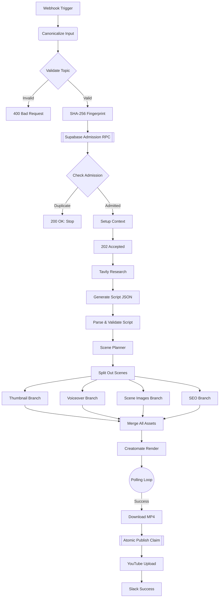
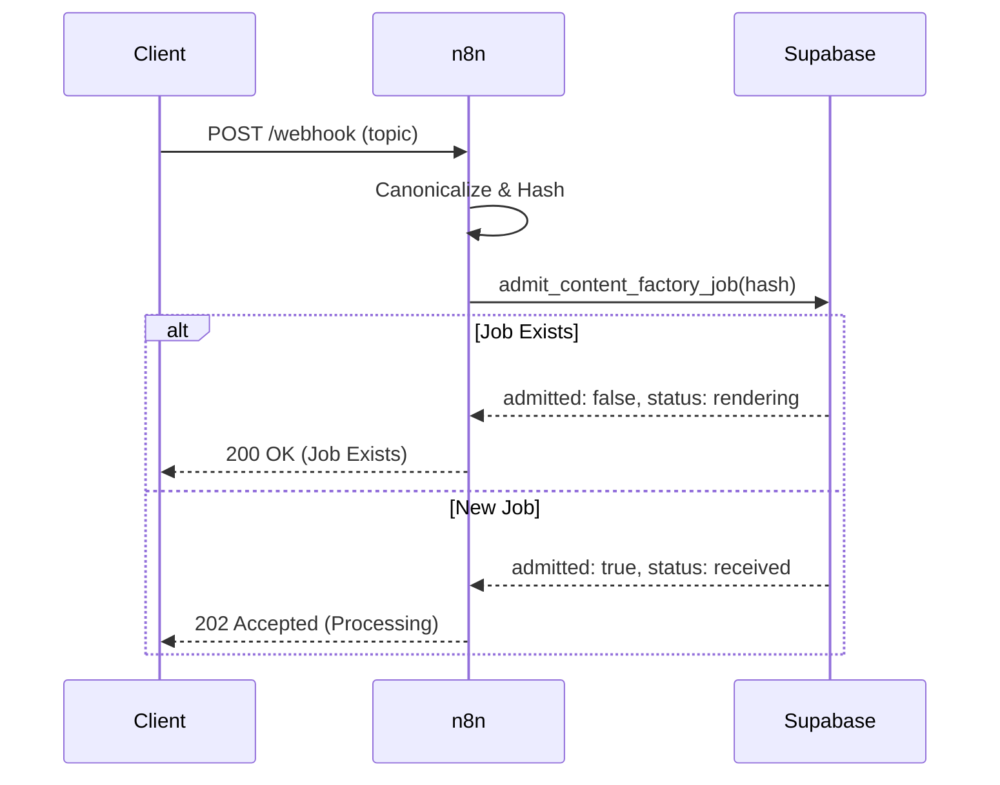
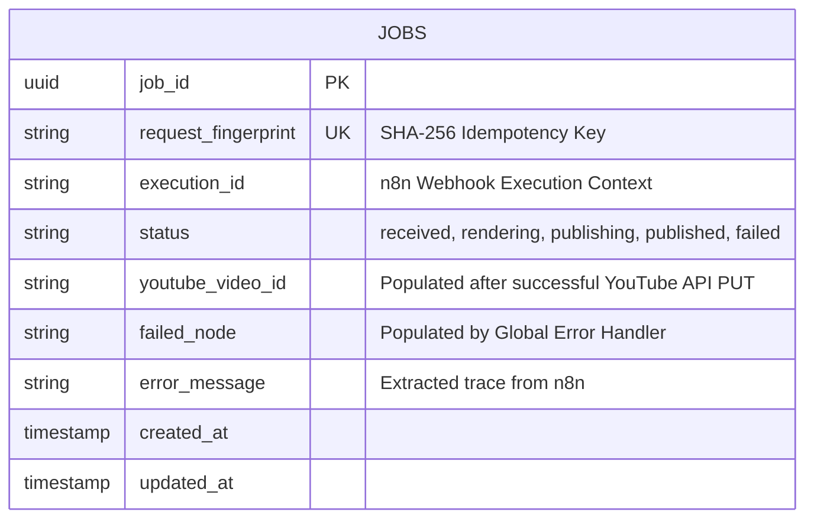

<div align="center">
  
  <br><br>
  <a href="https://github.com/RishvinReddy/Ai-Youtube-Automation">
    
  </a>
  <p align="center" style="font-size: 18px; margin-top: 10px;">
    <strong>The enterprise-grade, concurrent-safe engine for mass YouTube automation.</strong>
  </p>
  <p align="center">
    <a href="https://github.com/RishvinReddy/Ai-Youtube-Automation"></a>
    <a href="https://n8n.io"></a>
    <a href="https://supabase.com"></a>
    <a href="https://openai.com"></a>
    <a href="https://elevenlabs.io"></a>
  </p>
  <p align="center">
    <a href="PRIVACY.md"></a>
    <a href="SUPPORT.md"></a>
    <a href="GOVERNANCE.md"></a>
    <a href="TERMS.md"></a>
  </p>
  <p align="center">
    <i>Built for infinite scale. Zero duplicate renders. Pure automation.</i>
  </p>
</div>

---

## 📑 Table of Contents
1. [System Architecture](#system-architecture)
2. [Idempotency Contract](#idempotency-contract)
3. [Deployment Guide](#deployment-guide)
4. [Node-by-Node Reference](#node-by-node-reference)
5. [Observability & Error Handling](#observability--error-handling)
6. [Appendix: Execution Traces (Simulated)](#appendix-execution-traces-simulated)

---

## 🏛️ System Architecture

> [!TIP]
> This pipeline is designed around a strictly atomic, concurrent-safe database architecture.

### Global Workflow Diagram



> [!NOTE]
> **Code Block Explanation:** The Mermaid `graph TD` block above visualizes the physical Directed Acyclic Graph (DAG) executed by the n8n engine. It maps the exact flow of data from the webhook ingestion, through the LLM inference and rendering nodes, down to the final YouTube upload.

### Idempotency Sequence



> [!NOTE]
> **Code Block Explanation:** The Mermaid `sequenceDiagram` above illustrates the temporal transactional lock mechanism. It shows how the n8n worker must pause and query the Supabase PostgreSQL engine to perform an atomic compare-and-swap (via RPC) before acknowledging the client request. This guarantees zero duplicate video renders.

---

## 🚀 Deployment Guide

<details><summary>Click to expand deployment steps</summary>

# AI Content Factory V3.2 - Step-by-Step Deployment Guide

This guide provides a comprehensive, step-by-step walkthrough to deploy the AI Content Factory V3.2 pipeline from scratch. Follow these steps exactly to ensure the idempotency, storage, and authentication contracts are properly established.

---

## Phase 1: Database & Storage Setup (Supabase)

This pipeline uses Supabase to track job state (preventing duplicate videos) and to store the generated assets temporarily.

### Step 1: Create a Supabase Project
1. Go to [Supabase](https://supabase.com/) and create a new project.
2. Go to **Project Settings -> API**.
3. Copy your `Project URL` and your `service_role secret` key. **Keep these secure.**

### Step 2: Create a Storage Bucket
1. On the left sidebar, click **Storage**.
2. Click **New Bucket**.
3. Name the bucket (e.g., `ai-content-factory`).
4. Toggle **Public bucket** to **ON**. (This is required so Creatomate and YouTube can access the assets via URL).
5. Click **Save**.

### Step 3: Run the SQL Migration
1. On the left sidebar, click **SQL Editor**.
2. Click **New query**.
3. Open the `AI_Content_Factory_Supabase_Migration.sql` file provided in this repository.
4. Copy the entire contents of the SQL file and paste it into the Supabase SQL Editor.
5. Click **Run** (or press CMD/CTRL + Enter).
6. Verify you see "Success. No rows returned." Your database is now ready.

---

## Phase 2: Gather API Keys

You will need accounts for several AI services. Gather these keys:
- **OpenAI**: Create an API key at `platform.openai.com`.
- **Tavily**: Create an API key at `tavily.com`.
- **ElevenLabs**: Create an API key at `elevenlabs.io`.
- **Creatomate**: Create an API key at `creatomate.com`.
- **Slack**: Go to your Slack workspace settings, create a custom App, enable **Incoming Webhooks**, and generate a Webhook URL.

---

## Phase 3: n8n Configuration

Before importing the workflow, you must inject the environment variables so the workflow can authenticate with your services.

### Step 1: Add Variables to n8n
If you are using n8n Cloud, go to **Settings -> Variables**. If self-hosting, add these to your `.env` file and restart n8n.

Add the following keys exactly as written:
- `SUPABASE_PROJECT_URL` = (Your URL from Phase 1)
- `SUPABASE_SERVICE_ROLE_KEY` = (Your service_role key from Phase 1)
- `SUPABASE_BUCKET_NAME` = (The name of the bucket from Phase 1, e.g., `ai-content-factory`)
- `OPENAI_API_KEY` = (Your OpenAI key)
- `TAVILY_API_KEY` = (Your Tavily key)
- `ELEVENLABS_API_KEY` = (Your ElevenLabs key)
- `CREATOMATE_API_KEY` = (Your Creatomate key)
- `SLACK_WEBHOOK_URL` = (Your Slack Incoming Webhook URL)

---

## Phase 4: Import the Workflow

### Step 1: Import JSON
1. Open your n8n workspace.
2. Click **Add Workflow** in the top right.
3. Click the **Options (three dots) menu** in the top right of the canvas.
4. Click **Import from File**.
5. Select the `AI_Content_Factory_V3.2.json` file.
6. The canvas will populate with the main pipeline and the Error Handler at the bottom.

---

## Phase 5: YouTube Authentication Setup

The workflow uses n8n HTTP Request nodes to upload directly to YouTube via Google's OAuth2 API. 

### Step 1: Create Google Cloud Project
1. Go to the [Google Cloud Console](https://console.cloud.google.com/).
2. Create a new project.
3. Go to **APIs & Services -> Library**.
4. Search for **YouTube Data API v3** and click **Enable**.

### Step 2: Configure OAuth Consent Screen
1. Go to **APIs & Services -> OAuth consent screen**.
2. Select **External** and click Create.
3. Fill in the App Name and Support Email (you can use your own).
4. On the Scopes page, click **Add or Remove Scopes**.
5. Add the scope: `https://www.googleapis.com/auth/youtube.upload`.
6. Add your email address under **Test users**.

### Step 3: Create Credentials
1. Go to **APIs & Services -> Credentials**.
2. Click **Create Credentials -> OAuth client ID**.
3. Application type: **Web application**.
4. Authorized redirect URIs: In n8n, open the `Initialize YouTube Session` node, select `Generic Credential Type`, select `OAuth2 API`, and create a new credential. Copy the **OAuth Redirect URL** provided by n8n and paste it into Google Cloud.
5. Click Create. Copy your Client ID and Client Secret.

### Step 4: Authenticate in n8n
1. Back in n8n (inside the `Initialize YouTube Session` node OAuth2 credential screen), fill in:
   - **Authorization URL**: `https://accounts.google.com/o/oauth2/v2/auth`
   - **Access Token URL**: `https://oauth2.googleapis.com/token`
   - **Client ID**: (From Step 3)
   - **Client Secret**: (From Step 3)
   - **Scope**: `https://www.googleapis.com/auth/youtube.upload`
   - **Auth URI Query Parameters**: `access_type=offline&prompt=consent`
2. Click **Save and Connect**. Log in with your Google account and grant permissions.
3. **IMPORTANT**: Find the `YouTube thumbnails.set` node at the far right of the workflow. Under Authentication, select the **exact same OAuth2 credential** you just created.

---

## Phase 6: Execution & Testing

### Step 1: Get your Webhook URL
1. Double-click the **Webhook Trigger** node on the far left.
2. Copy the **Test URL** (if you are testing in the canvas) or the **Production URL** (if the workflow is active).

### Step 2: Send a Test Payload
You can trigger the workflow using a cURL command in your terminal, or an app like Postman. 

\`\`\`bash
curl -X POST "YOUR_WEBHOOK_URL_HERE" \\
     -H "Content-Type: application/json" \\
     -d '{
           "topic": "The Future of Quantum Computing in 2026",
           "audience": "technology enthusiasts",
           "tone": "educational and inspiring",
           "language": "English"
         }'
\`\`\`

### Step 3: Verify the Immediate Response
Because the workflow is asynchronous, it will immediately respond with a 202 status and release the connection:
\`\`\`json
{
  "status": "accepted",
  "job_id": "acf-7b4e8c1..."
}
\`\`\`

### Step 4: Verify Idempotency (Duplicate Test)
Send the exact same request again immediately. The admission gate will reject it, preventing duplicate API costs, and return:
\`\`\`json
{
  "status": "already_exists",
  "job_id": "acf-7b4e8c1...",
  "current_state": "rendering"
}
\`\`\`

---

## Phase 7: Monitoring

- **Check Supabase**: Go to your Supabase `jobs` table. You will see the job record transitioning through `received`, `rendering`, `publishing`, and `published`.
- **Check Slack**: Wait roughly 3-5 minutes (depending on Creatomate render times). You will receive a Slack message with the final YouTube URL.
- **Error Handling**: If a step fails, the `Error Trigger` at the bottom of the canvas will execute, update the Supabase job status to `failed`, record the exact error message, and send an alert to Slack.


</details>

---

## 📡 API Interface Specifications

The Content Factory exposes a single, idempotent webhook for job ingestion.

### `POST /webhook/v3-ai-factory`

**Request Body (application/json):**
```json
{
  "topic": "string (Required) - The core subject of the video",
  "audience": "string (Optional) - Target demographic (default: tech professionals)",
  "tone": "string (Optional) - Emotional or stylistic tone (default: educational)",
  "language": "string (Optional) - Output language (default: English)"
}
```

> [!NOTE]
> **Code Block Explanation:** The JSON payload above dictates the strict schema expected by the `Webhook` node in n8n. If the payload does not match this structure, the canonicalization layer will reject it before processing begins.

**Response - `202 Accepted` (New Job):**
```json
{
  "status": "accepted",
  "job_id": "acf-7b4e8c1a..."
}
```

> [!NOTE]
> **Code Block Explanation:** This JSON response is returned immediately after the Supabase RPC confirms the job fingerprint is globally unique. It provides the caller with a UUID to track the asynchronous rendering pipeline.

**Response - `200 OK` (Duplicate Job Caught):**
```json
{
  "status": "already_exists",
  "job_id": "acf-7b4e8c1a...",
  "current_state": "rendering"
}
```

> [!NOTE]
> **Code Block Explanation:** This JSON response demonstrates the system gracefully catching a duplicate request. Instead of crashing, it returns the existing job ID and its current status from the database, preventing any duplicate video processing.

**Response - `400 Bad Request` (Validation Failed):**
```json
{
  "status": "rejected",
  "error": "topic_required"
}
```

> [!NOTE]
> **Code Block Explanation:** This JSON block is returned if the request fails the schema validation block in n8n (e.g., missing the required `topic` string).

---

## 🗄️ Database Schema Deep Dive

The Content Factory relies on a highly structured PostgreSQL database. Below is the Entity-Relationship mapping and column rationale.



### Column Specifications & Rationale
| Column Name | Data Type | Constraint | Description |
|---|---|---|---|
| `request_fingerprint` | VARCHAR(64) | `UNIQUE` | This is the most critical column. It guarantees that if two identical requests arrive within milliseconds, the database engine enforces a hard transaction block on the second request, returning a constraint violation that n8n handles gracefully. |
| `execution_id` | VARCHAR | `INDEX` | Allows the Global Error Handler to perform O(1) lookups to resolve a crashed n8n execution back to its corresponding business logic job. |
| `status` | ENUM/VARCHAR | | Strict state machine: `received` ➔ `rendering` ➔ `publishing` ➔ `published`. A job can only move to `published` if it is currently in `publishing` (enforced via RPC). |

---

## 💰 Cost Analysis & Unit Economics

Because the system operates fully autonomously, tracking the unit cost of production is critical for scale. The idempotency lock ensures you never pay for duplicate renders.

### Estimated Cost Per Video (60 Seconds)
| Service | Operation | Volume | Estimated Cost (USD) |
|---|---|---|---|
| **OpenAI (GPT-4o)** | Script Generation | ~1500 Tokens | $0.015 |
| **OpenAI (GPT-4o)** | Scene Planning & SEO | ~1000 Tokens | $0.010 |
| **OpenAI (DALL-E 3)** | Image Generation | 6 Images (1024x1024) | $0.240 |
| **ElevenLabs** | TTS Voiceover | ~900 Characters | $0.270 |
| **Creatomate** | Video Rendering | 60 Render Seconds | $0.150 |
| **Tavily** | Live Web Research | 1 Search API Call | $0.005 |
| **Total** | **Full Pipeline Execution** | **1 Complete Video** | **~$0.69** |

> [!TIP]
> A $0.69 production cost per video enables massive scale. Generating 30 videos a month costs roughly $20.70 in API usage.

---

## 🔐 Security & Compliance Model

### OAuth2 Boundaries
- **Scope Minimization:** The Google API integration requests *only* `https://www.googleapis.com/auth/youtube.upload`. It does not have permission to delete videos, manage your channel, or read comments.
- **Token Refresh:** n8n securely handles the OAuth2 refresh token lifecycle. The credentials are encrypted at rest within the n8n database.

### Data Retention & Cleanup
- All intermediate binary assets (images, mp3s) are stored in the Supabase `ai-content-factory` bucket.
- **Recommended Action:** Implement a Supabase Storage Lifecycle Policy (or pg_cron job) to automatically prune binary files in `jobs/{job_id}/*` where `created_at < NOW() - INTERVAL '30 days'`.

---

## 🛠️ Advanced Troubleshooting Runbook

### 1. `HTTP 429 Too Many Requests` (ElevenLabs / OpenAI)
- **Cause:** Hitting API rate limits during concurrent video generations.
- **Resolution:** n8n handles this natively if you configure the HTTP nodes to retry on 429s. Alternatively, stagger your webhook triggers or upgrade your tier on the respective API platforms.

### 2. `Supabase Unique Constraint Violation`
- **Cause:** Two identical JSON payloads were sent to the webhook.
- **Resolution:** This is a **feature, not a bug**. The pipeline safely intercepted the duplicate, returned a `200 OK` with the existing job state, and halted execution. No action required.

### 3. `Creatomate Render Timeout`
- **Cause:** Complex videos taking longer than the `MAX_RENDER_POLLS * 15s` limit.
- **Resolution:** Open the `Setup Context` node in n8n and increase the `MAX_RENDER_POLLS` variable (default is 20, which equals 5 minutes of wait time).

### 4. `YouTube Quota Exceeded`
- **Cause:** You uploaded more than 6 videos in a single day (YouTube API default quota is 10,000 units/day, an upload costs 1,600 units).
- **Resolution:** Request a quota extension from Google Cloud Console or stagger your uploads across multiple days.

---

