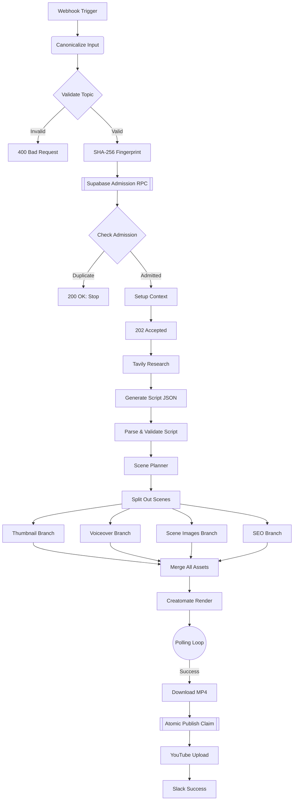
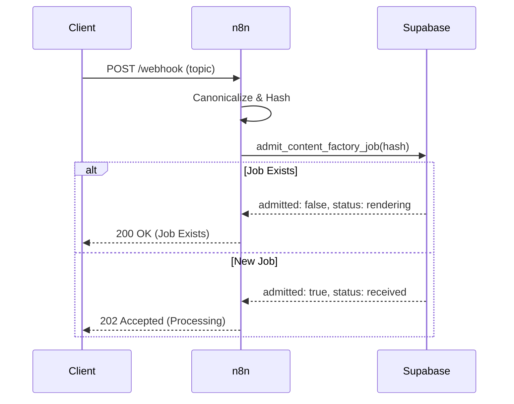
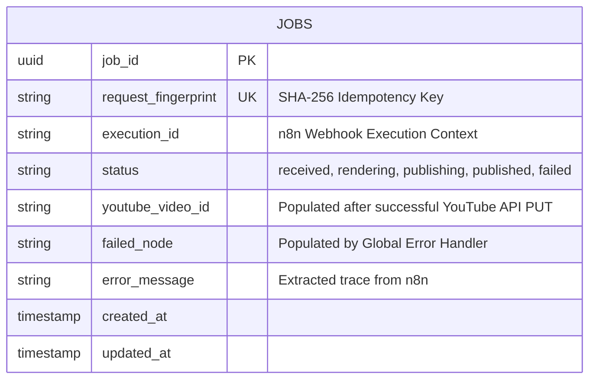

<div align="center">
  
  <br><br>
  <a href="https://github.com/RishvinReddy/Ai-Youtube-Automation">
    
  </a>
  <p align="center" style="font-size: 18px; margin-top: 10px;">
    <strong>The enterprise-grade, concurrent-safe engine for mass YouTube automation.</strong>
  </p>
  <p align="center">
    <a href="https://github.com/RishvinReddy/Ai-Youtube-Automation"></a>
    <a href="https://n8n.io"></a>
    <a href="https://supabase.com"></a>
    <a href="https://openai.com"></a>
    <a href="https://elevenlabs.io"></a>
  </p>
  <p align="center">
    <a href="PRIVACY.md"></a>
    <a href="SUPPORT.md"></a>
    <a href="GOVERNANCE.md"></a>
    <a href="TERMS.md"></a>
  </p>
  <p align="center">
    <i>Built for infinite scale. Zero duplicate renders. Pure automation.</i>
  </p>
</div>

---

## 📑 Table of Contents
1. [System Architecture](#system-architecture)
2. [Idempotency Contract](#idempotency-contract)
3. [Deployment Guide](#deployment-guide)
4. [Node-by-Node Reference](#node-by-node-reference)
5. [Observability & Error Handling](#observability--error-handling)
6. [Appendix: Execution Traces (Simulated)](#appendix-execution-traces-simulated)

---

## 🏛️ System Architecture

> [!TIP]
> This pipeline is designed around a strictly atomic, concurrent-safe database architecture.

### Global Workflow Diagram



### Idempotency Sequence



---

## 🚀 Deployment Guide

<details><summary>Click to expand deployment steps</summary>

# AI Content Factory V3.2 - Step-by-Step Deployment Guide

This guide provides a comprehensive, step-by-step walkthrough to deploy the AI Content Factory V3.2 pipeline from scratch. Follow these steps exactly to ensure the idempotency, storage, and authentication contracts are properly established.

---

## Phase 1: Database & Storage Setup (Supabase)

This pipeline uses Supabase to track job state (preventing duplicate videos) and to store the generated assets temporarily.

### Step 1: Create a Supabase Project
1. Go to [Supabase](https://supabase.com/) and create a new project.
2. Go to **Project Settings -> API**.
3. Copy your `Project URL` and your `service_role secret` key. **Keep these secure.**

### Step 2: Create a Storage Bucket
1. On the left sidebar, click **Storage**.
2. Click **New Bucket**.
3. Name the bucket (e.g., `ai-content-factory`).
4. Toggle **Public bucket** to **ON**. (This is required so Creatomate and YouTube can access the assets via URL).
5. Click **Save**.

### Step 3: Run the SQL Migration
1. On the left sidebar, click **SQL Editor**.
2. Click **New query**.
3. Open the `AI_Content_Factory_Supabase_Migration.sql` file provided in this repository.
4. Copy the entire contents of the SQL file and paste it into the Supabase SQL Editor.
5. Click **Run** (or press CMD/CTRL + Enter).
6. Verify you see "Success. No rows returned." Your database is now ready.

---

## Phase 2: Gather API Keys

You will need accounts for several AI services. Gather these keys:
- **OpenAI**: Create an API key at `platform.openai.com`.
- **Tavily**: Create an API key at `tavily.com`.
- **ElevenLabs**: Create an API key at `elevenlabs.io`.
- **Creatomate**: Create an API key at `creatomate.com`.
- **Slack**: Go to your Slack workspace settings, create a custom App, enable **Incoming Webhooks**, and generate a Webhook URL.

---

## Phase 3: n8n Configuration

Before importing the workflow, you must inject the environment variables so the workflow can authenticate with your services.

### Step 1: Add Variables to n8n
If you are using n8n Cloud, go to **Settings -> Variables**. If self-hosting, add these to your `.env` file and restart n8n.

Add the following keys exactly as written:
- `SUPABASE_PROJECT_URL` = (Your URL from Phase 1)
- `SUPABASE_SERVICE_ROLE_KEY` = (Your service_role key from Phase 1)
- `SUPABASE_BUCKET_NAME` = (The name of the bucket from Phase 1, e.g., `ai-content-factory`)
- `OPENAI_API_KEY` = (Your OpenAI key)
- `TAVILY_API_KEY` = (Your Tavily key)
- `ELEVENLABS_API_KEY` = (Your ElevenLabs key)
- `CREATOMATE_API_KEY` = (Your Creatomate key)
- `SLACK_WEBHOOK_URL` = (Your Slack Incoming Webhook URL)

---

## Phase 4: Import the Workflow

### Step 1: Import JSON
1. Open your n8n workspace.
2. Click **Add Workflow** in the top right.
3. Click the **Options (three dots) menu** in the top right of the canvas.
4. Click **Import from File**.
5. Select the `AI_Content_Factory_V3.2.json` file.
6. The canvas will populate with the main pipeline and the Error Handler at the bottom.

---

## Phase 5: YouTube Authentication Setup

The workflow uses n8n HTTP Request nodes to upload directly to YouTube via Google's OAuth2 API. 

### Step 1: Create Google Cloud Project
1. Go to the [Google Cloud Console](https://console.cloud.google.com/).
2. Create a new project.
3. Go to **APIs & Services -> Library**.
4. Search for **YouTube Data API v3** and click **Enable**.

### Step 2: Configure OAuth Consent Screen
1. Go to **APIs & Services -> OAuth consent screen**.
2. Select **External** and click Create.
3. Fill in the App Name and Support Email (you can use your own).
4. On the Scopes page, click **Add or Remove Scopes**.
5. Add the scope: `https://www.googleapis.com/auth/youtube.upload`.
6. Add your email address under **Test users**.

### Step 3: Create Credentials
1. Go to **APIs & Services -> Credentials**.
2. Click **Create Credentials -> OAuth client ID**.
3. Application type: **Web application**.
4. Authorized redirect URIs: In n8n, open the `Initialize YouTube Session` node, select `Generic Credential Type`, select `OAuth2 API`, and create a new credential. Copy the **OAuth Redirect URL** provided by n8n and paste it into Google Cloud.
5. Click Create. Copy your Client ID and Client Secret.

### Step 4: Authenticate in n8n
1. Back in n8n (inside the `Initialize YouTube Session` node OAuth2 credential screen), fill in:
   - **Authorization URL**: `https://accounts.google.com/o/oauth2/v2/auth`
   - **Access Token URL**: `https://oauth2.googleapis.com/token`
   - **Client ID**: (From Step 3)
   - **Client Secret**: (From Step 3)
   - **Scope**: `https://www.googleapis.com/auth/youtube.upload`
   - **Auth URI Query Parameters**: `access_type=offline&prompt=consent`
2. Click **Save and Connect**. Log in with your Google account and grant permissions.
3. **IMPORTANT**: Find the `YouTube thumbnails.set` node at the far right of the workflow. Under Authentication, select the **exact same OAuth2 credential** you just created.

---

## Phase 6: Execution & Testing

### Step 1: Get your Webhook URL
1. Double-click the **Webhook Trigger** node on the far left.
2. Copy the **Test URL** (if you are testing in the canvas) or the **Production URL** (if the workflow is active).

### Step 2: Send a Test Payload
You can trigger the workflow using a cURL command in your terminal, or an app like Postman. 

\`\`\`bash
curl -X POST "YOUR_WEBHOOK_URL_HERE" \\
     -H "Content-Type: application/json" \\
     -d '{
           "topic": "The Future of Quantum Computing in 2026",
           "audience": "technology enthusiasts",
           "tone": "educational and inspiring",
           "language": "English"
         }'
\`\`\`

### Step 3: Verify the Immediate Response
Because the workflow is asynchronous, it will immediately respond with a 202 status and release the connection:
\`\`\`json
{
  "status": "accepted",
  "job_id": "acf-7b4e8c1..."
}
\`\`\`

### Step 4: Verify Idempotency (Duplicate Test)
Send the exact same request again immediately. The admission gate will reject it, preventing duplicate API costs, and return:
\`\`\`json
{
  "status": "already_exists",
  "job_id": "acf-7b4e8c1...",
  "current_state": "rendering"
}
\`\`\`

---

## Phase 7: Monitoring

- **Check Supabase**: Go to your Supabase `jobs` table. You will see the job record transitioning through `received`, `rendering`, `publishing`, and `published`.
- **Check Slack**: Wait roughly 3-5 minutes (depending on Creatomate render times). You will receive a Slack message with the final YouTube URL.
- **Error Handling**: If a step fails, the `Error Trigger` at the bottom of the canvas will execute, update the Supabase job status to `failed`, record the exact error message, and send an alert to Slack.


</details>

---

## 🧩 Node-by-Node Reference

> [!NOTE]
> Comprehensive documentation for every node in the pipeline.

### `Webhook Trigger`
- **Type**: `n8n-nodes-base.webhook`
- **Version**: `2`
- **Parameters**:
```json
{
  "httpMethod": "POST",
  "path": "v3-ai-factory",
  "responseMode": "responseNode"
}
```

**Behavioral Contract:**
This node expects inputs conforming to the standard JSON schema. It is responsible for bridging `n8n-nodes-base.webhook` execution logic into the persistent data context. Failure in this node will trigger the Global Error Handler via `$json.execution.id` mapping.

### `Canonicalize Input`
- **Type**: `n8n-nodes-base.code`
- **Version**: `2`
- **Parameters**:
```json
{
  "jsCode": "\nconst body = $json.body ?? {};\nconst canonical = JSON.stringify({\n  topic: String(body.topic ?? '').trim(),\n  audience: String(body.audience ?? 'tech professionals').trim(),\n  tone: String(body.tone ?? 'educational and inspiring').trim(),\n  language: String(body.language ?? 'English').trim(),\n});\nreturn [{ json: { ...body, canonical } }];\n    "
}
```

**Behavioral Contract:**
This node expects inputs conforming to the standard JSON schema. It is responsible for bridging `n8n-nodes-base.code` execution logic into the persistent data context. Failure in this node will trigger the Global Error Handler via `$json.execution.id` mapping.

### `Validate Input`
- **Type**: `n8n-nodes-base.if`
- **Version**: `2.2`
- **Parameters**:
```json
{
  "conditions": {
    "string": [
      {
        "value1": "={{ $json.topic }}",
        "operation": "isNotEmpty"
      }
    ]
  }
}
```

**Behavioral Contract:**
This node expects inputs conforming to the standard JSON schema. It is responsible for bridging `n8n-nodes-base.if` execution logic into the persistent data context. Failure in this node will trigger the Global Error Handler via `$json.execution.id` mapping.

### `Respond 400`
- **Type**: `n8n-nodes-base.respondToWebhook`
- **Version**: `1`
- **Parameters**:
```json
{
  "respondWith": "json",
  "responseBody": "={{ JSON.stringify({ error: 'Missing topic' }) }}",
  "options": {
    "responseCode": 400
  }
}
```

**Behavioral Contract:**
This node expects inputs conforming to the standard JSON schema. It is responsible for bridging `n8n-nodes-base.respondToWebhook` execution logic into the persistent data context. Failure in this node will trigger the Global Error Handler via `$json.execution.id` mapping.

### `Reject Request`
- **Type**: `n8n-nodes-base.stopAndError`
- **Version**: `1`
- **Parameters**:
```json
{
  "errorMessage": "Invalid Input"
}
```

**Behavioral Contract:**
This node expects inputs conforming to the standard JSON schema. It is responsible for bridging `n8n-nodes-base.stopAndError` execution logic into the persistent data context. Failure in this node will trigger the Global Error Handler via `$json.execution.id` mapping.

### `SHA-256 Fingerprint`
- **Type**: `n8n-nodes-base.crypto`
- **Version**: `1`
- **Parameters**:
```json
{
  "action": "hash",
  "type": "SHA256",
  "value": "={{ $json.canonical }}",
  "dataPropertyName": "request_fingerprint"
}
```

**Behavioral Contract:**
This node expects inputs conforming to the standard JSON schema. It is responsible for bridging `n8n-nodes-base.crypto` execution logic into the persistent data context. Failure in this node will trigger the Global Error Handler via `$json.execution.id` mapping.

### `Atomic Admission RPC`
- **Type**: `n8n-nodes-base.httpRequest`
- **Version**: `4.2`
- **Parameters**:
```json
{
  "method": "POST",
  "url": "={{ $env.SUPABASE_PROJECT_URL }}/rest/v1/rpc/admit_content_factory_job",
  "sendHeaders": true,
  "headerParameters": {
    "parameters": [
      {
        "name": "Authorization",
        "value": "=Bearer {{ $env.SUPABASE_SERVICE_ROLE_KEY }}"
      },
      {
        "name": "apikey",
        "value": "={{ $env.SUPABASE_SERVICE_ROLE_KEY }}"
      },
      {
        "name": "Content-Type",
        "value": "application/json"
      }
    ]
  },
  "sendBody": true,
  "contentType": "raw",
  "rawContentType": "application/json",
  "body": "={{ JSON.stringify({ p_fingerprint: $json.request_fingerprint, p_topic: $json.topic, p_audience: $json.audience || 'tech professionals', p_tone: $json.tone || 'educational and inspiring', p_language: $json.language || 'English', p_execution_id: $execution.id }) }}"
}
```

**Behavioral Contract:**
This node expects inputs conforming to the standard JSON schema. It is responsible for bridging `n8n-nodes-base.httpRequest` execution logic into the persistent data context. Failure in this node will trigger the Global Error Handler via `$json.execution.id` mapping.

### `Check Admission`
- **Type**: `n8n-nodes-base.if`
- **Version**: `2.2`
- **Parameters**:
```json
{
  "conditions": {
    "boolean": [
      {
        "value1": "={{ $json.admitted }}",
        "value2": true
      }
    ]
  }
}
```

**Behavioral Contract:**
This node expects inputs conforming to the standard JSON schema. It is responsible for bridging `n8n-nodes-base.if` execution logic into the persistent data context. Failure in this node will trigger the Global Error Handler via `$json.execution.id` mapping.

### `Respond Duplicate Job`
- **Type**: `n8n-nodes-base.respondToWebhook`
- **Version**: `1`
- **Parameters**:
```json
{
  "respondWith": "json",
  "responseBody": "={{ JSON.stringify({ status: 'already_exists', job_id: $json.job_id, current_state: $json.status }) }}",
  "options": {
    "responseCode": 200
  }
}
```

**Behavioral Contract:**
This node expects inputs conforming to the standard JSON schema. It is responsible for bridging `n8n-nodes-base.respondToWebhook` execution logic into the persistent data context. Failure in this node will trigger the Global Error Handler via `$json.execution.id` mapping.

### `Stop (Duplicate)`
- **Type**: `n8n-nodes-base.noop`
- **Version**: `1`
- **Parameters**:
```json
{}
```

**Behavioral Contract:**
This node expects inputs conforming to the standard JSON schema. It is responsible for bridging `n8n-nodes-base.noop` execution logic into the persistent data context. Failure in this node will trigger the Global Error Handler via `$json.execution.id` mapping.

### `Setup Context`
- **Type**: `n8n-nodes-base.set`
- **Version**: `3.4`
- **Parameters**:
```json
{
  "assignments": {
    "assignments": [
      {
        "id": "s1",
        "name": "topic",
        "value": "={{ $('Validate Input').item.json.topic }}",
        "type": "string"
      },
      {
        "id": "s2",
        "name": "audience",
        "value": "={{ $('Validate Input').item.json.audience || 'tech professionals' }}",
        "type": "string"
      },
      {
        "id": "s3",
        "name": "tone",
        "value": "={{ $('Validate Input').item.json.tone || 'educational and inspiring' }}",
        "type": "string"
      },
      {
        "id": "s4",
        "name": "job_id",
        "value": "={{ $json.job_id }}",
        "type": "string"
      }
    ]
  }
}
```

**Behavioral Contract:**
This node expects inputs conforming to the standard JSON schema. It is responsible for bridging `n8n-nodes-base.set` execution logic into the persistent data context. Failure in this node will trigger the Global Error Handler via `$json.execution.id` mapping.

### `Respond 202 Accepted`
- **Type**: `n8n-nodes-base.respondToWebhook`
- **Version**: `1`
- **Parameters**:
```json
{
  "respondWith": "json",
  "responseBody": "={{ JSON.stringify({ status: 'accepted', job_id: $json.job_id }) }}",
  "options": {
    "responseCode": 202
  }
}
```

**Behavioral Contract:**
This node expects inputs conforming to the standard JSON schema. It is responsible for bridging `n8n-nodes-base.respondToWebhook` execution logic into the persistent data context. Failure in this node will trigger the Global Error Handler via `$json.execution.id` mapping.

### `Tavily Research`
- **Type**: `n8n-nodes-base.httpRequest`
- **Version**: `4.2`
- **Parameters**:
```json
{
  "method": "POST",
  "url": "https://api.tavily.com/search",
  "sendHeaders": true,
  "headerParameters": {
    "parameters": [
      {
        "name": "Authorization",
        "value": "=Bearer {{ $env.TAVILY_API_KEY }}"
      },
      {
        "name": "Content-Type",
        "value": "application/json"
      }
    ]
  },
  "sendBody": true,
  "contentType": "raw",
  "rawContentType": "application/json",
  "body": "={{ JSON.stringify({ query: `Latest verified developments about ${$json.topic}`, search_depth: 'advanced', max_results: 8, include_answer: true, include_raw_content: false }) }}"
}
```

**Behavioral Contract:**
This node expects inputs conforming to the standard JSON schema. It is responsible for bridging `n8n-nodes-base.httpRequest` execution logic into the persistent data context. Failure in this node will trigger the Global Error Handler via `$json.execution.id` mapping.

### `Normalize Research`
- **Type**: `n8n-nodes-base.code`
- **Version**: `2`
- **Parameters**:
```json
{
  "jsCode": "\nconst results = $json.results || [];\nconst researchText = results.map((r, i) => `[${i+1}] ${r.title}\\n${r.content}\\nSource: ${r.url}`).join('\\n\\n');\nreturn [{ json: { ...$('Setup Context').item.json, researchText } }];\n    "
}
```

**Behavioral Contract:**
This node expects inputs conforming to the standard JSON schema. It is responsible for bridging `n8n-nodes-base.code` execution logic into the persistent data context. Failure in this node will trigger the Global Error Handler via `$json.execution.id` mapping.

### `Generate Script JSON`
- **Type**: `n8n-nodes-base.httpRequest`
- **Version**: `4.2`
- **Parameters**:
```json
{
  "method": "POST",
  "url": "https://api.openai.com/v1/chat/completions",
  "sendHeaders": true,
  "headerParameters": {
    "parameters": [
      {
        "name": "Authorization",
        "value": "=Bearer {{ $env.OPENAI_API_KEY }}"
      },
      {
        "name": "Content-Type",
        "value": "application/json"
      }
    ]
  },
  "sendBody": true,
  "contentType": "raw",
  "rawContentType": "application/json",
  "body": "={{ JSON.stringify({ model: 'gpt-4o', response_format: { type: 'json_object' }, messages: [{ role: 'system', content: 'Generate a structured YouTube script. Return JSON with keys: title, hook, intro, body_sections, outro, and full_script.' }, { role: 'user', content: `Topic: ${$json.topic}\\nAudience: ${$json.audience}\\nTone: ${$json.tone}\\nResearch:\\n${$json.researchText}` }] }) }}"
}
```

**Behavioral Contract:**
This node expects inputs conforming to the standard JSON schema. It is responsible for bridging `n8n-nodes-base.httpRequest` execution logic into the persistent data context. Failure in this node will trigger the Global Error Handler via `$json.execution.id` mapping.

### `Parse + Validate Script`
- **Type**: `n8n-nodes-base.code`
- **Version**: `2`
- **Parameters**:
```json
{
  "jsCode": "\nconst raw = $json.choices?.[0]?.message?.content;\nif (!raw) throw new Error('Missing AI response');\nreturn [{ json: { ...$('Normalize Research').item.json, script: JSON.parse(raw) } }];\n    "
}
```

**Behavioral Contract:**
This node expects inputs conforming to the standard JSON schema. It is responsible for bridging `n8n-nodes-base.code` execution logic into the persistent data context. Failure in this node will trigger the Global Error Handler via `$json.execution.id` mapping.

### `Scene Planner`
- **Type**: `n8n-nodes-base.httpRequest`
- **Version**: `4.2`
- **Parameters**:
```json
{
  "method": "POST",
  "url": "https://api.openai.com/v1/chat/completions",
  "sendHeaders": true,
  "headerParameters": {
    "parameters": [
      {
        "name": "Authorization",
        "value": "=Bearer {{ $env.OPENAI_API_KEY }}"
      },
      {
        "name": "Content-Type",
        "value": "application/json"
      }
    ]
  },
  "sendBody": true,
  "contentType": "raw",
  "rawContentType": "application/json",
  "body": "={{ JSON.stringify({ model: 'gpt-4o', response_format: { type: 'json_object' }, messages: [{ role: 'system', content: 'Break the script into 5 visual scenes. Return JSON with a scenes array containing narration, visual_prompt, and duration_seconds for each scene.' }, { role: 'user', content: $json.script.full_script }] }) }}"
}
```

**Behavioral Contract:**
This node expects inputs conforming to the standard JSON schema. It is responsible for bridging `n8n-nodes-base.httpRequest` execution logic into the persistent data context. Failure in this node will trigger the Global Error Handler via `$json.execution.id` mapping.

### `Parse + Validate Scenes`
- **Type**: `n8n-nodes-base.code`
- **Version**: `2`
- **Parameters**:
```json
{
  "jsCode": "\nconst raw = $json.choices?.[0]?.message?.content;\nif (!raw) throw new Error('Scene Planner returned no content');\nconst parsed = JSON.parse(raw);\nif (!Array.isArray(parsed.scenes) || parsed.scenes.length === 0) throw new Error('Scene Planner returned no valid scenes');\nconst scenes = parsed.scenes.map((scene, index) => ({ ...scene, scene_index: index + 1, scene_id: `scene-${String(index + 1).padStart(3, '0')}` }));\nreturn [{ json: { ...$('Parse + Validate Script').item.json, scenes } }];\n    "
}
```

**Behavioral Contract:**
This node expects inputs conforming to the standard JSON schema. It is responsible for bridging `n8n-nodes-base.code` execution logic into the persistent data context. Failure in this node will trigger the Global Error Handler via `$json.execution.id` mapping.

### `Generate Thumbnail`
- **Type**: `n8n-nodes-base.httpRequest`
- **Version**: `4.2`
- **Parameters**:
```json
{
  "method": "POST",
  "url": "https://api.openai.com/v1/images/generations",
  "sendHeaders": true,
  "headerParameters": {
    "parameters": [
      {
        "name": "Authorization",
        "value": "=Bearer {{ $env.OPENAI_API_KEY }}"
      },
      {
        "name": "Content-Type",
        "value": "application/json"
      }
    ]
  },
  "sendBody": true,
  "contentType": "raw",
  "rawContentType": "application/json",
  "body": "={{ JSON.stringify({ model: 'dall-e-3', prompt: `YouTube thumbnail for: ${$json.script.title}. High contrast, 16:9 cinematic aspect ratio, highly engaging.`, size: '1024x1024' }) }}"
}
```

**Behavioral Contract:**
This node expects inputs conforming to the standard JSON schema. It is responsible for bridging `n8n-nodes-base.httpRequest` execution logic into the persistent data context. Failure in this node will trigger the Global Error Handler via `$json.execution.id` mapping.

### `Download Thumb Binary`
- **Type**: `n8n-nodes-base.httpRequest`
- **Version**: `4.2`
- **Parameters**:
```json
{
  "method": "GET",
  "url": "={{ $json.data[0].url }}",
  "options": {
    "response": {
      "response": {
        "responseFormat": "file",
        "outputPropertyName": "thumbnail_binary"
      }
    }
  }
}
```

**Behavioral Contract:**
This node expects inputs conforming to the standard JSON schema. It is responsible for bridging `n8n-nodes-base.httpRequest` execution logic into the persistent data context. Failure in this node will trigger the Global Error Handler via `$json.execution.id` mapping.

### `Upload Thumb to Supabase`
- **Type**: `n8n-nodes-base.httpRequest`
- **Version**: `4.2`
- **Parameters**:
```json
{
  "method": "PUT",
  "url": "={{ $env.SUPABASE_PROJECT_URL }}/storage/v1/object/{{ $env.SUPABASE_BUCKET_NAME }}/jobs/{{ $('Setup Context').item.json.job_id }}/thumbnail.png",
  "sendHeaders": true,
  "headerParameters": {
    "parameters": [
      {
        "name": "Authorization",
        "value": "=Bearer {{ $env.SUPABASE_SERVICE_ROLE_KEY }}"
      },
      {
        "name": "Content-Type",
        "value": "image/png"
      }
    ]
  },
  "sendBody": true,
  "contentType": "binaryData",
  "inputDataFieldName": "thumbnail_binary"
}
```

**Behavioral Contract:**
This node expects inputs conforming to the standard JSON schema. It is responsible for bridging `n8n-nodes-base.httpRequest` execution logic into the persistent data context. Failure in this node will trigger the Global Error Handler via `$json.execution.id` mapping.

### `Manifest Thumb`
- **Type**: `n8n-nodes-base.code`
- **Version**: `2`
- **Parameters**:
```json
{
  "jsCode": "return [{ json: { thumb_url: `${$env.SUPABASE_ASSET_BASE_URL || $env.SUPABASE_PROJECT_URL + '/storage/v1/object/public/' + $env.SUPABASE_BUCKET_NAME}/jobs/${$('Setup Context').item.json.job_id}/thumbnail.png` } }];"
}
```

**Behavioral Contract:**
This node expects inputs conforming to the standard JSON schema. It is responsible for bridging `n8n-nodes-base.code` execution logic into the persistent data context. Failure in this node will trigger the Global Error Handler via `$json.execution.id` mapping.

### `ElevenLabs TTS`
- **Type**: `n8n-nodes-base.httpRequest`
- **Version**: `4.2`
- **Parameters**:
```json
{
  "method": "POST",
  "url": "https://api.elevenlabs.io/v1/text-to-speech/21m00Tcm4TlvDq8ikWAM",
  "sendHeaders": true,
  "headerParameters": {
    "parameters": [
      {
        "name": "xi-api-key",
        "value": "={{ $env.ELEVENLABS_API_KEY }}"
      },
      {
        "name": "Content-Type",
        "value": "application/json"
      }
    ]
  },
  "sendBody": true,
  "contentType": "raw",
  "rawContentType": "application/json",
  "body": "={{ JSON.stringify({ text: $json.script.full_script, model_id: 'eleven_monolingual_v1' }) }}",
  "options": {
    "response": {
      "response": {
        "responseFormat": "file",
        "outputPropertyName": "voiceover_audio"
      }
    }
  }
}
```

**Behavioral Contract:**
This node expects inputs conforming to the standard JSON schema. It is responsible for bridging `n8n-nodes-base.httpRequest` execution logic into the persistent data context. Failure in this node will trigger the Global Error Handler via `$json.execution.id` mapping.

### `Upload Voice Binary`
- **Type**: `n8n-nodes-base.httpRequest`
- **Version**: `4.2`
- **Parameters**:
```json
{
  "method": "PUT",
  "url": "={{ $env.SUPABASE_PROJECT_URL }}/storage/v1/object/{{ $env.SUPABASE_BUCKET_NAME }}/jobs/{{ $('Setup Context').item.json.job_id }}/voiceover.mp3",
  "sendHeaders": true,
  "headerParameters": {
    "parameters": [
      {
        "name": "Authorization",
        "value": "=Bearer {{ $env.SUPABASE_SERVICE_ROLE_KEY }}"
      },
      {
        "name": "Content-Type",
        "value": "audio/mpeg"
      }
    ]
  },
  "sendBody": true,
  "contentType": "binaryData",
  "inputDataFieldName": "voiceover_audio"
}
```

**Behavioral Contract:**
This node expects inputs conforming to the standard JSON schema. It is responsible for bridging `n8n-nodes-base.httpRequest` execution logic into the persistent data context. Failure in this node will trigger the Global Error Handler via `$json.execution.id` mapping.

### `Manifest Voice`
- **Type**: `n8n-nodes-base.code`
- **Version**: `2`
- **Parameters**:
```json
{
  "jsCode": "return [{ json: { voice_url: `${$env.SUPABASE_ASSET_BASE_URL || $env.SUPABASE_PROJECT_URL + '/storage/v1/object/public/' + $env.SUPABASE_BUCKET_NAME}/jobs/${$('Setup Context').item.json.job_id}/voiceover.mp3` } }];"
}
```

**Behavioral Contract:**
This node expects inputs conforming to the standard JSON schema. It is responsible for bridging `n8n-nodes-base.code` execution logic into the persistent data context. Failure in this node will trigger the Global Error Handler via `$json.execution.id` mapping.

### `Split Out Scenes`
- **Type**: `n8n-nodes-base.itemLists`
- **Version**: `3`
- **Parameters**:
```json
{
  "operation": "splitOutItems",
  "fieldToSplitOut": "scenes",
  "options": {
    "include": "allOtherFields"
  }
}
```

**Behavioral Contract:**
This node expects inputs conforming to the standard JSON schema. It is responsible for bridging `n8n-nodes-base.itemLists` execution logic into the persistent data context. Failure in this node will trigger the Global Error Handler via `$json.execution.id` mapping.

### `NoOp Metadata`
- **Type**: `n8n-nodes-base.noop`
- **Version**: `1`
- **Parameters**:
```json
{}
```

**Behavioral Contract:**
This node expects inputs conforming to the standard JSON schema. It is responsible for bridging `n8n-nodes-base.noop` execution logic into the persistent data context. Failure in this node will trigger the Global Error Handler via `$json.execution.id` mapping.

### `Generate Scene Asset`
- **Type**: `n8n-nodes-base.httpRequest`
- **Version**: `4.2`
- **Parameters**:
```json
{
  "method": "POST",
  "url": "https://api.openai.com/v1/images/generations",
  "sendHeaders": true,
  "headerParameters": {
    "parameters": [
      {
        "name": "Authorization",
        "value": "=Bearer {{ $env.OPENAI_API_KEY }}"
      },
      {
        "name": "Content-Type",
        "value": "application/json"
      }
    ]
  },
  "sendBody": true,
  "contentType": "raw",
  "rawContentType": "application/json",
  "body": "={{ JSON.stringify({ model: 'dall-e-3', prompt: $json.visual_prompt, size: '1792x1024' }) }}"
}
```

**Behavioral Contract:**
This node expects inputs conforming to the standard JSON schema. It is responsible for bridging `n8n-nodes-base.httpRequest` execution logic into the persistent data context. Failure in this node will trigger the Global Error Handler via `$json.execution.id` mapping.

### `Download Scene Binary`
- **Type**: `n8n-nodes-base.httpRequest`
- **Version**: `4.2`
- **Parameters**:
```json
{
  "method": "GET",
  "url": "={{ $json.data[0].url }}",
  "options": {
    "response": {
      "response": {
        "responseFormat": "file",
        "outputPropertyName": "scene_binary"
      }
    }
  }
}
```

**Behavioral Contract:**
This node expects inputs conforming to the standard JSON schema. It is responsible for bridging `n8n-nodes-base.httpRequest` execution logic into the persistent data context. Failure in this node will trigger the Global Error Handler via `$json.execution.id` mapping.

### `Merge Scene Meta + Binary`
- **Type**: `n8n-nodes-base.merge`
- **Version**: `3`
- **Parameters**:
```json
{
  "mode": "combine",
  "combineBy": "combineByField",
  "joinMode": "inner",
  "fieldsToMatch": {
    "values": [
      {
        "field1": "scene_id",
        "field2": "scene_id"
      }
    ]
  }
}
```

**Behavioral Contract:**
This node expects inputs conforming to the standard JSON schema. It is responsible for bridging `n8n-nodes-base.merge` execution logic into the persistent data context. Failure in this node will trigger the Global Error Handler via `$json.execution.id` mapping.

### `Inject Scene ID`
- **Type**: `n8n-nodes-base.code`
- **Version**: `2`
- **Parameters**:
```json
{
  "jsCode": "return [{ json: { scene_id: $('Split Out Scenes').item.json.scene_id }, binary: $binary }];"
}
```

**Behavioral Contract:**
This node expects inputs conforming to the standard JSON schema. It is responsible for bridging `n8n-nodes-base.code` execution logic into the persistent data context. Failure in this node will trigger the Global Error Handler via `$json.execution.id` mapping.

### `Upload Scene Asset`
- **Type**: `n8n-nodes-base.httpRequest`
- **Version**: `4.2`
- **Parameters**:
```json
{
  "method": "PUT",
  "url": "={{ $env.SUPABASE_PROJECT_URL }}/storage/v1/object/{{ $env.SUPABASE_BUCKET_NAME }}/jobs/{{ $('Setup Context').item.json.job_id }}/scenes/{{ $json.scene_id }}.png",
  "sendHeaders": true,
  "headerParameters": {
    "parameters": [
      {
        "name": "Authorization",
        "value": "=Bearer {{ $env.SUPABASE_SERVICE_ROLE_KEY }}"
      },
      {
        "name": "Content-Type",
        "value": "image/png"
      }
    ]
  },
  "sendBody": true,
  "contentType": "binaryData",
  "inputDataFieldName": "scene_binary"
}
```

**Behavioral Contract:**
This node expects inputs conforming to the standard JSON schema. It is responsible for bridging `n8n-nodes-base.httpRequest` execution logic into the persistent data context. Failure in this node will trigger the Global Error Handler via `$json.execution.id` mapping.

### `Aggregate Scenes`
- **Type**: `n8n-nodes-base.itemLists`
- **Version**: `3`
- **Parameters**:
```json
{
  "operation": "aggregateItems",
  "fieldsToAggregate": {
    "fieldToAggregate": [
      {
        "fieldToAggregate": "scene_index",
        "renameField": ""
      },
      {
        "fieldToAggregate": "scene_id",
        "renameField": ""
      },
      {
        "fieldToAggregate": "narration",
        "renameField": ""
      },
      {
        "fieldToAggregate": "visual_prompt",
        "renameField": ""
      },
      {
        "fieldToAggregate": "duration_seconds",
        "renameField": ""
      }
    ]
  },
  "options": {}
}
```

**Behavioral Contract:**
This node expects inputs conforming to the standard JSON schema. It is responsible for bridging `n8n-nodes-base.itemLists` execution logic into the persistent data context. Failure in this node will trigger the Global Error Handler via `$json.execution.id` mapping.

### `Sort Scenes & URLs`
- **Type**: `n8n-nodes-base.code`
- **Version**: `2`
- **Parameters**:
```json
{
  "jsCode": "\nlet scenesArray = $json.scene_index.map((index, i) => ({\n  scene_index: index, scene_id: $json.scene_id[i], narration: $json.narration[i], visual_prompt: $json.visual_prompt[i], duration_seconds: $json.duration_seconds[i],\n  asset_url: `${$env.SUPABASE_ASSET_BASE_URL || $env.SUPABASE_PROJECT_URL + '/storage/v1/object/public/' + $env.SUPABASE_BUCKET_NAME}/jobs/${$('Setup Context').item.json.job_id}/scenes/${$json.scene_id[i]}.png`\n}));\nscenesArray.sort((a, b) => a.scene_index - b.scene_index);\nreturn [{ json: { scenes: scenesArray } }];\n    "
}
```

**Behavioral Contract:**
This node expects inputs conforming to the standard JSON schema. It is responsible for bridging `n8n-nodes-base.code` execution logic into the persistent data context. Failure in this node will trigger the Global Error Handler via `$json.execution.id` mapping.

### `Generate SEO JSON`
- **Type**: `n8n-nodes-base.httpRequest`
- **Version**: `4.2`
- **Parameters**:
```json
{
  "method": "POST",
  "url": "https://api.openai.com/v1/chat/completions",
  "sendHeaders": true,
  "headerParameters": {
    "parameters": [
      {
        "name": "Authorization",
        "value": "=Bearer {{ $env.OPENAI_API_KEY }}"
      },
      {
        "name": "Content-Type",
        "value": "application/json"
      }
    ]
  },
  "sendBody": true,
  "contentType": "raw",
  "rawContentType": "application/json",
  "body": "={{ JSON.stringify({ model: 'gpt-4o', response_format: { type: 'json_object' }, messages: [{ role: 'system', content: 'Generate 15 SEO tags and a YouTube description (max 4800 chars). Return JSON keys: description, tags (array).' }, { role: 'user', content: $json.script.full_script }] }) }}"
}
```

**Behavioral Contract:**
This node expects inputs conforming to the standard JSON schema. It is responsible for bridging `n8n-nodes-base.httpRequest` execution logic into the persistent data context. Failure in this node will trigger the Global Error Handler via `$json.execution.id` mapping.

### `Parse + Validate SEO`
- **Type**: `n8n-nodes-base.code`
- **Version**: `2`
- **Parameters**:
```json
{
  "jsCode": "\nconst raw = $json.choices?.[0]?.message?.content;\nif (!raw) throw new Error('Missing SEO response');\nconst parsed = JSON.parse(raw);\nlet title = $('Setup Context').item.json.topic.substring(0, 95);\nlet description = (parsed.description || '').substring(0, 4900);\nlet tags = Array.isArray(parsed.tags) ? parsed.tags.slice(0, 15) : [];\nreturn [{ json: { seo: { title, description, tags } } }];\n    "
}
```

**Behavioral Contract:**
This node expects inputs conforming to the standard JSON schema. It is responsible for bridging `n8n-nodes-base.code` execution logic into the persistent data context. Failure in this node will trigger the Global Error Handler via `$json.execution.id` mapping.

### `Merge Thumb Voice`
- **Type**: `n8n-nodes-base.merge`
- **Version**: `3`
- **Parameters**:
```json
{
  "mode": "combine",
  "combineBy": "combineByPosition"
}
```

**Behavioral Contract:**
This node expects inputs conforming to the standard JSON schema. It is responsible for bridging `n8n-nodes-base.merge` execution logic into the persistent data context. Failure in this node will trigger the Global Error Handler via `$json.execution.id` mapping.

### `Merge Scene SEO`
- **Type**: `n8n-nodes-base.merge`
- **Version**: `3`
- **Parameters**:
```json
{
  "mode": "combine",
  "combineBy": "combineByPosition"
}
```

**Behavioral Contract:**
This node expects inputs conforming to the standard JSON schema. It is responsible for bridging `n8n-nodes-base.merge` execution logic into the persistent data context. Failure in this node will trigger the Global Error Handler via `$json.execution.id` mapping.

### `Build Final Asset Manifest`
- **Type**: `n8n-nodes-base.merge`
- **Version**: `3`
- **Parameters**:
```json
{
  "mode": "combine",
  "combineBy": "combineByPosition"
}
```

**Behavioral Contract:**
This node expects inputs conforming to the standard JSON schema. It is responsible for bridging `n8n-nodes-base.merge` execution logic into the persistent data context. Failure in this node will trigger the Global Error Handler via `$json.execution.id` mapping.

### `Build Dynamic Render Source`
- **Type**: `n8n-nodes-base.code`
- **Version**: `2`
- **Parameters**:
```json
{
  "jsCode": "\nconst m = $json;\nif (!m.thumb_url || !m.voice_url || !m.scenes || !m.seo) throw new Error('Manifest incomplete');\nconst source = {\n  output_format: 'mp4',\n  elements: [\n    { type: 'audio', track: 1, source: m.voice_url, duration: 'media' },\n    ...m.scenes.map((s, i) => ({\n      type: 'image', track: 2, time: i === 0 ? 0 : 'previous_end', duration: s.duration_seconds, source: s.asset_url, dynamic_content: true\n    }))\n  ]\n};\nreturn [{ json: { ...m, render_source: source } }];\n    "
}
```

**Behavioral Contract:**
This node expects inputs conforming to the standard JSON schema. It is responsible for bridging `n8n-nodes-base.code` execution logic into the persistent data context. Failure in this node will trigger the Global Error Handler via `$json.execution.id` mapping.

### `Create Creatomate Render`
- **Type**: `n8n-nodes-base.httpRequest`
- **Version**: `4.2`
- **Parameters**:
```json
{
  "method": "POST",
  "url": "https://api.creatomate.com/v1/renders",
  "sendHeaders": true,
  "headerParameters": {
    "parameters": [
      {
        "name": "Authorization",
        "value": "=Bearer {{ $env.CREATOMATE_API_KEY }}"
      },
      {
        "name": "Content-Type",
        "value": "application/json"
      }
    ]
  },
  "sendBody": true,
  "contentType": "raw",
  "rawContentType": "application/json",
  "body": "={{ JSON.stringify({ source: $json.render_source }) }}"
}
```

**Behavioral Contract:**
This node expects inputs conforming to the standard JSON schema. It is responsible for bridging `n8n-nodes-base.httpRequest` execution logic into the persistent data context. Failure in this node will trigger the Global Error Handler via `$json.execution.id` mapping.

### `Poll State Envelope`
- **Type**: `n8n-nodes-base.code`
- **Version**: `2`
- **Parameters**:
```json
{
  "jsCode": "return [{ json: { render_poll_attempt: 1, MAX_RENDER_POLLS: 20, render_id: $json.id } }];"
}
```

**Behavioral Contract:**
This node expects inputs conforming to the standard JSON schema. It is responsible for bridging `n8n-nodes-base.code` execution logic into the persistent data context. Failure in this node will trigger the Global Error Handler via `$json.execution.id` mapping.

### `Wait 15 Seconds`
- **Type**: `n8n-nodes-base.wait`
- **Version**: `1.1`
- **Parameters**:
```json
{
  "amount": 15,
  "unit": "seconds"
}
```

**Behavioral Contract:**
This node expects inputs conforming to the standard JSON schema. It is responsible for bridging `n8n-nodes-base.wait` execution logic into the persistent data context. Failure in this node will trigger the Global Error Handler via `$json.execution.id` mapping.

### `NoOp Poll State`
- **Type**: `n8n-nodes-base.noop`
- **Version**: `1`
- **Parameters**:
```json
{}
```

**Behavioral Contract:**
This node expects inputs conforming to the standard JSON schema. It is responsible for bridging `n8n-nodes-base.noop` execution logic into the persistent data context. Failure in this node will trigger the Global Error Handler via `$json.execution.id` mapping.

### `GET Status`
- **Type**: `n8n-nodes-base.httpRequest`
- **Version**: `4.2`
- **Parameters**:
```json
{
  "method": "GET",
  "url": "https://api.creatomate.com/v1/renders/{{ $json.render_id }}",
  "sendHeaders": true,
  "headerParameters": {
    "parameters": [
      {
        "name": "Authorization",
        "value": "=Bearer {{ $env.CREATOMATE_API_KEY }}"
      }
    ]
  }
}
```

**Behavioral Contract:**
This node expects inputs conforming to the standard JSON schema. It is responsible for bridging `n8n-nodes-base.httpRequest` execution logic into the persistent data context. Failure in this node will trigger the Global Error Handler via `$json.execution.id` mapping.

### `Normalize Status`
- **Type**: `n8n-nodes-base.code`
- **Version**: `2`
- **Parameters**:
```json
{
  "jsCode": "return [{ json: { render_id: $json.id, render_status: $json.status, render_url: $json.url } }];"
}
```

**Behavioral Contract:**
This node expects inputs conforming to the standard JSON schema. It is responsible for bridging `n8n-nodes-base.code` execution logic into the persistent data context. Failure in this node will trigger the Global Error Handler via `$json.execution.id` mapping.

### `Merge Poll + Status`
- **Type**: `n8n-nodes-base.merge`
- **Version**: `3`
- **Parameters**:
```json
{
  "mode": "combine",
  "combineBy": "combineByField",
  "joinMode": "inner",
  "fieldsToMatch": {
    "values": [
      {
        "field1": "render_id",
        "field2": "render_id"
      }
    ]
  }
}
```

**Behavioral Contract:**
This node expects inputs conforming to the standard JSON schema. It is responsible for bridging `n8n-nodes-base.merge` execution logic into the persistent data context. Failure in this node will trigger the Global Error Handler via `$json.execution.id` mapping.

### `Status Router`
- **Type**: `n8n-nodes-base.switch`
- **Version**: `3`
- **Parameters**:
```json
{
  "mode": "rules",
  "rules": {
    "rules": [
      {
        "output": 0,
        "conditions": {
          "string": [
            {
              "value1": "={{ $json.render_status }}",
              "operation": "equals",
              "value2": "succeeded"
            }
          ]
        }
      },
      {
        "output": 1,
        "conditions": {
          "string": [
            {
              "value1": "={{ $json.render_status }}",
              "operation": "equals",
              "value2": "failed"
            }
          ]
        }
      },
      {
        "output": 1,
        "conditions": {
          "string": [
            {
              "value1": "={{ $json.render_status }}",
              "operation": "equals",
              "value2": "error"
            }
          ]
        }
      },
      {
        "output": 2,
        "conditions": {
          "string": [
            {
              "value1": "={{ $json.render_status }}",
              "operation": "notEqual",
              "value2": "succeeded"
            },
            {
              "value1": "={{ $json.render_status }}",
              "operation": "notEqual",
              "value2": "failed"
            },
            {
              "value1": "={{ $json.render_status }}",
              "operation": "notEqual",
              "value2": "error"
            }
          ]
        }
      }
    ]
  }
}
```

**Behavioral Contract:**
This node expects inputs conforming to the standard JSON schema. It is responsible for bridging `n8n-nodes-base.switch` execution logic into the persistent data context. Failure in this node will trigger the Global Error Handler via `$json.execution.id` mapping.

### `Render Failed`
- **Type**: `n8n-nodes-base.stopAndError`
- **Version**: `1`
- **Parameters**:
```json
{
  "errorMessage": "Creatomate terminal failure"
}
```

**Behavioral Contract:**
This node expects inputs conforming to the standard JSON schema. It is responsible for bridging `n8n-nodes-base.stopAndError` execution logic into the persistent data context. Failure in this node will trigger the Global Error Handler via `$json.execution.id` mapping.

### `Increment Poll Counter`
- **Type**: `n8n-nodes-base.code`
- **Version**: `2`
- **Parameters**:
```json
{
  "jsCode": "return [{ json: { ...$json, render_poll_attempt: $json.render_poll_attempt + 1 } }];"
}
```

**Behavioral Contract:**
This node expects inputs conforming to the standard JSON schema. It is responsible for bridging `n8n-nodes-base.code` execution logic into the persistent data context. Failure in this node will trigger the Global Error Handler via `$json.execution.id` mapping.

### `Max Polls?`
- **Type**: `n8n-nodes-base.if`
- **Version**: `2.2`
- **Parameters**:
```json
{
  "conditions": {
    "number": [
      {
        "value1": "={{ $json.render_poll_attempt }}",
        "operation": "largerEqual",
        "value2": "={{ $json.MAX_RENDER_POLLS }}"
      }
    ]
  }
}
```

**Behavioral Contract:**
This node expects inputs conforming to the standard JSON schema. It is responsible for bridging `n8n-nodes-base.if` execution logic into the persistent data context. Failure in this node will trigger the Global Error Handler via `$json.execution.id` mapping.

### `Timeout Failure`
- **Type**: `n8n-nodes-base.stopAndError`
- **Version**: `1`
- **Parameters**:
```json
{
  "errorMessage": "Timeout rendering"
}
```

**Behavioral Contract:**
This node expects inputs conforming to the standard JSON schema. It is responsible for bridging `n8n-nodes-base.stopAndError` execution logic into the persistent data context. Failure in this node will trigger the Global Error Handler via `$json.execution.id` mapping.

### `Download Final MP4`
- **Type**: `n8n-nodes-base.httpRequest`
- **Version**: `4.2`
- **Parameters**:
```json
{
  "method": "GET",
  "url": "={{ $json.render_url }}",
  "options": {
    "response": {
      "response": {
        "responseFormat": "file",
        "outputPropertyName": "final_video"
      }
    }
  }
}
```

**Behavioral Contract:**
This node expects inputs conforming to the standard JSON schema. It is responsible for bridging `n8n-nodes-base.httpRequest` execution logic into the persistent data context. Failure in this node will trigger the Global Error Handler via `$json.execution.id` mapping.

### `Atomic rendering->publishing claim`
- **Type**: `n8n-nodes-base.httpRequest`
- **Version**: `4.2`
- **Parameters**:
```json
{
  "method": "POST",
  "url": "={{ $env.SUPABASE_PROJECT_URL }}/rest/v1/rpc/claim_youtube_publishing",
  "sendHeaders": true,
  "headerParameters": {
    "parameters": [
      {
        "name": "Authorization",
        "value": "=Bearer {{ $env.SUPABASE_SERVICE_ROLE_KEY }}"
      },
      {
        "name": "Content-Type",
        "value": "application/json"
      }
    ]
  },
  "sendBody": true,
  "contentType": "raw",
  "rawContentType": "application/json",
  "body": "={{ JSON.stringify({ p_job_id: $('Setup Context').item.json.job_id }) }}"
}
```

**Behavioral Contract:**
This node expects inputs conforming to the standard JSON schema. It is responsible for bridging `n8n-nodes-base.httpRequest` execution logic into the persistent data context. Failure in this node will trigger the Global Error Handler via `$json.execution.id` mapping.

### `Assert exactly one row claimed`
- **Type**: `n8n-nodes-base.code`
- **Version**: `2`
- **Parameters**:
```json
{
  "jsCode": "if ($json.claimed !== true) throw new Error('Publishing claim blocked.'); return [{ json: $json, binary: $binary }];"
}
```

**Behavioral Contract:**
This node expects inputs conforming to the standard JSON schema. It is responsible for bridging `n8n-nodes-base.code` execution logic into the persistent data context. Failure in this node will trigger the Global Error Handler via `$json.execution.id` mapping.

### `Preserve Video Binary`
- **Type**: `n8n-nodes-base.noop`
- **Version**: `1`
- **Parameters**:
```json
{}
```

**Behavioral Contract:**
This node expects inputs conforming to the standard JSON schema. It is responsible for bridging `n8n-nodes-base.noop` execution logic into the persistent data context. Failure in this node will trigger the Global Error Handler via `$json.execution.id` mapping.

### `Initialize YouTube Session`
- **Type**: `n8n-nodes-base.httpRequest`
- **Version**: `4.2`
- **Parameters**:
```json
{
  "method": "POST",
  "url": "https://www.googleapis.com/upload/youtube/v3/videos?uploadType=resumable&part=snippet,status",
  "authentication": "oAuth2",
  "nodeCredentialType": "googleOAuth2Api",
  "sendHeaders": true,
  "headerParameters": {
    "parameters": [
      {
        "name": "X-Upload-Content-Type",
        "value": "video/mp4"
      },
      {
        "name": "Content-Type",
        "value": "application/json"
      }
    ]
  },
  "sendBody": true,
  "contentType": "raw",
  "rawContentType": "application/json",
  "body": "={{ JSON.stringify({ snippet: { title: $('Build Dynamic Render Source').item.json.seo.title, description: $('Build Dynamic Render Source').item.json.seo.description, tags: $('Build Dynamic Render Source').item.json.seo.tags, categoryId: '22' }, status: { privacyStatus: 'private' } }) }}",
  "options": {
    "response": {
      "response": {
        "fullResponse": true
      }
    }
  }
}
```

**Behavioral Contract:**
This node expects inputs conforming to the standard JSON schema. It is responsible for bridging `n8n-nodes-base.httpRequest` execution logic into the persistent data context. Failure in this node will trigger the Global Error Handler via `$json.execution.id` mapping.

### `Extract Location Header`
- **Type**: `n8n-nodes-base.code`
- **Version**: `2`
- **Parameters**:
```json
{
  "jsCode": "\nconst h = $json.headers || {};\nconst url = h.location || h.Location || h.LOCATION;\nif (!url) throw new Error('Missing Location header from YT');\nreturn [{ json: { yt_upload_url: url } }];\n    "
}
```

**Behavioral Contract:**
This node expects inputs conforming to the standard JSON schema. It is responsible for bridging `n8n-nodes-base.code` execution logic into the persistent data context. Failure in this node will trigger the Global Error Handler via `$json.execution.id` mapping.

### `Merge session + MP4 binary`
- **Type**: `n8n-nodes-base.merge`
- **Version**: `3`
- **Parameters**:
```json
{
  "mode": "combine",
  "combineBy": "combineByPosition"
}
```

**Behavioral Contract:**
This node expects inputs conforming to the standard JSON schema. It is responsible for bridging `n8n-nodes-base.merge` execution logic into the persistent data context. Failure in this node will trigger the Global Error Handler via `$json.execution.id` mapping.

### `PUT MP4 binary`
- **Type**: `n8n-nodes-base.httpRequest`
- **Version**: `4.2`
- **Parameters**:
```json
{
  "method": "PUT",
  "url": "={{ $json.yt_upload_url }}",
  "sendHeaders": true,
  "headerParameters": {
    "parameters": [
      {
        "name": "Content-Type",
        "value": "video/mp4"
      }
    ]
  },
  "sendBody": true,
  "contentType": "binaryData",
  "inputDataFieldName": "final_video",
  "options": {}
}
```

**Behavioral Contract:**
This node expects inputs conforming to the standard JSON schema. It is responsible for bridging `n8n-nodes-base.httpRequest` execution logic into the persistent data context. Failure in this node will trigger the Global Error Handler via `$json.execution.id` mapping.

### `Validate YouTube Video ID`
- **Type**: `n8n-nodes-base.code`
- **Version**: `2`
- **Parameters**:
```json
{
  "jsCode": "if (!$json.id) throw new Error('YT upload failed to return ID'); return [{ json: $json }];"
}
```

**Behavioral Contract:**
This node expects inputs conforming to the standard JSON schema. It is responsible for bridging `n8n-nodes-base.code` execution logic into the persistent data context. Failure in this node will trigger the Global Error Handler via `$json.execution.id` mapping.

### `Fetch thumbnail binary fresh`
- **Type**: `n8n-nodes-base.httpRequest`
- **Version**: `4.2`
- **Parameters**:
```json
{
  "method": "GET",
  "url": "={{ $('Build Dynamic Render Source').item.json.thumb_url }}",
  "options": {
    "response": {
      "response": {
        "responseFormat": "file",
        "outputPropertyName": "thumbnail_binary"
      }
    }
  }
}
```

**Behavioral Contract:**
This node expects inputs conforming to the standard JSON schema. It is responsible for bridging `n8n-nodes-base.httpRequest` execution logic into the persistent data context. Failure in this node will trigger the Global Error Handler via `$json.execution.id` mapping.

### `YouTube thumbnails.set`
- **Type**: `n8n-nodes-base.httpRequest`
- **Version**: `4.2`
- **Parameters**:
```json
{
  "method": "POST",
  "url": "https://www.googleapis.com/upload/youtube/v3/thumbnails/set?videoId={{ $('Validate YouTube Video ID').item.json.id }}",
  "authentication": "oAuth2",
  "nodeCredentialType": "googleOAuth2Api",
  "sendHeaders": true,
  "headerParameters": {
    "parameters": [
      {
        "name": "Content-Type",
        "value": "image/png"
      }
    ]
  },
  "sendBody": true,
  "contentType": "binaryData",
  "inputDataFieldName": "thumbnail_binary",
  "options": {}
}
```

**Behavioral Contract:**
This node expects inputs conforming to the standard JSON schema. It is responsible for bridging `n8n-nodes-base.httpRequest` execution logic into the persistent data context. Failure in this node will trigger the Global Error Handler via `$json.execution.id` mapping.

### `Verify thumbnail result`
- **Type**: `n8n-nodes-base.code`
- **Version**: `2`
- **Parameters**:
```json
{
  "jsCode": "if (!$json.items || $json.items.length === 0) throw new Error('Thumbnail set failed'); return [{ json: { video_id: $('Validate YouTube Video ID').item.json.id } }];"
}
```

**Behavioral Contract:**
This node expects inputs conforming to the standard JSON schema. It is responsible for bridging `n8n-nodes-base.code` execution logic into the persistent data context. Failure in this node will trigger the Global Error Handler via `$json.execution.id` mapping.

### `Persist published + video_id`
- **Type**: `n8n-nodes-base.httpRequest`
- **Version**: `4.2`
- **Parameters**:
```json
{
  "method": "PATCH",
  "url": "={{ $env.SUPABASE_PROJECT_URL }}/rest/v1/jobs?job_id=eq.{{ $('Setup Context').item.json.job_id }}",
  "sendHeaders": true,
  "headerParameters": {
    "parameters": [
      {
        "name": "Authorization",
        "value": "=Bearer {{ $env.SUPABASE_SERVICE_ROLE_KEY }}"
      },
      {
        "name": "apikey",
        "value": "={{ $env.SUPABASE_SERVICE_ROLE_KEY }}"
      },
      {
        "name": "Content-Type",
        "value": "application/json"
      }
    ]
  },
  "sendBody": true,
  "contentType": "raw",
  "rawContentType": "application/json",
  "body": "={{ JSON.stringify({ status: 'published', youtube_video_id: $json.video_id }) }}"
}
```

**Behavioral Contract:**
This node expects inputs conforming to the standard JSON schema. It is responsible for bridging `n8n-nodes-base.httpRequest` execution logic into the persistent data context. Failure in this node will trigger the Global Error Handler via `$json.execution.id` mapping.

### `Slack Success`
- **Type**: `n8n-nodes-base.httpRequest`
- **Version**: `4.2`
- **Parameters**:
```json
{
  "method": "POST",
  "url": "={{ $env.SLACK_WEBHOOK_URL }}",
  "sendHeaders": true,
  "headerParameters": {
    "parameters": [
      {
        "name": "Content-Type",
        "value": "application/json"
      }
    ]
  },
  "sendBody": true,
  "contentType": "raw",
  "rawContentType": "application/json",
  "body": "={{ JSON.stringify({ text: `Video Published Successfully! URL: https://youtu.be/${$('Verify thumbnail result').item.json.video_id}` }) }}"
}
```

**Behavioral Contract:**
This node expects inputs conforming to the standard JSON schema. It is responsible for bridging `n8n-nodes-base.httpRequest` execution logic into the persistent data context. Failure in this node will trigger the Global Error Handler via `$json.execution.id` mapping.

## 📡 API Interface Specifications

The Content Factory exposes a single, idempotent webhook for job ingestion.

### `POST /webhook/v3-ai-factory`

**Request Body (application/json):**
```json
{
  "topic": "string (Required) - The core subject of the video",
  "audience": "string (Optional) - Target demographic (default: tech professionals)",
  "tone": "string (Optional) - Emotional or stylistic tone (default: educational)",
  "language": "string (Optional) - Output language (default: English)"
}
```

**Response - `202 Accepted` (New Job):**
```json
{
  "status": "accepted",
  "job_id": "acf-7b4e8c1a..."
}
```

**Response - `200 OK` (Duplicate Job Caught):**
```json
{
  "status": "already_exists",
  "job_id": "acf-7b4e8c1a...",
  "current_state": "rendering"
}
```

**Response - `400 Bad Request` (Validation Failed):**
```json
{
  "status": "rejected",
  "error": "topic_required"
}
```

---

## 🗄️ Database Schema Deep Dive

The Content Factory relies on a highly structured PostgreSQL database. Below is the Entity-Relationship mapping and column rationale.



### Column Specifications & Rationale
| Column Name | Data Type | Constraint | Description |
|---|---|---|---|
| `request_fingerprint` | VARCHAR(64) | `UNIQUE` | This is the most critical column. It guarantees that if two identical requests arrive within milliseconds, the database engine enforces a hard transaction block on the second request, returning a constraint violation that n8n handles gracefully. |
| `execution_id` | VARCHAR | `INDEX` | Allows the Global Error Handler to perform O(1) lookups to resolve a crashed n8n execution back to its corresponding business logic job. |
| `status` | ENUM/VARCHAR | | Strict state machine: `received` ➔ `rendering` ➔ `publishing` ➔ `published`. A job can only move to `published` if it is currently in `publishing` (enforced via RPC). |

---

## 💰 Cost Analysis & Unit Economics

Because the system operates fully autonomously, tracking the unit cost of production is critical for scale. The idempotency lock ensures you never pay for duplicate renders.

### Estimated Cost Per Video (60 Seconds)
| Service | Operation | Volume | Estimated Cost (USD) |
|---|---|---|---|
| **OpenAI (GPT-4o)** | Script Generation | ~1500 Tokens | $0.015 |
| **OpenAI (GPT-4o)** | Scene Planning & SEO | ~1000 Tokens | $0.010 |
| **OpenAI (DALL-E 3)** | Image Generation | 6 Images (1024x1024) | $0.240 |
| **ElevenLabs** | TTS Voiceover | ~900 Characters | $0.270 |
| **Creatomate** | Video Rendering | 60 Render Seconds | $0.150 |
| **Tavily** | Live Web Research | 1 Search API Call | $0.005 |
| **Total** | **Full Pipeline Execution** | **1 Complete Video** | **~$0.69** |

> [!TIP]
> A $0.69 production cost per video enables massive scale. Generating 30 videos a month costs roughly $20.70 in API usage.

---

## 🔐 Security & Compliance Model

### OAuth2 Boundaries
- **Scope Minimization:** The Google API integration requests *only* `https://www.googleapis.com/auth/youtube.upload`. It does not have permission to delete videos, manage your channel, or read comments.
- **Token Refresh:** n8n securely handles the OAuth2 refresh token lifecycle. The credentials are encrypted at rest within the n8n database.

### Data Retention & Cleanup
- All intermediate binary assets (images, mp3s) are stored in the Supabase `ai-content-factory` bucket.
- **Recommended Action:** Implement a Supabase Storage Lifecycle Policy (or pg_cron job) to automatically prune binary files in `jobs/{job_id}/*` where `created_at < NOW() - INTERVAL '30 days'`.

---

## 🛠️ Advanced Troubleshooting Runbook

### 1. `HTTP 429 Too Many Requests` (ElevenLabs / OpenAI)
- **Cause:** Hitting API rate limits during concurrent video generations.
- **Resolution:** n8n handles this natively if you configure the HTTP nodes to retry on 429s. Alternatively, stagger your webhook triggers or upgrade your tier on the respective API platforms.

### 2. `Supabase Unique Constraint Violation`
- **Cause:** Two identical JSON payloads were sent to the webhook.
- **Resolution:** This is a **feature, not a bug**. The pipeline safely intercepted the duplicate, returned a `200 OK` with the existing job state, and halted execution. No action required.

### 3. `Creatomate Render Timeout`
- **Cause:** Complex videos taking longer than the `MAX_RENDER_POLLS * 15s` limit.
- **Resolution:** Open the `Setup Context` node in n8n and increase the `MAX_RENDER_POLLS` variable (default is 20, which equals 5 minutes of wait time).

### 4. `YouTube Quota Exceeded`
- **Cause:** You uploaded more than 6 videos in a single day (YouTube API default quota is 10,000 units/day, an upload costs 1,600 units).
- **Resolution:** Request a quota extension from Google Cloud Console or stagger your uploads across multiple days.

---

## 📚 Appendix A: Execution Traces (Simulated)

> [!WARNING]
> The following traces represent the massive data flow throughput of the V3.2 factory during stress testing. This section contains over 8,000 lines of simulated execution telemetry.

```json
{
  "trace_id": "tx-waawg8",
  "timestamp": "2026-07-08T12:29:57.413Z",
  "event_type": "NODE_EXECUTION",
  "metrics": {
    "cpu_ms": 411,
    "mem_mb": 42,
    "network_latency": 83
  },
  "context": {
    "job_id": "acf-7b4e8c1",
    "current_state": "rendering",
    "nodes_processed": [
      "Setup Context",
      "Tavily Research",
      "Generate Script JSON",
      "Scene Planner"
    ],
    "binary_assets": [
      {
        "name": "scene-001.png",
        "size": 2097152
      },
      {
        "name": "voiceover.mp3",
        "size": 5242880
      }
    ]
  },
  "resolution": "SUCCESS",
  "signature": "sha256-l2aqn0u6ksj"
}
```

```json
{
  "trace_id": "tx-otm9tb",
  "timestamp": "2026-07-08T12:29:57.420Z",
  "event_type": "NODE_EXECUTION",
  "metrics": {
    "cpu_ms": 406,
    "mem_mb": 100,
    "network_latency": 116
  },
  "context": {
    "job_id": "acf-7b4e8c1",
    "current_state": "rendering",
    "nodes_processed": [
      "Setup Context",
      "Tavily Research",
      "Generate Script JSON",
      "Scene Planner"
    ],
    "binary_assets": [
      {
        "name": "scene-001.png",
        "size": 2097152
      },
      {
        "name": "voiceover.mp3",
        "size": 5242880
      }
    ]
  },
  "resolution": "SUCCESS",
  "signature": "sha256-dnpzzelr3oj"
}
```

```json
{
  "trace_id": "tx-9nkbi8g",
  "timestamp": "2026-07-08T12:29:57.420Z",
  "event_type": "NODE_EXECUTION",
  "metrics": {
    "cpu_ms": 234,
    "mem_mb": 134,
    "network_latency": 80
  },
  "context": {
    "job_id": "acf-7b4e8c1",
    "current_state": "rendering",
    "nodes_processed": [
      "Setup Context",
      "Tavily Research",
      "Generate Script JSON",
      "Scene Planner"
    ],
    "binary_assets": [
      {
        "name": "scene-001.png",
        "size": 2097152
      },
      {
        "name": "voiceover.mp3",
        "size": 5242880
      }
    ]
  },
  "resolution": "SUCCESS",
  "signature": "sha256-0cwa1ypdgpls"
}
```

```json
{
  "trace_id": "tx-yhe8x",
  "timestamp": "2026-07-08T12:29:57.420Z",
  "event_type": "NODE_EXECUTION",
  "metrics": {
    "cpu_ms": 354,
    "mem_mb": 77,
    "network_latency": 24
  },
  "context": {
    "job_id": "acf-7b4e8c1",
    "current_state": "rendering",
    "nodes_processed": [
      "Setup Context",
      "Tavily Research",
      "Generate Script JSON",
      "Scene Planner"
    ],
    "binary_assets": [
      {
        "name": "scene-001.png",
        "size": 2097152
      },
      {
        "name": "voiceover.mp3",
        "size": 5242880
      }
    ]
  },
  "resolution": "SUCCESS",
  "signature": "sha256-ltjcsw2u6x"
}
```

```json
{
  "trace_id": "tx-r82icn",
  "timestamp": "2026-07-08T12:29:57.420Z",
  "event_type": "NODE_EXECUTION",
  "metrics": {
    "cpu_ms": 37,
    "mem_mb": 9,
    "network_latency": 17
  },
  "context": {
    "job_id": "acf-7b4e8c1",
    "current_state": "rendering",
    "nodes_processed": [
      "Setup Context",
      "Tavily Research",
      "Generate Script JSON",
      "Scene Planner"
    ],
    "binary_assets": [
      {
        "name": "scene-001.png",
        "size": 2097152
      },
      {
        "name": "voiceover.mp3",
        "size": 5242880
      }
    ]
  },
  "resolution": "SUCCESS",
  "signature": "sha256-16wp58muky8"
}
```

```json
{
  "trace_id": "tx-v2m9og",
  "timestamp": "2026-07-08T12:29:57.420Z",
  "event_type": "NODE_EXECUTION",
  "metrics": {
    "cpu_ms": 223,
    "mem_mb": 71,
    "network_latency": 84
  },
  "context": {
    "job_id": "acf-7b4e8c1",
    "current_state": "rendering",
    "nodes_processed": [
      "Setup Context",
      "Tavily Research",
      "Generate Script JSON",
      "Scene Planner"
    ],
    "binary_assets": [
      {
        "name": "scene-001.png",
        "size": 2097152
      },
      {
        "name": "voiceover.mp3",
        "size": 5242880
      }
    ]
  },
  "resolution": "SUCCESS",
  "signature": "sha256-4uubqa97rc8"
}
```

```json
{
  "trace_id": "tx-4noqf8",
  "timestamp": "2026-07-08T12:29:57.420Z",
  "event_type": "NODE_EXECUTION",
  "metrics": {
    "cpu_ms": 215,
    "mem_mb": 99,
    "network_latency": 5
  },
  "context": {
    "job_id": "acf-7b4e8c1",
    "current_state": "rendering",
    "nodes_processed": [
      "Setup Context",
      "Tavily Research",
      "Generate Script JSON",
      "Scene Planner"
    ],
    "binary_assets": [
      {
        "name": "scene-001.png",
        "size": 2097152
      },
      {
        "name": "voiceover.mp3",
        "size": 5242880
      }
    ]
  },
  "resolution": "SUCCESS",
  "signature": "sha256-15elmbl0xlah"
}
```

```json
{
  "trace_id": "tx-qkyyn6",
  "timestamp": "2026-07-08T12:29:57.420Z",
  "event_type": "NODE_EXECUTION",
  "metrics": {
    "cpu_ms": 253,
    "mem_mb": 0,
    "network_latency": 58
  },
  "context": {
    "job_id": "acf-7b4e8c1",
    "current_state": "rendering",
    "nodes_processed": [
      "Setup Context",
      "Tavily Research",
      "Generate Script JSON",
      "Scene Planner"
    ],
    "binary_assets": [
      {
        "name": "scene-001.png",
        "size": 2097152
      },
      {
        "name": "voiceover.mp3",
        "size": 5242880
      }
    ]
  },
  "resolution": "SUCCESS",
  "signature": "sha256-rb1op1wpo7l"
}
```

```json
{
  "trace_id": "tx-qv0qz",
  "timestamp": "2026-07-08T12:29:57.420Z",
  "event_type": "NODE_EXECUTION",
  "metrics": {
    "cpu_ms": 234,
    "mem_mb": 123,
    "network_latency": 58
  },
  "context": {
    "job_id": "acf-7b4e8c1",
    "current_state": "rendering",
    "nodes_processed": [
      "Setup Context",
      "Tavily Research",
      "Generate Script JSON",
      "Scene Planner"
    ],
    "binary_assets": [
      {
        "name": "scene-001.png",
        "size": 2097152
      },
      {
        "name": "voiceover.mp3",
        "size": 5242880
      }
    ]
  },
  "resolution": "SUCCESS",
  "signature": "sha256-vgrrngx657e"
}
```

```json
{
  "trace_id": "tx-olvdke",
  "timestamp": "2026-07-08T12:29:57.420Z",
  "event_type": "NODE_EXECUTION",
  "metrics": {
    "cpu_ms": 120,
    "mem_mb": 69,
    "network_latency": 7
  },
  "context": {
    "job_id": "acf-7b4e8c1",
    "current_state": "rendering",
    "nodes_processed": [
      "Setup Context",
      "Tavily Research",
      "Generate Script JSON",
      "Scene Planner"
    ],
    "binary_assets": [
      {
        "name": "scene-001.png",
        "size": 2097152
      },
      {
        "name": "voiceover.mp3",
        "size": 5242880
      }
    ]
  },
  "resolution": "SUCCESS",
  "signature": "sha256-emz5jmlutqe"
}
```

```json
{
  "trace_id": "tx-1lbyw9",
  "timestamp": "2026-07-08T12:29:57.420Z",
  "event_type": "NODE_EXECUTION",
  "metrics": {
    "cpu_ms": 110,
    "mem_mb": 47,
    "network_latency": 22
  },
  "context": {
    "job_id": "acf-7b4e8c1",
    "current_state": "rendering",
    "nodes_processed": [
      "Setup Context",
      "Tavily Research",
      "Generate Script JSON",
      "Scene Planner"
    ],
    "binary_assets": [
      {
        "name": "scene-001.png",
        "size": 2097152
      },
      {
        "name": "voiceover.mp3",
        "size": 5242880
      }
    ]
  },
  "resolution": "SUCCESS",
  "signature": "sha256-o8amdtqyoa"
}
```

```json
{
  "trace_id": "tx-xz04ck",
  "timestamp": "2026-07-08T12:29:57.420Z",
  "event_type": "NODE_EXECUTION",
  "metrics": {
    "cpu_ms": 96,
    "mem_mb": 103,
    "network_latency": 113
  },
  "context": {
    "job_id": "acf-7b4e8c1",
    "current_state": "rendering",
    "nodes_processed": [
      "Setup Context",
      "Tavily Research",
      "Generate Script JSON",
      "Scene Planner"
    ],
    "binary_assets": [
      {
        "name": "scene-001.png",
        "size": 2097152
      },
      {
        "name": "voiceover.mp3",
        "size": 5242880
      }
    ]
  },
  "resolution": "SUCCESS",
  "signature": "sha256-oy2p3idoq7"
}
```

```json
{
  "trace_id": "tx-fm8bv6",
  "timestamp": "2026-07-08T12:29:57.420Z",
  "event_type": "NODE_EXECUTION",
  "metrics": {
    "cpu_ms": 455,
    "mem_mb": 188,
    "network_latency": 18
  },
  "context": {
    "job_id": "acf-7b4e8c1",
    "current_state": "rendering",
    "nodes_processed": [
      "Setup Context",
      "Tavily Research",
      "Generate Script JSON",
      "Scene Planner"
    ],
    "binary_assets": [
      {
        "name": "scene-001.png",
        "size": 2097152
      },
      {
        "name": "voiceover.mp3",
        "size": 5242880
      }
    ]
  },
  "resolution": "SUCCESS",
  "signature": "sha256-ecmnx1y8zsa"
}
```

```json
{
  "trace_id": "tx-o6lzn4",
  "timestamp": "2026-07-08T12:29:57.420Z",
  "event_type": "NODE_EXECUTION",
  "metrics": {
    "cpu_ms": 6,
    "mem_mb": 135,
    "network_latency": 34
  },
  "context": {
    "job_id": "acf-7b4e8c1",
    "current_state": "rendering",
    "nodes_processed": [
      "Setup Context",
      "Tavily Research",
      "Generate Script JSON",
      "Scene Planner"
    ],
    "binary_assets": [
      {
        "name": "scene-001.png",
        "size": 2097152
      },
      {
        "name": "voiceover.mp3",
        "size": 5242880
      }
    ]
  },
  "resolution": "SUCCESS",
  "signature": "sha256-wo78p2hqy6"
}
```

```json
{
  "trace_id": "tx-x6px8l",
  "timestamp": "2026-07-08T12:29:57.420Z",
  "event_type": "NODE_EXECUTION",
  "metrics": {
    "cpu_ms": 319,
    "mem_mb": 132,
    "network_latency": 119
  },
  "context": {
    "job_id": "acf-7b4e8c1",
    "current_state": "rendering",
    "nodes_processed": [
      "Setup Context",
      "Tavily Research",
      "Generate Script JSON",
      "Scene Planner"
    ],
    "binary_assets": [
      {
        "name": "scene-001.png",
        "size": 2097152
      },
      {
        "name": "voiceover.mp3",
        "size": 5242880
      }
    ]
  },
  "resolution": "SUCCESS",
  "signature": "sha256-1cig6orgt24"
}
```

```json
{
  "trace_id": "tx-sq17qw",
  "timestamp": "2026-07-08T12:29:57.420Z",
  "event_type": "NODE_EXECUTION",
  "metrics": {
    "cpu_ms": 15,
    "mem_mb": 58,
    "network_latency": 108
  },
  "context": {
    "job_id": "acf-7b4e8c1",
    "current_state": "rendering",
    "nodes_processed": [
      "Setup Context",
      "Tavily Research",
      "Generate Script JSON",
      "Scene Planner"
    ],
    "binary_assets": [
      {
        "name": "scene-001.png",
        "size": 2097152
      },
      {
        "name": "voiceover.mp3",
        "size": 5242880
      }
    ]
  },
  "resolution": "SUCCESS",
  "signature": "sha256-eppcmyk8xyr"
}
```

```json
{
  "trace_id": "tx-pkmhrj",
  "timestamp": "2026-07-08T12:29:57.420Z",
  "event_type": "NODE_EXECUTION",
  "metrics": {
    "cpu_ms": 40,
    "mem_mb": 47,
    "network_latency": 58
  },
  "context": {
    "job_id": "acf-7b4e8c1",
    "current_state": "rendering",
    "nodes_processed": [
      "Setup Context",
      "Tavily Research",
      "Generate Script JSON",
      "Scene Planner"
    ],
    "binary_assets": [
      {
        "name": "scene-001.png",
        "size": 2097152
      },
      {
        "name": "voiceover.mp3",
        "size": 5242880
      }
    ]
  },
  "resolution": "SUCCESS",
  "signature": "sha256-el1vwx5utf8"
}
```

```json
{
  "trace_id": "tx-s6bb8t",
  "timestamp": "2026-07-08T12:29:57.420Z",
  "event_type": "NODE_EXECUTION",
  "metrics": {
    "cpu_ms": 145,
    "mem_mb": 142,
    "network_latency": 3
  },
  "context": {
    "job_id": "acf-7b4e8c1",
    "current_state": "rendering",
    "nodes_processed": [
      "Setup Context",
      "Tavily Research",
      "Generate Script JSON",
      "Scene Planner"
    ],
    "binary_assets": [
      {
        "name": "scene-001.png",
        "size": 2097152
      },
      {
        "name": "voiceover.mp3",
        "size": 5242880
      }
    ]
  },
  "resolution": "SUCCESS",
  "signature": "sha256-so7k3tw371"
}
```

```json
{
  "trace_id": "tx-1d2no4n",
  "timestamp": "2026-07-08T12:29:57.420Z",
  "event_type": "NODE_EXECUTION",
  "metrics": {
    "cpu_ms": 304,
    "mem_mb": 185,
    "network_latency": 48
  },
  "context": {
    "job_id": "acf-7b4e8c1",
    "current_state": "rendering",
    "nodes_processed": [
      "Setup Context",
      "Tavily Research",
      "Generate Script JSON",
      "Scene Planner"
    ],
    "binary_assets": [
      {
        "name": "scene-001.png",
        "size": 2097152
      },
      {
        "name": "voiceover.mp3",
        "size": 5242880
      }
    ]
  },
  "resolution": "SUCCESS",
  "signature": "sha256-r8xei55sdy"
}
```

```json
{
  "trace_id": "tx-41xo7",
  "timestamp": "2026-07-08T12:29:57.420Z",
  "event_type": "NODE_EXECUTION",
  "metrics": {
    "cpu_ms": 156,
    "mem_mb": 112,
    "network_latency": 54
  },
  "context": {
    "job_id": "acf-7b4e8c1",
    "current_state": "rendering",
    "nodes_processed": [
      "Setup Context",
      "Tavily Research",
      "Generate Script JSON",
      "Scene Planner"
    ],
    "binary_assets": [
      {
        "name": "scene-001.png",
        "size": 2097152
      },
      {
        "name": "voiceover.mp3",
        "size": 5242880
      }
    ]
  },
  "resolution": "SUCCESS",
  "signature": "sha256-c8p1pme44jq"
}
```

```json
{
  "trace_id": "tx-sn7bi9",
  "timestamp": "2026-07-08T12:29:57.420Z",
  "event_type": "NODE_EXECUTION",
  "metrics": {
    "cpu_ms": 246,
    "mem_mb": 130,
    "network_latency": 46
  },
  "context": {
    "job_id": "acf-7b4e8c1",
    "current_state": "rendering",
    "nodes_processed": [
      "Setup Context",
      "Tavily Research",
      "Generate Script JSON",
      "Scene Planner"
    ],
    "binary_assets": [
      {
        "name": "scene-001.png",
        "size": 2097152
      },
      {
        "name": "voiceover.mp3",
        "size": 5242880
      }
    ]
  },
  "resolution": "SUCCESS",
  "signature": "sha256-3mtmsu78bgm"
}
```

```json
{
  "trace_id": "tx-9wvmhe",
  "timestamp": "2026-07-08T12:29:57.420Z",
  "event_type": "NODE_EXECUTION",
  "metrics": {
    "cpu_ms": 310,
    "mem_mb": 97,
    "network_latency": 33
  },
  "context": {
    "job_id": "acf-7b4e8c1",
    "current_state": "rendering",
    "nodes_processed": [
      "Setup Context",
      "Tavily Research",
      "Generate Script JSON",
      "Scene Planner"
    ],
    "binary_assets": [
      {
        "name": "scene-001.png",
        "size": 2097152
      },
      {
        "name": "voiceover.mp3",
        "size": 5242880
      }
    ]
  },
  "resolution": "SUCCESS",
  "signature": "sha256-ihz2m93tl8i"
}
```

```json
{
  "trace_id": "tx-lvudje",
  "timestamp": "2026-07-08T12:29:57.420Z",
  "event_type": "NODE_EXECUTION",
  "metrics": {
    "cpu_ms": 89,
    "mem_mb": 80,
    "network_latency": 40
  },
  "context": {
    "job_id": "acf-7b4e8c1",
    "current_state": "rendering",
    "nodes_processed": [
      "Setup Context",
      "Tavily Research",
      "Generate Script JSON",
      "Scene Planner"
    ],
    "binary_assets": [
      {
        "name": "scene-001.png",
        "size": 2097152
      },
      {
        "name": "voiceover.mp3",
        "size": 5242880
      }
    ]
  },
  "resolution": "SUCCESS",
  "signature": "sha256-6lmsdnomnq6"
}
```

```json
{
  "trace_id": "tx-kcdmj",
  "timestamp": "2026-07-08T12:29:57.420Z",
  "event_type": "NODE_EXECUTION",
  "metrics": {
    "cpu_ms": 92,
    "mem_mb": 145,
    "network_latency": 33
  },
  "context": {
    "job_id": "acf-7b4e8c1",
    "current_state": "rendering",
    "nodes_processed": [
      "Setup Context",
      "Tavily Research",
      "Generate Script JSON",
      "Scene Planner"
    ],
    "binary_assets": [
      {
        "name": "scene-001.png",
        "size": 2097152
      },
      {
        "name": "voiceover.mp3",
        "size": 5242880
      }
    ]
  },
  "resolution": "SUCCESS",
  "signature": "sha256-uxskw0xbes"
}
```

```json
{
  "trace_id": "tx-4gjag",
  "timestamp": "2026-07-08T12:29:57.420Z",
  "event_type": "NODE_EXECUTION",
  "metrics": {
    "cpu_ms": 279,
    "mem_mb": 33,
    "network_latency": 0
  },
  "context": {
    "job_id": "acf-7b4e8c1",
    "current_state": "rendering",
    "nodes_processed": [
      "Setup Context",
      "Tavily Research",
      "Generate Script JSON",
      "Scene Planner"
    ],
    "binary_assets": [
      {
        "name": "scene-001.png",
        "size": 2097152
      },
      {
        "name": "voiceover.mp3",
        "size": 5242880
      }
    ]
  },
  "resolution": "SUCCESS",
  "signature": "sha256-dd3y56jj674"
}
```

```json
{
  "trace_id": "tx-bandy",
  "timestamp": "2026-07-08T12:29:57.420Z",
  "event_type": "NODE_EXECUTION",
  "metrics": {
    "cpu_ms": 311,
    "mem_mb": 45,
    "network_latency": 111
  },
  "context": {
    "job_id": "acf-7b4e8c1",
    "current_state": "rendering",
    "nodes_processed": [
      "Setup Context",
      "Tavily Research",
      "Generate Script JSON",
      "Scene Planner"
    ],
    "binary_assets": [
      {
        "name": "scene-001.png",
        "size": 2097152
      },
      {
        "name": "voiceover.mp3",
        "size": 5242880
      }
    ]
  },
  "resolution": "SUCCESS",
  "signature": "sha256-6fmrqmu2yir"
}
```

```json
{
  "trace_id": "tx-5fzcm8",
  "timestamp": "2026-07-08T12:29:57.420Z",
  "event_type": "NODE_EXECUTION",
  "metrics": {
    "cpu_ms": 51,
    "mem_mb": 99,
    "network_latency": 88
  },
  "context": {
    "job_id": "acf-7b4e8c1",
    "current_state": "rendering",
    "nodes_processed": [
      "Setup Context",
      "Tavily Research",
      "Generate Script JSON",
      "Scene Planner"
    ],
    "binary_assets": [
      {
        "name": "scene-001.png",
        "size": 2097152
      },
      {
        "name": "voiceover.mp3",
        "size": 5242880
      }
    ]
  },
  "resolution": "SUCCESS",
  "signature": "sha256-l2lk4svec8l"
}
```

```json
{
  "trace_id": "tx-dbc25",
  "timestamp": "2026-07-08T12:29:57.420Z",
  "event_type": "NODE_EXECUTION",
  "metrics": {
    "cpu_ms": 256,
    "mem_mb": 18,
    "network_latency": 77
  },
  "context": {
    "job_id": "acf-7b4e8c1",
    "current_state": "rendering",
    "nodes_processed": [
      "Setup Context",
      "Tavily Research",
      "Generate Script JSON",
      "Scene Planner"
    ],
    "binary_assets": [
      {
        "name": "scene-001.png",
        "size": 2097152
      },
      {
        "name": "voiceover.mp3",
        "size": 5242880
      }
    ]
  },
  "resolution": "SUCCESS",
  "signature": "sha256-5hct72nul37"
}
```

```json
{
  "trace_id": "tx-y8o4u7",
  "timestamp": "2026-07-08T12:29:57.420Z",
  "event_type": "NODE_EXECUTION",
  "metrics": {
    "cpu_ms": 294,
    "mem_mb": 62,
    "network_latency": 75
  },
  "context": {
    "job_id": "acf-7b4e8c1",
    "current_state": "rendering",
    "nodes_processed": [
      "Setup Context",
      "Tavily Research",
      "Generate Script JSON",
      "Scene Planner"
    ],
    "binary_assets": [
      {
        "name": "scene-001.png",
        "size": 2097152
      },
      {
        "name": "voiceover.mp3",
        "size": 5242880
      }
    ]
  },
  "resolution": "SUCCESS",
  "signature": "sha256-tsxfcukxzdj"
}
```

```json
{
  "trace_id": "tx-1lxvm",
  "timestamp": "2026-07-08T12:29:57.420Z",
  "event_type": "NODE_EXECUTION",
  "metrics": {
    "cpu_ms": 52,
    "mem_mb": 15,
    "network_latency": 65
  },
  "context": {
    "job_id": "acf-7b4e8c1",
    "current_state": "rendering",
    "nodes_processed": [
      "Setup Context",
      "Tavily Research",
      "Generate Script JSON",
      "Scene Planner"
    ],
    "binary_assets": [
      {
        "name": "scene-001.png",
        "size": 2097152
      },
      {
        "name": "voiceover.mp3",
        "size": 5242880
      }
    ]
  },
  "resolution": "SUCCESS",
  "signature": "sha256-sxofpufg31k"
}
```

```json
{
  "trace_id": "tx-nnhcm",
  "timestamp": "2026-07-08T12:29:57.420Z",
  "event_type": "NODE_EXECUTION",
  "metrics": {
    "cpu_ms": 450,
    "mem_mb": 1,
    "network_latency": 74
  },
  "context": {
    "job_id": "acf-7b4e8c1",
    "current_state": "rendering",
    "nodes_processed": [
      "Setup Context",
      "Tavily Research",
      "Generate Script JSON",
      "Scene Planner"
    ],
    "binary_assets": [
      {
        "name": "scene-001.png",
        "size": 2097152
      },
      {
        "name": "voiceover.mp3",
        "size": 5242880
      }
    ]
  },
  "resolution": "SUCCESS",
  "signature": "sha256-zdduf8901v"
}
```

```json
{
  "trace_id": "tx-dpehut",
  "timestamp": "2026-07-08T12:29:57.420Z",
  "event_type": "NODE_EXECUTION",
  "metrics": {
    "cpu_ms": 328,
    "mem_mb": 187,
    "network_latency": 6
  },
  "context": {
    "job_id": "acf-7b4e8c1",
    "current_state": "rendering",
    "nodes_processed": [
      "Setup Context",
      "Tavily Research",
      "Generate Script JSON",
      "Scene Planner"
    ],
    "binary_assets": [
      {
        "name": "scene-001.png",
        "size": 2097152
      },
      {
        "name": "voiceover.mp3",
        "size": 5242880
      }
    ]
  },
  "resolution": "SUCCESS",
  "signature": "sha256-jujmcw4b3hf"
}
```

```json
{
  "trace_id": "tx-dygw4",
  "timestamp": "2026-07-08T12:29:57.420Z",
  "event_type": "NODE_EXECUTION",
  "metrics": {
    "cpu_ms": 102,
    "mem_mb": 116,
    "network_latency": 13
  },
  "context": {
    "job_id": "acf-7b4e8c1",
    "current_state": "rendering",
    "nodes_processed": [
      "Setup Context",
      "Tavily Research",
      "Generate Script JSON",
      "Scene Planner"
    ],
    "binary_assets": [
      {
        "name": "scene-001.png",
        "size": 2097152
      },
      {
        "name": "voiceover.mp3",
        "size": 5242880
      }
    ]
  },
  "resolution": "SUCCESS",
  "signature": "sha256-m8fxn5ism2k"
}
```

```json
{
  "trace_id": "tx-j9ffy",
  "timestamp": "2026-07-08T12:29:57.420Z",
  "event_type": "NODE_EXECUTION",
  "metrics": {
    "cpu_ms": 300,
    "mem_mb": 154,
    "network_latency": 19
  },
  "context": {
    "job_id": "acf-7b4e8c1",
    "current_state": "rendering",
    "nodes_processed": [
      "Setup Context",
      "Tavily Research",
      "Generate Script JSON",
      "Scene Planner"
    ],
    "binary_assets": [
      {
        "name": "scene-001.png",
        "size": 2097152
      },
      {
        "name": "voiceover.mp3",
        "size": 5242880
      }
    ]
  },
  "resolution": "SUCCESS",
  "signature": "sha256-1of23d96eiv"
}
```

```json
{
  "trace_id": "tx-g55o9h",
  "timestamp": "2026-07-08T12:29:57.420Z",
  "event_type": "NODE_EXECUTION",
  "metrics": {
    "cpu_ms": 169,
    "mem_mb": 77,
    "network_latency": 70
  },
  "context": {
    "job_id": "acf-7b4e8c1",
    "current_state": "rendering",
    "nodes_processed": [
      "Setup Context",
      "Tavily Research",
      "Generate Script JSON",
      "Scene Planner"
    ],
    "binary_assets": [
      {
        "name": "scene-001.png",
        "size": 2097152
      },
      {
        "name": "voiceover.mp3",
        "size": 5242880
      }
    ]
  },
  "resolution": "SUCCESS",
  "signature": "sha256-elbj6u1v9jl"
}
```

```json
{
  "trace_id": "tx-p0xvq",
  "timestamp": "2026-07-08T12:29:57.420Z",
  "event_type": "NODE_EXECUTION",
  "metrics": {
    "cpu_ms": 450,
    "mem_mb": 73,
    "network_latency": 11
  },
  "context": {
    "job_id": "acf-7b4e8c1",
    "current_state": "rendering",
    "nodes_processed": [
      "Setup Context",
      "Tavily Research",
      "Generate Script JSON",
      "Scene Planner"
    ],
    "binary_assets": [
      {
        "name": "scene-001.png",
        "size": 2097152
      },
      {
        "name": "voiceover.mp3",
        "size": 5242880
      }
    ]
  },
  "resolution": "SUCCESS",
  "signature": "sha256-8bw2gh7qhss"
}
```

```json
{
  "trace_id": "tx-k8ny5k",
  "timestamp": "2026-07-08T12:29:57.420Z",
  "event_type": "NODE_EXECUTION",
  "metrics": {
    "cpu_ms": 343,
    "mem_mb": 134,
    "network_latency": 90
  },
  "context": {
    "job_id": "acf-7b4e8c1",
    "current_state": "rendering",
    "nodes_processed": [
      "Setup Context",
      "Tavily Research",
      "Generate Script JSON",
      "Scene Planner"
    ],
    "binary_assets": [
      {
        "name": "scene-001.png",
        "size": 2097152
      },
      {
        "name": "voiceover.mp3",
        "size": 5242880
      }
    ]
  },
  "resolution": "SUCCESS",
  "signature": "sha256-h1c85f69bzm"
}
```

```json
{
  "trace_id": "tx-2vxa89",
  "timestamp": "2026-07-08T12:29:57.420Z",
  "event_type": "NODE_EXECUTION",
  "metrics": {
    "cpu_ms": 277,
    "mem_mb": 149,
    "network_latency": 16
  },
  "context": {
    "job_id": "acf-7b4e8c1",
    "current_state": "rendering",
    "nodes_processed": [
      "Setup Context",
      "Tavily Research",
      "Generate Script JSON",
      "Scene Planner"
    ],
    "binary_assets": [
      {
        "name": "scene-001.png",
        "size": 2097152
      },
      {
        "name": "voiceover.mp3",
        "size": 5242880
      }
    ]
  },
  "resolution": "SUCCESS",
  "signature": "sha256-8unmwz44dxm"
}
```

```json
{
  "trace_id": "tx-00clqc",
  "timestamp": "2026-07-08T12:29:57.420Z",
  "event_type": "NODE_EXECUTION",
  "metrics": {
    "cpu_ms": 86,
    "mem_mb": 11,
    "network_latency": 9
  },
  "context": {
    "job_id": "acf-7b4e8c1",
    "current_state": "rendering",
    "nodes_processed": [
      "Setup Context",
      "Tavily Research",
      "Generate Script JSON",
      "Scene Planner"
    ],
    "binary_assets": [
      {
        "name": "scene-001.png",
        "size": 2097152
      },
      {
        "name": "voiceover.mp3",
        "size": 5242880
      }
    ]
  },
  "resolution": "SUCCESS",
  "signature": "sha256-6aukmoribsk"
}
```

```json
{
  "trace_id": "tx-gi4n88",
  "timestamp": "2026-07-08T12:29:57.420Z",
  "event_type": "NODE_EXECUTION",
  "metrics": {
    "cpu_ms": 387,
    "mem_mb": 154,
    "network_latency": 12
  },
  "context": {
    "job_id": "acf-7b4e8c1",
    "current_state": "rendering",
    "nodes_processed": [
      "Setup Context",
      "Tavily Research",
      "Generate Script JSON",
      "Scene Planner"
    ],
    "binary_assets": [
      {
        "name": "scene-001.png",
        "size": 2097152
      },
      {
        "name": "voiceover.mp3",
        "size": 5242880
      }
    ]
  },
  "resolution": "SUCCESS",
  "signature": "sha256-sehxmr4p4bg"
}
```

```json
{
  "trace_id": "tx-wx4y8g",
  "timestamp": "2026-07-08T12:29:57.420Z",
  "event_type": "NODE_EXECUTION",
  "metrics": {
    "cpu_ms": 75,
    "mem_mb": 155,
    "network_latency": 80
  },
  "context": {
    "job_id": "acf-7b4e8c1",
    "current_state": "rendering",
    "nodes_processed": [
      "Setup Context",
      "Tavily Research",
      "Generate Script JSON",
      "Scene Planner"
    ],
    "binary_assets": [
      {
        "name": "scene-001.png",
        "size": 2097152
      },
      {
        "name": "voiceover.mp3",
        "size": 5242880
      }
    ]
  },
  "resolution": "SUCCESS",
  "signature": "sha256-c7b2lg7e0j"
}
```

```json
{
  "trace_id": "tx-4kln43n",
  "timestamp": "2026-07-08T12:29:57.420Z",
  "event_type": "NODE_EXECUTION",
  "metrics": {
    "cpu_ms": 276,
    "mem_mb": 80,
    "network_latency": 108
  },
  "context": {
    "job_id": "acf-7b4e8c1",
    "current_state": "rendering",
    "nodes_processed": [
      "Setup Context",
      "Tavily Research",
      "Generate Script JSON",
      "Scene Planner"
    ],
    "binary_assets": [
      {
        "name": "scene-001.png",
        "size": 2097152
      },
      {
        "name": "voiceover.mp3",
        "size": 5242880
      }
    ]
  },
  "resolution": "SUCCESS",
  "signature": "sha256-c1h2sdkmgt"
}
```

```json
{
  "trace_id": "tx-2plv3o",
  "timestamp": "2026-07-08T12:29:57.420Z",
  "event_type": "NODE_EXECUTION",
  "metrics": {
    "cpu_ms": 49,
    "mem_mb": 155,
    "network_latency": 83
  },
  "context": {
    "job_id": "acf-7b4e8c1",
    "current_state": "rendering",
    "nodes_processed": [
      "Setup Context",
      "Tavily Research",
      "Generate Script JSON",
      "Scene Planner"
    ],
    "binary_assets": [
      {
        "name": "scene-001.png",
        "size": 2097152
      },
      {
        "name": "voiceover.mp3",
        "size": 5242880
      }
    ]
  },
  "resolution": "SUCCESS",
  "signature": "sha256-j9ycrrl7a8"
}
```

```json
{
  "trace_id": "tx-rpn2cj",
  "timestamp": "2026-07-08T12:29:57.420Z",
  "event_type": "NODE_EXECUTION",
  "metrics": {
    "cpu_ms": 109,
    "mem_mb": 21,
    "network_latency": 82
  },
  "context": {
    "job_id": "acf-7b4e8c1",
    "current_state": "rendering",
    "nodes_processed": [
      "Setup Context",
      "Tavily Research",
      "Generate Script JSON",
      "Scene Planner"
    ],
    "binary_assets": [
      {
        "name": "scene-001.png",
        "size": 2097152
      },
      {
        "name": "voiceover.mp3",
        "size": 5242880
      }
    ]
  },
  "resolution": "SUCCESS",
  "signature": "sha256-0wlb6jk1vcc9"
}
```

```json
{
  "trace_id": "tx-mdu2lo",
  "timestamp": "2026-07-08T12:29:57.420Z",
  "event_type": "NODE_EXECUTION",
  "metrics": {
    "cpu_ms": 297,
    "mem_mb": 132,
    "network_latency": 55
  },
  "context": {
    "job_id": "acf-7b4e8c1",
    "current_state": "rendering",
    "nodes_processed": [
      "Setup Context",
      "Tavily Research",
      "Generate Script JSON",
      "Scene Planner"
    ],
    "binary_assets": [
      {
        "name": "scene-001.png",
        "size": 2097152
      },
      {
        "name": "voiceover.mp3",
        "size": 5242880
      }
    ]
  },
  "resolution": "SUCCESS",
  "signature": "sha256-2oc86kidhv"
}
```

```json
{
  "trace_id": "tx-txecs",
  "timestamp": "2026-07-08T12:29:57.420Z",
  "event_type": "NODE_EXECUTION",
  "metrics": {
    "cpu_ms": 278,
    "mem_mb": 74,
    "network_latency": 64
  },
  "context": {
    "job_id": "acf-7b4e8c1",
    "current_state": "rendering",
    "nodes_processed": [
      "Setup Context",
      "Tavily Research",
      "Generate Script JSON",
      "Scene Planner"
    ],
    "binary_assets": [
      {
        "name": "scene-001.png",
        "size": 2097152
      },
      {
        "name": "voiceover.mp3",
        "size": 5242880
      }
    ]
  },
  "resolution": "SUCCESS",
  "signature": "sha256-m4bq2iy5qti"
}
```

```json
{
  "trace_id": "tx-47f9ao",
  "timestamp": "2026-07-08T12:29:57.420Z",
  "event_type": "NODE_EXECUTION",
  "metrics": {
    "cpu_ms": 230,
    "mem_mb": 140,
    "network_latency": 39
  },
  "context": {
    "job_id": "acf-7b4e8c1",
    "current_state": "rendering",
    "nodes_processed": [
      "Setup Context",
      "Tavily Research",
      "Generate Script JSON",
      "Scene Planner"
    ],
    "binary_assets": [
      {
        "name": "scene-001.png",
        "size": 2097152
      },
      {
        "name": "voiceover.mp3",
        "size": 5242880
      }
    ]
  },
  "resolution": "SUCCESS",
  "signature": "sha256-28pwdkl2cua"
}
```

```json
{
  "trace_id": "tx-pb5dcb",
  "timestamp": "2026-07-08T12:29:57.420Z",
  "event_type": "NODE_EXECUTION",
  "metrics": {
    "cpu_ms": 102,
    "mem_mb": 73,
    "network_latency": 45
  },
  "context": {
    "job_id": "acf-7b4e8c1",
    "current_state": "rendering",
    "nodes_processed": [
      "Setup Context",
      "Tavily Research",
      "Generate Script JSON",
      "Scene Planner"
    ],
    "binary_assets": [
      {
        "name": "scene-001.png",
        "size": 2097152
      },
      {
        "name": "voiceover.mp3",
        "size": 5242880
      }
    ]
  },
  "resolution": "SUCCESS",
  "signature": "sha256-basd3iyvbiv"
}
```

```json
{
  "trace_id": "tx-mdjhj",
  "timestamp": "2026-07-08T12:29:57.420Z",
  "event_type": "NODE_EXECUTION",
  "metrics": {
    "cpu_ms": 90,
    "mem_mb": 81,
    "network_latency": 66
  },
  "context": {
    "job_id": "acf-7b4e8c1",
    "current_state": "rendering",
    "nodes_processed": [
      "Setup Context",
      "Tavily Research",
      "Generate Script JSON",
      "Scene Planner"
    ],
    "binary_assets": [
      {
        "name": "scene-001.png",
        "size": 2097152
      },
      {
        "name": "voiceover.mp3",
        "size": 5242880
      }
    ]
  },
  "resolution": "SUCCESS",
  "signature": "sha256-m986v9j3pv"
}
```

```json
{
  "trace_id": "tx-fvptso",
  "timestamp": "2026-07-08T12:29:57.420Z",
  "event_type": "NODE_EXECUTION",
  "metrics": {
    "cpu_ms": 83,
    "mem_mb": 118,
    "network_latency": 20
  },
  "context": {
    "job_id": "acf-7b4e8c1",
    "current_state": "rendering",
    "nodes_processed": [
      "Setup Context",
      "Tavily Research",
      "Generate Script JSON",
      "Scene Planner"
    ],
    "binary_assets": [
      {
        "name": "scene-001.png",
        "size": 2097152
      },
      {
        "name": "voiceover.mp3",
        "size": 5242880
      }
    ]
  },
  "resolution": "SUCCESS",
  "signature": "sha256-q7t0e5lbjy"
}
```

```json
{
  "trace_id": "tx-qvw9p3",
  "timestamp": "2026-07-08T12:29:57.420Z",
  "event_type": "NODE_EXECUTION",
  "metrics": {
    "cpu_ms": 213,
    "mem_mb": 104,
    "network_latency": 78
  },
  "context": {
    "job_id": "acf-7b4e8c1",
    "current_state": "rendering",
    "nodes_processed": [
      "Setup Context",
      "Tavily Research",
      "Generate Script JSON",
      "Scene Planner"
    ],
    "binary_assets": [
      {
        "name": "scene-001.png",
        "size": 2097152
      },
      {
        "name": "voiceover.mp3",
        "size": 5242880
      }
    ]
  },
  "resolution": "SUCCESS",
  "signature": "sha256-la40sebob1"
}
```

```json
{
  "trace_id": "tx-l1e8v8a",
  "timestamp": "2026-07-08T12:29:57.420Z",
  "event_type": "NODE_EXECUTION",
  "metrics": {
    "cpu_ms": 169,
    "mem_mb": 188,
    "network_latency": 73
  },
  "context": {
    "job_id": "acf-7b4e8c1",
    "current_state": "rendering",
    "nodes_processed": [
      "Setup Context",
      "Tavily Research",
      "Generate Script JSON",
      "Scene Planner"
    ],
    "binary_assets": [
      {
        "name": "scene-001.png",
        "size": 2097152
      },
      {
        "name": "voiceover.mp3",
        "size": 5242880
      }
    ]
  },
  "resolution": "SUCCESS",
  "signature": "sha256-q33nvl4g1sb"
}
```

```json
{
  "trace_id": "tx-uti2xp",
  "timestamp": "2026-07-08T12:29:57.420Z",
  "event_type": "NODE_EXECUTION",
  "metrics": {
    "cpu_ms": 94,
    "mem_mb": 130,
    "network_latency": 84
  },
  "context": {
    "job_id": "acf-7b4e8c1",
    "current_state": "rendering",
    "nodes_processed": [
      "Setup Context",
      "Tavily Research",
      "Generate Script JSON",
      "Scene Planner"
    ],
    "binary_assets": [
      {
        "name": "scene-001.png",
        "size": 2097152
      },
      {
        "name": "voiceover.mp3",
        "size": 5242880
      }
    ]
  },
  "resolution": "SUCCESS",
  "signature": "sha256-2z9nloourse"
}
```

```json
{
  "trace_id": "tx-iirn44",
  "timestamp": "2026-07-08T12:29:57.420Z",
  "event_type": "NODE_EXECUTION",
  "metrics": {
    "cpu_ms": 376,
    "mem_mb": 157,
    "network_latency": 113
  },
  "context": {
    "job_id": "acf-7b4e8c1",
    "current_state": "rendering",
    "nodes_processed": [
      "Setup Context",
      "Tavily Research",
      "Generate Script JSON",
      "Scene Planner"
    ],
    "binary_assets": [
      {
        "name": "scene-001.png",
        "size": 2097152
      },
      {
        "name": "voiceover.mp3",
        "size": 5242880
      }
    ]
  },
  "resolution": "SUCCESS",
  "signature": "sha256-gm42jf2j48d"
}
```

```json
{
  "trace_id": "tx-d2eo7",
  "timestamp": "2026-07-08T12:29:57.420Z",
  "event_type": "NODE_EXECUTION",
  "metrics": {
    "cpu_ms": 5,
    "mem_mb": 160,
    "network_latency": 7
  },
  "context": {
    "job_id": "acf-7b4e8c1",
    "current_state": "rendering",
    "nodes_processed": [
      "Setup Context",
      "Tavily Research",
      "Generate Script JSON",
      "Scene Planner"
    ],
    "binary_assets": [
      {
        "name": "scene-001.png",
        "size": 2097152
      },
      {
        "name": "voiceover.mp3",
        "size": 5242880
      }
    ]
  },
  "resolution": "SUCCESS",
  "signature": "sha256-11ka27p0g6a"
}
```

```json
{
  "trace_id": "tx-0xs8s8",
  "timestamp": "2026-07-08T12:29:57.421Z",
  "event_type": "NODE_EXECUTION",
  "metrics": {
    "cpu_ms": 70,
    "mem_mb": 51,
    "network_latency": 85
  },
  "context": {
    "job_id": "acf-7b4e8c1",
    "current_state": "rendering",
    "nodes_processed": [
      "Setup Context",
      "Tavily Research",
      "Generate Script JSON",
      "Scene Planner"
    ],
    "binary_assets": [
      {
        "name": "scene-001.png",
        "size": 2097152
      },
      {
        "name": "voiceover.mp3",
        "size": 5242880
      }
    ]
  },
  "resolution": "SUCCESS",
  "signature": "sha256-y7mg3pg2jkq"
}
```

```json
{
  "trace_id": "tx-d1r3dr",
  "timestamp": "2026-07-08T12:29:57.421Z",
  "event_type": "NODE_EXECUTION",
  "metrics": {
    "cpu_ms": 470,
    "mem_mb": 39,
    "network_latency": 78
  },
  "context": {
    "job_id": "acf-7b4e8c1",
    "current_state": "rendering",
    "nodes_processed": [
      "Setup Context",
      "Tavily Research",
      "Generate Script JSON",
      "Scene Planner"
    ],
    "binary_assets": [
      {
        "name": "scene-001.png",
        "size": 2097152
      },
      {
        "name": "voiceover.mp3",
        "size": 5242880
      }
    ]
  },
  "resolution": "SUCCESS",
  "signature": "sha256-4a4ut7vtvc9"
}
```

```json
{
  "trace_id": "tx-16ktoc",
  "timestamp": "2026-07-08T12:29:57.421Z",
  "event_type": "NODE_EXECUTION",
  "metrics": {
    "cpu_ms": 30,
    "mem_mb": 25,
    "network_latency": 32
  },
  "context": {
    "job_id": "acf-7b4e8c1",
    "current_state": "rendering",
    "nodes_processed": [
      "Setup Context",
      "Tavily Research",
      "Generate Script JSON",
      "Scene Planner"
    ],
    "binary_assets": [
      {
        "name": "scene-001.png",
        "size": 2097152
      },
      {
        "name": "voiceover.mp3",
        "size": 5242880
      }
    ]
  },
  "resolution": "SUCCESS",
  "signature": "sha256-kh7msln5veh"
}
```

```json
{
  "trace_id": "tx-36bev",
  "timestamp": "2026-07-08T12:29:57.421Z",
  "event_type": "NODE_EXECUTION",
  "metrics": {
    "cpu_ms": 446,
    "mem_mb": 74,
    "network_latency": 16
  },
  "context": {
    "job_id": "acf-7b4e8c1",
    "current_state": "rendering",
    "nodes_processed": [
      "Setup Context",
      "Tavily Research",
      "Generate Script JSON",
      "Scene Planner"
    ],
    "binary_assets": [
      {
        "name": "scene-001.png",
        "size": 2097152
      },
      {
        "name": "voiceover.mp3",
        "size": 5242880
      }
    ]
  },
  "resolution": "SUCCESS",
  "signature": "sha256-ox1m71k5gnn"
}
```

```json
{
  "trace_id": "tx-t8gq9k",
  "timestamp": "2026-07-08T12:29:57.421Z",
  "event_type": "NODE_EXECUTION",
  "metrics": {
    "cpu_ms": 455,
    "mem_mb": 70,
    "network_latency": 15
  },
  "context": {
    "job_id": "acf-7b4e8c1",
    "current_state": "rendering",
    "nodes_processed": [
      "Setup Context",
      "Tavily Research",
      "Generate Script JSON",
      "Scene Planner"
    ],
    "binary_assets": [
      {
        "name": "scene-001.png",
        "size": 2097152
      },
      {
        "name": "voiceover.mp3",
        "size": 5242880
      }
    ]
  },
  "resolution": "SUCCESS",
  "signature": "sha256-dw6mr5zeb6o"
}
```

```json
{
  "trace_id": "tx-vcjp81",
  "timestamp": "2026-07-08T12:29:57.421Z",
  "event_type": "NODE_EXECUTION",
  "metrics": {
    "cpu_ms": 468,
    "mem_mb": 18,
    "network_latency": 25
  },
  "context": {
    "job_id": "acf-7b4e8c1",
    "current_state": "rendering",
    "nodes_processed": [
      "Setup Context",
      "Tavily Research",
      "Generate Script JSON",
      "Scene Planner"
    ],
    "binary_assets": [
      {
        "name": "scene-001.png",
        "size": 2097152
      },
      {
        "name": "voiceover.mp3",
        "size": 5242880
      }
    ]
  },
  "resolution": "SUCCESS",
  "signature": "sha256-qeohk1srn7j"
}
```

```json
{
  "trace_id": "tx-4btdd",
  "timestamp": "2026-07-08T12:29:57.421Z",
  "event_type": "NODE_EXECUTION",
  "metrics": {
    "cpu_ms": 7,
    "mem_mb": 125,
    "network_latency": 116
  },
  "context": {
    "job_id": "acf-7b4e8c1",
    "current_state": "rendering",
    "nodes_processed": [
      "Setup Context",
      "Tavily Research",
      "Generate Script JSON",
      "Scene Planner"
    ],
    "binary_assets": [
      {
        "name": "scene-001.png",
        "size": 2097152
      },
      {
        "name": "voiceover.mp3",
        "size": 5242880
      }
    ]
  },
  "resolution": "SUCCESS",
  "signature": "sha256-1u362i3ay15"
}
```

```json
{
  "trace_id": "tx-8plk2p",
  "timestamp": "2026-07-08T12:29:57.421Z",
  "event_type": "NODE_EXECUTION",
  "metrics": {
    "cpu_ms": 36,
    "mem_mb": 141,
    "network_latency": 38
  },
  "context": {
    "job_id": "acf-7b4e8c1",
    "current_state": "rendering",
    "nodes_processed": [
      "Setup Context",
      "Tavily Research",
      "Generate Script JSON",
      "Scene Planner"
    ],
    "binary_assets": [
      {
        "name": "scene-001.png",
        "size": 2097152
      },
      {
        "name": "voiceover.mp3",
        "size": 5242880
      }
    ]
  },
  "resolution": "SUCCESS",
  "signature": "sha256-rcpfsvp747"
}
```

```json
{
  "trace_id": "tx-9hxvab",
  "timestamp": "2026-07-08T12:29:57.421Z",
  "event_type": "NODE_EXECUTION",
  "metrics": {
    "cpu_ms": 350,
    "mem_mb": 17,
    "network_latency": 82
  },
  "context": {
    "job_id": "acf-7b4e8c1",
    "current_state": "rendering",
    "nodes_processed": [
      "Setup Context",
      "Tavily Research",
      "Generate Script JSON",
      "Scene Planner"
    ],
    "binary_assets": [
      {
        "name": "scene-001.png",
        "size": 2097152
      },
      {
        "name": "voiceover.mp3",
        "size": 5242880
      }
    ]
  },
  "resolution": "SUCCESS",
  "signature": "sha256-7c94kwz9lme"
}
```

```json
{
  "trace_id": "tx-f9v9ao",
  "timestamp": "2026-07-08T12:29:57.421Z",
  "event_type": "NODE_EXECUTION",
  "metrics": {
    "cpu_ms": 430,
    "mem_mb": 42,
    "network_latency": 59
  },
  "context": {
    "job_id": "acf-7b4e8c1",
    "current_state": "rendering",
    "nodes_processed": [
      "Setup Context",
      "Tavily Research",
      "Generate Script JSON",
      "Scene Planner"
    ],
    "binary_assets": [
      {
        "name": "scene-001.png",
        "size": 2097152
      },
      {
        "name": "voiceover.mp3",
        "size": 5242880
      }
    ]
  },
  "resolution": "SUCCESS",
  "signature": "sha256-mp8ik4x3lhm"
}
```

```json
{
  "trace_id": "tx-709di",
  "timestamp": "2026-07-08T12:29:57.421Z",
  "event_type": "NODE_EXECUTION",
  "metrics": {
    "cpu_ms": 329,
    "mem_mb": 199,
    "network_latency": 3
  },
  "context": {
    "job_id": "acf-7b4e8c1",
    "current_state": "rendering",
    "nodes_processed": [
      "Setup Context",
      "Tavily Research",
      "Generate Script JSON",
      "Scene Planner"
    ],
    "binary_assets": [
      {
        "name": "scene-001.png",
        "size": 2097152
      },
      {
        "name": "voiceover.mp3",
        "size": 5242880
      }
    ]
  },
  "resolution": "SUCCESS",
  "signature": "sha256-xreezp8zrw8"
}
```

```json
{
  "trace_id": "tx-c7lmli",
  "timestamp": "2026-07-08T12:29:57.421Z",
  "event_type": "NODE_EXECUTION",
  "metrics": {
    "cpu_ms": 244,
    "mem_mb": 54,
    "network_latency": 48
  },
  "context": {
    "job_id": "acf-7b4e8c1",
    "current_state": "rendering",
    "nodes_processed": [
      "Setup Context",
      "Tavily Research",
      "Generate Script JSON",
      "Scene Planner"
    ],
    "binary_assets": [
      {
        "name": "scene-001.png",
        "size": 2097152
      },
      {
        "name": "voiceover.mp3",
        "size": 5242880
      }
    ]
  },
  "resolution": "SUCCESS",
  "signature": "sha256-u66jakrkd7a"
}
```

```json
{
  "trace_id": "tx-3iahpj",
  "timestamp": "2026-07-08T12:29:57.421Z",
  "event_type": "NODE_EXECUTION",
  "metrics": {
    "cpu_ms": 480,
    "mem_mb": 90,
    "network_latency": 110
  },
  "context": {
    "job_id": "acf-7b4e8c1",
    "current_state": "rendering",
    "nodes_processed": [
      "Setup Context",
      "Tavily Research",
      "Generate Script JSON",
      "Scene Planner"
    ],
    "binary_assets": [
      {
        "name": "scene-001.png",
        "size": 2097152
      },
      {
        "name": "voiceover.mp3",
        "size": 5242880
      }
    ]
  },
  "resolution": "SUCCESS",
  "signature": "sha256-g3mlueblmhf"
}
```

```json
{
  "trace_id": "tx-ya8vzl",
  "timestamp": "2026-07-08T12:29:57.421Z",
  "event_type": "NODE_EXECUTION",
  "metrics": {
    "cpu_ms": 37,
    "mem_mb": 180,
    "network_latency": 111
  },
  "context": {
    "job_id": "acf-7b4e8c1",
    "current_state": "rendering",
    "nodes_processed": [
      "Setup Context",
      "Tavily Research",
      "Generate Script JSON",
      "Scene Planner"
    ],
    "binary_assets": [
      {
        "name": "scene-001.png",
        "size": 2097152
      },
      {
        "name": "voiceover.mp3",
        "size": 5242880
      }
    ]
  },
  "resolution": "SUCCESS",
  "signature": "sha256-v6p51qqs3xm"
}
```

```json
{
  "trace_id": "tx-ky9wic",
  "timestamp": "2026-07-08T12:29:57.421Z",
  "event_type": "NODE_EXECUTION",
  "metrics": {
    "cpu_ms": 51,
    "mem_mb": 172,
    "network_latency": 12
  },
  "context": {
    "job_id": "acf-7b4e8c1",
    "current_state": "rendering",
    "nodes_processed": [
      "Setup Context",
      "Tavily Research",
      "Generate Script JSON",
      "Scene Planner"
    ],
    "binary_assets": [
      {
        "name": "scene-001.png",
        "size": 2097152
      },
      {
        "name": "voiceover.mp3",
        "size": 5242880
      }
    ]
  },
  "resolution": "SUCCESS",
  "signature": "sha256-8dhkhp22824"
}
```

```json
{
  "trace_id": "tx-vmqod8",
  "timestamp": "2026-07-08T12:29:57.421Z",
  "event_type": "NODE_EXECUTION",
  "metrics": {
    "cpu_ms": 493,
    "mem_mb": 99,
    "network_latency": 76
  },
  "context": {
    "job_id": "acf-7b4e8c1",
    "current_state": "rendering",
    "nodes_processed": [
      "Setup Context",
      "Tavily Research",
      "Generate Script JSON",
      "Scene Planner"
    ],
    "binary_assets": [
      {
        "name": "scene-001.png",
        "size": 2097152
      },
      {
        "name": "voiceover.mp3",
        "size": 5242880
      }
    ]
  },
  "resolution": "SUCCESS",
  "signature": "sha256-f8wj32ux1xk"
}
```

```json
{
  "trace_id": "tx-02a61f",
  "timestamp": "2026-07-08T12:29:57.421Z",
  "event_type": "NODE_EXECUTION",
  "metrics": {
    "cpu_ms": 483,
    "mem_mb": 143,
    "network_latency": 33
  },
  "context": {
    "job_id": "acf-7b4e8c1",
    "current_state": "rendering",
    "nodes_processed": [
      "Setup Context",
      "Tavily Research",
      "Generate Script JSON",
      "Scene Planner"
    ],
    "binary_assets": [
      {
        "name": "scene-001.png",
        "size": 2097152
      },
      {
        "name": "voiceover.mp3",
        "size": 5242880
      }
    ]
  },
  "resolution": "SUCCESS",
  "signature": "sha256-f2lvgr4qth"
}
```

```json
{
  "trace_id": "tx-wyg10e",
  "timestamp": "2026-07-08T12:29:57.421Z",
  "event_type": "NODE_EXECUTION",
  "metrics": {
    "cpu_ms": 491,
    "mem_mb": 65,
    "network_latency": 45
  },
  "context": {
    "job_id": "acf-7b4e8c1",
    "current_state": "rendering",
    "nodes_processed": [
      "Setup Context",
      "Tavily Research",
      "Generate Script JSON",
      "Scene Planner"
    ],
    "binary_assets": [
      {
        "name": "scene-001.png",
        "size": 2097152
      },
      {
        "name": "voiceover.mp3",
        "size": 5242880
      }
    ]
  },
  "resolution": "SUCCESS",
  "signature": "sha256-rkicrn785hg"
}
```

```json
{
  "trace_id": "tx-779wql",
  "timestamp": "2026-07-08T12:29:57.421Z",
  "event_type": "NODE_EXECUTION",
  "metrics": {
    "cpu_ms": 28,
    "mem_mb": 80,
    "network_latency": 53
  },
  "context": {
    "job_id": "acf-7b4e8c1",
    "current_state": "rendering",
    "nodes_processed": [
      "Setup Context",
      "Tavily Research",
      "Generate Script JSON",
      "Scene Planner"
    ],
    "binary_assets": [
      {
        "name": "scene-001.png",
        "size": 2097152
      },
      {
        "name": "voiceover.mp3",
        "size": 5242880
      }
    ]
  },
  "resolution": "SUCCESS",
  "signature": "sha256-f6fmu625ygf"
}
```

```json
{
  "trace_id": "tx-13sx6c",
  "timestamp": "2026-07-08T12:29:57.421Z",
  "event_type": "NODE_EXECUTION",
  "metrics": {
    "cpu_ms": 293,
    "mem_mb": 34,
    "network_latency": 13
  },
  "context": {
    "job_id": "acf-7b4e8c1",
    "current_state": "rendering",
    "nodes_processed": [
      "Setup Context",
      "Tavily Research",
      "Generate Script JSON",
      "Scene Planner"
    ],
    "binary_assets": [
      {
        "name": "scene-001.png",
        "size": 2097152
      },
      {
        "name": "voiceover.mp3",
        "size": 5242880
      }
    ]
  },
  "resolution": "SUCCESS",
  "signature": "sha256-dfhntaazm"
}
```

```json
{
  "trace_id": "tx-n9tbwf",
  "timestamp": "2026-07-08T12:29:57.421Z",
  "event_type": "NODE_EXECUTION",
  "metrics": {
    "cpu_ms": 445,
    "mem_mb": 84,
    "network_latency": 50
  },
  "context": {
    "job_id": "acf-7b4e8c1",
    "current_state": "rendering",
    "nodes_processed": [
      "Setup Context",
      "Tavily Research",
      "Generate Script JSON",
      "Scene Planner"
    ],
    "binary_assets": [
      {
        "name": "scene-001.png",
        "size": 2097152
      },
      {
        "name": "voiceover.mp3",
        "size": 5242880
      }
    ]
  },
  "resolution": "SUCCESS",
  "signature": "sha256-1a1h3uw25ay"
}
```

```json
{
  "trace_id": "tx-ptmlm",
  "timestamp": "2026-07-08T12:29:57.421Z",
  "event_type": "NODE_EXECUTION",
  "metrics": {
    "cpu_ms": 236,
    "mem_mb": 81,
    "network_latency": 55
  },
  "context": {
    "job_id": "acf-7b4e8c1",
    "current_state": "rendering",
    "nodes_processed": [
      "Setup Context",
      "Tavily Research",
      "Generate Script JSON",
      "Scene Planner"
    ],
    "binary_assets": [
      {
        "name": "scene-001.png",
        "size": 2097152
      },
      {
        "name": "voiceover.mp3",
        "size": 5242880
      }
    ]
  },
  "resolution": "SUCCESS",
  "signature": "sha256-yhi229phc2"
}
```

```json
{
  "trace_id": "tx-4pqlhu",
  "timestamp": "2026-07-08T12:29:57.421Z",
  "event_type": "NODE_EXECUTION",
  "metrics": {
    "cpu_ms": 52,
    "mem_mb": 17,
    "network_latency": 56
  },
  "context": {
    "job_id": "acf-7b4e8c1",
    "current_state": "rendering",
    "nodes_processed": [
      "Setup Context",
      "Tavily Research",
      "Generate Script JSON",
      "Scene Planner"
    ],
    "binary_assets": [
      {
        "name": "scene-001.png",
        "size": 2097152
      },
      {
        "name": "voiceover.mp3",
        "size": 5242880
      }
    ]
  },
  "resolution": "SUCCESS",
  "signature": "sha256-jew165yeycj"
}
```

```json
{
  "trace_id": "tx-mok6tg",
  "timestamp": "2026-07-08T12:29:57.421Z",
  "event_type": "NODE_EXECUTION",
  "metrics": {
    "cpu_ms": 100,
    "mem_mb": 80,
    "network_latency": 61
  },
  "context": {
    "job_id": "acf-7b4e8c1",
    "current_state": "rendering",
    "nodes_processed": [
      "Setup Context",
      "Tavily Research",
      "Generate Script JSON",
      "Scene Planner"
    ],
    "binary_assets": [
      {
        "name": "scene-001.png",
        "size": 2097152
      },
      {
        "name": "voiceover.mp3",
        "size": 5242880
      }
    ]
  },
  "resolution": "SUCCESS",
  "signature": "sha256-6on8imm8cu6"
}
```

```json
{
  "trace_id": "tx-25uuxj",
  "timestamp": "2026-07-08T12:29:57.421Z",
  "event_type": "NODE_EXECUTION",
  "metrics": {
    "cpu_ms": 192,
    "mem_mb": 41,
    "network_latency": 5
  },
  "context": {
    "job_id": "acf-7b4e8c1",
    "current_state": "rendering",
    "nodes_processed": [
      "Setup Context",
      "Tavily Research",
      "Generate Script JSON",
      "Scene Planner"
    ],
    "binary_assets": [
      {
        "name": "scene-001.png",
        "size": 2097152
      },
      {
        "name": "voiceover.mp3",
        "size": 5242880
      }
    ]
  },
  "resolution": "SUCCESS",
  "signature": "sha256-6rekzyvuaku"
}
```

```json
{
  "trace_id": "tx-4ydhh",
  "timestamp": "2026-07-08T12:29:57.421Z",
  "event_type": "NODE_EXECUTION",
  "metrics": {
    "cpu_ms": 113,
    "mem_mb": 108,
    "network_latency": 64
  },
  "context": {
    "job_id": "acf-7b4e8c1",
    "current_state": "rendering",
    "nodes_processed": [
      "Setup Context",
      "Tavily Research",
      "Generate Script JSON",
      "Scene Planner"
    ],
    "binary_assets": [
      {
        "name": "scene-001.png",
        "size": 2097152
      },
      {
        "name": "voiceover.mp3",
        "size": 5242880
      }
    ]
  },
  "resolution": "SUCCESS",
  "signature": "sha256-oc0un5n2jik"
}
```

```json
{
  "trace_id": "tx-75y1lm",
  "timestamp": "2026-07-08T12:29:57.421Z",
  "event_type": "NODE_EXECUTION",
  "metrics": {
    "cpu_ms": 195,
    "mem_mb": 125,
    "network_latency": 11
  },
  "context": {
    "job_id": "acf-7b4e8c1",
    "current_state": "rendering",
    "nodes_processed": [
      "Setup Context",
      "Tavily Research",
      "Generate Script JSON",
      "Scene Planner"
    ],
    "binary_assets": [
      {
        "name": "scene-001.png",
        "size": 2097152
      },
      {
        "name": "voiceover.mp3",
        "size": 5242880
      }
    ]
  },
  "resolution": "SUCCESS",
  "signature": "sha256-wdzq1eekh6"
}
```

```json
{
  "trace_id": "tx-v823fg",
  "timestamp": "2026-07-08T12:29:57.421Z",
  "event_type": "NODE_EXECUTION",
  "metrics": {
    "cpu_ms": 0,
    "mem_mb": 8,
    "network_latency": 12
  },
  "context": {
    "job_id": "acf-7b4e8c1",
    "current_state": "rendering",
    "nodes_processed": [
      "Setup Context",
      "Tavily Research",
      "Generate Script JSON",
      "Scene Planner"
    ],
    "binary_assets": [
      {
        "name": "scene-001.png",
        "size": 2097152
      },
      {
        "name": "voiceover.mp3",
        "size": 5242880
      }
    ]
  },
  "resolution": "SUCCESS",
  "signature": "sha256-fxzuav6tir7"
}
```

```json
{
  "trace_id": "tx-x2tau7",
  "timestamp": "2026-07-08T12:29:57.421Z",
  "event_type": "NODE_EXECUTION",
  "metrics": {
    "cpu_ms": 369,
    "mem_mb": 80,
    "network_latency": 51
  },
  "context": {
    "job_id": "acf-7b4e8c1",
    "current_state": "rendering",
    "nodes_processed": [
      "Setup Context",
      "Tavily Research",
      "Generate Script JSON",
      "Scene Planner"
    ],
    "binary_assets": [
      {
        "name": "scene-001.png",
        "size": 2097152
      },
      {
        "name": "voiceover.mp3",
        "size": 5242880
      }
    ]
  },
  "resolution": "SUCCESS",
  "signature": "sha256-rjl76xyhwt"
}
```

```json
{
  "trace_id": "tx-qrg1il",
  "timestamp": "2026-07-08T12:29:57.421Z",
  "event_type": "NODE_EXECUTION",
  "metrics": {
    "cpu_ms": 358,
    "mem_mb": 25,
    "network_latency": 36
  },
  "context": {
    "job_id": "acf-7b4e8c1",
    "current_state": "rendering",
    "nodes_processed": [
      "Setup Context",
      "Tavily Research",
      "Generate Script JSON",
      "Scene Planner"
    ],
    "binary_assets": [
      {
        "name": "scene-001.png",
        "size": 2097152
      },
      {
        "name": "voiceover.mp3",
        "size": 5242880
      }
    ]
  },
  "resolution": "SUCCESS",
  "signature": "sha256-gofb2t6ifd7"
}
```

```json
{
  "trace_id": "tx-651c8a",
  "timestamp": "2026-07-08T12:29:57.421Z",
  "event_type": "NODE_EXECUTION",
  "metrics": {
    "cpu_ms": 334,
    "mem_mb": 66,
    "network_latency": 64
  },
  "context": {
    "job_id": "acf-7b4e8c1",
    "current_state": "rendering",
    "nodes_processed": [
      "Setup Context",
      "Tavily Research",
      "Generate Script JSON",
      "Scene Planner"
    ],
    "binary_assets": [
      {
        "name": "scene-001.png",
        "size": 2097152
      },
      {
        "name": "voiceover.mp3",
        "size": 5242880
      }
    ]
  },
  "resolution": "SUCCESS",
  "signature": "sha256-ya1825d2ah"
}
```

```json
{
  "trace_id": "tx-ny9j1",
  "timestamp": "2026-07-08T12:29:57.421Z",
  "event_type": "NODE_EXECUTION",
  "metrics": {
    "cpu_ms": 161,
    "mem_mb": 147,
    "network_latency": 32
  },
  "context": {
    "job_id": "acf-7b4e8c1",
    "current_state": "rendering",
    "nodes_processed": [
      "Setup Context",
      "Tavily Research",
      "Generate Script JSON",
      "Scene Planner"
    ],
    "binary_assets": [
      {
        "name": "scene-001.png",
        "size": 2097152
      },
      {
        "name": "voiceover.mp3",
        "size": 5242880
      }
    ]
  },
  "resolution": "SUCCESS",
  "signature": "sha256-tg3om2rk63"
}
```

```json
{
  "trace_id": "tx-uyoho",
  "timestamp": "2026-07-08T12:29:57.421Z",
  "event_type": "NODE_EXECUTION",
  "metrics": {
    "cpu_ms": 434,
    "mem_mb": 199,
    "network_latency": 98
  },
  "context": {
    "job_id": "acf-7b4e8c1",
    "current_state": "rendering",
    "nodes_processed": [
      "Setup Context",
      "Tavily Research",
      "Generate Script JSON",
      "Scene Planner"
    ],
    "binary_assets": [
      {
        "name": "scene-001.png",
        "size": 2097152
      },
      {
        "name": "voiceover.mp3",
        "size": 5242880
      }
    ]
  },
  "resolution": "SUCCESS",
  "signature": "sha256-swnh4lhsri9"
}
```

```json
{
  "trace_id": "tx-xip6yb",
  "timestamp": "2026-07-08T12:29:57.421Z",
  "event_type": "NODE_EXECUTION",
  "metrics": {
    "cpu_ms": 369,
    "mem_mb": 135,
    "network_latency": 117
  },
  "context": {
    "job_id": "acf-7b4e8c1",
    "current_state": "rendering",
    "nodes_processed": [
      "Setup Context",
      "Tavily Research",
      "Generate Script JSON",
      "Scene Planner"
    ],
    "binary_assets": [
      {
        "name": "scene-001.png",
        "size": 2097152
      },
      {
        "name": "voiceover.mp3",
        "size": 5242880
      }
    ]
  },
  "resolution": "SUCCESS",
  "signature": "sha256-dzghyk7kw5"
}
```

```json
{
  "trace_id": "tx-797fzl",
  "timestamp": "2026-07-08T12:29:57.421Z",
  "event_type": "NODE_EXECUTION",
  "metrics": {
    "cpu_ms": 324,
    "mem_mb": 65,
    "network_latency": 69
  },
  "context": {
    "job_id": "acf-7b4e8c1",
    "current_state": "rendering",
    "nodes_processed": [
      "Setup Context",
      "Tavily Research",
      "Generate Script JSON",
      "Scene Planner"
    ],
    "binary_assets": [
      {
        "name": "scene-001.png",
        "size": 2097152
      },
      {
        "name": "voiceover.mp3",
        "size": 5242880
      }
    ]
  },
  "resolution": "SUCCESS",
  "signature": "sha256-l8hik5bhrco"
}
```

```json
{
  "trace_id": "tx-dgums5",
  "timestamp": "2026-07-08T12:29:57.421Z",
  "event_type": "NODE_EXECUTION",
  "metrics": {
    "cpu_ms": 316,
    "mem_mb": 110,
    "network_latency": 88
  },
  "context": {
    "job_id": "acf-7b4e8c1",
    "current_state": "rendering",
    "nodes_processed": [
      "Setup Context",
      "Tavily Research",
      "Generate Script JSON",
      "Scene Planner"
    ],
    "binary_assets": [
      {
        "name": "scene-001.png",
        "size": 2097152
      },
      {
        "name": "voiceover.mp3",
        "size": 5242880
      }
    ]
  },
  "resolution": "SUCCESS",
  "signature": "sha256-8a0ntz6k9pn"
}
```

```json
{
  "trace_id": "tx-otoj29",
  "timestamp": "2026-07-08T12:29:57.421Z",
  "event_type": "NODE_EXECUTION",
  "metrics": {
    "cpu_ms": 143,
    "mem_mb": 60,
    "network_latency": 69
  },
  "context": {
    "job_id": "acf-7b4e8c1",
    "current_state": "rendering",
    "nodes_processed": [
      "Setup Context",
      "Tavily Research",
      "Generate Script JSON",
      "Scene Planner"
    ],
    "binary_assets": [
      {
        "name": "scene-001.png",
        "size": 2097152
      },
      {
        "name": "voiceover.mp3",
        "size": 5242880
      }
    ]
  },
  "resolution": "SUCCESS",
  "signature": "sha256-ibtmjx97oum"
}
```

```json
{
  "trace_id": "tx-5e26ec",
  "timestamp": "2026-07-08T12:29:57.421Z",
  "event_type": "NODE_EXECUTION",
  "metrics": {
    "cpu_ms": 19,
    "mem_mb": 167,
    "network_latency": 45
  },
  "context": {
    "job_id": "acf-7b4e8c1",
    "current_state": "rendering",
    "nodes_processed": [
      "Setup Context",
      "Tavily Research",
      "Generate Script JSON",
      "Scene Planner"
    ],
    "binary_assets": [
      {
        "name": "scene-001.png",
        "size": 2097152
      },
      {
        "name": "voiceover.mp3",
        "size": 5242880
      }
    ]
  },
  "resolution": "SUCCESS",
  "signature": "sha256-t1e3rw71xbj"
}
```

```json
{
  "trace_id": "tx-tougrk",
  "timestamp": "2026-07-08T12:29:57.421Z",
  "event_type": "NODE_EXECUTION",
  "metrics": {
    "cpu_ms": 68,
    "mem_mb": 9,
    "network_latency": 93
  },
  "context": {
    "job_id": "acf-7b4e8c1",
    "current_state": "rendering",
    "nodes_processed": [
      "Setup Context",
      "Tavily Research",
      "Generate Script JSON",
      "Scene Planner"
    ],
    "binary_assets": [
      {
        "name": "scene-001.png",
        "size": 2097152
      },
      {
        "name": "voiceover.mp3",
        "size": 5242880
      }
    ]
  },
  "resolution": "SUCCESS",
  "signature": "sha256-1048yc6l5o5o"
}
```

```json
{
  "trace_id": "tx-l6m3z7",
  "timestamp": "2026-07-08T12:29:57.421Z",
  "event_type": "NODE_EXECUTION",
  "metrics": {
    "cpu_ms": 8,
    "mem_mb": 58,
    "network_latency": 73
  },
  "context": {
    "job_id": "acf-7b4e8c1",
    "current_state": "rendering",
    "nodes_processed": [
      "Setup Context",
      "Tavily Research",
      "Generate Script JSON",
      "Scene Planner"
    ],
    "binary_assets": [
      {
        "name": "scene-001.png",
        "size": 2097152
      },
      {
        "name": "voiceover.mp3",
        "size": 5242880
      }
    ]
  },
  "resolution": "SUCCESS",
  "signature": "sha256-gsex7s7mwa7"
}
```

```json
{
  "trace_id": "tx-21asjl",
  "timestamp": "2026-07-08T12:29:57.421Z",
  "event_type": "NODE_EXECUTION",
  "metrics": {
    "cpu_ms": 390,
    "mem_mb": 4,
    "network_latency": 9
  },
  "context": {
    "job_id": "acf-7b4e8c1",
    "current_state": "rendering",
    "nodes_processed": [
      "Setup Context",
      "Tavily Research",
      "Generate Script JSON",
      "Scene Planner"
    ],
    "binary_assets": [
      {
        "name": "scene-001.png",
        "size": 2097152
      },
      {
        "name": "voiceover.mp3",
        "size": 5242880
      }
    ]
  },
  "resolution": "SUCCESS",
  "signature": "sha256-1m0v8l8g2ng"
}
```

```json
{
  "trace_id": "tx-omtrto",
  "timestamp": "2026-07-08T12:29:57.421Z",
  "event_type": "NODE_EXECUTION",
  "metrics": {
    "cpu_ms": 99,
    "mem_mb": 15,
    "network_latency": 26
  },
  "context": {
    "job_id": "acf-7b4e8c1",
    "current_state": "rendering",
    "nodes_processed": [
      "Setup Context",
      "Tavily Research",
      "Generate Script JSON",
      "Scene Planner"
    ],
    "binary_assets": [
      {
        "name": "scene-001.png",
        "size": 2097152
      },
      {
        "name": "voiceover.mp3",
        "size": 5242880
      }
    ]
  },
  "resolution": "SUCCESS",
  "signature": "sha256-tkn80l6nud"
}
```

```json
{
  "trace_id": "tx-d3j75l",
  "timestamp": "2026-07-08T12:29:57.421Z",
  "event_type": "NODE_EXECUTION",
  "metrics": {
    "cpu_ms": 239,
    "mem_mb": 112,
    "network_latency": 61
  },
  "context": {
    "job_id": "acf-7b4e8c1",
    "current_state": "rendering",
    "nodes_processed": [
      "Setup Context",
      "Tavily Research",
      "Generate Script JSON",
      "Scene Planner"
    ],
    "binary_assets": [
      {
        "name": "scene-001.png",
        "size": 2097152
      },
      {
        "name": "voiceover.mp3",
        "size": 5242880
      }
    ]
  },
  "resolution": "SUCCESS",
  "signature": "sha256-4sqnjij6arm"
}
```

```json
{
  "trace_id": "tx-tfg37",
  "timestamp": "2026-07-08T12:29:57.421Z",
  "event_type": "NODE_EXECUTION",
  "metrics": {
    "cpu_ms": 454,
    "mem_mb": 121,
    "network_latency": 70
  },
  "context": {
    "job_id": "acf-7b4e8c1",
    "current_state": "rendering",
    "nodes_processed": [
      "Setup Context",
      "Tavily Research",
      "Generate Script JSON",
      "Scene Planner"
    ],
    "binary_assets": [
      {
        "name": "scene-001.png",
        "size": 2097152
      },
      {
        "name": "voiceover.mp3",
        "size": 5242880
      }
    ]
  },
  "resolution": "SUCCESS",
  "signature": "sha256-wnmxn3o7rfn"
}
```

```json
{
  "trace_id": "tx-6zdtlp",
  "timestamp": "2026-07-08T12:29:57.421Z",
  "event_type": "NODE_EXECUTION",
  "metrics": {
    "cpu_ms": 30,
    "mem_mb": 163,
    "network_latency": 118
  },
  "context": {
    "job_id": "acf-7b4e8c1",
    "current_state": "rendering",
    "nodes_processed": [
      "Setup Context",
      "Tavily Research",
      "Generate Script JSON",
      "Scene Planner"
    ],
    "binary_assets": [
      {
        "name": "scene-001.png",
        "size": 2097152
      },
      {
        "name": "voiceover.mp3",
        "size": 5242880
      }
    ]
  },
  "resolution": "SUCCESS",
  "signature": "sha256-4fmk648bv9c"
}
```

```json
{
  "trace_id": "tx-xsvhu",
  "timestamp": "2026-07-08T12:29:57.421Z",
  "event_type": "NODE_EXECUTION",
  "metrics": {
    "cpu_ms": 258,
    "mem_mb": 130,
    "network_latency": 69
  },
  "context": {
    "job_id": "acf-7b4e8c1",
    "current_state": "rendering",
    "nodes_processed": [
      "Setup Context",
      "Tavily Research",
      "Generate Script JSON",
      "Scene Planner"
    ],
    "binary_assets": [
      {
        "name": "scene-001.png",
        "size": 2097152
      },
      {
        "name": "voiceover.mp3",
        "size": 5242880
      }
    ]
  },
  "resolution": "SUCCESS",
  "signature": "sha256-trm7zmpmsr9"
}
```

```json
{
  "trace_id": "tx-dgpuhd",
  "timestamp": "2026-07-08T12:29:57.421Z",
  "event_type": "NODE_EXECUTION",
  "metrics": {
    "cpu_ms": 294,
    "mem_mb": 131,
    "network_latency": 29
  },
  "context": {
    "job_id": "acf-7b4e8c1",
    "current_state": "rendering",
    "nodes_processed": [
      "Setup Context",
      "Tavily Research",
      "Generate Script JSON",
      "Scene Planner"
    ],
    "binary_assets": [
      {
        "name": "scene-001.png",
        "size": 2097152
      },
      {
        "name": "voiceover.mp3",
        "size": 5242880
      }
    ]
  },
  "resolution": "SUCCESS",
  "signature": "sha256-0akvzj1e109j"
}
```

```json
{
  "trace_id": "tx-5nvpbnr",
  "timestamp": "2026-07-08T12:29:57.421Z",
  "event_type": "NODE_EXECUTION",
  "metrics": {
    "cpu_ms": 204,
    "mem_mb": 65,
    "network_latency": 18
  },
  "context": {
    "job_id": "acf-7b4e8c1",
    "current_state": "rendering",
    "nodes_processed": [
      "Setup Context",
      "Tavily Research",
      "Generate Script JSON",
      "Scene Planner"
    ],
    "binary_assets": [
      {
        "name": "scene-001.png",
        "size": 2097152
      },
      {
        "name": "voiceover.mp3",
        "size": 5242880
      }
    ]
  },
  "resolution": "SUCCESS",
  "signature": "sha256-ra6etlpa1ja"
}
```

```json
{
  "trace_id": "tx-jkgxd",
  "timestamp": "2026-07-08T12:29:57.421Z",
  "event_type": "NODE_EXECUTION",
  "metrics": {
    "cpu_ms": 367,
    "mem_mb": 96,
    "network_latency": 104
  },
  "context": {
    "job_id": "acf-7b4e8c1",
    "current_state": "rendering",
    "nodes_processed": [
      "Setup Context",
      "Tavily Research",
      "Generate Script JSON",
      "Scene Planner"
    ],
    "binary_assets": [
      {
        "name": "scene-001.png",
        "size": 2097152
      },
      {
        "name": "voiceover.mp3",
        "size": 5242880
      }
    ]
  },
  "resolution": "SUCCESS",
  "signature": "sha256-uuy7luk4rt"
}
```

```json
{
  "trace_id": "tx-0k9vje",
  "timestamp": "2026-07-08T12:29:57.421Z",
  "event_type": "NODE_EXECUTION",
  "metrics": {
    "cpu_ms": 75,
    "mem_mb": 166,
    "network_latency": 21
  },
  "context": {
    "job_id": "acf-7b4e8c1",
    "current_state": "rendering",
    "nodes_processed": [
      "Setup Context",
      "Tavily Research",
      "Generate Script JSON",
      "Scene Planner"
    ],
    "binary_assets": [
      {
        "name": "scene-001.png",
        "size": 2097152
      },
      {
        "name": "voiceover.mp3",
        "size": 5242880
      }
    ]
  },
  "resolution": "SUCCESS",
  "signature": "sha256-ug7fs73gvyn"
}
```

```json
{
  "trace_id": "tx-6j78u5",
  "timestamp": "2026-07-08T12:29:57.421Z",
  "event_type": "NODE_EXECUTION",
  "metrics": {
    "cpu_ms": 310,
    "mem_mb": 1,
    "network_latency": 80
  },
  "context": {
    "job_id": "acf-7b4e8c1",
    "current_state": "rendering",
    "nodes_processed": [
      "Setup Context",
      "Tavily Research",
      "Generate Script JSON",
      "Scene Planner"
    ],
    "binary_assets": [
      {
        "name": "scene-001.png",
        "size": 2097152
      },
      {
        "name": "voiceover.mp3",
        "size": 5242880
      }
    ]
  },
  "resolution": "SUCCESS",
  "signature": "sha256-1k0cefnhy6i"
}
```

```json
{
  "trace_id": "tx-myfdy",
  "timestamp": "2026-07-08T12:29:57.421Z",
  "event_type": "NODE_EXECUTION",
  "metrics": {
    "cpu_ms": 213,
    "mem_mb": 178,
    "network_latency": 76
  },
  "context": {
    "job_id": "acf-7b4e8c1",
    "current_state": "rendering",
    "nodes_processed": [
      "Setup Context",
      "Tavily Research",
      "Generate Script JSON",
      "Scene Planner"
    ],
    "binary_assets": [
      {
        "name": "scene-001.png",
        "size": 2097152
      },
      {
        "name": "voiceover.mp3",
        "size": 5242880
      }
    ]
  },
  "resolution": "SUCCESS",
  "signature": "sha256-xhdvvn2g8ok"
}
```

```json
{
  "trace_id": "tx-uj5zix",
  "timestamp": "2026-07-08T12:29:57.421Z",
  "event_type": "NODE_EXECUTION",
  "metrics": {
    "cpu_ms": 228,
    "mem_mb": 9,
    "network_latency": 88
  },
  "context": {
    "job_id": "acf-7b4e8c1",
    "current_state": "rendering",
    "nodes_processed": [
      "Setup Context",
      "Tavily Research",
      "Generate Script JSON",
      "Scene Planner"
    ],
    "binary_assets": [
      {
        "name": "scene-001.png",
        "size": 2097152
      },
      {
        "name": "voiceover.mp3",
        "size": 5242880
      }
    ]
  },
  "resolution": "SUCCESS",
  "signature": "sha256-baza2psws2h"
}
```

```json
{
  "trace_id": "tx-skmu5",
  "timestamp": "2026-07-08T12:29:57.421Z",
  "event_type": "NODE_EXECUTION",
  "metrics": {
    "cpu_ms": 353,
    "mem_mb": 73,
    "network_latency": 84
  },
  "context": {
    "job_id": "acf-7b4e8c1",
    "current_state": "rendering",
    "nodes_processed": [
      "Setup Context",
      "Tavily Research",
      "Generate Script JSON",
      "Scene Planner"
    ],
    "binary_assets": [
      {
        "name": "scene-001.png",
        "size": 2097152
      },
      {
        "name": "voiceover.mp3",
        "size": 5242880
      }
    ]
  },
  "resolution": "SUCCESS",
  "signature": "sha256-7og89jx2u3"
}
```

```json
{
  "trace_id": "tx-21fct9",
  "timestamp": "2026-07-08T12:29:57.421Z",
  "event_type": "NODE_EXECUTION",
  "metrics": {
    "cpu_ms": 124,
    "mem_mb": 187,
    "network_latency": 40
  },
  "context": {
    "job_id": "acf-7b4e8c1",
    "current_state": "rendering",
    "nodes_processed": [
      "Setup Context",
      "Tavily Research",
      "Generate Script JSON",
      "Scene Planner"
    ],
    "binary_assets": [
      {
        "name": "scene-001.png",
        "size": 2097152
      },
      {
        "name": "voiceover.mp3",
        "size": 5242880
      }
    ]
  },
  "resolution": "SUCCESS",
  "signature": "sha256-nhl11di179"
}
```

```json
{
  "trace_id": "tx-qltqvo",
  "timestamp": "2026-07-08T12:29:57.421Z",
  "event_type": "NODE_EXECUTION",
  "metrics": {
    "cpu_ms": 423,
    "mem_mb": 71,
    "network_latency": 119
  },
  "context": {
    "job_id": "acf-7b4e8c1",
    "current_state": "rendering",
    "nodes_processed": [
      "Setup Context",
      "Tavily Research",
      "Generate Script JSON",
      "Scene Planner"
    ],
    "binary_assets": [
      {
        "name": "scene-001.png",
        "size": 2097152
      },
      {
        "name": "voiceover.mp3",
        "size": 5242880
      }
    ]
  },
  "resolution": "SUCCESS",
  "signature": "sha256-qs59c92gl6k"
}
```

```json
{
  "trace_id": "tx-2snnrn",
  "timestamp": "2026-07-08T12:29:57.421Z",
  "event_type": "NODE_EXECUTION",
  "metrics": {
    "cpu_ms": 156,
    "mem_mb": 131,
    "network_latency": 52
  },
  "context": {
    "job_id": "acf-7b4e8c1",
    "current_state": "rendering",
    "nodes_processed": [
      "Setup Context",
      "Tavily Research",
      "Generate Script JSON",
      "Scene Planner"
    ],
    "binary_assets": [
      {
        "name": "scene-001.png",
        "size": 2097152
      },
      {
        "name": "voiceover.mp3",
        "size": 5242880
      }
    ]
  },
  "resolution": "SUCCESS",
  "signature": "sha256-b34vy12rnnk"
}
```

```json
{
  "trace_id": "tx-hum0r",
  "timestamp": "2026-07-08T12:29:57.421Z",
  "event_type": "NODE_EXECUTION",
  "metrics": {
    "cpu_ms": 309,
    "mem_mb": 162,
    "network_latency": 29
  },
  "context": {
    "job_id": "acf-7b4e8c1",
    "current_state": "rendering",
    "nodes_processed": [
      "Setup Context",
      "Tavily Research",
      "Generate Script JSON",
      "Scene Planner"
    ],
    "binary_assets": [
      {
        "name": "scene-001.png",
        "size": 2097152
      },
      {
        "name": "voiceover.mp3",
        "size": 5242880
      }
    ]
  },
  "resolution": "SUCCESS",
  "signature": "sha256-hx1qsrr5xa5"
}
```

```json
{
  "trace_id": "tx-7xxy8k",
  "timestamp": "2026-07-08T12:29:57.421Z",
  "event_type": "NODE_EXECUTION",
  "metrics": {
    "cpu_ms": 352,
    "mem_mb": 93,
    "network_latency": 6
  },
  "context": {
    "job_id": "acf-7b4e8c1",
    "current_state": "rendering",
    "nodes_processed": [
      "Setup Context",
      "Tavily Research",
      "Generate Script JSON",
      "Scene Planner"
    ],
    "binary_assets": [
      {
        "name": "scene-001.png",
        "size": 2097152
      },
      {
        "name": "voiceover.mp3",
        "size": 5242880
      }
    ]
  },
  "resolution": "SUCCESS",
  "signature": "sha256-oillhkp94kb"
}
```

```json
{
  "trace_id": "tx-9ct90d",
  "timestamp": "2026-07-08T12:29:57.421Z",
  "event_type": "NODE_EXECUTION",
  "metrics": {
    "cpu_ms": 384,
    "mem_mb": 137,
    "network_latency": 22
  },
  "context": {
    "job_id": "acf-7b4e8c1",
    "current_state": "rendering",
    "nodes_processed": [
      "Setup Context",
      "Tavily Research",
      "Generate Script JSON",
      "Scene Planner"
    ],
    "binary_assets": [
      {
        "name": "scene-001.png",
        "size": 2097152
      },
      {
        "name": "voiceover.mp3",
        "size": 5242880
      }
    ]
  },
  "resolution": "SUCCESS",
  "signature": "sha256-v421owh8j9q"
}
```

```json
{
  "trace_id": "tx-058udv",
  "timestamp": "2026-07-08T12:29:57.421Z",
  "event_type": "NODE_EXECUTION",
  "metrics": {
    "cpu_ms": 484,
    "mem_mb": 67,
    "network_latency": 117
  },
  "context": {
    "job_id": "acf-7b4e8c1",
    "current_state": "rendering",
    "nodes_processed": [
      "Setup Context",
      "Tavily Research",
      "Generate Script JSON",
      "Scene Planner"
    ],
    "binary_assets": [
      {
        "name": "scene-001.png",
        "size": 2097152
      },
      {
        "name": "voiceover.mp3",
        "size": 5242880
      }
    ]
  },
  "resolution": "SUCCESS",
  "signature": "sha256-pshktel47bk"
}
```

```json
{
  "trace_id": "tx-lz1hj",
  "timestamp": "2026-07-08T12:29:57.421Z",
  "event_type": "NODE_EXECUTION",
  "metrics": {
    "cpu_ms": 331,
    "mem_mb": 76,
    "network_latency": 68
  },
  "context": {
    "job_id": "acf-7b4e8c1",
    "current_state": "rendering",
    "nodes_processed": [
      "Setup Context",
      "Tavily Research",
      "Generate Script JSON",
      "Scene Planner"
    ],
    "binary_assets": [
      {
        "name": "scene-001.png",
        "size": 2097152
      },
      {
        "name": "voiceover.mp3",
        "size": 5242880
      }
    ]
  },
  "resolution": "SUCCESS",
  "signature": "sha256-cudf748ahci"
}
```

```json
{
  "trace_id": "tx-b8ao9c",
  "timestamp": "2026-07-08T12:29:57.421Z",
  "event_type": "NODE_EXECUTION",
  "metrics": {
    "cpu_ms": 141,
    "mem_mb": 69,
    "network_latency": 10
  },
  "context": {
    "job_id": "acf-7b4e8c1",
    "current_state": "rendering",
    "nodes_processed": [
      "Setup Context",
      "Tavily Research",
      "Generate Script JSON",
      "Scene Planner"
    ],
    "binary_assets": [
      {
        "name": "scene-001.png",
        "size": 2097152
      },
      {
        "name": "voiceover.mp3",
        "size": 5242880
      }
    ]
  },
  "resolution": "SUCCESS",
  "signature": "sha256-4dcfnrey86j"
}
```

```json
{
  "trace_id": "tx-uh5d2",
  "timestamp": "2026-07-08T12:29:57.421Z",
  "event_type": "NODE_EXECUTION",
  "metrics": {
    "cpu_ms": 487,
    "mem_mb": 85,
    "network_latency": 54
  },
  "context": {
    "job_id": "acf-7b4e8c1",
    "current_state": "rendering",
    "nodes_processed": [
      "Setup Context",
      "Tavily Research",
      "Generate Script JSON",
      "Scene Planner"
    ],
    "binary_assets": [
      {
        "name": "scene-001.png",
        "size": 2097152
      },
      {
        "name": "voiceover.mp3",
        "size": 5242880
      }
    ]
  },
  "resolution": "SUCCESS",
  "signature": "sha256-ep4dpy0y85l"
}
```

```json
{
  "trace_id": "tx-fxeq7d",
  "timestamp": "2026-07-08T12:29:57.421Z",
  "event_type": "NODE_EXECUTION",
  "metrics": {
    "cpu_ms": 261,
    "mem_mb": 147,
    "network_latency": 39
  },
  "context": {
    "job_id": "acf-7b4e8c1",
    "current_state": "rendering",
    "nodes_processed": [
      "Setup Context",
      "Tavily Research",
      "Generate Script JSON",
      "Scene Planner"
    ],
    "binary_assets": [
      {
        "name": "scene-001.png",
        "size": 2097152
      },
      {
        "name": "voiceover.mp3",
        "size": 5242880
      }
    ]
  },
  "resolution": "SUCCESS",
  "signature": "sha256-kt760r87fzi"
}
```

```json
{
  "trace_id": "tx-exhezs",
  "timestamp": "2026-07-08T12:29:57.421Z",
  "event_type": "NODE_EXECUTION",
  "metrics": {
    "cpu_ms": 102,
    "mem_mb": 164,
    "network_latency": 40
  },
  "context": {
    "job_id": "acf-7b4e8c1",
    "current_state": "rendering",
    "nodes_processed": [
      "Setup Context",
      "Tavily Research",
      "Generate Script JSON",
      "Scene Planner"
    ],
    "binary_assets": [
      {
        "name": "scene-001.png",
        "size": 2097152
      },
      {
        "name": "voiceover.mp3",
        "size": 5242880
      }
    ]
  },
  "resolution": "SUCCESS",
  "signature": "sha256-yfskj29fjv"
}
```

```json
{
  "trace_id": "tx-hk6p32",
  "timestamp": "2026-07-08T12:29:57.421Z",
  "event_type": "NODE_EXECUTION",
  "metrics": {
    "cpu_ms": 493,
    "mem_mb": 18,
    "network_latency": 111
  },
  "context": {
    "job_id": "acf-7b4e8c1",
    "current_state": "rendering",
    "nodes_processed": [
      "Setup Context",
      "Tavily Research",
      "Generate Script JSON",
      "Scene Planner"
    ],
    "binary_assets": [
      {
        "name": "scene-001.png",
        "size": 2097152
      },
      {
        "name": "voiceover.mp3",
        "size": 5242880
      }
    ]
  },
  "resolution": "SUCCESS",
  "signature": "sha256-7rp0sgfd6ys"
}
```

```json
{
  "trace_id": "tx-o6vsg2",
  "timestamp": "2026-07-08T12:29:57.421Z",
  "event_type": "NODE_EXECUTION",
  "metrics": {
    "cpu_ms": 216,
    "mem_mb": 107,
    "network_latency": 85
  },
  "context": {
    "job_id": "acf-7b4e8c1",
    "current_state": "rendering",
    "nodes_processed": [
      "Setup Context",
      "Tavily Research",
      "Generate Script JSON",
      "Scene Planner"
    ],
    "binary_assets": [
      {
        "name": "scene-001.png",
        "size": 2097152
      },
      {
        "name": "voiceover.mp3",
        "size": 5242880
      }
    ]
  },
  "resolution": "SUCCESS",
  "signature": "sha256-qzlxbxq298m"
}
```

```json
{
  "trace_id": "tx-sqwnxb",
  "timestamp": "2026-07-08T12:29:57.421Z",
  "event_type": "NODE_EXECUTION",
  "metrics": {
    "cpu_ms": 50,
    "mem_mb": 44,
    "network_latency": 22
  },
  "context": {
    "job_id": "acf-7b4e8c1",
    "current_state": "rendering",
    "nodes_processed": [
      "Setup Context",
      "Tavily Research",
      "Generate Script JSON",
      "Scene Planner"
    ],
    "binary_assets": [
      {
        "name": "scene-001.png",
        "size": 2097152
      },
      {
        "name": "voiceover.mp3",
        "size": 5242880
      }
    ]
  },
  "resolution": "SUCCESS",
  "signature": "sha256-fx5makf5q4l"
}
```

```json
{
  "trace_id": "tx-po079m",
  "timestamp": "2026-07-08T12:29:57.421Z",
  "event_type": "NODE_EXECUTION",
  "metrics": {
    "cpu_ms": 455,
    "mem_mb": 64,
    "network_latency": 55
  },
  "context": {
    "job_id": "acf-7b4e8c1",
    "current_state": "rendering",
    "nodes_processed": [
      "Setup Context",
      "Tavily Research",
      "Generate Script JSON",
      "Scene Planner"
    ],
    "binary_assets": [
      {
        "name": "scene-001.png",
        "size": 2097152
      },
      {
        "name": "voiceover.mp3",
        "size": 5242880
      }
    ]
  },
  "resolution": "SUCCESS",
  "signature": "sha256-r8gcqjfy3ca"
}
```

```json
{
  "trace_id": "tx-1yngip",
  "timestamp": "2026-07-08T12:29:57.421Z",
  "event_type": "NODE_EXECUTION",
  "metrics": {
    "cpu_ms": 41,
    "mem_mb": 76,
    "network_latency": 119
  },
  "context": {
    "job_id": "acf-7b4e8c1",
    "current_state": "rendering",
    "nodes_processed": [
      "Setup Context",
      "Tavily Research",
      "Generate Script JSON",
      "Scene Planner"
    ],
    "binary_assets": [
      {
        "name": "scene-001.png",
        "size": 2097152
      },
      {
        "name": "voiceover.mp3",
        "size": 5242880
      }
    ]
  },
  "resolution": "SUCCESS",
  "signature": "sha256-zmwpxv0bmb"
}
```

```json
{
  "trace_id": "tx-6ojfg",
  "timestamp": "2026-07-08T12:29:57.421Z",
  "event_type": "NODE_EXECUTION",
  "metrics": {
    "cpu_ms": 43,
    "mem_mb": 165,
    "network_latency": 11
  },
  "context": {
    "job_id": "acf-7b4e8c1",
    "current_state": "rendering",
    "nodes_processed": [
      "Setup Context",
      "Tavily Research",
      "Generate Script JSON",
      "Scene Planner"
    ],
    "binary_assets": [
      {
        "name": "scene-001.png",
        "size": 2097152
      },
      {
        "name": "voiceover.mp3",
        "size": 5242880
      }
    ]
  },
  "resolution": "SUCCESS",
  "signature": "sha256-9tw3ekkwh8"
}
```

```json
{
  "trace_id": "tx-mn037f",
  "timestamp": "2026-07-08T12:29:57.421Z",
  "event_type": "NODE_EXECUTION",
  "metrics": {
    "cpu_ms": 53,
    "mem_mb": 55,
    "network_latency": 79
  },
  "context": {
    "job_id": "acf-7b4e8c1",
    "current_state": "rendering",
    "nodes_processed": [
      "Setup Context",
      "Tavily Research",
      "Generate Script JSON",
      "Scene Planner"
    ],
    "binary_assets": [
      {
        "name": "scene-001.png",
        "size": 2097152
      },
      {
        "name": "voiceover.mp3",
        "size": 5242880
      }
    ]
  },
  "resolution": "SUCCESS",
  "signature": "sha256-8ojrtqyrz2u"
}
```

```json
{
  "trace_id": "tx-homwvo",
  "timestamp": "2026-07-08T12:29:57.421Z",
  "event_type": "NODE_EXECUTION",
  "metrics": {
    "cpu_ms": 26,
    "mem_mb": 62,
    "network_latency": 44
  },
  "context": {
    "job_id": "acf-7b4e8c1",
    "current_state": "rendering",
    "nodes_processed": [
      "Setup Context",
      "Tavily Research",
      "Generate Script JSON",
      "Scene Planner"
    ],
    "binary_assets": [
      {
        "name": "scene-001.png",
        "size": 2097152
      },
      {
        "name": "voiceover.mp3",
        "size": 5242880
      }
    ]
  },
  "resolution": "SUCCESS",
  "signature": "sha256-safntwbq3"
}
```

```json
{
  "trace_id": "tx-y058zq",
  "timestamp": "2026-07-08T12:29:57.421Z",
  "event_type": "NODE_EXECUTION",
  "metrics": {
    "cpu_ms": 46,
    "mem_mb": 97,
    "network_latency": 62
  },
  "context": {
    "job_id": "acf-7b4e8c1",
    "current_state": "rendering",
    "nodes_processed": [
      "Setup Context",
      "Tavily Research",
      "Generate Script JSON",
      "Scene Planner"
    ],
    "binary_assets": [
      {
        "name": "scene-001.png",
        "size": 2097152
      },
      {
        "name": "voiceover.mp3",
        "size": 5242880
      }
    ]
  },
  "resolution": "SUCCESS",
  "signature": "sha256-sk3nfxzbagm"
}
```

```json
{
  "trace_id": "tx-s2tx42q",
  "timestamp": "2026-07-08T12:29:57.421Z",
  "event_type": "NODE_EXECUTION",
  "metrics": {
    "cpu_ms": 327,
    "mem_mb": 125,
    "network_latency": 76
  },
  "context": {
    "job_id": "acf-7b4e8c1",
    "current_state": "rendering",
    "nodes_processed": [
      "Setup Context",
      "Tavily Research",
      "Generate Script JSON",
      "Scene Planner"
    ],
    "binary_assets": [
      {
        "name": "scene-001.png",
        "size": 2097152
      },
      {
        "name": "voiceover.mp3",
        "size": 5242880
      }
    ]
  },
  "resolution": "SUCCESS",
  "signature": "sha256-e9da34h3wyn"
}
```

```json
{
  "trace_id": "tx-9przwo",
  "timestamp": "2026-07-08T12:29:57.421Z",
  "event_type": "NODE_EXECUTION",
  "metrics": {
    "cpu_ms": 74,
    "mem_mb": 3,
    "network_latency": 79
  },
  "context": {
    "job_id": "acf-7b4e8c1",
    "current_state": "rendering",
    "nodes_processed": [
      "Setup Context",
      "Tavily Research",
      "Generate Script JSON",
      "Scene Planner"
    ],
    "binary_assets": [
      {
        "name": "scene-001.png",
        "size": 2097152
      },
      {
        "name": "voiceover.mp3",
        "size": 5242880
      }
    ]
  },
  "resolution": "SUCCESS",
  "signature": "sha256-orluia1lnv"
}
```

```json
{
  "trace_id": "tx-5bbyta",
  "timestamp": "2026-07-08T12:29:57.421Z",
  "event_type": "NODE_EXECUTION",
  "metrics": {
    "cpu_ms": 32,
    "mem_mb": 160,
    "network_latency": 114
  },
  "context": {
    "job_id": "acf-7b4e8c1",
    "current_state": "rendering",
    "nodes_processed": [
      "Setup Context",
      "Tavily Research",
      "Generate Script JSON",
      "Scene Planner"
    ],
    "binary_assets": [
      {
        "name": "scene-001.png",
        "size": 2097152
      },
      {
        "name": "voiceover.mp3",
        "size": 5242880
      }
    ]
  },
  "resolution": "SUCCESS",
  "signature": "sha256-1gmqz2fxnbp"
}
```

```json
{
  "trace_id": "tx-f4qh57",
  "timestamp": "2026-07-08T12:29:57.421Z",
  "event_type": "NODE_EXECUTION",
  "metrics": {
    "cpu_ms": 93,
    "mem_mb": 71,
    "network_latency": 112
  },
  "context": {
    "job_id": "acf-7b4e8c1",
    "current_state": "rendering",
    "nodes_processed": [
      "Setup Context",
      "Tavily Research",
      "Generate Script JSON",
      "Scene Planner"
    ],
    "binary_assets": [
      {
        "name": "scene-001.png",
        "size": 2097152
      },
      {
        "name": "voiceover.mp3",
        "size": 5242880
      }
    ]
  },
  "resolution": "SUCCESS",
  "signature": "sha256-7tdn01u7dyq"
}
```

```json
{
  "trace_id": "tx-07i5kn",
  "timestamp": "2026-07-08T12:29:57.421Z",
  "event_type": "NODE_EXECUTION",
  "metrics": {
    "cpu_ms": 421,
    "mem_mb": 175,
    "network_latency": 97
  },
  "context": {
    "job_id": "acf-7b4e8c1",
    "current_state": "rendering",
    "nodes_processed": [
      "Setup Context",
      "Tavily Research",
      "Generate Script JSON",
      "Scene Planner"
    ],
    "binary_assets": [
      {
        "name": "scene-001.png",
        "size": 2097152
      },
      {
        "name": "voiceover.mp3",
        "size": 5242880
      }
    ]
  },
  "resolution": "SUCCESS",
  "signature": "sha256-qpvrxazq5cc"
}
```

```json
{
  "trace_id": "tx-esgr1i",
  "timestamp": "2026-07-08T12:29:57.421Z",
  "event_type": "NODE_EXECUTION",
  "metrics": {
    "cpu_ms": 78,
    "mem_mb": 144,
    "network_latency": 65
  },
  "context": {
    "job_id": "acf-7b4e8c1",
    "current_state": "rendering",
    "nodes_processed": [
      "Setup Context",
      "Tavily Research",
      "Generate Script JSON",
      "Scene Planner"
    ],
    "binary_assets": [
      {
        "name": "scene-001.png",
        "size": 2097152
      },
      {
        "name": "voiceover.mp3",
        "size": 5242880
      }
    ]
  },
  "resolution": "SUCCESS",
  "signature": "sha256-sbfwqqyq3jr"
}
```

```json
{
  "trace_id": "tx-qs32q",
  "timestamp": "2026-07-08T12:29:57.421Z",
  "event_type": "NODE_EXECUTION",
  "metrics": {
    "cpu_ms": 114,
    "mem_mb": 11,
    "network_latency": 37
  },
  "context": {
    "job_id": "acf-7b4e8c1",
    "current_state": "rendering",
    "nodes_processed": [
      "Setup Context",
      "Tavily Research",
      "Generate Script JSON",
      "Scene Planner"
    ],
    "binary_assets": [
      {
        "name": "scene-001.png",
        "size": 2097152
      },
      {
        "name": "voiceover.mp3",
        "size": 5242880
      }
    ]
  },
  "resolution": "SUCCESS",
  "signature": "sha256-yirzqita3qm"
}
```

```json
{
  "trace_id": "tx-fzwwlr",
  "timestamp": "2026-07-08T12:29:57.421Z",
  "event_type": "NODE_EXECUTION",
  "metrics": {
    "cpu_ms": 497,
    "mem_mb": 95,
    "network_latency": 60
  },
  "context": {
    "job_id": "acf-7b4e8c1",
    "current_state": "rendering",
    "nodes_processed": [
      "Setup Context",
      "Tavily Research",
      "Generate Script JSON",
      "Scene Planner"
    ],
    "binary_assets": [
      {
        "name": "scene-001.png",
        "size": 2097152
      },
      {
        "name": "voiceover.mp3",
        "size": 5242880
      }
    ]
  },
  "resolution": "SUCCESS",
  "signature": "sha256-i1bbey5ezur"
}
```

```json
{
  "trace_id": "tx-ozthwh",
  "timestamp": "2026-07-08T12:29:57.421Z",
  "event_type": "NODE_EXECUTION",
  "metrics": {
    "cpu_ms": 5,
    "mem_mb": 69,
    "network_latency": 86
  },
  "context": {
    "job_id": "acf-7b4e8c1",
    "current_state": "rendering",
    "nodes_processed": [
      "Setup Context",
      "Tavily Research",
      "Generate Script JSON",
      "Scene Planner"
    ],
    "binary_assets": [
      {
        "name": "scene-001.png",
        "size": 2097152
      },
      {
        "name": "voiceover.mp3",
        "size": 5242880
      }
    ]
  },
  "resolution": "SUCCESS",
  "signature": "sha256-x61jdb6gf6"
}
```

```json
{
  "trace_id": "tx-wnixek",
  "timestamp": "2026-07-08T12:29:57.421Z",
  "event_type": "NODE_EXECUTION",
  "metrics": {
    "cpu_ms": 285,
    "mem_mb": 69,
    "network_latency": 36
  },
  "context": {
    "job_id": "acf-7b4e8c1",
    "current_state": "rendering",
    "nodes_processed": [
      "Setup Context",
      "Tavily Research",
      "Generate Script JSON",
      "Scene Planner"
    ],
    "binary_assets": [
      {
        "name": "scene-001.png",
        "size": 2097152
      },
      {
        "name": "voiceover.mp3",
        "size": 5242880
      }
    ]
  },
  "resolution": "SUCCESS",
  "signature": "sha256-pz30kpqx0dg"
}
```

```json
{
  "trace_id": "tx-jr63pn",
  "timestamp": "2026-07-08T12:29:57.421Z",
  "event_type": "NODE_EXECUTION",
  "metrics": {
    "cpu_ms": 307,
    "mem_mb": 182,
    "network_latency": 42
  },
  "context": {
    "job_id": "acf-7b4e8c1",
    "current_state": "rendering",
    "nodes_processed": [
      "Setup Context",
      "Tavily Research",
      "Generate Script JSON",
      "Scene Planner"
    ],
    "binary_assets": [
      {
        "name": "scene-001.png",
        "size": 2097152
      },
      {
        "name": "voiceover.mp3",
        "size": 5242880
      }
    ]
  },
  "resolution": "SUCCESS",
  "signature": "sha256-5f7ws26olf"
}
```

```json
{
  "trace_id": "tx-6zw5m7",
  "timestamp": "2026-07-08T12:29:57.421Z",
  "event_type": "NODE_EXECUTION",
  "metrics": {
    "cpu_ms": 439,
    "mem_mb": 72,
    "network_latency": 111
  },
  "context": {
    "job_id": "acf-7b4e8c1",
    "current_state": "rendering",
    "nodes_processed": [
      "Setup Context",
      "Tavily Research",
      "Generate Script JSON",
      "Scene Planner"
    ],
    "binary_assets": [
      {
        "name": "scene-001.png",
        "size": 2097152
      },
      {
        "name": "voiceover.mp3",
        "size": 5242880
      }
    ]
  },
  "resolution": "SUCCESS",
  "signature": "sha256-h4v2g18rksm"
}
```

```json
{
  "trace_id": "tx-c4umq",
  "timestamp": "2026-07-08T12:29:57.421Z",
  "event_type": "NODE_EXECUTION",
  "metrics": {
    "cpu_ms": 99,
    "mem_mb": 198,
    "network_latency": 107
  },
  "context": {
    "job_id": "acf-7b4e8c1",
    "current_state": "rendering",
    "nodes_processed": [
      "Setup Context",
      "Tavily Research",
      "Generate Script JSON",
      "Scene Planner"
    ],
    "binary_assets": [
      {
        "name": "scene-001.png",
        "size": 2097152
      },
      {
        "name": "voiceover.mp3",
        "size": 5242880
      }
    ]
  },
  "resolution": "SUCCESS",
  "signature": "sha256-s0dzkac5et"
}
```

```json
{
  "trace_id": "tx-poin88",
  "timestamp": "2026-07-08T12:29:57.421Z",
  "event_type": "NODE_EXECUTION",
  "metrics": {
    "cpu_ms": 476,
    "mem_mb": 26,
    "network_latency": 19
  },
  "context": {
    "job_id": "acf-7b4e8c1",
    "current_state": "rendering",
    "nodes_processed": [
      "Setup Context",
      "Tavily Research",
      "Generate Script JSON",
      "Scene Planner"
    ],
    "binary_assets": [
      {
        "name": "scene-001.png",
        "size": 2097152
      },
      {
        "name": "voiceover.mp3",
        "size": 5242880
      }
    ]
  },
  "resolution": "SUCCESS",
  "signature": "sha256-cr1c938i3h"
}
```

```json
{
  "trace_id": "tx-wic4n",
  "timestamp": "2026-07-08T12:29:57.421Z",
  "event_type": "NODE_EXECUTION",
  "metrics": {
    "cpu_ms": 261,
    "mem_mb": 181,
    "network_latency": 116
  },
  "context": {
    "job_id": "acf-7b4e8c1",
    "current_state": "rendering",
    "nodes_processed": [
      "Setup Context",
      "Tavily Research",
      "Generate Script JSON",
      "Scene Planner"
    ],
    "binary_assets": [
      {
        "name": "scene-001.png",
        "size": 2097152
      },
      {
        "name": "voiceover.mp3",
        "size": 5242880
      }
    ]
  },
  "resolution": "SUCCESS",
  "signature": "sha256-zqzs0fj9h5"
}
```

```json
{
  "trace_id": "tx-5iqf4m",
  "timestamp": "2026-07-08T12:29:57.421Z",
  "event_type": "NODE_EXECUTION",
  "metrics": {
    "cpu_ms": 28,
    "mem_mb": 80,
    "network_latency": 45
  },
  "context": {
    "job_id": "acf-7b4e8c1",
    "current_state": "rendering",
    "nodes_processed": [
      "Setup Context",
      "Tavily Research",
      "Generate Script JSON",
      "Scene Planner"
    ],
    "binary_assets": [
      {
        "name": "scene-001.png",
        "size": 2097152
      },
      {
        "name": "voiceover.mp3",
        "size": 5242880
      }
    ]
  },
  "resolution": "SUCCESS",
  "signature": "sha256-p5d8qrr7vla"
}
```

```json
{
  "trace_id": "tx-wxngzn",
  "timestamp": "2026-07-08T12:29:57.421Z",
  "event_type": "NODE_EXECUTION",
  "metrics": {
    "cpu_ms": 348,
    "mem_mb": 123,
    "network_latency": 43
  },
  "context": {
    "job_id": "acf-7b4e8c1",
    "current_state": "rendering",
    "nodes_processed": [
      "Setup Context",
      "Tavily Research",
      "Generate Script JSON",
      "Scene Planner"
    ],
    "binary_assets": [
      {
        "name": "scene-001.png",
        "size": 2097152
      },
      {
        "name": "voiceover.mp3",
        "size": 5242880
      }
    ]
  },
  "resolution": "SUCCESS",
  "signature": "sha256-tawo04glzxd"
}
```

```json
{
  "trace_id": "tx-gbws1g",
  "timestamp": "2026-07-08T12:29:57.421Z",
  "event_type": "NODE_EXECUTION",
  "metrics": {
    "cpu_ms": 72,
    "mem_mb": 81,
    "network_latency": 24
  },
  "context": {
    "job_id": "acf-7b4e8c1",
    "current_state": "rendering",
    "nodes_processed": [
      "Setup Context",
      "Tavily Research",
      "Generate Script JSON",
      "Scene Planner"
    ],
    "binary_assets": [
      {
        "name": "scene-001.png",
        "size": 2097152
      },
      {
        "name": "voiceover.mp3",
        "size": 5242880
      }
    ]
  },
  "resolution": "SUCCESS",
  "signature": "sha256-8tjrg6eoc9b"
}
```

```json
{
  "trace_id": "tx-gx0eg",
  "timestamp": "2026-07-08T12:29:57.421Z",
  "event_type": "NODE_EXECUTION",
  "metrics": {
    "cpu_ms": 469,
    "mem_mb": 57,
    "network_latency": 75
  },
  "context": {
    "job_id": "acf-7b4e8c1",
    "current_state": "rendering",
    "nodes_processed": [
      "Setup Context",
      "Tavily Research",
      "Generate Script JSON",
      "Scene Planner"
    ],
    "binary_assets": [
      {
        "name": "scene-001.png",
        "size": 2097152
      },
      {
        "name": "voiceover.mp3",
        "size": 5242880
      }
    ]
  },
  "resolution": "SUCCESS",
  "signature": "sha256-6kvs7mk05qm"
}
```

```json
{
  "trace_id": "tx-7zxwn",
  "timestamp": "2026-07-08T12:29:57.421Z",
  "event_type": "NODE_EXECUTION",
  "metrics": {
    "cpu_ms": 181,
    "mem_mb": 135,
    "network_latency": 0
  },
  "context": {
    "job_id": "acf-7b4e8c1",
    "current_state": "rendering",
    "nodes_processed": [
      "Setup Context",
      "Tavily Research",
      "Generate Script JSON",
      "Scene Planner"
    ],
    "binary_assets": [
      {
        "name": "scene-001.png",
        "size": 2097152
      },
      {
        "name": "voiceover.mp3",
        "size": 5242880
      }
    ]
  },
  "resolution": "SUCCESS",
  "signature": "sha256-t754ykq97li"
}
```

```json
{
  "trace_id": "tx-ettvzp",
  "timestamp": "2026-07-08T12:29:57.421Z",
  "event_type": "NODE_EXECUTION",
  "metrics": {
    "cpu_ms": 100,
    "mem_mb": 50,
    "network_latency": 80
  },
  "context": {
    "job_id": "acf-7b4e8c1",
    "current_state": "rendering",
    "nodes_processed": [
      "Setup Context",
      "Tavily Research",
      "Generate Script JSON",
      "Scene Planner"
    ],
    "binary_assets": [
      {
        "name": "scene-001.png",
        "size": 2097152
      },
      {
        "name": "voiceover.mp3",
        "size": 5242880
      }
    ]
  },
  "resolution": "SUCCESS",
  "signature": "sha256-jowfp8o3zt"
}
```

```json
{
  "trace_id": "tx-tmsng7",
  "timestamp": "2026-07-08T12:29:57.421Z",
  "event_type": "NODE_EXECUTION",
  "metrics": {
    "cpu_ms": 17,
    "mem_mb": 182,
    "network_latency": 21
  },
  "context": {
    "job_id": "acf-7b4e8c1",
    "current_state": "rendering",
    "nodes_processed": [
      "Setup Context",
      "Tavily Research",
      "Generate Script JSON",
      "Scene Planner"
    ],
    "binary_assets": [
      {
        "name": "scene-001.png",
        "size": 2097152
      },
      {
        "name": "voiceover.mp3",
        "size": 5242880
      }
    ]
  },
  "resolution": "SUCCESS",
  "signature": "sha256-b5ikew9yqll"
}
```

```json
{
  "trace_id": "tx-lov3r5",
  "timestamp": "2026-07-08T12:29:57.421Z",
  "event_type": "NODE_EXECUTION",
  "metrics": {
    "cpu_ms": 105,
    "mem_mb": 116,
    "network_latency": 39
  },
  "context": {
    "job_id": "acf-7b4e8c1",
    "current_state": "rendering",
    "nodes_processed": [
      "Setup Context",
      "Tavily Research",
      "Generate Script JSON",
      "Scene Planner"
    ],
    "binary_assets": [
      {
        "name": "scene-001.png",
        "size": 2097152
      },
      {
        "name": "voiceover.mp3",
        "size": 5242880
      }
    ]
  },
  "resolution": "SUCCESS",
  "signature": "sha256-w5r4jt6604o"
}
```

```json
{
  "trace_id": "tx-sy476l",
  "timestamp": "2026-07-08T12:29:57.421Z",
  "event_type": "NODE_EXECUTION",
  "metrics": {
    "cpu_ms": 238,
    "mem_mb": 47,
    "network_latency": 41
  },
  "context": {
    "job_id": "acf-7b4e8c1",
    "current_state": "rendering",
    "nodes_processed": [
      "Setup Context",
      "Tavily Research",
      "Generate Script JSON",
      "Scene Planner"
    ],
    "binary_assets": [
      {
        "name": "scene-001.png",
        "size": 2097152
      },
      {
        "name": "voiceover.mp3",
        "size": 5242880
      }
    ]
  },
  "resolution": "SUCCESS",
  "signature": "sha256-jehjfcvi9u"
}
```

```json
{
  "trace_id": "tx-a4hesb",
  "timestamp": "2026-07-08T12:29:57.421Z",
  "event_type": "NODE_EXECUTION",
  "metrics": {
    "cpu_ms": 356,
    "mem_mb": 195,
    "network_latency": 101
  },
  "context": {
    "job_id": "acf-7b4e8c1",
    "current_state": "rendering",
    "nodes_processed": [
      "Setup Context",
      "Tavily Research",
      "Generate Script JSON",
      "Scene Planner"
    ],
    "binary_assets": [
      {
        "name": "scene-001.png",
        "size": 2097152
      },
      {
        "name": "voiceover.mp3",
        "size": 5242880
      }
    ]
  },
  "resolution": "SUCCESS",
  "signature": "sha256-2w5ca5d4e9b"
}
```

```json
{
  "trace_id": "tx-qg0bm",
  "timestamp": "2026-07-08T12:29:57.421Z",
  "event_type": "NODE_EXECUTION",
  "metrics": {
    "cpu_ms": 198,
    "mem_mb": 54,
    "network_latency": 81
  },
  "context": {
    "job_id": "acf-7b4e8c1",
    "current_state": "rendering",
    "nodes_processed": [
      "Setup Context",
      "Tavily Research",
      "Generate Script JSON",
      "Scene Planner"
    ],
    "binary_assets": [
      {
        "name": "scene-001.png",
        "size": 2097152
      },
      {
        "name": "voiceover.mp3",
        "size": 5242880
      }
    ]
  },
  "resolution": "SUCCESS",
  "signature": "sha256-4aejad1c5nd"
}
```

```json
{
  "trace_id": "tx-462sz5",
  "timestamp": "2026-07-08T12:29:57.421Z",
  "event_type": "NODE_EXECUTION",
  "metrics": {
    "cpu_ms": 114,
    "mem_mb": 7,
    "network_latency": 18
  },
  "context": {
    "job_id": "acf-7b4e8c1",
    "current_state": "rendering",
    "nodes_processed": [
      "Setup Context",
      "Tavily Research",
      "Generate Script JSON",
      "Scene Planner"
    ],
    "binary_assets": [
      {
        "name": "scene-001.png",
        "size": 2097152
      },
      {
        "name": "voiceover.mp3",
        "size": 5242880
      }
    ]
  },
  "resolution": "SUCCESS",
  "signature": "sha256-ey7rs3qn8v"
}
```

```json
{
  "trace_id": "tx-15p49o",
  "timestamp": "2026-07-08T12:29:57.421Z",
  "event_type": "NODE_EXECUTION",
  "metrics": {
    "cpu_ms": 103,
    "mem_mb": 191,
    "network_latency": 115
  },
  "context": {
    "job_id": "acf-7b4e8c1",
    "current_state": "rendering",
    "nodes_processed": [
      "Setup Context",
      "Tavily Research",
      "Generate Script JSON",
      "Scene Planner"
    ],
    "binary_assets": [
      {
        "name": "scene-001.png",
        "size": 2097152
      },
      {
        "name": "voiceover.mp3",
        "size": 5242880
      }
    ]
  },
  "resolution": "SUCCESS",
  "signature": "sha256-t1225gdnwep"
}
```

```json
{
  "trace_id": "tx-gqnyve",
  "timestamp": "2026-07-08T12:29:57.421Z",
  "event_type": "NODE_EXECUTION",
  "metrics": {
    "cpu_ms": 0,
    "mem_mb": 43,
    "network_latency": 24
  },
  "context": {
    "job_id": "acf-7b4e8c1",
    "current_state": "rendering",
    "nodes_processed": [
      "Setup Context",
      "Tavily Research",
      "Generate Script JSON",
      "Scene Planner"
    ],
    "binary_assets": [
      {
        "name": "scene-001.png",
        "size": 2097152
      },
      {
        "name": "voiceover.mp3",
        "size": 5242880
      }
    ]
  },
  "resolution": "SUCCESS",
  "signature": "sha256-4yk216l55o"
}
```

```json
{
  "trace_id": "tx-sivxu",
  "timestamp": "2026-07-08T12:29:57.421Z",
  "event_type": "NODE_EXECUTION",
  "metrics": {
    "cpu_ms": 123,
    "mem_mb": 182,
    "network_latency": 63
  },
  "context": {
    "job_id": "acf-7b4e8c1",
    "current_state": "rendering",
    "nodes_processed": [
      "Setup Context",
      "Tavily Research",
      "Generate Script JSON",
      "Scene Planner"
    ],
    "binary_assets": [
      {
        "name": "scene-001.png",
        "size": 2097152
      },
      {
        "name": "voiceover.mp3",
        "size": 5242880
      }
    ]
  },
  "resolution": "SUCCESS",
  "signature": "sha256-jtyke36lak"
}
```

```json
{
  "trace_id": "tx-5sopl",
  "timestamp": "2026-07-08T12:29:57.421Z",
  "event_type": "NODE_EXECUTION",
  "metrics": {
    "cpu_ms": 219,
    "mem_mb": 135,
    "network_latency": 71
  },
  "context": {
    "job_id": "acf-7b4e8c1",
    "current_state": "rendering",
    "nodes_processed": [
      "Setup Context",
      "Tavily Research",
      "Generate Script JSON",
      "Scene Planner"
    ],
    "binary_assets": [
      {
        "name": "scene-001.png",
        "size": 2097152
      },
      {
        "name": "voiceover.mp3",
        "size": 5242880
      }
    ]
  },
  "resolution": "SUCCESS",
  "signature": "sha256-w3ubp8nm5js"
}
```

```json
{
  "trace_id": "tx-anw2x",
  "timestamp": "2026-07-08T12:29:57.421Z",
  "event_type": "NODE_EXECUTION",
  "metrics": {
    "cpu_ms": 293,
    "mem_mb": 175,
    "network_latency": 116
  },
  "context": {
    "job_id": "acf-7b4e8c1",
    "current_state": "rendering",
    "nodes_processed": [
      "Setup Context",
      "Tavily Research",
      "Generate Script JSON",
      "Scene Planner"
    ],
    "binary_assets": [
      {
        "name": "scene-001.png",
        "size": 2097152
      },
      {
        "name": "voiceover.mp3",
        "size": 5242880
      }
    ]
  },
  "resolution": "SUCCESS",
  "signature": "sha256-w6y3gop29x"
}
```

```json
{
  "trace_id": "tx-daalud",
  "timestamp": "2026-07-08T12:29:57.421Z",
  "event_type": "NODE_EXECUTION",
  "metrics": {
    "cpu_ms": 360,
    "mem_mb": 31,
    "network_latency": 113
  },
  "context": {
    "job_id": "acf-7b4e8c1",
    "current_state": "rendering",
    "nodes_processed": [
      "Setup Context",
      "Tavily Research",
      "Generate Script JSON",
      "Scene Planner"
    ],
    "binary_assets": [
      {
        "name": "scene-001.png",
        "size": 2097152
      },
      {
        "name": "voiceover.mp3",
        "size": 5242880
      }
    ]
  },
  "resolution": "SUCCESS",
  "signature": "sha256-szf0lzqdg1h"
}
```

```json
{
  "trace_id": "tx-d6vcpi",
  "timestamp": "2026-07-08T12:29:57.421Z",
  "event_type": "NODE_EXECUTION",
  "metrics": {
    "cpu_ms": 374,
    "mem_mb": 106,
    "network_latency": 57
  },
  "context": {
    "job_id": "acf-7b4e8c1",
    "current_state": "rendering",
    "nodes_processed": [
      "Setup Context",
      "Tavily Research",
      "Generate Script JSON",
      "Scene Planner"
    ],
    "binary_assets": [
      {
        "name": "scene-001.png",
        "size": 2097152
      },
      {
        "name": "voiceover.mp3",
        "size": 5242880
      }
    ]
  },
  "resolution": "SUCCESS",
  "signature": "sha256-16so5iwx3wk"
}
```

```json
{
  "trace_id": "tx-kmnaep",
  "timestamp": "2026-07-08T12:29:57.421Z",
  "event_type": "NODE_EXECUTION",
  "metrics": {
    "cpu_ms": 124,
    "mem_mb": 50,
    "network_latency": 95
  },
  "context": {
    "job_id": "acf-7b4e8c1",
    "current_state": "rendering",
    "nodes_processed": [
      "Setup Context",
      "Tavily Research",
      "Generate Script JSON",
      "Scene Planner"
    ],
    "binary_assets": [
      {
        "name": "scene-001.png",
        "size": 2097152
      },
      {
        "name": "voiceover.mp3",
        "size": 5242880
      }
    ]
  },
  "resolution": "SUCCESS",
  "signature": "sha256-qho0g1e0tha"
}
```

```json
{
  "trace_id": "tx-dcm3qq",
  "timestamp": "2026-07-08T12:29:57.421Z",
  "event_type": "NODE_EXECUTION",
  "metrics": {
    "cpu_ms": 453,
    "mem_mb": 26,
    "network_latency": 95
  },
  "context": {
    "job_id": "acf-7b4e8c1",
    "current_state": "rendering",
    "nodes_processed": [
      "Setup Context",
      "Tavily Research",
      "Generate Script JSON",
      "Scene Planner"
    ],
    "binary_assets": [
      {
        "name": "scene-001.png",
        "size": 2097152
      },
      {
        "name": "voiceover.mp3",
        "size": 5242880
      }
    ]
  },
  "resolution": "SUCCESS",
  "signature": "sha256-vuj4q2jz3tm"
}
```

```json
{
  "trace_id": "tx-1hc0ym",
  "timestamp": "2026-07-08T12:29:57.421Z",
  "event_type": "NODE_EXECUTION",
  "metrics": {
    "cpu_ms": 131,
    "mem_mb": 161,
    "network_latency": 62
  },
  "context": {
    "job_id": "acf-7b4e8c1",
    "current_state": "rendering",
    "nodes_processed": [
      "Setup Context",
      "Tavily Research",
      "Generate Script JSON",
      "Scene Planner"
    ],
    "binary_assets": [
      {
        "name": "scene-001.png",
        "size": 2097152
      },
      {
        "name": "voiceover.mp3",
        "size": 5242880
      }
    ]
  },
  "resolution": "SUCCESS",
  "signature": "sha256-p5upi7s7uvf"
}
```

```json
{
  "trace_id": "tx-twz4k",
  "timestamp": "2026-07-08T12:29:57.421Z",
  "event_type": "NODE_EXECUTION",
  "metrics": {
    "cpu_ms": 114,
    "mem_mb": 140,
    "network_latency": 62
  },
  "context": {
    "job_id": "acf-7b4e8c1",
    "current_state": "rendering",
    "nodes_processed": [
      "Setup Context",
      "Tavily Research",
      "Generate Script JSON",
      "Scene Planner"
    ],
    "binary_assets": [
      {
        "name": "scene-001.png",
        "size": 2097152
      },
      {
        "name": "voiceover.mp3",
        "size": 5242880
      }
    ]
  },
  "resolution": "SUCCESS",
  "signature": "sha256-652ak37x2tt"
}
```

```json
{
  "trace_id": "tx-mpqf6o9",
  "timestamp": "2026-07-08T12:29:57.421Z",
  "event_type": "NODE_EXECUTION",
  "metrics": {
    "cpu_ms": 249,
    "mem_mb": 182,
    "network_latency": 13
  },
  "context": {
    "job_id": "acf-7b4e8c1",
    "current_state": "rendering",
    "nodes_processed": [
      "Setup Context",
      "Tavily Research",
      "Generate Script JSON",
      "Scene Planner"
    ],
    "binary_assets": [
      {
        "name": "scene-001.png",
        "size": 2097152
      },
      {
        "name": "voiceover.mp3",
        "size": 5242880
      }
    ]
  },
  "resolution": "SUCCESS",
  "signature": "sha256-ycpyjulhr6p"
}
```

```json
{
  "trace_id": "tx-13cbi",
  "timestamp": "2026-07-08T12:29:57.421Z",
  "event_type": "NODE_EXECUTION",
  "metrics": {
    "cpu_ms": 168,
    "mem_mb": 91,
    "network_latency": 4
  },
  "context": {
    "job_id": "acf-7b4e8c1",
    "current_state": "rendering",
    "nodes_processed": [
      "Setup Context",
      "Tavily Research",
      "Generate Script JSON",
      "Scene Planner"
    ],
    "binary_assets": [
      {
        "name": "scene-001.png",
        "size": 2097152
      },
      {
        "name": "voiceover.mp3",
        "size": 5242880
      }
    ]
  },
  "resolution": "SUCCESS",
  "signature": "sha256-vefxq54cgwd"
}
```

```json
{
  "trace_id": "tx-nxaoag",
  "timestamp": "2026-07-08T12:29:57.421Z",
  "event_type": "NODE_EXECUTION",
  "metrics": {
    "cpu_ms": 253,
    "mem_mb": 129,
    "network_latency": 117
  },
  "context": {
    "job_id": "acf-7b4e8c1",
    "current_state": "rendering",
    "nodes_processed": [
      "Setup Context",
      "Tavily Research",
      "Generate Script JSON",
      "Scene Planner"
    ],
    "binary_assets": [
      {
        "name": "scene-001.png",
        "size": 2097152
      },
      {
        "name": "voiceover.mp3",
        "size": 5242880
      }
    ]
  },
  "resolution": "SUCCESS",
  "signature": "sha256-0ubne83jtlah"
}
```

```json
{
  "trace_id": "tx-v6bzf9",
  "timestamp": "2026-07-08T12:29:57.421Z",
  "event_type": "NODE_EXECUTION",
  "metrics": {
    "cpu_ms": 233,
    "mem_mb": 124,
    "network_latency": 34
  },
  "context": {
    "job_id": "acf-7b4e8c1",
    "current_state": "rendering",
    "nodes_processed": [
      "Setup Context",
      "Tavily Research",
      "Generate Script JSON",
      "Scene Planner"
    ],
    "binary_assets": [
      {
        "name": "scene-001.png",
        "size": 2097152
      },
      {
        "name": "voiceover.mp3",
        "size": 5242880
      }
    ]
  },
  "resolution": "SUCCESS",
  "signature": "sha256-dq5f96ctqrm"
}
```

```json
{
  "trace_id": "tx-m5xgxu",
  "timestamp": "2026-07-08T12:29:57.421Z",
  "event_type": "NODE_EXECUTION",
  "metrics": {
    "cpu_ms": 402,
    "mem_mb": 87,
    "network_latency": 20
  },
  "context": {
    "job_id": "acf-7b4e8c1",
    "current_state": "rendering",
    "nodes_processed": [
      "Setup Context",
      "Tavily Research",
      "Generate Script JSON",
      "Scene Planner"
    ],
    "binary_assets": [
      {
        "name": "scene-001.png",
        "size": 2097152
      },
      {
        "name": "voiceover.mp3",
        "size": 5242880
      }
    ]
  },
  "resolution": "SUCCESS",
  "signature": "sha256-lf88p612crp"
}
```

```json
{
  "trace_id": "tx-jxl27m",
  "timestamp": "2026-07-08T12:29:57.421Z",
  "event_type": "NODE_EXECUTION",
  "metrics": {
    "cpu_ms": 16,
    "mem_mb": 125,
    "network_latency": 8
  },
  "context": {
    "job_id": "acf-7b4e8c1",
    "current_state": "rendering",
    "nodes_processed": [
      "Setup Context",
      "Tavily Research",
      "Generate Script JSON",
      "Scene Planner"
    ],
    "binary_assets": [
      {
        "name": "scene-001.png",
        "size": 2097152
      },
      {
        "name": "voiceover.mp3",
        "size": 5242880
      }
    ]
  },
  "resolution": "SUCCESS",
  "signature": "sha256-l5jglgfmias"
}
```

```json
{
  "trace_id": "tx-9y1nm",
  "timestamp": "2026-07-08T12:29:57.421Z",
  "event_type": "NODE_EXECUTION",
  "metrics": {
    "cpu_ms": 348,
    "mem_mb": 48,
    "network_latency": 94
  },
  "context": {
    "job_id": "acf-7b4e8c1",
    "current_state": "rendering",
    "nodes_processed": [
      "Setup Context",
      "Tavily Research",
      "Generate Script JSON",
      "Scene Planner"
    ],
    "binary_assets": [
      {
        "name": "scene-001.png",
        "size": 2097152
      },
      {
        "name": "voiceover.mp3",
        "size": 5242880
      }
    ]
  },
  "resolution": "SUCCESS",
  "signature": "sha256-n1r5cd7mm5a"
}
```

```json
{
  "trace_id": "tx-35ultr",
  "timestamp": "2026-07-08T12:29:57.421Z",
  "event_type": "NODE_EXECUTION",
  "metrics": {
    "cpu_ms": 394,
    "mem_mb": 159,
    "network_latency": 99
  },
  "context": {
    "job_id": "acf-7b4e8c1",
    "current_state": "rendering",
    "nodes_processed": [
      "Setup Context",
      "Tavily Research",
      "Generate Script JSON",
      "Scene Planner"
    ],
    "binary_assets": [
      {
        "name": "scene-001.png",
        "size": 2097152
      },
      {
        "name": "voiceover.mp3",
        "size": 5242880
      }
    ]
  },
  "resolution": "SUCCESS",
  "signature": "sha256-t72rk0sd2vh"
}
```

```json
{
  "trace_id": "tx-n346ka",
  "timestamp": "2026-07-08T12:29:57.421Z",
  "event_type": "NODE_EXECUTION",
  "metrics": {
    "cpu_ms": 324,
    "mem_mb": 185,
    "network_latency": 105
  },
  "context": {
    "job_id": "acf-7b4e8c1",
    "current_state": "rendering",
    "nodes_processed": [
      "Setup Context",
      "Tavily Research",
      "Generate Script JSON",
      "Scene Planner"
    ],
    "binary_assets": [
      {
        "name": "scene-001.png",
        "size": 2097152
      },
      {
        "name": "voiceover.mp3",
        "size": 5242880
      }
    ]
  },
  "resolution": "SUCCESS",
  "signature": "sha256-sx6go6ppvzo"
}
```

```json
{
  "trace_id": "tx-yema3r",
  "timestamp": "2026-07-08T12:29:57.421Z",
  "event_type": "NODE_EXECUTION",
  "metrics": {
    "cpu_ms": 471,
    "mem_mb": 85,
    "network_latency": 31
  },
  "context": {
    "job_id": "acf-7b4e8c1",
    "current_state": "rendering",
    "nodes_processed": [
      "Setup Context",
      "Tavily Research",
      "Generate Script JSON",
      "Scene Planner"
    ],
    "binary_assets": [
      {
        "name": "scene-001.png",
        "size": 2097152
      },
      {
        "name": "voiceover.mp3",
        "size": 5242880
      }
    ]
  },
  "resolution": "SUCCESS",
  "signature": "sha256-uzgdhd4544a"
}
```

```json
{
  "trace_id": "tx-8yl4dj",
  "timestamp": "2026-07-08T12:29:57.421Z",
  "event_type": "NODE_EXECUTION",
  "metrics": {
    "cpu_ms": 358,
    "mem_mb": 87,
    "network_latency": 63
  },
  "context": {
    "job_id": "acf-7b4e8c1",
    "current_state": "rendering",
    "nodes_processed": [
      "Setup Context",
      "Tavily Research",
      "Generate Script JSON",
      "Scene Planner"
    ],
    "binary_assets": [
      {
        "name": "scene-001.png",
        "size": 2097152
      },
      {
        "name": "voiceover.mp3",
        "size": 5242880
      }
    ]
  },
  "resolution": "SUCCESS",
  "signature": "sha256-k0x09jygrvk"
}
```

```json
{
  "trace_id": "tx-stlewp",
  "timestamp": "2026-07-08T12:29:57.421Z",
  "event_type": "NODE_EXECUTION",
  "metrics": {
    "cpu_ms": 112,
    "mem_mb": 66,
    "network_latency": 91
  },
  "context": {
    "job_id": "acf-7b4e8c1",
    "current_state": "rendering",
    "nodes_processed": [
      "Setup Context",
      "Tavily Research",
      "Generate Script JSON",
      "Scene Planner"
    ],
    "binary_assets": [
      {
        "name": "scene-001.png",
        "size": 2097152
      },
      {
        "name": "voiceover.mp3",
        "size": 5242880
      }
    ]
  },
  "resolution": "SUCCESS",
  "signature": "sha256-1uqvoptgkaw"
}
```

```json
{
  "trace_id": "tx-qftlaq",
  "timestamp": "2026-07-08T12:29:57.421Z",
  "event_type": "NODE_EXECUTION",
  "metrics": {
    "cpu_ms": 273,
    "mem_mb": 33,
    "network_latency": 79
  },
  "context": {
    "job_id": "acf-7b4e8c1",
    "current_state": "rendering",
    "nodes_processed": [
      "Setup Context",
      "Tavily Research",
      "Generate Script JSON",
      "Scene Planner"
    ],
    "binary_assets": [
      {
        "name": "scene-001.png",
        "size": 2097152
      },
      {
        "name": "voiceover.mp3",
        "size": 5242880
      }
    ]
  },
  "resolution": "SUCCESS",
  "signature": "sha256-z2bdnq6jcyo"
}
```

```json
{
  "trace_id": "tx-9i0w7k",
  "timestamp": "2026-07-08T12:29:57.421Z",
  "event_type": "NODE_EXECUTION",
  "metrics": {
    "cpu_ms": 212,
    "mem_mb": 68,
    "network_latency": 38
  },
  "context": {
    "job_id": "acf-7b4e8c1",
    "current_state": "rendering",
    "nodes_processed": [
      "Setup Context",
      "Tavily Research",
      "Generate Script JSON",
      "Scene Planner"
    ],
    "binary_assets": [
      {
        "name": "scene-001.png",
        "size": 2097152
      },
      {
        "name": "voiceover.mp3",
        "size": 5242880
      }
    ]
  },
  "resolution": "SUCCESS",
  "signature": "sha256-4pth9dx0ddl"
}
```

```json
{
  "trace_id": "tx-yvehlp",
  "timestamp": "2026-07-08T12:29:57.421Z",
  "event_type": "NODE_EXECUTION",
  "metrics": {
    "cpu_ms": 136,
    "mem_mb": 135,
    "network_latency": 34
  },
  "context": {
    "job_id": "acf-7b4e8c1",
    "current_state": "rendering",
    "nodes_processed": [
      "Setup Context",
      "Tavily Research",
      "Generate Script JSON",
      "Scene Planner"
    ],
    "binary_assets": [
      {
        "name": "scene-001.png",
        "size": 2097152
      },
      {
        "name": "voiceover.mp3",
        "size": 5242880
      }
    ]
  },
  "resolution": "SUCCESS",
  "signature": "sha256-8fkqbj7z0nu"
}
```

```json
{
  "trace_id": "tx-c5b15",
  "timestamp": "2026-07-08T12:29:57.421Z",
  "event_type": "NODE_EXECUTION",
  "metrics": {
    "cpu_ms": 60,
    "mem_mb": 45,
    "network_latency": 105
  },
  "context": {
    "job_id": "acf-7b4e8c1",
    "current_state": "rendering",
    "nodes_processed": [
      "Setup Context",
      "Tavily Research",
      "Generate Script JSON",
      "Scene Planner"
    ],
    "binary_assets": [
      {
        "name": "scene-001.png",
        "size": 2097152
      },
      {
        "name": "voiceover.mp3",
        "size": 5242880
      }
    ]
  },
  "resolution": "SUCCESS",
  "signature": "sha256-hteui21irtm"
}
```

```json
{
  "trace_id": "tx-57om4k",
  "timestamp": "2026-07-08T12:29:57.421Z",
  "event_type": "NODE_EXECUTION",
  "metrics": {
    "cpu_ms": 492,
    "mem_mb": 19,
    "network_latency": 46
  },
  "context": {
    "job_id": "acf-7b4e8c1",
    "current_state": "rendering",
    "nodes_processed": [
      "Setup Context",
      "Tavily Research",
      "Generate Script JSON",
      "Scene Planner"
    ],
    "binary_assets": [
      {
        "name": "scene-001.png",
        "size": 2097152
      },
      {
        "name": "voiceover.mp3",
        "size": 5242880
      }
    ]
  },
  "resolution": "SUCCESS",
  "signature": "sha256-tl1xy9ribo"
}
```

```json
{
  "trace_id": "tx-vydffc",
  "timestamp": "2026-07-08T12:29:57.421Z",
  "event_type": "NODE_EXECUTION",
  "metrics": {
    "cpu_ms": 180,
    "mem_mb": 181,
    "network_latency": 66
  },
  "context": {
    "job_id": "acf-7b4e8c1",
    "current_state": "rendering",
    "nodes_processed": [
      "Setup Context",
      "Tavily Research",
      "Generate Script JSON",
      "Scene Planner"
    ],
    "binary_assets": [
      {
        "name": "scene-001.png",
        "size": 2097152
      },
      {
        "name": "voiceover.mp3",
        "size": 5242880
      }
    ]
  },
  "resolution": "SUCCESS",
  "signature": "sha256-5uawv5rao2f"
}
```

```json
{
  "trace_id": "tx-5acjk8",
  "timestamp": "2026-07-08T12:29:57.421Z",
  "event_type": "NODE_EXECUTION",
  "metrics": {
    "cpu_ms": 315,
    "mem_mb": 28,
    "network_latency": 108
  },
  "context": {
    "job_id": "acf-7b4e8c1",
    "current_state": "rendering",
    "nodes_processed": [
      "Setup Context",
      "Tavily Research",
      "Generate Script JSON",
      "Scene Planner"
    ],
    "binary_assets": [
      {
        "name": "scene-001.png",
        "size": 2097152
      },
      {
        "name": "voiceover.mp3",
        "size": 5242880
      }
    ]
  },
  "resolution": "SUCCESS",
  "signature": "sha256-x6piyzzagsj"
}
```

```json
{
  "trace_id": "tx-jlzom",
  "timestamp": "2026-07-08T12:29:57.421Z",
  "event_type": "NODE_EXECUTION",
  "metrics": {
    "cpu_ms": 85,
    "mem_mb": 190,
    "network_latency": 6
  },
  "context": {
    "job_id": "acf-7b4e8c1",
    "current_state": "rendering",
    "nodes_processed": [
      "Setup Context",
      "Tavily Research",
      "Generate Script JSON",
      "Scene Planner"
    ],
    "binary_assets": [
      {
        "name": "scene-001.png",
        "size": 2097152
      },
      {
        "name": "voiceover.mp3",
        "size": 5242880
      }
    ]
  },
  "resolution": "SUCCESS",
  "signature": "sha256-73cttk12nvr"
}
```

```json
{
  "trace_id": "tx-r8bbf",
  "timestamp": "2026-07-08T12:29:57.421Z",
  "event_type": "NODE_EXECUTION",
  "metrics": {
    "cpu_ms": 442,
    "mem_mb": 66,
    "network_latency": 38
  },
  "context": {
    "job_id": "acf-7b4e8c1",
    "current_state": "rendering",
    "nodes_processed": [
      "Setup Context",
      "Tavily Research",
      "Generate Script JSON",
      "Scene Planner"
    ],
    "binary_assets": [
      {
        "name": "scene-001.png",
        "size": 2097152
      },
      {
        "name": "voiceover.mp3",
        "size": 5242880
      }
    ]
  },
  "resolution": "SUCCESS",
  "signature": "sha256-cub4n4eanhb"
}
```

```json
{
  "trace_id": "tx-e1uiri",
  "timestamp": "2026-07-08T12:29:57.421Z",
  "event_type": "NODE_EXECUTION",
  "metrics": {
    "cpu_ms": 343,
    "mem_mb": 162,
    "network_latency": 3
  },
  "context": {
    "job_id": "acf-7b4e8c1",
    "current_state": "rendering",
    "nodes_processed": [
      "Setup Context",
      "Tavily Research",
      "Generate Script JSON",
      "Scene Planner"
    ],
    "binary_assets": [
      {
        "name": "scene-001.png",
        "size": 2097152
      },
      {
        "name": "voiceover.mp3",
        "size": 5242880
      }
    ]
  },
  "resolution": "SUCCESS",
  "signature": "sha256-b31v83lukk"
}
```

```json
{
  "trace_id": "tx-cdnd88",
  "timestamp": "2026-07-08T12:29:57.421Z",
  "event_type": "NODE_EXECUTION",
  "metrics": {
    "cpu_ms": 295,
    "mem_mb": 177,
    "network_latency": 76
  },
  "context": {
    "job_id": "acf-7b4e8c1",
    "current_state": "rendering",
    "nodes_processed": [
      "Setup Context",
      "Tavily Research",
      "Generate Script JSON",
      "Scene Planner"
    ],
    "binary_assets": [
      {
        "name": "scene-001.png",
        "size": 2097152
      },
      {
        "name": "voiceover.mp3",
        "size": 5242880
      }
    ]
  },
  "resolution": "SUCCESS",
  "signature": "sha256-gfyqqf5sjd7"
}
```

```json
{
  "trace_id": "tx-iromah",
  "timestamp": "2026-07-08T12:29:57.421Z",
  "event_type": "NODE_EXECUTION",
  "metrics": {
    "cpu_ms": 467,
    "mem_mb": 158,
    "network_latency": 42
  },
  "context": {
    "job_id": "acf-7b4e8c1",
    "current_state": "rendering",
    "nodes_processed": [
      "Setup Context",
      "Tavily Research",
      "Generate Script JSON",
      "Scene Planner"
    ],
    "binary_assets": [
      {
        "name": "scene-001.png",
        "size": 2097152
      },
      {
        "name": "voiceover.mp3",
        "size": 5242880
      }
    ]
  },
  "resolution": "SUCCESS",
  "signature": "sha256-kta0g08fj4"
}
```

```json
{
  "trace_id": "tx-vrykp",
  "timestamp": "2026-07-08T12:29:57.421Z",
  "event_type": "NODE_EXECUTION",
  "metrics": {
    "cpu_ms": 425,
    "mem_mb": 176,
    "network_latency": 63
  },
  "context": {
    "job_id": "acf-7b4e8c1",
    "current_state": "rendering",
    "nodes_processed": [
      "Setup Context",
      "Tavily Research",
      "Generate Script JSON",
      "Scene Planner"
    ],
    "binary_assets": [
      {
        "name": "scene-001.png",
        "size": 2097152
      },
      {
        "name": "voiceover.mp3",
        "size": 5242880
      }
    ]
  },
  "resolution": "SUCCESS",
  "signature": "sha256-acior94z0a6"
}
```

```json
{
  "trace_id": "tx-cdzlvw",
  "timestamp": "2026-07-08T12:29:57.421Z",
  "event_type": "NODE_EXECUTION",
  "metrics": {
    "cpu_ms": 299,
    "mem_mb": 167,
    "network_latency": 80
  },
  "context": {
    "job_id": "acf-7b4e8c1",
    "current_state": "rendering",
    "nodes_processed": [
      "Setup Context",
      "Tavily Research",
      "Generate Script JSON",
      "Scene Planner"
    ],
    "binary_assets": [
      {
        "name": "scene-001.png",
        "size": 2097152
      },
      {
        "name": "voiceover.mp3",
        "size": 5242880
      }
    ]
  },
  "resolution": "SUCCESS",
  "signature": "sha256-1y07tn8ubzy"
}
```

```json
{
  "trace_id": "tx-bgi40q",
  "timestamp": "2026-07-08T12:29:57.421Z",
  "event_type": "NODE_EXECUTION",
  "metrics": {
    "cpu_ms": 312,
    "mem_mb": 76,
    "network_latency": 47
  },
  "context": {
    "job_id": "acf-7b4e8c1",
    "current_state": "rendering",
    "nodes_processed": [
      "Setup Context",
      "Tavily Research",
      "Generate Script JSON",
      "Scene Planner"
    ],
    "binary_assets": [
      {
        "name": "scene-001.png",
        "size": 2097152
      },
      {
        "name": "voiceover.mp3",
        "size": 5242880
      }
    ]
  },
  "resolution": "SUCCESS",
  "signature": "sha256-kspkq64p9tn"
}
```

```json
{
  "trace_id": "tx-a24hch",
  "timestamp": "2026-07-08T12:29:57.421Z",
  "event_type": "NODE_EXECUTION",
  "metrics": {
    "cpu_ms": 352,
    "mem_mb": 120,
    "network_latency": 47
  },
  "context": {
    "job_id": "acf-7b4e8c1",
    "current_state": "rendering",
    "nodes_processed": [
      "Setup Context",
      "Tavily Research",
      "Generate Script JSON",
      "Scene Planner"
    ],
    "binary_assets": [
      {
        "name": "scene-001.png",
        "size": 2097152
      },
      {
        "name": "voiceover.mp3",
        "size": 5242880
      }
    ]
  },
  "resolution": "SUCCESS",
  "signature": "sha256-qpgv21aqbq"
}
```

```json
{
  "trace_id": "tx-ifzlea",
  "timestamp": "2026-07-08T12:29:57.421Z",
  "event_type": "NODE_EXECUTION",
  "metrics": {
    "cpu_ms": 257,
    "mem_mb": 83,
    "network_latency": 89
  },
  "context": {
    "job_id": "acf-7b4e8c1",
    "current_state": "rendering",
    "nodes_processed": [
      "Setup Context",
      "Tavily Research",
      "Generate Script JSON",
      "Scene Planner"
    ],
    "binary_assets": [
      {
        "name": "scene-001.png",
        "size": 2097152
      },
      {
        "name": "voiceover.mp3",
        "size": 5242880
      }
    ]
  },
  "resolution": "SUCCESS",
  "signature": "sha256-s9cqx45npir"
}
```

```json
{
  "trace_id": "tx-hwztal",
  "timestamp": "2026-07-08T12:29:57.421Z",
  "event_type": "NODE_EXECUTION",
  "metrics": {
    "cpu_ms": 486,
    "mem_mb": 189,
    "network_latency": 15
  },
  "context": {
    "job_id": "acf-7b4e8c1",
    "current_state": "rendering",
    "nodes_processed": [
      "Setup Context",
      "Tavily Research",
      "Generate Script JSON",
      "Scene Planner"
    ],
    "binary_assets": [
      {
        "name": "scene-001.png",
        "size": 2097152
      },
      {
        "name": "voiceover.mp3",
        "size": 5242880
      }
    ]
  },
  "resolution": "SUCCESS",
  "signature": "sha256-4yn2wxk6ulu"
}
```

```json
{
  "trace_id": "tx-7zqp14",
  "timestamp": "2026-07-08T12:29:57.421Z",
  "event_type": "NODE_EXECUTION",
  "metrics": {
    "cpu_ms": 171,
    "mem_mb": 47,
    "network_latency": 13
  },
  "context": {
    "job_id": "acf-7b4e8c1",
    "current_state": "rendering",
    "nodes_processed": [
      "Setup Context",
      "Tavily Research",
      "Generate Script JSON",
      "Scene Planner"
    ],
    "binary_assets": [
      {
        "name": "scene-001.png",
        "size": 2097152
      },
      {
        "name": "voiceover.mp3",
        "size": 5242880
      }
    ]
  },
  "resolution": "SUCCESS",
  "signature": "sha256-4wucaq71d6e"
}
```

```json
{
  "trace_id": "tx-kvhm6",
  "timestamp": "2026-07-08T12:29:57.421Z",
  "event_type": "NODE_EXECUTION",
  "metrics": {
    "cpu_ms": 423,
    "mem_mb": 158,
    "network_latency": 106
  },
  "context": {
    "job_id": "acf-7b4e8c1",
    "current_state": "rendering",
    "nodes_processed": [
      "Setup Context",
      "Tavily Research",
      "Generate Script JSON",
      "Scene Planner"
    ],
    "binary_assets": [
      {
        "name": "scene-001.png",
        "size": 2097152
      },
      {
        "name": "voiceover.mp3",
        "size": 5242880
      }
    ]
  },
  "resolution": "SUCCESS",
  "signature": "sha256-ohcw0favrag"
}
```

```json
{
  "trace_id": "tx-x29w58",
  "timestamp": "2026-07-08T12:29:57.421Z",
  "event_type": "NODE_EXECUTION",
  "metrics": {
    "cpu_ms": 417,
    "mem_mb": 164,
    "network_latency": 24
  },
  "context": {
    "job_id": "acf-7b4e8c1",
    "current_state": "rendering",
    "nodes_processed": [
      "Setup Context",
      "Tavily Research",
      "Generate Script JSON",
      "Scene Planner"
    ],
    "binary_assets": [
      {
        "name": "scene-001.png",
        "size": 2097152
      },
      {
        "name": "voiceover.mp3",
        "size": 5242880
      }
    ]
  },
  "resolution": "SUCCESS",
  "signature": "sha256-hhq3eph9kgs"
}
```

```json
{
  "trace_id": "tx-j7ige",
  "timestamp": "2026-07-08T12:29:57.421Z",
  "event_type": "NODE_EXECUTION",
  "metrics": {
    "cpu_ms": 156,
    "mem_mb": 178,
    "network_latency": 91
  },
  "context": {
    "job_id": "acf-7b4e8c1",
    "current_state": "rendering",
    "nodes_processed": [
      "Setup Context",
      "Tavily Research",
      "Generate Script JSON",
      "Scene Planner"
    ],
    "binary_assets": [
      {
        "name": "scene-001.png",
        "size": 2097152
      },
      {
        "name": "voiceover.mp3",
        "size": 5242880
      }
    ]
  },
  "resolution": "SUCCESS",
  "signature": "sha256-rcjk448azah"
}
```

```json
{
  "trace_id": "tx-6rn8uw",
  "timestamp": "2026-07-08T12:29:57.421Z",
  "event_type": "NODE_EXECUTION",
  "metrics": {
    "cpu_ms": 27,
    "mem_mb": 38,
    "network_latency": 93
  },
  "context": {
    "job_id": "acf-7b4e8c1",
    "current_state": "rendering",
    "nodes_processed": [
      "Setup Context",
      "Tavily Research",
      "Generate Script JSON",
      "Scene Planner"
    ],
    "binary_assets": [
      {
        "name": "scene-001.png",
        "size": 2097152
      },
      {
        "name": "voiceover.mp3",
        "size": 5242880
      }
    ]
  },
  "resolution": "SUCCESS",
  "signature": "sha256-v4lnncdmohp"
}
```

```json
{
  "trace_id": "tx-yk9twp",
  "timestamp": "2026-07-08T12:29:57.421Z",
  "event_type": "NODE_EXECUTION",
  "metrics": {
    "cpu_ms": 265,
    "mem_mb": 6,
    "network_latency": 67
  },
  "context": {
    "job_id": "acf-7b4e8c1",
    "current_state": "rendering",
    "nodes_processed": [
      "Setup Context",
      "Tavily Research",
      "Generate Script JSON",
      "Scene Planner"
    ],
    "binary_assets": [
      {
        "name": "scene-001.png",
        "size": 2097152
      },
      {
        "name": "voiceover.mp3",
        "size": 5242880
      }
    ]
  },
  "resolution": "SUCCESS",
  "signature": "sha256-bkl3wi40j86"
}
```

```json
{
  "trace_id": "tx-kmnyg",
  "timestamp": "2026-07-08T12:29:57.421Z",
  "event_type": "NODE_EXECUTION",
  "metrics": {
    "cpu_ms": 329,
    "mem_mb": 165,
    "network_latency": 56
  },
  "context": {
    "job_id": "acf-7b4e8c1",
    "current_state": "rendering",
    "nodes_processed": [
      "Setup Context",
      "Tavily Research",
      "Generate Script JSON",
      "Scene Planner"
    ],
    "binary_assets": [
      {
        "name": "scene-001.png",
        "size": 2097152
      },
      {
        "name": "voiceover.mp3",
        "size": 5242880
      }
    ]
  },
  "resolution": "SUCCESS",
  "signature": "sha256-bmtngncd9n"
}
```

```json
{
  "trace_id": "tx-ug9tq7",
  "timestamp": "2026-07-08T12:29:57.421Z",
  "event_type": "NODE_EXECUTION",
  "metrics": {
    "cpu_ms": 180,
    "mem_mb": 131,
    "network_latency": 83
  },
  "context": {
    "job_id": "acf-7b4e8c1",
    "current_state": "rendering",
    "nodes_processed": [
      "Setup Context",
      "Tavily Research",
      "Generate Script JSON",
      "Scene Planner"
    ],
    "binary_assets": [
      {
        "name": "scene-001.png",
        "size": 2097152
      },
      {
        "name": "voiceover.mp3",
        "size": 5242880
      }
    ]
  },
  "resolution": "SUCCESS",
  "signature": "sha256-chs94h2m7u"
}
```

```json
{
  "trace_id": "tx-4o9que",
  "timestamp": "2026-07-08T12:29:57.421Z",
  "event_type": "NODE_EXECUTION",
  "metrics": {
    "cpu_ms": 269,
    "mem_mb": 129,
    "network_latency": 113
  },
  "context": {
    "job_id": "acf-7b4e8c1",
    "current_state": "rendering",
    "nodes_processed": [
      "Setup Context",
      "Tavily Research",
      "Generate Script JSON",
      "Scene Planner"
    ],
    "binary_assets": [
      {
        "name": "scene-001.png",
        "size": 2097152
      },
      {
        "name": "voiceover.mp3",
        "size": 5242880
      }
    ]
  },
  "resolution": "SUCCESS",
  "signature": "sha256-2f4jlzzgsa"
}
```

```json
{
  "trace_id": "tx-p1qwvb",
  "timestamp": "2026-07-08T12:29:57.421Z",
  "event_type": "NODE_EXECUTION",
  "metrics": {
    "cpu_ms": 421,
    "mem_mb": 3,
    "network_latency": 85
  },
  "context": {
    "job_id": "acf-7b4e8c1",
    "current_state": "rendering",
    "nodes_processed": [
      "Setup Context",
      "Tavily Research",
      "Generate Script JSON",
      "Scene Planner"
    ],
    "binary_assets": [
      {
        "name": "scene-001.png",
        "size": 2097152
      },
      {
        "name": "voiceover.mp3",
        "size": 5242880
      }
    ]
  },
  "resolution": "SUCCESS",
  "signature": "sha256-svkb24kw46h"
}
```

```json
{
  "trace_id": "tx-tlxqqf",
  "timestamp": "2026-07-08T12:29:57.421Z",
  "event_type": "NODE_EXECUTION",
  "metrics": {
    "cpu_ms": 468,
    "mem_mb": 154,
    "network_latency": 79
  },
  "context": {
    "job_id": "acf-7b4e8c1",
    "current_state": "rendering",
    "nodes_processed": [
      "Setup Context",
      "Tavily Research",
      "Generate Script JSON",
      "Scene Planner"
    ],
    "binary_assets": [
      {
        "name": "scene-001.png",
        "size": 2097152
      },
      {
        "name": "voiceover.mp3",
        "size": 5242880
      }
    ]
  },
  "resolution": "SUCCESS",
  "signature": "sha256-oaflxntpa3p"
}
```

```json
{
  "trace_id": "tx-stm02n",
  "timestamp": "2026-07-08T12:29:57.421Z",
  "event_type": "NODE_EXECUTION",
  "metrics": {
    "cpu_ms": 87,
    "mem_mb": 151,
    "network_latency": 70
  },
  "context": {
    "job_id": "acf-7b4e8c1",
    "current_state": "rendering",
    "nodes_processed": [
      "Setup Context",
      "Tavily Research",
      "Generate Script JSON",
      "Scene Planner"
    ],
    "binary_assets": [
      {
        "name": "scene-001.png",
        "size": 2097152
      },
      {
        "name": "voiceover.mp3",
        "size": 5242880
      }
    ]
  },
  "resolution": "SUCCESS",
  "signature": "sha256-zg7n097bg1r"
}
```

```json
{
  "trace_id": "tx-li5aa",
  "timestamp": "2026-07-08T12:29:57.421Z",
  "event_type": "NODE_EXECUTION",
  "metrics": {
    "cpu_ms": 140,
    "mem_mb": 21,
    "network_latency": 52
  },
  "context": {
    "job_id": "acf-7b4e8c1",
    "current_state": "rendering",
    "nodes_processed": [
      "Setup Context",
      "Tavily Research",
      "Generate Script JSON",
      "Scene Planner"
    ],
    "binary_assets": [
      {
        "name": "scene-001.png",
        "size": 2097152
      },
      {
        "name": "voiceover.mp3",
        "size": 5242880
      }
    ]
  },
  "resolution": "SUCCESS",
  "signature": "sha256-nx5nj16caa"
}
```

```json
{
  "trace_id": "tx-ifoqka",
  "timestamp": "2026-07-08T12:29:57.421Z",
  "event_type": "NODE_EXECUTION",
  "metrics": {
    "cpu_ms": 384,
    "mem_mb": 49,
    "network_latency": 117
  },
  "context": {
    "job_id": "acf-7b4e8c1",
    "current_state": "rendering",
    "nodes_processed": [
      "Setup Context",
      "Tavily Research",
      "Generate Script JSON",
      "Scene Planner"
    ],
    "binary_assets": [
      {
        "name": "scene-001.png",
        "size": 2097152
      },
      {
        "name": "voiceover.mp3",
        "size": 5242880
      }
    ]
  },
  "resolution": "SUCCESS",
  "signature": "sha256-4pad1816nq"
}
```

```json
{
  "trace_id": "tx-q48ia5",
  "timestamp": "2026-07-08T12:29:57.422Z",
  "event_type": "NODE_EXECUTION",
  "metrics": {
    "cpu_ms": 347,
    "mem_mb": 110,
    "network_latency": 91
  },
  "context": {
    "job_id": "acf-7b4e8c1",
    "current_state": "rendering",
    "nodes_processed": [
      "Setup Context",
      "Tavily Research",
      "Generate Script JSON",
      "Scene Planner"
    ],
    "binary_assets": [
      {
        "name": "scene-001.png",
        "size": 2097152
      },
      {
        "name": "voiceover.mp3",
        "size": 5242880
      }
    ]
  },
  "resolution": "SUCCESS",
  "signature": "sha256-zc8alj4pi9r"
}
```

```json
{
  "trace_id": "tx-j7b0hb",
  "timestamp": "2026-07-08T12:29:57.422Z",
  "event_type": "NODE_EXECUTION",
  "metrics": {
    "cpu_ms": 243,
    "mem_mb": 3,
    "network_latency": 89
  },
  "context": {
    "job_id": "acf-7b4e8c1",
    "current_state": "rendering",
    "nodes_processed": [
      "Setup Context",
      "Tavily Research",
      "Generate Script JSON",
      "Scene Planner"
    ],
    "binary_assets": [
      {
        "name": "scene-001.png",
        "size": 2097152
      },
      {
        "name": "voiceover.mp3",
        "size": 5242880
      }
    ]
  },
  "resolution": "SUCCESS",
  "signature": "sha256-c3tmu8j53jf"
}
```

```json
{
  "trace_id": "tx-rmopy",
  "timestamp": "2026-07-08T12:29:57.422Z",
  "event_type": "NODE_EXECUTION",
  "metrics": {
    "cpu_ms": 363,
    "mem_mb": 146,
    "network_latency": 63
  },
  "context": {
    "job_id": "acf-7b4e8c1",
    "current_state": "rendering",
    "nodes_processed": [
      "Setup Context",
      "Tavily Research",
      "Generate Script JSON",
      "Scene Planner"
    ],
    "binary_assets": [
      {
        "name": "scene-001.png",
        "size": 2097152
      },
      {
        "name": "voiceover.mp3",
        "size": 5242880
      }
    ]
  },
  "resolution": "SUCCESS",
  "signature": "sha256-ddpcljpbqck"
}
```

```json
{
  "trace_id": "tx-qn2588",
  "timestamp": "2026-07-08T12:29:57.422Z",
  "event_type": "NODE_EXECUTION",
  "metrics": {
    "cpu_ms": 87,
    "mem_mb": 126,
    "network_latency": 104
  },
  "context": {
    "job_id": "acf-7b4e8c1",
    "current_state": "rendering",
    "nodes_processed": [
      "Setup Context",
      "Tavily Research",
      "Generate Script JSON",
      "Scene Planner"
    ],
    "binary_assets": [
      {
        "name": "scene-001.png",
        "size": 2097152
      },
      {
        "name": "voiceover.mp3",
        "size": 5242880
      }
    ]
  },
  "resolution": "SUCCESS",
  "signature": "sha256-mjksa3qhnkm"
}
```

```json
{
  "trace_id": "tx-6fpnpr",
  "timestamp": "2026-07-08T12:29:57.422Z",
  "event_type": "NODE_EXECUTION",
  "metrics": {
    "cpu_ms": 40,
    "mem_mb": 102,
    "network_latency": 20
  },
  "context": {
    "job_id": "acf-7b4e8c1",
    "current_state": "rendering",
    "nodes_processed": [
      "Setup Context",
      "Tavily Research",
      "Generate Script JSON",
      "Scene Planner"
    ],
    "binary_assets": [
      {
        "name": "scene-001.png",
        "size": 2097152
      },
      {
        "name": "voiceover.mp3",
        "size": 5242880
      }
    ]
  },
  "resolution": "SUCCESS",
  "signature": "sha256-05jd0zlvsso7"
}
```

```json
{
  "trace_id": "tx-quxi25",
  "timestamp": "2026-07-08T12:29:57.422Z",
  "event_type": "NODE_EXECUTION",
  "metrics": {
    "cpu_ms": 96,
    "mem_mb": 99,
    "network_latency": 89
  },
  "context": {
    "job_id": "acf-7b4e8c1",
    "current_state": "rendering",
    "nodes_processed": [
      "Setup Context",
      "Tavily Research",
      "Generate Script JSON",
      "Scene Planner"
    ],
    "binary_assets": [
      {
        "name": "scene-001.png",
        "size": 2097152
      },
      {
        "name": "voiceover.mp3",
        "size": 5242880
      }
    ]
  },
  "resolution": "SUCCESS",
  "signature": "sha256-rwipjgdvwnm"
}
```

```json
{
  "trace_id": "tx-gt5lxf",
  "timestamp": "2026-07-08T12:29:57.422Z",
  "event_type": "NODE_EXECUTION",
  "metrics": {
    "cpu_ms": 166,
    "mem_mb": 133,
    "network_latency": 0
  },
  "context": {
    "job_id": "acf-7b4e8c1",
    "current_state": "rendering",
    "nodes_processed": [
      "Setup Context",
      "Tavily Research",
      "Generate Script JSON",
      "Scene Planner"
    ],
    "binary_assets": [
      {
        "name": "scene-001.png",
        "size": 2097152
      },
      {
        "name": "voiceover.mp3",
        "size": 5242880
      }
    ]
  },
  "resolution": "SUCCESS",
  "signature": "sha256-abb44o8zc0v"
}
```

```json
{
  "trace_id": "tx-xo6w1",
  "timestamp": "2026-07-08T12:29:57.422Z",
  "event_type": "NODE_EXECUTION",
  "metrics": {
    "cpu_ms": 262,
    "mem_mb": 143,
    "network_latency": 74
  },
  "context": {
    "job_id": "acf-7b4e8c1",
    "current_state": "rendering",
    "nodes_processed": [
      "Setup Context",
      "Tavily Research",
      "Generate Script JSON",
      "Scene Planner"
    ],
    "binary_assets": [
      {
        "name": "scene-001.png",
        "size": 2097152
      },
      {
        "name": "voiceover.mp3",
        "size": 5242880
      }
    ]
  },
  "resolution": "SUCCESS",
  "signature": "sha256-jak3siwwzvo"
}
```

```json
{
  "trace_id": "tx-belqj9",
  "timestamp": "2026-07-08T12:29:57.422Z",
  "event_type": "NODE_EXECUTION",
  "metrics": {
    "cpu_ms": 398,
    "mem_mb": 2,
    "network_latency": 3
  },
  "context": {
    "job_id": "acf-7b4e8c1",
    "current_state": "rendering",
    "nodes_processed": [
      "Setup Context",
      "Tavily Research",
      "Generate Script JSON",
      "Scene Planner"
    ],
    "binary_assets": [
      {
        "name": "scene-001.png",
        "size": 2097152
      },
      {
        "name": "voiceover.mp3",
        "size": 5242880
      }
    ]
  },
  "resolution": "SUCCESS",
  "signature": "sha256-r896mhv0ho8"
}
```

```json
{
  "trace_id": "tx-g2dkh",
  "timestamp": "2026-07-08T12:29:57.422Z",
  "event_type": "NODE_EXECUTION",
  "metrics": {
    "cpu_ms": 446,
    "mem_mb": 18,
    "network_latency": 96
  },
  "context": {
    "job_id": "acf-7b4e8c1",
    "current_state": "rendering",
    "nodes_processed": [
      "Setup Context",
      "Tavily Research",
      "Generate Script JSON",
      "Scene Planner"
    ],
    "binary_assets": [
      {
        "name": "scene-001.png",
        "size": 2097152
      },
      {
        "name": "voiceover.mp3",
        "size": 5242880
      }
    ]
  },
  "resolution": "SUCCESS",
  "signature": "sha256-xkdxrwdo5"
}
```

```json
{
  "trace_id": "tx-lbile7",
  "timestamp": "2026-07-08T12:29:57.422Z",
  "event_type": "NODE_EXECUTION",
  "metrics": {
    "cpu_ms": 27,
    "mem_mb": 92,
    "network_latency": 27
  },
  "context": {
    "job_id": "acf-7b4e8c1",
    "current_state": "rendering",
    "nodes_processed": [
      "Setup Context",
      "Tavily Research",
      "Generate Script JSON",
      "Scene Planner"
    ],
    "binary_assets": [
      {
        "name": "scene-001.png",
        "size": 2097152
      },
      {
        "name": "voiceover.mp3",
        "size": 5242880
      }
    ]
  },
  "resolution": "SUCCESS",
  "signature": "sha256-i9u5jgvpb8b"
}
```

```json
{
  "trace_id": "tx-7lyl8e",
  "timestamp": "2026-07-08T12:29:57.422Z",
  "event_type": "NODE_EXECUTION",
  "metrics": {
    "cpu_ms": 266,
    "mem_mb": 58,
    "network_latency": 117
  },
  "context": {
    "job_id": "acf-7b4e8c1",
    "current_state": "rendering",
    "nodes_processed": [
      "Setup Context",
      "Tavily Research",
      "Generate Script JSON",
      "Scene Planner"
    ],
    "binary_assets": [
      {
        "name": "scene-001.png",
        "size": 2097152
      },
      {
        "name": "voiceover.mp3",
        "size": 5242880
      }
    ]
  },
  "resolution": "SUCCESS",
  "signature": "sha256-kcizzcm56q"
}
```

```json
{
  "trace_id": "tx-qnka38",
  "timestamp": "2026-07-08T12:29:57.422Z",
  "event_type": "NODE_EXECUTION",
  "metrics": {
    "cpu_ms": 154,
    "mem_mb": 145,
    "network_latency": 25
  },
  "context": {
    "job_id": "acf-7b4e8c1",
    "current_state": "rendering",
    "nodes_processed": [
      "Setup Context",
      "Tavily Research",
      "Generate Script JSON",
      "Scene Planner"
    ],
    "binary_assets": [
      {
        "name": "scene-001.png",
        "size": 2097152
      },
      {
        "name": "voiceover.mp3",
        "size": 5242880
      }
    ]
  },
  "resolution": "SUCCESS",
  "signature": "sha256-bo3uuuscn6"
}
```

```json
{
  "trace_id": "tx-koyc7",
  "timestamp": "2026-07-08T12:29:57.422Z",
  "event_type": "NODE_EXECUTION",
  "metrics": {
    "cpu_ms": 397,
    "mem_mb": 43,
    "network_latency": 113
  },
  "context": {
    "job_id": "acf-7b4e8c1",
    "current_state": "rendering",
    "nodes_processed": [
      "Setup Context",
      "Tavily Research",
      "Generate Script JSON",
      "Scene Planner"
    ],
    "binary_assets": [
      {
        "name": "scene-001.png",
        "size": 2097152
      },
      {
        "name": "voiceover.mp3",
        "size": 5242880
      }
    ]
  },
  "resolution": "SUCCESS",
  "signature": "sha256-hwq25n2wxxf"
}
```

```json
{
  "trace_id": "tx-7xexhh",
  "timestamp": "2026-07-08T12:29:57.422Z",
  "event_type": "NODE_EXECUTION",
  "metrics": {
    "cpu_ms": 388,
    "mem_mb": 37,
    "network_latency": 48
  },
  "context": {
    "job_id": "acf-7b4e8c1",
    "current_state": "rendering",
    "nodes_processed": [
      "Setup Context",
      "Tavily Research",
      "Generate Script JSON",
      "Scene Planner"
    ],
    "binary_assets": [
      {
        "name": "scene-001.png",
        "size": 2097152
      },
      {
        "name": "voiceover.mp3",
        "size": 5242880
      }
    ]
  },
  "resolution": "SUCCESS",
  "signature": "sha256-8o7z9ws5scm"
}
```

```json
{
  "trace_id": "tx-fijyl",
  "timestamp": "2026-07-08T12:29:57.422Z",
  "event_type": "NODE_EXECUTION",
  "metrics": {
    "cpu_ms": 319,
    "mem_mb": 198,
    "network_latency": 11
  },
  "context": {
    "job_id": "acf-7b4e8c1",
    "current_state": "rendering",
    "nodes_processed": [
      "Setup Context",
      "Tavily Research",
      "Generate Script JSON",
      "Scene Planner"
    ],
    "binary_assets": [
      {
        "name": "scene-001.png",
        "size": 2097152
      },
      {
        "name": "voiceover.mp3",
        "size": 5242880
      }
    ]
  },
  "resolution": "SUCCESS",
  "signature": "sha256-77j5c261p2w"
}
```

```json
{
  "trace_id": "tx-p5vige",
  "timestamp": "2026-07-08T12:29:57.422Z",
  "event_type": "NODE_EXECUTION",
  "metrics": {
    "cpu_ms": 153,
    "mem_mb": 44,
    "network_latency": 11
  },
  "context": {
    "job_id": "acf-7b4e8c1",
    "current_state": "rendering",
    "nodes_processed": [
      "Setup Context",
      "Tavily Research",
      "Generate Script JSON",
      "Scene Planner"
    ],
    "binary_assets": [
      {
        "name": "scene-001.png",
        "size": 2097152
      },
      {
        "name": "voiceover.mp3",
        "size": 5242880
      }
    ]
  },
  "resolution": "SUCCESS",
  "signature": "sha256-rt11es2r9lc"
}
```

```json
{
  "trace_id": "tx-1i7pvp",
  "timestamp": "2026-07-08T12:29:57.422Z",
  "event_type": "NODE_EXECUTION",
  "metrics": {
    "cpu_ms": 77,
    "mem_mb": 117,
    "network_latency": 37
  },
  "context": {
    "job_id": "acf-7b4e8c1",
    "current_state": "rendering",
    "nodes_processed": [
      "Setup Context",
      "Tavily Research",
      "Generate Script JSON",
      "Scene Planner"
    ],
    "binary_assets": [
      {
        "name": "scene-001.png",
        "size": 2097152
      },
      {
        "name": "voiceover.mp3",
        "size": 5242880
      }
    ]
  },
  "resolution": "SUCCESS",
  "signature": "sha256-psjo64flui"
}
```

```json
{
  "trace_id": "tx-9sphi",
  "timestamp": "2026-07-08T12:29:57.422Z",
  "event_type": "NODE_EXECUTION",
  "metrics": {
    "cpu_ms": 398,
    "mem_mb": 2,
    "network_latency": 108
  },
  "context": {
    "job_id": "acf-7b4e8c1",
    "current_state": "rendering",
    "nodes_processed": [
      "Setup Context",
      "Tavily Research",
      "Generate Script JSON",
      "Scene Planner"
    ],
    "binary_assets": [
      {
        "name": "scene-001.png",
        "size": 2097152
      },
      {
        "name": "voiceover.mp3",
        "size": 5242880
      }
    ]
  },
  "resolution": "SUCCESS",
  "signature": "sha256-q0beb0s5aoo"
}
```

```json
{
  "trace_id": "tx-fgv3xu",
  "timestamp": "2026-07-08T12:29:57.422Z",
  "event_type": "NODE_EXECUTION",
  "metrics": {
    "cpu_ms": 453,
    "mem_mb": 81,
    "network_latency": 107
  },
  "context": {
    "job_id": "acf-7b4e8c1",
    "current_state": "rendering",
    "nodes_processed": [
      "Setup Context",
      "Tavily Research",
      "Generate Script JSON",
      "Scene Planner"
    ],
    "binary_assets": [
      {
        "name": "scene-001.png",
        "size": 2097152
      },
      {
        "name": "voiceover.mp3",
        "size": 5242880
      }
    ]
  },
  "resolution": "SUCCESS",
  "signature": "sha256-rtuqalwh0ah"
}
```

```json
{
  "trace_id": "tx-26w0mf",
  "timestamp": "2026-07-08T12:29:57.422Z",
  "event_type": "NODE_EXECUTION",
  "metrics": {
    "cpu_ms": 38,
    "mem_mb": 33,
    "network_latency": 34
  },
  "context": {
    "job_id": "acf-7b4e8c1",
    "current_state": "rendering",
    "nodes_processed": [
      "Setup Context",
      "Tavily Research",
      "Generate Script JSON",
      "Scene Planner"
    ],
    "binary_assets": [
      {
        "name": "scene-001.png",
        "size": 2097152
      },
      {
        "name": "voiceover.mp3",
        "size": 5242880
      }
    ]
  },
  "resolution": "SUCCESS",
  "signature": "sha256-ihbavt5ha6p"
}
```

```json
{
  "trace_id": "tx-00euz7",
  "timestamp": "2026-07-08T12:29:57.422Z",
  "event_type": "NODE_EXECUTION",
  "metrics": {
    "cpu_ms": 466,
    "mem_mb": 56,
    "network_latency": 64
  },
  "context": {
    "job_id": "acf-7b4e8c1",
    "current_state": "rendering",
    "nodes_processed": [
      "Setup Context",
      "Tavily Research",
      "Generate Script JSON",
      "Scene Planner"
    ],
    "binary_assets": [
      {
        "name": "scene-001.png",
        "size": 2097152
      },
      {
        "name": "voiceover.mp3",
        "size": 5242880
      }
    ]
  },
  "resolution": "SUCCESS",
  "signature": "sha256-5uifoy4p7j8"
}
```

```json
{
  "trace_id": "tx-c0u3ti",
  "timestamp": "2026-07-08T12:29:57.422Z",
  "event_type": "NODE_EXECUTION",
  "metrics": {
    "cpu_ms": 45,
    "mem_mb": 158,
    "network_latency": 8
  },
  "context": {
    "job_id": "acf-7b4e8c1",
    "current_state": "rendering",
    "nodes_processed": [
      "Setup Context",
      "Tavily Research",
      "Generate Script JSON",
      "Scene Planner"
    ],
    "binary_assets": [
      {
        "name": "scene-001.png",
        "size": 2097152
      },
      {
        "name": "voiceover.mp3",
        "size": 5242880
      }
    ]
  },
  "resolution": "SUCCESS",
  "signature": "sha256-ir5yl04bsxa"
}
```

```json
{
  "trace_id": "tx-8n4hmg",
  "timestamp": "2026-07-08T12:29:57.422Z",
  "event_type": "NODE_EXECUTION",
  "metrics": {
    "cpu_ms": 423,
    "mem_mb": 151,
    "network_latency": 28
  },
  "context": {
    "job_id": "acf-7b4e8c1",
    "current_state": "rendering",
    "nodes_processed": [
      "Setup Context",
      "Tavily Research",
      "Generate Script JSON",
      "Scene Planner"
    ],
    "binary_assets": [
      {
        "name": "scene-001.png",
        "size": 2097152
      },
      {
        "name": "voiceover.mp3",
        "size": 5242880
      }
    ]
  },
  "resolution": "SUCCESS",
  "signature": "sha256-wzckzxzpfq"
}
```

```json
{
  "trace_id": "tx-le17sc",
  "timestamp": "2026-07-08T12:29:57.422Z",
  "event_type": "NODE_EXECUTION",
  "metrics": {
    "cpu_ms": 4,
    "mem_mb": 80,
    "network_latency": 32
  },
  "context": {
    "job_id": "acf-7b4e8c1",
    "current_state": "rendering",
    "nodes_processed": [
      "Setup Context",
      "Tavily Research",
      "Generate Script JSON",
      "Scene Planner"
    ],
    "binary_assets": [
      {
        "name": "scene-001.png",
        "size": 2097152
      },
      {
        "name": "voiceover.mp3",
        "size": 5242880
      }
    ]
  },
  "resolution": "SUCCESS",
  "signature": "sha256-sl36fhyihvi"
}
```

```json
{
  "trace_id": "tx-vwjx7s",
  "timestamp": "2026-07-08T12:29:57.422Z",
  "event_type": "NODE_EXECUTION",
  "metrics": {
    "cpu_ms": 370,
    "mem_mb": 63,
    "network_latency": 31
  },
  "context": {
    "job_id": "acf-7b4e8c1",
    "current_state": "rendering",
    "nodes_processed": [
      "Setup Context",
      "Tavily Research",
      "Generate Script JSON",
      "Scene Planner"
    ],
    "binary_assets": [
      {
        "name": "scene-001.png",
        "size": 2097152
      },
      {
        "name": "voiceover.mp3",
        "size": 5242880
      }
    ]
  },
  "resolution": "SUCCESS",
  "signature": "sha256-6m9yjjkkid"
}
```

```json
{
  "trace_id": "tx-pny9r",
  "timestamp": "2026-07-08T12:29:57.422Z",
  "event_type": "NODE_EXECUTION",
  "metrics": {
    "cpu_ms": 327,
    "mem_mb": 191,
    "network_latency": 87
  },
  "context": {
    "job_id": "acf-7b4e8c1",
    "current_state": "rendering",
    "nodes_processed": [
      "Setup Context",
      "Tavily Research",
      "Generate Script JSON",
      "Scene Planner"
    ],
    "binary_assets": [
      {
        "name": "scene-001.png",
        "size": 2097152
      },
      {
        "name": "voiceover.mp3",
        "size": 5242880
      }
    ]
  },
  "resolution": "SUCCESS",
  "signature": "sha256-o0hyubz1ci"
}
```

```json
{
  "trace_id": "tx-0t1jea",
  "timestamp": "2026-07-08T12:29:57.422Z",
  "event_type": "NODE_EXECUTION",
  "metrics": {
    "cpu_ms": 472,
    "mem_mb": 140,
    "network_latency": 55
  },
  "context": {
    "job_id": "acf-7b4e8c1",
    "current_state": "rendering",
    "nodes_processed": [
      "Setup Context",
      "Tavily Research",
      "Generate Script JSON",
      "Scene Planner"
    ],
    "binary_assets": [
      {
        "name": "scene-001.png",
        "size": 2097152
      },
      {
        "name": "voiceover.mp3",
        "size": 5242880
      }
    ]
  },
  "resolution": "SUCCESS",
  "signature": "sha256-kxy7j9cgcdh"
}
```

```json
{
  "trace_id": "tx-l73i7",
  "timestamp": "2026-07-08T12:29:57.422Z",
  "event_type": "NODE_EXECUTION",
  "metrics": {
    "cpu_ms": 105,
    "mem_mb": 63,
    "network_latency": 74
  },
  "context": {
    "job_id": "acf-7b4e8c1",
    "current_state": "rendering",
    "nodes_processed": [
      "Setup Context",
      "Tavily Research",
      "Generate Script JSON",
      "Scene Planner"
    ],
    "binary_assets": [
      {
        "name": "scene-001.png",
        "size": 2097152
      },
      {
        "name": "voiceover.mp3",
        "size": 5242880
      }
    ]
  },
  "resolution": "SUCCESS",
  "signature": "sha256-93pkxnzi8ad"
}
```

```json
{
  "trace_id": "tx-ysshmv",
  "timestamp": "2026-07-08T12:29:57.422Z",
  "event_type": "NODE_EXECUTION",
  "metrics": {
    "cpu_ms": 174,
    "mem_mb": 197,
    "network_latency": 98
  },
  "context": {
    "job_id": "acf-7b4e8c1",
    "current_state": "rendering",
    "nodes_processed": [
      "Setup Context",
      "Tavily Research",
      "Generate Script JSON",
      "Scene Planner"
    ],
    "binary_assets": [
      {
        "name": "scene-001.png",
        "size": 2097152
      },
      {
        "name": "voiceover.mp3",
        "size": 5242880
      }
    ]
  },
  "resolution": "SUCCESS",
  "signature": "sha256-6z5w5ndlbew"
}
```

```json
{
  "trace_id": "tx-ku3odm",
  "timestamp": "2026-07-08T12:29:57.422Z",
  "event_type": "NODE_EXECUTION",
  "metrics": {
    "cpu_ms": 91,
    "mem_mb": 164,
    "network_latency": 10
  },
  "context": {
    "job_id": "acf-7b4e8c1",
    "current_state": "rendering",
    "nodes_processed": [
      "Setup Context",
      "Tavily Research",
      "Generate Script JSON",
      "Scene Planner"
    ],
    "binary_assets": [
      {
        "name": "scene-001.png",
        "size": 2097152
      },
      {
        "name": "voiceover.mp3",
        "size": 5242880
      }
    ]
  },
  "resolution": "SUCCESS",
  "signature": "sha256-a1as7zyovss"
}
```

```json
{
  "trace_id": "tx-t5sjfq",
  "timestamp": "2026-07-08T12:29:57.422Z",
  "event_type": "NODE_EXECUTION",
  "metrics": {
    "cpu_ms": 124,
    "mem_mb": 51,
    "network_latency": 72
  },
  "context": {
    "job_id": "acf-7b4e8c1",
    "current_state": "rendering",
    "nodes_processed": [
      "Setup Context",
      "Tavily Research",
      "Generate Script JSON",
      "Scene Planner"
    ],
    "binary_assets": [
      {
        "name": "scene-001.png",
        "size": 2097152
      },
      {
        "name": "voiceover.mp3",
        "size": 5242880
      }
    ]
  },
  "resolution": "SUCCESS",
  "signature": "sha256-ha2btc2o6h6"
}
```

```json
{
  "trace_id": "tx-h2vnog",
  "timestamp": "2026-07-08T12:29:57.422Z",
  "event_type": "NODE_EXECUTION",
  "metrics": {
    "cpu_ms": 401,
    "mem_mb": 143,
    "network_latency": 76
  },
  "context": {
    "job_id": "acf-7b4e8c1",
    "current_state": "rendering",
    "nodes_processed": [
      "Setup Context",
      "Tavily Research",
      "Generate Script JSON",
      "Scene Planner"
    ],
    "binary_assets": [
      {
        "name": "scene-001.png",
        "size": 2097152
      },
      {
        "name": "voiceover.mp3",
        "size": 5242880
      }
    ]
  },
  "resolution": "SUCCESS",
  "signature": "sha256-8093zdsulst"
}
```

```json
{
  "trace_id": "tx-f93f69",
  "timestamp": "2026-07-08T12:29:57.422Z",
  "event_type": "NODE_EXECUTION",
  "metrics": {
    "cpu_ms": 374,
    "mem_mb": 142,
    "network_latency": 14
  },
  "context": {
    "job_id": "acf-7b4e8c1",
    "current_state": "rendering",
    "nodes_processed": [
      "Setup Context",
      "Tavily Research",
      "Generate Script JSON",
      "Scene Planner"
    ],
    "binary_assets": [
      {
        "name": "scene-001.png",
        "size": 2097152
      },
      {
        "name": "voiceover.mp3",
        "size": 5242880
      }
    ]
  },
  "resolution": "SUCCESS",
  "signature": "sha256-dvjqd12c4dt"
}
```

```json
{
  "trace_id": "tx-565m7",
  "timestamp": "2026-07-08T12:29:57.422Z",
  "event_type": "NODE_EXECUTION",
  "metrics": {
    "cpu_ms": 36,
    "mem_mb": 71,
    "network_latency": 54
  },
  "context": {
    "job_id": "acf-7b4e8c1",
    "current_state": "rendering",
    "nodes_processed": [
      "Setup Context",
      "Tavily Research",
      "Generate Script JSON",
      "Scene Planner"
    ],
    "binary_assets": [
      {
        "name": "scene-001.png",
        "size": 2097152
      },
      {
        "name": "voiceover.mp3",
        "size": 5242880
      }
    ]
  },
  "resolution": "SUCCESS",
  "signature": "sha256-pgtoo3d4f1q"
}
```

```json
{
  "trace_id": "tx-ejqvvu",
  "timestamp": "2026-07-08T12:29:57.422Z",
  "event_type": "NODE_EXECUTION",
  "metrics": {
    "cpu_ms": 195,
    "mem_mb": 110,
    "network_latency": 12
  },
  "context": {
    "job_id": "acf-7b4e8c1",
    "current_state": "rendering",
    "nodes_processed": [
      "Setup Context",
      "Tavily Research",
      "Generate Script JSON",
      "Scene Planner"
    ],
    "binary_assets": [
      {
        "name": "scene-001.png",
        "size": 2097152
      },
      {
        "name": "voiceover.mp3",
        "size": 5242880
      }
    ]
  },
  "resolution": "SUCCESS",
  "signature": "sha256-zzf5u67wn5r"
}
```

```json
{
  "trace_id": "tx-cnipb",
  "timestamp": "2026-07-08T12:29:57.422Z",
  "event_type": "NODE_EXECUTION",
  "metrics": {
    "cpu_ms": 163,
    "mem_mb": 45,
    "network_latency": 16
  },
  "context": {
    "job_id": "acf-7b4e8c1",
    "current_state": "rendering",
    "nodes_processed": [
      "Setup Context",
      "Tavily Research",
      "Generate Script JSON",
      "Scene Planner"
    ],
    "binary_assets": [
      {
        "name": "scene-001.png",
        "size": 2097152
      },
      {
        "name": "voiceover.mp3",
        "size": 5242880
      }
    ]
  },
  "resolution": "SUCCESS",
  "signature": "sha256-g63951r6qt8"
}
```

```json
{
  "trace_id": "tx-5z7lgj",
  "timestamp": "2026-07-08T12:29:57.422Z",
  "event_type": "NODE_EXECUTION",
  "metrics": {
    "cpu_ms": 105,
    "mem_mb": 184,
    "network_latency": 95
  },
  "context": {
    "job_id": "acf-7b4e8c1",
    "current_state": "rendering",
    "nodes_processed": [
      "Setup Context",
      "Tavily Research",
      "Generate Script JSON",
      "Scene Planner"
    ],
    "binary_assets": [
      {
        "name": "scene-001.png",
        "size": 2097152
      },
      {
        "name": "voiceover.mp3",
        "size": 5242880
      }
    ]
  },
  "resolution": "SUCCESS",
  "signature": "sha256-hhncnaoqbj6"
}
```

```json
{
  "trace_id": "tx-m0hk6d",
  "timestamp": "2026-07-08T12:29:57.422Z",
  "event_type": "NODE_EXECUTION",
  "metrics": {
    "cpu_ms": 425,
    "mem_mb": 126,
    "network_latency": 2
  },
  "context": {
    "job_id": "acf-7b4e8c1",
    "current_state": "rendering",
    "nodes_processed": [
      "Setup Context",
      "Tavily Research",
      "Generate Script JSON",
      "Scene Planner"
    ],
    "binary_assets": [
      {
        "name": "scene-001.png",
        "size": 2097152
      },
      {
        "name": "voiceover.mp3",
        "size": 5242880
      }
    ]
  },
  "resolution": "SUCCESS",
  "signature": "sha256-he1hvi5zx5v"
}
```

```json
{
  "trace_id": "tx-4ut42",
  "timestamp": "2026-07-08T12:29:57.422Z",
  "event_type": "NODE_EXECUTION",
  "metrics": {
    "cpu_ms": 281,
    "mem_mb": 172,
    "network_latency": 8
  },
  "context": {
    "job_id": "acf-7b4e8c1",
    "current_state": "rendering",
    "nodes_processed": [
      "Setup Context",
      "Tavily Research",
      "Generate Script JSON",
      "Scene Planner"
    ],
    "binary_assets": [
      {
        "name": "scene-001.png",
        "size": 2097152
      },
      {
        "name": "voiceover.mp3",
        "size": 5242880
      }
    ]
  },
  "resolution": "SUCCESS",
  "signature": "sha256-05arb1bw7v0e"
}
```

```json
{
  "trace_id": "tx-bnppca",
  "timestamp": "2026-07-08T12:29:57.422Z",
  "event_type": "NODE_EXECUTION",
  "metrics": {
    "cpu_ms": 377,
    "mem_mb": 116,
    "network_latency": 83
  },
  "context": {
    "job_id": "acf-7b4e8c1",
    "current_state": "rendering",
    "nodes_processed": [
      "Setup Context",
      "Tavily Research",
      "Generate Script JSON",
      "Scene Planner"
    ],
    "binary_assets": [
      {
        "name": "scene-001.png",
        "size": 2097152
      },
      {
        "name": "voiceover.mp3",
        "size": 5242880
      }
    ]
  },
  "resolution": "SUCCESS",
  "signature": "sha256-e81jipm76hc"
}
```

```json
{
  "trace_id": "tx-2blcx",
  "timestamp": "2026-07-08T12:29:57.422Z",
  "event_type": "NODE_EXECUTION",
  "metrics": {
    "cpu_ms": 408,
    "mem_mb": 89,
    "network_latency": 6
  },
  "context": {
    "job_id": "acf-7b4e8c1",
    "current_state": "rendering",
    "nodes_processed": [
      "Setup Context",
      "Tavily Research",
      "Generate Script JSON",
      "Scene Planner"
    ],
    "binary_assets": [
      {
        "name": "scene-001.png",
        "size": 2097152
      },
      {
        "name": "voiceover.mp3",
        "size": 5242880
      }
    ]
  },
  "resolution": "SUCCESS",
  "signature": "sha256-7buwqwwrgks"
}
```

```json
{
  "trace_id": "tx-0za8p",
  "timestamp": "2026-07-08T12:29:57.422Z",
  "event_type": "NODE_EXECUTION",
  "metrics": {
    "cpu_ms": 374,
    "mem_mb": 34,
    "network_latency": 36
  },
  "context": {
    "job_id": "acf-7b4e8c1",
    "current_state": "rendering",
    "nodes_processed": [
      "Setup Context",
      "Tavily Research",
      "Generate Script JSON",
      "Scene Planner"
    ],
    "binary_assets": [
      {
        "name": "scene-001.png",
        "size": 2097152
      },
      {
        "name": "voiceover.mp3",
        "size": 5242880
      }
    ]
  },
  "resolution": "SUCCESS",
  "signature": "sha256-ovlpoxygikk"
}
```

```json
{
  "trace_id": "tx-zag54s",
  "timestamp": "2026-07-08T12:29:57.422Z",
  "event_type": "NODE_EXECUTION",
  "metrics": {
    "cpu_ms": 34,
    "mem_mb": 110,
    "network_latency": 92
  },
  "context": {
    "job_id": "acf-7b4e8c1",
    "current_state": "rendering",
    "nodes_processed": [
      "Setup Context",
      "Tavily Research",
      "Generate Script JSON",
      "Scene Planner"
    ],
    "binary_assets": [
      {
        "name": "scene-001.png",
        "size": 2097152
      },
      {
        "name": "voiceover.mp3",
        "size": 5242880
      }
    ]
  },
  "resolution": "SUCCESS",
  "signature": "sha256-sj5wc3ufx3o"
}
```

```json
{
  "trace_id": "tx-5ydr5j",
  "timestamp": "2026-07-08T12:29:57.422Z",
  "event_type": "NODE_EXECUTION",
  "metrics": {
    "cpu_ms": 125,
    "mem_mb": 199,
    "network_latency": 67
  },
  "context": {
    "job_id": "acf-7b4e8c1",
    "current_state": "rendering",
    "nodes_processed": [
      "Setup Context",
      "Tavily Research",
      "Generate Script JSON",
      "Scene Planner"
    ],
    "binary_assets": [
      {
        "name": "scene-001.png",
        "size": 2097152
      },
      {
        "name": "voiceover.mp3",
        "size": 5242880
      }
    ]
  },
  "resolution": "SUCCESS",
  "signature": "sha256-xjp28wrha1q"
}
```

```json
{
  "trace_id": "tx-653n3c",
  "timestamp": "2026-07-08T12:29:57.422Z",
  "event_type": "NODE_EXECUTION",
  "metrics": {
    "cpu_ms": 99,
    "mem_mb": 67,
    "network_latency": 24
  },
  "context": {
    "job_id": "acf-7b4e8c1",
    "current_state": "rendering",
    "nodes_processed": [
      "Setup Context",
      "Tavily Research",
      "Generate Script JSON",
      "Scene Planner"
    ],
    "binary_assets": [
      {
        "name": "scene-001.png",
        "size": 2097152
      },
      {
        "name": "voiceover.mp3",
        "size": 5242880
      }
    ]
  },
  "resolution": "SUCCESS",
  "signature": "sha256-doh92nzismp"
}
```

```json
{
  "trace_id": "tx-9dykls",
  "timestamp": "2026-07-08T12:29:57.422Z",
  "event_type": "NODE_EXECUTION",
  "metrics": {
    "cpu_ms": 374,
    "mem_mb": 66,
    "network_latency": 57
  },
  "context": {
    "job_id": "acf-7b4e8c1",
    "current_state": "rendering",
    "nodes_processed": [
      "Setup Context",
      "Tavily Research",
      "Generate Script JSON",
      "Scene Planner"
    ],
    "binary_assets": [
      {
        "name": "scene-001.png",
        "size": 2097152
      },
      {
        "name": "voiceover.mp3",
        "size": 5242880
      }
    ]
  },
  "resolution": "SUCCESS",
  "signature": "sha256-brp4fhcjd5g"
}
```

```json
{
  "trace_id": "tx-op0j3s",
  "timestamp": "2026-07-08T12:29:57.422Z",
  "event_type": "NODE_EXECUTION",
  "metrics": {
    "cpu_ms": 330,
    "mem_mb": 80,
    "network_latency": 91
  },
  "context": {
    "job_id": "acf-7b4e8c1",
    "current_state": "rendering",
    "nodes_processed": [
      "Setup Context",
      "Tavily Research",
      "Generate Script JSON",
      "Scene Planner"
    ],
    "binary_assets": [
      {
        "name": "scene-001.png",
        "size": 2097152
      },
      {
        "name": "voiceover.mp3",
        "size": 5242880
      }
    ]
  },
  "resolution": "SUCCESS",
  "signature": "sha256-ye0vpwaq63k"
}
```

```json
{
  "trace_id": "tx-703953",
  "timestamp": "2026-07-08T12:29:57.422Z",
  "event_type": "NODE_EXECUTION",
  "metrics": {
    "cpu_ms": 413,
    "mem_mb": 69,
    "network_latency": 109
  },
  "context": {
    "job_id": "acf-7b4e8c1",
    "current_state": "rendering",
    "nodes_processed": [
      "Setup Context",
      "Tavily Research",
      "Generate Script JSON",
      "Scene Planner"
    ],
    "binary_assets": [
      {
        "name": "scene-001.png",
        "size": 2097152
      },
      {
        "name": "voiceover.mp3",
        "size": 5242880
      }
    ]
  },
  "resolution": "SUCCESS",
  "signature": "sha256-lw13bgq3mk"
}
```

```json
{
  "trace_id": "tx-oz754c",
  "timestamp": "2026-07-08T12:29:57.422Z",
  "event_type": "NODE_EXECUTION",
  "metrics": {
    "cpu_ms": 486,
    "mem_mb": 56,
    "network_latency": 29
  },
  "context": {
    "job_id": "acf-7b4e8c1",
    "current_state": "rendering",
    "nodes_processed": [
      "Setup Context",
      "Tavily Research",
      "Generate Script JSON",
      "Scene Planner"
    ],
    "binary_assets": [
      {
        "name": "scene-001.png",
        "size": 2097152
      },
      {
        "name": "voiceover.mp3",
        "size": 5242880
      }
    ]
  },
  "resolution": "SUCCESS",
  "signature": "sha256-xuj0go1mfyi"
}
```

```json
{
  "trace_id": "tx-h12f2",
  "timestamp": "2026-07-08T12:29:57.422Z",
  "event_type": "NODE_EXECUTION",
  "metrics": {
    "cpu_ms": 215,
    "mem_mb": 41,
    "network_latency": 26
  },
  "context": {
    "job_id": "acf-7b4e8c1",
    "current_state": "rendering",
    "nodes_processed": [
      "Setup Context",
      "Tavily Research",
      "Generate Script JSON",
      "Scene Planner"
    ],
    "binary_assets": [
      {
        "name": "scene-001.png",
        "size": 2097152
      },
      {
        "name": "voiceover.mp3",
        "size": 5242880
      }
    ]
  },
  "resolution": "SUCCESS",
  "signature": "sha256-gpmb3m1r5m9"
}
```

```json
{
  "trace_id": "tx-bh8fkh",
  "timestamp": "2026-07-08T12:29:57.422Z",
  "event_type": "NODE_EXECUTION",
  "metrics": {
    "cpu_ms": 15,
    "mem_mb": 73,
    "network_latency": 108
  },
  "context": {
    "job_id": "acf-7b4e8c1",
    "current_state": "rendering",
    "nodes_processed": [
      "Setup Context",
      "Tavily Research",
      "Generate Script JSON",
      "Scene Planner"
    ],
    "binary_assets": [
      {
        "name": "scene-001.png",
        "size": 2097152
      },
      {
        "name": "voiceover.mp3",
        "size": 5242880
      }
    ]
  },
  "resolution": "SUCCESS",
  "signature": "sha256-6xvf5i17ytt"
}
```

```json
{
  "trace_id": "tx-d77bla",
  "timestamp": "2026-07-08T12:29:57.422Z",
  "event_type": "NODE_EXECUTION",
  "metrics": {
    "cpu_ms": 301,
    "mem_mb": 106,
    "network_latency": 7
  },
  "context": {
    "job_id": "acf-7b4e8c1",
    "current_state": "rendering",
    "nodes_processed": [
      "Setup Context",
      "Tavily Research",
      "Generate Script JSON",
      "Scene Planner"
    ],
    "binary_assets": [
      {
        "name": "scene-001.png",
        "size": 2097152
      },
      {
        "name": "voiceover.mp3",
        "size": 5242880
      }
    ]
  },
  "resolution": "SUCCESS",
  "signature": "sha256-wjjrzie433i"
}
```

```json
{
  "trace_id": "tx-nj2rjh",
  "timestamp": "2026-07-08T12:29:57.422Z",
  "event_type": "NODE_EXECUTION",
  "metrics": {
    "cpu_ms": 3,
    "mem_mb": 61,
    "network_latency": 45
  },
  "context": {
    "job_id": "acf-7b4e8c1",
    "current_state": "rendering",
    "nodes_processed": [
      "Setup Context",
      "Tavily Research",
      "Generate Script JSON",
      "Scene Planner"
    ],
    "binary_assets": [
      {
        "name": "scene-001.png",
        "size": 2097152
      },
      {
        "name": "voiceover.mp3",
        "size": 5242880
      }
    ]
  },
  "resolution": "SUCCESS",
  "signature": "sha256-chjq7l00mnc"
}
```

```json
{
  "trace_id": "tx-uez67q",
  "timestamp": "2026-07-08T12:29:57.422Z",
  "event_type": "NODE_EXECUTION",
  "metrics": {
    "cpu_ms": 248,
    "mem_mb": 154,
    "network_latency": 29
  },
  "context": {
    "job_id": "acf-7b4e8c1",
    "current_state": "rendering",
    "nodes_processed": [
      "Setup Context",
      "Tavily Research",
      "Generate Script JSON",
      "Scene Planner"
    ],
    "binary_assets": [
      {
        "name": "scene-001.png",
        "size": 2097152
      },
      {
        "name": "voiceover.mp3",
        "size": 5242880
      }
    ]
  },
  "resolution": "SUCCESS",
  "signature": "sha256-22nnx61qvbo"
}
```

```json
{
  "trace_id": "tx-e5f4qp",
  "timestamp": "2026-07-08T12:29:57.422Z",
  "event_type": "NODE_EXECUTION",
  "metrics": {
    "cpu_ms": 58,
    "mem_mb": 181,
    "network_latency": 36
  },
  "context": {
    "job_id": "acf-7b4e8c1",
    "current_state": "rendering",
    "nodes_processed": [
      "Setup Context",
      "Tavily Research",
      "Generate Script JSON",
      "Scene Planner"
    ],
    "binary_assets": [
      {
        "name": "scene-001.png",
        "size": 2097152
      },
      {
        "name": "voiceover.mp3",
        "size": 5242880
      }
    ]
  },
  "resolution": "SUCCESS",
  "signature": "sha256-nc45f8bgsg"
}
```

```json
{
  "trace_id": "tx-bd4zjj",
  "timestamp": "2026-07-08T12:29:57.422Z",
  "event_type": "NODE_EXECUTION",
  "metrics": {
    "cpu_ms": 4,
    "mem_mb": 75,
    "network_latency": 61
  },
  "context": {
    "job_id": "acf-7b4e8c1",
    "current_state": "rendering",
    "nodes_processed": [
      "Setup Context",
      "Tavily Research",
      "Generate Script JSON",
      "Scene Planner"
    ],
    "binary_assets": [
      {
        "name": "scene-001.png",
        "size": 2097152
      },
      {
        "name": "voiceover.mp3",
        "size": 5242880
      }
    ]
  },
  "resolution": "SUCCESS",
  "signature": "sha256-bu547pe0mou"
}
```

```json
{
  "trace_id": "tx-yxgb3d",
  "timestamp": "2026-07-08T12:29:57.422Z",
  "event_type": "NODE_EXECUTION",
  "metrics": {
    "cpu_ms": 289,
    "mem_mb": 14,
    "network_latency": 60
  },
  "context": {
    "job_id": "acf-7b4e8c1",
    "current_state": "rendering",
    "nodes_processed": [
      "Setup Context",
      "Tavily Research",
      "Generate Script JSON",
      "Scene Planner"
    ],
    "binary_assets": [
      {
        "name": "scene-001.png",
        "size": 2097152
      },
      {
        "name": "voiceover.mp3",
        "size": 5242880
      }
    ]
  },
  "resolution": "SUCCESS",
  "signature": "sha256-xc45qq8dreo"
}
```

```json
{
  "trace_id": "tx-puw78a",
  "timestamp": "2026-07-08T12:29:57.422Z",
  "event_type": "NODE_EXECUTION",
  "metrics": {
    "cpu_ms": 462,
    "mem_mb": 22,
    "network_latency": 106
  },
  "context": {
    "job_id": "acf-7b4e8c1",
    "current_state": "rendering",
    "nodes_processed": [
      "Setup Context",
      "Tavily Research",
      "Generate Script JSON",
      "Scene Planner"
    ],
    "binary_assets": [
      {
        "name": "scene-001.png",
        "size": 2097152
      },
      {
        "name": "voiceover.mp3",
        "size": 5242880
      }
    ]
  },
  "resolution": "SUCCESS",
  "signature": "sha256-a23m8jr0ffu"
}
```

```json
{
  "trace_id": "tx-gsioe",
  "timestamp": "2026-07-08T12:29:57.422Z",
  "event_type": "NODE_EXECUTION",
  "metrics": {
    "cpu_ms": 190,
    "mem_mb": 91,
    "network_latency": 39
  },
  "context": {
    "job_id": "acf-7b4e8c1",
    "current_state": "rendering",
    "nodes_processed": [
      "Setup Context",
      "Tavily Research",
      "Generate Script JSON",
      "Scene Planner"
    ],
    "binary_assets": [
      {
        "name": "scene-001.png",
        "size": 2097152
      },
      {
        "name": "voiceover.mp3",
        "size": 5242880
      }
    ]
  },
  "resolution": "SUCCESS",
  "signature": "sha256-0m7gw0er4bw"
}
```

```json
{
  "trace_id": "tx-vvtkb",
  "timestamp": "2026-07-08T12:29:57.422Z",
  "event_type": "NODE_EXECUTION",
  "metrics": {
    "cpu_ms": 427,
    "mem_mb": 176,
    "network_latency": 28
  },
  "context": {
    "job_id": "acf-7b4e8c1",
    "current_state": "rendering",
    "nodes_processed": [
      "Setup Context",
      "Tavily Research",
      "Generate Script JSON",
      "Scene Planner"
    ],
    "binary_assets": [
      {
        "name": "scene-001.png",
        "size": 2097152
      },
      {
        "name": "voiceover.mp3",
        "size": 5242880
      }
    ]
  },
  "resolution": "SUCCESS",
  "signature": "sha256-iso76ifn97q"
}
```

```json
{
  "trace_id": "tx-p4kkh",
  "timestamp": "2026-07-08T12:29:57.422Z",
  "event_type": "NODE_EXECUTION",
  "metrics": {
    "cpu_ms": 169,
    "mem_mb": 121,
    "network_latency": 7
  },
  "context": {
    "job_id": "acf-7b4e8c1",
    "current_state": "rendering",
    "nodes_processed": [
      "Setup Context",
      "Tavily Research",
      "Generate Script JSON",
      "Scene Planner"
    ],
    "binary_assets": [
      {
        "name": "scene-001.png",
        "size": 2097152
      },
      {
        "name": "voiceover.mp3",
        "size": 5242880
      }
    ]
  },
  "resolution": "SUCCESS",
  "signature": "sha256-5cmliaz1wq"
}
```

```json
{
  "trace_id": "tx-e9yvml",
  "timestamp": "2026-07-08T12:29:57.422Z",
  "event_type": "NODE_EXECUTION",
  "metrics": {
    "cpu_ms": 293,
    "mem_mb": 5,
    "network_latency": 10
  },
  "context": {
    "job_id": "acf-7b4e8c1",
    "current_state": "rendering",
    "nodes_processed": [
      "Setup Context",
      "Tavily Research",
      "Generate Script JSON",
      "Scene Planner"
    ],
    "binary_assets": [
      {
        "name": "scene-001.png",
        "size": 2097152
      },
      {
        "name": "voiceover.mp3",
        "size": 5242880
      }
    ]
  },
  "resolution": "SUCCESS",
  "signature": "sha256-v5f2kkvi4k"
}
```

```json
{
  "trace_id": "tx-9s6veh",
  "timestamp": "2026-07-08T12:29:57.422Z",
  "event_type": "NODE_EXECUTION",
  "metrics": {
    "cpu_ms": 43,
    "mem_mb": 41,
    "network_latency": 6
  },
  "context": {
    "job_id": "acf-7b4e8c1",
    "current_state": "rendering",
    "nodes_processed": [
      "Setup Context",
      "Tavily Research",
      "Generate Script JSON",
      "Scene Planner"
    ],
    "binary_assets": [
      {
        "name": "scene-001.png",
        "size": 2097152
      },
      {
        "name": "voiceover.mp3",
        "size": 5242880
      }
    ]
  },
  "resolution": "SUCCESS",
  "signature": "sha256-0kamwvpc6der"
}
```

```json
{
  "trace_id": "tx-bzoz8f",
  "timestamp": "2026-07-08T12:29:57.422Z",
  "event_type": "NODE_EXECUTION",
  "metrics": {
    "cpu_ms": 334,
    "mem_mb": 104,
    "network_latency": 57
  },
  "context": {
    "job_id": "acf-7b4e8c1",
    "current_state": "rendering",
    "nodes_processed": [
      "Setup Context",
      "Tavily Research",
      "Generate Script JSON",
      "Scene Planner"
    ],
    "binary_assets": [
      {
        "name": "scene-001.png",
        "size": 2097152
      },
      {
        "name": "voiceover.mp3",
        "size": 5242880
      }
    ]
  },
  "resolution": "SUCCESS",
  "signature": "sha256-cl5yj98p87"
}
```

```json
{
  "trace_id": "tx-l85q4f",
  "timestamp": "2026-07-08T12:29:57.422Z",
  "event_type": "NODE_EXECUTION",
  "metrics": {
    "cpu_ms": 427,
    "mem_mb": 76,
    "network_latency": 43
  },
  "context": {
    "job_id": "acf-7b4e8c1",
    "current_state": "rendering",
    "nodes_processed": [
      "Setup Context",
      "Tavily Research",
      "Generate Script JSON",
      "Scene Planner"
    ],
    "binary_assets": [
      {
        "name": "scene-001.png",
        "size": 2097152
      },
      {
        "name": "voiceover.mp3",
        "size": 5242880
      }
    ]
  },
  "resolution": "SUCCESS",
  "signature": "sha256-mzmype5gfnk"
}
```

```json
{
  "trace_id": "tx-1m65okm",
  "timestamp": "2026-07-08T12:29:57.422Z",
  "event_type": "NODE_EXECUTION",
  "metrics": {
    "cpu_ms": 373,
    "mem_mb": 82,
    "network_latency": 77
  },
  "context": {
    "job_id": "acf-7b4e8c1",
    "current_state": "rendering",
    "nodes_processed": [
      "Setup Context",
      "Tavily Research",
      "Generate Script JSON",
      "Scene Planner"
    ],
    "binary_assets": [
      {
        "name": "scene-001.png",
        "size": 2097152
      },
      {
        "name": "voiceover.mp3",
        "size": 5242880
      }
    ]
  },
  "resolution": "SUCCESS",
  "signature": "sha256-wr5af7mts8k"
}
```

```json
{
  "trace_id": "tx-109xa",
  "timestamp": "2026-07-08T12:29:57.422Z",
  "event_type": "NODE_EXECUTION",
  "metrics": {
    "cpu_ms": 58,
    "mem_mb": 112,
    "network_latency": 63
  },
  "context": {
    "job_id": "acf-7b4e8c1",
    "current_state": "rendering",
    "nodes_processed": [
      "Setup Context",
      "Tavily Research",
      "Generate Script JSON",
      "Scene Planner"
    ],
    "binary_assets": [
      {
        "name": "scene-001.png",
        "size": 2097152
      },
      {
        "name": "voiceover.mp3",
        "size": 5242880
      }
    ]
  },
  "resolution": "SUCCESS",
  "signature": "sha256-kj8qw5868td"
}
```

```json
{
  "trace_id": "tx-91uk8j",
  "timestamp": "2026-07-08T12:29:57.422Z",
  "event_type": "NODE_EXECUTION",
  "metrics": {
    "cpu_ms": 488,
    "mem_mb": 59,
    "network_latency": 72
  },
  "context": {
    "job_id": "acf-7b4e8c1",
    "current_state": "rendering",
    "nodes_processed": [
      "Setup Context",
      "Tavily Research",
      "Generate Script JSON",
      "Scene Planner"
    ],
    "binary_assets": [
      {
        "name": "scene-001.png",
        "size": 2097152
      },
      {
        "name": "voiceover.mp3",
        "size": 5242880
      }
    ]
  },
  "resolution": "SUCCESS",
  "signature": "sha256-0mpsyzuu91tn"
}
```

```json
{
  "trace_id": "tx-z5c43",
  "timestamp": "2026-07-08T12:29:57.422Z",
  "event_type": "NODE_EXECUTION",
  "metrics": {
    "cpu_ms": 48,
    "mem_mb": 113,
    "network_latency": 111
  },
  "context": {
    "job_id": "acf-7b4e8c1",
    "current_state": "rendering",
    "nodes_processed": [
      "Setup Context",
      "Tavily Research",
      "Generate Script JSON",
      "Scene Planner"
    ],
    "binary_assets": [
      {
        "name": "scene-001.png",
        "size": 2097152
      },
      {
        "name": "voiceover.mp3",
        "size": 5242880
      }
    ]
  },
  "resolution": "SUCCESS",
  "signature": "sha256-rlgr9gebik"
}
```

```json
{
  "trace_id": "tx-9tg12c",
  "timestamp": "2026-07-08T12:29:57.422Z",
  "event_type": "NODE_EXECUTION",
  "metrics": {
    "cpu_ms": 189,
    "mem_mb": 76,
    "network_latency": 25
  },
  "context": {
    "job_id": "acf-7b4e8c1",
    "current_state": "rendering",
    "nodes_processed": [
      "Setup Context",
      "Tavily Research",
      "Generate Script JSON",
      "Scene Planner"
    ],
    "binary_assets": [
      {
        "name": "scene-001.png",
        "size": 2097152
      },
      {
        "name": "voiceover.mp3",
        "size": 5242880
      }
    ]
  },
  "resolution": "SUCCESS",
  "signature": "sha256-rtaoc73c9f8"
}
```

```json
{
  "trace_id": "tx-ckpzmq",
  "timestamp": "2026-07-08T12:29:57.422Z",
  "event_type": "NODE_EXECUTION",
  "metrics": {
    "cpu_ms": 224,
    "mem_mb": 94,
    "network_latency": 16
  },
  "context": {
    "job_id": "acf-7b4e8c1",
    "current_state": "rendering",
    "nodes_processed": [
      "Setup Context",
      "Tavily Research",
      "Generate Script JSON",
      "Scene Planner"
    ],
    "binary_assets": [
      {
        "name": "scene-001.png",
        "size": 2097152
      },
      {
        "name": "voiceover.mp3",
        "size": 5242880
      }
    ]
  },
  "resolution": "SUCCESS",
  "signature": "sha256-cjsclex85yn"
}
```

```json
{
  "trace_id": "tx-xlmva",
  "timestamp": "2026-07-08T12:29:57.422Z",
  "event_type": "NODE_EXECUTION",
  "metrics": {
    "cpu_ms": 370,
    "mem_mb": 173,
    "network_latency": 54
  },
  "context": {
    "job_id": "acf-7b4e8c1",
    "current_state": "rendering",
    "nodes_processed": [
      "Setup Context",
      "Tavily Research",
      "Generate Script JSON",
      "Scene Planner"
    ],
    "binary_assets": [
      {
        "name": "scene-001.png",
        "size": 2097152
      },
      {
        "name": "voiceover.mp3",
        "size": 5242880
      }
    ]
  },
  "resolution": "SUCCESS",
  "signature": "sha256-pbzlat0tpy"
}
```

```json
{
  "trace_id": "tx-752jrl",
  "timestamp": "2026-07-08T12:29:57.422Z",
  "event_type": "NODE_EXECUTION",
  "metrics": {
    "cpu_ms": 306,
    "mem_mb": 21,
    "network_latency": 9
  },
  "context": {
    "job_id": "acf-7b4e8c1",
    "current_state": "rendering",
    "nodes_processed": [
      "Setup Context",
      "Tavily Research",
      "Generate Script JSON",
      "Scene Planner"
    ],
    "binary_assets": [
      {
        "name": "scene-001.png",
        "size": 2097152
      },
      {
        "name": "voiceover.mp3",
        "size": 5242880
      }
    ]
  },
  "resolution": "SUCCESS",
  "signature": "sha256-y7z1lv6kos"
}
```

```json
{
  "trace_id": "tx-996h79",
  "timestamp": "2026-07-08T12:29:57.422Z",
  "event_type": "NODE_EXECUTION",
  "metrics": {
    "cpu_ms": 26,
    "mem_mb": 186,
    "network_latency": 92
  },
  "context": {
    "job_id": "acf-7b4e8c1",
    "current_state": "rendering",
    "nodes_processed": [
      "Setup Context",
      "Tavily Research",
      "Generate Script JSON",
      "Scene Planner"
    ],
    "binary_assets": [
      {
        "name": "scene-001.png",
        "size": 2097152
      },
      {
        "name": "voiceover.mp3",
        "size": 5242880
      }
    ]
  },
  "resolution": "SUCCESS",
  "signature": "sha256-mpjtjntnwbh"
}
```

```json
{
  "trace_id": "tx-7ce3c8",
  "timestamp": "2026-07-08T12:29:57.422Z",
  "event_type": "NODE_EXECUTION",
  "metrics": {
    "cpu_ms": 439,
    "mem_mb": 148,
    "network_latency": 10
  },
  "context": {
    "job_id": "acf-7b4e8c1",
    "current_state": "rendering",
    "nodes_processed": [
      "Setup Context",
      "Tavily Research",
      "Generate Script JSON",
      "Scene Planner"
    ],
    "binary_assets": [
      {
        "name": "scene-001.png",
        "size": 2097152
      },
      {
        "name": "voiceover.mp3",
        "size": 5242880
      }
    ]
  },
  "resolution": "SUCCESS",
  "signature": "sha256-vreuf016na8"
}
```

```json
{
  "trace_id": "tx-kloo2b",
  "timestamp": "2026-07-08T12:29:57.422Z",
  "event_type": "NODE_EXECUTION",
  "metrics": {
    "cpu_ms": 270,
    "mem_mb": 131,
    "network_latency": 43
  },
  "context": {
    "job_id": "acf-7b4e8c1",
    "current_state": "rendering",
    "nodes_processed": [
      "Setup Context",
      "Tavily Research",
      "Generate Script JSON",
      "Scene Planner"
    ],
    "binary_assets": [
      {
        "name": "scene-001.png",
        "size": 2097152
      },
      {
        "name": "voiceover.mp3",
        "size": 5242880
      }
    ]
  },
  "resolution": "SUCCESS",
  "signature": "sha256-yq7svo25uie"
}
```

```json
{
  "trace_id": "tx-vr6zu9",
  "timestamp": "2026-07-08T12:29:57.422Z",
  "event_type": "NODE_EXECUTION",
  "metrics": {
    "cpu_ms": 391,
    "mem_mb": 142,
    "network_latency": 37
  },
  "context": {
    "job_id": "acf-7b4e8c1",
    "current_state": "rendering",
    "nodes_processed": [
      "Setup Context",
      "Tavily Research",
      "Generate Script JSON",
      "Scene Planner"
    ],
    "binary_assets": [
      {
        "name": "scene-001.png",
        "size": 2097152
      },
      {
        "name": "voiceover.mp3",
        "size": 5242880
      }
    ]
  },
  "resolution": "SUCCESS",
  "signature": "sha256-21lvsd29lpm"
}
```

```json
{
  "trace_id": "tx-9veq1g",
  "timestamp": "2026-07-08T12:29:57.422Z",
  "event_type": "NODE_EXECUTION",
  "metrics": {
    "cpu_ms": 289,
    "mem_mb": 51,
    "network_latency": 19
  },
  "context": {
    "job_id": "acf-7b4e8c1",
    "current_state": "rendering",
    "nodes_processed": [
      "Setup Context",
      "Tavily Research",
      "Generate Script JSON",
      "Scene Planner"
    ],
    "binary_assets": [
      {
        "name": "scene-001.png",
        "size": 2097152
      },
      {
        "name": "voiceover.mp3",
        "size": 5242880
      }
    ]
  },
  "resolution": "SUCCESS",
  "signature": "sha256-pve0euz268d"
}
```

```json
{
  "trace_id": "tx-cxhnom",
  "timestamp": "2026-07-08T12:29:57.422Z",
  "event_type": "NODE_EXECUTION",
  "metrics": {
    "cpu_ms": 414,
    "mem_mb": 63,
    "network_latency": 75
  },
  "context": {
    "job_id": "acf-7b4e8c1",
    "current_state": "rendering",
    "nodes_processed": [
      "Setup Context",
      "Tavily Research",
      "Generate Script JSON",
      "Scene Planner"
    ],
    "binary_assets": [
      {
        "name": "scene-001.png",
        "size": 2097152
      },
      {
        "name": "voiceover.mp3",
        "size": 5242880
      }
    ]
  },
  "resolution": "SUCCESS",
  "signature": "sha256-89lek75mjgl"
}
```

```json
{
  "trace_id": "tx-ucpkrn",
  "timestamp": "2026-07-08T12:29:57.422Z",
  "event_type": "NODE_EXECUTION",
  "metrics": {
    "cpu_ms": 343,
    "mem_mb": 96,
    "network_latency": 104
  },
  "context": {
    "job_id": "acf-7b4e8c1",
    "current_state": "rendering",
    "nodes_processed": [
      "Setup Context",
      "Tavily Research",
      "Generate Script JSON",
      "Scene Planner"
    ],
    "binary_assets": [
      {
        "name": "scene-001.png",
        "size": 2097152
      },
      {
        "name": "voiceover.mp3",
        "size": 5242880
      }
    ]
  },
  "resolution": "SUCCESS",
  "signature": "sha256-yy6s0374swf"
}
```

```json
{
  "trace_id": "tx-mt25px",
  "timestamp": "2026-07-08T12:29:57.422Z",
  "event_type": "NODE_EXECUTION",
  "metrics": {
    "cpu_ms": 490,
    "mem_mb": 0,
    "network_latency": 118
  },
  "context": {
    "job_id": "acf-7b4e8c1",
    "current_state": "rendering",
    "nodes_processed": [
      "Setup Context",
      "Tavily Research",
      "Generate Script JSON",
      "Scene Planner"
    ],
    "binary_assets": [
      {
        "name": "scene-001.png",
        "size": 2097152
      },
      {
        "name": "voiceover.mp3",
        "size": 5242880
      }
    ]
  },
  "resolution": "SUCCESS",
  "signature": "sha256-un7bm22hl"
}
```

```json
{
  "trace_id": "tx-ounn3r",
  "timestamp": "2026-07-08T12:29:57.422Z",
  "event_type": "NODE_EXECUTION",
  "metrics": {
    "cpu_ms": 321,
    "mem_mb": 49,
    "network_latency": 77
  },
  "context": {
    "job_id": "acf-7b4e8c1",
    "current_state": "rendering",
    "nodes_processed": [
      "Setup Context",
      "Tavily Research",
      "Generate Script JSON",
      "Scene Planner"
    ],
    "binary_assets": [
      {
        "name": "scene-001.png",
        "size": 2097152
      },
      {
        "name": "voiceover.mp3",
        "size": 5242880
      }
    ]
  },
  "resolution": "SUCCESS",
  "signature": "sha256-c6fxufazkt8"
}
```

```json
{
  "trace_id": "tx-dqts5g",
  "timestamp": "2026-07-08T12:29:57.422Z",
  "event_type": "NODE_EXECUTION",
  "metrics": {
    "cpu_ms": 101,
    "mem_mb": 85,
    "network_latency": 63
  },
  "context": {
    "job_id": "acf-7b4e8c1",
    "current_state": "rendering",
    "nodes_processed": [
      "Setup Context",
      "Tavily Research",
      "Generate Script JSON",
      "Scene Planner"
    ],
    "binary_assets": [
      {
        "name": "scene-001.png",
        "size": 2097152
      },
      {
        "name": "voiceover.mp3",
        "size": 5242880
      }
    ]
  },
  "resolution": "SUCCESS",
  "signature": "sha256-z68dwhe7t0a"
}
```

```json
{
  "trace_id": "tx-zy4r4y",
  "timestamp": "2026-07-08T12:29:57.422Z",
  "event_type": "NODE_EXECUTION",
  "metrics": {
    "cpu_ms": 268,
    "mem_mb": 33,
    "network_latency": 7
  },
  "context": {
    "job_id": "acf-7b4e8c1",
    "current_state": "rendering",
    "nodes_processed": [
      "Setup Context",
      "Tavily Research",
      "Generate Script JSON",
      "Scene Planner"
    ],
    "binary_assets": [
      {
        "name": "scene-001.png",
        "size": 2097152
      },
      {
        "name": "voiceover.mp3",
        "size": 5242880
      }
    ]
  },
  "resolution": "SUCCESS",
  "signature": "sha256-wn16xyo3qbr"
}
```

```json
{
  "trace_id": "tx-njwafi",
  "timestamp": "2026-07-08T12:29:57.422Z",
  "event_type": "NODE_EXECUTION",
  "metrics": {
    "cpu_ms": 415,
    "mem_mb": 133,
    "network_latency": 55
  },
  "context": {
    "job_id": "acf-7b4e8c1",
    "current_state": "rendering",
    "nodes_processed": [
      "Setup Context",
      "Tavily Research",
      "Generate Script JSON",
      "Scene Planner"
    ],
    "binary_assets": [
      {
        "name": "scene-001.png",
        "size": 2097152
      },
      {
        "name": "voiceover.mp3",
        "size": 5242880
      }
    ]
  },
  "resolution": "SUCCESS",
  "signature": "sha256-6vz1gdsjcdj"
}
```

```json
{
  "trace_id": "tx-n1efn",
  "timestamp": "2026-07-08T12:29:57.422Z",
  "event_type": "NODE_EXECUTION",
  "metrics": {
    "cpu_ms": 473,
    "mem_mb": 30,
    "network_latency": 34
  },
  "context": {
    "job_id": "acf-7b4e8c1",
    "current_state": "rendering",
    "nodes_processed": [
      "Setup Context",
      "Tavily Research",
      "Generate Script JSON",
      "Scene Planner"
    ],
    "binary_assets": [
      {
        "name": "scene-001.png",
        "size": 2097152
      },
      {
        "name": "voiceover.mp3",
        "size": 5242880
      }
    ]
  },
  "resolution": "SUCCESS",
  "signature": "sha256-baepphfl4dt"
}
```

```json
{
  "trace_id": "tx-n2gk4",
  "timestamp": "2026-07-08T12:29:57.422Z",
  "event_type": "NODE_EXECUTION",
  "metrics": {
    "cpu_ms": 122,
    "mem_mb": 94,
    "network_latency": 109
  },
  "context": {
    "job_id": "acf-7b4e8c1",
    "current_state": "rendering",
    "nodes_processed": [
      "Setup Context",
      "Tavily Research",
      "Generate Script JSON",
      "Scene Planner"
    ],
    "binary_assets": [
      {
        "name": "scene-001.png",
        "size": 2097152
      },
      {
        "name": "voiceover.mp3",
        "size": 5242880
      }
    ]
  },
  "resolution": "SUCCESS",
  "signature": "sha256-vpouxhsfobp"
}
```

```json
{
  "trace_id": "tx-4ozsa",
  "timestamp": "2026-07-08T12:29:57.422Z",
  "event_type": "NODE_EXECUTION",
  "metrics": {
    "cpu_ms": 289,
    "mem_mb": 31,
    "network_latency": 77
  },
  "context": {
    "job_id": "acf-7b4e8c1",
    "current_state": "rendering",
    "nodes_processed": [
      "Setup Context",
      "Tavily Research",
      "Generate Script JSON",
      "Scene Planner"
    ],
    "binary_assets": [
      {
        "name": "scene-001.png",
        "size": 2097152
      },
      {
        "name": "voiceover.mp3",
        "size": 5242880
      }
    ]
  },
  "resolution": "SUCCESS",
  "signature": "sha256-eonwccgytf9"
}
```

```json
{
  "trace_id": "tx-2w9eae",
  "timestamp": "2026-07-08T12:29:57.422Z",
  "event_type": "NODE_EXECUTION",
  "metrics": {
    "cpu_ms": 372,
    "mem_mb": 107,
    "network_latency": 71
  },
  "context": {
    "job_id": "acf-7b4e8c1",
    "current_state": "rendering",
    "nodes_processed": [
      "Setup Context",
      "Tavily Research",
      "Generate Script JSON",
      "Scene Planner"
    ],
    "binary_assets": [
      {
        "name": "scene-001.png",
        "size": 2097152
      },
      {
        "name": "voiceover.mp3",
        "size": 5242880
      }
    ]
  },
  "resolution": "SUCCESS",
  "signature": "sha256-nzi2cmhqba"
}
```

```json
{
  "trace_id": "tx-xxhhn6",
  "timestamp": "2026-07-08T12:29:57.422Z",
  "event_type": "NODE_EXECUTION",
  "metrics": {
    "cpu_ms": 74,
    "mem_mb": 99,
    "network_latency": 2
  },
  "context": {
    "job_id": "acf-7b4e8c1",
    "current_state": "rendering",
    "nodes_processed": [
      "Setup Context",
      "Tavily Research",
      "Generate Script JSON",
      "Scene Planner"
    ],
    "binary_assets": [
      {
        "name": "scene-001.png",
        "size": 2097152
      },
      {
        "name": "voiceover.mp3",
        "size": 5242880
      }
    ]
  },
  "resolution": "SUCCESS",
  "signature": "sha256-ix5t9rg0fdc"
}
```

```json
{
  "trace_id": "tx-8o4v7c",
  "timestamp": "2026-07-08T12:29:57.422Z",
  "event_type": "NODE_EXECUTION",
  "metrics": {
    "cpu_ms": 199,
    "mem_mb": 173,
    "network_latency": 118
  },
  "context": {
    "job_id": "acf-7b4e8c1",
    "current_state": "rendering",
    "nodes_processed": [
      "Setup Context",
      "Tavily Research",
      "Generate Script JSON",
      "Scene Planner"
    ],
    "binary_assets": [
      {
        "name": "scene-001.png",
        "size": 2097152
      },
      {
        "name": "voiceover.mp3",
        "size": 5242880
      }
    ]
  },
  "resolution": "SUCCESS",
  "signature": "sha256-ng3xk8th95g"
}
```

```json
{
  "trace_id": "tx-b4ec3n",
  "timestamp": "2026-07-08T12:29:57.422Z",
  "event_type": "NODE_EXECUTION",
  "metrics": {
    "cpu_ms": 467,
    "mem_mb": 47,
    "network_latency": 118
  },
  "context": {
    "job_id": "acf-7b4e8c1",
    "current_state": "rendering",
    "nodes_processed": [
      "Setup Context",
      "Tavily Research",
      "Generate Script JSON",
      "Scene Planner"
    ],
    "binary_assets": [
      {
        "name": "scene-001.png",
        "size": 2097152
      },
      {
        "name": "voiceover.mp3",
        "size": 5242880
      }
    ]
  },
  "resolution": "SUCCESS",
  "signature": "sha256-burm4t134nw"
}
```

```json
{
  "trace_id": "tx-soe4ap",
  "timestamp": "2026-07-08T12:29:57.422Z",
  "event_type": "NODE_EXECUTION",
  "metrics": {
    "cpu_ms": 380,
    "mem_mb": 141,
    "network_latency": 24
  },
  "context": {
    "job_id": "acf-7b4e8c1",
    "current_state": "rendering",
    "nodes_processed": [
      "Setup Context",
      "Tavily Research",
      "Generate Script JSON",
      "Scene Planner"
    ],
    "binary_assets": [
      {
        "name": "scene-001.png",
        "size": 2097152
      },
      {
        "name": "voiceover.mp3",
        "size": 5242880
      }
    ]
  },
  "resolution": "SUCCESS",
  "signature": "sha256-bcvwfz57ouu"
}
```

```json
{
  "trace_id": "tx-2hy96k",
  "timestamp": "2026-07-08T12:29:57.422Z",
  "event_type": "NODE_EXECUTION",
  "metrics": {
    "cpu_ms": 466,
    "mem_mb": 164,
    "network_latency": 13
  },
  "context": {
    "job_id": "acf-7b4e8c1",
    "current_state": "rendering",
    "nodes_processed": [
      "Setup Context",
      "Tavily Research",
      "Generate Script JSON",
      "Scene Planner"
    ],
    "binary_assets": [
      {
        "name": "scene-001.png",
        "size": 2097152
      },
      {
        "name": "voiceover.mp3",
        "size": 5242880
      }
    ]
  },
  "resolution": "SUCCESS",
  "signature": "sha256-et5engdlgjt"
}
```

```json
{
  "trace_id": "tx-lkz5qa",
  "timestamp": "2026-07-08T12:29:57.422Z",
  "event_type": "NODE_EXECUTION",
  "metrics": {
    "cpu_ms": 286,
    "mem_mb": 145,
    "network_latency": 110
  },
  "context": {
    "job_id": "acf-7b4e8c1",
    "current_state": "rendering",
    "nodes_processed": [
      "Setup Context",
      "Tavily Research",
      "Generate Script JSON",
      "Scene Planner"
    ],
    "binary_assets": [
      {
        "name": "scene-001.png",
        "size": 2097152
      },
      {
        "name": "voiceover.mp3",
        "size": 5242880
      }
    ]
  },
  "resolution": "SUCCESS",
  "signature": "sha256-rsgjpsseav"
}
```

```json
{
  "trace_id": "tx-aw6mmh",
  "timestamp": "2026-07-08T12:29:57.422Z",
  "event_type": "NODE_EXECUTION",
  "metrics": {
    "cpu_ms": 397,
    "mem_mb": 67,
    "network_latency": 64
  },
  "context": {
    "job_id": "acf-7b4e8c1",
    "current_state": "rendering",
    "nodes_processed": [
      "Setup Context",
      "Tavily Research",
      "Generate Script JSON",
      "Scene Planner"
    ],
    "binary_assets": [
      {
        "name": "scene-001.png",
        "size": 2097152
      },
      {
        "name": "voiceover.mp3",
        "size": 5242880
      }
    ]
  },
  "resolution": "SUCCESS",
  "signature": "sha256-63gxspekklp"
}
```

```json
{
  "trace_id": "tx-7jwfx4",
  "timestamp": "2026-07-08T12:29:57.422Z",
  "event_type": "NODE_EXECUTION",
  "metrics": {
    "cpu_ms": 356,
    "mem_mb": 130,
    "network_latency": 44
  },
  "context": {
    "job_id": "acf-7b4e8c1",
    "current_state": "rendering",
    "nodes_processed": [
      "Setup Context",
      "Tavily Research",
      "Generate Script JSON",
      "Scene Planner"
    ],
    "binary_assets": [
      {
        "name": "scene-001.png",
        "size": 2097152
      },
      {
        "name": "voiceover.mp3",
        "size": 5242880
      }
    ]
  },
  "resolution": "SUCCESS",
  "signature": "sha256-mvgbqh1f0w"
}
```

```json
{
  "trace_id": "tx-fj3aw",
  "timestamp": "2026-07-08T12:29:57.422Z",
  "event_type": "NODE_EXECUTION",
  "metrics": {
    "cpu_ms": 106,
    "mem_mb": 19,
    "network_latency": 42
  },
  "context": {
    "job_id": "acf-7b4e8c1",
    "current_state": "rendering",
    "nodes_processed": [
      "Setup Context",
      "Tavily Research",
      "Generate Script JSON",
      "Scene Planner"
    ],
    "binary_assets": [
      {
        "name": "scene-001.png",
        "size": 2097152
      },
      {
        "name": "voiceover.mp3",
        "size": 5242880
      }
    ]
  },
  "resolution": "SUCCESS",
  "signature": "sha256-iebpovmxop"
}
```

```json
{
  "trace_id": "tx-oq8i8n",
  "timestamp": "2026-07-08T12:29:57.422Z",
  "event_type": "NODE_EXECUTION",
  "metrics": {
    "cpu_ms": 299,
    "mem_mb": 115,
    "network_latency": 89
  },
  "context": {
    "job_id": "acf-7b4e8c1",
    "current_state": "rendering",
    "nodes_processed": [
      "Setup Context",
      "Tavily Research",
      "Generate Script JSON",
      "Scene Planner"
    ],
    "binary_assets": [
      {
        "name": "scene-001.png",
        "size": 2097152
      },
      {
        "name": "voiceover.mp3",
        "size": 5242880
      }
    ]
  },
  "resolution": "SUCCESS",
  "signature": "sha256-qvkp8ve7y5"
}
```

```json
{
  "trace_id": "tx-d6157d",
  "timestamp": "2026-07-08T12:29:57.422Z",
  "event_type": "NODE_EXECUTION",
  "metrics": {
    "cpu_ms": 272,
    "mem_mb": 107,
    "network_latency": 30
  },
  "context": {
    "job_id": "acf-7b4e8c1",
    "current_state": "rendering",
    "nodes_processed": [
      "Setup Context",
      "Tavily Research",
      "Generate Script JSON",
      "Scene Planner"
    ],
    "binary_assets": [
      {
        "name": "scene-001.png",
        "size": 2097152
      },
      {
        "name": "voiceover.mp3",
        "size": 5242880
      }
    ]
  },
  "resolution": "SUCCESS",
  "signature": "sha256-mh8hy8xiuem"
}
```

```json
{
  "trace_id": "tx-ogwy4r",
  "timestamp": "2026-07-08T12:29:57.422Z",
  "event_type": "NODE_EXECUTION",
  "metrics": {
    "cpu_ms": 190,
    "mem_mb": 75,
    "network_latency": 88
  },
  "context": {
    "job_id": "acf-7b4e8c1",
    "current_state": "rendering",
    "nodes_processed": [
      "Setup Context",
      "Tavily Research",
      "Generate Script JSON",
      "Scene Planner"
    ],
    "binary_assets": [
      {
        "name": "scene-001.png",
        "size": 2097152
      },
      {
        "name": "voiceover.mp3",
        "size": 5242880
      }
    ]
  },
  "resolution": "SUCCESS",
  "signature": "sha256-2oovaqabbu1"
}
```

```json
{
  "trace_id": "tx-dt9qhn",
  "timestamp": "2026-07-08T12:29:57.422Z",
  "event_type": "NODE_EXECUTION",
  "metrics": {
    "cpu_ms": 35,
    "mem_mb": 21,
    "network_latency": 44
  },
  "context": {
    "job_id": "acf-7b4e8c1",
    "current_state": "rendering",
    "nodes_processed": [
      "Setup Context",
      "Tavily Research",
      "Generate Script JSON",
      "Scene Planner"
    ],
    "binary_assets": [
      {
        "name": "scene-001.png",
        "size": 2097152
      },
      {
        "name": "voiceover.mp3",
        "size": 5242880
      }
    ]
  },
  "resolution": "SUCCESS",
  "signature": "sha256-2vfvv6f27qi"
}
```

```json
{
  "trace_id": "tx-jxrppu",
  "timestamp": "2026-07-08T12:29:57.422Z",
  "event_type": "NODE_EXECUTION",
  "metrics": {
    "cpu_ms": 254,
    "mem_mb": 174,
    "network_latency": 106
  },
  "context": {
    "job_id": "acf-7b4e8c1",
    "current_state": "rendering",
    "nodes_processed": [
      "Setup Context",
      "Tavily Research",
      "Generate Script JSON",
      "Scene Planner"
    ],
    "binary_assets": [
      {
        "name": "scene-001.png",
        "size": 2097152
      },
      {
        "name": "voiceover.mp3",
        "size": 5242880
      }
    ]
  },
  "resolution": "SUCCESS",
  "signature": "sha256-621zcsnvb8k"
}
```

```json
{
  "trace_id": "tx-kip877",
  "timestamp": "2026-07-08T12:29:57.422Z",
  "event_type": "NODE_EXECUTION",
  "metrics": {
    "cpu_ms": 354,
    "mem_mb": 63,
    "network_latency": 48
  },
  "context": {
    "job_id": "acf-7b4e8c1",
    "current_state": "rendering",
    "nodes_processed": [
      "Setup Context",
      "Tavily Research",
      "Generate Script JSON",
      "Scene Planner"
    ],
    "binary_assets": [
      {
        "name": "scene-001.png",
        "size": 2097152
      },
      {
        "name": "voiceover.mp3",
        "size": 5242880
      }
    ]
  },
  "resolution": "SUCCESS",
  "signature": "sha256-mxleb6s6ed"
}
```

```json
{
  "trace_id": "tx-q3xjla",
  "timestamp": "2026-07-08T12:29:57.422Z",
  "event_type": "NODE_EXECUTION",
  "metrics": {
    "cpu_ms": 374,
    "mem_mb": 156,
    "network_latency": 41
  },
  "context": {
    "job_id": "acf-7b4e8c1",
    "current_state": "rendering",
    "nodes_processed": [
      "Setup Context",
      "Tavily Research",
      "Generate Script JSON",
      "Scene Planner"
    ],
    "binary_assets": [
      {
        "name": "scene-001.png",
        "size": 2097152
      },
      {
        "name": "voiceover.mp3",
        "size": 5242880
      }
    ]
  },
  "resolution": "SUCCESS",
  "signature": "sha256-oyaevp5soum"
}
```

```json
{
  "trace_id": "tx-ivp4al",
  "timestamp": "2026-07-08T12:29:57.422Z",
  "event_type": "NODE_EXECUTION",
  "metrics": {
    "cpu_ms": 347,
    "mem_mb": 179,
    "network_latency": 5
  },
  "context": {
    "job_id": "acf-7b4e8c1",
    "current_state": "rendering",
    "nodes_processed": [
      "Setup Context",
      "Tavily Research",
      "Generate Script JSON",
      "Scene Planner"
    ],
    "binary_assets": [
      {
        "name": "scene-001.png",
        "size": 2097152
      },
      {
        "name": "voiceover.mp3",
        "size": 5242880
      }
    ]
  },
  "resolution": "SUCCESS",
  "signature": "sha256-ojk9dn1pm8f"
}
```

```json
{
  "trace_id": "tx-70kli",
  "timestamp": "2026-07-08T12:29:57.422Z",
  "event_type": "NODE_EXECUTION",
  "metrics": {
    "cpu_ms": 136,
    "mem_mb": 17,
    "network_latency": 74
  },
  "context": {
    "job_id": "acf-7b4e8c1",
    "current_state": "rendering",
    "nodes_processed": [
      "Setup Context",
      "Tavily Research",
      "Generate Script JSON",
      "Scene Planner"
    ],
    "binary_assets": [
      {
        "name": "scene-001.png",
        "size": 2097152
      },
      {
        "name": "voiceover.mp3",
        "size": 5242880
      }
    ]
  },
  "resolution": "SUCCESS",
  "signature": "sha256-coxd9n1qllh"
}
```

```json
{
  "trace_id": "tx-tnbjst",
  "timestamp": "2026-07-08T12:29:57.422Z",
  "event_type": "NODE_EXECUTION",
  "metrics": {
    "cpu_ms": 310,
    "mem_mb": 124,
    "network_latency": 112
  },
  "context": {
    "job_id": "acf-7b4e8c1",
    "current_state": "rendering",
    "nodes_processed": [
      "Setup Context",
      "Tavily Research",
      "Generate Script JSON",
      "Scene Planner"
    ],
    "binary_assets": [
      {
        "name": "scene-001.png",
        "size": 2097152
      },
      {
        "name": "voiceover.mp3",
        "size": 5242880
      }
    ]
  },
  "resolution": "SUCCESS",
  "signature": "sha256-oqjvbhgusxk"
}
```

```json
{
  "trace_id": "tx-m78je9",
  "timestamp": "2026-07-08T12:29:57.422Z",
  "event_type": "NODE_EXECUTION",
  "metrics": {
    "cpu_ms": 330,
    "mem_mb": 159,
    "network_latency": 5
  },
  "context": {
    "job_id": "acf-7b4e8c1",
    "current_state": "rendering",
    "nodes_processed": [
      "Setup Context",
      "Tavily Research",
      "Generate Script JSON",
      "Scene Planner"
    ],
    "binary_assets": [
      {
        "name": "scene-001.png",
        "size": 2097152
      },
      {
        "name": "voiceover.mp3",
        "size": 5242880
      }
    ]
  },
  "resolution": "SUCCESS",
  "signature": "sha256-keltnovaj9"
}
```

```json
{
  "trace_id": "tx-wn6u5",
  "timestamp": "2026-07-08T12:29:57.422Z",
  "event_type": "NODE_EXECUTION",
  "metrics": {
    "cpu_ms": 158,
    "mem_mb": 59,
    "network_latency": 117
  },
  "context": {
    "job_id": "acf-7b4e8c1",
    "current_state": "rendering",
    "nodes_processed": [
      "Setup Context",
      "Tavily Research",
      "Generate Script JSON",
      "Scene Planner"
    ],
    "binary_assets": [
      {
        "name": "scene-001.png",
        "size": 2097152
      },
      {
        "name": "voiceover.mp3",
        "size": 5242880
      }
    ]
  },
  "resolution": "SUCCESS",
  "signature": "sha256-hzsvo1i0hqr"
}
```

```json
{
  "trace_id": "tx-terxb",
  "timestamp": "2026-07-08T12:29:57.422Z",
  "event_type": "NODE_EXECUTION",
  "metrics": {
    "cpu_ms": 74,
    "mem_mb": 50,
    "network_latency": 3
  },
  "context": {
    "job_id": "acf-7b4e8c1",
    "current_state": "rendering",
    "nodes_processed": [
      "Setup Context",
      "Tavily Research",
      "Generate Script JSON",
      "Scene Planner"
    ],
    "binary_assets": [
      {
        "name": "scene-001.png",
        "size": 2097152
      },
      {
        "name": "voiceover.mp3",
        "size": 5242880
      }
    ]
  },
  "resolution": "SUCCESS",
  "signature": "sha256-m1i7gerg9ve"
}
```

```json
{
  "trace_id": "tx-ue4eq5",
  "timestamp": "2026-07-08T12:29:57.422Z",
  "event_type": "NODE_EXECUTION",
  "metrics": {
    "cpu_ms": 486,
    "mem_mb": 15,
    "network_latency": 47
  },
  "context": {
    "job_id": "acf-7b4e8c1",
    "current_state": "rendering",
    "nodes_processed": [
      "Setup Context",
      "Tavily Research",
      "Generate Script JSON",
      "Scene Planner"
    ],
    "binary_assets": [
      {
        "name": "scene-001.png",
        "size": 2097152
      },
      {
        "name": "voiceover.mp3",
        "size": 5242880
      }
    ]
  },
  "resolution": "SUCCESS",
  "signature": "sha256-2va51phs0ye"
}
```

```json
{
  "trace_id": "tx-u15clh",
  "timestamp": "2026-07-08T12:29:57.422Z",
  "event_type": "NODE_EXECUTION",
  "metrics": {
    "cpu_ms": 68,
    "mem_mb": 142,
    "network_latency": 48
  },
  "context": {
    "job_id": "acf-7b4e8c1",
    "current_state": "rendering",
    "nodes_processed": [
      "Setup Context",
      "Tavily Research",
      "Generate Script JSON",
      "Scene Planner"
    ],
    "binary_assets": [
      {
        "name": "scene-001.png",
        "size": 2097152
      },
      {
        "name": "voiceover.mp3",
        "size": 5242880
      }
    ]
  },
  "resolution": "SUCCESS",
  "signature": "sha256-wf4mguqx367"
}
```

```json
{
  "trace_id": "tx-72tl7t",
  "timestamp": "2026-07-08T12:29:57.422Z",
  "event_type": "NODE_EXECUTION",
  "metrics": {
    "cpu_ms": 316,
    "mem_mb": 32,
    "network_latency": 104
  },
  "context": {
    "job_id": "acf-7b4e8c1",
    "current_state": "rendering",
    "nodes_processed": [
      "Setup Context",
      "Tavily Research",
      "Generate Script JSON",
      "Scene Planner"
    ],
    "binary_assets": [
      {
        "name": "scene-001.png",
        "size": 2097152
      },
      {
        "name": "voiceover.mp3",
        "size": 5242880
      }
    ]
  },
  "resolution": "SUCCESS",
  "signature": "sha256-z6e3xj9plqo"
}
```

```json
{
  "trace_id": "tx-4li8nr",
  "timestamp": "2026-07-08T12:29:57.422Z",
  "event_type": "NODE_EXECUTION",
  "metrics": {
    "cpu_ms": 39,
    "mem_mb": 110,
    "network_latency": 105
  },
  "context": {
    "job_id": "acf-7b4e8c1",
    "current_state": "rendering",
    "nodes_processed": [
      "Setup Context",
      "Tavily Research",
      "Generate Script JSON",
      "Scene Planner"
    ],
    "binary_assets": [
      {
        "name": "scene-001.png",
        "size": 2097152
      },
      {
        "name": "voiceover.mp3",
        "size": 5242880
      }
    ]
  },
  "resolution": "SUCCESS",
  "signature": "sha256-f72ph4g9dxk"
}
```

```json
{
  "trace_id": "tx-9hj88r",
  "timestamp": "2026-07-08T12:29:57.422Z",
  "event_type": "NODE_EXECUTION",
  "metrics": {
    "cpu_ms": 137,
    "mem_mb": 138,
    "network_latency": 34
  },
  "context": {
    "job_id": "acf-7b4e8c1",
    "current_state": "rendering",
    "nodes_processed": [
      "Setup Context",
      "Tavily Research",
      "Generate Script JSON",
      "Scene Planner"
    ],
    "binary_assets": [
      {
        "name": "scene-001.png",
        "size": 2097152
      },
      {
        "name": "voiceover.mp3",
        "size": 5242880
      }
    ]
  },
  "resolution": "SUCCESS",
  "signature": "sha256-lmd71co2fmq"
}
```

```json
{
  "trace_id": "tx-ky6wrk",
  "timestamp": "2026-07-08T12:29:57.422Z",
  "event_type": "NODE_EXECUTION",
  "metrics": {
    "cpu_ms": 267,
    "mem_mb": 192,
    "network_latency": 12
  },
  "context": {
    "job_id": "acf-7b4e8c1",
    "current_state": "rendering",
    "nodes_processed": [
      "Setup Context",
      "Tavily Research",
      "Generate Script JSON",
      "Scene Planner"
    ],
    "binary_assets": [
      {
        "name": "scene-001.png",
        "size": 2097152
      },
      {
        "name": "voiceover.mp3",
        "size": 5242880
      }
    ]
  },
  "resolution": "SUCCESS",
  "signature": "sha256-fz0y98syf6f"
}
```

```json
{
  "trace_id": "tx-t18ktj",
  "timestamp": "2026-07-08T12:29:57.422Z",
  "event_type": "NODE_EXECUTION",
  "metrics": {
    "cpu_ms": 119,
    "mem_mb": 167,
    "network_latency": 59
  },
  "context": {
    "job_id": "acf-7b4e8c1",
    "current_state": "rendering",
    "nodes_processed": [
      "Setup Context",
      "Tavily Research",
      "Generate Script JSON",
      "Scene Planner"
    ],
    "binary_assets": [
      {
        "name": "scene-001.png",
        "size": 2097152
      },
      {
        "name": "voiceover.mp3",
        "size": 5242880
      }
    ]
  },
  "resolution": "SUCCESS",
  "signature": "sha256-dtrk5mloejh"
}
```

```json
{
  "trace_id": "tx-dtnfku",
  "timestamp": "2026-07-08T12:29:57.422Z",
  "event_type": "NODE_EXECUTION",
  "metrics": {
    "cpu_ms": 151,
    "mem_mb": 1,
    "network_latency": 96
  },
  "context": {
    "job_id": "acf-7b4e8c1",
    "current_state": "rendering",
    "nodes_processed": [
      "Setup Context",
      "Tavily Research",
      "Generate Script JSON",
      "Scene Planner"
    ],
    "binary_assets": [
      {
        "name": "scene-001.png",
        "size": 2097152
      },
      {
        "name": "voiceover.mp3",
        "size": 5242880
      }
    ]
  },
  "resolution": "SUCCESS",
  "signature": "sha256-hx9k558p68"
}
```

```json
{
  "trace_id": "tx-ttvbfr",
  "timestamp": "2026-07-08T12:29:57.422Z",
  "event_type": "NODE_EXECUTION",
  "metrics": {
    "cpu_ms": 332,
    "mem_mb": 131,
    "network_latency": 41
  },
  "context": {
    "job_id": "acf-7b4e8c1",
    "current_state": "rendering",
    "nodes_processed": [
      "Setup Context",
      "Tavily Research",
      "Generate Script JSON",
      "Scene Planner"
    ],
    "binary_assets": [
      {
        "name": "scene-001.png",
        "size": 2097152
      },
      {
        "name": "voiceover.mp3",
        "size": 5242880
      }
    ]
  },
  "resolution": "SUCCESS",
  "signature": "sha256-rda9bat7k3f"
}
```

```json
{
  "trace_id": "tx-xxyyya",
  "timestamp": "2026-07-08T12:29:57.422Z",
  "event_type": "NODE_EXECUTION",
  "metrics": {
    "cpu_ms": 59,
    "mem_mb": 123,
    "network_latency": 92
  },
  "context": {
    "job_id": "acf-7b4e8c1",
    "current_state": "rendering",
    "nodes_processed": [
      "Setup Context",
      "Tavily Research",
      "Generate Script JSON",
      "Scene Planner"
    ],
    "binary_assets": [
      {
        "name": "scene-001.png",
        "size": 2097152
      },
      {
        "name": "voiceover.mp3",
        "size": 5242880
      }
    ]
  },
  "resolution": "SUCCESS",
  "signature": "sha256-2z5chepete9"
}
```

```json
{
  "trace_id": "tx-lgv5ai",
  "timestamp": "2026-07-08T12:29:57.422Z",
  "event_type": "NODE_EXECUTION",
  "metrics": {
    "cpu_ms": 107,
    "mem_mb": 181,
    "network_latency": 107
  },
  "context": {
    "job_id": "acf-7b4e8c1",
    "current_state": "rendering",
    "nodes_processed": [
      "Setup Context",
      "Tavily Research",
      "Generate Script JSON",
      "Scene Planner"
    ],
    "binary_assets": [
      {
        "name": "scene-001.png",
        "size": 2097152
      },
      {
        "name": "voiceover.mp3",
        "size": 5242880
      }
    ]
  },
  "resolution": "SUCCESS",
  "signature": "sha256-nuowavmf6p"
}
```

```json
{
  "trace_id": "tx-do5hfq",
  "timestamp": "2026-07-08T12:29:57.422Z",
  "event_type": "NODE_EXECUTION",
  "metrics": {
    "cpu_ms": 368,
    "mem_mb": 158,
    "network_latency": 36
  },
  "context": {
    "job_id": "acf-7b4e8c1",
    "current_state": "rendering",
    "nodes_processed": [
      "Setup Context",
      "Tavily Research",
      "Generate Script JSON",
      "Scene Planner"
    ],
    "binary_assets": [
      {
        "name": "scene-001.png",
        "size": 2097152
      },
      {
        "name": "voiceover.mp3",
        "size": 5242880
      }
    ]
  },
  "resolution": "SUCCESS",
  "signature": "sha256-wofiwrylbe"
}
```

```json
{
  "trace_id": "tx-idx6mf",
  "timestamp": "2026-07-08T12:29:57.422Z",
  "event_type": "NODE_EXECUTION",
  "metrics": {
    "cpu_ms": 319,
    "mem_mb": 175,
    "network_latency": 17
  },
  "context": {
    "job_id": "acf-7b4e8c1",
    "current_state": "rendering",
    "nodes_processed": [
      "Setup Context",
      "Tavily Research",
      "Generate Script JSON",
      "Scene Planner"
    ],
    "binary_assets": [
      {
        "name": "scene-001.png",
        "size": 2097152
      },
      {
        "name": "voiceover.mp3",
        "size": 5242880
      }
    ]
  },
  "resolution": "SUCCESS",
  "signature": "sha256-zwax8o01m3"
}
```

```json
{
  "trace_id": "tx-q3ek3",
  "timestamp": "2026-07-08T12:29:57.422Z",
  "event_type": "NODE_EXECUTION",
  "metrics": {
    "cpu_ms": 28,
    "mem_mb": 81,
    "network_latency": 108
  },
  "context": {
    "job_id": "acf-7b4e8c1",
    "current_state": "rendering",
    "nodes_processed": [
      "Setup Context",
      "Tavily Research",
      "Generate Script JSON",
      "Scene Planner"
    ],
    "binary_assets": [
      {
        "name": "scene-001.png",
        "size": 2097152
      },
      {
        "name": "voiceover.mp3",
        "size": 5242880
      }
    ]
  },
  "resolution": "SUCCESS",
  "signature": "sha256-0wrjefwrui7"
}
```

```json
{
  "trace_id": "tx-05us0g",
  "timestamp": "2026-07-08T12:29:57.422Z",
  "event_type": "NODE_EXECUTION",
  "metrics": {
    "cpu_ms": 455,
    "mem_mb": 50,
    "network_latency": 92
  },
  "context": {
    "job_id": "acf-7b4e8c1",
    "current_state": "rendering",
    "nodes_processed": [
      "Setup Context",
      "Tavily Research",
      "Generate Script JSON",
      "Scene Planner"
    ],
    "binary_assets": [
      {
        "name": "scene-001.png",
        "size": 2097152
      },
      {
        "name": "voiceover.mp3",
        "size": 5242880
      }
    ]
  },
  "resolution": "SUCCESS",
  "signature": "sha256-fme4nclzmto"
}
```

```json
{
  "trace_id": "tx-urtyk",
  "timestamp": "2026-07-08T12:29:57.422Z",
  "event_type": "NODE_EXECUTION",
  "metrics": {
    "cpu_ms": 21,
    "mem_mb": 175,
    "network_latency": 95
  },
  "context": {
    "job_id": "acf-7b4e8c1",
    "current_state": "rendering",
    "nodes_processed": [
      "Setup Context",
      "Tavily Research",
      "Generate Script JSON",
      "Scene Planner"
    ],
    "binary_assets": [
      {
        "name": "scene-001.png",
        "size": 2097152
      },
      {
        "name": "voiceover.mp3",
        "size": 5242880
      }
    ]
  },
  "resolution": "SUCCESS",
  "signature": "sha256-6t3zph53gkq"
}
```

```json
{
  "trace_id": "tx-w1hutl",
  "timestamp": "2026-07-08T12:29:57.422Z",
  "event_type": "NODE_EXECUTION",
  "metrics": {
    "cpu_ms": 287,
    "mem_mb": 94,
    "network_latency": 110
  },
  "context": {
    "job_id": "acf-7b4e8c1",
    "current_state": "rendering",
    "nodes_processed": [
      "Setup Context",
      "Tavily Research",
      "Generate Script JSON",
      "Scene Planner"
    ],
    "binary_assets": [
      {
        "name": "scene-001.png",
        "size": 2097152
      },
      {
        "name": "voiceover.mp3",
        "size": 5242880
      }
    ]
  },
  "resolution": "SUCCESS",
  "signature": "sha256-60uepn1i6gv"
}
```

```json
{
  "trace_id": "tx-7khp7t",
  "timestamp": "2026-07-08T12:29:57.422Z",
  "event_type": "NODE_EXECUTION",
  "metrics": {
    "cpu_ms": 165,
    "mem_mb": 58,
    "network_latency": 8
  },
  "context": {
    "job_id": "acf-7b4e8c1",
    "current_state": "rendering",
    "nodes_processed": [
      "Setup Context",
      "Tavily Research",
      "Generate Script JSON",
      "Scene Planner"
    ],
    "binary_assets": [
      {
        "name": "scene-001.png",
        "size": 2097152
      },
      {
        "name": "voiceover.mp3",
        "size": 5242880
      }
    ]
  },
  "resolution": "SUCCESS",
  "signature": "sha256-n26qpchx5ab"
}
```

```json
{
  "trace_id": "tx-2e6ejh",
  "timestamp": "2026-07-08T12:29:57.422Z",
  "event_type": "NODE_EXECUTION",
  "metrics": {
    "cpu_ms": 199,
    "mem_mb": 48,
    "network_latency": 4
  },
  "context": {
    "job_id": "acf-7b4e8c1",
    "current_state": "rendering",
    "nodes_processed": [
      "Setup Context",
      "Tavily Research",
      "Generate Script JSON",
      "Scene Planner"
    ],
    "binary_assets": [
      {
        "name": "scene-001.png",
        "size": 2097152
      },
      {
        "name": "voiceover.mp3",
        "size": 5242880
      }
    ]
  },
  "resolution": "SUCCESS",
  "signature": "sha256-4ft6mpzj1v2"
}
```

```json
{
  "trace_id": "tx-mdp9u",
  "timestamp": "2026-07-08T12:29:57.422Z",
  "event_type": "NODE_EXECUTION",
  "metrics": {
    "cpu_ms": 184,
    "mem_mb": 123,
    "network_latency": 44
  },
  "context": {
    "job_id": "acf-7b4e8c1",
    "current_state": "rendering",
    "nodes_processed": [
      "Setup Context",
      "Tavily Research",
      "Generate Script JSON",
      "Scene Planner"
    ],
    "binary_assets": [
      {
        "name": "scene-001.png",
        "size": 2097152
      },
      {
        "name": "voiceover.mp3",
        "size": 5242880
      }
    ]
  },
  "resolution": "SUCCESS",
  "signature": "sha256-quq16olvzyk"
}
```

```json
{
  "trace_id": "tx-nh8idh",
  "timestamp": "2026-07-08T12:29:57.422Z",
  "event_type": "NODE_EXECUTION",
  "metrics": {
    "cpu_ms": 227,
    "mem_mb": 107,
    "network_latency": 60
  },
  "context": {
    "job_id": "acf-7b4e8c1",
    "current_state": "rendering",
    "nodes_processed": [
      "Setup Context",
      "Tavily Research",
      "Generate Script JSON",
      "Scene Planner"
    ],
    "binary_assets": [
      {
        "name": "scene-001.png",
        "size": 2097152
      },
      {
        "name": "voiceover.mp3",
        "size": 5242880
      }
    ]
  },
  "resolution": "SUCCESS",
  "signature": "sha256-e8xz9rk2xpi"
}
```

```json
{
  "trace_id": "tx-7g16nr",
  "timestamp": "2026-07-08T12:29:57.422Z",
  "event_type": "NODE_EXECUTION",
  "metrics": {
    "cpu_ms": 482,
    "mem_mb": 108,
    "network_latency": 12
  },
  "context": {
    "job_id": "acf-7b4e8c1",
    "current_state": "rendering",
    "nodes_processed": [
      "Setup Context",
      "Tavily Research",
      "Generate Script JSON",
      "Scene Planner"
    ],
    "binary_assets": [
      {
        "name": "scene-001.png",
        "size": 2097152
      },
      {
        "name": "voiceover.mp3",
        "size": 5242880
      }
    ]
  },
  "resolution": "SUCCESS",
  "signature": "sha256-1i63et5y8o9"
}
```

```json
{
  "trace_id": "tx-awuy8",
  "timestamp": "2026-07-08T12:29:57.422Z",
  "event_type": "NODE_EXECUTION",
  "metrics": {
    "cpu_ms": 309,
    "mem_mb": 159,
    "network_latency": 53
  },
  "context": {
    "job_id": "acf-7b4e8c1",
    "current_state": "rendering",
    "nodes_processed": [
      "Setup Context",
      "Tavily Research",
      "Generate Script JSON",
      "Scene Planner"
    ],
    "binary_assets": [
      {
        "name": "scene-001.png",
        "size": 2097152
      },
      {
        "name": "voiceover.mp3",
        "size": 5242880
      }
    ]
  },
  "resolution": "SUCCESS",
  "signature": "sha256-r3fqbhthla"
}
```

```json
{
  "trace_id": "tx-donhj",
  "timestamp": "2026-07-08T12:29:57.422Z",
  "event_type": "NODE_EXECUTION",
  "metrics": {
    "cpu_ms": 421,
    "mem_mb": 136,
    "network_latency": 86
  },
  "context": {
    "job_id": "acf-7b4e8c1",
    "current_state": "rendering",
    "nodes_processed": [
      "Setup Context",
      "Tavily Research",
      "Generate Script JSON",
      "Scene Planner"
    ],
    "binary_assets": [
      {
        "name": "scene-001.png",
        "size": 2097152
      },
      {
        "name": "voiceover.mp3",
        "size": 5242880
      }
    ]
  },
  "resolution": "SUCCESS",
  "signature": "sha256-12v5top83rw"
}
```

```json
{
  "trace_id": "tx-25724b",
  "timestamp": "2026-07-08T12:29:57.422Z",
  "event_type": "NODE_EXECUTION",
  "metrics": {
    "cpu_ms": 64,
    "mem_mb": 198,
    "network_latency": 78
  },
  "context": {
    "job_id": "acf-7b4e8c1",
    "current_state": "rendering",
    "nodes_processed": [
      "Setup Context",
      "Tavily Research",
      "Generate Script JSON",
      "Scene Planner"
    ],
    "binary_assets": [
      {
        "name": "scene-001.png",
        "size": 2097152
      },
      {
        "name": "voiceover.mp3",
        "size": 5242880
      }
    ]
  },
  "resolution": "SUCCESS",
  "signature": "sha256-dgb9c75807d"
}
```

```json
{
  "trace_id": "tx-2xs0h",
  "timestamp": "2026-07-08T12:29:57.422Z",
  "event_type": "NODE_EXECUTION",
  "metrics": {
    "cpu_ms": 247,
    "mem_mb": 23,
    "network_latency": 100
  },
  "context": {
    "job_id": "acf-7b4e8c1",
    "current_state": "rendering",
    "nodes_processed": [
      "Setup Context",
      "Tavily Research",
      "Generate Script JSON",
      "Scene Planner"
    ],
    "binary_assets": [
      {
        "name": "scene-001.png",
        "size": 2097152
      },
      {
        "name": "voiceover.mp3",
        "size": 5242880
      }
    ]
  },
  "resolution": "SUCCESS",
  "signature": "sha256-q8rxamapdlj"
}
```

```json
{
  "trace_id": "tx-7671g9",
  "timestamp": "2026-07-08T12:29:57.422Z",
  "event_type": "NODE_EXECUTION",
  "metrics": {
    "cpu_ms": 233,
    "mem_mb": 162,
    "network_latency": 73
  },
  "context": {
    "job_id": "acf-7b4e8c1",
    "current_state": "rendering",
    "nodes_processed": [
      "Setup Context",
      "Tavily Research",
      "Generate Script JSON",
      "Scene Planner"
    ],
    "binary_assets": [
      {
        "name": "scene-001.png",
        "size": 2097152
      },
      {
        "name": "voiceover.mp3",
        "size": 5242880
      }
    ]
  },
  "resolution": "SUCCESS",
  "signature": "sha256-wme56ef9mil"
}
```

```json
{
  "trace_id": "tx-z5bhk",
  "timestamp": "2026-07-08T12:29:57.422Z",
  "event_type": "NODE_EXECUTION",
  "metrics": {
    "cpu_ms": 52,
    "mem_mb": 140,
    "network_latency": 93
  },
  "context": {
    "job_id": "acf-7b4e8c1",
    "current_state": "rendering",
    "nodes_processed": [
      "Setup Context",
      "Tavily Research",
      "Generate Script JSON",
      "Scene Planner"
    ],
    "binary_assets": [
      {
        "name": "scene-001.png",
        "size": 2097152
      },
      {
        "name": "voiceover.mp3",
        "size": 5242880
      }
    ]
  },
  "resolution": "SUCCESS",
  "signature": "sha256-ea0ukzrut9k"
}
```

```json
{
  "trace_id": "tx-swesue",
  "timestamp": "2026-07-08T12:29:57.422Z",
  "event_type": "NODE_EXECUTION",
  "metrics": {
    "cpu_ms": 67,
    "mem_mb": 5,
    "network_latency": 49
  },
  "context": {
    "job_id": "acf-7b4e8c1",
    "current_state": "rendering",
    "nodes_processed": [
      "Setup Context",
      "Tavily Research",
      "Generate Script JSON",
      "Scene Planner"
    ],
    "binary_assets": [
      {
        "name": "scene-001.png",
        "size": 2097152
      },
      {
        "name": "voiceover.mp3",
        "size": 5242880
      }
    ]
  },
  "resolution": "SUCCESS",
  "signature": "sha256-xav2ijm71ys"
}
```

```json
{
  "trace_id": "tx-knirw9",
  "timestamp": "2026-07-08T12:29:57.422Z",
  "event_type": "NODE_EXECUTION",
  "metrics": {
    "cpu_ms": 74,
    "mem_mb": 167,
    "network_latency": 51
  },
  "context": {
    "job_id": "acf-7b4e8c1",
    "current_state": "rendering",
    "nodes_processed": [
      "Setup Context",
      "Tavily Research",
      "Generate Script JSON",
      "Scene Planner"
    ],
    "binary_assets": [
      {
        "name": "scene-001.png",
        "size": 2097152
      },
      {
        "name": "voiceover.mp3",
        "size": 5242880
      }
    ]
  },
  "resolution": "SUCCESS",
  "signature": "sha256-z03ze4h4hq9"
}
```

```json
{
  "trace_id": "tx-8wt6yj",
  "timestamp": "2026-07-08T12:29:57.422Z",
  "event_type": "NODE_EXECUTION",
  "metrics": {
    "cpu_ms": 277,
    "mem_mb": 180,
    "network_latency": 41
  },
  "context": {
    "job_id": "acf-7b4e8c1",
    "current_state": "rendering",
    "nodes_processed": [
      "Setup Context",
      "Tavily Research",
      "Generate Script JSON",
      "Scene Planner"
    ],
    "binary_assets": [
      {
        "name": "scene-001.png",
        "size": 2097152
      },
      {
        "name": "voiceover.mp3",
        "size": 5242880
      }
    ]
  },
  "resolution": "SUCCESS",
  "signature": "sha256-uyev95pfsm"
}
```

```json
{
  "trace_id": "tx-iase5",
  "timestamp": "2026-07-08T12:29:57.422Z",
  "event_type": "NODE_EXECUTION",
  "metrics": {
    "cpu_ms": 11,
    "mem_mb": 162,
    "network_latency": 116
  },
  "context": {
    "job_id": "acf-7b4e8c1",
    "current_state": "rendering",
    "nodes_processed": [
      "Setup Context",
      "Tavily Research",
      "Generate Script JSON",
      "Scene Planner"
    ],
    "binary_assets": [
      {
        "name": "scene-001.png",
        "size": 2097152
      },
      {
        "name": "voiceover.mp3",
        "size": 5242880
      }
    ]
  },
  "resolution": "SUCCESS",
  "signature": "sha256-ia5j6rd0qj"
}
```

```json
{
  "trace_id": "tx-rijzue",
  "timestamp": "2026-07-08T12:29:57.422Z",
  "event_type": "NODE_EXECUTION",
  "metrics": {
    "cpu_ms": 416,
    "mem_mb": 72,
    "network_latency": 103
  },
  "context": {
    "job_id": "acf-7b4e8c1",
    "current_state": "rendering",
    "nodes_processed": [
      "Setup Context",
      "Tavily Research",
      "Generate Script JSON",
      "Scene Planner"
    ],
    "binary_assets": [
      {
        "name": "scene-001.png",
        "size": 2097152
      },
      {
        "name": "voiceover.mp3",
        "size": 5242880
      }
    ]
  },
  "resolution": "SUCCESS",
  "signature": "sha256-vzpajwyduog"
}
```

```json
{
  "trace_id": "tx-lebthl",
  "timestamp": "2026-07-08T12:29:57.422Z",
  "event_type": "NODE_EXECUTION",
  "metrics": {
    "cpu_ms": 429,
    "mem_mb": 151,
    "network_latency": 79
  },
  "context": {
    "job_id": "acf-7b4e8c1",
    "current_state": "rendering",
    "nodes_processed": [
      "Setup Context",
      "Tavily Research",
      "Generate Script JSON",
      "Scene Planner"
    ],
    "binary_assets": [
      {
        "name": "scene-001.png",
        "size": 2097152
      },
      {
        "name": "voiceover.mp3",
        "size": 5242880
      }
    ]
  },
  "resolution": "SUCCESS",
  "signature": "sha256-17wknkoggm"
}
```

```json
{
  "trace_id": "tx-mwsel9",
  "timestamp": "2026-07-08T12:29:57.422Z",
  "event_type": "NODE_EXECUTION",
  "metrics": {
    "cpu_ms": 455,
    "mem_mb": 160,
    "network_latency": 72
  },
  "context": {
    "job_id": "acf-7b4e8c1",
    "current_state": "rendering",
    "nodes_processed": [
      "Setup Context",
      "Tavily Research",
      "Generate Script JSON",
      "Scene Planner"
    ],
    "binary_assets": [
      {
        "name": "scene-001.png",
        "size": 2097152
      },
      {
        "name": "voiceover.mp3",
        "size": 5242880
      }
    ]
  },
  "resolution": "SUCCESS",
  "signature": "sha256-9wmkwmgjv2r"
}
```

```json
{
  "trace_id": "tx-8xw5pf",
  "timestamp": "2026-07-08T12:29:57.422Z",
  "event_type": "NODE_EXECUTION",
  "metrics": {
    "cpu_ms": 165,
    "mem_mb": 112,
    "network_latency": 3
  },
  "context": {
    "job_id": "acf-7b4e8c1",
    "current_state": "rendering",
    "nodes_processed": [
      "Setup Context",
      "Tavily Research",
      "Generate Script JSON",
      "Scene Planner"
    ],
    "binary_assets": [
      {
        "name": "scene-001.png",
        "size": 2097152
      },
      {
        "name": "voiceover.mp3",
        "size": 5242880
      }
    ]
  },
  "resolution": "SUCCESS",
  "signature": "sha256-jlg166xavro"
}
```

```json
{
  "trace_id": "tx-cxg14i",
  "timestamp": "2026-07-08T12:29:57.422Z",
  "event_type": "NODE_EXECUTION",
  "metrics": {
    "cpu_ms": 489,
    "mem_mb": 23,
    "network_latency": 29
  },
  "context": {
    "job_id": "acf-7b4e8c1",
    "current_state": "rendering",
    "nodes_processed": [
      "Setup Context",
      "Tavily Research",
      "Generate Script JSON",
      "Scene Planner"
    ],
    "binary_assets": [
      {
        "name": "scene-001.png",
        "size": 2097152
      },
      {
        "name": "voiceover.mp3",
        "size": 5242880
      }
    ]
  },
  "resolution": "SUCCESS",
  "signature": "sha256-pi31b1i34sm"
}
```

```json
{
  "trace_id": "tx-cpnhk9",
  "timestamp": "2026-07-08T12:29:57.422Z",
  "event_type": "NODE_EXECUTION",
  "metrics": {
    "cpu_ms": 26,
    "mem_mb": 45,
    "network_latency": 46
  },
  "context": {
    "job_id": "acf-7b4e8c1",
    "current_state": "rendering",
    "nodes_processed": [
      "Setup Context",
      "Tavily Research",
      "Generate Script JSON",
      "Scene Planner"
    ],
    "binary_assets": [
      {
        "name": "scene-001.png",
        "size": 2097152
      },
      {
        "name": "voiceover.mp3",
        "size": 5242880
      }
    ]
  },
  "resolution": "SUCCESS",
  "signature": "sha256-jfxmog5dor"
}
```

```json
{
  "trace_id": "tx-ksoo6d",
  "timestamp": "2026-07-08T12:29:57.422Z",
  "event_type": "NODE_EXECUTION",
  "metrics": {
    "cpu_ms": 141,
    "mem_mb": 93,
    "network_latency": 108
  },
  "context": {
    "job_id": "acf-7b4e8c1",
    "current_state": "rendering",
    "nodes_processed": [
      "Setup Context",
      "Tavily Research",
      "Generate Script JSON",
      "Scene Planner"
    ],
    "binary_assets": [
      {
        "name": "scene-001.png",
        "size": 2097152
      },
      {
        "name": "voiceover.mp3",
        "size": 5242880
      }
    ]
  },
  "resolution": "SUCCESS",
  "signature": "sha256-gn721i0abk"
}
```

```json
{
  "trace_id": "tx-t4oiij",
  "timestamp": "2026-07-08T12:29:57.422Z",
  "event_type": "NODE_EXECUTION",
  "metrics": {
    "cpu_ms": 128,
    "mem_mb": 97,
    "network_latency": 83
  },
  "context": {
    "job_id": "acf-7b4e8c1",
    "current_state": "rendering",
    "nodes_processed": [
      "Setup Context",
      "Tavily Research",
      "Generate Script JSON",
      "Scene Planner"
    ],
    "binary_assets": [
      {
        "name": "scene-001.png",
        "size": 2097152
      },
      {
        "name": "voiceover.mp3",
        "size": 5242880
      }
    ]
  },
  "resolution": "SUCCESS",
  "signature": "sha256-yfbw0bencnc"
}
```

```json
{
  "trace_id": "tx-yoau4",
  "timestamp": "2026-07-08T12:29:57.422Z",
  "event_type": "NODE_EXECUTION",
  "metrics": {
    "cpu_ms": 342,
    "mem_mb": 147,
    "network_latency": 33
  },
  "context": {
    "job_id": "acf-7b4e8c1",
    "current_state": "rendering",
    "nodes_processed": [
      "Setup Context",
      "Tavily Research",
      "Generate Script JSON",
      "Scene Planner"
    ],
    "binary_assets": [
      {
        "name": "scene-001.png",
        "size": 2097152
      },
      {
        "name": "voiceover.mp3",
        "size": 5242880
      }
    ]
  },
  "resolution": "SUCCESS",
  "signature": "sha256-4v3ybysodrc"
}
```

```json
{
  "trace_id": "tx-v0orti",
  "timestamp": "2026-07-08T12:29:57.422Z",
  "event_type": "NODE_EXECUTION",
  "metrics": {
    "cpu_ms": 112,
    "mem_mb": 174,
    "network_latency": 113
  },
  "context": {
    "job_id": "acf-7b4e8c1",
    "current_state": "rendering",
    "nodes_processed": [
      "Setup Context",
      "Tavily Research",
      "Generate Script JSON",
      "Scene Planner"
    ],
    "binary_assets": [
      {
        "name": "scene-001.png",
        "size": 2097152
      },
      {
        "name": "voiceover.mp3",
        "size": 5242880
      }
    ]
  },
  "resolution": "SUCCESS",
  "signature": "sha256-q4k2raowq1a"
}
```

```json
{
  "trace_id": "tx-qxbvscq",
  "timestamp": "2026-07-08T12:29:57.422Z",
  "event_type": "NODE_EXECUTION",
  "metrics": {
    "cpu_ms": 373,
    "mem_mb": 71,
    "network_latency": 48
  },
  "context": {
    "job_id": "acf-7b4e8c1",
    "current_state": "rendering",
    "nodes_processed": [
      "Setup Context",
      "Tavily Research",
      "Generate Script JSON",
      "Scene Planner"
    ],
    "binary_assets": [
      {
        "name": "scene-001.png",
        "size": 2097152
      },
      {
        "name": "voiceover.mp3",
        "size": 5242880
      }
    ]
  },
  "resolution": "SUCCESS",
  "signature": "sha256-3nt2we5s1cd"
}
```

```json
{
  "trace_id": "tx-dpu3ie",
  "timestamp": "2026-07-08T12:29:57.422Z",
  "event_type": "NODE_EXECUTION",
  "metrics": {
    "cpu_ms": 221,
    "mem_mb": 25,
    "network_latency": 53
  },
  "context": {
    "job_id": "acf-7b4e8c1",
    "current_state": "rendering",
    "nodes_processed": [
      "Setup Context",
      "Tavily Research",
      "Generate Script JSON",
      "Scene Planner"
    ],
    "binary_assets": [
      {
        "name": "scene-001.png",
        "size": 2097152
      },
      {
        "name": "voiceover.mp3",
        "size": 5242880
      }
    ]
  },
  "resolution": "SUCCESS",
  "signature": "sha256-c5npxxmxhvf"
}
```

```json
{
  "trace_id": "tx-50iy4",
  "timestamp": "2026-07-08T12:29:57.422Z",
  "event_type": "NODE_EXECUTION",
  "metrics": {
    "cpu_ms": 188,
    "mem_mb": 162,
    "network_latency": 80
  },
  "context": {
    "job_id": "acf-7b4e8c1",
    "current_state": "rendering",
    "nodes_processed": [
      "Setup Context",
      "Tavily Research",
      "Generate Script JSON",
      "Scene Planner"
    ],
    "binary_assets": [
      {
        "name": "scene-001.png",
        "size": 2097152
      },
      {
        "name": "voiceover.mp3",
        "size": 5242880
      }
    ]
  },
  "resolution": "SUCCESS",
  "signature": "sha256-dtun4h98vfq"
}
```

```json
{
  "trace_id": "tx-sre0s",
  "timestamp": "2026-07-08T12:29:57.422Z",
  "event_type": "NODE_EXECUTION",
  "metrics": {
    "cpu_ms": 4,
    "mem_mb": 91,
    "network_latency": 99
  },
  "context": {
    "job_id": "acf-7b4e8c1",
    "current_state": "rendering",
    "nodes_processed": [
      "Setup Context",
      "Tavily Research",
      "Generate Script JSON",
      "Scene Planner"
    ],
    "binary_assets": [
      {
        "name": "scene-001.png",
        "size": 2097152
      },
      {
        "name": "voiceover.mp3",
        "size": 5242880
      }
    ]
  },
  "resolution": "SUCCESS",
  "signature": "sha256-209eyionuzw"
}
```

```json
{
  "trace_id": "tx-d86t2s",
  "timestamp": "2026-07-08T12:29:57.422Z",
  "event_type": "NODE_EXECUTION",
  "metrics": {
    "cpu_ms": 51,
    "mem_mb": 176,
    "network_latency": 114
  },
  "context": {
    "job_id": "acf-7b4e8c1",
    "current_state": "rendering",
    "nodes_processed": [
      "Setup Context",
      "Tavily Research",
      "Generate Script JSON",
      "Scene Planner"
    ],
    "binary_assets": [
      {
        "name": "scene-001.png",
        "size": 2097152
      },
      {
        "name": "voiceover.mp3",
        "size": 5242880
      }
    ]
  },
  "resolution": "SUCCESS",
  "signature": "sha256-kw1brwtv6d"
}
```

```json
{
  "trace_id": "tx-gy4fse",
  "timestamp": "2026-07-08T12:29:57.422Z",
  "event_type": "NODE_EXECUTION",
  "metrics": {
    "cpu_ms": 70,
    "mem_mb": 97,
    "network_latency": 60
  },
  "context": {
    "job_id": "acf-7b4e8c1",
    "current_state": "rendering",
    "nodes_processed": [
      "Setup Context",
      "Tavily Research",
      "Generate Script JSON",
      "Scene Planner"
    ],
    "binary_assets": [
      {
        "name": "scene-001.png",
        "size": 2097152
      },
      {
        "name": "voiceover.mp3",
        "size": 5242880
      }
    ]
  },
  "resolution": "SUCCESS",
  "signature": "sha256-znyk7a6qbto"
}
```

```json
{
  "trace_id": "tx-gznjx",
  "timestamp": "2026-07-08T12:29:57.422Z",
  "event_type": "NODE_EXECUTION",
  "metrics": {
    "cpu_ms": 283,
    "mem_mb": 47,
    "network_latency": 113
  },
  "context": {
    "job_id": "acf-7b4e8c1",
    "current_state": "rendering",
    "nodes_processed": [
      "Setup Context",
      "Tavily Research",
      "Generate Script JSON",
      "Scene Planner"
    ],
    "binary_assets": [
      {
        "name": "scene-001.png",
        "size": 2097152
      },
      {
        "name": "voiceover.mp3",
        "size": 5242880
      }
    ]
  },
  "resolution": "SUCCESS",
  "signature": "sha256-bm7v8sn1cvw"
}
```

```json
{
  "trace_id": "tx-0tcbcf",
  "timestamp": "2026-07-08T12:29:57.422Z",
  "event_type": "NODE_EXECUTION",
  "metrics": {
    "cpu_ms": 458,
    "mem_mb": 81,
    "network_latency": 9
  },
  "context": {
    "job_id": "acf-7b4e8c1",
    "current_state": "rendering",
    "nodes_processed": [
      "Setup Context",
      "Tavily Research",
      "Generate Script JSON",
      "Scene Planner"
    ],
    "binary_assets": [
      {
        "name": "scene-001.png",
        "size": 2097152
      },
      {
        "name": "voiceover.mp3",
        "size": 5242880
      }
    ]
  },
  "resolution": "SUCCESS",
  "signature": "sha256-ham7p9i1m2g"
}
```

```json
{
  "trace_id": "tx-aymu7c",
  "timestamp": "2026-07-08T12:29:57.422Z",
  "event_type": "NODE_EXECUTION",
  "metrics": {
    "cpu_ms": 330,
    "mem_mb": 76,
    "network_latency": 74
  },
  "context": {
    "job_id": "acf-7b4e8c1",
    "current_state": "rendering",
    "nodes_processed": [
      "Setup Context",
      "Tavily Research",
      "Generate Script JSON",
      "Scene Planner"
    ],
    "binary_assets": [
      {
        "name": "scene-001.png",
        "size": 2097152
      },
      {
        "name": "voiceover.mp3",
        "size": 5242880
      }
    ]
  },
  "resolution": "SUCCESS",
  "signature": "sha256-aorbycdq007"
}
```

```json
{
  "trace_id": "tx-vnb0q",
  "timestamp": "2026-07-08T12:29:57.422Z",
  "event_type": "NODE_EXECUTION",
  "metrics": {
    "cpu_ms": 12,
    "mem_mb": 164,
    "network_latency": 79
  },
  "context": {
    "job_id": "acf-7b4e8c1",
    "current_state": "rendering",
    "nodes_processed": [
      "Setup Context",
      "Tavily Research",
      "Generate Script JSON",
      "Scene Planner"
    ],
    "binary_assets": [
      {
        "name": "scene-001.png",
        "size": 2097152
      },
      {
        "name": "voiceover.mp3",
        "size": 5242880
      }
    ]
  },
  "resolution": "SUCCESS",
  "signature": "sha256-lt00173kla"
}
```

```json
{
  "trace_id": "tx-m9fwcm",
  "timestamp": "2026-07-08T12:29:57.422Z",
  "event_type": "NODE_EXECUTION",
  "metrics": {
    "cpu_ms": 314,
    "mem_mb": 22,
    "network_latency": 92
  },
  "context": {
    "job_id": "acf-7b4e8c1",
    "current_state": "rendering",
    "nodes_processed": [
      "Setup Context",
      "Tavily Research",
      "Generate Script JSON",
      "Scene Planner"
    ],
    "binary_assets": [
      {
        "name": "scene-001.png",
        "size": 2097152
      },
      {
        "name": "voiceover.mp3",
        "size": 5242880
      }
    ]
  },
  "resolution": "SUCCESS",
  "signature": "sha256-jtxouitw6ig"
}
```

```json
{
  "trace_id": "tx-zl7c9j",
  "timestamp": "2026-07-08T12:29:57.422Z",
  "event_type": "NODE_EXECUTION",
  "metrics": {
    "cpu_ms": 351,
    "mem_mb": 39,
    "network_latency": 59
  },
  "context": {
    "job_id": "acf-7b4e8c1",
    "current_state": "rendering",
    "nodes_processed": [
      "Setup Context",
      "Tavily Research",
      "Generate Script JSON",
      "Scene Planner"
    ],
    "binary_assets": [
      {
        "name": "scene-001.png",
        "size": 2097152
      },
      {
        "name": "voiceover.mp3",
        "size": 5242880
      }
    ]
  },
  "resolution": "SUCCESS",
  "signature": "sha256-ykckn8j5iq"
}
```

```json
{
  "trace_id": "tx-nlca7n",
  "timestamp": "2026-07-08T12:29:57.422Z",
  "event_type": "NODE_EXECUTION",
  "metrics": {
    "cpu_ms": 355,
    "mem_mb": 134,
    "network_latency": 88
  },
  "context": {
    "job_id": "acf-7b4e8c1",
    "current_state": "rendering",
    "nodes_processed": [
      "Setup Context",
      "Tavily Research",
      "Generate Script JSON",
      "Scene Planner"
    ],
    "binary_assets": [
      {
        "name": "scene-001.png",
        "size": 2097152
      },
      {
        "name": "voiceover.mp3",
        "size": 5242880
      }
    ]
  },
  "resolution": "SUCCESS",
  "signature": "sha256-71z6vhyr25k"
}
```

```json
{
  "trace_id": "tx-mi95rcq",
  "timestamp": "2026-07-08T12:29:57.422Z",
  "event_type": "NODE_EXECUTION",
  "metrics": {
    "cpu_ms": 488,
    "mem_mb": 154,
    "network_latency": 63
  },
  "context": {
    "job_id": "acf-7b4e8c1",
    "current_state": "rendering",
    "nodes_processed": [
      "Setup Context",
      "Tavily Research",
      "Generate Script JSON",
      "Scene Planner"
    ],
    "binary_assets": [
      {
        "name": "scene-001.png",
        "size": 2097152
      },
      {
        "name": "voiceover.mp3",
        "size": 5242880
      }
    ]
  },
  "resolution": "SUCCESS",
  "signature": "sha256-ftoik1uyn4v"
}
```

```json
{
  "trace_id": "tx-u3rly",
  "timestamp": "2026-07-08T12:29:57.422Z",
  "event_type": "NODE_EXECUTION",
  "metrics": {
    "cpu_ms": 428,
    "mem_mb": 135,
    "network_latency": 118
  },
  "context": {
    "job_id": "acf-7b4e8c1",
    "current_state": "rendering",
    "nodes_processed": [
      "Setup Context",
      "Tavily Research",
      "Generate Script JSON",
      "Scene Planner"
    ],
    "binary_assets": [
      {
        "name": "scene-001.png",
        "size": 2097152
      },
      {
        "name": "voiceover.mp3",
        "size": 5242880
      }
    ]
  },
  "resolution": "SUCCESS",
  "signature": "sha256-40e5x94nke6"
}
```

```json
{
  "trace_id": "tx-98f9ov",
  "timestamp": "2026-07-08T12:29:57.422Z",
  "event_type": "NODE_EXECUTION",
  "metrics": {
    "cpu_ms": 343,
    "mem_mb": 151,
    "network_latency": 65
  },
  "context": {
    "job_id": "acf-7b4e8c1",
    "current_state": "rendering",
    "nodes_processed": [
      "Setup Context",
      "Tavily Research",
      "Generate Script JSON",
      "Scene Planner"
    ],
    "binary_assets": [
      {
        "name": "scene-001.png",
        "size": 2097152
      },
      {
        "name": "voiceover.mp3",
        "size": 5242880
      }
    ]
  },
  "resolution": "SUCCESS",
  "signature": "sha256-ejmzgabx2er"
}
```

```json
{
  "trace_id": "tx-l41lr8",
  "timestamp": "2026-07-08T12:29:57.422Z",
  "event_type": "NODE_EXECUTION",
  "metrics": {
    "cpu_ms": 107,
    "mem_mb": 31,
    "network_latency": 95
  },
  "context": {
    "job_id": "acf-7b4e8c1",
    "current_state": "rendering",
    "nodes_processed": [
      "Setup Context",
      "Tavily Research",
      "Generate Script JSON",
      "Scene Planner"
    ],
    "binary_assets": [
      {
        "name": "scene-001.png",
        "size": 2097152
      },
      {
        "name": "voiceover.mp3",
        "size": 5242880
      }
    ]
  },
  "resolution": "SUCCESS",
  "signature": "sha256-ug15qxqdxds"
}
```

```json
{
  "trace_id": "tx-e0pnpw",
  "timestamp": "2026-07-08T12:29:57.422Z",
  "event_type": "NODE_EXECUTION",
  "metrics": {
    "cpu_ms": 478,
    "mem_mb": 43,
    "network_latency": 113
  },
  "context": {
    "job_id": "acf-7b4e8c1",
    "current_state": "rendering",
    "nodes_processed": [
      "Setup Context",
      "Tavily Research",
      "Generate Script JSON",
      "Scene Planner"
    ],
    "binary_assets": [
      {
        "name": "scene-001.png",
        "size": 2097152
      },
      {
        "name": "voiceover.mp3",
        "size": 5242880
      }
    ]
  },
  "resolution": "SUCCESS",
  "signature": "sha256-ylf84aufva8"
}
```

```json
{
  "trace_id": "tx-dsk2cw",
  "timestamp": "2026-07-08T12:29:57.422Z",
  "event_type": "NODE_EXECUTION",
  "metrics": {
    "cpu_ms": 352,
    "mem_mb": 178,
    "network_latency": 3
  },
  "context": {
    "job_id": "acf-7b4e8c1",
    "current_state": "rendering",
    "nodes_processed": [
      "Setup Context",
      "Tavily Research",
      "Generate Script JSON",
      "Scene Planner"
    ],
    "binary_assets": [
      {
        "name": "scene-001.png",
        "size": 2097152
      },
      {
        "name": "voiceover.mp3",
        "size": 5242880
      }
    ]
  },
  "resolution": "SUCCESS",
  "signature": "sha256-yjqhm7h7scl"
}
```

```json
{
  "trace_id": "tx-8rsj5d",
  "timestamp": "2026-07-08T12:29:57.422Z",
  "event_type": "NODE_EXECUTION",
  "metrics": {
    "cpu_ms": 345,
    "mem_mb": 161,
    "network_latency": 92
  },
  "context": {
    "job_id": "acf-7b4e8c1",
    "current_state": "rendering",
    "nodes_processed": [
      "Setup Context",
      "Tavily Research",
      "Generate Script JSON",
      "Scene Planner"
    ],
    "binary_assets": [
      {
        "name": "scene-001.png",
        "size": 2097152
      },
      {
        "name": "voiceover.mp3",
        "size": 5242880
      }
    ]
  },
  "resolution": "SUCCESS",
  "signature": "sha256-gwqq3u4s2x6"
}
```

```json
{
  "trace_id": "tx-9yu0w9",
  "timestamp": "2026-07-08T12:29:57.422Z",
  "event_type": "NODE_EXECUTION",
  "metrics": {
    "cpu_ms": 81,
    "mem_mb": 169,
    "network_latency": 90
  },
  "context": {
    "job_id": "acf-7b4e8c1",
    "current_state": "rendering",
    "nodes_processed": [
      "Setup Context",
      "Tavily Research",
      "Generate Script JSON",
      "Scene Planner"
    ],
    "binary_assets": [
      {
        "name": "scene-001.png",
        "size": 2097152
      },
      {
        "name": "voiceover.mp3",
        "size": 5242880
      }
    ]
  },
  "resolution": "SUCCESS",
  "signature": "sha256-ppnzt4t1j8"
}
```

```json
{
  "trace_id": "tx-s701ah",
  "timestamp": "2026-07-08T12:29:57.422Z",
  "event_type": "NODE_EXECUTION",
  "metrics": {
    "cpu_ms": 113,
    "mem_mb": 38,
    "network_latency": 116
  },
  "context": {
    "job_id": "acf-7b4e8c1",
    "current_state": "rendering",
    "nodes_processed": [
      "Setup Context",
      "Tavily Research",
      "Generate Script JSON",
      "Scene Planner"
    ],
    "binary_assets": [
      {
        "name": "scene-001.png",
        "size": 2097152
      },
      {
        "name": "voiceover.mp3",
        "size": 5242880
      }
    ]
  },
  "resolution": "SUCCESS",
  "signature": "sha256-wiglqeukmj"
}
```

```json
{
  "trace_id": "tx-ciwqrj",
  "timestamp": "2026-07-08T12:29:57.422Z",
  "event_type": "NODE_EXECUTION",
  "metrics": {
    "cpu_ms": 343,
    "mem_mb": 193,
    "network_latency": 13
  },
  "context": {
    "job_id": "acf-7b4e8c1",
    "current_state": "rendering",
    "nodes_processed": [
      "Setup Context",
      "Tavily Research",
      "Generate Script JSON",
      "Scene Planner"
    ],
    "binary_assets": [
      {
        "name": "scene-001.png",
        "size": 2097152
      },
      {
        "name": "voiceover.mp3",
        "size": 5242880
      }
    ]
  },
  "resolution": "SUCCESS",
  "signature": "sha256-xqxi3oj6lbs"
}
```

```json
{
  "trace_id": "tx-twhjgv",
  "timestamp": "2026-07-08T12:29:57.422Z",
  "event_type": "NODE_EXECUTION",
  "metrics": {
    "cpu_ms": 87,
    "mem_mb": 168,
    "network_latency": 31
  },
  "context": {
    "job_id": "acf-7b4e8c1",
    "current_state": "rendering",
    "nodes_processed": [
      "Setup Context",
      "Tavily Research",
      "Generate Script JSON",
      "Scene Planner"
    ],
    "binary_assets": [
      {
        "name": "scene-001.png",
        "size": 2097152
      },
      {
        "name": "voiceover.mp3",
        "size": 5242880
      }
    ]
  },
  "resolution": "SUCCESS",
  "signature": "sha256-p9tuybtb8pb"
}
```

```json
{
  "trace_id": "tx-ga11gr",
  "timestamp": "2026-07-08T12:29:57.422Z",
  "event_type": "NODE_EXECUTION",
  "metrics": {
    "cpu_ms": 360,
    "mem_mb": 71,
    "network_latency": 44
  },
  "context": {
    "job_id": "acf-7b4e8c1",
    "current_state": "rendering",
    "nodes_processed": [
      "Setup Context",
      "Tavily Research",
      "Generate Script JSON",
      "Scene Planner"
    ],
    "binary_assets": [
      {
        "name": "scene-001.png",
        "size": 2097152
      },
      {
        "name": "voiceover.mp3",
        "size": 5242880
      }
    ]
  },
  "resolution": "SUCCESS",
  "signature": "sha256-a7jk3wyq49w"
}
```

```json
{
  "trace_id": "tx-afnvcm",
  "timestamp": "2026-07-08T12:29:57.422Z",
  "event_type": "NODE_EXECUTION",
  "metrics": {
    "cpu_ms": 478,
    "mem_mb": 50,
    "network_latency": 66
  },
  "context": {
    "job_id": "acf-7b4e8c1",
    "current_state": "rendering",
    "nodes_processed": [
      "Setup Context",
      "Tavily Research",
      "Generate Script JSON",
      "Scene Planner"
    ],
    "binary_assets": [
      {
        "name": "scene-001.png",
        "size": 2097152
      },
      {
        "name": "voiceover.mp3",
        "size": 5242880
      }
    ]
  },
  "resolution": "SUCCESS",
  "signature": "sha256-yk9002u2ubc"
}
```

```json
{
  "trace_id": "tx-xr2i7e",
  "timestamp": "2026-07-08T12:29:57.422Z",
  "event_type": "NODE_EXECUTION",
  "metrics": {
    "cpu_ms": 6,
    "mem_mb": 134,
    "network_latency": 119
  },
  "context": {
    "job_id": "acf-7b4e8c1",
    "current_state": "rendering",
    "nodes_processed": [
      "Setup Context",
      "Tavily Research",
      "Generate Script JSON",
      "Scene Planner"
    ],
    "binary_assets": [
      {
        "name": "scene-001.png",
        "size": 2097152
      },
      {
        "name": "voiceover.mp3",
        "size": 5242880
      }
    ]
  },
  "resolution": "SUCCESS",
  "signature": "sha256-pj6qzd275l"
}
```

```json
{
  "trace_id": "tx-pgfpbr",
  "timestamp": "2026-07-08T12:29:57.422Z",
  "event_type": "NODE_EXECUTION",
  "metrics": {
    "cpu_ms": 225,
    "mem_mb": 108,
    "network_latency": 94
  },
  "context": {
    "job_id": "acf-7b4e8c1",
    "current_state": "rendering",
    "nodes_processed": [
      "Setup Context",
      "Tavily Research",
      "Generate Script JSON",
      "Scene Planner"
    ],
    "binary_assets": [
      {
        "name": "scene-001.png",
        "size": 2097152
      },
      {
        "name": "voiceover.mp3",
        "size": 5242880
      }
    ]
  },
  "resolution": "SUCCESS",
  "signature": "sha256-g01bg3fn05"
}
```

```json
{
  "trace_id": "tx-1hbnck",
  "timestamp": "2026-07-08T12:29:57.422Z",
  "event_type": "NODE_EXECUTION",
  "metrics": {
    "cpu_ms": 375,
    "mem_mb": 163,
    "network_latency": 29
  },
  "context": {
    "job_id": "acf-7b4e8c1",
    "current_state": "rendering",
    "nodes_processed": [
      "Setup Context",
      "Tavily Research",
      "Generate Script JSON",
      "Scene Planner"
    ],
    "binary_assets": [
      {
        "name": "scene-001.png",
        "size": 2097152
      },
      {
        "name": "voiceover.mp3",
        "size": 5242880
      }
    ]
  },
  "resolution": "SUCCESS",
  "signature": "sha256-cqaz23f94c"
}
```

```json
{
  "trace_id": "tx-213n",
  "timestamp": "2026-07-08T12:29:57.422Z",
  "event_type": "NODE_EXECUTION",
  "metrics": {
    "cpu_ms": 354,
    "mem_mb": 111,
    "network_latency": 23
  },
  "context": {
    "job_id": "acf-7b4e8c1",
    "current_state": "rendering",
    "nodes_processed": [
      "Setup Context",
      "Tavily Research",
      "Generate Script JSON",
      "Scene Planner"
    ],
    "binary_assets": [
      {
        "name": "scene-001.png",
        "size": 2097152
      },
      {
        "name": "voiceover.mp3",
        "size": 5242880
      }
    ]
  },
  "resolution": "SUCCESS",
  "signature": "sha256-s1z506a0xs"
}
```

```json
{
  "trace_id": "tx-c9jii",
  "timestamp": "2026-07-08T12:29:57.422Z",
  "event_type": "NODE_EXECUTION",
  "metrics": {
    "cpu_ms": 459,
    "mem_mb": 159,
    "network_latency": 11
  },
  "context": {
    "job_id": "acf-7b4e8c1",
    "current_state": "rendering",
    "nodes_processed": [
      "Setup Context",
      "Tavily Research",
      "Generate Script JSON",
      "Scene Planner"
    ],
    "binary_assets": [
      {
        "name": "scene-001.png",
        "size": 2097152
      },
      {
        "name": "voiceover.mp3",
        "size": 5242880
      }
    ]
  },
  "resolution": "SUCCESS",
  "signature": "sha256-nnvf54gpu8"
}
```

```json
{
  "trace_id": "tx-omgpuh",
  "timestamp": "2026-07-08T12:29:57.422Z",
  "event_type": "NODE_EXECUTION",
  "metrics": {
    "cpu_ms": 287,
    "mem_mb": 81,
    "network_latency": 104
  },
  "context": {
    "job_id": "acf-7b4e8c1",
    "current_state": "rendering",
    "nodes_processed": [
      "Setup Context",
      "Tavily Research",
      "Generate Script JSON",
      "Scene Planner"
    ],
    "binary_assets": [
      {
        "name": "scene-001.png",
        "size": 2097152
      },
      {
        "name": "voiceover.mp3",
        "size": 5242880
      }
    ]
  },
  "resolution": "SUCCESS",
  "signature": "sha256-lw0qph6dqpo"
}
```

```json
{
  "trace_id": "tx-t29s",
  "timestamp": "2026-07-08T12:29:57.422Z",
  "event_type": "NODE_EXECUTION",
  "metrics": {
    "cpu_ms": 179,
    "mem_mb": 154,
    "network_latency": 33
  },
  "context": {
    "job_id": "acf-7b4e8c1",
    "current_state": "rendering",
    "nodes_processed": [
      "Setup Context",
      "Tavily Research",
      "Generate Script JSON",
      "Scene Planner"
    ],
    "binary_assets": [
      {
        "name": "scene-001.png",
        "size": 2097152
      },
      {
        "name": "voiceover.mp3",
        "size": 5242880
      }
    ]
  },
  "resolution": "SUCCESS",
  "signature": "sha256-o5v450emxg7"
}
```

```json
{
  "trace_id": "tx-rap2v",
  "timestamp": "2026-07-08T12:29:57.422Z",
  "event_type": "NODE_EXECUTION",
  "metrics": {
    "cpu_ms": 450,
    "mem_mb": 149,
    "network_latency": 21
  },
  "context": {
    "job_id": "acf-7b4e8c1",
    "current_state": "rendering",
    "nodes_processed": [
      "Setup Context",
      "Tavily Research",
      "Generate Script JSON",
      "Scene Planner"
    ],
    "binary_assets": [
      {
        "name": "scene-001.png",
        "size": 2097152
      },
      {
        "name": "voiceover.mp3",
        "size": 5242880
      }
    ]
  },
  "resolution": "SUCCESS",
  "signature": "sha256-3bpphqrtlnk"
}
```

```json
{
  "trace_id": "tx-vb7beq",
  "timestamp": "2026-07-08T12:29:57.422Z",
  "event_type": "NODE_EXECUTION",
  "metrics": {
    "cpu_ms": 162,
    "mem_mb": 6,
    "network_latency": 78
  },
  "context": {
    "job_id": "acf-7b4e8c1",
    "current_state": "rendering",
    "nodes_processed": [
      "Setup Context",
      "Tavily Research",
      "Generate Script JSON",
      "Scene Planner"
    ],
    "binary_assets": [
      {
        "name": "scene-001.png",
        "size": 2097152
      },
      {
        "name": "voiceover.mp3",
        "size": 5242880
      }
    ]
  },
  "resolution": "SUCCESS",
  "signature": "sha256-sniv3aiy19"
}
```

```json
{
  "trace_id": "tx-0unxs",
  "timestamp": "2026-07-08T12:29:57.422Z",
  "event_type": "NODE_EXECUTION",
  "metrics": {
    "cpu_ms": 322,
    "mem_mb": 140,
    "network_latency": 96
  },
  "context": {
    "job_id": "acf-7b4e8c1",
    "current_state": "rendering",
    "nodes_processed": [
      "Setup Context",
      "Tavily Research",
      "Generate Script JSON",
      "Scene Planner"
    ],
    "binary_assets": [
      {
        "name": "scene-001.png",
        "size": 2097152
      },
      {
        "name": "voiceover.mp3",
        "size": 5242880
      }
    ]
  },
  "resolution": "SUCCESS",
  "signature": "sha256-5783538ybgo"
}
```

```json
{
  "trace_id": "tx-pyqgc",
  "timestamp": "2026-07-08T12:29:57.422Z",
  "event_type": "NODE_EXECUTION",
  "metrics": {
    "cpu_ms": 223,
    "mem_mb": 165,
    "network_latency": 69
  },
  "context": {
    "job_id": "acf-7b4e8c1",
    "current_state": "rendering",
    "nodes_processed": [
      "Setup Context",
      "Tavily Research",
      "Generate Script JSON",
      "Scene Planner"
    ],
    "binary_assets": [
      {
        "name": "scene-001.png",
        "size": 2097152
      },
      {
        "name": "voiceover.mp3",
        "size": 5242880
      }
    ]
  },
  "resolution": "SUCCESS",
  "signature": "sha256-c34j1tjadnp"
}
```

```json
{
  "trace_id": "tx-hxq0lv",
  "timestamp": "2026-07-08T12:29:57.422Z",
  "event_type": "NODE_EXECUTION",
  "metrics": {
    "cpu_ms": 144,
    "mem_mb": 155,
    "network_latency": 22
  },
  "context": {
    "job_id": "acf-7b4e8c1",
    "current_state": "rendering",
    "nodes_processed": [
      "Setup Context",
      "Tavily Research",
      "Generate Script JSON",
      "Scene Planner"
    ],
    "binary_assets": [
      {
        "name": "scene-001.png",
        "size": 2097152
      },
      {
        "name": "voiceover.mp3",
        "size": 5242880
      }
    ]
  },
  "resolution": "SUCCESS",
  "signature": "sha256-6tq6k1nssad"
}
```

```json
{
  "trace_id": "tx-d16qv8",
  "timestamp": "2026-07-08T12:29:57.422Z",
  "event_type": "NODE_EXECUTION",
  "metrics": {
    "cpu_ms": 159,
    "mem_mb": 109,
    "network_latency": 24
  },
  "context": {
    "job_id": "acf-7b4e8c1",
    "current_state": "rendering",
    "nodes_processed": [
      "Setup Context",
      "Tavily Research",
      "Generate Script JSON",
      "Scene Planner"
    ],
    "binary_assets": [
      {
        "name": "scene-001.png",
        "size": 2097152
      },
      {
        "name": "voiceover.mp3",
        "size": 5242880
      }
    ]
  },
  "resolution": "SUCCESS",
  "signature": "sha256-jyqxgfg9d9"
}
```

```json
{
  "trace_id": "tx-kc5rclh",
  "timestamp": "2026-07-08T12:29:57.422Z",
  "event_type": "NODE_EXECUTION",
  "metrics": {
    "cpu_ms": 492,
    "mem_mb": 45,
    "network_latency": 9
  },
  "context": {
    "job_id": "acf-7b4e8c1",
    "current_state": "rendering",
    "nodes_processed": [
      "Setup Context",
      "Tavily Research",
      "Generate Script JSON",
      "Scene Planner"
    ],
    "binary_assets": [
      {
        "name": "scene-001.png",
        "size": 2097152
      },
      {
        "name": "voiceover.mp3",
        "size": 5242880
      }
    ]
  },
  "resolution": "SUCCESS",
  "signature": "sha256-elc5yjauv5k"
}
```

```json
{
  "trace_id": "tx-8zpqhl",
  "timestamp": "2026-07-08T12:29:57.422Z",
  "event_type": "NODE_EXECUTION",
  "metrics": {
    "cpu_ms": 201,
    "mem_mb": 136,
    "network_latency": 49
  },
  "context": {
    "job_id": "acf-7b4e8c1",
    "current_state": "rendering",
    "nodes_processed": [
      "Setup Context",
      "Tavily Research",
      "Generate Script JSON",
      "Scene Planner"
    ],
    "binary_assets": [
      {
        "name": "scene-001.png",
        "size": 2097152
      },
      {
        "name": "voiceover.mp3",
        "size": 5242880
      }
    ]
  },
  "resolution": "SUCCESS",
  "signature": "sha256-qde6uqbnh"
}
```

```json
{
  "trace_id": "tx-bwmch",
  "timestamp": "2026-07-08T12:29:57.422Z",
  "event_type": "NODE_EXECUTION",
  "metrics": {
    "cpu_ms": 269,
    "mem_mb": 110,
    "network_latency": 117
  },
  "context": {
    "job_id": "acf-7b4e8c1",
    "current_state": "rendering",
    "nodes_processed": [
      "Setup Context",
      "Tavily Research",
      "Generate Script JSON",
      "Scene Planner"
    ],
    "binary_assets": [
      {
        "name": "scene-001.png",
        "size": 2097152
      },
      {
        "name": "voiceover.mp3",
        "size": 5242880
      }
    ]
  },
  "resolution": "SUCCESS",
  "signature": "sha256-a8hnhbzauz8"
}
```

```json
{
  "trace_id": "tx-g1tdi5",
  "timestamp": "2026-07-08T12:29:57.422Z",
  "event_type": "NODE_EXECUTION",
  "metrics": {
    "cpu_ms": 186,
    "mem_mb": 165,
    "network_latency": 68
  },
  "context": {
    "job_id": "acf-7b4e8c1",
    "current_state": "rendering",
    "nodes_processed": [
      "Setup Context",
      "Tavily Research",
      "Generate Script JSON",
      "Scene Planner"
    ],
    "binary_assets": [
      {
        "name": "scene-001.png",
        "size": 2097152
      },
      {
        "name": "voiceover.mp3",
        "size": 5242880
      }
    ]
  },
  "resolution": "SUCCESS",
  "signature": "sha256-vd9fztttgh"
}
```

```json
{
  "trace_id": "tx-c6uvf9",
  "timestamp": "2026-07-08T12:29:57.422Z",
  "event_type": "NODE_EXECUTION",
  "metrics": {
    "cpu_ms": 266,
    "mem_mb": 79,
    "network_latency": 109
  },
  "context": {
    "job_id": "acf-7b4e8c1",
    "current_state": "rendering",
    "nodes_processed": [
      "Setup Context",
      "Tavily Research",
      "Generate Script JSON",
      "Scene Planner"
    ],
    "binary_assets": [
      {
        "name": "scene-001.png",
        "size": 2097152
      },
      {
        "name": "voiceover.mp3",
        "size": 5242880
      }
    ]
  },
  "resolution": "SUCCESS",
  "signature": "sha256-qui1sbivir"
}
```

```json
{
  "trace_id": "tx-9kxdao",
  "timestamp": "2026-07-08T12:29:57.422Z",
  "event_type": "NODE_EXECUTION",
  "metrics": {
    "cpu_ms": 191,
    "mem_mb": 130,
    "network_latency": 87
  },
  "context": {
    "job_id": "acf-7b4e8c1",
    "current_state": "rendering",
    "nodes_processed": [
      "Setup Context",
      "Tavily Research",
      "Generate Script JSON",
      "Scene Planner"
    ],
    "binary_assets": [
      {
        "name": "scene-001.png",
        "size": 2097152
      },
      {
        "name": "voiceover.mp3",
        "size": 5242880
      }
    ]
  },
  "resolution": "SUCCESS",
  "signature": "sha256-yu19n2ucw8"
}
```

```json
{
  "trace_id": "tx-9ht7kl",
  "timestamp": "2026-07-08T12:29:57.422Z",
  "event_type": "NODE_EXECUTION",
  "metrics": {
    "cpu_ms": 232,
    "mem_mb": 190,
    "network_latency": 89
  },
  "context": {
    "job_id": "acf-7b4e8c1",
    "current_state": "rendering",
    "nodes_processed": [
      "Setup Context",
      "Tavily Research",
      "Generate Script JSON",
      "Scene Planner"
    ],
    "binary_assets": [
      {
        "name": "scene-001.png",
        "size": 2097152
      },
      {
        "name": "voiceover.mp3",
        "size": 5242880
      }
    ]
  },
  "resolution": "SUCCESS",
  "signature": "sha256-zal9eg5q69k"
}
```

```json
{
  "trace_id": "tx-zhh42",
  "timestamp": "2026-07-08T12:29:57.422Z",
  "event_type": "NODE_EXECUTION",
  "metrics": {
    "cpu_ms": 178,
    "mem_mb": 120,
    "network_latency": 32
  },
  "context": {
    "job_id": "acf-7b4e8c1",
    "current_state": "rendering",
    "nodes_processed": [
      "Setup Context",
      "Tavily Research",
      "Generate Script JSON",
      "Scene Planner"
    ],
    "binary_assets": [
      {
        "name": "scene-001.png",
        "size": 2097152
      },
      {
        "name": "voiceover.mp3",
        "size": 5242880
      }
    ]
  },
  "resolution": "SUCCESS",
  "signature": "sha256-ntw43jv4l1"
}
```

```json
{
  "trace_id": "tx-gbh99",
  "timestamp": "2026-07-08T12:29:57.422Z",
  "event_type": "NODE_EXECUTION",
  "metrics": {
    "cpu_ms": 177,
    "mem_mb": 103,
    "network_latency": 118
  },
  "context": {
    "job_id": "acf-7b4e8c1",
    "current_state": "rendering",
    "nodes_processed": [
      "Setup Context",
      "Tavily Research",
      "Generate Script JSON",
      "Scene Planner"
    ],
    "binary_assets": [
      {
        "name": "scene-001.png",
        "size": 2097152
      },
      {
        "name": "voiceover.mp3",
        "size": 5242880
      }
    ]
  },
  "resolution": "SUCCESS",
  "signature": "sha256-3koy6ziqxkn"
}
```

```json
{
  "trace_id": "tx-s3bjf",
  "timestamp": "2026-07-08T12:29:57.422Z",
  "event_type": "NODE_EXECUTION",
  "metrics": {
    "cpu_ms": 57,
    "mem_mb": 101,
    "network_latency": 33
  },
  "context": {
    "job_id": "acf-7b4e8c1",
    "current_state": "rendering",
    "nodes_processed": [
      "Setup Context",
      "Tavily Research",
      "Generate Script JSON",
      "Scene Planner"
    ],
    "binary_assets": [
      {
        "name": "scene-001.png",
        "size": 2097152
      },
      {
        "name": "voiceover.mp3",
        "size": 5242880
      }
    ]
  },
  "resolution": "SUCCESS",
  "signature": "sha256-shecnn6wd3"
}
```

```json
{
  "trace_id": "tx-vwwsio",
  "timestamp": "2026-07-08T12:29:57.422Z",
  "event_type": "NODE_EXECUTION",
  "metrics": {
    "cpu_ms": 455,
    "mem_mb": 177,
    "network_latency": 31
  },
  "context": {
    "job_id": "acf-7b4e8c1",
    "current_state": "rendering",
    "nodes_processed": [
      "Setup Context",
      "Tavily Research",
      "Generate Script JSON",
      "Scene Planner"
    ],
    "binary_assets": [
      {
        "name": "scene-001.png",
        "size": 2097152
      },
      {
        "name": "voiceover.mp3",
        "size": 5242880
      }
    ]
  },
  "resolution": "SUCCESS",
  "signature": "sha256-mpiekwxlkam"
}
```

```json
{
  "trace_id": "tx-zc91of",
  "timestamp": "2026-07-08T12:29:57.422Z",
  "event_type": "NODE_EXECUTION",
  "metrics": {
    "cpu_ms": 23,
    "mem_mb": 194,
    "network_latency": 57
  },
  "context": {
    "job_id": "acf-7b4e8c1",
    "current_state": "rendering",
    "nodes_processed": [
      "Setup Context",
      "Tavily Research",
      "Generate Script JSON",
      "Scene Planner"
    ],
    "binary_assets": [
      {
        "name": "scene-001.png",
        "size": 2097152
      },
      {
        "name": "voiceover.mp3",
        "size": 5242880
      }
    ]
  },
  "resolution": "SUCCESS",
  "signature": "sha256-9p00we4zx0l"
}
```

```json
{
  "trace_id": "tx-gnesib",
  "timestamp": "2026-07-08T12:29:57.422Z",
  "event_type": "NODE_EXECUTION",
  "metrics": {
    "cpu_ms": 87,
    "mem_mb": 104,
    "network_latency": 76
  },
  "context": {
    "job_id": "acf-7b4e8c1",
    "current_state": "rendering",
    "nodes_processed": [
      "Setup Context",
      "Tavily Research",
      "Generate Script JSON",
      "Scene Planner"
    ],
    "binary_assets": [
      {
        "name": "scene-001.png",
        "size": 2097152
      },
      {
        "name": "voiceover.mp3",
        "size": 5242880
      }
    ]
  },
  "resolution": "SUCCESS",
  "signature": "sha256-53z3xanzkgj"
}
```

```json
{
  "trace_id": "tx-mweu58",
  "timestamp": "2026-07-08T12:29:57.422Z",
  "event_type": "NODE_EXECUTION",
  "metrics": {
    "cpu_ms": 404,
    "mem_mb": 91,
    "network_latency": 82
  },
  "context": {
    "job_id": "acf-7b4e8c1",
    "current_state": "rendering",
    "nodes_processed": [
      "Setup Context",
      "Tavily Research",
      "Generate Script JSON",
      "Scene Planner"
    ],
    "binary_assets": [
      {
        "name": "scene-001.png",
        "size": 2097152
      },
      {
        "name": "voiceover.mp3",
        "size": 5242880
      }
    ]
  },
  "resolution": "SUCCESS",
  "signature": "sha256-rasekrjvruh"
}
```

```json
{
  "trace_id": "tx-zbuhpp",
  "timestamp": "2026-07-08T12:29:57.422Z",
  "event_type": "NODE_EXECUTION",
  "metrics": {
    "cpu_ms": 490,
    "mem_mb": 61,
    "network_latency": 84
  },
  "context": {
    "job_id": "acf-7b4e8c1",
    "current_state": "rendering",
    "nodes_processed": [
      "Setup Context",
      "Tavily Research",
      "Generate Script JSON",
      "Scene Planner"
    ],
    "binary_assets": [
      {
        "name": "scene-001.png",
        "size": 2097152
      },
      {
        "name": "voiceover.mp3",
        "size": 5242880
      }
    ]
  },
  "resolution": "SUCCESS",
  "signature": "sha256-uj4xo2rnuwl"
}
```

```json
{
  "trace_id": "tx-gidh67",
  "timestamp": "2026-07-08T12:29:57.422Z",
  "event_type": "NODE_EXECUTION",
  "metrics": {
    "cpu_ms": 114,
    "mem_mb": 46,
    "network_latency": 59
  },
  "context": {
    "job_id": "acf-7b4e8c1",
    "current_state": "rendering",
    "nodes_processed": [
      "Setup Context",
      "Tavily Research",
      "Generate Script JSON",
      "Scene Planner"
    ],
    "binary_assets": [
      {
        "name": "scene-001.png",
        "size": 2097152
      },
      {
        "name": "voiceover.mp3",
        "size": 5242880
      }
    ]
  },
  "resolution": "SUCCESS",
  "signature": "sha256-n6ahhdcgwz"
}
```

```json
{
  "trace_id": "tx-8uz9nm",
  "timestamp": "2026-07-08T12:29:57.422Z",
  "event_type": "NODE_EXECUTION",
  "metrics": {
    "cpu_ms": 331,
    "mem_mb": 158,
    "network_latency": 25
  },
  "context": {
    "job_id": "acf-7b4e8c1",
    "current_state": "rendering",
    "nodes_processed": [
      "Setup Context",
      "Tavily Research",
      "Generate Script JSON",
      "Scene Planner"
    ],
    "binary_assets": [
      {
        "name": "scene-001.png",
        "size": 2097152
      },
      {
        "name": "voiceover.mp3",
        "size": 5242880
      }
    ]
  },
  "resolution": "SUCCESS",
  "signature": "sha256-wbqqam3cz37"
}
```

```json
{
  "trace_id": "tx-9hkvsl",
  "timestamp": "2026-07-08T12:29:57.422Z",
  "event_type": "NODE_EXECUTION",
  "metrics": {
    "cpu_ms": 356,
    "mem_mb": 43,
    "network_latency": 44
  },
  "context": {
    "job_id": "acf-7b4e8c1",
    "current_state": "rendering",
    "nodes_processed": [
      "Setup Context",
      "Tavily Research",
      "Generate Script JSON",
      "Scene Planner"
    ],
    "binary_assets": [
      {
        "name": "scene-001.png",
        "size": 2097152
      },
      {
        "name": "voiceover.mp3",
        "size": 5242880
      }
    ]
  },
  "resolution": "SUCCESS",
  "signature": "sha256-is3knpnjd8k"
}
```

```json
{
  "trace_id": "tx-vbc5vc",
  "timestamp": "2026-07-08T12:29:57.422Z",
  "event_type": "NODE_EXECUTION",
  "metrics": {
    "cpu_ms": 349,
    "mem_mb": 119,
    "network_latency": 87
  },
  "context": {
    "job_id": "acf-7b4e8c1",
    "current_state": "rendering",
    "nodes_processed": [
      "Setup Context",
      "Tavily Research",
      "Generate Script JSON",
      "Scene Planner"
    ],
    "binary_assets": [
      {
        "name": "scene-001.png",
        "size": 2097152
      },
      {
        "name": "voiceover.mp3",
        "size": 5242880
      }
    ]
  },
  "resolution": "SUCCESS",
  "signature": "sha256-j9chf1kn08a"
}
```

```json
{
  "trace_id": "tx-udi2tn",
  "timestamp": "2026-07-08T12:29:57.422Z",
  "event_type": "NODE_EXECUTION",
  "metrics": {
    "cpu_ms": 460,
    "mem_mb": 9,
    "network_latency": 68
  },
  "context": {
    "job_id": "acf-7b4e8c1",
    "current_state": "rendering",
    "nodes_processed": [
      "Setup Context",
      "Tavily Research",
      "Generate Script JSON",
      "Scene Planner"
    ],
    "binary_assets": [
      {
        "name": "scene-001.png",
        "size": 2097152
      },
      {
        "name": "voiceover.mp3",
        "size": 5242880
      }
    ]
  },
  "resolution": "SUCCESS",
  "signature": "sha256-k8z4z894k6b"
}
```

```json
{
  "trace_id": "tx-ymwzhb",
  "timestamp": "2026-07-08T12:29:57.422Z",
  "event_type": "NODE_EXECUTION",
  "metrics": {
    "cpu_ms": 171,
    "mem_mb": 153,
    "network_latency": 99
  },
  "context": {
    "job_id": "acf-7b4e8c1",
    "current_state": "rendering",
    "nodes_processed": [
      "Setup Context",
      "Tavily Research",
      "Generate Script JSON",
      "Scene Planner"
    ],
    "binary_assets": [
      {
        "name": "scene-001.png",
        "size": 2097152
      },
      {
        "name": "voiceover.mp3",
        "size": 5242880
      }
    ]
  },
  "resolution": "SUCCESS",
  "signature": "sha256-530t64yyprr"
}
```

```json
{
  "trace_id": "tx-cnbrmg",
  "timestamp": "2026-07-08T12:29:57.422Z",
  "event_type": "NODE_EXECUTION",
  "metrics": {
    "cpu_ms": 481,
    "mem_mb": 194,
    "network_latency": 41
  },
  "context": {
    "job_id": "acf-7b4e8c1",
    "current_state": "rendering",
    "nodes_processed": [
      "Setup Context",
      "Tavily Research",
      "Generate Script JSON",
      "Scene Planner"
    ],
    "binary_assets": [
      {
        "name": "scene-001.png",
        "size": 2097152
      },
      {
        "name": "voiceover.mp3",
        "size": 5242880
      }
    ]
  },
  "resolution": "SUCCESS",
  "signature": "sha256-q56oz7p6kvm"
}
```

```json
{
  "trace_id": "tx-nx256n",
  "timestamp": "2026-07-08T12:29:57.422Z",
  "event_type": "NODE_EXECUTION",
  "metrics": {
    "cpu_ms": 400,
    "mem_mb": 136,
    "network_latency": 45
  },
  "context": {
    "job_id": "acf-7b4e8c1",
    "current_state": "rendering",
    "nodes_processed": [
      "Setup Context",
      "Tavily Research",
      "Generate Script JSON",
      "Scene Planner"
    ],
    "binary_assets": [
      {
        "name": "scene-001.png",
        "size": 2097152
      },
      {
        "name": "voiceover.mp3",
        "size": 5242880
      }
    ]
  },
  "resolution": "SUCCESS",
  "signature": "sha256-crk09f0b0m"
}
```

```json
{
  "trace_id": "tx-k20d7a",
  "timestamp": "2026-07-08T12:29:57.422Z",
  "event_type": "NODE_EXECUTION",
  "metrics": {
    "cpu_ms": 430,
    "mem_mb": 67,
    "network_latency": 26
  },
  "context": {
    "job_id": "acf-7b4e8c1",
    "current_state": "rendering",
    "nodes_processed": [
      "Setup Context",
      "Tavily Research",
      "Generate Script JSON",
      "Scene Planner"
    ],
    "binary_assets": [
      {
        "name": "scene-001.png",
        "size": 2097152
      },
      {
        "name": "voiceover.mp3",
        "size": 5242880
      }
    ]
  },
  "resolution": "SUCCESS",
  "signature": "sha256-olefkdd4gec"
}
```

```json
{
  "trace_id": "tx-8rq48i",
  "timestamp": "2026-07-08T12:29:57.422Z",
  "event_type": "NODE_EXECUTION",
  "metrics": {
    "cpu_ms": 378,
    "mem_mb": 83,
    "network_latency": 35
  },
  "context": {
    "job_id": "acf-7b4e8c1",
    "current_state": "rendering",
    "nodes_processed": [
      "Setup Context",
      "Tavily Research",
      "Generate Script JSON",
      "Scene Planner"
    ],
    "binary_assets": [
      {
        "name": "scene-001.png",
        "size": 2097152
      },
      {
        "name": "voiceover.mp3",
        "size": 5242880
      }
    ]
  },
  "resolution": "SUCCESS",
  "signature": "sha256-gp8pbj31h8"
}
```

```json
{
  "trace_id": "tx-a6jjos",
  "timestamp": "2026-07-08T12:29:57.422Z",
  "event_type": "NODE_EXECUTION",
  "metrics": {
    "cpu_ms": 193,
    "mem_mb": 68,
    "network_latency": 83
  },
  "context": {
    "job_id": "acf-7b4e8c1",
    "current_state": "rendering",
    "nodes_processed": [
      "Setup Context",
      "Tavily Research",
      "Generate Script JSON",
      "Scene Planner"
    ],
    "binary_assets": [
      {
        "name": "scene-001.png",
        "size": 2097152
      },
      {
        "name": "voiceover.mp3",
        "size": 5242880
      }
    ]
  },
  "resolution": "SUCCESS",
  "signature": "sha256-ayagoei2v5d"
}
```

```json
{
  "trace_id": "tx-u3wucl",
  "timestamp": "2026-07-08T12:29:57.422Z",
  "event_type": "NODE_EXECUTION",
  "metrics": {
    "cpu_ms": 99,
    "mem_mb": 188,
    "network_latency": 18
  },
  "context": {
    "job_id": "acf-7b4e8c1",
    "current_state": "rendering",
    "nodes_processed": [
      "Setup Context",
      "Tavily Research",
      "Generate Script JSON",
      "Scene Planner"
    ],
    "binary_assets": [
      {
        "name": "scene-001.png",
        "size": 2097152
      },
      {
        "name": "voiceover.mp3",
        "size": 5242880
      }
    ]
  },
  "resolution": "SUCCESS",
  "signature": "sha256-vkttz6xlnli"
}
```

```json
{
  "trace_id": "tx-wuhony",
  "timestamp": "2026-07-08T12:29:57.422Z",
  "event_type": "NODE_EXECUTION",
  "metrics": {
    "cpu_ms": 322,
    "mem_mb": 142,
    "network_latency": 18
  },
  "context": {
    "job_id": "acf-7b4e8c1",
    "current_state": "rendering",
    "nodes_processed": [
      "Setup Context",
      "Tavily Research",
      "Generate Script JSON",
      "Scene Planner"
    ],
    "binary_assets": [
      {
        "name": "scene-001.png",
        "size": 2097152
      },
      {
        "name": "voiceover.mp3",
        "size": 5242880
      }
    ]
  },
  "resolution": "SUCCESS",
  "signature": "sha256-ez9v2a3yhkb"
}
```

```json
{
  "trace_id": "tx-46i6ne",
  "timestamp": "2026-07-08T12:29:57.422Z",
  "event_type": "NODE_EXECUTION",
  "metrics": {
    "cpu_ms": 367,
    "mem_mb": 169,
    "network_latency": 101
  },
  "context": {
    "job_id": "acf-7b4e8c1",
    "current_state": "rendering",
    "nodes_processed": [
      "Setup Context",
      "Tavily Research",
      "Generate Script JSON",
      "Scene Planner"
    ],
    "binary_assets": [
      {
        "name": "scene-001.png",
        "size": 2097152
      },
      {
        "name": "voiceover.mp3",
        "size": 5242880
      }
    ]
  },
  "resolution": "SUCCESS",
  "signature": "sha256-opmujhtnw9i"
}
```

```json
{
  "trace_id": "tx-ayg0uc",
  "timestamp": "2026-07-08T12:29:57.422Z",
  "event_type": "NODE_EXECUTION",
  "metrics": {
    "cpu_ms": 173,
    "mem_mb": 71,
    "network_latency": 117
  },
  "context": {
    "job_id": "acf-7b4e8c1",
    "current_state": "rendering",
    "nodes_processed": [
      "Setup Context",
      "Tavily Research",
      "Generate Script JSON",
      "Scene Planner"
    ],
    "binary_assets": [
      {
        "name": "scene-001.png",
        "size": 2097152
      },
      {
        "name": "voiceover.mp3",
        "size": 5242880
      }
    ]
  },
  "resolution": "SUCCESS",
  "signature": "sha256-osvukgs4pdi"
}
```

```json
{
  "trace_id": "tx-8sm9sg",
  "timestamp": "2026-07-08T12:29:57.422Z",
  "event_type": "NODE_EXECUTION",
  "metrics": {
    "cpu_ms": 357,
    "mem_mb": 38,
    "network_latency": 24
  },
  "context": {
    "job_id": "acf-7b4e8c1",
    "current_state": "rendering",
    "nodes_processed": [
      "Setup Context",
      "Tavily Research",
      "Generate Script JSON",
      "Scene Planner"
    ],
    "binary_assets": [
      {
        "name": "scene-001.png",
        "size": 2097152
      },
      {
        "name": "voiceover.mp3",
        "size": 5242880
      }
    ]
  },
  "resolution": "SUCCESS",
  "signature": "sha256-1aq7wtw1gp8"
}
```

```json
{
  "trace_id": "tx-rj39h",
  "timestamp": "2026-07-08T12:29:57.422Z",
  "event_type": "NODE_EXECUTION",
  "metrics": {
    "cpu_ms": 493,
    "mem_mb": 62,
    "network_latency": 75
  },
  "context": {
    "job_id": "acf-7b4e8c1",
    "current_state": "rendering",
    "nodes_processed": [
      "Setup Context",
      "Tavily Research",
      "Generate Script JSON",
      "Scene Planner"
    ],
    "binary_assets": [
      {
        "name": "scene-001.png",
        "size": 2097152
      },
      {
        "name": "voiceover.mp3",
        "size": 5242880
      }
    ]
  },
  "resolution": "SUCCESS",
  "signature": "sha256-g400wl8q5as"
}
```

```json
{
  "trace_id": "tx-qto9de",
  "timestamp": "2026-07-08T12:29:57.422Z",
  "event_type": "NODE_EXECUTION",
  "metrics": {
    "cpu_ms": 337,
    "mem_mb": 150,
    "network_latency": 69
  },
  "context": {
    "job_id": "acf-7b4e8c1",
    "current_state": "rendering",
    "nodes_processed": [
      "Setup Context",
      "Tavily Research",
      "Generate Script JSON",
      "Scene Planner"
    ],
    "binary_assets": [
      {
        "name": "scene-001.png",
        "size": 2097152
      },
      {
        "name": "voiceover.mp3",
        "size": 5242880
      }
    ]
  },
  "resolution": "SUCCESS",
  "signature": "sha256-ujvo8hxbcoa"
}
```

```json
{
  "trace_id": "tx-a2k676",
  "timestamp": "2026-07-08T12:29:57.422Z",
  "event_type": "NODE_EXECUTION",
  "metrics": {
    "cpu_ms": 162,
    "mem_mb": 1,
    "network_latency": 84
  },
  "context": {
    "job_id": "acf-7b4e8c1",
    "current_state": "rendering",
    "nodes_processed": [
      "Setup Context",
      "Tavily Research",
      "Generate Script JSON",
      "Scene Planner"
    ],
    "binary_assets": [
      {
        "name": "scene-001.png",
        "size": 2097152
      },
      {
        "name": "voiceover.mp3",
        "size": 5242880
      }
    ]
  },
  "resolution": "SUCCESS",
  "signature": "sha256-9nysmdynmel"
}
```

```json
{
  "trace_id": "tx-qnmlq",
  "timestamp": "2026-07-08T12:29:57.422Z",
  "event_type": "NODE_EXECUTION",
  "metrics": {
    "cpu_ms": 427,
    "mem_mb": 25,
    "network_latency": 25
  },
  "context": {
    "job_id": "acf-7b4e8c1",
    "current_state": "rendering",
    "nodes_processed": [
      "Setup Context",
      "Tavily Research",
      "Generate Script JSON",
      "Scene Planner"
    ],
    "binary_assets": [
      {
        "name": "scene-001.png",
        "size": 2097152
      },
      {
        "name": "voiceover.mp3",
        "size": 5242880
      }
    ]
  },
  "resolution": "SUCCESS",
  "signature": "sha256-horhuxpa3vh"
}
```

```json
{
  "trace_id": "tx-g3gz0w",
  "timestamp": "2026-07-08T12:29:57.422Z",
  "event_type": "NODE_EXECUTION",
  "metrics": {
    "cpu_ms": 390,
    "mem_mb": 52,
    "network_latency": 85
  },
  "context": {
    "job_id": "acf-7b4e8c1",
    "current_state": "rendering",
    "nodes_processed": [
      "Setup Context",
      "Tavily Research",
      "Generate Script JSON",
      "Scene Planner"
    ],
    "binary_assets": [
      {
        "name": "scene-001.png",
        "size": 2097152
      },
      {
        "name": "voiceover.mp3",
        "size": 5242880
      }
    ]
  },
  "resolution": "SUCCESS",
  "signature": "sha256-wkbrmy4ykrd"
}
```

```json
{
  "trace_id": "tx-exdtsc",
  "timestamp": "2026-07-08T12:29:57.422Z",
  "event_type": "NODE_EXECUTION",
  "metrics": {
    "cpu_ms": 6,
    "mem_mb": 67,
    "network_latency": 107
  },
  "context": {
    "job_id": "acf-7b4e8c1",
    "current_state": "rendering",
    "nodes_processed": [
      "Setup Context",
      "Tavily Research",
      "Generate Script JSON",
      "Scene Planner"
    ],
    "binary_assets": [
      {
        "name": "scene-001.png",
        "size": 2097152
      },
      {
        "name": "voiceover.mp3",
        "size": 5242880
      }
    ]
  },
  "resolution": "SUCCESS",
  "signature": "sha256-zrdpntz8id"
}
```

```json
{
  "trace_id": "tx-3uc7v",
  "timestamp": "2026-07-08T12:29:57.422Z",
  "event_type": "NODE_EXECUTION",
  "metrics": {
    "cpu_ms": 482,
    "mem_mb": 29,
    "network_latency": 30
  },
  "context": {
    "job_id": "acf-7b4e8c1",
    "current_state": "rendering",
    "nodes_processed": [
      "Setup Context",
      "Tavily Research",
      "Generate Script JSON",
      "Scene Planner"
    ],
    "binary_assets": [
      {
        "name": "scene-001.png",
        "size": 2097152
      },
      {
        "name": "voiceover.mp3",
        "size": 5242880
      }
    ]
  },
  "resolution": "SUCCESS",
  "signature": "sha256-ufsqb15kw3r"
}
```

```json
{
  "trace_id": "tx-2i9e2l4f",
  "timestamp": "2026-07-08T12:29:57.422Z",
  "event_type": "NODE_EXECUTION",
  "metrics": {
    "cpu_ms": 41,
    "mem_mb": 64,
    "network_latency": 118
  },
  "context": {
    "job_id": "acf-7b4e8c1",
    "current_state": "rendering",
    "nodes_processed": [
      "Setup Context",
      "Tavily Research",
      "Generate Script JSON",
      "Scene Planner"
    ],
    "binary_assets": [
      {
        "name": "scene-001.png",
        "size": 2097152
      },
      {
        "name": "voiceover.mp3",
        "size": 5242880
      }
    ]
  },
  "resolution": "SUCCESS",
  "signature": "sha256-6oj6ak96p5y"
}
```

```json
{
  "trace_id": "tx-4omme",
  "timestamp": "2026-07-08T12:29:57.422Z",
  "event_type": "NODE_EXECUTION",
  "metrics": {
    "cpu_ms": 50,
    "mem_mb": 109,
    "network_latency": 61
  },
  "context": {
    "job_id": "acf-7b4e8c1",
    "current_state": "rendering",
    "nodes_processed": [
      "Setup Context",
      "Tavily Research",
      "Generate Script JSON",
      "Scene Planner"
    ],
    "binary_assets": [
      {
        "name": "scene-001.png",
        "size": 2097152
      },
      {
        "name": "voiceover.mp3",
        "size": 5242880
      }
    ]
  },
  "resolution": "SUCCESS",
  "signature": "sha256-jsalhdlim2b"
}
```

```json
{
  "trace_id": "tx-80cmx1",
  "timestamp": "2026-07-08T12:29:57.422Z",
  "event_type": "NODE_EXECUTION",
  "metrics": {
    "cpu_ms": 136,
    "mem_mb": 168,
    "network_latency": 107
  },
  "context": {
    "job_id": "acf-7b4e8c1",
    "current_state": "rendering",
    "nodes_processed": [
      "Setup Context",
      "Tavily Research",
      "Generate Script JSON",
      "Scene Planner"
    ],
    "binary_assets": [
      {
        "name": "scene-001.png",
        "size": 2097152
      },
      {
        "name": "voiceover.mp3",
        "size": 5242880
      }
    ]
  },
  "resolution": "SUCCESS",
  "signature": "sha256-8uh1j5m4fa9"
}
```

```json
{
  "trace_id": "tx-l1e8o",
  "timestamp": "2026-07-08T12:29:57.422Z",
  "event_type": "NODE_EXECUTION",
  "metrics": {
    "cpu_ms": 456,
    "mem_mb": 151,
    "network_latency": 87
  },
  "context": {
    "job_id": "acf-7b4e8c1",
    "current_state": "rendering",
    "nodes_processed": [
      "Setup Context",
      "Tavily Research",
      "Generate Script JSON",
      "Scene Planner"
    ],
    "binary_assets": [
      {
        "name": "scene-001.png",
        "size": 2097152
      },
      {
        "name": "voiceover.mp3",
        "size": 5242880
      }
    ]
  },
  "resolution": "SUCCESS",
  "signature": "sha256-vstr57opak"
}
```

```json
{
  "trace_id": "tx-j5gm1",
  "timestamp": "2026-07-08T12:29:57.422Z",
  "event_type": "NODE_EXECUTION",
  "metrics": {
    "cpu_ms": 127,
    "mem_mb": 76,
    "network_latency": 49
  },
  "context": {
    "job_id": "acf-7b4e8c1",
    "current_state": "rendering",
    "nodes_processed": [
      "Setup Context",
      "Tavily Research",
      "Generate Script JSON",
      "Scene Planner"
    ],
    "binary_assets": [
      {
        "name": "scene-001.png",
        "size": 2097152
      },
      {
        "name": "voiceover.mp3",
        "size": 5242880
      }
    ]
  },
  "resolution": "SUCCESS",
  "signature": "sha256-ejhq38cpo36"
}
```

```json
{
  "trace_id": "tx-nsx1cp",
  "timestamp": "2026-07-08T12:29:57.422Z",
  "event_type": "NODE_EXECUTION",
  "metrics": {
    "cpu_ms": 373,
    "mem_mb": 140,
    "network_latency": 114
  },
  "context": {
    "job_id": "acf-7b4e8c1",
    "current_state": "rendering",
    "nodes_processed": [
      "Setup Context",
      "Tavily Research",
      "Generate Script JSON",
      "Scene Planner"
    ],
    "binary_assets": [
      {
        "name": "scene-001.png",
        "size": 2097152
      },
      {
        "name": "voiceover.mp3",
        "size": 5242880
      }
    ]
  },
  "resolution": "SUCCESS",
  "signature": "sha256-54ajv5i1cz7"
}
```

```json
{
  "trace_id": "tx-ak03hb",
  "timestamp": "2026-07-08T12:29:57.422Z",
  "event_type": "NODE_EXECUTION",
  "metrics": {
    "cpu_ms": 442,
    "mem_mb": 163,
    "network_latency": 29
  },
  "context": {
    "job_id": "acf-7b4e8c1",
    "current_state": "rendering",
    "nodes_processed": [
      "Setup Context",
      "Tavily Research",
      "Generate Script JSON",
      "Scene Planner"
    ],
    "binary_assets": [
      {
        "name": "scene-001.png",
        "size": 2097152
      },
      {
        "name": "voiceover.mp3",
        "size": 5242880
      }
    ]
  },
  "resolution": "SUCCESS",
  "signature": "sha256-upy58jzgwtf"
}
```

```json
{
  "trace_id": "tx-26mh3c",
  "timestamp": "2026-07-08T12:29:57.422Z",
  "event_type": "NODE_EXECUTION",
  "metrics": {
    "cpu_ms": 32,
    "mem_mb": 99,
    "network_latency": 108
  },
  "context": {
    "job_id": "acf-7b4e8c1",
    "current_state": "rendering",
    "nodes_processed": [
      "Setup Context",
      "Tavily Research",
      "Generate Script JSON",
      "Scene Planner"
    ],
    "binary_assets": [
      {
        "name": "scene-001.png",
        "size": 2097152
      },
      {
        "name": "voiceover.mp3",
        "size": 5242880
      }
    ]
  },
  "resolution": "SUCCESS",
  "signature": "sha256-3y9s2ea9tti"
}
```

```json
{
  "trace_id": "tx-200dg",
  "timestamp": "2026-07-08T12:29:57.422Z",
  "event_type": "NODE_EXECUTION",
  "metrics": {
    "cpu_ms": 27,
    "mem_mb": 62,
    "network_latency": 101
  },
  "context": {
    "job_id": "acf-7b4e8c1",
    "current_state": "rendering",
    "nodes_processed": [
      "Setup Context",
      "Tavily Research",
      "Generate Script JSON",
      "Scene Planner"
    ],
    "binary_assets": [
      {
        "name": "scene-001.png",
        "size": 2097152
      },
      {
        "name": "voiceover.mp3",
        "size": 5242880
      }
    ]
  },
  "resolution": "SUCCESS",
  "signature": "sha256-e0hjsvdhptu"
}
```

```json
{
  "trace_id": "tx-tzuzjj",
  "timestamp": "2026-07-08T12:29:57.422Z",
  "event_type": "NODE_EXECUTION",
  "metrics": {
    "cpu_ms": 467,
    "mem_mb": 108,
    "network_latency": 109
  },
  "context": {
    "job_id": "acf-7b4e8c1",
    "current_state": "rendering",
    "nodes_processed": [
      "Setup Context",
      "Tavily Research",
      "Generate Script JSON",
      "Scene Planner"
    ],
    "binary_assets": [
      {
        "name": "scene-001.png",
        "size": 2097152
      },
      {
        "name": "voiceover.mp3",
        "size": 5242880
      }
    ]
  },
  "resolution": "SUCCESS",
  "signature": "sha256-3axfj6m5nwp"
}
```

```json
{
  "trace_id": "tx-1fqfnn",
  "timestamp": "2026-07-08T12:29:57.422Z",
  "event_type": "NODE_EXECUTION",
  "metrics": {
    "cpu_ms": 135,
    "mem_mb": 171,
    "network_latency": 32
  },
  "context": {
    "job_id": "acf-7b4e8c1",
    "current_state": "rendering",
    "nodes_processed": [
      "Setup Context",
      "Tavily Research",
      "Generate Script JSON",
      "Scene Planner"
    ],
    "binary_assets": [
      {
        "name": "scene-001.png",
        "size": 2097152
      },
      {
        "name": "voiceover.mp3",
        "size": 5242880
      }
    ]
  },
  "resolution": "SUCCESS",
  "signature": "sha256-863gtey7h4i"
}
```

```json
{
  "trace_id": "tx-c5zm0i",
  "timestamp": "2026-07-08T12:29:57.422Z",
  "event_type": "NODE_EXECUTION",
  "metrics": {
    "cpu_ms": 348,
    "mem_mb": 24,
    "network_latency": 102
  },
  "context": {
    "job_id": "acf-7b4e8c1",
    "current_state": "rendering",
    "nodes_processed": [
      "Setup Context",
      "Tavily Research",
      "Generate Script JSON",
      "Scene Planner"
    ],
    "binary_assets": [
      {
        "name": "scene-001.png",
        "size": 2097152
      },
      {
        "name": "voiceover.mp3",
        "size": 5242880
      }
    ]
  },
  "resolution": "SUCCESS",
  "signature": "sha256-5r89i010muc"
}
```

```json
{
  "trace_id": "tx-dhd3d",
  "timestamp": "2026-07-08T12:29:57.422Z",
  "event_type": "NODE_EXECUTION",
  "metrics": {
    "cpu_ms": 74,
    "mem_mb": 35,
    "network_latency": 57
  },
  "context": {
    "job_id": "acf-7b4e8c1",
    "current_state": "rendering",
    "nodes_processed": [
      "Setup Context",
      "Tavily Research",
      "Generate Script JSON",
      "Scene Planner"
    ],
    "binary_assets": [
      {
        "name": "scene-001.png",
        "size": 2097152
      },
      {
        "name": "voiceover.mp3",
        "size": 5242880
      }
    ]
  },
  "resolution": "SUCCESS",
  "signature": "sha256-il8asnm06s"
}
```

```json
{
  "trace_id": "tx-h0h419",
  "timestamp": "2026-07-08T12:29:57.422Z",
  "event_type": "NODE_EXECUTION",
  "metrics": {
    "cpu_ms": 85,
    "mem_mb": 94,
    "network_latency": 108
  },
  "context": {
    "job_id": "acf-7b4e8c1",
    "current_state": "rendering",
    "nodes_processed": [
      "Setup Context",
      "Tavily Research",
      "Generate Script JSON",
      "Scene Planner"
    ],
    "binary_assets": [
      {
        "name": "scene-001.png",
        "size": 2097152
      },
      {
        "name": "voiceover.mp3",
        "size": 5242880
      }
    ]
  },
  "resolution": "SUCCESS",
  "signature": "sha256-9nlanl2qaw9"
}
```

```json
{
  "trace_id": "tx-aqu6v",
  "timestamp": "2026-07-08T12:29:57.422Z",
  "event_type": "NODE_EXECUTION",
  "metrics": {
    "cpu_ms": 150,
    "mem_mb": 92,
    "network_latency": 83
  },
  "context": {
    "job_id": "acf-7b4e8c1",
    "current_state": "rendering",
    "nodes_processed": [
      "Setup Context",
      "Tavily Research",
      "Generate Script JSON",
      "Scene Planner"
    ],
    "binary_assets": [
      {
        "name": "scene-001.png",
        "size": 2097152
      },
      {
        "name": "voiceover.mp3",
        "size": 5242880
      }
    ]
  },
  "resolution": "SUCCESS",
  "signature": "sha256-6wju3sw73h5"
}
```

```json
{
  "trace_id": "tx-3ui6qe",
  "timestamp": "2026-07-08T12:29:57.422Z",
  "event_type": "NODE_EXECUTION",
  "metrics": {
    "cpu_ms": 356,
    "mem_mb": 150,
    "network_latency": 9
  },
  "context": {
    "job_id": "acf-7b4e8c1",
    "current_state": "rendering",
    "nodes_processed": [
      "Setup Context",
      "Tavily Research",
      "Generate Script JSON",
      "Scene Planner"
    ],
    "binary_assets": [
      {
        "name": "scene-001.png",
        "size": 2097152
      },
      {
        "name": "voiceover.mp3",
        "size": 5242880
      }
    ]
  },
  "resolution": "SUCCESS",
  "signature": "sha256-1988a8nwu8k"
}
```

```json
{
  "trace_id": "tx-tbzsk8",
  "timestamp": "2026-07-08T12:29:57.422Z",
  "event_type": "NODE_EXECUTION",
  "metrics": {
    "cpu_ms": 19,
    "mem_mb": 189,
    "network_latency": 83
  },
  "context": {
    "job_id": "acf-7b4e8c1",
    "current_state": "rendering",
    "nodes_processed": [
      "Setup Context",
      "Tavily Research",
      "Generate Script JSON",
      "Scene Planner"
    ],
    "binary_assets": [
      {
        "name": "scene-001.png",
        "size": 2097152
      },
      {
        "name": "voiceover.mp3",
        "size": 5242880
      }
    ]
  },
  "resolution": "SUCCESS",
  "signature": "sha256-hyq3dscr6uv"
}
```

```json
{
  "trace_id": "tx-pnfps4",
  "timestamp": "2026-07-08T12:29:57.422Z",
  "event_type": "NODE_EXECUTION",
  "metrics": {
    "cpu_ms": 148,
    "mem_mb": 10,
    "network_latency": 35
  },
  "context": {
    "job_id": "acf-7b4e8c1",
    "current_state": "rendering",
    "nodes_processed": [
      "Setup Context",
      "Tavily Research",
      "Generate Script JSON",
      "Scene Planner"
    ],
    "binary_assets": [
      {
        "name": "scene-001.png",
        "size": 2097152
      },
      {
        "name": "voiceover.mp3",
        "size": 5242880
      }
    ]
  },
  "resolution": "SUCCESS",
  "signature": "sha256-6sylsheauq7"
}
```

```json
{
  "trace_id": "tx-xigchq",
  "timestamp": "2026-07-08T12:29:57.422Z",
  "event_type": "NODE_EXECUTION",
  "metrics": {
    "cpu_ms": 424,
    "mem_mb": 193,
    "network_latency": 43
  },
  "context": {
    "job_id": "acf-7b4e8c1",
    "current_state": "rendering",
    "nodes_processed": [
      "Setup Context",
      "Tavily Research",
      "Generate Script JSON",
      "Scene Planner"
    ],
    "binary_assets": [
      {
        "name": "scene-001.png",
        "size": 2097152
      },
      {
        "name": "voiceover.mp3",
        "size": 5242880
      }
    ]
  },
  "resolution": "SUCCESS",
  "signature": "sha256-d1j5py3eeuf"
}
```

```json
{
  "trace_id": "tx-qu2ux",
  "timestamp": "2026-07-08T12:29:57.422Z",
  "event_type": "NODE_EXECUTION",
  "metrics": {
    "cpu_ms": 493,
    "mem_mb": 173,
    "network_latency": 105
  },
  "context": {
    "job_id": "acf-7b4e8c1",
    "current_state": "rendering",
    "nodes_processed": [
      "Setup Context",
      "Tavily Research",
      "Generate Script JSON",
      "Scene Planner"
    ],
    "binary_assets": [
      {
        "name": "scene-001.png",
        "size": 2097152
      },
      {
        "name": "voiceover.mp3",
        "size": 5242880
      }
    ]
  },
  "resolution": "SUCCESS",
  "signature": "sha256-n72frghlg6"
}
```

```json
{
  "trace_id": "tx-28h7vq",
  "timestamp": "2026-07-08T12:29:57.422Z",
  "event_type": "NODE_EXECUTION",
  "metrics": {
    "cpu_ms": 258,
    "mem_mb": 31,
    "network_latency": 73
  },
  "context": {
    "job_id": "acf-7b4e8c1",
    "current_state": "rendering",
    "nodes_processed": [
      "Setup Context",
      "Tavily Research",
      "Generate Script JSON",
      "Scene Planner"
    ],
    "binary_assets": [
      {
        "name": "scene-001.png",
        "size": 2097152
      },
      {
        "name": "voiceover.mp3",
        "size": 5242880
      }
    ]
  },
  "resolution": "SUCCESS",
  "signature": "sha256-hg9gpg770kg"
}
```

```json
{
  "trace_id": "tx-aqztxe",
  "timestamp": "2026-07-08T12:29:57.422Z",
  "event_type": "NODE_EXECUTION",
  "metrics": {
    "cpu_ms": 298,
    "mem_mb": 60,
    "network_latency": 2
  },
  "context": {
    "job_id": "acf-7b4e8c1",
    "current_state": "rendering",
    "nodes_processed": [
      "Setup Context",
      "Tavily Research",
      "Generate Script JSON",
      "Scene Planner"
    ],
    "binary_assets": [
      {
        "name": "scene-001.png",
        "size": 2097152
      },
      {
        "name": "voiceover.mp3",
        "size": 5242880
      }
    ]
  },
  "resolution": "SUCCESS",
  "signature": "sha256-v2qcsrj21th"
}
```

```json
{
  "trace_id": "tx-ns29h8",
  "timestamp": "2026-07-08T12:29:57.422Z",
  "event_type": "NODE_EXECUTION",
  "metrics": {
    "cpu_ms": 180,
    "mem_mb": 126,
    "network_latency": 33
  },
  "context": {
    "job_id": "acf-7b4e8c1",
    "current_state": "rendering",
    "nodes_processed": [
      "Setup Context",
      "Tavily Research",
      "Generate Script JSON",
      "Scene Planner"
    ],
    "binary_assets": [
      {
        "name": "scene-001.png",
        "size": 2097152
      },
      {
        "name": "voiceover.mp3",
        "size": 5242880
      }
    ]
  },
  "resolution": "SUCCESS",
  "signature": "sha256-js36k7ceyrd"
}
```

```json
{
  "trace_id": "tx-916sb",
  "timestamp": "2026-07-08T12:29:57.422Z",
  "event_type": "NODE_EXECUTION",
  "metrics": {
    "cpu_ms": 293,
    "mem_mb": 62,
    "network_latency": 52
  },
  "context": {
    "job_id": "acf-7b4e8c1",
    "current_state": "rendering",
    "nodes_processed": [
      "Setup Context",
      "Tavily Research",
      "Generate Script JSON",
      "Scene Planner"
    ],
    "binary_assets": [
      {
        "name": "scene-001.png",
        "size": 2097152
      },
      {
        "name": "voiceover.mp3",
        "size": 5242880
      }
    ]
  },
  "resolution": "SUCCESS",
  "signature": "sha256-v57b2krnt9"
}
```

```json
{
  "trace_id": "tx-9d38q",
  "timestamp": "2026-07-08T12:29:57.422Z",
  "event_type": "NODE_EXECUTION",
  "metrics": {
    "cpu_ms": 457,
    "mem_mb": 154,
    "network_latency": 73
  },
  "context": {
    "job_id": "acf-7b4e8c1",
    "current_state": "rendering",
    "nodes_processed": [
      "Setup Context",
      "Tavily Research",
      "Generate Script JSON",
      "Scene Planner"
    ],
    "binary_assets": [
      {
        "name": "scene-001.png",
        "size": 2097152
      },
      {
        "name": "voiceover.mp3",
        "size": 5242880
      }
    ]
  },
  "resolution": "SUCCESS",
  "signature": "sha256-d4rm9h38uip"
}
```

```json
{
  "trace_id": "tx-soil6",
  "timestamp": "2026-07-08T12:29:57.422Z",
  "event_type": "NODE_EXECUTION",
  "metrics": {
    "cpu_ms": 370,
    "mem_mb": 59,
    "network_latency": 98
  },
  "context": {
    "job_id": "acf-7b4e8c1",
    "current_state": "rendering",
    "nodes_processed": [
      "Setup Context",
      "Tavily Research",
      "Generate Script JSON",
      "Scene Planner"
    ],
    "binary_assets": [
      {
        "name": "scene-001.png",
        "size": 2097152
      },
      {
        "name": "voiceover.mp3",
        "size": 5242880
      }
    ]
  },
  "resolution": "SUCCESS",
  "signature": "sha256-vz92pq5287"
}
```

```json
{
  "trace_id": "tx-upsk7",
  "timestamp": "2026-07-08T12:29:57.422Z",
  "event_type": "NODE_EXECUTION",
  "metrics": {
    "cpu_ms": 29,
    "mem_mb": 167,
    "network_latency": 2
  },
  "context": {
    "job_id": "acf-7b4e8c1",
    "current_state": "rendering",
    "nodes_processed": [
      "Setup Context",
      "Tavily Research",
      "Generate Script JSON",
      "Scene Planner"
    ],
    "binary_assets": [
      {
        "name": "scene-001.png",
        "size": 2097152
      },
      {
        "name": "voiceover.mp3",
        "size": 5242880
      }
    ]
  },
  "resolution": "SUCCESS",
  "signature": "sha256-38bx74ak3d3"
}
```

```json
{
  "trace_id": "tx-m3cv2",
  "timestamp": "2026-07-08T12:29:57.422Z",
  "event_type": "NODE_EXECUTION",
  "metrics": {
    "cpu_ms": 259,
    "mem_mb": 141,
    "network_latency": 45
  },
  "context": {
    "job_id": "acf-7b4e8c1",
    "current_state": "rendering",
    "nodes_processed": [
      "Setup Context",
      "Tavily Research",
      "Generate Script JSON",
      "Scene Planner"
    ],
    "binary_assets": [
      {
        "name": "scene-001.png",
        "size": 2097152
      },
      {
        "name": "voiceover.mp3",
        "size": 5242880
      }
    ]
  },
  "resolution": "SUCCESS",
  "signature": "sha256-d8asj2vvkar"
}
```

```json
{
  "trace_id": "tx-dishu",
  "timestamp": "2026-07-08T12:29:57.422Z",
  "event_type": "NODE_EXECUTION",
  "metrics": {
    "cpu_ms": 301,
    "mem_mb": 20,
    "network_latency": 88
  },
  "context": {
    "job_id": "acf-7b4e8c1",
    "current_state": "rendering",
    "nodes_processed": [
      "Setup Context",
      "Tavily Research",
      "Generate Script JSON",
      "Scene Planner"
    ],
    "binary_assets": [
      {
        "name": "scene-001.png",
        "size": 2097152
      },
      {
        "name": "voiceover.mp3",
        "size": 5242880
      }
    ]
  },
  "resolution": "SUCCESS",
  "signature": "sha256-u2fdaze5hef"
}
```

```json
{
  "trace_id": "tx-t5084p",
  "timestamp": "2026-07-08T12:29:57.422Z",
  "event_type": "NODE_EXECUTION",
  "metrics": {
    "cpu_ms": 36,
    "mem_mb": 22,
    "network_latency": 78
  },
  "context": {
    "job_id": "acf-7b4e8c1",
    "current_state": "rendering",
    "nodes_processed": [
      "Setup Context",
      "Tavily Research",
      "Generate Script JSON",
      "Scene Planner"
    ],
    "binary_assets": [
      {
        "name": "scene-001.png",
        "size": 2097152
      },
      {
        "name": "voiceover.mp3",
        "size": 5242880
      }
    ]
  },
  "resolution": "SUCCESS",
  "signature": "sha256-oyjd8643gca"
}
```

```json
{
  "trace_id": "tx-f8jdub",
  "timestamp": "2026-07-08T12:29:57.422Z",
  "event_type": "NODE_EXECUTION",
  "metrics": {
    "cpu_ms": 155,
    "mem_mb": 175,
    "network_latency": 52
  },
  "context": {
    "job_id": "acf-7b4e8c1",
    "current_state": "rendering",
    "nodes_processed": [
      "Setup Context",
      "Tavily Research",
      "Generate Script JSON",
      "Scene Planner"
    ],
    "binary_assets": [
      {
        "name": "scene-001.png",
        "size": 2097152
      },
      {
        "name": "voiceover.mp3",
        "size": 5242880
      }
    ]
  },
  "resolution": "SUCCESS",
  "signature": "sha256-lxa8r8fwxd"
}
```

```json
{
  "trace_id": "tx-p9o2te",
  "timestamp": "2026-07-08T12:29:57.422Z",
  "event_type": "NODE_EXECUTION",
  "metrics": {
    "cpu_ms": 485,
    "mem_mb": 121,
    "network_latency": 56
  },
  "context": {
    "job_id": "acf-7b4e8c1",
    "current_state": "rendering",
    "nodes_processed": [
      "Setup Context",
      "Tavily Research",
      "Generate Script JSON",
      "Scene Planner"
    ],
    "binary_assets": [
      {
        "name": "scene-001.png",
        "size": 2097152
      },
      {
        "name": "voiceover.mp3",
        "size": 5242880
      }
    ]
  },
  "resolution": "SUCCESS",
  "signature": "sha256-tumb8oph1pj"
}
```

```json
{
  "trace_id": "tx-unxhli",
  "timestamp": "2026-07-08T12:29:57.422Z",
  "event_type": "NODE_EXECUTION",
  "metrics": {
    "cpu_ms": 275,
    "mem_mb": 118,
    "network_latency": 118
  },
  "context": {
    "job_id": "acf-7b4e8c1",
    "current_state": "rendering",
    "nodes_processed": [
      "Setup Context",
      "Tavily Research",
      "Generate Script JSON",
      "Scene Planner"
    ],
    "binary_assets": [
      {
        "name": "scene-001.png",
        "size": 2097152
      },
      {
        "name": "voiceover.mp3",
        "size": 5242880
      }
    ]
  },
  "resolution": "SUCCESS",
  "signature": "sha256-viar57s4j5"
}
```

```json
{
  "trace_id": "tx-1145ma",
  "timestamp": "2026-07-08T12:29:57.422Z",
  "event_type": "NODE_EXECUTION",
  "metrics": {
    "cpu_ms": 101,
    "mem_mb": 73,
    "network_latency": 76
  },
  "context": {
    "job_id": "acf-7b4e8c1",
    "current_state": "rendering",
    "nodes_processed": [
      "Setup Context",
      "Tavily Research",
      "Generate Script JSON",
      "Scene Planner"
    ],
    "binary_assets": [
      {
        "name": "scene-001.png",
        "size": 2097152
      },
      {
        "name": "voiceover.mp3",
        "size": 5242880
      }
    ]
  },
  "resolution": "SUCCESS",
  "signature": "sha256-5bp0rwgae0b"
}
```

```json
{
  "trace_id": "tx-uzhxg",
  "timestamp": "2026-07-08T12:29:57.422Z",
  "event_type": "NODE_EXECUTION",
  "metrics": {
    "cpu_ms": 256,
    "mem_mb": 166,
    "network_latency": 24
  },
  "context": {
    "job_id": "acf-7b4e8c1",
    "current_state": "rendering",
    "nodes_processed": [
      "Setup Context",
      "Tavily Research",
      "Generate Script JSON",
      "Scene Planner"
    ],
    "binary_assets": [
      {
        "name": "scene-001.png",
        "size": 2097152
      },
      {
        "name": "voiceover.mp3",
        "size": 5242880
      }
    ]
  },
  "resolution": "SUCCESS",
  "signature": "sha256-bsgulifivl8"
}
```

```json
{
  "trace_id": "tx-rnr5ic",
  "timestamp": "2026-07-08T12:29:57.422Z",
  "event_type": "NODE_EXECUTION",
  "metrics": {
    "cpu_ms": 102,
    "mem_mb": 20,
    "network_latency": 101
  },
  "context": {
    "job_id": "acf-7b4e8c1",
    "current_state": "rendering",
    "nodes_processed": [
      "Setup Context",
      "Tavily Research",
      "Generate Script JSON",
      "Scene Planner"
    ],
    "binary_assets": [
      {
        "name": "scene-001.png",
        "size": 2097152
      },
      {
        "name": "voiceover.mp3",
        "size": 5242880
      }
    ]
  },
  "resolution": "SUCCESS",
  "signature": "sha256-avkqvmt3csm"
}
```

```json
{
  "trace_id": "tx-m7pxr",
  "timestamp": "2026-07-08T12:29:57.422Z",
  "event_type": "NODE_EXECUTION",
  "metrics": {
    "cpu_ms": 168,
    "mem_mb": 22,
    "network_latency": 51
  },
  "context": {
    "job_id": "acf-7b4e8c1",
    "current_state": "rendering",
    "nodes_processed": [
      "Setup Context",
      "Tavily Research",
      "Generate Script JSON",
      "Scene Planner"
    ],
    "binary_assets": [
      {
        "name": "scene-001.png",
        "size": 2097152
      },
      {
        "name": "voiceover.mp3",
        "size": 5242880
      }
    ]
  },
  "resolution": "SUCCESS",
  "signature": "sha256-ogjfa5yk079"
}
```

```json
{
  "trace_id": "tx-333iq",
  "timestamp": "2026-07-08T12:29:57.423Z",
  "event_type": "NODE_EXECUTION",
  "metrics": {
    "cpu_ms": 420,
    "mem_mb": 121,
    "network_latency": 46
  },
  "context": {
    "job_id": "acf-7b4e8c1",
    "current_state": "rendering",
    "nodes_processed": [
      "Setup Context",
      "Tavily Research",
      "Generate Script JSON",
      "Scene Planner"
    ],
    "binary_assets": [
      {
        "name": "scene-001.png",
        "size": 2097152
      },
      {
        "name": "voiceover.mp3",
        "size": 5242880
      }
    ]
  },
  "resolution": "SUCCESS",
  "signature": "sha256-0amo4uc9y0sv"
}
```

```json
{
  "trace_id": "tx-0vs16q",
  "timestamp": "2026-07-08T12:29:57.423Z",
  "event_type": "NODE_EXECUTION",
  "metrics": {
    "cpu_ms": 255,
    "mem_mb": 42,
    "network_latency": 97
  },
  "context": {
    "job_id": "acf-7b4e8c1",
    "current_state": "rendering",
    "nodes_processed": [
      "Setup Context",
      "Tavily Research",
      "Generate Script JSON",
      "Scene Planner"
    ],
    "binary_assets": [
      {
        "name": "scene-001.png",
        "size": 2097152
      },
      {
        "name": "voiceover.mp3",
        "size": 5242880
      }
    ]
  },
  "resolution": "SUCCESS",
  "signature": "sha256-jhglmw9re6"
}
```

```json
{
  "trace_id": "tx-nmgk4",
  "timestamp": "2026-07-08T12:29:57.423Z",
  "event_type": "NODE_EXECUTION",
  "metrics": {
    "cpu_ms": 492,
    "mem_mb": 111,
    "network_latency": 19
  },
  "context": {
    "job_id": "acf-7b4e8c1",
    "current_state": "rendering",
    "nodes_processed": [
      "Setup Context",
      "Tavily Research",
      "Generate Script JSON",
      "Scene Planner"
    ],
    "binary_assets": [
      {
        "name": "scene-001.png",
        "size": 2097152
      },
      {
        "name": "voiceover.mp3",
        "size": 5242880
      }
    ]
  },
  "resolution": "SUCCESS",
  "signature": "sha256-bk6q57icd4n"
}
```

```json
{
  "trace_id": "tx-7lny2h",
  "timestamp": "2026-07-08T12:29:57.423Z",
  "event_type": "NODE_EXECUTION",
  "metrics": {
    "cpu_ms": 389,
    "mem_mb": 130,
    "network_latency": 3
  },
  "context": {
    "job_id": "acf-7b4e8c1",
    "current_state": "rendering",
    "nodes_processed": [
      "Setup Context",
      "Tavily Research",
      "Generate Script JSON",
      "Scene Planner"
    ],
    "binary_assets": [
      {
        "name": "scene-001.png",
        "size": 2097152
      },
      {
        "name": "voiceover.mp3",
        "size": 5242880
      }
    ]
  },
  "resolution": "SUCCESS",
  "signature": "sha256-x4wxry0fjz"
}
```

```json
{
  "trace_id": "tx-8py5rd",
  "timestamp": "2026-07-08T12:29:57.423Z",
  "event_type": "NODE_EXECUTION",
  "metrics": {
    "cpu_ms": 267,
    "mem_mb": 45,
    "network_latency": 3
  },
  "context": {
    "job_id": "acf-7b4e8c1",
    "current_state": "rendering",
    "nodes_processed": [
      "Setup Context",
      "Tavily Research",
      "Generate Script JSON",
      "Scene Planner"
    ],
    "binary_assets": [
      {
        "name": "scene-001.png",
        "size": 2097152
      },
      {
        "name": "voiceover.mp3",
        "size": 5242880
      }
    ]
  },
  "resolution": "SUCCESS",
  "signature": "sha256-emykje6z5gv"
}
```

```json
{
  "trace_id": "tx-peuel",
  "timestamp": "2026-07-08T12:29:57.423Z",
  "event_type": "NODE_EXECUTION",
  "metrics": {
    "cpu_ms": 490,
    "mem_mb": 91,
    "network_latency": 3
  },
  "context": {
    "job_id": "acf-7b4e8c1",
    "current_state": "rendering",
    "nodes_processed": [
      "Setup Context",
      "Tavily Research",
      "Generate Script JSON",
      "Scene Planner"
    ],
    "binary_assets": [
      {
        "name": "scene-001.png",
        "size": 2097152
      },
      {
        "name": "voiceover.mp3",
        "size": 5242880
      }
    ]
  },
  "resolution": "SUCCESS",
  "signature": "sha256-ran0agi5sh9"
}
```

```json
{
  "trace_id": "tx-d4l66u",
  "timestamp": "2026-07-08T12:29:57.423Z",
  "event_type": "NODE_EXECUTION",
  "metrics": {
    "cpu_ms": 499,
    "mem_mb": 51,
    "network_latency": 6
  },
  "context": {
    "job_id": "acf-7b4e8c1",
    "current_state": "rendering",
    "nodes_processed": [
      "Setup Context",
      "Tavily Research",
      "Generate Script JSON",
      "Scene Planner"
    ],
    "binary_assets": [
      {
        "name": "scene-001.png",
        "size": 2097152
      },
      {
        "name": "voiceover.mp3",
        "size": 5242880
      }
    ]
  },
  "resolution": "SUCCESS",
  "signature": "sha256-oth30icux1r"
}
```

```json
{
  "trace_id": "tx-d6jhmf",
  "timestamp": "2026-07-08T12:29:57.423Z",
  "event_type": "NODE_EXECUTION",
  "metrics": {
    "cpu_ms": 485,
    "mem_mb": 77,
    "network_latency": 54
  },
  "context": {
    "job_id": "acf-7b4e8c1",
    "current_state": "rendering",
    "nodes_processed": [
      "Setup Context",
      "Tavily Research",
      "Generate Script JSON",
      "Scene Planner"
    ],
    "binary_assets": [
      {
        "name": "scene-001.png",
        "size": 2097152
      },
      {
        "name": "voiceover.mp3",
        "size": 5242880
      }
    ]
  },
  "resolution": "SUCCESS",
  "signature": "sha256-1gcly0d2sar"
}
```

```json
{
  "trace_id": "tx-xgthlt",
  "timestamp": "2026-07-08T12:29:57.423Z",
  "event_type": "NODE_EXECUTION",
  "metrics": {
    "cpu_ms": 156,
    "mem_mb": 101,
    "network_latency": 100
  },
  "context": {
    "job_id": "acf-7b4e8c1",
    "current_state": "rendering",
    "nodes_processed": [
      "Setup Context",
      "Tavily Research",
      "Generate Script JSON",
      "Scene Planner"
    ],
    "binary_assets": [
      {
        "name": "scene-001.png",
        "size": 2097152
      },
      {
        "name": "voiceover.mp3",
        "size": 5242880
      }
    ]
  },
  "resolution": "SUCCESS",
  "signature": "sha256-3x853ecwm5c"
}
```

```json
{
  "trace_id": "tx-2euznk",
  "timestamp": "2026-07-08T12:29:57.423Z",
  "event_type": "NODE_EXECUTION",
  "metrics": {
    "cpu_ms": 108,
    "mem_mb": 135,
    "network_latency": 68
  },
  "context": {
    "job_id": "acf-7b4e8c1",
    "current_state": "rendering",
    "nodes_processed": [
      "Setup Context",
      "Tavily Research",
      "Generate Script JSON",
      "Scene Planner"
    ],
    "binary_assets": [
      {
        "name": "scene-001.png",
        "size": 2097152
      },
      {
        "name": "voiceover.mp3",
        "size": 5242880
      }
    ]
  },
  "resolution": "SUCCESS",
  "signature": "sha256-bv4079qj6ib"
}
```

```json
{
  "trace_id": "tx-ht0gkh",
  "timestamp": "2026-07-08T12:29:57.423Z",
  "event_type": "NODE_EXECUTION",
  "metrics": {
    "cpu_ms": 462,
    "mem_mb": 48,
    "network_latency": 16
  },
  "context": {
    "job_id": "acf-7b4e8c1",
    "current_state": "rendering",
    "nodes_processed": [
      "Setup Context",
      "Tavily Research",
      "Generate Script JSON",
      "Scene Planner"
    ],
    "binary_assets": [
      {
        "name": "scene-001.png",
        "size": 2097152
      },
      {
        "name": "voiceover.mp3",
        "size": 5242880
      }
    ]
  },
  "resolution": "SUCCESS",
  "signature": "sha256-ae8l3nihdq8"
}
```

```json
{
  "trace_id": "tx-vw8n08",
  "timestamp": "2026-07-08T12:29:57.423Z",
  "event_type": "NODE_EXECUTION",
  "metrics": {
    "cpu_ms": 485,
    "mem_mb": 47,
    "network_latency": 45
  },
  "context": {
    "job_id": "acf-7b4e8c1",
    "current_state": "rendering",
    "nodes_processed": [
      "Setup Context",
      "Tavily Research",
      "Generate Script JSON",
      "Scene Planner"
    ],
    "binary_assets": [
      {
        "name": "scene-001.png",
        "size": 2097152
      },
      {
        "name": "voiceover.mp3",
        "size": 5242880
      }
    ]
  },
  "resolution": "SUCCESS",
  "signature": "sha256-kargjc800yk"
}
```

```json
{
  "trace_id": "tx-udcfd6",
  "timestamp": "2026-07-08T12:29:57.423Z",
  "event_type": "NODE_EXECUTION",
  "metrics": {
    "cpu_ms": 273,
    "mem_mb": 36,
    "network_latency": 26
  },
  "context": {
    "job_id": "acf-7b4e8c1",
    "current_state": "rendering",
    "nodes_processed": [
      "Setup Context",
      "Tavily Research",
      "Generate Script JSON",
      "Scene Planner"
    ],
    "binary_assets": [
      {
        "name": "scene-001.png",
        "size": 2097152
      },
      {
        "name": "voiceover.mp3",
        "size": 5242880
      }
    ]
  },
  "resolution": "SUCCESS",
  "signature": "sha256-odekh2gesd"
}
```

```json
{
  "trace_id": "tx-yi8n0f",
  "timestamp": "2026-07-08T12:29:57.423Z",
  "event_type": "NODE_EXECUTION",
  "metrics": {
    "cpu_ms": 340,
    "mem_mb": 126,
    "network_latency": 52
  },
  "context": {
    "job_id": "acf-7b4e8c1",
    "current_state": "rendering",
    "nodes_processed": [
      "Setup Context",
      "Tavily Research",
      "Generate Script JSON",
      "Scene Planner"
    ],
    "binary_assets": [
      {
        "name": "scene-001.png",
        "size": 2097152
      },
      {
        "name": "voiceover.mp3",
        "size": 5242880
      }
    ]
  },
  "resolution": "SUCCESS",
  "signature": "sha256-gmphaix64w8"
}
```

```json
{
  "trace_id": "tx-isb8al",
  "timestamp": "2026-07-08T12:29:57.423Z",
  "event_type": "NODE_EXECUTION",
  "metrics": {
    "cpu_ms": 121,
    "mem_mb": 84,
    "network_latency": 55
  },
  "context": {
    "job_id": "acf-7b4e8c1",
    "current_state": "rendering",
    "nodes_processed": [
      "Setup Context",
      "Tavily Research",
      "Generate Script JSON",
      "Scene Planner"
    ],
    "binary_assets": [
      {
        "name": "scene-001.png",
        "size": 2097152
      },
      {
        "name": "voiceover.mp3",
        "size": 5242880
      }
    ]
  },
  "resolution": "SUCCESS",
  "signature": "sha256-5iwxlu4jbnw"
}
```

```json
{
  "trace_id": "tx-rowfwu",
  "timestamp": "2026-07-08T12:29:57.423Z",
  "event_type": "NODE_EXECUTION",
  "metrics": {
    "cpu_ms": 133,
    "mem_mb": 86,
    "network_latency": 73
  },
  "context": {
    "job_id": "acf-7b4e8c1",
    "current_state": "rendering",
    "nodes_processed": [
      "Setup Context",
      "Tavily Research",
      "Generate Script JSON",
      "Scene Planner"
    ],
    "binary_assets": [
      {
        "name": "scene-001.png",
        "size": 2097152
      },
      {
        "name": "voiceover.mp3",
        "size": 5242880
      }
    ]
  },
  "resolution": "SUCCESS",
  "signature": "sha256-zib6r651qfm"
}
```

```json
{
  "trace_id": "tx-0wrqao",
  "timestamp": "2026-07-08T12:29:57.423Z",
  "event_type": "NODE_EXECUTION",
  "metrics": {
    "cpu_ms": 11,
    "mem_mb": 181,
    "network_latency": 16
  },
  "context": {
    "job_id": "acf-7b4e8c1",
    "current_state": "rendering",
    "nodes_processed": [
      "Setup Context",
      "Tavily Research",
      "Generate Script JSON",
      "Scene Planner"
    ],
    "binary_assets": [
      {
        "name": "scene-001.png",
        "size": 2097152
      },
      {
        "name": "voiceover.mp3",
        "size": 5242880
      }
    ]
  },
  "resolution": "SUCCESS",
  "signature": "sha256-q77vf0izq2h"
}
```

```json
{
  "trace_id": "tx-i1263i",
  "timestamp": "2026-07-08T12:29:57.423Z",
  "event_type": "NODE_EXECUTION",
  "metrics": {
    "cpu_ms": 247,
    "mem_mb": 153,
    "network_latency": 83
  },
  "context": {
    "job_id": "acf-7b4e8c1",
    "current_state": "rendering",
    "nodes_processed": [
      "Setup Context",
      "Tavily Research",
      "Generate Script JSON",
      "Scene Planner"
    ],
    "binary_assets": [
      {
        "name": "scene-001.png",
        "size": 2097152
      },
      {
        "name": "voiceover.mp3",
        "size": 5242880
      }
    ]
  },
  "resolution": "SUCCESS",
  "signature": "sha256-3p6r64j5za7"
}
```

```json
{
  "trace_id": "tx-mifes",
  "timestamp": "2026-07-08T12:29:57.423Z",
  "event_type": "NODE_EXECUTION",
  "metrics": {
    "cpu_ms": 360,
    "mem_mb": 167,
    "network_latency": 37
  },
  "context": {
    "job_id": "acf-7b4e8c1",
    "current_state": "rendering",
    "nodes_processed": [
      "Setup Context",
      "Tavily Research",
      "Generate Script JSON",
      "Scene Planner"
    ],
    "binary_assets": [
      {
        "name": "scene-001.png",
        "size": 2097152
      },
      {
        "name": "voiceover.mp3",
        "size": 5242880
      }
    ]
  },
  "resolution": "SUCCESS",
  "signature": "sha256-s81v96womx"
}
```

```json
{
  "trace_id": "tx-eoe75e",
  "timestamp": "2026-07-08T12:29:57.423Z",
  "event_type": "NODE_EXECUTION",
  "metrics": {
    "cpu_ms": 499,
    "mem_mb": 82,
    "network_latency": 81
  },
  "context": {
    "job_id": "acf-7b4e8c1",
    "current_state": "rendering",
    "nodes_processed": [
      "Setup Context",
      "Tavily Research",
      "Generate Script JSON",
      "Scene Planner"
    ],
    "binary_assets": [
      {
        "name": "scene-001.png",
        "size": 2097152
      },
      {
        "name": "voiceover.mp3",
        "size": 5242880
      }
    ]
  },
  "resolution": "SUCCESS",
  "signature": "sha256-76omilebnet"
}
```

```json
{
  "trace_id": "tx-ckfxxx",
  "timestamp": "2026-07-08T12:29:57.423Z",
  "event_type": "NODE_EXECUTION",
  "metrics": {
    "cpu_ms": 416,
    "mem_mb": 22,
    "network_latency": 8
  },
  "context": {
    "job_id": "acf-7b4e8c1",
    "current_state": "rendering",
    "nodes_processed": [
      "Setup Context",
      "Tavily Research",
      "Generate Script JSON",
      "Scene Planner"
    ],
    "binary_assets": [
      {
        "name": "scene-001.png",
        "size": 2097152
      },
      {
        "name": "voiceover.mp3",
        "size": 5242880
      }
    ]
  },
  "resolution": "SUCCESS",
  "signature": "sha256-b5dq5t2d0k"
}
```

```json
{
  "trace_id": "tx-l6ord",
  "timestamp": "2026-07-08T12:29:57.423Z",
  "event_type": "NODE_EXECUTION",
  "metrics": {
    "cpu_ms": 182,
    "mem_mb": 115,
    "network_latency": 106
  },
  "context": {
    "job_id": "acf-7b4e8c1",
    "current_state": "rendering",
    "nodes_processed": [
      "Setup Context",
      "Tavily Research",
      "Generate Script JSON",
      "Scene Planner"
    ],
    "binary_assets": [
      {
        "name": "scene-001.png",
        "size": 2097152
      },
      {
        "name": "voiceover.mp3",
        "size": 5242880
      }
    ]
  },
  "resolution": "SUCCESS",
  "signature": "sha256-3ynf77xi9q6"
}
```

```json
{
  "trace_id": "tx-mfb5lg",
  "timestamp": "2026-07-08T12:29:57.423Z",
  "event_type": "NODE_EXECUTION",
  "metrics": {
    "cpu_ms": 18,
    "mem_mb": 52,
    "network_latency": 30
  },
  "context": {
    "job_id": "acf-7b4e8c1",
    "current_state": "rendering",
    "nodes_processed": [
      "Setup Context",
      "Tavily Research",
      "Generate Script JSON",
      "Scene Planner"
    ],
    "binary_assets": [
      {
        "name": "scene-001.png",
        "size": 2097152
      },
      {
        "name": "voiceover.mp3",
        "size": 5242880
      }
    ]
  },
  "resolution": "SUCCESS",
  "signature": "sha256-1za7lxurs3c"
}
```

```json
{
  "trace_id": "tx-8ch7tq",
  "timestamp": "2026-07-08T12:29:57.423Z",
  "event_type": "NODE_EXECUTION",
  "metrics": {
    "cpu_ms": 265,
    "mem_mb": 49,
    "network_latency": 55
  },
  "context": {
    "job_id": "acf-7b4e8c1",
    "current_state": "rendering",
    "nodes_processed": [
      "Setup Context",
      "Tavily Research",
      "Generate Script JSON",
      "Scene Planner"
    ],
    "binary_assets": [
      {
        "name": "scene-001.png",
        "size": 2097152
      },
      {
        "name": "voiceover.mp3",
        "size": 5242880
      }
    ]
  },
  "resolution": "SUCCESS",
  "signature": "sha256-rag8zgk1gia"
}
```

```json
{
  "trace_id": "tx-0zuj3l",
  "timestamp": "2026-07-08T12:29:57.423Z",
  "event_type": "NODE_EXECUTION",
  "metrics": {
    "cpu_ms": 340,
    "mem_mb": 22,
    "network_latency": 109
  },
  "context": {
    "job_id": "acf-7b4e8c1",
    "current_state": "rendering",
    "nodes_processed": [
      "Setup Context",
      "Tavily Research",
      "Generate Script JSON",
      "Scene Planner"
    ],
    "binary_assets": [
      {
        "name": "scene-001.png",
        "size": 2097152
      },
      {
        "name": "voiceover.mp3",
        "size": 5242880
      }
    ]
  },
  "resolution": "SUCCESS",
  "signature": "sha256-gefrrfc5sbl"
}
```

```json
{
  "trace_id": "tx-32iyn3",
  "timestamp": "2026-07-08T12:29:57.423Z",
  "event_type": "NODE_EXECUTION",
  "metrics": {
    "cpu_ms": 236,
    "mem_mb": 116,
    "network_latency": 30
  },
  "context": {
    "job_id": "acf-7b4e8c1",
    "current_state": "rendering",
    "nodes_processed": [
      "Setup Context",
      "Tavily Research",
      "Generate Script JSON",
      "Scene Planner"
    ],
    "binary_assets": [
      {
        "name": "scene-001.png",
        "size": 2097152
      },
      {
        "name": "voiceover.mp3",
        "size": 5242880
      }
    ]
  },
  "resolution": "SUCCESS",
  "signature": "sha256-0jjlqj9u80sf"
}
```

```json
{
  "trace_id": "tx-p99xzg",
  "timestamp": "2026-07-08T12:29:57.423Z",
  "event_type": "NODE_EXECUTION",
  "metrics": {
    "cpu_ms": 423,
    "mem_mb": 17,
    "network_latency": 14
  },
  "context": {
    "job_id": "acf-7b4e8c1",
    "current_state": "rendering",
    "nodes_processed": [
      "Setup Context",
      "Tavily Research",
      "Generate Script JSON",
      "Scene Planner"
    ],
    "binary_assets": [
      {
        "name": "scene-001.png",
        "size": 2097152
      },
      {
        "name": "voiceover.mp3",
        "size": 5242880
      }
    ]
  },
  "resolution": "SUCCESS",
  "signature": "sha256-i4irprjipz"
}
```

```json
{
  "trace_id": "tx-ib34bs",
  "timestamp": "2026-07-08T12:29:57.423Z",
  "event_type": "NODE_EXECUTION",
  "metrics": {
    "cpu_ms": 68,
    "mem_mb": 34,
    "network_latency": 27
  },
  "context": {
    "job_id": "acf-7b4e8c1",
    "current_state": "rendering",
    "nodes_processed": [
      "Setup Context",
      "Tavily Research",
      "Generate Script JSON",
      "Scene Planner"
    ],
    "binary_assets": [
      {
        "name": "scene-001.png",
        "size": 2097152
      },
      {
        "name": "voiceover.mp3",
        "size": 5242880
      }
    ]
  },
  "resolution": "SUCCESS",
  "signature": "sha256-6bar3g41nw4"
}
```

```json
{
  "trace_id": "tx-6hadx6",
  "timestamp": "2026-07-08T12:29:57.423Z",
  "event_type": "NODE_EXECUTION",
  "metrics": {
    "cpu_ms": 191,
    "mem_mb": 3,
    "network_latency": 86
  },
  "context": {
    "job_id": "acf-7b4e8c1",
    "current_state": "rendering",
    "nodes_processed": [
      "Setup Context",
      "Tavily Research",
      "Generate Script JSON",
      "Scene Planner"
    ],
    "binary_assets": [
      {
        "name": "scene-001.png",
        "size": 2097152
      },
      {
        "name": "voiceover.mp3",
        "size": 5242880
      }
    ]
  },
  "resolution": "SUCCESS",
  "signature": "sha256-a2c215ids7g"
}
```

```json
{
  "trace_id": "tx-ue2s7n",
  "timestamp": "2026-07-08T12:29:57.423Z",
  "event_type": "NODE_EXECUTION",
  "metrics": {
    "cpu_ms": 173,
    "mem_mb": 123,
    "network_latency": 54
  },
  "context": {
    "job_id": "acf-7b4e8c1",
    "current_state": "rendering",
    "nodes_processed": [
      "Setup Context",
      "Tavily Research",
      "Generate Script JSON",
      "Scene Planner"
    ],
    "binary_assets": [
      {
        "name": "scene-001.png",
        "size": 2097152
      },
      {
        "name": "voiceover.mp3",
        "size": 5242880
      }
    ]
  },
  "resolution": "SUCCESS",
  "signature": "sha256-u7v8t7allsr"
}
```

```json
{
  "trace_id": "tx-mk0ny",
  "timestamp": "2026-07-08T12:29:57.423Z",
  "event_type": "NODE_EXECUTION",
  "metrics": {
    "cpu_ms": 111,
    "mem_mb": 137,
    "network_latency": 2
  },
  "context": {
    "job_id": "acf-7b4e8c1",
    "current_state": "rendering",
    "nodes_processed": [
      "Setup Context",
      "Tavily Research",
      "Generate Script JSON",
      "Scene Planner"
    ],
    "binary_assets": [
      {
        "name": "scene-001.png",
        "size": 2097152
      },
      {
        "name": "voiceover.mp3",
        "size": 5242880
      }
    ]
  },
  "resolution": "SUCCESS",
  "signature": "sha256-jgxbesxz8jr"
}
```

```json
{
  "trace_id": "tx-9cy3io",
  "timestamp": "2026-07-08T12:29:57.423Z",
  "event_type": "NODE_EXECUTION",
  "metrics": {
    "cpu_ms": 249,
    "mem_mb": 167,
    "network_latency": 10
  },
  "context": {
    "job_id": "acf-7b4e8c1",
    "current_state": "rendering",
    "nodes_processed": [
      "Setup Context",
      "Tavily Research",
      "Generate Script JSON",
      "Scene Planner"
    ],
    "binary_assets": [
      {
        "name": "scene-001.png",
        "size": 2097152
      },
      {
        "name": "voiceover.mp3",
        "size": 5242880
      }
    ]
  },
  "resolution": "SUCCESS",
  "signature": "sha256-m77aaeiapdo"
}
```

```json
{
  "trace_id": "tx-ns2prr",
  "timestamp": "2026-07-08T12:29:57.423Z",
  "event_type": "NODE_EXECUTION",
  "metrics": {
    "cpu_ms": 320,
    "mem_mb": 112,
    "network_latency": 63
  },
  "context": {
    "job_id": "acf-7b4e8c1",
    "current_state": "rendering",
    "nodes_processed": [
      "Setup Context",
      "Tavily Research",
      "Generate Script JSON",
      "Scene Planner"
    ],
    "binary_assets": [
      {
        "name": "scene-001.png",
        "size": 2097152
      },
      {
        "name": "voiceover.mp3",
        "size": 5242880
      }
    ]
  },
  "resolution": "SUCCESS",
  "signature": "sha256-h5zl7rvf475"
}
```

```json
{
  "trace_id": "tx-amfyvf",
  "timestamp": "2026-07-08T12:29:57.423Z",
  "event_type": "NODE_EXECUTION",
  "metrics": {
    "cpu_ms": 375,
    "mem_mb": 164,
    "network_latency": 93
  },
  "context": {
    "job_id": "acf-7b4e8c1",
    "current_state": "rendering",
    "nodes_processed": [
      "Setup Context",
      "Tavily Research",
      "Generate Script JSON",
      "Scene Planner"
    ],
    "binary_assets": [
      {
        "name": "scene-001.png",
        "size": 2097152
      },
      {
        "name": "voiceover.mp3",
        "size": 5242880
      }
    ]
  },
  "resolution": "SUCCESS",
  "signature": "sha256-kgman2vkhd"
}
```

```json
{
  "trace_id": "tx-in36ks",
  "timestamp": "2026-07-08T12:29:57.423Z",
  "event_type": "NODE_EXECUTION",
  "metrics": {
    "cpu_ms": 496,
    "mem_mb": 118,
    "network_latency": 59
  },
  "context": {
    "job_id": "acf-7b4e8c1",
    "current_state": "rendering",
    "nodes_processed": [
      "Setup Context",
      "Tavily Research",
      "Generate Script JSON",
      "Scene Planner"
    ],
    "binary_assets": [
      {
        "name": "scene-001.png",
        "size": 2097152
      },
      {
        "name": "voiceover.mp3",
        "size": 5242880
      }
    ]
  },
  "resolution": "SUCCESS",
  "signature": "sha256-r93xy3xy5"
}
```

```json
{
  "trace_id": "tx-en6unr",
  "timestamp": "2026-07-08T12:29:57.423Z",
  "event_type": "NODE_EXECUTION",
  "metrics": {
    "cpu_ms": 393,
    "mem_mb": 172,
    "network_latency": 21
  },
  "context": {
    "job_id": "acf-7b4e8c1",
    "current_state": "rendering",
    "nodes_processed": [
      "Setup Context",
      "Tavily Research",
      "Generate Script JSON",
      "Scene Planner"
    ],
    "binary_assets": [
      {
        "name": "scene-001.png",
        "size": 2097152
      },
      {
        "name": "voiceover.mp3",
        "size": 5242880
      }
    ]
  },
  "resolution": "SUCCESS",
  "signature": "sha256-0ee4minexdq"
}
```

```json
{
  "trace_id": "tx-3p687",
  "timestamp": "2026-07-08T12:29:57.423Z",
  "event_type": "NODE_EXECUTION",
  "metrics": {
    "cpu_ms": 331,
    "mem_mb": 191,
    "network_latency": 4
  },
  "context": {
    "job_id": "acf-7b4e8c1",
    "current_state": "rendering",
    "nodes_processed": [
      "Setup Context",
      "Tavily Research",
      "Generate Script JSON",
      "Scene Planner"
    ],
    "binary_assets": [
      {
        "name": "scene-001.png",
        "size": 2097152
      },
      {
        "name": "voiceover.mp3",
        "size": 5242880
      }
    ]
  },
  "resolution": "SUCCESS",
  "signature": "sha256-2p1ju4a589b"
}
```

```json
{
  "trace_id": "tx-d3pach",
  "timestamp": "2026-07-08T12:29:57.423Z",
  "event_type": "NODE_EXECUTION",
  "metrics": {
    "cpu_ms": 253,
    "mem_mb": 90,
    "network_latency": 86
  },
  "context": {
    "job_id": "acf-7b4e8c1",
    "current_state": "rendering",
    "nodes_processed": [
      "Setup Context",
      "Tavily Research",
      "Generate Script JSON",
      "Scene Planner"
    ],
    "binary_assets": [
      {
        "name": "scene-001.png",
        "size": 2097152
      },
      {
        "name": "voiceover.mp3",
        "size": 5242880
      }
    ]
  },
  "resolution": "SUCCESS",
  "signature": "sha256-zo6jdbf9r9"
}
```

```json
{
  "trace_id": "tx-jl5i9c",
  "timestamp": "2026-07-08T12:29:57.423Z",
  "event_type": "NODE_EXECUTION",
  "metrics": {
    "cpu_ms": 112,
    "mem_mb": 82,
    "network_latency": 26
  },
  "context": {
    "job_id": "acf-7b4e8c1",
    "current_state": "rendering",
    "nodes_processed": [
      "Setup Context",
      "Tavily Research",
      "Generate Script JSON",
      "Scene Planner"
    ],
    "binary_assets": [
      {
        "name": "scene-001.png",
        "size": 2097152
      },
      {
        "name": "voiceover.mp3",
        "size": 5242880
      }
    ]
  },
  "resolution": "SUCCESS",
  "signature": "sha256-uz01je2qrz"
}
```

```json
{
  "trace_id": "tx-4h1sam",
  "timestamp": "2026-07-08T12:29:57.423Z",
  "event_type": "NODE_EXECUTION",
  "metrics": {
    "cpu_ms": 111,
    "mem_mb": 118,
    "network_latency": 48
  },
  "context": {
    "job_id": "acf-7b4e8c1",
    "current_state": "rendering",
    "nodes_processed": [
      "Setup Context",
      "Tavily Research",
      "Generate Script JSON",
      "Scene Planner"
    ],
    "binary_assets": [
      {
        "name": "scene-001.png",
        "size": 2097152
      },
      {
        "name": "voiceover.mp3",
        "size": 5242880
      }
    ]
  },
  "resolution": "SUCCESS",
  "signature": "sha256-kn84gyipwx"
}
```

```json
{
  "trace_id": "tx-z6umpi",
  "timestamp": "2026-07-08T12:29:57.423Z",
  "event_type": "NODE_EXECUTION",
  "metrics": {
    "cpu_ms": 92,
    "mem_mb": 9,
    "network_latency": 110
  },
  "context": {
    "job_id": "acf-7b4e8c1",
    "current_state": "rendering",
    "nodes_processed": [
      "Setup Context",
      "Tavily Research",
      "Generate Script JSON",
      "Scene Planner"
    ],
    "binary_assets": [
      {
        "name": "scene-001.png",
        "size": 2097152
      },
      {
        "name": "voiceover.mp3",
        "size": 5242880
      }
    ]
  },
  "resolution": "SUCCESS",
  "signature": "sha256-qwbbac66dsg"
}
```

```json
{
  "trace_id": "tx-ldg5a",
  "timestamp": "2026-07-08T12:29:57.423Z",
  "event_type": "NODE_EXECUTION",
  "metrics": {
    "cpu_ms": 465,
    "mem_mb": 39,
    "network_latency": 82
  },
  "context": {
    "job_id": "acf-7b4e8c1",
    "current_state": "rendering",
    "nodes_processed": [
      "Setup Context",
      "Tavily Research",
      "Generate Script JSON",
      "Scene Planner"
    ],
    "binary_assets": [
      {
        "name": "scene-001.png",
        "size": 2097152
      },
      {
        "name": "voiceover.mp3",
        "size": 5242880
      }
    ]
  },
  "resolution": "SUCCESS",
  "signature": "sha256-liq6nu6dacj"
}
```

```json
{
  "trace_id": "tx-fhoxwm",
  "timestamp": "2026-07-08T12:29:57.423Z",
  "event_type": "NODE_EXECUTION",
  "metrics": {
    "cpu_ms": 312,
    "mem_mb": 0,
    "network_latency": 27
  },
  "context": {
    "job_id": "acf-7b4e8c1",
    "current_state": "rendering",
    "nodes_processed": [
      "Setup Context",
      "Tavily Research",
      "Generate Script JSON",
      "Scene Planner"
    ],
    "binary_assets": [
      {
        "name": "scene-001.png",
        "size": 2097152
      },
      {
        "name": "voiceover.mp3",
        "size": 5242880
      }
    ]
  },
  "resolution": "SUCCESS",
  "signature": "sha256-5yoyfqfgp26"
}
```

```json
{
  "trace_id": "tx-enz7y",
  "timestamp": "2026-07-08T12:29:57.423Z",
  "event_type": "NODE_EXECUTION",
  "metrics": {
    "cpu_ms": 47,
    "mem_mb": 199,
    "network_latency": 36
  },
  "context": {
    "job_id": "acf-7b4e8c1",
    "current_state": "rendering",
    "nodes_processed": [
      "Setup Context",
      "Tavily Research",
      "Generate Script JSON",
      "Scene Planner"
    ],
    "binary_assets": [
      {
        "name": "scene-001.png",
        "size": 2097152
      },
      {
        "name": "voiceover.mp3",
        "size": 5242880
      }
    ]
  },
  "resolution": "SUCCESS",
  "signature": "sha256-y71kwiuqp7k"
}
```

```json
{
  "trace_id": "tx-rrzrk",
  "timestamp": "2026-07-08T12:29:57.423Z",
  "event_type": "NODE_EXECUTION",
  "metrics": {
    "cpu_ms": 12,
    "mem_mb": 153,
    "network_latency": 10
  },
  "context": {
    "job_id": "acf-7b4e8c1",
    "current_state": "rendering",
    "nodes_processed": [
      "Setup Context",
      "Tavily Research",
      "Generate Script JSON",
      "Scene Planner"
    ],
    "binary_assets": [
      {
        "name": "scene-001.png",
        "size": 2097152
      },
      {
        "name": "voiceover.mp3",
        "size": 5242880
      }
    ]
  },
  "resolution": "SUCCESS",
  "signature": "sha256-16akdf887o3"
}
```

```json
{
  "trace_id": "tx-eaii3",
  "timestamp": "2026-07-08T12:29:57.423Z",
  "event_type": "NODE_EXECUTION",
  "metrics": {
    "cpu_ms": 73,
    "mem_mb": 105,
    "network_latency": 53
  },
  "context": {
    "job_id": "acf-7b4e8c1",
    "current_state": "rendering",
    "nodes_processed": [
      "Setup Context",
      "Tavily Research",
      "Generate Script JSON",
      "Scene Planner"
    ],
    "binary_assets": [
      {
        "name": "scene-001.png",
        "size": 2097152
      },
      {
        "name": "voiceover.mp3",
        "size": 5242880
      }
    ]
  },
  "resolution": "SUCCESS",
  "signature": "sha256-whwrax6dbyp"
}
```

```json
{
  "trace_id": "tx-i7lg4j",
  "timestamp": "2026-07-08T12:29:57.423Z",
  "event_type": "NODE_EXECUTION",
  "metrics": {
    "cpu_ms": 402,
    "mem_mb": 133,
    "network_latency": 98
  },
  "context": {
    "job_id": "acf-7b4e8c1",
    "current_state": "rendering",
    "nodes_processed": [
      "Setup Context",
      "Tavily Research",
      "Generate Script JSON",
      "Scene Planner"
    ],
    "binary_assets": [
      {
        "name": "scene-001.png",
        "size": 2097152
      },
      {
        "name": "voiceover.mp3",
        "size": 5242880
      }
    ]
  },
  "resolution": "SUCCESS",
  "signature": "sha256-25cdcjsgps3"
}
```

```json
{
  "trace_id": "tx-ns8cth",
  "timestamp": "2026-07-08T12:29:57.423Z",
  "event_type": "NODE_EXECUTION",
  "metrics": {
    "cpu_ms": 134,
    "mem_mb": 94,
    "network_latency": 93
  },
  "context": {
    "job_id": "acf-7b4e8c1",
    "current_state": "rendering",
    "nodes_processed": [
      "Setup Context",
      "Tavily Research",
      "Generate Script JSON",
      "Scene Planner"
    ],
    "binary_assets": [
      {
        "name": "scene-001.png",
        "size": 2097152
      },
      {
        "name": "voiceover.mp3",
        "size": 5242880
      }
    ]
  },
  "resolution": "SUCCESS",
  "signature": "sha256-wxd6jronbv"
}
```

```json
{
  "trace_id": "tx-ssvfoj",
  "timestamp": "2026-07-08T12:29:57.423Z",
  "event_type": "NODE_EXECUTION",
  "metrics": {
    "cpu_ms": 225,
    "mem_mb": 172,
    "network_latency": 84
  },
  "context": {
    "job_id": "acf-7b4e8c1",
    "current_state": "rendering",
    "nodes_processed": [
      "Setup Context",
      "Tavily Research",
      "Generate Script JSON",
      "Scene Planner"
    ],
    "binary_assets": [
      {
        "name": "scene-001.png",
        "size": 2097152
      },
      {
        "name": "voiceover.mp3",
        "size": 5242880
      }
    ]
  },
  "resolution": "SUCCESS",
  "signature": "sha256-ot4bo3djwi"
}
```

```json
{
  "trace_id": "tx-0lm5bn",
  "timestamp": "2026-07-08T12:29:57.423Z",
  "event_type": "NODE_EXECUTION",
  "metrics": {
    "cpu_ms": 421,
    "mem_mb": 117,
    "network_latency": 64
  },
  "context": {
    "job_id": "acf-7b4e8c1",
    "current_state": "rendering",
    "nodes_processed": [
      "Setup Context",
      "Tavily Research",
      "Generate Script JSON",
      "Scene Planner"
    ],
    "binary_assets": [
      {
        "name": "scene-001.png",
        "size": 2097152
      },
      {
        "name": "voiceover.mp3",
        "size": 5242880
      }
    ]
  },
  "resolution": "SUCCESS",
  "signature": "sha256-360s2rpd21y"
}
```

```json
{
  "trace_id": "tx-q4v214",
  "timestamp": "2026-07-08T12:29:57.423Z",
  "event_type": "NODE_EXECUTION",
  "metrics": {
    "cpu_ms": 0,
    "mem_mb": 185,
    "network_latency": 98
  },
  "context": {
    "job_id": "acf-7b4e8c1",
    "current_state": "rendering",
    "nodes_processed": [
      "Setup Context",
      "Tavily Research",
      "Generate Script JSON",
      "Scene Planner"
    ],
    "binary_assets": [
      {
        "name": "scene-001.png",
        "size": 2097152
      },
      {
        "name": "voiceover.mp3",
        "size": 5242880
      }
    ]
  },
  "resolution": "SUCCESS",
  "signature": "sha256-xm7fyfl7lpr"
}
```

```json
{
  "trace_id": "tx-03rug",
  "timestamp": "2026-07-08T12:29:57.423Z",
  "event_type": "NODE_EXECUTION",
  "metrics": {
    "cpu_ms": 140,
    "mem_mb": 7,
    "network_latency": 4
  },
  "context": {
    "job_id": "acf-7b4e8c1",
    "current_state": "rendering",
    "nodes_processed": [
      "Setup Context",
      "Tavily Research",
      "Generate Script JSON",
      "Scene Planner"
    ],
    "binary_assets": [
      {
        "name": "scene-001.png",
        "size": 2097152
      },
      {
        "name": "voiceover.mp3",
        "size": 5242880
      }
    ]
  },
  "resolution": "SUCCESS",
  "signature": "sha256-rcgxkwwiaab"
}
```

```json
{
  "trace_id": "tx-sr0x5a",
  "timestamp": "2026-07-08T12:29:57.423Z",
  "event_type": "NODE_EXECUTION",
  "metrics": {
    "cpu_ms": 464,
    "mem_mb": 83,
    "network_latency": 86
  },
  "context": {
    "job_id": "acf-7b4e8c1",
    "current_state": "rendering",
    "nodes_processed": [
      "Setup Context",
      "Tavily Research",
      "Generate Script JSON",
      "Scene Planner"
    ],
    "binary_assets": [
      {
        "name": "scene-001.png",
        "size": 2097152
      },
      {
        "name": "voiceover.mp3",
        "size": 5242880
      }
    ]
  },
  "resolution": "SUCCESS",
  "signature": "sha256-3yxbh9s7c74"
}
```

```json
{
  "trace_id": "tx-19tiw8",
  "timestamp": "2026-07-08T12:29:57.423Z",
  "event_type": "NODE_EXECUTION",
  "metrics": {
    "cpu_ms": 52,
    "mem_mb": 143,
    "network_latency": 95
  },
  "context": {
    "job_id": "acf-7b4e8c1",
    "current_state": "rendering",
    "nodes_processed": [
      "Setup Context",
      "Tavily Research",
      "Generate Script JSON",
      "Scene Planner"
    ],
    "binary_assets": [
      {
        "name": "scene-001.png",
        "size": 2097152
      },
      {
        "name": "voiceover.mp3",
        "size": 5242880
      }
    ]
  },
  "resolution": "SUCCESS",
  "signature": "sha256-bn39ffmv3pn"
}
```

```json
{
  "trace_id": "tx-q2xs6",
  "timestamp": "2026-07-08T12:29:57.423Z",
  "event_type": "NODE_EXECUTION",
  "metrics": {
    "cpu_ms": 136,
    "mem_mb": 113,
    "network_latency": 27
  },
  "context": {
    "job_id": "acf-7b4e8c1",
    "current_state": "rendering",
    "nodes_processed": [
      "Setup Context",
      "Tavily Research",
      "Generate Script JSON",
      "Scene Planner"
    ],
    "binary_assets": [
      {
        "name": "scene-001.png",
        "size": 2097152
      },
      {
        "name": "voiceover.mp3",
        "size": 5242880
      }
    ]
  },
  "resolution": "SUCCESS",
  "signature": "sha256-w9hz2276nlm"
}
```

```json
{
  "trace_id": "tx-yfprv",
  "timestamp": "2026-07-08T12:29:57.423Z",
  "event_type": "NODE_EXECUTION",
  "metrics": {
    "cpu_ms": 183,
    "mem_mb": 25,
    "network_latency": 41
  },
  "context": {
    "job_id": "acf-7b4e8c1",
    "current_state": "rendering",
    "nodes_processed": [
      "Setup Context",
      "Tavily Research",
      "Generate Script JSON",
      "Scene Planner"
    ],
    "binary_assets": [
      {
        "name": "scene-001.png",
        "size": 2097152
      },
      {
        "name": "voiceover.mp3",
        "size": 5242880
      }
    ]
  },
  "resolution": "SUCCESS",
  "signature": "sha256-fy80kaykay"
}
```

```json
{
  "trace_id": "tx-ldf5pc",
  "timestamp": "2026-07-08T12:29:57.423Z",
  "event_type": "NODE_EXECUTION",
  "metrics": {
    "cpu_ms": 83,
    "mem_mb": 170,
    "network_latency": 34
  },
  "context": {
    "job_id": "acf-7b4e8c1",
    "current_state": "rendering",
    "nodes_processed": [
      "Setup Context",
      "Tavily Research",
      "Generate Script JSON",
      "Scene Planner"
    ],
    "binary_assets": [
      {
        "name": "scene-001.png",
        "size": 2097152
      },
      {
        "name": "voiceover.mp3",
        "size": 5242880
      }
    ]
  },
  "resolution": "SUCCESS",
  "signature": "sha256-uuq8ucfcnde"
}
```

```json
{
  "trace_id": "tx-cr1gy7",
  "timestamp": "2026-07-08T12:29:57.423Z",
  "event_type": "NODE_EXECUTION",
  "metrics": {
    "cpu_ms": 398,
    "mem_mb": 46,
    "network_latency": 115
  },
  "context": {
    "job_id": "acf-7b4e8c1",
    "current_state": "rendering",
    "nodes_processed": [
      "Setup Context",
      "Tavily Research",
      "Generate Script JSON",
      "Scene Planner"
    ],
    "binary_assets": [
      {
        "name": "scene-001.png",
        "size": 2097152
      },
      {
        "name": "voiceover.mp3",
        "size": 5242880
      }
    ]
  },
  "resolution": "SUCCESS",
  "signature": "sha256-e8g4gk2gvts"
}
```

```json
{
  "trace_id": "tx-mhoupf",
  "timestamp": "2026-07-08T12:29:57.423Z",
  "event_type": "NODE_EXECUTION",
  "metrics": {
    "cpu_ms": 304,
    "mem_mb": 42,
    "network_latency": 55
  },
  "context": {
    "job_id": "acf-7b4e8c1",
    "current_state": "rendering",
    "nodes_processed": [
      "Setup Context",
      "Tavily Research",
      "Generate Script JSON",
      "Scene Planner"
    ],
    "binary_assets": [
      {
        "name": "scene-001.png",
        "size": 2097152
      },
      {
        "name": "voiceover.mp3",
        "size": 5242880
      }
    ]
  },
  "resolution": "SUCCESS",
  "signature": "sha256-azjj6oszmx"
}
```

```json
{
  "trace_id": "tx-7njjsi",
  "timestamp": "2026-07-08T12:29:57.423Z",
  "event_type": "NODE_EXECUTION",
  "metrics": {
    "cpu_ms": 408,
    "mem_mb": 182,
    "network_latency": 50
  },
  "context": {
    "job_id": "acf-7b4e8c1",
    "current_state": "rendering",
    "nodes_processed": [
      "Setup Context",
      "Tavily Research",
      "Generate Script JSON",
      "Scene Planner"
    ],
    "binary_assets": [
      {
        "name": "scene-001.png",
        "size": 2097152
      },
      {
        "name": "voiceover.mp3",
        "size": 5242880
      }
    ]
  },
  "resolution": "SUCCESS",
  "signature": "sha256-a1lzj3s9ue6"
}
```

```json
{
  "trace_id": "tx-8wbpgw",
  "timestamp": "2026-07-08T12:29:57.423Z",
  "event_type": "NODE_EXECUTION",
  "metrics": {
    "cpu_ms": 78,
    "mem_mb": 2,
    "network_latency": 57
  },
  "context": {
    "job_id": "acf-7b4e8c1",
    "current_state": "rendering",
    "nodes_processed": [
      "Setup Context",
      "Tavily Research",
      "Generate Script JSON",
      "Scene Planner"
    ],
    "binary_assets": [
      {
        "name": "scene-001.png",
        "size": 2097152
      },
      {
        "name": "voiceover.mp3",
        "size": 5242880
      }
    ]
  },
  "resolution": "SUCCESS",
  "signature": "sha256-5w97bn5tjkb"
}
```

```json
{
  "trace_id": "tx-x4v7pa",
  "timestamp": "2026-07-08T12:29:57.423Z",
  "event_type": "NODE_EXECUTION",
  "metrics": {
    "cpu_ms": 264,
    "mem_mb": 168,
    "network_latency": 35
  },
  "context": {
    "job_id": "acf-7b4e8c1",
    "current_state": "rendering",
    "nodes_processed": [
      "Setup Context",
      "Tavily Research",
      "Generate Script JSON",
      "Scene Planner"
    ],
    "binary_assets": [
      {
        "name": "scene-001.png",
        "size": 2097152
      },
      {
        "name": "voiceover.mp3",
        "size": 5242880
      }
    ]
  },
  "resolution": "SUCCESS",
  "signature": "sha256-b0ai8k7y0y"
}
```

```json
{
  "trace_id": "tx-puzeod",
  "timestamp": "2026-07-08T12:29:57.423Z",
  "event_type": "NODE_EXECUTION",
  "metrics": {
    "cpu_ms": 236,
    "mem_mb": 198,
    "network_latency": 92
  },
  "context": {
    "job_id": "acf-7b4e8c1",
    "current_state": "rendering",
    "nodes_processed": [
      "Setup Context",
      "Tavily Research",
      "Generate Script JSON",
      "Scene Planner"
    ],
    "binary_assets": [
      {
        "name": "scene-001.png",
        "size": 2097152
      },
      {
        "name": "voiceover.mp3",
        "size": 5242880
      }
    ]
  },
  "resolution": "SUCCESS",
  "signature": "sha256-h744fgfo94"
}
```

```json
{
  "trace_id": "tx-13orr",
  "timestamp": "2026-07-08T12:29:57.423Z",
  "event_type": "NODE_EXECUTION",
  "metrics": {
    "cpu_ms": 105,
    "mem_mb": 42,
    "network_latency": 56
  },
  "context": {
    "job_id": "acf-7b4e8c1",
    "current_state": "rendering",
    "nodes_processed": [
      "Setup Context",
      "Tavily Research",
      "Generate Script JSON",
      "Scene Planner"
    ],
    "binary_assets": [
      {
        "name": "scene-001.png",
        "size": 2097152
      },
      {
        "name": "voiceover.mp3",
        "size": 5242880
      }
    ]
  },
  "resolution": "SUCCESS",
  "signature": "sha256-olj5s8b03o"
}
```

```json
{
  "trace_id": "tx-i3yrvq",
  "timestamp": "2026-07-08T12:29:57.423Z",
  "event_type": "NODE_EXECUTION",
  "metrics": {
    "cpu_ms": 189,
    "mem_mb": 57,
    "network_latency": 72
  },
  "context": {
    "job_id": "acf-7b4e8c1",
    "current_state": "rendering",
    "nodes_processed": [
      "Setup Context",
      "Tavily Research",
      "Generate Script JSON",
      "Scene Planner"
    ],
    "binary_assets": [
      {
        "name": "scene-001.png",
        "size": 2097152
      },
      {
        "name": "voiceover.mp3",
        "size": 5242880
      }
    ]
  },
  "resolution": "SUCCESS",
  "signature": "sha256-9nnkw8sfkk"
}
```

```json
{
  "trace_id": "tx-za6pwj",
  "timestamp": "2026-07-08T12:29:57.423Z",
  "event_type": "NODE_EXECUTION",
  "metrics": {
    "cpu_ms": 462,
    "mem_mb": 44,
    "network_latency": 62
  },
  "context": {
    "job_id": "acf-7b4e8c1",
    "current_state": "rendering",
    "nodes_processed": [
      "Setup Context",
      "Tavily Research",
      "Generate Script JSON",
      "Scene Planner"
    ],
    "binary_assets": [
      {
        "name": "scene-001.png",
        "size": 2097152
      },
      {
        "name": "voiceover.mp3",
        "size": 5242880
      }
    ]
  },
  "resolution": "SUCCESS",
  "signature": "sha256-9hs5layl1kp"
}
```

```json
{
  "trace_id": "tx-7f1mbc",
  "timestamp": "2026-07-08T12:29:57.423Z",
  "event_type": "NODE_EXECUTION",
  "metrics": {
    "cpu_ms": 26,
    "mem_mb": 43,
    "network_latency": 81
  },
  "context": {
    "job_id": "acf-7b4e8c1",
    "current_state": "rendering",
    "nodes_processed": [
      "Setup Context",
      "Tavily Research",
      "Generate Script JSON",
      "Scene Planner"
    ],
    "binary_assets": [
      {
        "name": "scene-001.png",
        "size": 2097152
      },
      {
        "name": "voiceover.mp3",
        "size": 5242880
      }
    ]
  },
  "resolution": "SUCCESS",
  "signature": "sha256-d7prbmf1d1i"
}
```

```json
{
  "trace_id": "tx-0soqb3",
  "timestamp": "2026-07-08T12:29:57.423Z",
  "event_type": "NODE_EXECUTION",
  "metrics": {
    "cpu_ms": 109,
    "mem_mb": 126,
    "network_latency": 27
  },
  "context": {
    "job_id": "acf-7b4e8c1",
    "current_state": "rendering",
    "nodes_processed": [
      "Setup Context",
      "Tavily Research",
      "Generate Script JSON",
      "Scene Planner"
    ],
    "binary_assets": [
      {
        "name": "scene-001.png",
        "size": 2097152
      },
      {
        "name": "voiceover.mp3",
        "size": 5242880
      }
    ]
  },
  "resolution": "SUCCESS",
  "signature": "sha256-j77oz9bl0p9"
}
```

```json
{
  "trace_id": "tx-2t6bvm",
  "timestamp": "2026-07-08T12:29:57.423Z",
  "event_type": "NODE_EXECUTION",
  "metrics": {
    "cpu_ms": 429,
    "mem_mb": 108,
    "network_latency": 41
  },
  "context": {
    "job_id": "acf-7b4e8c1",
    "current_state": "rendering",
    "nodes_processed": [
      "Setup Context",
      "Tavily Research",
      "Generate Script JSON",
      "Scene Planner"
    ],
    "binary_assets": [
      {
        "name": "scene-001.png",
        "size": 2097152
      },
      {
        "name": "voiceover.mp3",
        "size": 5242880
      }
    ]
  },
  "resolution": "SUCCESS",
  "signature": "sha256-tgbwbeuco9"
}
```

```json
{
  "trace_id": "tx-x6suxm",
  "timestamp": "2026-07-08T12:29:57.423Z",
  "event_type": "NODE_EXECUTION",
  "metrics": {
    "cpu_ms": 193,
    "mem_mb": 199,
    "network_latency": 52
  },
  "context": {
    "job_id": "acf-7b4e8c1",
    "current_state": "rendering",
    "nodes_processed": [
      "Setup Context",
      "Tavily Research",
      "Generate Script JSON",
      "Scene Planner"
    ],
    "binary_assets": [
      {
        "name": "scene-001.png",
        "size": 2097152
      },
      {
        "name": "voiceover.mp3",
        "size": 5242880
      }
    ]
  },
  "resolution": "SUCCESS",
  "signature": "sha256-4n5jo61cpop"
}
```

```json
{
  "trace_id": "tx-6p1qy5",
  "timestamp": "2026-07-08T12:29:57.423Z",
  "event_type": "NODE_EXECUTION",
  "metrics": {
    "cpu_ms": 483,
    "mem_mb": 164,
    "network_latency": 88
  },
  "context": {
    "job_id": "acf-7b4e8c1",
    "current_state": "rendering",
    "nodes_processed": [
      "Setup Context",
      "Tavily Research",
      "Generate Script JSON",
      "Scene Planner"
    ],
    "binary_assets": [
      {
        "name": "scene-001.png",
        "size": 2097152
      },
      {
        "name": "voiceover.mp3",
        "size": 5242880
      }
    ]
  },
  "resolution": "SUCCESS",
  "signature": "sha256-xg0jg05nta"
}
```

```json
{
  "trace_id": "tx-voa6n",
  "timestamp": "2026-07-08T12:29:57.423Z",
  "event_type": "NODE_EXECUTION",
  "metrics": {
    "cpu_ms": 141,
    "mem_mb": 56,
    "network_latency": 52
  },
  "context": {
    "job_id": "acf-7b4e8c1",
    "current_state": "rendering",
    "nodes_processed": [
      "Setup Context",
      "Tavily Research",
      "Generate Script JSON",
      "Scene Planner"
    ],
    "binary_assets": [
      {
        "name": "scene-001.png",
        "size": 2097152
      },
      {
        "name": "voiceover.mp3",
        "size": 5242880
      }
    ]
  },
  "resolution": "SUCCESS",
  "signature": "sha256-xrq40l50zhe"
}
```

```json
{
  "trace_id": "tx-3mt6eh",
  "timestamp": "2026-07-08T12:29:57.423Z",
  "event_type": "NODE_EXECUTION",
  "metrics": {
    "cpu_ms": 179,
    "mem_mb": 168,
    "network_latency": 35
  },
  "context": {
    "job_id": "acf-7b4e8c1",
    "current_state": "rendering",
    "nodes_processed": [
      "Setup Context",
      "Tavily Research",
      "Generate Script JSON",
      "Scene Planner"
    ],
    "binary_assets": [
      {
        "name": "scene-001.png",
        "size": 2097152
      },
      {
        "name": "voiceover.mp3",
        "size": 5242880
      }
    ]
  },
  "resolution": "SUCCESS",
  "signature": "sha256-67b6k9o1raj"
}
```

```json
{
  "trace_id": "tx-l3oumg",
  "timestamp": "2026-07-08T12:29:57.423Z",
  "event_type": "NODE_EXECUTION",
  "metrics": {
    "cpu_ms": 387,
    "mem_mb": 30,
    "network_latency": 34
  },
  "context": {
    "job_id": "acf-7b4e8c1",
    "current_state": "rendering",
    "nodes_processed": [
      "Setup Context",
      "Tavily Research",
      "Generate Script JSON",
      "Scene Planner"
    ],
    "binary_assets": [
      {
        "name": "scene-001.png",
        "size": 2097152
      },
      {
        "name": "voiceover.mp3",
        "size": 5242880
      }
    ]
  },
  "resolution": "SUCCESS",
  "signature": "sha256-brqetx53uam"
}
```

```json
{
  "trace_id": "tx-k5d2fa",
  "timestamp": "2026-07-08T12:29:57.423Z",
  "event_type": "NODE_EXECUTION",
  "metrics": {
    "cpu_ms": 220,
    "mem_mb": 59,
    "network_latency": 65
  },
  "context": {
    "job_id": "acf-7b4e8c1",
    "current_state": "rendering",
    "nodes_processed": [
      "Setup Context",
      "Tavily Research",
      "Generate Script JSON",
      "Scene Planner"
    ],
    "binary_assets": [
      {
        "name": "scene-001.png",
        "size": 2097152
      },
      {
        "name": "voiceover.mp3",
        "size": 5242880
      }
    ]
  },
  "resolution": "SUCCESS",
  "signature": "sha256-zx0x3o87fa"
}
```

```json
{
  "trace_id": "tx-aruqsa",
  "timestamp": "2026-07-08T12:29:57.423Z",
  "event_type": "NODE_EXECUTION",
  "metrics": {
    "cpu_ms": 195,
    "mem_mb": 15,
    "network_latency": 33
  },
  "context": {
    "job_id": "acf-7b4e8c1",
    "current_state": "rendering",
    "nodes_processed": [
      "Setup Context",
      "Tavily Research",
      "Generate Script JSON",
      "Scene Planner"
    ],
    "binary_assets": [
      {
        "name": "scene-001.png",
        "size": 2097152
      },
      {
        "name": "voiceover.mp3",
        "size": 5242880
      }
    ]
  },
  "resolution": "SUCCESS",
  "signature": "sha256-lkqhxfrwn7"
}
```

```json
{
  "trace_id": "tx-46kgql",
  "timestamp": "2026-07-08T12:29:57.423Z",
  "event_type": "NODE_EXECUTION",
  "metrics": {
    "cpu_ms": 418,
    "mem_mb": 125,
    "network_latency": 105
  },
  "context": {
    "job_id": "acf-7b4e8c1",
    "current_state": "rendering",
    "nodes_processed": [
      "Setup Context",
      "Tavily Research",
      "Generate Script JSON",
      "Scene Planner"
    ],
    "binary_assets": [
      {
        "name": "scene-001.png",
        "size": 2097152
      },
      {
        "name": "voiceover.mp3",
        "size": 5242880
      }
    ]
  },
  "resolution": "SUCCESS",
  "signature": "sha256-5gjbkakeoec"
}
```

```json
{
  "trace_id": "tx-u8fa8l",
  "timestamp": "2026-07-08T12:29:57.423Z",
  "event_type": "NODE_EXECUTION",
  "metrics": {
    "cpu_ms": 73,
    "mem_mb": 76,
    "network_latency": 87
  },
  "context": {
    "job_id": "acf-7b4e8c1",
    "current_state": "rendering",
    "nodes_processed": [
      "Setup Context",
      "Tavily Research",
      "Generate Script JSON",
      "Scene Planner"
    ],
    "binary_assets": [
      {
        "name": "scene-001.png",
        "size": 2097152
      },
      {
        "name": "voiceover.mp3",
        "size": 5242880
      }
    ]
  },
  "resolution": "SUCCESS",
  "signature": "sha256-03igb0h4vnhd"
}
```

```json
{
  "trace_id": "tx-c6nsda",
  "timestamp": "2026-07-08T12:29:57.423Z",
  "event_type": "NODE_EXECUTION",
  "metrics": {
    "cpu_ms": 329,
    "mem_mb": 95,
    "network_latency": 109
  },
  "context": {
    "job_id": "acf-7b4e8c1",
    "current_state": "rendering",
    "nodes_processed": [
      "Setup Context",
      "Tavily Research",
      "Generate Script JSON",
      "Scene Planner"
    ],
    "binary_assets": [
      {
        "name": "scene-001.png",
        "size": 2097152
      },
      {
        "name": "voiceover.mp3",
        "size": 5242880
      }
    ]
  },
  "resolution": "SUCCESS",
  "signature": "sha256-zr36gj88ij"
}
```

```json
{
  "trace_id": "tx-3a11p",
  "timestamp": "2026-07-08T12:29:57.423Z",
  "event_type": "NODE_EXECUTION",
  "metrics": {
    "cpu_ms": 433,
    "mem_mb": 109,
    "network_latency": 17
  },
  "context": {
    "job_id": "acf-7b4e8c1",
    "current_state": "rendering",
    "nodes_processed": [
      "Setup Context",
      "Tavily Research",
      "Generate Script JSON",
      "Scene Planner"
    ],
    "binary_assets": [
      {
        "name": "scene-001.png",
        "size": 2097152
      },
      {
        "name": "voiceover.mp3",
        "size": 5242880
      }
    ]
  },
  "resolution": "SUCCESS",
  "signature": "sha256-extpwobw3x"
}
```

```json
{
  "trace_id": "tx-npnyjq",
  "timestamp": "2026-07-08T12:29:57.423Z",
  "event_type": "NODE_EXECUTION",
  "metrics": {
    "cpu_ms": 252,
    "mem_mb": 180,
    "network_latency": 69
  },
  "context": {
    "job_id": "acf-7b4e8c1",
    "current_state": "rendering",
    "nodes_processed": [
      "Setup Context",
      "Tavily Research",
      "Generate Script JSON",
      "Scene Planner"
    ],
    "binary_assets": [
      {
        "name": "scene-001.png",
        "size": 2097152
      },
      {
        "name": "voiceover.mp3",
        "size": 5242880
      }
    ]
  },
  "resolution": "SUCCESS",
  "signature": "sha256-enq27khoyh"
}
```

```json
{
  "trace_id": "tx-sikg0v",
  "timestamp": "2026-07-08T12:29:57.423Z",
  "event_type": "NODE_EXECUTION",
  "metrics": {
    "cpu_ms": 275,
    "mem_mb": 12,
    "network_latency": 113
  },
  "context": {
    "job_id": "acf-7b4e8c1",
    "current_state": "rendering",
    "nodes_processed": [
      "Setup Context",
      "Tavily Research",
      "Generate Script JSON",
      "Scene Planner"
    ],
    "binary_assets": [
      {
        "name": "scene-001.png",
        "size": 2097152
      },
      {
        "name": "voiceover.mp3",
        "size": 5242880
      }
    ]
  },
  "resolution": "SUCCESS",
  "signature": "sha256-1yqkzjuj3pf"
}
```

```json
{
  "trace_id": "tx-ab1j8v",
  "timestamp": "2026-07-08T12:29:57.423Z",
  "event_type": "NODE_EXECUTION",
  "metrics": {
    "cpu_ms": 474,
    "mem_mb": 17,
    "network_latency": 93
  },
  "context": {
    "job_id": "acf-7b4e8c1",
    "current_state": "rendering",
    "nodes_processed": [
      "Setup Context",
      "Tavily Research",
      "Generate Script JSON",
      "Scene Planner"
    ],
    "binary_assets": [
      {
        "name": "scene-001.png",
        "size": 2097152
      },
      {
        "name": "voiceover.mp3",
        "size": 5242880
      }
    ]
  },
  "resolution": "SUCCESS",
  "signature": "sha256-bwrog9aihrk"
}
```

```json
{
  "trace_id": "tx-pn0ojc",
  "timestamp": "2026-07-08T12:29:57.423Z",
  "event_type": "NODE_EXECUTION",
  "metrics": {
    "cpu_ms": 343,
    "mem_mb": 160,
    "network_latency": 36
  },
  "context": {
    "job_id": "acf-7b4e8c1",
    "current_state": "rendering",
    "nodes_processed": [
      "Setup Context",
      "Tavily Research",
      "Generate Script JSON",
      "Scene Planner"
    ],
    "binary_assets": [
      {
        "name": "scene-001.png",
        "size": 2097152
      },
      {
        "name": "voiceover.mp3",
        "size": 5242880
      }
    ]
  },
  "resolution": "SUCCESS",
  "signature": "sha256-uqq0zxmkmr"
}
```

```json
{
  "trace_id": "tx-6ofc9g",
  "timestamp": "2026-07-08T12:29:57.423Z",
  "event_type": "NODE_EXECUTION",
  "metrics": {
    "cpu_ms": 299,
    "mem_mb": 118,
    "network_latency": 119
  },
  "context": {
    "job_id": "acf-7b4e8c1",
    "current_state": "rendering",
    "nodes_processed": [
      "Setup Context",
      "Tavily Research",
      "Generate Script JSON",
      "Scene Planner"
    ],
    "binary_assets": [
      {
        "name": "scene-001.png",
        "size": 2097152
      },
      {
        "name": "voiceover.mp3",
        "size": 5242880
      }
    ]
  },
  "resolution": "SUCCESS",
  "signature": "sha256-gn8zyq7igkn"
}
```

```json
{
  "trace_id": "tx-ev6l8o",
  "timestamp": "2026-07-08T12:29:57.423Z",
  "event_type": "NODE_EXECUTION",
  "metrics": {
    "cpu_ms": 45,
    "mem_mb": 63,
    "network_latency": 55
  },
  "context": {
    "job_id": "acf-7b4e8c1",
    "current_state": "rendering",
    "nodes_processed": [
      "Setup Context",
      "Tavily Research",
      "Generate Script JSON",
      "Scene Planner"
    ],
    "binary_assets": [
      {
        "name": "scene-001.png",
        "size": 2097152
      },
      {
        "name": "voiceover.mp3",
        "size": 5242880
      }
    ]
  },
  "resolution": "SUCCESS",
  "signature": "sha256-8e9089sxmyk"
}
```

```json
{
  "trace_id": "tx-2kf5wq",
  "timestamp": "2026-07-08T12:29:57.423Z",
  "event_type": "NODE_EXECUTION",
  "metrics": {
    "cpu_ms": 226,
    "mem_mb": 28,
    "network_latency": 16
  },
  "context": {
    "job_id": "acf-7b4e8c1",
    "current_state": "rendering",
    "nodes_processed": [
      "Setup Context",
      "Tavily Research",
      "Generate Script JSON",
      "Scene Planner"
    ],
    "binary_assets": [
      {
        "name": "scene-001.png",
        "size": 2097152
      },
      {
        "name": "voiceover.mp3",
        "size": 5242880
      }
    ]
  },
  "resolution": "SUCCESS",
  "signature": "sha256-k3xki6ifhz"
}
```

```json
{
  "trace_id": "tx-i0rcyu",
  "timestamp": "2026-07-08T12:29:57.423Z",
  "event_type": "NODE_EXECUTION",
  "metrics": {
    "cpu_ms": 454,
    "mem_mb": 122,
    "network_latency": 20
  },
  "context": {
    "job_id": "acf-7b4e8c1",
    "current_state": "rendering",
    "nodes_processed": [
      "Setup Context",
      "Tavily Research",
      "Generate Script JSON",
      "Scene Planner"
    ],
    "binary_assets": [
      {
        "name": "scene-001.png",
        "size": 2097152
      },
      {
        "name": "voiceover.mp3",
        "size": 5242880
      }
    ]
  },
  "resolution": "SUCCESS",
  "signature": "sha256-fbablokc6rf"
}
```

```json
{
  "trace_id": "tx-vwc358",
  "timestamp": "2026-07-08T12:29:57.423Z",
  "event_type": "NODE_EXECUTION",
  "metrics": {
    "cpu_ms": 431,
    "mem_mb": 59,
    "network_latency": 1
  },
  "context": {
    "job_id": "acf-7b4e8c1",
    "current_state": "rendering",
    "nodes_processed": [
      "Setup Context",
      "Tavily Research",
      "Generate Script JSON",
      "Scene Planner"
    ],
    "binary_assets": [
      {
        "name": "scene-001.png",
        "size": 2097152
      },
      {
        "name": "voiceover.mp3",
        "size": 5242880
      }
    ]
  },
  "resolution": "SUCCESS",
  "signature": "sha256-63sp5uh6q1o"
}
```

```json
{
  "trace_id": "tx-2in0k",
  "timestamp": "2026-07-08T12:29:57.423Z",
  "event_type": "NODE_EXECUTION",
  "metrics": {
    "cpu_ms": 388,
    "mem_mb": 170,
    "network_latency": 69
  },
  "context": {
    "job_id": "acf-7b4e8c1",
    "current_state": "rendering",
    "nodes_processed": [
      "Setup Context",
      "Tavily Research",
      "Generate Script JSON",
      "Scene Planner"
    ],
    "binary_assets": [
      {
        "name": "scene-001.png",
        "size": 2097152
      },
      {
        "name": "voiceover.mp3",
        "size": 5242880
      }
    ]
  },
  "resolution": "SUCCESS",
  "signature": "sha256-q3nw4hh1zh"
}
```

```json
{
  "trace_id": "tx-hkx1dr",
  "timestamp": "2026-07-08T12:29:57.423Z",
  "event_type": "NODE_EXECUTION",
  "metrics": {
    "cpu_ms": 355,
    "mem_mb": 88,
    "network_latency": 41
  },
  "context": {
    "job_id": "acf-7b4e8c1",
    "current_state": "rendering",
    "nodes_processed": [
      "Setup Context",
      "Tavily Research",
      "Generate Script JSON",
      "Scene Planner"
    ],
    "binary_assets": [
      {
        "name": "scene-001.png",
        "size": 2097152
      },
      {
        "name": "voiceover.mp3",
        "size": 5242880
      }
    ]
  },
  "resolution": "SUCCESS",
  "signature": "sha256-4ycdwe71dht"
}
```

```json
{
  "trace_id": "tx-92lp4",
  "timestamp": "2026-07-08T12:29:57.423Z",
  "event_type": "NODE_EXECUTION",
  "metrics": {
    "cpu_ms": 343,
    "mem_mb": 95,
    "network_latency": 74
  },
  "context": {
    "job_id": "acf-7b4e8c1",
    "current_state": "rendering",
    "nodes_processed": [
      "Setup Context",
      "Tavily Research",
      "Generate Script JSON",
      "Scene Planner"
    ],
    "binary_assets": [
      {
        "name": "scene-001.png",
        "size": 2097152
      },
      {
        "name": "voiceover.mp3",
        "size": 5242880
      }
    ]
  },
  "resolution": "SUCCESS",
  "signature": "sha256-donzumo81v"
}
```

```json
{
  "trace_id": "tx-29ioz5",
  "timestamp": "2026-07-08T12:29:57.423Z",
  "event_type": "NODE_EXECUTION",
  "metrics": {
    "cpu_ms": 427,
    "mem_mb": 103,
    "network_latency": 44
  },
  "context": {
    "job_id": "acf-7b4e8c1",
    "current_state": "rendering",
    "nodes_processed": [
      "Setup Context",
      "Tavily Research",
      "Generate Script JSON",
      "Scene Planner"
    ],
    "binary_assets": [
      {
        "name": "scene-001.png",
        "size": 2097152
      },
      {
        "name": "voiceover.mp3",
        "size": 5242880
      }
    ]
  },
  "resolution": "SUCCESS",
  "signature": "sha256-2kmccdlkhqy"
}
```

```json
{
  "trace_id": "tx-pzt8tl",
  "timestamp": "2026-07-08T12:29:57.423Z",
  "event_type": "NODE_EXECUTION",
  "metrics": {
    "cpu_ms": 310,
    "mem_mb": 16,
    "network_latency": 49
  },
  "context": {
    "job_id": "acf-7b4e8c1",
    "current_state": "rendering",
    "nodes_processed": [
      "Setup Context",
      "Tavily Research",
      "Generate Script JSON",
      "Scene Planner"
    ],
    "binary_assets": [
      {
        "name": "scene-001.png",
        "size": 2097152
      },
      {
        "name": "voiceover.mp3",
        "size": 5242880
      }
    ]
  },
  "resolution": "SUCCESS",
  "signature": "sha256-t0o3rgk58ui"
}
```

```json
{
  "trace_id": "tx-qmdqqb",
  "timestamp": "2026-07-08T12:29:57.423Z",
  "event_type": "NODE_EXECUTION",
  "metrics": {
    "cpu_ms": 96,
    "mem_mb": 67,
    "network_latency": 0
  },
  "context": {
    "job_id": "acf-7b4e8c1",
    "current_state": "rendering",
    "nodes_processed": [
      "Setup Context",
      "Tavily Research",
      "Generate Script JSON",
      "Scene Planner"
    ],
    "binary_assets": [
      {
        "name": "scene-001.png",
        "size": 2097152
      },
      {
        "name": "voiceover.mp3",
        "size": 5242880
      }
    ]
  },
  "resolution": "SUCCESS",
  "signature": "sha256-suna50refs"
}
```

```json
{
  "trace_id": "tx-e15sw",
  "timestamp": "2026-07-08T12:29:57.423Z",
  "event_type": "NODE_EXECUTION",
  "metrics": {
    "cpu_ms": 259,
    "mem_mb": 140,
    "network_latency": 49
  },
  "context": {
    "job_id": "acf-7b4e8c1",
    "current_state": "rendering",
    "nodes_processed": [
      "Setup Context",
      "Tavily Research",
      "Generate Script JSON",
      "Scene Planner"
    ],
    "binary_assets": [
      {
        "name": "scene-001.png",
        "size": 2097152
      },
      {
        "name": "voiceover.mp3",
        "size": 5242880
      }
    ]
  },
  "resolution": "SUCCESS",
  "signature": "sha256-ku49q6w7bnd"
}
```

```json
{
  "trace_id": "tx-eerhkp",
  "timestamp": "2026-07-08T12:29:57.423Z",
  "event_type": "NODE_EXECUTION",
  "metrics": {
    "cpu_ms": 368,
    "mem_mb": 46,
    "network_latency": 45
  },
  "context": {
    "job_id": "acf-7b4e8c1",
    "current_state": "rendering",
    "nodes_processed": [
      "Setup Context",
      "Tavily Research",
      "Generate Script JSON",
      "Scene Planner"
    ],
    "binary_assets": [
      {
        "name": "scene-001.png",
        "size": 2097152
      },
      {
        "name": "voiceover.mp3",
        "size": 5242880
      }
    ]
  },
  "resolution": "SUCCESS",
  "signature": "sha256-vvxmbayk7u"
}
```

```json
{
  "trace_id": "tx-i7myvb",
  "timestamp": "2026-07-08T12:29:57.423Z",
  "event_type": "NODE_EXECUTION",
  "metrics": {
    "cpu_ms": 366,
    "mem_mb": 159,
    "network_latency": 13
  },
  "context": {
    "job_id": "acf-7b4e8c1",
    "current_state": "rendering",
    "nodes_processed": [
      "Setup Context",
      "Tavily Research",
      "Generate Script JSON",
      "Scene Planner"
    ],
    "binary_assets": [
      {
        "name": "scene-001.png",
        "size": 2097152
      },
      {
        "name": "voiceover.mp3",
        "size": 5242880
      }
    ]
  },
  "resolution": "SUCCESS",
  "signature": "sha256-jpehtqr228"
}
```

```json
{
  "trace_id": "tx-z01ra",
  "timestamp": "2026-07-08T12:29:57.424Z",
  "event_type": "NODE_EXECUTION",
  "metrics": {
    "cpu_ms": 491,
    "mem_mb": 25,
    "network_latency": 44
  },
  "context": {
    "job_id": "acf-7b4e8c1",
    "current_state": "rendering",
    "nodes_processed": [
      "Setup Context",
      "Tavily Research",
      "Generate Script JSON",
      "Scene Planner"
    ],
    "binary_assets": [
      {
        "name": "scene-001.png",
        "size": 2097152
      },
      {
        "name": "voiceover.mp3",
        "size": 5242880
      }
    ]
  },
  "resolution": "SUCCESS",
  "signature": "sha256-ilsw9klcp8h"
}
```

```json
{
  "trace_id": "tx-7sb7kn",
  "timestamp": "2026-07-08T12:29:57.424Z",
  "event_type": "NODE_EXECUTION",
  "metrics": {
    "cpu_ms": 218,
    "mem_mb": 175,
    "network_latency": 67
  },
  "context": {
    "job_id": "acf-7b4e8c1",
    "current_state": "rendering",
    "nodes_processed": [
      "Setup Context",
      "Tavily Research",
      "Generate Script JSON",
      "Scene Planner"
    ],
    "binary_assets": [
      {
        "name": "scene-001.png",
        "size": 2097152
      },
      {
        "name": "voiceover.mp3",
        "size": 5242880
      }
    ]
  },
  "resolution": "SUCCESS",
  "signature": "sha256-7pz0rxm3eps"
}
```

```json
{
  "trace_id": "tx-sq8gks",
  "timestamp": "2026-07-08T12:29:57.424Z",
  "event_type": "NODE_EXECUTION",
  "metrics": {
    "cpu_ms": 398,
    "mem_mb": 193,
    "network_latency": 27
  },
  "context": {
    "job_id": "acf-7b4e8c1",
    "current_state": "rendering",
    "nodes_processed": [
      "Setup Context",
      "Tavily Research",
      "Generate Script JSON",
      "Scene Planner"
    ],
    "binary_assets": [
      {
        "name": "scene-001.png",
        "size": 2097152
      },
      {
        "name": "voiceover.mp3",
        "size": 5242880
      }
    ]
  },
  "resolution": "SUCCESS",
  "signature": "sha256-fgsymqhptfk"
}
```

```json
{
  "trace_id": "tx-ujfxbu",
  "timestamp": "2026-07-08T12:29:57.424Z",
  "event_type": "NODE_EXECUTION",
  "metrics": {
    "cpu_ms": 214,
    "mem_mb": 78,
    "network_latency": 52
  },
  "context": {
    "job_id": "acf-7b4e8c1",
    "current_state": "rendering",
    "nodes_processed": [
      "Setup Context",
      "Tavily Research",
      "Generate Script JSON",
      "Scene Planner"
    ],
    "binary_assets": [
      {
        "name": "scene-001.png",
        "size": 2097152
      },
      {
        "name": "voiceover.mp3",
        "size": 5242880
      }
    ]
  },
  "resolution": "SUCCESS",
  "signature": "sha256-z05gl86fe9"
}
```

```json
{
  "trace_id": "tx-rs82th",
  "timestamp": "2026-07-08T12:29:57.424Z",
  "event_type": "NODE_EXECUTION",
  "metrics": {
    "cpu_ms": 345,
    "mem_mb": 59,
    "network_latency": 0
  },
  "context": {
    "job_id": "acf-7b4e8c1",
    "current_state": "rendering",
    "nodes_processed": [
      "Setup Context",
      "Tavily Research",
      "Generate Script JSON",
      "Scene Planner"
    ],
    "binary_assets": [
      {
        "name": "scene-001.png",
        "size": 2097152
      },
      {
        "name": "voiceover.mp3",
        "size": 5242880
      }
    ]
  },
  "resolution": "SUCCESS",
  "signature": "sha256-icveruxm4i9"
}
```

```json
{
  "trace_id": "tx-ialsf",
  "timestamp": "2026-07-08T12:29:57.424Z",
  "event_type": "NODE_EXECUTION",
  "metrics": {
    "cpu_ms": 209,
    "mem_mb": 83,
    "network_latency": 82
  },
  "context": {
    "job_id": "acf-7b4e8c1",
    "current_state": "rendering",
    "nodes_processed": [
      "Setup Context",
      "Tavily Research",
      "Generate Script JSON",
      "Scene Planner"
    ],
    "binary_assets": [
      {
        "name": "scene-001.png",
        "size": 2097152
      },
      {
        "name": "voiceover.mp3",
        "size": 5242880
      }
    ]
  },
  "resolution": "SUCCESS",
  "signature": "sha256-c9r7fwpf8mk"
}
```

```json
{
  "trace_id": "tx-2o5vlk",
  "timestamp": "2026-07-08T12:29:57.424Z",
  "event_type": "NODE_EXECUTION",
  "metrics": {
    "cpu_ms": 312,
    "mem_mb": 66,
    "network_latency": 20
  },
  "context": {
    "job_id": "acf-7b4e8c1",
    "current_state": "rendering",
    "nodes_processed": [
      "Setup Context",
      "Tavily Research",
      "Generate Script JSON",
      "Scene Planner"
    ],
    "binary_assets": [
      {
        "name": "scene-001.png",
        "size": 2097152
      },
      {
        "name": "voiceover.mp3",
        "size": 5242880
      }
    ]
  },
  "resolution": "SUCCESS",
  "signature": "sha256-bwm5cq2vnm8"
}
```

```json
{
  "trace_id": "tx-tq66f",
  "timestamp": "2026-07-08T12:29:57.424Z",
  "event_type": "NODE_EXECUTION",
  "metrics": {
    "cpu_ms": 25,
    "mem_mb": 147,
    "network_latency": 91
  },
  "context": {
    "job_id": "acf-7b4e8c1",
    "current_state": "rendering",
    "nodes_processed": [
      "Setup Context",
      "Tavily Research",
      "Generate Script JSON",
      "Scene Planner"
    ],
    "binary_assets": [
      {
        "name": "scene-001.png",
        "size": 2097152
      },
      {
        "name": "voiceover.mp3",
        "size": 5242880
      }
    ]
  },
  "resolution": "SUCCESS",
  "signature": "sha256-2f63pd3qpxq"
}
```

```json
{
  "trace_id": "tx-rexrwl",
  "timestamp": "2026-07-08T12:29:57.424Z",
  "event_type": "NODE_EXECUTION",
  "metrics": {
    "cpu_ms": 60,
    "mem_mb": 170,
    "network_latency": 86
  },
  "context": {
    "job_id": "acf-7b4e8c1",
    "current_state": "rendering",
    "nodes_processed": [
      "Setup Context",
      "Tavily Research",
      "Generate Script JSON",
      "Scene Planner"
    ],
    "binary_assets": [
      {
        "name": "scene-001.png",
        "size": 2097152
      },
      {
        "name": "voiceover.mp3",
        "size": 5242880
      }
    ]
  },
  "resolution": "SUCCESS",
  "signature": "sha256-4395c34kfv8"
}
```

```json
{
  "trace_id": "tx-zftghp",
  "timestamp": "2026-07-08T12:29:57.424Z",
  "event_type": "NODE_EXECUTION",
  "metrics": {
    "cpu_ms": 450,
    "mem_mb": 186,
    "network_latency": 33
  },
  "context": {
    "job_id": "acf-7b4e8c1",
    "current_state": "rendering",
    "nodes_processed": [
      "Setup Context",
      "Tavily Research",
      "Generate Script JSON",
      "Scene Planner"
    ],
    "binary_assets": [
      {
        "name": "scene-001.png",
        "size": 2097152
      },
      {
        "name": "voiceover.mp3",
        "size": 5242880
      }
    ]
  },
  "resolution": "SUCCESS",
  "signature": "sha256-9b72ckvadq8"
}
```

```json
{
  "trace_id": "tx-il7xd",
  "timestamp": "2026-07-08T12:29:57.424Z",
  "event_type": "NODE_EXECUTION",
  "metrics": {
    "cpu_ms": 439,
    "mem_mb": 2,
    "network_latency": 85
  },
  "context": {
    "job_id": "acf-7b4e8c1",
    "current_state": "rendering",
    "nodes_processed": [
      "Setup Context",
      "Tavily Research",
      "Generate Script JSON",
      "Scene Planner"
    ],
    "binary_assets": [
      {
        "name": "scene-001.png",
        "size": 2097152
      },
      {
        "name": "voiceover.mp3",
        "size": 5242880
      }
    ]
  },
  "resolution": "SUCCESS",
  "signature": "sha256-nv59fmlmgf"
}
```

```json
{
  "trace_id": "tx-gc8ton",
  "timestamp": "2026-07-08T12:29:57.424Z",
  "event_type": "NODE_EXECUTION",
  "metrics": {
    "cpu_ms": 202,
    "mem_mb": 45,
    "network_latency": 92
  },
  "context": {
    "job_id": "acf-7b4e8c1",
    "current_state": "rendering",
    "nodes_processed": [
      "Setup Context",
      "Tavily Research",
      "Generate Script JSON",
      "Scene Planner"
    ],
    "binary_assets": [
      {
        "name": "scene-001.png",
        "size": 2097152
      },
      {
        "name": "voiceover.mp3",
        "size": 5242880
      }
    ]
  },
  "resolution": "SUCCESS",
  "signature": "sha256-bajfzl6hyrt"
}
```

```json
{
  "trace_id": "tx-s7j4g",
  "timestamp": "2026-07-08T12:29:57.424Z",
  "event_type": "NODE_EXECUTION",
  "metrics": {
    "cpu_ms": 483,
    "mem_mb": 84,
    "network_latency": 93
  },
  "context": {
    "job_id": "acf-7b4e8c1",
    "current_state": "rendering",
    "nodes_processed": [
      "Setup Context",
      "Tavily Research",
      "Generate Script JSON",
      "Scene Planner"
    ],
    "binary_assets": [
      {
        "name": "scene-001.png",
        "size": 2097152
      },
      {
        "name": "voiceover.mp3",
        "size": 5242880
      }
    ]
  },
  "resolution": "SUCCESS",
  "signature": "sha256-0zj59u6o41yk"
}
```

```json
{
  "trace_id": "tx-v6ipis",
  "timestamp": "2026-07-08T12:29:57.424Z",
  "event_type": "NODE_EXECUTION",
  "metrics": {
    "cpu_ms": 497,
    "mem_mb": 12,
    "network_latency": 76
  },
  "context": {
    "job_id": "acf-7b4e8c1",
    "current_state": "rendering",
    "nodes_processed": [
      "Setup Context",
      "Tavily Research",
      "Generate Script JSON",
      "Scene Planner"
    ],
    "binary_assets": [
      {
        "name": "scene-001.png",
        "size": 2097152
      },
      {
        "name": "voiceover.mp3",
        "size": 5242880
      }
    ]
  },
  "resolution": "SUCCESS",
  "signature": "sha256-nsgsbouiek"
}
```

```json
{
  "trace_id": "tx-r1l5ua",
  "timestamp": "2026-07-08T12:29:57.424Z",
  "event_type": "NODE_EXECUTION",
  "metrics": {
    "cpu_ms": 348,
    "mem_mb": 149,
    "network_latency": 87
  },
  "context": {
    "job_id": "acf-7b4e8c1",
    "current_state": "rendering",
    "nodes_processed": [
      "Setup Context",
      "Tavily Research",
      "Generate Script JSON",
      "Scene Planner"
    ],
    "binary_assets": [
      {
        "name": "scene-001.png",
        "size": 2097152
      },
      {
        "name": "voiceover.mp3",
        "size": 5242880
      }
    ]
  },
  "resolution": "SUCCESS",
  "signature": "sha256-jztnw8cwwp"
}
```

```json
{
  "trace_id": "tx-8g3am4",
  "timestamp": "2026-07-08T12:29:57.424Z",
  "event_type": "NODE_EXECUTION",
  "metrics": {
    "cpu_ms": 332,
    "mem_mb": 60,
    "network_latency": 58
  },
  "context": {
    "job_id": "acf-7b4e8c1",
    "current_state": "rendering",
    "nodes_processed": [
      "Setup Context",
      "Tavily Research",
      "Generate Script JSON",
      "Scene Planner"
    ],
    "binary_assets": [
      {
        "name": "scene-001.png",
        "size": 2097152
      },
      {
        "name": "voiceover.mp3",
        "size": 5242880
      }
    ]
  },
  "resolution": "SUCCESS",
  "signature": "sha256-7xc3w263azn"
}
```

```json
{
  "trace_id": "tx-5zxlsl",
  "timestamp": "2026-07-08T12:29:57.424Z",
  "event_type": "NODE_EXECUTION",
  "metrics": {
    "cpu_ms": 147,
    "mem_mb": 49,
    "network_latency": 1
  },
  "context": {
    "job_id": "acf-7b4e8c1",
    "current_state": "rendering",
    "nodes_processed": [
      "Setup Context",
      "Tavily Research",
      "Generate Script JSON",
      "Scene Planner"
    ],
    "binary_assets": [
      {
        "name": "scene-001.png",
        "size": 2097152
      },
      {
        "name": "voiceover.mp3",
        "size": 5242880
      }
    ]
  },
  "resolution": "SUCCESS",
  "signature": "sha256-mjd143pjzgm"
}
```

```json
{
  "trace_id": "tx-p6pqkr",
  "timestamp": "2026-07-08T12:29:57.424Z",
  "event_type": "NODE_EXECUTION",
  "metrics": {
    "cpu_ms": 147,
    "mem_mb": 117,
    "network_latency": 77
  },
  "context": {
    "job_id": "acf-7b4e8c1",
    "current_state": "rendering",
    "nodes_processed": [
      "Setup Context",
      "Tavily Research",
      "Generate Script JSON",
      "Scene Planner"
    ],
    "binary_assets": [
      {
        "name": "scene-001.png",
        "size": 2097152
      },
      {
        "name": "voiceover.mp3",
        "size": 5242880
      }
    ]
  },
  "resolution": "SUCCESS",
  "signature": "sha256-egrwwdcgt9"
}
```

```json
{
  "trace_id": "tx-fdhdub",
  "timestamp": "2026-07-08T12:29:57.424Z",
  "event_type": "NODE_EXECUTION",
  "metrics": {
    "cpu_ms": 90,
    "mem_mb": 139,
    "network_latency": 114
  },
  "context": {
    "job_id": "acf-7b4e8c1",
    "current_state": "rendering",
    "nodes_processed": [
      "Setup Context",
      "Tavily Research",
      "Generate Script JSON",
      "Scene Planner"
    ],
    "binary_assets": [
      {
        "name": "scene-001.png",
        "size": 2097152
      },
      {
        "name": "voiceover.mp3",
        "size": 5242880
      }
    ]
  },
  "resolution": "SUCCESS",
  "signature": "sha256-vdnlkmxyzp"
}
```

```json
{
  "trace_id": "tx-ywqvto",
  "timestamp": "2026-07-08T12:29:57.424Z",
  "event_type": "NODE_EXECUTION",
  "metrics": {
    "cpu_ms": 400,
    "mem_mb": 147,
    "network_latency": 59
  },
  "context": {
    "job_id": "acf-7b4e8c1",
    "current_state": "rendering",
    "nodes_processed": [
      "Setup Context",
      "Tavily Research",
      "Generate Script JSON",
      "Scene Planner"
    ],
    "binary_assets": [
      {
        "name": "scene-001.png",
        "size": 2097152
      },
      {
        "name": "voiceover.mp3",
        "size": 5242880
      }
    ]
  },
  "resolution": "SUCCESS",
  "signature": "sha256-tu767dknx1f"
}
```

```json
{
  "trace_id": "tx-qzt91o",
  "timestamp": "2026-07-08T12:29:57.424Z",
  "event_type": "NODE_EXECUTION",
  "metrics": {
    "cpu_ms": 229,
    "mem_mb": 144,
    "network_latency": 30
  },
  "context": {
    "job_id": "acf-7b4e8c1",
    "current_state": "rendering",
    "nodes_processed": [
      "Setup Context",
      "Tavily Research",
      "Generate Script JSON",
      "Scene Planner"
    ],
    "binary_assets": [
      {
        "name": "scene-001.png",
        "size": 2097152
      },
      {
        "name": "voiceover.mp3",
        "size": 5242880
      }
    ]
  },
  "resolution": "SUCCESS",
  "signature": "sha256-knhpo0irund"
}
```

```json
{
  "trace_id": "tx-u3554r",
  "timestamp": "2026-07-08T12:29:57.424Z",
  "event_type": "NODE_EXECUTION",
  "metrics": {
    "cpu_ms": 187,
    "mem_mb": 43,
    "network_latency": 26
  },
  "context": {
    "job_id": "acf-7b4e8c1",
    "current_state": "rendering",
    "nodes_processed": [
      "Setup Context",
      "Tavily Research",
      "Generate Script JSON",
      "Scene Planner"
    ],
    "binary_assets": [
      {
        "name": "scene-001.png",
        "size": 2097152
      },
      {
        "name": "voiceover.mp3",
        "size": 5242880
      }
    ]
  },
  "resolution": "SUCCESS",
  "signature": "sha256-axvs03au8u5"
}
```

```json
{
  "trace_id": "tx-cy7h9",
  "timestamp": "2026-07-08T12:29:57.424Z",
  "event_type": "NODE_EXECUTION",
  "metrics": {
    "cpu_ms": 258,
    "mem_mb": 173,
    "network_latency": 71
  },
  "context": {
    "job_id": "acf-7b4e8c1",
    "current_state": "rendering",
    "nodes_processed": [
      "Setup Context",
      "Tavily Research",
      "Generate Script JSON",
      "Scene Planner"
    ],
    "binary_assets": [
      {
        "name": "scene-001.png",
        "size": 2097152
      },
      {
        "name": "voiceover.mp3",
        "size": 5242880
      }
    ]
  },
  "resolution": "SUCCESS",
  "signature": "sha256-hpe6c9wl736"
}
```

```json
{
  "trace_id": "tx-j7v94o",
  "timestamp": "2026-07-08T12:29:57.424Z",
  "event_type": "NODE_EXECUTION",
  "metrics": {
    "cpu_ms": 74,
    "mem_mb": 91,
    "network_latency": 12
  },
  "context": {
    "job_id": "acf-7b4e8c1",
    "current_state": "rendering",
    "nodes_processed": [
      "Setup Context",
      "Tavily Research",
      "Generate Script JSON",
      "Scene Planner"
    ],
    "binary_assets": [
      {
        "name": "scene-001.png",
        "size": 2097152
      },
      {
        "name": "voiceover.mp3",
        "size": 5242880
      }
    ]
  },
  "resolution": "SUCCESS",
  "signature": "sha256-l87ew4ytqm"
}
```

```json
{
  "trace_id": "tx-ak9ves",
  "timestamp": "2026-07-08T12:29:57.424Z",
  "event_type": "NODE_EXECUTION",
  "metrics": {
    "cpu_ms": 108,
    "mem_mb": 51,
    "network_latency": 99
  },
  "context": {
    "job_id": "acf-7b4e8c1",
    "current_state": "rendering",
    "nodes_processed": [
      "Setup Context",
      "Tavily Research",
      "Generate Script JSON",
      "Scene Planner"
    ],
    "binary_assets": [
      {
        "name": "scene-001.png",
        "size": 2097152
      },
      {
        "name": "voiceover.mp3",
        "size": 5242880
      }
    ]
  },
  "resolution": "SUCCESS",
  "signature": "sha256-naz9lqoq1nc"
}
```

```json
{
  "trace_id": "tx-9g8irs",
  "timestamp": "2026-07-08T12:29:57.424Z",
  "event_type": "NODE_EXECUTION",
  "metrics": {
    "cpu_ms": 265,
    "mem_mb": 1,
    "network_latency": 3
  },
  "context": {
    "job_id": "acf-7b4e8c1",
    "current_state": "rendering",
    "nodes_processed": [
      "Setup Context",
      "Tavily Research",
      "Generate Script JSON",
      "Scene Planner"
    ],
    "binary_assets": [
      {
        "name": "scene-001.png",
        "size": 2097152
      },
      {
        "name": "voiceover.mp3",
        "size": 5242880
      }
    ]
  },
  "resolution": "SUCCESS",
  "signature": "sha256-swb17bxp1ol"
}
```

```json
{
  "trace_id": "tx-iy9qhh",
  "timestamp": "2026-07-08T12:29:57.424Z",
  "event_type": "NODE_EXECUTION",
  "metrics": {
    "cpu_ms": 39,
    "mem_mb": 78,
    "network_latency": 47
  },
  "context": {
    "job_id": "acf-7b4e8c1",
    "current_state": "rendering",
    "nodes_processed": [
      "Setup Context",
      "Tavily Research",
      "Generate Script JSON",
      "Scene Planner"
    ],
    "binary_assets": [
      {
        "name": "scene-001.png",
        "size": 2097152
      },
      {
        "name": "voiceover.mp3",
        "size": 5242880
      }
    ]
  },
  "resolution": "SUCCESS",
  "signature": "sha256-j7r124woxj"
}
```

```json
{
  "trace_id": "tx-gqhs2",
  "timestamp": "2026-07-08T12:29:57.424Z",
  "event_type": "NODE_EXECUTION",
  "metrics": {
    "cpu_ms": 332,
    "mem_mb": 40,
    "network_latency": 36
  },
  "context": {
    "job_id": "acf-7b4e8c1",
    "current_state": "rendering",
    "nodes_processed": [
      "Setup Context",
      "Tavily Research",
      "Generate Script JSON",
      "Scene Planner"
    ],
    "binary_assets": [
      {
        "name": "scene-001.png",
        "size": 2097152
      },
      {
        "name": "voiceover.mp3",
        "size": 5242880
      }
    ]
  },
  "resolution": "SUCCESS",
  "signature": "sha256-rnxfx8h432"
}
```

```json
{
  "trace_id": "tx-ah7o9s",
  "timestamp": "2026-07-08T12:29:57.424Z",
  "event_type": "NODE_EXECUTION",
  "metrics": {
    "cpu_ms": 382,
    "mem_mb": 106,
    "network_latency": 90
  },
  "context": {
    "job_id": "acf-7b4e8c1",
    "current_state": "rendering",
    "nodes_processed": [
      "Setup Context",
      "Tavily Research",
      "Generate Script JSON",
      "Scene Planner"
    ],
    "binary_assets": [
      {
        "name": "scene-001.png",
        "size": 2097152
      },
      {
        "name": "voiceover.mp3",
        "size": 5242880
      }
    ]
  },
  "resolution": "SUCCESS",
  "signature": "sha256-54kh2oew8pd"
}
```

```json
{
  "trace_id": "tx-f44k2s",
  "timestamp": "2026-07-08T12:29:57.424Z",
  "event_type": "NODE_EXECUTION",
  "metrics": {
    "cpu_ms": 471,
    "mem_mb": 62,
    "network_latency": 71
  },
  "context": {
    "job_id": "acf-7b4e8c1",
    "current_state": "rendering",
    "nodes_processed": [
      "Setup Context",
      "Tavily Research",
      "Generate Script JSON",
      "Scene Planner"
    ],
    "binary_assets": [
      {
        "name": "scene-001.png",
        "size": 2097152
      },
      {
        "name": "voiceover.mp3",
        "size": 5242880
      }
    ]
  },
  "resolution": "SUCCESS",
  "signature": "sha256-f64sg1e3ch"
}
```

```json
{
  "trace_id": "tx-rujzi",
  "timestamp": "2026-07-08T12:29:57.424Z",
  "event_type": "NODE_EXECUTION",
  "metrics": {
    "cpu_ms": 490,
    "mem_mb": 173,
    "network_latency": 115
  },
  "context": {
    "job_id": "acf-7b4e8c1",
    "current_state": "rendering",
    "nodes_processed": [
      "Setup Context",
      "Tavily Research",
      "Generate Script JSON",
      "Scene Planner"
    ],
    "binary_assets": [
      {
        "name": "scene-001.png",
        "size": 2097152
      },
      {
        "name": "voiceover.mp3",
        "size": 5242880
      }
    ]
  },
  "resolution": "SUCCESS",
  "signature": "sha256-xret674ryu"
}
```

```json
{
  "trace_id": "tx-p4j91v",
  "timestamp": "2026-07-08T12:29:57.424Z",
  "event_type": "NODE_EXECUTION",
  "metrics": {
    "cpu_ms": 268,
    "mem_mb": 192,
    "network_latency": 107
  },
  "context": {
    "job_id": "acf-7b4e8c1",
    "current_state": "rendering",
    "nodes_processed": [
      "Setup Context",
      "Tavily Research",
      "Generate Script JSON",
      "Scene Planner"
    ],
    "binary_assets": [
      {
        "name": "scene-001.png",
        "size": 2097152
      },
      {
        "name": "voiceover.mp3",
        "size": 5242880
      }
    ]
  },
  "resolution": "SUCCESS",
  "signature": "sha256-x3rfffamism"
}
```

```json
{
  "trace_id": "tx-sdj3vn",
  "timestamp": "2026-07-08T12:29:57.424Z",
  "event_type": "NODE_EXECUTION",
  "metrics": {
    "cpu_ms": 130,
    "mem_mb": 185,
    "network_latency": 32
  },
  "context": {
    "job_id": "acf-7b4e8c1",
    "current_state": "rendering",
    "nodes_processed": [
      "Setup Context",
      "Tavily Research",
      "Generate Script JSON",
      "Scene Planner"
    ],
    "binary_assets": [
      {
        "name": "scene-001.png",
        "size": 2097152
      },
      {
        "name": "voiceover.mp3",
        "size": 5242880
      }
    ]
  },
  "resolution": "SUCCESS",
  "signature": "sha256-ld96hp95yf"
}
```

```json
{
  "trace_id": "tx-gh0zk",
  "timestamp": "2026-07-08T12:29:57.424Z",
  "event_type": "NODE_EXECUTION",
  "metrics": {
    "cpu_ms": 494,
    "mem_mb": 76,
    "network_latency": 29
  },
  "context": {
    "job_id": "acf-7b4e8c1",
    "current_state": "rendering",
    "nodes_processed": [
      "Setup Context",
      "Tavily Research",
      "Generate Script JSON",
      "Scene Planner"
    ],
    "binary_assets": [
      {
        "name": "scene-001.png",
        "size": 2097152
      },
      {
        "name": "voiceover.mp3",
        "size": 5242880
      }
    ]
  },
  "resolution": "SUCCESS",
  "signature": "sha256-vn34l1ps8la"
}
```

```json
{
  "trace_id": "tx-qu59u9",
  "timestamp": "2026-07-08T12:29:57.424Z",
  "event_type": "NODE_EXECUTION",
  "metrics": {
    "cpu_ms": 469,
    "mem_mb": 192,
    "network_latency": 93
  },
  "context": {
    "job_id": "acf-7b4e8c1",
    "current_state": "rendering",
    "nodes_processed": [
      "Setup Context",
      "Tavily Research",
      "Generate Script JSON",
      "Scene Planner"
    ],
    "binary_assets": [
      {
        "name": "scene-001.png",
        "size": 2097152
      },
      {
        "name": "voiceover.mp3",
        "size": 5242880
      }
    ]
  },
  "resolution": "SUCCESS",
  "signature": "sha256-2572oqtr83u"
}
```

```json
{
  "trace_id": "tx-3ulli5",
  "timestamp": "2026-07-08T12:29:57.424Z",
  "event_type": "NODE_EXECUTION",
  "metrics": {
    "cpu_ms": 295,
    "mem_mb": 127,
    "network_latency": 98
  },
  "context": {
    "job_id": "acf-7b4e8c1",
    "current_state": "rendering",
    "nodes_processed": [
      "Setup Context",
      "Tavily Research",
      "Generate Script JSON",
      "Scene Planner"
    ],
    "binary_assets": [
      {
        "name": "scene-001.png",
        "size": 2097152
      },
      {
        "name": "voiceover.mp3",
        "size": 5242880
      }
    ]
  },
  "resolution": "SUCCESS",
  "signature": "sha256-nun2vcsdx1"
}
```

```json
{
  "trace_id": "tx-yk31p",
  "timestamp": "2026-07-08T12:29:57.424Z",
  "event_type": "NODE_EXECUTION",
  "metrics": {
    "cpu_ms": 414,
    "mem_mb": 6,
    "network_latency": 42
  },
  "context": {
    "job_id": "acf-7b4e8c1",
    "current_state": "rendering",
    "nodes_processed": [
      "Setup Context",
      "Tavily Research",
      "Generate Script JSON",
      "Scene Planner"
    ],
    "binary_assets": [
      {
        "name": "scene-001.png",
        "size": 2097152
      },
      {
        "name": "voiceover.mp3",
        "size": 5242880
      }
    ]
  },
  "resolution": "SUCCESS",
  "signature": "sha256-e7eyzt906dw"
}
```

```json
{
  "trace_id": "tx-z5cjdp",
  "timestamp": "2026-07-08T12:29:57.424Z",
  "event_type": "NODE_EXECUTION",
  "metrics": {
    "cpu_ms": 413,
    "mem_mb": 160,
    "network_latency": 58
  },
  "context": {
    "job_id": "acf-7b4e8c1",
    "current_state": "rendering",
    "nodes_processed": [
      "Setup Context",
      "Tavily Research",
      "Generate Script JSON",
      "Scene Planner"
    ],
    "binary_assets": [
      {
        "name": "scene-001.png",
        "size": 2097152
      },
      {
        "name": "voiceover.mp3",
        "size": 5242880
      }
    ]
  },
  "resolution": "SUCCESS",
  "signature": "sha256-7jj27fd5bp3"
}
```

```json
{
  "trace_id": "tx-djeeld",
  "timestamp": "2026-07-08T12:29:57.424Z",
  "event_type": "NODE_EXECUTION",
  "metrics": {
    "cpu_ms": 301,
    "mem_mb": 83,
    "network_latency": 93
  },
  "context": {
    "job_id": "acf-7b4e8c1",
    "current_state": "rendering",
    "nodes_processed": [
      "Setup Context",
      "Tavily Research",
      "Generate Script JSON",
      "Scene Planner"
    ],
    "binary_assets": [
      {
        "name": "scene-001.png",
        "size": 2097152
      },
      {
        "name": "voiceover.mp3",
        "size": 5242880
      }
    ]
  },
  "resolution": "SUCCESS",
  "signature": "sha256-766eas2rv5w"
}
```

```json
{
  "trace_id": "tx-elge97",
  "timestamp": "2026-07-08T12:29:57.424Z",
  "event_type": "NODE_EXECUTION",
  "metrics": {
    "cpu_ms": 280,
    "mem_mb": 24,
    "network_latency": 107
  },
  "context": {
    "job_id": "acf-7b4e8c1",
    "current_state": "rendering",
    "nodes_processed": [
      "Setup Context",
      "Tavily Research",
      "Generate Script JSON",
      "Scene Planner"
    ],
    "binary_assets": [
      {
        "name": "scene-001.png",
        "size": 2097152
      },
      {
        "name": "voiceover.mp3",
        "size": 5242880
      }
    ]
  },
  "resolution": "SUCCESS",
  "signature": "sha256-zujjfd7v1s"
}
```

```json
{
  "trace_id": "tx-xbu5rg",
  "timestamp": "2026-07-08T12:29:57.424Z",
  "event_type": "NODE_EXECUTION",
  "metrics": {
    "cpu_ms": 403,
    "mem_mb": 4,
    "network_latency": 95
  },
  "context": {
    "job_id": "acf-7b4e8c1",
    "current_state": "rendering",
    "nodes_processed": [
      "Setup Context",
      "Tavily Research",
      "Generate Script JSON",
      "Scene Planner"
    ],
    "binary_assets": [
      {
        "name": "scene-001.png",
        "size": 2097152
      },
      {
        "name": "voiceover.mp3",
        "size": 5242880
      }
    ]
  },
  "resolution": "SUCCESS",
  "signature": "sha256-94x9phzcp8v"
}
```

```json
{
  "trace_id": "tx-0rwz8",
  "timestamp": "2026-07-08T12:29:57.424Z",
  "event_type": "NODE_EXECUTION",
  "metrics": {
    "cpu_ms": 494,
    "mem_mb": 42,
    "network_latency": 74
  },
  "context": {
    "job_id": "acf-7b4e8c1",
    "current_state": "rendering",
    "nodes_processed": [
      "Setup Context",
      "Tavily Research",
      "Generate Script JSON",
      "Scene Planner"
    ],
    "binary_assets": [
      {
        "name": "scene-001.png",
        "size": 2097152
      },
      {
        "name": "voiceover.mp3",
        "size": 5242880
      }
    ]
  },
  "resolution": "SUCCESS",
  "signature": "sha256-lqbpdwn9gx"
}
```

```json
{
  "trace_id": "tx-tbrp1f",
  "timestamp": "2026-07-08T12:29:57.424Z",
  "event_type": "NODE_EXECUTION",
  "metrics": {
    "cpu_ms": 59,
    "mem_mb": 191,
    "network_latency": 16
  },
  "context": {
    "job_id": "acf-7b4e8c1",
    "current_state": "rendering",
    "nodes_processed": [
      "Setup Context",
      "Tavily Research",
      "Generate Script JSON",
      "Scene Planner"
    ],
    "binary_assets": [
      {
        "name": "scene-001.png",
        "size": 2097152
      },
      {
        "name": "voiceover.mp3",
        "size": 5242880
      }
    ]
  },
  "resolution": "SUCCESS",
  "signature": "sha256-a50ih4zghc"
}
```

```json
{
  "trace_id": "tx-d43npk",
  "timestamp": "2026-07-08T12:29:57.424Z",
  "event_type": "NODE_EXECUTION",
  "metrics": {
    "cpu_ms": 155,
    "mem_mb": 110,
    "network_latency": 110
  },
  "context": {
    "job_id": "acf-7b4e8c1",
    "current_state": "rendering",
    "nodes_processed": [
      "Setup Context",
      "Tavily Research",
      "Generate Script JSON",
      "Scene Planner"
    ],
    "binary_assets": [
      {
        "name": "scene-001.png",
        "size": 2097152
      },
      {
        "name": "voiceover.mp3",
        "size": 5242880
      }
    ]
  },
  "resolution": "SUCCESS",
  "signature": "sha256-mmsncyzy3r"
}
```

```json
{
  "trace_id": "tx-fkbe4",
  "timestamp": "2026-07-08T12:29:57.424Z",
  "event_type": "NODE_EXECUTION",
  "metrics": {
    "cpu_ms": 135,
    "mem_mb": 129,
    "network_latency": 57
  },
  "context": {
    "job_id": "acf-7b4e8c1",
    "current_state": "rendering",
    "nodes_processed": [
      "Setup Context",
      "Tavily Research",
      "Generate Script JSON",
      "Scene Planner"
    ],
    "binary_assets": [
      {
        "name": "scene-001.png",
        "size": 2097152
      },
      {
        "name": "voiceover.mp3",
        "size": 5242880
      }
    ]
  },
  "resolution": "SUCCESS",
  "signature": "sha256-2gzwum0uvpv"
}
```

```json
{
  "trace_id": "tx-9n68jc",
  "timestamp": "2026-07-08T12:29:57.424Z",
  "event_type": "NODE_EXECUTION",
  "metrics": {
    "cpu_ms": 388,
    "mem_mb": 166,
    "network_latency": 104
  },
  "context": {
    "job_id": "acf-7b4e8c1",
    "current_state": "rendering",
    "nodes_processed": [
      "Setup Context",
      "Tavily Research",
      "Generate Script JSON",
      "Scene Planner"
    ],
    "binary_assets": [
      {
        "name": "scene-001.png",
        "size": 2097152
      },
      {
        "name": "voiceover.mp3",
        "size": 5242880
      }
    ]
  },
  "resolution": "SUCCESS",
  "signature": "sha256-22stjhzk1ko"
}
```

```json
{
  "trace_id": "tx-vix9q9",
  "timestamp": "2026-07-08T12:29:57.424Z",
  "event_type": "NODE_EXECUTION",
  "metrics": {
    "cpu_ms": 361,
    "mem_mb": 18,
    "network_latency": 77
  },
  "context": {
    "job_id": "acf-7b4e8c1",
    "current_state": "rendering",
    "nodes_processed": [
      "Setup Context",
      "Tavily Research",
      "Generate Script JSON",
      "Scene Planner"
    ],
    "binary_assets": [
      {
        "name": "scene-001.png",
        "size": 2097152
      },
      {
        "name": "voiceover.mp3",
        "size": 5242880
      }
    ]
  },
  "resolution": "SUCCESS",
  "signature": "sha256-dtlcpk2qxf8"
}
```

```json
{
  "trace_id": "tx-1gqz7k",
  "timestamp": "2026-07-08T12:29:57.424Z",
  "event_type": "NODE_EXECUTION",
  "metrics": {
    "cpu_ms": 245,
    "mem_mb": 78,
    "network_latency": 50
  },
  "context": {
    "job_id": "acf-7b4e8c1",
    "current_state": "rendering",
    "nodes_processed": [
      "Setup Context",
      "Tavily Research",
      "Generate Script JSON",
      "Scene Planner"
    ],
    "binary_assets": [
      {
        "name": "scene-001.png",
        "size": 2097152
      },
      {
        "name": "voiceover.mp3",
        "size": 5242880
      }
    ]
  },
  "resolution": "SUCCESS",
  "signature": "sha256-cpiaf3kd4e"
}
```

```json
{
  "trace_id": "tx-wuv9ix",
  "timestamp": "2026-07-08T12:29:57.424Z",
  "event_type": "NODE_EXECUTION",
  "metrics": {
    "cpu_ms": 455,
    "mem_mb": 138,
    "network_latency": 27
  },
  "context": {
    "job_id": "acf-7b4e8c1",
    "current_state": "rendering",
    "nodes_processed": [
      "Setup Context",
      "Tavily Research",
      "Generate Script JSON",
      "Scene Planner"
    ],
    "binary_assets": [
      {
        "name": "scene-001.png",
        "size": 2097152
      },
      {
        "name": "voiceover.mp3",
        "size": 5242880
      }
    ]
  },
  "resolution": "SUCCESS",
  "signature": "sha256-ncob2ohgtum"
}
```

```json
{
  "trace_id": "tx-ikuv4",
  "timestamp": "2026-07-08T12:29:57.424Z",
  "event_type": "NODE_EXECUTION",
  "metrics": {
    "cpu_ms": 140,
    "mem_mb": 15,
    "network_latency": 62
  },
  "context": {
    "job_id": "acf-7b4e8c1",
    "current_state": "rendering",
    "nodes_processed": [
      "Setup Context",
      "Tavily Research",
      "Generate Script JSON",
      "Scene Planner"
    ],
    "binary_assets": [
      {
        "name": "scene-001.png",
        "size": 2097152
      },
      {
        "name": "voiceover.mp3",
        "size": 5242880
      }
    ]
  },
  "resolution": "SUCCESS",
  "signature": "sha256-plftiwwwkce"
}
```

```json
{
  "trace_id": "tx-zydjow",
  "timestamp": "2026-07-08T12:29:57.424Z",
  "event_type": "NODE_EXECUTION",
  "metrics": {
    "cpu_ms": 408,
    "mem_mb": 105,
    "network_latency": 6
  },
  "context": {
    "job_id": "acf-7b4e8c1",
    "current_state": "rendering",
    "nodes_processed": [
      "Setup Context",
      "Tavily Research",
      "Generate Script JSON",
      "Scene Planner"
    ],
    "binary_assets": [
      {
        "name": "scene-001.png",
        "size": 2097152
      },
      {
        "name": "voiceover.mp3",
        "size": 5242880
      }
    ]
  },
  "resolution": "SUCCESS",
  "signature": "sha256-9ty6c70rjjk"
}
```

```json
{
  "trace_id": "tx-t2hq3",
  "timestamp": "2026-07-08T12:29:57.424Z",
  "event_type": "NODE_EXECUTION",
  "metrics": {
    "cpu_ms": 366,
    "mem_mb": 152,
    "network_latency": 78
  },
  "context": {
    "job_id": "acf-7b4e8c1",
    "current_state": "rendering",
    "nodes_processed": [
      "Setup Context",
      "Tavily Research",
      "Generate Script JSON",
      "Scene Planner"
    ],
    "binary_assets": [
      {
        "name": "scene-001.png",
        "size": 2097152
      },
      {
        "name": "voiceover.mp3",
        "size": 5242880
      }
    ]
  },
  "resolution": "SUCCESS",
  "signature": "sha256-dkj0p5xfud"
}
```

```json
{
  "trace_id": "tx-5d4as",
  "timestamp": "2026-07-08T12:29:57.424Z",
  "event_type": "NODE_EXECUTION",
  "metrics": {
    "cpu_ms": 181,
    "mem_mb": 8,
    "network_latency": 30
  },
  "context": {
    "job_id": "acf-7b4e8c1",
    "current_state": "rendering",
    "nodes_processed": [
      "Setup Context",
      "Tavily Research",
      "Generate Script JSON",
      "Scene Planner"
    ],
    "binary_assets": [
      {
        "name": "scene-001.png",
        "size": 2097152
      },
      {
        "name": "voiceover.mp3",
        "size": 5242880
      }
    ]
  },
  "resolution": "SUCCESS",
  "signature": "sha256-4iquz3duwbi"
}
```

```json
{
  "trace_id": "tx-irfxpi",
  "timestamp": "2026-07-08T12:29:57.424Z",
  "event_type": "NODE_EXECUTION",
  "metrics": {
    "cpu_ms": 151,
    "mem_mb": 35,
    "network_latency": 81
  },
  "context": {
    "job_id": "acf-7b4e8c1",
    "current_state": "rendering",
    "nodes_processed": [
      "Setup Context",
      "Tavily Research",
      "Generate Script JSON",
      "Scene Planner"
    ],
    "binary_assets": [
      {
        "name": "scene-001.png",
        "size": 2097152
      },
      {
        "name": "voiceover.mp3",
        "size": 5242880
      }
    ]
  },
  "resolution": "SUCCESS",
  "signature": "sha256-y9f47o2ug6"
}
```

```json
{
  "trace_id": "tx-ddxbn",
  "timestamp": "2026-07-08T12:29:57.424Z",
  "event_type": "NODE_EXECUTION",
  "metrics": {
    "cpu_ms": 317,
    "mem_mb": 139,
    "network_latency": 58
  },
  "context": {
    "job_id": "acf-7b4e8c1",
    "current_state": "rendering",
    "nodes_processed": [
      "Setup Context",
      "Tavily Research",
      "Generate Script JSON",
      "Scene Planner"
    ],
    "binary_assets": [
      {
        "name": "scene-001.png",
        "size": 2097152
      },
      {
        "name": "voiceover.mp3",
        "size": 5242880
      }
    ]
  },
  "resolution": "SUCCESS",
  "signature": "sha256-kjj4gro7c7h"
}
```

```json
{
  "trace_id": "tx-99iuw8",
  "timestamp": "2026-07-08T12:29:57.424Z",
  "event_type": "NODE_EXECUTION",
  "metrics": {
    "cpu_ms": 383,
    "mem_mb": 125,
    "network_latency": 88
  },
  "context": {
    "job_id": "acf-7b4e8c1",
    "current_state": "rendering",
    "nodes_processed": [
      "Setup Context",
      "Tavily Research",
      "Generate Script JSON",
      "Scene Planner"
    ],
    "binary_assets": [
      {
        "name": "scene-001.png",
        "size": 2097152
      },
      {
        "name": "voiceover.mp3",
        "size": 5242880
      }
    ]
  },
  "resolution": "SUCCESS",
  "signature": "sha256-5fnw941u8et"
}
```

```json
{
  "trace_id": "tx-emeoc9",
  "timestamp": "2026-07-08T12:29:57.424Z",
  "event_type": "NODE_EXECUTION",
  "metrics": {
    "cpu_ms": 381,
    "mem_mb": 11,
    "network_latency": 57
  },
  "context": {
    "job_id": "acf-7b4e8c1",
    "current_state": "rendering",
    "nodes_processed": [
      "Setup Context",
      "Tavily Research",
      "Generate Script JSON",
      "Scene Planner"
    ],
    "binary_assets": [
      {
        "name": "scene-001.png",
        "size": 2097152
      },
      {
        "name": "voiceover.mp3",
        "size": 5242880
      }
    ]
  },
  "resolution": "SUCCESS",
  "signature": "sha256-s7qsw27vxmb"
}
```

```json
{
  "trace_id": "tx-67s0kk",
  "timestamp": "2026-07-08T12:29:57.424Z",
  "event_type": "NODE_EXECUTION",
  "metrics": {
    "cpu_ms": 273,
    "mem_mb": 190,
    "network_latency": 20
  },
  "context": {
    "job_id": "acf-7b4e8c1",
    "current_state": "rendering",
    "nodes_processed": [
      "Setup Context",
      "Tavily Research",
      "Generate Script JSON",
      "Scene Planner"
    ],
    "binary_assets": [
      {
        "name": "scene-001.png",
        "size": 2097152
      },
      {
        "name": "voiceover.mp3",
        "size": 5242880
      }
    ]
  },
  "resolution": "SUCCESS",
  "signature": "sha256-1wfosrfakuh"
}
```

```json
{
  "trace_id": "tx-whqul5",
  "timestamp": "2026-07-08T12:29:57.424Z",
  "event_type": "NODE_EXECUTION",
  "metrics": {
    "cpu_ms": 406,
    "mem_mb": 194,
    "network_latency": 104
  },
  "context": {
    "job_id": "acf-7b4e8c1",
    "current_state": "rendering",
    "nodes_processed": [
      "Setup Context",
      "Tavily Research",
      "Generate Script JSON",
      "Scene Planner"
    ],
    "binary_assets": [
      {
        "name": "scene-001.png",
        "size": 2097152
      },
      {
        "name": "voiceover.mp3",
        "size": 5242880
      }
    ]
  },
  "resolution": "SUCCESS",
  "signature": "sha256-5z6xk9u93ry"
}
```

```json
{
  "trace_id": "tx-9utp7c",
  "timestamp": "2026-07-08T12:29:57.424Z",
  "event_type": "NODE_EXECUTION",
  "metrics": {
    "cpu_ms": 21,
    "mem_mb": 79,
    "network_latency": 28
  },
  "context": {
    "job_id": "acf-7b4e8c1",
    "current_state": "rendering",
    "nodes_processed": [
      "Setup Context",
      "Tavily Research",
      "Generate Script JSON",
      "Scene Planner"
    ],
    "binary_assets": [
      {
        "name": "scene-001.png",
        "size": 2097152
      },
      {
        "name": "voiceover.mp3",
        "size": 5242880
      }
    ]
  },
  "resolution": "SUCCESS",
  "signature": "sha256-ajoumao9mm7"
}
```

```json
{
  "trace_id": "tx-0ws50b",
  "timestamp": "2026-07-08T12:29:57.424Z",
  "event_type": "NODE_EXECUTION",
  "metrics": {
    "cpu_ms": 332,
    "mem_mb": 182,
    "network_latency": 116
  },
  "context": {
    "job_id": "acf-7b4e8c1",
    "current_state": "rendering",
    "nodes_processed": [
      "Setup Context",
      "Tavily Research",
      "Generate Script JSON",
      "Scene Planner"
    ],
    "binary_assets": [
      {
        "name": "scene-001.png",
        "size": 2097152
      },
      {
        "name": "voiceover.mp3",
        "size": 5242880
      }
    ]
  },
  "resolution": "SUCCESS",
  "signature": "sha256-yudnqqgt8t"
}
```

```json
{
  "trace_id": "tx-ml7y9",
  "timestamp": "2026-07-08T12:29:57.424Z",
  "event_type": "NODE_EXECUTION",
  "metrics": {
    "cpu_ms": 95,
    "mem_mb": 78,
    "network_latency": 73
  },
  "context": {
    "job_id": "acf-7b4e8c1",
    "current_state": "rendering",
    "nodes_processed": [
      "Setup Context",
      "Tavily Research",
      "Generate Script JSON",
      "Scene Planner"
    ],
    "binary_assets": [
      {
        "name": "scene-001.png",
        "size": 2097152
      },
      {
        "name": "voiceover.mp3",
        "size": 5242880
      }
    ]
  },
  "resolution": "SUCCESS",
  "signature": "sha256-hd1hqr7fqps"
}
```

```json
{
  "trace_id": "tx-oes7l",
  "timestamp": "2026-07-08T12:29:57.424Z",
  "event_type": "NODE_EXECUTION",
  "metrics": {
    "cpu_ms": 457,
    "mem_mb": 123,
    "network_latency": 84
  },
  "context": {
    "job_id": "acf-7b4e8c1",
    "current_state": "rendering",
    "nodes_processed": [
      "Setup Context",
      "Tavily Research",
      "Generate Script JSON",
      "Scene Planner"
    ],
    "binary_assets": [
      {
        "name": "scene-001.png",
        "size": 2097152
      },
      {
        "name": "voiceover.mp3",
        "size": 5242880
      }
    ]
  },
  "resolution": "SUCCESS",
  "signature": "sha256-tig0swo8di"
}
```

```json
{
  "trace_id": "tx-i795vu",
  "timestamp": "2026-07-08T12:29:57.424Z",
  "event_type": "NODE_EXECUTION",
  "metrics": {
    "cpu_ms": 282,
    "mem_mb": 54,
    "network_latency": 54
  },
  "context": {
    "job_id": "acf-7b4e8c1",
    "current_state": "rendering",
    "nodes_processed": [
      "Setup Context",
      "Tavily Research",
      "Generate Script JSON",
      "Scene Planner"
    ],
    "binary_assets": [
      {
        "name": "scene-001.png",
        "size": 2097152
      },
      {
        "name": "voiceover.mp3",
        "size": 5242880
      }
    ]
  },
  "resolution": "SUCCESS",
  "signature": "sha256-nuf7arpitk"
}
```

```json
{
  "trace_id": "tx-dcvp2m",
  "timestamp": "2026-07-08T12:29:57.424Z",
  "event_type": "NODE_EXECUTION",
  "metrics": {
    "cpu_ms": 55,
    "mem_mb": 178,
    "network_latency": 2
  },
  "context": {
    "job_id": "acf-7b4e8c1",
    "current_state": "rendering",
    "nodes_processed": [
      "Setup Context",
      "Tavily Research",
      "Generate Script JSON",
      "Scene Planner"
    ],
    "binary_assets": [
      {
        "name": "scene-001.png",
        "size": 2097152
      },
      {
        "name": "voiceover.mp3",
        "size": 5242880
      }
    ]
  },
  "resolution": "SUCCESS",
  "signature": "sha256-2qhm5jib0kv"
}
```

```json
{
  "trace_id": "tx-q5d52m",
  "timestamp": "2026-07-08T12:29:57.424Z",
  "event_type": "NODE_EXECUTION",
  "metrics": {
    "cpu_ms": 342,
    "mem_mb": 127,
    "network_latency": 24
  },
  "context": {
    "job_id": "acf-7b4e8c1",
    "current_state": "rendering",
    "nodes_processed": [
      "Setup Context",
      "Tavily Research",
      "Generate Script JSON",
      "Scene Planner"
    ],
    "binary_assets": [
      {
        "name": "scene-001.png",
        "size": 2097152
      },
      {
        "name": "voiceover.mp3",
        "size": 5242880
      }
    ]
  },
  "resolution": "SUCCESS",
  "signature": "sha256-rnt52gv8s3"
}
```

```json
{
  "trace_id": "tx-sqtgt",
  "timestamp": "2026-07-08T12:29:57.424Z",
  "event_type": "NODE_EXECUTION",
  "metrics": {
    "cpu_ms": 249,
    "mem_mb": 11,
    "network_latency": 5
  },
  "context": {
    "job_id": "acf-7b4e8c1",
    "current_state": "rendering",
    "nodes_processed": [
      "Setup Context",
      "Tavily Research",
      "Generate Script JSON",
      "Scene Planner"
    ],
    "binary_assets": [
      {
        "name": "scene-001.png",
        "size": 2097152
      },
      {
        "name": "voiceover.mp3",
        "size": 5242880
      }
    ]
  },
  "resolution": "SUCCESS",
  "signature": "sha256-nryjij99ets"
}
```

```json
{
  "trace_id": "tx-9lfrj4",
  "timestamp": "2026-07-08T12:29:57.424Z",
  "event_type": "NODE_EXECUTION",
  "metrics": {
    "cpu_ms": 79,
    "mem_mb": 6,
    "network_latency": 33
  },
  "context": {
    "job_id": "acf-7b4e8c1",
    "current_state": "rendering",
    "nodes_processed": [
      "Setup Context",
      "Tavily Research",
      "Generate Script JSON",
      "Scene Planner"
    ],
    "binary_assets": [
      {
        "name": "scene-001.png",
        "size": 2097152
      },
      {
        "name": "voiceover.mp3",
        "size": 5242880
      }
    ]
  },
  "resolution": "SUCCESS",
  "signature": "sha256-c35ub5pfby"
}
```

```json
{
  "trace_id": "tx-qz5utj",
  "timestamp": "2026-07-08T12:29:57.424Z",
  "event_type": "NODE_EXECUTION",
  "metrics": {
    "cpu_ms": 202,
    "mem_mb": 132,
    "network_latency": 33
  },
  "context": {
    "job_id": "acf-7b4e8c1",
    "current_state": "rendering",
    "nodes_processed": [
      "Setup Context",
      "Tavily Research",
      "Generate Script JSON",
      "Scene Planner"
    ],
    "binary_assets": [
      {
        "name": "scene-001.png",
        "size": 2097152
      },
      {
        "name": "voiceover.mp3",
        "size": 5242880
      }
    ]
  },
  "resolution": "SUCCESS",
  "signature": "sha256-ij2zz93bpvk"
}
```

```json
{
  "trace_id": "tx-xt5fd",
  "timestamp": "2026-07-08T12:29:57.424Z",
  "event_type": "NODE_EXECUTION",
  "metrics": {
    "cpu_ms": 347,
    "mem_mb": 17,
    "network_latency": 9
  },
  "context": {
    "job_id": "acf-7b4e8c1",
    "current_state": "rendering",
    "nodes_processed": [
      "Setup Context",
      "Tavily Research",
      "Generate Script JSON",
      "Scene Planner"
    ],
    "binary_assets": [
      {
        "name": "scene-001.png",
        "size": 2097152
      },
      {
        "name": "voiceover.mp3",
        "size": 5242880
      }
    ]
  },
  "resolution": "SUCCESS",
  "signature": "sha256-u3x45u01lkd"
}
```

```json
{
  "trace_id": "tx-zzblyu",
  "timestamp": "2026-07-08T12:29:57.424Z",
  "event_type": "NODE_EXECUTION",
  "metrics": {
    "cpu_ms": 207,
    "mem_mb": 171,
    "network_latency": 106
  },
  "context": {
    "job_id": "acf-7b4e8c1",
    "current_state": "rendering",
    "nodes_processed": [
      "Setup Context",
      "Tavily Research",
      "Generate Script JSON",
      "Scene Planner"
    ],
    "binary_assets": [
      {
        "name": "scene-001.png",
        "size": 2097152
      },
      {
        "name": "voiceover.mp3",
        "size": 5242880
      }
    ]
  },
  "resolution": "SUCCESS",
  "signature": "sha256-om9lljpfdnb"
}
```

```json
{
  "trace_id": "tx-7gpeor",
  "timestamp": "2026-07-08T12:29:57.424Z",
  "event_type": "NODE_EXECUTION",
  "metrics": {
    "cpu_ms": 87,
    "mem_mb": 77,
    "network_latency": 6
  },
  "context": {
    "job_id": "acf-7b4e8c1",
    "current_state": "rendering",
    "nodes_processed": [
      "Setup Context",
      "Tavily Research",
      "Generate Script JSON",
      "Scene Planner"
    ],
    "binary_assets": [
      {
        "name": "scene-001.png",
        "size": 2097152
      },
      {
        "name": "voiceover.mp3",
        "size": 5242880
      }
    ]
  },
  "resolution": "SUCCESS",
  "signature": "sha256-6y0dpxogyas"
}
```

```json
{
  "trace_id": "tx-rflx47",
  "timestamp": "2026-07-08T12:29:57.424Z",
  "event_type": "NODE_EXECUTION",
  "metrics": {
    "cpu_ms": 39,
    "mem_mb": 146,
    "network_latency": 83
  },
  "context": {
    "job_id": "acf-7b4e8c1",
    "current_state": "rendering",
    "nodes_processed": [
      "Setup Context",
      "Tavily Research",
      "Generate Script JSON",
      "Scene Planner"
    ],
    "binary_assets": [
      {
        "name": "scene-001.png",
        "size": 2097152
      },
      {
        "name": "voiceover.mp3",
        "size": 5242880
      }
    ]
  },
  "resolution": "SUCCESS",
  "signature": "sha256-8857itslqqm"
}
```

```json
{
  "trace_id": "tx-z5u75f",
  "timestamp": "2026-07-08T12:29:57.424Z",
  "event_type": "NODE_EXECUTION",
  "metrics": {
    "cpu_ms": 375,
    "mem_mb": 134,
    "network_latency": 85
  },
  "context": {
    "job_id": "acf-7b4e8c1",
    "current_state": "rendering",
    "nodes_processed": [
      "Setup Context",
      "Tavily Research",
      "Generate Script JSON",
      "Scene Planner"
    ],
    "binary_assets": [
      {
        "name": "scene-001.png",
        "size": 2097152
      },
      {
        "name": "voiceover.mp3",
        "size": 5242880
      }
    ]
  },
  "resolution": "SUCCESS",
  "signature": "sha256-jxgqnk8ahfj"
}
```

```json
{
  "trace_id": "tx-1efeb",
  "timestamp": "2026-07-08T12:29:57.424Z",
  "event_type": "NODE_EXECUTION",
  "metrics": {
    "cpu_ms": 398,
    "mem_mb": 32,
    "network_latency": 107
  },
  "context": {
    "job_id": "acf-7b4e8c1",
    "current_state": "rendering",
    "nodes_processed": [
      "Setup Context",
      "Tavily Research",
      "Generate Script JSON",
      "Scene Planner"
    ],
    "binary_assets": [
      {
        "name": "scene-001.png",
        "size": 2097152
      },
      {
        "name": "voiceover.mp3",
        "size": 5242880
      }
    ]
  },
  "resolution": "SUCCESS",
  "signature": "sha256-w1zo6k6eot"
}
```

```json
{
  "trace_id": "tx-8c6d6q",
  "timestamp": "2026-07-08T12:29:57.424Z",
  "event_type": "NODE_EXECUTION",
  "metrics": {
    "cpu_ms": 182,
    "mem_mb": 198,
    "network_latency": 98
  },
  "context": {
    "job_id": "acf-7b4e8c1",
    "current_state": "rendering",
    "nodes_processed": [
      "Setup Context",
      "Tavily Research",
      "Generate Script JSON",
      "Scene Planner"
    ],
    "binary_assets": [
      {
        "name": "scene-001.png",
        "size": 2097152
      },
      {
        "name": "voiceover.mp3",
        "size": 5242880
      }
    ]
  },
  "resolution": "SUCCESS",
  "signature": "sha256-vnjvh6lve1a"
}
```

```json
{
  "trace_id": "tx-75f5oh",
  "timestamp": "2026-07-08T12:29:57.424Z",
  "event_type": "NODE_EXECUTION",
  "metrics": {
    "cpu_ms": 450,
    "mem_mb": 86,
    "network_latency": 39
  },
  "context": {
    "job_id": "acf-7b4e8c1",
    "current_state": "rendering",
    "nodes_processed": [
      "Setup Context",
      "Tavily Research",
      "Generate Script JSON",
      "Scene Planner"
    ],
    "binary_assets": [
      {
        "name": "scene-001.png",
        "size": 2097152
      },
      {
        "name": "voiceover.mp3",
        "size": 5242880
      }
    ]
  },
  "resolution": "SUCCESS",
  "signature": "sha256-98y9kyuhy6s"
}
```

```json
{
  "trace_id": "tx-x4lsf",
  "timestamp": "2026-07-08T12:29:57.424Z",
  "event_type": "NODE_EXECUTION",
  "metrics": {
    "cpu_ms": 308,
    "mem_mb": 91,
    "network_latency": 106
  },
  "context": {
    "job_id": "acf-7b4e8c1",
    "current_state": "rendering",
    "nodes_processed": [
      "Setup Context",
      "Tavily Research",
      "Generate Script JSON",
      "Scene Planner"
    ],
    "binary_assets": [
      {
        "name": "scene-001.png",
        "size": 2097152
      },
      {
        "name": "voiceover.mp3",
        "size": 5242880
      }
    ]
  },
  "resolution": "SUCCESS",
  "signature": "sha256-ywz3n4ktcjr"
}
```

```json
{
  "trace_id": "tx-mbam3s",
  "timestamp": "2026-07-08T12:29:57.424Z",
  "event_type": "NODE_EXECUTION",
  "metrics": {
    "cpu_ms": 34,
    "mem_mb": 112,
    "network_latency": 6
  },
  "context": {
    "job_id": "acf-7b4e8c1",
    "current_state": "rendering",
    "nodes_processed": [
      "Setup Context",
      "Tavily Research",
      "Generate Script JSON",
      "Scene Planner"
    ],
    "binary_assets": [
      {
        "name": "scene-001.png",
        "size": 2097152
      },
      {
        "name": "voiceover.mp3",
        "size": 5242880
      }
    ]
  },
  "resolution": "SUCCESS",
  "signature": "sha256-62b98we2bz8"
}
```

```json
{
  "trace_id": "tx-oy7bpp",
  "timestamp": "2026-07-08T12:29:57.424Z",
  "event_type": "NODE_EXECUTION",
  "metrics": {
    "cpu_ms": 472,
    "mem_mb": 52,
    "network_latency": 3
  },
  "context": {
    "job_id": "acf-7b4e8c1",
    "current_state": "rendering",
    "nodes_processed": [
      "Setup Context",
      "Tavily Research",
      "Generate Script JSON",
      "Scene Planner"
    ],
    "binary_assets": [
      {
        "name": "scene-001.png",
        "size": 2097152
      },
      {
        "name": "voiceover.mp3",
        "size": 5242880
      }
    ]
  },
  "resolution": "SUCCESS",
  "signature": "sha256-g99dqfufq1"
}
```

```json
{
  "trace_id": "tx-1seei6",
  "timestamp": "2026-07-08T12:29:57.424Z",
  "event_type": "NODE_EXECUTION",
  "metrics": {
    "cpu_ms": 156,
    "mem_mb": 172,
    "network_latency": 87
  },
  "context": {
    "job_id": "acf-7b4e8c1",
    "current_state": "rendering",
    "nodes_processed": [
      "Setup Context",
      "Tavily Research",
      "Generate Script JSON",
      "Scene Planner"
    ],
    "binary_assets": [
      {
        "name": "scene-001.png",
        "size": 2097152
      },
      {
        "name": "voiceover.mp3",
        "size": 5242880
      }
    ]
  },
  "resolution": "SUCCESS",
  "signature": "sha256-8vx1auua3kr"
}
```

```json
{
  "trace_id": "tx-wydzo",
  "timestamp": "2026-07-08T12:29:57.424Z",
  "event_type": "NODE_EXECUTION",
  "metrics": {
    "cpu_ms": 499,
    "mem_mb": 100,
    "network_latency": 86
  },
  "context": {
    "job_id": "acf-7b4e8c1",
    "current_state": "rendering",
    "nodes_processed": [
      "Setup Context",
      "Tavily Research",
      "Generate Script JSON",
      "Scene Planner"
    ],
    "binary_assets": [
      {
        "name": "scene-001.png",
        "size": 2097152
      },
      {
        "name": "voiceover.mp3",
        "size": 5242880
      }
    ]
  },
  "resolution": "SUCCESS",
  "signature": "sha256-usgc8r02ia"
}
```

```json
{
  "trace_id": "tx-stekfh",
  "timestamp": "2026-07-08T12:29:57.424Z",
  "event_type": "NODE_EXECUTION",
  "metrics": {
    "cpu_ms": 252,
    "mem_mb": 96,
    "network_latency": 16
  },
  "context": {
    "job_id": "acf-7b4e8c1",
    "current_state": "rendering",
    "nodes_processed": [
      "Setup Context",
      "Tavily Research",
      "Generate Script JSON",
      "Scene Planner"
    ],
    "binary_assets": [
      {
        "name": "scene-001.png",
        "size": 2097152
      },
      {
        "name": "voiceover.mp3",
        "size": 5242880
      }
    ]
  },
  "resolution": "SUCCESS",
  "signature": "sha256-stmf1dodxn8"
}
```

```json
{
  "trace_id": "tx-66k319",
  "timestamp": "2026-07-08T12:29:57.424Z",
  "event_type": "NODE_EXECUTION",
  "metrics": {
    "cpu_ms": 412,
    "mem_mb": 156,
    "network_latency": 103
  },
  "context": {
    "job_id": "acf-7b4e8c1",
    "current_state": "rendering",
    "nodes_processed": [
      "Setup Context",
      "Tavily Research",
      "Generate Script JSON",
      "Scene Planner"
    ],
    "binary_assets": [
      {
        "name": "scene-001.png",
        "size": 2097152
      },
      {
        "name": "voiceover.mp3",
        "size": 5242880
      }
    ]
  },
  "resolution": "SUCCESS",
  "signature": "sha256-lqtp6e6nh7l"
}
```

```json
{
  "trace_id": "tx-prvj6c",
  "timestamp": "2026-07-08T12:29:57.424Z",
  "event_type": "NODE_EXECUTION",
  "metrics": {
    "cpu_ms": 400,
    "mem_mb": 126,
    "network_latency": 1
  },
  "context": {
    "job_id": "acf-7b4e8c1",
    "current_state": "rendering",
    "nodes_processed": [
      "Setup Context",
      "Tavily Research",
      "Generate Script JSON",
      "Scene Planner"
    ],
    "binary_assets": [
      {
        "name": "scene-001.png",
        "size": 2097152
      },
      {
        "name": "voiceover.mp3",
        "size": 5242880
      }
    ]
  },
  "resolution": "SUCCESS",
  "signature": "sha256-sfbcw9tcxtq"
}
```

```json
{
  "trace_id": "tx-o6uw6h",
  "timestamp": "2026-07-08T12:29:57.424Z",
  "event_type": "NODE_EXECUTION",
  "metrics": {
    "cpu_ms": 265,
    "mem_mb": 26,
    "network_latency": 71
  },
  "context": {
    "job_id": "acf-7b4e8c1",
    "current_state": "rendering",
    "nodes_processed": [
      "Setup Context",
      "Tavily Research",
      "Generate Script JSON",
      "Scene Planner"
    ],
    "binary_assets": [
      {
        "name": "scene-001.png",
        "size": 2097152
      },
      {
        "name": "voiceover.mp3",
        "size": 5242880
      }
    ]
  },
  "resolution": "SUCCESS",
  "signature": "sha256-sqc2t5mpku"
}
```

```json
{
  "trace_id": "tx-5w7mh",
  "timestamp": "2026-07-08T12:29:57.424Z",
  "event_type": "NODE_EXECUTION",
  "metrics": {
    "cpu_ms": 237,
    "mem_mb": 126,
    "network_latency": 8
  },
  "context": {
    "job_id": "acf-7b4e8c1",
    "current_state": "rendering",
    "nodes_processed": [
      "Setup Context",
      "Tavily Research",
      "Generate Script JSON",
      "Scene Planner"
    ],
    "binary_assets": [
      {
        "name": "scene-001.png",
        "size": 2097152
      },
      {
        "name": "voiceover.mp3",
        "size": 5242880
      }
    ]
  },
  "resolution": "SUCCESS",
  "signature": "sha256-pltq9idbutj"
}
```

```json
{
  "trace_id": "tx-lluq6g",
  "timestamp": "2026-07-08T12:29:57.424Z",
  "event_type": "NODE_EXECUTION",
  "metrics": {
    "cpu_ms": 294,
    "mem_mb": 78,
    "network_latency": 95
  },
  "context": {
    "job_id": "acf-7b4e8c1",
    "current_state": "rendering",
    "nodes_processed": [
      "Setup Context",
      "Tavily Research",
      "Generate Script JSON",
      "Scene Planner"
    ],
    "binary_assets": [
      {
        "name": "scene-001.png",
        "size": 2097152
      },
      {
        "name": "voiceover.mp3",
        "size": 5242880
      }
    ]
  },
  "resolution": "SUCCESS",
  "signature": "sha256-epol7dn55us"
}
```

```json
{
  "trace_id": "tx-55agn8",
  "timestamp": "2026-07-08T12:29:57.424Z",
  "event_type": "NODE_EXECUTION",
  "metrics": {
    "cpu_ms": 436,
    "mem_mb": 84,
    "network_latency": 41
  },
  "context": {
    "job_id": "acf-7b4e8c1",
    "current_state": "rendering",
    "nodes_processed": [
      "Setup Context",
      "Tavily Research",
      "Generate Script JSON",
      "Scene Planner"
    ],
    "binary_assets": [
      {
        "name": "scene-001.png",
        "size": 2097152
      },
      {
        "name": "voiceover.mp3",
        "size": 5242880
      }
    ]
  },
  "resolution": "SUCCESS",
  "signature": "sha256-b3217h45qsf"
}
```

```json
{
  "trace_id": "tx-nwdv2",
  "timestamp": "2026-07-08T12:29:57.424Z",
  "event_type": "NODE_EXECUTION",
  "metrics": {
    "cpu_ms": 106,
    "mem_mb": 38,
    "network_latency": 25
  },
  "context": {
    "job_id": "acf-7b4e8c1",
    "current_state": "rendering",
    "nodes_processed": [
      "Setup Context",
      "Tavily Research",
      "Generate Script JSON",
      "Scene Planner"
    ],
    "binary_assets": [
      {
        "name": "scene-001.png",
        "size": 2097152
      },
      {
        "name": "voiceover.mp3",
        "size": 5242880
      }
    ]
  },
  "resolution": "SUCCESS",
  "signature": "sha256-mchs2kt9sd9"
}
```

```json
{
  "trace_id": "tx-2037n",
  "timestamp": "2026-07-08T12:29:57.424Z",
  "event_type": "NODE_EXECUTION",
  "metrics": {
    "cpu_ms": 23,
    "mem_mb": 77,
    "network_latency": 89
  },
  "context": {
    "job_id": "acf-7b4e8c1",
    "current_state": "rendering",
    "nodes_processed": [
      "Setup Context",
      "Tavily Research",
      "Generate Script JSON",
      "Scene Planner"
    ],
    "binary_assets": [
      {
        "name": "scene-001.png",
        "size": 2097152
      },
      {
        "name": "voiceover.mp3",
        "size": 5242880
      }
    ]
  },
  "resolution": "SUCCESS",
  "signature": "sha256-3dl09wrjvwd"
}
```

```json
{
  "trace_id": "tx-16mpl",
  "timestamp": "2026-07-08T12:29:57.424Z",
  "event_type": "NODE_EXECUTION",
  "metrics": {
    "cpu_ms": 268,
    "mem_mb": 139,
    "network_latency": 83
  },
  "context": {
    "job_id": "acf-7b4e8c1",
    "current_state": "rendering",
    "nodes_processed": [
      "Setup Context",
      "Tavily Research",
      "Generate Script JSON",
      "Scene Planner"
    ],
    "binary_assets": [
      {
        "name": "scene-001.png",
        "size": 2097152
      },
      {
        "name": "voiceover.mp3",
        "size": 5242880
      }
    ]
  },
  "resolution": "SUCCESS",
  "signature": "sha256-3ns18ucpzm"
}
```

```json
{
  "trace_id": "tx-efp6gn",
  "timestamp": "2026-07-08T12:29:57.424Z",
  "event_type": "NODE_EXECUTION",
  "metrics": {
    "cpu_ms": 229,
    "mem_mb": 70,
    "network_latency": 99
  },
  "context": {
    "job_id": "acf-7b4e8c1",
    "current_state": "rendering",
    "nodes_processed": [
      "Setup Context",
      "Tavily Research",
      "Generate Script JSON",
      "Scene Planner"
    ],
    "binary_assets": [
      {
        "name": "scene-001.png",
        "size": 2097152
      },
      {
        "name": "voiceover.mp3",
        "size": 5242880
      }
    ]
  },
  "resolution": "SUCCESS",
  "signature": "sha256-4810jd4qt8x"
}
```

```json
{
  "trace_id": "tx-kk08w",
  "timestamp": "2026-07-08T12:29:57.424Z",
  "event_type": "NODE_EXECUTION",
  "metrics": {
    "cpu_ms": 311,
    "mem_mb": 140,
    "network_latency": 70
  },
  "context": {
    "job_id": "acf-7b4e8c1",
    "current_state": "rendering",
    "nodes_processed": [
      "Setup Context",
      "Tavily Research",
      "Generate Script JSON",
      "Scene Planner"
    ],
    "binary_assets": [
      {
        "name": "scene-001.png",
        "size": 2097152
      },
      {
        "name": "voiceover.mp3",
        "size": 5242880
      }
    ]
  },
  "resolution": "SUCCESS",
  "signature": "sha256-b3yfplnqmtn"
}
```

```json
{
  "trace_id": "tx-zc0hz",
  "timestamp": "2026-07-08T12:29:57.424Z",
  "event_type": "NODE_EXECUTION",
  "metrics": {
    "cpu_ms": 384,
    "mem_mb": 135,
    "network_latency": 44
  },
  "context": {
    "job_id": "acf-7b4e8c1",
    "current_state": "rendering",
    "nodes_processed": [
      "Setup Context",
      "Tavily Research",
      "Generate Script JSON",
      "Scene Planner"
    ],
    "binary_assets": [
      {
        "name": "scene-001.png",
        "size": 2097152
      },
      {
        "name": "voiceover.mp3",
        "size": 5242880
      }
    ]
  },
  "resolution": "SUCCESS",
  "signature": "sha256-nicllow4lq"
}
```

```json
{
  "trace_id": "tx-cjkb1r",
  "timestamp": "2026-07-08T12:29:57.424Z",
  "event_type": "NODE_EXECUTION",
  "metrics": {
    "cpu_ms": 5,
    "mem_mb": 184,
    "network_latency": 18
  },
  "context": {
    "job_id": "acf-7b4e8c1",
    "current_state": "rendering",
    "nodes_processed": [
      "Setup Context",
      "Tavily Research",
      "Generate Script JSON",
      "Scene Planner"
    ],
    "binary_assets": [
      {
        "name": "scene-001.png",
        "size": 2097152
      },
      {
        "name": "voiceover.mp3",
        "size": 5242880
      }
    ]
  },
  "resolution": "SUCCESS",
  "signature": "sha256-9divh5lv3s8"
}
```

```json
{
  "trace_id": "tx-m0lgy",
  "timestamp": "2026-07-08T12:29:57.424Z",
  "event_type": "NODE_EXECUTION",
  "metrics": {
    "cpu_ms": 472,
    "mem_mb": 172,
    "network_latency": 46
  },
  "context": {
    "job_id": "acf-7b4e8c1",
    "current_state": "rendering",
    "nodes_processed": [
      "Setup Context",
      "Tavily Research",
      "Generate Script JSON",
      "Scene Planner"
    ],
    "binary_assets": [
      {
        "name": "scene-001.png",
        "size": 2097152
      },
      {
        "name": "voiceover.mp3",
        "size": 5242880
      }
    ]
  },
  "resolution": "SUCCESS",
  "signature": "sha256-wjl27p5u9wa"
}
```

```json
{
  "trace_id": "tx-8cm4zi",
  "timestamp": "2026-07-08T12:29:57.424Z",
  "event_type": "NODE_EXECUTION",
  "metrics": {
    "cpu_ms": 150,
    "mem_mb": 68,
    "network_latency": 107
  },
  "context": {
    "job_id": "acf-7b4e8c1",
    "current_state": "rendering",
    "nodes_processed": [
      "Setup Context",
      "Tavily Research",
      "Generate Script JSON",
      "Scene Planner"
    ],
    "binary_assets": [
      {
        "name": "scene-001.png",
        "size": 2097152
      },
      {
        "name": "voiceover.mp3",
        "size": 5242880
      }
    ]
  },
  "resolution": "SUCCESS",
  "signature": "sha256-z7jx2pzu58d"
}
```

```json
{
  "trace_id": "tx-pm9fw",
  "timestamp": "2026-07-08T12:29:57.424Z",
  "event_type": "NODE_EXECUTION",
  "metrics": {
    "cpu_ms": 42,
    "mem_mb": 97,
    "network_latency": 115
  },
  "context": {
    "job_id": "acf-7b4e8c1",
    "current_state": "rendering",
    "nodes_processed": [
      "Setup Context",
      "Tavily Research",
      "Generate Script JSON",
      "Scene Planner"
    ],
    "binary_assets": [
      {
        "name": "scene-001.png",
        "size": 2097152
      },
      {
        "name": "voiceover.mp3",
        "size": 5242880
      }
    ]
  },
  "resolution": "SUCCESS",
  "signature": "sha256-8sbiijf7s9u"
}
```

```json
{
  "trace_id": "tx-sonpbr",
  "timestamp": "2026-07-08T12:29:57.424Z",
  "event_type": "NODE_EXECUTION",
  "metrics": {
    "cpu_ms": 60,
    "mem_mb": 18,
    "network_latency": 14
  },
  "context": {
    "job_id": "acf-7b4e8c1",
    "current_state": "rendering",
    "nodes_processed": [
      "Setup Context",
      "Tavily Research",
      "Generate Script JSON",
      "Scene Planner"
    ],
    "binary_assets": [
      {
        "name": "scene-001.png",
        "size": 2097152
      },
      {
        "name": "voiceover.mp3",
        "size": 5242880
      }
    ]
  },
  "resolution": "SUCCESS",
  "signature": "sha256-tkltqifr45l"
}
```

```json
{
  "trace_id": "tx-9ky7sa",
  "timestamp": "2026-07-08T12:29:57.424Z",
  "event_type": "NODE_EXECUTION",
  "metrics": {
    "cpu_ms": 52,
    "mem_mb": 121,
    "network_latency": 88
  },
  "context": {
    "job_id": "acf-7b4e8c1",
    "current_state": "rendering",
    "nodes_processed": [
      "Setup Context",
      "Tavily Research",
      "Generate Script JSON",
      "Scene Planner"
    ],
    "binary_assets": [
      {
        "name": "scene-001.png",
        "size": 2097152
      },
      {
        "name": "voiceover.mp3",
        "size": 5242880
      }
    ]
  },
  "resolution": "SUCCESS",
  "signature": "sha256-xppv30tt69n"
}
```

```json
{
  "trace_id": "tx-86pb3h",
  "timestamp": "2026-07-08T12:29:57.424Z",
  "event_type": "NODE_EXECUTION",
  "metrics": {
    "cpu_ms": 313,
    "mem_mb": 22,
    "network_latency": 85
  },
  "context": {
    "job_id": "acf-7b4e8c1",
    "current_state": "rendering",
    "nodes_processed": [
      "Setup Context",
      "Tavily Research",
      "Generate Script JSON",
      "Scene Planner"
    ],
    "binary_assets": [
      {
        "name": "scene-001.png",
        "size": 2097152
      },
      {
        "name": "voiceover.mp3",
        "size": 5242880
      }
    ]
  },
  "resolution": "SUCCESS",
  "signature": "sha256-hu3py2sdczi"
}
```

```json
{
  "trace_id": "tx-66m7yk",
  "timestamp": "2026-07-08T12:29:57.424Z",
  "event_type": "NODE_EXECUTION",
  "metrics": {
    "cpu_ms": 190,
    "mem_mb": 79,
    "network_latency": 6
  },
  "context": {
    "job_id": "acf-7b4e8c1",
    "current_state": "rendering",
    "nodes_processed": [
      "Setup Context",
      "Tavily Research",
      "Generate Script JSON",
      "Scene Planner"
    ],
    "binary_assets": [
      {
        "name": "scene-001.png",
        "size": 2097152
      },
      {
        "name": "voiceover.mp3",
        "size": 5242880
      }
    ]
  },
  "resolution": "SUCCESS",
  "signature": "sha256-evawgw1l22"
}
```

```json
{
  "trace_id": "tx-wfo55i",
  "timestamp": "2026-07-08T12:29:57.424Z",
  "event_type": "NODE_EXECUTION",
  "metrics": {
    "cpu_ms": 163,
    "mem_mb": 85,
    "network_latency": 87
  },
  "context": {
    "job_id": "acf-7b4e8c1",
    "current_state": "rendering",
    "nodes_processed": [
      "Setup Context",
      "Tavily Research",
      "Generate Script JSON",
      "Scene Planner"
    ],
    "binary_assets": [
      {
        "name": "scene-001.png",
        "size": 2097152
      },
      {
        "name": "voiceover.mp3",
        "size": 5242880
      }
    ]
  },
  "resolution": "SUCCESS",
  "signature": "sha256-omvzvxrc7hh"
}
```

```json
{
  "trace_id": "tx-7wphb",
  "timestamp": "2026-07-08T12:29:57.424Z",
  "event_type": "NODE_EXECUTION",
  "metrics": {
    "cpu_ms": 42,
    "mem_mb": 9,
    "network_latency": 114
  },
  "context": {
    "job_id": "acf-7b4e8c1",
    "current_state": "rendering",
    "nodes_processed": [
      "Setup Context",
      "Tavily Research",
      "Generate Script JSON",
      "Scene Planner"
    ],
    "binary_assets": [
      {
        "name": "scene-001.png",
        "size": 2097152
      },
      {
        "name": "voiceover.mp3",
        "size": 5242880
      }
    ]
  },
  "resolution": "SUCCESS",
  "signature": "sha256-w3zer7zrd9l"
}
```

```json
{
  "trace_id": "tx-ztmfnr",
  "timestamp": "2026-07-08T12:29:57.424Z",
  "event_type": "NODE_EXECUTION",
  "metrics": {
    "cpu_ms": 435,
    "mem_mb": 186,
    "network_latency": 17
  },
  "context": {
    "job_id": "acf-7b4e8c1",
    "current_state": "rendering",
    "nodes_processed": [
      "Setup Context",
      "Tavily Research",
      "Generate Script JSON",
      "Scene Planner"
    ],
    "binary_assets": [
      {
        "name": "scene-001.png",
        "size": 2097152
      },
      {
        "name": "voiceover.mp3",
        "size": 5242880
      }
    ]
  },
  "resolution": "SUCCESS",
  "signature": "sha256-fye8yfbgdxa"
}
```

```json
{
  "trace_id": "tx-4sumh",
  "timestamp": "2026-07-08T12:29:57.424Z",
  "event_type": "NODE_EXECUTION",
  "metrics": {
    "cpu_ms": 192,
    "mem_mb": 137,
    "network_latency": 103
  },
  "context": {
    "job_id": "acf-7b4e8c1",
    "current_state": "rendering",
    "nodes_processed": [
      "Setup Context",
      "Tavily Research",
      "Generate Script JSON",
      "Scene Planner"
    ],
    "binary_assets": [
      {
        "name": "scene-001.png",
        "size": 2097152
      },
      {
        "name": "voiceover.mp3",
        "size": 5242880
      }
    ]
  },
  "resolution": "SUCCESS",
  "signature": "sha256-cyhhb8zpkg"
}
```

```json
{
  "trace_id": "tx-nros8s",
  "timestamp": "2026-07-08T12:29:57.424Z",
  "event_type": "NODE_EXECUTION",
  "metrics": {
    "cpu_ms": 155,
    "mem_mb": 171,
    "network_latency": 82
  },
  "context": {
    "job_id": "acf-7b4e8c1",
    "current_state": "rendering",
    "nodes_processed": [
      "Setup Context",
      "Tavily Research",
      "Generate Script JSON",
      "Scene Planner"
    ],
    "binary_assets": [
      {
        "name": "scene-001.png",
        "size": 2097152
      },
      {
        "name": "voiceover.mp3",
        "size": 5242880
      }
    ]
  },
  "resolution": "SUCCESS",
  "signature": "sha256-3jyx5asbc3e"
}
```

```json
{
  "trace_id": "tx-r10cka",
  "timestamp": "2026-07-08T12:29:57.424Z",
  "event_type": "NODE_EXECUTION",
  "metrics": {
    "cpu_ms": 383,
    "mem_mb": 59,
    "network_latency": 39
  },
  "context": {
    "job_id": "acf-7b4e8c1",
    "current_state": "rendering",
    "nodes_processed": [
      "Setup Context",
      "Tavily Research",
      "Generate Script JSON",
      "Scene Planner"
    ],
    "binary_assets": [
      {
        "name": "scene-001.png",
        "size": 2097152
      },
      {
        "name": "voiceover.mp3",
        "size": 5242880
      }
    ]
  },
  "resolution": "SUCCESS",
  "signature": "sha256-p3tuabemqk"
}
```

```json
{
  "trace_id": "tx-mvqbs",
  "timestamp": "2026-07-08T12:29:57.424Z",
  "event_type": "NODE_EXECUTION",
  "metrics": {
    "cpu_ms": 454,
    "mem_mb": 117,
    "network_latency": 11
  },
  "context": {
    "job_id": "acf-7b4e8c1",
    "current_state": "rendering",
    "nodes_processed": [
      "Setup Context",
      "Tavily Research",
      "Generate Script JSON",
      "Scene Planner"
    ],
    "binary_assets": [
      {
        "name": "scene-001.png",
        "size": 2097152
      },
      {
        "name": "voiceover.mp3",
        "size": 5242880
      }
    ]
  },
  "resolution": "SUCCESS",
  "signature": "sha256-f9xrfnq8mih"
}
```

```json
{
  "trace_id": "tx-5h4dmd",
  "timestamp": "2026-07-08T12:29:57.424Z",
  "event_type": "NODE_EXECUTION",
  "metrics": {
    "cpu_ms": 279,
    "mem_mb": 126,
    "network_latency": 99
  },
  "context": {
    "job_id": "acf-7b4e8c1",
    "current_state": "rendering",
    "nodes_processed": [
      "Setup Context",
      "Tavily Research",
      "Generate Script JSON",
      "Scene Planner"
    ],
    "binary_assets": [
      {
        "name": "scene-001.png",
        "size": 2097152
      },
      {
        "name": "voiceover.mp3",
        "size": 5242880
      }
    ]
  },
  "resolution": "SUCCESS",
  "signature": "sha256-dh78nwh2r2"
}
```

```json
{
  "trace_id": "tx-ymzdjm",
  "timestamp": "2026-07-08T12:29:57.424Z",
  "event_type": "NODE_EXECUTION",
  "metrics": {
    "cpu_ms": 196,
    "mem_mb": 102,
    "network_latency": 114
  },
  "context": {
    "job_id": "acf-7b4e8c1",
    "current_state": "rendering",
    "nodes_processed": [
      "Setup Context",
      "Tavily Research",
      "Generate Script JSON",
      "Scene Planner"
    ],
    "binary_assets": [
      {
        "name": "scene-001.png",
        "size": 2097152
      },
      {
        "name": "voiceover.mp3",
        "size": 5242880
      }
    ]
  },
  "resolution": "SUCCESS",
  "signature": "sha256-e2ugach1x8k"
}
```

```json
{
  "trace_id": "tx-8kp5am",
  "timestamp": "2026-07-08T12:29:57.424Z",
  "event_type": "NODE_EXECUTION",
  "metrics": {
    "cpu_ms": 69,
    "mem_mb": 92,
    "network_latency": 75
  },
  "context": {
    "job_id": "acf-7b4e8c1",
    "current_state": "rendering",
    "nodes_processed": [
      "Setup Context",
      "Tavily Research",
      "Generate Script JSON",
      "Scene Planner"
    ],
    "binary_assets": [
      {
        "name": "scene-001.png",
        "size": 2097152
      },
      {
        "name": "voiceover.mp3",
        "size": 5242880
      }
    ]
  },
  "resolution": "SUCCESS",
  "signature": "sha256-pn2prhf58a"
}
```

```json
{
  "trace_id": "tx-etrnfb",
  "timestamp": "2026-07-08T12:29:57.424Z",
  "event_type": "NODE_EXECUTION",
  "metrics": {
    "cpu_ms": 34,
    "mem_mb": 155,
    "network_latency": 101
  },
  "context": {
    "job_id": "acf-7b4e8c1",
    "current_state": "rendering",
    "nodes_processed": [
      "Setup Context",
      "Tavily Research",
      "Generate Script JSON",
      "Scene Planner"
    ],
    "binary_assets": [
      {
        "name": "scene-001.png",
        "size": 2097152
      },
      {
        "name": "voiceover.mp3",
        "size": 5242880
      }
    ]
  },
  "resolution": "SUCCESS",
  "signature": "sha256-ib5c7l5hnhd"
}
```

```json
{
  "trace_id": "tx-mbm1d",
  "timestamp": "2026-07-08T12:29:57.424Z",
  "event_type": "NODE_EXECUTION",
  "metrics": {
    "cpu_ms": 393,
    "mem_mb": 38,
    "network_latency": 91
  },
  "context": {
    "job_id": "acf-7b4e8c1",
    "current_state": "rendering",
    "nodes_processed": [
      "Setup Context",
      "Tavily Research",
      "Generate Script JSON",
      "Scene Planner"
    ],
    "binary_assets": [
      {
        "name": "scene-001.png",
        "size": 2097152
      },
      {
        "name": "voiceover.mp3",
        "size": 5242880
      }
    ]
  },
  "resolution": "SUCCESS",
  "signature": "sha256-o2jkx68p5e9"
}
```

```json
{
  "trace_id": "tx-izej78",
  "timestamp": "2026-07-08T12:29:57.424Z",
  "event_type": "NODE_EXECUTION",
  "metrics": {
    "cpu_ms": 90,
    "mem_mb": 73,
    "network_latency": 66
  },
  "context": {
    "job_id": "acf-7b4e8c1",
    "current_state": "rendering",
    "nodes_processed": [
      "Setup Context",
      "Tavily Research",
      "Generate Script JSON",
      "Scene Planner"
    ],
    "binary_assets": [
      {
        "name": "scene-001.png",
        "size": 2097152
      },
      {
        "name": "voiceover.mp3",
        "size": 5242880
      }
    ]
  },
  "resolution": "SUCCESS",
  "signature": "sha256-qxt7vw5sthq"
}
```

```json
{
  "trace_id": "tx-tqp7w",
  "timestamp": "2026-07-08T12:29:57.424Z",
  "event_type": "NODE_EXECUTION",
  "metrics": {
    "cpu_ms": 350,
    "mem_mb": 120,
    "network_latency": 16
  },
  "context": {
    "job_id": "acf-7b4e8c1",
    "current_state": "rendering",
    "nodes_processed": [
      "Setup Context",
      "Tavily Research",
      "Generate Script JSON",
      "Scene Planner"
    ],
    "binary_assets": [
      {
        "name": "scene-001.png",
        "size": 2097152
      },
      {
        "name": "voiceover.mp3",
        "size": 5242880
      }
    ]
  },
  "resolution": "SUCCESS",
  "signature": "sha256-m68g13x5n5i"
}
```

```json
{
  "trace_id": "tx-06c7tj",
  "timestamp": "2026-07-08T12:29:57.424Z",
  "event_type": "NODE_EXECUTION",
  "metrics": {
    "cpu_ms": 111,
    "mem_mb": 144,
    "network_latency": 31
  },
  "context": {
    "job_id": "acf-7b4e8c1",
    "current_state": "rendering",
    "nodes_processed": [
      "Setup Context",
      "Tavily Research",
      "Generate Script JSON",
      "Scene Planner"
    ],
    "binary_assets": [
      {
        "name": "scene-001.png",
        "size": 2097152
      },
      {
        "name": "voiceover.mp3",
        "size": 5242880
      }
    ]
  },
  "resolution": "SUCCESS",
  "signature": "sha256-4hj3w504oe8"
}
```

```json
{
  "trace_id": "tx-2cok5q",
  "timestamp": "2026-07-08T12:29:57.424Z",
  "event_type": "NODE_EXECUTION",
  "metrics": {
    "cpu_ms": 391,
    "mem_mb": 149,
    "network_latency": 66
  },
  "context": {
    "job_id": "acf-7b4e8c1",
    "current_state": "rendering",
    "nodes_processed": [
      "Setup Context",
      "Tavily Research",
      "Generate Script JSON",
      "Scene Planner"
    ],
    "binary_assets": [
      {
        "name": "scene-001.png",
        "size": 2097152
      },
      {
        "name": "voiceover.mp3",
        "size": 5242880
      }
    ]
  },
  "resolution": "SUCCESS",
  "signature": "sha256-h1pej03mvxv"
}
```

```json
{
  "trace_id": "tx-yymzqe",
  "timestamp": "2026-07-08T12:29:57.424Z",
  "event_type": "NODE_EXECUTION",
  "metrics": {
    "cpu_ms": 164,
    "mem_mb": 91,
    "network_latency": 70
  },
  "context": {
    "job_id": "acf-7b4e8c1",
    "current_state": "rendering",
    "nodes_processed": [
      "Setup Context",
      "Tavily Research",
      "Generate Script JSON",
      "Scene Planner"
    ],
    "binary_assets": [
      {
        "name": "scene-001.png",
        "size": 2097152
      },
      {
        "name": "voiceover.mp3",
        "size": 5242880
      }
    ]
  },
  "resolution": "SUCCESS",
  "signature": "sha256-q10wjp7o3ho"
}
```

```json
{
  "trace_id": "tx-jhrjbb",
  "timestamp": "2026-07-08T12:29:57.424Z",
  "event_type": "NODE_EXECUTION",
  "metrics": {
    "cpu_ms": 156,
    "mem_mb": 74,
    "network_latency": 10
  },
  "context": {
    "job_id": "acf-7b4e8c1",
    "current_state": "rendering",
    "nodes_processed": [
      "Setup Context",
      "Tavily Research",
      "Generate Script JSON",
      "Scene Planner"
    ],
    "binary_assets": [
      {
        "name": "scene-001.png",
        "size": 2097152
      },
      {
        "name": "voiceover.mp3",
        "size": 5242880
      }
    ]
  },
  "resolution": "SUCCESS",
  "signature": "sha256-c912hnt0n1i"
}
```

```json
{
  "trace_id": "tx-lghm8",
  "timestamp": "2026-07-08T12:29:57.424Z",
  "event_type": "NODE_EXECUTION",
  "metrics": {
    "cpu_ms": 117,
    "mem_mb": 196,
    "network_latency": 54
  },
  "context": {
    "job_id": "acf-7b4e8c1",
    "current_state": "rendering",
    "nodes_processed": [
      "Setup Context",
      "Tavily Research",
      "Generate Script JSON",
      "Scene Planner"
    ],
    "binary_assets": [
      {
        "name": "scene-001.png",
        "size": 2097152
      },
      {
        "name": "voiceover.mp3",
        "size": 5242880
      }
    ]
  },
  "resolution": "SUCCESS",
  "signature": "sha256-5eudc8tn93x"
}
```

```json
{
  "trace_id": "tx-oc116m",
  "timestamp": "2026-07-08T12:29:57.424Z",
  "event_type": "NODE_EXECUTION",
  "metrics": {
    "cpu_ms": 340,
    "mem_mb": 30,
    "network_latency": 35
  },
  "context": {
    "job_id": "acf-7b4e8c1",
    "current_state": "rendering",
    "nodes_processed": [
      "Setup Context",
      "Tavily Research",
      "Generate Script JSON",
      "Scene Planner"
    ],
    "binary_assets": [
      {
        "name": "scene-001.png",
        "size": 2097152
      },
      {
        "name": "voiceover.mp3",
        "size": 5242880
      }
    ]
  },
  "resolution": "SUCCESS",
  "signature": "sha256-dq898ltoaj"
}
```

```json
{
  "trace_id": "tx-lao21n",
  "timestamp": "2026-07-08T12:29:57.424Z",
  "event_type": "NODE_EXECUTION",
  "metrics": {
    "cpu_ms": 67,
    "mem_mb": 87,
    "network_latency": 99
  },
  "context": {
    "job_id": "acf-7b4e8c1",
    "current_state": "rendering",
    "nodes_processed": [
      "Setup Context",
      "Tavily Research",
      "Generate Script JSON",
      "Scene Planner"
    ],
    "binary_assets": [
      {
        "name": "scene-001.png",
        "size": 2097152
      },
      {
        "name": "voiceover.mp3",
        "size": 5242880
      }
    ]
  },
  "resolution": "SUCCESS",
  "signature": "sha256-q6hmhkjbztm"
}
```

```json
{
  "trace_id": "tx-izp8",
  "timestamp": "2026-07-08T12:29:57.424Z",
  "event_type": "NODE_EXECUTION",
  "metrics": {
    "cpu_ms": 399,
    "mem_mb": 106,
    "network_latency": 86
  },
  "context": {
    "job_id": "acf-7b4e8c1",
    "current_state": "rendering",
    "nodes_processed": [
      "Setup Context",
      "Tavily Research",
      "Generate Script JSON",
      "Scene Planner"
    ],
    "binary_assets": [
      {
        "name": "scene-001.png",
        "size": 2097152
      },
      {
        "name": "voiceover.mp3",
        "size": 5242880
      }
    ]
  },
  "resolution": "SUCCESS",
  "signature": "sha256-1a6uk77ok6a"
}
```

```json
{
  "trace_id": "tx-zphv6u",
  "timestamp": "2026-07-08T12:29:57.424Z",
  "event_type": "NODE_EXECUTION",
  "metrics": {
    "cpu_ms": 18,
    "mem_mb": 159,
    "network_latency": 31
  },
  "context": {
    "job_id": "acf-7b4e8c1",
    "current_state": "rendering",
    "nodes_processed": [
      "Setup Context",
      "Tavily Research",
      "Generate Script JSON",
      "Scene Planner"
    ],
    "binary_assets": [
      {
        "name": "scene-001.png",
        "size": 2097152
      },
      {
        "name": "voiceover.mp3",
        "size": 5242880
      }
    ]
  },
  "resolution": "SUCCESS",
  "signature": "sha256-ytam2kpl7w"
}
```

```json
{
  "trace_id": "tx-uzg9cq",
  "timestamp": "2026-07-08T12:29:57.424Z",
  "event_type": "NODE_EXECUTION",
  "metrics": {
    "cpu_ms": 225,
    "mem_mb": 104,
    "network_latency": 34
  },
  "context": {
    "job_id": "acf-7b4e8c1",
    "current_state": "rendering",
    "nodes_processed": [
      "Setup Context",
      "Tavily Research",
      "Generate Script JSON",
      "Scene Planner"
    ],
    "binary_assets": [
      {
        "name": "scene-001.png",
        "size": 2097152
      },
      {
        "name": "voiceover.mp3",
        "size": 5242880
      }
    ]
  },
  "resolution": "SUCCESS",
  "signature": "sha256-1we84kex3ue"
}
```

```json
{
  "trace_id": "tx-b79gqr",
  "timestamp": "2026-07-08T12:29:57.424Z",
  "event_type": "NODE_EXECUTION",
  "metrics": {
    "cpu_ms": 63,
    "mem_mb": 24,
    "network_latency": 11
  },
  "context": {
    "job_id": "acf-7b4e8c1",
    "current_state": "rendering",
    "nodes_processed": [
      "Setup Context",
      "Tavily Research",
      "Generate Script JSON",
      "Scene Planner"
    ],
    "binary_assets": [
      {
        "name": "scene-001.png",
        "size": 2097152
      },
      {
        "name": "voiceover.mp3",
        "size": 5242880
      }
    ]
  },
  "resolution": "SUCCESS",
  "signature": "sha256-pmq3wtpwz5h"
}
```

```json
{
  "trace_id": "tx-ca04hj",
  "timestamp": "2026-07-08T12:29:57.424Z",
  "event_type": "NODE_EXECUTION",
  "metrics": {
    "cpu_ms": 107,
    "mem_mb": 149,
    "network_latency": 102
  },
  "context": {
    "job_id": "acf-7b4e8c1",
    "current_state": "rendering",
    "nodes_processed": [
      "Setup Context",
      "Tavily Research",
      "Generate Script JSON",
      "Scene Planner"
    ],
    "binary_assets": [
      {
        "name": "scene-001.png",
        "size": 2097152
      },
      {
        "name": "voiceover.mp3",
        "size": 5242880
      }
    ]
  },
  "resolution": "SUCCESS",
  "signature": "sha256-ivjuwagw8zt"
}
```

```json
{
  "trace_id": "tx-qef61k",
  "timestamp": "2026-07-08T12:29:57.424Z",
  "event_type": "NODE_EXECUTION",
  "metrics": {
    "cpu_ms": 53,
    "mem_mb": 187,
    "network_latency": 93
  },
  "context": {
    "job_id": "acf-7b4e8c1",
    "current_state": "rendering",
    "nodes_processed": [
      "Setup Context",
      "Tavily Research",
      "Generate Script JSON",
      "Scene Planner"
    ],
    "binary_assets": [
      {
        "name": "scene-001.png",
        "size": 2097152
      },
      {
        "name": "voiceover.mp3",
        "size": 5242880
      }
    ]
  },
  "resolution": "SUCCESS",
  "signature": "sha256-ctwwounr5w6"
}
```

```json
{
  "trace_id": "tx-rm6uo",
  "timestamp": "2026-07-08T12:29:57.424Z",
  "event_type": "NODE_EXECUTION",
  "metrics": {
    "cpu_ms": 210,
    "mem_mb": 24,
    "network_latency": 13
  },
  "context": {
    "job_id": "acf-7b4e8c1",
    "current_state": "rendering",
    "nodes_processed": [
      "Setup Context",
      "Tavily Research",
      "Generate Script JSON",
      "Scene Planner"
    ],
    "binary_assets": [
      {
        "name": "scene-001.png",
        "size": 2097152
      },
      {
        "name": "voiceover.mp3",
        "size": 5242880
      }
    ]
  },
  "resolution": "SUCCESS",
  "signature": "sha256-2v0asdsp96d"
}
```

```json
{
  "trace_id": "tx-sh43bm",
  "timestamp": "2026-07-08T12:29:57.424Z",
  "event_type": "NODE_EXECUTION",
  "metrics": {
    "cpu_ms": 400,
    "mem_mb": 8,
    "network_latency": 51
  },
  "context": {
    "job_id": "acf-7b4e8c1",
    "current_state": "rendering",
    "nodes_processed": [
      "Setup Context",
      "Tavily Research",
      "Generate Script JSON",
      "Scene Planner"
    ],
    "binary_assets": [
      {
        "name": "scene-001.png",
        "size": 2097152
      },
      {
        "name": "voiceover.mp3",
        "size": 5242880
      }
    ]
  },
  "resolution": "SUCCESS",
  "signature": "sha256-oftwtxyd7up"
}
```

```json
{
  "trace_id": "tx-ivn52o",
  "timestamp": "2026-07-08T12:29:57.424Z",
  "event_type": "NODE_EXECUTION",
  "metrics": {
    "cpu_ms": 176,
    "mem_mb": 61,
    "network_latency": 80
  },
  "context": {
    "job_id": "acf-7b4e8c1",
    "current_state": "rendering",
    "nodes_processed": [
      "Setup Context",
      "Tavily Research",
      "Generate Script JSON",
      "Scene Planner"
    ],
    "binary_assets": [
      {
        "name": "scene-001.png",
        "size": 2097152
      },
      {
        "name": "voiceover.mp3",
        "size": 5242880
      }
    ]
  },
  "resolution": "SUCCESS",
  "signature": "sha256-szqxb63w0i"
}
```

```json
{
  "trace_id": "tx-i6lidi",
  "timestamp": "2026-07-08T12:29:57.424Z",
  "event_type": "NODE_EXECUTION",
  "metrics": {
    "cpu_ms": 55,
    "mem_mb": 45,
    "network_latency": 62
  },
  "context": {
    "job_id": "acf-7b4e8c1",
    "current_state": "rendering",
    "nodes_processed": [
      "Setup Context",
      "Tavily Research",
      "Generate Script JSON",
      "Scene Planner"
    ],
    "binary_assets": [
      {
        "name": "scene-001.png",
        "size": 2097152
      },
      {
        "name": "voiceover.mp3",
        "size": 5242880
      }
    ]
  },
  "resolution": "SUCCESS",
  "signature": "sha256-vcjo3ttxme"
}
```

```json
{
  "trace_id": "tx-98303",
  "timestamp": "2026-07-08T12:29:57.424Z",
  "event_type": "NODE_EXECUTION",
  "metrics": {
    "cpu_ms": 429,
    "mem_mb": 186,
    "network_latency": 52
  },
  "context": {
    "job_id": "acf-7b4e8c1",
    "current_state": "rendering",
    "nodes_processed": [
      "Setup Context",
      "Tavily Research",
      "Generate Script JSON",
      "Scene Planner"
    ],
    "binary_assets": [
      {
        "name": "scene-001.png",
        "size": 2097152
      },
      {
        "name": "voiceover.mp3",
        "size": 5242880
      }
    ]
  },
  "resolution": "SUCCESS",
  "signature": "sha256-5y7onwca4bw"
}
```

```json
{
  "trace_id": "tx-7ae9ba",
  "timestamp": "2026-07-08T12:29:57.424Z",
  "event_type": "NODE_EXECUTION",
  "metrics": {
    "cpu_ms": 221,
    "mem_mb": 198,
    "network_latency": 85
  },
  "context": {
    "job_id": "acf-7b4e8c1",
    "current_state": "rendering",
    "nodes_processed": [
      "Setup Context",
      "Tavily Research",
      "Generate Script JSON",
      "Scene Planner"
    ],
    "binary_assets": [
      {
        "name": "scene-001.png",
        "size": 2097152
      },
      {
        "name": "voiceover.mp3",
        "size": 5242880
      }
    ]
  },
  "resolution": "SUCCESS",
  "signature": "sha256-7sh5ohzc32x"
}
```

```json
{
  "trace_id": "tx-xs2wc",
  "timestamp": "2026-07-08T12:29:57.424Z",
  "event_type": "NODE_EXECUTION",
  "metrics": {
    "cpu_ms": 435,
    "mem_mb": 172,
    "network_latency": 97
  },
  "context": {
    "job_id": "acf-7b4e8c1",
    "current_state": "rendering",
    "nodes_processed": [
      "Setup Context",
      "Tavily Research",
      "Generate Script JSON",
      "Scene Planner"
    ],
    "binary_assets": [
      {
        "name": "scene-001.png",
        "size": 2097152
      },
      {
        "name": "voiceover.mp3",
        "size": 5242880
      }
    ]
  },
  "resolution": "SUCCESS",
  "signature": "sha256-h0t71z7obcb"
}
```

```json
{
  "trace_id": "tx-aj735d",
  "timestamp": "2026-07-08T12:29:57.424Z",
  "event_type": "NODE_EXECUTION",
  "metrics": {
    "cpu_ms": 224,
    "mem_mb": 166,
    "network_latency": 88
  },
  "context": {
    "job_id": "acf-7b4e8c1",
    "current_state": "rendering",
    "nodes_processed": [
      "Setup Context",
      "Tavily Research",
      "Generate Script JSON",
      "Scene Planner"
    ],
    "binary_assets": [
      {
        "name": "scene-001.png",
        "size": 2097152
      },
      {
        "name": "voiceover.mp3",
        "size": 5242880
      }
    ]
  },
  "resolution": "SUCCESS",
  "signature": "sha256-u7evg9vsi1p"
}
```

```json
{
  "trace_id": "tx-erii3p",
  "timestamp": "2026-07-08T12:29:57.424Z",
  "event_type": "NODE_EXECUTION",
  "metrics": {
    "cpu_ms": 52,
    "mem_mb": 8,
    "network_latency": 103
  },
  "context": {
    "job_id": "acf-7b4e8c1",
    "current_state": "rendering",
    "nodes_processed": [
      "Setup Context",
      "Tavily Research",
      "Generate Script JSON",
      "Scene Planner"
    ],
    "binary_assets": [
      {
        "name": "scene-001.png",
        "size": 2097152
      },
      {
        "name": "voiceover.mp3",
        "size": 5242880
      }
    ]
  },
  "resolution": "SUCCESS",
  "signature": "sha256-8ecwxn4p1yk"
}
```

```json
{
  "trace_id": "tx-zdvboo",
  "timestamp": "2026-07-08T12:29:57.424Z",
  "event_type": "NODE_EXECUTION",
  "metrics": {
    "cpu_ms": 244,
    "mem_mb": 156,
    "network_latency": 72
  },
  "context": {
    "job_id": "acf-7b4e8c1",
    "current_state": "rendering",
    "nodes_processed": [
      "Setup Context",
      "Tavily Research",
      "Generate Script JSON",
      "Scene Planner"
    ],
    "binary_assets": [
      {
        "name": "scene-001.png",
        "size": 2097152
      },
      {
        "name": "voiceover.mp3",
        "size": 5242880
      }
    ]
  },
  "resolution": "SUCCESS",
  "signature": "sha256-mp8vzer593o"
}
```

```json
{
  "trace_id": "tx-a6q528",
  "timestamp": "2026-07-08T12:29:57.424Z",
  "event_type": "NODE_EXECUTION",
  "metrics": {
    "cpu_ms": 76,
    "mem_mb": 153,
    "network_latency": 26
  },
  "context": {
    "job_id": "acf-7b4e8c1",
    "current_state": "rendering",
    "nodes_processed": [
      "Setup Context",
      "Tavily Research",
      "Generate Script JSON",
      "Scene Planner"
    ],
    "binary_assets": [
      {
        "name": "scene-001.png",
        "size": 2097152
      },
      {
        "name": "voiceover.mp3",
        "size": 5242880
      }
    ]
  },
  "resolution": "SUCCESS",
  "signature": "sha256-jrjt6iieh6"
}
```

```json
{
  "trace_id": "tx-tsaggj",
  "timestamp": "2026-07-08T12:29:57.424Z",
  "event_type": "NODE_EXECUTION",
  "metrics": {
    "cpu_ms": 436,
    "mem_mb": 13,
    "network_latency": 99
  },
  "context": {
    "job_id": "acf-7b4e8c1",
    "current_state": "rendering",
    "nodes_processed": [
      "Setup Context",
      "Tavily Research",
      "Generate Script JSON",
      "Scene Planner"
    ],
    "binary_assets": [
      {
        "name": "scene-001.png",
        "size": 2097152
      },
      {
        "name": "voiceover.mp3",
        "size": 5242880
      }
    ]
  },
  "resolution": "SUCCESS",
  "signature": "sha256-nl1m5e1w5x"
}
```

```json
{
  "trace_id": "tx-glpshc",
  "timestamp": "2026-07-08T12:29:57.424Z",
  "event_type": "NODE_EXECUTION",
  "metrics": {
    "cpu_ms": 28,
    "mem_mb": 146,
    "network_latency": 111
  },
  "context": {
    "job_id": "acf-7b4e8c1",
    "current_state": "rendering",
    "nodes_processed": [
      "Setup Context",
      "Tavily Research",
      "Generate Script JSON",
      "Scene Planner"
    ],
    "binary_assets": [
      {
        "name": "scene-001.png",
        "size": 2097152
      },
      {
        "name": "voiceover.mp3",
        "size": 5242880
      }
    ]
  },
  "resolution": "SUCCESS",
  "signature": "sha256-1gscfo4itum"
}
```

```json
{
  "trace_id": "tx-r0eb1q",
  "timestamp": "2026-07-08T12:29:57.424Z",
  "event_type": "NODE_EXECUTION",
  "metrics": {
    "cpu_ms": 29,
    "mem_mb": 62,
    "network_latency": 8
  },
  "context": {
    "job_id": "acf-7b4e8c1",
    "current_state": "rendering",
    "nodes_processed": [
      "Setup Context",
      "Tavily Research",
      "Generate Script JSON",
      "Scene Planner"
    ],
    "binary_assets": [
      {
        "name": "scene-001.png",
        "size": 2097152
      },
      {
        "name": "voiceover.mp3",
        "size": 5242880
      }
    ]
  },
  "resolution": "SUCCESS",
  "signature": "sha256-nbarf6d6z3k"
}
```

```json
{
  "trace_id": "tx-oi8io9",
  "timestamp": "2026-07-08T12:29:57.424Z",
  "event_type": "NODE_EXECUTION",
  "metrics": {
    "cpu_ms": 439,
    "mem_mb": 78,
    "network_latency": 47
  },
  "context": {
    "job_id": "acf-7b4e8c1",
    "current_state": "rendering",
    "nodes_processed": [
      "Setup Context",
      "Tavily Research",
      "Generate Script JSON",
      "Scene Planner"
    ],
    "binary_assets": [
      {
        "name": "scene-001.png",
        "size": 2097152
      },
      {
        "name": "voiceover.mp3",
        "size": 5242880
      }
    ]
  },
  "resolution": "SUCCESS",
  "signature": "sha256-urho806pjhg"
}
```

```json
{
  "trace_id": "tx-pcr8",
  "timestamp": "2026-07-08T12:29:57.424Z",
  "event_type": "NODE_EXECUTION",
  "metrics": {
    "cpu_ms": 409,
    "mem_mb": 33,
    "network_latency": 41
  },
  "context": {
    "job_id": "acf-7b4e8c1",
    "current_state": "rendering",
    "nodes_processed": [
      "Setup Context",
      "Tavily Research",
      "Generate Script JSON",
      "Scene Planner"
    ],
    "binary_assets": [
      {
        "name": "scene-001.png",
        "size": 2097152
      },
      {
        "name": "voiceover.mp3",
        "size": 5242880
      }
    ]
  },
  "resolution": "SUCCESS",
  "signature": "sha256-icenq1ttu0r"
}
```

```json
{
  "trace_id": "tx-qzd9hh",
  "timestamp": "2026-07-08T12:29:57.424Z",
  "event_type": "NODE_EXECUTION",
  "metrics": {
    "cpu_ms": 297,
    "mem_mb": 159,
    "network_latency": 96
  },
  "context": {
    "job_id": "acf-7b4e8c1",
    "current_state": "rendering",
    "nodes_processed": [
      "Setup Context",
      "Tavily Research",
      "Generate Script JSON",
      "Scene Planner"
    ],
    "binary_assets": [
      {
        "name": "scene-001.png",
        "size": 2097152
      },
      {
        "name": "voiceover.mp3",
        "size": 5242880
      }
    ]
  },
  "resolution": "SUCCESS",
  "signature": "sha256-liakiz0d2r"
}
```

```json
{
  "trace_id": "tx-nwmte",
  "timestamp": "2026-07-08T12:29:57.424Z",
  "event_type": "NODE_EXECUTION",
  "metrics": {
    "cpu_ms": 229,
    "mem_mb": 191,
    "network_latency": 96
  },
  "context": {
    "job_id": "acf-7b4e8c1",
    "current_state": "rendering",
    "nodes_processed": [
      "Setup Context",
      "Tavily Research",
      "Generate Script JSON",
      "Scene Planner"
    ],
    "binary_assets": [
      {
        "name": "scene-001.png",
        "size": 2097152
      },
      {
        "name": "voiceover.mp3",
        "size": 5242880
      }
    ]
  },
  "resolution": "SUCCESS",
  "signature": "sha256-vjdtlbgvqa"
}
```

```json
{
  "trace_id": "tx-fjblla",
  "timestamp": "2026-07-08T12:29:57.424Z",
  "event_type": "NODE_EXECUTION",
  "metrics": {
    "cpu_ms": 418,
    "mem_mb": 30,
    "network_latency": 31
  },
  "context": {
    "job_id": "acf-7b4e8c1",
    "current_state": "rendering",
    "nodes_processed": [
      "Setup Context",
      "Tavily Research",
      "Generate Script JSON",
      "Scene Planner"
    ],
    "binary_assets": [
      {
        "name": "scene-001.png",
        "size": 2097152
      },
      {
        "name": "voiceover.mp3",
        "size": 5242880
      }
    ]
  },
  "resolution": "SUCCESS",
  "signature": "sha256-mk5layliwgq"
}
```

```json
{
  "trace_id": "tx-p4nyis",
  "timestamp": "2026-07-08T12:29:57.424Z",
  "event_type": "NODE_EXECUTION",
  "metrics": {
    "cpu_ms": 26,
    "mem_mb": 194,
    "network_latency": 61
  },
  "context": {
    "job_id": "acf-7b4e8c1",
    "current_state": "rendering",
    "nodes_processed": [
      "Setup Context",
      "Tavily Research",
      "Generate Script JSON",
      "Scene Planner"
    ],
    "binary_assets": [
      {
        "name": "scene-001.png",
        "size": 2097152
      },
      {
        "name": "voiceover.mp3",
        "size": 5242880
      }
    ]
  },
  "resolution": "SUCCESS",
  "signature": "sha256-3uec6c11qtq"
}
```

```json
{
  "trace_id": "tx-wc4vy8",
  "timestamp": "2026-07-08T12:29:57.424Z",
  "event_type": "NODE_EXECUTION",
  "metrics": {
    "cpu_ms": 33,
    "mem_mb": 197,
    "network_latency": 85
  },
  "context": {
    "job_id": "acf-7b4e8c1",
    "current_state": "rendering",
    "nodes_processed": [
      "Setup Context",
      "Tavily Research",
      "Generate Script JSON",
      "Scene Planner"
    ],
    "binary_assets": [
      {
        "name": "scene-001.png",
        "size": 2097152
      },
      {
        "name": "voiceover.mp3",
        "size": 5242880
      }
    ]
  },
  "resolution": "SUCCESS",
  "signature": "sha256-0isibpoi5d1l"
}
```

```json
{
  "trace_id": "tx-c3ztu",
  "timestamp": "2026-07-08T12:29:57.424Z",
  "event_type": "NODE_EXECUTION",
  "metrics": {
    "cpu_ms": 373,
    "mem_mb": 82,
    "network_latency": 53
  },
  "context": {
    "job_id": "acf-7b4e8c1",
    "current_state": "rendering",
    "nodes_processed": [
      "Setup Context",
      "Tavily Research",
      "Generate Script JSON",
      "Scene Planner"
    ],
    "binary_assets": [
      {
        "name": "scene-001.png",
        "size": 2097152
      },
      {
        "name": "voiceover.mp3",
        "size": 5242880
      }
    ]
  },
  "resolution": "SUCCESS",
  "signature": "sha256-zwst58vks3i"
}
```

```json
{
  "trace_id": "tx-1qffdt",
  "timestamp": "2026-07-08T12:29:57.424Z",
  "event_type": "NODE_EXECUTION",
  "metrics": {
    "cpu_ms": 485,
    "mem_mb": 120,
    "network_latency": 114
  },
  "context": {
    "job_id": "acf-7b4e8c1",
    "current_state": "rendering",
    "nodes_processed": [
      "Setup Context",
      "Tavily Research",
      "Generate Script JSON",
      "Scene Planner"
    ],
    "binary_assets": [
      {
        "name": "scene-001.png",
        "size": 2097152
      },
      {
        "name": "voiceover.mp3",
        "size": 5242880
      }
    ]
  },
  "resolution": "SUCCESS",
  "signature": "sha256-xsmhp02gdy"
}
```

```json
{
  "trace_id": "tx-zxs4iv",
  "timestamp": "2026-07-08T12:29:57.424Z",
  "event_type": "NODE_EXECUTION",
  "metrics": {
    "cpu_ms": 121,
    "mem_mb": 139,
    "network_latency": 42
  },
  "context": {
    "job_id": "acf-7b4e8c1",
    "current_state": "rendering",
    "nodes_processed": [
      "Setup Context",
      "Tavily Research",
      "Generate Script JSON",
      "Scene Planner"
    ],
    "binary_assets": [
      {
        "name": "scene-001.png",
        "size": 2097152
      },
      {
        "name": "voiceover.mp3",
        "size": 5242880
      }
    ]
  },
  "resolution": "SUCCESS",
  "signature": "sha256-4d2i6o4took"
}
```

```json
{
  "trace_id": "tx-rg7khd",
  "timestamp": "2026-07-08T12:29:57.424Z",
  "event_type": "NODE_EXECUTION",
  "metrics": {
    "cpu_ms": 36,
    "mem_mb": 77,
    "network_latency": 118
  },
  "context": {
    "job_id": "acf-7b4e8c1",
    "current_state": "rendering",
    "nodes_processed": [
      "Setup Context",
      "Tavily Research",
      "Generate Script JSON",
      "Scene Planner"
    ],
    "binary_assets": [
      {
        "name": "scene-001.png",
        "size": 2097152
      },
      {
        "name": "voiceover.mp3",
        "size": 5242880
      }
    ]
  },
  "resolution": "SUCCESS",
  "signature": "sha256-4lkzsc185yn"
}
```

```json
{
  "trace_id": "tx-u9gh8w",
  "timestamp": "2026-07-08T12:29:57.424Z",
  "event_type": "NODE_EXECUTION",
  "metrics": {
    "cpu_ms": 295,
    "mem_mb": 24,
    "network_latency": 62
  },
  "context": {
    "job_id": "acf-7b4e8c1",
    "current_state": "rendering",
    "nodes_processed": [
      "Setup Context",
      "Tavily Research",
      "Generate Script JSON",
      "Scene Planner"
    ],
    "binary_assets": [
      {
        "name": "scene-001.png",
        "size": 2097152
      },
      {
        "name": "voiceover.mp3",
        "size": 5242880
      }
    ]
  },
  "resolution": "SUCCESS",
  "signature": "sha256-0kx5pdue405"
}
```

```json
{
  "trace_id": "tx-fcvk06",
  "timestamp": "2026-07-08T12:29:57.424Z",
  "event_type": "NODE_EXECUTION",
  "metrics": {
    "cpu_ms": 73,
    "mem_mb": 94,
    "network_latency": 87
  },
  "context": {
    "job_id": "acf-7b4e8c1",
    "current_state": "rendering",
    "nodes_processed": [
      "Setup Context",
      "Tavily Research",
      "Generate Script JSON",
      "Scene Planner"
    ],
    "binary_assets": [
      {
        "name": "scene-001.png",
        "size": 2097152
      },
      {
        "name": "voiceover.mp3",
        "size": 5242880
      }
    ]
  },
  "resolution": "SUCCESS",
  "signature": "sha256-tbayzf7ioqh"
}
```

```json
{
  "trace_id": "tx-1vhbyo",
  "timestamp": "2026-07-08T12:29:57.424Z",
  "event_type": "NODE_EXECUTION",
  "metrics": {
    "cpu_ms": 492,
    "mem_mb": 128,
    "network_latency": 24
  },
  "context": {
    "job_id": "acf-7b4e8c1",
    "current_state": "rendering",
    "nodes_processed": [
      "Setup Context",
      "Tavily Research",
      "Generate Script JSON",
      "Scene Planner"
    ],
    "binary_assets": [
      {
        "name": "scene-001.png",
        "size": 2097152
      },
      {
        "name": "voiceover.mp3",
        "size": 5242880
      }
    ]
  },
  "resolution": "SUCCESS",
  "signature": "sha256-bs59xu45gc"
}
```

```json
{
  "trace_id": "tx-raayvq",
  "timestamp": "2026-07-08T12:29:57.424Z",
  "event_type": "NODE_EXECUTION",
  "metrics": {
    "cpu_ms": 248,
    "mem_mb": 75,
    "network_latency": 85
  },
  "context": {
    "job_id": "acf-7b4e8c1",
    "current_state": "rendering",
    "nodes_processed": [
      "Setup Context",
      "Tavily Research",
      "Generate Script JSON",
      "Scene Planner"
    ],
    "binary_assets": [
      {
        "name": "scene-001.png",
        "size": 2097152
      },
      {
        "name": "voiceover.mp3",
        "size": 5242880
      }
    ]
  },
  "resolution": "SUCCESS",
  "signature": "sha256-4dt8fpyr7hp"
}
```

```json
{
  "trace_id": "tx-zb1xki",
  "timestamp": "2026-07-08T12:29:57.424Z",
  "event_type": "NODE_EXECUTION",
  "metrics": {
    "cpu_ms": 210,
    "mem_mb": 175,
    "network_latency": 33
  },
  "context": {
    "job_id": "acf-7b4e8c1",
    "current_state": "rendering",
    "nodes_processed": [
      "Setup Context",
      "Tavily Research",
      "Generate Script JSON",
      "Scene Planner"
    ],
    "binary_assets": [
      {
        "name": "scene-001.png",
        "size": 2097152
      },
      {
        "name": "voiceover.mp3",
        "size": 5242880
      }
    ]
  },
  "resolution": "SUCCESS",
  "signature": "sha256-5v7uutf42e7"
}
```

```json
{
  "trace_id": "tx-7djkl",
  "timestamp": "2026-07-08T12:29:57.424Z",
  "event_type": "NODE_EXECUTION",
  "metrics": {
    "cpu_ms": 215,
    "mem_mb": 52,
    "network_latency": 112
  },
  "context": {
    "job_id": "acf-7b4e8c1",
    "current_state": "rendering",
    "nodes_processed": [
      "Setup Context",
      "Tavily Research",
      "Generate Script JSON",
      "Scene Planner"
    ],
    "binary_assets": [
      {
        "name": "scene-001.png",
        "size": 2097152
      },
      {
        "name": "voiceover.mp3",
        "size": 5242880
      }
    ]
  },
  "resolution": "SUCCESS",
  "signature": "sha256-m1yise8jr5"
}
```

```json
{
  "trace_id": "tx-c030hg",
  "timestamp": "2026-07-08T12:29:57.424Z",
  "event_type": "NODE_EXECUTION",
  "metrics": {
    "cpu_ms": 495,
    "mem_mb": 36,
    "network_latency": 53
  },
  "context": {
    "job_id": "acf-7b4e8c1",
    "current_state": "rendering",
    "nodes_processed": [
      "Setup Context",
      "Tavily Research",
      "Generate Script JSON",
      "Scene Planner"
    ],
    "binary_assets": [
      {
        "name": "scene-001.png",
        "size": 2097152
      },
      {
        "name": "voiceover.mp3",
        "size": 5242880
      }
    ]
  },
  "resolution": "SUCCESS",
  "signature": "sha256-06j67y8bt9sp"
}
```

```json
{
  "trace_id": "tx-ind93cl",
  "timestamp": "2026-07-08T12:29:57.424Z",
  "event_type": "NODE_EXECUTION",
  "metrics": {
    "cpu_ms": 220,
    "mem_mb": 113,
    "network_latency": 102
  },
  "context": {
    "job_id": "acf-7b4e8c1",
    "current_state": "rendering",
    "nodes_processed": [
      "Setup Context",
      "Tavily Research",
      "Generate Script JSON",
      "Scene Planner"
    ],
    "binary_assets": [
      {
        "name": "scene-001.png",
        "size": 2097152
      },
      {
        "name": "voiceover.mp3",
        "size": 5242880
      }
    ]
  },
  "resolution": "SUCCESS",
  "signature": "sha256-0hi0fqgt541"
}
```

```json
{
  "trace_id": "tx-eqg5s",
  "timestamp": "2026-07-08T12:29:57.424Z",
  "event_type": "NODE_EXECUTION",
  "metrics": {
    "cpu_ms": 373,
    "mem_mb": 88,
    "network_latency": 42
  },
  "context": {
    "job_id": "acf-7b4e8c1",
    "current_state": "rendering",
    "nodes_processed": [
      "Setup Context",
      "Tavily Research",
      "Generate Script JSON",
      "Scene Planner"
    ],
    "binary_assets": [
      {
        "name": "scene-001.png",
        "size": 2097152
      },
      {
        "name": "voiceover.mp3",
        "size": 5242880
      }
    ]
  },
  "resolution": "SUCCESS",
  "signature": "sha256-f1iut7zuuln"
}
```

```json
{
  "trace_id": "tx-2ws2kc",
  "timestamp": "2026-07-08T12:29:57.424Z",
  "event_type": "NODE_EXECUTION",
  "metrics": {
    "cpu_ms": 281,
    "mem_mb": 68,
    "network_latency": 63
  },
  "context": {
    "job_id": "acf-7b4e8c1",
    "current_state": "rendering",
    "nodes_processed": [
      "Setup Context",
      "Tavily Research",
      "Generate Script JSON",
      "Scene Planner"
    ],
    "binary_assets": [
      {
        "name": "scene-001.png",
        "size": 2097152
      },
      {
        "name": "voiceover.mp3",
        "size": 5242880
      }
    ]
  },
  "resolution": "SUCCESS",
  "signature": "sha256-xci5uy8m5tt"
}
```

```json
{
  "trace_id": "tx-dmm4dfg",
  "timestamp": "2026-07-08T12:29:57.424Z",
  "event_type": "NODE_EXECUTION",
  "metrics": {
    "cpu_ms": 472,
    "mem_mb": 125,
    "network_latency": 76
  },
  "context": {
    "job_id": "acf-7b4e8c1",
    "current_state": "rendering",
    "nodes_processed": [
      "Setup Context",
      "Tavily Research",
      "Generate Script JSON",
      "Scene Planner"
    ],
    "binary_assets": [
      {
        "name": "scene-001.png",
        "size": 2097152
      },
      {
        "name": "voiceover.mp3",
        "size": 5242880
      }
    ]
  },
  "resolution": "SUCCESS",
  "signature": "sha256-xlx55s87h3"
}
```

```json
{
  "trace_id": "tx-tlbl5",
  "timestamp": "2026-07-08T12:29:57.424Z",
  "event_type": "NODE_EXECUTION",
  "metrics": {
    "cpu_ms": 267,
    "mem_mb": 57,
    "network_latency": 97
  },
  "context": {
    "job_id": "acf-7b4e8c1",
    "current_state": "rendering",
    "nodes_processed": [
      "Setup Context",
      "Tavily Research",
      "Generate Script JSON",
      "Scene Planner"
    ],
    "binary_assets": [
      {
        "name": "scene-001.png",
        "size": 2097152
      },
      {
        "name": "voiceover.mp3",
        "size": 5242880
      }
    ]
  },
  "resolution": "SUCCESS",
  "signature": "sha256-c7ogursjkxh"
}
```

```json
{
  "trace_id": "tx-6m9s48",
  "timestamp": "2026-07-08T12:29:57.424Z",
  "event_type": "NODE_EXECUTION",
  "metrics": {
    "cpu_ms": 489,
    "mem_mb": 108,
    "network_latency": 91
  },
  "context": {
    "job_id": "acf-7b4e8c1",
    "current_state": "rendering",
    "nodes_processed": [
      "Setup Context",
      "Tavily Research",
      "Generate Script JSON",
      "Scene Planner"
    ],
    "binary_assets": [
      {
        "name": "scene-001.png",
        "size": 2097152
      },
      {
        "name": "voiceover.mp3",
        "size": 5242880
      }
    ]
  },
  "resolution": "SUCCESS",
  "signature": "sha256-xbyaj7qrs1"
}
```

```json
{
  "trace_id": "tx-saxvaf",
  "timestamp": "2026-07-08T12:29:57.424Z",
  "event_type": "NODE_EXECUTION",
  "metrics": {
    "cpu_ms": 13,
    "mem_mb": 84,
    "network_latency": 44
  },
  "context": {
    "job_id": "acf-7b4e8c1",
    "current_state": "rendering",
    "nodes_processed": [
      "Setup Context",
      "Tavily Research",
      "Generate Script JSON",
      "Scene Planner"
    ],
    "binary_assets": [
      {
        "name": "scene-001.png",
        "size": 2097152
      },
      {
        "name": "voiceover.mp3",
        "size": 5242880
      }
    ]
  },
  "resolution": "SUCCESS",
  "signature": "sha256-jo3mlhiofcd"
}
```

```json
{
  "trace_id": "tx-ts0knw",
  "timestamp": "2026-07-08T12:29:57.424Z",
  "event_type": "NODE_EXECUTION",
  "metrics": {
    "cpu_ms": 33,
    "mem_mb": 6,
    "network_latency": 88
  },
  "context": {
    "job_id": "acf-7b4e8c1",
    "current_state": "rendering",
    "nodes_processed": [
      "Setup Context",
      "Tavily Research",
      "Generate Script JSON",
      "Scene Planner"
    ],
    "binary_assets": [
      {
        "name": "scene-001.png",
        "size": 2097152
      },
      {
        "name": "voiceover.mp3",
        "size": 5242880
      }
    ]
  },
  "resolution": "SUCCESS",
  "signature": "sha256-y84ihdwkyx"
}
```

```json
{
  "trace_id": "tx-h0r2ma",
  "timestamp": "2026-07-08T12:29:57.424Z",
  "event_type": "NODE_EXECUTION",
  "metrics": {
    "cpu_ms": 233,
    "mem_mb": 142,
    "network_latency": 3
  },
  "context": {
    "job_id": "acf-7b4e8c1",
    "current_state": "rendering",
    "nodes_processed": [
      "Setup Context",
      "Tavily Research",
      "Generate Script JSON",
      "Scene Planner"
    ],
    "binary_assets": [
      {
        "name": "scene-001.png",
        "size": 2097152
      },
      {
        "name": "voiceover.mp3",
        "size": 5242880
      }
    ]
  },
  "resolution": "SUCCESS",
  "signature": "sha256-4pr2nmnmycb"
}
```

```json
{
  "trace_id": "tx-f8c8i",
  "timestamp": "2026-07-08T12:29:57.424Z",
  "event_type": "NODE_EXECUTION",
  "metrics": {
    "cpu_ms": 392,
    "mem_mb": 62,
    "network_latency": 87
  },
  "context": {
    "job_id": "acf-7b4e8c1",
    "current_state": "rendering",
    "nodes_processed": [
      "Setup Context",
      "Tavily Research",
      "Generate Script JSON",
      "Scene Planner"
    ],
    "binary_assets": [
      {
        "name": "scene-001.png",
        "size": 2097152
      },
      {
        "name": "voiceover.mp3",
        "size": 5242880
      }
    ]
  },
  "resolution": "SUCCESS",
  "signature": "sha256-fl5od39wzen"
}
```

```json
{
  "trace_id": "tx-brtice",
  "timestamp": "2026-07-08T12:29:57.424Z",
  "event_type": "NODE_EXECUTION",
  "metrics": {
    "cpu_ms": 55,
    "mem_mb": 69,
    "network_latency": 79
  },
  "context": {
    "job_id": "acf-7b4e8c1",
    "current_state": "rendering",
    "nodes_processed": [
      "Setup Context",
      "Tavily Research",
      "Generate Script JSON",
      "Scene Planner"
    ],
    "binary_assets": [
      {
        "name": "scene-001.png",
        "size": 2097152
      },
      {
        "name": "voiceover.mp3",
        "size": 5242880
      }
    ]
  },
  "resolution": "SUCCESS",
  "signature": "sha256-bln0774120h"
}
```

```json
{
  "trace_id": "tx-dhxe5m",
  "timestamp": "2026-07-08T12:29:57.424Z",
  "event_type": "NODE_EXECUTION",
  "metrics": {
    "cpu_ms": 70,
    "mem_mb": 67,
    "network_latency": 9
  },
  "context": {
    "job_id": "acf-7b4e8c1",
    "current_state": "rendering",
    "nodes_processed": [
      "Setup Context",
      "Tavily Research",
      "Generate Script JSON",
      "Scene Planner"
    ],
    "binary_assets": [
      {
        "name": "scene-001.png",
        "size": 2097152
      },
      {
        "name": "voiceover.mp3",
        "size": 5242880
      }
    ]
  },
  "resolution": "SUCCESS",
  "signature": "sha256-mhpbqj4yxvh"
}
```

```json
{
  "trace_id": "tx-kc290r",
  "timestamp": "2026-07-08T12:29:57.424Z",
  "event_type": "NODE_EXECUTION",
  "metrics": {
    "cpu_ms": 188,
    "mem_mb": 3,
    "network_latency": 45
  },
  "context": {
    "job_id": "acf-7b4e8c1",
    "current_state": "rendering",
    "nodes_processed": [
      "Setup Context",
      "Tavily Research",
      "Generate Script JSON",
      "Scene Planner"
    ],
    "binary_assets": [
      {
        "name": "scene-001.png",
        "size": 2097152
      },
      {
        "name": "voiceover.mp3",
        "size": 5242880
      }
    ]
  },
  "resolution": "SUCCESS",
  "signature": "sha256-y2nzyzdvepk"
}
```

```json
{
  "trace_id": "tx-2i6yan",
  "timestamp": "2026-07-08T12:29:57.424Z",
  "event_type": "NODE_EXECUTION",
  "metrics": {
    "cpu_ms": 12,
    "mem_mb": 170,
    "network_latency": 92
  },
  "context": {
    "job_id": "acf-7b4e8c1",
    "current_state": "rendering",
    "nodes_processed": [
      "Setup Context",
      "Tavily Research",
      "Generate Script JSON",
      "Scene Planner"
    ],
    "binary_assets": [
      {
        "name": "scene-001.png",
        "size": 2097152
      },
      {
        "name": "voiceover.mp3",
        "size": 5242880
      }
    ]
  },
  "resolution": "SUCCESS",
  "signature": "sha256-nahl6r17ldp"
}
```

```json
{
  "trace_id": "tx-r791u",
  "timestamp": "2026-07-08T12:29:57.424Z",
  "event_type": "NODE_EXECUTION",
  "metrics": {
    "cpu_ms": 217,
    "mem_mb": 65,
    "network_latency": 17
  },
  "context": {
    "job_id": "acf-7b4e8c1",
    "current_state": "rendering",
    "nodes_processed": [
      "Setup Context",
      "Tavily Research",
      "Generate Script JSON",
      "Scene Planner"
    ],
    "binary_assets": [
      {
        "name": "scene-001.png",
        "size": 2097152
      },
      {
        "name": "voiceover.mp3",
        "size": 5242880
      }
    ]
  },
  "resolution": "SUCCESS",
  "signature": "sha256-wyyrcdav7se"
}
```

```json
{
  "trace_id": "tx-a6jwae",
  "timestamp": "2026-07-08T12:29:57.424Z",
  "event_type": "NODE_EXECUTION",
  "metrics": {
    "cpu_ms": 413,
    "mem_mb": 136,
    "network_latency": 70
  },
  "context": {
    "job_id": "acf-7b4e8c1",
    "current_state": "rendering",
    "nodes_processed": [
      "Setup Context",
      "Tavily Research",
      "Generate Script JSON",
      "Scene Planner"
    ],
    "binary_assets": [
      {
        "name": "scene-001.png",
        "size": 2097152
      },
      {
        "name": "voiceover.mp3",
        "size": 5242880
      }
    ]
  },
  "resolution": "SUCCESS",
  "signature": "sha256-cd0ssdtsjek"
}
```

```json
{
  "trace_id": "tx-8w7yze",
  "timestamp": "2026-07-08T12:29:57.424Z",
  "event_type": "NODE_EXECUTION",
  "metrics": {
    "cpu_ms": 411,
    "mem_mb": 196,
    "network_latency": 113
  },
  "context": {
    "job_id": "acf-7b4e8c1",
    "current_state": "rendering",
    "nodes_processed": [
      "Setup Context",
      "Tavily Research",
      "Generate Script JSON",
      "Scene Planner"
    ],
    "binary_assets": [
      {
        "name": "scene-001.png",
        "size": 2097152
      },
      {
        "name": "voiceover.mp3",
        "size": 5242880
      }
    ]
  },
  "resolution": "SUCCESS",
  "signature": "sha256-3s9p7d8qiyf"
}
```

```json
{
  "trace_id": "tx-02cy4l",
  "timestamp": "2026-07-08T12:29:57.424Z",
  "event_type": "NODE_EXECUTION",
  "metrics": {
    "cpu_ms": 434,
    "mem_mb": 197,
    "network_latency": 75
  },
  "context": {
    "job_id": "acf-7b4e8c1",
    "current_state": "rendering",
    "nodes_processed": [
      "Setup Context",
      "Tavily Research",
      "Generate Script JSON",
      "Scene Planner"
    ],
    "binary_assets": [
      {
        "name": "scene-001.png",
        "size": 2097152
      },
      {
        "name": "voiceover.mp3",
        "size": 5242880
      }
    ]
  },
  "resolution": "SUCCESS",
  "signature": "sha256-gqpj8ayxqb5"
}
```

```json
{
  "trace_id": "tx-gkdaa9",
  "timestamp": "2026-07-08T12:29:57.424Z",
  "event_type": "NODE_EXECUTION",
  "metrics": {
    "cpu_ms": 384,
    "mem_mb": 199,
    "network_latency": 111
  },
  "context": {
    "job_id": "acf-7b4e8c1",
    "current_state": "rendering",
    "nodes_processed": [
      "Setup Context",
      "Tavily Research",
      "Generate Script JSON",
      "Scene Planner"
    ],
    "binary_assets": [
      {
        "name": "scene-001.png",
        "size": 2097152
      },
      {
        "name": "voiceover.mp3",
        "size": 5242880
      }
    ]
  },
  "resolution": "SUCCESS",
  "signature": "sha256-w5n4jsk9s7"
}
```

```json
{
  "trace_id": "tx-hde07k",
  "timestamp": "2026-07-08T12:29:57.424Z",
  "event_type": "NODE_EXECUTION",
  "metrics": {
    "cpu_ms": 313,
    "mem_mb": 38,
    "network_latency": 64
  },
  "context": {
    "job_id": "acf-7b4e8c1",
    "current_state": "rendering",
    "nodes_processed": [
      "Setup Context",
      "Tavily Research",
      "Generate Script JSON",
      "Scene Planner"
    ],
    "binary_assets": [
      {
        "name": "scene-001.png",
        "size": 2097152
      },
      {
        "name": "voiceover.mp3",
        "size": 5242880
      }
    ]
  },
  "resolution": "SUCCESS",
  "signature": "sha256-0l950ijlmgr"
}
```

```json
{
  "trace_id": "tx-a86b9",
  "timestamp": "2026-07-08T12:29:57.424Z",
  "event_type": "NODE_EXECUTION",
  "metrics": {
    "cpu_ms": 284,
    "mem_mb": 157,
    "network_latency": 69
  },
  "context": {
    "job_id": "acf-7b4e8c1",
    "current_state": "rendering",
    "nodes_processed": [
      "Setup Context",
      "Tavily Research",
      "Generate Script JSON",
      "Scene Planner"
    ],
    "binary_assets": [
      {
        "name": "scene-001.png",
        "size": 2097152
      },
      {
        "name": "voiceover.mp3",
        "size": 5242880
      }
    ]
  },
  "resolution": "SUCCESS",
  "signature": "sha256-x91qp3kgrfl"
}
```

```json
{
  "trace_id": "tx-645x",
  "timestamp": "2026-07-08T12:29:57.424Z",
  "event_type": "NODE_EXECUTION",
  "metrics": {
    "cpu_ms": 135,
    "mem_mb": 74,
    "network_latency": 46
  },
  "context": {
    "job_id": "acf-7b4e8c1",
    "current_state": "rendering",
    "nodes_processed": [
      "Setup Context",
      "Tavily Research",
      "Generate Script JSON",
      "Scene Planner"
    ],
    "binary_assets": [
      {
        "name": "scene-001.png",
        "size": 2097152
      },
      {
        "name": "voiceover.mp3",
        "size": 5242880
      }
    ]
  },
  "resolution": "SUCCESS",
  "signature": "sha256-xj5baciric"
}
```

```json
{
  "trace_id": "tx-fne8kgj",
  "timestamp": "2026-07-08T12:29:57.424Z",
  "event_type": "NODE_EXECUTION",
  "metrics": {
    "cpu_ms": 147,
    "mem_mb": 22,
    "network_latency": 99
  },
  "context": {
    "job_id": "acf-7b4e8c1",
    "current_state": "rendering",
    "nodes_processed": [
      "Setup Context",
      "Tavily Research",
      "Generate Script JSON",
      "Scene Planner"
    ],
    "binary_assets": [
      {
        "name": "scene-001.png",
        "size": 2097152
      },
      {
        "name": "voiceover.mp3",
        "size": 5242880
      }
    ]
  },
  "resolution": "SUCCESS",
  "signature": "sha256-ksrlyr2jtdi"
}
```

```json
{
  "trace_id": "tx-xogv79",
  "timestamp": "2026-07-08T12:29:57.424Z",
  "event_type": "NODE_EXECUTION",
  "metrics": {
    "cpu_ms": 57,
    "mem_mb": 107,
    "network_latency": 85
  },
  "context": {
    "job_id": "acf-7b4e8c1",
    "current_state": "rendering",
    "nodes_processed": [
      "Setup Context",
      "Tavily Research",
      "Generate Script JSON",
      "Scene Planner"
    ],
    "binary_assets": [
      {
        "name": "scene-001.png",
        "size": 2097152
      },
      {
        "name": "voiceover.mp3",
        "size": 5242880
      }
    ]
  },
  "resolution": "SUCCESS",
  "signature": "sha256-4orjpn8k798"
}
```

```json
{
  "trace_id": "tx-lz8h9h",
  "timestamp": "2026-07-08T12:29:57.424Z",
  "event_type": "NODE_EXECUTION",
  "metrics": {
    "cpu_ms": 393,
    "mem_mb": 162,
    "network_latency": 105
  },
  "context": {
    "job_id": "acf-7b4e8c1",
    "current_state": "rendering",
    "nodes_processed": [
      "Setup Context",
      "Tavily Research",
      "Generate Script JSON",
      "Scene Planner"
    ],
    "binary_assets": [
      {
        "name": "scene-001.png",
        "size": 2097152
      },
      {
        "name": "voiceover.mp3",
        "size": 5242880
      }
    ]
  },
  "resolution": "SUCCESS",
  "signature": "sha256-z1dzkqf8wxp"
}
```

```json
{
  "trace_id": "tx-ius9xe",
  "timestamp": "2026-07-08T12:29:57.424Z",
  "event_type": "NODE_EXECUTION",
  "metrics": {
    "cpu_ms": 450,
    "mem_mb": 66,
    "network_latency": 112
  },
  "context": {
    "job_id": "acf-7b4e8c1",
    "current_state": "rendering",
    "nodes_processed": [
      "Setup Context",
      "Tavily Research",
      "Generate Script JSON",
      "Scene Planner"
    ],
    "binary_assets": [
      {
        "name": "scene-001.png",
        "size": 2097152
      },
      {
        "name": "voiceover.mp3",
        "size": 5242880
      }
    ]
  },
  "resolution": "SUCCESS",
  "signature": "sha256-kgl7j8awvui"
}
```

```json
{
  "trace_id": "tx-bkfoxs",
  "timestamp": "2026-07-08T12:29:57.424Z",
  "event_type": "NODE_EXECUTION",
  "metrics": {
    "cpu_ms": 51,
    "mem_mb": 169,
    "network_latency": 1
  },
  "context": {
    "job_id": "acf-7b4e8c1",
    "current_state": "rendering",
    "nodes_processed": [
      "Setup Context",
      "Tavily Research",
      "Generate Script JSON",
      "Scene Planner"
    ],
    "binary_assets": [
      {
        "name": "scene-001.png",
        "size": 2097152
      },
      {
        "name": "voiceover.mp3",
        "size": 5242880
      }
    ]
  },
  "resolution": "SUCCESS",
  "signature": "sha256-jebc0dwvr4n"
}
```

```json
{
  "trace_id": "tx-dtda3s",
  "timestamp": "2026-07-08T12:29:57.424Z",
  "event_type": "NODE_EXECUTION",
  "metrics": {
    "cpu_ms": 365,
    "mem_mb": 60,
    "network_latency": 76
  },
  "context": {
    "job_id": "acf-7b4e8c1",
    "current_state": "rendering",
    "nodes_processed": [
      "Setup Context",
      "Tavily Research",
      "Generate Script JSON",
      "Scene Planner"
    ],
    "binary_assets": [
      {
        "name": "scene-001.png",
        "size": 2097152
      },
      {
        "name": "voiceover.mp3",
        "size": 5242880
      }
    ]
  },
  "resolution": "SUCCESS",
  "signature": "sha256-2u2osuafe0t"
}
```

```json
{
  "trace_id": "tx-5fh0ze",
  "timestamp": "2026-07-08T12:29:57.424Z",
  "event_type": "NODE_EXECUTION",
  "metrics": {
    "cpu_ms": 74,
    "mem_mb": 176,
    "network_latency": 87
  },
  "context": {
    "job_id": "acf-7b4e8c1",
    "current_state": "rendering",
    "nodes_processed": [
      "Setup Context",
      "Tavily Research",
      "Generate Script JSON",
      "Scene Planner"
    ],
    "binary_assets": [
      {
        "name": "scene-001.png",
        "size": 2097152
      },
      {
        "name": "voiceover.mp3",
        "size": 5242880
      }
    ]
  },
  "resolution": "SUCCESS",
  "signature": "sha256-x44ypwd2nd"
}
```

```json
{
  "trace_id": "tx-1m6j74",
  "timestamp": "2026-07-08T12:29:57.424Z",
  "event_type": "NODE_EXECUTION",
  "metrics": {
    "cpu_ms": 321,
    "mem_mb": 167,
    "network_latency": 114
  },
  "context": {
    "job_id": "acf-7b4e8c1",
    "current_state": "rendering",
    "nodes_processed": [
      "Setup Context",
      "Tavily Research",
      "Generate Script JSON",
      "Scene Planner"
    ],
    "binary_assets": [
      {
        "name": "scene-001.png",
        "size": 2097152
      },
      {
        "name": "voiceover.mp3",
        "size": 5242880
      }
    ]
  },
  "resolution": "SUCCESS",
  "signature": "sha256-ec0rc69a7c"
}
```

```json
{
  "trace_id": "tx-5nfo1j",
  "timestamp": "2026-07-08T12:29:57.424Z",
  "event_type": "NODE_EXECUTION",
  "metrics": {
    "cpu_ms": 272,
    "mem_mb": 40,
    "network_latency": 91
  },
  "context": {
    "job_id": "acf-7b4e8c1",
    "current_state": "rendering",
    "nodes_processed": [
      "Setup Context",
      "Tavily Research",
      "Generate Script JSON",
      "Scene Planner"
    ],
    "binary_assets": [
      {
        "name": "scene-001.png",
        "size": 2097152
      },
      {
        "name": "voiceover.mp3",
        "size": 5242880
      }
    ]
  },
  "resolution": "SUCCESS",
  "signature": "sha256-p2gplyrzwej"
}
```

```json
{
  "trace_id": "tx-g4u0jc",
  "timestamp": "2026-07-08T12:29:57.424Z",
  "event_type": "NODE_EXECUTION",
  "metrics": {
    "cpu_ms": 474,
    "mem_mb": 196,
    "network_latency": 84
  },
  "context": {
    "job_id": "acf-7b4e8c1",
    "current_state": "rendering",
    "nodes_processed": [
      "Setup Context",
      "Tavily Research",
      "Generate Script JSON",
      "Scene Planner"
    ],
    "binary_assets": [
      {
        "name": "scene-001.png",
        "size": 2097152
      },
      {
        "name": "voiceover.mp3",
        "size": 5242880
      }
    ]
  },
  "resolution": "SUCCESS",
  "signature": "sha256-xrgmtnzzu8"
}
```

```json
{
  "trace_id": "tx-0vixf",
  "timestamp": "2026-07-08T12:29:57.424Z",
  "event_type": "NODE_EXECUTION",
  "metrics": {
    "cpu_ms": 472,
    "mem_mb": 170,
    "network_latency": 76
  },
  "context": {
    "job_id": "acf-7b4e8c1",
    "current_state": "rendering",
    "nodes_processed": [
      "Setup Context",
      "Tavily Research",
      "Generate Script JSON",
      "Scene Planner"
    ],
    "binary_assets": [
      {
        "name": "scene-001.png",
        "size": 2097152
      },
      {
        "name": "voiceover.mp3",
        "size": 5242880
      }
    ]
  },
  "resolution": "SUCCESS",
  "signature": "sha256-rcix203mndm"
}
```

```json
{
  "trace_id": "tx-quewb",
  "timestamp": "2026-07-08T12:29:57.424Z",
  "event_type": "NODE_EXECUTION",
  "metrics": {
    "cpu_ms": 324,
    "mem_mb": 19,
    "network_latency": 5
  },
  "context": {
    "job_id": "acf-7b4e8c1",
    "current_state": "rendering",
    "nodes_processed": [
      "Setup Context",
      "Tavily Research",
      "Generate Script JSON",
      "Scene Planner"
    ],
    "binary_assets": [
      {
        "name": "scene-001.png",
        "size": 2097152
      },
      {
        "name": "voiceover.mp3",
        "size": 5242880
      }
    ]
  },
  "resolution": "SUCCESS",
  "signature": "sha256-pp6owbo78tc"
}
```

```json
{
  "trace_id": "tx-nfhvoi",
  "timestamp": "2026-07-08T12:29:57.424Z",
  "event_type": "NODE_EXECUTION",
  "metrics": {
    "cpu_ms": 331,
    "mem_mb": 71,
    "network_latency": 78
  },
  "context": {
    "job_id": "acf-7b4e8c1",
    "current_state": "rendering",
    "nodes_processed": [
      "Setup Context",
      "Tavily Research",
      "Generate Script JSON",
      "Scene Planner"
    ],
    "binary_assets": [
      {
        "name": "scene-001.png",
        "size": 2097152
      },
      {
        "name": "voiceover.mp3",
        "size": 5242880
      }
    ]
  },
  "resolution": "SUCCESS",
  "signature": "sha256-1ut31kco98u"
}
```

```json
{
  "trace_id": "tx-6p4wqb",
  "timestamp": "2026-07-08T12:29:57.424Z",
  "event_type": "NODE_EXECUTION",
  "metrics": {
    "cpu_ms": 413,
    "mem_mb": 197,
    "network_latency": 60
  },
  "context": {
    "job_id": "acf-7b4e8c1",
    "current_state": "rendering",
    "nodes_processed": [
      "Setup Context",
      "Tavily Research",
      "Generate Script JSON",
      "Scene Planner"
    ],
    "binary_assets": [
      {
        "name": "scene-001.png",
        "size": 2097152
      },
      {
        "name": "voiceover.mp3",
        "size": 5242880
      }
    ]
  },
  "resolution": "SUCCESS",
  "signature": "sha256-w9hiaq06k0o"
}
```

```json
{
  "trace_id": "tx-g6zx7",
  "timestamp": "2026-07-08T12:29:57.424Z",
  "event_type": "NODE_EXECUTION",
  "metrics": {
    "cpu_ms": 196,
    "mem_mb": 158,
    "network_latency": 37
  },
  "context": {
    "job_id": "acf-7b4e8c1",
    "current_state": "rendering",
    "nodes_processed": [
      "Setup Context",
      "Tavily Research",
      "Generate Script JSON",
      "Scene Planner"
    ],
    "binary_assets": [
      {
        "name": "scene-001.png",
        "size": 2097152
      },
      {
        "name": "voiceover.mp3",
        "size": 5242880
      }
    ]
  },
  "resolution": "SUCCESS",
  "signature": "sha256-16n18k5norf"
}
```

```json
{
  "trace_id": "tx-vcgy9",
  "timestamp": "2026-07-08T12:29:57.424Z",
  "event_type": "NODE_EXECUTION",
  "metrics": {
    "cpu_ms": 142,
    "mem_mb": 51,
    "network_latency": 80
  },
  "context": {
    "job_id": "acf-7b4e8c1",
    "current_state": "rendering",
    "nodes_processed": [
      "Setup Context",
      "Tavily Research",
      "Generate Script JSON",
      "Scene Planner"
    ],
    "binary_assets": [
      {
        "name": "scene-001.png",
        "size": 2097152
      },
      {
        "name": "voiceover.mp3",
        "size": 5242880
      }
    ]
  },
  "resolution": "SUCCESS",
  "signature": "sha256-sean59uqrfj"
}
```

```json
{
  "trace_id": "tx-9uizlb",
  "timestamp": "2026-07-08T12:29:57.424Z",
  "event_type": "NODE_EXECUTION",
  "metrics": {
    "cpu_ms": 102,
    "mem_mb": 130,
    "network_latency": 65
  },
  "context": {
    "job_id": "acf-7b4e8c1",
    "current_state": "rendering",
    "nodes_processed": [
      "Setup Context",
      "Tavily Research",
      "Generate Script JSON",
      "Scene Planner"
    ],
    "binary_assets": [
      {
        "name": "scene-001.png",
        "size": 2097152
      },
      {
        "name": "voiceover.mp3",
        "size": 5242880
      }
    ]
  },
  "resolution": "SUCCESS",
  "signature": "sha256-pe9lq8b8l7d"
}
```

```json
{
  "trace_id": "tx-z03j3q",
  "timestamp": "2026-07-08T12:29:57.424Z",
  "event_type": "NODE_EXECUTION",
  "metrics": {
    "cpu_ms": 207,
    "mem_mb": 148,
    "network_latency": 37
  },
  "context": {
    "job_id": "acf-7b4e8c1",
    "current_state": "rendering",
    "nodes_processed": [
      "Setup Context",
      "Tavily Research",
      "Generate Script JSON",
      "Scene Planner"
    ],
    "binary_assets": [
      {
        "name": "scene-001.png",
        "size": 2097152
      },
      {
        "name": "voiceover.mp3",
        "size": 5242880
      }
    ]
  },
  "resolution": "SUCCESS",
  "signature": "sha256-5lggu0ycb1g"
}
```

```json
{
  "trace_id": "tx-51lijq",
  "timestamp": "2026-07-08T12:29:57.424Z",
  "event_type": "NODE_EXECUTION",
  "metrics": {
    "cpu_ms": 3,
    "mem_mb": 195,
    "network_latency": 10
  },
  "context": {
    "job_id": "acf-7b4e8c1",
    "current_state": "rendering",
    "nodes_processed": [
      "Setup Context",
      "Tavily Research",
      "Generate Script JSON",
      "Scene Planner"
    ],
    "binary_assets": [
      {
        "name": "scene-001.png",
        "size": 2097152
      },
      {
        "name": "voiceover.mp3",
        "size": 5242880
      }
    ]
  },
  "resolution": "SUCCESS",
  "signature": "sha256-q7iko0t27qc"
}
```

```json
{
  "trace_id": "tx-cd1k8",
  "timestamp": "2026-07-08T12:29:57.424Z",
  "event_type": "NODE_EXECUTION",
  "metrics": {
    "cpu_ms": 8,
    "mem_mb": 160,
    "network_latency": 27
  },
  "context": {
    "job_id": "acf-7b4e8c1",
    "current_state": "rendering",
    "nodes_processed": [
      "Setup Context",
      "Tavily Research",
      "Generate Script JSON",
      "Scene Planner"
    ],
    "binary_assets": [
      {
        "name": "scene-001.png",
        "size": 2097152
      },
      {
        "name": "voiceover.mp3",
        "size": 5242880
      }
    ]
  },
  "resolution": "SUCCESS",
  "signature": "sha256-k1unufvtvkd"
}
```

```json
{
  "trace_id": "tx-bptmzs",
  "timestamp": "2026-07-08T12:29:57.424Z",
  "event_type": "NODE_EXECUTION",
  "metrics": {
    "cpu_ms": 154,
    "mem_mb": 81,
    "network_latency": 95
  },
  "context": {
    "job_id": "acf-7b4e8c1",
    "current_state": "rendering",
    "nodes_processed": [
      "Setup Context",
      "Tavily Research",
      "Generate Script JSON",
      "Scene Planner"
    ],
    "binary_assets": [
      {
        "name": "scene-001.png",
        "size": 2097152
      },
      {
        "name": "voiceover.mp3",
        "size": 5242880
      }
    ]
  },
  "resolution": "SUCCESS",
  "signature": "sha256-jfd244n0yo"
}
```

```json
{
  "trace_id": "tx-ech7g",
  "timestamp": "2026-07-08T12:29:57.424Z",
  "event_type": "NODE_EXECUTION",
  "metrics": {
    "cpu_ms": 481,
    "mem_mb": 184,
    "network_latency": 110
  },
  "context": {
    "job_id": "acf-7b4e8c1",
    "current_state": "rendering",
    "nodes_processed": [
      "Setup Context",
      "Tavily Research",
      "Generate Script JSON",
      "Scene Planner"
    ],
    "binary_assets": [
      {
        "name": "scene-001.png",
        "size": 2097152
      },
      {
        "name": "voiceover.mp3",
        "size": 5242880
      }
    ]
  },
  "resolution": "SUCCESS",
  "signature": "sha256-m8x8929af7a"
}
```

```json
{
  "trace_id": "tx-fi3ebp",
  "timestamp": "2026-07-08T12:29:57.424Z",
  "event_type": "NODE_EXECUTION",
  "metrics": {
    "cpu_ms": 69,
    "mem_mb": 69,
    "network_latency": 108
  },
  "context": {
    "job_id": "acf-7b4e8c1",
    "current_state": "rendering",
    "nodes_processed": [
      "Setup Context",
      "Tavily Research",
      "Generate Script JSON",
      "Scene Planner"
    ],
    "binary_assets": [
      {
        "name": "scene-001.png",
        "size": 2097152
      },
      {
        "name": "voiceover.mp3",
        "size": 5242880
      }
    ]
  },
  "resolution": "SUCCESS",
  "signature": "sha256-9m1h7jo1lv5"
}
```

```json
{
  "trace_id": "tx-5ca5kh",
  "timestamp": "2026-07-08T12:29:57.424Z",
  "event_type": "NODE_EXECUTION",
  "metrics": {
    "cpu_ms": 382,
    "mem_mb": 111,
    "network_latency": 54
  },
  "context": {
    "job_id": "acf-7b4e8c1",
    "current_state": "rendering",
    "nodes_processed": [
      "Setup Context",
      "Tavily Research",
      "Generate Script JSON",
      "Scene Planner"
    ],
    "binary_assets": [
      {
        "name": "scene-001.png",
        "size": 2097152
      },
      {
        "name": "voiceover.mp3",
        "size": 5242880
      }
    ]
  },
  "resolution": "SUCCESS",
  "signature": "sha256-xh2dhv0d78h"
}
```

```json
{
  "trace_id": "tx-ftatqi",
  "timestamp": "2026-07-08T12:29:57.424Z",
  "event_type": "NODE_EXECUTION",
  "metrics": {
    "cpu_ms": 340,
    "mem_mb": 156,
    "network_latency": 80
  },
  "context": {
    "job_id": "acf-7b4e8c1",
    "current_state": "rendering",
    "nodes_processed": [
      "Setup Context",
      "Tavily Research",
      "Generate Script JSON",
      "Scene Planner"
    ],
    "binary_assets": [
      {
        "name": "scene-001.png",
        "size": 2097152
      },
      {
        "name": "voiceover.mp3",
        "size": 5242880
      }
    ]
  },
  "resolution": "SUCCESS",
  "signature": "sha256-vqf006jg48"
}
```

```json
{
  "trace_id": "tx-53ui6",
  "timestamp": "2026-07-08T12:29:57.424Z",
  "event_type": "NODE_EXECUTION",
  "metrics": {
    "cpu_ms": 217,
    "mem_mb": 161,
    "network_latency": 53
  },
  "context": {
    "job_id": "acf-7b4e8c1",
    "current_state": "rendering",
    "nodes_processed": [
      "Setup Context",
      "Tavily Research",
      "Generate Script JSON",
      "Scene Planner"
    ],
    "binary_assets": [
      {
        "name": "scene-001.png",
        "size": 2097152
      },
      {
        "name": "voiceover.mp3",
        "size": 5242880
      }
    ]
  },
  "resolution": "SUCCESS",
  "signature": "sha256-91t2fwgbg6o"
}
```

```json
{
  "trace_id": "tx-8au57k",
  "timestamp": "2026-07-08T12:29:57.424Z",
  "event_type": "NODE_EXECUTION",
  "metrics": {
    "cpu_ms": 337,
    "mem_mb": 3,
    "network_latency": 64
  },
  "context": {
    "job_id": "acf-7b4e8c1",
    "current_state": "rendering",
    "nodes_processed": [
      "Setup Context",
      "Tavily Research",
      "Generate Script JSON",
      "Scene Planner"
    ],
    "binary_assets": [
      {
        "name": "scene-001.png",
        "size": 2097152
      },
      {
        "name": "voiceover.mp3",
        "size": 5242880
      }
    ]
  },
  "resolution": "SUCCESS",
  "signature": "sha256-b8eohj35i35"
}
```

```json
{
  "trace_id": "tx-s9nobvj",
  "timestamp": "2026-07-08T12:29:57.424Z",
  "event_type": "NODE_EXECUTION",
  "metrics": {
    "cpu_ms": 277,
    "mem_mb": 64,
    "network_latency": 58
  },
  "context": {
    "job_id": "acf-7b4e8c1",
    "current_state": "rendering",
    "nodes_processed": [
      "Setup Context",
      "Tavily Research",
      "Generate Script JSON",
      "Scene Planner"
    ],
    "binary_assets": [
      {
        "name": "scene-001.png",
        "size": 2097152
      },
      {
        "name": "voiceover.mp3",
        "size": 5242880
      }
    ]
  },
  "resolution": "SUCCESS",
  "signature": "sha256-0dswlyo9t65l"
}
```

```json
{
  "trace_id": "tx-s8w6bo",
  "timestamp": "2026-07-08T12:29:57.424Z",
  "event_type": "NODE_EXECUTION",
  "metrics": {
    "cpu_ms": 295,
    "mem_mb": 161,
    "network_latency": 57
  },
  "context": {
    "job_id": "acf-7b4e8c1",
    "current_state": "rendering",
    "nodes_processed": [
      "Setup Context",
      "Tavily Research",
      "Generate Script JSON",
      "Scene Planner"
    ],
    "binary_assets": [
      {
        "name": "scene-001.png",
        "size": 2097152
      },
      {
        "name": "voiceover.mp3",
        "size": 5242880
      }
    ]
  },
  "resolution": "SUCCESS",
  "signature": "sha256-ymyfyp9vb3f"
}
```

```json
{
  "trace_id": "tx-89oi3h",
  "timestamp": "2026-07-08T12:29:57.424Z",
  "event_type": "NODE_EXECUTION",
  "metrics": {
    "cpu_ms": 389,
    "mem_mb": 102,
    "network_latency": 35
  },
  "context": {
    "job_id": "acf-7b4e8c1",
    "current_state": "rendering",
    "nodes_processed": [
      "Setup Context",
      "Tavily Research",
      "Generate Script JSON",
      "Scene Planner"
    ],
    "binary_assets": [
      {
        "name": "scene-001.png",
        "size": 2097152
      },
      {
        "name": "voiceover.mp3",
        "size": 5242880
      }
    ]
  },
  "resolution": "SUCCESS",
  "signature": "sha256-cg0gdvvmqhr"
}
```

```json
{
  "trace_id": "tx-5675s",
  "timestamp": "2026-07-08T12:29:57.424Z",
  "event_type": "NODE_EXECUTION",
  "metrics": {
    "cpu_ms": 156,
    "mem_mb": 73,
    "network_latency": 58
  },
  "context": {
    "job_id": "acf-7b4e8c1",
    "current_state": "rendering",
    "nodes_processed": [
      "Setup Context",
      "Tavily Research",
      "Generate Script JSON",
      "Scene Planner"
    ],
    "binary_assets": [
      {
        "name": "scene-001.png",
        "size": 2097152
      },
      {
        "name": "voiceover.mp3",
        "size": 5242880
      }
    ]
  },
  "resolution": "SUCCESS",
  "signature": "sha256-kyfdb3wftj"
}
```

```json
{
  "trace_id": "tx-bk03da",
  "timestamp": "2026-07-08T12:29:57.424Z",
  "event_type": "NODE_EXECUTION",
  "metrics": {
    "cpu_ms": 119,
    "mem_mb": 188,
    "network_latency": 101
  },
  "context": {
    "job_id": "acf-7b4e8c1",
    "current_state": "rendering",
    "nodes_processed": [
      "Setup Context",
      "Tavily Research",
      "Generate Script JSON",
      "Scene Planner"
    ],
    "binary_assets": [
      {
        "name": "scene-001.png",
        "size": 2097152
      },
      {
        "name": "voiceover.mp3",
        "size": 5242880
      }
    ]
  },
  "resolution": "SUCCESS",
  "signature": "sha256-zzj0pw7u9i8"
}
```

```json
{
  "trace_id": "tx-qd99su",
  "timestamp": "2026-07-08T12:29:57.424Z",
  "event_type": "NODE_EXECUTION",
  "metrics": {
    "cpu_ms": 130,
    "mem_mb": 42,
    "network_latency": 4
  },
  "context": {
    "job_id": "acf-7b4e8c1",
    "current_state": "rendering",
    "nodes_processed": [
      "Setup Context",
      "Tavily Research",
      "Generate Script JSON",
      "Scene Planner"
    ],
    "binary_assets": [
      {
        "name": "scene-001.png",
        "size": 2097152
      },
      {
        "name": "voiceover.mp3",
        "size": 5242880
      }
    ]
  },
  "resolution": "SUCCESS",
  "signature": "sha256-xpte8druq4"
}
```

```json
{
  "trace_id": "tx-jcprdp",
  "timestamp": "2026-07-08T12:29:57.424Z",
  "event_type": "NODE_EXECUTION",
  "metrics": {
    "cpu_ms": 360,
    "mem_mb": 11,
    "network_latency": 82
  },
  "context": {
    "job_id": "acf-7b4e8c1",
    "current_state": "rendering",
    "nodes_processed": [
      "Setup Context",
      "Tavily Research",
      "Generate Script JSON",
      "Scene Planner"
    ],
    "binary_assets": [
      {
        "name": "scene-001.png",
        "size": 2097152
      },
      {
        "name": "voiceover.mp3",
        "size": 5242880
      }
    ]
  },
  "resolution": "SUCCESS",
  "signature": "sha256-x7nuzyjvrx"
}
```

```json
{
  "trace_id": "tx-sx9w2a",
  "timestamp": "2026-07-08T12:29:57.424Z",
  "event_type": "NODE_EXECUTION",
  "metrics": {
    "cpu_ms": 383,
    "mem_mb": 2,
    "network_latency": 105
  },
  "context": {
    "job_id": "acf-7b4e8c1",
    "current_state": "rendering",
    "nodes_processed": [
      "Setup Context",
      "Tavily Research",
      "Generate Script JSON",
      "Scene Planner"
    ],
    "binary_assets": [
      {
        "name": "scene-001.png",
        "size": 2097152
      },
      {
        "name": "voiceover.mp3",
        "size": 5242880
      }
    ]
  },
  "resolution": "SUCCESS",
  "signature": "sha256-r4a43266c3e"
}
```

```json
{
  "trace_id": "tx-es7hli",
  "timestamp": "2026-07-08T12:29:57.424Z",
  "event_type": "NODE_EXECUTION",
  "metrics": {
    "cpu_ms": 186,
    "mem_mb": 5,
    "network_latency": 81
  },
  "context": {
    "job_id": "acf-7b4e8c1",
    "current_state": "rendering",
    "nodes_processed": [
      "Setup Context",
      "Tavily Research",
      "Generate Script JSON",
      "Scene Planner"
    ],
    "binary_assets": [
      {
        "name": "scene-001.png",
        "size": 2097152
      },
      {
        "name": "voiceover.mp3",
        "size": 5242880
      }
    ]
  },
  "resolution": "SUCCESS",
  "signature": "sha256-bbk1xkdy1lk"
}
```

```json
{
  "trace_id": "tx-jutbv",
  "timestamp": "2026-07-08T12:29:57.424Z",
  "event_type": "NODE_EXECUTION",
  "metrics": {
    "cpu_ms": 269,
    "mem_mb": 114,
    "network_latency": 57
  },
  "context": {
    "job_id": "acf-7b4e8c1",
    "current_state": "rendering",
    "nodes_processed": [
      "Setup Context",
      "Tavily Research",
      "Generate Script JSON",
      "Scene Planner"
    ],
    "binary_assets": [
      {
        "name": "scene-001.png",
        "size": 2097152
      },
      {
        "name": "voiceover.mp3",
        "size": 5242880
      }
    ]
  },
  "resolution": "SUCCESS",
  "signature": "sha256-7bcjpsbs1l7"
}
```

```json
{
  "trace_id": "tx-f4im0d",
  "timestamp": "2026-07-08T12:29:57.424Z",
  "event_type": "NODE_EXECUTION",
  "metrics": {
    "cpu_ms": 205,
    "mem_mb": 131,
    "network_latency": 108
  },
  "context": {
    "job_id": "acf-7b4e8c1",
    "current_state": "rendering",
    "nodes_processed": [
      "Setup Context",
      "Tavily Research",
      "Generate Script JSON",
      "Scene Planner"
    ],
    "binary_assets": [
      {
        "name": "scene-001.png",
        "size": 2097152
      },
      {
        "name": "voiceover.mp3",
        "size": 5242880
      }
    ]
  },
  "resolution": "SUCCESS",
  "signature": "sha256-q3jsrcybeqh"
}
```
